# 第十四章：使用 ASP.NET Core 构建 Web 用户界面

本章是关于使用 ASP.NET Core 构建 Web 用户界面。您将了解 ASP.NET Core MVC 视图、Razor 语法、HTML 和标签助手、网站国际化以及如何使用 Bootstrap 进行快速用户界面原型设计。

本章将涵盖以下主题：

+   设置 ASP.NET Core MVC 网站

+   使用 Razor 视图定义 Web 用户界面

+   使用 ASP.NET Core 进行本地化和全球化

+   使用标签助手定义 Web 用户界面

+   输出缓存

# 设置 ASP.NET Core MVC 网站

**模型-视图-控制器**（**MVC**）设计模式允许在以下列表中看到的技术关注点之间进行清晰的分离：

+   **模型**：代表网站中使用的实体数据和视图模型的类。

+   **视图**：Razor 文件，即 `.cshtml` 文件，将视图模型中的数据渲染成 HTML 网页。Blazor 使用 `.razor` 文件扩展名，但不要将它们与 Razor 文件混淆！

+   **控制器**：当 HTTP 请求到达 Web 服务器时执行代码的类。控制器方法通常创建一个包含实体模型的可视模型，并将其传递给视图以生成 HTTP 响应发送回 Web 浏览器或其他客户端。

ASP.NET Core 有许多 Razor 文件类型，由于它们都使用“Razor”这个术语，可能会让人感到困惑，因此我现在将提醒您它们，并突出显示它们的重要相似性和差异，如 *表 14.1* 所示：

| **技术** | **特殊文件名** | **文件扩展名** | **指令** |
| --- | --- | --- | --- |
| Razor 组件（用于 Blazor） |  | `.razor` |  |
| Razor 组件（用于 Blazor 和页面路由） |  | `.razor` | `@page` |
| Razor 页面 |  | `.cshtml` | `@page` |
| Razor 视图（用于 MVC） |  | `.cshtml` |  |
| Razor 布局 | `_{customname}` | `.cshtml` |  |
| Razor 视图（部分） | `_{customname}` | `.cshtml` |  |
| Razor 视图开始 | `_ViewStart` | `.cshtml` |  |
| Razor 视图导入 | `_ViewImports` | `.cshtml` |  |

表 14.1：Razor 文件之间的重要相似性和差异

**警告！**请务必在文件顶部使用正确的文件扩展名和指令，否则您可能会遇到意外的行为。

Razor 视图文件在技术上与 Razor 布局或 Razor 视图（部分）相同。这就是为什么遵循在布局或部分视图中使用下划线前缀的约定如此重要的原因。

将 Razor 视图转换为 Razor 布局的是将 Razor 文件名称设置为另一个 Razor 文件或 `_ViewStart.cshtml` 文件中的默认布局的 `Layout` 属性，如下面的代码所示：

```cs
@{
  Layout = "_LayoutWithAdverts";
} 
```

将 Razor 视图转换为 Razor 视图（部分）的是在页面上的 `<partial>` 组件中使用的 Razor 视图名称，如下面的代码所示：

```cs
<partial name="_Product" model="product" /> 
```

**良好实践**：对于布局和部分视图等特殊和共享 Razor 文件，命名约定是使用下划线`_`作为前缀，例如`_ViewStart.cshtml`、`_Layout.cshtml`或`_Product.cshtml`（这可能是用于渲染产品的部分视图）。

## 创建 ASP.NET Core MVC 网站

你将使用项目模板来创建一个具有本地数据库的 ASP.NET Core MVC 网站项目，用于认证和授权用户。

Visual Studio 2022 默认使用 SQL Server LocalDB 作为账户数据库。

Visual Studio Code（或更准确地说，`dotnet` CLI 工具）默认使用 SQLite，你可以指定一个选项来使用 SQL Server LocalDB。

让我们看看实际效果：

1.  使用你喜欢的代码编辑器创建一个 ASP.NET Core MVC 网站项目，其中认证账户存储在数据库中，如下所示列表：

    +   项目模板：**ASP.NET Core Web App (Model-View-Controller) [C#]** / `mvc`

    +   项目文件和文件夹：`Northwind.Mvc`

    +   解决方案文件和文件夹：`Chapter14`

    +   认证类型：**个人账户** / `--auth Individual`

    +   配置 HTTPS：已选择。

    +   启用 Docker：已清除。

    +   不要使用顶级语句：已清除。

1.  构建项目`Northwind.Mvc`。

    +   如果你使用 Visual Studio 2022 创建了 MVC 项目，那么认证和授权的数据库将存储在 SQL Server LocalDB 中。但是数据库尚不存在。在命令提示符或终端中，在`Northwind.Mvc`文件夹中，输入以下命令以运行数据库迁移，以便创建用于存储认证凭证的数据库，如下所示命令：

        ```cs
        dotnet ef database update 
        ```

    +   如果你使用`dotnet new`创建了 MVC 项目，那么认证和授权的数据库将存储在 SQLite 中，并且文件已经创建，命名为`app.db`。

1.  在 MVC 网站项目的根目录中，在`appsettings.json`文件中，注意名为`DefaultConnection`的认证数据库的连接字符串，如下所示配置：

    +   使用 SQL Server LocalDB：

        ```cs
        {
          "ConnectionStrings": {
            "DefaultConnection": "Server=(localdb)\\mssqllocaldb;Database=aspnet-Northwind.Mvc-...;Trusted_Connection=True;MultipleActiveResultSets=true"
          }, 
        ```

    +   使用 SQLite：

        ```cs
        {
          "ConnectionStrings": {
            "DefaultConnection": "DataSource=app.db;Cache=Shared"
          }, 
        ```

## 探索默认的 ASP.NET Core MVC 网站

让我们回顾默认的 ASP.NET Core MVC 网站项目模板的行为：

1.  在`Northwind.Mvc`项目中，展开`Properties`文件夹，打开`launchSettings.json`文件，对于`https`配置，将其`applicationUrl`设置中的端口号更改为`https`的`5141`和`http`的`5142`，如下所示设置：

    ```cs
    "applicationUrl": "https://localhost:5141;http://localhost:5142", 
    ```

1.  将更改保存到`launchSettings.json`文件。

1.  在你喜欢的代码编辑器或命令行中，使用`https`配置启动`Northwind.Mvc`项目，并使用 Chrome 浏览器：

    +   如果你使用 Visual Studio 2022，则选择`https`配置作为**启动项目**，并选择**Google Chrome**作为**网络浏览器**，然后不进行调试启动`Northind.Mvc`网站项目。

    +   如果您正在使用 Visual Studio Code，那么在命令提示符或终端中，输入以下命令：`dotnet run --launch-profile https`。启动 Chrome 并导航到：`https://localhost:5141/`。

    +   在 Windows 上，如果**Windows Defender 防火墙**显示**Windows 安全警报**，因为它“已阻止此应用的一些功能”，则点击**允许访问**。

1.  在 Chrome 中打开**开发者工具**。

1.  刷新主页并注意以下内容，如图 14.1 所示：

    +   顶部导航菜单包含链接到**主页**、**隐私**、**注册**和**登录**。如果视口宽度为 575 像素或更小，则导航会折叠成汉堡菜单。

    +   网站标题**Northwind.Mvc**，显示在页眉和页脚中。

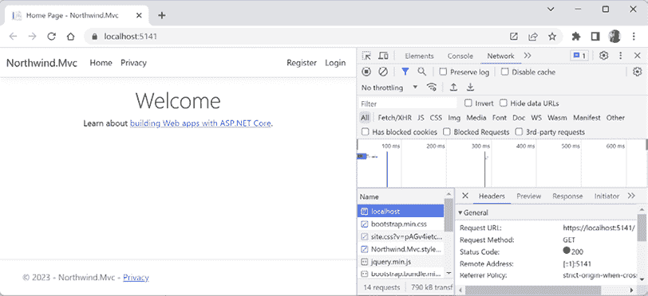

图 14.1：ASP.NET Core MVC 项目模板网站主页

## 理解访客注册

默认情况下，密码必须至少包含一个非字母数字字符，至少一个数字（0-9），以及至少一个大写字母（A-Z）。在这种情况下，我使用`Pa$$w0rd`进行探索。

MVC 项目模板遵循**双重确认**（**DOI**）的最佳实践，这意味着在填写电子邮件地址和密码进行注册后，会向该电子邮件地址发送一封电子邮件，访客必须点击该电子邮件中的链接以确认他们想要注册。

我们尚未配置电子邮件提供商来发送该电子邮件，因此我们必须模拟这一步骤：

1.  关闭**开发者工具**面板。

1.  在顶部导航菜单中，点击**注册**。

1.  输入电子邮件和密码，然后点击**注册**按钮。（我使用了`test@example.com`和`Pa$$w0rd`。）

1.  点击带有文本**点击此处确认您的账户**的链接，并注意您被重定向到一个可以定制的**确认电子邮件**网页。

1.  在顶部导航菜单中，点击**登录**，输入您的电子邮件地址和密码（注意，有一个可选的复选框用于记住您，如果访客忘记了密码或想注册为新访客，则还有链接），然后点击**登录**按钮。

1.  点击顶部导航菜单中的您的电子邮件地址。这将导航到一个账户管理页面。注意，您可以设置电话号码，更改电子邮件地址，更改密码，启用双因素认证（如果您添加了认证器应用程序），以及下载和删除您的个人数据。最后一个功能对于符合欧洲 GDPR 等法律法规很有用。

1.  关闭 Chrome，然后在 MVC 网站的命令提示符或终端中，按*Ctrl* + *C*干净地关闭 Web 服务器。

## 查看 MVC 网站项目结构

在您的代码编辑器中，在 Visual Studio 2022 **解决方案资源管理器**（打开**显示所有文件**）或 Visual Studio Code **资源管理器 – 解决方案资源管理器**中，查看 MVC 网站项目的结构，如图 14.2 所示：

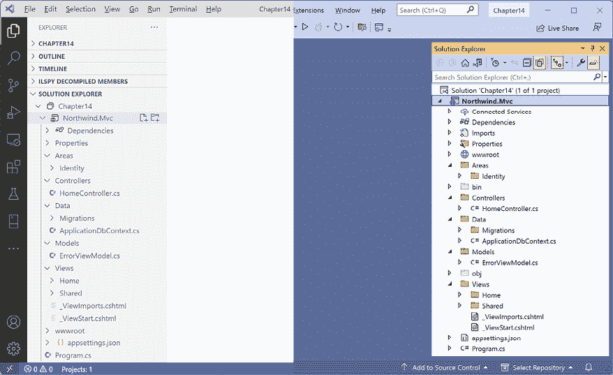

图 14.2：VS Code 和 VS 2022 解决方案资源管理器中的 ASP.NET Core MVC 项目

我们将在稍后更详细地查看这些部分，但就目前而言，请注意以下内容：

+   `Areas`：此文件夹包含用于将您的网站项目与 ASP.NET Core Identity 集成的嵌套文件夹和文件，该 Identity 用于身份验证。

+   `bin`、`obj`：这些文件夹包含在构建过程中需要的临时文件和项目的编译程序集。Visual Studio Code + C# Dev Kit 的解决方案资源管理器不显示此类隐藏文件夹，但您可以在文件夹视图中看到它们（在 *图 14.2* 中标记为 **CHAPTER14**）。

+   `Controllers`：此文件夹包含具有方法（称为操作）的 C# 类，这些方法获取模型并将其传递到视图中，例如 `HomeController.cs`。

+   `Data`：此文件夹包含 ASP.NET Core Identity 系统使用的 Entity Framework Core 迁移类，用于提供身份验证和授权的数据存储，例如 `ApplicationDbContext.cs`。

+   `Models`：此文件夹包含代表由控制器收集并传递到视图的所有数据的 C# 类，例如 `ErrorViewModel.cs`。

+   `Properties`：此文件夹包含一个用于在开发期间启动网站的 Kestrel（或 Windows 上的 IIS 或 IIS Express）配置文件，名为 `launchSettings.json`。此文件仅在本地开发机器上使用，不会部署到您的生产网站。

+   `Views`：此文件夹包含将 HTML 和 C# 代码结合在一起以动态生成 HTML 响应的 `.cshtml` Razor 文件。`_ViewStart.cshtml` 文件设置默认布局，`_ViewImports.cshtml` 导入所有视图中使用的通用命名空间，如标签助手：

    +   `Home`：此子文件夹包含用于主页和隐私页面的 Razor 文件。

    +   `Shared`：此子文件夹包含用于共享布局、错误页面和两个用于登录和验证脚本的局部视图的 Razor 文件。

+   `wwwroot`：此文件夹包含网站使用的静态内容，例如用于样式的 CSS、JavaScript 库、此网站项目的 JavaScript 和 `favicon.ico` 文件。您还可以在此处放置图像和其他静态文件资源，如 PDF 文档。项目模板包括 Bootstrap 和 jQuery 库。

+   `appsettings.json` 和 `appsettings.Development.json`：这些文件包含在运行时网站可以加载的设置，例如，ASP.NET Core Identity 系统的数据库连接字符串和日志级别。

+   `Northwind.Mvc.csproj`：此文件包含项目设置，例如使用 Web .NET SDK、SQLite 的条目以确保 `app.db` 文件被复制到网站的输出文件夹，以及项目所需的 NuGet 包列表，例如为所选数据库提供程序提供的 EF Core，包括：

    +   `Microsoft.AspNetCore.Diagnostics.EntityFrameworkCore`

    +   `Microsoft.AspNetCore.Identity.EntityFrameworkCore`

    +   `Microsoft.AspNetCore.Identity.UI`

    +   `Microsoft.EntityFrameworkCore.Sqlite` 或 `Microsoft.EntityFrameworkCore.SqlServer`

    +   `Microsoft.EntityFrameworkCore.Tools`

+   `Program.cs`：此文件定义了一个自动生成的`Program`类，其中包含`<Main>$`入口点。它构建了一个处理传入 HTTP 请求的管道，并使用默认选项（如配置 Kestrel Web 服务器和加载`appsettings`）托管网站。它添加并配置了网站需要的服务，例如，用于身份验证的 ASP.NET Core Identity，用于身份数据存储的 SQLite 或 SQL Server 等，以及为你的应用程序的路由。

    如果你选择使用 SQLite 而不是 SQL Server 作为 ASP.NET Core Identity 数据库，那么你也会看到一个名为`app.db`的文件。这是存储已注册访客的 SQLite 数据库。

## 引用 EF Core 类库并注册数据上下文

我们将参考你在**第三章**中创建的 EF Core 模型，即**使用 EF Core 为 SQL Server 构建实体模型**：

1.  在`Northwind.Mvc.csproj`项目文件中，将警告视为错误，并将对 Northwind 数据库上下文项目的项目引用添加到项目中，如下面的标记所示：

    ```cs
    <ItemGroup>
      <ProjectReference Include="..\..\Chapter03\Northwind.Common.DataContext
    .SqlServer\Northwind.Common.DataContext.SqlServer.csproj" />
    </ItemGroup> 
    ```

    `Include`路径不能有换行符。

1.  在命令提示符或终端中，构建`Northwind.Mvc`项目，如下面的命令所示：`dotnet build`。

1.  在`Program.cs`中，导入命名空间以使用`AddNorthwindContext`扩展方法，如下面的代码所示：

    ```cs
    using Northwind.EntityModels; // To use AddNorthwindContext method. 
    ```

1.  在添加服务到容器的作用域中，添加一个将`NorthwindContext`注册为服务的语句，如下面的代码所示：

    ```cs
    builder.Services.AddNorthwindContext(); 
    ```

# 使用 Razor 视图定义 Web 用户界面

让我们回顾一下如何在现代 ASP.NET Core MVC 网站中构建网页的用户界面。

## 理解 Razor 视图

在 MVC 中，V 代表**视图**。视图的职责是将模型转换为 HTML 或其他格式。

有多个**视图引擎**可以用来做这件事。默认视图引擎称为**Razor**，它使用`@`符号来指示服务器端代码执行。

让我们回顾主页视图以及它是如何使用共享布局的：

1.  在`Views/Home`文件夹中，打开`Index.cshtml`文件，注意被`@{ }`包裹的 C#代码块。这将首先执行，可以用来存储需要传递到共享布局文件中的数据，例如网页的标题，如下面的代码所示：

    ```cs
    @{
      ViewData["Title"] = "Home Page";
    } 
    ```

1.  注意`<div>`元素中使用的静态 HTML 内容，它使用了 Bootstrap 类如`text-center`和`display-4`进行样式化，如下面的标记所示：

    ```cs
    <div class="text-center">
      <h1 class="display-4">Welcome</h1>
      <p>Learn about <a href="https://learn.microsoft.com/aspnet/core">building Web apps with ASP.NET Core</a>.</p>
    </div> 
    ```

1.  在`Views`文件夹中，打开`_ViewImports.cshtml`文件，注意它导入了项目命名空间和项目`Models`文件夹的命名空间，然后添加了 ASP.NET Core Tag Helpers，我们将在本章后面了解更多关于它们的信息，如下面的代码所示：

    ```cs
    @using Northwind.Mvc 
    @using Northwind.Mvc.Models
    @addTagHelper *, Microsoft.AspNetCore.Mvc.TagHelpers 
    ```

1.  在 `Views` 文件夹中，打开 `_ViewStart.cshtml` 文件。它在控制器类中调用 `View` 方法时执行。它用于设置适用于所有视图的默认值。例如，注意它将所有视图的 `Layout` 属性设置为共享布局文件（不带文件扩展名），如下所示：

    ```cs
    @{
      Layout = "_Layout";
    } 
    ```

    当渲染部分视图时，例如调用 `PartialView` 方法而不是 `View` 方法时，此文件不会执行。

1.  在 `Shared` 文件夹中，打开 `_Layout.cshtml` 文件。

1.  注意 `<title>` 是从之前在 `Index.cshtml` 视图中设置的 `ViewData` 字典中设置的，如下所示：

    ```cs
    <title>@ViewData["Title"] – Northwind.Mvc</title> 
    ```

    标题显示在当前页面的浏览器标签或浏览器窗口中。

1.  注意支持 Bootstrap 和网站样式的链接渲染，其中 `~` 表示项目中的 `wwwroot` 文件夹，如下所示：

    ```cs
    <link rel="stylesheet" 
          href="~/lib/bootstrap/dist/css/bootstrap.min.css" />
    <link rel="stylesheet" href="~/css/site.css" asp-append-version="true" />
    <link rel="stylesheet" href="~/Northwind.Mvc.styles.css" 
          asp-append-version="true" /> 
    ```

1.  注意在页眉中渲染导航栏，如下所示：

    ```cs
    <body>
      <header>
        <nav class="navbar ..."> 
    ```

1.  注意渲染一个包含名为 `_LoginPartial` 的部分视图的可折叠 `<div>`，用于登录，以及允许用户使用具有 `asp-controller` 和 `asp-action` 等属性的 ASP.NET Core 标签助手在页面之间导航的超链接，如下所示：

    ```cs
    <div class="navbar-collapse collapse d-sm-inline-flex
                justify-content-between">
      <ul class="navbar-nav flex-grow-1">
        <li class="nav-item">
          <a class="nav-link text-dark" asp-area=""
            asp-controller="Home" asp-action="Index">Home</a>
        </li>
        <li class="nav-item">
          <a class="nav-link text-dark" asp-area="" 
            asp-controller="Home" asp-action="Privacy">Privacy</a>
        </li>
      </ul>
      <partial name="_LoginPartial" />
    </div> 
    ```

    `<a>` 元素使用名为 `asp-controller` 和 `asp-action` 的标签助手属性来指定当点击链接时将执行的控制器名称和操作名称。可以使用 `asp-area` 属性对大型、复杂的 MVC 网站中的页面进行组织和分组。如果您想导航到 Razor 类库中的功能，则也可以使用 `asp-area` 来指定功能名称。

1.  注意在 `<main>` 元素内渲染的主体，如下所示：

    ```cs
    <div class="container">
      <main role="main" class="pb-3">
        @RenderBody()
      </main>
    </div> 
    ```

    `RenderBody` 方法在该点注入特定 Razor 视图的内容，例如 `Index.cshtml` 文件在共享布局中的内容。

1.  注意在页面底部渲染 `<script>` 元素，以避免减慢页面显示速度，并且可以将自己的脚本块添加到名为 `Scripts` 的可选定义部分中，如下所示：

    ```cs
    <script src="img/jquery.min.js"></script>
    <script src="img/bootstrap.bundle.min.js">
    </script>
    <script src="img/site.js" asp-append-version="true"></script> 
    @await RenderSectionAsync("Scripts", required: false) 
    ```

1.  在 `Shared` 文件夹中，打开 `_LoginPartial.cshtml` 文件，并注意 `if` 语句，如果访问者已登录，则渲染指向其账户和注销的链接，或者如果他们未登录，则渲染指向注册或登录的链接。

1.  在 `Shared` 文件夹中，打开 `_ValidationScriptsPartial.cshtml` 文件，并注意它包含两个脚本块，用于通过 JavaScript 在客户端浏览器中添加验证，如下所示：

    ```cs
    <script src="img/jquery.validate.min.js"></script>
    <script src="img/jquery.validate.unobtrusive.min.js"></script> 
    ```

    **良好实践**：如果您想在像 `Index.cshtml` 这样的 Razor 视图中启用验证，则需要将此部分视图添加到 `Scripts` 部分中，如下所示：

    ```cs
    @section Scripts {
      <partial name="_ValidationScriptsPartial" />
    } 
    ```

1.  在 `Shared` 文件夹中，打开 `Error.cshtml` 文件，并注意它包含用于渲染异常的标记。

## 使用 Bootstrap 进行原型设计

Bootstrap 是构建响应式、移动优先网站的世界最流行框架。它结合 CSS 样式表和 JavaScript 库来实现其功能。

它是原型化网站用户界面的好选择，尽管在公开之前你可能需要雇佣一个网页设计师来构建定制的 Bootstrap 主题或用完全定制的 CSS 样式表替换它，以给你的网站带来独特的品牌。

Bootstrap 就像 Marmite。一些开发者喜欢它；一些则讨厌它。

使用 Bootstrap 的合理理由包括：

+   它节省了时间。

+   它是可定制的。

+   它是开源的。

+   它有官方的详细文档，并在像 Stack Overflow 这样的网站上有很多关于它的答案。

但如果不加注意地实现 Bootstrap，会有以下负面影响：

+   你的网站看起来会很普通。

+   Bootstrap 主题与 ASP.NET Core Identity 内置的默认视图不太兼容。

+   与手工制作的解决方案相比，它较重。

在本书的前一版中，我包括了大约五页的内容，回顾了 Bootstrap 最常用的功能。但 Bootstrap 不是.NET，第二版已经内容满满，所以我将 Bootstrap 内容移到了在线资源部分。你可以在以下链接中阅读它：[`github.com/markjprice/apps-services-net8/blob/main/docs/ch14-bootstrap.md`](https://github.com/markjprice/apps-services-net8/blob/main/docs/ch14-bootstrap.md)。

**良好实践**：除了定义自己的样式外，基于实现响应式设计的通用库，如 Bootstrap，来构建样式。然而，如果你正在构建一个需要独特身份或品牌的网站，请确保使用 Bootstrap 的主题支持。不要只是接受默认设置。

## 理解 Razor 语法和表达式

在我们自定义主页视图之前，让我们回顾一个示例 Razor 文件。该文件有一个初始的 Razor 代码块，它实例化了一个带有价格和数量的订单，然后在网页上输出订单信息，如下面的标记所示：

```cs
@{
  Order order = new()
  {
    OrderId = 123,
    Product = "Sushi",
    Price = 8.49M,
    Quantity = 3
  };
}
<div>Your order for @order.Quantity of @order.Product has a total cost of $@ order.Price * @order.Quantity</div> 
```

前面的 Razor 文件会导致以下不正确的输出：

```cs
Your order for 3 of Sushi has a total cost of $8.49 * 3 
```

尽管 Razor 标记可以采用`@object.property`语法包含任何单个属性的值，但你应该将表达式放在括号中，如下面的标记所示：

```cs
<div>Your order for @order.Quantity of @order.Product has a total cost of $@ (order.Price * order.Quantity)</div> 
```

前面的 Razor 表达式会产生以下正确的输出：

```cs
Your order for 3 of Sushi has a total cost of $25.47 
```

## 理解 HTML Helper 方法

当为 ASP.NET Core MVC 创建视图时，你可以使用`Html`对象及其方法来生成标记。当微软在 2009 年首次引入 ASP.NET MVC 时，这些 HTML Helper 方法是通过编程渲染 HTML 的方式。

现代 ASP.NET Core 保留了这些 HTML Helper 方法以实现向后兼容性，并提供了标签助手，在大多数情况下它们通常更容易阅读和编写。但有一些明显的情况中标签助手不能使用，比如在 Razor 组件中。

你将在本章后面学习到标签助手。

一些有用的`Html`对象方法包括以下内容：

+   `ActionLink`: 使用此功能来生成一个包含指定控制器和动作的 URL 路径的锚点`<a>`元素。例如，`Html.ActionLink(linkText: "绑定", actionName: "ModelBinding", controllerName: "Home")`将生成`<a href="/home/modelbinding">绑定</a>`。

+   `AntiForgeryToken`: 在`<form>`中使用此功能来插入一个包含抗伪造令牌的`<hidden>`元素，该令牌在表单提交时可以进行验证。

+   `Display`和`DisplayFor`: 使用此功能来生成相对于当前模型的表达式的 HTML 标记，使用显示模板。对于.NET 类型有内置的显示模板，可以在`DisplayTemplates`文件夹中创建自定义模板。在大小写敏感的文件系统中，文件夹名称是大小写敏感的。

+   `DisplayForModel`: 使用此功能来生成整个模型的 HTML 标记，而不是单个表达式。

+   `Editor`和`EditorFor`: 使用此功能来生成相对于当前模型的表达式的 HTML 标记，使用编辑模板。对于.NET 类型有内置的编辑模板，使用`<label>`和`<input>`元素，可以在`EditorTemplates`文件夹中创建自定义模板。在大小写敏感的文件系统中，文件夹名称是大小写敏感的。

+   `EditorForModel`: 使用此功能来生成整个模型的 HTML 标记，而不是单个表达式。

+   `Encode`: 使用此功能来安全地将对象或字符串编码为 HTML。例如，字符串值`"<script>"`将被编码为`"&lt;script&gt;"`。这通常不是必需的，因为 Razor 的`@`符号默认会编码字符串值。

+   `Raw`: 使用此功能来渲染一个字符串值，*不*进行 HTML 编码。

+   `PartialAsync`和`RenderPartialAsync`: 使用这些功能来生成部分视图的 HTML 标记。您可以可选地传递模型和视图数据。

## 定义一个强类型 Razor 视图

为了在编写视图时提高 IntelliSense，您可以使用顶部的`@model`指令来定义视图可以期望的类型。让我们修改主页以显示来自 Northwind 数据库的订单表：

1.  在`Controllers`文件夹中，在`HomeController.cs`中，导入 Northwind 实体模型和 EF Core 功能的命名空间，如下所示，代码中已突出显示：

    ```cs
    using Northwind.EntityModels; // To use Northwind entity models.
    using Microsoft.EntityFrameworkCore; // To use Include method. 
    ```

1.  在控制器类中，定义一个字段来存储 Northwind 数据上下文，并在构造函数中设置它，如下所示，代码中已突出显示：

    ```cs
    **private****readonly** **NorthwindContext _db;**
    public HomeController(ILogger<HomeController> logger
      **, NorthwindContext db**)
    {
      _logger = logger;
     **_db = db;**
    } 
    ```

1.  在`Index`动作方法中，添加语句来创建一个包含所有订单及其相关订单详情的视图模型，如下所示，代码中已突出显示：

    ```cs
    public IActionResult Index()
    {
     **IEnumerable<Order> model = _db.Orders**
     **.Include(order => order.Customer)**
     **.Include(order => order.OrderDetails)**
     **.OrderByDescending(order => order.OrderDetails**
     **.Sum(detail => detail.Quantity * detail.UnitPrice))**
     **.AsEnumerable();**
      return View(**model**);
    } 
    ```

1.  在`Views`文件夹中，在`_ViewImports.cshtml`中，添加一个语句来导入所有 Razor 视图和页面的 EF Core 实体模型，如下所示，代码中已突出显示：

    ```cs
    @using Northwind.EntityModels 
    ```

1.  在`Views\Home`文件夹中，在`Index.cshtml`文件顶部，添加一个语句来设置要使用的模型类型为订单集合，如下所示，代码中已突出显示：

    ```cs
    @model IEnumerable<Order> 
    ```

    现在，每次我们在视图中键入 `Model` 时，我们的代码编辑器都将知道模型的正确类型，并提供智能感知。

    在视图中输入代码时，请记住以下事项：

    +   使用 `@model`（带小写 `m`）声明模型类型。

    +   使用 `@Model`（带大写 `M`）与模型实例交互。

1.  在 `Index.cshtml` 中，在初始 Razor 代码块中，将现有内容替换为以下标记中的订单 HTML 表格：

    ```cs
    @model IEnumerable<Order>
    @{
      ViewData["Title"] = "Orders";
    }
    <div class="text-center">
      <h1 class="display-4">@ViewData["Title"]</h1>
      <table class="table table-bordered table-striped">
        <thead>
          <tr>
            <th>Order ID</th>
            <th>Order Date</th>
            <th>Company Name</th>
            <th>Country</th>
            <th>Item Count</th>
            <th>Order Total</th>
          </tr>
        </thead>
        <tbody>
          @foreach (Order order in Model)
          {
            <tr>
              <td>@order.OrderId</td>
              <td>@order.OrderDate?.ToString("D")</td>
              <td>@order.Customer?.CompanyName</td>
              <td>@order.Customer?.Country</td>
              <td>@order.OrderDetails.Count()</td>
              <td>@order.OrderDetails.Sum(detail => detail.Quantity * detail.UnitPrice).ToString("C")</td>
            </tr>
          }
        </tbody>
      </table>
    </div> 
    ```

    让我们看看我们自定义的主页的结果：

1.  如果你的数据库服务器没有运行，例如，因为你正在 Docker、虚拟机或云中托管它，那么请确保启动它。

1.  不带调试启动 `Northwind.Mvc` 网站项目。

1.  注意，主页现在显示了一个订单表，其中显示价值最高的订单在最前面，如图 *14.3* 所示：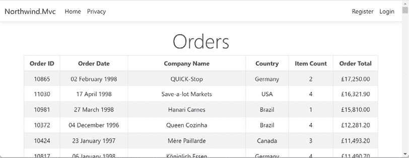

    图 14.3：更新后的 Northwind MVC 网站主页

    我在我的本地笔记本电脑上运行我的 web 服务器，其操作系统 Windows 11 已配置为使用英国文化来格式化日期、时间和货币值。接下来，我们将看到如何为访客的首选文化本地化网页。

1.  关闭 Chrome 并关闭 web 服务器。

现在，你已经提醒了如何构建一个基本的 MVC 网站来显示数据，让我们看看在构建万维网网站时经常被忽视的一个重要中级主题：支持世界上所有的语言和文化。

# 使用 ASP.NET Core 本地化和全球化

在 *第七章*，*处理日期、时间和国际化*中，你学习了如何处理日期、时间和时区，以及如何全球化本地化 .NET 代码库。

在本节中，我们将具体探讨如何本地化使用 ASP.NET Core 的网站。

除了使用 `IStringLocalizer` 将 `string` 值本地化为法语和西班牙语等语言外，你还可以使用 `IHtmlLocalizer` 本地化 HTML 内容，但应谨慎使用。通常，HTML 标记应适用于所有区域。对于视图，你可以使用 `IViewLocalizer`。

**请求本地化**意味着浏览器可以通过以下方式请求它偏好的文化：

+   添加一个查询字符串参数，例如，`?culture=en-US&ui-culture=en-US`。

+   在请求中发送一个 cookie，例如，`c=en-US|uic=en-US`。

+   设置一个 HTTP 头，例如，`Accept-Language: en-US,en;q=0.9,fr-FR;q=0.8,fr;q=0.7,en-GB;q=0.6`。

要启用请求本地化，请在 `Program.cs` 中配置 HTTP 请求管道时调用 `UseRequestLocalization` 方法。这告诉 ASP.NET Core 查找这些请求，并自动将处理该请求的当前线程（仅此请求，不涉及其他人的请求）更改为使用适当的语言文化来格式化数据和加载资源值。

让我们创建一些资源文件，将网络用户界面本地化为美国英语、英国英语和法语，然后全球化数据，如日期和货币值：

1.  在 `Northwind.Mvc` 项目中，添加一个名为 `Resources` 的新文件夹。这是本地化服务默认查找 `*.resx` 资源文件的文件夹名称。

1.  在 `Resources` 中添加一个名为 `Views` 的新文件夹。

1.  在 `Views` 中添加一个名为 `Home` 的新文件夹。

## 创建资源文件

创建资源文件 (`*.resx`) 的方式取决于您的代码编辑器。

为了节省时间，您可以直接从以下链接中找到的 GitHub 仓库复制 `.resx` 文件：[`github.com/markjprice/apps-services-net8/tree/main/code/Chapter14/Northwind.Mvc/Resources/Views/Home`](https://github.com/markjprice/apps-services-net8/tree/main/code/Chapter14/Northwind.Mvc/Resources/Views/Home)。

### 如果您正在使用 Visual Studio 2022

您可以使用特殊的项目项类型和编辑器：

1.  在 `Home` 中添加一个名为 `Index.en-US.resx` 的 **资源文件** 类型。

1.  使用编辑器定义名称和值，如图 *14.4* 所示：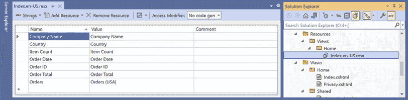

    图 14.4：使用资源文件编辑器定义本地化标签

    JetBrains Rider 有自己的资源文件编辑器，它将所有 `.resx` 文件合并为一个网格体验。每种语言都有自己的列，并排显示。这比在 Visual Studio 2022 中逐个编辑每个文件要更有用得多。

1.  关闭编辑器。

1.  复制并粘贴文件，并将其重命名为 `Index.en-GB.resx`。

    **警告！** 您不得更改 **名称** 列中的任何条目，因为这些条目用于查找所有语言的本地化值！您只能更改 **值** 或 **注释** 列中的条目。

1.  在 `Index.en-GB.resx` 中，将 `Orders (USA)` 修改为 `Orders (UK)`。这样我们可以看到差异。

1.  关闭编辑器。

1.  复制并粘贴文件，并将其重命名为 `Index.fr-FR.resx`。

1.  在 `Index.fr-FR.resx` 中，修改 `值` 列以使用法语。（有关 Visual Studio Code 中翻译的逐步说明，请参阅下一节。）

1.  复制并粘贴文件，并将其重命名为 `Index.fr.resx`。

1.  在 `Index.fr.resx` 中，将最后一个值修改为 `Commandes (Neutral French)`。

### 如果您正在使用 Visual Studio Code

您将不得不在没有特殊编辑器的情况下编辑文件：

1.  在 `Home` 中添加一个名为 `Index.en-US.resx` 的新文件。

1.  修改内容以包含美国英语语言资源，如下所示：

    ```cs
    <?xml version="1.0" encoding="utf-8"?>
    <root>
      <data name="Company Name" xml:space="preserve">
        <value>Company Name</value>
      </data>
      <data name="Country" xml:space="preserve">
        <value>Country</value>
      </data>
      <data name="Item Count" xml:space="preserve">
        <value>Item Count</value>
      </data>
      <data name="Order Date" xml:space="preserve">
        <value>Order Date</value>
      </data>
      <data name="Order ID" xml:space="preserve">
        <value>Order ID</value>
      </data>
      <data name="Order Total" xml:space="preserve">
        <value>Order Total</value>
      </data>
      <data name="Orders" xml:space="preserve">
        <value>Orders (USA)</value>
      </data>
    </root> 
    ```

1.  复制并粘贴文件，并将其重命名为 `Index.en-GB.resx`。

1.  在 `Index.en-GB.resx` 中，将 `Orders (USA)` 修改为 `Orders (UK)`。这样我们可以看到差异。

1.  复制并粘贴文件，并将其重命名为 `Index.fr-FR.resx`。

1.  在 `Index.fr-FR.resx` 中，将 `值` 列修改为使用法语：

    ```cs
    <?xml version="1.0" encoding="utf-8"?>
    <root>
      <data name="Company Name" xml:space="preserve">
        <value>Nom de l'entreprise</value>
      </data>
      <data name="Country" xml:space="preserve">
        <value>Pays</value>
      </data>
      <data name="Item Count" xml:space="preserve">
        <value>Nombre d'éléments</value>
      </data>
      <data name="Order Date" xml:space="preserve">
        <value>Date de commande</value>
      </data>
      <data name="Order ID" xml:space="preserve">
        <value>Numéro de commande</value>
      </data>
      <data name="Order Total" xml:space="preserve">
        <value>Total de la commande</value>
      </data>
      <data name="Orders" xml:space="preserve">
        <value>Commandes (France)</value>
      </data>
    </root> 
    ```

1.  复制并粘贴文件，并将其重命名为 `Index.fr.resx`。

1.  在 `Index.fr.resx` 中，将最后一个值修改为 `Commandes (Neutral French)`。

## 使用注入视图本地化器本地化 Razor 视图

现在我们可以继续使用这些步骤来设置代码编辑器：

1.  在`Views/Home`文件夹中的`Index.cshtml`中，导入用于本地化的命名空间，注入`IViewLocalizer`服务，并修改使用视图模型中的标签，如下面的标记所示：

    ```cs
    **@using Microsoft.AspNetCore.Mvc.Localization**
    @model IEnumerable<Order>
    **@inject IViewLocalizer Localizer**
    @{
      ViewData["Title"] = **Localizer[****"Orders"****]**;
    }
    <div class="text-center">
      <h1 class="display-4">@ViewData["Title"]</h1>
      <table class="table table-bordered table-striped">
        <thead>
          <tr>
            <th>@**Localizer[****"Order ID"****]**</th>
            <th>@**Localizer[****"Order Date"****]**</th>
            <th>@**Localizer[****"Company Name"****]**</th>
            <th>@**Localizer[****"Country"****]**</th>
            <th>@**Localizer[****"Item Count"****]**</th>
            <th>@**Localizer[****"Order Total"****]**</th>
          </tr>
        </thead> 
    ```

    **良好实践**：像`"订单 ID"`这样的关键值用于查找本地化值。如果缺少值，则默认返回键。因此，使用也作为良好回退的键是一个好习惯。这就是为什么我在上面的`.resx`文件中使用带有空格的美国英语正确标题作为键的原因。

1.  在`Program.cs`中，在调用`AddControllersWithViews`之前，添加一个语句来添加本地化并设置查找资源文件的路径为`Resources`文件夹，并在调用`AddControllersWithViews`之后，添加一个调用以添加视图本地化，如下面的代码所示：

    ```cs
    **builder.Services.AddLocalization(**
     **options => options.ResourcesPath =** **"Resources"****);**
    builder.Services.AddControllersWithViews()
      **.AddViewLocalization()**; 
    ```

1.  在`Program.cs`中，在调用`Build`方法后的`app`对象中，添加声明我们将支持的四种文化的语句：美国英语、英国英语、中性的法语和法国法语。然后，创建一个新的本地化选项对象，并将这些文化添加为支持本地化用户界面（`UICultures`）和数据值（如日期和货币）的全局化（`Cultures`），如下面的代码所示：

    ```cs
    string[] cultures = { "en-US", "en-GB", "fr", "fr-FR" };
    RequestLocalizationOptions localizationOptions = new();
    // cultures[0] will be "en-US"
    localizationOptions.SetDefaultCulture(cultures[0])
      // Set globalization of data formats like dates and currencies.
      .AddSupportedCultures(cultures)
      // Set localization of user interface text.
      .AddSupportedUICultures(cultures);
    app.UseRequestLocalization(localizationOptions); 
    ```

1.  启动`Northwind.Mvc`网站项目。

1.  在 Chrome 中，导航到**设置**。

1.  在**搜索设置**框中输入`lang`，注意您将找到**首选语言**部分，如图 14.5 所示：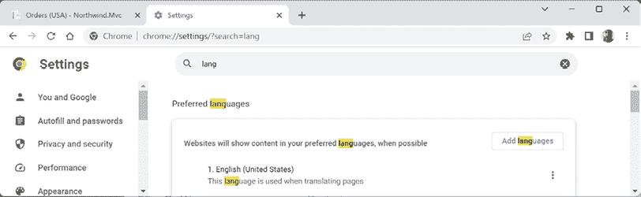

    图 14.5：在 Chrome 设置中搜索首选语言部分

    **警告！**如果您正在使用本地化的 Chrome 版本，换句话说，其用户界面是您的本地语言，如法语，那么您需要用您的本地语言搜索“语言”这个词。（尽管法语中的“语言”是“langue”，所以输入“lang”仍然可以工作。但在西班牙语中，您需要搜索“idioma”。）

1.  点击**添加语言**，搜索`french`，选择**法语 - francais**和**法语（法国） – francais (France)**，然后点击**添加**。

    **警告！**如果您正在使用本地化的 Chrome 版本，那么您需要用您的本地语言搜索“法语”。例如，在西班牙语中，它将是“Francés”，在威尔士语中，它将是“Ffrangeg”。

1.  如果列表中还没有，请添加**英语（美国）**和**英语（英国）**。

1.  在**法语（法国）**右侧的省略号**…**菜单中，点击**移动到顶部**，并确认它位于您语言列表的顶部。

1.  关闭**设置**标签页。

1.  在 Chrome 中，执行强制重新加载/刷新（例如，按住*Ctrl*并点击**刷新**按钮），并注意现在主页现在使用本地化标签和日期及货币的法国格式，如图 14.6 所示：

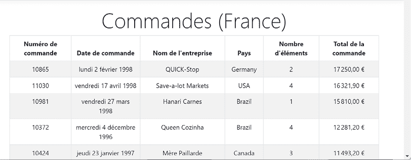

图 14.6：将订单表本地化和全球化到法国的法语

1.  对其他语言重复上述步骤，例如，**英语（英国）**。

1.  查看 **开发者工具**，并注意请求头部已设置英国英语（`en-GB`）为首选，如图 *14.7* 所示：

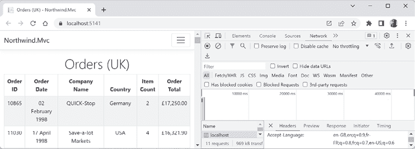

图 14.7：由于 Accept-Language: en-GB 头部信息，订单被本地化和全球化为英国英语

1.  关闭浏览器并关闭网络服务器。

## 理解 Accept-Language 头部信息

你可能会想知道 `Accept-Language` 头部信息是如何工作的：

```cs
Accept-Language: en-US,en;q=0.9,fr-FR;q=0.8,fr;q=0.7,en-GB;q=0.6 
```

`Accept-Language` 头部信息使用逗号作为文化代码之间的分隔符。每个文化代码可以是中性的（仅语言）或特定的（语言和区域），每个都可以有一个 **质量值** (`q`)，介于 0.0 和 1.0 之间（默认）。因此，前面的 `Accept-Language` 头部信息示例应如下阅读：

+   `en-US`: 美国英语语言，排名第一，为 1.0（如果未显式设置 `q`）。

+   `en;q=0.9`: 世界各地英语语言，排名为 0.9。

+   `fr-FR;q=0.8`: 法国法语语言，排名为 0.8。

+   `fr;q=0.7`: 世界各地法语语言，排名为 0.7。

+   `en-GB;q=0.6`: 英国英语语言，排名最低，为 0.6。

# 使用标签助手定义网络用户界面

**标签助手**使使 HTML 元素动态化变得更容易。标记更干净，更容易阅读、编辑和维护，比使用 HTML 助手更好。

然而，标签助手并不能完全替代 HTML 助手，因为有些事情只能通过 HTML 助手实现，比如渲染包含多个嵌套标签的输出。标签助手也不能在 Razor 组件中使用。因此，你必须学习 HTML 助手，并将标签助手视为一种可选的选择，在某些场景下可能更好。

标签助手对于主要使用 HTML、CSS 和 JavaScript 的前端（FE）开发者特别有用，因为前端开发者不需要学习 C# 语法。标签助手仅使用看起来像正常 HTML 属性的元素。如果您的代码编辑器支持，您还可以从 IntelliSense 中选择属性名称和值；Visual Studio 2022 和 Visual Studio Code 都支持。

## 比较 HTML 助手和标签助手

例如，要渲染一个可链接的超链接到控制器操作，你可以使用一个 HTML 助手方法，如下面的标记所示：

```cs
@Html.ActionLink("View our privacy policy.", "Privacy", "Index") 
```

为了更清楚地说明其工作原理，你可以使用命名参数，如下面的代码所示：

```cs
@Html.ActionLink(linkText: "View our privacy policy.", 
  action: "Privacy", controller: "Index") 
```

但是，对于更擅长 HTML 而不是 C# 的人来说，使用标签助手会更清晰、更简洁，如下面的标记所示：

```cs
<a asp-action="Privacy" asp-controller="Home">View our privacy policy.</a> 
```

上面的所有三个示例都生成相同的渲染 HTML 元素，如下面的标记所示：

```cs
<a href="/home/privacy">View our privacy policy.</a> 
```

在接下来的几节中，我们将回顾一些更常见的标签助手：

+   锚点标签助手

+   缓存标签助手

+   环境标签助手

+   图片标签助手

+   与表单相关的标签助手

## 探索锚点标签助手

首先，我们将创建三个可点击的按钮样式的超链接，以查看包含所有订单的首页、单个客户的订单以及单个国家的订单。这将使我们能够看到创建链接到控制器和操作的基本方法，以及使用路由参数和任意查询字符串参数传递参数。

让我们探索这些 Anchor Tag Helper 的示例：

1.  在 `Views` 文件夹中，在 `_ViewImports.cshtml` 文件中，注意 `@addTagHelper` 指令，它添加了 ASP.NET Core Tag Helper，如下所示，高亮显示的代码：

    ```cs
    @using Northwind.Mvc 
    @using Northwind.Mvc.Models
    **@addTagHelper *, Microsoft.AspNetCore.Mvc.TagHelpers**
    @using Northwind.EntityModels 
    ```

    你可以创建自己的 Tag Helper，并且你必须以相同的方式注册它们。但这超出了本书的范围。如果你想了解如何，你可以阅读以下文档：[`learn.microsoft.com/en-us/aspnet/core/mvc/views/tag-helpers/authoring`](https://learn.microsoft.com/en-us/aspnet/core/mvc/views/tag-helpers/authoring)。

1.  在 `Views/Home` 文件夹中，在 `Privacy.cshtml` 文件中，添加标记来定义一个段落，使用 `<a>` 标签创建可点击的按钮样式的超链接，如下所示，高亮显示的标记：

    ```cs
    <p>
      <a asp-controller="Home" asp-action="Index" 
         class="btn btn-primary" role="button">Orders</a>
      <a asp-controller="Home" 
         class="btn btn-outline-primary" role="button">This Page</a>
      <a asp-controller="Home" asp-action="Index" asp-route-id="ALFKI" 
         class="btn btn-outline-primary" role="button">
         Orders for Alfreds Futterkiste</a>
      <a asp-controller="Home" asp-action="Index" asp-route-country="Brazil" 
         class="btn btn-outline-primary" role="button">Orders in Brazil</a>
    </p> 
    ```

    如果你设置了一个没有操作名称的控制器名称，那么它默认为当前操作，在这种情况下，`Privacy`。`asp-route-{parametername}` 属性可以使用任何任意的参数名称。在上面的代码示例中，我们使用了 `id` 和 `country`。`id` 将映射到具有相同名称的路由参数。`country` 不是一个路由参数，所以它将作为查询字符串传递。

1.  在 `Controllers` 文件夹中，在 `HomeController.cs` 文件中，修改 `Index` 动作方法以定义两个可选参数，用于传递客户 ID 和国家名称，然后修改 LINQ 查询以使用它们来过滤订单（如果已设置），如下所示，高亮显示的代码：

    ```cs
    public IActionResult Index(
      **string****? id =** **null****,** **string****? country =** **null**)
    {
      // Start with a simplified initial model.
      IEnumerable<Order> model = db.Orders
        .Include(order => order.Customer)
        .Include(order => order.OrderDetails)**;**
      // Add filtering based on parameters.
    **if** **(id** **is****not****null****)**
     **{**
     **model = model.Where(order => order.Customer?.CustomerId == id);**
     **}**
    **else****if** **(country** **is****not****null****)**
     **{**
     **model = model.Where(order => order.Customer?.Country == country);**
     **}**
      // Add ordering and make enumerable.
     **model = model**
        .OrderByDescending(order => order.OrderDetails
          .Sum(detail => detail.Quantity * detail.UnitPrice))
        .AsEnumerable();
      return View(model);
    } 
    ```

1.  启动 `Northwind.Mvc` 网站项目。

1.  查看 **开发者工具** 并点击 **元素** 选项卡。

1.  在首页上，点击 **隐私** 以导航到该页面，并注意按钮，包括它们的原始 HTML，它显示了由 Anchor Tag Helper 生成的 `href` 属性路径，如图 *14.8* 所示：

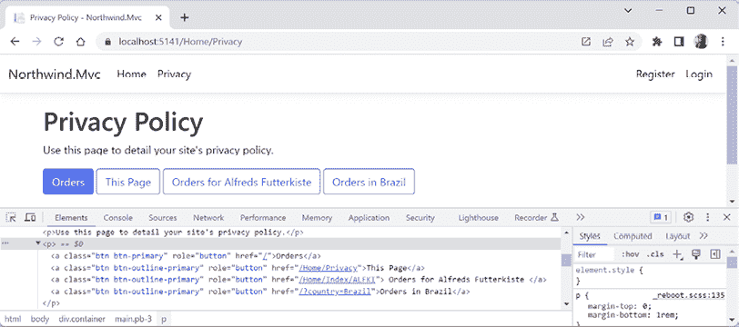

图 14.8：由 Anchor Tag Helper 生成的三个按钮样式的超链接

1.  点击每个按钮，然后返回到 **隐私政策** 页面，以确保它们能正确工作。

1.  关闭浏览器并关闭 web 服务器。

1.  在 `Views/Home` 文件夹中，在 `Index.cshtml` 文件中，在订单表的末尾添加一个锚点标签，以指示订单表的结束，如下所示，高亮显示的标记：

    ```cs
     </table>
    **<****a****id****=****"endOfTable"** **/>**
    </div> 
    ```

1.  在 `Views/Home` 文件夹中，在 `Privacy.cshtml` 文件中，在现有的锚点标签之后，添加另一个标签，通过设置 `asp-fragment` 属性链接到具有 `id` 为 `endOfTable` 的锚点，如下所示，高亮显示的标记：

    ```cs
    <a asp-controller="Home" asp-action="Index" asp-fragment="endOfTable"
       class="btn btn-outline-primary">Orders (end of table)</a> 
    ```

1.  修改第二个锚点标签，明确设置要使用的协议为 `https`，如下所示，高亮显示的标记：

    ```cs
    <a asp-controller="Home" **asp-protocol****=****"https"**
        class="btn btn-outline-primary">This Page</a> 
    ```

1.  在 `Controllers` 文件夹中，在 `HomeController.cs` 文件中，添加一个名为 `Shipper` 的操作方法。给它一个参数来接收一个承运实体，并将其传递给视图，如下面的代码所示：

    ```cs
    public IActionResult Shipper(Shipper shipper)
    {
      return View(shipper);
    } 
    ```

    此操作方法可以响应任何请求方法，例如，`GET` 或 `POST`。使用 `GET` 请求，承运商实体将作为查询字符串键值对传递。使用 `POST` 请求，承运商实体将传递在体中。

1.  在 `Views/Home` 文件夹中，添加一个名为 `Shipper.cshtml` 的空 Razor 视图。

1.  修改内容，如下面的标记所示：

    ```cs
    @model Shipper
    @{
      ViewData["Title"] = "Shippers";
    }
    <h1>@ViewData["Title"]</h1>
    <div>
      <div class="mb-3">
        <label for="shipperIdInput" class="form-label">Shipper Id</label>
        <input type="number" class="form-control" id="shipperIdInput" 
               value="@Model.ShipperId">
      </div>
      <div class="mb-3">
        <label for="companyNameInput" class="form-label">Company Name</label>
        <input class="form-control" id="companyNameInput" 
               value="@Model.CompanyName">
      </div>
      <div class="mb-3">
        <label for="phoneInput" class="form-label">Phone</label>
        <input class="form-control" id="phoneInput" value="@Model.Phone">
      </div>
    </div> 
    ```

1.  在 `Views/Home` 文件夹中，在 `Privacy.cshtml` 文件中，在文件顶部添加代码和标记以注入 Northwind 数据库上下文。然后，使用它来定义一个 Razor 函数，创建一个字典，其键和值都是字符串，并从承运商表填充，如下面的代码所示：

    ```cs
    **@inject NorthwindContext db**
    @{
      ViewData["Title"] = "Privacy Policy";
    }
    **@functions {**
    **public****async** **Task<IDictionary<****string****,** **string****>> GetShipperData()**
     **{**
    **// Find the shipper with ID of 1.**
     **Shipper? shipper =** **await** **db.Shippers.FindAsync(****1****);**
     **Dictionary<****string****,** **string****> keyValuePairs =** **new****();**
    **if** **(shipper !=** **null****)**
     **{**
     **keyValuePairs =** **new****()**
     **{**
     **{** **"ShipperId"****, shipper.ShipperId.ToString() },**
     **{** **"CompanyName"****, shipper.CompanyName },**
     **{** **"Phone"****, shipper.Phone ??** **string****.Empty }**
     **};**
     **}**
    **return** **keyValuePairs;**
     **}**
    **}** 
    ```

1.  在现有的锚点标签之后，添加另一个标签来将字典传递到当前页面，如下面的标记所示：

    ```cs
    <a asp-controller="Home" asp-action="Shipper" 
        asp-all-route-data="await GetShipperData()"
        class="btn btn-outline-primary">Shipper</a> 
    ```

    将复杂对象作为查询字符串传递，如这样，会迅速达到 URL 大约 1,000 个字符的限制。要发送更大的对象，你应该使用 `POST` 而不是 `GET`，通过使用 `<form>` 元素而不是锚点标签 `<a>` 来实现。

1.  如果你的数据库服务器没有运行，例如，因为你正在使用 Docker、虚拟机或云来托管它，那么请确保启动它。

1.  启动 `Northwind.Mvc` 网站项目。

1.  查看 **开发者工具** 并点击 **元素**。

1.  在主页上，点击 **隐私** 以导航到该页面，并注意按钮，包括它们的原始 HTML，它显示了由锚点标签助手生成的 `href` 属性路径，如图 *14.9* 所示：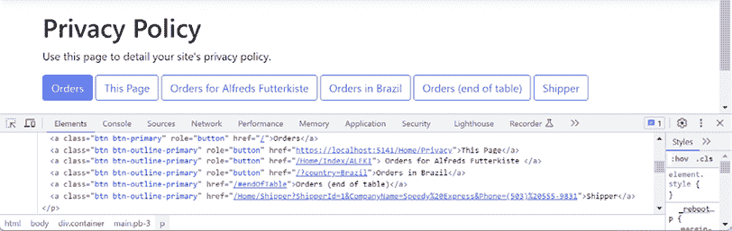

    图 14.9：使用片段和通过查询字符串参数传递复杂对象

    指定协议的一个副作用是生成的 URL 必须包含协议、域名以及任何端口号，以及相对路径，因此这是一种方便的方法来获取绝对 URL 而不是默认的相对路径 URL，如上面第二个链接所示。

1.  点击 **订单（表格末尾）** 按钮，并注意浏览器导航到主页，然后跳转到订单表的末尾。

1.  返回到 **隐私** 页面，点击 **承运商** 按钮，并注意承运商详情已预先输入到承运商表单中。

1.  关闭浏览器并关闭 web 服务器。

## 探索缓存标签助手

缓存和分布式缓存标签助手通过使用内存或注册的分布式缓存提供者分别缓存其内容，从而提高了你的网页性能。我们在 *第九章*，*缓存、队列和弹性后台服务* 中介绍了对这些缓存进行读写操作。现在我们将看到如何将 HTML 片段存储在视图中的。

作为提醒，内存缓存最适合单个 web 服务器或启用了会话亲和力的 web 服务器群。会话亲和力意味着来自同一浏览器的后续请求由同一 web 服务器提供服务。分布式缓存最适合 web 服务器群或在 Azure 等云服务提供商中。你可以注册 SQL Server、Redis 或 NCache 的提供程序，或者创建自己的自定义提供程序。

可以应用于 Cache 标签助手的属性包括：

+   `enabled`: 默认值为 `true`。这存在是为了让你可以在标记中包含 `<cache>` 元素，但可以在运行时决定是否启用它。

+   `expires-after`: 一个 `TimeSpan` 值，用于指定过期时间。默认值为 `00:20:00`，即 20 分钟。

+   `expires-on`: 一个用于过期的 `DateTimeOffset` 值。没有默认值。

+   `expires-sliding`: 一个 `TimeSpan` 值，如果在此时间内没有访问值，则过期。这在存储创建成本高且受欢迎程度不同的数据库实体时很有用。受欢迎的实体如果继续被访问，将保留在缓存中。不受欢迎的实体将退出。没有默认值。

+   `vary-by-{type}`: 这些属性允许基于 HTTP `header` 值、用户、路由、`cookie` 或 `query` 字符串值或自定义值的差异，有多个不同的缓存版本。

让我们看看 Cache 标签助手的示例：

1.  在 `Views/Home` 文件夹中的 `Index.cshtml` 文件中，在标题和表格之间添加 `<div>` 元素，以定义一个包含两个列的 Bootstrap 行，显示当前的 UTC 日期和时间两次，一次是实时，一次是缓存，如下所示的高亮标记：

    ```cs
    <div class="row">
      <div class="col">
        <h2>Live</h2>
        <p class="alert alert-info">
        UTC: @DateTime.UtcNow.ToLongDateString() at 
             @DateTime.UtcNow.ToLongTimeString()
        </p>
      </div>
      <div class="col">
        <h2>Cached</h2>
        <p class="alert alert-secondary">
          <cache>
            UTC: @DateTime.UtcNow.ToLongDateString() at 
                 @DateTime.UtcNow.ToLongTimeString()
          </cache>
        </p>
      </div>
    </div> 
    ```

1.  启动 `Northwind.Mvc` 网站项目。

1.  在几秒钟内多次刷新主页，并注意左侧的时间总是刷新以显示实时时间，而右侧的时间缓存（默认为 20 分钟），如图 *14.10* 所示：

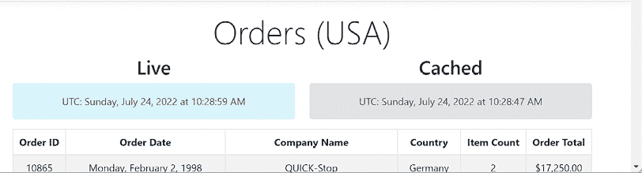

图 14.10：实时和缓存的 UTC 时间

1.  关闭浏览器并关闭 web 服务器。

1.  在 `Views/Home` 文件夹中的 `Index.cshtml` 文件中，将 `<cache>` 元素修改为在 10 秒后过期，如下所示的高亮标记：

    ```cs
    <cache **expires-after=****"@TimeSpan.FromSeconds(10)"**> 
    ```

1.  启动 `Northwind.Mvc` 网站项目。

1.  在几秒钟内多次刷新主页，并注意左侧的时间总是刷新以显示实时时间，而右侧的时间在刷新前缓存了 10 秒。

1.  关闭浏览器并关闭 web 服务器。

## 探索环境标签助手

环境标签助手仅在当前环境与逗号分隔的名称列表中的一个值匹配时才渲染其内容。如果你想在预发布环境中渲染一些内容，如向测试人员提供说明，或者在生产环境中渲染开发人员和测试人员不需要看到的内容，如特定客户的信息，这很有用。

除了设置逗号分隔的环境列表的 `names` 属性外，您还可以使用 `include`（与 `names` 作用相同）和 `exclude`（为除列表中的环境之外的所有环境渲染）。

让我们看看一个例子：

1.  在 `Views/Home` 文件夹中，在 `Privacy.cshtml` 中，注入网络主机环境的依赖服务，如下面的代码所示：

    ```cs
    @inject IWebHostEnvironment webhost 
    ```

1.  在标题之后，添加两个 `<environment>` 元素，第一个仅显示开发人员和测试人员的输出，第二个仅显示产品访客的输出，如下面的标记所示：

    ```cs
    <environment names="Development,Staging">
      <div class="alert alert-warning">
        <h2>Attention developers and testers</h2>
        <p>
          This is a warning that only developers and testers will see.
          Current environment: 
          <span class="badge bg-warning">@webhost.EnvironmentName</span>
        </p>
      </div>
    </environment>
    <environment names="Production">
      <div class="alert alert-info">
        <h2>Welcome, visitor!</h2>
        <p>
          This is information that only a visitor to the production website 
          will see. Current environment: 
          <span class="badge bg-info">@webhost.EnvironmentName</span>
        </p>
      </div>
    </environment> 
    ```

1.  启动 `Northwind.Mvc` 网站项目。

1.  导航到 **隐私** 页面，并注意开发人员和测试人员的消息，如图 *14.11* 所示：

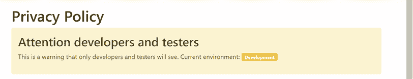

图 14.11：开发环境中的隐私页面

1.  关闭浏览器并关闭网络服务器。

1.  在 `Properties` 文件夹中，在 `launchSettings.json` 中，对于 `https` 配置文件，将环境设置更改为 `Production`，如下面的 JSON 所示高亮显示：

    ```cs
    "https": {
      ...
      "environmentVariables": {
    **"ASPNETCORE_ENVIRONMENT"****:****"Production"**
      }
    }, 
    ```

1.  启动 `Northwind.Mvc` 网站项目。

1.  导航到 **隐私** 页面，并注意公共访客的消息，如图 *14.12* 所示：

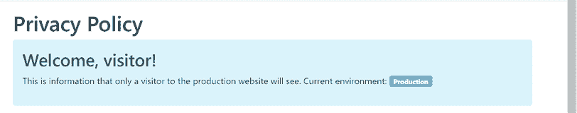

图 14.12：生产环境中的隐私页面

1.  关闭浏览器并关闭网络服务器。

1.  在 `Properties` 文件夹中，在 `launchSettings.json` 中，对于 `https` 配置文件，将环境设置改回 `Development`。

## 理解如何使用标签辅助器进行缓存破坏

当在 `<link>`、`` 或 `<script>` 元素中指定 `asp-append-version` 为 `true` 值时，将调用该标签类型的标签辅助器。

它们通过自动附加一个名为 `v` 的查询字符串值来实现，该值是从引用源文件的 SHA256 哈希中生成的，如下面的示例生成输出所示：

```cs
<script src="img/site.js? v=Kl_dqr9NVtnMdsM2MUg4qthUnWZm5T1fCEimBPWDNgM"></script> 
```

您可以在当前项目中亲自看到这一点，因为 `_Layout.cshtml` 文件具有 `<script src="img/site.js" asp-append-version="true"></script>` 元素。

如果 `site.js` 文件中的任何单个字节发生变化，则其哈希值将不同，因此如果浏览器或 CDN 缓存脚本文件，则将破坏缓存的副本并替换为新版本。

`src` 属性必须设置为存储在本地网络服务器上的静态文件，通常在 `wwwroot` 文件夹中，但您可以配置其他位置。不支持远程引用。

## 探索与表单相关的标签辅助器

表单标签辅助器为 MVC 控制器操作或命名路由生成 `<form>` 元素的 `action` 属性。与锚点标签辅助器类似，您可以使用 `asp-route-<parametername>` 属性传递参数。它还生成一个隐藏的验证令牌，以防止跨站请求伪造。您必须将 `[ValidateAntiForgeryToken]` 属性应用于 HTTP `POST` 动作方法，以正确使用此功能。

标签和输入辅助器将标签和输入绑定到模型上的属性。然后它们可以自动生成`id`、`name`和`for`属性，以及添加验证属性和消息。

让我们看看一个用于输入运输信息的表单示例：

1.  在`Views/Home`文件夹中，在`Shipper.cshtml`中，复制现有的输出运输详情的标记，将其包裹在一个使用表单辅助器的`<form>`元素中，并修改`<label>`和`<input>`元素以使用标签和输入辅助器，如下面的高亮标记所示：

    ```cs
    @model Shipper
    @{
      ViewData["Title"] = "Shippers";
    }
    <h1>@ViewData["Title"]</h1>
    **<****h2****>****Without Form Tag Helper****</****h2****>**
    <div>
      <div class="mb-3">
        <label for="shipperIdInput" class="form-label">Shipper ID</label>
        <input type="number" class="form-control" id="shipperIdInput"
               value="@Model.ShipperId">
      </div>
      <div class="mb-3">
        <label for="companyNameInput" class="form-label">Company Name</label>
        <input class="form-control" id="companyNameInput"
               value="@Model.CompanyName">
      </div>
      <div class="mb-3">
        <label for="phoneInput" class="form-label">Phone</label>
        <input class="form-control" id="phoneInput" value="@Model.Phone">
      </div>
    </div>
    **<****h2****>****With Form Tag Helper****</****h2****>**
    **<****form****asp-controller****=****"Home"****asp-action****=****"ProcessShipper"**
    **class****=****"form-horizontal"****role****=****"form"****>**
    **<****div****>**
    **<****div****class****=****"mb-3"****>**
    **<****label****asp-for****=****"ShipperId"****class****=****"****form-label"** **/>**
    **<****input****asp-for****=****"ShipperId"****class****=****"form-control"****>**
    **</****div****>**
    **<****div****class****=****"mb-3"****>**
    **<****label****asp-for****=****"CompanyName"****class****=****"form-label"** **/>**
    **<****input****asp-for****=****"CompanyName"****class****=****"form-control"****>**
    **</****div****>**
    **<****div****class****=****"****mb-3"****>**
    **<****label****asp-for****=****"Phone"****class****=****"form-label"** **/>**
    **<****input****asp-for****=****"****Phone"****class****=****"form-control"****>**
    **</****div****>**
    **<****div****class****=****"mb-3"****>**
    **<****input****type****=****"submit"****class****=****"form-control"****>**
    **</****div****>**
    **</****div****>**
    **</****form****>** 
    ```

1.  在`Controllers`文件夹中，在`HomeController.cs`中添加一个名为`ProcessShipper`的操作方法。给它一个参数来接收一个运输实体，然后使用`Json`方法将其作为 JSON 文档返回，如下面的代码所示：

    ```cs
    [HttpPost]
    [ValidateAntiForgeryToken]
    public IActionResult ProcessShipper(Shipper shipper)
    {
      return Json(shipper);
    } 
    ```

1.  启动`Northwind.Mvc`网站项目。

1.  导航到**隐私**页面，然后点击**运输者**按钮。

1.  在**运输者**页面，右键单击，选择**查看页面源代码**，并注意由表单、输入和标签辅助器生成的不同 HTML 输出，包括一个名为`__RequestVerificationToken`的隐藏元素，如下面的标记所示：

    ```cs
    <h2>With Form Tag Helper</h2>
    <form class="form-horizontal" role="form" action="/Home/ProcessShipper" method="post">
      <div>
        <div class="mb-3">
          <label class="form-label" for="ShipperId" />
          <input class="form-control" type="number" data-val="true" data-val-required="The ShipperId field is required." id="ShipperId" name="ShipperId" value="1">
        </div>
        <div class="mb-3">
          <label class="form-label" for="CompanyName" />
          <input class="form-control" type="text" data-val="true" data-val-length="The field CompanyName must be a string with a maximum length of 40." data-val-length-max="40" data-val-required="The CompanyName field is required." id="CompanyName" maxlength="40" name="CompanyName" value="Speedy Express">
        </div>
        <div class="mb-3">
          <label class="form-label" for="Phone" />
          <input class="form-control" type="text" data-val="true" data-val-length="The field Phone must be a string with a maximum length of 24." data-val-length-max="24" id="Phone" maxlength="24" name="Phone" value="(503) 555-9831">
        </div>
        <div class="mb-3">
          <input type="submit" class="form-control">
        </div>
      </div>
    <input name="__RequestVerificationToken" type="hidden" value="CfDJ8NTt08jabvBCqd1P4J-HCq3X9CDrTPjBphdDdVmG6UT0GFBJk1w7F1OLmNT-jEGjlGIjfV3kmNUaofOAxlGgiZJwbAR73g-QgFw8oFV_0vjlo45t9dL9E1l1hZzjLXtj8B7ysDkCYcm8W9zS0T7V3R0" /></form> 
    ```

1.  在表单中，更改运输 ID 和公司名称，注意像`maxlength="40"`这样的属性防止公司名称超过 40 个字符，而`type="number"`属性只允许运输 ID 为数字。

1.  点击**提交**按钮并注意返回的 JSON 文档，如下面的输出所示：

    ```cs
    {"shipperId":1,"companyName":"Speedy Express","phone":"(503) 555-9831","orders":[]} 
    ```

1.  关闭浏览器并关闭 Web 服务器。

# 输出缓存

在某些方面，输出缓存类似于我们已在*第九章*、*缓存、队列和弹性后台服务*中讨论的响应缓存。输出缓存可以在服务器上存储动态生成的响应，这样它们就不必为另一个请求再次生成。这可以提高性能。与响应缓存不同，输出缓存不依赖于客户端和中间件执行 HTTP 响应头中指示的操作。

## 输出缓存端点

让我们用一个非常简单的例子来看看将输出缓存应用于某些端点以确保其正常工作的实际效果：

1.  在`Northwind.Mvc`项目中，在`Program.cs`中，在调用`AddNorthwindContext`之后，添加一个语句来添加输出缓存中间件并覆盖默认的过期时间跨度，使其仅为 10 秒，如下面的代码所示：

    ```cs
    builder.Services.AddOutputCache(options =>
    {
      options.DefaultExpirationTimeSpan = TimeSpan.FromSeconds(10);
    }); 
    ```

    **良好实践**：默认过期时间跨度为 1 分钟。仔细考虑持续时间应该是多少。

1.  在`Program.cs`中，在调用映射控制器路由之前，添加一个语句来使用输出缓存，如下面的代码所示：

    ```cs
    app.UseOutputCache(); 
    ```

1.  在`Program.cs`中，在调用映射 Razor 页面之后，添加语句来创建两个简单的端点，一个不缓存，一个使用输出缓存，如下面的代码所示：

    ```cs
    app.MapGet("/notcached", () => DateTime.Now.ToString());
    app.MapGet("/cached", () => DateTime.Now.ToString()).CacheOutput(); 
    ```

1.  在 `appsettings.Development.json` 中，为输出缓存中间件添加 `Information` 级别的日志，如下所示（配置高亮）：

    ```cs
    {
      "Logging": {
        "LogLevel": {
          "Default": "Information",
          "Microsoft.AspNetCore": "Warning"**,**
    **"****Microsoft.AspNetCore.OutputCaching"****:****"Information"**
        }
      }
    } 
    ```

1.  启动 `Northwind.Mvc` 网站项目，并调整浏览器窗口和命令提示符或终端窗口，以便你可以看到两者。

1.  在浏览器中导航到 `https://localhost:5141/notcached`，并注意没有内容被写入命令提示符或终端。

1.  在浏览器中，多次点击 **刷新** 按钮，并注意时间总是更新，因为它不是从输出缓存中提供的。

1.  在浏览器中导航到 `https://localhost:5141/cached`，并注意消息被写入命令提示符或终端，告诉你你已经请求了一个缓存的资源，但它没有在输出缓存中找到任何内容，因此现在已缓存了输出，如下所示：

    ```cs
    info: Microsoft.AspNetCore.OutputCaching.OutputCacheMiddleware[7]
          No cached response available for this request.
    info: Microsoft.AspNetCore.OutputCaching.OutputCacheMiddleware[9]
          The response has been cached. 
    ```

1.  在浏览器中，多次点击 **刷新** 按钮，并注意时间没有更新，并且输出缓存消息告诉你值是从缓存中提供的，如下所示：

    ```cs
    info: Microsoft.AspNetCore.OutputCaching.OutputCacheMiddleware[5]
          Serving response from cache. 
    ```

1.  持续刷新直到 10 秒钟过去，并注意消息被写入命令行或终端，告诉你缓存的输出已被更新。

1.  关闭浏览器并关闭网络服务器。

## 输出缓存 MVC 视图

现在我们来看看如何输出缓存 MVC 视图：

1.  在 `Program.cs` 中，在调用映射控制器之后，添加对 `CacheOutput` 方法的调用，如下所示（代码高亮）：

    ```cs
    app.MapControllerRoute(
        name: "default",
        pattern: "{controller=Home}/{action=Index}/{id?}")
      **.CacheOutput()**; 
    ```

1.  启动 `Northwind.Mvc` 网站项目，并调整浏览器窗口和命令提示符或终端窗口，以便你可以看到两者。

1.  在命令提示符或终端中，注意主页及其订单表不在输出缓存中，因此执行 SQL 命令以获取数据，然后一旦 Razor 视图生成页面，它就被存储在缓存中，如下所示（输出高亮）：

    ```cs
    info: Microsoft.Hosting.Lifetime[14]
          Now listening on: https://localhost:5141
    info: Microsoft.Hosting.Lifetime[14]
          Now listening on: http://localhost:5142
    info: Microsoft.Hosting.Lifetime[0]
          Application started. Press Ctrl+C to shut down.
    info: Microsoft.Hosting.Lifetime[0]
          Hosting environment: Development
    info: Microsoft.Hosting.Lifetime[0]
          Content root path: C:\apps-services-net8\Chapter14\Northwind.Mvc
    **info: Microsoft.AspNetCore.OutputCaching.OutputCacheMiddleware[7]**
     **No cached response available for this request.**
    dbug: 6/16/2023 10:40:15.252 RelationalEventId.CommandExecuting[20100] (Microsoft.EntityFrameworkCore.Database.Command)
          Executing DbCommand [Parameters=[], CommandType='Text', CommandTimeout='30']
          SELECT [o].[OrderId], [o].[CustomerId], [o].[EmployeeId], [o].[Freight], [o].[OrderDate], [o].[RequiredDate], [o].[ShipAddress], [o].[ShipCity], [o].[ShipCountry], [o].[ShipName], [o].[ShipPostalCode], [o].[ShipRegion], [o].[ShipVia], [o].[ShippedDate], [c].[CustomerId], [c].[Address], [c].[City], [c].[CompanyName], [c].[ContactName], [c].[ContactTitle], [c].[Country], [c].[Fax], [c].[Phone], [c].[PostalCode], [c].[Region], [o0].[OrderId], [o0].[ProductId], [o0].[Discount], [o0].[Quantity], [o0].[UnitPrice]
          FROM [Orders] AS [o]
          LEFT JOIN [Customers] AS [c] ON [o].[CustomerId] = [c].[CustomerId]
          LEFT JOIN [Order Details] AS [o0] ON [o].[OrderId] = [o0].[OrderId]
          ORDER BY [o].[OrderId], [c].[CustomerId], [o0].[OrderId]
    info: Microsoft.EntityFrameworkCore.Database.Command[20101]
          Executed DbCommand (32ms) [Parameters=[], CommandType='Text', CommandTimeout='30']
          SELECT [o].[OrderId], [o].[CustomerId], [o].[EmployeeId], [o].[Freight], [o].[OrderDate], [o].[RequiredDate], [o].[ShipAddress], [o].[ShipCity], [o].[ShipCountry], [o].[ShipName], [o].[ShipPostalCode], [o].[ShipRegion], [o].[ShipVia], [o].[ShippedDate], [c].[CustomerId], [c].[Address], [c].[City], [c].[CompanyName], [c].[ContactName], [c].[ContactTitle], [c].[Country], [c].[Fax], [c].[Phone], [c].[PostalCode], [c].[Region], [o0].[OrderId], [o0].[ProductId], [o0].[Discount], [o0].[Quantity], [o0].[UnitPrice]
          FROM [Orders] AS [o]
          LEFT JOIN [Customers] AS [c] ON [o].[CustomerId] = [c].[CustomerId]
          LEFT JOIN [Order Details] AS [o0] ON [o].[OrderId] = [o0].[OrderId]
          ORDER BY [o].[OrderId], [c].[CustomerId], [o0].[OrderId]
    **info: Microsoft.AspNetCore.OutputCaching.OutputCacheMiddleware[8]**
     **The response has been cached.** 
    ```

1.  在主页上，注意当前时间，然后刷新页面，并注意整个页面，包括时间和订单表，都是来自输出缓存，如下所示（输出高亮）：

    ```cs
    info: Microsoft.AspNetCore.OutputCaching.OutputCacheMiddleware[5]
          Serving response from cache. 
    ```

1.  持续刷新直到 10 秒钟过去，并注意页面随后从数据库重新生成，并显示当前时间。

1.  关闭浏览器并关闭网络服务器。

有许多其他方法可以改变输出缓存的缓存结果，ASP.NET Core 团队打算在未来添加更多功能。

# 练习和探索

通过回答一些问题、进行一些实际操作练习，以及更深入地研究本章主题来测试你的知识和理解。

## 练习 14.1 – 测试你的知识

回答以下问题：

1.  声明强类型 Razor 视图的优点是什么？以及如何实现它？

1.  你如何在视图中启用标签助手？

1.  与标签助手相比，HTML 辅助方法有哪些优缺点？

1.  浏览器如何请求一个首选语言进行本地化？

1.  你如何在视图中本地化文本？

1.  标签辅助器识别的属性的名称前缀是什么？

1.  你如何将复杂对象作为查询字符串参数传递？

1.  你如何控制 `<cache>` 元素的内容缓存多长时间？

1.  `<environment>` 元素用于什么？

1.  标签辅助器的缓存失效是如何工作的？

## 练习 14.2 – 使用 Bootstrap 练习构建用户界面

创建一个名为 `Ch14Ex02_ExploringBootstrap` 的新 ASP.NET Core MVC 项目。添加实现以下 Bootstrap 功能的视图：

+   手风琴：[`getbootstrap.com/docs/5.3/components/accordion/`](https://getbootstrap.com/docs/5.3/components/accordion/)

+   卡片：[`getbootstrap.com/docs/5.3/components/card/`](https://getbootstrap.com/docs/5.3/components/card/)

+   轮播图：[`getbootstrap.com/docs/5.3/components/carousel/`](https://getbootstrap.com/docs/5.3/components/carousel/)

+   导航栏：[`getbootstrap.com/docs/5.3/components/navbar/`](https://getbootstrap.com/docs/5.3/components/navbar/)

+   弹出框：[`getbootstrap.com/docs/5.3/components/popovers/`](https://getbootstrap.com/docs/5.3/components/popovers/)

+   Toast：[`getbootstrap.com/docs/5.3/components/toasts/`](https://getbootstrap.com/docs/5.3/components/toasts/)

+   工具提示：[`getbootstrap.com/docs/5.3/components/tooltips/`](https://getbootstrap.com/docs/5.3/components/tooltips/)

## 练习 14.3 – 探索主题

使用以下页面上的链接了解本章涵盖的主题：

[`github.com/markjprice/apps-services-net8/blob/main/docs/book-links.md#chapter-14---building-web-user-interfaces-using-aspnet-core`](https://github.com/markjprice/apps-services-net8/blob/main/docs/book-links.md#chapter-14---building-web-user-interfaces-using-aspnet-core)

# 摘要

在本章中，你学习了如何使用 ASP.NET Core MVC 构建用户界面。你学习了以下内容：

+   ASP.NET Core Razor 视图和 Razor 语法

+   一些常见的 Bootstrap 样式

+   本地化和全球化 ASP.NET Core 网站

+   HTML 辅助器和标签辅助器

+   输出缓存端点和视图

在下一章中，你将学习如何使用 Blazor 构建网络用户界面组件。
