# 第一章：*第一章*：为 AR 开发设置

**增强现实**（**AR**）被广泛认为是下一代计算平台，其中数字内容无缝融入现实世界体验。这本书将帮助你开始使用 Unity 3D 游戏引擎和 Unity 提供的 AR Foundation 工具包开发自己的 AR 应用程序。

在本章中，你将通过使用 Unity 3D 游戏引擎设置你的计算机以进行 AR 开发来迈出第一步。我们将首先简要定义增强现实，从而为这个行业以及 AR 技术的一些基本概念设定背景。然后，我们将安装 Unity 软件、AR Foundation 工具包，并确保你的系统已经设置好以开发 Android 和/或 iOS 移动设备。最后，我们将构建并运行一个测试场景，以验证一切是否按预期工作。

我们将涵盖以下主题：

+   定义增强现实

+   Unity 入门，包括安装和使用 Unity

+   为 AR 开发准备你的项目，包括 XR 插件、AR Foundation、输入系统以及通用渲染管线

+   为移动开发设置（Android ARCore 和 iOS ARKit）

    经验丰富读者的注意事项

    如果你已经熟悉 Unity，已经在你的系统上安装了它，并且已经设置好为 iOS 或 Android 移动设备构建，你可能可以快速浏览本章中穿插的与这些主题相关的细节。

# 技术要求

首先，你需要一台能够运行 Unity 的 PC 或 Mac。最低要求并不困难；几乎任何今天的 PC 或 Mac 都足够使用（见[`docs.unity3d.com/Manual/system-requirements.html`](https://docs.unity3d.com/Manual/system-requirements.html)）。

如果你正在为 iOS 开发，你需要一台运行 OSX 的 Mac，并安装了当前版本的 XCode，以及一个 Apple 开发者账户。如果你正在为 Android 开发，你可以使用 Windows PC 或 Mac。我们将在本章中进一步讨论这个问题。

没有能够运行你的应用程序的设备，开发 AR 是不切实际的。对于本章（以及本书整体），你需要一台支持 Apple *ARKit* 的 iOS 设备（由于 Apple 似乎没有发布列表，你可以在网上搜索；例如，[`ioshacker.com/iphone/arkit-compatibility-list-iphone-ipad-ipod-touch`](https://ioshacker.com/iphone/arkit-compatibility-list-iphone-ipad-ipod-touch)）或一台支持 *ARCore* 的 Android 设备（[`developers.google.com/ar/discover/supported-devices`](https://developers.google.com/ar/discover/supported-devices)）。

因为本章主要关于根据您的需求安装工具和包，请仔细阅读本章内容以了解额外的技术要求，并学习如何安装它们。本书的 GitHub 仓库可以在[`github.com/PacktPublishing/Augmented-Reality-with-Unity-AR-Foundation`](https://github.com/PacktPublishing/Augmented-Reality-with-Unity-AR-Foundation)找到。

# 定义增强现实

根据 Merriam-Webster 词典，单词*增强*的意思是“使更大、更多、更大或更强烈”，而*现实*被定义为“真实存在的质量或状态。”考虑到这一点，我们意识到“增强现实”就是利用数字内容来改善我们的现实世界，为我们的体验添加更好的信息、理解和价值。

增强现实最常与*视觉增强*相关联，其中计算机生成的图形与实际现实世界的视觉相结合。例如，当使用手持手机或平板电脑时，AR 将图形与屏幕上的视频结合（我称之为*视频透视*AR）。使用可穿戴 AR 眼镜，图形直接添加到您的视觉场中（*光学透视*AR）。

但 AR 不仅仅是计算机图形叠加。在他的备受赞誉的 1997 年研究报告《增强现实概述》（[`www.cs.unc.edu/~azuma/ARpresence.pdf`](http://www.cs.unc.edu/~azuma/ARpresence.pdf)）中，Ronald Azuma 提出了 AR 必须满足以下特征：

+   *结合现实与虚拟*：虚拟对象被感知为与您周围物理空间共享的现实世界对象。

1.  *实时交互*：AR 是实时体验的，不是预先录制的。例如，结合真实动作与计算机图形的电影特效不算作 AR。

    +   *注册在 3D 中*：图形必须注册到现实世界的 3D 位置。例如，一个**抬头显示**（**HUD**）只是简单地在视觉场中叠加信息，这不属于增强现实。

要在 3D 中注册虚拟对象，AR 设备必须能够跟踪其在 3D 空间中的位置并将周围环境映射到场景中以放置对象。存在多种用于位置和方向跟踪（统称为*姿态跟踪*）的技术和技巧，以及环境特征检测，包括以下内容：

+   *地理定位*：GPS 提供对地球上的位置的低分辨率跟踪（GPS 精度以英尺或米为单位）。这通常足以在城市中导航和识别附近的商业机构，例如，但不适用于更具体的定位。

+   *图像跟踪*：设备摄像头的图像可以用来匹配预定义或实时 2D 图像，如二维码标记、游戏卡或产品包装，以显示跟踪图像姿态（相对于相机空间的 3D 位置和方向）的 AR 图形。

+   *运动跟踪*：使用设备的相机和其他传感器（包括惯性测量仪运动传感器），您可以在 3D 中计算您的位置和方向，并检测环境中的视觉特征。在学术上，您可能会看到这被称为 **同时定位与地图构建**（**SLAM**）。

+   *环境理解*：当检测到环境中的特征，如 X-Y-Z 位置深度点时，它们可以被聚类以识别水平和垂直平面，以及 3D 中的其他形状。这些可以被您的应用程序用于对象放置和与真实世界对象的交互。

+   *人脸和物体跟踪*：增强现实自拍图片使用相机检测人脸并映射一个可用于添加面部面具或其他（通常是幽默的）增强功能的 3D 网格。同样，其他形状的物体可以被识别和跟踪，这可能适用于工业应用。

在这本书中，我们将使用 Unity 的 AR Foundation 工具包在真实项目中使用许多这些技术，以便您学习如何构建各种 AR 应用程序。我们还将学习 Unity 和 AR 软件提供的许多其他细节和能力，所有这些都将用于提高您图形的质量和真实感，并为您的用户提供引人入胜的交互体验。

就像所有技术一样，AR 可以被用于更好的或更坏的目的。在 2016 年 Keiichi Matsuda 的 *Hyper-Reality* 艺术视频中，可以看到一个关于假设的令人不安的未来，其中 AR 无处不在，就像今天的移动媒体技术一样令人着迷([`hyper-reality.co/`](http://hyper-reality.co/))。希望您能帮助构建一个更好的未来！

](img/Figure_1.01.hyper-reality.jpg)

图 1.1 – Keiichi Matsuda 的超现实视频（经许可使用）

在这本书中，我们使用 Unity 3D 游戏引擎进行开发([`unity.com/`](https://unity.com/))，以及 AR Foundation 工具包。AR Foundation 在 Google ARCore、Apple ARKit、Microsoft HoloLens、Magic Leap 等提供的特定于设备的系统功能之上提供了一个设备无关的 SDK。有关进一步阅读和了解移动手持增强现实的好介绍，请查看以下链接：

+   ARCore 基本概念：[`developers.google.com/ar/discover/concepts`](https://developers.google.com/ar/discover/concepts)

+   介绍 ARKit：[`developer.apple.com/augmented-reality/arkit/`](https://developer.apple.com/augmented-reality/arkit/)

+   在 Unity 中开始 AR 开发：[`developers.google.com/ar/discover/concepts`](https://developers.google.com/ar/discover/concepts)

让我们用 Unity 开始开发 AR 应用程序。首先，您需要在您的开发计算机上安装 Unity。

# 使用 Unity 开始

要使用 Unity 开发 AR 应用程序，您需要在您的开发机器上安装 Unity。在本节中，我们将通过使用 Unity Hub 步步讲解安装过程，创建一个新的 Unity 项目，并介绍使用 Unity 编辑器界面的基础知识。

## 安装 Unity Hub

**Unity Hub** 是一个桌面应用程序，充当开发者使用 Unity 的工作流程中可能需要的许多资源的门户。目前，我们将使用 **安装** 菜单来安装 Unity 编辑器的一个版本。然后，我们将使用 **项目** 菜单来创建和管理我们的 Unity 项目。为此，请按照以下步骤操作：

1.  请从 [`unity3d.com/get-unity/download`](https://unity3d.com/get-unity/download) 下载并安装 **Unity Hub** 程序。通常，您总是希望使用 Unity Hub 来安装 Unity 的版本，而不是直接下载 Unity 版本安装程序。

1.  如果您还没有激活 Unity **用户许可证**，可能需要这样做。对于 *学生* 和 *社区* 计划，这是免费的；您可以在以后决定升级到 *高级* 或 *专业* 计划。所有许可证计划都包括相同的 Unity 版本；免费计划不会禁用任何功能。付费计划增加了对专业云服务的访问权限，这些服务非常有用，但对于项目开发并非必需。

1.  使用以下截图所示的 **下载 Unity Hub** 按钮（您可能需要首先同意 *服务条款*）：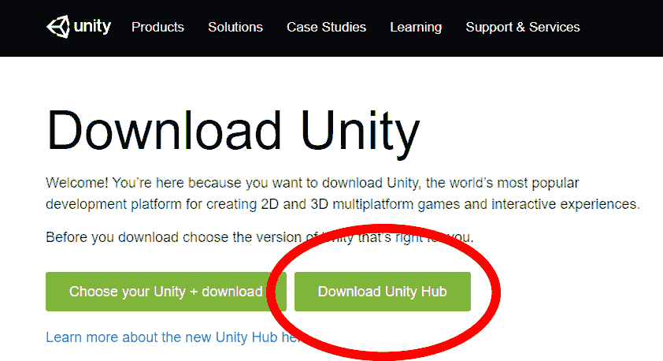

    图 1.2 – 安装 Unity Hub 而不是直接下载 Unity

1.  安装并打开 Unity Hub 后，您将看到 **学习** 和 **社区** 菜单。

    点击 **学习** 将您带到 *Unity Learn* 项目和教程（包括各种项目资产的下载）。这些教程可以从 5 分钟的快速教程到需要 15 小时才能完成的项目不等！

    **社区**菜单提供了许多其他 Unity 托管资源的链接，包括 *Unity Now* 会议演讲、*Unity 博客*、*问答*、*Q&A* 和 *论坛*。

现在，让我们安装一个 Unity 编辑器的版本。

## 安装 Unity 编辑器

当开始一个新项目时，我喜欢使用这本书 GitHub 仓库的最新 `.README` 文件。现在安装 Unity 编辑器，操作如下：

1.  选择 **安装** 选项卡，然后按 **添加** 打开 **添加 Unity 版本** 窗口。

1.  从这里，您可以选择要安装的 Unity 版本。

    注意 – Unity 版本

    在当前的 Unity 版本编号系统中，主版本号（例如，Unity **2020**.x.x）大致与日历年份相关联。最稳定的版本是标记为 **LTS** 的版本，即 **长期支持**；例如，*Unity 2020.3.14f1 (LTS)*。LTS 版本会定期接收维护和安全更新，但没有新功能。低于 LTS 的点版本（例如，*Unity 2021***.1***.15f1*）被认为是技术版本，它们在开发新功能和修复错误时相对稳定。对于更冒险的用户，Beta 和 Alpha 预发布版包括前沿功能，但风险也更高。

1.  一旦您选择了希望安装的 Unity 版本，点击**下一步**以查看**添加模块到您的安装**选项。在这里，您需要知道您期望针对哪些平台和设备进行项目开发。

    模块软件可能相当大，安装可能需要时间，因此请只选择您知道您很快就会需要的模块。您总是可以在以后回来并根据需要添加（或删除）模块。具体来说，如果您正在为 Android 和 ARCore 开发 AR 项目，请选择**Android 构建支持**。如果您针对 iOS 和 ARKit，请选择**iOS 构建支持**。同样，如果您针对其他设备，如 HoloLens 或 Magic Leap，请选择相应的模块。

1.  根据您选择的模块，您可能需要点击**下一步**并接受额外的用户许可协议。然后，点击**完成**以下载和安装软件。

    小贴士 – Unity 的安装位置

    使用 Unity Hub 窗口右上角的**齿轮**图标可以打开**首选项**窗口。在**常规**首选项选项卡下，您可以选择您的**用户编辑器**在计算机上安装的文件夹。由于这些文件可能占用相当大的磁盘空间，您可能不想使用默认位置。

如果您在 Unity Hub 中遇到任何问题或希望参与讨论，请访问 Unity 社区讨论论坛的相关部分，网址为 [`forum.unity.com/forums/unity-hub.142/`](https://forum.unity.com/forums/unity-hub.142/)。

现在，您已准备好创建您的第一个 Unity 项目。

## 创建和管理 Unity 项目

您将使用 Unity Hub 创建新的 Unity 项目。项目在系统中的特定文件夹中创建，包含基于您选择的起始模板的默认设置和内容的子文件夹。项目使用特定的 Unity 版本打开，并继续与该特定版本关联。要开始新项目，请完成以下步骤：

1.  打开 Unity Hub，选择**项目**选项卡，然后点击**新建**按钮。注意**新建**按钮下方的向下箭头，它允许您选择用于新项目的 Unity 版本，该版本与您当前安装的版本不同。

1.  `D:\Documens\UnityProjects`: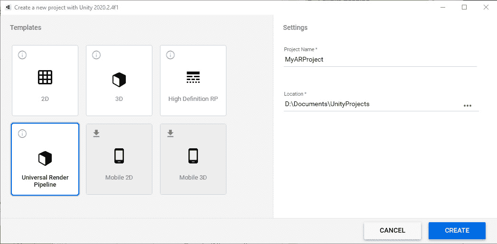

    图 1.3 – 在 Unity Hub 中使用 URP 模板创建新项目

    注意 - 我们正在使用通用渲染管线

    Unity 提供了多个替代渲染管线。传统的“内置”渲染管线由于在较新的 **可脚本渲染管线**（**SRP**）系统之前出现，因此对旧版第三方资产的支持更好（[`unity.com/srp`](https://unity.com/srp)），但基于较新 SRP 的管线性能更优且更灵活。这些包括用于使用高端图形硬件进行高质量渲染的 **高级渲染管线**（**HDRP**），以及非常快速且在移动设备上也能提供优秀渲染质量的 **通用渲染管线**（**URP**）。我建议使用 URP 开始新的 AR 项目。

    小贴士 - 避免在项目名称中使用空格

    在撰写本文时，某些 ARCore 功能中存在一个错误，要求您的项目路径名称中不包含空格，包括项目名称以及树中的所有文件夹名称。

1.  在按下 **创建** 后，Unity 可能需要一些时间来创建您的新项目、导入默认资产以及执行其他设置步骤，然后才能打开 Unity 编辑器窗口。

    小贴士 - 升级 Unity 项目

    Unity Hub 的一个优点是它能够管理多个版本的 Unity 和所有您的 Unity 项目。我倾向于使用最新的官方版本开始新项目，尽管不可避免地，新的 Unity 编辑器版本将会发布。一般来说，最好坚持使用您创建项目时使用的 Unity 版本。如果您需要升级到新版本，请谨慎且故意地这样做。

    通常，升级到新的小版本（例如，从 Unity 2021.2.**3** 升级到 2021.2.**16**）是安全的。升级到点版本（例如，从 Unity 2021.**2.x** 升级到 2021.**3.x**）通常是可以的，但您可能会遇到意外问题。在我的项目中，升级到新的大版本是一个不寻常的事件。在任何这些情况下，确保在以不同版本的 Unity 打开项目之前，您的项目已经备份（例如，在 GitHub 上），并安排时间解决意外问题。

    Unity 包含自动化工具，以便在 Unity 中打开项目时将其升级到新版本。您的资产将被重新导入。虽然支持升级到新版本，但不支持降级到旧版本。

当我在 Unity 中创建新项目时，我做的第一件事之一是在 **构建设置** 中设置 **目标平台** 为我知道我将要用于开发和测试项目的第一个平台。尽早这样做有优势，因为您添加到项目的任何新资产都将导入并为您目标平台进行处理。您现在**不必须**这样做，但我确实建议您执行以下步骤。我们将在本章后面的平台特定主题部分中详细介绍。

在 Unity 中打开您的项目后，请按照以下步骤操作：

1.  通过访问**文件 | 构建设置**来打开**构建设置**窗口。

1.  在**平台**选择面板中，选择您的目标平台。例如，如果您为 Android ARCore 开发，请选择**Android**，如果您为 Apple ARKit 开发，请选择**iOS**。

    如果您需要的平台未列出或已禁用，您可能忘记在安装此版本的 Unity 时添加平台构建模块。现在使用**Unity Hub**添加模块。

    小贴士 – 您可以通过 Unity Hub 添加目标平台模块

    如果您缺少对目标平台的支持，请打开**Unity Hub**，点击**安装**，然后，对于您正在使用的特定 Unity 版本，点击 3 点上下文菜单并选择**添加模块**。从那里，您可以使用复选框添加新模块。

1.  您现在不需要担心其他构建设置。按下**切换平台**按钮。重新导入项目资产可能需要几分钟时间。

到目前为止，您的 Unity 编辑器应该已经打开了一个新的 Unity 项目，显示默认的 URP**SampleScene**。您可以自由地探索编辑器窗口和场景对象。一开始可能看起来令人畏惧，但我们将回顾用户界面，以帮助您更加熟悉。

## 介绍 Unity 编辑器界面

当您第一次打开 Unity 编辑器时，您会注意到它有许多不同的窗口面板，包含不同的内容。让我们一起来探索这些。

以下截图显示了带有通用渲染管道模板的**Unity 编辑器**的**SampleScene**。窗口按照默认布局排列。这个“建设中”的场景展示了 Unity 许多令人惊叹的渲染功能，这些功能可能在 AR 项目中相关或不相关。但让我们先专注于 Unity 本身：

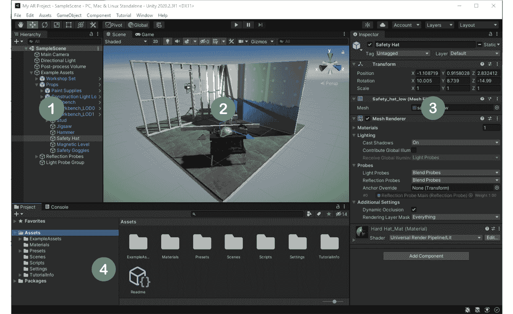

图 1.4 – 打开 URP 示例场景的 Unity 编辑器

Unity 编辑器以单独的标签页窗口布局排列。**编辑器窗口**是一个包含特定类型信息和控制的 UI 面板。可以通过**窗口**主菜单打开更多窗口。让我们回顾先前的截图中的每个窗口，并介绍一些其他基本术语，因为您正在了解 Unity：

+   **层次结构**窗口（*1*）：当前场景 GameObject 的树形视图。以父子对象的层次树视图显示与场景相同的内容。

    您可能已经注意到，在检查**场景**和**层次结构**窗口时，**安全帽**GameObject 当前被选中并突出显示。Unity 的**GameObject**是场景中的一部分对象。

+   **场景**视图窗口（*2*）：这显示了当前场景的 3D 视图。在场景窗口的顶部有一个图标工具栏，用于控制场景的工作视图。

+   **检查器**窗口（*3*）：所选 GameObject 的组件和属性。

    游戏对象附有**组件**，这些组件定义了游戏对象的运行时行为。Unity 包含许多内置组件，您可以使用 C#编程语言编写自己的组件。每个组件可能有单独的**属性**；即控制组件的设置。

    例如，您可以看到安全帽有**变换**和**网格渲染器**组件。

    游戏对象始终有一个**变换**组件。游戏对象也可能有一个 3D 网格、渲染器和材质，这些决定了它在场景中的渲染方式。您还可以添加许多其他组件来扩展对象的行为、物理和交互。

+   (`Assets/`文件夹，位于项目根目录下）。

    **资产**包括可能添加到场景中对象的文件，例如图像、音频、视频、材质和脚本。场景本身作为资产保存。复杂预定义的游戏对象也可以作为资产保存，称为**预制件**。

+   **控制台**窗口（*4*，位于项目标签页之后隐藏）：显示应用程序的错误和信息消息。

+   **游戏**视图窗口（*2*，位于场景标签页之后隐藏）：显示用户视图，由场景中的相机游戏对象渲染。

+   **主菜单**：位于**编辑器**窗口顶部，是一个可以访问 Unity 许多功能的菜单。向项目中添加额外的包可能会添加更多的菜单项。

+   **主工具栏**：位于**编辑器**窗口顶部和**主菜单**下方，是一个分为三个部分的图标工具栏。在左侧，有用于编辑场景视图的工具（包括**移动工具**、**旋转工具**和**缩放工具**）。在中间，有播放模式控制（包括**播放**和**暂停**）。最后，在右侧，有额外的控制项，包括一些允许您访问您的 Unity 账户和云服务的控制项。

花点时间探索主菜单项：

+   **文件**菜单用于创建、保存和加载场景以及访问您的构建设置。

+   **编辑**菜单用于在项目中选择和编辑对象，访问项目特定的设置和首选项，以及其他与编辑器相关的工具。

+   (`Assets/`文件夹）。

+   **游戏对象**菜单允许您向当前场景添加新对象。

+   **组件**菜单提供了一个分类列表，您可以在场景中当前选定的游戏对象上添加这些组件。

+   **窗口**菜单是您可以找到并打开提供更多功能的额外窗口的地方。将新包导入 Unity 可能会添加新的菜单栏项。

    信息 - 在 AR 项目中使用播放模式

    在大多数 Unity 项目中，您可以按 **Play** 按钮（在主工具栏中）进入 *播放模式* 并在编辑器中运行您的场景，在您的桌面上运行而不是在设备上。对于增强现实场景来说，这并不简单，因为它需要一个启动阶段，软件会扫描环境中的物理世界特征，然后使用物理设备的传感器进行位置跟踪。有几种解决方案可以简化您的迭代开发工作流程，我们将在 *第三章**，改进开发工作流程* 中讨论。

您可以根据自己的需求和偏好个性化并重新排列编辑器窗口布局。可以使用编辑器右上角的 **Layout** 选择菜单保存和加载布局。本书中的截图使用的是与 Unity 默认布局不同的布局。

好了，别再说了——这是一本实践手册，所以让我们立刻动手，尝试一下 Unity 编辑器。

## Unity 编辑器使用基础

在本节中，我们将构建一个包含 3D 立方体的简单场景，以便我们能够更好地解释如何使用 Unity：

1.  通过选择主菜单中的 **File | New Scene** 创建一个新的场景。

1.  将出现一个 **New Scene** 窗口（仅适用于 Unity 2020+），让您选择场景模板。选择名为 **Basic (Built-in)** 的模板。然后，按 **Create**。

    您会立即注意到新场景包含两个默认的 GameObject：主摄像机和方向光。

1.  通过点击 **GameObject | 3D Object | Cube** 将 3D 立方体添加到场景中。这样，立方体就会被添加到场景中，并在 **Scene** 和 **Hierarchy** 窗口中可见。

1.  确保立方体位于场景的原点；也就是说，`(0, 0, 0)` X-Y-Z 坐标。在 **Hierarchy** 窗口中选中 **Cube**，在 **Inspector** 窗口中设置其 **Transform** | **Position** | **X**、**Y** 和 **Z** 的值都为 0。

1.  让我们旋转立方体。在相同的 `-20`。

    场景现在可能看起来如下：

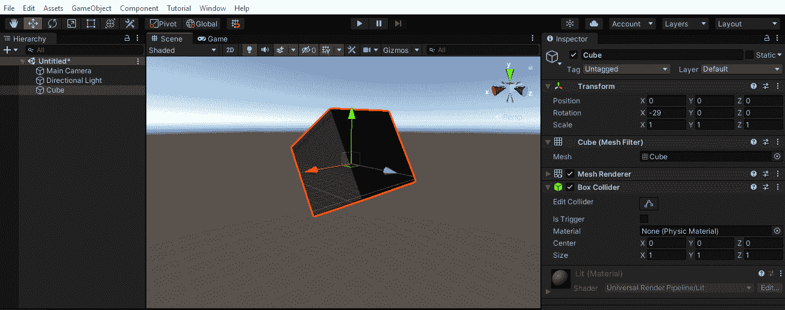

图 1.5 – 带有 3D 立方体的新场景

到目前为止，我鼓励您熟悉 **Scene** 视图控制。例如，在 Windows 上使用三按钮鼠标，在窗口中 *右键单击* 来旋转视图，*Alt + 左键单击* 来围绕视图的“中心”旋转视图，*中心单击* 鼠标来移动视图。要靠近或远离（缩放），请使用 *Alt + 右键单击* 或使用鼠标滚轮。请注意，**Scene** 窗口右上角的定向 Gizmo 表示当前视图，显示 X、Y 和 Z 轴。有关更多信息（包括单按钮或双按钮鼠标），请参阅 [`docs.unity3d.com/Manual/SceneViewNavigation.html`](https://docs.unity3d.com/Manual/SceneViewNavigation.html)。

提示——RGB == XYZ

记住，在 Gizmo 中的红色、绿色和蓝色颜色分别对应 X、Y 和 Z 轴是有用的。

我们通过在**检查器**窗口中编辑其数值来修改了立方体的变换。您也可以通过直接在**场景**窗口中操作对象来变换对象。例如，在主工具栏中，选择**旋转工具**。当立方体被选中时，您现在应该看到场景中对象上的旋转控件。您可以抓住控件（X、Y 或 Z）中的一个并拖动它来绕该轴旋转对象，如下面的截图所示：

![图 1.6 – 选择旋转工具

![img/Figure_1.06-cube-rotate-tool.jpg]

图 1.6 – 选择旋转工具

有关在**场景**窗口中直接变换对象的更多信息，请参阅 Unity 手册（[`docs.unity3d.com/Manual/PositioningGameObjects.html`](https://docs.unity3d.com/Manual/PositioningGameObjects.html)）。

这是一个非常简短的介绍，以帮助您开始。作为一个习惯，您应该在完成某事之后总是保存您的作品。让我们按照以下步骤保存场景：

1.  从主菜单中选择**文件 | 另存为**，这将打开**保存场景**窗口。

1.  导航到`Scenes/`子文件夹（在您的项目`Assets`文件夹中）。

1.  给场景起一个名字，例如`My Cube`，然后按**保存**。

    小贴士 – 感到困惑或不知所措？一次只迈出一小步

    就像任何专业开发和创意应用一样，Unity 提供了大量您可以做的事情，并且它提供了许多工具来帮助您实现目标。如果您感到困惑或不知所措，一个很好的策略是只关注您现在需要的菜单项和窗口，忽略其余部分。我们将通过简单的分步说明向您介绍这个过程。随着您经验的积累和自信的提升，您将扩大您熟悉的范围，并了解它们是如何相互关联的。说实话，每次我在项目上工作时，我都会学到关于 Unity 的新知识。

当然，这只是 Unity 的简要介绍。如果您需要了解更多信息，请前往**Unity Learn**，那里有一些优秀的入门教程（使用[`unity.com/learn/get-started`](https://unity.com/learn/get-started)链接或**Unity Hub**中的**学习**标签）。

此外，还可以查看**Unity 手册**的入门主题（[`docs.unity3d.com/Manual/UnityOverview.html`](https://docs.unity3d.com/Manual/UnityOverview.html)）。

## 组织您的项目资产

您可以在**项目**窗口中访问您的项目资产。我喜欢将我自己创建的项目资产保存在自己的顶级文件夹中，与其他可能从第三方来源（如 Unity Asset Store）导入的资产分开。

同样，Unity 的 URP 项目模板包括**SampleScene**和示例资产。我建议将 URP 示例资产移动到自己的文件夹中，以保持它们与您的应用程序资产分离。您可以通过以下步骤完成此操作：

1.  创建一个名为`URP-examples`的`Assets`文件夹。在`URP-examples`。

1.  将每个示例文件夹拖放到`URP-examples`中，即`ExampleAssets`、`Materials`、`Scenes`、`Scripts`、`TutorialInfo`和`Readme`文件。

1.  将`Presets`和`Settings`文件夹留在根`Assets/`文件夹中。

1.  创建一个名为`_App`的`Assets`文件夹。我喜欢在文件夹名称前加上下划线，以便它保持在列表的顶部。

1.  在`_App/`内部创建名为`Materials`、`Prefabs`、`Scenes`和`Scripts`的子文件夹。这些子文件夹目前将保持为空，但我们在阅读本书的过程中将向它们添加内容。

在 Unity 中，按照文件类型组织您的资产是一种常见的约定，但您可能有自己做事的方式。Unity 不依赖于这些文件夹名称或资产文件位置。（尽管如此，Unity 有一些具有特殊含义的保留文件夹名称；请参阅[`docs.unity3d.com/Manual/SpecialFolders.html`](https://docs.unity3d.com/Manual/SpecialFolders.html)）。您的**项目**窗口现在可能看起来如下所示：

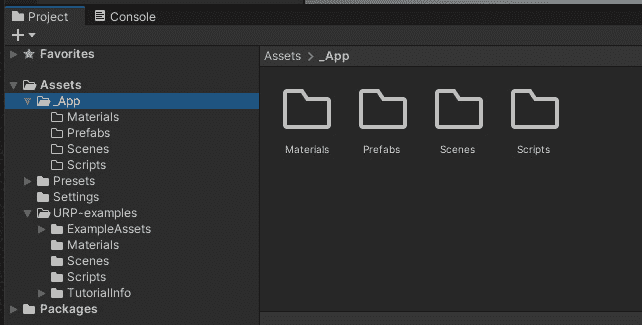

图 1.7 – 重新组织项目资产文件夹

我认为我们现在可以继续前进，继续设置您的系统并安装您为 AR 开发所需的包。我们将首先向您的项目中添加 AR 设备插件，然后对基础包做同样的操作。

# 为 AR 开发准备您的项目

当您开发和构建用于增强现实的项目时，Unity 需要知道您要针对的设备和平台。这是一个多步骤的过程，包括将设备插件添加到您的项目中，并在**构建设置**中设置目标平台。我们将在本章中现在讨论设备插件，并在稍后讨论**构建设置**。

下面的图示显示了 Unity XR 技术架构。如您所见，在堆栈底部是各种 AR（和 VR）提供程序插件：

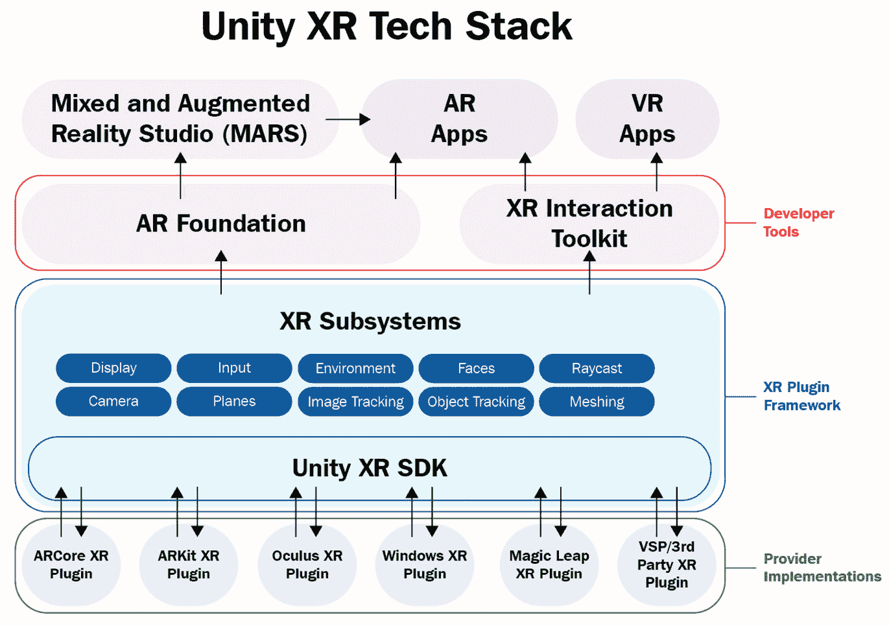

图 1.8 – Unity XR 技术堆栈

在堆栈的底部是**XR 插件**，这些是独立的提供程序包，它们实现了与特定设备的软件接口。插件允许 Unity 通过将 Unity XR 子系统与操作系统和运行时 API 连接起来与设备通信。通常，您不会直接使用插件，而是使用更高级的工具包，例如 AR Foundation（我们将在下一节中安装）。一些插件由 Unity Technologies 提供和维护；其他是由供应商支持的第三方插件。

在前面的图中，在插件顶部是**XR 子系统**，它们构成了**XR 插件框架**。这把一系列功能抽象成单独的 API。当应用程序运行时，它可以查询当前运行时设备的性能，并根据需要启用或禁用应用程序中的功能集。在**XR 子系统**之上是**AR 基础**工具包（以及**XR 交互工具包**），它为你的 Unity 应用程序提供主要的 AR API。我们将在这本书的项目中广泛使用 AR 基础。

现在，让我们安装这个项目所需的 XR 插件。

## 安装 AR 设备的 XR 插件

为了准备我们的项目进行 AR 开发，我们将通过**XR 插件管理**窗口安装目标设备的 AR 设备插件。在 Unity 中打开你的项目后，按照以下步骤操作：

1.  通过从主菜单中选择**编辑 | 项目设置**来打开**项目设置**窗口。

1.  在左侧的**设置**菜单中，选择**XR 插件管理**。

1.  点击**安装 XR 插件管理**按钮。Unity 导入和编译包脚本可能需要一点时间。

1.  如果需要，再次单击**XR 插件管理**项以显示**插件提供者**和其他选项。请注意，每个目标平台都有一个标签页。选择你首先将针对的标签页。

    例如，在**XR 插件管理**窗口中，只有当你通过 Unity Hub 安装 Unity 时安装了**Android 构建支持**模块，**Android**标签页才会可用。

1.  勾选你想要使用的 AR 插件的复选框。例如，对于 Android，选择**ARCore**，而对于 iOS，选择**ARKit**。

    小贴士 – 不要在同一个项目中混合 VR 和 AR 插件

    你会看到**XR 插件管理**窗口允许你选择任何组合的 AR 和 VR 插件。在我们的项目中，我们只对 AR 插件感兴趣。通常，不要在同一个项目中包含 AR 和 VR 插件，因为构建设置、玩家设置、相机装置以及许多其他事物在 AR 和 VR 项目之间可能存在显著差异。（也许当你阅读这篇文章时，会有支持两种模式的单一应用程序的设备，但到目前为止，我并不了解任何这样的设备。）

在以下截图的**项目设置**窗口中，我已选择了**XR 插件管理设置**菜单。在我的窗口中，为这个项目可能的目标平台（我已安装的）每个都设置了三个标签页：桌面、iOS 和 Android（你的可能不同）。当选择**Android**标签页时，你可以看到我已经勾选了**ARCore**插件。你也会注意到，在左侧，还有一个额外的**ARCore**菜单项，你可以点击它来查看该插件特有的选项：

![图 1.9 – 已选择 ARCore 插件的 XR 插件管理窗口

![图 1.9 – 已选择 ARCore 插件的 XR 插件管理窗口

图 1.9 – 已选择 ARCore 插件的 XR 插件管理窗口

有趣的是，**XR 插件管理器** 是在 **包管理器** 中安装相应包的快捷方式。你可以通过以下步骤打开 **包管理器** 并检查已安装的包来验证这一点：

1.  从主菜单打开包管理器，并选择 **窗口 | 包管理器**。

1.  确保包管理器窗口左上角的过滤器选择为 **项目中的包**。

1.  你应该在列表中看到你的插件；例如，**ARCore XR 插件**。

例如，在以下 **包管理器** 的屏幕截图（显示 **项目中的包**，位于窗口的左上角）中，**ARCore XR 插件** 已安装并选中。你可以看到，此特定版本的插件已针对此项目使用的 Unity 版本进行了 **验证**。它还显示了插件的功能描述、文档链接和其他详细信息。此外，我已经展开插件的 **其他版本** 列表，以向您展示如何查看插件的每个版本；这是您可能升级（或降级）插件到不同版本的地方：

![图 1.10 – 包管理器，此项目中已安装 ARCore XR 插件]

![img/Figure_1.10-package-manager-arcore.jpg]

图 1.10 – 包管理器，此项目中已安装 ARCore XR 插件

到目前为止，如果你想直接使用 XR 子系统的开发者界面 C# 编写代码，你可以开始开发一个增强现实项目。然而，更有可能的是你会安装一个更高级的、对 Unity 开发者更友好的工具包。尽管如此，你可能需要直接进入插件框架来访问 XR 子系统。例如，你可能希望扫描并启动特定的子系统，如示例所示 [`docs.unity3d.com/Manual/xrsdk-runtime-discovery.html`](https://docs.unity3d.com/Manual/xrsdk-runtime-discovery.html)。在本书的后续部分，我们可能需要访问插件框架的 SDK。大部分情况下，我们将使用更高级的 **AR 基础** 工具包。

## 安装 AR 基础包

AR 基础是一个包，它为你的应用程序和底层设备功能和插件之间提供了一个开发层。AR 基础提供了组件和其他资产，帮助你一次性构建 AR 项目，然后部署到多个移动和可穿戴 AR 设备。正如 Unity 所说，使用“统一的工作流程”，你的应用程序可以支持当前和未来的功能，这些功能可能在运行时在最终用户的特定设备上可用或不可用。这有助于“为 AR 应用程序的未来做好准备”。在本节中，我们将安装并探索 AR 基础。

AR 基础支持的功能将取决于目标设备的当前功能，并且在不同版本的 AR 基础之间有所不同。以下图表显示了 AR 基础提供的每个平台的功能支持：

![图 1.11 – AR 基础 4.1.5 每个平台的功能]

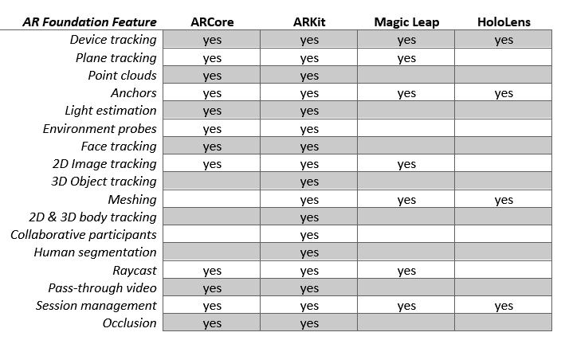

图 1.11 – AR Foundation 4.1.5 各平台功能

请参阅 AR Foundation 文档页面的**平台支持**部分(`docs.unity3d.com/Packages/com.unity.xr.arfoundation@latest/index.html`)，以获取你使用的版本的最新详细信息。

Unity 提供了一个**包管理器**，它允许你通过在你的项目中安装额外的包来扩展 Unity 的核心功能。这样，你可以为特定项目选择所需的功能。我们在上一节中安装的 XR 插件是包。现在，我们将使用包管理器安装**AR Foundation**包。

信息 - Unity 包的优势

Unity 包带来了许多优势。Unity 可以独立于其他功能更新核心编辑器。同样，包可以在 Unity 核心发布周期之外更新。解耦它们的依赖性可以降低进度延误和技术问题的风险，从而实现更敏捷的开发周期，并支持 Unity 办公室内外技术进步。例如，如果苹果发布了 ARKit 的更新，那么 Unity 可以发布其 ARKit 插件的更新，而无需等待 Unity 编辑器的下一个版本发布，也不依赖于 Unity 核心开发团队。如果你曾经与多个团队合作完成过大型项目，你将能够欣赏这种架构的好处。团队可以组织起来，专注于他们包提供的细节，然后测试与 Unity 核心产品的成功集成。

你可以通过以下步骤使用包管理器安装 AR Foundation：

1.  通过主菜单转到**Window | Package Manager**打开包管理器。

1.  将左上角的包过滤器设置为**Unity Registry**，以查看所有官方包的列表。

1.  在搜索框中输入`ar`。你现在应该能看到列表中所有与 AR 相关的包。

1.  注意包的版本号很重要，以及该特定版本是否已经与你在项目中使用的 Unity 版本进行了验证。

1.  选择**AR Foundation**，然后按**安装**。安装可能需要一段时间。

安装完成后，你可能会发现主菜单栏中添加了新的项目，包括**GameObject | XR**下的选项。现在请不要选择任何选项——我们将在下一章，*第二章**，您的第一个 AR 场景*中详细介绍，我们将使用工具包创建第一个 AR 场景。

你还需要为你的项目选择一个输入处理器。我们将在下一节中探讨这个问题。

## 选择输入处理器

Unity 产品持续改进。一项相对较新的进步是引入了新的**输入系统**，它正在取代经典的**输入管理器**。在撰写本文时，Unity 项目可以配置为使用其中任何一个，或者在同一项目中同时使用两者。您选择的输入处理器可以对您的开发产生重大影响，因为它们的用法相当不同。经典的输入管理器主要使用*轮询*，而新的输入系统使用*事件*（见[`blog.unity.com/technology/introducing-the-new-input-system`](https://blog.unity.com/technology/introducing-the-new-input-system)）。这是一个概括，因为两种软件模式都可以使用任何处理器实现，但新的输入系统设计得更好，更灵活。为了推进技术前沿，本书中的项目将使用新的输入系统。

然而，您将导入到项目中的某些示例场景，包括*第二章**，您的第一个 AR 场景*中的*AR 基础样本*，将使用经典的输入管理器，因此允许您的项目同时支持两者是明智的。

要配置项目以使用新的输入系统，请执行以下步骤：

1.  要导入输入系统包，请通过访问**窗口 | 包管理器**打开包管理器。

1.  从窗口左上角的筛选器选择中，选择**Unity 注册表**。

1.  找到`input`），然后点击**安装**。

1.  您可能会被提示让 Unity 自动更改您的玩家设置以使用新的输入系统。您可以回答“不”。我们将手动完成此操作。

1.  通过访问**编辑 | 项目设置 | 玩家**打开**玩家设置**窗口。

1.  定位到**配置 | 活动输入处理**并选择**两者**（或者如果您愿意，可以选择**输入系统包（新）**）。

我们将从*第二章**，您的第一个 AR 场景*开始处理输入，以及随后的章节。

您还需要设置项目的渲染管道以支持 AR。让我们学习如何做到这一点。

## 添加对通用渲染管道的支持

由于我们使用**通用渲染管道**（**URP**）创建了此项目，因此您还需要做一件事——向图形前向渲染器添加 AR 视频背景支持（见`docs.unity3d.com/Packages/com.unity.xr.arfoundation@4.1/manual/ar-camera-background-with-scriptable-render-pipeline.html`）。此功能在虚拟图形渲染到这些像素之上之前立即在屏幕上渲染设备的视频流。请执行以下步骤：

1.  在`Assets/Settings/`文件夹中。

1.  选择名为**ForwardRenderer**的资产。

1.  在 **检查器** 窗口中，点击 **添加渲染器功能** 按钮，并选择 **AR 背景渲染器功能**。以下截图显示了生成的 Forward Renderer 设置：

![图 1.12 – 添加了 AR 背景渲染器功能的 ForwardRenderer 数据资产]

](img/Figure_1.12-url-renderer.jpg)

图 1.12 – 添加了 AR 背景渲染器功能的 ForwardRenderer 数据资产

此外，作为提醒，如果你将任何资产导入到你的项目中，你可能需要将它们的材质转换为渲染管线。我们将在本章末尾对示例资产进行此操作。

你现在已使用 Unity Hub 安装了 Unity，创建并打开了一个新的 Unity 项目，为你的 AR 设备安装了 XR 插件，安装了 AR Foundation 包，为你的项目选择了输入处理器，并配置了 AR 的渲染管线。下一步是继续为你的目标平台设置项目。

# 设置移动开发环境

根据你的项目针对的设备平台，你可能需要安装额外的软件和开发工具，以及配置你的 Unity 项目以使用特定平台的设置。

如果你正在为 Android ARCore 开发，请转到 *设置 Android/ARCore 开发* 部分。如果你正在为 Apple ARKit 开发，请转到 *设置 iOS/ARKit 开发* 部分。最后，如果你正在为可穿戴 AR 设备开发，请转到 *为可穿戴 AR 眼镜开发* 部分。

## 设置 Android/ARCore 开发环境

如果你想在 Android 设备上构建和运行你的项目，设置 Android 开发和 ARCore 的项目设置会有一些额外的步骤。我将在下面总结这个过程，但自然地，事情可能会变化，我建议你查看最新的说明文档，包括 Google 的 ARCore 文档，以及 Unity 手册。以下是一些相关的链接：

+   ARCore 支持的设备: [`developers.google.com/ar/devices`](https://developers.google.com/ar/devices)

+   Unity 手册 – 安卓环境设置: [`docs.unity3d.com/Manual/android-sdksetup.html`](https://docs.unity3d.com/Manual/android-sdksetup.html)

+   ARCore Unity – 功能概述: [`developers.google.com/ar/develop/unity`](https://developers.google.com/ar/develop/unity)

+   Unity ARCore 扩展安装: [`developers.google.com/ar/develop/unity-arf/enable-arcore`](https://developers.google.com/ar/develop/unity-arf/enable-arcore)

+   Unity ARCore 插件: `docs.unity3d.com/Packages/com.unity.xr.arcore@4.1/manual/index.html`（查找你使用的版本的相关文档页面）

你可能已经完成了设置 Android 和 ARCore 开发的第一步，但我会在这里简要重复：

1.  *构建支持模块*：在 Unity Hub 中，请确保您已安装了与您项目使用的 Unity 特定版本对应的**Android**平台构建支持模块。

    在 Unity Hub 的**添加模块**窗口中，有一个用于展开**Android 构建支持**的**>**图标。请确保您已勾选了**Android SDK & NDK 工具**和**OpenJDK**的复选框。

    注意，如果您需要自定义 Android SDK、NDK 或 JDK 库的位置，请使用 Unity 编辑器中的**Unity 首选项**窗口，通过导航到**编辑 | 首选项 | 外部工具**，并指定 Unity 查找这些库分别安装的路径。

1.  *目标平台*：在 Unity 编辑器中，通过选择**文件 | 构建设置**打开**构建设置**窗口。在**平台**面板中，从列表中选择**Android**平台。如果尚未选择，请点击**更改平台**按钮。如果它被禁用，请返回到*步骤 1*。

1.  *XR 插件*：请确保**ARCore**插件已安装并选中。选择**编辑 | 项目设置**，然后从侧菜单中选择**XR 插件管理**（如果需要，初始化它）。点击**Android**图标以查看 Android 插件列表，如果未勾选，请勾选**ARCore**复选框。

1.  *USB 调试*：下一步是在您的 Android 设备（手机或平板）上启用 USB 调试。打开设备的**设置 > 关于**窗口，找到**构建号**项。（根据品牌，您可能需要再深入一级或在不同位置找到**构建号**项。）接下来，我认为您必须做的下一件事非常有趣——通过点击**构建号**项七次来执行一个神奇的咒语！然后，神奇地，一个**开发者选项**菜单选项会出现。选择它并启用**USB 调试**。

    现在，您可以将您的设备连接到您的开发机器，并且它应该被识别为附加的外围设备。

下一步要考虑的是您项目中的**Android 玩家**设置。这些选项的审查可以在以下位置找到：[`docs.unity3d.com/Manual/class-PlayerSettingsAndroid.html`](https://docs.unity3d.com/Manual/class-PlayerSettingsAndroid.html)。针对 ARCore 的 AR 项目需要特定的设置。请仔细检查当前的要求，这些要求可以在**Quickstart ARCore**页面上的**配置项目设置**主题中找到（[`developers.google.com/ar/develop/unity-arf/quickstart-android`](https://developers.google.com/ar/develop/unity-arf/quickstart-android)）。从之前的步骤继续，我建议执行以下操作：

1.  *玩家设置*：在 Unity 中，导航到 **编辑 | 项目设置 | 玩家** 以打开 **玩家设置** 窗口。它包含许多选项，包括顶部的选项卡，用于在平台特定设置之间切换。通常，除非另有建议或您正在优化项目构建，否则您可以保留默认设置。初始化以下设置：

1.  **其他设置 | 渲染**：取消选中 **自动图形 API**。如果图形 API 下列出了 Vulkan，请将其删除，因为 Vulkan 目前不支持 ARCore。为此，请选择 **Vulkan** 并按右下角的 **-**（减号）图标。此外，取消选中 **多线程渲染**，因为它（目前）与 ARCore 不兼容。

1.  `com.DefaultCompany.MyARProject`.

1.  **其他设置 | 最小 API 级别**：如果您正在构建 **AR 需要** 应用，请指定 **Android 7.0 'Nougat' (API 级别 24**) 或更高版本。如果您正在构建 **AR 可选** 应用，请指定 Android **API 级别 14** 或更高版本。

    信息 – Unity 中的“player”一词

    在 Unity 中，“*player*”一词具有多重含义。您的应用程序或游戏用户可能被称为 *player*。在游戏中，第一个由用户控制的 GameObject（包含一个摄像头）也可能被称为 *player*。在非 AR 视频游戏中，游戏控制器可能被称为 *player controller*。然而，在 **项目设置** 中，*player* 指的是构建过程的结果；它是一个安装在您的目标设备上的可执行程序（以及其他资产文件和数据），用于“播放”您的应用程序。在这种情况下，这个词类似于 *媒体播放器*，例如播放音乐或视频文件。Unity 中的 **玩家设置** 配置了 Unity 如何构建和部署到您的目标设备。

同时，您还有安装由 Unity 的 **ARCore 扩展** 包提供的额外功能的选项。此包扩展了 AR Foundation 以支持 ARCore 的更多高级功能，这些功能目前在 AR Foundation 中尚不支持。要安装 **ARCore 扩展**，请执行以下步骤：

1.  从 GitHub 发布页面下载最新的 `arcore-unity-extensions-*.tgz` tarball，网址为 [`github.com/google-ar/arcore-unity-extensions/releases/`](https://github.com/google-ar/arcore-unity-extensions/releases/)。

1.  使用 **窗口 | 包管理器** 打开包管理器。

1.  在窗口的左上角，点击 **+** 图标并选择 **从 tarball 添加包**，如图所示：![Figure 1.13 – Adding a tarball package

    ![img/Figure_1.13-add-package-from-tarball.jpg]

    图 1.13 – 添加 tarball 包

1.  定位下载的 `arcore-unity-extensions-*.tgz` tarball。

1.  然后，点击 **打开**。安装包及其依赖项可能需要几分钟。

您的项目现在已设置好，以针对 Android ARCore 和 AR Foundation。我们将在下一章，*第二章**，您的第一个 AR 场景*中验证您的设置，当我们创建 AR 场景、构建并在您的设备上运行它时。

## 为 iOS/ARKit 开发设置

如果您想在苹果 iOS 设备上构建和运行您的项目，设置 iOS 开发和 ARKit 的项目时需要额外几个步骤。我将在下面总结这个过程，但请注意，事情可能会发生变化，我建议您查看最新的必要文档。

为 iOS 开发需要一个运行 OSX 的 Mac 计算机。然后，您需要安装 Xcode 开发环境。强烈建议您加入苹果开发者计划，目前个人费用为每年 99 美元（USD）。您可以在不成为苹果开发者的情况下进行一些有限的 Unity iOS 开发，但这并不实用，尤其是在 AR 方面，您需要在一个物理设备上测试您的应用程序。

这里有一些相关的链接列表：

+   苹果开发者计划：[`developer.apple.com/programs/`](https://developer.apple.com/programs/%20%20)

+   Unity 手册 – iOS 开发入门：[`docs.unity3d.com/Manual/iphone-GettingStarted.html`](https://docs.unity3d.com/Manual/iphone-GettingStarted.html)

+   Unity 手册 – 为 iOS 构建：[`docs.unity3d.com/Manual/UnityCloudBuildiOS.html`](https://docs.unity3d.com/Manual/UnityCloudBuildiOS.html)

+   Unity ARKit 插件: `docs.unity3d.com/Packages/com.unity.xr.arkit@4.1/manual/index.html`（查找您所使用版本的文档页面）

    信息 – 如何在没有 Mac 的情况下为 iOS 开发

    虽然 iOS 开发需要一个运行 OSX 的 Mac 计算机，但您可以使用 `.ipa` 文件在您的 iOS 设备上绕过这一点。这并不适合快速的开发周期！如果您处于这种情况，我的建议是购买一部支持 ARCore 的二手安卓手机。然后，在您的 Windows PC 上使用 AR Foundation 开发您的应用程序，首先针对安卓进行开发，然后定期运行 iOS/ARKit 构建，以测试和验证它在该设备上运行。Unity Cloud Builds 需要 Unity Plus 或 Pro 许可证或 Unity Teams Advanced 订阅。

为 iOS 和 ARKit 开发需要执行以下步骤。您可能已经完成了一些这些步骤：

1.  *苹果开发者计划*: 这是您为 iOS 开发的入场券。前往 [`developer.apple.com/programs/`](https://developer.apple.com/programs/) 了解更多信息并注册。

1.  *Xcode*: 下载并安装当前版本的 Xcode，这是开发任何苹果产品所需的开发环境。您可以在 Mac App Store 中找到它：[`apps.apple.com/us/app/xcode/id497799835`](https://apps.apple.com/us/app/xcode/id497799835)。

1.  *构建支持模块*：在**Unity Hub**中，确保您已为与项目一起使用的 Unity 特定版本安装了**iOS**平台构建支持模块。

1.  *目标平台*：在 Unity 编辑器中，通过选择**文件 | 构建设置**打开**构建设置**窗口。在**平台**面板中，从列表中选择**iOS**平台。如果尚未选择，请点击**更改平台**按钮。如果按钮不可用，请返回到*步骤 1*。

1.  *XR 插件*：确保已安装并选中了**ARKit**插件。选择**编辑 | 项目设置**，然后从侧菜单中选择**XR 插件管理**（如有必要，请初始化它）。点击**iOS**选项卡以查看 iOS 插件列表，如果未选中，请勾选**ARKit**复选框。

1.  *玩家设置*：在`Required for augmented reality support`中设置`11`，以及**架构 | ARM64**。

当 Unity 构建 iOS 项目时，它实际上并没有构建应用程序。相反，它构建一个 XCode 项目文件夹，然后在该文件夹中打开 XCode，XCode 随后用于构建应用程序。XCode 提供的一项关键服务是确保您通过配置您的应用程序进行开发授权，包括以下内容：

+   为您计划测试应用程序的每个设备安装**开发配置文件**。按照[`docs.unity3d.com/Manual/UnityCloudBuildiOS.html`](https://docs.unity3d.com/Manual/UnityCloudBuildiOS.html)中**创建证书**主题下的说明进行操作。

+   通过前往**首选项 | 账户**将您的**Apple ID**账户添加到 Xcode 中。

有关使用 Xcode 和 Unity 的更多信息，请参阅*Unity 手册：Unity Xcode 项目的结构*([`docs.unity3d.com/Manual/StructureOfXcodeProject.html`](https://docs.unity3d.com/Manual/StructureOfXcodeProject.html))和其他相关页面。

这个过程可能会让人困惑。每个为 iOS 开发的人都会经历一个类似的过程，所以您绝对不是唯一一个，互联网上有很多答案可以找到。记住：“DuckDuckGo 是你的朋友。”幸运的是，您通常只需要做一次。

注意，您也可以通过导航到**编辑 | 项目设置 | 玩家 | 识别**来在您的 Unity 玩家设置中设置您的**签名团队 ID**。

信息 - 苹果自己的 AR 开发工具

在查看苹果网页后，您会发现它们除了 Unity 之外还提供了自己的 AR 开发工具（[`developer.apple.com/augmented-reality/tools/`](https://developer.apple.com/augmented-reality/tools/))。当然，我是一位 Unity 和 AR Foundation 的大粉丝，它们为您提供了设备独立性和 Unity 的所有其他强大功能，但了解替代方案也是好的。

您的项目现在已设置为目标为 Apple ARKit 的 AR Foundation。我们将在下一章，*第二章**，您的第一个 AR 场景*中验证您的设置，当我们创建一个 AR 场景，构建它并在您的设备上运行时。

## 开发可穿戴 AR 眼镜

AR Foundation 不仅支持使用 ARCore 和 ARKit 的手持移动 AR 设备，还支持可穿戴 AR 眼镜，包括微软 HoloLens 和 Magic Leap。同样，针对可穿戴 AR 设备可能需要配置 Unity 以针对除 Android 或 iOS 以外的平台。由于它们针对的是企业或工业应用，可穿戴 AR 眼镜相对较贵，并且超出了典型消费者的购买能力。虽然这本书可以作为开发这些设备的美好起点，并且项目可以根据需要进行调整，但本书的范围不包括在后续章节中支持可穿戴 AR 设备。

对于**微软 HoloLens**，您必须设置 Unity 以针对**通用 Windows 平台（UWP**），从通过 Unity Hub 安装所需的模块开始，如下面的截图所示：

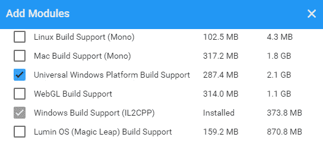

图 1.14 – 为 HoloLens 添加 UWP 构建支持

要为 HoloLens 开发设置，您需要使用**Visual Studio IDE**和兼容的**Windows 10 SDK**版本。有关更多信息，以下是一些有用的链接：

+   Unity for Windows Mixed Reality：[`unity3d.com/partners/microsoft/mixed-reality`](https://unity3d.com/partners/microsoft/mixed-reality)。

+   微软混合现实 – 安装工具：[`docs.microsoft.com/en-us/windows/mixed-reality/develop/install-the-tools?tabs=unity`](https://docs.microsoft.com/en-us/windows/mixed-reality/develop/install-the-tools?tabs=unity)（这还包括一个安装清单）。

+   Unity Windows XR 插件：`docs.unity3d.com/Packages/com.unity.xr.windowsmr@5.2/manual/index.html`。您只需找到您所使用版本的文档页面。此页面还包括推荐的**构建设置**和**玩家设置**。

    信息 – 微软混合现实工具包（MRTK）

    注意，微软还为其 Unity 平台提供自己的开源跨平台开发工具包，称为**混合现实工具包**（**MRTK**），作为 AR Foundation 的替代品。我认为这个框架有一个非常有趣的实现，具有灵活的架构，支持从 AR 到 VR 的一系列设备。了解更多信息请点击此处：[`docs.microsoft.com/en-us/windows/mixed-reality/develop/unity/mrtk-getting-started`](https://docs.microsoft.com/en-us/windows/mixed-reality/develop/unity/mrtk-getting-started)。

对于 **Magic Leap** 可穿戴 AR 产品，您必须设置 Unity 以针对 **Lumen OS**，从通过 Unity Hub 安装所需的模块开始，如下截图所示：

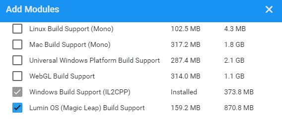

图 1.15 – 为 Magic Leap 添加 Lumen OS 构建支持

对于更多信息，以下是一些有用的链接：

+   Unity for Magic Leap：[`unity3d.com/partners/magicleap`](https://unity3d.com/partners/magicleap%20)

+   Magic Leap 开发者门户：[`developer.magicleap.com/en-us/home`](https://developer.magicleap.com/en-us/home)

+   Magic Leap Unity 开发：[`developer.magicleap.com/en-us/learn/guides/unity-overview`](https://developer.magicleap.com/en-us/learn/guides/unity-overview)

+   使用 AR Foundation 与 Magic Leap：[`resources.unity.com/unitenow/onlinesessions/using-magic-leap-with-ar-foundation-in-unity-2020-1`](https://resources.unity.com/unitenow/onlinesessions/using-magic-leap-with-ar-foundation-in-unity-2020-1) (*Unite Now* 演讲)

有趣的是，Magic Leap 提供了一个 **Unity 模板**，您可以将它添加到 Unity Hub 中，作为新项目的起点（[`github.com/magicleap/UnityTemplate`](https://github.com/magicleap/UnityTemplate))。

现在您已经在您的目标平台和设备上设置了 AR 开发项目，让我们构建一个测试来确保一切按计划进行。

# 构建 和 运行 测试 场景

在继续构建 AR 项目之前，明智的做法是验证您的项目是否已经正确设置，通过尝试在您的目标设备上构建和运行它。为此，我们将创建一个最小的 AR 场景，并验证它是否满足以下清单：

+   您可以为您的目标平台构建项目。

+   应用程序在您的目标设备上启动。

+   当应用程序启动时，您会在屏幕上看到来自其摄像头的视频流。

+   应用程序扫描房间并在您的屏幕上渲染深度点。

我将一步步地引导您。如果您不理解所有内容，请不要担心；我们将在 *第二章**，您的第一个 AR 场景* 中更详细地一起探讨。请在您的当前项目中执行以下操作，该项目应在 Unity 中打开：

1.  通过选择 `Scenes` 文件夹，命名为 `BasicTest` 并点击 **Save**，创建一个名为 *BasicTest* 的新场景。

1.  在 **Hierarchy** 窗口中，删除默认的 **Main Camera**（右键单击并选择 **Delete**，或使用 *Del* 键盘键）。

1.  通过选择 **GameObject | XR | AR Session** 添加一个 AR 会话对象。

1.  通过选择 **GameObject | XR | AR Session Origin** 添加一个 AR 会话原点对象。

1.  通过在搜索字段中点击 `ar point` 并选择 **AR Point Cloud Manager**，将点云管理器添加到会话原点对象。

你会注意到点云管理器有一个用于可视化检测到的深度点的空槽位，即点云预制件。**预制件**是一个保存为项目资产的游戏对象，可以在运行时添加到场景（*实例化*）。我们将使用一个非常简单的粒子系统创建一个预制件。再次提醒，如果你对此不熟悉，不要担心，只需跟着做即可：

1.  通过选择**GameObject | Effects | Particle System**创建一个粒子系统。

1.  在`点粒子`中。

1.  在**粒子系统**组件上，取消勾选**循环**复选框。

1.  设置其`0.1`。

1.  取消勾选**唤醒时播放**复选框。

1.  在搜索字段中点击`ar point`，然后选择**AR 点云**。

1.  同样，点击**添加组件**并选择**AR 点云可视化器**。

1.  将**PointParticle**对象从**层次结构**窗口拖到**项目**窗口中的**预制件**文件夹（如果需要，先创建文件夹）。这使得 GameObject 成为一个预制件。

1.  使用*右键单击* **| 删除**或按*Del*键从**层次结构**窗口中删除**PointParticle**对象。

**PointParticle**对象的检查器窗口现在应该如下所示：

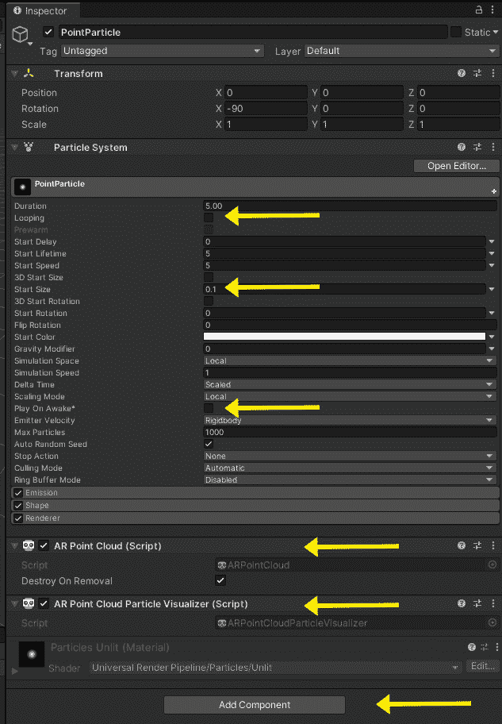

图 1.16 – 使用我们使用的设置突出显示的 PointParticle 预制件的检查器视图

我们现在可以将 PointParticle 预制件应用到 AR 点云管理器中，如下所示：

1.  在**层次结构**窗口中，选择**AR 会话起源**对象。

1.  从**项目**窗口，将**PointParticle**预制件拖到**AR 点云管理器 |** **点云预制件**槽中。（或者，点击槽右侧的“甜甜圈”图标以打开**选择 GameObject**窗口，选择**资产**选项卡，并选择**PointParticle**）。

1.  使用**文件 | 保存**保存场景。

结果的 AR 会话起源应该如下所示：

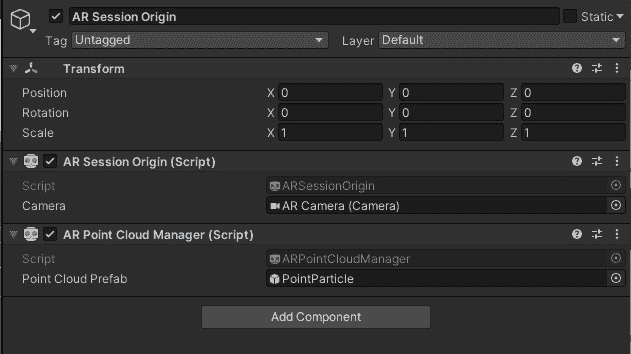

图 1.17 – 填充了 PointParticle 预制件的点云管理器组件的会话起源

现在，我们已经准备好构建和运行场景。执行以下步骤：

1.  使用**文件 | 构建设置**打开**构建设置**窗口。

1.  点击**添加打开场景**按钮将此场景添加到构建列表中。

1.  在**构建中的场景**列表中，取消勾选除**BasicTest**以外的所有场景。

1.  确保您的设备通过 USB 线连接到您的计算机。

1.  按`Builds/`。如果需要，给它一个文件名，然后按**保存**。完成此任务可能需要一些时间。

如果一切顺利，项目将构建，安装到你的设备上，并启动。你应该能在你的设备屏幕上看到相机视频流。慢慢地将手机向不同方向移动。当它扫描环境时，特征点将被检测并在屏幕上渲染。下面的屏幕截图显示了我办公室的门，我的手机上渲染了点云。当你扫描时，离相机更近的环境中的粒子看起来比远离相机的大，这有助于用户感知场景中的深度。

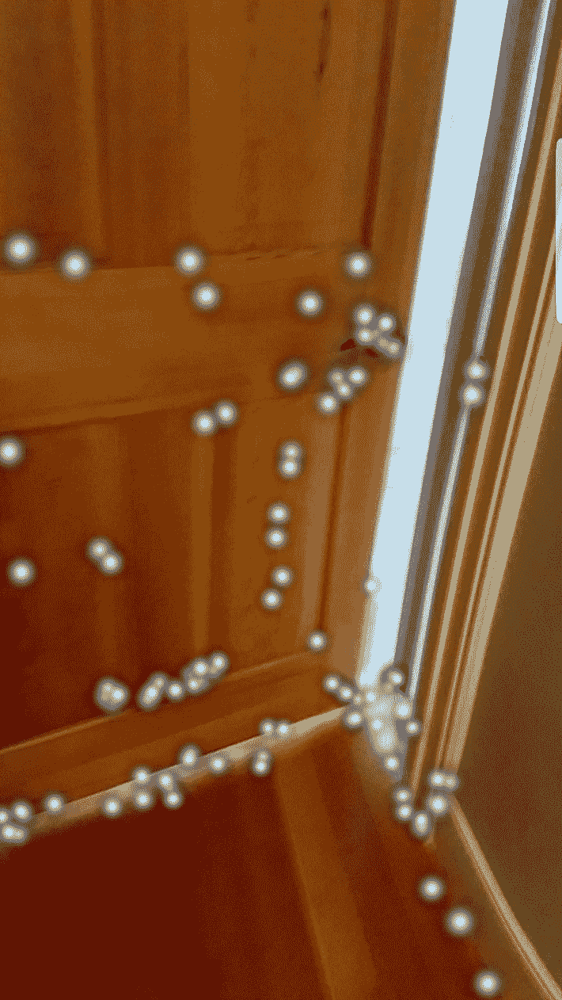

图 1.18 – 使用 BasicTest 场景在我的手机上渲染的点云

如果你在构建项目时遇到错误，请查看 Unity 编辑器中的**控制台**窗口中的消息（在默认布局中，它位于**项目**窗口后面的一个标签页）。仔细阅读这些消息，通常从顶部开始。如果这没有帮助，那么请回顾本章中详细说明的每个步骤。如果修复方法仍然不明显，请在互联网上搜索消息的文本，因为你可以确信你很可能不是第一个有类似问题的人！

小贴士 – 提前构建，经常构建

在项目中尽快使构建工作正常进行是很重要的。如果不是现在，那么至少在下一章结束之前要做到这一点，因为没有在物理设备上构建、运行和测试 AR 应用程序的信心去开发 AR 应用程序是没有太多意义的。

在成功构建之后，你现在可以开始构建自己的 AR 项目了。恭喜你！

# 摘要

在本章中，在对增强现实进行简要介绍后，你立即开始了自己 AR 项目的开发之路。你通过 Unity Hub 安装了 Unity，并学习了跟踪不同版本的 Unity、其项目和包的重要性。你对使用 Unity 编辑器进行了简要的浏览，包括一些对 3D 和 AR 基本概念至关重要的关键概念。

然后，你为 AR 开发设置了你的项目和系统软件，包括安装 XR 插件、AR Foundation 包、Android 或 Xcode 的工具，以及其他设置所需的项目。最后，我们创建了一个最小的 AR 场景（包括使用粒子系统组件的快速点云预制体）并构建了场景，以验证它是否可以在你的目标设备上构建和运行。

设置你的机器可能既复杂又痛苦，但这是你进入 Unity 开发的入场券，每个人都需要这样做。如果你在这一章中一切顺利，那么你就是英雄！

在下一章中，我们将开始通过创建一个新的 AR 场景，一步一步地深入了解使用 Unity 和 AR Foundation 进行 AR 开发，同时解释每个组件。
