# 第二章：*第二章*：您的第一个 AR 场景

使用 Unity AR 基础创建一个简单的增强现实（AR）场景相当简单。涉及的步骤可能只需要一页或两页。然而，在本章中，我们将一起创建一个场景，每个步骤都将结合上下文进行解释，以便您能够全面了解使用 AR 基础构建的 AR 场景。

但在我们这样做之前，我们将查看 Unity 提供的某些 AR 示例，包括 AR 基础示例项目，并为您的设备构建它们的示例场景。由于该项目包含一些有用的资产，我们将将其导出为资产包，以便在您自己的项目中重复使用。

在本章中，我们将涵盖以下主题：

+   构建和运行 AR 基础示例项目

+   导出和导入示例资产

+   构建新的 Unity AR 场景

+   C#编程和 MonoBehaviour 类的介绍

+   使用 AR 射线投射将对象放置在平面上

+   实例化 GameObject

+   创建和编辑预制件

# 技术要求

要实现本章提供的项目，您需要在您的开发计算机上安装 Unity，并将其连接到支持增强现实应用程序的移动设备（有关说明，请参阅*第一章**，为 AR 开发设置*）。完成的项目可在此书的 GitHub 存储库中找到：[`github.com/PacktPublishing/Augmented-Reality-with-Unity-AR-Foundation`](https://github.com/PacktPublishing/Augmented-Reality-with-Unity-AR-Foundation)。

# 探索 Unity 的 AR 基础示例项目

了解如何使用 Unity AR 基础创建 AR 项目的一个好方法是探索 Unity 的各种示例项目。这些项目包括示例场景、脚本、预制件和其他资产。通过克隆一个项目并打开一个示例场景，您可以学习如何使用 AR 基础，尝试功能，并了解一些最佳实践。特别是，请考虑以下项目：

+   *AR 基础示例*：[`github.com/Unity-Technologies/arfoundation-samples`](https://github.com/Unity-Technologies/arfoundation-samples)。

+   *AR 基础演示*：[`github.com/Unity-Technologies/arfoundation-demos`](https://github.com/Unity-Technologies/arfoundation-demos)。

+   *XR 交互工具包示例*：[`github.com/Unity-Technologies/XR-Interaction-Toolkit-Examples/tree/master/AR`](https://github.com/Unity-Technologies/XR-Interaction-Toolkit-Examples/tree/master/AR)。

+   对于更高级的工作，我也喜欢几位个人贡献者，包括 Unity 的高级 XR 开发者丹·米勒。更多信息请见[`github.com/DanMillerDev`](https://github.com/DanMillerDev)。

请查阅每个项目的**README**文件（可在 GitHub 项目主页找到），以了解项目功能、依赖项以及其他有关项目的有用信息。

这些存储库中的每个都包含一个完整的 Unity 项目。也就是说，它们不仅仅是您可以导入到现有项目中的 Unity 资产包。相反，您将克隆整个存储库，并将其作为自己的项目打开。这对于可能具有其他包依赖项并需要预设设置才能正确构建和运行的项目来说是典型的。

*AR 基础示例* 项目是我学习各种 AR 基础功能的**首选项目**。它包含许多示例场景，演示了单个功能，通常替代其他地方的详细文档（见[`github.com/Unity-Technologies/arfoundation-samples/tree/main/Assets/Scenes`](https://github.com/Unity-Technologies/arfoundation-samples/tree/main/Assets/Scenes)）。

每个场景都非常简单（几乎到了错误的地步），因为它的原子目的是说明单个功能。例如，有单独的场景用于平面检测、平面遮挡和羽毛状平面。值得注意的是，该项目还包含一个主菜单场景（`Assets/Scenes/ARFoundationMenu/Menu`），当您将所有场景构建成一个单独的可执行文件时，它会启动其他场景。我建议从名为**SimpleAR**的场景开始，我们稍后会对其进行回顾。

另一个是 *AR 基础演示* 项目，它包含一些更复杂的用户场景和未在示例项目中涵盖的功能。例如，它演示了 Unity 的**Onboarding UX**资产，我们将在*第四章**，创建 AR 用户框架*中向您介绍。它还涵盖了图像跟踪、网格放置、语言本地化和一些有用的着色器（例如，线框、阴影和雾气）。

*XR 交互工具包示例* 仓库包含两个独立的 Unity 项目：一个用于 VR，另一个用于 AR。在我看来，它主要是为了将来要添加的内容而保留的占位符。

信息 – XR 交互工具包

Unity 的 XR 交互工具包在本书中没有涉及。它提供组件和其他资产，用于使用手控制器和设备支持的手势开发交互式场景。在撰写本文时，XR 交互工具包专注于**虚拟现实**（**VR**）应用（其示例项目包含七个 VR 场景和仅支持移动 AR 的一个 AR 场景），但我相信它是 Unity 未来 XR 策略和架构的关键部分。如果您对 VR 的 XR 交互工具包感兴趣，请查看我另一本书，Packt 出版社出版的*Unity 2020 虚拟现实项目 – 第三版*。

让我们获取 AR 基础示例项目的副本，并查看**SimpleAR**场景。

## 构建 和 运行 示例项目

在本节中，您将构建 *AR 基础示例* 项目并在您的设备上运行它。首先，请从其 GitHub 仓库克隆项目，并在 Unity 中打开它，如下所示：

1.  从 GitHub 克隆项目的副本到您的本地机器。项目可以在[`github.com/Unity-Technologies/arfoundation-samples`](https://github.com/Unity-Technologies/arfoundation-samples)找到。请使用您喜欢的任何克隆方法；例如，GitHub Desktop ([`desktop.github.com/`](https://desktop.github.com/))或命令行([`git-scm.com/download/`](https://git-scm.com/download/))。

1.  将项目添加到**Unity Hub**中，通过选择**项目 | 添加**，导航到克隆项目的根文件夹，然后点击**选择文件夹**。

1.  在 Unity 中打开项目。在**Unity Hub**的项目列表中，如果您看到一个黄色的警告图标，那么克隆项目的 Unity 版本目前尚未安装到您的系统上。使用**Unity 版本**选择来选择您拥有的较新版本的编辑器，最好是同一主要版本的（例如，20XX）。

1.  从 Unity Hub 的项目列表中选择项目来打开它。

1.  如果您的 Unity 版本比项目最后保存时的版本新，您将看到一个提示，询问“**您想要将项目升级到 Unity 的新版本吗？**”。点击**确认**。

其中一个场景，**SimpleAR**，是一个基本的 AR 示例场景。当运行时，用户将使用设备的摄像头扫描他们的房间，并且应用将检测屏幕上渲染的任何水平平面。当您的用户点击这些平面中的一个时，一个小的红色立方体将被放置在环境中。您可以在房间里走动，立方体将保持在放置的位置。如果您再次点击另一个位置，立方体将被移动到那里。让我们简要回顾一下这个**SimpleAR**场景的 GameObject：

1.  打开`Scenes/SimpleAR/`文件夹，双击`SimpleAR`场景文件。

1.  在**层次结构**窗口中，您将找到两个特别感兴趣的 GameObject：**AR 会话**和**AR 会话原点**。

1.  选择**AR 会话原点**对象，并在**检查器**窗口中检查其组件。这些包括**AR 平面管理器**、**AR 点云管理器**、**AR 射线投射管理器**和一个**放置在平面上**脚本。我们将在本章后面解释所有这些内容。

现在，让我们尝试构建和运行项目：

1.  如果需要，切换到您的目标平台。为此，转到**文件 | 构建设置**，从**平台**列表中选择您的设备平台（例如，Android 或 iOS），然后点击**切换平台**。

1.  很可能，克隆项目的设置已经配置好了，但让我们确保一下。从**构建设置**窗口，点击**玩家设置**按钮打开该窗口，并确认在*第一章**，设置 AR 开发*中提到的必要设置。例如，Android ARCore 不支持 Vulkan 图形，需要**牛轧糖（API 级别 24）**作为最低要求。

1.  再次在**构建设置**窗口中注意，**构建中的场景**列表以**菜单**场景开头，并包含此项目中的所有演示场景（列表中的第一个将是应用加载时首先加载的场景）。您可以保留这些设置，或者只需选择构建中想要的一个即可。

1.  确保您的移动设备已连接到计算机上的 USB 端口。

1.  按`Builds/`。如果需要，输入一个文件名，然后按**保存**。完成此任务可能需要一段时间。

如果一切顺利，项目将构建，安装到您的设备上，并启动。

如果在构建项目时遇到错误，请查看 Unity 编辑器中的**控制台**窗口中的消息（在默认布局中，它位于**项目**窗口后面的一个标签页）。仔细阅读这些消息，通常从顶部开始。如果修复方法不明显，请在网络上搜索消息文本，因为您可以确信您可能不是第一个遇到类似问题的人！

小贴士 – “无法生成 ARCore 参考图像库”错误

如果在尝试构建项目时收到类似“无法生成 ARCore 参考图像库”的错误，请确保项目文件夹的路径名中没有空格！有关更多信息，请参阅[`github.com/Unity-Technologies/arfoundation-samples/issues/119`](https://github.com/Unity-Technologies/arfoundation-samples/issues/119)。

主菜单将显示，如下面的屏幕截图所示（左侧面板）：

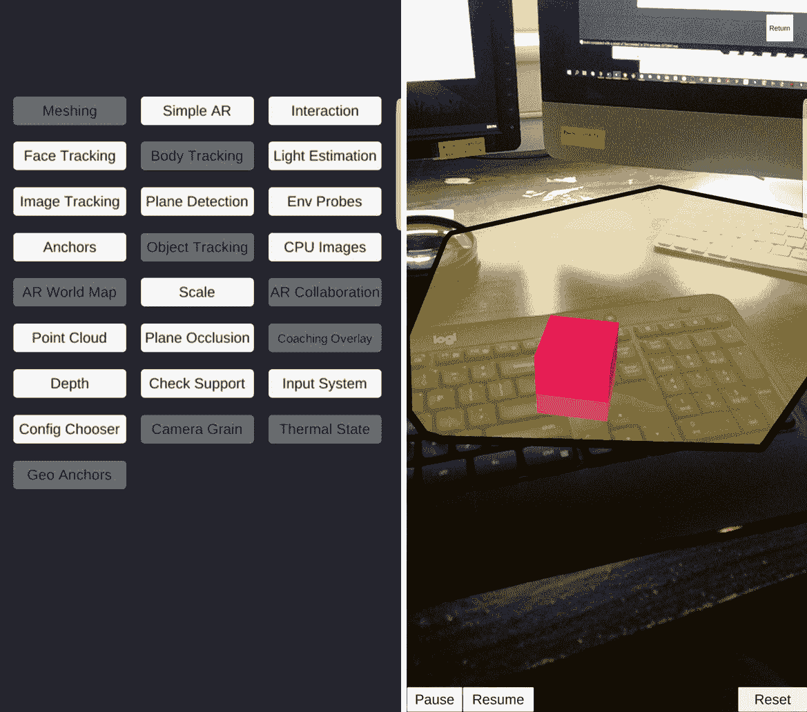

图 2.1 – 我手机运行 arfoundation-samples 应用和 SimpleAR 场景的截图

AR Foundation（以及这个项目）的一个酷特点是它可以在运行时检测运行其上的设备的性能。这意味着当 AR Foundation 检测到该场景中演示的功能不支持该设备时，主菜单中的按钮将被禁用。（我在前面的屏幕截图中使用的设备是安卓手机，因此一些仅限 iOS 的功能场景被禁用）。

点击**简单 AR**按钮打开该场景。您应该在设备屏幕上看到相机视频流。缓慢地将手机向不同方向移动，靠近或远离。当它扫描环境时，特征点和平面将被检测并在屏幕上渲染。轻触其中一个平面，在场景中放置一个立方体，如前一个屏幕截图的右侧面板所示。

样本项目中的某些资源和脚本对于构建我们自己的项目可能很有用。我现在将向您展示如何导出它们。

## 导出样本资源以供重用

Unity 提供了使用`.unitypackage`文件在项目之间共享资产的能力。让我们从 AR Foundation Samples 项目中导出资产以供重用。我喜欢的一个技巧是首先将所有示例文件夹移动到一个根文件夹中。在 Unity 中打开*arfoundation-samples*项目，请执行以下步骤：

1.  通过点击窗口左上角的**+**图标并选择**文件夹**，在`Assets`中命名`ARF-samples`。

1.  将以下文件夹拖入`ARF-samples`文件夹中：`Materials`、`Meshes`、`Prefabs`、`Scenes`、`Scripts`、`Shaders`和`Textures`。也就是说，将它们全部移动，但保留根目录下的`XR`文件夹。

1.  右键单击`ARF-samples`文件夹并选择**导出包**。

1.  **导出包**窗口将打开。点击**导出**。

1.  选择项目根目录外的目录，命名文件（例如，`arf-samples`），然后点击**保存**。

**项目**窗口中的`Assets/ARF-samples/`文件夹在以下屏幕截图中显示：

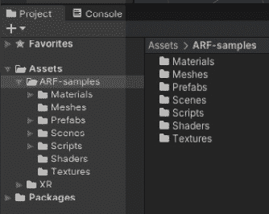


图 2.2 – 正在导出到.unitypackage 文件的示例资产文件夹

如果你愿意，现在可以关闭`arfoundation-samples`项目了。你现在有一个资产包可以在其他项目中使用。

小贴士 – 通过复制示例项目开始新项目

从头开始创建新的 Unity AR 项目的一个替代方法是复制*arfoundation-samples*项目作为新 AR 项目的起点。为此，从你的 Windows 资源管理器（或 macOS Finder），复制整个项目文件夹，然后将其添加到 Unity Hub 中。这样，你就可以在一个地方获得所有示例资产和演示场景，并且它已经设置了合理的默认项目设置。我经常这样做，特别是对于快速演示和小型项目。

接下来，我们将导入示例资产到你的 Unity 项目中，并构建给定的 SimpleAR 场景。

# 在你的项目中构建 SimpleAR 场景

正如你将在本章后面看到的那样，示例项目包括一些我们可以用于你自己的项目的资产，节省了你的时间和精力，尤其是在开始时。我们将导入我们刚刚导出的`unitypackage`，然后构建给定的 SimpleAR 场景，作为另一个测试来验证你是否已经设置好构建和运行 AR 应用程序。

## 创建一个新项目

如果你已经设置了一个用于 AR 开发的 Unity 项目，如*第一章**，*为 AR 开发设置*中详细说明，你可以在 Unity 中打开它并跳过本节。如果没有，请执行以下步骤，这些步骤已经简化以方便你。如果你需要更多详细信息或解释，请重新查阅*第一章**，*为 AR 开发设置*。

要创建和设置一个新的 Unity 项目，其中包含 AR Foundation、Universal Render Pipeline 和新的输入系统，以下是简化的步骤：

1.  通过打开`MyARProject`并点击**创建**来**创建一个新的项目**。

1.  通过在 Unity 编辑器中选择 Unity Hub 的**项目**列表中的项目来**打开你的项目**。

1.  通过转到**文件 | 构建设置**，从**平台**列表中选择**Android**或**iOS**，并点击**切换平台**来**设置你的目标平台**。

1.  根据*第一章**，通过转到**编辑 | 项目设置 | 玩家**窗口来**设置玩家设置**，设置 AR 开发或你的设备的文档。例如，Android ARCore 不支持 Vulkan 图形，需要**牛轧糖（API 级别 24）**作为最低要求。

1.  通过转到**编辑 | 项目设置 | XR 插件管理器 | 安装 XR 插件管理**来**安装 XR 插件**。然后，勾选你设备的**插件提供商**复选框。

1.  通过在搜索输入字段中转到`ar`，选择**AR Foundation**包，并点击**安装**来**安装 AR Foundation**。

1.  通过在搜索输入字段中转到`input`，选择**输入系统**包，并点击**安装**来**安装输入系统包**。

    当提示启用输入后端时，你可以回答**是**，但我们将实际上在将样本资产导入项目时将此设置更改为**两者**。

1.  通过定位到`Assets/Settings/`文件夹，将**AR 背景渲染器**添加到 URP 前向渲染器中。在其**检查器**窗口中，点击**添加渲染器功能**并选择**AR 背景渲染器功能**。

你可能想要将这些步骤添加到书签中以便将来参考。接下来，我们将导入从 AR Foundation 示例项目中导出的样本资产。

## 将样本资产导入到你的项目中

现在你已经设置了一个用于 AR 开发的 Unity 项目，你可以将样本资产导入到你的项目中。在你的 Unity 项目中打开项目，执行以下步骤：

1.  通过在主菜单中选择**资产 | 导入包 | 自定义包**来导入包。

1.  在你的系统上定位`arf-samples.unitypackage`文件并点击**打开**。

1.  将会打开**导入 Unity 包**窗口。点击**导入**。

1.  如果你使用的是**通用渲染管线**（或 HDRP），而不是像我们这样使用内置渲染管线，你需要转换导入的材料。选择**编辑 | 渲染管线 | URP | 将项目材料升级到 URP 材料**。然后，当提示时，点击**继续**。

1.  然后，使用**编辑 | 项目设置 | 玩家**转到**玩家设置**，选择**配置 | 活动输入处理**，并选择**两者**。然后，当提示时，点击**应用**。

1.  在本书的项目中，我们将使用新的输入系统。然而，一些示例项目中的演示场景仍在使用旧的输入管理器。如果你选择**输入系统包（新）**作为**活动输入处理**，那么这些演示场景可能无法运行。

希望所有资产都能无问题导入。然而，在编译示例脚本时可能会出现一些错误。这可能发生如果示例项目使用比您的项目更新的 AR Foundation 版本，并且它引用了您的项目未安装的功能的 API 函数。最简单的解决方案是将 AR Foundation 的版本升级到与示例项目相同或更新的版本。为此，请执行以下步骤：

1.  要查看错误消息，请使用其标签或选择**窗口 | 通用 | 控制台**来打开**控制台**窗口。

1.  假设在我的项目中，我安装了*AR Foundation 4.0.12*，但示例项目使用的是*版本 4.1.3*的功能，这些功能在我的版本中不可用。在这里，我将前往**窗口 | 软件包管理器**，选择**AR Foundation**软件包，点击**查看其他版本**，选择 4.1.3 版本，然后点击**更新到 4.1.3**按钮。

1.  项目也可能正在使用软件包的预览版本。通过选择**编辑 | 项目设置 | 软件包管理器 | 启用预览软件包**来启用预览软件包。

1.  确保 ARCore XR 插件和/或 AR Kit XR 插件版本与项目使用的 AR Foundation 软件包版本相匹配。

1.  您可能还会看到一条消息，说明一些示例脚本需要您在项目中启用“不安全”的代码。前往**项目设置 | 玩家 | 脚本编译 | 允许'不安全'代码**并勾选复选框。

    这并不像听起来那么可怕。“不安全”的代码通常意味着您安装的某个组件正在从项目调用 C++代码，从编译器的角度来看，该项目可能存在潜在的不安全性。在 Unity 中启用不安全代码通常不会成问题，除非，例如，您正在将 WebGL 发布到 WebPlayer，而我们不是这样做的。

最后，您可以通过构建和运行 SimpleAR 场景来验证您的设置，这次是从您自己的项目中。请执行以下步骤：

1.  打开`ARF-samples/Scenes/SimpleAR/`文件夹，双击**SimpleAR**场景文件。

1.  通过前往**文件 | 构建设置**来打开**构建设置**窗口。

1.  对于**构建中的场景**列表，点击**添加打开场景**按钮，并取消勾选列表中除 SimpleAR 之外的所有场景。

1.  确保您的设备通过 USB 连接。

1.  按`Builds/`。如果需要，给出一个文件名，然后按**保存**。完成此任务可能需要一些时间。

应用程序应在您的设备上成功构建和运行。如果您遇到任何错误，请查阅本章以及*第一章**，设置 AR 开发环境*中详细说明的每个步骤。

当应用程序启动时，如前所述，您应该在屏幕上看到一个相机视频流。慢慢将您的手机向不同方向移动，靠近/远离。当它扫描环境时，特征点和平面将被检测并在屏幕上渲染。轻触这些平面之一，在场景中放置一个立方体。

你的项目现在已准备好进行 AR 开发了！

# 开始一个新的基本 AR 场景

在本节中，我们将创建一个与 `SimpleAR`（实际上，更像是名为 `InputSystem_PlaceOnPlane` 的样本场景）非常相似的场景，但我们将从一个新的空场景开始。我们将向场景层次结构中添加 AR 会话和 AR 会话原点对象，由 AR Foundation 提供，然后添加平面和点云的可追踪功能管理器。在本章的后续部分，我们将设置输入系统动作控制器，编写一个 C# 脚本来处理任何用户交互，并创建一个 3D 预制件图形以放置在场景中。

因此，按照以下步骤开始新场景：

1.  通过访问 **文件 | 新场景** 创建一个新的场景。

1.  如果提示，请选择 **基本（内置）** 模板。然后，点击 **创建**。

    Unity 允许你在创建新场景时使用场景模板。名为 **基本（内置）** 的模板与 Unity 早期版本中的默认新场景相当。

1.  通过使用 *右键单击* | **删除**（或键盘上的 *Del* 键）从 **层次结构** 窗口中删除 **主摄像头**。

1.  通过从主菜单中选择 **GameObject**，然后选择 **XR | AR Session** 来添加 AR 会话。

1.  通过从主菜单中选择 **GameObject**，然后选择 **XR | AR Session Origin** 来添加 AR 会话原点。

1.  展开**AR 会话原点**并选择其子项；即 **AR 摄像头**。在 **检查器** 窗口中，使用左上角的 **标签** 选择器将其设置为我们的 **主摄像头**。（这不是必需的，但将场景中有一个标记为 **主摄像头** 的摄像头作为良好实践是不错的。）

1.  使用 `Assets/Scenes/` 文件夹保存场景，命名为 `BasicARScene`，然后点击 **保存**。

你的场景层次结构现在应该如下所示：

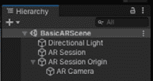

图 2.3 – 开始场景层次结构

现在，我们可以更仔细地查看我们刚刚添加的对象，从 AR 会话对象开始。

## 使用 AR 会话

**AR 会话** 对象负责在目标平台上启用和禁用增强现实功能。当你在场景 **层次结构** 中选择 **AR 会话** 对象时，你可以在 **检查器** 窗口中看到其组件，如下面的截图所示：

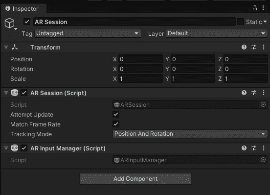

图 2.4 – AR 会话对象的检查器窗口

每个 AR 场景必须包含一个（且仅有一个）AR 会话。它提供了几个选项。通常，你可以将这些选项保留为它们的默认值。

**尝试更新**选项指示 AR 会话尝试在设备上安装底层 AR 支持软件（如果尚未安装）。并非所有设备都需要这样做。例如，iOS 设备如果支持 AR，则不需要任何额外的更新。另一方面，要在 Android 上运行 AR 应用程序，设备必须安装 ARCore 服务。大多数 AR 应用程序会在缺少时为你这样做，这就是**AR 会话**的**尝试更新**功能所做的事情。如果需要，当你的应用程序启动且支持软件缺失或需要更新时，AR 会话将尝试安装*Google Play Services for AR*（见[`play.google.com/store/apps/details?id=com.google.ar.core`](https://play.google.com/store/apps/details?id=com.google.ar.core))。如果所需的软件未安装，则设备上将无法使用 AR。你可以选择禁用自动更新并自行实现它们，以自定义用户入门体验。

注意

**检查器**窗口中的**匹配帧率**选项已过时。通常，你希望你的应用程序的帧更新与物理设备的帧率相匹配，通常不需要调整。如果你需要调整它，你应该通过脚本控制（见[`docs.unity3d.com/ScriptReference/Application-targetFrameRate.html`](https://docs.unity3d.com/ScriptReference/Application-targetFrameRate.html))。

关于**跟踪模式**，你通常会将其设置为**位置和旋转**，因为这指定了你的 VR 设备正在使用其 XYZ 位置和围绕每个轴的旋转在物理世界的 3D 空间中进行跟踪。这被称为*6 自由度跟踪*，这可能是你期望的行为。但对于面部跟踪，例如，我们应该将其设置为**仅旋转**，正如你在*第九章**，自拍：制作有趣的面孔*中看到的。

**AR 会话** GameObject 还有一个**AR 输入管理器**组件，用于管理我们的**XR 输入子系统**以跟踪设备在物理 3D 空间中的姿态。它从 AR 相机的**AR 姿态驱动器**（稍后讨论）读取输入。该组件没有选项，但这是设备跟踪所必需的。

我们还在层次结构中添加了一个 AR 会话原点 GameObject。让我们接下来看看它。

## 使用 AR 会话原点

**AR 会话原点**将是所有可跟踪对象的根对象。拥有根原点可以保持相机和任何可跟踪对象在同一空间中，并且它们相对于彼此的位置。这个*会话*（或*设备空间*）包括 AR 相机和任何在真实世界环境中由 AR 软件检测到的*可跟踪*特征。否则，检测到的特征，如平面，将不会相对于相机出现在正确的位置。

小贴士 - 在 AR 中缩放虚拟场景

如果你计划扩展你的 AR 场景，将你的游戏对象放置为 AR Session Origin 的子对象，然后缩放父 AR Session Origin 变换，而不是子对象本身。例如，考虑一个世界级城市地图或游戏法庭缩放到桌面大小。不要缩放场景中的单个对象；相反，通过调整根会话起源对象的大小来缩放一切。这将确保其他 Unity 系统，特别是物理和粒子系统，相对于摄像机空间保持其比例。否则，像重力这样的东西，以每秒米计算，以及粒子渲染可能会出错。

当你在场景 **层次结构** 中选择 **AR Session Origin** 对象时，你可以在 **检查器** 窗口中看到其组件，如下截图所示：

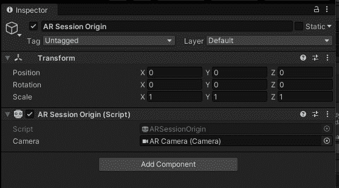

图 2.5 – AR Session 对象的检查器窗口

在撰写本文时，默认的 AR Session Origin 对象仅有一个 **AR Session Origin** 组件。我们希望通过添加更多组件来扩展其行为。

Session Origin 的 **Camera** 属性引用其自身的子 **AR Camera** GameObject，我们将在下一节中探讨。

## 使用 AR Camera

**AR Camera** 对象是 AR Session Origin 的子对象。其 **检查器** 窗口如下截图所示：

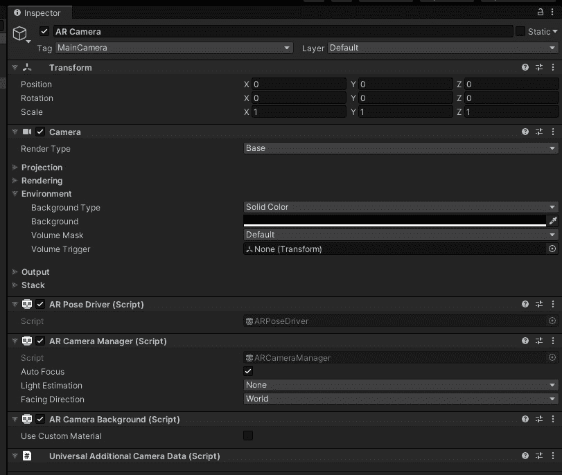

图 2.6 – AR Camera 对象的检查器窗口

在设置过程中，我们将 AR Camera 标记为 `Camera.main`，这是一个通过标签名称查找的快捷方式。

如其名称所示，AR Camera 对象包含一个 `0.1, 20`) 米的视野。在 AR 应用中，将设备放置在虚拟对象几英寸之内并不罕见，因此我们不希望它被裁剪。相反，在 AR 应用中，如果你离你放置在场景中的对象超过 20 米，你可能根本不需要渲染它。

重要的是，与在非 AR 场景中预期使用 Skybox 不同，摄像机的 **背景** 被设置为 **纯黑** 颜色。这意味着背景将通过摄像机的视频流进行渲染。这可以通过 AR Camera 的 **AR Camera Background** 组件进行控制。在高级应用中，你甚至可以自定义视频流的渲染方式，使用自定义的视频 *材质*（这个主题超出了本书的范围）。同样，在可穿戴 AR 设备上，需要一个黑色的摄像机背景，但没有视频流，以便在你的虚拟 3D 图形上方混合视觉透视视图。

视频流源由 AR Camera Manager 组件控制。例如，你可以看到 **面向方向** 可以从 **世界** 更改为 **用户**，用于自拍人脸追踪应用（见 *第九章**，自拍：制作有趣的面孔*）。

当您想在渲染虚拟对象时模拟真实世界光照时，会使用**光照估计**选项。我们将在本章后面使用此功能。

如果您发现相机功能不适合您的 AR 应用，您还可以选择禁用**自动对焦**。

小贴士 - 何时禁用 AR 的自动对焦

通常，我会禁用 AR 应用的自动对焦。当软件使用视频流来帮助检测环境中的平面和其他特征时，它需要一个清晰、一致且详细的视频流，而不是可能因自动对焦而不断变化的视频流。这会使准确处理与 AR 相关的算法以解码其跟踪变得困难。另一方面，自拍人脸跟踪应用可能允许启用自动对焦，并且当用户背后的区域因景深而失去焦点时，可能会改善用户体验。

**AR 姿态驱动器**组件负责在真实世界中跟踪设备时更新 AR 摄像机的变换。（例如，还有类似用于 VR 头戴设备和手柄的组件。）此组件依赖于 XR 插件和输入 XR 子系统来提供位置跟踪数据（见[`docs.unity3d.com/Manual/XRPluginArchitecture.html`](https://docs.unity3d.com/Manual/XRPluginArchitecture.html)）。

我们的下一步是向场景中添加平面和点云可视化器。

## 添加平面和点云管理器

当您的应用运行时，您会要求用户扫描房间，以便 AR 软件检测环境中的特征，如深度点和平面。通常，您会在检测到这些特征时向用户展示。我们通过向 AR 会话原点游戏对象添加相应的特征管理器来实现这一点。例如，要可视化平面，您将向 AR 会话原点对象添加**AR 平面管理器**，而要可视化点云，您将添加**AR 点云管理器**。

AR Foundation 支持检测和跟踪以下功能：

+   *锚点*：物理环境中的固定姿态（由位置和旋转组成）（由 AR 锚点管理器组件控制）。这也被称为参考点。

+   *反射探针*：用于渲染具有光泽表面材料的场景反射探针（由 AR 环境探针管理器组件控制）。

+   *人脸*：由 AR 设备检测到的人脸（由 AR 人脸管理器组件控制）。

+   *人体*：可跟踪的人体及其骨骼（由 AR 人体管理器组件控制）。

+   *图像*：在环境中的 AR 跟踪图像管理器组件中检测和跟踪的二维图像。

+   *参与者*：协作会话中的另一个用户（设备）。

+   *平面*：通常从点云中推断出的水平或垂直的平面（由 AR 平面管理器组件控制）。

+   *点云*：由 AR 设备检测到的深度点集（由 AR 点云管理器组件控制）。

+   *对象*：在环境中检测和跟踪的 3D 对象（由 AR 跟踪对象管理器组件控制）。

并非所有这些功能在所有平台上都受支持。请参阅您当前版本的 AR Foundation 文档（例如，访问 [`docs.unity3d.com/Packages/com.unity.xr.arfoundation@4.1/manual/index.html#platform-support`](https://docs.unity3d.com/Packages/com.unity.xr.arfoundation@4.1/manual/index.html#platform-support) 并在左上角选择您的版本）。我们将在本书的各个项目中使用其中许多功能。在这里，我们将使用平面和点云可追踪对象。请按照以下步骤添加它们：

1.  从 **层次结构** 窗口中选择 **AR 会话原点** 对象。

1.  通过在搜索输入字段中选择 `ar` 并点击 **AR 点云管理器** 来添加点云管理器。

1.  通过在搜索输入字段中选择 `ar` 并点击 **AR 平面管理器** 来添加平面管理器。

1.  在 AR 平面管理器上，将 **检测模式** 更改为仅水平平面，通过选择 **无**（以清除列表），然后选择 **水平**。

你会注意到点云管理器有一个空槽用于点云预制件可视化器，而平面管理器有一个空槽用于平面预制件可视化器。我们将使用来自 Samples 项目的预制件，如下所示：

1.  在 **检查器** 窗口中，转到 **AR 点云管理器 | 点云预制件** 并在字段右侧按下 *甜甜圈* 图标以打开 **选择游戏对象** 对话框。

1.  点击 **资产** 选项卡并双击 **AR 点云可视化器** 预制件。

    您还可能想尝试其他一些点云可视化器预制件，例如 **AR 点云调试可视化器** 和 **AllPointCloudPointsPrefab**。

1.  同样地，对于**AR 平面管理器 | 平面预制件**，在字段右侧按下 *甜甜圈* 图标以打开 **选择游戏对象** 对话框。

1.  点击 **资产** 选项卡并双击 **AR 羽毛平面**。

    还有一些其他的平面可视化预制件可以尝试，例如 **AR 平面调试可视化器**、**AR 羽毛平面淡入** 和 **棋盘格平面**。

1.  通过转到 **文件 | 保存** 来保存场景。

我们正在使用从 Samples 项目中获得的可视化器预制件。在本章的后面部分，我们将更多地讨论预制件，更仔细地查看可视化器预制件，并学习如何编辑它们以创建我们自己的自定义可视化器。首先，我们将向场景中添加 AR Raycast 管理器。

## 添加 AR Raycast 管理器

我知道我们很快还需要另一个组件，称为 **AR Raycast 管理器**。这个组件将由我们的脚本用于确定用户的屏幕触摸是否对应于 AR 软件检测到的 3D 跟踪特征。我们将在脚本中使用它来在平面上放置对象。按照以下步骤将其添加到场景中：

1.  从 **层次结构** 窗口中选择 **AR 会话原点** 对象。

1.  在搜索输入字段中输入`ar`，然后点击**AR 射线投射管理器**。

在**检查器**窗口中，我们现在可以看到我们添加的管理组件的**AR 会话原点**GameObject 看起来是这样的：

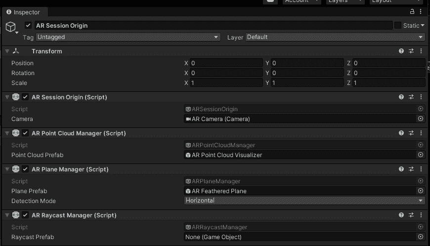

图 2.7 – 带有各种管理组件的 AR 会话原点

另一个方便包含的功能是光估计，它有助于更真实地渲染您的虚拟对象。

## 添加光估计

通过向您的方向光源添加光估计组件，AR 摄像头可以在渲染场景时使用这些信息，尝试使场景的照明更接近真实世界环境。

要添加光估计，执行以下步骤：

1.  在**层次**窗口中，选择**方向光**对象。

1.  在`光估计`中，添加**基本光估计**组件。

1.  在**层次**窗口中，找到**AR 摄像头**（AR 会话原点的子项），将其拖入**检查器**窗口，并将其放置在**光估计 | 摄像头管理器**槽中。

1.  在**层次**窗口中，选择**AR 摄像头**，然后将**AR 摄像头管理器 | 光估计**设置为**全部**。请注意，并非所有平台都支持所有光估计功能，但使用**全部**标志将使它们在运行时使用所有可用的功能。

1.  通过访问**文件 | 保存**来保存您的作品。

好的！我认为我们应该尝试构建并运行到目前为止所做的工作，并确保它正在运行。

## 构建和运行场景

目前，场景初始化 AR 会话，启用 AR 摄像头扫描环境，检测点和平面，并使用可视化工具在屏幕上渲染这些内容。让我们构建场景并确保它运行：

1.  通过访问**文件 | 构建设置**来打开**构建设置**窗口。

1.  对于**构建中的场景**列表，点击**添加打开场景**按钮，并取消选中列表中除当前场景之外的所有场景（我的场景名为**BasicARScene**）。

1.  确保您的设备通过 USB 连接到您的电脑。

1.  按下 `Builds/`。如果需要，输入一个文件名，然后按**保存**。完成这个任务可能需要一些时间。

应用应该能够在您的设备上成功构建和运行。如果您遇到任何错误，请仔细阅读**控制台**窗口中的错误消息。然后，回顾本章和*第一章**，设置 AR 开发环境*中详细说明的每个设置步骤。

当应用启动时，您应该在屏幕上看到一个视频流。慢慢将设备向不同方向移动，靠近或远离。当它扫描环境时，特征点和平面将被检测并在屏幕上使用您选择的可视化工具渲染。

接下来，让我们添加一个功能，可以点击其中一个平面以在那里实例化一个 3D 对象。

# 在平面上放置一个对象

我们现在将添加用户在平面上点击并放置 3D 虚拟对象在场景中的功能。实现这一功能有几个部分：

+   当用户点击屏幕时设置放置对象输入动作。

+   编写一个 PlaceObjectOnPlane 脚本，该脚本响应输入动作并在平面上放置一个对象。

+   使用 AR Raycast Manager 确定放置对象的位置和平面。

+   导入 3D 模型并将其制作成预制件以放置在此场景中。

让我们从创建一个屏幕点击的输入动作开始。

## 设置 PlaceObject 输入动作

我们将使用 Unity 输入系统包来处理用户输入。如果您对输入系统不熟悉，本节中的步骤可能看起来很复杂，但这只是因为它的多功能性。

输入系统允许您定义 **动作**，这些动作将输入的逻辑意义与物理输入方式分开。使用命名动作对应用程序和程序员来说更有意义。

注意 – 输入系统教程

要了解使用输入系统包的更完整教程，请参阅 [`learn.unity.com/project/using-the-input-system-in-unity`](https://learn.unity.com/project/using-the-input-system-in-unity)。

在这里，我们将定义一个与屏幕点击输入数据绑定的 **PlaceObject** 动作。我们将现在设置它，然后在下一节中使用这个输入动作来找到被点击的 AR 平面并在那里放置一个虚拟对象。

在我们开始之前，我将假设您已经通过 **包管理器** 导入了 **输入系统** 包，并在 **玩家设置** 中将 **活动输入处理** 设置为 **输入系统包**（或 **两者**）。现在，按照以下步骤操作：

1.  在 `输入` 中使用 *右键点击* `_App/` 文件夹。

1.  通过在 `输入` 文件夹内 *右键点击*，然后选择 `AR 输入动作` 来创建一个输入动作控制器资产。

1.  点击 **编辑资产** 以打开其编辑器窗口。

1.  在最左侧的 `ARTouchActions`。

1.  在中间的 `PlaceObject` 中使用 *右键点击* | **重命名**。

1.  在右侧的 **属性** 面板中，将 **动作类型** 设置为 **值**。

1.  将其 **控制类型** 设置为 **Vector 2**。

1.  在中间的 **动作** 面板中，点击子项 **<无绑定>** 以添加绑定。

1.  在右侧的 **属性** 面板下 **绑定** 中，使用 **路径** 选择列表，选择 **TouchScreen | Primary Touch | Position**。

1.  在窗口顶部，点击 **保存资产**（除非已勾选 **自动保存** 复选框）。

通过这样，我们创建了一个名为 `Vector2` 的数据资产，其中包含像素坐标中的 X、Y 值。输入动作资产在以下屏幕截图中显示：

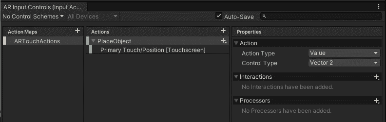

图 2.8 – 我们为屏幕点击设置的 AR 输入动作

现在，我们可以将输入动作添加到场景中。这可以通过玩家输入组件来完成。对于我们的 AR 场景，我们将在 AR Session Origin 上添加一个玩家输入组件，如下所示：

1.  在 **Hierarchy** 窗口中，选择 **AR Session Origin** 对象。

1.  在其 **Inspector** 窗口中，点击 **Add Component | Input | Player Input**。

1.  从 `Inputs/` 文件夹到 **Inspector** 窗口中的 **Player Input | Actions** 插槽。

1.  留下 `On` 前缀（例如，`OnPlaceObject`）并接收一个 `InputValue` 参数([`docs.unity3d.com/Packages/com.unity.inputsystem@1.1/api/UnityEngine.InputSystem.InputValue.html`](https://docs.unity3d.com/Packages/com.unity.inputsystem@1.1/api/UnityEngine.InputSystem.InputValue.html))。

    *广播消息*: 与 Send Messages 类似，广播消息将向此 GameObject 的组件及其所有子组件发送消息([`docs.unity3d.com/ScriptReference/Component.BroadcastMessage.html`](https://docs.unity3d.com/ScriptReference/Component.BroadcastMessage.html))。

    *调用 Unity 事件*: 你可以使用 Inspector 或在脚本中设置事件回调函数([`docs.unity3d.com/Manual/UnityEvents.html`](https://docs.unity3d.com/Manual/UnityEvents.html))。回调函数接收一个 `InputAction.CallbackContext` 参数([`docs.unity3d.com/Packages/com.unity.inputsystem@1.1/api/UnityEngine.InputSystem.InputAction.CallbackContext.html)`](https://docs.unity3d.com/Packages/com.unity.inputsystem@1.1/api/UnityEngine.InputSystem.InputAction.CallbackContext.html))。

    *调用 C# 事件*: 你可以在脚本中设置事件监听器([`docs.microsoft.com/en-us/dotnet/csharp/programming-guide/events/`](https://docs.microsoft.com/en-us/dotnet/csharp/programming-guide/events/))。

    要了解更多关于 Player Input 组件的信息，请参阅 `docs.unity3d.com/Packages/com.unity.inputsystem@1.0/api/UnityEngine.InputSystem.PlayerInput.html`。

我已经决定使用 `OnPlaceObject` 函数，我们将在下一部分进行操作。但首先，我将提供一个关于 Unity C# 编程的快速介绍。

## 介绍 Unity C# 编程和 MonoBehaviour 类

编写 C# 脚本是每个 Unity 开发者必备的技能。你不需要成为编程专家，但无法避免编写一些代码来使你的项目工作。如果你是编程新手，可以简单地遵循这里提供的说明，随着时间的推移，你会变得更加熟练。我也鼓励你学习 Unity 提供的一些优秀的入门教程([`learn.unity.com/`](https://learn.unity.com/))以及其他教程，包括以下内容：

+   **Unity 中 C# 编程入门**: https://unity3d.com/learning-c-sharp-in-unity-for-beginners

+   **与脚本一起工作**: [`learn.unity.com/tutorial/working-with-scripts`](https://learn.unity.com/tutorial/working-with-scripts)

+   **入门脚本编程**: https://learn.unity.com/project/beginner-gameplay-scripting

既然如此，当我们通过这一节时，我会提供一些简要的解释。但我会假设您至少对 C#语言语法、常见的编程词汇（例如，*类*、*变量*和*函数*）、使用编辑器（例如 Visual Studio）以及如何阅读由于打字错误或其他常见的编码错误而在您的**控制台**窗口中出现的错误消息有基本的了解。

我们将创建一个名为`PlaceObjectOnPlane`的新脚本。然后，我们可以将此脚本作为组件附加到场景中的 GameObject 上。它将随后出现在对象的**检查器**窗口中。让我们首先执行以下步骤：

1.  在`Scripts/`文件夹中（我的文件夹是`Assets/_App/Scripts/`），右键单击它，然后选择**创建 | C# 脚本**。

1.  将文件命名为`PlaceObjectOnPlane`（文件名中不允许有空格或其他特殊字符，并且应以大写字母开头）。

    这创建了一个具有`.cs`文件扩展名的新 C#脚本（尽管您在**项目**窗口中看不到扩展名）。

1.  双击**PlaceObjectOnPlane**文件以在您的代码编辑器中打开它。默认情况下，我的系统使用 Microsoft Visual Studio。

如您在以下模板的初始脚本内容中看到的，`PlaceObjectOnPlane.cs`文件声明了一个名为`PlaceObjectsOnPlane`的 C#类，其名称与`.cs`文件相同（名称*必须*匹配；否则，将在 Unity 中引起编译错误）：

```cs
using System.Collections;
using System.Collections.Generic;
using UnityEngine;
public class PlaceObjectOnPlane : MonoBehaviour
{
    // Start is called before the first frame update
    void Start()
    { 
    }
    // Update is called once per frame
    void Update()
    { 
    }
}
```

此脚本中的前三行有一个`using`指令，它声明了一个将用于脚本中的 SDK 库或命名空间。当脚本引用外部符号时，编译器需要知道它们的位置。在这种情况下，我们说的是我们可能会使用标准.NET 系统库来管理对象集合（*集合*）。在这里，我们正在使用 Unity API。

*UnityEngine*定义的符号之一是`PlaceObjectsOnPlane`类被声明为`MonoBehaviour`的子类。（请注意其英式拼写，“iour”）。附加到场景中 GameObject 的脚本必须是`MonoBehaviour`的子类，它提供了一系列与附加的 GameObject 相关的功能和服务的功能。

首先，`MonoBehaviour`提供了对 GameObject 生命周期和 Unity `Start()`函数的钩子。这是一个添加一些初始化代码的好地方。

Unity 游戏引擎的主要目的是每帧渲染当前场景视图，可能是每秒 60 次或更多。每次帧更新时，您的`Update()`函数将自动被调用。这就是您放置需要每帧运行的任何运行时代码的地方。尽量保持`Update()`中完成的工作量最小；否则，您的应用程序可能会感觉缓慢和笨拙。

您可以在此处了解更多关于 MonoBehaviour 类的信息：[MonoBehaviour](https://docs.unity3d.com/ScriptReference/MonoBehaviour.html)。要全面了解 GameObject 和 MonoBehaviour 脚本的生命周期，请查看此流程图：[执行顺序](https://docs.unity3d.com/Manual/ExecutionOrder.html)。

我们现在可以编写脚本。由于这是本书中的第一个脚本，我会慢慢展示。

## 编写 PlaceObjectOnPlane 脚本

`PlaceObjectOnPlane` 脚本的目的是在用户触摸时将虚拟对象放置在 AR 平面上。我们首先概述逻辑（在 C# 中，同一行后面的任何文本 `//` 都是注释）：

```cs
using System.Collections;
using System.Collections.Generic;
using UnityEngine;
using UnityEngine.InputSystem;
public class PlaceObjectOnPlane : MonoBehaviour
{
    void OnPlaceObject(InputValue value)
    {
        // get the screen touch position
        // raycast from the touch position into the 3D scene            looking for a plane
        // if the raycast hit a plane then
        //      get the hit point (pose) on the plane
        //      if this is the first time placing an object,
        //          instantiate the prefab at the hit position                     and rotation
        //      else
        //          change the position of the previously                     instantiated object
    }
}
```

结果表明，在此脚本中不需要 `Update` 函数，因为它仅用于帧更新，而此脚本可以忽略这些更新。

此脚本实现了 `OnPlaceObject` 方法，该方法在用户触摸屏幕时被调用。正如我们之前提到的，我们添加到 AR Session Origin 的 Player Input 组件使用 `OnPlacedObject` 作为 `InputValue`。请注意，我还添加了一行使用 `UnityEngine.InputSystem;`，它定义了 `InputValue` 类。

首先，我们需要从传递的输入值中获取屏幕触摸位置。添加以下代码，它声明并分配给局部变量 `touchPosition`：

```cs
        // get the screen touch position
        Vector2 touchPosition = value.Get<Vector2>();
```

下一步是确定屏幕触摸是否对应于在 AR 场景中检测到的平面。AR Foundation 通过使用我们之前添加到 AR Session Origin GameObject 的 AR Raycast Manager 组件来提供解决方案。现在，我们将使用它来编写脚本。将以下行添加到脚本顶部：

```cs
using UnityEngine.XR.ARFoundation;
using UnityEngine.XR.ARSubsystems; 
```

然后，在 `OnPlaceObject` 函数内部，添加以下代码：

```cs
        // raycast from the touch position into the 3D scene            looking for a plane
        // if the raycast hit a plane then  
        ARRaycastManager raycaster =            GetComponent<ARRaycastManager>();
        List<ARRaycastHit> hits = new List<ARRaycastHit>();
        if (raycaster.Raycast(touchPosition, hits,            TrackableType.PlaneWithinPolygon))
        {
            // 
        }
```

首先，我们获取 `raycaster` 的引用。我们声明并初始化一个 `ARRaycastHit` 列表，当射线检测到物体时，该列表将被填充。然后，我们调用 `raycaster.Raycast()`，传入屏幕的 `touchPosition` 和 `hits` 列表的引用。如果找到平面，它将返回 `true` 并将 `hits` 列表填充详细信息。第三个参数指示 `raycaster.Raycast` 可以击中的跟踪类型。在这种情况下，`PlaneWithinPolygon` 过滤器用于 2D 凸多边形平面。

信息 - 关于 AR 射线投射的更多信息

有关使用 ARRaycastManager 的更多信息，请参阅[这里](https://docs.unity3d.com/Packages/com.unity.xr.arfoundation@4.1/manual/raycast-manager.html)。

您可以在[可传递的跟踪类型列表](https://docs.unity3d.com/Packages/com.unity.xr.arsubsystems@4.1/api/UnityEngine.XR.ARSubsystems.TrackableType.html)中查看。

`if`语句内的代码只有在`raycaster.Raycast`返回`true`时才会执行；也就是说，如果用户在屏幕上点击了一个可以投射到场景中可追踪平面的位置。在这种情况下，我们必须在那里创建一个 3D GameObject。在 Unity 中，创建一个新的 GameObject 被称为**实例化**对象。您可以在此处了解更多信息：[`docs.unity3d.com/Manual/InstantiatingPrefabs.html`](https://docs.unity3d.com/Manual/InstantiatingPrefabs.html)。

首先，让我们声明一个变量`placedPrefab`，用于保存我们想要在所选平面上实例化的预制体的引用。使用`[SerializedField]`指令允许属性在 Unity 检查器中可见并可设置。我们还将声明一个`private`变量`spawnedObject`，它保存已实例化对象的引用。将以下代码添加到类顶部：

```cs
public class PlaceObjectOnPlane : MonoBehaviour
{
    [SerializeField] GameObject placedPrefab;
    GameObject spawnedObject;
```

现在，在`if`语句内部，如果这是用户第一次点击屏幕，我们将实例化一个新的对象，并将其分配给`spawnedObject`。如果对象已经实例化并且用户再次点击屏幕，我们将把对象移动到新位置。添加以下突出显示的代码：

```cs
    public void OnPlaceObject(InputValue value)
    {
        // get the screen touch position
        Vector2 touchPosition = value.Get<Vector2>();
        // raycast from the touch position into the 3D scene            looking for a plane
        // if the raycast hit a plane then  
        ARRaycastManager raycaster =            GetComponent<ARRaycastManager>();
        List<ARRaycastHit> hits = new List<ARRaycastHit>();
        if (raycaster.Raycast(touchPosition, hits,            TrackableType.PlaneWithinPolygon))
        {
            // get the hit point (pose) on the plane
            Pose hitPose = hits[0].pose;
            // if this is the first time placing an object,
            if (spawnedObject == null)
            {
                // instantiate the prefab at the hit position                    and rotation
                spawnedObject = Instantiate(placedPrefab,                    hitPose.position, hitPose.rotation);
            }
            else
            {
                // change the position of the previously                    instantiated object
spawnedObject.transform.SetPositionAndRotation(                    hitPose.position, hitPose.rotation); 
            }
        }
    }
```

`Raycast`填充了一个包含击中点的列表，因为用户点击屏幕的线上可能有多个可追踪的平面。它们按从近到远的顺序排序，所以在这种情况下，我们只对第一个感兴趣，即`hits[0]`。从那里，我们获取点的`Pose`，这是一个包含 3D 位置和旋转值的简单结构。这些值在放置对象时被使用。

然后，保存脚本文件。

现在，回到 Unity 中，我们将通过以下步骤将我们的脚本作为组件附加到**AR Session Origin**：

1.  首先，检查**控制台**窗口（使用**控制台**选项卡或**窗口 | 通用 | 控制台**）并确保没有来自脚本的编译错误。如果有，请回到您的代码编辑器并修复它们。

1.  在**层次**窗口中，选择**AR Session Origin**对象。

1.  在脚本中声明的`placedPrefab`变量中。让我们用 Samples 资源提供的红色立方体预制体填充它。

1.  在`ARF-samples/Prefabs/`文件夹中。

1.  将**AR Placed Cube**预制体拖动到**检查器**窗口中的**Place Object On Plane | Placed Prefab**槽位。

1.  通过访问**文件 | 保存**来保存场景。

我们作为组件在 AR Session Origin GameObject 上的脚本现在应该如下所示：

![图 2.9 – 将 PlaceObjectOnPlane 作为组件使用，其 Placed Prefab 槽位已填充]

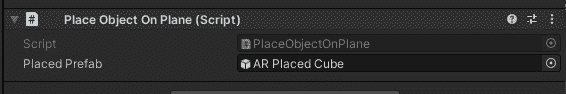

图 2.9 – 将 PlaceObjectOnPlane 作为组件使用，其 Placed Prefab 槽位已填充

让我们试试！我们现在准备好构建和运行场景。

## 构建和运行场景

如果您之前已经构建了场景，在上一节中，您可以访问**文件 | 构建并运行**以启动此过程。否则，执行以下步骤来构建和运行场景：

1.  通过访问**文件 | 构建设置**来打开**构建设置**窗口。

1.  对于**构建中的场景**列表，点击**添加打开场景**按钮，取消勾选列表中除这个场景之外的所有场景（我的名为**BasicARScene**）。

1.  确保您的设备通过 USB 连接。

1.  按下`Builds/`。如果需要，输入一个文件名，然后按`Update()`按钮将其更新为`Start()`（例如，初始化`raycaster`变量）。

1.  避免在`Update()`中分配新的内存，以避免内存碎片化和垃圾回收（例如，将`hits`列表初始化为类变量）。

修改后的脚本如下所示。更改的代码以顶部部分开始，其中包含新的类变量和`Start()`函数：

```cs
public class PlaceObjectOnPlane : MonoBehaviour
{
    [SerializeField] GameObject placedPrefab;
    GameObject spawnedObject;
    ARRaycastManager raycaster;
    List<ARRaycastHit> hits = new List<ARRaycastHit>();
    void Start()
    {
        raycaster = GetComponent<ARRaycastManager>();
    }
```

现在，添加`OnPlacedObject`函数，如下所示：

```cs
    public void OnPlaceObject(InputValue value)
    {
        // get the screen touch position
        Vector2 touchPosition = value.Get<Vector2>();
        // raycast from the touch position into the 3D scene            looking for a plane
        // if the raycast hit a plane then  
        // REMOVE NEXT TWO LINES
        // ARRaycastManager raycaster =               GetComponent<ARRaycastManager>();
        //List<ARRaycastHit> hits = new List<ARRaycastHit>();
```

1.  if (raycaster.Raycast(touchPosition, hits, TrackableType.PlaneWithinPolygon))

```cs
        {
```

请保存脚本，然后再次构建并运行它以验证它仍然有效。

信息 - 公共与私有以及对象封装

面向对象编程的驱动原则之一是为此目的进行`private`和`public`声明。在 C#中，任何未声明为`public`的符号都假定是私有的。在 Unity 中，任何公共变量在脚本作为组件附加到游戏对象时，在检查器窗口中也是可见的（序列化的）。通常，私有变量是不可见的。使用`[SerializeField]`指令可以使私有变量在检查器窗口中也可见并可修改。

恭喜！这并不一定是一个出色的应用程序，它是根据 Samples 项目中的示例场景建模的，但你从**文件 | 新场景**开始，完全自己构建了它。现在，让我们玩玩它，找到一个比小红立方体更有趣的 3D 模型。

# 创建用于放置的预制件

我们在本章中放置在平面的预制件对象是名为*AR Placed Cube*的对象，它是从 AR Foundation Samples 项目中导入的。让我们找到一个不同、更有趣的模型来使用。在这个过程中，我们将了解更多关于游戏对象、变换和预制件的知识。

## 理解游戏对象和变换

我认为一个好的开始是仔细看看我们一直在使用的*AR Placed Cube*预制件。让我们通过以下步骤在编辑器中打开它：

1.  在`ARF-samples/Prefabs/`文件夹中。

1.  双击**AR Placed Cube**预制件。

我们现在正在编辑预制件，如下面的截图所示（我已将我的窗口布局调整为与默认布局不同）：

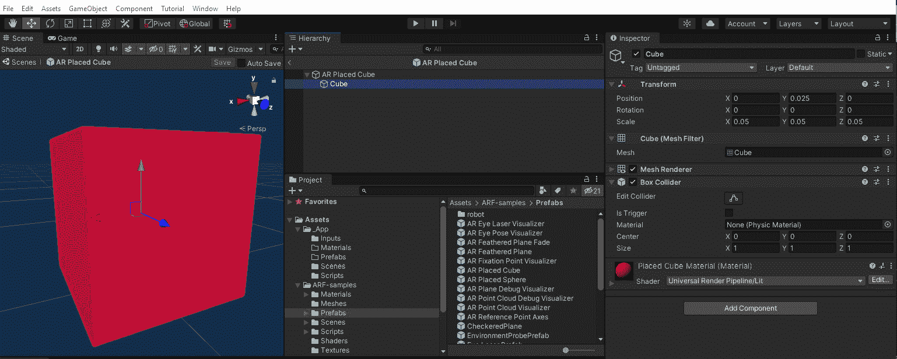

图 2.10 – 编辑 AR Placed Cube 预制件

`(0, 0, 0)`), `(0, 0, 0)`), 和 `(1, 1, 1)`）。

在放置在 AR 立方体下面的子立方体是`0.05, 0.05, 0.05`（单位是米，0.05 米大约是每边 2 英寸）。这就是它在我们的应用物理环境中放置时的尺寸。

你还会注意到子立方体的 X-Y-Z 坐标`0, 0.025, 0`），在 Unity 中，Y 轴是向上轴。由于 0.025 是 0.05 的一半，我们将立方体提升到其高度的一半以上零 X-Z 平面。

立方体的原点是它的中心。因此，AR 放置立方体的原点是子立方体的底部。换句话说，当我们放置这个预制件在场景中时，立方体的底部侧面位于由*射线投射*确定的姿态位置。

使用空的 GameObject 来归一化模型的比例并调整其原点，在 Unity 开发中是一个常见的模式。

现在，让我们为我们的应用找到一个不同的模型，并在将其制作成预制件时对其进行归一化。

## 寻找 3D 模型

要找到一个 3D 模型，你可以自由地在互联网上搜索你喜欢的 3D 模型。如果你是 3D 艺术家，你可能已经有了自己的模型。你将需要一个相对简单、低多边形的模型（即多边形数量不多）。寻找`.FBX`或`.OBJ`格式的文件，因为它们将无需转换即可导入 Unity。

我在`cgtrader.com`这里找到了一个病毒微生物的模型：[`www.cgtrader.com/free-3d-models/science/medical/microbe`](https://www.cgtrader.com/free-3d-models/science/medical/microbe)。这是一个免费下载且无版税的模型，有 960 个多边形，以 FBX 格式提供。我的文件名为`uploads_files_745381_Microbe.fbx`。

一旦你找到了文件并将其下载到你的电脑上，执行以下步骤将其导入 Unity 中：

1.  在你的`_App`文件夹下的`Models`中（这一步是可选的）。

1.  将模型从你的 Windows 文件资源管理器或 macOS Finder 拖到`Models`文件夹中，以将其导入到项目中。或者，你也可以通过主菜单点击**Assets | Import New Asset**。

1.  当你在**Project**窗口中选择模型时，你可以在**Inspector**窗口中查看它。在那里，看看许多**导入设置**。通常，你可以保持它们的默认值。

现在，我们将制作模型的预制件，并确保它已缩放到可用的尺寸。我喜欢使用临时的立方体对象来测量它：

1.  在你的`_App`文件夹下的`Prefabs`中（这一步是可选的）。

1.  在`Prefabs`文件夹内右键点击，选择`Virus`）。

1.  双击新的预制件，或者在**Inspector**窗口中点击其**Open Prefab**按钮。

1.  为了测量目的，从主菜单中选择**GameObject | 3D Object | Cube**来添加一个临时立方体（或者使用左上角的**+**按钮，或者在**Hierarchy**窗口中直接右键点击）。

1.  假设我想我的模型在场景中看起来与之前使用的红色立方体大小相同，设置这个测量立方体`0.05, 0.05, 0.05`）和其`0, 0.025, 0`）。

1.  将你从`Models`文件夹中导入的 3D 模型拖到**Hierarchy**窗口中，作为根对象的子对象。

1.  使用`0.5, 0.05, 0.05`), `0, 0.04, 0`), `0, 0, 0`）。

1.  删除或禁用立方体。在**立方体**被选中时，在其**检查器**窗口中，取消勾选左上角的**启用**复选框。

1.  通过点击**场景**窗口顶部的**保存**按钮来保存预制件。

我找到的模型没有附带材质，所以现在让我们为它创建一个。在我们正在编辑的预制件仍然打开以供编辑时，执行以下额外步骤：

1.  在你的`_App`文件夹下的`Materials`中（此步骤是可选的）。

1.  在`Materials`文件夹内右键点击，选择`Virus Material`。

1.  将**病毒材料**拖放到**层次**窗口中的模型对象（**uploads_files_745381_Microbe**）上。

1.  在`0.5`中选择微生物模型。

1.  再次，**保存**你的预制件。

1.  通过点击**层次**窗口左上角的**<**按钮返回场景编辑。

当打开进行编辑时，我的预制件现在看起来是这样的（我已经重新排列了我的窗口，使它们与默认布局不同）：

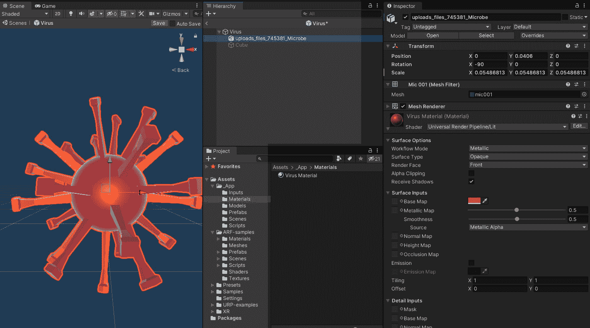

图 2.11 – 编辑我的病毒预制件

我们现在准备好将这个预制件添加到场景中。之后，我们将构建并运行完成的项目。

## 完成场景

我们现在有了自己的预制件可以放置在 AR 场景中。让我们将其添加到**放置对象在平面上**组件中，如下所示：

1.  确保你已经退出了预制件编辑模式，现在正在编辑 BasicARScene。

1.  在**层次**窗口中选择**AR 会话原点**对象。

1.  从`_App/Prefabs/Virus`拖放到**检查器**窗口，到**放置对象在平面上 | 放置预制件**槽位。

1.  使用**文件 | 保存**来保存场景。

1.  通过转到**文件 | 构建并运行**来构建并运行场景。

如以下截图所示，我已经在我的桌子上感染了病毒！

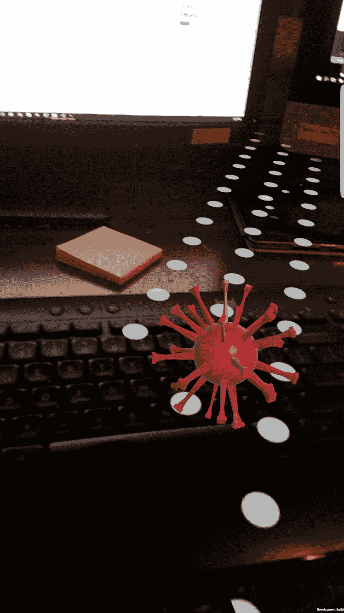

图 2.12 – 运行项目显示键盘上的病毒

就这样。你已经成功创建了一个增强现实场景，将虚拟 3D 模型放置在现实世界中。也许你不会选择病毒，但这却是时代的标志！

你现在可以开始创建自己的 Unity AR 项目了。

# 摘要

在本章中，我们使用 AR Foundation 检查了增强现实场景的核心结构。我们从 Unity 的 AR Foundation Samples 项目开始，构建它以在您的设备上运行，然后将其资产导出为资产包以供重用。然后，我们将这些示例资产导入到我们的项目中，更详细地查看`SimpleAR`场景，并在您的设备上构建它。

然后，从一个全新的空白场景开始，我们从头开始构建了自己的基本 AR 演示，允许用户在物理世界环境中放置一个虚拟 3D 对象。为此，我们添加了`OnPlaceObject`动作消息。这个函数从屏幕触摸位置进行射线投射，以在可追踪的水平平面上找到一个姿态点。然后，它在该位置平面上实例化一个对象。我们通过在互联网上找到一个 3D 模型，将其导入到项目中，从模型创建一个缩放预制件，并将其用作场景中放置的虚拟对象来结束这一章节。在过程中，我们多次进行了**构建和运行**项目，以验证我们在此阶段的工作在目标设备上是否按预期运行。

在下一章中，我们将探讨工具和实践，以促进 AR 项目的开发和故障排除，这将有助于提高开发者的工作流程，然后再继续在后续章节中创建更完整的项目。
