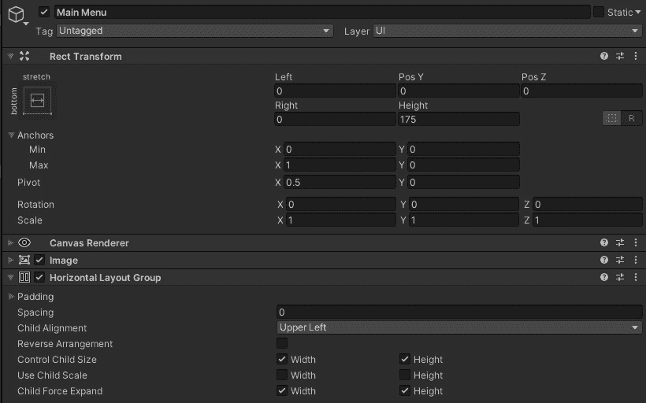
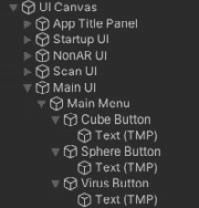
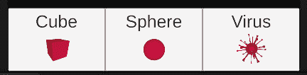
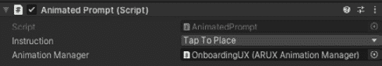
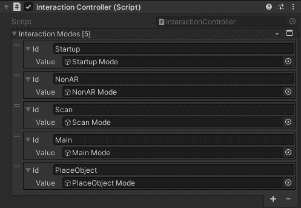
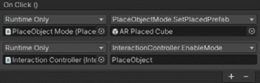
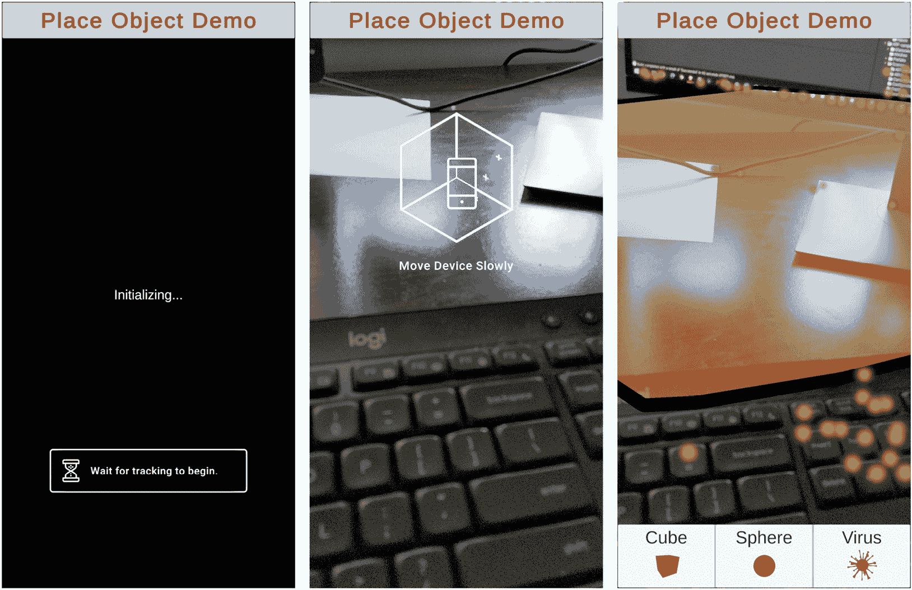
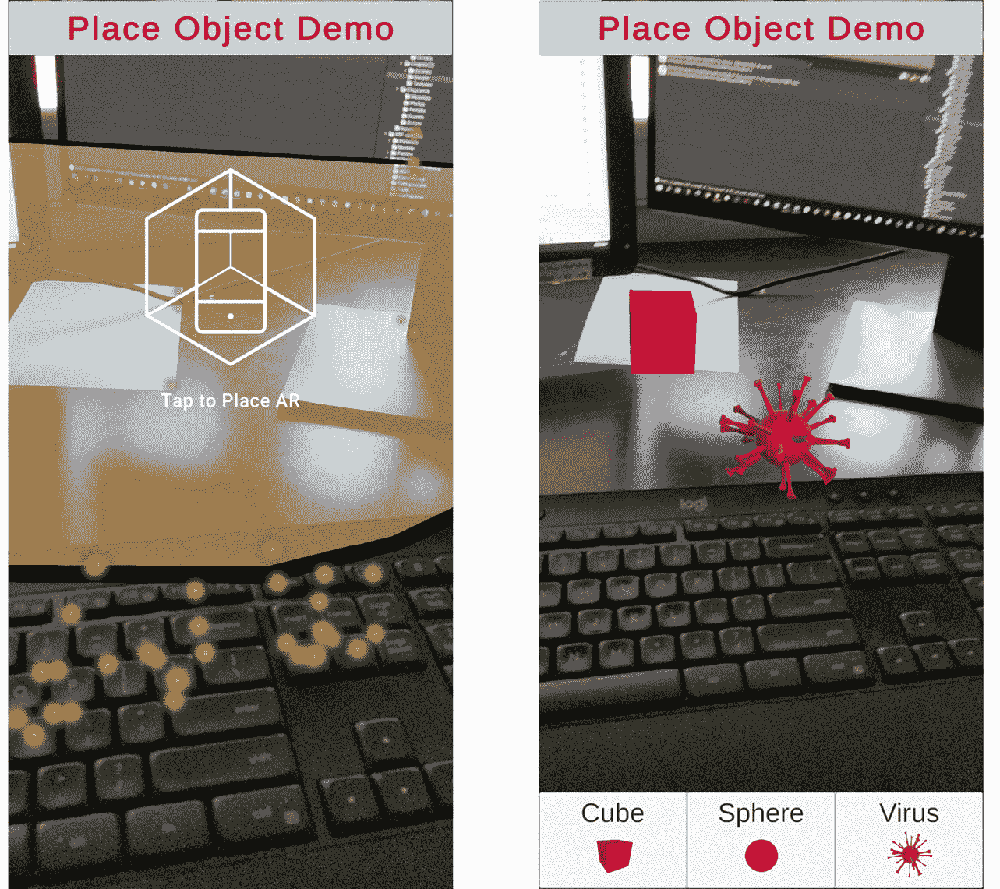
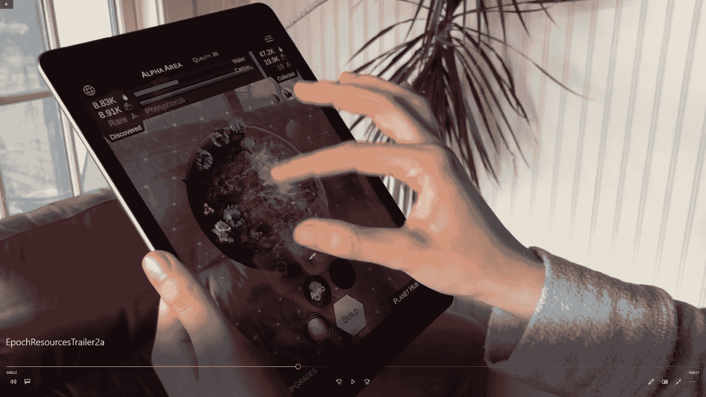
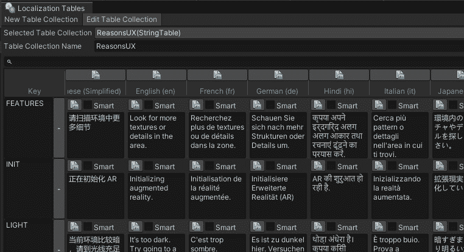

# 第五章：*第五章*：使用 AR 用户框架

在本章中，我们将学习如何使用`ARFramework`场景模板，我们将添加一个主菜单来在环境中放置虚拟对象。如果您跳过了那一章或只是浏览了一下，您可以在本书 GitHub 仓库提供的文件中找到场景模板和资产。

对于这个项目，我们将通过一个新的*PlaceObject 模式*扩展框架，提示用户轻触放置虚拟对象在房间中。用户可以从主菜单中选择对象。

在本章的后半部分，我将讨论一些高级 AR 应用程序问题，包括创建一个可选的 AR 项目、确定设备是否支持特定的 AR 功能以及向您的**用户界面**（**UI**）添加本地化。

本章将涵盖以下主题：

+   规划项目

+   从 ARFramework 场景模板开始

+   添加主菜单

+   添加 PlaceObject 模式和教学 UI

+   连接菜单按钮

+   进行构建和运行

+   在不需要时隐藏跟踪对象

+   创建一个可选的 AR 项目

+   在运行时确定设备是否支持特定的 AR 功能

+   向项目中添加本地化功能

到本章结束时，您将更熟悉为本书开发的 AR 用户框架，我们将在构建各种不同的 AR 应用程序项目时使用它。

# 技术要求

要在本章中实现项目，您需要在您的开发计算机上安装 Unity，并连接一个支持 AR 应用程序的移动设备（有关说明，请参阅*第一章*，*为 AR 开发设置*），包括以下内容：

+   通用渲染管线

+   输入系统包

+   目标设备的 XR 插件

+   AR Foundation 包

我们假设您已经安装了*第二章**，您的第一个 AR 场景*中创建的 Unity `ARF-samples.unitypackage`资产。

还可以从*第二章*，*您的第一个 AR 场景*中找到，我们创建了一个**AR 输入动作**资产，我们将在本项目中使用它，包含一个名为**ARTouchActions**的**动作映射**，包括（至少）一个**PlaceObject**动作。

我们还假设您已经安装了*第四章**，创建 AR 用户框架*中创建的`ARF-samples.unitypackage`资产，包括在*第四章**创建 AR 用户框架*开始部分详细说明的所有先决 Unity 包。模板和资产可以在本书的 GitHub 仓库中找到，网址为[`github.com/PacktPublishing/Augmented-Reality-with-Unity-AR-Foundation`](https://github.com/PacktPublishing/Augmented-Reality-with-Unity-AR-Foundation)（不包括您应自行安装的第三方包）。

AR 用户框架需要以下先决条件，如*第四章**，创建 AR 用户框架*中详细说明，包括以下内容：

+   Addressables 包

+   本地化包

+   TextMesh Pro

+   Asset Store 中的 DOTween 包

+   Asset Store 中的 Serialized Dictionary Lite 包

本章完成的场景也可以在 GitHub 仓库中找到。

# 项目规划

对于这个项目，我们将从`ARFramework`场景模板开始创建一个简单的演示 AR 场景，并构建我们已设置的用户框架结构。

使用该框架，当应用首次启动时，启动模式被启用，AR 会话被初始化。一旦会话准备就绪，它将过渡到扫描模式。

如果 AR 会话确定当前设备不支持 AR，扫描模式将过渡到非 AR 模式。目前这只是在屏幕上显示一条文本消息。有关更多信息，请参阅本章末尾附近的*创建可选 AR 项目*部分。

在扫描模式中，用户被提示使用他们的设备相机缓慢扫描房间，直到检测到 AR 功能，即水平平面。**ScanMode**脚本检查任何追踪的平面，然后过渡到主模式。

因此，我们的计划是添加以下功能：

+   AR 会话将被配置为检测和跟踪水平平面。我们还将渲染点云。

+   主模式将显示一个主菜单，其中包含按钮，允许用户选择放置在真实世界环境中的对象。您可以在此处找到自己的模型来使用，但我们将包括三个按钮用于立方体、球体和病毒（在*第二章**，您的第一个 AR 场景*中创建）。

+   当选择放置对象按钮时，它将启用一个新的放置对象模式，提示用户点击以将对象放置在检测到的平面上。

+   点击追踪的水平平面将在场景中创建对象的实例。然后应用返回到主模式。

+   追踪的 AR 功能（平面和点云）将在主模式中隐藏，在放置对象模式中可见。

我选择提供立方体、球体和病毒（病毒模型在*第二章**，您的第一个 AR 场景*中创建）。您也可以自由地寻找并使用自己的模型。我将使用的预制资源如下：

+   `Assets/ARF-samples/Prefabs/` 文件夹)

+   `Assets/ARF-samples/Prefabs/` 文件夹)

+   `Assets/_ARFBookAssets/Chapter02/Prefabs/` 文件夹)

这是一个简单的 AR 演示，将帮助您更熟悉我们开发的 AR 用户框架，并将在本书后续项目中使用。

让我们开始吧。

# 从 ARFramework 场景模板开始

首先，我们将使用以下步骤创建一个名为`FrameworkDemo`的新场景，使用`ARFramework`场景模板：

1.  选择**文件 | 新建场景**。

1.  在**新场景**对话框中，选择**ARFramework**模板。

1.  按**创建**。

1.  在你的项目“资产”文件夹中，选择`Scenes/`文件夹，将其命名为`FrameworkDemo`，然后按**保存**。

    注意：意外的克隆依赖项

    当从场景模板创建新场景时，如果你立即被提示输入文件保存的名称，这表明你的场景模板定义了一些克隆依赖项。如果不是你的意图，取消创建，在项目窗口中选择模板资产，并确保在**依赖项**列表中所有**克隆**复选框都被清除。然后再次尝试创建你的新场景。

新的 AR 场景已经从模板中包含了以下游戏对象：

+   **AR 会话**游戏对象

+   带有射线管理器和平面管理器组件的**AR 会话起源**装置。

+   **UI Canvas**是一个屏幕空间画布，包含启动 UI、扫描 UI、主 UI 和非 AR UI 子面板。它还具有我们编写的 UI 控制器组件脚本。

+   **交互控制器**是一个带有我们编写的交互控制器组件脚本的游戏对象，它帮助应用在启动、扫描、主和非 AR 模式之间切换。它还配置了一个带有我们之前创建的**AR 输入动作**资产的**玩家输入**组件。

+   来自 AR 基础演示项目的**OnboardingUX**预制件，它提供 AR 会话状态和功能检测状态消息，以及动画引导图形提示。

现在按照以下方式设置应用标题：

1.  在**层次结构**窗口中，展开**UI Canvas**对象，然后展开其子**应用标题面板**。

1.  选择**标题文本**对象。

1.  在其`放置对象演示`中。

默认的 AR 会话起源已经有一个 AR 平面管理器组件。让我们确保它只检测水平平面。让我们也添加点云可视化。按照以下步骤操作：

1.  在**层次结构**窗口中，选择**AR 会话起源**对象。

1.  在**检查器**中，通过首先选择**无**（以清除列表）然后选择**水平**，将**AR 平面管理器 | 检测模式**设置为**水平**。

1.  点击`ar point cloud`，然后添加一个**AR 点云管理器**组件。

1.  找到一个点云可视化预制件，并将其设置为`Assets/ARF-samples/Prefabs/`文件夹。

1.  使用**文件 | 保存**保存你的工作。

我们已经基于 ARFramework 模板创建了一个新场景，并添加了 AR 轨迹管理器以处理点云和水平平面。接下来，我们将添加主菜单。

# 添加主菜单

主菜单 UI 位于场景层次结构中的菜单 UI 面板（在 UI Canvas 下）。我们将添加一个带有三个按钮的菜单面板，让你添加一个立方体、一个球体和一个病毒。我们将创建一个菜单子面板并将菜单按钮水平排列。按照以下步骤操作：

1.  在**层次结构**中，展开**UI Canvas**，然后展开其子**主 UI**对象。

1.  首先，删除临时的 **主** 模式文本元素。*右键单击* 子 **文本** 对象并选择 **删除**。

1.  *右键单击* `主菜单`。

1.  在 `175`。

1.  我将我的背景设置为 `255`。

1.  选择 `布局`，然后选择 **| 水平布局组**。

1.  在 **水平布局组** 组件中勾选 **控制子大小 | 宽度** 和 **高度** 复选框（保留其他默认值，**使用子缩放** 未勾选，**子强制扩展** 勾选）。在检查器中，主菜单面板看起来如下：



图 5.1 – 主菜单面板设置

现在我们将按照以下步骤添加三个按钮到菜单中：

1.  *右键单击* `立方体按钮`。

1.  选择其子文本对象，并将 `Cube` 和 `48` 设置为 `48`。

1.  *右键单击* `球体按钮` 并将其文本更改为 `Sphere`。

1.  再次重复 *步骤 3*，将其重命名为 `Virus Button`，并更改文本为 `Virus`。

主菜单的最终场景层次结构如下截图所示：



图 5.2 – 主菜单层次结构

我决定更进一步，为每个模型添加按钮的精灵图像。我通过截取每个模型的视图来创建图像，使用 Photoshop 编辑它们，将它们保存为 PNG 文件，并在 Unity 中确保图像的 **纹理类型** 设置为 **精灵（2D 和 UI）**。然后我向按钮添加了一个子 **图像** 元素。以下是我的菜单的图像：



图 5.3 – 带图标按钮的主菜单

到目前为止，我们已经在主 UI 下创建了一个带有菜单按钮的主菜单面板。当应用进入主模式时，此菜单将显示。

接下来，我们将添加一个 UI 面板，提示用户触摸屏幕将对象放置到场景中。

# 添加带有说明 UI 的 PlaceObject 模式

当用户从主菜单中选择对象时，应用将启用 PlaceObject 模式。为此模式，我们需要一个 UI 面板来提示用户触摸屏幕放置对象。让我们首先创建 UI 面板。

## 创建 PlaceObject UI 面板

**PlaceObject UI** 面板应类似于 **扫描 UI** 面板，因此我们可以使用以下步骤进行复制和修改：

1.  在 **层次结构** 窗口中，展开 **UI 画布**。

1.  *右键单击* `PlaceObject UI`。

1.  展开 **PlaceObject UI** 并选择其子 **动画提示**。

1.  在 **检查器** 中，将 **动画提示 | 说明** 设置为 **点击放置**。以下截图显示了生成的组件：

    图 5.4 – PlaceObject UI 面板的动画提示设置

1.  现在我们将面板添加到 UI 控制器中。

    在 **层次结构** 中选择 **UI 画布** 对象。

1.  在**检查器**中，在**UI Controller**组件的右下角，点击**+**按钮向 UI 面板字典添加一个项。

1.  在**Id**字段中输入`PlaceObject`作为文本。

1.  将**PlaceObject UI**游戏对象从**层次结构**拖到**值**槽中。UI 控制器组件现在看起来如下所示：

![Figure 5.5 – UI Controller's UI Panels list with PlaceObject added

![img/Figure_5.05-uicontroller-insp.jpg]

图 5.5 – 添加了 PlaceObject 的 UI 控制器 UI 面板列表

我们为**PlaceObject** UI 添加了一个指导性用户提示。当用户选择将对象添加到场景中时，此面板将显示。接下来，我们将添加**PlaceObject**模式和脚本。

## 创建 PlaceObject 模式

要将模式添加到框架中，我们在**Interaction Controller**下创建一个子 GameObject 并编写一个模式脚本。模式脚本将显示模式的 UI，处理任何用户交互，并在完成后过渡到另一个模式。对于 PlaceObject 模式，它将显示**PlaceObject UI**面板，等待用户触摸屏幕，实例化预制对象，然后返回到主模式。

让我们按照以下方式编写`PlaceObjectMode`脚本：

1.  首先，在您的`Scripts/`文件夹中创建一个新的脚本，使用*右键点击* `PlaceObjectMode`。

1.  *双击*文件以打开它进行编辑，并替换默认内容，从以下声明开始：

    ```cs
    using System.Collections;
    using System.Collections.Generic;
    using UnityEngine;
    using UnityEngine.InputSystem;
    using UnityEngine.XR.ARFoundation;
    using UnityEngine.XR.ARSubsystems;
    public class PlaceObjectMode : MonoBehaviour
    {
       [SerializeField] ARRaycastManager raycaster;
        GameObject placedPrefab;
        List<ARRaycastHit> hits = new List<ARRaycastHit>();
    ```

    该脚本将使用`ARFoundation`和`ARSubsystems`的 API，所以我们指定这些在脚本顶部的`using`语句中。它将使用`ARRaycastManager`来确定用户触摸了哪个跟踪平面。然后它将实例化`placedPrefab`到场景中。

1.  当模式启用时，我们将显示**PlaceObject UI**面板：

    ```cs
        void OnEnable()
        {
            UIController.ShowUI("PlaceObject");
        }
    ```

1.  当用户从主菜单中选择一个对象时，我们需要根据以下代码告诉`PlaceObjectMode`实例化哪个预制体：

    ```cs
        public void SetPlacedPrefab(GameObject prefab)
        {
            placedPrefab = prefab;
        }
    ```

1.  然后当用户触摸屏幕时，输入系统触发一个`OnPlaceObject`事件（将`touchPosition`传递给`PlaceObject`函数，该函数执行`Raycast`以找到跟踪的水平面。如果找到，我们在`hitPose`位置和方向实例化`placedPrefab`。然后应用程序返回到主模式）。

1.  保存脚本并返回到 Unity。

我们现在可以将模式添加到交互控制器中，如下所示：

1.  在`PlaceObject Mode`中。

1.  将**PlaceObjectMode**脚本从**项目**窗口拖到**PlaceObject** **Mode**对象上，将其添加为组件。

1.  将**AR Session Origin**对象从**层次结构**拖到**Place Object Mode | Raycaster**槽中。

    现在我们将模式添加到**Interaction Controller**。

1.  在**层次结构**中，选择**Interaction Controller**对象。

1.  在**检查器**中，在**Interaction Controller**组件的右下角，点击**+**按钮向**交互模式**字典添加一个项。

1.  在**Id**字段中输入`PlaceObject`文本。

1.  将 **PlaceObject 模式** 游戏对象从 **层次结构** 拖到 **值** 插槽。现在 **交互控制器** 组件看起来如下所示：



图 5.6 – 添加 PlaceObject 后的交互控制器交互模式列表

我们现在已添加了一个 `OnPlaceObject` 输入动作事件。在输入事件发生时，我们使用 Raycast 确定用户想在 3D 空间中的哪个位置放置对象，然后脚本实例化预制件并返回到主模式。

最后一步是将主菜单按钮连接起来。

# 连接菜单按钮

当用户按下主菜单按钮以向场景添加对象时，按钮将告诉 `PlaceObjectMode` 哪个预制件将被实例化。然后启用 PlaceObject 模式，提示用户轻触放置对象并处理用户输入动作。现在让我们按照以下步骤设置菜单按钮：

1.  通过导航到 **UI Canvas / Main UI / 主菜单** 在 **层次结构** 中展开 **主菜单** 游戏对象，并选择 **立方体按钮** 对象。

1.  在其 **检查器** 中，在 **按钮** 组件的 **OnClick** 部分，按下右下角的 **+** 按钮以添加事件动作。

1.  从 **层次结构** 中将 **PlaceObject Mode** 对象拖到 **OnClick Object** 插槽。

1.  在 **函数** 选择列表中，选择 **PlaceObject Mode | SetPlacedPrefab**。

1.  在 `Assets/ARF-samples/Prefabs/` 文件夹中，将 **AR Placed Cube** 预制件拖到 **检查器** 中此点击事件的 **Game Object** 插槽。

1.  现在让按钮启用 PlaceObject 模式。在其 **检查器** 中，在 **按钮** 组件的 **OnClick** 部分，按下右下角的 **+** 按钮以添加另一个事件动作。

1.  从 **层次结构** 中将 **交互控制器** 对象拖到 **OnClick** 事件的 **Object** 插槽。

1.  在 **函数** 选择列表中，选择 **InteractionController | EnableMode**。

1.  在字符串参数字段中，输入 `PlaceObject`。

立方体按钮对象的按钮组件现在具有以下 **OnClick** 事件设置：



图 5.7 – 立方体按钮的 OnClick 事件

对球体按钮和病毒按钮重复这些步骤。作为一个快捷方式，我们可以按以下方式复制/粘贴组件设置：

1.  在 **层次结构** 中选择 **立方体按钮**，在 **检查器** 中，点击 **按钮** 组件的三点上下文菜单，并选择 **复制组件**。

1.  在 **层次结构** 中选择 **球体按钮** 对象。

1.  在其 **检查器** 中，点击 **按钮** 组件的三点上下文菜单，并选择 **粘贴组件值**。

1.  在 `Assets/ARF-samples/Prefabs/` 文件夹中，将 **AR Placed Sphere** 预制件拖到 **检查器** 中此点击事件的 **Game Object** 插槽。

1.  同样，对`Prefabs`文件夹重复*步骤 1-4*）。

1.  使用**文件 | 保存**保存您的作品。

现在应该已经设置好了。我们使用`PlaceObjectMode`脚本创建了一个新场景，该脚本处理用户输入动作并实例化预制体，并将其所有内容连接到主菜单按钮。让我们试试吧！

# 执行建筑和运行

要构建和运行项目，请按照以下步骤操作：

1.  使用**文件 | 构建设置**打开**构建设置**窗口。

1.  如果`FrameworkDemo`)尚未在**构建场景列表**中。

1.  确保在**构建场景列表**中只选中`FrameworkDemo`场景。

1.  点击**构建和运行**以构建项目。

当项目构建成功时，它将在 AR 会话初始化时启动启动模式。然后它进入扫描模式，提示用户扫描环境，直到至少检测到一个水平平面并跟踪。然后它进入主模式并显示主菜单。以下图显示了在这些模式下在我的手机上运行的应用程序的屏幕截图：



![图 5.8 – 启动模式、扫描模式和主模式的屏幕截图]

当按下菜单按钮之一时，应用程序进入 PlaceObject 模式，提示用户轻触放置对象。轻触屏幕将在环境中指定位置实例化对象。然后应用程序返回主模式。

现在我们有一个工作演示 AR 应用程序，可以将各种虚拟对象放置在您环境中的水平表面上。一个可能的改进是在主模式中隐藏可跟踪对象，仅在需要时在 PlaceObject 模式中显示它们。

# 在不需要时隐藏跟踪对象

当应用首次开始跟踪时，我们会显示可跟踪的平面和点云。这对于应用首次启动时以及放置对象时向用户提供有用的反馈。但是，一旦我们在场景中放置了对象，这些可跟踪的可视化可能会分散注意力且不受欢迎。让我们只在 PlaceObject 模式中显示对象，并在至少放置了一个虚拟对象后隐藏它们。

在 AR Foundation 中，隐藏可跟踪对象需要两个单独的操作：隐藏已经检测到的现有可跟踪对象，并防止新的可跟踪对象被检测和可视化。我们将实现这两者。

为了实现这一点，我们可以在**PlaceObject 模式**上编写一个单独的组件，在启用时显示可跟踪对象，在禁用时隐藏它们。按照以下步骤操作：

1.  在您的`Scripts/`文件夹中创建一个新的 C#脚本，命名为`ShowTrackablesOnEnable`，并打开它进行编辑。

1.  在类顶部，添加对`ARSessionOrigin`、`ARPlaneManager`和`ARPointCloudManager`的变量引用。现在，我们将记住最近放置的对象在`lastObject`中，并在`Awake`中初始化它们，如下所示：

    ```cs
    using UnityEngine;
    using UnityEngine.XR.ARFoundation;
    public class ShowTrackablesOnEnable : MonoBehaviour
    {
        [SerializeField] ARSessionOrigin sessionOrigin;
        ARPlaneManager planeManager;
        ARPointCloudManager cloudManager;
        bool isStarted;
        void Awake()
        {
            planeManager =             sessionOrigin.GetComponent<ARPlaneManager>();
            cloudManager = sessionOrigin.GetComponent             <ARPointCloudManager>();
        }
        private void Start()
        {
            isStarted = true;
        }
    ```

    我还添加了一个 `isStarted` 标志，我们将用它来防止在应用启动时隐藏可视化器。

    信息：`OnEnable` 和 `OnDisable` 可以在 `Start` 之前被调用

    在 `MonoBehaviour` 组件的生命周期中，当对象被启用并激活时调用 `OnEnable`。当脚本对象变为非活动状态时调用 `OnDisable`。在脚本被启用后的第一帧调用 `Start`，在 `Update` 之前。请参阅 [`docs.unity3d.com/ScriptReference/MonoBehaviour.Awake.html`](https://docs.unity3d.com/ScriptReference/MonoBehaviour.Awake.html)。

    在我们的应用中，`OnDisable` 可能会在 `Start` 之前被调用（当我们从 `InteractionController` 初始化场景时）。为了防止在场景开始之前调用 `ShowTrackables(false)`，我们在脚本中使用一个 `isStarted` 标志。

1.  当模式启用时，我们将显示可追踪对象，当禁用时，将使用以下代码隐藏它们：

    ```cs
        void OnEnable()
        {
            ShowTrackables(true);
        }
        void OnDisable()
        {
            if (isStarted)
            {
                ShowTrackables(false);
            }
        }
    ```

1.  这些调用 `ShowTrackables`，我们按以下方式实现：

    ```cs
        void ShowTrackables(bool show)
        {
            if (cloudManager)
            {
                cloudManager.SetTrackablesActive(show);
                cloudManager.enabled = show;
            }
            if (planeManager)
            {
                planeManager.SetTrackablesActive(show);
                planeManager.enabled = show;
            }
        }
    }
    ```

    设置 `SetTrackablesActive(false)` 将隐藏所有现有的可追踪对象。禁用可追踪管理器组件本身将防止添加新的可追踪对象。我们检查 `ARSessionOrigin` 中是否存在空管理器，以防组件不存在。

1.  保存脚本。

1.  回到 Unity，在 **Hierarchy** 中选择 **PlaceObject 模式** 游戏对象。

1.  将 `ShowTrackablesOnEnable` 脚本拖放到 **PlaceObject 模式** 对象上。

1.  将 **AR Session Origin** 对象从 **Hierarchy** 拖到 **Inspector**，然后将其拖放到 **Show Trackables On Enable | Session Origin** 插槽中。

1.  使用 **文件 | 保存** 保存场景。

现在当您再次点击 **Build And Run** 时，当 PlaceObject 模式启用时，可追踪对象将被显示，当禁用时将被隐藏。因此，当 Main 模式首次启用时，可追踪对象将是可见的，但在放置对象并应用回到 Main 模式后，可追踪对象将被隐藏。这是我们期望的行为。PlaceObject 模式和随后的 Main 模式在以下手机运行项目屏幕截图中显示：



图 5.9 – PlaceObject 模式和随后隐藏可追踪对象的主模式屏幕截图

小贴士：通过修改平面检测模式来禁用可追踪对象

要禁用平面检测，我使用的方法是禁用管理器组件。这是在 AR Foundation 示例项目中提供的 `PlaneDetectionController.cs` 脚本中给出的技术。作为替代，Unity ARCore XR 插件文档（[`docs.unity3d.com/Packages/com.unity.xr.arcore@4.1/manual/index.html`](https://docs.unity3d.com/Packages/com.unity.xr.arcore@4.1/manual/index.html)）建议通过将 `ARPlaneManager` 检测模式设置为 `PlaneDetectionMode.None` 来禁用平面检测。

我们现在已经完成了一个简单的 AR 项目，使用我们的 AR 用户框架在环境中检测到的水平平面上放置各种虚拟对象。

您可以添加到项目中的进一步改进包括以下内容：

+   主菜单中的重置按钮，用于移除场景中已放置的任何虚拟对象。

+   一次只允许放置一个虚拟对象到场景中。

+   移动和调整现有对象大小的能力（参见*第七章**，图库：编辑虚拟对象*）。

+   您能想到更多的改进吗？请告诉我们。

在本章的剩余部分，我们将讨论一些您可能希望在以后的项目中包含的高级入门和用户体验功能。

# 高级入门问题

在本节中，我们将回顾一些与 AR 入门、AR 会话和设备相关的问题，包括以下内容：

+   创建一个可选 AR 的项目

+   确定设备是否支持特定的 AR 功能

+   为您的项目添加本地化支持

## 创建一个可选 AR 的项目

一些应用程序旨在专门使用 AR 功能运行，并且如果不受支持，应该（在向用户发出友好通知后）直接退出。但其他应用程序可能希望表现得像一个普通的移动应用，同时额外提供支持 AR 功能的可选能力。

例如，我最近创建的一个游戏，Epoch Resources（可在 Android [`play.google.com/store/apps/details?id=com.parkerhill.EpochResources&hl=en_US&gl=US`](https://play.google.com/store/apps/details?id=com.parkerhill.EpochResources&hl=en_US&gl=US) 和 iOS [`apps.apple.com/us/app/epoch-resources/id1455848902`](https://apps.apple.com/us/app/epoch-resources/id1455848902) 上找到）是一款行星演化的增量游戏，您可以在其中挖掘 3D 行星以获取资源。它提供了一个可选的 AR 观看模式，您可以将行星“弹出”到您的客厅，并在 AR 中继续玩游戏，如下面的图片所示。



图 5.10 – Epoch Resources 是一款可选 AR 的游戏

对于一个可选 AR 的应用程序，您的应用可能最初启动为一个普通的非 AR 应用。然后，在某个时刻，用户可能会选择开启 AR 特定功能。那时，您将激活 AR 会话并处理用户入门 UX。

本书中的所有项目都没有实现可选 AR，因此这只是一个信息性讨论。首先，您需要通过访问**编辑 | 项目设置 | XR 插件管理**并选择每个平台（ARCore 和 ARKit 分别设置）的**需求 | 可选**（而不是**必需**）来告诉 XR 插件 AR 是可选的。

你需要一个机制来决定是否运行 AR 或非 AR 模式。一种方法是有单独的 AR 和非 AR 场景，根据需要加载（见[`docs.unity3d.com/ScriptReference/SceneManagement.SceneManager.html`](https://docs.unity3d.com/ScriptReference/SceneManagement.SceneManager.html)）。

在《纪元资源》游戏的情况下，我们没有创建两个独立的场景。相反，场景包含两个摄像头，一个是用于非 AR 模式的正常默认摄像头，另一个是用于 AR 模式的 AR 会话原点（带有子摄像头）。然后当用户切换查看模式时，我们在两个摄像头之间切换。

你可能会遇到的问题之一是在运行时确定用户的设备是否支持特定的 AR 功能。

## 确定设备是否支持特定的 AR 功能

可能你的应用程序需要特定的 AR 功能，但并非所有设备都支持。我们可以通过获取子系统描述符记录来询问 Unity AR 子系统支持哪些功能。

例如，假设我们感兴趣的是检测垂直平面。一些较旧的设备可能支持 AR，但只支持水平平面。以下代码说明了如何获取和检查平面检测支持：

```cs
using System.Collections.Generic;
using UnityEngine;
using UnityEngine.XR.ARSubsystems;
public class CheckPlaneDetectionSupport : MonoBehaviour
{
    void Start()
    {
        var planeDescriptors =             new List<XRPlaneSubsystemDescriptor>();
        SubsystemManager.            GetSubsystemDescriptors(planeDescriptors);
        Debug.Log("Plane descriptors count: " +            planeDescriptors.Count);
        if (planeDescriptors.Count > 0)
        {
            foreach (var planeDescriptor in planeDescriptors)
            {
                Debug.Log("Support horizontal: " +                    planeDescriptor.                        supportsHorizontalPlaneDetection);
                Debug.Log("Support vertical: " +                    planeDescriptor.                        supportsVerticalPlaneDetection);
                Debug.Log("Support arbitrary: " +                    planeDescriptor.                        supportsArbitraryPlaneDetection);
                Debug.Log("Support classification: " +                    planeDescriptor.supportsClassification);
            }
        }
    }
}
```

AR Foundation 中可用的描述符类型包括以下几种（它们的功能从其名称中显而易见）：

+   `XRPlaneSubsystemDescriptor`

+   `XRRaycastSubsystemDescriptor`

+   `XRFaceSubsystemDescriptor`

+   `XRImageTrackingSubsystemDescriptor`

+   `XREnvironmentProbeSubsystemDescriptor`

+   `XRAnchorSubsystemDescriptor`

+   `XRObjectTrackingSubsystemDescriptor`

+   `XRParticipantSubsystemDescriptor`

+   `XRDepthSubsystemDescriptor`

+   `XROcclusionSubsystemDescriptor`

+   `XRCameraSubsystemDescriptor`

+   `XRSessionSubsystemDescriptor`

+   `XRHumanBodySubsystemDescriptor`

AR 子系统 API 和这些描述符记录的文档可以在`docs.unity3d.com/Packages/com.unity.xr.arsubsystems@4.2/api/UnityEngine.XR.ARSubsystems.html`找到。例如，我们这里使用的`XRPlaneSubsystemDescriptor`记录在`docs.unity3d.com/Packages/com.unity.xr.arsubsystems@4.2/api/UnityEngine.XR.ARSubsystems.XRPlaneSubsystemDescriptor.Cinfo.html`有文档说明。

如果你计划在不同国家分发你的应用程序，你可能也会对本地化感兴趣。

## 添加本地化

本地化是将文本字符串和其他资产翻译成本地语言的过程。它还可以指定日期和货币格式、国家国旗的替代图形等，以适应国际市场和用户。Unity 本地化包提供了一套标准工具和数据结构，用于本地化您的应用程序。更多信息可以在 `docs.unity3d.com/Packages/com.unity.localization@0.10/manual/QuickStartGuide.html` 找到。在本书中，我们除了使用导入的资产（如 AR Foundation Demos 项目的 Onboarding UX 资产）已经支持本地化的项目外，不使用本地化。

Unity Onboarding UX 资产内置了对用户提示和扫描问题解释的本地化支持。例如，与 Onboarding UX 项目一起提供的 `ReasonsUX` 本地化表格可以通过选择 **窗口 | 资产管理 | 本地化表格** 来打开，如下面的截图所示。例如，您可以看到第二行的 **INIT** 键在英文中是 **Initializing augmented reality**，以及翻译成多种其他语言的相同字符串：



图 5.11 – 包含在 Onboarding UX 资产中的 ReasonsUX 本地化表格

在代码中，例如，使用如下调用检索 **Initializing augmented reality** 消息：

```cs
string localizedInit = reasonsTable.GetEntry("INIT").GetLocalizedString();
```

当我们将 onboarding UX 预制件 (`ARFoundationDemos/UX/Prefabs/ScreenspaceUI`) 添加到场景中时，我让您禁用了 **本地化管理器** 组件，因为它在设置好之前会引发运行时错误。假设您已经通过 **包管理器** 安装了 **本地化** 包，如本章前面所述，我们现在可以使用以下步骤为项目设置它：

1.  通过访问 **编辑 | 项目设置 | 本地化** 打开 **本地化** 设置窗口。

1.  在 `Assets/ARFOundationDemos/Common/Localization/` 中，将 `LocalizationSettings` 资产拖放到 **位置设置** 槽中（或使用 *甜甜圈* 图标打开 **位置设置选择** 对话框）。

1.  在设置窗口中，点击 **添加全部**。

1.  在 **层次结构** 窗口中，选择 **OnboardingUX** 对象，并在 **检查器** 中启用 **本地化管理器** 组件。

1.  使用 **窗口 | 资产管理 | 可寻址 | 组** 打开 **可寻址组** 窗口。

1.  从 **可寻址组** 菜单栏中选择 **构建 | 新构建 | 默认构建脚本**。您需要为每个构建的目标平台执行此操作（例如，一次为 Android，一次为 iOS）。

正如您在最后一步看到的，本地化包使用 Unity 的新 **Addressables** 系统来管理、打包和从本地或互联网上的任何位置加载资源 ([`docs.unity3d.com/Packages/com.unity.addressables@1.12/manual/index.html`](https://docs.unity3d.com/Packages/com.unity.addressables@1.12/manual/index.html))。

注意，在我写这篇文档的时候，入职 UX 的 `LocalizationManager` 脚本在运行时不会选择语言。语言必须在检查器中设置，并编译到您的构建中。

本章中构建的 AR UI 框架可以用作新场景的模板。Unity 使其设置变得简单。

# 概述

在本章中，我们有机会使用在上一章*第四章**，创建 AR 用户框架*中开发的 AR 用户框架，在一个简单的 AR *放置对象演示*项目中。我们使用 `ARFramework` 场景模板创建了一个新场景，该模板实现了一个状态机机制来管理用户交互模式。它使用控制器-视图设计模式处理用户交互，将控制脚本与 UI 图形分离。

默认情况下，场景包括 AR Foundation 所需的 AR Session 和 AR Session Origin 组件。场景配置了一个包含单独面板的 Canvas UI，每个交互模式将显示不同的面板。它还包括一个引用单独模式对象的交互控制器，每个交互模式一个。

模式（以及相应的 UI）包括启动、扫描、主和非 AR。使用此框架的应用首先在启动模式开始，此时 AR 会话正在初始化。然后它进入扫描模式，提示用户扫描环境中的可追踪特征，直到检测到水平面。然后它进入主模式并显示主菜单。

对于这个项目，我们添加了一个在主模式期间显示的主菜单，其中包含将各种虚拟对象放置在环境中的按钮。按下按钮将启用我们添加到场景中的新 PlaceObject 模式。当 PlaceObject 模式启用时，它显示一个指导性的动画提示，用户需要点击以在场景中放置对象。添加对象后，应用返回主模式，可追踪对象被隐藏，这样您就可以在没有额外干扰的情况下在真实世界中看到您的虚拟对象。

在下一章中，我们将超越简单的演示项目，开始构建一个更完整的 AR 应用程序——一个照片画廊，您可以在家中或办公室的乏味墙壁上放置您最喜欢的照片的相框。
