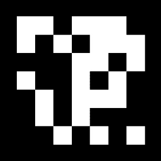

# 第八章：*第八章*：行星：跟踪图像

在本章中，我们将使用增强现实进行数据可视化和教育。我们将构建一个项目，用户可以了解我们太阳系中的行星。假设您有一本关于太阳系的儿童科学书籍及其配套移动应用程序。例如，在关于地球的页面，读者可以将他们的移动设备指向页面上的图片，地球的 3D 渲染就会从页面中弹出。

我们将要使用的 AR 机制被称为*图像跟踪*。使用图像跟踪，您准备一个参考图像库，这些图像在运行时可以在真实世界中识别和跟踪。当用户的设备摄像头检测到这些图像之一时，可以在图像位置实例化一个虚拟对象。

我已经为您提供了“行星卡”，每张卡上都有图片和独特的标记，这些标记是我从网络上可用的免费资源中创建的，供您打印并用于应用程序。为了渲染行星的球形表面皮肤，我们将使用实际行星的免费纹理图像。

本章我们将涵盖以下主题：

+   理解 AR 图像跟踪

+   指定“行星”项目并开始

+   定义和跟踪参考图像

+   创建和实例化一个虚拟地球预制件

+   绕其轴旋转行星

+   通过添加多个行星来扩展项目

+   制作响应式 UI

到本章结束时，您将拥有一个可以检测提供的行星卡上的图像、渲染给定行星的 3D 模型并提供有关行星的附加信息详情的工作应用程序。

# 技术要求

要实现本章的项目，您需要在您的开发计算机上安装 Unity，并将其连接到一个支持增强现实应用程序的移动设备（有关说明，请参阅*第一章*，*为 AR 开发设置*）。我们还假设您已安装`ARFramework`模板及其所有先决条件。有关更多详细信息，请参阅*第五章**，使用 AR 用户框架*。完成的项目可以在本书的 GitHub 仓库中找到，网址为[`github.com/PacktPublishing/Augmented-Reality-with-Unity-AR-Foundation`](https://github.com/PacktPublishing/Augmented-Reality-with-Unity-AR-Foundation)。

# 理解 AR 图像跟踪

在我们开始构建项目之前，让我们花一点时间来了解 AR 图像跟踪是如何工作的。在本节中，我将介绍图像识别和跟踪背后的基本原理，以及为什么某些图像比其他图像更适合这个目的。

正如我们所知，增强现实背后的原理涉及使用计算机制来识别现实世界中的特征，确定它们在三维空间中的位置和方向，相对于并锚定在这个三维空间中实例化虚拟对象，并跟踪用户在空间中的移动。现代设备可以使用其视频摄像头和设备内置的其他传感器来执行环境的实时空间映射。另一种方法是设备跟踪预定的图像。这正是本章项目中我们将使用的方法。

增强现实技术诞生于 20 世纪 90 年代，当时使用类似二维码的标记图像进行跟踪。以下图像展示了示例：



图 8.1 – 基本 AR 标记符

标记图像可用于在现实世界中触发和定位虚拟对象。这些简单但视觉上独特的标记易于检测，即使是低端设备也能轻松识别。这些标记易于检测，因为它们具有*独特的细节*、*高对比度边缘*和*不对称的形状*——也就是说，这是一个易于识别的图像，具有明确的顶部、底部、左侧和右侧。因此，检测软件可以确定哪个标记图像在视图中，以及相机相对于标记在三维空间中的方向。

将这一概念提升到更高层次，例如 Merge Cube ([`mergeedu.com/cube`](https://mergeedu.com/cube))这样的产品，在其六个面上都有标记，就像你可以用手拿的物理立方体一样。用户可以找到具有广泛游戏、学习和探索体验的配套应用程序。Merge 为开发者提供 Unity 包，以便你也能为其构建自己的项目。以下图像展示了 Merge Cube：


图 8.2 – Merge Cube 在每个面上都有标记，提供 3D 跟踪立方体

标记符可以与自然图像结合，以提供令人愉悦且信息丰富的视觉上独特的图像，同时充当 AR 标记符。你经常在 AR 增强故事书中甚至谷物盒上看到这种做法。这正是我在本章中采用的方法。

虽然标记提供了最高的可靠性，但它们对于图像跟踪并非必不可少。普通摄影图像也可以使用。在 AR 术语中，这些被称为*自然特征图像*。用于跟踪的图像必须具有使标记可靠的同种特征——独特的细节、高对比度边缘和不对称的形状。关于选择图像的最佳实践已经有很多讨论。例如，AR Core 开发者指南([`developers.google.com/ar/develop/java/augmented-images/`](https://developers.google.com/ar/develop/java/augmented-images/))包含了关于使用参考图像的额外提示，包括以下内容：

+   使用至少 300 x 300 像素的图像分辨率。然而，非常高的分辨率并不帮助识别。

+   颜色信息没有被使用，所以彩色或灰度图像都一样好。

+   避免具有很多几何特征的图像，或者太少的图像。

+   避免重复的图案。

AR Core SDK 附带一个**arcoreimg**工具，可以评估图像，并为每个图像返回 0 到 100 之间的质量分数，其中至少 75 分的分数是推荐的。同样，Unity 在编译您的构建中的图像参考库时使用类似的工具（我们将在本章后面了解更多关于这一点）。

基于对在增强现实应用中使用图像跟踪的一般理解，让我们首先定义一个有趣且有趣的项目——可视化我们的太阳系行星。

# 指定行星项目

我们将构建一个行星信息应用，允许用户扫描*行星卡*以可视化太阳系中每个行星的 3D 模型。想象一下，这将是交易卡收藏的一部分或儿童科学书的配套应用。当用户将设备的相机对准行星卡之一时，他们可以看到行星的 3D 渲染。按下**信息**按钮后，用户可以获取有关该行星的更多信息。在本节中，我将定义一般用户体验流程，为您提供准备行星卡以供自己使用的说明，并帮助您收集在本项目中使用的资产。

## 用户体验流程

通用用户入职工作流程将如下进行：

1.  **启动模式**：应用将启动，检查设备是否支持 AR，并请求相机权限（取决于操作系统）。一旦读取，应用将进入扫描模式。

1.  **扫描模式**：用户被提示将相机对准图像进行检测和跟踪。当至少有一个图像正在跟踪时，应用进入主模式。

1.  **主模式**：这是应用对新或更新的跟踪图像做出响应并允许用户与行星交互的地方。当图像被跟踪时，它确定哪个行星与图像相对应，并实例化行星的游戏对象。如果丢失跟踪，应用可能会回到扫描模式以提示用户。如果跟踪不同的图像，当前行星将被新的图像的行星所取代。

这个工作流程比我们在前几章中实现的工作流程要简单一些。在那个情况下，我们需要用户在进入主模式之前扫描环境以寻找可跟踪的平面。然后，用户被要求故意点击屏幕以在场景中放置一个虚拟对象。此外，在 AR 画廊项目中，我们添加了编辑模式来修改用户添加的图片。在这个项目中，许多这些都是不必要的；过程更加自动化，因为我们让设备检测图像，并相应地实例化一个虚拟对象。

## 准备行星卡

对于本项目，我们使用打印的 *行星卡片* 作为标记图像，以便我们可以选择一个行星进行可视化。您可以在本章的项目文件中找到一个包含这些卡片的 PDF 文件（在名为 `Printables/` 的文件夹中）。为了准备这些卡片以供本项目使用，请按照以下步骤操作：

1.  打印出 `PlanetCards.pdf` 文件。

1.  然后，将纸张裁剪成单独的卡片。

1.  我建议您使用厚纸打印或把打印件粘贴到纸板上，以避免变形，这可能会影响软件在运行时识别图像的能力。

以下照片显示了准备这些卡片以供使用的情况：


图 8.3 – 为本项目裁剪打印的行星卡片

这些卡片是由网络上可以免费找到的资源组合而成的。我在 *Kids Flashcards* 网站上找到了原始的闪卡。在访问 [`kids-flashcards.com/en/free-printable/solar-system-flashcards-in-english`](https://kids-flashcards.com/en/free-printable/solar-system-flashcards-in-english) 后，我下载了 *Solar System flashcards free* PDF 文件。

首先，我尝试直接使用这些闪卡，但图片不够独特，无法单独识别。因此，我决定为每一张卡片添加 *ArUco* 标记。ArUco 是一个带有宽黑色边框和内部二进制矩阵的方形标记，其 ID 基于 OpenCV（开源计算机视觉库，由西班牙科尔多瓦大学开发；见 [`docs.opencv.org/3.2.0/d5/dae/tutorial_aruco_detection.html`](https://docs.opencv.org/3.2.0/d5/dae/tutorial_aruco_detection.html)）。我使用了在线 ArUco 标记生成器 [`chev.me/arucogen/`](https://chev.me/arucogen/) 为每个行星制作单独的标记。

然后，我使用 *Photoshop* 将标记与行星闪卡结合，制作出本项目最终的行星卡片。（Photoshop PSD 文件也包含在本章的 GitHub 文件中。）

每张行星卡片也是一个单独的 PNG 图像。这些图像已提供给您，位于 `Image Library/` 文件夹中。在本章的后面部分，我们将创建一个图像参考库并添加这些图像。图像的命名格式为 `[planetname]`-MarkerCard.png；例如，`Earth-MarkerCard.png`。我们将在代码中利用这种命名约定。

当应用程序检测到行星卡片时，应用程序将实例化一个行星模型。为此，我们需要行星材料的纹理图像。

## 收集行星纹理和数据

我们需要纹理图像来用作每个行星的球形网格的行星皮肤。我们使用的这些图像我是在有趣的 *太阳系范围* 项目网站上找到的 ([`www.solarsystemscope.com/`](https://www.solarsystemscope.com/))。这些文件包含在本书 GitHub 存储库的该章节文件中，可以从 [`www.solarsystemscope.com/textures/`](https://www.solarsystemscope.com/textures/) 下载。话虽如此，您可以在 Unity 资产商店 ([`assetstore.unity.com/?q=solar%20system&orderBy=1`](https://assetstore.unity.com/?q=solar%20system&orderBy=1)) 中找到替代资产，包括经典的 *地球免费* 包 ([`assetstore.unity.com/packages/3d/environments/sci-fi/planet-earth-free-23399`](https://assetstore.unity.com/packages/3d/environments/sci-fi/planet-earth-free-23399))，它包括云层。

关于行星的附加元数据，我在 NASA.gov 网站上找到了 *行星事实表* ([`nssdc.gsfc.nasa.gov/planetary/factsheet/index.html`](https://nssdc.gsfc.nasa.gov/planetary/factsheet/index.html)) 以及更多详细信息在 [`nssdc.gsfc.nasa.gov/planetary/planetfact.html`](https://nssdc.gsfc.nasa.gov/planetary/planetfact.html)。我们可以在渲染和动画我们的模型时直接使用其中的一些细节，例如行星直径（千米）、自转周期（小时）和倾斜（轨道倾角）。

拥有我们的行星卡、行星皮肤纹理和其他行星细节后，我们就可以开始构建项目了。

# 入门

首先，我们将使用 `ARFramework` 场景模板创建一个名为 `PlanetsScene` 的新场景。按照以下步骤操作：

1.  选择 **文件 | 新场景**。

1.  在 **新场景** 对话框中，选择 **ARFramework** 模板。

1.  按 **创建**。

1.  在您的 `Assets` 项目中选择 `Scenes/` 文件夹，将其命名为 `PlanetsScene`，然后点击 **保存**。

新的 AR 场景已经设置了以下内容：

+   **AR 会话** 游戏对象。

+   配有射线投射管理器和平面管理器的 **AR 会话起源** 装配。

+   **UI Canvas** 是一个带有子面板的屏幕空间画布；即启动 UI、扫描 UI、主 UI 和非 AR UI。它还包含我们编写的 UI 控制器组件脚本。

+   **交互控制器** 是一个包含我们编写的交互控制器组件脚本的游戏对象，它帮助应用在交互模式之间切换，包括启动、扫描、主和非 AR 模式。它还有一个配置了 **AR 输入动作** 资产的 **玩家输入** 组件。

+   来自 AR Foundation Demos 项目的 **OnboardingUX** 预制件，它提供 AR 会话状态和功能检测状态消息，以及动画引导图形提示。

我们现在可以设置应用标题，如下所示：

1.  在 **层次结构** 窗口中，展开 **UI Canvas** 对象，然后展开其子 **应用标题面板**。

1.  选择 **标题文本** 对象。

1.  在其 `行星探索器` 中。

以这个场景为基础，我们将用 AR 跟踪图像管理器替换 AR 可跟踪组件。

# 跟踪参考图像

我们的开场景包括 AR 会话原点，以及用于玩家输入和 AR 射线管理器的组件。它还包括我们在这个项目中不需要的组件，用于检测和跟踪平面，我们将用 AR 跟踪图像管理器来替换它。有关**AR 跟踪图像管理器**的文档可以在`docs.unity3d.com/Packages/com.unity.xr.arfoundation@4.1/manual/tracked-image-manager.html`找到。然后，我们将为我们的行星卡片图像创建一个图像参考库。

## 添加 AR 跟踪图像管理器

要配置 AR 会话以跟踪图像，请执行以下步骤：

1.  在**层次结构**窗口中，选择**AR 会话原点**游戏对象。

1.  在**检查器**窗口中，在**AR 平面管理器**上使用**3 点**上下文菜单（或*右键点击*）并选择**移除组件**。

1.  使用`AR`并添加一个**AR 跟踪图像管理器**组件。

你会注意到组件上有一个用于参考图像库的**序列化库**槽。我们将在下一步创建它。

## 创建参考图像库

参考图像库包含应用程序将在现实世界中检测和跟踪的每个图像的记录。在我们的情况下，我们将添加行星卡片图像。在 GitHub 存储库中提供的本书提供的资产中，有一个名为`Image Library/`的文件夹，其中已经包含了我们将添加到库中的行星卡片图像。我们在这里将仅从地球卡片开始；我们将在本章的后面添加其他行星。

我们可以通过执行以下步骤来创建库：

1.  在`图像库/`。

1.  在`图像库/`文件夹上*右键点击*并选择**创建 | XR | 参考图像库**。

1.  在**ReferenceImageLibrary**资产选中时，在**检查器**窗口中，点击**添加图像**。

1.  将`地球-MarkerCard`图像从**项目**窗口拖动到正方形图像纹理槽中。

1.  打开**指定大小**复选框。

1.  如果你从提供的 PDF 中打印了行星卡片，按比例，宽度约为 8 厘米，或 0.08 米。否则，使用尺子测量你打印的地球行星卡片。

1.  然后，在**X**字段中输入宽度（`0.08`）。**Y**值将根据 PNG 图像的像素尺寸自动更新。

1.  打开**在运行时保留纹理**复选框。

以下截图显示了生成的**参考图像库**设置：


图 8.4 – 添加了地球的参考图像库

现在，我们可以更新**AR 跟踪图像管理器**组件，如下所示：

1.  在**层次结构**窗口中，选择**AR 会话原点**对象。

1.  将**参考图像库**资产从**项目**窗口拖放到**AR 跟踪图像管理器**的**序列化库**槽位。

1.  在我们设置好这个项目的同时，当检测到图像时，我们将实例化现有的预制件对象。

    例如，将`ARF-samples/Prefabs/`文件夹拖放到**跟踪图像预制件**槽位（或另一个类似的对象）。

**AR 跟踪图像管理器**组件现在应如下所示：

![Figure 8.5 – The AR Tracked Image Manager with the reference image library assigned]

![img/Figure_8.05_B15145.jpg]

图 8.5 – 配置了参考图像库的 AR 跟踪图像管理器

您现在有一个 AR 场景，可以识别和跟踪在参考库中定义的图像。目前，库中只包含地球标记卡图像。当在运行应用程序时识别到图像，将在地球行星卡上放置一个简单的立方体。

我们几乎准备好尝试这个了。但首先，让我们配置用户框架的 UI 和模式。

# 配置用户交互模式和 UI

场景模板`ARFramework`，我们从那里开始，提供了一个简单的框架，用于启用用户交互模式并显示对应模式的 UI 面板。此项目将在 AR 会话初始化时以启动模式开始，以便我们可以验证设备是否支持 AR。然后，它将过渡到扫描模式，其中它将尝试找到其中一个参考图像。一旦找到，它将过渡到主模式，在那里我们可以支持与应用程序内容的附加用户交互。

## 扫描参考图像

在扫描模式中，我们将显示一个指导图形，提示用户将摄像头指向带有行星和标记图像的行星卡。执行以下步骤以配置此操作：

1.  在**层次结构**窗口中，展开**UI Canvas**游戏对象及其子**扫描 UI**。选择子**动画提示**对象。

1.  在**检查器**窗口中设置**动画提示 | 查找图像说明**。

现在将在**OnboardingUX**对象上播放我们定义的查找图像剪辑，该对象由 Unity Onboarding UX 资产提供，并且已经存在于我们的场景层次结构中。以下屏幕截图显示了您可以期待的内容。左侧是启动模式，其中正在初始化 AR 会话。右侧是扫描模式，用户被提示查找图像（您看不到视频流，因为我覆盖了摄像头，以便在屏幕截图中使提示更加明显）。

![Figure 8.6 – Screen captures of Startup mode (left) and Scan mode (right)]

![img/Figure_8.06_B15145.jpg]

图 8.6 – 启动模式（左）和扫描模式（右）的屏幕截图

现在，我们需要设置扫描模式的脚本，以便知道何时找到图像并过渡到主模式。我们将用引用`ARTrackedImageManager`而不是`ARTrackedPlaneManager`的类似脚本替换默认的`ScanMode`脚本，如下所示：

1.  在`Scripts/`文件夹中，通过*右键单击*并选择`ImageScanMode`。

1.  编辑`ImageScanMode`并替换其内容，如下所示：

    ```cs
    using UnityEngine;
    using UnityEngine.XR.ARFoundation;
    public class ImageScanMode : MonoBehaviour
    {
        [SerializeField] ARTrackedImageManager imageManager;
        private void OnEnable()
        {
            UIController.ShowUI("Scan");
        }
        void Update()
        {
            if (imageManager.trackables.count > 0)
            {
                InteractionController.EnableMode("Main");
            }
        }
    }
    ```

1.  保存脚本。然后，回到 Unity 中，在**层次结构**窗口中，选择**扫描模式**游戏对象（位于**交互控制器**下）。

1.  在**检查器**窗口中，使用*3 点*上下文菜单并选择**移除组件**来移除原始**扫描模式**组件。

1.  将**ImageScanMode**脚本拖动到**扫描模式**对象上，将其添加为新组件。

1.  从**层次结构**窗口中，将**AR 会话原点**对象拖动到**检查器**窗口，并将其放置在**图像扫描模式 | 图像管理器**槽中。

该组件现在将如下所示：


图 8.7 – 图像扫描模式组件

目前，我们已经使用`ARFramework`模板创建了一个新场景，并将其修改为使用**AR 跟踪图像管理器**并提示用户扫描图像。当检测到图像（例如，地球标记卡片）时，将实例化一个通用游戏对象（例如，AR 放置立方体预制件）。让我们在目标设备上测试我们迄今为止所完成的工作。

## 构建 和 运行

要在目标设备上构建和运行场景，请执行以下步骤：

1.  通过转到**文件 | 保存**确保您已保存当前场景上的工作。

1.  选择**文件 | 构建设置**以打开**构建设置**窗口。

1.  点击**添加打开场景**将当前场景添加到**构建场景列表**中（如果尚未添加）。

1.  从列表中取消选中除当前场景`PlanetsScene`之外的所有场景。

1.  然后，点击**构建和运行**以构建项目。

当应用启动时，将您的设备相机对准打印的地球行星卡片。您的虚拟立方体应该在该位置实例化，如下面的手机屏幕截图所示：


图 8.8 – 地球卡片已被检测到，立方体已被实例化

现在我们已经设置了一个基本的 AR 场景，其中图像检测已设置为识别地球行星卡片，并在该位置实例化一个样本预制件。现在，让我们制作一个地球模型，我们可以用它来代替这个愚蠢的立方体。

# 创建并实例化一个虚拟地球预制件

在本节中，我们将为每个行星创建预制件游戏对象。由于每个行星都有类似的行为（例如，它们会旋转），我们首先创建一个通用的行星预制件，然后使每个特定行星成为该预制件的变体。在 Unity 中，`Planet`脚本来动画行星的旋转并处理其他行为。每个行星将有自己的“皮肤”，由一个材质定义，以及一个基础纹理图，这是我们之前从网上下载的。

在本节中，我们将创建一个通用的星球预制体对象，创建一个地球预制体作为变体，通过编写“星球”组件脚本添加星球元数据，并实现星球旋转动画。

## 创建通用星球预制体

星球预制体包含一个 3D 球体，每个星球都会使用其纹理图像进行渲染。星球沿着其轴线旋转，因此我们将设置一个具有倾斜变换的层次结构来定义这个倾斜轴线。按照以下步骤操作：

1.  在你的“星球预制体”。

1.  *双击*（或在**检查器**窗口中选择**打开预制体**）以打开预制体进行编辑。

1.  从主菜单中选择“倾斜”。

1.  右键点击“星球”。

1.  在场景中实例化的任何星球都位于特定的层上会有用。我将把这个层命名为“放置对象”。（我在前一章中介绍了并讨论了层）。以它的根“放置对象”。

    如果“放置对象”层不存在，请选择“放置对象”并将其放入一个空槽中。在“放置对象。”

    然后你会被提示问题，**你想要将层设置为放置对象的所有子对象吗？** 点击**是，更改子对象**。

1.  **保存**预制体。

目前这非常简单（只有一个球形子对象被倾斜变换所包含），但它将作为我们添加的每个星球预制体的模板。星球预制体层次结构在以下屏幕截图中显示：


图 8.9 – 星球预制体层次结构

每个星球都将使用代表该星球实际视图的皮肤进行渲染。在创建地球预制体之前，让我们花一点时间来了解渲染材质和我们将要使用的纹理图像。

## 理解等距圆柱图像

当 Unity 渲染 3D 模型时，它从一个描述几何形状的 3D 网格开始。就像渔网一样，网格是由顶点和向量组成的集合，向量将这些顶点连接起来，组织成三角形（有时是四边形的四边形），这些三角形定义了网格的表面。以下插图显示了左边的球体网格的线框视图。在右边是球体的渲染视图，地球纹理映射到其 3D 表面上：


图 8.10 – 球形网格（左）和带有纹理的渲染球形（右）

纹理图像只是一个 2D 图像文件（例如，一个 PNG 文件），当它渲染时，在 3D 网格的表面上进行计算映射。想象一下将地球展开成一个 2D 地图，就像地图学家几个世纪以来所做的那样。一个常见的 2D 投影被称为**等距圆柱**，其中中心（赤道）处于正确的比例，并且当接近顶部和底部极点时，图像会越来越拉伸。以下图像显示了前面地球的等距圆柱纹理（由*Stefan Kuhn*绘制）：

![图 8.11 – 定义球体皮肤的等经圆纹理

![img/Figure_8.11_B15145.jpg]

图 8.11 – 定义球体皮肤的等经圆纹理

信息 – 等经圆图像也用于 360 度媒体和 VR

等经圆图像也被称为 360 度图像，并用于虚拟现实应用中。在 VR 中，图像被有效地映射到球体的**内部**，你从内部而不是地球仪的外部进行观看！

对于我们的项目，我们为每个行星都有纹理图像。例如，火星的一个如下所示：

![图 8.12 – 火星纹理图

![img/Figure_8.12_B15145.jpg]

图 8.12 – 火星纹理图

要为特定的行星（如地球）创建预制体，我们需要创建一个使用地球纹理图像的材质。我们现在将构建它。

## 创建地球预制体

地球预制体将是行星预制体的一个变体，具有自己的地球材质。通过以下步骤创建它：

1.  在`Earth Prefab`。

1.  **双击****地球预制体**（或在**检查器**窗口中选择**打开预制体**）。

1.  在`Materials/`文件夹中（如果需要则创建一个）并选择`Earth Material`。

1.  将**地球材质**从**项目**窗口拖动并放置到**地球**游戏对象上。

1.  在**项目**资产中的`Planet Textures/earth`)中定位，并将其拖放到**表面输入 | 基础地图**纹理芯片上。以下屏幕截图显示了**地球材质**在**检查器**窗口中：![图 8.13 – 地球材质与基础地图纹理定义

    ![img/Figure_8.13_B15145.jpg]

    图 8.13 – 定义了基础地图纹理的地球材质

1.  让我们在将地球添加到场景时选择一个默认大小。除非你想要将直径为 1 米的地球放置到你的场景中(!)，我们需要设置其**缩放**。

    在**层次**窗口中选择**地球**子对象。

1.  在其`0.1, 0.1, 0.1`）。

1.  同样地，为了将地球放置在图像的表面上，我们可以将其 Y 位置设置为`0.05`。但为了让它稍微悬停在上方，我们将设置为`0.075`。

1.  **保存**预制体并退出到**场景**层次。

使用此预制体而不是 AR 放置立方体预制体在 AR 跟踪图像管理器组件上的 AR 会话原点对象上。稍后，我们将使用脚本更正确地管理它，但现在让我们先试试：

1.  在**层次**窗口中，选择**AR 会话原点**游戏对象。

1.  将**地球预制体**从**项目**窗口拖动到**检查器**窗口，并将其放入**AR 跟踪图像管理器 | 跟踪图像预制体**槽中。

1.  **构建并运行**场景。

这次，当你将相机指向地球行星卡片时，地球预制体将出现，如下面的屏幕截图所示：

![图 8.14 – 在跟踪地球行星卡片时，应用实例化了一个地球预制体

![img/Figure_8.14_B15145.jpg]

图 8.14 – 在跟踪地球行星卡片时，应用实例化了一个地球预制体

这看起来相当不错。预制件还可以包含有关行星的其他信息。我们将在下一节中查看如何做到这一点。

## 添加行星元数据

每个行星预制件都可以包含有关该行星的附加信息。我们可以在预制件的`Planet`脚本中捕获这些信息，如下所示：

1.  从**项目**窗口中打开**星球预制件**进行编辑。

1.  在`Scripts/`文件夹中，创建一个名为`Planet`的新 C#脚本。

1.  将`Planet`脚本拖放到根**星球预制件**游戏对象上，将其添加为组件。

1.  在您的代码编辑器中打开`Planet`脚本并编写以下内容：

    ```cs
    using UnityEngine;
    public class Planet : MonoBehaviour
    {
        public string planetName;
        public string description;
    }
    ```

1.  保存脚本。然后，在 Unity 中，**保存**预制件。

    尽管我们对**星球预制件**做了所有这些更改，但由于它是预制件变体，地球预制件继承了所有内容。

1.  现在，打开**地球预制件**进行编辑。

1.  在`Earth`。

1.  在`地球是距离太阳第三颗行星，也是已知能够孕育和维持生命的唯一天体`。

1.  **保存**预制件。

我们还可以将行为赋予行星预制件，例如绕其轴旋转。

## 动画行星的旋转

行星会自转。有的转得快，有的转得慢。水星几乎不转——它每 59 个地球日转一次，而它绕太阳公转需要 88 个地球日！而且行星的旋转轴并不完全垂直（相对于其绕太阳的轨道）。例如，地球倾斜了 23.4 度，而金星以 177.4 度的角度侧卧旋转！好了，足够了科学小知识——让我们来动画化我们的地球模型。我们将向行星预制件添加一个`Planet`行为脚本，使其沿旋转轴旋转。按照以下步骤进行操作：

1.  在您的代码编辑器中打开`Planet`脚本并添加以下代码：

    ```cs
        [SerializeField] private float inclineDegrees =        23.4f;
        [SerializeField] private float rotationPeriodHours =        24f;
        [SerializeField] private Transform incline;
        [SerializeField] private Transform planet;
        public float animationHoursPerSecond = 1.0f;
        void Start()
        {
            incline.Rotate(0f, 0f, inclineDegrees);
        }
        void Update()
        {
            float speed =           rotationPeriodHours * animationHoursPerSecond;
            planet.Rotate(0f, speed * Time.deltaTime, 0f);
        }
    ```

在类的顶部，我们将声明`inclineDegrees`（地球为 23.4）和`rotationPeriodHours`（地球为 24）的变量。我们还将定义预制件的`incline`和`planet`子对象的引用。

此外，还有一个公共的`animationHoursPerSecond`，它设置动画速度。我将其初始化为`1.0`，这意味着地球将在 24 秒内完成一次旋转。

`Start()`函数通过沿 Z 轴旋转设置**倾斜**角度。这只需要做一次。

`Update()`函数使星球绕其局部 Y 轴旋转。由于星球是`Time.deltaTime`的父级，因此每个`Update`都是 Unity 中计算对象 Transform 从一个帧到下一个帧的变化的常用惯用语，其中`deltaTime`是自上次`Update`以来的一秒的分数。

保存脚本后，回到 Unity 中，执行以下操作：

1.  从**项目**窗口中打开**星球预制件**进行编辑。

1.  确保在**层次结构**窗口中选中了根**平面预制件**游戏对象。

1.  在将**斜面**游戏对象拖放到**星球 | 斜面**槽之前，先从**层次结构**窗口将其拖入**检查器**窗口。

1.  将**星球**对象拖放到**星球 | 星球**槽中。

在**检查器**窗口中，**行星**组件现在将看起来像这样：


图 8.15 – 行星预制体上的行星组件

请现在**构建并运行**项目。当地球被实例化时，它将以每 24 秒一个完整旋转的速度倾斜和旋转。

到目前为止，我们有一个基本的 AR 场景，具有图像跟踪功能。它允许 AR 跟踪图像管理器在检测到图像时直接实例化我们的地球预制体。目前，它无法区分检测到的是哪种图像（假设你在参考库中有多个图像）并且始终实例化地球预制体。我们需要使应用更加健壮，并且我们可以从主模式中做到这一点。

# 构建应用的主模式

正如你所知，`ARTrackedImageManager`有一个“跟踪图像预制体”字段；然而，这并不是用于内容" (`docs.unity3d.com/Packages/com.unity.xr.arfoundation@4.2/manual/tracked-image-manager.html`)。目前，当**任何**参考图像被识别时，地球预制体将**始终**被实例化。

相反，当应用处于主模式时，我们应该确定正在跟踪哪个行星卡片图像，并为该卡片实例化相应的行星预制体。到目前为止，我们在图像参考库中只有一个行星，地球。然而，在本章的后面部分，我们将扩展项目以包含所有行星。我们可以从移除**AR 跟踪图像管理器**组件中的预制体开始，如下所示：

1.  在**层次结构**窗口中，选择**AR 会话原点**游戏对象。

1.  在**检查器**窗口中，删除**AR 跟踪图像管理器 | 跟踪图像预制体**槽的内容，如下截图所示：


图 8.16 – 默认预制体字段已清除的 AR 跟踪图像管理器

当在它上面的`ARTrackedImage`组件中没有指定预制体时。现在，我们可以将其作为子对象实例化预制体。

在我们的场景框架中，应用以启动模式开始，一旦 AR 会话准备就绪，就进入扫描模式。当扫描模式检测到参考图像时，通过在**交互控制器**下启用**主模式**游戏对象，进入主模式。这会显示**主 UI**面板。现在让我们构建这个面板。

## 编写 PlanetsMainMode 脚本

在本节中，我们将编写一个新的`PlanetsMainMode`脚本，以替换默认场景模板中提供的默认`MainMode`脚本。像我们框架中的其他模式一样，当启用时，它将显示适当的 UI 面板。然后，当跟踪到图像时，它将找到相应的行星预制体并实例化它。

该脚本需要确定 AR 软件找到了哪个图像，并决定将哪个预制体实例化为跟踪图像的子对象。在我们的例子中，我们将使用检测到的图像文件名来确定哪个行星卡片被识别（按照设计，每个卡片图像都以行星的名称为前缀；例如，`Earth-MarkerCard`）。脚本将实现一个可序列化的字典，我们可以使用它来查找每个行星名称的行星预制体，使用*序列化字典轻量版*资产包（因为你已经安装了这个包，因为`ARFramework`也需要它。有关更多信息，请参阅[`assetstore.unity.com/packages/tools/utilities/serialized-dictionary-lite-110992`](https://assetstore.unity.com/packages/tools/utilities/serialized-dictionary-lite-110992)）。

首先执行以下步骤：

1.  在你的`Scripts/`文件夹中，创建一个名为`PlanetsMainMode`的新 C#脚本。

1.  在**层次**窗口中，选择**主模式**游戏对象（位于**交互控制器**下）。

1.  在其**检查器**窗口中，使用**3 点**上下文菜单选择**移除组件**来移除默认的**主模式**组件。

1.  将`PlanetMainMode`脚本从**项目**窗口拖动到**主模式**对象上，将其添加为新组件。

1.  **双击**`PlanetMainMode`脚本以打开它进行编辑。

1.  首先在文件顶部添加以下`using`程序集声明：

    ```cs
    using UnityEngine;
    using RotaryHeart.Lib.SerializableDictionary;
    using UnityEngine.XR.ARFoundation;
    using TMPro;
    using UnityEngine.UI;
    ```

1.  当跟踪到图像时，我们需要找到要实例化的行星预制体。在文件顶部定义一个`PlanetPrefabDictionary`如下，并为它声明一个`planetPrefab`变量：

    ```cs
    [System.Serializable]
    public class PlanetPrefabDictionary : SerializableDictionaryBase<string, GameObject> { }
    public class PlanetsMainMode : MonoBehaviour
    {
        [SerializeField] PlanetPrefabDictionary         planetPrefabs;
    ```

1.  当此模式启用时，类似于原始的`MainMode`脚本，我们将显示主 UI 面板：

    ```cs
        private void OnEnable()
        {
            UIController.ShowUI("Main");
        }
    ```

1.  同样，在扫描模式确定开始跟踪图像后，我们将进入主模式。因此，`OnEnable`也应该为跟踪的图像实例化行星。在类的顶部添加对`imageManager`的引用：

    ```cs
        [SerializeField] ARTrackedImageManager imageManager;
    ```

    然后，更新`OnEnable`：

    ```cs
        void OnEnable()
        {
            UIController.ShowUI("Main");
    InstantiatePlanet for each one. 
    ```

1.  实现以下`InstantiatePlanet`：

    ```cs
        void InstantiatePlanet(ARTrackedImage image)
        {
            string name =            image.referenceImage.name.Split('-')[0];
            if (image.transform.childCount == 0)
            {
                GameObject planet =                Instantiate(planetPrefabs[name]);
                planet.transform.SetParent(image.transform,                false);
            }
            else
            {
                Debug.Log($"{name} already instantiated");
            }
        }
    ```

    `InstantiatePlanet`函数通过假设图像遵循我们的命名约定来确定跟踪图像文件名中的行星名称（例如，`Earth-MarkerImage`）。它确保场景中还没有行星对象。如果没有，则实例化行星预制体并将其作为跟踪图像对象的父对象。（我们传递`false`作为第二个参数，以便行星相对于跟踪图像变换进行定位。有关更多信息，请参阅[`docs.unity3d.com/ScriptReference/Transform.SetParent.html`](https://docs.unity3d.com/ScriptReference/Transform.SetParent.html)）。

1.  保存脚本。

1.  在 Unity 中，确保你在**层次**窗口中选择了**主模式**游戏对象。

1.  将**AR 会话原点**对象从**层次**窗口拖动到**检查器**窗口中，将其放置在**图像管理器**槽中。

1.  在**检查器**窗口中，点击**行星主模式 | 行星预制体**列表右下角的**+**按钮。

1.  在**Id**槽中输入单词`Earth`。

1.  展开项目，并从**层次结构**窗口中，将**地球预制件**对象拖放到**检查器**窗口中的**值**槽。

1.  使用**文件 | 保存**保存你的工作。

当它启用时，`PlanetsMainMode`。现在，代码已准备好检测不同的行星卡片图像并实例化相应的不同行星预制件。我们将从添加火星开始。

# 使用多个行星扩展项目

要将另一个行星添加到项目中，我们需要将其行星卡片图像添加到参考图像库，创建其行星预制件，包括用于渲染行星皮肤的材质，并将引用添加到`PlanetsMainMode`中的`planetPrefabs`列表。然后，我们将更新脚本以处理跟踪多个行星。让我们一步步地添加火星。

## 将行星卡片图像添加到参考图像库

执行以下步骤将火星添加到我们的**参考图像库**：

1.  定位并选择你的`Image Library/`文件夹）。

1.  在其**检查器**窗口中，点击**添加图像**。

1.  定位并拖动`Mars-MarkerCard`图像从**项目**窗口，并将其拖放到**检查器**窗口中空白的**纹理**槽。

1.  检查`0.08`米（8 厘米）。

1.  此外，勾选**在运行时保持纹理**复选框。

参考图像库现在应该看起来如下：


图 8.17 – 添加了火星-MarkerCard 图像的参考图像库

接下来，我们将创建火星预制件和材质。

## 创建行星预制件

要创建行星预制件，我们将复制并修改地球预制件资产。执行以下步骤：

1.  在`Prefabs/`文件夹）。

1.  选择`Mars Prefab`。

1.  打开**火星预制件**进行编辑。选择子**行星**游戏对象。

1.  在`Materials/`文件夹中，选择`Mars Material`。

1.  将**火星材质**拖放到**行星**对象上。

1.  在`Planet Textures/`文件夹）并将它拖放到**火星材质 | 基图**纹理槽。

    火星预制件的行星现在应该看起来如下：

    

    图 8.18 – 火星预制件及其行星设置为火星材质

1.  接下来，我们将设置火星行星元数据。在**层次结构**窗口中，选择根**火星预制件**游戏对象。

1.  在`Mars`; `25.2`; `24.7`。因为**火星是太阳系中距离太阳第四颗行星，也是太阳系中第二小的行星**。

1.  **保存**预制件并返回场景层次结构（使用**层次结构**窗口左上角的**<**按钮）。

现在，我们可以将预制件添加到主模式的**行星预制件**字典中，如下所示：

1.  在场景**层次结构**中，选择**主模式**游戏对象（在**交互控制器**下）。

1.  在**检查器**窗口中，点击**行星主模式 | 行星预制件**列表右下角的**+**按钮。

1.  在**Id**槽中输入单词`Mars`。

1.  展开项目，从**层次结构**窗口中，将**火星预制体**对象拖放到**检查器**窗口中的**值**槽位。

**行星主模式**组件现在应该如下所示：


图 8.19 – 添加火星后的行星主模式组件的行星预制体字典

如果您现在**构建并运行**，在扫描模式下，将相机指向您的火星行星卡片。火星 3D 对象将被添加到场景中，旋转展示其全部荣耀！

不幸的是，执行此操作后，如果您将相机移动到扫描地球行星卡片，将不会发生任何操作。让我们修复这个问题。

## 对检测到的图像做出响应

您的脚本可以订阅事件，以便在图像被跟踪、更新或删除时得到通知。具体来说，我们可以实现一个`OnTrackedImageChanged`函数来处理这些事件。我们可以在`PlanetsMainMode`脚本中使用它，如下所示：

1.  再次打开`PlanetsMainMode`脚本进行编辑，并添加以下代码：

    ```cs
        void OnTrackedImageChanged         (ARTrackedImagesChangedEventArgs eventArgs)
        {
            foreach (ARTrackedImage newImage in                  eventArgs.added)
            {
                InstantiatePlanet(newImage);
            }
        }
    ```

1.  将以下行添加到您的`OnEnable`函数中，为`imageManager`添加监听器：

    ```cs
            imageManager.trackedImagesChanged +=            OnTrackedImageChanged;
    ```

1.  同样，在`OnDisable`中移除监听器：

    ```cs
        void OnDisable()
        {
            imageManager.trackedImagesChanged -=            OnTrackedImageChanged;
        }
    ```

    当`ARTrackedImageManager`检测到新图像时，主模式脚本将启动。它包含事件监听器，并将为任何新跟踪的图像调用`InstantiatePlanet`。

1.  如果应用程序完全丢失图像跟踪，我们应该回到扫描模式并显示其教学图形，提示用户找到参考图像。将此检查添加到`Update`中，如下所示：

    ```cs
        void Update()
        {
            if (imageManager.trackables.count == 0)
            {
                InteractionController.EnableMode("Scan");
            }
        }
    ```

    小贴士——跟踪单个可追踪对象的状态

    AR Foundation 还为您提供了每个可追踪图像的当前跟踪状态。给定一个可追踪图像（`ARTRackedImage`），您可以检查其`trackingState`以确定是`Tracking`——图像正在积极跟踪，`Limited`——图像正在被跟踪但不可靠，或`None`——图像没有被跟踪。请参阅`docs.unity3d.com/Packages/com.unity.xr.arfoundation@4.1/manual/tracked-image-manager.html``#tracking-state`。在本项目中，我们只有在没有图像被跟踪时才会回到扫描模式，因此我们不一定需要这一额外的状态监控级别。

好的——这已经相当稳健了。**构建并运行**项目，这次扫描地球和火星的行星卡片（或两者都扫描）。我们得到了行星！以下屏幕截图显示了应用程序正在运行，底部增加了信息 UI，我们将在下一节中添加：


图 8.20 – 运行时渲染的地球和火星

按照这些相同的步骤继续添加其余的行星到你的项目中。正如我们在本章前面提到的，参考[`nssdc.gsfc.nasa.gov/planetary/factsheet/index.html`](https://nssdc.gsfc.nasa.gov/planetary/factsheet/index.html)提供的 NASA 数据，他们的*日长*行对于我们的`Planet`脚本已经包含了一个动画速度标量`animationHoursPerSecond`，你可以用它来修改在应用程序中可视化的旋转速率。

现在我们应用程序支持多个行星，你可能想告诉用户更多关于他们正在查看的特定行星的信息。让我们将此功能添加到主模式中，以便它能够响应式地更新 UI。

# 制作响应式 UI

在本节中，我们将向屏幕底部添加一个信息面板（如图 8.20 所示的屏幕截图）。当你将相机对准一个或另一个行星时，我们将显示行星的名称，以及一个**信息**按钮，点击该按钮将显示包含该行星更多信息的文本框。

## 创建主模式 UI

当应用程序处于主模式时，主 UI 面板将显示。在此面板上，我们将显示当前行星的名称，并为用户提供一个**信息**按钮，以便在需要更多关于该行星的详细信息时按下。执行以下步骤：

1.  在**层次结构**窗口中，展开**UI 画布**对象及其子**主 UI**对象。

1.  面板中的默认子文本是一个临时占位符，因此我们可以将其删除。*右键单击*子**文本**对象并选择*删除*。

1.  通过*右键单击*`信息面板`创建一个子面板。

1.  使用`175`。

1.  我将背景设置为`255`。

1.  为行星名称创建一个文本元素。*右键单击*`行星名称文本`。

1.  在行星名称文本 `[行星名称]`。

1.  设置文本属性；例如，`50`; `72`。

1.  创建一个`信息按钮`。

1.  设置按钮属性；例如，`150, 150`; `-20`。

1.  展开并设置 `-50` 及其文本内容为 `信息`。

1.  *右键单击*`?`，`72`，`-15`。

1.  我们将使用此按钮来切换详细信息的面板开/关。因此，让我们用**切换**组件替换其**按钮**组件。在**层次结构**窗口中选择**信息按钮**对象，在**检查器**窗口中，使用*3 点*上下文菜单选择**移除组件**来移除**按钮**组件。

1.  选择`切换`，并添加一个**切换**组件。

我的主要**信息面板**现在看起来如下：

）。回想一下，在本章开头，我们将行星预制件放置在一个名为`PlacedObjects`的层上。我们在这里将利用这一点。

对`PlanetsMainMode`脚本进行以下更改：

1.  确保脚本文件包含以下程序集引用：

    ```cs
    using TMPro;
    using UnityEngine.UI;
    ```

1.  在类的顶部，声明并初始化对 AR `camera`和`layerMask`变量的引用，如下所示：

    ```cs
        Camera;
        int layerMask;
        void Start()
        {
            camera = Camera.main;
            layerMask =             1 << LayerMask.NameToLayer("PlacedObjects");
        }
    ```

1.  还在信息面板中添加对`planetName`和`infoButton` UI 元素的引用：

    ```cs
        [SerializeField] TMP_Text planetName;
        [SerializeField] Toggle infoButton;
    ```

1.  当模式启用时，我们可以初始化 UI 设置。请将以下行添加到`OnEnable`函数中：

    ```cs
            planetName.text = "";
            infoButton.interactable = false;
    ```

1.  然后，将以下高亮代码添加到`Update`函数中：

    ```cs
        void Update()
        {
            if (imageManager.trackables.count == 0)
            {
                InteractionController.EnableMode("Scan");
            }
            else
            {
                Ray = new Ray(camera.transform.position,                  camera.transform.forward);
                RaycastHit hit;
                if (Physics.Raycast(ray, out hit,                 Mathf.Infinity, layerMask))
                {
                    Planet = hit.collider.                    GetComponentInParent<Planet>();
                    planetName.text = planet.planetName;
                    infoButton.interactable = true;
                }
                else
                {
                    planetName.text = "";
    infoButton.interactable = false; 
                }
            }
        }
    ```

1.  保存脚本。回到 Unity 中，在**层次结构**窗口中选择**主模式**对象。

1.  将**行星名称文本**游戏对象从**层次结构**窗口（位于**UI Canvas / 主 UI / 信息面板**下）拖动到**行星主模式 | 行星名称**槽中。

1.  将**信息按钮**对象拖动到**信息按钮**槽中。

继续构建并运行项目。在查看一个或多个行星时，当你将设备的相机指向其中一个时，行星的名称将在屏幕底部的信息面板中显示。

最后，让我们设置信息按钮和描述显示。

## 显示信息详情

当用户将相机指向场景中的虚拟 3D 行星时，我们在信息面板中显示行星的名称。当用户点击**信息**按钮时，我们希望显示有关行星的更多信息，例如其描述文本。现在让我们通过以下步骤添加一个文本面板：

1.  在**详细信息面板**中。

1.  它已经设置为`30`、`30`、`150`和`200`。

1.  右键点击**详细信息文本**。

1.  格式化文本区域；例如，设置其`48`、`30, 30, 30, 30`和其**对齐方式**：为**居中，中间**。

现在，将此面板的控制权添加到`PlanetsMainMode`脚本中，如下所示：

1.  在类的顶部添加对`detailsPanel`和`detailsText`的引用：

    ```cs
        [SerializeField] GameObject detailsPanel;
        [SerializeField] TMP_Text detailsText;
    ```

1.  确保在模式启用时隐藏面板。将以下行添加到`OnEnable`函数中：

    ```cs
           detailsPanel.SetActive(false);
    ```

1.  当选择行星时初始化面板的内容。也就是说，在`Update`中，我们必须同时设置`detailsText`和`planetName`：

    ```cs
                if (Physics.Raycast(ray, out hit,                 Mathf.Infinity, layerMask))
                {
                    Planet = hit.collider.                    GetComponentInParent<Planet>();
                    planetName.text = planet.planetName;
                    detailsText.text = planet.description;
                    infoButton.interactable = true;
                }
                else
                {
                    planetName.text = "";
                    detailsText.text = "";
                    infoButton.interactable = false;
                }          
    ```

    保存脚本。回到 Unity 中，我们将连接**信息按钮**切换。

1.  在**层次结构**窗口中选择**信息按钮**，在**检查器**窗口中，点击**Toggle | On Value Changed**动作列表右下角的**+**按钮。

1.  从**层次结构**窗口中，将**详细信息面板**游戏对象拖放到**On Value Changed | Object**槽中。

1.  从**功能**选择列表中，选择**GameObject | Dynamic Bool | SetActive**。

1.  保存场景。

现在，当你**构建并运行**项目并查看一个行星时，然后按下**信息**按钮，详细信息面板将显示在行星描述文本旁边，如下面的手机屏幕截图所示：

![图 8.22 – 在切换的详细信息面板中显示关于火星的描述文本

![图 8.22 – 在切换的详细信息面板中显示关于火星的描述文本

图 8.22 – 在切换的详细信息面板中显示关于火星的描述文本

在本节中，我们向场景添加了一个响应式 UI。当用户将他们的设备相机指向场景中实例化的虚拟行星时，行星的名称会显示在屏幕底部的信息面板中。如果用户点击**信息**按钮，一个文本面板会被切换，显示有关该特定行星的更多详细信息。

你能想到其他改进这个项目的办法吗？

# 摘要

在本章中，你构建了一个 AR 项目，让你能够可视化并学习我们太阳系中的行星。场景使用了 AR 图像检测，并跟踪了你从本书提供的 PDF 文件中打印出的行星卡片。每张行星卡片图像都包含一个独特的标记，具有独特的细节、高对比度的边缘和不对称的形状，这使得它们易于被 AR 系统检测和跟踪。你设置了 AR 会话，使用 AR 可追踪图像管理器组件来跟踪图像，并使用行星卡片图像构建了一个参考图像库资产。

然后，你创建了一个通用的行星预制件，其中包含控制行星旋转行为和元数据的行星脚本。然后，你为每个行星创建了单独的预制件变体。你编写了一个`PlanetsMainMode`脚本，当检测到特定的行星卡片图像时，它会实例化正确的行星预制件。这允许场景中存在多个跟踪图像和行星。然后，你添加了一个响应式 UI，用户可以将他们的设备相机指向一个实例化的行星，并获取有关该虚拟对象的更多信息。

在下一章中，我们将探索另一种类型的 AR 应用：翻转设备相机，使其面向用户，制作自拍面部滤镜。
