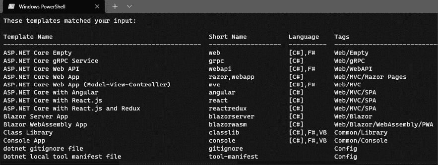

# 第一章：1 引言

## 在你开始之前：加入我们的 Discord 书社区

直接向作者本人提供反馈，并在我们的 Discord 服务器上与其他早期读者聊天（在“architecting-aspnet-core-apps-3e”频道下找到，位于“EARLY ACCESS SUBSCRIPTION”下）。

[`packt.link/EarlyAccess`](https://packt.link/EarlyAccess)


这本书的目标不是再创作一本设计模式的书；相反，章节是按照规模和主题组织的，让你可以从一个坚实的基础开始，逐步构建，就像你构建一个程序一样。我们不会提供关于应用设计模式的一些方法的指南，而是从软件工程师的角度探索我们正在设计的系统背后的思维过程。这不是一本魔法食谱书；从经验来看，在软件设计时没有魔法食谱；只有你的逻辑、知识、经验和分析技能。让我们把“经验”定义为*你过去的成功和失败*。而且不用担心，你在职业生涯中会失败，但不要因此气馁。你失败得越快，你恢复和学习得就越快，最终导致成功的产品。这本书中涵盖的许多技术应该能帮助你取得成功。每个人都会失败和犯错误；你不是第一个，也绝对不会是最后一个。用罗斯福的一句名言来概括：*从未失败的人是那些从未做过任何事情的人*。在更高层次上：

+   这本书探讨了基本模式、单元测试、架构原则和一些 ASP.NET Core 机制。

+   然后，我们转向组件规模，探索面向小块软件和单个单元的模式。

+   之后，我们将转向应用规模的模式和技术，探索如何构建应用程序。

+   书中涵盖的一些主题可能足以写一本书，所以在这本书之后，你应该有很多关于继续你的软件架构之旅的想法。

下面是关于这本书的一些值得注意的要点：

+   章节的组织是从小规模模式开始，然后逐步过渡到更高级的模式，使学习曲线更容易。

+   这本书不是提供食谱，而是关注事物背后的思考，并展示一些技术的演变，帮助你理解为什么发生了转变。

+   许多用例结合了多个设计模式来展示不同的用法，这样你可以有效地理解和使用这些模式。这也表明，设计模式不是需要驯服的野兽，而是可以用来使用、操纵和按照你的意愿弯曲的工具。

+   就像现实生活中一样，没有教科书上的解决方案可以解决我们所有的问题；现实问题总是比教科书上解释的更复杂。在这本书中，我旨在向你展示如何混合和匹配模式来思考“架构”，而不是给你一步一步的指令来复制。

引言章节的其余部分介绍了本书中探讨的概念，包括对一些观念的复习。我们还涉及了 .NET、其工具和一些技术要求。在本章中，我们涵盖了以下主题：

+   什么是设计模式？

+   反模式与代码异味。

+   理解网络 – 请求/响应。

+   开始使用 .NET。

## 什么是设计模式？

由于你刚刚购买了一本关于设计模式的书籍，我猜你对设计模式有一定的了解，但让我们确保我们处于同一页面上。**抽象定义**：设计模式是一种经过验证的技术，我们可以用它来解决特定的问题。在这本书中，我们应用不同的模式来解决各种问题，并利用一些开源工具来更快地前进！抽象定义让人听起来很聪明，但理解概念需要更多的实践，而通过实验来学习是最好的方法，设计模式也不例外。如果那个定义对你来说还不清楚，不要担心。到书的结尾，你应该有足够的信息将多个实际例子和解释与那个定义联系起来，使其变得非常清晰。我喜欢将编程比作玩 LEGO®，因为你要做的事情非常相似：把小部件放在一起，创造出更大的东西。因此，如果你缺乏想象力或技能，可能是因为你还太小，你的城堡可能看起来不如有更多经验的人那么好。带着这个类比，设计模式是一个组装解决方案的计划，该方案适合一个或多个场景，就像城堡的塔楼一样。一旦你设计了一个单独的塔楼，你就可以通过遵循相同的步骤来建造多个。设计模式充当那个塔楼计划，并为你提供组装可靠部件的工具，以改善你的杰作（程序）。然而，你并不是简单地拼接 LEGO®积木，而是在虚拟环境中嵌套代码块和交织对象！在更详细地介绍之前，精心设计的应用设计模式应该会改善你的应用程序设计。这无论是在设计一个小组件还是整个系统时都是正确的。然而，请注意：只是为了使用而将模式混合在一起可能会导致相反的结果：过度设计。相反，目标是编写尽可能少的可读代码来解决你的问题或自动化你的流程。正如我们简要提到的，设计模式适用于不同的软件工程级别，在这本书中，我们从小的开始，逐渐扩展到云规模！我们遵循一个平稳的学习曲线，从更简单的模式和代码示例开始，这些示例将良好的实践弯曲以关注模式——最后以更高级的主题和良好的实践结束。当然，有些主题是概述而不是深入探讨，比如自动化测试，因为没有人能在一本书中涵盖所有内容。尽管如此，我已经尽我所能提供尽可能多的关于架构相关主题的信息，以确保为你打下坚实的基础，以便你能从更高级的主题中获得尽可能多的东西，并且我真诚地希望你会觉得这本书是一本有帮助且有趣的读物。让我们从设计模式的反面开始，因为识别做事的错误方式对于避免犯这些错误或在你看到它们时纠正它们是至关重要的。当然，知道如何使用设计模式克服特定问题也是至关重要的。

## 反模式和代码异味

反模式和代码异味是糟糕的架构实践或关于可能不良设计的提示。了解最佳实践与了解不良实践同样重要，这正是我们开始的地方。本书突出了多个反模式和代码异味，以帮助您入门。接下来，我们将简要探讨前几个。

### 反模式

**反模式**是与设计模式相反的概念：它是一种已被证明有缺陷的技术，很可能会给您带来麻烦，浪费您的时间和金钱（可能还会让您头疼）。反模式是一种看似不错且似乎就是您所寻找的解决方案的模式，但它带来的危害大于好处。一些反模式最初是合法的设计模式，后来被标记为反模式。有时，这取决于个人观点，有时分类可能受到编程语言或技术的影響。接下来，让我们看一个例子。本书中还将探讨其他一些反模式。

#### 反模式 – 上帝类

**上帝类**是一个处理太多事物的类。通常，这个类充当一个中心实体，许多其他类在应用程序中继承或使用它；它是系统中知道和管理一切的那个类；它是**那个**类。另一方面，它也是没有人愿意更新的类，每次有人触摸它时都会破坏应用程序：**它是一个邪恶的类**！修复这个问题的最佳方法是分离责任并将它们分配给多个类，而不是将它们集中在单个类中。本书将探讨如何在全书中划分责任，这有助于创建更健壮的软件。如果您有一个以**上帝类**为核心的个人项目，请先阅读本书，然后尝试将您学到的原则和模式应用到将那个类划分为多个较小的类，这些类可以相互交互。尝试将这些新类组织成统一的单元、模块或组件。为了帮助修复上帝类，我们在**第三章**“架构原则”中深入探讨了架构原则，为责任分离等概念打开了道路。

### 代码异味

**代码异味**是一个可能存在问题的指示器。它指向你的设计中可能需要重新设计的区域。当我们说“代码异味”时，我们指的是“有臭味的代码”或“看起来不对劲的代码”。需要注意的是，代码异味仅表明可能存在问题；并不意味着问题确实存在。代码异味通常是很好的指示器，因此分析你软件的“有异味”部分是值得的。一个很好的例子是，当一个方法需要许多注释来解释其逻辑时。这通常意味着代码可以被拆分成具有适当名称的小方法，从而产生更易读的代码，并允许你摆脱那些讨厌的注释。关于注释的另一个注意事项是，它们不会演变，所以经常发生的情况是，注释所描述的代码发生了变化，但注释保持不变。这会导致一个错误的或过时的代码块描述，可能会误导开发者。同样，这也适用于方法名称。有时，方法的名字和主体讲述的是不同的故事，导致相同的问题。尽管如此，这种情况比孤儿或过时的注释发生的频率要低，因为程序员在阅读和编写代码方面通常比口头注释做得更好。然而，在阅读、编写或审查代码时，请记住这一点。

#### 代码异味 – 控制狂

代码异味的绝佳例子是使用`new`关键字。这表明存在硬编码的依赖关系，其中创建者控制新对象及其生命周期。这也被称为**控制狂反模式**，但我更喜欢将其视为代码异味而不是反模式，因为`new`关键字本身并不是错误的。在这个时候，你可能想知道在面向对象编程中如何不使用`new`关键字，但请放心，我们将在第七章“深入依赖注入”中介绍这一点，并扩展控制狂代码异味。

#### 代码异味 – 长方法

**长方法**代码异味是指方法扩展到 10 到 15 行代码以上。这是一个很好的迹象，表明你应该以不同的方式考虑该方法。具有分隔多个代码块的注释是方法可能太长的良好指标。以下是一些可能的情况示例：

+   该方法包含在多个条件语句中交织的复杂逻辑。

+   该方法包含一个大的`switch`块。

+   该方法做了太多事情。

+   该方法包含代码重复。

为了解决这个问题，你可以做以下几件事：

+   提取一个或多个私有方法。

+   将一些代码提取到新的类中。

+   重复使用外部类中的代码。

+   如果你有很多条件语句或巨大的`switch`块，你可以利用设计模式，如责任链模式或 CQRS，你将在第十章“行为模式”和第十四章“中介和 CQRS 设计模式”中了解到这些。

通常，每个问题都有一个或多个解决方案；你需要找出问题，然后找到、选择并实现其中一个解决方案。让我们明确一点：包含 16 行的方法不一定需要重构；它可能是可以接受的。记住，代码异味表明*可能*存在问题，并不一定意味着必然存在问题——运用常识。

## 理解 Web – 请求/响应

在继续之前，理解 Web 的基本概念是至关重要的。HTTP 1.X 背后的想法是客户端向服务器发送 HTTP 请求，然后服务器响应该客户端。如果你有 Web 开发经验，这听起来可能很平凡。然而，无论你是构建 Web API、网站还是复杂的云应用，这都是最重要的 Web 编程概念之一。让我们将 HTTP 请求的生命周期简化为以下：

1.  通信开始。

1.  客户端向服务器发送请求。

1.  服务器接收请求。

1.  服务器对请求进行一些操作，比如执行代码/逻辑。

1.  服务器响应客户端。

1.  通信结束。

在那个周期之后，服务器不再知道客户端的存在。此外，如果客户端发送另一个请求，服务器也不会意识到它之前已经对同一个客户端的请求做出了响应，因为**HTTP 是无状态的**。有机制可以在服务器之间创建请求的持久感，使其“知道”其客户端。其中最著名的是 cookies。如果我们深入挖掘，一个 HTTP 请求由一个头部和一个可选的正文组成。然后，使用特定的方法发送请求。最常见的 HTTP 方法有`GET`和`POST`。在此基础上，广泛用于 Web API 的，我们还可以添加`PUT`、`DELETE`和`PATCH`到这个列表中。尽管不是每个 HTTP 方法都接受正文，可以响应正文，或者应该是幂等的，这里有一个快速参考表：

| **方法** | **请求有正文** | **响应有正文** | **幂等** |
| --- | --- | --- | --- |
| `GET` | 否* | 是 | 是 |
| `POST` | 是 | 是 | 否 |
| `PUT` | 是 | 否 | 是 |
| `PATCH` | 是 | 是 | 否 |
| `DELETE` | 可能 | 可能 | 是 |

> * 使用`GET`请求发送正文并不是 HTTP 规范所禁止的，但这种请求的语义也没有定义。最好避免发送带有正文的`GET`请求。

一个**幂等**请求是一个无论发送一次还是多次都会产生相同结果的请求。例如，发送相同的`POST`请求多次应该创建多个类似的实体，而发送相同的`DELETE`请求多次应该删除单个实体。幂等请求的状态码可能不同，但服务器状态应该保持不变。我们在*第四章*，*模型-视图-控制器*中更深入地探讨了这些概念。以下是一个`GET`请求的示例：

```cs
GET http: //www.forevolve.com/ HTTP/1.1
Host: www.forevolve.com
Connection: keep-alive
Upgrade-Insecure-Requests: 1
User-Agent: Mozilla/5.0 (Windows NT 10.0; Win64; x64)
AppleWebKit/537.36 (KHTML, like Gecko) Chrome/70.0.3538.110 Safari/537.36
Accept: text/html,application/xhtml+xml,application/xml;q=0.9,image/webp,image/apng,*/*;q=0.8
Accept-Encoding: gzip, deflate
Accept-Language: en-US,en;q=0.9,fr-CA;q=0.8,fr;q=0.7
Cookie: ...
```

HTTP 头部包含一个键/值对的列表，表示客户端想要发送给服务器的元数据。在这种情况下，我使用`GET`方法查询我的博客，Google Chrome 附加了一些额外的信息到请求中。我将`Cookie`头部的值替换为`...`，因为它可能相当大，而且这些信息与这个示例无关。尽管如此，cookie 就像任何其他 HTTP 头部一样被来回传递。

> **关于 cookie 的重要说明**
> 
> > 客户端发送 cookie，服务器在每次请求-响应周期中返回它们。如果您在来回传递太多信息（cookie 或其他）时，这可能会杀死您的带宽或减慢您的应用程序。一个很好的例子是序列化的身份 cookie 非常大。
> > 
> > 另一个例子，与 cookie 无关，但造成了这样的来回，是那个古老的 Web Forms `ViewState`。这是一个与每个请求一起发送的隐藏字段。如果未经检查，该字段可能会变得非常大。
> > 
> > 现在，随着高速互联网的出现，很容易忘记这些问题，但它们可以显著影响慢速网络上的用户体验。

当服务器决定响应请求时，它会返回一个头部和一个可选的正文，遵循与请求相同的原理。第一行指示请求的状态：是否成功。在我们的例子中，状态码是`200`，表示成功。每个服务器都可以向其响应添加更多或更少的信息。您也可以使用代码自定义响应。以下是之前请求的响应：

```cs
HTTP/1.1 200 OK
Server: GitHub.com
Content-Type: text/html; charset=utf-8
Last-Modified: Wed, 03 Oct 2018 21:35:40 GMT
ETag: W/"5bb5362c-f677"
Access-Control-Allow-Origin: *
Expires: Fri, 07 Dec 2018 02:11:07 GMT
Cache-Control: max-age=600
Content-Encoding: gzip
X-GitHub-Request-Id: 32CE:1953:F1022C:1350142:5C09D460
Content-Length: 10055
Accept-Ranges: bytes
Date: Fri, 07 Dec 2018 02:42:05 GMT
Via: 1.1 varnish
Age: 35
Connection: keep-alive
X-Served-By: cache-ord1737-ORD
X-Cache: HIT
X-Cache-Hits: 2
X-Timer: S1544150525.288285,VS0,VE0
Vary: Accept-Encoding
X-Fastly-Request-ID: 98a36fb1b5642c8041b88ceace73f25caaf07746
<Response body truncated for brevity>
```

现在浏览器已经收到服务器的响应，它会渲染 HTML 网页。然后，对于每个资源，它会向其 URI 发送另一个 HTTP 请求并加载它。资源是一个外部资产，例如图片、JavaScript 文件、CSS 文件或字体。在响应之后，服务器就不再知道客户端了；通信已经结束。理解这一点很重要，为了在每次请求之间创建一个伪状态，我们需要使用外部机制。这种机制可以是利用 cookie 的*会话状态*，简单地使用 cookie，或者某些其他 ASP.NET Core 机制，或者我们可以创建一个无状态应用程序。我建议尽可能使用无状态应用程序。我们在书中主要编写无状态应用程序。

> **注意**
> 
> > 如果你想了解更多关于会话和状态管理的信息，我在章节末尾的*进一步阅读*部分留下了一个链接。

如你所想，互联网的骨架是其网络栈。**超文本传输协议**（**HTTP**）是该栈的最高层（第 7 层）。HTTP 是建立在**传输控制协议**（**TCP**）之上的应用层。TCP（第 4 层）是传输层，它定义了数据如何在网络上传输（例如，数据的传输、传输的数据量以及错误检查）。TCP 使用 **互联网协议**（**IP**）层来到达它试图与之通信的计算机。IP（第 3 层）代表网络层，它处理数据包的 IP 寻址。数据包是传输线上传输的数据块。我们可以直接从源机器向目标机器发送大文件，但这并不实用，因此网络栈将大项目分解成更小的数据包。例如，源机器将文件分解成多个数据包，将它们发送到目标机器，然后目标机器将它们重新组装成源文件。这个过程允许多个发送者使用相同的线路，而不是等待第一次传输完成。如果一个数据包在传输过程中丢失，源机器也可以只将那个数据包发送回目标机器。放心，你不需要理解网络背后的每一个细节来编写网络应用程序，但了解 HTTP 使用 TCP/IP 并将大负载分成小数据包总是好的。此外，HTTP/1 限制了浏览器可以同时打开的并行请求数量。这些知识可以帮助你优化你的应用程序。例如，要加载的资产数量、它们的大小以及它们发送到浏览器的顺序可能会增加页面加载时间、感知的页面加载时间或绘制时间。为了总结这个主题，而不深入探讨网络，HTTP/1 虽然较旧，但却是基础性的。HTTP/2 更高效，并支持使用相同的 TCP 连接流式传输多个资产。它还允许服务器在客户端请求资源之前向客户端发送资产，这被称为服务器推送。如果你对 HTTP 感兴趣，HTTP/2 是一个很好的开始深入研究的地方，以及使用 QUIC 传输协议而不是 HTTP 的 HTTP/3 提议标准（RFC 9114）。ASP.NET Core 7.0+支持 HTTP/3，这在 ASP.NET Core 8.0 中默认启用。接下来，让我们快速探索.NET。

## 开始使用 .NET

一点历史：.NET Framework 1.0 首次于 2002 年发布。.NET 是一个托管框架，将您的代码编译成名为 **中间语言**（**IL**）的 **Microsoft 中间语言**（**MSIL**）。然后，该 IL 代码被编译成本地代码，并由 **公共语言运行时**（**CLR**）执行。现在，CLR 简单地被称为 **.NET 运行时**。在发布了几个版本的 .NET Framework 之后，微软从未兑现过可互操作堆栈的承诺。此外，许多缺陷被构建到 .NET Framework 的核心中，使其与 Windows 紧密绑定。Mono，一个开源项目，由社区开发，以使 .NET 代码能够在非 Windows 操作系统上运行。Mono 被用于并由微软在 2016 年收购的 Xamarin 支持。Mono 使 .NET 代码能够在 Android 和 iOS 等其他操作系统上运行。后来，微软开始开发官方的跨平台 .NET SDK 和运行时，它们将其命名为 .NET Core。.NET 团队从零开始构建了 ASP.NET Core，完全切断了与旧版 .NET Framework 版本的兼容性。这最初带来了一些问题，但 .NET Standard 缓解了旧 .NET 和新 .NET 之间的互操作性难题。经过多年的改进和两个并行的主要版本（Core 和 Framework），微软将大多数 .NET 技术统一到了 .NET 5+，并实现了共享的 **基类库**（**BCL**）的承诺。随着 .NET 5 的发布，.NET Core 简单地成为了 .NET，而 ASP.NET Core 仍然是 ASP.NET Core。没有 .NET “Core” 4，以避免与 .NET Framework 4.X 产生任何潜在的混淆。现在，.NET 每年都会发布新的主要版本。偶数版本是 **长期支持**（**LTS**）版本，提供 3 年的免费支持，而奇数版本（当前版本）仅提供 18 个月的免费支持。这本书的亮点在于，涵盖的架构原则和设计模式在未来应该仍然相关，并且与您使用的 .NET 版本没有紧密耦合。代码示例的微小更改应该足以将您的知识和代码迁移到新版本。接下来，我们将介绍一些关于 .NET 生态系统的关键信息。

### .NET SDK 与运行时对比

您可以安装属于 SDK 和运行时分组的不同二进制文件。SDK 允许您构建和运行 .NET 程序，而运行时仅允许您运行 .NET 程序。作为一名开发者，您希望在您的部署环境中安装 SDK。在服务器上，您希望安装运行时。运行时更轻量，而 SDK 包含更多工具，包括运行时。

### .NET 5+ 与 .NET Standard 对比

当构建 .NET 项目时，有多种项目类型，但基本上，我们可以将它们分为两大类：

+   应用程序

+   库

应用程序针对.NET 的一个版本，例如`net5.0`和`net6.0`。例如，ASP.NET 应用程序或控制台应用程序就是这样的例子。库是一组编译在一起的代码包，通常以 NuGet 包的形式分发。.NET Standard 类库项目允许在.NET 5+和.NET Framework 项目之间共享代码。.NET Standard 的出现是为了弥合.NET Core 和.NET Framework 之间的兼容性差距，这简化了过渡过程。当.NET Core 1.0 首次发布时，事情并不容易。随着.NET 5 统一所有平台并成为统一.NET 生态系统的未来，.NET Standard 就不再需要了。此外，应用程序和库的作者应该针对基础**目标框架标识符**（**TFM**），例如，`net8.0`。在需要时，您也可以针对`netstandard2.0`或`netstandard2.1`，例如，与.NET Framework 共享代码。Microsoft 还引入了与.NET 5+相关的特定于操作系统的 TFM，允许代码使用特定于操作系统的 API，如`net8.0-android`和`net8.0-tvos`。在需要时，您也可以针对多个 TFM。

> **注意**
> 
> > 我相信我们还将看到.NET Standard 库存在一段时间。并非所有项目都能神奇地从.NET Framework 迁移到.NET 5+，人们将希望继续在这两个之间共享代码。

.NET 的下一个版本是在.NET 5+之上构建的，而.NET Framework 4.X 将保持现状，只接收安全补丁和较小更新。例如，.NET 8 是在.NET 7 之上构建的，迭代.NET 6 和 5。接下来，让我们看看一些工具和代码编辑器。

### Visual Studio Code 与 Visual Studio 以及命令行界面

如何创建这样的项目？.NET Core 附带`dotnet`**命令行界面**（**CLI**），它公开了多个命令，包括`new`。在终端中运行`dotnet new`命令将生成一个新的项目。要创建一个空的类库，我们可以运行以下命令：

```cs
md MyProject
cd MyProject
dotnet new classlib
```

这将在新创建的 `MyProject` 目录中生成一个空白的类库。`-h` 选项有助于发现可用的命令及其选项。例如，你可以使用 `dotnet -h` 来查找可用的 SDK 命令，或者使用 `dotnet new -h` 来了解选项和可用的模板。.NET 现在拥有 `dotnet` CLI 真是太棒了。CLI 允许我们在本地开发或通过任何其他过程时，在持续集成（**CI**）管道中自动化我们的工作流程。CLI 还使得编写任何人都可以遵循的文档变得更加容易；在终端中输入几个命令要比安装像 Visual Studio 和模拟器这样的程序要容易和快得多。**Visual Studio Code** 是我最喜欢的文本编辑器。我并不经常用它来编写 .NET 代码，但我在需要重新组织项目时，或者在 CLI 时间，或者完成任何其他更适合使用文本编辑器完成的任务时，比如使用 Markdown 编写文档、编写 JavaScript 或 TypeScript，或者管理 JSON、YAML 或 XML 文件时，还是会使用它。要创建 C# 项目、Visual Studio 解决方案或使用 Visual Studio Code 添加 NuGet 包，请打开终端并使用 CLI。至于 **Visual Studio**，我最喜欢的 C# 集成开发环境，它使用 CLI 在底层创建相同的项目，使得工具之间保持一致，只是在 `dotnet new` CLI 命令之上添加了用户界面。你可以在 CLI 中创建和安装额外的 `dotnet` `new` 项目模板，甚至创建全局工具。你也可以使用你更喜欢的其他代码编辑器或 IDE。这些主题超出了本书的范围。

#### 项目模板概述

这里是已安装的模板示例（`dotnet` `new --list`）：



图 1.1：项目模板

对所有模板的研究超出了本书的范围，但我想要简要介绍一些值得注意的模板，其中一些我们将在后面使用：

+   `dotnet new console` 创建一个控制台应用程序

+   `dotnet new classlib` 创建一个类库

+   `dotnet new xunit` 创建一个 xUnit 测试项目

+   `dotnet new web` 创建一个空白的 Web 项目

+   `dotnet new mvc` 搭建一个 MVC 应用程序

+   `dotnet new webapi` 搭建一个 Web API 应用程序

#### 运行和构建你的程序

如果你使用的是 Visual Studio，你可以始终点击播放按钮，或 *F5*，来运行你的应用程序。如果你使用的是 CLI，你可以使用以下命令（以及更多）。每个命令都提供了不同的选项来控制其行为。在任意命令中添加 `-h` 标志可以获取该命令的帮助信息，例如 `dotnet build -h`：

| **命令** | **描述** |
| --- | --- |
| `dotnet restore` | 基于当前目录中存在的 `.csproj` 或 `.sln` 文件恢复依赖项（即 NuGet 包）。 |
| `dotnet build` | 基于当前目录中存在的 `.csproj` 或 `.sln` 文件构建应用程序。它隐式地首先运行 `restore` 命令。 |
| `dotnet run` | 基于当前目录中存在的 `.csproj` 文件运行当前应用程序。它隐式地首先运行 `build` 和 `restore` 命令。 |
| `dotnet watch run` | 监视文件更改。当文件发生更改时，CLI 使用热重载功能更新该文件的代码。如果无法这样做，它将重新构建应用程序然后重新运行（相当于再次执行 `run` 命令）。如果是 Web 应用程序，页面应自动刷新。 |
| `dotnet test` | 基于当前目录中存在的 `.csproj` 或 `.sln` 文件运行测试。它隐式地首先运行 `build` 和 `restore` 命令。我们将在下一章介绍测试。 |
| `dotnet watch test` | 监视文件更改。当文件发生更改时，CLI 重新运行测试（相当于再次执行 `test` 命令）。 |
| `dotnet publish` | 基于当前目录中存在的 `.csproj` 或 `.sln` 文件将当前应用程序发布到目录或远程位置，例如托管提供商。它隐式地首先运行 `build` 和 `restore` 命令。 |
| `dotnet pack` | 基于当前目录中存在的 `.csproj` 或 `.sln` 文件创建一个 NuGet 包。它隐式地首先运行 `build` 和 `restore` 命令。您不需要 `.nuspec` 文件。 |
| `dotnet clean` | 根据当前目录中存在的 `.csproj` 或 `.sln` 文件清理项目或解决方案的构建输出。 |

### 技术要求

在整本书中，我们将探索并编写代码。我建议安装 Visual Studio、Visual Studio Code 或两者都安装，以帮助完成这项工作。我使用 Visual Studio 和 Visual Studio Code。其他替代方案包括 Visual Studio for Mac、Riders 或您选择的任何其他文本编辑器。除非您安装了包含 .NET SDK 的 Visual Studio，否则可能需要单独安装 SDK。SDK 包含我们之前探索的 CLI 以及运行和测试您的程序所需的构建工具。有关更多信息以及这些资源的链接，请查看 GitHub 仓库中的 `README.md` 文件。所有章节的源代码都可以在以下地址下载：[`adpg.link/net6`](https://adpg.link/net6)。

## 摘要

本章探讨了设计模式、反模式和代码异味。我们还探索了其中的一些。然后，我们回顾了典型 Web 应用程序的请求/响应周期。接着，我们继续探索 .NET 的基本知识，例如 SDK 与运行时以及应用程序目标与 .NET Standard。然后，我们更深入地研究了 .NET CLI，其中我列出了一些基本命令，包括 `dotnet build` 和 `dotnet watch run`。我们还介绍了如何创建新项目。这使我们能够探索在构建我们的 .NET 应用程序时具有的不同可能性。在接下来的两章中，我们将探讨自动化测试和架构原则。这些是构建健壮、灵活和可维护应用程序的基础章节。

## 问题

让我们看看一些练习题：

1.  我们能否给一个`GET`请求添加一个主体？

1.  为什么长方法是代码异味？

1.  创建库时，.NET Standard 是否应该是你的默认目标？

1.  代码异味是什么？

## 进一步阅读

这里有一些链接，可以帮助巩固本章学到的内容：

+   .NET 版本概述：[`adpg.link/n52L`](https://adpg.link/n52L)

+   .NET CLI 概述：[`adpg.link/Lzx3`](https://adpg.link/Lzx3)

+   `dotnet` `new`的定制模板：[`adpg.link/74i2`](https://adpg.link/74i2)

+   ASP.NET Core 中的会话和状态管理：[`adpg.link/Xzgf`](https://adpg.link/Xzgf)
