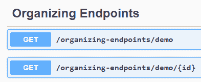
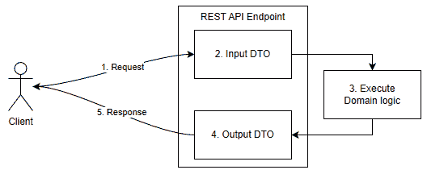

# 第五章：5 最小化 API

## 在开始之前：加入我们的 Discord 书籍社区

直接向作者本人提供反馈，并在我们的 Discord 服务器上与其他早期读者聊天（在“EARLY ACCESS SUBSCRIPTION”下找到“architecting-aspnet-core-apps-3e”频道）。

[`packt.link/EarlyAccess`](https://packt.link/EarlyAccess)


本章涵盖了最小化 API，这是一种简化设置和运行.NET 应用程序的方法。我们探讨了使最小化托管和最小化 API 成为 ASP.NET Core 关键更新的原因，我们揭示了创建 API 的简洁性。我们涵盖了 ASP.NET Core 最小化 API 带来的许多可能性，例如如何配置、自定义和组织这些端点。我们还探讨了使用数据传输对象（DTOs）与最小化 API 结合使用，将简洁性与有效的数据管理相结合，有效地构建 API 合同。受其他技术启发，这些主题为.NET 世界带来了新的视角，使我们能够在不牺牲弹性的情况下构建精简且性能良好的 API。在本章中，我们涵盖了以下主题：

+   顶级语句

+   最小化托管

+   最小化 API

+   使用数据传输对象（DTOs）与最小化 API

让我们从顶级语句开始。

## 顶级语句

.NET 团队在.NET 5 和 C# 9 中向语言引入了顶级语句。从那时起，在声明命名空间和其他成员之前编写语句成为可能。在底层，编译器将这些语句输出到`Program.Main`方法。使用顶级语句，一个最小的.NET“Hello World”控制台程序看起来像这样（`Program.cs`）：

```cs
using System;
Console.WriteLine("Hello world!");
```

不幸的是，我们仍然需要一个项目来运行它，因此我们必须创建一个包含以下内容的`.csproj`文件：

```cs
<Project Sdk="Microsoft.NET.Sdk">
    <PropertyGroup>
        <TargetFramework>net5.0</TargetFramework>
        <OutputType>Exe</OutputType>
    </PropertyGroup>
</Project>
```

从那里，我们可以使用.NET CLI 来`dotnet run`应用程序，并在程序终止前在控制台输出以下内容：

```cs
Hello world!
```

在这样的语句之上，我们还可以声明其他成员，如类，并在我们的应用程序中使用它们。然而，我们必须在顶级代码的末尾声明类。

> 注意，顶级语句代码不属于任何命名空间，建议在命名空间中创建类，因此您应该将`Program.cs`文件中进行的声明数量限制在其内部工作内部，如果有的话。

顶级语句非常适合开始使用 C#，编写代码示例，并删除样板代码。

> 在前面的 C#代码中（`using System;`），当启用*隐式使用*功能时，该功能是.NET 6+项目的默认设置，高亮显示的行是不必要的。模板将以下行添加到`.csproj`文件中：

```cs
<ImplicitUsings>enable</ImplicitUsings>
```

接下来，我们将探讨使用顶级语句构建的最小化托管模型。

## 最小化托管

.NET 6 引入了最小化托管模型。它将 `Startup` 和 `Program` 类合并为一个 `Program.cs` 文件。它利用顶层语句来最小化启动应用程序所需的样板代码。它还使用 *全局使用指令* 和 *隐式使用* 功能进一步减少样板代码。此模型只需要一个文件，包含以下三行代码即可创建 Web 应用程序：

```cs
var builder = WebApplication.CreateBuilder(args);
var app = builder.Build();
app.Run();
```

让我们称这种方法比之前更精简。当然，前面的代码启动了一个什么也不做的应用程序，但要在之前做同样的事情，可能需要数十行代码。最小化托管代码分为两部分：

+   我们使用的 *Web 应用程序构建器* 来配置应用程序、注册服务、设置、环境、日志等（高亮显示的代码）。

+   我们使用的 *Web 应用程序* 来配置 HTTP 管道和路由（非高亮显示的行）。

这种简化的模型导致了我们接下来要探讨的最小化 API。

## 最小化 API

ASP.NET Core 的最小化 API 建立在最小化托管模型之上，为构建 Web 应用程序提供了一种精简的方法。高度受 Node.js 启发，它们通过减少样板代码来简化 API 的开发。通过强调简单性和性能，它们提高了可读性和可维护性。它们非常适合微服务架构和旨在保持精简的应用程序。

> 您也可以使用最小化 API 构建大型应用程序；这里的“最小化”指的是它们精简的方法，而不是您可以使用它们创建的应用程序类型。

这种最小化方法在功能上略有妥协，但提高了灵活性和速度，确保您对 API 的行为有完全的控制权，同时保持项目精简高效。最小化 API 包含大多数应用程序所需的必要功能，如模型绑定、依赖注入、过滤器以及路由到代理模型。如果您需要 MVC 的所有功能，您仍然可以选择使用 MVC。您甚至可以使用两者；这并不是非此即彼。

> 我们在 *第六章* 中探讨了模型-视图-控制器 (MVC) 模式，*MVC*。

让我们看看如何映射路由。

### 映射路由到代理

它是如何工作的？最小化 API 带来了多个扩展方法来配置 HTTP 管道和配置端点。我们可以使用这些方法将路由（URL 模式）映射到 `RequestDelegate` 代理。我们可以使用以下方法来映射不同的 HTTP 方法：

| **方法** | **描述** |
| --- | --- |
| `MapGet` | 将 `GET` 请求映射到 `RequestDelegate`。 |
| `MapPost` | 将 `POST` 请求映射到 `RequestDelegate`。 |
| `MapPut` | 将 `PUT` 请求映射到 `RequestDelegate`。 |
| `MapDelete` | 将 `DELETE` 请求映射到 `RequestDelegate`。 |
| `MapMethods` | 将路由模式和多个 HTTP 方法映射到 `RequestDelegate`。 |
| `Map` | 将路由模式映射到 `RequestDelegate`。 |
| `MapFallback` | 将回退 `RequestDelegate` 映射到没有其他路由匹配时运行的。 |
| `MapGroup` | 允许配置适用于该组下定义的所有端点的路由模式属性。 |

表 5.1：映射路由到委托的扩展方法。

这里有一个最小 GET 示例：

```cs
app.MapGet("minimal-endpoint-inline", () => "GET!");
```

当执行程序时，导航到 `/minimal-endpoint-inline` URI 将请求路由到已注册的 `RequestDelegate`（高亮代码），它输出以下字符串：

```cs
GET!
```

如此简单，我们就可以将请求路由到委托并创建端点。

> 在注册端点的基础上，我们还可以像任何其他 ASP.NET Core 应用程序一样注册中间件。此外，内置的中间件，如身份验证和 CORS，与最小 API 的工作方式相同。

接下来，我们将探索配置端点的方法，这样我们就可以创建比返回字面字符串的端点更好的 API。

### 配置端点

现在我们知道了，使用最小 API，我们将路由映射到委托，并且我们已经了解了一些实现此目的的方法，让我们探索如何注册委托：

+   内联，就像前面的示例一样。

+   使用方法。

要内联声明委托，我们可以这样做：

```cs
app.MapGet("minimal-endpoint-inline", () => "GET!");
```

要使用方法，我们可以这样做：

```cs
app.MapGet("minimal-endpoint-method", MyMethod);
void MyMethod() { }
```

> 当启用时，ASP.NET Core 将包含方法的类名注册到 `ApiExplorer` 作为标签。我们将在本章的后面进一步探讨元数据。

本章中探讨的所有概念都适用于两种注册委托的方式。让我们首先研究如何在端点中输入数据。

#### 输入

端点很少没有参数（没有输入值）。类似于 MVC 的最小 API 支持广泛的绑定来源。绑定来源表示将 HTTP 请求转换为强类型 C# 对象的过程，该对象作为参数输入。大多数参数绑定都是隐式的，但如果你需要显式绑定参数，以下是一些支持的绑定来源：

| **源** | **属性** | **描述** |
| --- | --- | --- |
| `Route` | `[FromRoute]` | 绑定与参数名称匹配的路由值。 |
| `Query` | `[FromQuery]` | 绑定与参数名称匹配的查询字符串值。 |
| `Header` | `[FromHeader]` | 绑定与参数名称匹配的 HTTP 头部值。 |
| `Body` | `[FromBody]` | 将请求的 JSON 主体绑定到参数的类型。 |
| `Form` | `[FromForm]` | 绑定与参数名称匹配的表单值。 |
| `Services` | `[FromServices]` | 从 ASP.NET Core 依赖注入容器中注入服务。 |
| `Custom` | `[AsParameters]` | 将表单值绑定到类型。匹配发生在表单键和属性名称之间。 |

表 5.2：支持的绑定来源

接下来是一个演示，我们将路由中的 `id` 参数（高亮代码）隐式绑定到委托中的参数：

```cs
app.MapGet(
    "minimal-endpoint-input-route-implicit/{id}", 
    (int id) => $"The id was {id}."
);
```

在大多数情况下，绑定是隐式的。但是，你可以像这样显式绑定委托的参数：

```cs
app.MapGet(
    "minimal-endpoint-input-route-explicit/{id}",
    ([FromRoute] int id) => $"The id was {id}."
);
```

我们还可以隐式地将依赖项注入到我们的委托中，甚至可以与路由参数混合使用，如下所示：

```cs
app.MapGet(
    "minimal-endpoint-input-service/{value}",
    (string value, SomeInternalService service)
        => service.Respond(value)
);
public class SomeInternalService {
    public string Respond(string value)
        => $"The value was {value}";
}
```

按照这种模式，我们可以为我们的端点输入数据提供无限的可能性。

> 如果您不熟悉依赖注入（DI），我们将在第八章 *依赖注入* 中更深入地探讨 DI。同时，请记住，我们可以将对象绑定到参数，无论它们是 DTO 还是服务。

此外，ASP.NET Core 还为我们提供了一些特殊类型，我们将在下面进行探讨。

##### 特殊类型

我们可以将以下对象作为参数注入到我们的委托中，ASP.NET Core 会为我们管理它们：

| **类** | **描述** |
| --- | --- |
| `HttpContext` | `HttpContext` 包含了所有当前的 HTTP 请求和响应细节。`HttpContext` 暴露了我们正在探讨的所有其他特殊类型，因此如果您需要多个类型，可以直接注入 `HttpContext` 以减少参数数量。 |
| `HttpRequest` | 我们可以使用 `HttpRequest` 在当前请求上执行基本的 HTTP 操作，例如手动查询参数并绕过 ASP.NET Core 数据绑定机制。与 `HttpContext.Request` 属性相同。 |
| `HttpResponse` | 与 `HttpRequest` 类似，我们可以利用 `HttpResponse` 对象在 HTTP 响应上执行手动操作，例如直接写入响应流、手动管理 HTTP 头等。与 `HttpContext.Response` 属性相同。 |
| `CancellationToken` | 将取消标记传递给异步操作是一种推荐的做法。在这种情况下，它允许在请求被取消时取消操作。与 `HttpContext.RequestAborted` 属性相同。 |
| `ClaimsPrincipal` | 要访问当前用户，我们可以注入一个 `ClaimsPrincipal` 实例。与 `HttpContext.User` 属性相同。 |

表 5.3：特殊 HTTP 类型

以下是一个示例，其中两个端点写入响应流，一个使用 `HttpContext`，另一个使用 `HttpResponse` 对象：

```cs
app.MapGet(
    "minimal-endpoint-input-HttpContext/",
    (HttpContext context)
        => context.Response.WriteAsync("HttpContext!")
);
app.MapGet(
    "minimal-endpoint-input-HttpResponse/",
    (HttpResponse response)
        => response.WriteAsync("HttpResponse!")
);
```

我们可以将这些特殊类型视为任何其他绑定，并与其他类型（如路由值和服务）无缝集成。我们将在下一节介绍数据绑定的最后一部分。

##### 自定义绑定

我们可以手动将请求数据绑定到自定义类的实例。我们可以通过以下方式实现：

+   创建一个静态的 `TryParse` 方法，用于解析来自路由、查询或头值的字符串。

+   创建一个静态的 `BindAsync` 方法，直接使用 `HttpContext` 控制绑定过程。

我们必须在打算使用 HTTP 请求数据的类中编写这些静态方法。我们将在下面探讨这两种场景。

###### 手动解析

`TryParse` 方法接受一个字符串和一个自身类型的 `out` 参数。框架使用该方法将值解析为所需类型。解析 API 支持实现以下方法之一：

```cs
public static bool TryParse(string value, TSelf out result);
public static bool TryParse(string value, IFormatProvider provider, TSelf out result);
```

> 实现 `IParsable<TSelf>` 接口提供了适当的 `TryParse` 方法。

这里有一个示例，它解析了经纬度坐标：

```cs
app.MapGet(
    "minimal-endpoint-input-Coordinate/",
    (Coordinate coordinate) => coordinate
);
public class Coordinate : IParsable<Coordinate>
{
    public double Latitude { get; set; }
    public double Longitude { get; set; }
    public static Coordinate Parse(
        string value, 
        IFormatProvider? provider)
    {
        if (TryParse(value, provider, out var result))
        {
            return result;
        }
        throw new ArgumentException(
            "Cannot parse the value into a Coordinate.",
            nameof(value)
        );
    }
    public static bool TryParse(
        [NotNullWhen(true)] string? s,
        IFormatProvider? provider,
        [MaybeNullWhen(false)] out Coordinate result)
    {
        var segments = s?.Split(
            ',',
            StringSplitOptions.TrimEntries |
            StringSplitOptions.RemoveEmptyEntries
        );
        if (segments?.Length == 2)
        {
            var latitudeIsValid = double.TryParse(
                segments[0],
                out var latitude
            );
            var longitudeIsValid = double.TryParse(
                segments[1],
                out var longitude
            );
            if (latitudeIsValid && longitudeIsValid)
            {
                result = new() {
                    Latitude = latitude,
                    Longitude = longitude
                };
                return true;
            }
        }
        result = null;
        return false;
    }
}
```

在前面的代码中，端点返回了 `Coordinate` 类的 JSON 表示形式，而 `TryParse` 方法将输入字符串解析为 `Coordinate` 对象。

> `Coordinate` 类的 `Parse` 方法来自 `IParsable<TSelf>` 接口，对于模型绑定不是必需的。

例如，如果我们请求以下 URI：

```cs
/minimal-endpoint-input-Coordinate?coordinate=45.501690%2C%20-73.567253
```

端点返回：

```cs
{
  "latitude": 45.50169,
  "longitude": -73.567253
}
```

将字符串解析为对象是简单场景的一个可行选择。然而，更复杂的场景需要另一种技术，我们将在下一部分探讨。

###### 手动绑定

`BindAsync` 方法接受一个 `HttpContext` 和一个 `ParameterInfo` 参数，并返回一个 `ValueTask<TSelf>`，其中 `TSelf` 是我们进行数据绑定的类型。`HttpContext` 表示数据源（HTTP 请求），而 `ParameterInfo` 表示代表参数的委托，我们可以从中获取一些信息，比如它的名称。数据绑定 API 支持实现以下方法之一：

```cs
public static ValueTask<TSelf?> BindAsync(HttpContext context, ParameterInfo parameter);
public static ValueTask<TSelf?> BindAsync(HttpContext context);
```

> 实现 `IBindableFromHttpContext<TSelf>` 接口提供了适当的 `BindAsync` 方法。

这里有一个示例，它将 `Person` 从 HTTP 请求的查询参数中绑定：

```cs
app.MapGet(
    "minimal-endpoint-input-Person/",
    (Person person) => person
);
public class Person : IBindableFromHttpContext<Person>
{
    public required string Name { get; set; }
    public required DateOnly Birthday { get; set; }
    public static ValueTask<Person?> BindAsync(
        HttpContext context,
        ParameterInfo parameter)
    {
        var name = context.Request.Query["name"].Single();
        var birthdayIsValid = DateOnly.TryParse(
            context.Request.Query["birthday"],
            out var birthday
        );
        if (name is not null && birthdayIsValid) {
            var person = new Person() {
                Name = name,
                Birthday = birthday
            };
            return ValueTask.FromResult(person)!;
        }
        return ValueTask.FromResult(default(Person));
    }
}
```

上一段代码返回了人的 JSON 表示形式。例如，如果我们请求以下 URI：

```cs
/minimal-endpoint-input-Person?name=John%20Doe&birthday=2023-06-14
```

端点返回：

```cs
{
  "name": "John Doe",
  "birthday": "2023-06-14"
}
```

如我们所见，`BindAsync` 方法比 `TryParse` 方法强大得多，因为我们可以使用 `HttpContext` 访问更广泛的选择，从而允许我们覆盖更复杂的使用场景。然而，在这种情况下，我们可以利用 `[AsParameters]` 属性来实现相同的结果，并从查询中获取数据，而无需手动编写数据绑定代码。这是一个探索该属性的好机会；以下是相同代码的更新版本：

```cs
app.MapGet(
    "minimal-endpoint-input-Person2/",
    ([AsParameters] Person2 person) => person
);
public class Person2
{
    public required string Name { get; set; }
    public required DateOnly Birthday { get; set; }
}
```

就这样；`AsParameters` 属性为我们完成了工作！现在我们已经涵盖了从 HTTP 请求的不同位置读取输入值，是时候探索如何输出结果了。

#### 输出

有几种方法可以从我们的委托中输出数据：

+   返回一个可序列化的对象。

+   返回一个 `IResult` 实现的实例。

+   返回一个 `Results<TResult1, TResult2, …, TResultN>`，其中 `TResult` 泛型参数表示端点可以返回的不同 `IResult` 实现。

我们将在下一部分探讨那些可能性。

##### 可序列化对象

第一种方法是返回一个可序列化的对象，就像我们在关于输入的上一节中所做的那样。ASP.NET Core 将对象序列化为 JSON 字符串，并将 `Content-Type` 标头设置为 `application/json`。这是最简单的方法，但也是灵活性最低的方法。例如，以下代码：

```cs
app.MapGet(
    "minimal-endpoint-output-coordinate/",
    () => new Coordinate {
        Latitude = 43.653225,
        Longitude = -79.383186
    }
);
```

输出以下 JSON 字符串：

```cs
{
  "latitude": 43.653225,
  "longitude": -79.383186
}
```

这种方法的缺点是我们无法控制状态码，也无法从端点返回多个不同的结果。例如，如果端点在一个情况下返回 `200 OK`，在另一个情况下返回 `404 Not Found`。为了帮助我们，我们将探讨 `IResult` 抽象。

##### IResult

下一个选项是返回 `IResult` 接口。我们可以利用来自 `Microsoft.AspNetCore.Http` 命名空间的 `Results` 或 `TypedResults` 类来实现这一点。

> 我建议默认使用 .NET 7 引入的 `TypedResults`。

这两个之间的主要区别在于 `Results` 类中的方法返回 `IResult`，而 `TypedResults` 类中的方法返回 `IResult` 接口的类型化实现。这种区别可能听起来微不足道，但它改变了 API 探索器可发现性的方方面面。API 探索器无法自动发现前者的 API 合同，而可以自动发现后者。这是可能的，因为编译器可以推断返回类型，但在返回多个结果类型时会产生挑战。

> 这个选择会影响你需要投入多少工作量来获得精心制作的 OpenAPI 规范（自动或不那么自动）。

以下两个端点明确指出结果是 200 OK，每个端点使用一个类：

```cs
app.MapGet(
    "minimal-endpoint-output-coordinate-ok1/",
    () => Results.Ok(new Coordinate {
        Latitude = 43.653225,
        Longitude = -79.383186
    })
);
app.MapGet(
    "minimal-endpoint-output-coordinate-ok2/",
    () => TypedResults.Ok(new Coordinate {
        Latitude = 43.653225,
        Longitude = -79.383186
    })
);
```

当查看生成的 OpenAPI 规范时，第一个端点没有返回值，而其他端点有一个模仿我们 C# 类的 `Coordinate` 定义。接下来，我们更深入地探讨 `TypedResults` 类。

##### 类型化结果

我们可以使用 `TypedResults` 类的方法生成强类型输出。它们允许我们控制输出，同时通知 ASP.NET Core 有关具体信息，如状态码和返回类型。

> 请注意，为了简化，我已省略变体和重载，仅关注表中每个方法的本质。

让我们从成功状态码开始，其中 `200 OK` 状态码可能是最常见的：

| **方法** | **描述** |
| --- | --- |
| `Accepted` | 生成一个 `202 Accepted` 响应，表示异步过程的开始。 |
| `Created` | 生成一个 `201 Created` 响应，表示系统创建了实体，实体的位置以及实体本身。 |
| `Ok` | 生成一个 `200 OK` 响应，表示操作成功。 |

表 5.4：TypedResults 成功状态码方法。

在成功的基础上，我们必须知道如何向客户端报告错误。例如，`400 Bad Request` 和 `404 Not Found` 非常常见，用于指出请求中的问题。以下表格包含帮助向客户端指示此类问题的方法：

| **方法** | **描述** |
| --- | --- |
| `BadRequest` | 生成一个 `400 Bad Request` 响应，表示客户端请求存在问题，通常是验证错误。 |
| `Conflict` | 生成 `409 Conflict` 响应，表示在处理请求时发生了冲突，通常是一个并发错误。 |
| `NotFound` | 生成 `404 Not Found` 响应，表示未找到资源。 |
| `Problem` | 生成遵循由 **RFC7807** 定义的 *问题详情* 结构的响应，提供错误的标准封装。我们可以修改默认为 `500 内部服务器错误` 的状态码。 |
| `UnprocessableEntity` | 生成 `422 Unprocessable Content` 响应，表示服务器理解请求的内容类型和语法是正确的，但不能处理指令或实体。 |
| `ValidationProblem` | 生成遵循由 **RFC7807** 定义的 *问题详情* 结构的 `400 Bad Request` 响应。我们可以使用此方法向客户端传达输入验证问题。 |

表 5.5：TypedResults 问题状态码。

> 利用 *问题详情* 结构通过选择标准而不是自定义返回 API 错误的方式，提高了我们 API 的互操作性。

在 API 中，与常规 Web 应用相比，向客户端发送重定向较为罕见，然而，在需要时，我们可以使用以下方法之一将客户端重定向到另一个 URL：

| **方法** | **描述** |
| --- | --- |
| `LocalRedirect` | 根据指定的参数生成 `301 Moved Permanently`、`302 Found`、`307 Temporary Redirect` 或 `308 Permanent Redirect`。如果 URL 不是本地 URL，此方法将在运行时抛出异常，这是一个确保动态生成的 URL 不会将用户带离的绝佳选项。例如，当 URL 使用用户输入组成时。 |
| `Redirect` | 根据指定的参数生成 `301 Moved Permanently`、`302 Found`、`307 Temporary Redirect` 或 `308 Permanent Redirect`。 |

表 5.6：TypedResults 重定向状态码。

向客户端发送文件是另一个有用的功能；例如，API 可以使用授权来保护文件。以下表格展示了几个发送文件到客户端的辅助方法：

| **方法** | **描述** |
| --- | --- |
| `File` | 将文件内容写入响应流。`File` 方法是 `Bytes` 和 `Stream` 方法的别名。我们很快就会看到这些方法。 |
| `PhysicalFile` | 将物理文件的内容写入响应，使用绝对或相对路径。注意：不要将此方法暴露给原始用户输入，因为它可以读取位于 Web 内容根目录之外的文件。因此，恶意行为者可以构建一个请求来访问受限制的文件。 |
| `VirtualFile` | 使用绝对或相对路径将物理文件的内容写入响应。此方法将文件的位置限制在 Web 内容根目录，在处理用户输入时更安全。 |

表 5.7：下载文件的 TypedResults 方法。

在我们已经探讨的方法之上，以下表格列出了直接以原始格式处理内容的方法。当您需要更多控制内容时，这些内容处理方法会变得非常有用：

| **方法** | **描述** |
| --- | --- |
| `Bytes` | 将字节数组或 `ReadOnlyMemory<byte>` 内容直接写入响应。默认情况下，它向客户端发送 `application/octet-stream` MIME 类型，但这种默认行为可以根据需要自定义。 |
| `Content` | 将指定的内容 `string` 写入响应流。默认情况下，它向客户端发送 `text/plain` MIME 类型，但这种默认行为可以根据需要自定义。 |
| `Json` | 将指定的对象序列化为 JSON。默认情况下，它向客户端发送带有 `200 OK` 状态码的 `application/json` MIME 类型，但这些默认行为可以根据需要自定义。与其他方法（如 `Ok` 方法）相比，主要优势是它允许我们使用非默认的 `JsonSerializerOptions` 类实例来配置响应的序列化。 |
| `NoContent` | 产生一个空的 `204 No Content` 响应。 |
| `StatusCode` | 产生一个带有指定状态码的空响应。 |
| `Stream` | 允许从另一个 `Stream` 直接写入响应流。默认情况下，它向客户端发送 `application/octet-stream` MIME 类型，但这种默认行为可以根据需要自定义。此方法高度可定制，默认返回 `200 OK` 状态码，并支持产生状态码 `206 Partial Content` 或 `416 Range Not Satisfiable` 的范围请求。 |
| `Text` | 将内容字符串写入 HTTP 响应。默认情况下，它向客户端发送 `text/plain` MIME 类型，但这种默认行为可以根据需要自定义，以及文本编码。 |

表 5.8：TypedResults 原始内容处理方法。

> `application/octet-stream` MIME 类型表明响应体是一个未指定类型的文件，这通常会导致浏览器下载文件。

最后，我们可以利用 `TypedResults` 类的以下方法来创建安全流程。这些方法中的大多数依赖于 `IAuthenticationService` 接口的当前实现，这决定了它们的行为：

| **方法** | **描述** |
| --- | --- |
| `Challenge` | 当未经身份验证的用户请求需要身份验证的端点时，启动身份验证挑战。 |
| `Forbid` | 当经过身份验证的用户尝试访问他们没有必要权限的资源时调用。默认情况下，它会产生一个 `403 Forbidden` 响应，但具体行为可能因特定的身份验证方案而异。 |
| `SignIn` | 根据指定的身份验证方案开始用户的登录过程。 |
| `SignOut` | 为给定的身份验证方案启动注销过程。 |
| `Unauthorized` | 产生一个 `401 Unauthorized` 响应。 |

表 5.9：TypedResults 安全相关方法。

现在我们已经涵盖了 `TypedResults` 的可能性，接下来我们将探讨如何返回这些类型化的结果。

##### 返回多个类型化结果

虽然返回单个类型化的结果是有帮助的，但能够产生多个结果的能力与实际场景更加契合。正如我们之前所探讨的，我们可以返回多个 `IResult` 对象，但我们被限制在只能返回单个类型化的结果。这种限制源于编译器无法识别共享接口，并从类型化结果中推断出 `IResult` 返回类型。即使编译器能够做到，这也不会提高可发现性。为了克服这一限制，.NET 7 引入了 `Results<T1, TN>` 类型，允许我们返回多达六个不同的类型化结果。以下是一个示例，当随机数是偶数时返回 `200 OK`，当它是奇数时返回 `209 Conflict`：

```cs
app.MapGet(
    "multiple-TypedResults/",
    Results<Ok, Conflict> ()
        => Random.Shared.Next(0, 100)  %  2  ==  0
            ? TypedResults.Ok()
            : TypedResults.Conflict()
);
```

这也适用于类似的方法：

```cs
app.MapGet(
    "multiple-TypedResults-delegate/",
    MultipleResultsDelegate
);
Results<Ok, Conflict> MultipleResultsDelegate()
{
    return Random.Shared.Next(0, 100) % 2 == 0
        ? TypedResults.Ok()
        : TypedResults.Conflict();
}
```

采用这种方法可以增强 API 探索器对 API 的理解，从而允许像 Swagger 和 Swagger UI 这样的库自动生成更准确和详细的 API 文档。接下来，我们将探讨如何向端点添加更多元数据。

#### 元数据

有时，仅仅依赖自动元数据是不够的。这就是为什么 ASP.NET Core 提供了不同的辅助方法来微调我们端点的元数据。我们可以使用大多数辅助方法与组和路由一起使用。在组的情况下，元数据会级联到其子项，无论它是另一个组还是路由。然而，子项可以通过更改元数据来覆盖继承的值。以下是一些辅助方法和它们的使用示例的部分列表：

| **方法** | **描述** |
| --- | --- |
| `Accepts` | 指定支持的请求内容类型。*仅适用于路由。* |
| `AllowAnonymous` | 允许匿名用户访问端点。 |
| `CacheOutput` | 为端点添加输出缓存策略。 |
| `DisableRateLimiting` | 关闭端点上的速率限制功能。 |
| `ExcludeFromDescription` | 将项目排除在 API 探索器数据之外。 |
| `Produces``ProducesProblem``ProducesValidationProblem` | 描述一个响应，包括其类型、内容类型和状态码。*仅适用于路由。* |
| `RequireAuthorization` | 指定只有授权用户可以访问端点。我们可以通过使用重载之一来更精细地指定。例如，我们可以指定策略名称或 `AuthorizationPolicy` 实例。*您必须配置授权才能使其工作。* |
| `RequireCors` | 指定端点必须遵循 CORS 策略。*您必须配置 CORS 才能使其工作。* |
| `RequireRateLimiting` | 为端点添加速率限制策略。*您必须配置速率限制才能使其工作。* |
| `WithDescription` | 描述路由。当用于组时，描述会级联到该组中的所有路由。 |
| `WithName` | 为路由分配一个名称。我们可以使用此名称来识别路由，该名称必须是唯一的。例如，我们可以使用路由名称与 `LinkGenerator` 类一起生成该端点的 URL。 |
| `WithOpenApi` | 确保构建器添加与端点兼容的元数据，以便像 Swagger 这样的工具可以生成 Open API 规范。我们还可以使用此方法来配置操作和参数，而不是其他扩展方法。*您必须调用此方法才能使许多其他方法正常工作。* |
| `WithSummary` | 为路由添加摘要。当在组中使用时，摘要会级联到该组内的所有路由。 |
| `WithTags` | 为路由添加标签。当在组中使用时，标签会级联到该组内的所有路由。 |

表 5.10：元数据辅助方法。

让我们看看一个创建组、标记它，并确保该组下所有路由的元数据都能被 SwaggerGen（API 浏览器）收集的例子：

```cs
var metadataGroup = app
    .MapGroup("minimal-endpoint-metadata")
    .WithTags("Metadata Endpoints")
    .WithOpenApi()
;
```

我们现在可以使用 `metadataGroup` 定义该组上的端点，就像它是 `app` 变量一样。接下来，我们创建一个名为 `"Named Endpoint"` 的端点，并使用 `WithOpenApi` 方法描述它，包括将其标记为已弃用：

```cs
const string NamedEndpointName = "Named Endpoint";
metadataGroup
    .MapGet(
        "with-name",
        () => $"Endpoint with name '{NamedEndpointName}'."
    )
    .WithName(NamedEndpointName)
    .WithOpenApi(operation => {
        operation.Description = "An endpoint that returns its name.";
        operation.Summary = $"Endpoint named '{NamedEndpointName}'.";
        operation.Deprecated = true;
        return operation;
    })
;
```

接下来，我们根据前面的命名端点生成一个 URL，我们使用 `WithDescription` 方法描述端点，并将元数据添加到 `endpointName` 参数中，包括一个示例。我们再次利用 `WithOpenApi` 方法：

```cs
metadataGroup
    .MapGet(
        "url-of-named-endpoint/{endpointName?}",
        (string? endpointName, LinkGenerator linker) => {
            var name = endpointName ?? NamedEndpointName;
            return new {
                name,
                uri = linker.GetPathByName(name)
            };
        }
    )
    .WithDescription("Return the URL of the specified named endpoint.")
    .WithOpenApi(operation => {
        var endpointName = operation.Parameters[0];
        endpointName.Description = "The name of the endpoint to get the URL for.";
        endpointName.AllowEmptyValue = true;
        endpointName.Example = new OpenApiString(NamedEndpointName);
        return operation;
    })
;
```

当请求前面的端点时，我们得到指定路由的 URL。默认情况下，我们得到 `"Named Endpoint"` 路由的 URL——我们唯一的命名路由——以下 JSON 格式：

```cs
{
  "name": "Named Endpoint",
  "uri": "/minimal-endpoint-metadata/with-name"
}
```

作为最后一个例子，我们可以使用 `ExcludeFromDescription` 方法从元数据中排除一个路由：

```cs
metadataGroup
    .MapGet("excluded-from-open-api", () => { })
    .ExcludeFromDescription()
;
```

当查看 Swagger UI 时，我们可以看到以下部分代表我们刚刚定义的组：


图 5.1：Swagger UI “元数据端点”路由组的截图。

在前面的截图中，我们可以看到两个端点，并且正如预期的那样，第三个端点被排除了。第一个路由被标记为已弃用并显示摘要。当我们打开它时，我们看到一个警告、一个描述、没有参数，以及一个带有 `text/plain` MIME 类型的 200 OK 响应。

> 我省略了第一个端点的 Swagger UI 截图，因为它没有添加太多内容，而且难以阅读。更好的做法是运行 `Minimal.API` 程序并导航到 `/swagger/index.html` URL。

第二个路由没有摘要，但当我们打开它时，我们有一个描述。我们为 `endpointName` 参数添加的元数据就在那里，最有趣的是，示例变成了默认值：


图 5.2：Swagger UI 的截图，展示了 `endpointName` 参数的元数据。

Swagger UI 在开发期间手动调用我们的 API 或利用其他兼容 Open API 的工具时非常有用。例如，我们可以根据 Open API 规范生成代码，如 TypeScript 客户端。接下来，我们将探讨如何配置最小 API JSON 序列化器。

#### 配置 JSON 序列化

在 ASP.NET Core 中，我们可以全局自定义 JSON 序列化器或为特定场景创建一个新的序列化器。要更改默认序列化器的行为，我们可以调用 `ConfigureHttpJsonOptions` 方法，该方法配置 `JsonOptions` 对象。从那里，我们可以更改选项如下：

```cs
builder.Services.ConfigureHttpJsonOptions(options => {
    options.SerializerOptions.PropertyNamingPolicy = JsonNamingPolicy.KebabCaseLower;
});
```

在 `Program.cs` 文件中的前面代码，我们告诉序列化器按照 `lower-case-kebab` 命名约定序列化属性名称。以下是一个示例：

| **端点** | **响应** |
| --- | --- |
| jsonGroup.MapGet("kebab-person/",() => new {FirstName = "John",LastName = "Doe"}); | {"first-name": "John","last-name": "Doe"} |

表 5.11：展示 JsonNamingPolicy.KebabCaseLower 策略的输出。

我们可以通过使用 `TypedResults.Json` 方法并指定 `JsonSerializerOptions` 的一个实例来实现特定端点的相同效果，同时保留默认的序列化选项。以下代码实现了相同的结果：

```cs
var kebabSerializer = new JsonSerializerOptions(JsonSerializerDefaults.Web)
{
    PropertyNamingPolicy = JsonNamingPolicy.KebabCaseLower
};
jsonGroup.MapGet(
    "kebab-person/",
    () => TypedResults.Json(new {
        FirstName = "John",
        LastName = "Doe"
    }, kebabSerializer)
);
```

我突出了此代码与上一个示例之间的变化。首先，我们创建 `JsonSerializerOptions` 类的一个实例。为了简化配置，我们通过将 `JsonSerializerDefaults.Web` 参数传递给构造函数来从默认的 Web 序列化值开始。然后，在对象初始化器中，我们将 `PropertyNamingPolicy` 属性的值设置为 `JsonNamingPolicy.KebabCaseLower`，这最终得到与之前相同的结果。最后，为了使用我们的选项，我们将 `kebabSerializer` 变量作为 `TypedResults.Json` 方法的第二个参数传递。

##### 将枚举序列化为字符串

我经常发现自己需要更改配置以输出 `enum` 值的字符串表示形式。为此，我们必须注册 `JsonStringEnumConverter` 类的一个实例。之后，枚举将被序列化为字符串。以下是一个示例：

```cs
var enumSerializer = new JsonSerializerOptions(JsonSerializerDefaults.Web);
enumSerializer.Converters.Add(new JsonStringEnumConverter());
jsonGroup.MapGet(
    "enum-as-string/",
    () => TypedResults.Json(new {
        FirstName = "John",
        LastName = "Doe",
        Rating = Rating.Good,
    }, enumSerializer)
);
```

当执行前面的代码时，我们得到以下结果：

```cs
{
  "firstName": "John",
  "lastName": "Doe",
  "rating": "Good"
}
```

使用默认选项将产生以下结果：

```cs
{
  "firstName": "John",
  "lastName": "Doe",
  "rating": 2
}
```

> 我通常全局更改此选项，因为使用人类可读的值而不是数字更明确，更容易被人理解，也更容易被客户端（机器）利用。

许多其他选项可用于调整序列化器，但我们不能在此处全部探索。接下来，我们将查看端点过滤器。

### 利用端点过滤器

ASP.NET Core 7.0 增加了注册端点过滤器的能力。这样，我们可以在端点之间封装和重用跨切面关注点和逻辑。

> 重复使用的例子之一是我更喜欢 FluentValidation 而不是.NET 属性，因此我创建了一个开源项目，实现了一个将 Minimal APIs 与 FluentValidation 关联的过滤器。然后，通过引用 NuGet 包，我可以跨项目重用该过滤器。我们在*第四部分：应用模式*中探讨了 FluentValidation，并在*进一步阅读*部分留下了该项目的链接。

它是如何工作的？

+   我们可以内联注册端点过滤器或创建一个类。

+   我们可以使用`AddEndpointFilter`方法将过滤器添加到端点或组。

+   当向一个组添加过滤器时，它将应用于所有子元素。

+   我们可以为每个端点或组添加多个过滤器。

+   ASP.NET Core 按照它们注册的顺序执行过滤器。

让我们看看一个简单的内联过滤器：

```cs
inlineGroup
    .MapGet("basic", () => { })
    .AddEndpointFilter((context, next) =>
    {
        return next(context);
    });
```

突出的代码表示了以委托形式存在的过滤器。过滤器什么也不做，只是执行链中的下一个委托，在这种情况下，就是端点委托本身。在下面的示例中，我们使用`Rating`枚举，并在端点中只接受正评分。为了实现这一点，我们添加了一个在到达端点之前验证输入值的过滤器：

```cs
public enum Rating
{
    Bad = 0,
    Ok,
    Good,
    Amazing
}
// ...
inlineGroup
    .MapGet("good-rating/{rating}", (Rating rating)
        => TypedResults.Ok(new { Rating = rating }))
    .AddEndpointFilter(async (context, next) =>
    {
        var rating = context.GetArgument<Rating>(0);
        if (rating == Rating.Bad)
        {
            return TypedResults.Problem(
                detail: "This endpoint is biased and only accepts positive ratings.",
                statusCode: StatusCodes.Status400BadRequest
            );
        }
        return await next(context);
    });
```

从过滤器中，我们利用`EndpointFilterFactoryContext`访问评分参数。然后，代码验证评分不是`Bad`。如果评分是`Bad`，则过滤器立即返回一个带有`400 Bad Request`状态码的*问题详情*，在调用端点委托之前返回。否则，执行端点代码。你可能想知道编写这种代码有多有用；好吧，这个案例纯粹是教育性的，在现实世界的场景中并不那么有用。我们可以在端点委托中直接验证参数，从而节省通过索引访问它的麻烦。尽管如此，它展示了过滤器是如何工作的，这样你就可以利用这些知识构建有用的现实生活过滤器；记住，编码就像玩 LEGO®积木。为了在这个基础上进行改进并使前面的示例可重用，我们可以将过滤器逻辑提取到类中，并将其应用于多个端点。我们还可以将内联实现移动到组中，使其影响所有子元素。让我们看看如何将我们的内联过滤器变成一个类。过滤器类必须实现`IEndpointFilter`接口。以下是`GoodRatingFilter`类中前面逻辑的重新实现，以及使用它的两个端点：

```cs
filterGroup
    .MapGet("good-rating/{rating}", (Rating rating)
        => TypedResults.Ok(new { Rating = rating }))
    .AddEndpointFilter<GoodRatingFilter>();
;
filterGroup
    .MapPut("good-rating/{rating}", (Rating rating)
        => TypedResults.Ok(new { Rating = rating }))
    .AddEndpointFilter<GoodRatingFilter>();
;
public class GoodRatingFilter : IEndpointFilter
{
    public async ValueTask<object?> InvokeAsync(
        EndpointFilterInvocationContext context, 
        EndpointFilterDelegate next)
    {
        var rating = context.GetArgument<Rating>(0);
        if (rating == Rating.Bad)
        {
            return TypedResults.Problem(
                detail: "This endpoint is biased and only accepts positive ratings.",
                statusCode: StatusCodes.Status400BadRequest
            );
        }
        return await next(context);
    }
}
```

`GoodRatingFilter`类的`InvokeAsync`方法代码与内联版本相同。然而，我们使用了它两次，保持了我们的代码 DRY（Don't Repeat Yourself）。在过滤器中封装逻辑片段可以非常有用，无论是输入验证、日志记录、异常处理还是其他场景。而且这还不是全部；关于过滤器，我们还有另一件事要探索。

### 利用端点过滤器工厂

我们可以使用端点过滤器工厂在 ASP.NET Core 构建端点（创建 `RequestDelegate`）之前运行代码。然后，从工厂中，我们可以控制过滤器的创建本身。

> 我们在 *第七章* 中探讨了工厂模式。

以下代码注册了一个端点过滤器工厂：

```cs
inlineGroup
    .MapGet("endpoint-filter-factory", () => "RAW")
    .AddEndpointFilterFactory((filterFactoryContext, next) =>
    {
        // Building RequestDelegate code here.
        var logger = filterFactoryContext.ApplicationServices
            .GetRequiredService<ILoggerFactory>()
            .CreateLogger("endpoint-filter-factory");
        logger.LogInformation("Code that runs when ASP.NET Core builds the RequestDelegate");
        // Returns the EndpointFilterDelegate ASP.NET Core executes as part of the pipeline.
        return async invocationContext =>
        {
            logger.LogInformation("Code that ASP.NET Core executes as part of the pipeline");
            // Filter code here
            return await next(invocationContext);
        };
    });
```

上一段代码添加了一个端点过滤器工厂，该工厂将一些信息记录到控制台，这允许我们跟踪正在发生的事情。高亮代码代表过滤器本身。例如，我们可以在那里编写与 `GoodRatingFilter` 类相同的代码。接下来，让我们看看当我们执行程序并加载端点五次时会发生什么：

```cs
[11:22:56.673] info: Microsoft.Hosting.Lifetime[14]
      Now listening on: https://localhost:7298
[11:22:56.698] info: Microsoft.Hosting.Lifetime[14]
      Now listening on: http://localhost:5085
[11:22:56.702] info: Microsoft.Hosting.Lifetime[0]
      Application started. Press Ctrl+C to shut down.
[11:22:56.705] info: Microsoft.Hosting.Lifetime[0]
      Hosting environment: Development
[11:22:56.708] info: Microsoft.Hosting.Lifetime[0]
      Content root path: .../C05/Minimal.API
[11:23:28.349] info: endpoint-filter-factory[0]
      Code that runs when ASP.NET Core builds the RequestDelegate
[11:23:45.181] info: endpoint-filter-factory[0]
      Code that runs when ASP.NET Core builds the RequestDelegate
[11:24:56.043] info: endpoint-filter-factory[0]
      Code that ASP.NET Core executes as part of the pipeline
[11:24:57.439] info: endpoint-filter-factory[0]
      Code that ASP.NET Core executes as part of the pipeline
[11:24:58.443] info: endpoint-filter-factory[0]
      Code that ASP.NET Core executes as part of the pipeline
[11:24:59.262] info: endpoint-filter-factory[0]
      Code that ASP.NET Core executes as part of the pipeline
[11:25:00.154] info: endpoint-filter-factory[0]
      Code that ASP.NET Core executes as part of the pipeline
```

以下是从前面的输出中发生的事情：

1.  API 开始（前 10 行）。

1.  ASP.NET Core 在从 `EndpointRoutingMiddleware`（下一行）构建 `RequestDelegate` 时执行工厂代码。

1.  `SwaggerGen`，使用 `ApiExplorer`，也从 `SwaggerMiddleware` 中执行相同的操作，因此有第二次工厂调用（下一行）。

1.  之后，ASP.NET Core 只在请求期间执行过滤器——在这种情况下，五次（最后 10 行）。

现在我们已经看到了它是如何运行的，现在是时候学习它是如何工作的了。

> 如果你不理解 `GetRequiredService` 方法或 `ILoggerFactory` 接口的工作原理，请不要担心；我们在 *第八章*、*依赖注入* 和 *第十章*、*日志记录* 中探讨了这些主题。

我们首先使用 `AddEndpointFilterFactory` 方法注册端点过滤器工厂，这适用于组和单个路由（我们将在下一节深入探讨组）。工厂委托的类型为 `Func<EndpointFilterFactoryContext, EndpointFilterDelegate, EndpointFilterDelegate>`。在委托内部，使用名为 `filterFactoryContext` 的 `EndpointFilterFactoryContext` 参数，我们可以访问以下对象：

+   `ApplicationServices` 属性提供了对 `IServiceProvider` 接口的访问，允许我们从容器中提取服务，如使用 `ILoggerFactory` 接口所示。

+   `MethodInfo` 属性提供了一个 `MethodInfo` 对象，允许调用者访问我们添加的端点过滤器工厂。此对象封装了反射数据，包括类型、泛型参数、属性等。

最后，工厂委托返回 ASP.NET Core 在请求击中端点（s）时执行的过滤器。在这种情况下，过滤器如下：

```cs
async invocationContext =>
{
    logger.LogInformation("Code that ASP.NET Core executes as part of the pipeline");
    return await next(invocationContext);
};
```

`next` 参数（高亮代码）代表下一个过滤器或端点本身——在这里它与任何端点过滤器的工作方式相同。不调用 `next` 参数意味着 ASP.NET Core 将永远不会执行端点代码，这是一种控制应用程序流程的方式。

> 为了使端点过滤器工厂更具可重用性，我们可以创建一个类、一个扩展方法，或者返回一个现有的过滤器类。我们还可以结合这些方法来构建一个更易于测试和遵循 DRY（不要重复自己）原则的端点过滤器工厂的实现。虽然我们不会在这个上下文中深入探讨这些具体方法，但到本书结束时，你应该已经获得了足够的知识，可以自己完成这些任务。

接下来，我们来看看如何组织端点。

### 组织端点

使用`MapGroup`方法对端点进行分组是一种有效的组织策略。然而，直接在`Program.cs`文件中定义所有路由可能会导致文件很长，难以导航。为了减轻这种情况，我们可以将这些端点组安排在单独的类中，并创建一个扩展方法将这些端点添加到`IEndpointRouteBuilder`。我们还可以将这些组，甚至多个组，封装在另一个程序集中，然后从 API 中加载。

> 我们在**第四部分：应用模式**中探讨了设计应用程序的方法，包括在第十八章的**请求-端点-响应（REPR**）和第二十章的**模块化单体**。

让我们从简单的组开始。

#### MapGroup

创建组是我们组织 API 路由的第一项工具。它具有以下优势：

+   我们可以为组的子项创建一个共享的 URL 前缀。

+   我们可以为组的子项添加适用的元数据。

+   我们可以为组的子项添加端点过滤器。

这里是一个配置这三个项目的示例组：

```cs
// Create a reusable logger
var loggerFactory = app.ServiceProvider
    .GetRequiredService<ILoggerFactory>();
var groupLogger = loggerFactory
    .CreateLogger("organizing-endpoints");
// Create the group
var group = app
    .MapGroup("organizing-endpoints")
    .WithTags("Organizing Endpoints")
    .AddEndpointFilter(async (context, next) => {
        groupLogger.LogTrace("Entering organizing-endpoints");
        // Omited argument logging 
        var result = await next(context);
        groupLogger.LogTrace("Exiting organizing-endpoints");
        return result;
    })
;
// Map endpoints in the group
group.MapGet("demo/", ()
    => "GET endpoint from the organizing-endpoints group.");
group.MapGet("demo/{id}", (int id)
    => $"GET {id} endpoint from the organizing-endpoints group.");
```

突出的代码执行以下操作：

+   配置`organizing-endpoints` URL 前缀。

+   添加`Organizing Endpoints`标签（元数据）。

+   添加一个内联过滤器，记录关于请求的信息。

我们可以通过以下 URL 访问端点：

+   `/organizing-endpoints/demo`

+   `/organizing-endpoints/demo/123`

如以下 Swagger UI 截图所示，这两个端点被正确标记：



图 5.3：组织端点标签下的两个端点

然后，在请求了这两个端点之后，我们得到了以下日志摘录：

```cs
[23:55:01.516] trce: organizing-endpoints[0]
      Entering organizing-endpoints
[23:55:01.516] trce: organizing-endpoints[0]
      Exiting organizing-endpoints
[23:55:06.028] trce: organizing-endpoints[0]
      Entering organizing-endpoints
[23:55:06.028] dbug: organizing-endpoints[0]
      Argument 1: Int32 = 123
[23:55:06.028] trce: organizing-endpoints[0]
      Exiting organizing-endpoints
```

如所示，利用组进行共享配置简化了设置诸如授权规则、缓存等方面的工作流程。通过采用这种方法，我们遵循了 DRY（不要重复自己）原则，提高了代码的可维护性。接下来，我们将端点映射封装到类中。

#### 创建一个自定义的 Map 扩展方法

现在我们已经探讨了如何创建组，是时候将端点从`Program.cs`文件中移除了。一种方法是通过创建一个扩展方法来注册路由。为了实现这一点，我们必须扩展`IEndpointRouteBuilder`接口，如下所示：

```cs
namespace Minimal.API;
public static class OrganizingEndpoints
{
    public static void MapOrganizingEndpoints(
        this IEndpointRouteBuilder app)
    {
        // Map endpoints and groups here
    }
}
```

然后，我们必须在`Program.cs`文件中调用我们的扩展方法，如下所示：

```cs
var builder = WebApplication.CreateBuilder(args);
var app = builder.Build();
app.MapOrganizingEndpoints();
app.Run();
```

有了这个，我们就看到了一个简单技术如何允许我们将路由分组在一起，为我们提供了组织 API 的有组织方式。我们可以在扩展方法中返回`IEndpointRouteBuilder`而不是`void`来改进这种技术，这使我们的扩展“流畅”，如下所示：

```cs
namespace Minimal.API;
public static class OrganizingEndpoints
{
    public static IEndpointRouteBuilder MapOrganizingEndpointsFluently(
        this IEndpointRouteBuilder app)
    {
        var group = app
            .MapGroup("organizing-endpoints-fluently")
            .WithTags("Organizing Fluent Endpoints")
        ;
        // Map endpoints and groups here
        return app;
    }
}
```

然后，从`Program.cs`文件中，我们可以像以下这样在“单行代码”中调用多个映射：

```cs
app
    .MapOrganizingEndpointsFluently()
    .MapOrganizingEndpoints()
;
```

创建流畅的 API 非常方便，尤其是在这种情况下。

> 这种技术允许你为任何东西创建流畅的 API，而不仅仅是注册路由。

这种模式还存在另一种值得注意的变体。而不是返回`IEndpointRouteBuilder`，扩展方法可以返回`RouteGroupBuilder`，从而授予调用者访问该组本身的权限。以下是一个示例：

```cs
namespace Minimal.API;
public static class OrganizingEndpoints
{
    public static RouteGroupBuilder MapOrganizingEndpointsComposable(
        this IEndpointRouteBuilder app)
    {
        var group = app
            .MapGroup("organizing-endpoints-composable")
            .WithTags("Organizing Composable Endpoints")
        ;
        // Map endpoints and groups here
        return group;
    }
}
```

我们可以使用这种方法通过将注册拆分为多个文件来创建一个复杂的路由和组层次结构。第二个版本是最常见的方式。它不将组暴露给外部（封装），并允许流畅地链式调用其他方法。好了，现在我们知道了基本扩展方法如何帮助我们组织端点。接下来，我们将探讨如何将这些扩展方法移动到类库中。

#### 类库

这种最后的技术使我们能够使用之前探索的技术从类库中创建和注册路由。首先，我们必须创建一个类库项目，我们可以使用`dotnet new classlib` CLI 命令来完成。不幸的是，类库项目无法访问我们需要的所有内容，例如`IEndpointRouteBuilder`接口。好消息是，改变这一事实非常简单。我们只需在`csproj`文件中的`ItemGroup`元素中添加一个`FrameworkReference`元素，如下所示：

```cs
<Project Sdk="Microsoft.NET.Sdk">
    <PropertyGroup>
        <TargetFramework>net8.0</TargetFramework>
        <ImplicitUsings>enable</ImplicitUsings>
        <Nullable>enable</Nullable>
    </PropertyGroup>
    <ItemGroup>
        <FrameworkReference Include="Microsoft.AspNetCore.App" />
    </ItemGroup>
</Project>
```

这个小小的添加使我们拥有了创建一个启用 ASP.NET Core 的库所需的一切，包括映射端点！将前面的 C#代码转移到这个类库项目中应该会产生与在 Web 应用程序中相同的功能结果。

> 我在本章和下一章探讨的解决方案的`Shared`项目中使用了这种技术。如果你好奇，完整的源代码可在 GitHub 上找到。

接下来，我们将 Minimal APIs 和 DTOs 结合起来。

## 使用 Minimal APIs 与数据传输对象

本节探讨了利用**数据传输对象**（**DTO**）模式与 Minimal APIs。

> 本节与我们在第六章“MVC”中探讨的内容相同，但是在 Minimal APIs 的背景下。此外，这两个代码项目是同一个 Visual Studio 解决方案的一部分，以便于比较两种实现方式。

### 目标

作为提醒，DTOs（数据传输对象）旨在通过将 API 合约与应用程序的内部工作解耦来**控制端点的输入和输出**。DTOs 使我们能够定义我们的 API，而不必考虑底层的数据结构，从而让我们能够按照自己的意愿构建 REST API。

> 我们在*第四章*，*REST API*中更深入地讨论了 REST API 和 DTOs。

其他可能的目的是通过限制 API 传输的信息量、简化数据结构或添加跨多个实体的 API 功能来节省带宽。

### 设计

让我们先分析一个图表，展示最小化 API 如何与 DTOs 协同工作：



图 5.4：一个输入 DTO 触发了某些领域逻辑，然后端点返回一个输出 DTO

DTOs 允许将领域（3）与请求（1）和响应（5）解耦。这种模型使我们能够独立于领域来管理 REST API 的输入和输出。以下是流程：

1.  客户端向服务器发送请求。

1.  ASP.NET Core 利用其数据绑定和解析机制将 HTTP 请求的信息转换为 C#（输入 DTO）。

1.  端点执行其应有的操作。

1.  ASP.NET Core 将输出 DTO 序列化到 HTTP 响应中。

1.  客户接收并处理响应。

让我们通过一些代码来更好地理解这个概念。

### 项目 – 最小化 API

*此代码示例与下一章相同，但使用最小化 API 而不是 MVC 框架**上下文**：我们必须构建一个应用程序来管理客户和合同。我们必须跟踪每个合同的状态，并在业务需要联系客户时有一个主要联系人。最后，我们必须在仪表板上显示每个客户的合同数量和已打开合同数量。模型如下：

```cs
namespace Shared.Models;
public record class Customer(
    int Id,
    string Name,
    List<Contract> Contracts
);
public record class Contract(
    int Id,
    string Name,
    string Description,
    WorkStatus Status,
    ContactInformation PrimaryContact
);
public record class WorkStatus(int TotalWork, int WorkDone)
{
    public WorkState State =>
        WorkDone == 0 ? WorkState.New :
        WorkDone == TotalWork ? WorkState.Completed :
        WorkState.InProgress;
}
public record class ContactInformation(
    string FirstName,
    string LastName,
    string Email
);
public enum WorkState
{
    New,
    InProgress,
    Completed
}
```

上述代码很简单。唯一的逻辑是`WorkStatus.State`属性，当该合同上的工作尚未开始时返回`WorkState.New`，当所有工作都已完成时返回`WorkState.Completed`，否则返回`WorkState.InProgress`。端点（`CustomersEndpoints.cs`）利用`ICustomerRepository`接口来模拟数据库操作。实现并不重要。它使用`List<Customer>`作为数据库。以下是允许查询和更新数据的接口：

```cs
using Shared.Models;
namespace Shared.Data;
public interface ICustomerRepository
{
    Task<IEnumerable<Customer>> AllAsync(
        CancellationToken cancellationToken);
    Task<Customer> CreateAsync(
        Customer customer, 
        CancellationToken cancellationToken);
    Task<Customer?> DeleteAsync(
        int customerId, 
        CancellationToken cancellationToken);
    Task<Customer?> FindAsync(
        int customerId, 
        CancellationToken cancellationToken);
    Task<Customer?> UpdateAsync(
        Customer customer, 
        CancellationToken cancellationToken);
}
```

现在我们已经了解了底层基础，我们将探讨不利用 DTOs 的 CRUD 端点。

#### 原始 CRUD 端点

如果我们创建 CRUD 端点直接管理客户，可能会出现许多问题（参见`CustomersEndpoints.cs`）。首先，客户端的一个小错误可能会删除多个数据点。例如，如果客户端在`PUT`操作中忘记发送合同，那么将删除与该客户关联的所有合同。以下是控制器代码：

```cs
// PUT raw/customers/1
group.MapPut("/{customerId}", async (int customerId, Customer input, ICustomerRepository customerRepository, CancellationToken cancellationToken) =>
{
    var updatedCustomer = await customerRepository.UpdateAsync(
        input, 
        cancellationToken
    );
    if (updatedCustomer == null)
    {
        return Results.NotFound();
    }
    return Results.Ok(updatedCustomer);
});
```

突出的代码表示客户更新。因此，为了错误地删除所有合同，客户端可以发送以下 HTTP 请求（来自`Minimal.API.http`文件）：

```cs
PUT {{Minimal.API.BaseAddress}}/customers/1
Content-Type: application/json
{
  "id": 1,
  "name": "Some new name",
  "contracts": []
}
```

该请求将导致以下响应实体：

```cs
{
  "id": 1,
  "name": "Some new name",
  "contracts": []
}
```

然而，之前该客户已有合同（在我们启动应用程序时生成）。以下是原始数据：

```cs
{
  "id": 1,
  "name": "Jonny Boy Inc.",
  "contracts": [
    {
      "id": 1,
      "name": "First contract",
      "description": "This is the first contract.",
      "status": {
        "totalWork": 100,
        "workDone": 100,
        "state": "Completed"
      },
      "primaryContact": {
        "firstName": "John",
        "lastName": "Doe",
        "email": "john.doe@jonnyboy.com"
      }
    },
    {
      "id": 2,
      "name": "Some other contract",
      "description": "This is another contract.",
      "status": {
        "totalWork": 100,
        "workDone": 25,
        "state": "InProgress"
      },
      "primaryContact": {
        "firstName": "Jane",
        "lastName": "Doe",
        "email": "jane.doe@jonnyboy.com"
      }
    }
  ]
}
```

如我们所见，通过直接公开我们的实体，我们给了 API 的消费者很多权力。这个设计的问题之一是仪表板。用户界面将不得不计算关于合同的统计数据。此外，如果我们随着时间的推移实现分页显示合同，用户界面可能会变得越来越复杂，甚至可能过度查询数据库，从而阻碍我们的性能。

> 我实现了整个 API，它可在 GitHub 上找到，但没有 UI。

接下来，我们将探讨如何使用 DTO 修复这两个用例。

#### DTO 启用的端点

为了解决我们的问题，我们使用 DTO 重新实现了端点。这些端点使用方法而不是内联委托，并返回 `Results<T1, T2, …>` 而不是 `IResult`。所以，让我们从端点的声明开始：

```cs
var group = routes
    .MapGroup("/dto/customers")
    .WithTags("Customer DTO")
    .WithOpenApi()
;
group.MapGet("/", GetCustomersSummaryAsync)
    .WithName("GetAllCustomersSummary");
group.MapGet("/{customerId}", GetCustomerDetailsAsync)
    .WithName("GetCustomerDetailsById");
group.MapPut("/{customerId}", UpdateCustomerAsync)
    .WithName("UpdateCustomerWithDto");
group.MapPost("/", CreateCustomerAsync)
    .WithName("CreateCustomerWithDto");
group.MapDelete("/{customerId}", DeleteCustomerAsync)
    .WithName("DeleteCustomerWithDto");
```

接下来，为了更容易地跟踪，这里提供了所有 DTO 作为参考：

```cs
namespace Shared.DTO;
public record class ContractDetails(
    int Id,
    string Name,
    string Description,
    int StatusTotalWork,
    int StatusWorkDone,
    string StatusWorkState,
    string PrimaryContactFirstName,
    string PrimaryContactLastName,
    string PrimaryContactEmail
);
public record class CustomerDetails(
    int Id,
    string Name,
    IEnumerable<ContractDetails> Contracts
);
public record class CustomerSummary(
    int Id,
    string Name,
    int TotalNumberOfContracts,
    int NumberOfOpenContracts
);
public record class CreateCustomer(string Name);
public record class UpdateCustomer(string Name);
```

首先，让我们修复我们的更新问题，从使用 DTO 重新实现更新端点开始（参见 `DTOEndpoints.cs` 文件）：

```cs
// PUT dto/customers/1
private static async Task<Results<
    Ok<CustomerDetails>,
    NotFound,
    Conflict
>> UpdateCustomerAsync(
        int customerId,
        UpdateCustomer input,
        ICustomerRepository customerRepository,
        CancellationToken cancellationToken)
{
    // Get the customer
    var customer = await customerRepository.FindAsync(
        customerId,
        cancellationToken
    );
    if (customer == null)
    {
        return TypedResults.NotFound();
    }
    // Update the customer's name using the UpdateCustomer DTO
    var updatedCustomer = await customerRepository.UpdateAsync(
        customer with { Name = input.Name },
        cancellationToken
    );
    if (updatedCustomer == null)
    {
        return TypedResults.Conflict();
    }
    // Map the updated customer to a CustomerDetails DTO
    var dto = MapCustomerToCustomerDetails(updatedCustomer);
    // Return the DTO
    return TypedResults.Ok(dto);
}
```

在前面的代码中，主要的不同之处在于（突出显示）：

+   现在请求体绑定到 `UpdateCustomer` 类而不是 `Customer` 本身。

+   当操作成功时，动作方法返回 `CustomerDetails` 类的实例而不是 `Customer` 本身。

然而，我们可以看到端点中的代码比以前多了。这是因为现在它处理了变化，而不是客户端。动作现在执行：

1.  从数据库加载数据。

1.  确保实体存在。

1.  使用输入 DTO 更新数据，限制客户端只能修改属性子集。

1.  进行更新。

1.  确保实体仍然存在（处理冲突）。

1.  将客户复制到输出 DTO 并返回它。

通过这样做，我们现在控制了客户端在通过输入 DTO (`UpdateCustomer`) 发送 `PUT` 请求时可以做什么。此外，我们将计算统计数据的逻辑封装在服务器上。我们通过输出 DTO (`CustomerDetails`) 隐藏了计算过程，这降低了用户界面的复杂性，并允许我们在不影响任何客户端的情况下提高性能（松耦合）。此外，我们现在使用 `customerId` 参数。如果我们发送与之前相同的 HTTP 请求，发送比我们接受更多的数据，只有客户的名字会改变。除此之外，我们还得到了显示客户统计数据所需的所有数据。以下是一个响应示例：

```cs
{
  "id": 1,
  "name": "Some new name",
  "contracts": [
    {
      "id": 1,
      "name": "First contract",
      "description": "This is the first contract.",
      "statusTotalWork": 100,
      "statusWorkDone": 100,
      "statusWorkState": "Completed",
      "primaryContactFirstName": "John",
      "primaryContactLastName": "Doe",
      "primaryContactEmail": "john.doe@jonnyboy.com"
    },
    {
      "id": 2,
      "name": "Some other contract",
      "description": "This is another contract.",
      "statusTotalWork": 100,
      "statusWorkDone": 25,
      "statusWorkState": "InProgress",
      "primaryContactFirstName": "Jane",
      "primaryContactLastName": "Doe",
      "primaryContactEmail": "jane.doe@jonnyboy.com"
    }
  ]
}
```

如前所述的响应所示，只有客户的名字改变了，但我们现在收到了 `statusWorkDone` 和 `statusTotalWork` 字段。最后，我们简化了数据结构。

> DTO 是简化数据结构的好资源，但你不必这样做。你必须始终为特定用例设计你的系统，包括 DTO 和数据合约。

对于仪表板而言，“获取所有客户”端点通过执行类似操作来实现这一点。它输出一个`CustomerSummary`对象集合，而不是客户本身。在这种情况下，端点执行计算并将实体的相关属性复制到 DTO 中。以下是代码：

```cs
// GET: dto/customers
private static async Task<Ok<IEnumerable<CustomerSummary>>> GetCustomersSummaryAsync(
    ICustomerRepository customerRepository,
    CancellationToken cancellationToken)
{
    // Get all customers
    var customers = await customerRepository
        .AllAsync(cancellationToken);
    // Map customers to CustomerSummary DTOs
    var customersSummary = customers.Select(customer => new CustomerSummary(
        Id: customer.Id,
        Name: customer.Name,
        TotalNumberOfContracts: customer.Contracts.Count,
        NumberOfOpenContracts: customer.Contracts
            .Count(x => x.Status.State != WorkState.Completed)
    ));
    // Return the DTOs
    return TypedResults.Ok(customersSummary);
}
```

在前面的代码中，动作方法：

1.  读取实体

1.  创建 DTO 并计算开放合同的数量。

1.  返回 DTO。

如此简单，我们现在封装了服务器上的计算。

> 您应该根据您的实际数据源优化此类代码。在这种情况下，一个`static` `List<T>`具有低延迟。然而，查询整个数据库以获取计数可能会成为瓶颈。

调用端点会产生以下结果：

```cs
[
  {
    "id": 1,
    "name": "Some new name",
    "totalNumberOfContracts": 2,
    "numberOfOpenContracts": 1
  },
  {
    "id": 2,
    "name": "Some mega-corporation",
    "totalNumberOfContracts": 1,
    "numberOfOpenContracts": 1
  }
]
```

现在构建我们的仪表板变得非常简单。我们可以查询该端点一次，并在 UI 中显示数据。UI 将计算卸载到了后端。

> 用户界面通常比 API 更复杂，因为它们是状态化的。因此，将尽可能多的复杂性卸载到后端有助于。您可以使用后端-for-前端（BFF）来帮助完成这项任务。我们在*第十九章*：*微服务架构简介*中探讨了分层 API 的方法，包括 BFF 模式。

最后，您可以使用`MVC.API.DTO.http`文件中的 HTTP 请求来玩转 API。我使用类似的技术实现了所有端点。如果您的端点变得过于复杂，将它们封装到其他类中是一种良好的做法。我们在*第四部分*：*应用程序模式*中探讨了多种组织应用程序代码的技术。

### 结论

数据传输对象允许我们设计一个具有特定数据契约（输入和输出）的 API 端点，而不是暴露领域或数据模型。这种表示层与领域之间的分离是导致拥有多个独立组件而不是更大、更脆弱组件的关键元素。我们使用 DTO 来控制端点的输入和输出，从而让我们对客户端可以做什么或接收什么有更多的控制。使用数据传输对象模式有助于我们以下列方式遵循 SOLID 原则：

+   **S**：DTO 在领域或数据模型与 API 契约之间添加了清晰的边界。此外，拥有输入和输出 DTO 有助于进一步分离责任。

+   **O**：N/A

+   **L**：N/A

+   **I**：DTO（数据传输对象）是一个小型、专门定制的数据契约（抽象），在 API 契约中有明确的目的。

+   **D**：由于那些较小的接口（ISP），DTO 允许在不影响客户端的情况下更改端点的实现细节，因为它们只依赖于 API 契约（抽象）。

您现在应该理解 DTO 的附加价值以及它们在 API 契约中扮演的角色。最后，您应该有一个关于最小 API 可能性的坚实基础。

## 摘要

在本章中，我们探讨了 ASP.NET Core 最小化 API 及其与 DTO 模式的集成。最小化 API 通过减少样板代码简化了 Web 应用程序的开发。DTO 模式帮助我们解耦 API 合同与应用程序的内部工作，允许我们在构建 REST API 时具有灵活性。DTO 还可以节省带宽并简化或更改数据结构。直接暴露其领域或数据实体的端点可能导致问题，而启用 DTO 的端点则提供了更好的数据交换控制。我们还讨论了多个最小化 API 方面，包括输入绑定、输出数据、元数据、JSON 序列化、端点过滤器以及端点组织。有了这些基础知识，我们可以开始设计 ASP.NET Core 最小化 API。

> 关于最小化 API 及其提供的功能，您可以访问官方文档中的*最小化 API 快速参考*页面：[`adpg.link/S47i`](https://adpg.link/S47i)

在下一章中，我们将以 ASP.NET Core MVC 的上下文重新审视同样的概念。

## 问题

让我们看看几个练习问题：

1.  如何使用最小化 API 将不同的 HTTP 请求映射到委托？

1.  我们能否在最小化 API 中使用中间件？

1.  您能列出至少两个最小化 API 支持的绑定源吗？

1.  使用`Results`和`TypedResults`类有什么区别？

1.  端点过滤器的作用是什么？

## 进一步阅读

这里有一些链接，可以帮助我们巩固本章所学的内容：

+   最小化 API 快速参考：[`adpg.link/S47i`](https://adpg.link/S47i)

+   HTTP API 的问题详情（RFC7807）: [`adpg.link/1hpM`](https://adpg.link/1hpM)

+   FluentValidation.AspNetCore.Http: [`adpg.link/sRtU`](https://adpg.link/sRtU)

## 答案

1.  最小化 API 提供了如`MapGet`、`MapPost`、`MapPut`和`MapDelete`等扩展方法，用于配置 HTTP 管道并将特定的 HTTP 请求映射到委托。

1.  是的，我们可以在最小化 API 中使用中间件，就像任何其他 ASP.NET Core 应用程序一样。

1.  最小化 API 支持各种绑定源，包括`Route`、`Query`、`Header`、`Body`、`Form`和`Services`。

1.  `Results`类中的方法返回`IResult`，而`TypedResults`类中的方法返回`IResult`接口的特定类型实现。这种差异很重要，因为 API 浏览器可以从类型化的结果（`TypedResults`方法）自动发现 API 合同，但不能从通用的`IResult`接口（`Results`方法）中自动发现。

1.  端点过滤器允许在端点之间封装和重用跨切面逻辑。例如，它们对于输入验证、日志记录、异常处理和促进代码重用非常有帮助。
