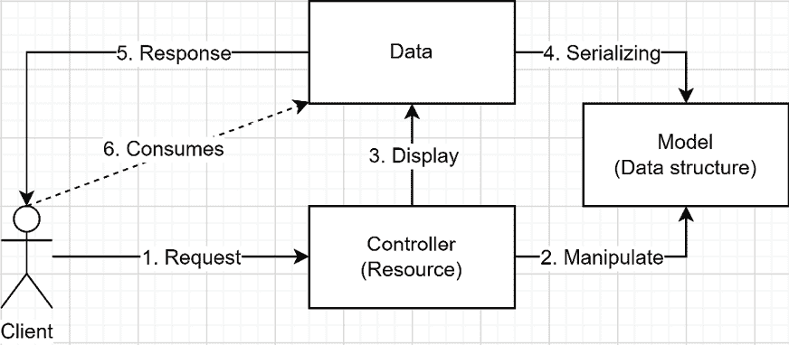
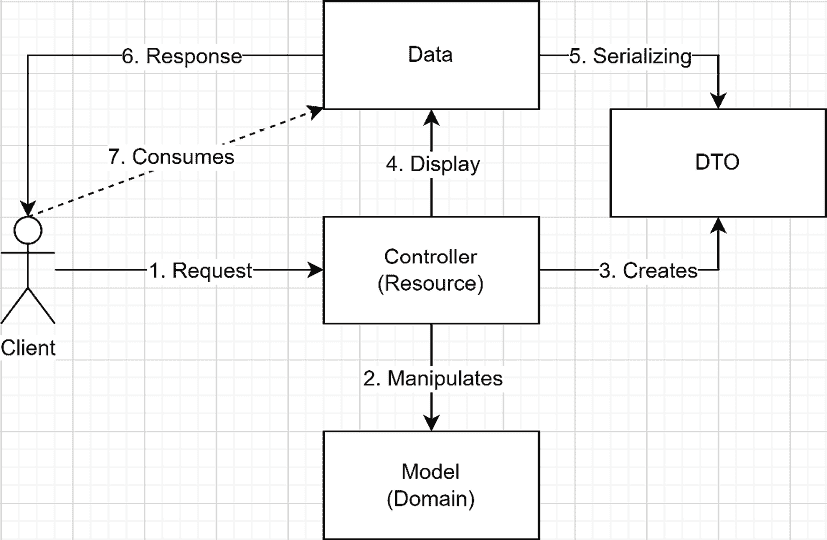

# 第六章：6 模型-视图-控制器

## 在开始之前：加入我们的 Discord 书籍社区

直接向作者本人提供反馈，并在我们的 Discord 服务器上与其他早期读者聊天（在“architecting-aspnet-core-apps-3e”频道下找到，属于早期访问订阅）。

[`packt.link/EarlyAccess`](https://packt.link/EarlyAccess)


本章深入探讨了模型-视图-控制器（MVC）设计模式，这是现代软件架构的基石，它直观地将代码围绕实体组织。MVC 适用于 CRUD 操作或利用 Minimal APIs 中不可用的高级功能。MVC 模式将应用程序划分为三个相互关联的部分：模型、视图和控制器。

+   **模型**，代表我们的数据和业务逻辑。

+   **视图**，即面向用户的组件。

+   **控制器**，作为中介，在模型和视图之间进行交互。

重视关注点分离的 MVC 模式是创建可扩展和健壮 Web 应用的有效模式。在 ASP.NET Core 的背景下，MVC 多年来提供了一种高效构建应用程序的实际方法。虽然我们在第四章，*REST API* 中讨论了 REST API，但本章提供了如何使用 MVC 创建 REST API 的见解。我们还讨论了在此框架中使用数据传输对象（DTOs）。在本章中，我们涵盖了以下主题：

+   模型-视图-控制器设计模式

+   使用 MVC 和 DTOs

我们的最终目标是编写干净、可维护和可扩展的代码；ASP.NET Core MVC 框架是实现这一目标的首选工具。让我们深入探讨吧！

## 模型视图控制器设计模式

现在我们已经探讨了 REST 和 Minimal APIs 的基础知识，是时候探索 MVC 模式来构建 ASP.NET Core REST API 了。模型-视图-控制器（MVC）是常用于 Web 开发的设计模式。它在 ASP.NET 中构建 REST API 的历史很长，并且被许多人广泛使用和赞誉。这个模式将应用程序划分为三个相互关联的组件：模型、视图和控制器。在 MVC 中，视图以前代表用户界面。然而，在我们的案例中，视图是一个数据合约，反映了 REST API 的数据导向特性。

> 以这种方式划分责任与第三章，*架构原则* 中探讨的**单一职责原则（SRP**）相一致。然而，这并不是使用 ASP.NET Core 构建 REST API 的唯一方法，正如我们在第五章，*Minimal APIs* 中所看到的。
> 
> > 新的极简 API 模型与请求-端点-响应（REPR）模式相结合，可以使构建 REST API 更加精简。我们在第十八章，*请求-端点-响应（REPR）* 中介绍了这个模式。我们可以将 REPR 视为 ASP.NET Core Razor Pages 对页面导向型 Web 应用程序的作用，但它是针对 REST API 的。

我们通常围绕实体设计 MVC 应用程序，每个实体都有一个控制器来协调其端点。我们称之为 CRUD 控制器。然而，你可以根据你的需求设计你的控制器。在过去几十年里，REST API 的数量激增到了数以亿计；如今，每个人都在构建 API，这不仅仅是因为人们跟风，而是基于良好的理由。REST API 已经从根本上改变了系统之间的通信方式，提供了各种使它们在现代软件架构中不可或缺的好处。以下是几个有助于其广泛吸引力的关键因素：

+   **数据效率**：REST API 促进不同系统之间高效的数据共享，促进无缝的互联互通。

+   **通用通信**：REST API 利用普遍认可的数据格式，如 JSON 或 XML，确保广泛的兼容性和互操作性。

+   **后端集中化**：REST API 使后端能够作为中央枢纽，支持多个前端平台，包括移动、桌面和 Web 应用程序。

+   **分层后端**：REST API 促进后端的分层，允许创建提供基本功能的基础、低级 API。这些 API 可以被更高层次、以产品为中心的 API 消费，这些 API 提供了专门的功能，从而促进灵活和模块化的后端架构。

+   **安全措施**：REST API 可以作为网关，提供安全措施以保护下游系统，并确保数据访问得到适当的监管——这是分层 API 的一个好例子。

+   **封装**：REST API 允许将特定的逻辑单元封装到可重用、独立的模块中，这通常会导致更干净、更易于维护的代码。

+   **可扩展性**：由于它们是无状态的，REST API 更容易扩展以适应不断增长的负载。

这些优势极大地促进了后端系统在各种用户界面或甚至其他后端服务中的重用。例如，考虑一个典型的需要支持 iOS、Android 和 Web 平台的移动应用程序。通过利用通过 REST API 共享的后端，开发团队能够简化他们的工作，节省大量时间和成本。这种共享后端方法确保了平台之间的一致性，同时减少了维护多个代码库的复杂性。

> 我们在 *第十九章，微服务架构简介* 中探讨了不同的此类模式。

### 目标

在 REST API 的背景下，MVC 模式旨在通过将其分解为三个独立的、相互作用的组件来简化实体的管理过程。开发者不必与难以测试的大而臃肿的代码块作斗争，而是与更小的单元一起工作，这增强了可维护性并促进了高效的测试。这种模块化导致的功能小块更易于维护和测试。

### 设计

MVC 将应用程序分为三个不同的部分，每个部分都有单一的责任：

+   **模型**：模型代表我们正在建模的数据和业务逻辑。

+   **视图**：视图代表用户所看到的内容。在 REST API 的上下文中，这通常是一个序列化的数据结构。

+   **控制器**：控制器代表 MVC 的关键组件。它协调客户端请求和服务器响应之间的流程。控制器的主要角色是充当 HTTP 桥接器。本质上，控制器促进了系统内外部的通信。

> 控制器的代码应保持简洁，不包含复杂逻辑，作为客户端和领域之间的薄层。
> 
> > 我们在 *第十四章*，*分层和清洁架构* 中探讨了不同的观点。

下面是一个表示 REST API MVC 流的图：



图 6.1：使用 MVC 的 REST API 工作流程

在前面的图中，我们直接将模型发送到客户端。在大多数情况下，这并不理想。我们通常更喜欢只发送必要的数据部分，并按照我们的要求进行格式化。我们可以通过利用数据传输对象（DTO）模式来设计健壮的 API 合同来实现这一点。但在我们深入探讨之前，让我们首先了解 ASP.NET Core MVC 的基础知识。

### ASP.NET Core Web API 的解剖结构

在 .NET 中创建 REST API 项目有许多方法，包括 `dotnet new webapi` CLI 命令，该命令也可从 Visual Studio 的 UI 中访问。接下来，我们将探索 MVC 框架的一些组件，从入口点开始。

#### 入口点

第一部分是入口点：`Program.cs` 文件。自 .NET 6 以来，默认情况下不再有 `Startup` 类，编译器自动生成 `Program` 类。正如前一章所探讨的，使用最小托管模型会导致 `Program.cs` 文件简化，并减少样板代码。以下是一个示例：

```cs
using Shared;
using System.Text.Json.Serialization;
var builder = WebApplication.CreateBuilder(args);
builder.Services.AddCustomerRepository();
builder.Services
    .AddControllers()
    .AddJsonOptions(options => options
        .JsonSerializerOptions
        .Converters
        .Add(new JsonStringEnumConverter())
    )
;
builder.Services.AddEndpointsApiExplorer();
builder.Services.AddSwaggerGen();
var app = builder.Build();
if (app.Environment.IsDevelopment())
{
    app.UseSwagger();
    app.UseDarkSwaggerUI();
}
app.MapControllers();
app.InitializeSharedDataStore();
app.Run();
```

在前面的 `Program.cs` 文件中，突出显示的行标识了启用 ASP.NET Core MVC 所需的最小代码。其余部分与 Minimal APIs 代码非常相似。

#### 目录结构

默认目录结构包含一个 `Controllers` 文件夹来托管控制器。在此基础上，我们可以创建一个 `Models` 文件夹来存储模型类，或者使用任何其他结构。

> 虽然控制器通常存放在 `Controllers` 目录中以进行组织，但这种约定更多的是为了开发者的便利，而不是严格的要求。ASP.NET Core 对文件的存储位置不感兴趣，为我们提供了灵活性，可以根据我们的需求来构建项目结构。
> 
> > *第四部分，应用模式* 探讨了许多设计应用程序的方法。

接下来，我们将探讨这个模式的核心部分——控制器。

#### 控制器

创建控制器最简单的方法是创建一个继承自`ControllerBase`的类。然而，尽管`ControllerBase`添加了许多实用方法，但唯一的要求是使用`[ApiController]`属性装饰控制器类。

> 按照惯例，我们用复数形式编写控制器名称，并在其后加上`Controller`后缀。例如，如果控制器与`Employee`实体相关，我们将其命名为`EmployeesController`，默认情况下，这将导致一个易于理解的优秀 URL 模式：

+   获取所有员工：`/employees`

+   获取特定员工：`/employees/{id}`

+   等等。

一旦我们有了控制器类，我们必须添加动作。动作是公共方法，代表客户端可以执行的操作。每个动作代表一个 HTTP 端点。更精确地说，以下定义了一个控制器：

+   控制器公开一个或多个动作。

+   一个动作可以接受零个或多个输入参数。

+   一个动作可以返回零个或一个输出值。

+   动作处理 HTTP 请求。

> 我们应该将具有凝聚力的动作放在同一个控制器下，从而创建一个松散耦合的单元。

例如，以下表示包含单个`Get`动作的`SomeController`类：

```cs
[Route("api/[controller]")]
[ApiController]
public class SomeController : ControllerBase
{
    [HttpGet]
    public IActionResult Get() => Ok();
}
```

前面的`Get`方法（动作）向客户端返回一个空的`200 OK`响应。我们可以通过`/api/some` URI 访问端点。从那里，我们可以添加更多动作。

> `ControllerBase`类为我们提供了与 Minimal APIs `TypedResults`类相同的许多实用方法的访问权限。

接下来，我们看看返回值。

#### 返回值

构建 REST API 旨在向客户端返回数据并执行远程操作。大部分的管道工作都由 ASP.NET Core 代码为我们完成，包括序列化。

> 大部分 ASP.NET Core 管道都是可定制的，这超出了本章的范围。

在返回值之前，让我们看看`ControllerBase`类提供的几个有用的辅助方法：

| 方法 | 描述 |
| --- | --- |
| `StatusCode` | 产生一个带有指定状态码的空响应。我们可以选择性地包含一个用于序列化到响应体的第二个参数。 |
| `Ok` | 产生一个`200 OK`响应，表示操作成功。我们可以选择性地包含一个用于序列化到响应体的第二个参数。 |
| `Created` | 产生一个`201 Created`响应，表示系统创建了实体。我们可以选择性地指定读取实体的位置和实体本身作为参数。《CreatedAtAction》和《CreatedAtRoute》方法为我们提供了组合位置值的选项。 |
| `NoContent` | 产生一个空的`204 No Content`响应。 |
| `NotFound` | 产生一个`404 Not Found`响应，表示未找到资源。 |
| `BadRequest` | 产生一个`400 Bad Request`响应，表示客户端请求存在问题，通常是验证错误。 |
| `Redirect` | 返回一个 `302 Found` 响应，接受 `Location` URL 作为参数。不同的 `Redirect*` 方法会产生 `301 Moved Permanently`、`307 Temporary Redirect` 和 `308 Permanent Redirect` 响应。 |
| `Accepted` | 返回一个 `202 Accepted` 响应，表示异步过程的开始。我们可以选择指定客户端可以查询以了解异步操作状态的位置。我们还可以选择指定要序列化到响应体中的对象。《AcceptedAtAction》和《AcceptedAtRoute》方法为我们提供了组合位置值的选项。 |
| `Conflict` | 返回一个 `409 Conflict` 响应，表示在处理请求时发生了冲突，通常是并发错误。 |

表 6.1：`ControllerBase` 类中产生 `IActionResult` 的方法子集。

> `ControllerBase` 类中的其他方法可以使用 IntelliSense（代码补全）或在官方文档中自行发现。我们涵盖的 *第五章*，*最小化 API* 中的大多数，如果不是全部，也都可以用于控制器。

使用辅助方法的优势在于利用 ASP.NET Core MVC 机制，使我们的工作更轻松。然而，您可以使用像 `HttpContext` 这样的低级 API 手动管理 HTTP 响应，或者创建实现 `IActionResult` 接口的自定义类，将自定义响应类钩入 MVC 管道。现在让我们看看我们可以用来向客户端返回数据的多重方式：

| 返回类型 | 描述 |
| --- | --- |
| `void` | 我们可以返回 `void` 并使用 `HttpContext` 类手动管理 HTTP 响应。这是最底层和最复杂的方法。 |
| `TModel` | 我们可以直接返回模型，ASP.NET Core 将对其进行序列化。这种方法的缺点是我们无法控制状态码，也无法从操作中返回多个不同的结果。 |
| `ActionResult`/`IActionResult` | 我们可以返回这两个抽象之一。具体的结果可以有多种形式，具体取决于操作方法返回的实现。然而，这样做会使我们的 API 对像 SwaggerGen 这样的工具的自动发现性降低。 |
| `ActionResult<TModel>` | 我们可以直接返回 `TModel` 和其他结果，如 `NotFoundResult` 或 `BadRequestResult`。这是最灵活的方法，使 API 对 `ApiExplorer` 来说最具可发现性。 |

表 6.2：返回数据的多重方式。

我们从一个示例开始，其中操作通过利用 `Ok` 方法（高亮代码）返回 `Model` 类的实例：

```cs
using Microsoft.AspNetCore.Mvc;
namespace MVC.API.Controllers;
[Route("api/[controller]")]
[ApiController]
public class ValuesController : ControllerBase
{
    [HttpGet("IActionResult")]
    public IActionResult InterfaceAction()
        => Ok(new Model(nameof(InterfaceAction)));
    [HttpGet("ActionResult")]
    public ActionResult ClassAction()
        => Ok(new Model(nameof(ClassAction)));
    // ...
    public record class Model(string Name);
}
```

前述代码的问题在于 API 的可发现性。《ApiExplorer》无法知道端点返回的内容。《ApiExplorer》将操作描述为返回 `200 OK`，但不知道 `Model` 类。为了克服这一限制，我们可以使用 `ProducesResponseType` 属性装饰我们的操作，有效地绕过限制，如下所示：

```cs
[ProducesResponseType(typeof(Model), StatusCodes.Status200OK)]
public IActionResult InterfaceAction() { ... }
```

在前面的代码中，我们将返回类型指定为第一个参数，将状态码指定为第二个参数。使用 `StatusCodes` 类的常量是引用标准状态码的便捷方式。我们可以用多个 `ProducesResponseType` 属性装饰每个操作，以定义不同的状态，例如 `404` 和 `400`。

> 在 ASP.NET Core MVC 中，我们还可以定义应用于我们控制器的约定，允许我们定义这些约定一次，并在整个应用程序中重用它们。我在 *进一步阅读* 部分留下了一个链接。

接下来，我们将探讨如何直接返回 `Model` 实例。`ApiExplorer` 可以通过这种方式发现方法的返回值，因此我们不需要使用 `ProducesResponseType` 属性：

```cs
[HttpGet("DirectModel")]
public Model DirectModel()
    => new Model(nameof(DirectModel)); 
```

接下来，多亏了 **类转换运算符**（更多信息请参阅 *附录 A*），我们也可以用 `ActionResult<T>` 做同样的事情，如下所示：

```cs
[HttpGet("ActionResultT")]
public ActionResult<Model> ActionResultT()
    => new Model(nameof(ActionResultT));
```

使用 `ActionResult<T>` 的主要好处是返回其他类型的结果。以下是一个示例，展示了方法返回 `Ok` 或 `NotFound` 的情况：

```cs
[HttpGet("MultipleResults")]
public ActionResult<Model> MultipleResults()
{
    var condition = Random.Shared
        .GetItems(new[] { true, false }, 1)
        .First();
    return condition
        ? Ok(new Model(nameof(MultipleResults)))
        : NotFound();
}
```

然而，`ApiExplorer` 并不知道 `404 Not Found`，因此我们必须使用 `ProducesResponseType` 属性来记录它。

> 当方法体是异步的时，我们可以从操作方法返回 `Task<T>` 或 `ValueTask<T>`。这样做可以让您从控制器中编写异步/等待代码。
> 
> > 我强烈建议尽可能返回 `Task<T>` 或 `ValueTask<T>`，因为这允许您的 REST API 使用相同的资源轻松处理更多请求。如今，库中非 Task 基础的方法很少见，所以您可能几乎没有选择。

我们学习了多种从操作返回值的方法。在功能支持方面，`ActionResult<T>` 类是最灵活的。另一方面，`IActionResult` 是最抽象的。接下来，我们将探讨如何将请求路由到这些操作方法。

#### 属性路由

属性路由将 HTTP 请求映射到控制器操作。这些属性装饰控制器和操作以创建完整的路由。我们已经使用了一些这些属性。尽管如此，让我们来看看这些属性：

```cs
namespace MVC.API.Controllers.Empty;
[Route("empty/[controller]")]
[ApiController]
public class CustomersController : ControllerBase
{
    [HttpGet]
    public Task<IEnumerable<Customer>> GetAllAsync(
        ICustomerRepository customerRepository)
        => throw new NotImplementedException();
    [HttpGet("{id}")]
    public Task<ActionResult<Customer>> GetOneAsync(
        int id, ICustomerRepository customerRepository)
        => throw new NotImplementedException();
    [HttpPost]
    public Task<ActionResult> PostAsync(
        [FromBody] Customer value, ICustomerRepository customerRepository)
        => throw new NotImplementedException();
    [HttpPut("{id}")]
    public Task<ActionResult<Customer>> PutAsync(
        int id, [FromBody] Customer value, 
        ICustomerRepository customerRepository)
        => throw new NotImplementedException();
    [HttpDelete("{id}")]
    public Task<ActionResult<Customer>> DeleteAsync(
        int id, ICustomerRepository customerRepository)
        => throw new NotImplementedException();
}
```

`Route` 属性和 `Http[Method]` 属性定义了用户应该查询什么以到达特定的资源。`Route` 属性允许我们定义一个路由模式，该模式适用于装饰的控制器下的所有 HTTP 方法。`Http[Method]` 属性确定用于到达该操作方法的 HTTP 方法。它们还提供了设置可选和可添加的路由模式的可能性，以处理更复杂的路由，包括指定路由参数。这些属性在构建简洁清晰的 URL 同时保持路由系统靠近控制器方面很有益。所有路由都必须是唯一的。根据代码，`[Route("empty/[controller]")]` 表示此控制器的操作可以通过 `empty/customers`（MVC 忽略 `Controller` 后缀）访问。然后，其他属性告诉 ASP.NET 将特定请求映射到特定方法：

| 路由属性 | HTTP 方法 | URL |
| --- | --- | --- |
| `HttpGet` | `GET` | `empty/customers` |
| `HttpGet("{id}")` | `GET` | `empty/customers/{id}` |
| `HttpPost` | `POST` | `empty/customers` |
| `HttpPut("{id}")` | `PUT` | `empty/customers/{id}` |
| `HttpDelete("{id}")` | `DELETE` | `empty/customers/{id}` |

表 6.3：示例控制器中的路由属性及其最终 URL

从前面的表中我们可以看出，只要 URL 是唯一的，我们甚至可以使用相同的属性为多个操作。在这种情况下，`id` 参数是 `GET` 区分符。接下来，我们可以使用 `FromBody` 属性来告诉模型绑定器使用 HTTP 请求体来获取该参数的值。有许多这样的属性；以下是一个列表：

| 属性 | 描述 |
| --- | --- |
| `FromBody` | 将请求的 JSON 主体绑定到参数的类型。 |
| `FromForm` | 绑定与参数名称匹配的表单值。 |
| `FromHeader` | 绑定与参数名称匹配的 HTTP 标头值。 |
| `FromQuery` | 绑定与参数名称匹配的查询字符串值。 |
| `FromRoute` | 绑定与参数名称匹配的路由值。 |
| `FromServices` | 从 ASP.NET Core 依赖注入容器中注入服务。 |

表 6.4：MVC 绑定源

> ASP.NET Core MVC 进行了许多隐式绑定，因此您不必总是需要用属性装饰所有参数。例如，.NET 在代码示例中注入了我们需要的服务，我们从未使用过 `FromServices` 属性。同样，`FromRoute` 属性也是如此。

现在，如果我们回顾一下 `CustomersController`，路由映射看起来如下（我排除了与路由无关的代码以提高可读性）：

| **URL** | **Action/Method** |
| --- | --- |
| `GET empty/customers` | `GetAllAsync()` |
| `GET empty/customers/{id}` | `GetOneAsync(int id)` |
| `POST empty/customers` | `PostAsync([FromBody] Customer value)` |
| `PUT empty/customers/{id}` | `PutAsync(int id, [FromBody] Customer value)` |
| `DELETE empty/customers/{id}` | `DeleteAsync(int id)` |

表 6.5：URL 与其相应操作方法之间的映射

在设计 REST API 时，通向我们的端点的 URL 应该是清晰简洁的，这样消费者就可以轻松发现和学习。通过按责任（关注点）分层组织我们的资源并创建一个统一的 URL 空间，有助于实现这一目标。消费者（即其他开发者）应该能够轻松理解端点背后的逻辑。想想看，如果你是 REST API 的消费者，你会如何看待你的端点。我甚至会将这个建议扩展到任何 API；始终考虑你的代码的消费者，以创建最佳可能的 API。

### 结论

本节探讨了 MVC 模式，如何创建控制器和操作方法，以及如何将请求路由到这些操作。我们本可以继续讨论 MVC，但那样会偏离主题。我们在这里涵盖的功能子集应该足以填补你可能存在的理论空白，并允许你理解利用 ASP.NET Core MVC 的代码示例。使用 MVC 模式有助于我们以下列方式遵循 SOLID 原则：

+   **S**：MVC 模式将数据结构的渲染分为三个不同的角色。框架处理大部分序列化部分（视图），只留下两个部分需要我们管理：模型和控制器。

+   **O**：N/A

+   **L**：N/A

+   **I**：每个控制器处理功能的一个子集，并代表对系统的一个较小接口。MVC 使得系统比所有路由只有一个入口点（如单个控制器）更容易管理。

+   **D**：N/A

接下来，我们探讨**数据传输对象**（**DTO**）模式，以隔离 API 的模型和领域。

## 使用 MVC 与 DTOs

本节探讨了利用 MVC 框架中的**数据传输对象**（**DTO**）模式。

> 本节与我们在*第五章*，*最小 API*中探讨的内容相同，但是在 MVC 的背景下。此外，这两个代码项目是同一个 Visual Studio 解决方案的一部分，以便于比较两种实现。

### 目标

作为提醒，DTOs（数据传输对象）旨在通过将 API 合同与应用程序的内部工作解耦来**控制端点的输入和输出**。DTOs 使我们能够定义我们的 API，而不必考虑底层的数据结构，从而让我们能够按照自己的意愿构建 REST API。

> 我们在*第四章*，*REST API*中更深入地讨论了 REST API 和 DTOs。

其他可能的目标是通过限制 API 传输的信息量来节省带宽，简化数据结构，或添加跨多个实体的 API 功能。

### 设计

让我们从分析一个扩展 MVC 以与 DTOs 一起工作的图表开始：



图 6.2：带有 DTO 的 MVC 工作流程

DTO 允许将领域（数据）与视图解耦，并使我们能够独立于领域管理 REST API 的输入和输出。控制器仍然操作领域模型，但返回一个序列化的 DTO。

### 项目 – MVC API

*此代码示例与上一章相同，但使用 MVC 框架而不是 Minimal APIs*。**上下文**：我们必须构建一个用于管理客户和合同的应用程序。我们必须跟踪每个合同的状态，并在业务需要联系客户时有一个主要联系人。最后，我们必须在仪表板上显示每个客户的合同数量和已打开合同数量。作为提醒，模型如下：

```cs
namespace Shared.Models;
public record class Customer(
    int Id,
    string Name,
    List<Contract> Contracts
);
public record class Contract(
    int Id,
    string Name,
    string Description,
    WorkStatus Status,
    ContactInformation PrimaryContact
);
public record class WorkStatus(int TotalWork, int WorkDone)
{
    public WorkState State =>
        WorkDone == 0 ? WorkState.New :
        WorkDone == TotalWork ? WorkState.Completed :
        WorkState.InProgress;
}
public record class ContactInformation(
    string FirstName,
    string LastName,
    string Email
);
public enum WorkState
{
    New,
    InProgress,
    Completed
}
```

前面的代码很简单。唯一的逻辑是 `WorkStatus.State` 属性，当该合同上的工作尚未开始时返回 `WorkState.New`，当所有工作都已完成时返回 `WorkState.Completed`，否则返回 `WorkState.InProgress`。控制器利用 `ICustomerRepository` 接口来模拟数据库操作。实现并不重要。它使用 `List<Customer>` 作为数据库。以下是允许查询和更新数据的接口：

```cs
using Shared.Models;
namespace Shared.Data;
public interface ICustomerRepository
{
    Task<IEnumerable<Customer>> AllAsync(
        CancellationToken cancellationToken);
    Task<Customer> CreateAsync(
        Customer customer, 
        CancellationToken cancellationToken);
    Task<Customer?> DeleteAsync(
        int customerId, 
        CancellationToken cancellationToken);
    Task<Customer?> FindAsync(
        int customerId, 
        CancellationToken cancellationToken);
    Task<Customer?> UpdateAsync(
        Customer customer, 
        CancellationToken cancellationToken);
}
```

现在我们已经了解了底层基础，我们来探讨一个不利用 DTO 的 CRUD 控制器。

#### 原始 CRUD 控制器

如果我们创建一个 CRUD 控制器来直接管理客户，可能会出现许多问题（参见 `RawCustomersController.cs`）。首先，客户端的一个小错误可能会删除几个数据点。例如，如果客户端在 `PUT` 操作中忘记发送合同，那么就会删除与该客户关联的所有合同。以下是控制器代码：

```cs
// PUT raw/customers/1
[HttpPut("{id}")]
public async Task<ActionResult<Customer>> PutAsync(
    int id,
    [FromBody] Customer value,
    ICustomerRepository customerRepository)
{
    var customer = await customerRepository.UpdateAsync(
        value, 
        HttpContext.RequestAborted);
    if (customer == null)
    {
        return NotFound();
    }
    return customer;
}
```

突出显示的代码代表客户更新。因此，为了错误地删除所有合同，客户端可以发送以下 HTTP 请求（来自 `MVC.API.http` 文件）：

```cs
PUT {{MVC.API.BaseAddress}}/customers/1
Content-Type: application/json
{
  "id": 1,
  "name": "Some new name",
  "contracts": []
}
```

该请求将导致以下响应实体：

```cs
{
  "id": 1,
  "name": "Some new name",
  "contracts": []
}
```

然而，之前那个客户已经有了合同（在我们开始应用程序时创建的）。以下是原始数据：

```cs
{
  "id": 1,
  "name": "Jonny Boy Inc.",
  "contracts": [
    {
      "id": 1,
      "name": "First contract",
      "description": "This is the first contract.",
      "status": {
        "totalWork": 100,
        "workDone": 100,
        "state": "Completed"
      },
      "primaryContact": {
        "firstName": "John",
        "lastName": "Doe",
        "email": "john.doe@jonnyboy.com"
      }
    },
    {
      "id": 2,
      "name": "Some other contract",
      "description": "This is another contract.",
      "status": {
        "totalWork": 100,
        "workDone": 25,
        "state": "InProgress"
      },
      "primaryContact": {
        "firstName": "Jane",
        "lastName": "Doe",
        "email": "jane.doe@jonnyboy.com"
      }
    }
  ]
}
```

如我们所见，通过直接公开我们的实体，我们给了 API 的消费者很多权力。这种设计的一个问题是仪表板。用户界面将不得不计算合同的统计数据。此外，如果我们实现分页合同，用户界面可能会变得越来越复杂，甚至可能过度查询数据库，从而阻碍我们的性能。

> 我实现了整个 API，它可在 GitHub 上找到，但没有 UI。

接下来，我们将探讨如何使用 DTO 修复这两个用例。

#### DTO 控制器

为了解决我们的问题，我们使用 DTO 重新实现了控制器。为了更容易地跟踪，以下是所有 DTO 的参考：

```cs
namespace Shared.DTO;
public record class ContractDetails(
    int Id,
    string Name,
    string Description,
    int StatusTotalWork,
    int StatusWorkDone,
    string StatusWorkState,
    string PrimaryContactFirstName,
    string PrimaryContactLastName,
    string PrimaryContactEmail
);
public record class CustomerDetails(
    int Id,
    string Name,
    IEnumerable<ContractDetails> Contracts
);
public record class CustomerSummary(
    int Id,
    string Name,
    int TotalNumberOfContracts,
    int NumberOfOpenContracts
);
public record class CreateCustomer(string Name);
public record class UpdateCustomer(string Name);
```

首先，让我们修复我们的更新问题，从重新实现利用 DTO 的更新端点开始（参见 `DTOCustomersController.cs` 文件）：

```cs
// PUT dto/customers/1
[HttpPut("{customerId}")]
public async Task<ActionResult<CustomerDetails>> PutAsync(
        int customerId,
        [FromBody] UpdateCustomer input,
        ICustomerRepository customerRepository)
{
    // Get the customer
    var customer = await customerRepository.FindAsync(
        customerId,
        HttpContext.RequestAborted
    );
    if (customer == null)
    {
        return NotFound();
    }
    // Update the customer's name using the UpdateCustomer DTO
    var updatedCustomer = await customerRepository.UpdateAsync(
        customer with { Name = input.Name },
        HttpContext.RequestAborted
    );
    if (updatedCustomer == null)
    {
        return Conflict();
    }
    // Map the updated customer to a CustomerDetails DTO
    var dto = MapCustomerToCustomerDetails(updatedCustomer);
    // Return the DTO
    return dto;
}
```

在前面的代码中，主要的不同点在于（突出显示）：

+   现在请求体绑定到`UpdateCustomer`类，而不是`Customer`本身。

+   动作方法返回`CustomerDetails`类的实例，而不是`Customer`本身。

然而，我们在控制器操作中看到的代码比以前更多。这是因为控制器现在处理数据变化，而不是客户端。现在的操作包括：

1.  从数据库加载数据。

1.  确保实体存在。

1.  使用输入 DTO 更新数据，限制客户端只能访问属性子集。

1.  继续更新。

1.  确保实体仍然存在（处理冲突）。

1.  将客户复制到输出 DTO 并返回。

通过这样做，我们现在控制客户端在通过输入 DTO（`UpdateCustomer`）发送`PUT`请求时可以做什么。此外，我们将计算统计数据的逻辑封装在服务器上。我们将计算隐藏在输出 DTO（`CustomerDetails`）后面，这降低了用户界面的复杂性，并允许我们在不影响任何客户端的情况下提高性能（松散耦合）。此外，我们现在使用`customerId`参数。如果我们发送与以前相同的 HTTP 请求，发送比我们接受更多的数据，只有客户的名字会改变。更重要的是，我们得到了显示客户统计所需的所有数据。以下是一个响应示例：

```cs
{
  "id": 1,
  "name": "Some new name",
  "contracts": [
    {
      "id": 1,
      "name": "First contract",
      "description": "This is the first contract.",
      "statusTotalWork": 100,
      "statusWorkDone": 100,
      "statusWorkState": "Completed",
      "primaryContactFirstName": "John",
      "primaryContactLastName": "Doe",
      "primaryContactEmail": "john.doe@jonnyboy.com"
    },
    {
      "id": 2,
      "name": "Some other contract",
      "description": "This is another contract.",
      "statusTotalWork": 100,
      "statusWorkDone": 25,
      "statusWorkState": "InProgress",
      "primaryContactFirstName": "Jane",
      "primaryContactLastName": "Doe",
      "primaryContactEmail": "jane.doe@jonnyboy.com"
    }
  ]
}
```

如前所述的响应所示，只有客户的名字改变了，但我们现在收到了`statusWorkDone`和`statusTotalWork`字段。最后，我们简化了数据结构。

> DTOs 是简化数据结构的绝佳资源，但您不必这样做。您必须始终为特定用例设计系统，包括 DTO 和数据合约。

至于仪表板，“获取所有客户”端点通过执行类似操作来实现这一点。它输出`CustomerSummary`对象集合，而不是客户本身。在这种情况下，控制器执行计算并将实体的相关属性复制到 DTO 中。以下是代码：

```cs
// GET: dto/customers
[HttpGet]
public async Task<IEnumerable<CustomerSummary>> GetAllAsync(
    ICustomerRepository customerRepository)
{
    // Get all customers
    var customers = await customerRepository.AllAsync(
        HttpContext.RequestAborted
    );
    // Map customers to CustomerSummary DTOs
    var customersSummary = customers
        .Select(customer => new CustomerSummary(
            Id: customer.Id,
            Name: customer.Name,
            TotalNumberOfContracts: customer.Contracts.Count,
            NumberOfOpenContracts: customer.Contracts.Count(x => x.Status.State != WorkState.Completed)
        ))
    ;
    // Return the DTOs
    return customersSummary;
}
```

在前面的代码中，动作方法：

1.  读取实体

1.  创建 DTOs 并计算未完成合同的数量。

1.  返回 DTOs。

就这样，我们现在在服务器上封装了计算。

> 您应根据实际数据源优化此类代码。在这种情况下，`static` `List<T>`具有低延迟。然而，查询整个数据库以获取计数可能会成为瓶颈。

调用端点会产生以下结果：

```cs
[
  {
    "id": 1,
    "name": "Some new name",
    "totalNumberOfContracts": 2,
    "numberOfOpenContracts": 1
  },
  {
    "id": 2,
    "name": "Some mega-corporation",
    "totalNumberOfContracts": 1,
    "numberOfOpenContracts": 1
  }
]
```

现在构建我们的仪表板变得超级简单。我们可以查询该端点一次，并在 UI 中显示数据。UI 将计算任务卸载到后端。

> 用户界面通常比 API 更复杂，因为它们是状态化的。因此，将尽可能多的复杂性卸载到后端有助于。您可以使用后端-for-前端（BFF）来帮助完成这项任务。我们在第十九章“微服务架构简介”中探讨了分层 API 的方法，包括 BFF 模式。

最后，您可以使用`MVC.API.DTO.http`文件中的 HTTP 请求来玩转 API。我使用类似的技术实现了所有端点。如果您的控制器逻辑变得过于复杂，将它们封装到其他类中是一种良好的做法。我们在*第四部分*：*应用模式*中探讨了组织应用程序代码的许多技术。

### 结论

数据传输对象允许我们设计一个具有特定数据契约（输入和输出）的 API 端点，而不是暴露领域或数据模型。这种表示层和领域之间的分离是导致拥有多个独立组件而不是更大、更脆弱的一个的关键元素。使用 DTO 来控制输入和输出，使我们能够更好地控制客户端可以做什么或接收什么。使用数据传输对象模式有助于我们以下列方式遵循 SOLID 原则：

+   **S**: DTO 在领域模型和 API 契约之间添加了清晰的边界。此外，拥有输入和输出 DTO 有助于进一步分离责任。

+   **O**: N/A

+   **L**: N/A

+   **I**: 一个 DTO 是一个小型、专门定制的数据契约（抽象），在 API 契约中有明确的目的。

+   **D**: 由于那些较小的接口（ISP），DTO 允许在不影响客户端的情况下更改端点的实现细节，因为它们只依赖于 API 契约（一个抽象）。

您已经学习了 DTO 的附加价值，它们在 API 契约中的作用，以及 ASP.NET Core MVC 框架。

## 摘要

本章探讨了模型-视图-控制器（MVC）设计模式，这是 ASP.NET 生态系统中的一个成熟框架，它比其较新的最小 API 对等体提供了更多高级功能。最小 API 并不是与 MVC 竞争；我们可以将它们一起使用。MVC 模式强调关注点的分离，使其成为创建可维护、可扩展和健壮的 Web 应用的成熟模式。我们将 MVC 模式分解为其三个核心组件：模型、视图和控制器。模型表示数据和业务逻辑，视图是面向用户的组件（序列化的数据结构），控制器作为中介，在模型和视图之间进行调解。我们还讨论了使用数据传输对象（DTO）以我们需要的格式打包数据，提供了许多好处，包括灵活性、效率、封装和性能提升。DTO 是 API 契约的关键部分。现在我们已经探讨了原则和方法，是时候继续我们的学习，并解决更多设计模式和功能了。接下来的两章将探讨我们的第一个四人帮（GoF）设计模式，并深入探讨 ASP.NET Core 依赖注入（DI）。所有这些都将帮助我们继续我们开始的道路：学习设计更好软件的工具。

## 问题

让我们看看几个练习问题：

1.  MVC 设计模式的三个组件是什么？

1.  在 MVC 模式中，控制器的作用是什么？

1.  数据传输对象 (DTO) 是什么，为什么它们很重要？

1.  MVC 模式如何有助于提高应用程序的可维护性？

1.  MVC 中的属性路由是如何工作的？

## 进一步阅读

以下是一些链接，可以帮助我们巩固本章所学的内容：

+   使用 Web API 规范：[`adpg.link/ioKV`](https://adpg.link/ioKV)

+   开始使用 Swashbuckle 和 ASP.NET Core：[`adpg.link/ETja`](https://adpg.link/ETja)

## 答案

1.  MVC 设计模式的三个组件是模型、视图和控制器。

1.  在 MVC 模式中，控制器充当中间件，在模型和视图之间进行交互调解。

1.  我们使用数据传输对象 (DTO) 将数据打包成一种格式，它提供了许多好处，包括高效的数据共享、封装和改进的可维护性。

1.  MVC 模式通过分离关注点来提高应用程序的可维护性。每个组件（模型、视图、控制器）都有特定的角色和责任，这使得代码更容易管理、测试和扩展。这种分离使得对一个组件的更改对其他组件的影响最小化。

1.  在 MVC 中，属性路由将 HTTP 请求映射到控制器操作。这些属性装饰控制器和操作以创建完整的路由。
