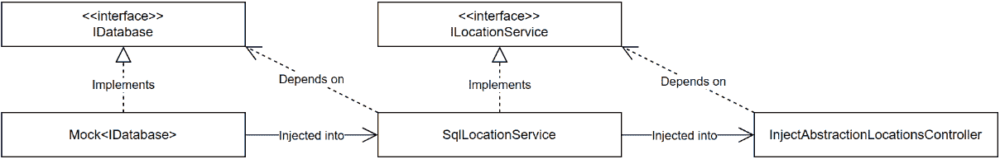
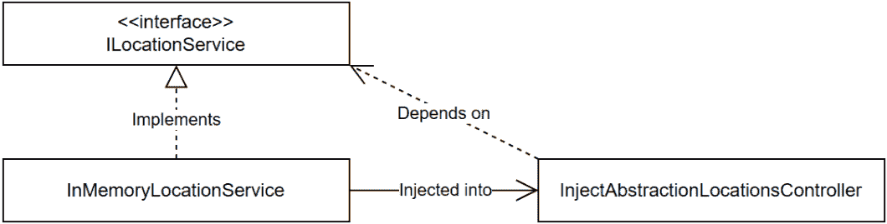
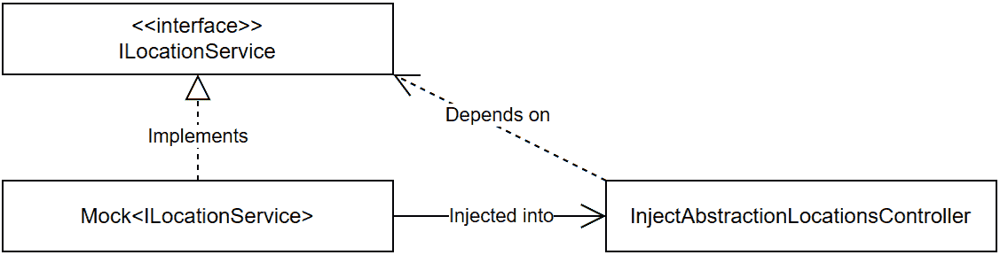
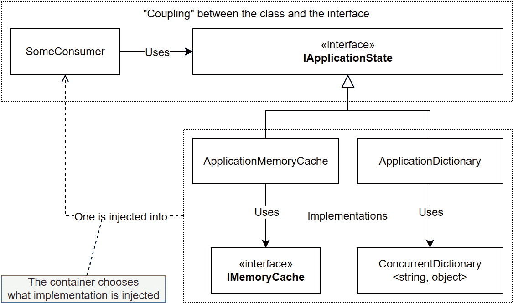

# 第八章：8 依赖注入

## 在开始之前：加入我们的 Discord 书籍社区

直接向作者本人提供反馈，并在我们的 Discord 服务器上与其他早期读者聊天（在“architecting-aspnet-core-apps-3e”频道下找到，属于早期访问订阅）。

[`packt.link/EarlyAccess`](https://packt.link/EarlyAccess)


本章探讨了 ASP.NET Core **依赖注入（DI**）系统，如何高效地利用它，以及其局限性和能力。我们学习使用 DI 来组合对象，并深入研究控制反转（IoC）原则。在我们遍历内置 DI 容器时，我们探索其特性和潜在用途。除了实际示例之外，我们还为依赖注入奠定概念基础，以了解其目的、其好处以及它解决的问题，并为本书的其余部分奠定基础，因为我们严重依赖 DI。然后，我们回到我们遇到的前三个四人帮（GoF）设计模式，但这次是通过依赖注入的视角。通过使用 DI 重构这些模式，我们获得了对这个强大设计工具如何影响我们软件的结构和灵活性的更全面的理解。依赖注入是您通往掌握现代应用程序设计的基石，它在开发高效、可适应、可测试和可维护的软件中发挥着变革性的作用。在本章中，我们涵盖了以下主题：

+   什么是依赖注入？

+   重新审视策略模式

+   理解守卫子句

+   重新审视单例模式

+   理解服务定位器模式

+   重新审视工厂模式

## 什么是依赖注入？

依赖注入（DI）是应用控制反转（IoC）原则的一种方式。IoC 是依赖倒置原则（SOLID 中的 *D*）的更广泛版本。依赖注入背后的想法是将依赖的创建从对象本身转移到**组合根**。这样，我们可以将依赖的管理委托给一个**IoC 容器**，它来完成繁重的工作。

> IoC 容器和 DI 容器是同一件事——只是人们用的不同词汇。我在现实生活中两者都交替使用，但在书中我坚持使用 IoC 容器，因为它似乎比 DI 容器更准确。
> 
> > IoC 是一个概念（原则），而 DI 是一种反转控制流（应用 IoC）的方式。例如，通过使用容器在运行时注入依赖（执行 DI）来应用 IoC 原则（反转流）。您可以根据需要使用任何或两者。

接下来，我们定义组合根。

### 组合根

DI 背后的一个关键概念是组合根。组合根是我们告诉容器我们的依赖关系及其预期生命周期的位置：我们构建依赖关系树的地方。组合根应尽可能接近程序的起点，因此从 ASP.NET Core 6 开始，组合根位于 `Program.cs` 文件中。在之前的版本中，它位于 `Program` 或 `Startup` 类中。接下来，我们将探讨如何利用 DI 创建高度适应性的系统。

### 追求适应性

要通过 DI 实现高度的灵活性，我们可以应用以下公式，由 SOLID 原则驱动：对象 `A` 不应了解它所使用的对象 `B`。相反，`A` 应该使用由 `B` 实现的接口 `I`，`B` 应在运行时解决并注入。让我们分解一下：

+   对象 `A` 应依赖接口 `I` 而不是具体的类型 `B`。

+   实例 `B` 注入到 `A` 中，应在运行时由 IoC 容器解决。

+   `A` 不应意识到 `B` 的存在。

+   `A` 不应控制 `B` 的生命周期。

> 我们也可以直接注入对象，而不通过接口传递。这完全取决于我们注入的内容、上下文以及我们的需求。本书中我们探讨了多个用例，以帮助您理解 DI。

接下来，我们将这个方程式转化为一个类比，以帮助解释使用容器的理由。

### 理解 IoC 容器的使用

为了更好地理解 IoC 容器的使用并围绕之前的适应性概念创建一个图像，让我们从一个乐高®类比开始，其中 IoC 是绘制建造乐高®城堡计划的等价物：

1.  我们绘制计划

1.  我们收集模块

1.  我们按下假设的机器人建造者的启动按钮

1.  机器人按照我们的计划组装模块

1.  城堡已建成

通过遵循这个逻辑，我们可以创建一个新的 4x4 模块，其侧面画有独角兽（具体类型），更新计划（组合根），然后按下重启按钮，将新模块插入其中，替换旧的模块，而不影响城堡的结构完整性（程序）。只要我们尊重 4x4 模块合同（接口），一切都可以更新，而不会影响城堡的其他部分，从而实现极大的灵活性。遵循这个想法，如果我们需要逐个管理每个乐高®模块，这会迅速变得极其复杂！因此，在项目中手动管理所有依赖关系将非常繁琐且容易出错，即使在最小的程序中也是如此。这种情况就是 IoC 容器（假设的机器人建造者）发挥作用的时候。

### IoC 容器的角色

IoC 容器为我们管理对象。我们对其进行配置，然后，当我们请求一个服务时，容器解析并注入它。除此之外，容器还管理依赖的生命周期，让我们的类只做一件事，即它们被设计来做的任务。不再需要考虑它们的依赖！总之，IoC 容器是一个 DI 框架，为我们自动连接。我们可以这样理解依赖注入：

1.  依赖的*消费者*声明其对一个或多个依赖（契约）的需求。

1.  IoC 容器在创建*消费者*时注入该依赖（实现），在运行时满足其需求。

接下来，我们将探讨一个依赖注入可以帮助我们避免的代码异味。

### 代码异味 – 控制狂

控制狂是一种代码异味，甚至是一种反模式，它禁止我们使用`new`关键字。是的，使用`new`关键字就是代码异味！以下代码是错误的，无法利用 DI：

```cs
namespace CompositionRoot.ControlFreak;
public class Consumer
{
    public void Do()
    {
        var dependency = new Dependency();
        dependency.Operation();
    }
}
public class Dependency
{
    public void Operation()
        => throw new NotImplementedException();
}
```

高亮行显示了反模式的作用。为了使 Consumer 类能够使用依赖注入，我们可以像以下这样更新它：

```cs
public class Consumer
{
    private readonly Dependency _dependency;
    public DIEnabledConsumer(Dependency dependency)
    {
        _dependency = dependency;
    }
    public void Do()
    {
        _dependency.Operation();
    }
}
```

上述代码去掉了`new`关键字，现在可以修改。高亮行表示我们在本章随后探讨的构造函数注入模式。不过，现在还不要禁止使用`new`关键字。相反，每次你使用它时，都要问问自己，你使用`new`关键字实例化的对象是否是容器可以管理的依赖，并可以注入。为了帮助做到这一点，我从 Mark Seemann 的《.NET 依赖注入》一书中借用了两个术语；*控制狂*这个名字也来自那本书。他描述了以下两种依赖类别：

+   稳定依赖

+   易变依赖

接下来，我将谈谈如何定义它们。

#### 稳定依赖

**稳定依赖**在发布新版本时不应破坏我们的应用程序。它们应使用确定性算法（输入`X`应始终产生输出`Y`），并且你不应该期望将来用其他东西来改变它们。

> 大多数没有行为的数据库结构，如数据传输对象（DTOs），都属于这一类。你也可以将.NET BCL 视为稳定的依赖。

当它们属于这一类别时，我们仍然可以使用`new`关键字来实例化对象，因为依赖是稳定的，并且不太可能因为变化而破坏任何东西。接下来，我们来看看它们的对立面。

#### 易变依赖

**易变依赖**可能在运行时发生变化，例如具有上下文行为的可扩展元素。它们也可能因为各种原因（如新功能开发）而可能发生变化。

> 我们创建的大多数类，如数据访问和业务逻辑代码，都是易变依赖。

打破类之间紧密耦合的主要方式是依赖接口和依赖注入，并且不再使用`new`关键字来实例化那些易变的依赖项。易变的依赖项是依赖注入成为构建灵活、可测试和可维护的软件的关键。

#### 结论

为了总结这个插曲：别再当控制狂了；那些日子已经过去了！

> 如果有疑问，请注入依赖项而不是使用`new`关键字。

接下来，我们将探讨我们可以分配给我们的易变依赖项的可用的生命周期。

### 对象生命周期

既然我们明白我们不应再使用`new`关键字，我们需要一种创建这些类的方法。从现在起，IoC 容器将扮演这个角色，并为我们管理对象实例化和它们的生命周期。

#### 对象的生命周期是什么？

当我们手动创建实例时，使用`new`关键字，我们会对该对象产生依赖；我们知道何时创建它以及何时结束其生命周期。这就是对象的生命周期。当然，使用`new`关键字不会给我们留下从外部控制这些对象、增强它们、拦截它们或用另一个实现替换它们的机会——如前文所述的*代码异味 - 控制狂*部分。

#### .NET 对象生命周期

使用依赖注入，我们需要忘记控制对象，开始考虑使用依赖项，或者更明确地说，依赖它们的接口。在 ASP.NET Core 中，有三种可能的生命周期可供选择：

| **生命周期** | **描述** |
| --- | --- |
| 瞬态 | 容器每次都会创建一个新的实例。 |
| 作用域 | 容器为每个 HTTP 请求创建一个实例并重用它。在某些罕见情况下，我们还可以创建自定义作用域。 |
| 单例 | 容器为该依赖项创建单个实例，并始终重用该唯一对象。 |

表 8.1：对象生命周期描述

我们现在可以使用这三种作用域之一来管理我们的易变依赖项。以下是一些帮助你选择的问题：

+   是否需要我为我的依赖项创建单个实例？是的？使用**单例**生命周期。

+   是否需要我在整个 HTTP 请求中共享我的依赖项的单个实例？是的？使用**作用域**生命周期。

+   每次是否需要我为我的依赖项创建一个新的实例？是的？使用**瞬态**生命周期。

> 对象生命周期的通用方法是设计组件为**单例**。当不可能时，我们选择**作用域**。当**作用域**也不可能时，选择**瞬态**。这样，我们最大化实例重用，降低创建对象的开销，降低保持这些对象在内存中的内存成本，并降低移除未使用实例所需的垃圾回收量。
> 
> > 例如，我们可以不加思考地选择**单例**用于无状态对象，这些对象最容易维护且不太可能出错。
> > 
> > 对于多个消费者使用相同实例的状态对象，如果生命周期是 *singleton* 或 *scoped*，我们必须确保对象是线程安全的，因为多个消费者可能会同时尝试访问它。
> > 
> > 在选择生命周期时，需要考虑的一个基本方面是状态对象的消费者。例如，如果我们加载与当前用户相关的数据，我们必须确保数据不会泄露到其他用户。为此，我们可以将那个对象的生命周期定义为 *scoped*，这限制于单个 HTTP 请求。如果我们不希望在多个消费者之间重用该状态，我们可以选择 *transient* 生命周期以确保每个消费者都得到自己的实例。

这如何转化为代码？.NET 提供了多个扩展方法来帮助我们配置对象的生命周期，如 `AddTransient`、`AddScoped` 和 `AddSingleton`，它们明确声明了它们的生命周期。

> 我们在整本书中使用了内置的容器，并对其许多注册方法进行了使用，因此你应该很快就能熟悉它。它具有良好的可发现性，因此你可以在编写代码或阅读文档时使用 IntelliSense 来探索其可能性。

接下来，我们使用这些方法并探索如何使用容器注册依赖项。

### 注册我们的依赖项

在 ASP.NET Core 中，我们在 `Program.cs` 文件中注册我们的依赖项，该文件代表组合根。由于最小托管模型，`WebApplicationBuilder` 提供了 `Services` 属性，我们可以用它将依赖项添加到容器中。之后，.NET 在构建 `WebApplication` 实例时创建容器。以下是一个展示这一概念的简化 `Program.cs` 文件：

```cs
var builder = WebApplication.CreateBuilder(args);
// Register dependencies
var app = builder.Build();
// The IoC container is now available
app.Run();
```

然后，我们使用 `builder.Services` 属性在 `IServiceCollection` 实现中注册我们的依赖项。以下是一些注册依赖项的示例：

```cs
builder.Services.AddSingleton<Dependency1>();
builder.Services.AddSingleton<Dependency2>();
builder.Services.AddSingleton<Dependency3>();
```

之前的代码使用单例生命周期注册了依赖项，因此每次请求时我们都得到相同的实例。

> 记住要在组合根中组合程序。这消除了在代码库中散布的 `new` 关键字的需求，以及随之而来的所有紧密耦合。此外，它将应用程序的组合集中到那个位置，创建组装乐高®积木的计划。

正如你现在可能正在想的那样，这可能导致在单个位置出现大量的注册语句，而且你是正确的；在几乎任何应用程序中维护这样的组合根都是一个挑战。为了解决这个问题，我们引入了一种优雅的方式来封装注册代码，确保它保持可管理。

### 优雅地注册你的功能

正如我们刚刚发现的，虽然我们应该在组合根中注册依赖项，但我们也可以以结构化的方式安排我们的注册代码。例如，我们可以将应用程序的组合分解成几个方法或类，并从我们的组合根中调用它们。另一种策略是使用自动发现系统来自动注册某些服务。

> 关键部分是将程序组成集中在一个地方。

在 ASP.NET Core 中，一个常见的模式是拥有像 `Add[功能名称]` 这样的特殊方法。这些方法注册它们的依赖项，让我们只需一个方法调用就能添加一组依赖项。这种模式方便将程序组成分解成更小、更容易处理的部件，如单个功能。这也使得组合根更加易于阅读。

> 只要功能保持内聚，其大小就是正确的。如果你的功能变得太大，做了太多事情，或者开始与其他功能共享依赖项，那么在失去控制之前可能需要重新设计。这通常是不希望耦合的好指标。

要实现此模式，我们使用扩展方法，使其变得简单。以下是一个指南：

1.  在 `Microsoft.Extensions.DependencyInjection` 命名空间中创建一个名为 `[subject]Extensions` 的静态类。

1.  创建一个返回 `IServiceCollection` 接口的扩展方法，这允许方法调用链式调用。

> 根据微软的建议，我们应该在我们扩展的元素所在的命名空间中创建该类。在我们的例子中，`IServiceCollection` 接口位于 `Microsoft.Extensions.DependencyInjection` 命名空间中。

当然，这并非强制性的，我们可以根据我们的需求调整此过程。例如，如果我们想消费者隐式地添加 `using` 语句，我们可以将类定义在另一个命名空间中。我们还可以在注册过程可以继续到第一个方法之后返回其他内容，例如构建器接口。

> 构建器接口用于配置更复杂的功能，如 ASP.NET Core MVC。例如，`AddControllers` 扩展方法返回一个 `IMvcBuilder` 接口，该接口包含一个 `PartManager` 属性。此外，一些扩展方法针对 `IMvcBuilder` 接口，允许通过首先注册它来进一步配置功能；也就是说，在调用 `AddControllers` 之前不能配置 `IMvcBuilder`。你还可以设计你的功能，以便在需要时利用该模式。

让我们探索一个演示。

#### 项目 – 注册演示功能

让我们探索注册演示功能的依赖项。该功能包含以下代码：

```cs
namespace CompositionRoot.DemoFeature;
public class MyFeature
{
    private readonly IMyFeatureDependency _myFeatureDependency;
    public MyFeature(IMyFeatureDependency myFeatureDependency)
    {
        _myFeatureDependency = myFeatureDependency;
    }
    public void Operation()
    {
        // use _myFeatureDependency
    }
}
public interface IMyFeatureDependency { }
public class MyFeatureDependency : IMyFeatureDependency { }
```

如我们所见，没有复杂的东西，只有两个空类和一个接口。记住，我们正在探索依赖项的注册，而不是它们要做什么或能做什么——现在。现在，我们希望当依赖项请求`IMyFeatureDependency`接口作为`MyFeature`类所做的那样时，容器能够提供一个`MyFeatureDependency`类的实例。我们希望它是单例生命周期。为了实现这一点，在`Program.cs`文件中，我们可以编写以下代码：

```cs
builder.Services.AddSingleton<MyFeature>();
builder.Services.AddSingleton<IMyFeatureDependency, MyFeatureDependency>();
```

我们也可以将两个方法调用链式调用：

```cs
builder.Services
    .AddSingleton<MyFeature>()
    .AddSingleton<IMyFeatureDependency, MyFeatureDependency>()
;
```

然而，这还不是优雅的。我们想要实现的是这个：

```cs
builder.Services.AddDemoFeature();
```

为了构建这个注册方法，我们可以编写以下扩展方法：

```cs
using CompositionRoot.DemoFeature;
namespace Microsoft.Extensions.DependencyInjection;
public static class DemoFeatureExtensions
{
    public static IServiceCollection AddDemoFeature(this IServiceCollection services)
    {
        return services
            .AddSingleton<MyFeature>()
            .AddSingleton<IMyFeatureDependency, MyFeatureDependency>()
        ;
    }
}
```

如同所强调的，注册方式相同，但使用的是`services`参数，这是扩展类型，而不是`builder.Services`（`builder`在这个类中不存在，但`services`参数与`builder.Services`属性是同一个对象）。如果你不熟悉扩展方法，它们对于扩展现有类非常有用，就像我们刚才做的那样。除了在静态类内部有静态方法之外，第一个参数旁边的`this`关键字决定了它是否是一个扩展方法。例如，我们可以构建一套扩展方法，这些方法可以构建易于使用的复杂库。想想`System.Linq`这样的系统。现在，我们学习了依赖注入的基础知识，在重新访问策略设计模式之前，还有最后一件事要介绍。

### 使用外部 IoC 容器

ASP.NET Core 提供了一个开箱即用的可扩展内置 IoC 容器。它不是最强大的 IoC 容器，因为它缺少一些高级功能，但它对大多数应用程序来说都能完成任务。请放心，如果需要，我们可以将其更改为另一个。如果你习惯于使用另一个 IoC 容器并希望继续使用它，你可能也想这样做。以下是我推荐的策略：

1.  按照微软的建议，使用内置容器。

1.  当你不能用它实现某事时，看看你的设计，看看你是否可以重新设计你的功能以与内置容器一起工作并简化你的设计。

1.  如果无法实现你的目标，看看是否可以通过使用现有库扩展默认容器或自己编写功能来实现。

1.  如果仍然不可能，尝试将其替换为另一个 IoC 容器。

假设容器支持它，替换它非常简单。第三方容器必须实现`IServiceProviderFactory<TContainerBuilder>`接口。然后，在`Program.cs`文件中，我们必须使用`UseServiceProviderFactory<TContainerBuilder>`方法注册该工厂，如下所示：

```cs
var builder = WebApplication.CreateBuilder(args);
builder.Host.UseServiceProviderFactory<ContainerBuilder>(new ContainerBuilderFactory());
```

在这个例子中，`ContainerBuilder` 和 `ContainerBuilderFactory` 类只是 ASP.NET Core 的包装器，但您选择的第三方容器应该提供这些类型。我建议您访问他们的文档以了解更多信息。一旦该工厂注册成功，我们就可以使用 `ConfigureContainer<TContainerBuilder>` 方法来配置容器，并像通常一样注册我们的依赖项，如下所示：

```cs
builder.Host.ConfigureContainer<ContainerBuilder>((context, builder) =>
{
    builder.Services.AddSingleton<Dependency1>();
    builder.Services.AddSingleton<Dependency2>();
    builder.Services.AddSingleton<Dependency3>();
});
```

这就是唯一的区别；`Program.cs` 文件的其他部分保持不变。正如我感觉到您可能不想实现自己的 IoC 容器，已经存在多个第三方集成。以下是从官方文档中摘取的非详尽列表：

+   Autofac

+   DryIoc

+   优雅

+   LightInject

+   Lamar

+   Stashbox

+   简单注入器

除了完全替换容器之外，一些库还扩展了默认容器并添加了功能。我们在第十一章，*结构型模式*中探讨了这一选项。现在我们已经涵盖了大部分理论，我们重新审视策略模式，将其作为组合应用程序和增加系统灵活性的主要工具。

## 重新审视策略模式

在本节中，我们利用策略模式来组合复杂对象树，并使用 DI 动态创建这些实例，而不使用 `new` 关键字，从而摆脱控制狂，转向编写 DI 准备好的代码。策略模式是一种行为设计模式，我们可以在运行时使用它来组合对象树，允许额外的灵活性和对对象行为的控制。使用策略模式组合我们的对象使我们的类更小，更容易测试和维护，并使我们走上 SOLID 路径。从现在开始，我们想要组合对象并将继承量降到最低。我们称之为**组合优于继承**的原则。目标是向当前类注入依赖（组合）而不是依赖于基类功能（继承）。此外，这种方法使我们能够将行为提取出来并放置在单独的类中，遵循单一职责原则（SRP）和接口隔离原则（ISP）。我们可以通过它们的接口在多个不同的类中重用这些行为，体现依赖倒置原则（DIP）。这种策略促进了代码重用和组合。以下列表涵盖了将依赖注入对象的最流行方式，使我们能够通过组合我们的对象从外部控制它们的行为：

+   构造函数注入

+   属性注入

+   方法注入

> 我们还可以直接从容器中获取依赖项。这被称为服务定位器（反）模式。我们将在本章后面探讨服务定位器模式。

让我们看看一些理论，然后跳入代码，看看依赖注入（DI）的实际应用。

### 构造函数注入

**构造函数注入**是指将依赖项作为参数注入构造函数中。这是迄今为止最受欢迎和首选的技术。构造函数注入对于注入必需依赖项很有用；你可以添加空值检查以确保这一点，也称为保护子句（见*添加保护子句*部分）。

### 属性注入

内置的 IoC 容器默认不支持**属性注入**。其概念是将**可选依赖项**注入到属性中。大多数情况下，你希望避免这样做，因为属性注入会导致可选依赖项，进而导致可空属性、更多的空值检查，以及通常可以避免的代码复杂性。所以当我们考虑这一点时，ASP.NET Core 没有将其包含在内置容器中是件好事。通常，你可以通过重新设计你的设计来移除属性注入的要求，从而得到更好的设计。如果你无法避免使用属性注入，可以使用第三方容器或找到一种方法自己构建依赖项树（可能利用其中一个工厂模式）。然而，从高层次的角度来看，容器会做类似这样的事情：

1.  创建类的新的实例并将所有必需的依赖项注入到构造函数中。

1.  通过扫描属性（这可能包括属性、上下文绑定或其他内容）来查找扩展点。

1.  对于每个扩展点，注入（设置）一个依赖项，保持未配置的属性不变，因此其定义是一个可选依赖项。

对于之前关于不支持的说法，有几个例外：

+   Razor 组件（Blazor）支持使用 `[Inject]` 属性进行属性注入。

+   Razor 包含 `@inject` 指令，该指令生成一个用于持有依赖项的属性（ASP.NET Core 能够注入它）。

我们不能直接称之为属性注入，因为它们不是可选的，而是必需的，`@inject` 指令更多的是关于生成代码而不是进行依赖注入。它们更多的是关于内部解决方案而不是“真正的”属性注入。这就是.NET 在属性注入方面所能达到的极限。

> 我建议以构造函数注入为目标。没有属性注入不应该给你带来任何问题。通常，我们对属性注入的需求源于设计策略或我们正在使用的框架中不太理想的设计选择。 

接下来，我们来看方法注入。

### 方法注入

ASP.NET Core 仅在少数位置支持方法注入，例如在控制器操作（方法）、`Startup` 类（如果你使用的是预-.NET 6 托管模型）以及中间件的 `Invoke` 或 `InvokeAsync` 方法中。我们无法在不进行一些工作的情况下自由地在我们的类中使用方法注入。方法注入也用于将**可选依赖项**注入到类中。我们还可以使用空值检查或其他任何必需的逻辑在运行时验证这些依赖项。

> **我建议尽可能使用构造函数注入**。我们应该只在没有其他选择或它能为我们的设计带来额外价值时才求助于方法注入。
> 
> > 例如，在一个控制器中，在只有一个操作需要它的情况下注入一个瞬态服务，而不是使用构造函数注入，可以节省大量的无用对象实例化，并通过这样做提高性能（更少的实例化和更少的垃圾回收）。这也可以减少单个类拥有的类级别依赖项的数量。

将依赖手动注入方法作为参数是有效的。以下是一个例子，从类开始：

```cs
namespace CompositionRoot.ManualMethodInjection;
public class Subject
{
    public int Operation(Context context)
    {
        // ...
        return context.Number;
    }
}
public class Context
{
    public required int Number { get; init; }
}
```

上述代码表示的是 `Subject` 类，它从其 `Operation` 方法中获取 `Context` 实例。然后返回其 `Number` 属性的值。

> 这个例子遵循了将 `HttpContext` 注入到端点委托的类似模式。在那个例子中，`HttpContext` 代表当前的 HTTP 请求。在我们的情况下，`Context` 只包含我们在消费代码中使用的任意数字。

为了测试我们的代码是否按预期工作，我们可以编写以下测试：

```cs
[Fact]
public void Should_return_the_value_of_the_Context_Number_property()
{
    // Arrange
    var subject = new Subject();
    var context = new Context { Number = 44 };
    // Act
    var result = subject.Operation(context);
    // Assert
    Assert.Equal(44, result);
}
```

当我们运行测试时，它工作正常。我们成功地将 `context` 注入到 `subject` 中。现在为了模拟一个更复杂的系统，让我们看看一个更动态地执行相同操作的原理：

```cs
[Theory]
[MemberData(nameof(GetData))]
public void Showcase_manual_method_injection(
    Subject subject, Context context, int expectedNumber)
{
    // Manually injecting the context into the
    // Operation method of the subject.
    var number = subject.Operation(context);
    // Validate that we got the specified context.
    Assert.Equal(expectedNumber, number);
}
```

上述代码展示了相同的概念，但 xUnit 将依赖注入到方法中，这更接近实际程序中可能发生的情况。记住，我们想要从我们的生活中移除 `new` 关键字！

> 实现的其余部分并不重要。我仅仅拼凑了这个模拟来展示这个场景。一个有趣的细节是，`Subject` 总是相同的（单例），而 `Context` 总是不同的（瞬态），导致每次的结果都不同（`Context { Number = 0 }`，`Context { Number = 1 }`，和 `Context { Number = 2 }`）。

在探索了如何注入依赖之后，我们准备好动手进行实际编码。

### 项目 – 策略

在策略项目中，我们深入研究了各种注入依赖的方法，从控制狂热方法过渡到 SOLID 方法。通过这次探索，我们评估了每种技术的优缺点。该项目以旅行社的位置 API 为形式，最初只返回硬编码的城市。我们在不同的控制器中实现了相同的端点五次，以方便比较和追踪进展。除了一个之外，每个控制器都是成对的。这些对包括一个使用内存服务（开发）的基控制器和一个模拟 SQL 数据库（生产）的更新控制器。以下是每个控制器的分解：

+   `ControlFreakLocationsController` 使用 `new` 关键字实例化了 `InMemoryLocationService` 类。

+   `ControlFreakUpdatedLocationsController`使用`new`关键字实例化`SqlLocationService`类及其依赖项。

+   `InjectImplementationLocationsController`利用构造函数注入从容器中获取`InMemoryLocationService`类的实例。

+   `InjectImplementationUpdatedLocationsController`利用构造函数注入从容器中获取`SqlLocationService`类的实例。

+   `InjectAbstractionLocationsController`利用依赖注入和接口让消费者在运行时改变其行为。

控制器共享相同的构建块；让我们从这里开始。

#### 共享构建块

`Location`数据结构如下所示：

```cs
namespace Strategy.Models;
public record class Location(int Id, string Name, string CountryCode);
```

控制器返回的`LocationSummary` DTO 如下所示：

```cs
namespace Strategy.Controllers;
public record class LocationSummary(int Id, string Name);
```

服务接口如下，并且只有一个返回一个或多个`Location`对象的方法：

```cs
using Strategy.Models;
namespace Strategy.Services;
public interface ILocationService
{
    Task<IEnumerable<Location>> FetchAllAsync(CancellationToken cancellationToken);
}
```

此接口的两个实现是一个内存版本，用于开发时使用，以及一个 SQL 版本，用于部署（为了简单起见，我们将其称为生产）。内存服务返回一个预定义的城市列表：

```cs
using Strategy.Models;
namespace Strategy.Services;
public class InMemoryLocationService : ILocationService
{
    public async Task<IEnumerable<Location>> FetchAllAsync(CancellationToken cancellationToken)
    {
        await Task.Delay(Random.Shared.Next(1, 100), cancellationToken);
        return new Location[] {
            new Location(1, "Paris", "FR"),
            new Location(2, "New York City", "US"),
            new Location(3, "Tokyo", "JP"),
            new Location(4, "Rome", "IT"),
            new Location(5, "Sydney", "AU"),
            new Location(6, "Cape Town", "ZA"),
            new Location(7, "Istanbul", "TR"),
            new Location(8, "Bangkok", "TH"),
            new Location(9, "Rio de Janeiro", "BR"),
            new Location(10, "Toronto", "CA"),
        };
    }
}
```

SQL 实现使用`IDatabase`接口来访问数据：

```cs
using Strategy.Data;
using Strategy.Models;
namespace Strategy.Services;
public class SqlLocationService : ILocationService
{
    private readonly IDatabase _database;
    public SqlLocationService(IDatabase database) {
        _database = database;
    }
    public Task<IEnumerable<Location>> FetchAllAsync(CancellationToken cancellationToken) {
        return _database.ReadManyAsync<Location>(
            "SELECT * FROM Location",
            cancellationToken
        );
    }
}
```

那个数据库访问接口如下所示：

```cs
namespace Strategy.Data;
public interface IDatabase
{
    Task<IEnumerable<T>> ReadManyAsync<T>(string sql, CancellationToken cancellationToken);
}
```

在项目本身中，`IDatabase`接口只有`NotImplementedDatabase`实现，当其`ReadManyAsync`方法被调用时抛出`NotImplementedException`：

```cs
namespace Strategy.Data;
public class NotImplementedDatabase : IDatabase
{
    public Task<IEnumerable<T>> ReadManyAsync<T>(string sql, CancellationToken cancellationToken)
        => throw new NotImplementedException();
}
```

> 由于目标不是学习数据库访问，我在 xUnit 测试中使用控制器和`SqlLocationService`类模拟了这部分。

通过这些共享的部分，我们可以从前两个控制器开始。

#### 控制狂控制器

这第一个版本的代码展示了当需要更新应用程序时，使用`new`关键字创建依赖项所带来的缺乏灵活性。以下是利用内存集合的初始控制器：

```cs
using Microsoft.AspNetCore.Mvc;
using Strategy.Services;
namespace Strategy.Controllers;
[Route("travel/[controller]")]
[ApiController]
public class ControlFreakLocationsController : ControllerBase
{
    [HttpGet]
    public async Task<IEnumerable<LocationSummary>> GetAsync(CancellationToken cancellationToken)
    {
        var locationService = new InMemoryLocationService();
        var locations = await locationService
            .FetchAllAsync(cancellationToken);
        return locations
            .Select(l => new LocationSummary(l.Id, l.Name));
    }
}
```

执行此代码有效，并返回`InMemoryLocationService`类的`FetchAllAsync`方法返回的`Location`对象的`LocationSummary`等效对象。然而，要将`InMemoryLocationService`更改为`SqlLocationService`，必须像这样更改代码：

```cs
public class ControlFreakUpdatedLocationsController : ControllerBase
{
    [HttpGet]
    public async Task<IEnumerable<LocationSummary>> GetAsync(CancellationToken cancellationToken)
    {
        var database = new NotImplementedDatabase();
        var locationService = new SqlLocationService(database);
        var locations = await locationService.FetchAllAsync(cancellationToken);
        return locations.Select(l => new LocationSummary(l.Id, l.Name));
    }
}
```

两个代码块中的更改被突出显示。我们也可以创建一个 if 语句有条件地加载一个或另一个，但将此扩展到整个系统会导致大量重复。**优点：**

+   理解代码及其使用的对象很容易。

**缺点：**

+   控制器与其依赖项紧密耦合，导致缺乏灵活性。

+   从`InMemoryLocationService`到`SqlLocationService`的转换需要更新代码。

让我们通过下一个控制器对来改进这个设计。

#### 在控制器中注入实现

代码库的第二个版本通过利用依赖注入提高了灵活性。在以下控制器中，我们在构造函数中注入`InMemoryLocationService`类：

```cs
using Microsoft.AspNetCore.Mvc;
using Strategy.Services;
namespace Strategy.Controllers;
[Route("travel/[controller]")]
[ApiController]
public class InjectImplementationLocationsController : ControllerBase
{
    private readonly InMemoryLocationService _locationService;
    public InjectImplementationLocationsController(
        InMemoryLocationService locationService)
    {
        _locationService = locationService;
    }
    [HttpGet]
    public async Task<IEnumerable<LocationSummary>> GetAsync(CancellationToken cancellationToken)
    {
        var locations = await _locationService.FetchAllAsync(cancellationToken);
        return locations.Select(l => new LocationSummary(l.Id, l.Name));
    }
}
```

假设**InMemoryLocationService**类已注册到容器中，运行此代码将产生与控制狂版本相同的结果，并返回内存中的城市。

> 要将类注册到容器中，我们可以执行以下操作：

```cs
builder.Services.AddSingleton<InMemoryLocationService>();
```

不幸的是，要更改服务为`SqlLocationService`，我们需要再次更改代码。然而，这次我们只需要更改构造函数注入代码，如下所示：

```cs
public class InjectImplementationUpdatedLocationsController : ControllerBase
{
    private readonly SqlLocationService _locationService;
    public InjectImplementationUpdatedLocationsController(SqlLocationService locationService)
    {
        _locationService = locationService;
    }
    // ...
}
```

这又是一个不理想的结果。**优点：**

+   理解代码及其使用的对象很容易。

+   使用构造函数注入允许在一个地方更改依赖项，并且所有方法都会得到它（假设我们有多于一个方法）。

+   我们可以在不更改代码的情况下注入子类。

**缺点：**

+   控制器与其依赖项紧密耦合，导致缺乏灵活性。

+   从`InMemoryLocationService`到`SqlLocationService`需要更新代码。

我们正在取得进展，但仍需最后一步来使该控制器灵活。

#### 在控制器中注入抽象

在这个最后的控制器中，我们利用 SOLID 原则、构造函数注入以及固有的策略模式来构建一个可以从外部更改的控制器。要使代码灵活，我们只需注入接口而不是其实例，如下所示：

```cs
using Microsoft.AspNetCore.Mvc;
using Strategy.Services;
namespace Strategy.Controllers;
[Route("travel/[controller]")]
[ApiController]
public class InjectAbstractionLocationsController : ControllerBase
{
    private readonly ILocationService _locationService;
    public InjectAbstractionLocationsController(ILocationService locationService)
    {
        _locationService = locationService;
    }
    [HttpGet]
    public async Task<IEnumerable<LocationSummary>> GetAsync(CancellationToken cancellationToken)
    {
        var locations = await _locationService.FetchAllAsync(cancellationToken);
        return locations.Select(l => new LocationSummary(l.Id, l.Name));
    }
}
```

突出的行展示了变化。注入`ILocationService`接口让我们能够控制是否注入`InMemoryLocationService`类的实例、`SqlLocationService`类的实例，或者我们想要的任何其他实现。这是我们能够获得的最灵活的可能性。**优点：**

+   使用构造函数注入允许在一个地方更改依赖项，并且所有方法都会得到它（假设我们有多于一个方法）。

+   注入`ILocationService`接口允许我们注入其任何实现，而无需更改代码。

+   由于`ILocationService`接口，控制器与其依赖项松散耦合。

**缺点：**

+   由于依赖项在运行时解析，理解控制器使用的对象更困难。然而，这迫使我们针对接口编程（这是好事）。

让我们看看这种灵活性在实际中的应用。

#### 构建 InjectAbstractionLocationsController

我创建了一些 xUnit 测试来探索可能性，这使得手动创建类变得容易。

> 我使用了 Moq 来模拟实现。如果您不熟悉 Moq 并想了解更多信息，我在*进一步阅读*部分留下了一个链接。

两个测试引用以下成员，一个静态的`Location`对象：

```cs
public static Location ExpectedLocation { get; }
    = new Location(11, "Montréal", "CA");
```

测试用例不是为了评估我们代码的正确性，而是为了探索以不同的方式组合控制器有多容易。让我们探索第一个测试用例。

##### Mock_the_IDatabase

第一个是集成测试，它将`SqlLocationService`类的实例注入到控制器中并模拟数据库。模拟数据库返回一个包含一个项目的集合。该项目是`ExpectedLocation`属性引用的`Location`实例。以下是那段代码：

```cs
var databaseMock = new Mock<IDatabase>();
databaseMock.Setup(x => x.ReadManyAsync<Location>(It.IsAny<string>(), It.IsAny<CancellationToken>()))
    .ReturnsAsync(() => new Location[] { ExpectedLocation })
;
var sqlLocationService = new SqlLocationService(
    databaseMock.Object);
var sqlController = new InjectAbstractionLocationsController(
    sqlLocationService);
```

前面的代码展示了我们如何通过`InjectAbstractionLocationsController`的设计来控制注入到类中的依赖项。对于其他四个控制器版本，我们无法说同样的话。接下来，我们调用`GetAsync`方法来验证一切是否按预期工作：

```cs
var result = await sqlController.GetAsync(CancellationToken.None);
```

最后，让我们验证我们是否收到了那个包含一个对象的集合：

```cs
Assert.Collection(result,
    location =>
    {
        Assert.Equal(ExpectedLocation.Id, location.Id);
        Assert.Equal(ExpectedLocation.Name, location.Name);
    }
);
```

> 可选的，或者相反，我们可以验证调用数据库模拟的服务，如下所示：

```cs
databaseMock.Verify(x => x
    .ReadManyAsync<Location>(
        It.IsAny<string>(),
        It.IsAny<CancellationToken>()
    ),
    Times.Once()
);
```

> Moq 库中有很多有用的功能。

验证代码的正确性对于本例来说并不重要。关键是要理解控制器的组成，以下图表展示了这一点：



图 8.1：模拟 IDatabase 接口的测试中控制器的组成

如我们从图中可以看出，类依赖于接口，我们在构建它们时注入实现。接下来的两个测试比这个简单，只依赖于`ILocationService`。让我们探索第二个。

##### Use_the_InMemoryLocationService

接下来，我们使用内存中的位置服务以这种方式组合控制器：

```cs
var inMemoryLocationService = new InMemoryLocationService();
var devController = new InjectAbstractionLocationsController(
    inMemoryLocationService);
```

如我们从前面的代码中可以看出，我们向控制器注入了不同的服务，改变了其行为。这次，在调用`GetAsync`方法后，控制器从`InMemoryLocationService`返回了十个`Location`对象。我们对象树的视觉表示如下：



图 8.2：注入 InMemoryLocationService 实例的测试中控制器的组成。

对于前面的测试用例，编写断言更困难，因为我们注入了`InMemoryLocationService`类的实例，这将结果与其实现绑定。因此，我们在这里不会查看那段代码。尽管如此，我们成功地以不同的方式组合了控制器。让我们看看最后一个测试用例。

##### Mock_the_ILocationService

最后一个单元测试直接模拟`ILocationService`。模拟服务返回一个包含一个项目的集合。该项目是`ExpectedLocation`属性引用的`Location`实例。以下是那段代码：

```cs
var locationServiceMock = new Mock<ILocationService>();
locationServiceMock.Setup(x => x.FetchAllAsync(It.IsAny<CancellationToken>())).ReturnsAsync(() => new Location[] { ExpectedLocation });
var testController = new InjectAbstractionLocationsController(
    locationServiceMock.Object);
```

当执行`GetAsync`方法时，我们得到与第一个测试用例相同的结果：一个包含单个测试`Location`对象的集合。我们可以通过比较以下值来断言方法的正确性：

```cs
Assert.Collection(result,
    location =>
    {
        Assert.Equal(ExpectedLocation.Id, location.Id);
        Assert.Equal(ExpectedLocation.Name, location.Name);
    }
);
```

我们还可以利用 Moq 来验证控制器是否使用了以下代码调用了`FetchAllAsync`方法：

```cs
locationServiceMock.Verify(x => x
    .FetchAllAsync(It.IsAny<CancellationToken>()),
    Times.Once()
);
```

该对象树与之前的图非常相似，但我们伪造了服务实现，这使得这是一个真正的单元测试：



图 8.3：模拟 ILocationService 接口的测试中控制器的组合

正如我们在本项目中探讨的那样，通过正确的设计和依赖注入，我们可以轻松地使用相同的构建块组合不同的对象树。然而，如果设计不当，则很难甚至不可能在不更改代码的情况下做到这一点。

> 如您可能已注意到的，我们在控制器中使用了`new`关键字来实例化 DTO。DTOs 是稳定的依赖项。我们还在*第十五章*，*对象映射器、聚合服务和外观*中探讨了对象映射器，这是将一个对象复制到另一个对象中的逻辑封装起来的方法。

在我们下一个主题之前，让我们先总结一下。

### 结论

在本节中，我们看到策略模式从简单的 GoF 行为模式转变为依赖注入的基石。我们探讨了注入依赖的不同方法，重点放在构造函数注入上。构造函数注入是最常用的方法，因为它注入了所需的依赖项，这是我们最想要的。方法注入允许在无法访问该信息的方法中注入算法、共享状态或上下文。我们可以使用属性注入来注入可选依赖项，这种情况很少发生。您可以将可选依赖项视为代码异味，因为如果类有一个可选的角色要扮演，它也有一个主要角色，从而导致双重职责。此外，如果角色是可选的，将其移动到另一个类或重新思考该特定区域的系统设计可能更好。为了练习您刚刚学到的内容，您可以将代码示例连接到真实的数据库、Azure Table、Redis、JSON 文件或其他数据源——提示：编写实现`ILocationService`接口的代码类。

> 正如我们所讨论的，我们可以直接将类注入到其他类中。这样做没有问题。然而，我建议在您对本书中涵盖的不同架构原则和模式有信心之前，将接口作为您的初始注入方法。

接下来，我们将探讨守卫子句。

## 理解守卫子句

保护子句表示代码在执行方法之前必须满足的条件。本质上，它是一种“保护”代码，如果某些条件不满足，则阻止方法的继续执行。在大多数情况下，保护子句是在方法的开头实现的，以便在方法执行所需条件不满足时尽早抛出异常。抛出异常允许调用者捕获错误，而无需实现更复杂的通信机制。我们之前已经提到，我们使用构造函数注入来可靠地注入所需的依赖项。然而，没有任何东西可以完全保证依赖项不是 `null`。确保依赖项不是 `null` 是最常见的保护子句之一，实现起来非常简单。例如，我们可以在控制器中检查 `null`，通过替换以下代码：

```cs
_locationService = locationService;
```

为以下代码：

```cs
_locationService = locationService ?? throw new ArgumentNullException(nameof(locationService));
```

上一段代码使用了 C# 7 的 `throw` 表达式（更多信息请见 *附录 A*）。`ArgumentNullException` 类型使得 `locationService` 参数为 `null` 的情形变得明显。因此，如果 `locationService` 参数为 `null`，则会抛出 `ArgumentNullException`；否则，`locationService` 参数会被分配给 `_locationService` 成员。当然，随着可空引用类型的引入（更多信息请见 *附录 A*），接收 `null` 参数的可能性降低了，但仍有可能发生。

> 内置容器在类（如控制器）实例化过程中无法满足所有依赖项时，会自动抛出异常。但这并不意味着所有第三方容器的行为都相同。
> 
> > 此外，这并不能保护你免受将 `null` 传递给手动实例化的类的侵害，也不能保证方法不会接收到 `null` 值。我建议即使现在不那么强制，也要添加保护措施。工具可以为我们处理大部分工作，从而只产生微小的开销。
> > 
> > 此外，如果你正在编写其他项目使用的代码，例如库，那么添加保护措施就更加重要了，因为没有保证代码的消费者已经启用了可空引用类型检查。

当我们需要验证一个参数而不需要赋值时，例如大多数构造函数的参数，我们可以使用以下辅助工具，BCL 会为我们处理检查：

```cs
ArgumentNullException.ThrowIfNull(locationService);
```

当我们需要验证一个字符串并确保它不为空时，我们可以使用以下替代方法：ArgumentException.ThrowIfNullOrEmpty(name);当然，我们总是可以回退到 `if` 语句来验证参数。在这样做的时候，我们必须确保我们抛出相关的异常。如果没有相关的异常，我们可以创建一个。创建自定义异常是编写可管理应用程序的好方法。接下来，我们在探索单例生命周期时回顾（反）模式。

## 回顾 Singleton 模式

单例模式已经过时，违反了 SOLID 原则，我们已经用生命周期来替代它，正如我们之前所看到的。本节将探讨这个生命周期，并重新创建那个古老的应用状态，它不过是一个单例作用域的字典。我们探讨了两个例子：一个关于应用状态，以防你好奇那个功能去哪里了。然后，Wishlist 项目也使用单例生命周期来提供应用级别的功能。还有一些单元测试，用于测试可测试性和允许安全重构。

### 项目 – 应用状态

如果你使用.NET Framework 编程 ASP.NET 或者使用“好”旧的经典 ASP 与 VBScript 编程，你可能还记得应用状态。如果你不记得，应用状态是一个键/值字典，允许你在应用程序中全局存储数据，在所有会话和请求之间共享。这是 ASP 一直拥有的，而其他语言，如 PHP，则没有（或者不容易允许）。例如，我记得设计了一个通用的可重用类型购物车系统，使用经典 ASP/VBScript。VBScript 不是一个强类型语言，并且具有有限的面向对象功能。购物车字段和类型在应用级别定义（每个应用一次），然后每个用户都有自己的“实例”，包含他们“私人购物车”中的产品（每个会话创建一次）。在 ASP.NET Core 中，不再有`Application`字典。为了达到相同的目标，你可以使用静态类或静态成员，但这不是最佳方法；记住，全局对象（`static`）会使你的应用程序更难测试且更不灵活。我们还可以使用单例模式或创建一个环境上下文，允许我们创建一个对象的应用级别实例。我们甚至可以将其与工厂混合来创建最终用户的购物车，但我们不会这么做；这些也不是最佳解决方案。另一种方法可能是使用 ASP.NET Core 的缓存机制之一，如内存缓存或分布式缓存，但这有些牵强。我们还可以将购物车保存在客户端，使用 cookies、本地存储或其他任何现代机制在用户的计算机上保存数据。然而，这将比使用数据库更远离应用状态。对于大多数需要类似应用状态功能的情况，最佳方法可能是创建一个标准类和一个接口，然后在容器中将绑定注册为单例生命周期。最后，通过构造函数注入将其注入到需要它的组件中。这样做允许模拟依赖关系，在不接触代码但接触组合根的情况下更改实现。

> 有时候，最好的解决方案不是技术复杂的解决方案或面向设计模式的解决方案；最好的解决方案通常是简单的。更少的代码意味着更少的维护和更少的测试，从而产生更简单的应用程序。

让我们实现一个小程序来模拟应用程序状态。API 是一个具有两个实现的单一接口。程序还通过 HTTP 公开了 API 的一部分，允许用户获取或设置与指定键关联的值。我们使用单例生命周期来确保数据在所有请求之间共享。接口看起来如下：

```cs
public interface IApplicationState
{
    TItem? Get<TItem>(string key);
    bool Has<TItem>(string key);
    void Set<TItem>(string key, TItem value) where TItem : notnull;
} 
```

我们可以获取与键关联的值，将值与键关联（设置），并验证键是否存在。《Program.cs》文件包含处理 HTTP 请求的代码。我们可以通过注释或取消注释`Program.cs`文件的第一行来交换实现，该行是`#define USE_MEMORY_CACHE`。这改变了依赖注册，如下面的代码所示：

```cs
var builder = WebApplication.CreateBuilder(args);
#if USE_MEMORY_CACHE
        builder.Services.AddMemoryCache();
        builder.Services.AddSingleton<IApplicationState, ApplicationMemoryCache>();
#else
        builder.Services.AddSingleton<IApplicationState,
ApplicationDictionary>();
#endif
var app = builder.Build();
app.MapGet("/", (IApplicationState myAppState, string key) =>
{
    var value = myAppState.Get<string>(key);
    return $"{key} = {value ?? "null"}";
});
app.MapPost("/", (IApplicationState myAppState, SetAppState dto) =>
{
    myAppState.Set(dto.Key, dto.Value);
    return $"{dto.Key} = {dto.Value}";
});
app.Run();
public record class SetAppState(string Key, string Value);
```

现在让我们探索第一种实现。

#### 第一种实现

第一种实现使用了内存缓存系统，我认为向您展示这一点是有教育意义的。在内存中缓存数据可能是您需要尽早而不是稍后去做的事情。然而，我们在实现中隐藏了缓存系统，这也是有教育意义的。下面是`ApplicationMemoryCache`类：

```cs
public class ApplicationMemoryCache : IApplicationState
{
    private readonly IMemoryCache _memoryCache;
    public ApplicationMemoryCache(IMemoryCache memoryCache)
    {
        _memoryCache = memoryCache ?? throw new ArgumentNullException(nameof(memoryCache));
    }
    public TItem Get<TItem>(string key)
    {
        return _memoryCache.Get<TItem>(key);
    }
    public bool Has<TItem>(string key)
    {
        return _memoryCache.TryGetValue<TItem>(key, out _);
    }
    public void Set<TItem>(string key, TItem value)
    {
        _memoryCache.Set(key, value);
    }
}
```

> **注意**
> 
> > `ApplicationMemoryCache`类是`IMemoryCache`的一个薄包装，隐藏了实现细节。这样的包装类似于我们在第十一章中探讨的**外观模式**和**适配器模式**。

这个简单的类和我们的组合根中的两行代码使其成为一个应用级别的键值存储；已经完成了！现在让我们探索第二种实现。

#### 第二种实现

第二种实现使用`ConcurrentDictionary<string, object>`来存储应用程序状态数据并确保线程安全，因为多个用户可能同时使用应用程序状态。`ApplicationDictionary`类几乎和`ApplicationMemoryCache`一样简单：

```cs
using System.Collections.Concurrent;
namespace ApplicationState;
public class ApplicationDictionary : IApplicationState
{
    private readonly ConcurrentDictionary<string, object> _memoryCache = new();
    public TItem? Get<TItem>(string key)
    {
        return _memoryCache.TryGetValue(key, out var item)
            ? (TItem)item
            : default;
    }
    public bool Has<TItem>(string key)
    {
        return _memoryCache.TryGetValue(key, out var item) && item is TItem;
    }
    public void Set<TItem>(string key, TItem value)
        where TItem : notnull
    {
        _memoryCache.AddOrUpdate(key, value, (k, v) => value);
    }
}
```

上述代码利用`TryGetValue`和`AddOrUpdate`方法确保线程安全，同时将逻辑保持到最小，并确保我们避免编码错误。

> 你能发现这个设计中可能引起一些问题的缺陷吗？请参见项目部分末尾的解决方案。

让我们探索如何使用这些实现。

#### 使用实现

我们现在可以使用这两种实现中的任何一种，而不会影响程序的其余部分。这展示了 DI 在依赖管理方面的优势。此外，我们从组合根控制依赖项的生命周期。如果我们要在另一个类中使用`IApplicationState`接口，比如`SomeConsumer`，其使用可能类似于以下内容：

```cs
namespace ApplicationState;
public class SomeConsumer
{
    private readonly IApplicationState _myApplicationWideService;
    public SomeConsumer(IapplicationState myApplicationWideService)
    {
        _myApplicationWideService = myApplicationWideService ?? throw new ArgumentNullException(nameof(myApplicationWideService));
    }
    public void Execute()
    {
        if (_myApplicationWideService.Has<string>("some-key"))
        {
            var someValue = _myApplicationWideService.Get<string>("some-key");
            // Do something with someValue
        }
        // Do something else like:
        _myApplicationWideService.Set("some-key", "some-value");
        // More logic here
    }
}
```

在那段代码中，`SomeConsumer` 只依赖于 `IApplicationState` 接口，而不是 `ApplicationDictionary` 或 `ApplicationMemoryCache`，更不用说 `IMemoryCache` 或 `ConcurrentDictionary<string, object>`。使用 DI 允许我们通过反转依赖关系流来隐藏实现。它还打破了具体实现的直接耦合。这种方法还促进了按照依赖倒置原则（DIP）推荐的方式针对接口进行编程，并有助于创建符合开放/封闭原则（OCP）的开放/封闭类。以下是说明我们的应用状态系统的图，使它更直观地显示如何打破耦合：



图 8.2：表示应用状态系统的 DI 导向图

从这个示例中，让我们记住单例生命周期允许我们在请求之间重用对象并在应用程序范围内共享它们。此外，在接口后面隐藏实现细节可以提高我们设计的灵活性。重要的是要注意，单例作用域仅在单个进程中有效，因此你不能完全依赖内存机制来支持跨多个服务器的更大应用程序。我们可以使用 `IDistributedCache` 接口来规避这一限制，并将我们的应用状态系统持久化到持久化缓存工具，如 Redis。

> **缺陷**：如果我们仔细查看 `Has<TItem>` 方法，它仅在存在指定键的条目并且具有正确类型时才返回 `true`。因此，我们可以在不知道它存在的情况下覆盖不同类型的条目。
> 
> > 例如，`ConsumerA` 为键 `K` 设置了类型为 `A` 的项。在代码的其他地方，`ConsumerB` 检查是否存在类型为 `B` 的项。由于类型不同，方法返回 `false`。`ConsumerB` 用类型为 `B` 的对象覆盖了 `K` 的值。以下是表示这一点的代码：

```cs
// Arrange
var sp = new ServiceCollection()
    .AddSingleton<IApplicationState, ApplicationDictionary>()
    .BuildServiceProvider()
;
// Step 1: Consumer A sets a string
var consumerA = sp.GetRequiredService<IApplicationState>();
consumerA.Set("K", "A");
Assert.True(consumerA.Has<string>("K")); // true
// Step 2: Consumer B overrides the value with an int
var consumerB = sp.GetRequiredService<IApplicationState>();
if (!consumerB.Has<int>("K")) // Oops, key K exists but it's of type string, not int
{
    consumerB.Set("K", 123);
}
Assert.True(consumerB.Has<int>("K")); // true
// Consumer A is broken!
Assert.False(consumerA.Has<string>("K")); // false
```

> 改进设计以支持此类场景可能是一个好的实践练习。例如，你可以从 `Has` 方法中移除 `TItem` 类型，或者更好，允许在相同键下存储多个项，只要它们的类型不同。

现在我们来探索下一个项目。

### 项目 – 愿望清单

让我们再举一个示例来展示如何使用单例生命周期和 DI。看到 DI 的实际应用应该有助于理解它，然后利用它来创建 SOLID 软件。**背景**：该应用程序是一个网站范围的愿望清单，用户可以添加项目。项目每 30 秒过期。当用户添加一个现有项目时，系统必须增加计数并重置项目的过期时间。这样，热门项目就能在列表上停留更长时间，达到顶部。当显示时，系统必须按计数（计数最高优先）对项目进行排序。

> 30 秒的过期时间非常快，但我确信你不想在运行应用程序时等待几天才让项目过期。这是一个测试配置。

该程序是一个小巧的 Web API，公开了两个端点：

+   向愿望清单添加项目（`POST`）。

+   读取愿望清单（`GET`）。

愿望清单接口看起来像这样：

```cs
public interface IWishList
{
    Task<WishListItem> AddOrRefreshAsync(string itemName);
    Task<IEnumerable<WishListItem>> AllAsync();
}
public record class WishListItem(string Name, int Count, DateTimeOffset Expiration);
```

这两个操作都在那里，通过使它们异步（返回 `Task<T>`），我们可以实现另一个版本，该版本依赖于远程系统，例如数据库，而不是内存存储。然后，`WishListItem` 记录类是 `IWishList` 合同的一部分；它是模型。为了保持简单，愿望清单只存储项目的名称。

> **注意**
> 
> > 预测未来通常不是一个好主意，但设计可等待的 API 通常是一个安全的赌注。除此之外，我建议你坚持使用最简单的代码来满足程序的需求（KISS）。当你试图解决尚未存在的问题时，你通常会编写大量的无用代码，导致额外的维护和测试时间。

在组合根中，我们必须在单例作用域（突出显示）中提供 `IWishList` 实现实例，以便所有请求共享相同的实例。让我们从 `Program.cs` 文件的第一个部分开始：

```cs
var builder = WebApplication.CreateBuilder(args);
builder.Services
    .ConfigureOptions<InMemoryWishListOptions>()
    .AddTransient<IValidateOptions<InMemoryWishListOptions>, InMemoryWishListOptions>()
    .AddSingleton(serviceProvider => serviceProvider.GetRequiredService<IOptions<InMemoryWishListOptions>>().Value)
    // The singleton registration
    .AddSingleton<IWishList, InMemoryWishList>() 
;
```

> 如果你想知道 `IConfigureOptions`、`IValidateOptions` 和 `IOptions` 从哪里来，我们在第九章 *Options, Settings, and Configuration* 中介绍了 ASP.NET Core Options 模式。

现在让我们看看 `Program.cs` 文件的第二部分，它包含处理 HTTP 请求的最小 API 代码：

```cs
var app = builder.Build();
app.MapGet("/", async (IWishList wishList) => 
    await wishList.AllAsync());
app.MapPost("/", async (IWishList wishList, CreateItem? newItem) =>
{
    if (newItem?.Name == null)
    {
        return Results.BadRequest();
    }
    var item = await wishList.AddOrRefreshAsync(newItem.Name);
    return Results.Created("/", item);
});
app.Run();
public record class CreateItem(string? Name);
```

`GET` 端点将逻辑委托给注入的 `IWishList` 实现，并返回结果，而 `POST` 端点在将逻辑委托给愿望清单之前验证 `CreateItem` DTO。为了帮助我们实现 `InMemoryWishList` 类，我们首先编写了一些测试来支持我们的规范。由于静态成员在测试中难以配置（记得全局变量？），我借鉴了 ASP.NET Core 内存缓存的概念，创建了一个 `ISystemClock` 接口，该接口抽象掉了对 `DateTimeOffset.UtcNow` 或 `DateTime.UtcNow` 的静态调用。这样，我们可以在测试中编程 `UtcNow` 的值来创建已过期的项目。以下是时钟接口和实现：

```cs
namespace Wishlist.Internal;
public interface ISystemClock
{
    DateTimeOffset UtcNow { get; }
}
public class SystemClock : ISystemClock
{
    public DateTimeOffset UtcNow => DateTimeOffset.UtcNow;
}
```

> .NET 8 在 `System` 命名空间中添加了一个新的 `TimeProvider` 类，但这在这里对我们帮助不大。然而，如果我们想利用该 API，我们可以将 SystemClock 更新为以下内容：

```cs
public class CustomClock : ISystemClock
{
    private readonly TimeProvider _timeProvider;
    public CustomClock(TimeProvider timeProvider)
    {
        _timeProvider = timeProvider ?? throw new ArgumentNullException(nameof(timeProvider));
    }
    public DateTimeOffset UtcNow => _timeProvider.GetUtcNow();
}
```

> 那段代码利用了新的 API，但我们将坚持我们的简单实现。

让我们接下来看看单元测试的大纲，因为整个代码会占用很多页面，且价值不高：

```cs
namespace Wishlist;
public class InMemoryWishListTest
{
    // Constructor and private fields omitted
    public class AddOrRefreshAsync : InMemoryWishListTest
    {
        [Fact]
        public async Task Should_create_new_item();
        [Fact]
        public async Task Should_increment_Count_of_an_existing_item();
        [Fact]
        public async Task Should_set_the_new_Expiration_date_of_an_existing_item();
        [Fact]
        public async Task Should_set_the_Count_of_expired_items_to_1();
        [Fact]
        public async Task Should_remove_expired_items();
    }
    public class AllAsync : InMemoryWishListTest
    {
        [Fact]
        public async Task Should_return_items_ordered_by_Count_Descending();
        [Fact]
        public async Task Should_not_return_expired_items();
    }
    // Private helper methods omitted
}
```

> 完整的源代码位于 GitHub 上：[`adpg.link/ywy8`](https://adpg.link/ywy8).

在测试类中，我们可以模拟`ISystemClock`接口并编程它根据每个测试用例获取期望的结果。我们还可以编程一些辅助方法来使测试更容易阅读。这些辅助方法使用元组来返回多个值（更多信息请见*附录 A*关于语言特性的说明）。以下是模拟字段：

```cs
private readonly Mock<ISystemClock> _systemClockMock = new();
```

这里是一个设置时钟为当前时间并将`ExpectedExpiryTime`设置为稍后时间的辅助方法示例（`UtcNow + ExpirationInSeconds`之后）：

```cs
private (DateTimeOffset UtcNow, DateTimeOffset ExpectedExpiryTime) SetUtcNow()
{
    var utcNow = DateTimeOffset.UtcNow;
    _systemClockMock.Setup(x => x.UtcNow).Returns(utcNow);
    var expectedExpiryTime = utcNow.AddSeconds(_options.ExpirationInSeconds);
    return (utcNow, expectedExpiryTime);
}
```

这里是一个设置时钟和`ExpectedExpiryTime`为过去时间的另一个辅助方法示例（时钟的`ExpirationInSeconds`为两倍时间，而`ExpectedExpiryTime`的`ExpirationInSeconds`为一次）：

```cs
private (DateTimeOffset UtcNow, DateTimeOffset ExpectedExpiryTime) SetUtcNowToExpired()
{
    var delay = -(_options.ExpirationInSeconds * 2);
    var utcNow = DateTimeOffset.UtcNow.AddSeconds(delay);
    _systemClockMock.Setup(x => x.UtcNow).Returns(utcNow);
    var expectedExpiryTime = utcNow.AddSeconds(_options.ExpirationInSeconds);
    return (utcNow, expectedExpiryTime);
}
```

现在我们有五个测试覆盖了`AddOrRefreshAsync`方法，还有两个覆盖了`AllAsync`方法。现在我们有了这些失败的测试，下面是`InMemoryWishList`类的实现：

```cs
namespace Wishlist;
public class InMemoryWishList : IWishList
{
    private readonly InMemoryWishListOptions _options;
    private readonly ConcurrentDictionary<string, InternalItem> _items = new();
    public InMemoryWishList(InMemoryWishListOptions options)
    {
        _options = options ?? throw new ArgumentNullException(nameof(options));
    }
    public Task<WishListItem> AddOrRefreshAsync(string itemName)
    {
        var expirationTime = _options.SystemClock.UtcNow.AddSeconds(_options.ExpirationInSeconds);
        _items
            .Where(x => x.Value.Expiration < _options.SystemClock.UtcNow)
            .Select(x => x.Key)
            .ToList()
            .ForEach(key => _items.Remove(key, out _))
        ;
        var item = _items.AddOrUpdate(
            itemName,
            new InternalItem(Count: 1, Expiration: expirationTime),
            (string key, InternalItem item) => item with {
                Count = item.Count + 1,
                Expiration = expirationTime
            }            
        );
        var wishlistItem = new WishListItem(
            Name: itemName,
            Count: item.Count,
            Expiration: item.Expiration
        );
        return Task.FromResult(wishlistItem);
    }
    public Task<IEnumerable<WishListItem>> AllAsync()
    {
        var items = _items
            .Where(x => x.Value.Expiration >= _options.SystemClock.UtcNow)
            .Select(x => new WishListItem(
                Name: x.Key,
                Count: x.Value.Count,
                Expiration: x.Value.Expiration
            ))
            .OrderByDescending(x => x.Count)
            .AsEnumerable()
        ;
        return Task.FromResult(items);
    }
    private record class InternalItem(int Count, DateTimeOffset Expiration);
}
```

`InMemoryWishList`类内部使用`ConcurrentDictionary<string, InternalItem>`来存储项目并使愿望清单线程安全。它还使用`with`表达式来操作和复制`InternalItem`记录类。《AllAsync》方法过滤掉已过期的项目，而《AddOrRefreshAsync》方法移除已过期的项目。这或许不是最先进的逻辑，但足以解决问题。

> 你可能已经注意到代码并不十分优雅，我故意这样留下。在使用测试套件时，我邀请你重构`InMemoryWishList`类的方法以使其更易于阅读。
> 
> > 我花了几分钟时间自己重构它，并将其保存为`InMemoryWishListRefactored`。你还可以取消注释`InMemoryWishListTest.cs`的第一行来测试那个类而不是主类。我的重构是为了使代码更整洁，给你一些想法。这并不是编写该类的唯一方式，也不是最佳方式（“最佳方式”是主观的）。
> > 
> > 最后，为了可读性和性能进行优化通常是两件非常不同的事情。

返回到 DI，实现用户间共享愿望清单的行就在我们之前探索过的组合根中。作为一个参考，这里就是：

```cs
builder.Services.AddSingleton<IWishList, InMemoryWishList>();
```

是的，只有那一行代码在创建多个实例和单个共享实例之间做出了所有区别。将生命周期设置为 Singleton 允许你在多个浏览器中共享愿望清单。

> 要向 API `POST`，我建议使用项目中的`Wishlist.http`文件或书中附带的可用于 Postman 的集合([`adpg.link/postman6`](https://adpg.link/postman6))。该集合已经包含了你可以批量或单独执行的多个请求。你也可以使用我添加到项目中的 Swagger UI。

就这样！所有这些代码都是为了演示组合根中的一行代码能做什么，我们就得到了一个工作程序，尽管它可能非常小巧。

### 结论

本节探讨了用具有单例生命周期的标准可实例化类替换经典的单例模式。我们回顾了旧的应用程序状态，了解到它已经不再存在，并实现了两个版本。我们不再需要它，但这是一个了解单例的好方法。然后，我们以愿望清单系统作为第二个示例。我们得出结论，整个系统之所以能正常工作，是因为有一个单一的根组件：调用 `AddSingleton` 方法。更改这一行可能会极大地改变系统的行为，使其无法使用。从现在起，你可以将单例模式视为 .NET 中的反模式，除非你有充分的理由来实现它，否则你应该坚持使用正常类和依赖注入。这样做将创建责任从单例类转移到组合根，这是组合根的责任，使类只承担一个责任。接下来，我们将探讨服务定位器反模式/代码异味。

## 理解服务定位器模式

服务定位器是一种反模式，它将 IoC 原则退回到其控制狂根源。唯一的区别是使用 IoC 容器来构建依赖树，而不是使用 `new` 关键字。在 ASP.NET 中有一些使用这种模式的例子，我们可能会争论使用服务定位器模式有一些理由，但在大多数应用程序中，它应该很少或从不发生。因此，让我们将服务定位器模式称为 **代码异味** 而不是 **反模式**。我强烈建议除非你知道你不会创建隐藏的耦合或没有其他选择，否则不要使用服务定位器模式。作为一个经验法则，你想要避免在你的应用程序代码库中注入 `IServiceProvider`。这样做会回到经典的控制流，并违背了依赖注入的目的。服务定位器的一个良好用途可能是迁移一个太大而无法重写的遗留系统。因此，你可以使用依赖注入构建新代码，并使用服务定位器模式更新遗留代码，使两个系统可以共存或根据你的目标迁移一个到另一个。动态获取依赖项是服务定位器模式的另一个潜在用途；我们将在第十五章，*对象映射器、聚合服务和外观*中探讨这一点。现在，我们不再拖延，直接进入更多的代码。

### 项目 – 服务定位器

避免某事最好的方法就是了解它，所以让我们看看如何使用 `IServiceProvider` 来实现服务定位器模式以查找依赖。我们想要使用的服务是 `IMyService` 的一个实现。让我们从接口开始：

```cs
namespace ServiceLocator;
public interface IMyService : IDisposable
{
    void Execute();
}
```

该接口继承自 `IDisposable` 接口，并包含一个单一的 `Execute` 方法。以下是实现，它所做的只是如果实例已被销毁则抛出异常（我们稍后会利用这一点）：

```cs
namespace ServiceLocator;
public class MyServiceImplementation : IMyService
{
    private bool _isDisposed = false;
    public void Dispose() => _isDisposed = true;
    public void Execute()
    {
        if (_isDisposed)
        {
            throw new NullReferenceException("Some dependencies have been disposed.");
        }
    }
}
```

然后，让我们添加一个实现服务定位器模式的控制器：

```cs
namespace ServiceLocator;
public class MyController : ControllerBase
{
    private readonly IServiceProvider _serviceProvider;
    public MyController(IServiceProvider serviceProvider)
    {
        _serviceProvider = serviceProvider ?? throw new ArgumentNullException(nameof(serviceProvider));
    }
    [Route("/service-locator")]
    public IActionResult Get()
    {
        using var myService = _serviceProvider
            .GetRequiredService<IMyService>();
        myService.Execute();
        return Ok("Success!");
    }
}
```

在前面的代码中，我们不是将 `IMyService` 注入到构造函数中，而是注入了 `IServiceProvider`。然后，我们使用它（高亮行）来定位 `IMyService` 实例。这样做将创建对象的责任从容器转移到了消费者（在这个例子中是 `MyController`）。`MyController` 不应该知道 `IServiceProvider`，而应该让容器在其不干扰的情况下完成工作。可能会出什么问题？如果我们运行应用程序并导航到 `/service-locator`，一切都会按预期工作。然而，如果我们重新加载页面，`Execute()` 方法会抛出一个错误，因为我们之前在请求期间调用了 `Dispose()`。`MyController` 不应该控制其注入的依赖项，这正是我想强调的点：让容器控制依赖项的生命周期，而不是试图成为一个控制狂。使用服务定位器模式会开启通往这些错误行为的途径，从长远来看可能会造成比好处更多的伤害。此外，尽管 ASP.NET Core 容器本身不支持这一点，但在使用服务定位器模式时，我们失去了根据上下文注入依赖项的能力，因为消费者控制其依赖项。我说的上下文是什么意思？让我们假设我们有两个类，`A` 和 `B`，它们实现了接口 `I`。我们可以将 `A` 的一个实例注入到 `Consumer1` 中，但将 `B` 的一个实例注入到 `Consumer2` 中。在探索修复方法之前，这是驱动这个程序的 `Program.cs` 代码：

```cs
var builder = WebApplication.CreateBuilder(args);
builder.Services
    .AddSingleton<IMyService, MyServiceImplementation>()
    .AddControllers()
;
var app = builder.Build();
app.MapControllers();
app.Run();
```

前面的代码启用了控制器支持并注册了我们的服务。为了修复控制器，我们必须删除使用语句，或者更好的方法是：远离服务定位器模式并注入我们的依赖项。当然，你正在阅读一个依赖注入章节，所以我选择了远离服务定位器模式。下面是我们将要解决的问题：

+   方法注入

+   构造函数注入

+   最小化 API

让我们从方法注入开始。

#### 实现方法注入

以下控制器使用 *方法注入* 而不是服务定位器模式。这是演示这一点的代码：

```cs
public class MethodInjectionController : ControllerBase
{
    [Route("/method-injection")]
    public IActionResult GetUsingMethodInjection([FromServices] IMyService myService)
    {
        ArgumentNullException.ThrowIfNull(myService, nameof(myService));
        myService.Execute();
        return Ok("Success!");
    }
}
```

让我们分析一下代码：

+   `FromServicesAttribute` 类告诉模型绑定器关于方法注入的信息。

+   我们添加了一个保护子句来保护我们免受 `null` 的侵害。

+   最后，我们保留了原始代码，除了 `using` 语句。

> 当控制器有多个操作但只有一个使用服务时，这种方法注入很方便。

让我们重新探索构造函数注入。

#### 实现构造函数注入

在这个阶段，你应该已经熟悉了构造函数注入。尽管如此，接下来是迁移到构造函数注入后的控制器代码：

```cs
namespace ServiceLocator;
public class ConstructorInjectionController : ControllerBase
{
    private readonly IMyService _myService;
    public ConstructorInjectionController(IMyService myService)
    {
        _myService = myService ?? throw new ArgumentNullException(nameof(myService));
    }
    [Route("/constructor-injection")]
    public IActionResult GetUsingConstructorInjection()
    {
        _myService.Execute();
        return Ok("Success!");
    }
} 
```

当使用构造函数注入时，我们确保在类实例化时`IMyService`不是`null`。由于它是一个类成员，因此在操作方法中调用其`Dispose()`方法的可能性更小，将此责任留给容器（正如它应该做的那样）。在考虑下一个可能性之前，让我们分析一下代码：

+   我们使用构造函数注入实现了策略模式。

+   我们添加了一个守卫子句以确保在运行时不会出现`null`值。

+   我们将操作简化到了最基本的形式。

这两种技术都是服务定位器模式的可接受替代方案。

#### 实现最小 API

当然，我们也可以用最小 API 做同样的事情。以下是该端点的代码：

```cs
app.MapGet("/minimal-api", (IMyService myService) =>
{
    myService.Execute();
    return "Success!";
});
```

那段代码与没有守卫子句的方法注入示例做的是同样的事情，因为我省略了守卫子句，因为不太可能外部消费者会将其注入为`null`：端点是直接传递给`MapGet`方法的委托。重构服务定位器模式通常就像这样简单。

### 结论

大多数时候，通过遵循服务定位器反模式，我们只是隐藏了我们在控制对象而不是解耦我们的组件。代码示例演示了在销毁对象时可能出现的问题，这也可能发生在构造函数注入的情况下。然而，当我们思考这个问题时，销毁我们创建的对象比销毁我们注入的对象更有诱惑力。此外，服务定位器将控制权从容器移走，转移到消费者，违反了**开放封闭原则**。你应该能够通过更新组合根的绑定来更新消费者。在示例代码的情况下，我们可以更改绑定，并且它将正常工作。在更复杂的情况下，当需要上下文注入时，将两个实现绑定到同一个接口将变得困难。

> IoC 容器负责编织程序的线程，将其各个部分连接在一起，其中每个独立的部件应该尽可能对其他部件一无所知。

在此之上，服务定位器模式使测试变得复杂。当对类进行单元测试时，你必须模拟一个返回模拟服务的容器，而不是只模拟服务。我可以看到其使用有理可据的地方是在组合根，其中定义了绑定，有时，特别是当使用内置容器时，我们无法避免它来弥补缺乏高级功能。另一个好地方是添加功能到容器的库。除此之外，尽量远离！

> **小心**
> 
> > 将服务定位器移动到其他地方并不会让它消失；它只是将其移动，就像任何依赖项一样。然而，将其移动到组合根可以提高该代码的可维护性并消除紧密耦合。

接下来，我们回顾本章的第三种也是最后一种模式。

## 回顾工厂模式

工厂创建其他对象；它就像一个现实世界的工厂。我们在上一章探讨了如何利用抽象工厂模式创建对象系列。一个工厂可以像具有一个或多个`Create[Object]`方法的接口一样简单，或者甚至更简单，只是一个简单的委托。在本节中，我们探索一个以 DI 为导向的简单工厂。我们是在策略模式示例的基础上构建的。在那个例子中，我们编写了两个实现`ILocationService`接口的类。组合根使用`#define`预处理器指令来告诉编译器要编译哪些绑定。在这个版本中，我们希望在运行时选择实现。

> 不编译我们不需要的代码有很多好处，包括安全性（降低攻击面）。在这种情况下，我们只是使用一种适用于许多场景的替代策略。

为了实现我们的新目标，我们可以将`ILocationService`接口的构建逻辑提取到一个工厂中。

### 项目 – 工厂

在项目中，从策略项目复制过来，我们首先将`InjectAbstractionLocationsController`类重命名为`LocationsController`。然后我们可以删除其他控制器。现在，我们想要更改`ILocationService`绑定以反映以下逻辑：

+   在开发应用程序时，我们使用`InMemoryLocationService`类。

+   当部署到任何环境时，我们必须使用`SqlLocationService`类。

为了实现这一点，我们使用`WebApplicationBuilder`对象的`Environment`属性。该属性的类型为`IWebHostEnvironment`，包含一些有用的属性，如`EnvironmentName`，.NET 还添加了扩展方法，如当`EnvironmentName`等于`Development`时返回 true 的`IsDevelopment`方法。以下是`Program.cs`文件中的代码：

```cs
using Factory.Data;
using Factory.Services;
var builder = WebApplication.CreateBuilder(args);
builder.Services.AddControllers();
builder.Services.AddSingleton<ILocationService>(sp =>
{
    if (builder.Environment.IsDevelopment())
    {
        return new InMemoryLocationService();
    }
    return new SqlLocationService(new NotImplementedDatabase());
});
var app = builder.Build();
app.MapControllers();
app.Run();
```

上述代码相当直接；它注册了一个委托作为工厂，根据 ASP.NET Core 的`Environment`构建适当的服务。

> 我们在这里使用`new`关键字，但这错了吗？组合根是我们创建或配置元素的地方，因此在那里实例化对象是正确的，就像使用服务定位器模式一样。最好尽可能避免使用`new`关键字和服务定位器模式，但使用默认容器比使用功能齐全的第三方容器更困难。尽管如此，我们可以在许多情况下避免这样做，即使我们必须使用`new`关键字和服务定位器模式，我们通常也不需要第三方容器。

当我们运行程序时，根据我们添加到工厂中的逻辑，正确的实例被注入到控制器中。流程类似于以下内容：

1.  应用程序启动。

1.  客户端向控制器发送 HTTP 请求（`GET /travel/locations`）。

1.  ASP.NET Core 创建控制器并利用 IoC 容器注入`ILocationService`依赖项。

1.  我们的工厂根据当前环境创建正确的实例。

1.  动作方法运行，客户端接收响应。

我们也可以创建一个工厂类和一个接口，就像前一章所探讨的那样。然而，在这种情况下，这可能会只是增加噪音。

> 需要记住的一个重要事情是，*在代码库中移动代码并不能使那些代码、逻辑、依赖或耦合消失*。编写一个工厂并不能解决你所有的设计问题。此外，增加更多的复杂性会给你的项目带来成本，所以无论是否使用工厂，每次你尝试打破紧密耦合或移除依赖时，确保你不是只是在将责任转移到别处或过度设计你的解决方案。

当然，为了保持我们的组件根目录干净，我们可以创建一个扩展方法来进行注册，就像一个`AddLocationService`方法。我将把这个任务留给你去尝试，寻找其他改进项目的方法，或者甚至改进你自己的项目。当你思考工厂模式时，可能性几乎是无限的。现在你已经看到一些实际应用，你可能会在其他场景中找到工厂模式的使用，比如在将具有复杂实例化逻辑的类注入其他对象时。

## 摘要

本章深入探讨了依赖注入，理解其在构建可适应系统中的关键作用。我们学习了 DI 如何应用控制反转原则，将依赖创建从对象转移到组合根。我们探讨了 IoC 容器在对象管理、服务解析和注入以及依赖生命周期管理中的作用。我们解决了控制狂反模式，提倡使用依赖注入而不是使用`new`关键字。我们回顾了策略模式，并探讨了如何将其与依赖注入结合使用以组合复杂对象树。我们学习了组合优于继承的原则，这鼓励我们将依赖注入到类中，而不是依赖于基类特性和继承。我们探讨了将依赖注入到对象中的不同方法，包括构造函数注入、属性注入和方法注入。我们了解到守卫子句是在方法执行之前必须满足的条件，通常用于防止空依赖。我们探讨了如何实现守卫子句。我们还讨论了添加守卫子句的重要性，因为可空引用类型检查在运行时并不提供任何保证。我们回顾了单例模式，并探讨了如何用生命周期替换它。我们探讨了两个利用单例生命周期提供应用程序级功能的示例。我们深入探讨了服务定位器模式，通常被认为是一个反模式，因为它可以创建隐藏耦合并逆转控制反转原则。我们了解到避免使用服务定位器模式通常是最好的。我们探讨了如何实现服务定位器模式，并讨论了可能出现的潜在问题。我们回顾了工厂模式，并学习了如何构建一个简单、以依赖注入为导向的工厂，以替换 IoC 容器的对象创建逻辑。**以下是本章的主要内容**：

+   依赖注入是一种应用控制反转原则的技术，用于有效管理依赖关系和生命周期控制。

+   IoC 容器解析和管理依赖关系，提供不同级别的对象行为控制。

+   我们可以将依赖分为稳定和易变两类，后者正是依赖注入的合理性所在。

+   服务的生命周期是瞬时的、作用域的或单例的。

+   依赖注入使我们能够避免控制狂反模式，并停止使用`new`关键字创建对象，从而提高灵活性和可测试性。

+   服务定位器模式经常创建隐藏耦合，应该避免，但在组合根中除外。

+   组合根是我们将服务绑定注册到 IoC 容器的地方；在`Program.cs`文件中。

+   使用策略模式和构造函数注入组合对象有助于处理复杂对象树，强调了组合优于继承的原则。

+   除了构造函数注入之外，还有方法注入和属性注入，这些支持较少。最好优先考虑构造函数注入。

+   守卫子句保护方法执行不受未满足条件的影响。

+   比起单例模式，更好的做法是将类和接口绑定到容器中的单例生命周期。

+   工厂模式是创建具有复杂实例化逻辑的对象的理想选择。

+   移动代码并不能消除依赖或耦合；不要过度设计解决方案是很重要的。

在后续章节中，我们探讨添加功能到默认内置容器的工具。同时，在下一章中，我们将探讨选项、设置和配置。这些 ASP.NET Core 模式旨在使我们在管理此类常见问题时更加轻松。

## 问题

让我们看看几个练习题：

1.  我们可以在 ASP.NET Core 中分配给对象的三个 DI 生命周期是什么？

1.  组合根的作用是什么？

1.  我们是否应该避免使用`new`关键字来实例化易变依赖项？

1.  我们在本章中重新审视的，帮助组合对象以消除继承的模式是什么？

1.  服务定位器模式是设计模式、代码异味还是反模式？

1.  什么是组合优于继承的原则？

## 进一步阅读

这里有一些链接，可以帮助我们巩固本章所学的内容：

+   Moq: [`adpg.link/XZv8`](https://adpg.link/XZv8)

+   如果你需要更多选项，例如上下文注入，你可以查看我构建的一个开源库。它增加了对新场景的支持：[`adpg.link/S3aT`](https://adpg.link/S3aT)

+   官方文档，默认服务容器替换：[`adpg.link/5ZoG`](https://adpg.link/5ZoG)

## 答案

1.  临时、作用域、单例。

1.  组合根包含描述如何组合程序对象图的代码——类型绑定。

1.  是的，这是真的。易变依赖项应该通过注入而不是实例化。

1.  策略模式。

1.  服务定位器模式是三者兼而有之。它是一个由 DI 库内部使用的模式，但在应用程序代码中却成为了一种代码异味。如果误用，它将是一个与直接使用`new`关键字相同的反模式。

1.  组合优于继承的原则鼓励我们将依赖项注入到类中，并使用它们而不是依赖于基类功能和继承。这种方法促进了灵活性和代码重用。它还否定了对 LSP 的需求。
