# 第十一章：11 种结构模式

## 在开始之前：加入我们的 Discord 书籍社区

直接向作者本人提供反馈，并在我们的 Discord 服务器上与其他早期读者聊天（在“architecting-aspnet-core-apps-3e”频道下找到“EARLY ACCESS SUBSCRIPTION”）。

[`packt.link/EarlyAccess`](https://packt.link/EarlyAccess)


本章探讨了来自著名的四人帮（GoF）的四个设计模式。我们使用结构模式以可维护的方式构建和组织复杂对象层次结构。它们允许我们动态地向现有类添加行为，无论我们最初是这样设计系统，还是作为程序生命周期后期因必要性而出现的后续想法。结构模式促进重用性并增强系统的整体灵活性。在本章中，我们将涵盖以下主题：

+   实现装饰者设计模式

+   实现组合设计模式

+   实现适配器设计模式

+   实现外观设计模式

前两个模式帮助我们动态地扩展类并有效地管理复杂对象结构。最后两个模式帮助我们适配接口或将复杂系统用简单接口屏蔽。让我们深入挖掘结构模式的力量！

## 实现装饰者设计模式

装饰者模式允许我们通过包装一个或多个装饰者对象来动态地向对象添加新功能。这种模式遵循开闭原则，允许我们在运行时向对象添加额外的行为，而不修改其原始代码。这种模式使我们能够将责任分离成多个更小的部分。这是一个简单但强大的模式。在本节中，我们将探讨如何以传统方式实现此模式，以及如何利用名为**Scrutor**的开源工具来帮助我们创建强大的依赖注入准备好的装饰者。

### 目标

装饰者的目标是运行时扩展现有对象，而不改变其代码。此外，被装饰的对象应该对装饰过程一无所知，这使得这种方法非常适合需要进化的复杂或长期系统。这种模式适用于所有规模的系统。

> 我经常使用这种模式以极低的成本增加灵活性，并为程序创建适应性。此外，小型类更容易测试，因此装饰者模式将测试的便利性融入其中，使其值得掌握。

装饰者模式使得将责任封装到多个类中变得更容易，而不是将多个责任打包在一个类中。拥有多个具有单一责任的类使得系统更容易管理。

### 设计

**装饰者**类必须实现并使用**被装饰**类实现的接口。让我们一步一步来看，从非装饰类的设计开始：

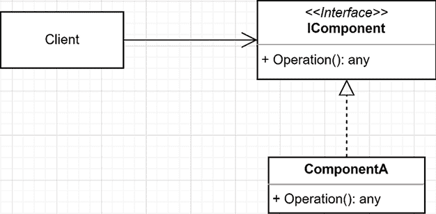

图 11.1：表示实现 IComponent 接口的 ComponentA 类的类图

在前面的图中，我们有以下组件：

+   调用`IComponent`接口的`Operation()`方法的客户端。

+   实现`IComponent`接口的`ComponentA`。

这对应以下序列图：

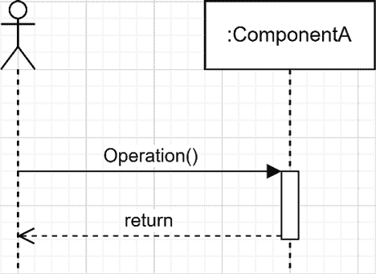

图 11.2：显示消费者调用 ComponentA 类的 Operation 方法的序列图

现在，假设我们想在某些情况下向`ComponentA`添加行为，在其他情况下则保持初始行为。为此，我们可以选择装饰者模式，并按以下方式实现它：

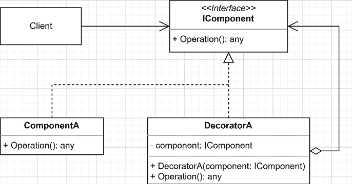

图 11.3：装饰者类图

我们没有修改`ComponentA`类，而是创建了`DecoratorA`，它也实现了`IComponent`接口。这样，`Client`对象可以使用`DecoratorA`的实例而不是`ComponentA`，并且可以利用新的行为而不影响`ComponentA`的其他消费者。然后，为了避免重写整个组件，在创建新的`DecoratorA`实例时（构造函数注入）注入了`IComponent`接口的实现（例如`ComponentA`）。这个新实例存储在`component`字段中，并由`Operation()`方法使用（隐式使用**策略模式**）。我们可以这样翻译更新的序列：

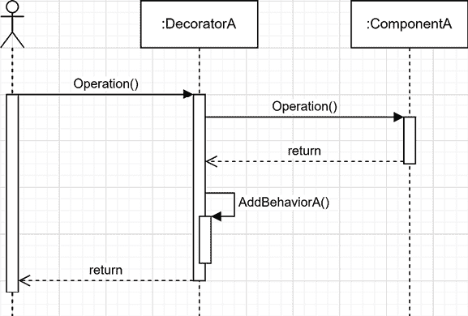

图 11.4：装饰者序列图

在前面的图中，客户端不是直接调用`ComponentA`，而是调用`DecoratorA`，然后`DecoratorA`再调用`ComponentA`。最后，`DecoratorA`通过调用其私有方法`AddBehaviorA()`进行一些后处理。

> 装饰者模式中的任何内容都不会限制我们进行预处理、后处理、用一些逻辑（如`if`语句或`try`-`catch`）包装被装饰类的调用（在这个例子中是`Operation`方法），或者所有这些的组合。添加后处理行为的用法只是一个例子。

在我们跳入代码之前，让我们看看装饰者模式有多强大：我们可以链式使用装饰者！由于我们的装饰者依赖于接口（而不是实现），我们可以在`DecoratorA`内部注入另一个装饰者，比如叫`DecoratorB`（或者反过来）。然后我们可以创建一个装饰彼此的规则链，从而得到一个非常强大且简单的设计。让我们看看以下表示我们的链式示例的类图：

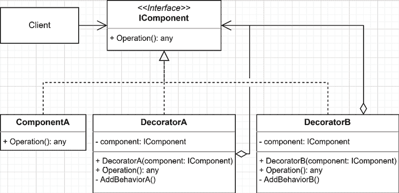

图 11.5：包括两个装饰者的装饰者类图

在这里，我们创建了`DecoratorB`类，它看起来与`DecoratorA`非常相似，但有一个私有的`AddBehaviorB()`方法而不是`AddBehaviorA()`。

> 我们实现装饰器逻辑的方式与模式无关，因此我从*图 9.3*中排除了`AddBehaviorA()`方法，以便只向您展示模式。然而，我在*图 9.5*中添加了它，以阐明第二个装饰器背后的理念。

让我们看看这个的序列图：

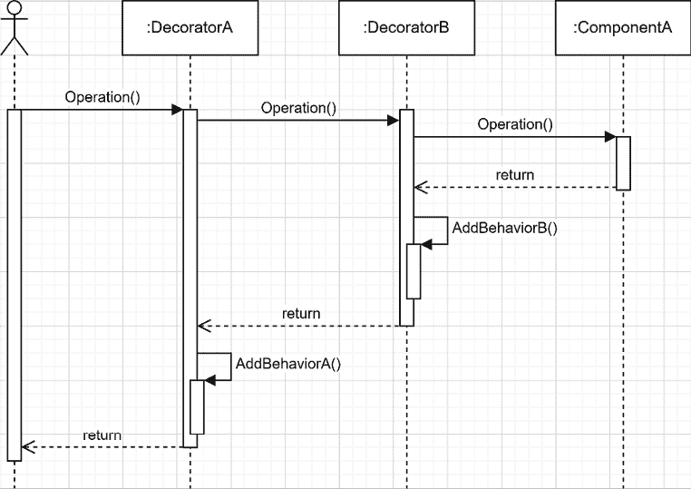

图 11.6：两个嵌套装饰器的序列图

通过这种方式，我们开始看到装饰器的强大之处。在先前的图中，我们可以评估`ComponentA`的行为被改变两次，而客户端并不知道这一点。所有这些类都对链中的下一个`IComponent`一无所知。它们甚至不知道自己正在被装饰。它们只是在计划中扮演自己的角色——仅此而已。重要的是要注意，装饰器的力量在于它依赖于接口，而不是实现，这使得它可重用。基于这个事实，我们可以交换`DecoratorA`和`DecoratorB`以反转应用新行为的顺序，而不必触及代码本身。我们还可以将相同的装饰器（比如`DecoratorC`）应用于多个`IComponent`实现，比如装饰`DecoratorA`和`DecoratorB`。装饰器甚至可以装饰自己。现在让我们深入研究一些代码。

### 项目 - 添加行为

让我们实现前面的示例，以帮助可视化添加一些任意行为的装饰器模式。每个`Operation()`方法返回一个字符串，然后输出到响应流。它并不复杂，但直观地显示了模式的工作原理。首先，让我们看看`IComponent`接口：

```cs
public interface IComponent
{
    string Operation();
}
```

`IComponent`接口只声明实现应该有一个返回`string`的`Operation()`方法。接下来，让我们看看`ComponentA`类：

```cs
public class ComponentA : IComponent
{
    public string Operation()
    {
        return "Hello from ComponentA";
    }
}
```

`ComponentA`类的`Operation()`方法返回一个字面字符串。现在我们已经描述了第一部分，让我们看看消费者：

```cs
var builder = WebApplication.CreateBuilder(args);
builder.Services.AddSingleton<IComponent, ComponentA>();
var app = builder.Build();
app.MapGet("/", (IComponent component) => component.Operation());
app.Run();
```

在上面的`Program.cs`文件中，我们将`ComponentA`注册为`IComponent`的实现，具有单例生命周期。然后，当 HTTP 请求击中`/`端点时，我们注入一个`IComponent`实现。然后代理调用`Operation()`方法并将结果输出到响应。此时，运行应用程序会产生以下响应：

```cs
Hello from ComponentA
```

到目前为止，它相当简单；客户端调用端点，容器将`ComponentA`类的实例注入到端点代理中，然后端点将`Operation`方法的结果返回给客户端。接下来，我们添加第一个装饰器。

#### 装饰器 A

在这里，我们想要修改响应，而不触及`ComponentA`类的代码。为此，我们选择创建一个名为`DecoratorA`的装饰器，它将`Operation()`结果包装到`<DecoratorA>`标签中：

```cs
public class DecoratorA : IComponent
{
    private readonly IComponent _component;
    public DecoratorA(IComponent component)
    {
        _component = component ?? throw new ArgumentNullException(nameof(component));
    }
    public string Operation()
    {
        var result = _component.Operation();
        return $"<DecoratorA>{result}</DecoratorA>";
    }
}
```

`DecoratorA` 实现并依赖于 `IComponent` 接口。它在 `Operation()` 方法中使用注入的 `IComponent` 实现并使用类似 HTML（XML）的标签包装其结果。现在我们有了装饰器，我们需要告诉 IoC 容器在注入 `IComponent` 接口时发送 `DecoratorA` 的实例而不是 `ComponentA`。`DecoratorA` 应该装饰 `ComponentA`。更准确地说，容器应该将 `ComponentA` 类的实例注入到 `DecoratorA` 类中。为了实现这一点，我们可以按照以下方式注册它：

```cs
builder.Services.AddSingleton<IComponent>(serviceProvider => new DecoratorA(new ComponentA()));
```

在这里，我们正在告诉 ASP.NET Core 在注入 `IComponent` 接口时注入一个装饰了 `ComponentA` 实例的 `DecoratorA` 实例。当我们运行应用程序时，我们应该在浏览器中看到以下结果：

```cs
<DecoratorA>Hello from ComponentA</DecoratorA>
```

> 你可能注意到了一些 `new` 关键字，尽管这并不非常优雅，但我们可以在组合根中手动创建新实例，而不会危及我们应用程序的健康。我们将在介绍 Scrutor 后学习如何消除其中的一些。

接下来，让我们创建第二个装饰器。

#### DecoratorB

既然我们已经有了装饰器，现在是时候创建第二个装饰器来展示链式装饰器的强大功能了。**背景**：我们需要另一个内容包装器，但又不想修改现有的类。为了实现这一点，我们得出结论，创建第二个装饰器将非常完美，因此我们创建了以下 `DecoratorB` 类：

```cs
public class DecoratorB : IComponent
{
    private readonly IComponent _component;
    public DecoratorB(IComponent component)
    {
        _component = component ?? throw new ArgumentNullException(nameof(component));
    }
    public string Operation()
    {
        var result = _component.Operation();
        return $"<DecoratorB>{result}</DecoratorB>";
    }
}
```

上述代码与 `DecoratorA` 类似，但 XML 标签是 `DecoratorB`。重要的是，装饰器依赖于并实现了 `IComponent` 接口，而不依赖于具体类。这就是我们能够装饰任何 `IComponent` 的灵活性所在，这也是我们能够链式使用装饰器的原因。为了完成这个示例，我们需要像这样更新我们的组合根：

```cs
builder.Services.AddSingleton<IComponent>(serviceProvider => new DecoratorB(new DecoratorA(new ComponentA())));
```

现在，`DecoratorB` 装饰了 `DecoratorA`，而 `DecoratorA` 又装饰了 `ComponentA`。当运行应用程序时，你会看到以下输出：

```cs
<DecoratorB><DecoratorA>Hello from ComponentA</DecoratorA></DecoratorB>
```

哇！这些装饰器使我们能够修改 `ComponentA` 的行为，而不影响代码。然而，随着我们在每个依赖项内部实例化多个依赖项，我们的组合根开始变得混乱，这使得我们的应用程序更难维护。此外，代码的可读性也在下降。更进一步，如果装饰器还依赖于其他类，代码的可读性将变得更差。

> 我们可以使用装饰器来改变对象的行为或状态。我们可以非常富有创意地使用装饰器；例如，你可以创建一个类，它通过 HTTP 查询远程资源，然后使用一个小组件来管理结果的内存缓存，限制往返远程服务器的次数。你可以创建另一个装饰器来监控查询这些资源所需的时间，并将其记录到 Application Insights 中——有如此多的可能性。

接下来，我们消除 `new` 关键字并清理我们的组合根。

### 项目 - 使用 Scrutor 的装饰器

这次更新旨在简化我们刚刚创建的系统结构。为了实现这一点，我们使用 **Scrutor**，这是一个开源库，它允许我们做这件事，以及其他事情。我们首先需要使用 Visual Studio 或 CLI 安装 Scrutor NuGet 包。当使用 CLI 时，运行以下命令：

```cs
dotnet add package Scrutor
```

一旦安装了 Scrutor，我们就可以使用 `Decorate` 扩展方法在 `IServiceCollection` 上添加装饰器。通过使用 Scrutor，我们可以更新以下混乱的行：

```cs
builder.Services.AddSingleton<IComponent>(serviceProvider => new DecoratorB(new DecoratorA(new ComponentA())))
```

将其转换为这三行更加优雅的代码：

```cs
builder.Services
    .AddSingleton<IComponent, ComponentA>()
    .Decorate<IComponent, DecoratorA>()
    .Decorate<IComponent, DecoratorB>()
;
```

在前面的代码中，我们将 `ComponentA` 注册为 `IComponent` 的实现，具有单例生命周期，就像第一次一样。然后，通过使用 Scrutor，我们告诉 IoC 容器覆盖第一个绑定，并用 `DecoratorA` 的实例装饰已注册的 `IComponent` (`ComponentA`)。然后，我们通过告诉 IoC 容器返回一个实例 `DecoratorB` 来覆盖第二个绑定，该实例装饰了 `IComponent` 的最后一个已知绑定（`DecoratorA`）。结果是和之前一样，但现在代码更加优雅。除了提高了可读性之外，这还让容器创建实例，而不是我们使用 `new` 关键字，这增加了我们系统的灵活性和稳定性。作为提醒，当请求 `IComponent` 接口时，IoC 容器提供相当于以下 `instance` 的功能：

```cs
var instance = new DecoratorB(new DecoratorA(new ComponentA()));
```

为什么我要谈论优雅和灵活性？这个代码只是一个简单的例子，但如果我们向这些类添加其他依赖项，它可能会迅速变成一个复杂的代码块，这可能成为一个维护噩梦，非常难以阅读，并且需要手动管理生命周期。当然，如果系统很简单，你总是可以手动实例化装饰器而不需要加载外部库。

> 在可能的情况下，保持你的代码简单。使用 Scrutor 是实现这一目标的一种方法。代码的简洁性从长远来看有助于阅读和跟踪，即使对其他人来说也是如此。考虑到总有一天会有人阅读你的代码。
> 
> > 此外，向项目中添加任何外部依赖都应该仔细考虑。记住，你必须保持依赖项更新，所以依赖项太多可能会占用维护时间。库的作者也可能停止维护它，库就会变得过时。库可能会引入破坏性更改，迫使你更新代码。等等。
> > 
> > 此外，还需要考虑安全性方面。供应链攻击并不罕见。如果你在一个受监管的地方工作，你可能必须通过网络安全审查过程，等等。
> > 
> > 除了这些一般性建议之外，我已经使用了 Scrutor 多年；我发现它非常稳定，并且不记得有任何破坏性更改导致我遇到问题。

为了确保两个程序的行为相同，无论是否有 Scrutor，让我们探索以下集成测试，它运行在两个项目上，确保它们的正确性：

```cs
namespace Decorator.IntegrationTests;
//...
[Fact]
public async Task Should_return_a_double_decorated_string()
{
    // Arrange
    var client = _webApplicationFactory.CreateClient();
    // Act
    var response = await client.GetAsync("/");
    // Assert
    response.EnsureSuccessStatusCode();
    var body = await response.Content.ReadAsStringAsync();
    Assert.Equal(
        "Operation: <DecoratorB><DecoratorA>Hello from ComponentA</DecoratorA></DecoratorB>",
        body
    );
}
```

前面的测试向内存中运行的一个应用程序发送 HTTP 请求，并将服务器响应与预期值进行比较。由于两个项目应该有相同的输出，我们在`DecoratorPlainStartupTest`和`DecoratorScrutorStartupTest`类中重用这个测试。它们是空的，只将测试路由到正确的程序。以下是一个 Visual Studio 测试资源管理器的示例：

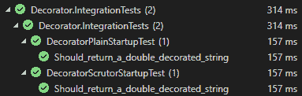

图 11.7：一个显示装饰器集成测试的 Visual Studio 资源管理器截图。

> 你还可以使用 Scrutor 进行组件扫描（[`adpg.link/xvfS`](https://adpg.link/xvfS)），这允许你执行自动依赖注册。这超出了本章的范围，但值得研究。Scrutor 允许你在更复杂的场景中使用内置的 IoC 容器，推迟了替换第三方容器的需求。

### 结论

装饰器模式是我们工具箱中最简单但最强大的设计模式之一。它在不修改现有类的情况下增强它们。装饰器是一个独立的逻辑块，我们可以用它来创建复杂和细粒度的对象树，以满足我们的需求。我们还探讨了 Scrutor 开源库，以帮助我们注册装饰器到容器中。装饰器模式帮助我们遵循**SOLID**原则（反之亦然），如下所示：

+   **S**：装饰器模式建议创建小的类来为其他类添加行为，分离责任，并促进复用。

+   **O**：装饰器在不修改其他类的情况下为它们添加行为，这实际上就是 OCP 的定义。

+   **L**：不适用

+   **I**：遵循 ISP，为你的特定需求创建装饰器应该很容易。然而，如果你的接口过于复杂，实现装饰器模式可能会变得困难。难以创建装饰器是一个很好的指标，表明设计中存在问题——一个代码异味。一个良好分离的接口应该很容易装饰。

+   **D**：依赖于抽象是装饰器强大功能的关键。

接下来，我们探讨组合模式，它帮助我们以不同于装饰器的方式管理复杂对象的结构。

## 实现组合设计模式

组合设计模式是另一个 GoF 的结构型设计模式，它帮助我们管理复杂的对象结构。

### 目标

组合模式背后的目标是创建一个层次化的数据结构，其中你不需要区分组与单个组件，使得消费者对层次结构的遍历和操作变得容易。

> 你可以将组合模式视为一种构建具有自我管理节点的图或树的方法。

### 设计

设计很简单；我们有 `components` 和 `composites`。两者都实现了一个定义共享操作的公共接口。`components` 是单个节点，而 `composites` 是 `components` 的集合。让我们看看一个图例：

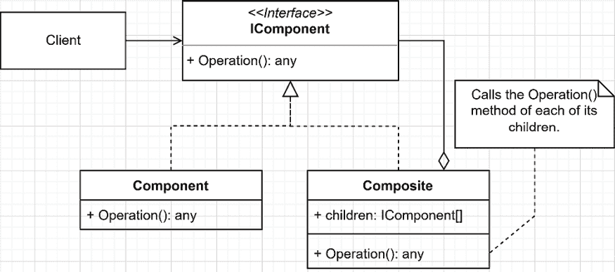

图 11.7：组合类图

在前面的图中，`Client` 依赖于一个 `IComponent` 接口，并且对底层实现一无所知——它可能是一个 `Component` 或 `Composite` 的实例；这并不重要。然后，我们有两种实现：

+   `Component` 代表单个元素；一个叶节点。

+   `Composite` 代表一组 `IComponent`。`Composite` 对象通过将部分过程委托给其子对象来使用其子对象来管理层次结构的复杂性。

这三个部分组合在一起就形成了组合设计模式。考虑到可以将 `Composite` 和 `Component` 类的实例添加为其他 `Composite` 对象的子对象，我们可以几乎不费吹灰之力地创建复杂、非线性、自我管理的数据结构。

> 您不仅限于一种组件和一种组合；您可以根据需要创建尽可能多的 `IComponent` 接口的实现。然后，您甚至可以将它们混合匹配以创建一个非线性树。

### 项目 – BookStore

**上下文**：我们过去编写了一个程序来支持书店。然而，商店经营得如此之好，我们的小程序已经不够用了。我们虚构的公司现在拥有多个商店。他们希望将这些商店划分为区域并管理书籍集合和单本书。在收集信息和询问他们几分钟之后，我们意识到他们可以有集合的集合、子部分，并考虑创建子商店，因此我们需要一个灵活的设计。我们决定使用组合模式来解决这个问题。以下是我们的类层次结构：

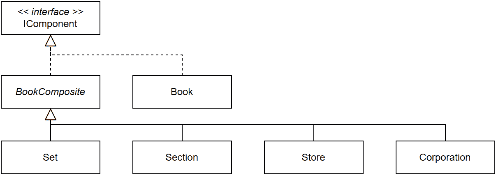

图 11.8：BookStore 项目的组合类层次结构

由于我们的类层次结构复杂，且项目早期阶段的不确定性，我们决定使用工厂来创建我们的类层次结构，展示我们的设计，并让客户验证。以下是高级设计：

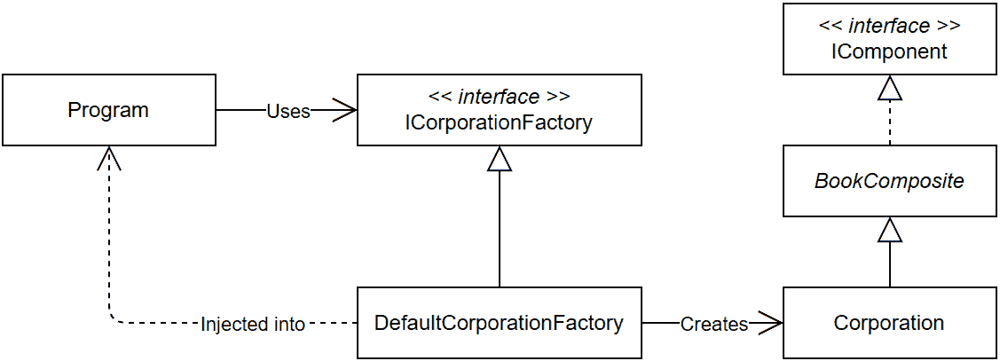

图 11.9：BookStore 项目的概要设计

我们决定追求尽可能小的接口以启动项目。由于我们想知道商店任何部分有多少可用项目以及我们正在与哪种类型的组件交互，我们创建了以下接口：

```cs
namespace Composite.Models;
public interface IComponent
{
    int Count { get; }
    string Type { get; }
}
```

`Count` 属性使我们能够计算在公司、商店、部分、集合或未来创建的任何其他组合组件下有多少可用项目。`Type` 属性强制每个组件线性显示其类型。

> 我们能够创建这样一个最小化界面，因为我们不是在数据结构上执行任何操作，而是在计数元素，然后将它序列化为 JSON。序列化器将为我们处理遍历类层次结构。在另一个上下文中，属性的最小子集可能比这更多。例如，在这种情况下，我们可以在接口中添加一个`Name`属性，但书籍的名称就是它的标题，所以我决定不包含它。

接下来，让我们创建我们的复合结构，从`Book`类（即*组件*）开始：

```cs
namespace Composite.Models;
public class Book : IComponent
{
    public Book(string title)
    {
        Title = title ?? throw new ArgumentNullException(nameof(title));
    }
    public string Title { get; }
    public string Type => "Book";
    public int Count { get; } = 1;
}
```

前面的`Book`类通过总是返回 1 个计数来实现接口，因为它是一本书，是树中的一个叶节点。`Type`属性也是硬编码的。作为一个书籍类，它在构造时需要一个标题，并将其存储在`Title`属性中（不是继承的，并且仅对`Book`实例可用）。

> 在实际场景中，我们会有更多的属性，比如 ISBN 和作者，但这样做在这里只会使示例变得混乱。我们不是在设计一个真正的书店，而是在学习复合模式。

接下来，让我们创建我们的复合组件，`BookComposite`类：

```cs
using System.Collections;
using System.Collections.ObjectModel;
namespace Composite.Models;
public abstract class BookComposite : IComponent
{
    protected readonly List<IComponent> children = new();
    public BookComposite(string name)
    {
        Name = name ?? throw new ArgumentNullException(nameof(name));
    }
    public string Name { get; }
    public virtual string Type => GetType().Name;
    public virtual int Count 
        => children.Sum(child => child.Count);
    public virtual IEnumerable Children 
        => new ReadOnlyCollection<IComponent>(children);
    public virtual void Add(IComponent bookComponent)
    {
        children.Add(bookComponent);
    }
    public virtual void Remove(IComponent bookComponent)
    {
        children.Remove(bookComponent);
    }
}
```

`BookComposite`类实现了以下共享功能：

+   儿童管理（在代码中突出显示）。

+   设置复合对象的`Name`属性并强制其继承的类在构造时设置一个名称。

+   自动查找并设置其派生类的`Type`名称。

+   计算子项的数量（以及隐含的子项的子项数量）。

+   通过`Children`属性公开子项，并确保消费者不能从外部修改集合，通过返回一个`ReadOnlyCollection`对象来实现。

> 在`children.Sum(child => child.Count());`表达式中使用 LINQ 的`Sum()`扩展方法，使我们能够替换一个更复杂的`for`循环和一个累加变量。
> 
> > 通过将`virtual`修饰符添加到`Type`属性，允许子类型在它们类型名称不反映应显示在程序中的类型时覆盖该属性。

现在，我们可以开始实现我们复杂复合层次结构中的其他类，并为每个类分配一个责任，展示复合模式是多么灵活。以下类继承自`BookComposite`类：

+   `Corporation`类代表拥有多个商店的公司。然而，它不仅限于拥有商店；公司可以拥有其他公司、商店或任何其他`IComponent`。

+   `Store`类代表书店。

+   `Section`类代表书店的一个部分，一个通道或书籍的一个类别。

+   `Set`类代表一个书籍集合，例如三部曲。

这些可以由任何`IComponent`组成，这使得这是一个超灵活的数据结构。让我们看看这些`BookComposite`子类型的代码，从`Corporation`类开始：

```cs
namespace Composite.Models;
public class Corporation : BookComposite
{
    public Corporation(string name, string ceo)
        : base(name)
    {
        CEO = ceo;
    }
    public string CEO { get; }
}
```

公司向模型贡献了一位首席执行官，因为有人需要管理这个地方。接下来，我们看看 `Store` 类：

```cs
namespace Composite.Models;
public class Store : BookComposite
{
    public string Location { get; }
    public string Manager { get; }
    public Store(string name, string location, string manager)
        : base(name)
    {
        Location = location;
        Manager = manager;
    }
}
```

在 `BookComposite` 成员之上，商店有一个经理和位置。现在，`Section` 类没有添加任何内容，但我们可以将其用作灵活的组织者：namespace Composite.Models;

```cs
public class Section : BookComposite
{
    public Section(string name) : base(name) { }
}
```

最后，`Set` 类允许通过书籍参数在构造时创建书籍集合：

```cs
namespace Composite.Models;
public class Set : BookComposite
{
    public Set(string name, params IComponent[] books)
        : base(name)
    {
        foreach (var book in books)
        {
            Add(book);
        }
    }
}
```

在创建实例时组合书籍集合将方便我们稍后组装树。接下来，让我们探索程序的最后部分，它有助于封装数据结构的创建：工厂。

> 工厂不是复合模式的一部分，但现在我们知道了工厂是什么，我们可以使用一个工厂来封装我们数据结构的创建逻辑并讨论它。

工厂接口看起来如下所示：

```cs
public interface ICorporationFactory
{
    Corporation Create();
}
```

`ICorporationFactory` 接口的默认具体实现是 `DefaultCorporationFactory` 类。它创建了一个包含部分、子部分、集合和子集的大型非线性数据结构。整个结构是在 `DefaultCorporationFactory` 类中使用我们的复合模型定义的。由于其大小庞大，让我们从类的骨架及其 `Create` 方法开始：

```cs
using Composite.Models;
namespace Composite.Services;
public class DefaultCorporationFactory : ICorporationFactory
{
    public Corporation Create()
    {
        var corporation = new Corporation(
            "Boundless Shelves Corporation",
            "Bosmang Kapawu"
        );
        corporation.Add(CreateTaleTowersStore());
        corporation.Add(CreateEpicNexusStore());
        return corporation;
    }
    // ...
}
```

在先前的 `Create` 方法中，我们创建了公司，添加了两个商店，然后返回结果。`CreateTaleTowersStore` 和 `CreateEpicNexusStore` 方法创建了一个商店，设置了其名称、地址和经理，并为每个商店创建了三个部分：

```cs
private IComponent CreateTaleTowersStore()
{
    var store = new Store(
        "Tale Towers",
        "125 Enchantment Street, Storyville, SV 72845",
        "Malcolm Reynolds"
    );
    store.Add(CreateFantasySection());
    store.Add(CreateAdventureSection());
    store.Add(CreateDramaSection());
    return store;
}
private IComponent CreateEpicNexusStore()
{
    var store = new Store(
        "Epic Nexus",
        "369 Parchment Plaza, Novelty, NV 68123",
        "Ellen Ripley"
    );
    store.Add(CreateFictionSection());
    store.Add(CreateFantasySection());
    store.Add(CreateAdventureSection());
    return store;
}
```

两个商店共享两个部分（有相同的书籍；高亮代码），每个部分都有独特的部分。如果我们查看 `CreateFictionSection` 方法，它添加了一本虚构的书籍和一个子部分：

```cs
private IComponent CreateFictionSection()
{
    var section = new Section("Fiction");
    section.Add(new Book("Some alien cowboy"));
    section.Add(CreateScienceFictionSection());
    return section;
}
```

`CreateScienceFictionSection` 方法添加了一本虚构的书籍和由三部曲组成的星球大战书籍集合（一个集合的集合）：

```cs
private IComponent CreateScienceFictionSection()
{
    var section = new Section("Science Fiction");
    section.Add(new Book("Some weird adventure in space"));
    section.Add(new Set(
        "Star Wars",
        new Set(
            "Prequel trilogy",
            new Book("Episode I: The Phantom Menace"),
            new Book("Episode II: Attack of the Clones"),
            new Book("Episode III: Revenge of the Sith")
        ),
        new Set(
            "Original trilogy",
            new Book("Episode IV: A New Hope"),
            new Book("Episode V: The Empire Strikes Back"),
            new Book("Episode VI: Return of the Jedi")
        ),
        new Set(
            "Sequel trilogy",
            new Book("Episode VII: The Force Awakens"),
            new Book("Episode VIII: The Last Jedi"),
            new Book("Episode IX: The Rise of Skywalker")
        )
    ));
    return section;
}
```

现在，如果我们查看数据结构的一部分，我们有以下内容：

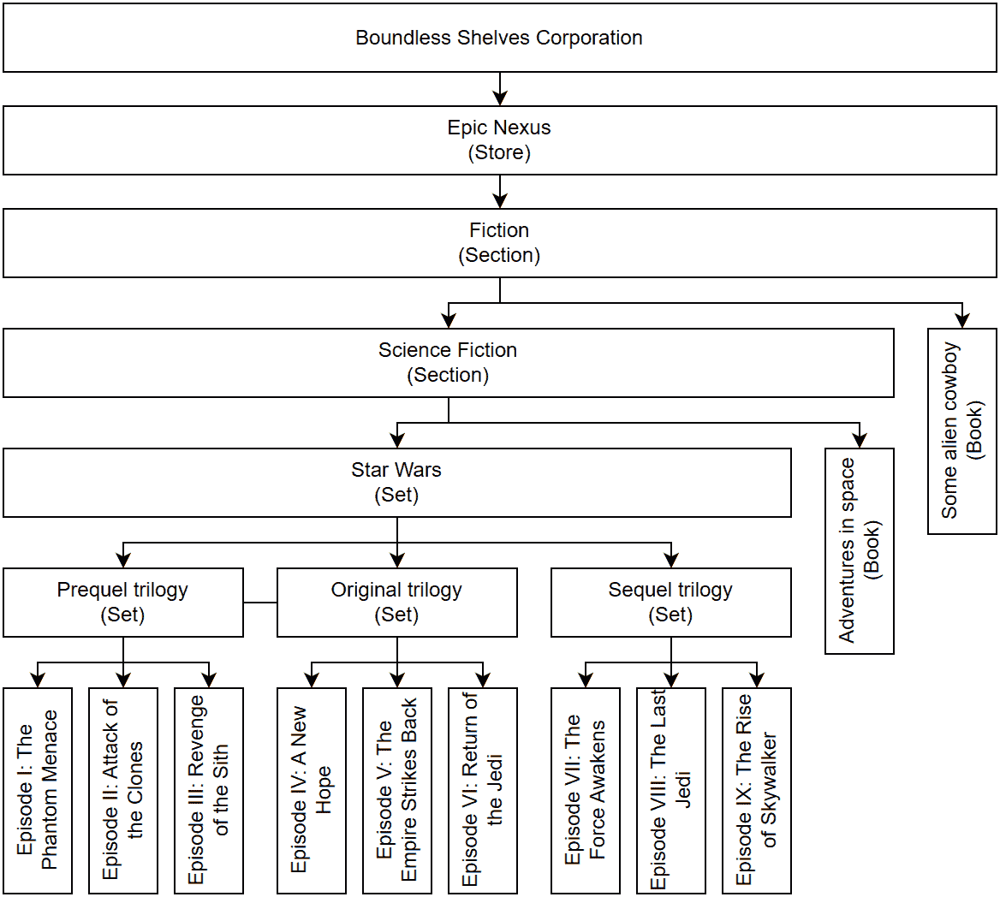

图 11.10：Epic Nexus 商店数据的小说部分

在更大的体系中，整个组织结构，直到部分级别（不包括书籍和集合），看起来如下所示：

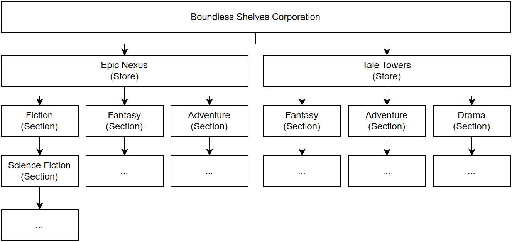

图 11.11：没有书籍和集合的复合层次结构

> 我省略了整个数据结构（包括书籍）的图像发布，因为它太大，难以阅读。请放心，内容本身并不重要，我们正在研究的部分足以理解复合模式为设计带来的灵活性。

在探索过程中，我们可以看到设计是多么灵活。我们可以创建几乎任何我们想要的组织结构。现在，让我们看看 `Program.cs` 文件并注册我们的依赖项以及一个用于查询数据结构的端点：

```cs
using Composite.Services;
var builder = WebApplication.CreateBuilder(args);
builder.Services.AddSingleton<ICorporationFactory, DefaultCorporationFactory>();
var app = builder.Build();
app.MapGet(
    "/",
    (ICorporationFactory corporationFactory)
        => corporationFactory.Create()
);
app.Run();
```

之前的代码将创建公司数据结构的工厂与容器以及一个用于提供服务的端点注册。当我们执行代码时，我们得到完整的数据结构或公司。为了简洁起见，以下 JSON 表示虚构部分，不包括书籍：

```cs
{
  "ceo": "Bosmang Kapawu",
  "name": "Boundless Shelves Corporation",
  "type": "Corporation",
  "count": 43,
  "children": [
    {
      "location": "369 Parchment Plaza, Novelty, NV 68123",
      "manager": "Ellen Ripley",
      "name": "Epic Nexus",
      "type": "Store",
      "count": 25,
      "children": [
        {
          "name": "Fiction",
          "type": "Section",
          "count": 11,
          "children": [
            {
              "name": "Science Fiction",
              "type": "Section",
              "count": 10,
              "children": [
                {
                  "name": "Star Wars",
                  "type": "Set",
                  "count": 9,
                  "children": [
                    {
                      "name": "Prequel trilogy",
                      "type": "Set",
                      "count": 3,
                      "children": []
                    },
                    {
                      "name": "Original trilogy",
                      "type": "Set",
                      "count": 3,
                      "children": []
                    },
                    {
                      "name": "Sequel trilogy",
                      "type": "Set",
                      "count": 3,
                      "children": []
                    }
                  ]
                }
              ]
            }
          ]
        }
      ]
    }
  ]
}
```

> `count`字段的值反映了总数。在这种情况下，没有书籍，所以计数应该是 0。如果你运行程序并玩转在`DefaultCorporationFactory.cs`文件中定义的预处理器符号（`ADD_BOOKS`、`ADD_SETS`和`ONLY_FICTION`），你将得到不同的数字。

组合模式允许我们在一个小的方法调用中渲染复杂的数据结构。由于每个组件都自主处理自身，组合模式从消费者那里移除了管理这种复杂性的负担。我鼓励你尝试与现有的数据结构互动，以便理解这个模式。你也可以尝试添加一个`Movie`类来管理电影；书店必须多样化其活动。你还可以区分电影和书籍，以免顾客混淆。书店可以有实体书和数字书。如果你还在寻找更多，尝试从头开始构建一个新的应用程序，并使用组合模式来创建、管理和显示多级菜单结构或文件系统 API。

### 结论

组合模式有效地构建、管理和维护复杂的非线性数据结构。它的力量主要在于其自我管理能力。每个节点、组件或组合都负责自己的逻辑，留给组合消费者的工作很少或没有。当然，更复杂的场景会导致更复杂的接口。使用组合模式有助于我们以下方式遵循**SOLID**原则：

+   **S**: 它有助于将复杂数据结构中的多个元素划分为小类，以分割责任。

+   **O**: 通过允许我们“混合匹配”`IComponent`接口的不同实现，组合模式使我们能够在不影响其他现有类的情况下扩展数据结构。例如，你可以创建一个新的实现`IComponent`的类，并立即开始使用它，而无需修改任何其他组件类。

+   **L**: 无

+   **I**: 当单个项目实现仅影响集合的操作时，如`Add`和`Remove`方法，组合模式可能会违反 ISP 原则，但在这里我们没有这样做。

+   **D**: 组合模式的行为者仅依赖于`IComponent`，这反转了依赖关系流。

接下来，我们将转向另一种类型的结构模式，它将一个接口适配到另一个接口。

## 实现适配器设计模式

适配器模式是另一种结构型设计模式，它允许两个不兼容的接口在不修改它们现有代码的情况下一起工作。该模式引入了一个名为 *适配器* 的包装类，它桥接了接口之间的差距。

### 目标

当我们想要使用现有的类，但其接口与我们想要使用它的方式不兼容时，适配器设计模式适用。我们不是重构该类，这可能会在现有的代码库中引入错误或错误，甚至可能将更改级联到系统的其他部分，而是可以使用一个 *适配器* 类使该类的接口与 *目标* 接口兼容。当我们不能更改 *适配者* 的代码或不想更改它时，适配器模式非常有用。

### 设计

你可以将适配器想象成电源插座的通用适配器；你可以通过将其连接到适配器，然后连接到电源插座，将北美设备连接到欧洲插座。适配器设计模式正是如此，但针对的是 API。让我们先看看以下图示：

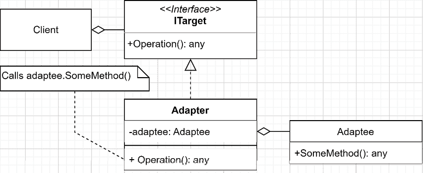

图 11.12：适配器类图

在前面的图中，我们有以下参与者：

+   `ITarget` 接口包含我们想要（或已经）使用的合约。

+   `Adaptee` 类代表我们想要使用的具体组件，它不符合 `ITarget`。

+   `Adapter` 类将 `Adaptee` 类适配到 `ITarget` 接口。

实现适配器模式的第二种方法涉及到继承。如果你可以选择组合，那就选择组合，但如果你需要访问 `protected` 方法或其他 `Adaptee` 的内部状态，你可以选择继承，如下所示：

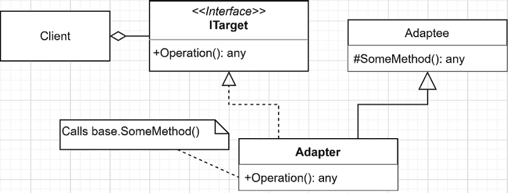

图 11.13：继承适配者的适配器类图

参与者相同，但不是通过组合 `Adapter` 类与 `Adaptee` 类，而是 `Adapter` 类从 `Adaptee` 类继承。这种设计使 `Adapter` 类同时成为 `Adaptee` 和 `ITarget`。让我们探索一下这在代码中是如何实现的。

### 项目 – 问候器

**上下文**：我们编写了一个高度复杂的问候系统，我们希望在新的程序中重用它。然而，它的接口与新设计不匹配，我们无法修改它，因为其他系统使用该问候系统。为了解决这个问题，我们决定应用适配器模式。以下是外部问候器（`ExternalGreeter`）和在新系统中使用的新的接口（`IGreeter`）的代码。这段代码不得直接修改 `ExternalGreeter` 类，以防止对其他系统造成破坏性更改：

```cs
public interface IGreeter
{
    string Greeting();
}
public class ExternalGreeter
{
    public string GreetByName(string name)
    {
        return $"Adaptee says: hi {name}!";
    }
}
```

接下来是如何将外部问候器适配以满足最新要求：

```cs
public class ExternalGreeterAdapter : IGreeter
{
    private readonly ExternalGreeter _adaptee;
    public ExternalGreeterAdapter(ExternalGreeter adaptee)
    {
        _adaptee = adaptee ?? throw new ArgumentNullException(nameof(adaptee));
    }
    public string Greeting()
    {
        return _adaptee.GreetByName("ExternalGreeterAdapter");
    }
}
```

在前面的代码中，参与者如下：

+   `IGreeter` 接口代表 *目标*，是我们必须使用的接口。

+   `ExternalGreeter`类代表*适配器*，是包含所有逻辑的外部组件，这些逻辑是由某人编写的并经过测试。该代码可能位于外部程序集或通过 NuGet 包安装。

+   `ExternalGreeterAdapter`类代表*适配器*，这是适配器执行其工作的地方。在这种情况下，`Greeting`方法调用`ExternalGreeter`类的`GreetByName`方法，该类实现了问候逻辑。

现在，我们可以调用`Greeting`方法并获取`GreetByName`调用的结果。有了这个，我们可以通过`ExternalGreeterAdapter`类重用现有的逻辑。

> 我们还可以通过模拟`IGreeter`接口来测试`IGreeter`消费者，而不必处理`ExternalGreeterAdapter`类。

在这种情况下，“复杂逻辑”相当简单，但我们在这里是为了适配器模式，而不是为了想象中的业务逻辑。现在，让我们看看消费者：

```cs
var builder = WebApplication.CreateBuilder(args);
builder.Services.AddSingleton<ExternalGreeter>();
builder.Services.AddSingleton<IGreeter, ExternalGreeterAdapter>();
var app = builder.Build();
app.MapGet("/", (IGreeter greeter) => greeter.Greeting());
app.Run();
```

在前面的代码中，我们通过将`ExternalGreeterAdapter`类注册为与`IGreeter`接口绑定的单例来构建我们的应用程序。我们还通知容器，每当请求时（在这种情况下，我们将其注入到`ExternalGreeterAdapter`类中）提供`ExternalGreeter`类的单个实例。然后，消费者（在类图中为*客户端*）是突出显示的端点，其中`IGreeter`接口作为参数注入。然后，委托调用注入实例的`Greeting`方法并将问候消息输出到响应。以下图表示这个系统正在发生的事情：

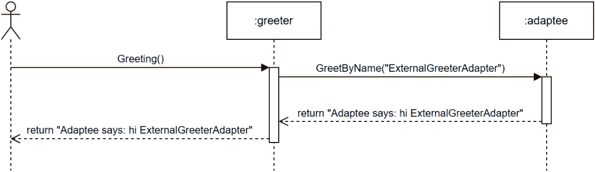

图 11.14：问候系统序列图

哇！我们几乎不费吹灰之力就将`ExternalGreeterAdapter`类适配到了`IGreeter`接口。

### 结论

适配器模式是另一种提供灵活性的简单模式。通过它，我们可以使用旧的或不符合规范的组件，而无需重写它们。当然，根据*目标*和*适配器*接口，你可能需要投入更多或更少的精力来编写*适配器*类的代码。现在，让我们学习适配器模式如何帮助我们遵循**SOLID**原则：

+   **S**：适配器模式只有一个职责：使一个接口与另一个接口协同工作。

+   **O**：适配器模式允许我们修改*适配器*的接口，而无需修改其代码。

+   **L**：关于适配器模式，继承不是一个大问题，因此这个原则再次不适用。如果*适配器*从*适配器*继承，目标是改变其接口，而不是其行为，这应该符合 LSP。

+   **I**：我们可以将*适配器*（Adapter）类视为 ISP 的促进者，以*目标*（Target）接口作为最终目的地。适配器模式依赖于*目标*接口的设计，但并不直接影响它。根据这一原则，我们的主要焦点应该是以遵守 ISP 的方式设计*目标*接口。

+   **D**：适配器模式仅引入了*目标*接口的一个实现。即使*适配器*依赖于一个具体类，它通过将其适配到*目标*接口来打破对该外部组件的直接依赖。

接下来，我们将探索本章的最后一个结构型模式，它教授基础概念。

## 实现外观设计模式

外观模式是一种结构型模式，它简化了对复杂系统的访问。它与适配器模式非常相似，但它在一或多个子系统之间创建了一堵墙（外观）。适配器和外观之间的主要区别在于，外观不是将一个接口适配到另一个接口，而是通过使用该子系统的多个类来简化子系统的使用。

> 我们可以将同样的想法应用于保护一个或多个程序，但在这个情况下，我们将外观称为网关——更多内容请参阅第十九章，“微服务架构简介”。

外观模式非常实用，并且可以适应多种情况。

### 目标

外观模式旨在通过提供一个比子系统本身更容易使用的接口来简化一个或多个子系统的使用，从而保护消费者免受这种复杂性。

### 设计

想象一个拥有众多复杂类的系统。由于耦合、复杂性和代码的可读性和可维护性低，直接在消费代码和这些类之间进行交互可能会变得有问题。外观设计模式通过提供一个统一的接口来访问子系统中的一组 API，从而提供了一种解决方案，使得使用更加容易。外观类包含对复杂子系统对象的引用，并将客户端请求委派给适当的子系统对象。从客户端的角度来看，它只与外观表示的单个简化接口进行交互。幕后，外观与子系统的组件协调以满足客户端的请求。我们可以创建多个表示众多子系统的图表，但让我们保持简单。记住，你可以将以下图表中显示的单个子系统替换为你需要适配的任意数量的子系统：

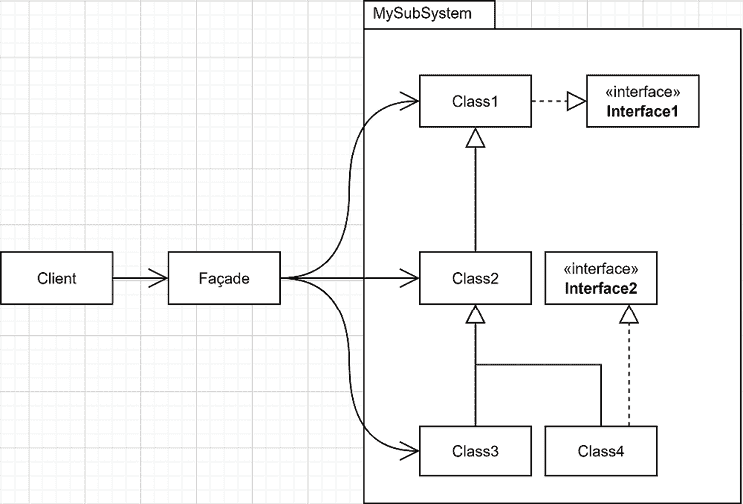

图 11.15：表示隐藏复杂子系统的外观对象的类图

*外观*（Façade）在*客户端*和子系统之间扮演着中介的角色，简化了其使用。让我们通过一个时序图来观察这一过程：

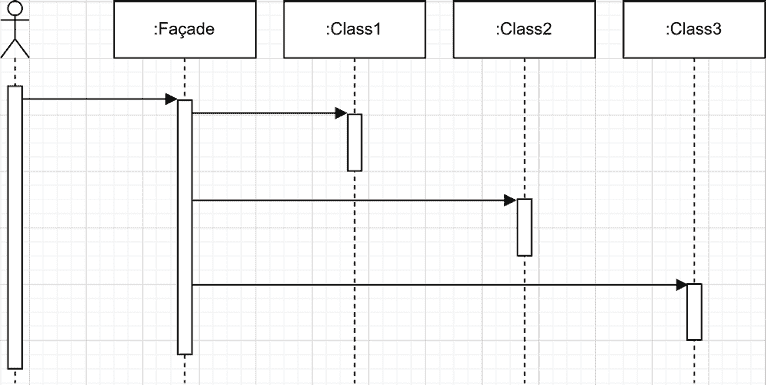

图 11.16：表示 Façade 对象与复杂子系统交互的序列图

在前面的图中，客户端调用一次 `Façade`，而 `Façade` 对不同的类进行了多次调用。实现外观有多种方式：

+   **不透明外观**: 在这种形式中，`Façade` 类位于子系统内部。子系统中的所有其他类都有一个 `internal` 可见性修饰符。这样，只有子系统内部的类可以与其他内部类交互，迫使消费者使用 `Façade` 类。

+   **透明外观**: 在这种形式中，类可以有一个 `public` 修饰符，允许消费者直接使用它们，或者使用 `Façade` 类。这样，我们可以在子系统内部或外部创建 `Façade` 类。

+   **静态外观**: 在这种形式中，`Façade` 类是 `static` 的。我们可以将静态外观实现为不透明或透明。

> 我建议将静态外观作为最后的手段，因为 `static` 元素限制了灵活性并降低了可测试性。

接下来我们看看一些代码。

### 项目 – 外观

在这个例子中，我们玩以下 C# 项目：

+   `OpaqueFacadeSubSystem` 类库展示了 **不透明外观**。

+   `TransparentFacadeSubSystem` 类库展示了 **透明外观**。

+   `Facade` 项目是一个消耗外观的 REST API。它公开了两个端点以访问 `OpaqueFacadeSubSystem` 项目，还有两个端点针对 `TransparentFacadeSubSystem` 项目。

让我们从类库开始。

> 为了遵循 SOLID 原则，添加一些代表子系统元素的接口似乎是合适的。在随后的章节中，我们将探讨如何组织我们的抽象以使其更具可重用性，但到目前为止，抽象和实现都在同一个程序集中。

#### 不透明外观

在这个程序集中，只有外观是公开的；所有其他类都是 `internal`，这意味着它们对外部世界是隐藏的。在大多数情况下，这并不是理想的；隐藏一切使得子系统更不灵活，更难扩展。然而，在某些情况下，您可能希望控制对内部 API 的访问。这可能是因为它们还不够成熟，您不希望任何第三方依赖它们，或者出于您认为适合您特定用例的任何其他原因。让我们先看看以下子系统代码：

```cs
// An added interface for flexibility
public interface IOpaqueFacade
{
    string ExecuteOperationA();
    string ExecuteOperationB();
}
// A hidden component
internal class ComponentA
{
    public string OperationA() => "Component A, Operation A";
    public string OperationB() => "Component A, Operation B";
}
// A hidden component
internal class ComponentB
{
    public string OperationC() => "Component B, Operation C";
    public string OperationD() => "Component B, Operation D";
}
// A hidden component
internal class ComponentC
{
    public string OperationE() => "Component C, Operation E";
    public string OperationF() => "Component C, Operation F";
}
// The opaque façade using the other hidden components
public class OpaqueFacade : IOpaqueFacade
{
    private readonly ComponentA _componentA;
    private readonly ComponentB _componentB;
    private readonly ComponentC _componentC;
    // Using constructor injection
    internal OpaqueFacade(ComponentA componentA, ComponentB componentB, ComponentC componentC)
    {
        _componentA = componentA ?? throw new ArgumentNullException(nameof(componentA));
        _componentB = componentB ?? throw new ArgumentNullException(nameof(componentB));
        _componentC = componentC ?? throw new ArgumentNullException(nameof(componentC));
    }
    public string ExecuteOperationA()
    {
        return new StringBuilder()
            .AppendLine(_componentA.OperationA())
            .AppendLine(_componentA.OperationB())
            .AppendLine(_componentB.OperationD())
            .AppendLine(_componentC.OperationE())
            .ToString();
    }
    public string ExecuteOperationB()
    {
        return new StringBuilder()
            .AppendLine(_componentB.OperationC())
            .AppendLine(_componentB.OperationD())
            .AppendLine(_componentC.OperationF())
            .ToString();
    }
}
```

`OpaqueFacade`类直接与`ComponentA`、`ComponentB`和`ComponentC`耦合。由于子系统本身不可扩展，提取任何`internal`接口都没有意义。我们本可以这样做以提供某种内部灵活性，但在这个情况下，这样做没有优势。除了这种耦合之外，`ComponentA`、`ComponentB`和`ComponentC`各自定义了两个方法，这些方法返回一个描述其来源的字符串。有了这些代码，我们可以观察正在发生的事情以及最终结果是如何组合的。`OpaqueFacade`还公开了两个方法，每个方法都使用底层子系统的组件组合不同的消息。这是外观的经典用法；外观以更多或更少的复杂性查询其他对象，然后对结果进行操作，从而减轻调用者了解子系统的负担。由于成员使用`internal`可见性修饰符，我们无法直接从程序中将依赖关系注册到 IoC 容器中。为了解决这个问题，子系统可以通过添加扩展方法来注册其依赖关系。以下扩展方法对消费应用程序是可访问的：

```cs
public static class StartupExtensions
{
    public static IServiceCollection AddOpaqueFacadeSubSystem(this IServiceCollection services)
    {
        services.AddSingleton<IOpaqueFacade>(serviceProvider
            => new OpaqueFacade(new ComponentA(), new ComponentB(), new ComponentC()));
        return services;
    }
}
```

上一段代码手动创建了依赖关系，并将绑定添加到`IOpaqueFacade`接口，以便系统可以使用它。这样，除了接口之外，所有内容都从消费者那里隐藏起来。在探索 REST API 之前，我们来看看透明外观的实现。

#### 透明外观

透明外观是最灵活的外观类型，非常适合利用依赖注入的系统。实现方式与不透明外观类似，但`public`可见性修饰符改变了消费者访问类库元素的方式。对于这个系统，添加接口以允许子系统消费者在需要时扩展它是值得的。首先，让我们看看抽象：

```cs
namespace TransparentFacadeSubSystem.Abstractions
{
    public interface ITransparentFacade
    {
        string ExecuteOperationA();
        string ExecuteOperationB();
    }
    public interface IComponentA
    {
        string OperationA();
        string OperationB();
    }
    public interface IComponentB
    {
        string OperationC();
        string OperationD();
    }
    public interface IComponentC
    {
        string OperationE();
        string OperationF();

}
```

这个子系统的 API 与不透明外观相同。唯一的区别是我们如何使用和扩展子系统（从消费者角度来看）。实现方式也大致相同，但类实现了接口并且是`public`的；突出显示的元素代表这些变化：

```cs
namespace TransparentFacadeSubSystem
{
    public class ComponentA : IComponentA
    {
        public string OperationA() => "Component A, Operation A";
        public string OperationB() => "Component A, Operation B";
}
    public class ComponentB : IComponentB
    {
        public string OperationC() => "Component B, Operation C";
        public string OperationD() => "Component B, Operation D";
    }
    public class ComponentC : IComponentC
    {
        public string OperationE() => "Component C, Operation E";
        public string OperationF() => "Component C, Operation F";
    }
    public class TransparentFacade : ITransparentFacade
    {
        private readonly IComponentA _componentA;
        private readonly IComponentB _componentB;
        private readonly IComponentC _componentC;
    public TransparentFacade(IComponentA componentA, IComponentB
componentB, IComponentC componentC)
    {
        _componentA = componentA ?? throw new ArgumentNullException(nameof(componentA));
        _componentB = componentB ?? throw new ArgumentNullException(nameof(componentB));
        _componentC = componentC ?? throw new ArgumentNullException(nameof(componentC));
    }
        public string ExecuteOperationA()
        {
            return new StringBuilder()
                .AppendLine(_componentA.OperationA())
                .AppendLine(_componentA.OperationB())
                .AppendLine(_componentB.OperationD())
                .AppendLine(_componentC.OperationE())
                .ToString();
            }
        public string ExecuteOperationB()
        {
            return new StringBuilder()
                .AppendLine(_componentB.OperationC())
                .AppendLine(_componentB.OperationD())
                .AppendLine(_componentC.OperationF())
                .ToString();
        }
    }
}
```

为了简化子系统的使用，我们创建以下扩展方法作为良好实践，这使得消费子系统更容易。在该方法中定义的所有内容都可以从组合根（对于不透明外观来说并非如此）中进行覆盖：

```cs
public static class StartupExtensions
{
    public static IServiceCollection AddTransparentFacadeSubSystem(this IServiceCollection services)
    {
        services.AddSingleton<ITransparentFacade, TransparentFacade>();
        services.AddSingleton<IComponentA, ComponentA>();
        services.AddSingleton<IComponentB, ComponentB>();
        services.AddSingleton<IComponentC, ComponentC>();
        return services;
    }
}
```

所有新的元素都已消失，并被简单的依赖注册（在这种情况下是单例生命周期）所取代。这些小小的差异为我们提供了工具，如果我们想的话，可以重新实现子系统的任何部分，正如我们很快就会看到的。

> 我们可以在透明外观扩展方法中注册绑定，因为类和接口都是`public`的。容器需要一个公共构造函数来完成其工作。
> 
> > 在不透明门面中，我们必须将`OpaqueFacade`类的构造函数定义为`internal`，因为其参数的类型（`ComponentA`、`ComponentB`和`ComponentC`）是`internal`，这使得无法利用容器。将不透明门面构造函数的可见性修饰符从`internal`更改为`public`将产生一个*CS0051 可访问性不一致*错误。

除了这些差异之外，透明门面与不透明门面扮演着相同的作用，输出相同的结果。接下来，我们将消费这两个门面。

#### 程序

现在，让我们分析消费者，这是一个将 HTTP 请求转发到门面并返回其响应的 ASP.NET Core 应用程序。第一步是注册依赖项，如下所示：

```cs
var builder = WebApplication.CreateBuilder(args);
builder.Services
    .AddOpaqueFacadeSubSystem()
    .AddTransparentFacadeSubSystem()
;
```

> 使用这些扩展方法，应用程序的根目录如此干净，以至于很难知道我们针对 IoC 容器注册了两个子系统。这是一种保持代码组织良好和干净的好方法，尤其是在构建类库时。

现在一切都已经注册，我们需要做的第二件事是将这些 HTTP 请求路由到门面。让我们首先看看代码：

```cs
var app = builder.Build();
app.MapGet(
    "/opaque/a",
    (IOpaqueFacade opaqueFacade)
        => opaqueFacade.ExecuteOperationA()
); 
app.MapGet(
    "/opaque/b",
    (IOpaqueFacade opaqueFacade)
        => opaqueFacade.ExecuteOperationB()
);
app.MapGet(
    "/transparent/a",
    (ITransparentFacade transparentFacade)
        => transparentFacade.ExecuteOperationA()
);
app.MapGet(
    "/transparent/b",
    (ITransparentFacade transparentFacade)
        => transparentFacade.ExecuteOperationB()
);
app.Run();
```

在前面的代码块中，我们定义了四个路由。每个路由使用注入在其委托中的门面将请求调度到门面的一个方法（突出显示的代码）。如果你运行程序并导航到`/transparent/a`端点，页面应该显示以下内容：

```cs
Component A, Operation A
Component A, Operation B
Component B, Operation D
Component C, Operation E
```

发生的事情位于委托内部。它使用注入的`ITransparentFacade`服务并调用其`ExecuteOperationA()`方法，然后将`result`变量输出到响应流。现在，让我们定义`ITransparentFacade`是如何组成的：

+   `ITransparentFacade`是`TransparentFacade`的一个实例。

+   我们在`TransparentFacade`类中注入`IComponentA`、`IComponentB`和`IComponentC`。

+   这些依赖项分别是`ComponentA`、`ComponentB`和`ComponentC`的实例。

从视觉上看，以下流程发生：

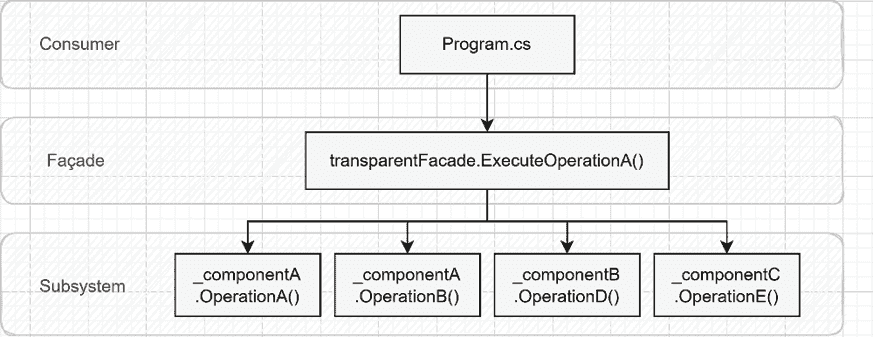

图 11.17：消费者执行 ExecuteOperationA 方法时出现的调用层次结构表示

在前面的图中，我们可以看到门面（facade）所执行的屏蔽作用以及它是如何使消费者的生活变得更简单的：一次调用而不是四次。

> 使用依赖注入最难的部分之一是其抽象性。如果你不确定所有这些部分是如何组装的，在 Visual Studio 中添加一个断点（比如说，在`var result = transparentFacade.ExecuteOperationA()`这一行）并以调试模式运行应用程序。从那里，**单步进入**每个方法调用。这应该有助于你弄清楚发生了什么。使用调试器查找具体类型及其状态可以帮助找到有关系统或诊断错误的详细信息。
> 
> > 要使用**单步进入**，你可以使用以下按钮或按**F11**：


图 11.18：Visual Studio 的 Step Into（F11）按钮

调用其他端点会导致类似的结果。作为参考，这里是从其他端点得到的结果。这是 `/transparent/b` 端点得到的结果：

```cs
Component B, Operation C
Component B, Operation D
Component C, Operation F
```

这是 `/opaque/a` 端点得到的结果：

```cs
Component A, Operation A
Component A, Operation B
Component B, Operation D
Component C, Operation E
```

这是 `/opaque/b` 端点得到的结果：

```cs
Component B, Operation C
Component B, Operation D
Component C, Operation F
```

接下来，让我们更新一些结果，而不改变组件的代码。

#### 灵活性在行动

正如讨论的那样，透明外观增加了更多的灵活性。在这里，我们探索这种灵活性在实际中的应用。**上下文**：我们想要改变 `TransparentFacade` 类的行为。目前，`transparent/b` 端点得到的结果如下：

```cs
Component B, Operation C
Component B, Operation D
Component C, Operation F
```

为了展示我们可以扩展和改变子系统而不改变它，让我们将输出更改为以下内容：

```cs
Flexibility
Design Pattern
Component C, Operation F
```

因为 `ComponentB` 类提供了前两行，我们必须用 `IComponentB` 接口的新实现来替换它。让我们称这个类为 `UpdatedComponentB`：

```cs
using TransparentFacadeSubSystem.Abstractions;
namespace Facade;
public class UpdatedComponentB : IComponentB
{
    public string OperationC() => "Flexibility";
    public string OperationD() => "Design Pattern";
}
```

上述代码正好做了我们想要的事情。然而，我们必须像这样告诉 IoC 容器：

```cs
builder.Services
    .AddOpaqueFacadeSubSystem()
    .AddTransparentFacadeSubSystem()
    .AddSingleton<IComponentB, UpdatedComponentB>()
;
```

如果你运行程序，你应该能看到期望的结果！

> 第二次添加依赖会使容器解析该依赖，从而覆盖第一个。然而，两个注册都保留在服务集合中；例如，在 `IServiceProvider` 上调用 `GetServices<IComponentB>()` 会返回两个依赖。不要混淆 `GetServices()` 和 `GetService()` 方法（复数与单数）；一个返回一个集合，而另一个返回一个单一实例。这个单一实例总是最后注册的那个。

就这样！我们没有修改系统就更新了它。这就是围绕它设计程序时依赖注入能为你做到的。

#### 交替的外观模式

一种替代方案是创建一个介于**透明外观和不透明外观**之间的**混合外观**，通过使用`public`可见性修饰符（所有接口）暴露抽象，同时将实现隐藏在`internal`可见性修饰符之下。这种混合设计在**控制和灵活性**之间提供了正确的平衡。另一种替代方案是创建**子系统之外的的外观**。在之前的例子中，我们在类库内部创建了外观，但这不是强制性的；外观只是一个创建系统与一个或多个子系统之间可访问墙的类。它应该位于你认为合适的位置。创建这样的外部外观特别有用，当你不控制子系统（例如，你只能访问二进制文件）的源代码时。这也可以用来在相同的子系统上创建项目特定的外观，这为你提供了额外的灵活性，而不会使你的子系统因多个外观而变得杂乱，将维护成本从子系统转移到使用它们的客户端应用程序。这一点更像是一个注释而不是替代方案：你不需要为每个子系统创建一个程序集。我这样做是因为它有助于我在例子中解释不同的概念，但你可以在同一个程序集中创建多个子系统。你甚至可以创建一个包含所有子系统、外观和客户端代码（所有都在一个项目中）的单个程序集。

> 无论是在谈论子系统还是 REST API，分层 API 是创建原子但难以使用的基础功能的一种优秀方式，同时通过外观提供高级 API 来访问它们，从而提升用户体验。

### 结论

外观模式对于简化用户生活非常有用，它允许我们通过一堵墙隐藏子系统的实现细节。它有多种变体；其中最突出的是：

+   **透明外观**，通过暴露至少部分子系统来增加灵活性

+   **不透明外观**，通过隐藏大多数子系统来控制访问

现在，让我们看看**透明外观**模式如何帮助我们遵循**SOLID**原则：

+   **S**：一个设计良好的**透明外观**通过隐藏过于复杂的子系统或内部实现细节，向其用户提供一组连贯的功能，从而实现这一目的。

+   **O**：一个设计良好的**透明外观**及其底层子系统的组件可以在不直接修改的情况下进行扩展，正如我们在*灵活性实践*部分所看到的。

+   **L**：N/A

+   **I**：通过暴露使用不同较小对象实现小型接口的外观，我们可以说这种隔离是在外观和组件层面同时进行的。

+   **D**：外观模式没有指定任何关于接口的内容，因此开发者必须通过使用其他模式、原则和最佳实践来强制执行此原则。

最后，让我们看看**不透明的外观**模式如何帮助我们遵循**SOLID**原则：

+   **S**：一个设计良好的**不透明外观**通过提供一组功能一致的服务给其客户端，通过隐藏过于复杂的子系统或内部实现细节来实现这一目的。

+   **O**：通过隐藏子系统，**不透明的外观**限制了我们的扩展能力。然而，我们可以实现一个**混合外观**来帮助解决这个问题。

+   **L**：N/A

+   **I**：**不透明的外观**并不能帮助或减少我们应用 ISP（接口隔离原则）的能力。

+   **D**：外观模式没有指定任何关于接口的内容，因此开发者必须通过使用其他模式、原则和最佳实践来强制执行此原则。

## 摘要

在本章中，我们介绍了多个 GoF（设计模式）的基本结构设计模式。它们帮助我们在不修改实际类的情况下从外部扩展我们的系统，通过动态组合我们的对象图，从而实现更高的内聚度。我们首先介绍了装饰者模式，这是一种强大的工具，允许我们在不改变对象原始代码的情况下动态地向对象添加新功能。装饰者也可以链式使用，从而提供更大的灵活性（装饰其他装饰者）。我们了解到这种模式遵循开闭原则，并促进了责任分离到更小、更易于管理的部分。我们还使用了一个名为 Scrutor 的开源工具，通过扩展内置的 ASP.NET Core 依赖注入系统来简化装饰者模式的使用。然后，我们介绍了组合模式，它允许我们以最小的努力创建复杂、非线性、自我管理的数据结构。这种组群和单个组件无法区分的分层数据结构使得层次结构的遍历和处理更加容易。我们使用这种模式来构建具有自我管理节点的图或树。之后，我们介绍了适配器模式，它允许两个不兼容的接口在不修改其代码的情况下协同工作。当我们需要适应我们无法控制、不想改变或无法改变的外部系统的组件时，这种模式非常有用。最后，我们深入探讨了外观模式，它与适配器模式类似，但处于子系统级别。它允许我们在一个或多个子系统前面创建一个墙，简化其使用。它也可以用来隐藏子系统对消费者的实现细节。下一章将探讨两个 GoF 行为设计模式：模板方法和责任链设计模式。

## 问题

这里有一些复习问题：

1.  装饰者模式的主要优势是什么？

1.  我们能否用另一个装饰者装饰一个装饰者？

1.  组合设计模式的主要目标是什么？

1.  我们能否使用适配器模式将旧 API 迁移到新系统，以便在重写之前适配其 API？

1.  适配器模式的主要责任是什么？

1.  适配器模式和外观模式之间的区别是什么？

1.  不透明的外观模式和透明的外观模式的主要区别是什么？

## 进一步阅读

+   要了解更多关于 Scrutor 的信息，请访问[`adpg.link/xvfS`](https://adpg.link/xvfS)

## 答案

1.  装饰器模式允许我们在运行时动态地向对象添加新功能，而无需修改其原始代码，从而提高灵活性、可测试性和可管理性。

1.  是的，我们可以通过仅依赖于接口来装饰装饰器，因为它们只是接口的另一种实现，没有更多。

1.  组合设计模式旨在通过将单个和组元素视为不可区分的来简化处理复杂结构。

1.  是的，我们可以使用适配器。

1.  适配器模式的主要责任是将一个接口适配到另一个接口，该接口直接使用时是不兼容的。

1.  适配器模式和外观模式几乎相同，但它们应用于不同的场景。适配器模式将一个 API 适配到另一个 API，而外观模式则暴露一个统一或简化的 API，隐藏一个或多个复杂的子系统。

1.  不透明的外观模式隐藏了大部分子系统（`内部可见性`），控制对其的访问，而透明的外观模式至少暴露了部分子系统（`公共可见性`），增加了灵活性。
