# 第十四章：14 分层与清洁架构

## 在开始之前：加入我们的 Discord 书籍社区

直接向作者本人提供反馈，并在我们的 Discord 服务器上与其他早期读者聊天（在“architecting-aspnet-core-apps-3e”频道下找到“EARLY ACCESS SUBSCRIPTION”）。

[`packt.link/EarlyAccess`](https://packt.link/EarlyAccess)


***   介绍分层

+   常见层的职责

+   抽象层

+   共享模型

+   清洁架构

+   在现实生活中实现分层

让我们开始吧！

## 介绍分层

现在我们已经探索了一些设计模式并玩转了 ASP.NET Core，是时候深入分层了。在大多数计算机系统中，都存在分层。为什么？因为它是一种高效地将逻辑单元组织在一起的方法。我们可以从概念上将分层表示为水平软件段，每个段封装一个关注点。

### 经典分层模型

让我们从检查一个经典的三层应用设计开始：

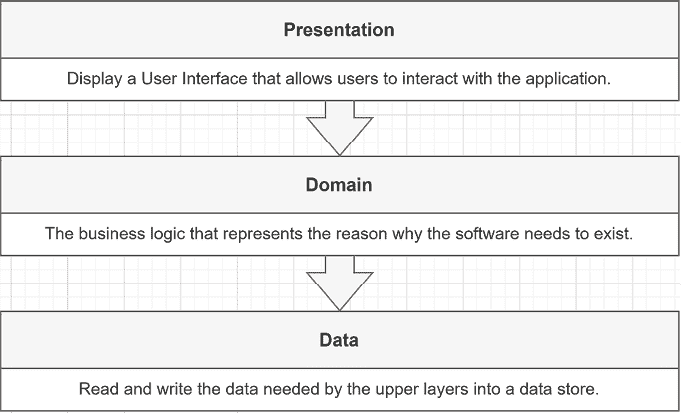

图 14.1：经典的分层应用设计

**表示层**代表用户可以与之交互以到达**领域**的任何用户界面。它可能是一个 ASP.NET Core Web 应用程序。从 WPF 到 WinForms 到 Android，任何东西都可以是一个有效的非 Web 表示层替代方案。**领域层**代表由业务规则驱动的核心逻辑；这解决了应用程序的问题。领域层也被称为**业务逻辑层**（**BLL**）。**数据层**代表数据与应用程序之间的桥梁。该层可以将数据存储在 SQL Server 数据库中、托管在云中的 NoSQL 数据库中、多个数据源混合或任何适合业务需求的东西。数据层也被称为**数据访问层**（**DAL**）和**持久层**。让我们跳到一个例子。假设用户已经通过认证和授权，当他们在使用这些三层构建的书店应用程序中创建一本书时，会发生以下情况：

1.  用户通过向服务器发送`GET`请求来请求页面。

1.  服务器处理那个`GET`请求（**表示层**），然后将其返回给用户。

1.  用户填写表单并向服务器发送`POST`请求。

1.  服务器处理`POST`请求（**表示层**），然后将其发送到**领域层**进行处理。

1.  **领域层**执行创建书籍所需的逻辑，然后告诉**数据层**持久化这些数据。

1.  展开到表示层后，服务器将返回适当的响应给用户，这很可能是包含书籍列表和表示操作成功的消息的页面。

按照经典分层架构，一个层只能与堆栈中的下一层通信——**表示层**与**领域层**通信，而**领域层**与**数据层**通信，依此类推。重要的是**每一层都必须是独立和隔离的，以限制紧密耦合**。在这个经典分层模型中，每一层应该拥有自己的**模型**。例如，表示层不应该将其**视图模型**发送到**领域层**；那里应该只使用**领域对象**。反之亦然：由于**领域层**将其自己的对象返回给**表示层**，因此**表示层**不应该将其泄露给消费者，而应该将所需的信息组织成**视图模型**或**DTO**。以下是一个视觉示例：

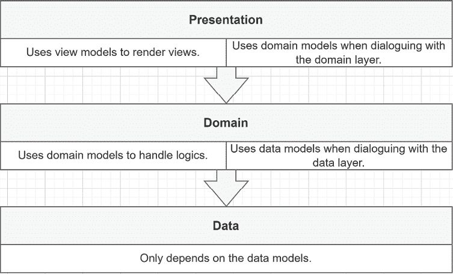

图 14.2：表示层之间相互作用的图示

即使三层可能是最受欢迎的层数，我们也可以创建我们需要的任何数量的层；我们并不局限于三层。让我们从优点开始，考察经典分层结构的优缺点：

+   了解层的目的是很容易理解的。例如，猜测数据层组件在某个地方读取或写入数据是很容易的。

+   它创建了一个围绕单一关注点构建的统一单元。例如，我们的**数据层**不应该渲染任何用户界面，而应坚持访问数据。

+   它允许我们将层与系统其余部分（其他层）解耦。你可以在对其他层知之甚少的情况下隔离并在该层内工作。例如，假设你被分配优化数据访问层中的查询任务。在这种情况下，你不需要了解最终将数据显示给用户的用户界面。你只需要专注于该元素，优化它，单独测试它，然后发布该层或重新部署应用程序。

+   就像任何其他隔离单元一样，应该能够重用层。例如，我们可以在需要查询相同数据库但用于不同目的的另一个应用程序中重用我们的**数据访问层**（一个不同的**领域层**）。

> **提示**
> 
> > 一些层在理论上比其他层更容易重用，可重用性可能增加或减少价值，具体取决于你正在构建的软件。我在实践中从未见过一个层被完整重用，我也很少听说或读到这样的情况——每次通常都以最终不太可重用的情况告终。
> > 
> > 根据我的经验，我强烈建议不要在不是精确规范且能为你的应用程序增加价值的情况下过度追求可重用性。限制你的过度工程化努力可以为你和你的雇主节省大量时间和金钱。我们不应忘记，我们的工作是交付价值。
> > 
> > 作为一项经验法则，做你需要做的事情，不要多做，但要做好。

好的，现在，让我们看看其缺点：

+   通过将软件水平拆分为层，每个功能都会跨越所有层。这通常会导致层之间的级联更改。例如，如果我们决定向我们的书店数据库添加一个字段，我们就需要更新数据库、访问它的代码（**数据层**）、业务逻辑（**领域层**）和用户界面（**表示层**）。在规格不稳定或预算有限的项目中，这可能会变得痛苦！

+   对于新手来说，实现全栈功能更具挑战性，因为它跨越了所有层。

+   使用分层通常会导致或是由人员之间的职责分离引起的。例如，数据库管理员管理数据层，后端开发者管理领域层，前端开发者管理表示层，导致协调和知识共享问题。

+   由于层直接依赖于其下的层，没有引入**抽象层**或从**表示层**引用较低层，依赖注入是不可能的。例如，如果**领域层**依赖于**数据层**，修改数据层将需要重写从**领域**到**数据**的所有耦合。

+   由于每个层都拥有自己的实体，你添加的层越多，实体的副本就越多，导致轻微的性能损失和更高的维护成本。例如，**表示层**将一个**DTO**复制到一个**领域对象**。然后，**领域层**将其复制到一个**数据对象**。最后，**数据层**将其转换为 SQL 以将其持久化到**数据库**（例如 SQL Server）。当从数据库读取时，情况也是相反的。

我们将在后面探讨一些克服这些缺点的方法。我强烈建议你不要做我们刚刚探讨的事情。这是一种过时、更基本的分层方式。我们在本章中正在探讨对这个分层系统的多个改进，所以请在得出结论之前继续阅读。我决定从分层开始探索，以防你不得不与那种类型的应用程序一起工作。此外，研究其时间顺序演变、修复一些缺陷和添加选项应该有助于你理解概念，而不仅仅是知道做事的一种方式。理解模式是软件架构的关键，而不仅仅是学习如何应用它们。

### 分割层

现在我们已经讨论了层，并将它们视为职责的大块水平切片，我们可以通过垂直分割这些大块来更细致地组织我们的应用程序，创建多个较小的层。这可以帮助我们按功能或边界上下文组织应用程序，也可能使我们能够使用相同的构建块组合各种用户界面，这将比重用巨大尺寸的层更容易。以下是这个想法的概念表示：


图 14.3：使用较小的部分共享层组织多个应用程序

我们可以将一个应用程序分割成多个功能（垂直分割）并将每个分割成层（水平分割）。根据之前的图，我们这样命名这些功能：

+   库存管理

+   在线购物

+   其他

因此，我们可以在不带来其他一切的情况下，将在线购物领域和数据层引入我们的购物 Web API。此外，我们还可以将在线购物领域层引入移动应用，并用另一个与 Web API 通信的数据层来替换它。我们还可以将我们的 Web API 作为一个简单的数据访问应用程序使用，同时在其上附加不同的逻辑，而保持购物数据层在下面。我们最终可能会得到以下重新组合的应用程序（这只是可能的结果之一）：


图 14.4：使用较小的部分共享层组织多个应用程序

这些只是我们可以在概念上用层做的事情的例子。然而，最重要的不是图是如何布局的，而是你正在构建的应用程序的规范。只有那些规范和良好的分析才能帮助你为那个特定问题创建最佳可能的设计。我在这里使用了一个假设的购物例子，但它可以是任何东西。将巨大的水平切片垂直分割使得每个部分更容易重用和共享。这种改进可以产生有趣的结果，特别是如果你有多个前端应用程序或计划迁移离开单体。 

> **单体应用**（或单体）是一个以单个集成块部署的程序，具有低模块化。单体可以采用层或不需要层。人们经常将单体应用与微服务应用进行比较，因为它们是相反的。我们在第十九章“微服务架构简介”中探讨了微服务，在第二十章“模块化单体”中探讨了单体。

### 层与层与组件

到目前为止，在本章中，我们一直在谈论层，而没有谈论将它们转化为代码。在深入这个主题之前，我想讨论一下**层**。你可能之前在某个地方见过**三层架构**这个术语，或者听到人们谈论**层**和**层**，可能在同一语境中将它们作为同义词互换。然而，它们并不相同。简而言之：

+   **层**是**物理的**

+   **层**是**逻辑的**

#### 什么是层级？

我们可以将每个**层**部署在其自己的机器上。例如，你可以有一个数据库服务器，一个托管你的 Web API 的服务器，其中包含业务逻辑（**领域**），以及另一个服务器，它托管一个 Angular 应用程序（**表示**）；这些是三个层（三个不同的机器），每个**层**都可以独立扩展。我们接下来看看层。

#### 什么是层？

另一方面，每个**层**只是代码的逻辑组织，关注点以分层的方式组织和划分。例如，你可以在 Visual Studio 中创建一个或多个项目，并将你的代码组织成三层。例如，一个 Razor Pages 应用程序依赖于一个业务逻辑层，该层依赖于一个数据访问层。当你部署该应用程序时，所有这些层，包括数据库，都部署在同一台服务器上。这将是一个层级和三个层。当然，如今，你可能在某个地方有一个云数据库，这将为该架构增加第二个层级：应用程序层（其中仍然有三个层）和数据库层。现在我们已经讨论了**层**和**层**，让我们看看**层**与**组件**之间的区别。

#### 什么是组件？

**组件**通常被编译成`.dll`或`.exe`文件；你可以直接编译和消费它们。在大多数情况下，Visual Studio 解决方案中的每个项目都会被编译成一个组件。你还可以将它们作为 NuGet 包部署，并从[nuget.org](https://www.nuget.org)或你选择的自定义 NuGet 仓库中消费。但是，层与组件或层与层之间没有一对一的关系；组件只是可消费的编译代码单元：一个库或一个程序。此外，你不需要将你的层分割成不同的组件；你可以让三个层都驻留在同一个组件中。这样可能会更容易产生不希望的耦合，因为所有代码都在同一个项目中，但只要有一些严谨性、规则和约定，这也是一个可行的选项。将每个层移动到组件中并不一定能够提高应用程序；每个层或组件内部的代码可能会变得混乱，并与系统的其他部分耦合。请别误会我的意思：你可以为每个层创建一个组件；我甚至在大多数情况下鼓励你这样做，但这并不意味着层之间没有紧密耦合。层只是一个逻辑组织单元，因此每个贡献者的责任是确保层的代码保持健康。此外，拥有多个组件让我们可以将它们部署到一台或多台机器上，可能是不同的机器，从而形成多个层。现在，让我们看看最常见层的职责。

## 常见层的职责

在本节中，我们将更深入地探讨最常用的层。我们不会对每一层都进行深入挖掘，但概述应该能帮助你理解分层背后的基本思想。

### 展示

**展示层**可能是最容易理解的一层，因为它是我们唯一能看到的部分：用户界面。然而，在 REST、OData、GraphQL 或其他类型的网络服务的情况下，展示层也可以是数据合约。展示层是用户用来访问你的程序的部分。例如，一个命令行界面（CLI）程序也可以是一个展示层。你可以在终端中输入命令，CLI 会将它们分发给其领域层，执行所需的企业逻辑。保持展示层可维护的关键是尽可能地将它集中在显示用户界面，尽可能少地包含业务逻辑。接下来，我们将查看**领域层**，看看这些调用会去哪里。

### 域

**领域层**是软件价值所在之处，也是大部分复杂性的集中地。**领域层**是业务逻辑规则的家。相比于**用户界面**，**领域层**更容易销售，因为用户通过表现层连接到领域。然而，重要的是要记住，领域负责解决问题和自动化解决方案；**表现层**仅将用户的操作链接到**领域**。我们通常围绕领域模型构建领域层。对此有两种宏观观点：

+   使用**丰富模型**。

+   使用**贫血模型**。

> 你可以利用**领域驱动设计**（**DDD**）来构建该模型及其周围的程序。DDD 与丰富模型相辅相成，一个精心设计的模型应该简化程序的维护。进行 DDD 不是强制性的，即使没有它，你也可以达到所需的正确性水平。

另一个困境是将领域模型直接持久化到数据库或使用中间数据模型。我们将在*数据*部分更详细地讨论这一点。同时，我们来看看思考领域模型的两种主要方式，从丰富的领域模型开始。

#### 丰富的领域模型

一个丰富的领域模型在“最纯粹”的意义上更面向对象，并将领域逻辑封装为模型内部方法的一部分。例如，以下类代表了一个只包含几个属性的`Product`类的丰富版本：

```cs
public class Product
{
    public Product(string name, int quantityInStock, int? id = null)
    {
        Name = name ?? throw new ArgumentNullException(nameof(name));
        QuantityInStock = quantityInStock;
        Id = id;
    }
    public int? Id { get; init; }
    public string Name { get; init; }
    public int QuantityInStock { get; private set; }
    public void AddStock(int amount)
    {
        if (amount == 0) { return; }
        if (amount < 0) { 
            throw new NegativeValueException(amount);
        }
        QuantityInStock += amount;
    }
    public void RemoveStock(int amount)
    {
        if (amount == 0) { return; }
        if (amount < 0) { 
            throw new NegativeValueException(amount);
        }
        if (amount > QuantityInStock) { 
            throw new NotEnoughStockException(
                QuantityInStock, amount); 
        }
        QuantityInStock -= amount;
    }
}
```

`AddStock` 和 `RemoveStock` 方法代表了产品库存中添加和移除库存的领域逻辑。当然，在这种情况下，我们只增加和减少属性值，但在更复杂的模型中，概念是相同的。这种方法的最大的优点是大多数逻辑都内置到模型中，使得模型非常以领域为中心，操作通过模型实体作为方法来实现。此外，它触及了面向对象设计的基本思想，即行为应该是对象的一部分，使它们成为现实生活对应物的虚拟表示。最大的缺点是单个类承担了过多的责任。即使面向对象设计告诉我们将逻辑放入对象中，这并不意味着这总是好主意。如果你的系统对灵活性很重要，将逻辑硬编码到领域模型中可能会阻碍你在不更改代码本身的情况下（尽管仍然可以做到）演变业务规则的能力。如果你的领域是固定和预定义的，丰富的模型可能是你项目的良好选择。这种方法的相对缺点是，将依赖注入到领域模型比其他对象（如服务）更困难。这种缺点减少了灵活性，并增加了创建模型的复杂性。如果你正在构建一个状态型应用程序，其中领域模型可以在内存中比 HTTP 请求的时间更长地存在，丰富的领域模型可能是有用的。其他模式可以帮助你做到这一点，例如**模型-视图-视图-模型**（**MVVM**）、模型-视图-演示者（MVP）和**模型-视图-更新**（**MVU**）。如果你认为你的应用程序从保持数据和逻辑在一起中受益，那么丰富的领域模型可能是你项目的最佳选择。如果你在实践领域驱动设计（DDD），我可能不需要告诉你丰富的模型是正确的方向。如果没有 DDD 的概念，实现可维护和灵活的丰富模型是具有挑战性的。如果你的程序围绕复杂的领域模型构建，并直接使用**对象关系映射器**（**ORM**）将这些类持久化到数据库中，丰富的模型可能是一个好的选择。使用 Cosmos DB、Firebase、MongoDB 或任何其他文档数据库可以使将复杂模型作为单个文档存储比作为表集合更容易（这也适用于贫血型模型）。正如你可能已经注意到的，本节中有许多“如果”，因为我认为没有绝对的答案来决定丰富的模型是否更好，这更多是一个问题，即它是否比整体更好，是否更适合你的具体情况。你还需要考虑你个人的偏好和技能。经验很可能是你最好的盟友，所以我建议编写、编写和编写更多的应用程序来获得那种经验。

#### 贫血型领域模型

一个贫血的领域模型通常不包含方法，而只有获取器和设置器。这样的模型不应包含业务逻辑规则。我们之前提到的`Product`类将看起来像这样：

```cs
public class Product
{
    public int? Id { get; set; }
    public required string Name { get; set; }
    public int QuantityInStock { get; set; }
}
```

在前面的代码中，类中不再有任何方法，只剩下三个具有公共设置器的属性。我们还可以利用记录类来为组合添加不可变性。至于逻辑，我们必须将其移动到其他类中。一种模式是将逻辑移动到**服务层**。在这样一个**贫血模型**之前的服务层将接受输入，修改领域对象，并更新数据库。区别在于服务拥有逻辑而不是丰富的模型。使用贫血模型，将操作与数据分离可以帮助我们为系统增加灵活性。然而，由于外部参与者（服务）正在修改模型而不是模型自我管理，因此强制执行模型在任何给定时间的状态可能具有挑战性。将逻辑封装到更小的单元中使得管理每个单元更容易，并且将那些依赖项注入服务类比注入实体本身更容易。拥有更多更小的代码单元可以使系统对新手来说更加可怕，因为它有更多的移动部件。另一方面，如果系统是围绕良好定义的抽象构建的，那么单独测试每个单元可能更容易。然而，测试可能相当不同。在我们的丰富模型的情况下，我们分别测试规则和持久性。我们称之为**持久性无知**，这允许我们单独测试业务规则。然后我们可以创建集成测试来覆盖服务层的持久性方面，以及更多针对数据和领域级别的单元和集成测试。使用贫血模型，我们使用服务层级别的集成测试同时测试业务规则和持久性，或者在单元测试中仅测试业务规则，同时模拟持久性部分。由于模型只是一个没有逻辑的数据包，因此那里没有什么可以测试的。总的来说，如果遵循相同的严格领域分析过程，由服务层支持的贫血模型的业务规则应该与丰富的领域模型一样复杂。最大的区别应该在于方法位于哪个类中。贫血模型是适用于无状态系统，如 RESTful API 的好选择。由于你必须为每个请求重新创建模型的状态，因此贫血模型可以为你提供一种独立地重新创建模型较小部分的方法，这些较小的类针对每个用例进行了优化。无状态系统需要比纯面向对象方法更程序化的思维方式，这使得贫血模型成为该领域的绝佳候选者。

> 我个人非常喜欢服务层背后的贫血模型，但有些人可能不同意我的看法。我建议选择你认为最适合你正在构建的系统的方法，而不是基于别人在另一个系统中做的事情来做某事。
> 
> > 另一个不错的建议是让重构流程从上到下流动到正确的位置。例如，如果你觉得一个方法绑定到一个实体上，没有什么阻止你将那部分逻辑移动到该实体而不是服务类中。如果服务更合适，就将逻辑移动到服务类中。

接下来，让我们回到**领域层**，并探讨多年来出现的一种模式，即使用**服务层**来保护**领域模型**，将**领域层**分为两个不同的部分。

#### 服务层

**服务层**保护领域模型并封装领域逻辑。服务层协调与模型或外部资源（如数据库）交互的复杂性。然后，多个组件可以使用服务层，同时对其模型了解有限：

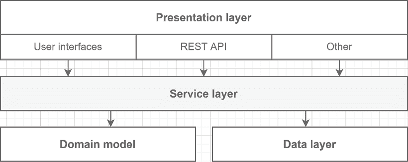

图 14.5：服务层与其他层的关系

前面的图示显示，表示层与服务层进行通信，服务层负责管理领域模型并实现业务逻辑。**服务层**包含服务，这些是与其他**领域对象**（如**领域模型**和**数据层**）交互的类。我们可以进一步将服务分为两类，**领域服务**和**应用服务**：

+   **领域服务**是我们之前所讨论的服务。它们包含领域逻辑，并允许表示层的消费者读取或写入数据。它们访问和修改领域模型。

+   **应用服务**，如邮件服务，与领域无关，应该放在其他地方，比如在共享的（为什么要在每个项目中重写邮件服务，对吧？）。

与其他层一样，你的服务层可以公开其自己的模型，保护其消费者免受领域模型（内部）变化的影响。换句话说，服务层应该只公开其契约和接口（关键词：保护）。**服务层是一种外观模式**。

> 我们将进一步探讨将贫血类复制到其他贫血类中的最小化方法。

有许多方式可以解释这一层，我将尝试以浓缩的方式尽可能多地展示（从简单到复杂）：

+   服务层的类和接口可以是领域层组件的一部分，例如在*Services*目录中创建。这不太可重用，但它为未来共享服务铺平了道路，而无需最初管理多个项目。它需要严谨，不要依赖于你不应该依赖的东西。

+   服务层可以是一个包含接口和实现的组件。这在可重用性和维护时间之间是一个很好的折衷方案。很可能你永远不会需要两个实现（参见下一点），因为服务与逻辑相关联；它们是领域。你甚至可以隐藏实现，就像我们在第十一章的*结构模式*中做的**不透明外观**一样。

+   服务层可以被分为两个组件——一个包含抽象（由消费者引用）和一个包含实现。

+   服务层可以是实际的 Web 服务层（例如 Web API）。

当编写服务代码时，按照惯例，人们通常在服务类后缀加上`Service`，例如`ProductService`和`InventoryService`；接口也是如此（`IProductService`和`IInventoryService`）。无论你选择哪种技术，记住服务层包含领域逻辑，并保护领域模型免受直接访问。服务层是一个惊人的补充，它保护并封装了操作贫血领域模型的逻辑。如果它只是一个传递，那么它可能会违背丰富领域模型的目的，但它可以非常有助于处理影响多个领域对象的复杂、非原子业务规则。是否添加服务层的主要决定因素与您项目领域的复杂性相关。越复杂，就越有意义。越简单，就越没有意义。以下是一些建议：

+   在使用贫血模型时，添加一个服务层。

+   为非常复杂的领域添加服务层。

+   不要为低复杂度领域或*数据库外观*应用添加服务层。

现在，让我们看看数据层。

### 数据

**数据层**是持久化代码所在的地方。在大多数程序中，我们需要某种持久化来存储我们的应用程序数据，这通常是数据库。在讨论数据层时，会想到几种模式，包括**工作单元**和**存储库模式**，这些模式非常常见。我们在本小节的末尾简要介绍了这两个模式。我们可以直接持久化我们的**领域模型**，或者创建一个更适合存储的**数据模型**。例如，多对多关系在面向对象的世界中不是一件事情，而从关系数据库的角度来看则是。你可以将**数据模型**看作是数据的**DTO**。**数据模型**是数据在您的数据存储中的存储方式；也就是说，您如何建模数据或您必须忍受什么。在一个经典的分层项目中，您别无选择，只能有一个数据模型。然而，随着我们继续探索更多选项，我们将探索更好的解决方案。

> **ORM** 是一种将对象转换为数据库语言（如 SQL）的软件。它允许修改数据、查询数据、将数据加载到对象中，等等。

现代数据层通常利用一个 **ORM**（对象关系映射）如 **Entity Framework Core**（**EF Core**），它为我们做了大部分工作，使我们的生活变得更简单。在 **EF Core** 的情况下，它允许我们在多个提供者之间进行选择，从 SQL Server 到 Cosmos DB，再到内存提供者。EF Core 的好处在于它已经为我们实现了 **工作单元** 和 **仓储** 模式，以及其他一些功能。在书中，我们使用内存提供者来减少设置时间并运行集成测试。

> 如果你之前使用过 EF6 并且对 Entity Framework 感到恐惧，要知道 EF Core 更轻量级、更快，并且更容易测试。不妨再试一次。EF Core 的性能现在也非常高。然而，如果你想要完全控制你的 SQL 代码，可以寻找 Dapper（不要与 **Dapr** 混淆）。

我不想对这些模式进行过多细节的介绍，但它们的重要性足以值得一个概述。正如所提到的，EF Core 已经实现了这些模式，所以我们不必处理它们。此外，使用这些模式并不总是可取的，可能难以正确实现，并且可能导致数据访问层臃肿，但使用得当的话，它们也可以非常有用。

> 我已经写了一系列关于仓储模式的文章。请参阅 *进一步阅读* 部分。

在此期间，让我们至少研究一下它们的目标，以便了解它们的作用，如果出现需要编写此类组件的情况，你知道该往哪里寻找。

#### 仓储模式

仓储模式的目标是允许消费者以面向对象的方式查询数据库。通常，这意味着缓存对象和动态过滤数据。EF Core 通过 `DbSet<T>` 来表示这个概念，并使用 LINQ 和 `IQueryable<T>` 接口提供动态过滤。人们也使用术语 **repository** 来表示 **表数据网关模式**，这是另一种模式，它模拟一个类，为我们提供访问数据库中单个表的方法，并提供对创建、更新、删除和从该数据库表获取实体的操作。这两种模式都来自 *企业应用架构模式*，并且被广泛使用。自制的自定义实现通常比仓储模式更多地遵循表数据网关模式。它们基于一个看起来像以下代码的接口，并包含创建、更新、删除和读取实体的方法。它们可以有一个基类实体或没有，在这种情况下，`IEntity<TId>`。`Id` 属性也可以是泛型或非泛型：

```cs
public interface IRepository<T, TId>
    where T : class, IEntity<TId>
{
    Task<IEnumerable<T>> AllAsync(CancellationToken cancellationToken);
    Task<T?> GetByIdAsync(TId id, CancellationToken cancellationToken);
    Task<T> CreateAsync(T entity, CancellationToken cancellationToken);
    Task UpdateAsync(T entity, CancellationToken cancellationToken);
    Task DeleteAsync(TId id, CancellationToken cancellationToken);
}
public interface IEntity<TId>
{
    TId Id { get; }
}
```

与那些表数据网关相关的一个常见问题是，人们会在接口中添加一个保存方法。只要更新单个实体，这应该没问题。然而，这使得跨多个仓库的事务管理更加困难或依赖于底层实现（破坏抽象）。为了提交或回滚这样的事务，我们可以利用工作单元模式，将保存方法从表数据网关移动到那里。例如，当使用 EF Core 时，我们可以使用`DbSet<Product>`（`db.Products`属性）将新产品添加到数据库，如下所示：

```cs
db.Products.Add(new Data.Product
{
    Id = 1,
    Name = "Banana",
    QuantityInStock = 50
});
```

对于查询部分，找到单个产品最简单的方法是像这样使用它：

```cs
var product = _db.Products.Find(productId);
```

然而，我们可以使用 LINQ 来代替：

```cs
_db.Products.Single(x => x.Id == productId);
```

这些是一个**仓库**应该提供的一些查询功能。EF Core 无缝地将 LINQ 转换为配置的提供者期望的 SQL，增加了扩展的过滤能力。当然，使用 EF Core，我们可以查询项目集合，获取所有产品并将它们投影为域对象，如下所示：

```cs
_db.Products.Select(p => new Domain.Product
{
    Id = p.Id,
    Name = p.Name,
    QuantityInStock = p.QuantityInStock
});
```

我们在这里也可以使用 LINQ 进行进一步筛选；例如，通过查询所有缺货的产品：

```cs
var outOfStockProducts = _db.Products
    .Where(p => p.QuantityInStock == 0);
```

我们也可以允许一定的错误范围，如下所示：

```cs
var mostLikelyOutOfStockProducts = _db.Products
    .Where(p => p.QuantityInStock < 3);
```

我们现在简要探讨了如何使用 EF Core 的 Repository 模式实现，`DbSet<T>`。这些例子可能看起来微不足道，但要实现与 EF Core 功能相媲美的自定义仓库需要相当大的努力。EF Core 的工作单元，`DbContext`类，包含了*保存*方法来持久化对其所有`DbSet<T>`属性（仓库）所做的修改。自制的实现通常在仓库本身上具有这样的方法，这使得跨仓库事务的处理更加困难，并导致仓库膨胀，包含大量针对特定操作的方法来处理这些情况。现在我们理解了**Repository 模式**背后的概念，让我们在回到分层之前，先概述一下**工作单元模式**。

#### 工作单元模式

**工作单元**跟踪事务的对象表示。换句话说，它管理一个注册表，记录应该创建、更新和删除的对象。它允许我们在单个事务中组合多个更改（一个数据库调用），相对于每次更改都调用数据库，提供了多个优势。假设我们使用的是关系数据库，这里有两个优势：

+   首先，它可以加快数据访问速度；调用数据库是慢的，所以限制调用和连接的数量可以提高性能。

+   第二，运行事务而不是单个操作允许我们在一个操作失败时回滚所有操作，或者在所有操作都成功时提交整个事务。

EF Core 使用`DbContext`类及其底层类型（如`DatabaseFacade`和`ChangeTracker`类）实现此模式。我们的小型应用程序不需要事务，但概念是相同的。以下是一个使用 EF Core 发生的情况的示例：

```cs
var product = _db.Products.Find(productId);
product.QuantityInStock += amount;
_db.SaveChanges();
```

上述代码执行以下操作：

1.  查询数据库以获取单个实体。

1.  更改了`QuantityInStock`属性的值。

1.  将更改持久回数据库。

实际上发生的情况更接近以下内容：

1.  我们通过`ProductContext`（一个单位工作）请求 EF Core 的单个实体，它公开了`DbSet<Product>`属性（产品仓库）。在底层，EF Core 执行以下操作：

    1.  查询数据库。

    1.  缓存实体。

    1.  跟踪该实体的更改。

    1.  将其返回给我们。

1.  我们更改了`QuantityInStock`属性的值；EF Core 检测到变化并将对象标记为*脏的*。

1.  我们告诉单位工作持久化它跟踪的更改，将*脏产品*保存回数据库。

在更复杂的场景中，我们可能会编写以下代码：

```cs
_db.Products.Add(newProduct);
_db.Products.Remove(productToDelete);
product.Name = "New product name";
_db.SaveChanges();
```

在这里，`SaveChanges()`方法触发保存三个操作，而不是单独发送它们。你可以使用`DbContext`的`Database`属性来控制数据库事务（有关更多信息，请参阅*进一步阅读*部分）。现在我们已经探讨了**单位工作**模式，我们可以自己实现它。这会给我们的应用程序增加价值吗？可能不会。如果你想构建自定义的**单位工作**或 EF Core 的包装器，有许多现有资源可以指导你。除非你想进行实验或需要自定义的**单位工作**和**仓库**（这是可能的），否则我建议远离这样做。记住：**只做程序正确运行所需的事情**。

> 当我说*只做需要做的事情*时，请不要误解；无序的工程尝试和实验是探索的好方法，我鼓励你这样做。然而，我建议并行进行，这样你就可以创新，学习，甚至可能将知识迁移到你的应用程序中，而不是浪费时间并破坏事物。如果你使用 Git，创建一个实验分支是一个很好的方法。然后，如果你的实验没有成功，你可以删除它，如果它产生了积极的结果，你可以合并分支，或者根据团队的现有政策将其保留为参考。

现在我们已经探讨了仓库和单位工作模式的高级视图以及这些常见层的作用，我们可以继续我们的分层使用之旅。

## 抽象层

本节通过使用抽象数据层实现来探讨抽象层。这种抽象方式非常有用，并且是向**整洁架构**迈进的一步。此外，你几乎可以用这种方式抽象任何事物，这不过是应用**依赖倒置原则**（**DIP**）。让我们从一些背景信息和问题开始：

+   **领域层**是逻辑所在的地方。

+   **UI**将用户链接到**领域**，暴露了该**领域**中内置的功能。

+   **数据层**应该是**领域**盲目使用的实现细节。

+   **数据层**包含知道数据存储位置的代码，这应该与**领域**无关，但**领域**直接依赖于它。

解决**领域**和**数据持久化实现**之间紧密耦合的方案是创建一个额外的抽象层，如下面的图中所示：

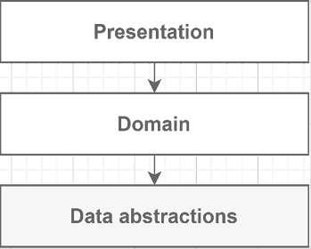

图 14.6：用数据（持久化）抽象层替换数据层

新规则：**只有接口和数据模型类进入数据抽象层**。这个新层现在定义了我们的数据访问 API，除了暴露一系列接口——合同。然后，**我们可以根据这个抽象层合同创建一个或多个数据实现**，例如使用 EF Core。抽象和实现之间的链接是通过依赖注入完成的。在**组合根**中定义的绑定解释了表示层和数据实现之间的间接连接。新的依赖树看起来像这样：


图 14.7：层之间的关系

**表示层**引用**数据实现层**的唯一目的是创建 DI 绑定。我们需要这些绑定来在创建**领域**类时注入正确的实现。此外，**表示层不得使用数据层的抽象或实现**。我创建了一个示例项目，展示了项目与类之间的关系。然而，那个项目会增加许多代码页面，所以我决定不在书中包含它。关于抽象层最重要的东西是层之间的依赖流，而不是代码本身。

> 项目可在 GitHub 上找到（[`adpg.link/s9HX`](https://adpg.link/s9HX)）。

在那个项目中，当消费者请求实现`IProductRepository`接口的对象时，程序会注入`EF.ProductRepository`类的实例。在这种情况下，消费类是`ProductService`，并且只依赖于`IProductRepository`接口。`ProductService`类本身并不知道实现细节：它只利用接口。对于只知道`IProductService`接口的程序加载`ProductService`类的情况也是一样。以下是该依赖树的视觉表示：

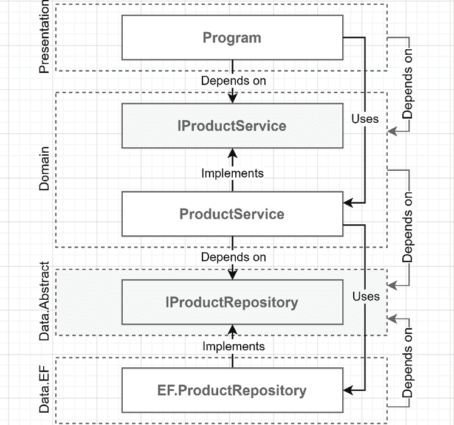

图 14.8：层、类和接口之间的依赖流

在前面的图中，看看依赖是如何汇聚到`Data.Abstract`层的。依赖树最终结束在那个抽象数据层。应用这一块架构理论，我们通过遵循**DIP**（依赖倒置原则）来反转数据层的依赖流。我们还切断了直接对 EF Core 的依赖，这使得我们可以实现新的数据层并替换它，而不会影响应用程序的其他部分或更新实现而不影响领域。正如我之前提到的，层之间的替换不应该经常发生，如果可能的话。尽管如此，这是分层演变的一个重要部分，更重要的是，我们可以将这项技术应用于任何层或项目，而不仅仅是数据层，因此理解如何反转依赖流是至关重要的。

> 要测试 API，您可以使用书中提供的 Postman 集合；访问[`adpg.link/postman8`](https://adpg.link/postman8)或 GitHub ([`adpg.link/net8`](https://adpg.link/net8)) 获取更多信息。

接下来，让我们探索共享和持久化丰富的领域模型。

## 共享模型

我们已经探讨了严格的分层以及如何应用 DIP，但我们仍然有多个模型。从一层复制模型到另一层的替代方案是在多个层之间共享一个模型，通常作为一个组件。从视觉上看，它看起来像这样：

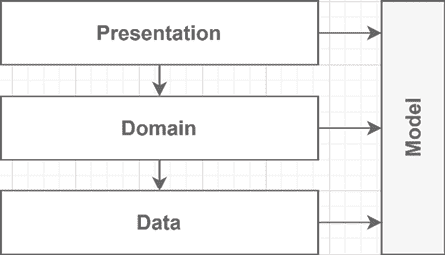

图 14.9：在所有三层之间共享模型

任何事物都有利弊，所以无论这能为您节省多少时间，随着项目的推进和复杂化，它最终会回来困扰您，并成为痛点。假设您认为共享模型对您的应用程序来说是值得的，那么我建议在表示层使用**视图模型**或**DTOs**（数据传输对象）来控制并保持应用程序的输入和输出与模型松散耦合。这种方式保护底层的方式可以表示如下：


图 14.10：在领域和数据层之间共享模型

通过这样做，你最初可以通过在领域和数据层之间共享模型来节省一些时间。通过将共享模型隐藏在表示层之下，你可以在长期运行中避免许多问题，这使得在质量和开发时间之间达到一个良好的折衷。此外，由于你的表示层保护了你的应用程序免受外部世界的影响，你可以重构其他层而不会影响消费者。

> 这基本上是 Clean Architecture 所做的方式，但表示不同。使用它，模型位于应用程序的中心，并被操作和持久化。虽然层的名称不同，但概念仍然非常相似。关于这一点，稍后还会详细介绍。

**视图模型**和**DTOs**是成功程序和开发者理智的关键元素；它们应该为长期项目节省许多麻烦。我们将在*第十六章*，*中介者和 CQRS 设计模式*中重新审视并探讨控制输入和输出的概念，其中输入成为**命令**和**查询**。同时，让我们将这个概念与抽象层合并。在前一个项目中，**数据抽象层**拥有**数据模型**，而**领域层**拥有**领域模型**。在这个架构替代方案中，我们在两个层之间共享模型。表示层可以间接使用这个共享模型与领域层进行对话，而不将其暴露在外部。目标是直接持久化**领域模型**，并跳过从**领域**到**数据层**的复制，同时拥有那个打破领域逻辑和持久性之间紧密耦合的数据抽象层。以下是这种表示的视觉表示：

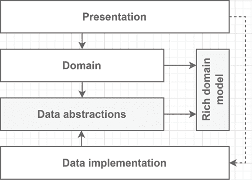

图 14.11：表示共享丰富模型的图

它非常适合**丰富模型**，但我们也可以为贫血模型做这件事。在**丰富领域模型**中，你将重建模型的工作委托给 ORM，并立即开始调用其方法。ORM 也会重建贫血模型，但这些类仅包含数据，因此你需要调用其他包含操作这些对象的逻辑的软件部分。在代码示例中，**数据抽象层**现在只包含数据访问抽象，如存储库，并引用现在作为持久化模型的新的`Model`项目。从概念上讲，它清理了一些事情：

+   数据抽象层的唯一责任是包含数据访问抽象。

+   领域层的唯一责任是实现领域服务和不属于该丰富模型的逻辑。

+   在贫血模型的情况下，领域层的责任将是封装所有的领域逻辑。

+   `Model`项目包含实体。

再次提醒，我这里省略了大部分代码，因为它与整体概念无关。如果您认为阅读代码会有帮助，可以查阅并探索 GitHub 上的示例（[`adpg.link/9F5C`](https://adpg.link/9F5C)）。使用 IDE 浏览代码应该有助于您理解流程，并且与抽象层一样，项目、类和接口之间的依赖关系是关键。尽管如此，这里还是展示了使用该共享模型的 `StockService` 类，以便您可以查看一些与解释直接相关的代码：

```cs
namespace Domain.Services;
public class StockService : IStockService
{
    private readonly IProductRepository _repository;
    public StockService(IProductRepository repository)
    {
        _repository = repository ?? throw new ArgumentNullException(nameof(repository));
    }
```

在前面的代码中，我们注入了我们在接下来的两个方法中使用的 `IProductRepository` 接口的实现。接下来，我们看看 `AddStockAsync` 方法：

```cs
 public async Task<int> AddStockAsync(int productId, int amount, CancellationToken cancellationToken)
    {
        var product = await _repository.FindByIdAsync(productId, cancellationToken);
        if (product == null)
        {
            throw new ProductNotFoundException(productId);
        }
        product.AddStock(amount);
        await _repository.UpdateAsync(product, cancellationToken);
        return product.QuantityInStock;
    }
```

前面的代码中开始变得有趣，它执行以下操作：

+   仓库重新创建了包含逻辑的产品（模型）。

+   它验证产品是否存在。

+   它使用该模型并调用 `AddStock` 方法（封装的领域逻辑）。

+   它告诉仓库更新产品。

+   它将更新后的产品的 `QuantityInStock` 返回给服务的消费者。

接下来，我们探索 `RemoveStockAsync` 方法：

```cs
 public async Task<int> RemoveStockAsync(int productId, int amount, CancellationToken cancellationToken)
    {
        var product = await _repository.FindByIdAsync(productId, cancellationToken);
        if (product == null)
        {
            throw new ProductNotFoundException(productId);
        }
        product.RemoveStock(amount);
        await _repository.UpdateAsync(product, cancellationToken);
        return product.QuantityInStock;
    }
}
```

我们将 `AddStock` 方法的相同逻辑应用于 `RemoveStock` 方法，但它调用 `Product.RemoveStock` 方法。从 `StockService` 类中，我们可以看到服务控制对领域模型（产品）的访问，通过抽象数据层获取和更新模型，通过调用其方法来操作模型，并返回领域数据（在这种情况下是一个 `int`，但可能是一个对象）。

> 这种设计可以是非常有帮助的，也可以是不受欢迎的。过多的项目依赖于并暴露共享模型可能会导致模型的一部分泄露给消费者，例如暴露不应暴露的属性，暴露整个领域模型作为输出，或者最糟糕的是，将其作为输入并打开可利用的漏洞和意外的错误。
> 
> > 请注意，不要将共享模型暴露给表示层消费者。

将逻辑推入模型并不总是可能或理想的，这就是为什么我们要探索多种类型的领域模型和共享它们的方式。做出良好的设计通常关于选择和决定每个场景使用哪种选项。在灵活性和健壮性之间也需要做出权衡。其余的代码与抽象层项目类似。您可以自由地探索源代码（[`adpg.link/9F5C`](https://adpg.link/9F5C)）并将其与其他项目进行比较。最好的学习方法是实践，所以请玩转这些示例，添加功能，更新当前功能，删除内容，甚至构建您自己的项目。理解这些概念将帮助您将它们应用于不同的场景，有时会创建出人意料的但效率很高的结构。现在，让我们看看分层结构的最终演变：清洁架构。

## 清洁架构

现在我们已经讨论了许多分层方法，是时候将它们结合成**清洁架构**，也称为六边形架构、洋葱架构、端口和适配器等。清洁架构是层的一个进化，是组织层之间关系的一种方式，但与我们刚刚构建的非常相似。清洁架构建议用**UI**、**核心**和**基础设施**来代替展示、领域和数据（或持久化）。正如我们之前看到的，我们可以设计一个包含抽象或实现的层。当实现只依赖于抽象时，这就反转了依赖流。清洁架构强调这样的层，但有自己的组织指导。我们还探讨了将层分割成更小层（或多个项目）的理论概念，从而创建了更容易移植和重用的“破碎层”。清洁架构在基础设施层级别利用了这一概念。关于它的观点和变体可能和它的名称一样多，所以我会尽量保持普遍性，同时保留其本质。通过这样做，如果你对这种架构感兴趣，你可以选择一个资源，按照你喜欢的风格深入挖掘。让我们看看一个类似于我们在网上可以找到的图：

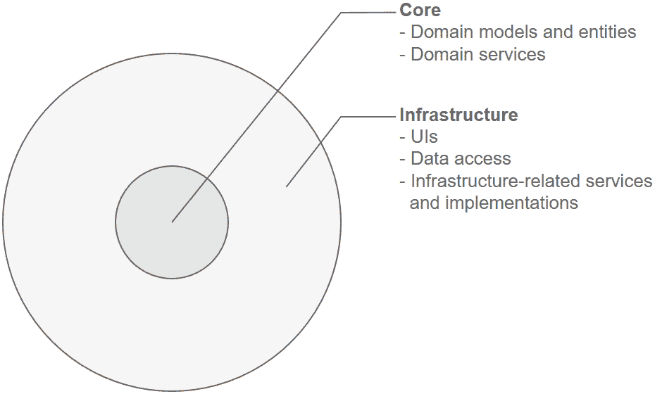

图 14.12：表示最基本清洁架构布局的图

从类似分层图的视角来看，前面的图可能看起来是这样的：


图 14.13：先前清洁架构图的两层视图

根据你选择的方法，你可以将这些层分割成多个其他子层。我们经常看到的一种做法是将**核心**层分割成**实体**和**用例**，如下所示：

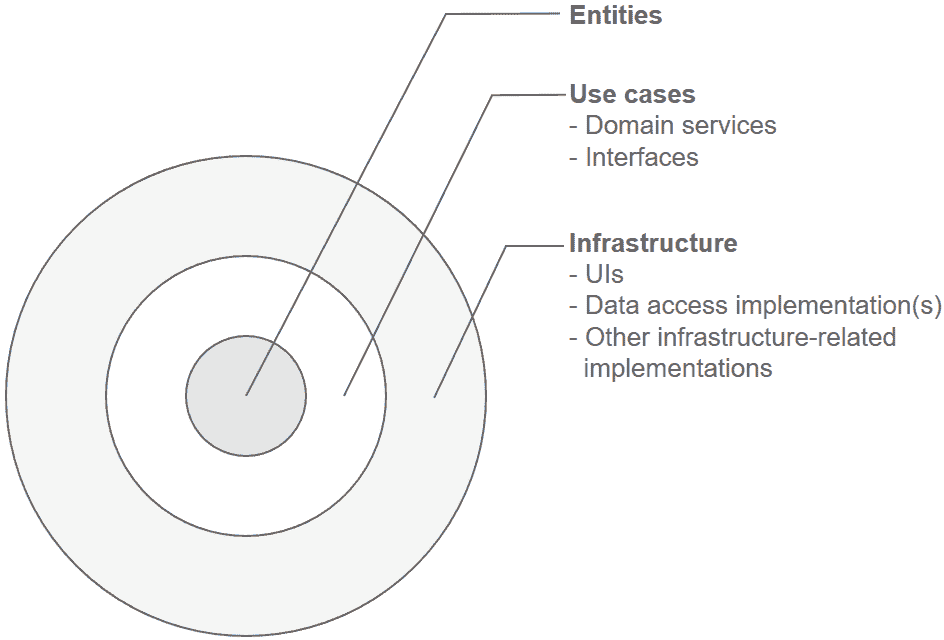

图 14.14：广泛应用的清洁架构布局图

由于科技行业的人富有创造力，许多事物都有很多名称，但概念保持不变。从类似分层图的视角来看，那个图可能看起来是这样的：

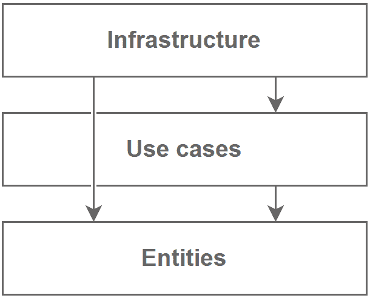

图 14.15：先前清洁架构图的类似层视图

基础设施层是概念性的，可以代表多个项目，例如包含 EF Core 实现的基础设施组件和一个代表 Web UI 的网站项目。我们还可以将更多项目添加到基础设施层。Clean Architecture 的依赖规则指出，依赖只能指向内层，即从外层到内层。这意味着抽象位于内部，具体实现位于外部。根据前面的层状图，内部对应向下。这意味着一个层可以使用任何直接或间接的依赖，这意味着基础设施可以依赖于用例和实体。Clean Architecture 遵循自本书开始以来我们一直在讨论的所有原则，例如使用抽象解耦我们的实现、依赖反转和关注点分离。这些实现通过依赖注入粘合在抽象之上（这不是强制性的，但有助于）。我总是觉得那些圆形图有点令人困惑，所以这里是我对更新后的、更线性的图示的看法：


图 14.16：Clean Architecture 常见元素的两层视图

现在，让我们使用 Clean Architecture 重新审视我们的分层应用程序，从**核心层**开始。核心项目包含领域模型、用例（服务）以及满足这些用例所需的接口。我们在这个层中不能访问外部资源：没有数据库调用、磁盘访问或 HTTP 请求。这个层包含暴露此类交互的接口，但实现部分位于**基础设施层**。表示层被重命名为 `Web` 并位于外层，与 EF Core 实现一起。`Web` 项目只依赖于 `Core` 项目。由于组合根位于此项目，它必须加载 EF Core 实现项目以配置 IoC 容器。以下是表示共享模型与新的 Clean Architecture 项目结构之间关系的图示：

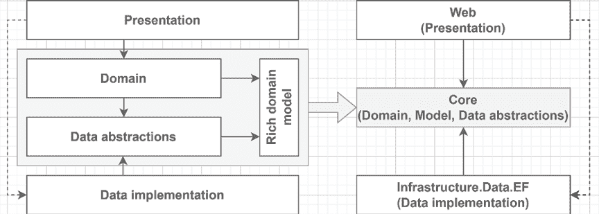

图 14.17：从共享项目到 Clean Architecture 项目结构

在前面的图中，我们将经典分层解决方案的中心合并为一个单独的 `Core` 项目。

> 这是 GitHub 上此项目的链接：[`adpg.link/rT1P`](https://adpg.link/rT1P)。

大部分代码并不那么相关，因为，再次强调，最重要的方面是项目之间的依赖流和关系。尽管如此，以下是我除了将组件移动到不同的项目之外所做的更改列表：

+   我移除了`ProductService`类和`IProductService`接口，并直接从`StockService`类（`Core`项目）和`/products`端点（`Web`项目：`Program.cs`）使用了`IProductRepository`接口。

+   我移除了`IStockService`接口，现在添加和删除股票的端点（`Web`项目：`Program.cs`）都直接依赖于`StockService`类。

你可能会想知道，为什么直接使用`IProductRepository`接口？由于`Web`项目（**基础设施层**）依赖于**核心层**，我们可以利用内向依赖流。只要功能没有业务逻辑，直接使用存储库是可以接受的。编写空壳和透明服务只会增加无用的复杂性。然而，当业务逻辑开始涉及时，为该场景创建一个服务或任何其他必要的领域实体。不要将业务逻辑打包到你的控制器或最小 API 代表中。我移除了`IStockService`接口，因为`StockService`类包含可以原样从基础设施层消费的具体业务规则。我知道我们从本书开始就强调了使用接口，但我经常说原则不是法律。总的来说，没有什么可以抽象的：如果业务规则发生变化，旧规则将不再需要。另一方面，我们本可以保留接口。

> 我在*进一步阅读*部分留下了一些链接。

如果你认为这非常适合你、你的团队、你的项目或你的组织，请随意深入了解并采用这种模式。在随后的章节中，我们将探讨一些模式，例如 CQRS、发布-订阅和基于特性的设计，这些模式我们可以与 Clean Architecture 结合使用，以增加灵活性和健壮性。当你的系统规模和复杂性增长时，这些尤其有用。

## 总结来说，Clean Architecture 是一个经过验证的应用程序构建模式，其本质上是分层的一个演变。许多变体可以帮助你管理用例、实体和基础设施；然而，我们在这里不会涉及这些。如果你寻求组织指导，有许多开源项目可以从 Clean Architecture 开始。

现在我们已经涵盖了所有这些，重要的是要注意，一方面，有理论，另一方面，生活正在向你脸上打。假设你在一家大企业工作。那么，你的雇主可能会投入数十万甚至数百万美元来运行实验，花几个月时间设计每一个小细节，并确保一切完美。即使如此，实现完美甚至可能吗？可能不可能。对于没有那种资本的公司，有时你必须用几千美元构建整个产品，因为它们不是试图转售它们，只是需要构建那个工具。这就是你的架构技能派上用场的时候。你如何以可维护的方式设计最不差的产品，同时满足利益相关者的期望？答案最重要的部分是提前设定期望。此外，永远不要忘记，随着时间的推移，有人需要维护和更改软件；没有软件不会发展；总有东西。

> 如果你处于必须评估在此背景下产品特性可行性的位置，降低期望可以是一个为不可预见的事情做计划的好方法。超预期比解释为什么你未能达到预期要容易。

让我们深入探讨这个问题，并看看一些可以帮助你的技巧。即使你在一个大型企业工作，你也应该从中得到一些收获。

### 要成为纯粹主义者，还是不要成为纯粹主义者？

在你的日常工作中，你可能并不总是需要**领域层**的刚性来在你的数据前建立一堵墙。也许你没有时间或金钱，或者这根本不值得做。获取并展示数据通常已经足够好，特别是对于只是数据库上的用户界面的简单数据驱动应用程序，就像许多内部工具那样。对*“要成为纯粹主义者，还是不要成为纯粹主义者？”*这个问题的答案是：这取决于！

> 本节涵盖了分层，但我们还探讨了其他面向特性的模式，因此我建议你继续阅读并探索使用第十七章的技巧，即*垂直切片架构*，第十八章的*请求-端点-响应（REPR）*，以及第二十章的*模块化单体*，以在保持设计开销低的同时改进你的设计。

这里有一些例子，这些例子的答案取决于什么，以帮助你：

+   项目；例如：

    +   **领域密集型或逻辑密集型项目**将从领域层中受益，帮助你集中部分以实现更高程度的可重用性和可维护性。

    +   **数据管理项目**往往逻辑较少或没有逻辑。我们通常可以不添加领域层来构建它们，因为**领域**通常只是从**表示层**到**数据**的一个隧道；一个透传层。我们通常可以通过将它们分为两层来简化这些系统：**数据**和**表示**。

+   你的团队；例如，一个技术能力很强的团队可能会更有效地使用高级概念和模式，并且由于团队中有经验丰富的工程师可以支持他们，新来者的学习曲线应该更容易。这并不意味着技术能力较弱的团队应该降低目标；相反，这可能只是更难或需要更长的时间才能开始。分析每个项目，并找到相应的最佳模式。

+   你的老板；如果你的公司给你和你的团队施加压力，要求在创纪录的时间内交付复杂的应用程序，而没有人告诉你的老板这是不可能的，你可能需要大量削减边缘，并享受许多维护头痛，包括崩溃的系统、痛苦的部署等等。话虽如此，如果这些类型的项目不可避免，我会选择一个非常简单的设计，不追求可重用性——追求低到平均的可测试性和仅能正常工作的代码。

+   你的预算；再次强调，这通常取决于销售应用和功能的人。我看到了一些不可能实现的承诺，但仍然通过大量的努力、额外的时间和削减边缘实现了。当你走这条路时，要记住的是，在某个时候，累积的技术债务将无法偿还，并且只会变得更糟（这适用于所有预算）。

+   目标受众；使用该软件的人会对你的构建方式产生重大影响：询问他们。例如，假设你正在为你的同行开发者构建一个工具。在这种情况下，你可以削减你不会为技术能力较低的用户（如提供命令行工具而不是完整的用户界面）所采取的边缘。另一方面，如果你将你的应用针对多个客户端（网页、移动设备等），隔离你的应用组件并专注于可重用性可能是一个获胜的设计。

+   预期的质量；在构建原型和 SaaS 应用时，你不应该以相同的方式处理问题。对于原型来说，没有测试和不遵循最佳实践是可以接受的，甚至是鼓励的，但我建议对于生产质量的应用则相反。

+   生活中抛给你的其他事情；是的，生活是不可预测的，没有人能在书中涵盖所有可能的场景，所以当你构建下一个软件时，请记住以下几点：

    +   不要过度设计你的应用。

    +   仅实现你需要的功能，不要更多，按照**你不是真的需要它**（**YAGNI**）原则。

    ***   使用你的判断力，选择最不糟糕的选项；没有完美的解决方案。**

**我希望你发现这些指导有帮助，并且它将在你的职业生涯中为你服务。**

### 在数据库之上构建一个外观

数据驱动型程序是我经常在小型企业中看到的一种软件类型。那些公司需要用计算机来支持他们的日常运营，而不是反过来。每个公司都需要内部工具，许多公司昨天就需要它们。原因很简单；每个公司都是独特的。正因为如此，由于它的商业模式、领导层或员工，它也需要独特的工具来帮助其日常运营。这些小型工具通常是数据库上的简单用户界面，控制对数据的访问。在这些情况下，你不需要过度设计的解决方案，只要每个人都清楚这个工具不会发展到它所不是的东西：一个简单的工具。在现实生活中，这个概念对非程序员来说很难解释，因为他们往往认为复杂的使用案例容易实现，而简单的使用案例难以实现。这是正常的；他们只是不知道，我们也都不知道某些事情。在这些情况下，我们工作的很大一部分也是教育人们。向决策者建议小型工具和大型商业应用之间的质量差异。教育和与利益相关者合作使他们意识到情况，并与你一起做出决策，从而提高项目质量，满足每个人的期望。这也可以减少双方的“*这不是我的错*”综合症。我发现，让客户和决策者沉浸在决策过程中，并让他们跟随开发周期，有助于他们了解程序背后的现实，并使双方保持愉快并更加满意。利益相关者得不到他们想要的东西，并不比你因为无法达到的截止日期而极度紧张更好。话虽如此，我们的教育角色并不局限于决策者。向你的同事传授新工具和技术也是提高你的团队、同事和自己的主要方式之一。解释概念并不总是像听起来那么容易。尽管如此，数据驱动型程序可能难以避免，尤其是如果你在为中小企业工作，所以尽量从中获得最佳效果。如今，随着低代码和无代码解决方案以及所有开源库的出现，你可能会节省很多这种麻烦，但也许不是全部。

> 记住，总有一天，有人必须维护那些小型工具。想象一下那个人就是你自己，并思考你希望有一些指南或文档来帮助你。我并不是说过度文档化项目，因为文档往往与代码不同步，反而变成了问题而不是解决方案。然而，在项目根目录下有一个简单的 `README.md` 文件，解释如何构建和运行程序以及一些一般性指南，这可能会很有帮助。始终以你自己在阅读文档时的角度来考虑文档。大多数人不喜欢花几个小时阅读文档来理解一些简单的东西，所以请尽量保持简单。

当在数据库上构建一个*门面*时，你希望保持其简单性。此外，你应该明确指出它不应超出那个角色。构建这种结构的一种方法是将 EF Core 作为你的数据层，并搭建一个 MVC 应用程序作为你的展示层，以保护你的数据库。如果你需要访问控制，可以使用内置的 ASP.NET Core 身份验证和授权机制。然后你可以选择基于角色的或基于策略的访问控制，或者任何对你工具有意义的其他方式，允许你以你需要的方式控制对数据的访问。

> 保持简单可以帮助你在更短的时间内构建更多工具，让每个人都满意。

从分层角度来看，使用我之前的例子，你最终会拥有两个共享数据模型层：


图 14.18：数据库应用程序设计上的门面式展示层

你可以在这里到处创建一个**视图模型**来处理更复杂的视图，但关键是要将逻辑的复杂性降到最低。否则，你可能会发现，从头开始重写一个程序有时比试图修复它要快。此外，你也可以使用你拥有的任何其他展示工具和组件。在主应用程序开发期间，使用这个数据驱动架构作为临时应用程序也是一个好办法。它构建所需的时间非常少，用户可以立即访问它。你甚至可以从它那里获得反馈，这让你有机会在它们被实际（未来）应用程序实现之前修复任何错误，就像一个活生生的原型一样。

> 在这类应用程序中，良好的数据库设计可以走得很远。

并非所有项目都那么简单，但仍然，许多是；关键是确保程序足够好，同时确保你切对了角。在这些类型的应用程序中，展示层可以利用低代码解决方案，例如 Power Apps。

## 摘要

分层是设计应用程序时最常用的架构技术之一。应用程序通常被分割成多个不同的层，每个层管理单一的责任。最流行的三个层是**表示层**、**领域层**和**数据层**。你不必局限于三个层；你可以将每个层分割成更小的层（或同一概念层内的更小块），从而得到可组合、可管理和可维护的应用程序。此外，你可以创建抽象层来反转依赖流，并将接口与实现分离，正如我们在*抽象层*部分所看到的。你可以直接持久化领域实体或为数据层创建一个独立的模型。你也可以使用贫血模型（没有逻辑或方法）或丰富的模型（包含与实体相关的逻辑）。你可以将此模型在多个层之间共享，或者让每个层拥有自己的模型。从分层中诞生了 Clean Architecture，它指导我们将应用程序组织成同心层，通常将应用程序分割成用例。让我们看看这种方法如何帮助我们朝着**SOLID**原则在应用规模上前进：

+   **S**：分层引导我们水平分割责任，每个层围绕一个单一宏观关注点。分层的主要目标是责任分割。

+   **O**：抽象层使消费者能够根据提供的实现（具体层）采取不同的行动（改变行为）。

+   **L**：N/A

+   **I**：根据特征（或特征的一致组）分割层是一种将系统分割成更小块（接口）的方法。

+   **D**：抽象层直接导致依赖流反转，而经典分层则朝相反方向进行。

在下一章中，我们将学习如何使用对象映射器和开源工具集中化复制对象（模型）的逻辑，以帮助我们跳过实现，也称为生产性懒惰。

## 问题

让我们看看几个练习题：

1.  当创建分层应用程序时，我们是否必须拥有表示层、领域层和数据层？

1.  丰富的领域模型是否比贫血领域模型更好？

1.  EF Core 是否实现了仓储和单元工作模式？

1.  我们是否需要在数据层使用 ORM？

1.  Clean Architecture 中的层能否访问任何内部层？

## 进一步阅读

这里有一些链接可以帮助你巩固本章所学的内容：

+   **Dapper** 是由 Stack Overflow 的人制作的.NET 的一个简单而强大的 ORM，如果你喜欢写 SQL，但不喜欢将数据映射到对象，这个 ORM 可能适合你：[`adpg.link/pTYs`](https://adpg.link/pTYs)。

+   我在 2017 年写的一篇文章，讨论了仓储模式；即「设计模式：ASP.NET Core Web API、服务和仓储 | 第五部分：仓储、ClanRepository 和集成测试」：[`adpg.link/D53Z`](https://adpg.link/D53Z)。

+   Entity Framework Core – 使用事务: [`adpg.link/gxwD`](https://adpg.link/gxwD).

+   这里有一些关于 Clean Architecture 的资源：

    +   常见网络应用架构（Microsoft Learn）: [`adpg.link/Pnpn`](https://adpg.link/Pnpn)

    +   Microsoft eShopOnWeb ASP.NET Core 参考应用: [`adpg.link/dsw1`](https://adpg.link/dsw1)

    +   GitHub—Clean Architecture (Ardalis/Steve Smith)—解决方案模板: [`adpg.link/tpPi`](https://adpg.link/tpPi)

    +   GitHub—Clean Architecture (Jason Taylor)—解决方案模板: [`adpg.link/jxX2`](https://adpg.link/jxX2)

## 答案

1.  不，你可以根据需要拥有任意多的层，并且可以按自己的意愿命名和组织它们。

1.  不，两者都有其位置、优点和缺点。

1.  是的。`DbContext` 是工作单元模式的实现。`DbSet<T>` 是仓储模式的实现。

1.  不，你可以以任何你想要的方式查询任何系统。例如，你可以使用 ADO.NET 查询关系数据库，手动使用 `DataReader` 创建对象，使用 `DataSet` 跟踪更改，或者做任何满足你需求的事情。尽管如此，ORMs 可以非常方便。

1.  是的。一层永远不能访问外层，只能访问内层。****
