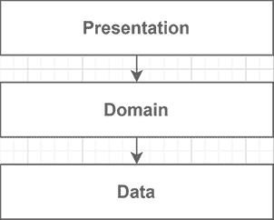
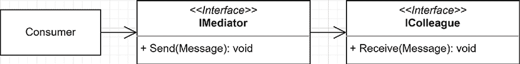
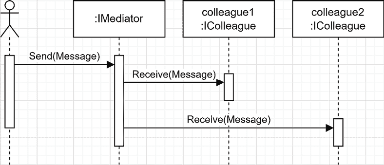
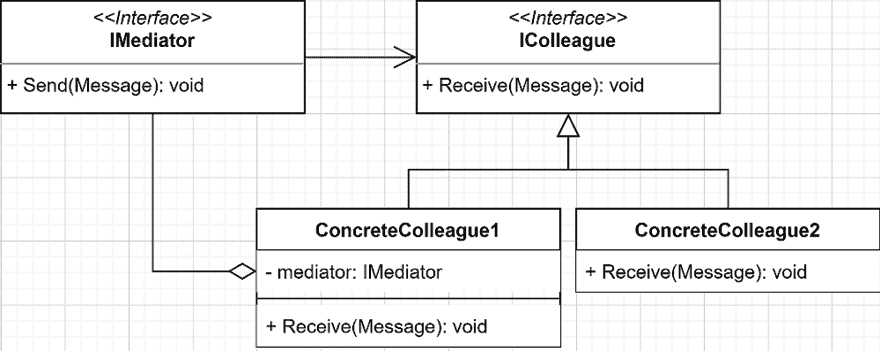
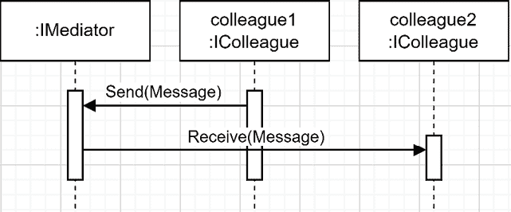
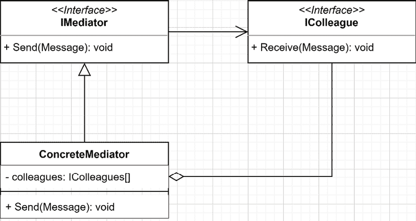
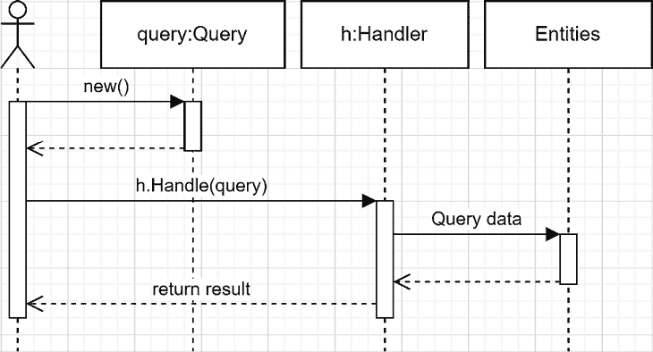
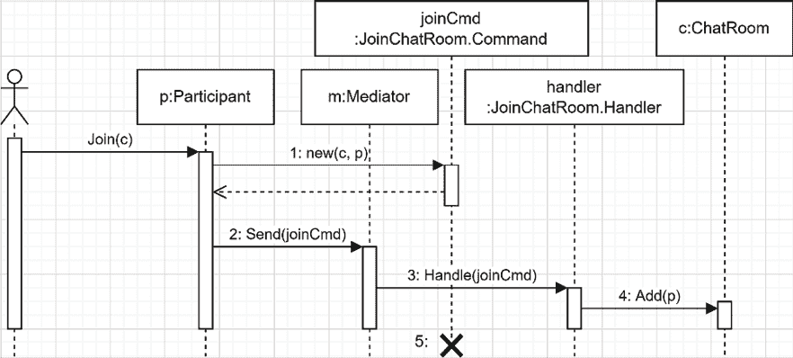
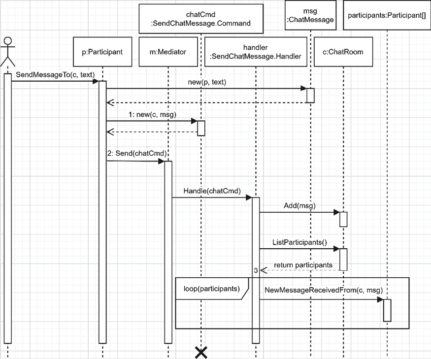

# 第十六章：16 中介者和 CQRS 设计模式

## 在开始之前：加入我们的 Discord 书籍社区

直接向作者本人提供反馈，并在我们的 Discord 服务器上与其他早期读者聊天（在“EARLY ACCESS SUBSCRIPTION”下找到“architecting-aspnet-core-apps-3e”频道）。

[`packt.link/EarlyAccess`](https://packt.link/EarlyAccess)


本章涵盖了下一章的构建块，下一章将介绍**垂直切片架构**。我们首先快速概述垂直切片架构，以便您对最终目标有一个概念。然后，我们探讨**中介者**设计模式，它在我们的应用程序组件之间扮演中间人的角色。这引出了**命令查询责任分离**（**CQRS**）模式，该模式描述了如何将我们的逻辑分为命令和查询。最后，我们通过探索 MediatR（中介者设计模式的开源实现）并通过它发送查询和命令来巩固我们的学习，以展示我们迄今为止所学的概念如何在现实世界的应用程序开发中得以实现。在本章中，我们将涵盖以下主题：

+   垂直切片架构的高级概述

+   实现中介者模式

+   实现 CQS 模式

+   代码异味 - 标记接口

+   使用 MediatR 作为中介者

让我们从最终目标开始。

## 垂直切片架构的高级概述

在开始之前，让我们看看本章和下一章的最终目标。这样，您应该能够更容易地跟随整个章节中向该目标迈进的过程。正如我们在*第十四章*，“分层和清洁架构”中提到的，一个层根据共享责任将类分组在一起。因此，包含数据访问代码的类是数据访问层（或基础设施）的一部分。人们使用像这样的水平切片在图中表示层：



图 16.1：表示层为水平切片的图

“垂直切片架构”中的“垂直切片”来自这里；一个垂直切片代表每个层创建特定功能的部分。因此，我们不是将应用程序划分为层，而是将其划分为功能。一个功能管理其数据访问代码、领域逻辑，甚至可能是表示代码。关键是松散地将功能彼此耦合，并保持每个功能的组件紧密在一起。在一个分层应用程序中，当我们添加、更新或删除一个功能时，我们必须更改一个或多个层，这往往意味着“所有层”。另一方面，使用垂直切片，我们保持功能隔离，允许我们独立设计它们。从分层的角度来看，这就像将您对软件的思考方式翻转 90°：


图 16.2：表示穿越所有层的垂直切片图

垂直切片架构不强制使用**CQRS**、**中介模式**或**MediatR**，但这些工具和模式结合得非常好，正如我们在下一章中看到的。尽管如此，这些只是你可以使用或更改实现的不同技术中的工具和模式；这并不重要，也不会改变概念。

> 我们将在第十八章、*请求-端点-响应（REPR）*和第二十章、*模块化单体*中探讨构建面向功能应用程序的额外方法。

目标是将功能封装在一起，使用 CQRS 将应用程序划分为请求（命令和查询），并使用 MediatR 作为该 CQRS 管道的中介，使各个部分相互解耦。你现在知道了计划。我们将在后面探索垂直切片架构。同时，让我们从中介设计模式开始。

## 实现中介模式

**中介模式**是另一个 GoF 设计模式，它控制对象之间如何交互（使其成为行为模式）。

### 目标

中介的角色是管理对象（同事）之间的通信。那些同事不应该直接相互通信，而应该使用中介。中介有助于打破这些同事之间的紧密耦合。**中介是同事之间传递消息的中间人**。

### 设计

让我们从一些 UML 图开始。从非常高的层面来看，中介模式由一个中介和同事组成：



图 16.3：表示中介模式的类图

当系统中的某个对象想要向一个或多个同事发送消息时，它使用中介。以下是如何工作的一个示例：



图 16.4：中介向同事传递消息的序列图

同事也是如此；如果同事之间需要交流，也必须使用中介，如下面的类图所示：



图 16.5：表示中介模式包括同事协作的类图

在这个图中，`ConcreteColleague1` 是一个同事，同时也是中介的消费者。例如，那个同事可以使用中介向另一个同事发送消息，如下所示：



图 16.6：表示 colleague1 通过中介与 colleague2 通信的序列图

从中介的角度来看，其实现很可能包含一个用于通信的同事集合，如下所示：



图 16.7：表示简单假设的具体中介实现类的类图

现在我们已经探讨了几个 UML 图，让我们看看一些代码。

### 项目 – 中介（IMediator）

Mediator 项目由一个使用 Mediator 模式的简化聊天系统组成。让我们从接口开始：

```cs
namespace Mediator;
public interface IMediator
{
    void Send(Message message);
}
public interface IColleague
{
    string Name { get; }
    void ReceiveMessage(Message message);
}
public record class Message(IColleague Sender, string Content);
```

系统由以下部分组成：

+   `IMediator`接口代表一个可以向同事发送消息的中介。

+   `IColleague`接口代表一个可以接收消息的同事。它还有一个`Name`属性，这样我们就可以输出有意义的值。

+   `Message`类代表由`IColleague`实现发送的消息。

然后，我们在`ConcreteMediator`类中实现`IMediator`接口，将消息广播到所有`IColleague`实例：

```cs
public class ConcreteMediator : IMediator
{
    private readonly List<IColleague> _colleagues;
    public ConcreteMediator(params IColleague[] colleagues)
    {
        ArgumentNullException.ThrowIfNull(colleagues);
        _colleagues = new List<IColleague>(colleagues);
    }
    public void Send(Message message)
    {
        foreach (var colleague in _colleagues)
        {
            colleague.ReceiveMessage(message);
        }
    }
}
```

这个中介很简单；它将接收到的所有消息转发给它所知道的每个同事。模式的最后一部分是`ConcreteColleague`类，它允许`IMessageWriter<TMessage>`接口的实例输出消息（我们将在下一节探讨该接口）：

```cs
public class ConcreteColleague : IColleague
{
    private readonly IMessageWriter<Message> _messageWriter;
    public ConcreteColleague(string name, IMessageWriter<Message> messageWriter)
    {
        Name = name ?? throw new ArgumentNullException(nameof(name));
        _messageWriter = messageWriter ?? throw new ArgumentNullException(nameof(messageWriter));
    }
    public string Name { get; }
    public void ReceiveMessage(Message message)
    {
        _messageWriter.Write(message);
    }
}
```

这个类几乎无法再简单了：在创建时，它接受一个名称和一个`IMessageWriter<TMessage>`实现，然后存储一个引用以供将来使用。《IMessageWriter<TMessage>`接口充当一个展示者，并控制消息的显示方式。《IMessageWriter<TMessage>`接口与中介模式无关。尽管如此，它是一种管理`ConcreteColleague`对象如何输出消息而不与特定目标耦合的方法。以下是代码：

```cs
namespace Mediator;
public interface IMessageWriter<Tmessage>
{
    void Write(Tmessage message);
} 
```

系统的消费者是一个在`MediatorTest`类中定义的集成测试。该测试使用聊天系统，并使用`IMessageWriter`接口的自定义实现来断言输出。让我们首先分析这个测试：

```cs
namespace Mediator;
public class MediatorTest
{
    [Fact]
    public void Send_a_message_to_all_colleagues()
    {
        // Arrange
        var (millerWriter, miller) = CreateConcreteColleague("Miller");
        var (orazioWriter, orazio) = CreateConcreteColleague("Orazio");
        var (fletcherWriter, fletcher) = CreateConcreteColleague("Fletcher");
```

测试首先定义了三个同事及其自己的`TestMessageWriter`实现（名称是随机生成的）。

```cs
 var mediator = new ConcreteMediator(miller, orazio, fletcher);
        var expectedOutput = @"[Miller]: Hey everyone!
[Orazio]: What's up Miller?
[Fletcher]: Hey Miller!
";
```

在前一个`Arrange`块的第二部分，我们创建了待测试的主题（中介）并注册了三位同事。在那个`Arrange`块结束时，我们还定义了测试的预期输出。需要注意的是，我们控制来自`TestMessageWriter`实现（在`MediatorTest`类末尾定义）的输出。接下来是`Act`块：

```cs
 // Act
        mediator.Send(new Message(
            Sender: miller,
            Content: "Hey everyone!"
        ));
        mediator.Send(new Message(
            Sender: orazio,
            Content: "What's up Miller?"
        ));
        mediator.Send(new Message(
            Sender: fletcher,
            Content: "Hey Miller!"
        )); 
```

在前面的`Act`块中，我们通过`mediator`实例发送了三条消息。接下来是`Assert`块：

```cs
 // Assert
        Assert.Equal(expectedOutput, millerWriter.Output.ToString());
        Assert.Equal(expectedOutput, orazioWriter.Output.ToString());
        Assert.Equal(expectedOutput, fletcherWriter.Output.ToString());
    }
```

在`Assert`块中，我们确保所有同事都收到了消息。

```cs
 private static (TestMessageWriter, ConcreteColleague) CreateConcreteColleague(string name)
    {
        var messageWriter = new TestMessageWriter();
        var concreateColleague = new ConcreteColleague(name, messageWriter);
        return (messageWriter, concreateColleague);
    }
```

`CreateConcreteColleague`方法是一个辅助方法，它封装了同事的创建，使我们能够编写测试`Arrange`部分中的一行声明。接下来，我们看看`IMessageWriter`实现：

```cs
 private class TestMessageWriter : IMessageWriter<Message>
    {
        public StringBuilder Output { get; } = new StringBuilder();
        public void Write(Message message)
        {
            Output.AppendLine($"[{message.Sender.Name}]: {message.Content}");
        }
    }
} // Closing the MediatorTest class
```

最后，`TestMessageWriter`类将消息写入`StringBuilder`，这使得断言输出变得容易。如果我们为它构建一个 GUI，我们可以编写一个`IMessageWriter<Message>`的实现，将其写入该 GUI；在 Web UI 的情况下，它可以使用**SignalR**或直接写入响应流，例如。总结这个示例：

1.  消费者（单元测试）通过中介向同事发送消息。

1.  `TestMessageWriter`类将这些消息写入一个`StringBuilder`实例。每个同事都有自己的`TestMessageWriter`类实例。

1.  代码断言所有同事都收到了预期的消息。

这个例子说明了中介模式允许我们打破同事之间的直接耦合。消息到达同事，而他们并不知道彼此。同事应该通过中介进行沟通，因此没有中介，中介模式就不完整。让我们实现一个更高级的聊天室来处理这个概念。

### 项目 – 中介（IChatRoom）

在之前的代码示例中，我们根据中介模式演员命名了类，如图 14.7 所示。虽然这个例子非常相似，但它使用的是领域特定的名称，并实现了一些更多的方法来管理显示更具体实现系统的系统。让我们从抽象开始：

```cs
namespace Mediator;
public interface IChatRoom
{
    void Join(IParticipant participant);
    void Send(ChatMessage message);
}
```

`IChatRoom`接口是中介，它定义了两个方法而不是一个：

+   `Join`，允许`IParticipant`加入`IChatRoom`。

+   `Send`，用于向其他人发送消息。

```cs
public interface IParticipant
{
    string Name { get; }
    void Send(string message);
    void ReceiveMessage(ChatMessage message);
    void ChatRoomJoined(IChatRoom chatRoom);
}
```

`IParticipant`接口是同事，并且还有一些其他方法：

+   `Send`，用于发送消息。

+   `ReceiveMessage`，用于接收来自其他`IParticipant`对象的消息。

+   `ChatRoomJoined`，用于确认`IParticipant`对象已成功加入聊天室。

```cs
public record class ChatMessage(IParticipant Sender, string Content);
```

`ChatMessage`类与之前的`Message`类相同，但它引用的是`IParticipant`而不是`IColleague`。现在让我们看看`IParticipant`实现：

```cs
public class User : IParticipant
{
    private IChatRoom? _chatRoom;
    private readonly IMessageWriter<ChatMessage> _messageWriter;
    public User(IMessageWriter<ChatMessage> messageWriter, string name)
    {
        _messageWriter = messageWriter ?? throw new ArgumentNullException(nameof(messageWriter));
        Name = name ?? throw new ArgumentNullException(nameof(name));
    }
    public string Name { get; }
    public void ChatRoomJoined(IChatRoom chatRoom)
    {
        _chatRoom = chatRoom;
    }
    public void ReceiveMessage(ChatMessage message)
    {
        _messageWriter.Write(message);
    }
    public void Send(string message)
    {
        if (_chatRoom == null)
        {
            throw new ChatRoomNotJoinedException();
        }
        _chatRoom.Send(new ChatMessage(this, message));
    }
}
public class ChatRoomNotJoinedException : Exception
{
    public ChatRoomNotJoinedException()
        : base("You must join a chat room before sending a message.")
    { }
}
```

`User`类代表我们的默认`IParticipant`。一个`User`实例只能在`IChatRoom`中聊天。程序可以通过调用`ChatRoomJoined`方法来设置聊天室。当它收到消息时，它将其委托给它的`IMessageWriter<ChatMessage>`。最后，一个`User`实例可以通过中介（`IChatRoom`）发送消息。`Send`方法抛出`ChatRoomNotJoinedException`异常，以强制`User`实例在发送消息之前必须加入聊天室（代码上：`_chatRoom`字段不能为`null`）。我们可以根据需要创建`Moderator`、`Administrator`、`SystemAlerts`或任何其他`IParticipant`实现，但在这个示例中我们没有这样做。我将这个实验留给你。现在让我们看看`ChatRoom`类（中介）：

```cs
public class ChatRoom : IChatRoom
{
    private readonly List<IParticipant> _participants = new();
    public void Join(IParticipant participant)
    {
        _participants.Add(participant);
        participant.ChatRoomJoined(this);
        Send(new ChatMessage(participant, "Has joined the channel"));
    }
    public void Send(ChatMessage message)
    {
        _participants.ForEach(participant 
            => participant.ReceiveMessage(message));
    }
}
```

`ChatRoom` 类比 `User` 类更简洁。它允许参与者加入并发送聊天消息给已注册的参与者。当加入 `ChatRoom` 时，它保留对 `IParticipant` 的引用，告诉 `IParticipant` 它已成功加入，然后向所有参与者发送 `ChatMessage` 宣布新来者。有了这些小块，我们就有了仲裁者的实现。在进入下一节之前，让我们看看 `IChatRoom` 的 `Consumer` 实例，这是另一个集成测试。让我们从类的骨架开始：

```cs
namespace Mediator;
public class ChatRoomTest
{
    [Fact]
    public void ChatRoom_participants_should_send_and_receive_messages()
    {
        // Arrange, Act, Assert blocks here
    }
    private (TestMessageWriter, User) CreateTestUser(string name)
    {
        var writer = new TestMessageWriter();
        var user = new User(writer, name);
        return (writer, user);
    }
    private class TestMessageWriter : IMessageWriter<ChatMessage>
    {
        public StringBuilder Output { get; } = new StringBuilder();
        public void Write(ChatMessage message)
        {
            Output.AppendLine($"[{message.Sender.Name}]: {message.Content}");
        }
    }
}
```

在前面的代码中，我们有以下几部分：

+   测试用例是一个空占位符，我们即将对其进行查看。

+   `CreateTestUser` 方法有助于简化测试用例的 `Arrange` 部分，与之前类似。

+   `TestMessageWriter` 的实现与之前的例子类似，将消息累积在 `StringBuilder` 实例中。

作为参考，`IMessageWriter` 接口与之前的工程相同：

```cs
public interface IMessageWriter<TMessage>
{
    void Write(TMessage message);
}
```

现在，让我们探索测试用例，从 `Arrange` 块开始，我们在其中创建了四个用户及其各自的 `TestMessageWriter` 实例（名称也是随机生成的）：

```cs
// Arrange
var (kingChat, king) = CreateTestUser("King");
var (kelleyChat, kelley) = CreateTestUser("Kelley");
var (daveenChat, daveen) = CreateTestUser("Daveen");
var (rutterChat, _) = CreateTestUser("Rutter");
var chatroom = new ChatRoom();
```

然后，在 `Act` 块中，我们的测试用户加入 `chatroom` 实例并发送消息：

```cs
// Act
chatroom.Join(king);
chatroom.Join(kelley);
king.Send("Hey!");
kelley.Send("What's up King?");
chatroom.Join(daveen);
king.Send("Everything is great, I joined the CrazyChatRoom!");
daveen.Send("Hey King!");
king.Send("Hey Daveen");
```

然后，在 `Assert` 块中，鲁特没有加入聊天室，所以我们预计没有消息：

```cs
// Assert
Assert.Empty(rutterChat.Output.ToString());
```

由于金是第一个加入频道的，我们预计他会收到所有消息：

```cs
Assert.Equal(@"[King]: Has joined the channel
[Kelley]: Has joined the channel
[King]: Hey!
[Kelley]: What's up King?
[Daveen]: Has joined the channel
[King]: Everything is great, I joined the CrazyChatRoom!
[Daveen]: Hey King!
[King]: Hey Daveen
", kingChat.Output.ToString());
```

凯利是第二个加入聊天室的用户，所以输出包含了几乎所有消息，除了说 `[金]: 已加入频道` 的那一行：

```cs
Assert.Equal(@"[Kelley]: Has joined the channel
[King]: Hey!
[Kelley]: What's up King?
[Daveen]: Has joined the channel
[King]: Everything is great, I joined the CrazyChatRoom!
[Daveen]: Hey King!
[King]: Hey Daveen
", kelleyChat.Output.ToString());
```

戴文在金和凯利交换了几句话后加入，所以我们预计对话会短一些：

```cs
Assert.Equal(@"[Daveen]: Has joined the channel
[King]: Everything is great, I joined the CrazyChatRoom!
[Daveen]: Hey King!
[King]: Hey Daveen
", daveenChat.Output.ToString());
```

总结测试用例，我们有四个用户。其中三个在不同时间加入了同一个聊天室并聊了一会儿。由于加入的时间不同，每个人的输出都不同。所有参与者都松散耦合，多亏了中介者模式，这使得我们可以在不影响现有部分的情况下扩展系统。利用中介者模式帮助我们创建可维护的系统；许多小块比处理所有逻辑的大型组件更容易管理和测试。

### 结论

正如我们在前两个项目中探讨的那样，**仲裁者**使我们能够解耦系统的组件。**仲裁者是同事之间的中间人**，它在小型聊天室样本中表现良好，其中每个同事都可以与其他人交谈，而无需知道如何以及他们是谁。现在让我们看看中介者模式如何帮助我们遵循 **SOLID** 原则：

+   **S**: 仲裁者从同事那里提取了沟通责任。

+   **O**: 通过仲裁者传递消息，我们可以创建新的同事并改变现有同事的行为，而不会影响其他人。如果我们需要一个新同事，我们可以通过仲裁者注册一个。

+   **L**: 无

+   **I**：中介者模式将系统划分为多个小的接口（`IMediator`和`IColleague`）。

+   **D**：中介者模式的所有参与者仅依赖于其他接口。如果我们因为需要新的中介行为而需要实现新的中介，我们可以重用现有同事的实现，因为它们依赖于依赖反转。

接下来，我们探讨 CQRS，它允许我们将命令和查询分离，从而使得应用程序更易于维护。毕竟，所有操作都是查询或命令，无论我们如何称呼它们。

## 实现 CQS 模式

**命令-查询分离（CQS）**是**命令查询责任分离（CQRS）**模式的一个子集。以下是两者之间的高层次差异：

+   使用 CQS，我们将操作分为命令和查询。

+   使用 CQRS，我们将这个概念应用到系统级别。我们分离了读取和写入的模型，这可能导致一个分布式系统。

在本章中，我们继续使用 CQS，并在第十八章“微服务架构简介”中处理 CQRS。

### 目标

目标是将所有操作（或请求）分为两个类别：命令和查询。

+   **命令改变应用程序的状态。**例如，创建、更新和删除实体都是命令。理论上，命令不应该返回值。在实践中，它们经常这样做，尤其是为了优化目的。

+   **查询读取应用程序的状态，但永远不会改变它。**例如，读取订单、读取您的订单历史记录和检索您的用户资料都是查询。

将操作分为突变请求（写入/命令）和访问请求（读取/查询）创建了一个清晰的关注点分离，引导我们走向 SRP。

### 设计

对于这个模式，没有固定的设计，但对我们来说，命令的流程应该如下所示：


图 16.8：表示命令抽象流程的序列图

消费者创建一个命令对象并将其发送到命令处理器，对应用程序应用变更。在这种情况下，我将其称为`Entities`，但它也可以发送一个 SQL `UPDATE`命令到数据库或通过 HTTP 进行 Web API 调用；实现细节并不重要。对于查询，概念是相同的，但它返回一个值。非常重要的一点是，查询不能改变应用程序的状态。查询应该只读取数据，如下所示：



图 16.9：表示查询抽象流程的序列图

与命令一样，消费者创建一个查询对象并将其发送到处理器，然后处理器执行一些逻辑以检索和返回所需的数据。我们可以用处理器需要查询数据的东西来替换`Entities`。说得够多了——让我们看看 CQS 项目。

### 项目 – CQS

**上下文**：我们需要构建我们聊天系统的改进版本。旧系统工作得很好，我们需要将其扩展。中介者对我们有所帮助，所以我们保留了这部分，并选择了 CQS 模式来帮助我们进行这个新的、改进的设计。过去，参与者被限制在单个聊天室中，但现在参与者必须能够同时参与多个聊天室。新系统由三个命令和两个查询组成：

+   参与者必须能够加入聊天室。

+   参与者必须能够离开聊天室。

+   参与者必须能够向聊天室发送消息。

+   参与者必须能够获取加入聊天室的所有参与者的列表。

+   参与者必须能够从聊天室检索现有消息。

前三个是命令，最后两个是查询。系统由以下中介者支持，它大量使用了 C# 泛型：

```cs
public interface IMediator
{
    TReturn Send<TQuery, TReturn>(TQuery query)
        where TQuery : IQuery<TReturn>;
    void Send<TCommand>(TCommand command)
        where TCommand : ICommand;
    void Register<TCommand>(ICommandHandler<TCommand> commandHandler)
        where TCommand : ICommand;
    void Register<TQuery, TReturn>(IQueryHandler<TQuery, TReturn> commandHandler)
        where TQuery : IQuery<TReturn>;
}
```

如果你不太熟悉泛型，这可能会看起来令人畏惧，但那段代码实际上比看起来要简单得多。接下来，`ICommand` 接口是空的，我们本可以避免这种情况，但它有助于描述我们的意图。`ICommandHandler` 接口定义了一个类必须实现的合同来处理命令。该接口定义了一个 `Handle` 方法，它接受命令作为参数。泛型参数 `TCommand` 表示实现该接口的类可以处理的命令类型。以下是代码：

```cs
public interface ICommand { }
public interface ICommandHandler<TCommand> 
    where TCommand : ICommand
{
    void Handle(TCommand command);
}
```

`IQuery<TReturn>` 接口与 `ICommand` 接口类似，但有一个表示查询返回类型的 `TReturn` 泛型参数。IQueryHandler 接口也非常相似，但它的 `Handle` 方法接受一个类型为 `TQuery` 的对象作为参数，并返回一个 `TReturn` 类型的值。以下是代码：

```cs
public interface IQuery<TReturn> { }
public interface IQueryHandler<TQuery, TReturn>
    where TQuery : IQuery<TReturn>
{
    TReturn Handle(TQuery query);
}
```

`IMediator` 接口允许使用其 `Register` 方法注册命令和查询处理器。它还支持通过其 `Send` 方法发送命令和查询。然后我们有 `ChatMessage` 类，它与最后两个示例类似（增加了一个创建日期）：

```cs
public record class ChatMessage(IParticipant Sender, string Message)
{
    public DateTime Date { get; } = DateTime.UtcNow;
}
```

接下来是更新的 `IParticipant` 接口：

```cs
public interface IParticipant
{
    string Name { get; }
    void Join(IChatRoom chatRoom);
    void Leave(IChatRoom chatRoom);
    void SendMessageTo(IChatRoom chatRoom, string message);
    void NewMessageReceivedFrom(IChatRoom chatRoom, ChatMessage message);
    IEnumerable<IParticipant> ListParticipantsOf(IChatRoom chatRoom);
    IEnumerable<ChatMessage> ListMessagesOf(IChatRoom chatRoom);
}
```

`IParticipant` 接口的所有方法都接受一个 `IChatRoom` 参数，以支持多个聊天室。更新的 `IChatRoom` 接口有一个名称和一些基本操作，以满足聊天室的要求，如添加和删除参与者：

```cs
public interface IChatRoom
{
    string Name { get; }
    void Add(IParticipant participant);
    void Remove(IParticipant participant);
    IEnumerable<IParticipant> ListParticipants();
    void Add(ChatMessage message);
    IEnumerable<ChatMessage> ListMessages();
}
```

在进入命令和聊天本身之前，让我们先看看 `Mediator` 类：

```cs
public class Mediator : IMediator
{
    private readonly HandlerDictionary _handlers = new();
    public void Register<TCommand>(ICommandHandler<TCommand> commandHandler)
        where TCommand : ICommand
    {
        _handlers.AddHandler(commandHandler);
    }
    public void Register<TQuery, TReturn> (IQueryHandler<TQuery, TReturn> commandHandler)
        where TQuery : IQuery<TReturn>
    {
        _handlers.AddHandler(commandHandler);
    }
    public TReturn Send<TQuery, TReturn>(TQuery query)
        where TQuery : IQuery<TReturn>
    {
        var handler = _handlers.Find<TQuery, TReturn>();
        return handler.Handle(query);
    }
    public void Send<TCommand>(TCommand command)
        where TCommand : ICommand
    {
        var handlers = _handlers.FindAll<TCommand>();
        foreach (var handler in handlers)
        {
            handler.Handle(command);
        }
    }
}
```

`Mediator` 类支持注册命令和查询，以及向处理器发送查询或向零个或多个处理器发送命令。

> 我省略了 `HandlerDictionary` 的实现，因为它并不增加示例的价值，它只是实现细节，但它可能会增加不必要的复杂性。它可在 GitHub 上找到：[`adpg.link/2Lsm`](https://adpg.link/2Lsm)。

现在来看命令。我把命令和处理程序放在一起，以保持组织性和可读性，但你也可以使用其他方式来组织你的代码。此外，由于这是一个小型项目，所有命令都在同一个文件中，这对于更大的项目来说是不可行的。记住，我们正在玩乐高积木，这一章涵盖了 CQS 零件，但你始终可以使用它们与更大的零件，如 Clean Architecture 或其他类型的架构。

> 我们将在后续章节中介绍组织命令和查询的方法。

让我们从 `JoinChatRoom` 功能开始：

```cs
public class JoinChatRoom
{
    public record class Command(IChatRoom ChatRoom, IParticipant Requester) : ICommand;
    public class Handler : ICommandHandler<Command>
    {
        public void Handle(Command command)
        {
            command.ChatRoom.Add(command.Requester);
        }
    }
}
```

`Command` 类代表命令本身，一种携带命令数据的数据结构。`Handler` 类处理这种类型的命令。当执行时，它使用 `ChatRoom` 和 `Requester` 属性将指定的 `IParticipant` 添加到指定的 `IChatRoom` 中（高亮行）。下一个功能：

```cs
public class LeaveChatRoom
{
    public record class Command(IChatRoom ChatRoom, IParticipant Requester) : ICommand;
    public class Handler : ICommandHandler<Command>
    {
        public void Handle(Command command)
        {
            command.ChatRoom.Remove(command.Requester);
        }
    }
}
```

那段代码代表了 `JoinChatRoom` 命令的完全相反，`LeaveChatRoom` 处理器从指定的 `IChatRoom` 中移除一个 `IParticipant`（高亮行）。

> 以这种方式嵌套类允许重用每个功能的类名 `Command` 和 `Handler`。

到下一个功能：

```cs
public class SendChatMessage
{
    public record class Command(IChatRoom ChatRoom, ChatMessage Message) : ICommand;
    public class Handler : ICommandHandler<Command>
    {
        public void Handle(Command command)
        {
            command.ChatRoom.Add(command.Message);
            var participants = command.ChatRoom.ListParticipants();
            foreach (var participant in participants)
            {
                participant.NewMessageReceivedFrom(
                    command.ChatRoom, 
                    command.Message
                );
            }
        }
    }
}
```

与此同时，`SendChatMessage` 功能处理两件事（高亮行）：

+   它将指定的 `Message` 添加到 `IChatRoom`（现在仅是一个跟踪用户和过去消息的数据结构）。

+   它还将指定的 `Message` 发送到加入该 `IChatRoom` 的所有 `IParticipant` 实例。

我们开始看到许多较小的部分相互交互，以创建一个更发达的系统。但我们还没有完成；让我们看看这两个查询，然后是聊天实现：

```cs
public class ListParticipants
{
    public record class Query(IChatRoom ChatRoom, IParticipant Requester) : IQuery<IEnumerable<IParticipant>>;
    public class Handler : IQueryHandler<Query, IEnumerable<IParticipant>>
    {
        public IEnumerable<IParticipant> Handle(Query query)
        {
            return query.ChatRoom.ListParticipants();
        }
    }
}
```

`ListParticipants` 处理器使用指定的 `IChatRoom` 并返回其参与者（高亮行）。现在，来看最后一个查询：

```cs
public class ListMessages
{
    public record class Query(IChatRoom ChatRoom, IParticipant Requester) : IQuery<IEnumerable<ChatMessage>>;
    public class Handler : IQueryHandler<Query, IEnumerable<ChatMessage>>
    {
        public IEnumerable<ChatMessage> Handle(Query query)
        {
            return query.ChatRoom.ListMessages();
        }
    }
}
```

`ListMessages` 处理器使用指定的 `IChatRoom` 实例返回其消息。

> 由于所有命令和查询都引用 `IParticipant`，我们可以强制执行诸如“`IParticipant` 必须在发送消息之前加入频道”之类的规则。我决定省略这些细节以保持代码简单，但如果你想要的话，随时可以添加这些功能。

接下来，让我们看看 `ChatRoom` 类，它是一个简单的数据结构，用于存储聊天室的状态：

```cs
public class ChatRoom : IChatRoom
{
    private readonly List<IParticipant> _participants = new List<IParticipant>();
    private readonly List<ChatMessage> _chatMessages = new List<ChatMessage>();
    public ChatRoom(string name)
    {
        Name = name ?? throw new ArgumentNullException(nameof(name));
    }
    public string Name { get; }
    public void Add(IParticipant participant)
    {
        _participants.Add(participant);
    }
    public void Add(ChatMessage message)
    {
        _chatMessages.Add(message);
    }
    public IEnumerable<ChatMessage> ListMessages()
    {
        return _chatMessages.AsReadOnly();
    }
    public IEnumerable<IParticipant> ListParticipants()
    {
        return _participants.AsReadOnly();
    }
    public void Remove(IParticipant participant)
    {
        _participants.Remove(participant);
    }
}
```

如果我们再次看看 `ChatRoom` 类，它有一个 `Name` 属性。它包含一个 `IParticipant` 实例列表和一个 `ChatMessage` 实例列表。`ListMessages()` 和 `ListParticipants()` 都返回 `AsReadOnly()` 列表，因此一个聪明的程序员不能从外部更改 `ChatRoom` 的状态。就是这样；新的 `ChatRoom` 类是其底层依赖的伪装。最后，`Participant` 类可能是这个系统中最激动人心的部分，因为它大量使用了我们的中介和 CQS：

```cs
public class Participant : IParticipant
{
    private readonly IMediator _mediator;
    private readonly IMessageWriter _messageWriter;
    public Participant(IMediator mediator, string name, IMessageWriter messageWriter)
    {
        _mediator = mediator ?? throw new ArgumentNullException(nameof(mediator));
        Name = name ?? throw new ArgumentNullException(nameof(name));
        _messageWriter = messageWriter ?? throw new ArgumentNullException(nameof(messageWriter));
    }
    public string Name { get; }
    public void Join(IChatRoom chatRoom)
    {
        _mediator.Send(new JoinChatRoom.Command(chatRoom, this));
    }
    public void Leave(IChatRoom chatRoom)
    {
        _mediator.Send(new LeaveChatRoom.Command(chatRoom, this));
    }
    public IEnumerable<ChatMessage> ListMessagesOf(IChatRoom chatRoom)
    {
        return _mediator.Send<ListMessages.Query, IEnumerable<ChatMessage>>(new ListMessages.Query(chatRoom, this));
    }
    public IEnumerable<IParticipant> ListParticipantsOf(IChatRoom chatRoom)
    {
        return _mediator.Send<ListParticipants.Query, IEnumerable<IParticipant>>(new ListParticipants.Query(chatRoom, this));
    }
    public void NewMessageReceivedFrom(IChatRoom chatRoom, ChatMessage message)
    {
        _messageWriter.Write(chatRoom, message);
    }
    public void SendMessageTo(IChatRoom chatRoom, string message)
    {
        _mediator.Send(new SendChatMessage.Command (chatRoom, new ChatMessage(this, message)));
    }
}
```

除了 `NewMessageReceivedFrom` 方法外，`Participant` 类的每个方法都通过 `IMediator` 接口发送命令或查询，打破了参与者与系统操作（即命令和查询）之间的紧密耦合。`Participant` 类也是其底层依赖的简单外观，将大部分工作委托给中介。现在我们已经涵盖了众多小部件，让我们看看它们是如何协同工作的。我将几个具有以下设置代码的测试用例分组在一起：

```cs
public class ChatRoomTest
{
    private readonly IMediator _mediator = new Mediator();
    private readonly TestMessageWriter _reagenMessageWriter = new();
    private readonly TestMessageWriter _garnerMessageWriter = new();
    private readonly TestMessageWriter _corneliaMessageWriter = new();
    private readonly IChatRoom _room1 = new ChatRoom("Room 1");
    private readonly IChatRoom _room2 = new ChatRoom("Room 2");
    private readonly IParticipant _reagen;
    private readonly IParticipant _garner;
    private readonly IParticipant _cornelia;
    public ChatRoomTest()
    {
        _mediator.Register(new JoinChatRoom.Handler());
        _mediator.Register(new LeaveChatRoom.Handler());
        _mediator.Register(new SendChatMessage.Handler());
        _mediator.Register(new ListParticipants.Handler());
        _mediator.Register(new ListMessages.Handler());
        _reagen = new Participant(_mediator, "Reagen", _reagenMessageWriter);
        _garner = new Participant(_mediator, "Garner", _garnerMessageWriter);
        _cornelia = new Participant(_mediator, "Cornelia", _corneliaMessageWriter);
    }
    // Omited test cases and helpers
}
```

测试程序设置由以下内容组成：

+   一个初始化为 `Mediator` 实例的 `IMediator` 字段，使所有同事能够相互交互。

+   两个初始化为 `ChatRoom` 实例的 `IChatRoom` 字段。

+   三个未初始化的 `IParticipant` 字段，稍后用 `Participant` 实例初始化。

+   三个 `TestMessageWriter` 实例，每个参与者一个。

+   构造函数将所有处理程序注册到 `Mediator` 实例，以便它知道如何处理命令和查询。它还创建了参与者。

> 参与者的名字再次随机生成。

`TestMessageWriter` 的实现略有不同，它将数据累积在元组列表 (`List<(IChatRoom, ChatMessage)>`) 中，以评估参与者发送的内容：

```cs
private class TestMessageWriter : IMessageWriter
{
    public List<(IChatRoom chatRoom, ChatMessage message)> Output { get; } = new();
    public void Write(IChatRoom chatRoom, ChatMessage message)
    {
        Output.Add((chatRoom, message));
    }
}
```

这里是第一个测试用例：

```cs
[Fact]
public void A_participant_should_be_able_to_list_the_participants_that_joined_a_chatroom()
{
    _reagen.Join(_room1);
    _reagen.Join(_room2);
    _garner.Join(_room1);
    _cornelia.Join(_room2);
    var room1Participants = _reagen.ListParticipantsOf(_room1);
    Assert.Collection(room1Participants,
        p => Assert.Same(_reagen, p),
        p => Assert.Same(_garner, p)
    );
}
```

在前面的测试用例中，Reagen 和 Garner 加入 Room 1，而 Reagen 和 Cornelia 加入 Room 2。然后 Reagen 从 Room 1 请求参与者列表，输出 Reagen 和 Garner。在底层，它通过中介使用命令和查询，打破了同事之间的紧密耦合。以下是一个序列图，展示了当参与者加入聊天室时发生的情况：



图 16.10：表示参与者（p）加入聊天室（c）流程的序列图

1.  参与者 (`p`) 创建了一个 `JoinChatRoom` 命令 (`joinCmd`)。

1.  `p` 通过中介 (`m`) 发送 `joinCmd`。

1.  `m` 查找并将 `joinCmd` 分派给其处理程序 (`handler`)。

1.  `handler` 执行逻辑（将 `p` 添加到聊天室）。

1.  `joinCmd` 之后不再存在；命令是瞬时的。

这意味着 `Participant` 从不直接与 `ChatRoom` 或其他参与者交互。当参与者请求聊天室的参与者列表时，发生类似的流程：


图 16.11：表示参与者（p）请求聊天室（c）参与者列表流程的序列图

1.  `Participant` (`p`) 创建了一个 `ListParticipants` 查询 (`listQuery`)。

1.  `p` 通过中介 (`m`) 发送 `listQuery`。

1.  `m` 查找并将查询分派给其处理程序 (`handler`)。

1.  `handler` 执行逻辑（列出聊天室的参与者）。

1.  `listQuery` 在之后不再存在；查询也是短暂的。

再次强调，`Participant` 不直接与 `ChatRoom` 交互。这里还有一个测试用例，其中 `Participant` 向聊天室发送消息，另一个 `Participant` 接收它：

```cs
[Fact]
public void A_participant_should_receive_new_messages()
{
    _reagen.Join(_room1);
    _garner.Join(_room1);
    _garner.Join(_room2);
    _reagen.SendMessageTo(_room1, "Hello!");
    Assert.Collection(_garnerMessageWriter.Output,
    line =>
    {
        Assert.Equal(_room1, line.chatRoom);
        Assert.Equal(_reagen, line.message.Sender);
        Assert.Equal("Hello!", line.message.Message);
    }
  );
}
```

在前面的测试用例中，Reagen 加入房间 1，而 Garner 加入房间 1 和 2。然后 Reagen 向房间 1 发送消息，我们验证 Garner 是否收到了它。《SendMessageTo》工作流程与我们所看到的另一个非常相似，但具有更复杂的命令处理程序：



图 16.12：序列图表示参与者（p）向聊天室（c）发送消息（msg）的流程

从该图中，我们可以观察到我们将逻辑推到了 `SendChatMessage` 功能的 `Handler` 类中。所有其他角色都一起工作，彼此之间了解有限或没有了解。这展示了 CQS 与中介一起是如何工作的：

1.  消费者（在本例中为参与者）创建一个命令（或一个查询）。

1.  消费者通过中介发送该命令。

1.  中介将该命令发送给一个或多个处理程序，每个处理程序执行该命令的逻辑部分。

你可以探索其他测试用例，以便熟悉程序和概念。

> 你可以在 Visual Studio 中调试测试；使用断点结合 *进入（F11）* 和 *跳过（F10）* 来探索示例。

我还创建了一个 `ChatModerator` 实例，当消息包含 `badWords` 集合中的单词时，在“调解聊天室”中发送消息。该测试用例为每个 `SendChatMessage.Command` 执行多个处理程序。我将留给你自己探索这些其他测试用例，以免偏离我们的目标。

### 结论

CQS 和 CQRS 模式建议将程序的操作分为 **命令** 和 **查询**。命令会修改数据，而查询会获取数据。我们可以应用 **中介** 模式，通过 CQS 打破程序各部分之间的紧密耦合，例如发送命令和查询。以这种方式划分程序有助于分离不同的部分，并专注于从消费者通过中介到一个或多个处理程序的命令和查询。命令和查询的数据契约成为程序的主干，减少了对象之间的耦合，并将它们绑定到这些薄数据结构上，从而让中央部分（中介）管理它们之间的链接。另一方面，使用 CQS 时，你可能会发现代码库更令人畏惧，因为存在多个类。它增加了一些复杂性，尤其是对于像这样的小型程序。然而，每种类型都做得更少（具有单一职责），这使得它比具有许多职责的更大规模的类更容易测试。现在让我们看看 CQRS 如何帮助我们遵循 **SOLID** 原则：

+   **S**: 将应用程序划分为命令、查询和处理程序，使我们朝着将单一责任封装到不同类中迈进。

+   **O**: CQS 有助于在不修改现有代码的情况下扩展软件，例如添加处理程序和创建新的命令。

+   **L**: N/A

+   **I**: CQS 使创建多个具有清晰区分的命令、查询及其相应处理程序的小接口变得更容易。

+   **D**: N/A

现在我们已经探讨了 CQRS、CQS 和中介者模式，我们将探讨标记接口。

## 代码异味 – 标记接口

我们在代码示例中使用了空的`ICommand`和`IQuery<TReturn>`接口，使代码更加明确和自我描述。空接口是可能存在问题的标志：一个代码异味。我们称之为**标记接口**。在我们的情况下，它们有助于识别命令和查询，但它们是空的，没有添加任何内容。我们可以丢弃它们，而不会对我们的系统产生任何影响。另一方面，我们并没有进行魔术般的操作或违反任何原则，所以它们不会造成伤害，而是有助于定义意图。此外，我们可以利用它们使代码更加动态，例如利用依赖注入来注册处理程序。此外，我就是这样设计这些接口的，作为通向下一个项目的桥梁。回到标记接口，这里有两种类型的标记接口，在 C#中是代码异味：

+   元数据

+   依赖标识符

### 元数据

标记可以用来定义元数据。一个类“实现”了空接口，然后某个消费者稍后对它做了些事情。这可能是一个扫描特定类型的程序集、策略选择或其他事情。与其创建标记接口来添加元数据，不如尝试使用自定义属性。属性背后的想法是为类及其成员添加元数据。另一方面，接口的存在是为了创建一个合同，它们应该定义至少一个成员；空合同就像一张白纸。在现实世界的场景中，你可能需要考虑一种方法与另一种方法的成本。标记实现起来非常便宜，但可能会违反架构原则。如果机制已经实现或由框架支持，属性可能同样便宜实现，但根据场景，可能比标记接口的成本高得多。在做出决定之前，我建议你评估这两种选项的成本。

### 依赖标识符

如果你需要在特定类中注入一些特定的依赖项，你很可能是违反了**控制反转**原则。相反，你应该找到一种使用依赖注入实现相同目标的方法，例如通过上下文注入你的依赖项。让我们从以下接口开始：

```cs
public interface IStrategy
{
    string Execute();
}
```

在我们的程序中，我们有两个实现和两个标记，每个实现一个：

```cs
public interface IStrategyA : IStrategy { }
public interface IStrategyB : IStrategy { }
public class StrategyA : IStrategyA
{
    public string Execute() => "StrategyA";
}
public class StrategyB : IStrategyB
{
    public string Execute() => "StrategyB";
}
```

代码很简单，但所有构建块都在那里：

+   `StrategyA`实现了从`IStrategy`继承的`IStrategyA`。

+   `StrategyB`实现了继承自`IStrategy`的`IStrategyB`。

+   `IStrategyA`和`IStrategyB`都是空的标记接口。

现在，消费者需要使用两种策略，因此，而不是从组合根控制依赖项，消费者请求标记：

```cs
public class Consumer
{
    public IStrategyA StrategyA { get; }
    public IStrategyB StrategyB { get; }
    public Consumer(IStrategyA strategyA, IStrategyB strategyB)
    {
        StrategyA = strategyA ?? throw new ArgumentNullException(nameof(strategyA));
        StrategyB = strategyB ?? throw new ArgumentNullException(nameof(strategyB));
    }
}
```

`Consumer`类通过属性公开策略，以便稍后断言其组合。让我们通过构建依赖项树，模拟组合根，然后断言消费者属性的值来测试这一点：

```cs
[Fact]
public void ConsumerTest()
{
    // Arrange
    var serviceProvider = new ServiceCollection()
        .AddSingleton<IStrategyA, StrategyA>()
        .AddSingleton<IStrategyB, StrategyB>()
        .AddSingleton<Consumer>()
        .BuildServiceProvider();
    // Act
    var consumer = serviceProvider.GetRequiredService<Consumer>();
    // Assert
    Assert.IsType<StrategyA>(consumer.StrategyA);
    Assert.IsType<StrategyB>(consumer.StrategyB);
}
```

两个属性都是预期的类型，但这不是问题。`Consumer`类通过注入标记 A 和 B 来控制使用哪些依赖项以及何时使用它们，而不是使用两个`IStrategy`实例。因此，我们不能从组合根控制依赖项树。例如，我们不能将`IStrategyA`更改为`IStrategyB`，也不能将`IStrategyB`更改为`IStrategyA`，也不能注入两个`IStrategyB`实例或两个`IStrategyA`实例，甚至不能创建一个`IStrategyC`接口来替换`IStrategyA`或`IStrategyB`。我们如何解决这个问题呢？让我们从删除我们的标记并注入两个`IStrategy`实例开始（更改已突出显示）。完成此操作后，我们得到以下对象结构：

```cs
public class StrategyA : IStrategy
{
    public string Execute() => "StrategyA";
}
public class StrategyB : IStrategy
{
    public string Execute() => "StrategyB";
}
public class Consumer
{
    public IStrategy StrategyA { get; }
    public IStrategy StrategyB { get; }
    public Consumer(IStrategy strategyA, IStrategy strategyB)
    {
        StrategyA = strategyA ?? throw new ArgumentNullException(nameof(strategyA));
        StrategyB = strategyB ?? throw new ArgumentNullException(nameof(strategyB));
    }
}
```

在新的实现中，`Consumer`类不再控制叙事，组合责任退回到组合根。不幸的是，没有方法可以使用默认的依赖注入容器进行上下文注入，而且我不想为此使用第三方库。但事情还没有完全失去希望；我们可以使用一个工厂来帮助 ASP.NET Core 构建`Consumer`实例，如下所示：

```cs
// Arrange
var serviceProvider = new ServiceCollection()
    .AddSingleton<StrategyA>()
    .AddSingleton<StrategyB>()
    .AddSingleton(serviceProvider =>
    {
        var strategyA = serviceProvider.GetRequiredService<StrategyA>();
        var strategyB = serviceProvider.GetRequiredService<StrategyB>();
        return new Consumer(strategyA, strategyB);
    })
    .BuildServiceProvider();
// Act
var consumer = serviceProvider.GetRequiredService<Consumer>();
// Assert
Assert.IsType<StrategyA>(consumer.StrategyA);
Assert.IsType<StrategyB>(consumer.StrategyB);
```

从这一点开始，我们控制程序的组合，我们可以用 B 替换 A 或做任何我们想要的事情，只要实现尊重`IStrategy`合同。为了总结，使用标记而不是进行上下文注入破坏了控制反转原则，使消费者控制其依赖项。这非常接近使用`new`关键字来实例化对象。即使使用默认容器，反转依赖项控制也很容易。

> 如果你需要根据上下文注入依赖项，我在 2020 年启动了一个开源项目来实现这一点。如果需要，多个其他第三方库会添加功能或完全替换默认的 IoC 容器。请参阅*进一步阅读*部分。

接下来，我们开始本章的最后一部分。它展示了一个开源工具，可以帮助我们构建面向 CQS 的应用程序。

## 将 MediatR 用作中介

在本节中，我们正在探讨 MediatR，这是一个开源的中介实现。那么什么是 MediatR 呢？让我们从其 GitHub 仓库中制作者的描述开始，它将其定义为：

> *“.NET 中的简单、不雄心勃勃的中介实现”*

MediatR 是一个简单但非常强大的工具，通过消息进行进程内通信。它支持通过命令、查询、通知和事件进行请求/响应流，同步和异步。我们可以使用.NET CLI 安装 NuGet 包：`dotnet add package MediatR`。现在我已经快速介绍了这个工具，我们将探索迁移我们的清洁架构示例，但将使用 MediatR 来调度`StocksController`请求到核心用例。我们使用与 CQS 项目中构建的类似模式使用 MediatR。

> 为什么迁移我们的清洁架构示例？我们使用不同的模型构建相同的项目的主要原因是便于比较。与构建完全不同的项目相比，比较相同功能的更改要容易得多。

在这个情况下使用 MediatR 的优势是什么？它允许我们围绕用例（垂直）而不是服务（水平）组织代码，从而产生更紧密的功能。我们移除了服务层（`StockService`类）并替换为多个用例（功能）而不是（`AddStocks`和`RemoveStock`类）。MediatR 还允许我们通过编程行为扩展的管道。这些可扩展点使我们能够管理横切关注点，例如集中管理请求验证，而不会影响消费者和用例。我们将在*第十七章*，*开始使用垂直切片架构*中探讨请求验证。现在让我们跳入代码，看看它是如何工作的。

### 项目 – 使用 MediatR 的清洁架构

**上下文**：我们希望通过利用**中介者**模式和**CQS**方法，在*第十四章*，*理解分层*中构建的清洁架构项目中进一步打破一些耦合。清洁架构解决方案已经足够稳固，但 MediatR 将为后续带来更多好处。唯一的“重大”变化是将`StockService`替换为两个功能对象，`AddStocks`和`RemoveStocks`，我们将在下面进行探讨。首先，我们必须在功能将驻留的`Core`项目中安装`MediatR` NuGet 包。此外，它将暂时级联到`Web`项目，使我们能够将 MediatR 注册到 IoC 容器中。在`Program.cs`文件中，我们可以这样注册 MediatR：

```cs
builder.Services
    // Core Layer
    .AddMediatR(cfg => cfg.RegisterServicesFromAssemblyContaining<NotEnoughStockException>())
;
```

那段代码扫描 Core 组件以查找与 MediatR 兼容的组件，并将它们注册到 IoC 容器中。`NotEnoughStockException`类是核心项目的一部分。

> 我选择了`NotEnoughStockException`类，但我可以选择`Core`组件中的任何类。有更多的注册选项。

MediatR 公开以下类型的消息（截至版本 12）：

+   *请求/响应*具有一个处理器；非常适合命令和查询。

+   支持多个处理器的*通知*；非常适合应用发布-订阅模式的基于事件的模型，其中通知表示事件。

+   与请求/响应类似，但通过`IAsyncEnumerable<T>`接口流式传输响应的*请求/响应流*。

> 我们在第十九章中介绍了微服务架构的*发布-订阅模式*。

现在我们需要的所有与 MediatR 相关的功能都已经“神奇地”注册了，我们可以查看替换`StockService`的用例。让我们首先看看更新的`AddStocks`代码：

```cs
namespace Core.UseCases;
public class AddStocks
{
    public class Command : IRequest<int>
    {
        public int ProductId { get; set; }
        public int Amount { get; set; }
    }
    public class Handler : IRequestHandler<Command, int>
    {
        private readonly IProductRepository _productRepository;
        public Handler(IProductRepository productRepository)
        {
            _productRepository = productRepository ?? throw new ArgumentNullException(nameof(productRepository));
        }
        public async Task<int> Handle(Command request, CancellationToken cancellationToken)
        {
            var product = await _productRepository.FindByIdAsync(request.ProductId, cancellationToken);
            if (product == null)
            {
                throw new ProductNotFoundException(request.ProductId);
            }
            product.AddStock(request.Amount);
            await _productRepository.UpdateAsync(product, cancellationToken);
            return product.QuantityInStock;
        }
    }
}
```

由于我们在前几章中已经涵盖了这两个用例，并且变化非常相似，因此我们将在`RemoveStocks`用例代码之后一起分析它们：

```cs
namespace Core.UseCases;
public class RemoveStocks
{
    public class Command : IRequest<int>
    {
        public int ProductId { get; set; }
        public int Amount { get; set; }
    }
    public class Handler : IRequestHandler<Command, int>
    {
        private readonly IProductRepository _productRepository;
        public Handler(IProductRepository productRepository)
        {
            _productRepository = productRepository ?? throw new ArgumentNullException(nameof(productRepository));
        }
        public async Task<int> Handle(Command request, CancellationToken cancellationToken)
        {
            var product = await _productRepository.FindByIdAsync(request.ProductId, cancellationToken);
            if (product == null)
            {
                throw new ProductNotFoundException(request.ProductId);
            }
            product.RemoveStock(request.Amount);
            await _productRepository.UpdateAsync(product, cancellationToken);
            return product.QuantityInStock;
        }
    }
}
```

正如你可能已经在代码中注意到的，我选择了与 CQS 示例相同的模式来构建命令，因此我们有一个包含两个嵌套类的类，每个用例一个类：`Command`和`Handler`。当你有一个命令类与其处理器的一对一关系时，这种结构会使代码非常清晰。使用 MediatR 请求/响应模型，命令（或查询）成为一个请求，必须实现`IRequest<TResponse>`接口。处理器必须实现`IRequestHandler<TRequest, TResponse>`接口。相反，我们可以为返回`void`（无）的命令实现`IRequest`和`IRequestHandler<TRequest>`接口。

> MediatR 还有更多选项，文档足够完整，可以让你自己深入了解。

让我们分析`AddStocks`用例的结构。以下是作为参考的旧代码：

```cs
namespace Core.Services;
public class StockService
{
    private readonly IProductRepository _repository;
    // Omitted constructor
    public async Task<int> AddStockAsync(int productId, int amount, CancellationToken cancellationToken)
    {
        var product = await _repository.FindByIdAsync(productId, cancellationToken);
        if (product == null)
        {
            throw new ProductNotFoundException(productId);
        }
        product.AddStock(amount);
        await _repository.UpdateAsync(product, cancellationToken);
        return product.QuantityInStock;
    }
    // Omitted RemoveStockAsync method
}
```

第一个区别是我们将松散的参数（突出显示）移动到了`Command`类中，它封装了整个请求：

```cs
public class Command : IRequest<int>
{
    public int ProductId { get; set; }
    public int Amount { get; set; }
}
```

然后，`Command`类通过实现`IRequest<TResponse>`接口来指定处理器的预期返回值，其中`TResponse`是一个`int`。这样，当我们通过 MediatR 发送请求时，我们就会得到一个类型化的响应。这并不是“纯 CQS”，因为命令处理器返回一个整数，代表更新的`QuantityInStock`。然而，我们可以称之为优化，因为执行一个命令和一个查询对于这个场景来说可能是过度的（可能导致的数据库调用次数从一次变为两次）。我将跳过`RemoveStocks`用例，以避免重复，因为它遵循相同的模式。相反，让我们看看这些用例的消费情况。我省略了异常处理，以保持代码的简洁性，并且因为在这个情况下，`try`/`catch`块只会给代码增加噪音，并阻碍我们对模式的了解：

```cs
app.MapPost("/products/{productId:int}/add-stocks", async (
    int productId, 
    AddStocks.Command command, 
    IMediator mediator, 
    CancellationToken cancellationToken) =>
{
    command.ProductId = productId;
    var quantityInStock = await mediator.Send(command, cancellationToken);
    var stockLevel = new StockLevel(quantityInStock);
    return Results.Ok(stockLevel);
});
app.MapPost("/products/{productId:int}/remove-stocks", async (
    int productId, 
    RemoveStocks.Command command, 
    IMediator mediator, 
    CancellationToken cancellationToken) =>
{
    command.ProductId = productId;
    var quantityInStock = await mediator.Send(command, cancellationToken);
    var stockLevel = new StockLevel(quantityInStock);
    return Results.Ok(stockLevel);
});
// Omitted code
public record class StockLevel(int QuantityInStock);
```

在这两个委托中，我们注入了一个`IMediator`和一个命令对象（突出显示）。我们还让 ASP.NET Core 注入了一个`CancellationToken`，并将其传递给 MediatR。模型绑定器将数据从 HTTP 请求加载到我们使用`IMediator`接口的`Send`方法（突出显示）发送的对象中。然后我们将结果映射到`StockLevel` DTO 中，在返回其值和 HTTP 状态码`200` `OK`之前。`StockLevel`记录类与之前相同。这个例子几乎包含了我们 CQS 示例中的相同代码，但我们使用了 MediatR 而不是手动编写这些部分。

> 默认模型绑定器无法从多个来源加载数据。因此，我们必须手动注入`productId`并将其值分配给`command.ProductId`属性。即使这两个值都可以从主体中获取，该端点的资源标识符也会变得不那么详尽（URI 中没有`productId`）。
> 
> > 使用 MVC，我们可以创建一个自定义模型绑定器。
> > 
> > 使用最少的 API，我们可以创建一个静态的`BindAsync`方法来手动进行模型绑定，这不太灵活，并且会将`Core`程序集与`HttpContext`紧密耦合。我想我们可能需要等待.NET 9+来获得该领域的改进。
> > 
> > 我在*进一步阅读*部分留下了一些与这个主题相关的链接。

### 结论

使用 MediatR，我们将 CQS 启发的管道和中介者模式的力量打包进了一个 Clean Architecture 应用程序中。我们打破了请求委托和使用情况处理器（之前是一个服务）之间的耦合。一个简单的 DTO，如命令对象，使端点和控制器对处理器一无所知，让 MediatR 成为命令和它们的处理器之间的中间人。因此，处理器可以在不影响端点的情况下进行更改。此外，我们可以通过`IRequestPreProcessor`、`IRequestPostProcessor`和`IRequestExceptionHandler`配置命令和处理器之间的更多交互。这些允许我们通过验证和错误处理等跨切面关注点扩展 MediatR 请求管道。MediatR 帮助我们以与中介者和 CQS 模式结合相同的方式遵循 SOLID 原则。整体设计的唯一缺点，这与 MediatR 无关，是我们使用了命令作为 DTO。我们可以创建自定义 DTO 并将它们映射到命令对象。然而，你将在下一章中了解到，我为什么要使用这种过渡设计。

## 摘要

在本章中，我们研究了中介者模式，它允许我们切断协作者之间的联系，调解他们之间的通信。然后我们研究了 CQS 模式，它建议将软件行为划分为命令和查询。这两个模式是减少组件之间紧密耦合的工具。之后，我们将 Clean Architecture 项目更新为使用 MediatR，这是一个面向 CQS 的开源通用中介者。还有许多其他可能的用途我们没有探讨，但这仍然是一个很好的开始。这标志着探索打破紧密耦合和将系统划分为更小部分的技术的另一章结束。所有这些构建块都引导我们进入下一章，在那里我们将这些模式和工具组合起来，以探索垂直切片架构。

## 问题

让我们看看几个练习题：

1.  CQS 代表什么，这个设计模式的目的何在？

1.  我们能否在同事内部使用中介者来调用另一个同事？

1.  在 CQS 中，命令可以返回值吗？

1.  MediatR 的费用是多少？

1.  想象一个使用标记接口为某些类添加元数据的设计。你认为你应该审查那个设计吗？

## 进一步阅读

这里有一些链接，可以帮助我们巩固本章所学的内容：

+   MediatR：[`adpg.link/ZQap`](https://adpg.link/ZQap)

+   要在 MediatR 的 Clean Architecture 项目中避免手动设置`ProductId`，你可以使用开源项目`HybridModelBinding`或阅读关于自定义模型绑定的官方文档，然后实现自己的：

1.  在 ASP.NET Core 中进行自定义模型绑定：[`adpg.link/65pb`](https://adpg.link/65pb)

1.  GitHub 上的 Damian Edward 的 MinimalApis.Extensions 项目：[`adpg.link/M6zS`](https://adpg.link/M6zS)

+   `ForEvolve.DependencyInjection`是一个开源项目，它增加了对上下文依赖注入的支持以及更多功能：[`adpg.link/myW8`](https://adpg.link/myW8)

## 答案

1.  CQS 代表命令-查询分离。这是一种软件设计原则，它将改变对象状态的操作（命令）与返回数据的操作（查询）分开。这有助于最小化副作用并防止程序行为的意外变化。

1.  是的，你可以。中介者模式的目标是在同事之间进行通信的调解。

1.  在 CQS 的原义中：不，命令不能返回值。其理念是查询读取数据，而命令修改数据。在 CQS 的较宽松意义上，命令可以返回值。例如，没有任何东西阻止创建命令部分或全部返回创建的实体。你总是可以在模块化和性能之间进行权衡。

1.  MediatR 是一个免费的开源项目，许可协议为 Apache License 2.0。

1.  是的，你应该。使用标记接口添加元数据通常是不正确的。尽管如此，你应该单独分析每个用例，在得出结论之前考虑其优缺点。
