# 第十九章：19 微服务架构简介

## 在开始之前：加入我们的 Discord 书籍社区

直接向作者本人提供反馈，并在我们的 Discord 服务器上与其他早期读者聊天（在“architecting-aspnet-core-apps-3e”频道下找到，位于“EARLY ACCESS SUBSCRIPTION”）。

[`packt.link/EarlyAccess`](https://packt.link/EarlyAccess)


本章涵盖了微服务架构的一些基本概念。它旨在帮助你开始了解这些原则以及围绕微服务的概念概述，这应该有助于你做出是否采用微服务架构的明智决定。由于微服务架构的规模比我们之前探讨的应用程序规模更大，并且通常涉及复杂的组件或设置，因此本章中 C# 代码非常有限。相反，我解释了这些概念，并列出了你可以利用的开源或商业产品，以将这些模式应用到你的应用程序中。此外，你不需要实现本章中讨论的许多组件，因为正确实现它们可能是一项大量工作，而且它们并不增加业务价值，所以你最好使用现有的实现。关于这一点，本章中还有更多背景信息。垂直切片和清洁架构等单体架构模式仍然值得了解，因为你可以将这些应用到单个微服务上。不用担心——你从本书开始以来所获得的所有知识都不是徒劳的，仍然很有价值。在本章中，我们涵盖了以下主题：

+   什么是微服务？

+   事件驱动架构简介

+   从消息队列开始

+   实现发布-订阅模式

+   介绍网关模式

+   项目 – REPR.BFF – 将 REPR 项目转换为微服务

+   重访 CQRS 模式

+   微服务适配器模式

让我们开始吧！

## 什么是微服务？

微服务代表的是一个被划分为多个更小应用的应用程序。每个应用，或微服务，与其他应用交互以创建一个可扩展的系统。通常，微服务以容器化或无服务器应用的形式部署到云端。在深入太多细节之前，以下是在构建微服务时需要记住的原则：

+   每个微服务应该是一个业务上的内聚单元。

+   每个微服务应该拥有自己的数据。

+   每个微服务应该独立于其他微服务。

此外，我们迄今为止所学的所有内容——其他软件设计原则——都适用于微服务，但规模不同。例如，你不想微服务之间存在紧密耦合（通过微服务独立性解决），但这种耦合是不可避免的（就像任何代码一样）。有无数种方法可以解决这个问题，例如发布-订阅模式。关于如何设计微服务、如何划分它们、它们应该有多大以及应该放在哪里，没有硬性规则。尽管如此，我仍会为你奠定一些基础，帮助你开始并指导你进入微服务的旅程。

### 业务内聚单元

一个微服务应该只有一个业务职责。始终以领域为出发点来设计系统，这应该有助于你将应用程序划分为多个部分。如果你了解**领域驱动设计**（**DDD**），那么一个微服务很可能会代表一个**边界上下文**，而这正是我所说的*业务内聚单元*。基本上，一个业务内聚单元（或边界上下文）是领域中的一个自包含部分，与其他部分的交互有限。即使一个**微服务**的名字中有*微*字，将其下的逻辑操作分组比追求微小的规模更为重要。请别误解我的意思；如果你的单元很小，那甚至更好。然而，如果你将一个业务单元拆分成多个更小的部分而不是保持其完整性（破坏内聚），你可能会在你的系统中引入无用的冗余（微服务之间的耦合）。这可能导致性能下降，并使系统更难调试、测试、维护、监控和部署。此外，将一个大微服务拆分成更小的部分比将多个微服务重新组装起来更容易。尝试将 SRP（单一职责原则）应用到你的微服务中：除非你有充分的理由这样做，否则一个微服务应该只有一个改变的理由。

### 数据所有权

每个微服务应该是其业务单元的真相来源。微服务应通过 API（例如，Web API/HTTP）或另一种机制（例如集成事件）共享其数据。它应该拥有这些数据，而不是在数据库级别直接与其他微服务共享。例如，两个不同的微服务永远不应该访问同一个关系型数据库表。如果第二个微服务需要一些相同的数据，它可以创建自己的缓存，复制数据，或查询数据的所有者，但不能直接访问数据库；**永远不要**。这种数据所有权概念可能是微服务架构中最关键的部分，并导致微服务独立。在这方面失败很可能会导致大量问题。例如，如果多个微服务可以读取或写入同一个数据库表中的数据，那么每次该表中的数据发生变化时，它们都必须更新以反映这些变化。如果不同的团队管理微服务，那就意味着跨团队协调。如果发生这种情况，每个微服务就不再独立了，这为我们接下来的主题打开了大门。

### 微服务独立性

到目前为止，我们有了拥有自己数据的业务单元的微服务。这定义了**独立性**。这种独立性允许系统在最小化或没有对其他微服务产生影响的情况下进行扩展。每个微服务也可以独立扩展，而无需整个系统进行扩展。此外，当业务需求增长时，该领域的每个部分都可以独立发展。此外，您可以更新一个微服务而不会影响其他微服务，甚至可以让一个微服务离线而不会导致整个系统停止。当然，微服务必须相互交互，但它们交互的方式应该定义您的系统运行得有多好。有点像垂直切片架构，您不必局限于使用一组特定的架构模式；您可以独立地为每个微服务做出特定的决策。例如，您可以为两个微服务之间的通信选择不同的方式，而不是为其他两个微服务选择。甚至可以为每个微服务使用不同的编程语言。

> 我建议对于较小的企业和组织，坚持使用一种或几种编程语言，因为您很可能有更少的开发者，他们有更多的事情要做。根据我的经验，您想要确保在人们离开时业务连续性，并确保您可以替换他们，而不会因为这里那里使用的一些神秘技术（或太多技术）而使船只沉没。

现在我们已经涵盖了基础知识，让我们深入了解微服务如何通过事件驱动架构进行通信的不同方式。

## 事件驱动架构简介

**事件驱动架构**（**EDA**）是一种围绕消费事件流或动态数据而不是消费静态状态的模式。我所说的静态状态是指存储在关系数据库表或其他类型的数据存储（如 NoSQL 文档存储）中的数据。这些数据在中央位置处于休眠状态，等待参与者消费和修改它。在每次修改之间，数据（例如，一条记录）代表一个有限状态。另一方面，动态中的数据正好相反：你消费有序的事件，并确定每个事件带来的状态变化或程序应该触发的事件响应过程。什么是事件？人们经常互换使用事件、消息和命令这些词。让我们尝试澄清这一点：

+   消息是表示某事物的一份数据。

+   消息可以是对象、JSON 字符串、字节或其他系统可以解释的内容。

+   事件是表示过去发生的事情的消息。

+   命令是发送给一个或多个收件人的消息，告诉他们做某事。

+   命令是发送的（过去时态），因此我们也可以将其视为一个事件。

消息通常有一个有效载荷（或主体）、头信息（元数据）以及一种识别它的方式（这可以通过主体或头信息实现）。我们可以使用事件将复杂系统划分为更小的部分，或者让多个系统相互通信而无需创建紧密耦合。这些系统可以是子系统或外部应用程序，例如微服务。就像 REST API 的**数据传输对象（DTOs）**一样，事件成为将多个系统连接在一起的数据契约（耦合）。在设计事件时，仔细考虑这一点至关重要。当然，我们无法预见未来，所以我们只能尽力第一次就做到完美。我们可以对事件进行版本控制以提高可维护性。EDA 是打破微服务之间紧密耦合的绝佳方式，但需要重新调整你的思维方式来学习这种新的范式。工具正在变得更加成熟，专业知识也比使用更线性的思维方式（如使用点对点通信和关系数据库）更为丰富。然而，这种情况正在慢慢改变，学习它是非常值得的。在继续前进之前，我们可以将事件分类到以下重叠的类别中：

+   领域事件

+   集成事件

+   应用程序事件

+   企业事件

如我们接下来要探讨的，所有类型的事件都发挥着类似的作用，但意图和范围不同。

### 领域事件

领域事件是基于领域驱动设计（DDD）的一个术语，代表领域中的事件。这个事件可以触发其他逻辑的后续执行。它允许我们将复杂的过程分解成多个较小的过程。领域事件与以领域为中心的设计（如 Clean Architecture）配合得很好，因为我们可以使用它们将复杂的领域对象分解成多个较小的部分。领域事件通常是应用事件。例如，我们可以在应用内部使用 MediatR 来发布领域事件。总结来说，**领域事件在保持领域逻辑分离的同时将领域逻辑的各个部分集成在一起**，导致松散耦合的组件，每个组件承担一个领域责任（单一责任原则）。

### 集成事件

集成事件就像领域事件，但将消息传播到外部系统，将多个系统集成在一起同时保持它们的独立性。例如，一个微服务可以发送`新用户注册`事件消息，其他微服务会做出反应，比如保存`用户 ID`以启用额外功能或向新用户发送问候邮件。我们使用消息代理或消息队列来发布此类事件。在介绍完应用和企业事件后，我们将探讨这些事件。总结来说，**集成事件在保持系统独立的同时将多个系统集成在一起**。

### 应用事件

应用事件是应用内部的事件；这只是范围问题。如果事件是单个进程内部的事件，那么这个事件也是一个领域事件（很可能是）。如果事件跨越了你团队拥有的微服务边界（同一个应用），那么它也是一个集成事件。事件本身并没有不同；它存在的原因及其范围决定了它是否被描述为应用事件。总结来说，**应用事件与单个应用相关**。

### 企业事件

企业事件描述的是跨越内部企业边界的事件。这些事件与你的组织结构紧密相连。例如，一个微服务发送一个事件，其他团队，属于其他部门或部门，会消费这个事件。围绕这些事件的治理模式应与仅你团队消费的应用事件不同，并且需要更严格的监管。必须有人考虑谁可以消费这些数据，在什么情况下，更改事件架构（数据合同）的影响、架构所有权、命名约定、数据结构约定等等，否则可能会构建一个不稳定的数据高速公路。

> 我喜欢将 EDA 视为应用、系统、集成和组织边界之间的中央**数据高速公路**，在这里事件（数据）以松散耦合的方式在系统之间流动。
> 
> > 它就像一条高速公路，汽车在城市之间流动（没有交通堵塞）。城市并不控制汽车去往何方，而是对游客开放。

总结来说，**企业事件是跨越组织边界的集成事件**。

### 结论

在本节对事件驱动架构的概述中，我们定义了事件、消息和命令。事件是过去的快照，消息是数据，命令是建议其他系统采取行动的事件。由于所有消息都是来自过去，称它们为事件是准确的。然后我们将事件组织到几个重叠的类别中，以帮助识别意图。我们可以发送不同目的的事件，但无论是关于设计独立组件还是接触业务的不同部分，事件始终是一个遵守一定格式（模式）的有效负载。这个模式是这些事件消费者之间的数据合约（耦合）。这个数据合约是其中最重要的部分：打破合约，系统就会崩溃。现在，让我们看看事件驱动架构如何帮助我们以云规模遵循**SOLID**原则：

+   **S**：系统通过触发和响应事件相互独立。事件本身是把这些系统粘合在一起的内聚力。每个部分都有单一的责任。

+   **O**：我们可以通过向特定事件添加新的消费者来修改系统的行为，而不会影响其他应用程序。我们还可以触发新的事件来构建新的流程，而不会影响现有应用程序。

+   **L**：N/A

+   **我**：不是构建一个单一的系统，EDA（电子设计自动化）允许我们创建多个较小的系统，这些系统通过数据合约（事件）进行集成，而这些合约是系统的消息接口。

+   **D**：EDA 通过依赖于事件（接口/抽象）而不是直接相互通信，从而实现了系统之间的紧密耦合的解耦，反转了依赖流。

EDA 不仅带来了优势；它也有一些缺点，我们将在本章后续部分进行探讨。接下来，我们将探讨消息队列，然后是发布-订阅模式，这两种与事件交互的方式。

## 开始使用消息队列

**消息队列**不过是一个我们用来发送有序消息的队列。队列按照**先进先出**（**FIFO**）的原则工作。如果我们的应用程序在一个单独的进程中运行，我们可以使用一个或多个`Queue<T>`实例在组件之间发送消息，或者使用`ConcurrentQueue<T>`实例在线程之间发送消息。此外，队列可以由一个独立的程序管理，以分布式的方式发送消息（在应用程序或微服务之间）。分布式消息队列可以添加更多或更少的特性到混合中，特别是对于处理比单个服务器更多级别的故障的云程序。其中一个特性是**死信队列**，它存储在另一个队列中未通过某些标准的消息。例如，如果目标队列已满，可以将消息发送到**死信队列**。可以通过将消息放回队列末尾来重新排队这些消息。

> 注意，重新排队消息会改变消息的顺序。如果顺序在您的应用程序中很重要，请考虑这一点。

存在许多消息队列协议；有些是专有的，而有些是开源的。一些消息队列是基于云的，作为服务使用，例如 Azure Service Bus 和 Amazon Simple Queue Service。其他是开源的，可以部署到云或本地，例如 Apache ActiveMQ。如果您需要按顺序处理消息，并且希望每次只将消息发送给单个接收者，那么**消息队列**似乎是正确的选择。否则，**发布-订阅**模式可能更适合您。以下是一个基本示例，说明了我们刚才讨论的内容：


图 19.1：一个将消息入队的发布者与一个出队的订阅者

为了一个更具体的例子，在一个分布式用户注册过程中，当用户注册时，我们可能想要做以下事情：

+   发送确认邮件。

+   处理他们的图片并保存一个或多个缩略图。

+   向他们的应用内邮箱发送欢迎信息。

为了顺序地实现这一点，一个操作接一个操作，我们可以这样做：

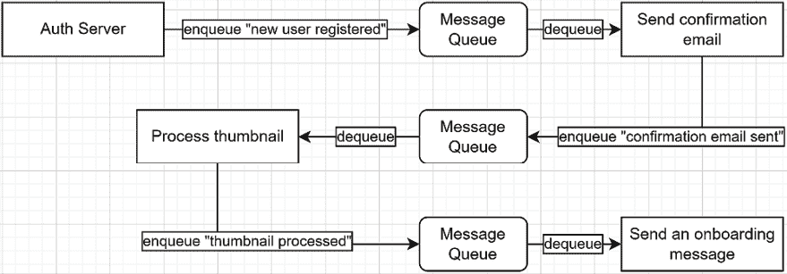

图 19.2：用户创建账户后按顺序执行三个操作的流程图

在这种情况下，如果处理缩略图操作期间进程崩溃，用户将不会收到**欢迎信息**。另一个缺点是，要在**处理缩略图**和**发送欢迎信息**步骤之间插入新的操作，我们必须修改**发送欢迎信息**操作（紧耦合）。如果顺序不重要，我们可以在用户创建后立即，像这样将所有来自**认证服务器**的消息排队：

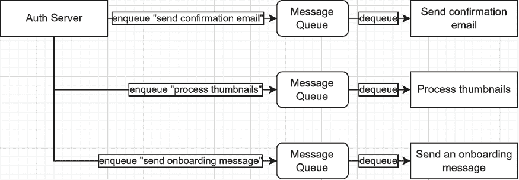

图 19.3：*认证服务器*正在按顺序排队操作，而不同的进程并行执行它们

这个过程更好，但现在*认证服务器*控制着一旦创建新用户后应该发生什么。在之前的流程中，*认证服务器*正在排队一个事件，告诉系统有新用户注册。然而，现在，它必须意识到后处理流程，以便按顺序排队每个操作以排队正确的命令。这样做本身并没有错，当你深入研究代码时，它更容易理解，但它会在*认证服务器*了解外部过程的各个服务之间创建更紧密的耦合。此外，它将太多的责任打包到*认证服务器*中。

> 从 SRP（单一责任原则）的角度来看，为什么认证/授权服务器除了认证、授权和管理那些数据之外，还要负责其他任何事情？

如果我们从那里继续并想在两个现有步骤之间添加一个新操作，我们只需修改*认证服务器*，这比先前的流程更不容易出错。如果我们想两者兼得，我们可以使用**发布-订阅**模式，我们将在下一节中介绍，并在此基础上继续构建。

### 结论

如果你需要消息按顺序传递，队列可能是一个合适的工具。我们探索的例子从一开始就注定会失败，但它允许我们探索设计系统背后的思考过程。有时，第一个想法并不是最好的，可以通过探索新的做事方式或学习新技能来改进。对他人想法的开放心态也可能导致更好的解决方案。

> 有时候，只是大声说出来，我们自己的大脑就能自己解决问题。所以向某人解释问题，看看会发生什么。

消息队列在为高需求场景缓冲消息方面非常出色，在这些场景中，应用程序可能无法处理流量峰值。在这种情况下，消息将被入队，以便应用程序可以以自己的速度赶上，按顺序读取它们。实现分布式消息队列需要大量的知识和努力，并且对于几乎所有场景来说都不值得。大型云提供商如 AWS 和 Azure 提供完全管理的消息队列系统作为服务。您还可以查看**ActiveMQ**、**RabbitMQ**或任何**高级消息队列协议**（**AMQP**）代理。选择正确的队列系统的一个基本方面是您是否准备好并具备管理自己的分布式消息队列的技能。假设您想加快开发速度，降低基础设施管理成本，并且有足够的资金。在这种情况下，您可以使用至少生产环境的完全管理服务，尤其是如果您预计会有大量消息。另一方面，使用本地或本地实例进行开发或较小规模的用途可能会节省您相当一部分资金。选择具有完全管理云提供的开源系统是实现这两者的好方法：低本地开发成本，以及始终可用的、性能始终如一的高性能云生产服务，服务提供商为您维护。另一个方面是，您的选择应基于需求。有明确的要求，并确保您选择的系统能够满足您的需求。一些服务涵盖了多个用例，如队列和发布-订阅，从而简化了技术堆栈，需要更少的技能。在转向发布-订阅模式之前，让我们看看消息队列如何帮助我们遵循**SOLID**原则在应用规模上：

+   **S**: 帮助在应用程序或组件之间集中和分配责任，而无需它们直接相互了解，从而打破紧密耦合。

+   **O**: 允许我们更改消息生产者或订阅者的行为，而无需对方知道。

+   **L**: 无

+   **I**: 每个消息和处理程序都可以小到所需的程度，而每个微服务则间接与其他微服务交互以解决更大的问题。

+   **D**: 通过不知道其他依赖项（打破微服务之间的紧密耦合），每个微服务只依赖于消息（抽象）而不是具体实现（其他微服务的 API）。

一个缺点是消息入队和消息处理之间的延迟。我们将在后续章节中更详细地讨论延迟和延迟。

## 实现发布-订阅模式

**发布-订阅**（Publish-Subscribe）模式（Pub-Sub）类似于我们在使用 **MediatR** 和在 *开始使用消息队列* 部分中探索的内容。然而，我们不是向一个处理器（或入队一个消息）发送一个消息，而是向零个或多个订阅者（处理器）发布（发送）一个消息（事件）。此外，发布者对订阅者一无所知；它只发送消息，希望一切顺利（也称为 **fire and forget**）。

> 使用消息队列并不意味着你只能限制于只有一个接收者。

我们可以通过 **发布-订阅**（Publish-Subscribe）模式在进程内或分布式系统中通过 **消息代理**（message broker）来实现。消息代理负责将消息传递给订阅者。对于微服务和其他分布式系统来说，使用消息代理是最佳选择，因为它们不是在单个进程中运行的。这种模式与其他通信方式相比具有许多优势。例如，我们可以通过重放系统中发生的事件来重新创建数据库的状态，从而实现 **事件溯源**（event sourcing）模式。关于这一点，我们稍后再详细讨论。设计取决于用于传递消息的技术和系统的配置。例如，你可以使用 **MQTT** 将消息传递到 **物联网**（**IoT**）设备，并配置它们在每个主题上保留最后发送的消息。这样，当设备连接到主题时，它会收到最新的消息。你也可以配置一个保留大量消息历史的 **Kafka** 代理，当新的系统连接到它时，它会请求所有这些消息。所有这些都取决于你的需求和需求。

> **MQTT 和 Apache Kafka**
> 
> > 如果你想知道 MQTT 是什么，这里是从他们的网站 [`adpg.link/mqtt`](https://adpg.link/mqtt) 上的引用：
> > 
> > *“MQTT 是一个 OASIS 标准，用于物联网 (IoT) 的消息协议。它被设计为一个极轻量级的发布/订阅消息传输 [...]”*
> > 
> > 这里引用了 Apache Kafka 网站上的话 [`adpg.link/kafka`](https://adpg.link/kafka):
> > 
> > *“Apache Kafka 是一个开源的分布式事件流平台 [...]”*

我们无法涵盖遵循每个协议的每个系统的每个场景。因此，我将强调 Pub-Sub 设计模式背后的某些共享概念，以便你知道如何开始。然后，你可以深入研究你想要（或需要）使用的特定技术。主题是一种组织事件的方式，一个频道，一个读取或写入特定事件的地点，以便消费者知道在哪里找到它们。正如你可能想象的那样，将所有事件发送到同一个地方就像创建一个只有一个表的数据库关系型数据库：这将是不太理想的，难以管理、使用和演进。为了接收消息，订阅者必须订阅主题（或主题的等效物）：


图 19.4：一个订阅者订阅了一个发布/订阅主题

Pub-Sub 模式的第二部分是发布消息，如下所示：

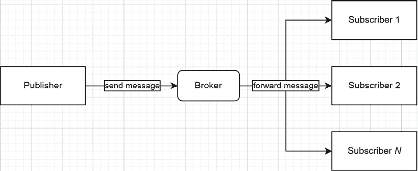

图 19.5：发布者正在向消息代理发送消息。然后代理将此消息转发给*N*个订阅者，其中*N*可以是零个或更多

这里许多抽象的细节取决于代理和协议。然而，以下是基于发布-订阅模式的两个主要概念：

+   发布者向主题发布消息。

+   订阅者订阅主题以在消息发布时接收消息。

> 安全性是一个重要的实现细节，这里没有展示。在大多数系统中，安全性是强制性的；不是每个子系统或设备都应该有权访问所有主题。

发布者和订阅者可以是任何系统的任何部分。例如，许多 Microsoft Azure 服务都是发布者（例如，Blob 存储）。然后，您可以让其他 Azure 服务（例如，Azure Functions）订阅这些事件并对它们做出反应。您还可以在您的应用程序中使用**发布-订阅**模式——不需要使用云资源；这甚至可以在同一个进程中完成（我们将在下一章中探讨这一点）。发布-订阅模式最显著的优势是打破系统之间的紧密耦合。一个系统发布事件，而其他系统消费它们，而无需系统相互了解。这种松散的耦合导致可伸缩性，其中每个系统可以独立扩展，并且可以使用所需资源并行处理消息。由于系统对彼此一无所知，因此更容易将新流程添加到工作流中。要添加一个对新事件做出反应的新流程，您只需创建一个新的微服务，部署它，开始监听一个或多个事件，并处理它们。不利的一面是，消息代理可能成为应用程序的单点故障，必须适当地配置。还必须考虑每种消息类型最佳的分发策略。策略的一个例子可能是确保关键消息的传递，同时延迟不那么紧急的消息，并在负载激增期间丢弃不重要的消息。如果我们回顾一下之前使用发布-订阅的例子，我们最终得到以下简化的工作流程：

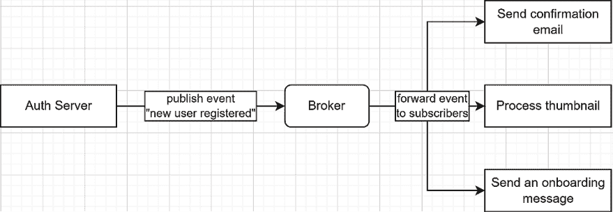

图 19.6：认证服务器正在发布一个表示创建新用户的事件的条目。然后代理将此消息转发给三个订阅者，他们随后并行执行他们的任务

基于这个工作流程，我们打破了**认证服务器**和注册后流程之间的紧密耦合。**认证服务器**对工作流程一无所知，各个服务之间也互不关心。此外，如果我们想添加一个新任务，我们只需创建或更新一个订阅正确主题（在这种情况下，是“新用户注册”主题）的微服务。当前系统不支持同步，也不处理流程失败或重试，但这是一个良好的开端，因为我们结合了消息队列示例的优点，而将缺点留在了后面。使用事件代理反转了依赖流。我们探讨的图显示了消息流，但这里发生的是事物依赖方面的变化：

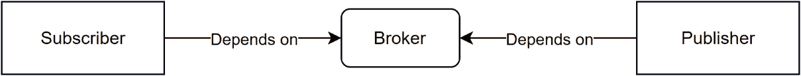

图 19.7：一个表示使用发布-订阅模式反转依赖流的图

现在我们已经探讨了发布-订阅模式，接下来我们看看消息代理，然后深入探讨事件驱动架构（EDA），并利用发布-订阅模式创建一个可重放的持久化事件数据库：事件溯源模式。

### 消息代理

消息代理是一种程序，它允许我们发送（**发布**）和接收（**订阅**）消息。它在规模上扮演着调解者的角色，使得多个应用程序能够相互通信而无需彼此了解（**松耦合**）。消息代理通常是任何实现发布-订阅模式的基于事件的分布式系统的核心组件。一个应用程序（**发布者**）将消息发布到主题，而其他应用程序（**订阅者**）则从这些主题接收消息。**主题**的概念可能因协议或系统而异，但我知道的所有系统都有一个类似主题的概念，用于将消息路由到正确的位置。例如，您可以使用 Kafka 将消息发布到`Devices`主题，但使用 MQTT 则发布到`devices/abc-123/do-something`。您如何命名主题在很大程度上取决于您所使用的系统和您安装的规模。例如，MQTT 是一种轻量级的事件代理，推荐使用路径式命名约定。另一方面，Apache Kafka 是一个功能齐全的事件代理和事件流平台，对主题名称没有固定看法，让您负责这一点。根据您实现的规模，您可以使用实体名称作为主题名称，或者可能需要前缀来识别企业中谁可以与系统的哪个部分交互。由于本章中示例的规模较小，我们坚持使用简单的主题名称，使示例更容易理解。消息代理负责将消息转发给已注册的接收者。这些消息的寿命可能因代理而异，甚至可能因单个消息或主题而异。市面上有多种使用不同协议的消息代理。一些代理是基于云的，如 Azure Event Grid。其他代理轻量级且更适合物联网，如 Eclipse Mosquitto/MQTT。与 MQTT 相比，其他代理更健壮，允许高速数据流，如 Apache Kafka。您应该根据您正在构建的软件的需求来选择使用哪种消息代理。此外，您并不局限于一个代理。没有任何东西阻止您选择一个处理微服务之间对话的消息代理，同时使用另一个处理与外部物联网设备之间对话的代理。如果您在 Azure 上构建系统，希望无服务器化，或者更喜欢为可扩展的 SaaS 组件付费而不投入维护时间，您可以利用 Azure 服务，如 Event Grid、Service Bus 和 Queue Storage。如果您更喜欢开源软件，您可以选择 Apache Kafka，如果您不想管理自己的集群，甚至可以使用 Confluent Cloud 作为服务运行一个完全管理的云实例。

### 事件溯源模式

现在我们已经探讨了发布-订阅模式，了解了事件是什么，也讨论了事件代理，是时候探索**如何回放应用程序的状态**了。为了实现这一点，我们可以遵循**事件溯源模式**。事件溯源背后的理念是**存储一系列按时间顺序排列的事件**，而不是单个实体，其中这些事件的集合成为真相的来源。这样，每个单独的操作都按正确的顺序保存，有助于处理并发。此外，我们可以回放所有这些事件以生成新应用程序中对象的当前状态，使我们能够更容易地部署新的微服务。除了存储数据之外，如果系统使用事件代理传播它，其他系统可以将其缓存为一种或多种**物化视图**。

> **物化视图**是为特定目的创建和存储的模型。数据可以来自一个或多个来源，在查询该数据时提高性能。例如，应用程序返回物化视图，而不是查询多个其他系统以获取数据。您可以将物化视图视为一个缓存的实体，微服务将其存储在其自己的数据库中。

事件溯源的一个缺点是数据一致性。当服务将事件添加到存储中时与所有其他服务更新其物化视图之间存在不可避免的延迟。我们称这种现象为**最终一致性**。

> **最终一致性**意味着数据将在未来的某个时刻变得一致，但不是立即。延迟可能从几毫秒到更长的时间，但目标是尽可能减小这个延迟。

另一个缺点是创建这样一个系统与查询单个数据库的单个应用程序相比的复杂性。像微服务架构一样，事件溯源不仅仅是彩虹和独角兽。它是有代价的：**操作复杂性**。

> 在微服务架构中，每个部分都更小，但将它们粘合在一起是有成本的。例如，支持微服务的基础设施比单体（一个应用程序和一个数据库）更复杂。对于事件溯源也是如此；所有应用程序都必须订阅一个或多个事件，缓存数据（物化视图），发布事件，等等。这种**操作复杂性**代表了复杂性从应用程序代码转移到操作基础设施的转变。换句话说，部署和维护多个微服务和数据库以及与这些外部系统之间可能的不稳定网络通信需要更多的工作，比包含所有代码的单个应用程序要多。单体更简单：要么工作，要么不工作；很少部分工作。

事件溯源的关键方面是将新事件追加到存储中，并且永远不更改现有事件（仅追加）。简而言之，使用 Pub-Sub 模式通信的微服务发布事件，订阅主题，并生成物化视图以服务其客户端。

### 示例

让我们探讨一下如果我们结合我们刚刚学习的内容可能会发生什么的情况。**上下文**：我们需要构建一个管理物联网设备的程序。我们首先创建两个微服务：

+   `DeviceTwin` 微服务处理物联网设备孪生的数据（设备的数字表示）。

+   `Networking` 微服务管理物联网设备的网络相关信息（如何到达设备）。

作为视觉参考，最终系统可能看起来如下（我们稍后介绍 `DeviceLocation` 微服务）：

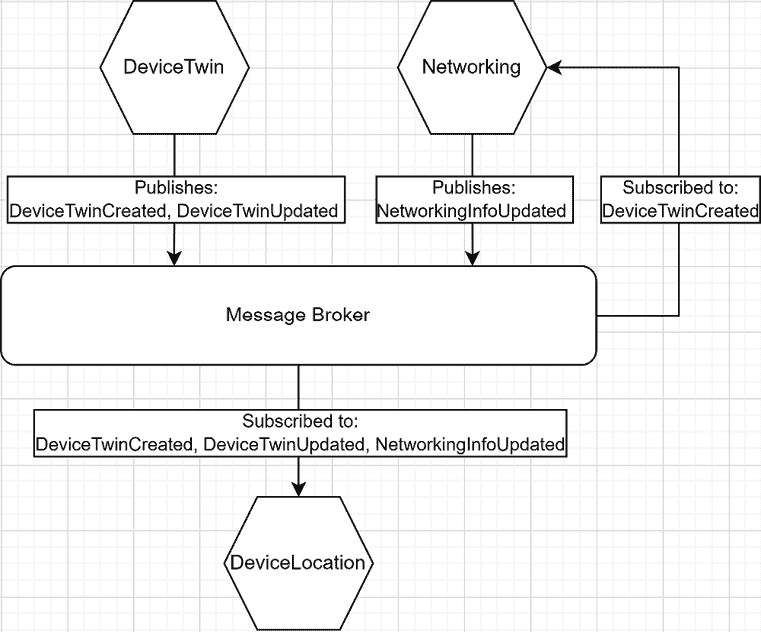

图 19.8：三个微服务使用发布-订阅模式进行通信

这里列出了用户交互和发布的事件：

1.  用户在系统中创建了一个名为 Device 1 的孪生体。`DeviceTwin` 微服务保存数据并发布以下负载的 `DeviceTwinCreated` 事件：

```cs
{
    "id": "some id",
    "name": "Device 1",
    "other": "properties go here..."
}
```

同时，`Networking` 微服务必须知道何时创建设备，因此它订阅了 `DeviceTwinCreated` 事件。当创建新设备时，`Networking` 微服务在其数据库中为该设备创建默认网络信息；默认为 `unknown`。这样，`Networking` 微服务就知道哪些设备存在或不存在：

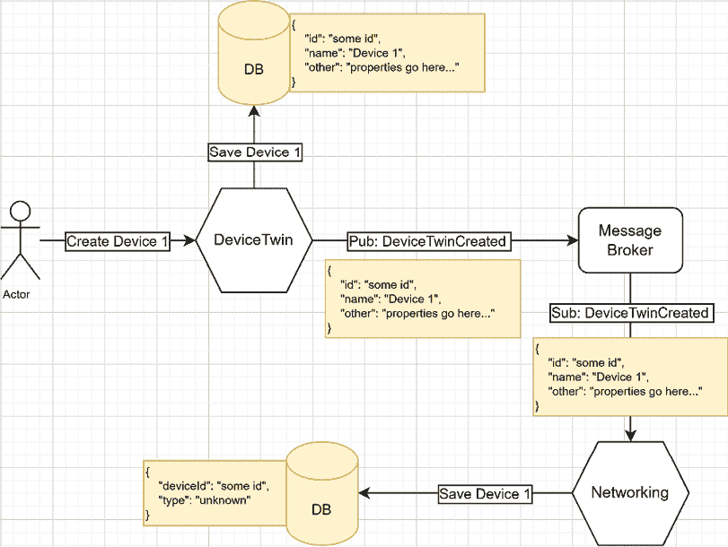

图 19.9：表示创建设备孪生及其默认网络信息的流程

1.  用户随后更新了该设备的网络信息，并将其设置为 `MQTT`。`Networking` 微服务保存数据并发布以下负载的 `NetworkingInfoUpdated` 事件：

```cs
{
    "deviceId": "some id",
    "type": "MQTT",
    "other": "networking properties..."
}
```

这可以通过以下图表来演示：

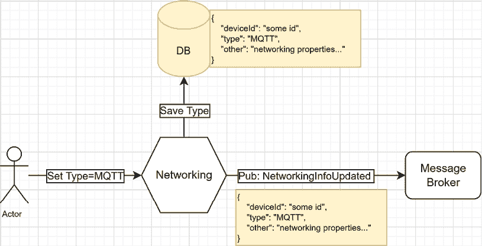

图 19.10：表示更新设备网络类型的流程

1.  用户将设备的显示名称更改为 `Kitchen Thermostat`，这更相关。`DeviceTwin` 微服务保存数据并发布以下负载的 `DeviceTwinUpdated` 事件。负载使用 **JSON 补丁**来发布仅有的差异而不是整个对象（有关更多信息，请参阅 *进一步阅读* 部分）：

```cs
{
    "id": "some id",
    "patches": [
        { "op": "replace", "path": "/name", "value": "Kitchen Thermostat" },
    ]
}
```

以下图表展示了这一点：

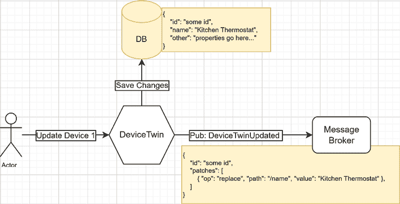

图 19.11：表示用户将设备名称更新为 Kitchen Thermostat 的流程

从那里，假设另一个团队设计并构建了一个新的微服务，该服务组织物理位置的设备。这个新的 `DeviceLocation` 微服务允许用户在地图上可视化他们的设备位置，例如他们的家中的地图。《DeviceLocation》微服务订阅所有三个事件来管理其物化视图，如下所示：

+   当接收到一个 `DeviceTwinCreated` 事件时，它会保存其唯一标识符和显示名称。

+   当接收到一个 `NetworkingInfoUpdated` 事件时，它会保存通信类型。

+   当接收到一个 `DeviceTwinUpdated` 事件时，它会更新设备的显示名称。

当服务首次部署时，它会从开始处重新播放所有事件（**事件溯源**）；以下是发生的情况：

1.  《DeviceLocation》接收到 `DeviceTwinCreated` 事件并为该对象创建以下模型：

```cs
{
    "device": {
        "id": "some id",
        "name": "Device 1"
    },
    "networking": {},
    "location": {...}
}
```

以下图表展示了这一点：

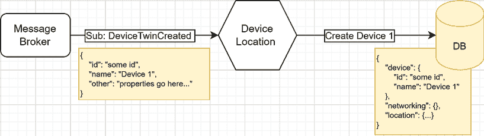

图 19.12：DeviceLocation 微服务重新播放 DeviceTwinCreated 事件以创建其设备孪生的物化视图

1.  《DeviceLocation》微服务接收到 `NetworkingInfoUpdated` 事件，该事件将网络类型更新为 `MQTT`，导致以下结果：

```cs
{
    "device": {
        "id": "some id",
        "name": "Device 1"
    },
    "networking": {
        "type": "MQTT"
    },
    "location": {...}
}
```

以下图表展示了这一点：

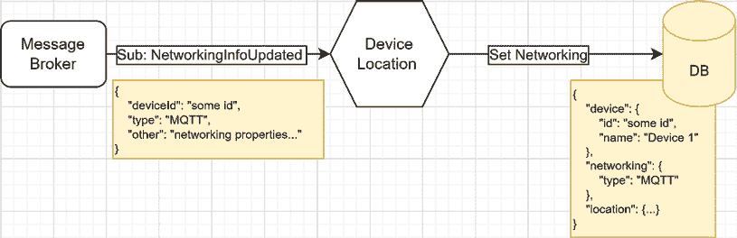

图 19.13：DeviceLocation 微服务重新播放 NetworkingInfoUpdated 事件以更新其设备孪生的物化视图

1.  《DeviceLocation》微服务接收到 `DeviceTwinUpdated` 事件，更新设备的名称。最终的模型如下所示：

```cs
{
    "device": {
        "id": "some id",
        "name": "Kitchen Thermostat"
    },
    "networking": {
        "type": "MQTT"
    },
    "location": {...}
}
```

以下图表展示了这一点：

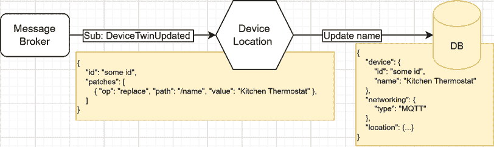

图 19.14：DeviceLocation 微服务重新播放 DeviceTwinUpdated 事件以更新其设备孪生的物化视图

从那里，`DeviceLocation` 微服务被初始化并准备就绪。用户可以在地图上设置厨房恒温器的位置或继续使用其他微服务。当用户查询 `DeviceLocation` 微服务以获取 `Kitchen Thermostat` 的信息时，它显示 **物化视图**，其中包含所有所需信息，而无需发送外部请求。考虑到这一点，我们可以生成 `DeviceLocation` 微服务或其他微服务的新实例，它们可以从过去的事件中生成它们的物化视图——所有这些都可以在非常有限或没有其他微服务的知识的情况下完成。在这种类型的架构中，微服务只能了解事件，而不能了解其他微服务。微服务处理事件的方式应该只与该微服务相关，而永远不要与其他微服务相关。这一点同样适用于发布者和订阅者。这个例子说明了事件源模式、集成事件、物化视图、消息代理的使用以及发布-订阅模式。相比之下，使用直接通信（HTTP、gRPC 等）将看起来像这样：

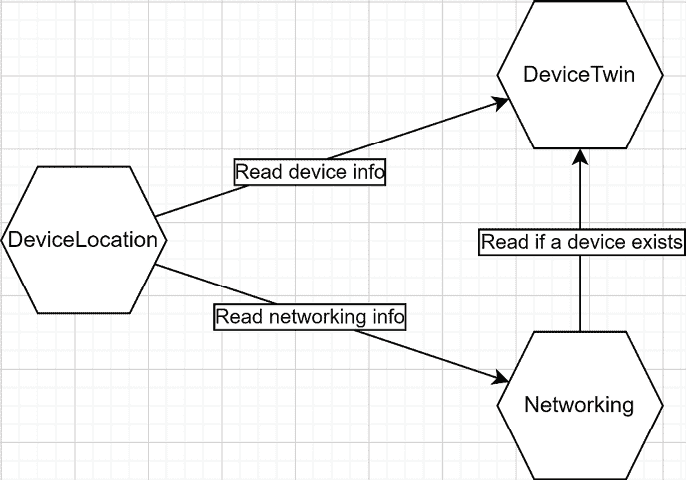

图 19.15：三个微服务直接相互通信

如果我们通过查看第一个图（*图 16.7*）来比较这两种方法，我们可以看到消息代理扮演着 **调解者** 的角色，并打破了微服务之间的直接耦合。通过查看前面的图（*图 16.14*），我们可以看到微服务之间的紧密耦合，其中 `DeviceLocation` 微服务需要直接与 `DeviceTwin` 和 `Networking` 微服务交互，以构建其物化视图的等效物。此外，`DeviceLocation` 微服务将一次交互转换为三次，因为 `Networking` 微服务也与其他的 `DeviceTwin` 微服务进行通信，导致微服务之间的间接紧密耦合，这可能会对性能产生负面影响。假设最终一致性不是一个选项，或者发布-订阅模式不能应用于您的场景，或者应用起来可能过于困难。在这种情况下，微服务可以直接相互调用。它们可以使用 HTTP、gRPC 或任何最适合该特定系统需求的任何其他方式来实现。我不会在本书中涵盖这个主题，但直接调用微服务时需要注意的一点是可能会迅速冒泡的间接调用链。您不希望您的微服务创建一个超级深的调用链，否则您的系统可能会变得非常慢。以下是一个抽象示例，说明可能会发生什么，以说明我的意思：

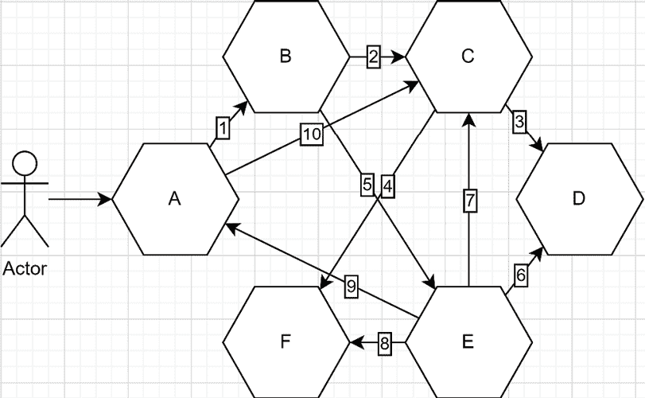

图 19.16：一个用户调用微服务 A，然后触发一系列后续调用，导致灾难性的性能

根据前面的图示，让我们思考一下失败的情况（以一个为例）。如果微服务 C 离线，整个请求将以错误结束。无论我们采取什么措施来减轻风险，如果微服务 C 无法恢复，系统将保持故障状态；微服务的独立性承诺就此破灭。另一个问题是延迟：对一个单一操作就需要进行十个调用；这需要时间。这种健谈的系统很可能源于错误的领域建模阶段，导致多个微服务共同处理琐碎的任务。现在想象一下*图 16.15*，但用 500 个微服务代替 6 个。那可能是灾难性的！这种相互依赖的微服务系统被称为**死亡之星反模式**。我们可以将死亡之星反模式视为一个*分布式的大泥球*。避免这种陷阱的一种方法是确保边界上下文得到良好的隔离，并且责任得到良好的分配。一个好的领域模型应该允许你避免构建死亡之星，并创建“最正确”的系统。无论你选择哪种类型的架构，如果你没有构建正确的东西，你可能会得到一个大泥球或死亡之星。当然，发布/订阅模式和事件驱动架构可以帮助我们打破微服务之间的紧密耦合，避免此类问题。

### 结论

发布-订阅模式使用事件来打破应用程序各部分之间的紧密耦合。在微服务架构中，我们可以使用消息代理和集成事件，允许微服务间接地相互通信。现在，不同的部分通过表示事件的（其模式）数据合约而不是彼此耦合，这可能导致灵活性的潜在提升。这种类型架构的一个风险是，通过在不通知它们或没有事件版本控制的情况下发布事件格式的破坏性更改，从而破坏事件的消费者。因此，彻底思考事件模式演变至关重要。大多数系统都会发展，事件也是如此，但因为在发布-订阅模型中，模式是系统之间的粘合剂，所以必须将其视为此类。一些代理，如 Apache Kafka，提供模式存储和其他机制来帮助这些；一些则没有。然后，我们可以利用事件源模式来持久化这些事件，允许新的微服务通过重放过去的事件来填充其数据库。事件存储随后成为这些系统的真相来源。事件源对于跟踪和审计目的也非常有用，因为整个历史都被持久化了。我们还可以重放消息以在任何给定时间点重新创建系统的状态，这使得它在调试目的上非常强大。在开始事件源路径之前，必须考虑事件存储的存储大小需求。事件存储可能会非常大，因为我们一直在从时间开始就保留所有消息，并且可以根据发送的事件数量快速增长。你可以压缩历史记录以减少数据大小，但会丢失部分历史记录。再次强调，你必须根据需求做出决定，并问自己适当的问题。例如，是否可以接受丢失部分历史记录？我们应该保留数据多长时间？如果我们以后需要，是否希望以更便宜的价格存储原始数据？我们甚至需要重放功能吗？我们能否负担得起永远保留所有数据？系统必须遵循的数据保留策略或法规是什么？根据你想要解决的特定业务问题，制定你的问题清单。此建议适用于软件工程的各个方面：首先明确业务问题，然后找到解决问题的方法。这些模式可能很有吸引力，但学习和实施需要时间。像消息队列一样，云提供商提供完全管理的代理作为服务。这些服务可能比构建和维护自己的基础设施更快地开始。如果你喜欢构建服务器，你可以使用开源软件“经济”地构建你的堆栈，或者支付此类软件的托管实例以节省麻烦。与消息队列相同的提示也适用于此处；例如，你可以利用托管服务来处理生产环境，并在开发人员的机器上使用本地版本。Apache Kafka 是最受欢迎的事件代理之一，它提供了高级功能，如事件流。Kafka 提供了部分和完全管理的云服务，如 Confluent Cloud。Redis Pub/Sub 是另一个具有完全管理云服务的开源项目。Redis 也是一个流行的键值存储，适用于分布式缓存场景。其他服务（但不限于）包括 Solace PubSub+、RabbitMQ 和 ActiveMQ。再次建议，将服务与你的需求进行比较，以在你的场景中做出最佳选择。现在，让我们看看发布-订阅模式如何帮助我们遵循**SOLID**原则在云规模上：

+   **S**：有助于在应用程序或组件之间集中和划分责任，而它们无需直接了解彼此，从而打破紧密耦合。

+   **O**：允许我们改变发布者和订阅者的行为，而不会直接影响其他微服务（打破它们之间的紧密耦合）。

+   **L**：N/A

+   **I**：每个事件可以小到所需的程度，导致多个较小的通信接口（数据合同）。

+   **D**：微服务依赖于事件（抽象）而不是具体实现（其他微服务），这打破了它们之间的紧密耦合，并反转了依赖关系流。

正如你可能已经注意到的，发布/订阅（pub-sub）与消息队列非常相似。主要区别在于消息的读取和分发方式：

+   队列：消息一次一个地被拉取，由一个服务消费，然后消失。

+   发布/订阅（Pub-Sub）：消息按顺序读取，并发送给所有消费者，而不是像队列那样只发送给一个。

> 我故意将**观察者设计模式**排除在这本书之外，因为我们很少在.NET 中使用它。C# 提供了多播事件，这些事件在大多数情况下可以很好地替代观察者模式。如果你不知道观察者模式，不要担心——可能性很大，你永远不会需要它。不过，如果你已经知道观察者模式，这里有一些它与发布/订阅模式之间的区别。
> 
> > 在观察者模式中，主题保持其观察者的列表，从而直接了解它们的存在。具体的观察者也经常了解主题，导致对其他实体的更多了解和更多耦合。
> > 
> > 在发布/订阅模式中，发布者不知道订阅者；它只知道消息代理。订阅者也不知道发布者，只知道消息代理。发布者和订阅者仅通过它们发布或接收的消息的数据合同相连接。
> > 
> > 我们可以将发布/订阅模式视为观察者模式的分布式演变，或者更确切地说，就像在观察者模式中添加一个中介。

接下来，我们将探讨一些直接通过访问一种新的**外观**（Façade）——网关——来调用其他微服务的模式。

## 引入网关模式

当构建面向微服务的系统时，服务的数量随着功能的数量增长；系统越大，微服务的数量就越多。当你考虑一个必须与这种系统交互的用户界面时，这可能会变得繁琐、复杂和低效（从开发和速度的角度来看）。网关可以帮助我们实现以下目标：

+   通过将请求路由到适当的服务来隐藏复杂性。

+   通过聚合响应并将一个外部请求翻译成多个内部请求来隐藏复杂性。

+   通过仅暴露客户端需要的功能子集来隐藏复杂性。

+   将请求翻译成另一种协议。

网关还可以集中管理不同的流程，例如日志记录和缓存请求、验证和授权用户和客户端、实施请求速率限制以及其他类似策略。您可以将网关视为门面，但它不是程序中的一个类，而是一个独立的程序，保护其他程序。网关模式有多种变体，我们在这里探讨了其中许多。无论您需要哪种类型的网关，您都可以自己编写代码，或者利用现有工具来加速开发过程。

> 请注意，您的自建网关版本 1.0 可能比经过验证的解决方案存在更多缺陷。这个提示不仅适用于网关，也适用于大多数复杂系统。话虽如此，有时没有经过验证的解决方案能完全满足我们的需求，我们必须自己编写代码，这就是真正的乐趣所在！

一个可能帮助到您的开源项目是 Ocelot ([`adpg.link/UwiY`](https://adpg.link/UwiY))。它是一个用 C# 编写的 API 网关，支持我们从网关期望的许多功能。您可以使用配置来路由请求，或者编写自定义代码来创建高级路由规则。由于它是开源的，您可以对其进行贡献、分叉，并在必要时探索源代码。如果您想要一个具有长列表功能的托管服务，您可以探索 Azure API Management ([`adpg.link/8CEX`](https://adpg.link/8CEX))。它支持安全性、负载均衡、路由等。它还提供了一个服务目录，团队可以在此咨询和管理与内部团队、合作伙伴和客户的 API。我们可以将网关视为提供高级功能的**反向代理**。网关检索客户端请求的信息，这些信息可能来自一个或多个资源，可能来自一个或多个服务器。反向代理通常只将请求路由到一台服务器。反向代理通常充当负载均衡器。微软发布了一个名为 YARP 的反向代理，用 C# 编写且为开源项目 ([`adpg.link/YARP`](https://adpg.link/YARP))。微软为他们的内部团队构建了它。现在，YARP 是 Azure App Service 的一部分 ([`adpg.link/7eu4`](https://adpg.link/7eu4))。如果 YARP 满足您的需求，它似乎是一个足够稳定的投资产品，随着时间的推移将发展和维护。此类服务的显著优势是能够与您的应用程序一起部署，可选地作为容器，允许我们在开发期间本地使用它。现在，让我们探索几种网关类型。

### 网关路由模式

我们可以通过让网关路由请求到适当的服务来使用这种模式来隐藏我们系统的复杂性。例如，假设我们有两个微服务：一个存储我们的设备数据，另一个管理设备位置。我们想显示特定设备（`id=102`）的最新已知位置，并显示其名称和型号。为了实现这一点，用户请求网页，然后网页调用两个服务（见以下图示）。`DeviceTwin` 微服务可通过 `service1.domain.com` 访问，而 `Location` 微服务可通过 `service2.domain.com` 访问。从那里，Web 应用程序必须跟踪这两个服务、它们的域名和它们的操作。随着我们添加更多的微服务，UI 必须处理更多的复杂性。此外，如果我们决定将 `service1` 改为 `device-twins`，将 `service2` 改为 `location`，我们还需要更新 Web 应用程序。如果只有一个 UI，那还算不错，但如果我们有多个用户界面，每个界面都必须处理这种复杂性。此外，如果我们想在私有网络内隐藏微服务，除非所有用户界面也都是该私有网络的一部分（这会暴露它），否则将不可能实现。以下是表示之前提到的交互的图示：

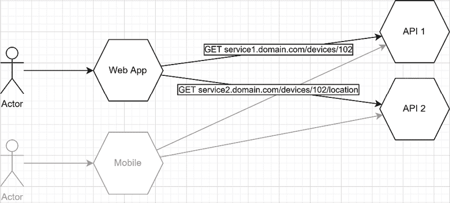

图 19.17：直接调用两个微服务的 Web 应用程序和移动应用程序

我们可以实施一个网关来为我们解决这些问题进行路由。这样，UI 只需要知道网关，而不是知道通过什么子域名可以访问哪些服务：

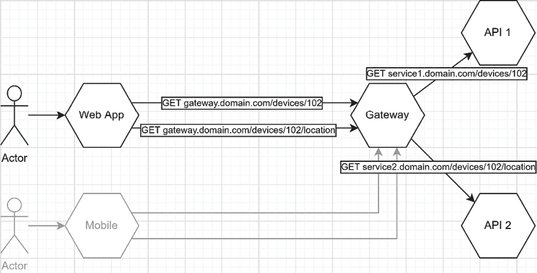

图 19.18：通过网关应用程序调用两个微服务的 Web 应用程序和移动应用程序

当然，这会带来一些可能的问题，因为网关成为了一个单点故障。我们可以考虑使用负载均衡器来确保我们有足够的可用性和快速的性能。由于所有请求都通过网关传递，我们可能还需要在某个时候对其进行扩展。我们还应该确保网关支持故障，通过实现不同的弹性模式，如**重试**和**断路器**。随着你部署的微服务数量和发送到这些微服务的请求数量的增加，网关另一侧发生错误的可能性也会增加。您还可以使用路由网关重新路由 URI 以创建更易于使用的 URI 模式。您还可以重新路由端口；添加、更新或删除 HTTP 头；等等。让我们探索相同的示例，但使用不同的 URI。让我们假设以下：

| **微服务** | **URI** |
| --- | --- |
| API 1（获取设备） | `internal.domain.com:8001/{id}` |
| API 2（获取设备位置） | `internal.domain.com:8002/{id}` |

表 19.1：内部微服务 URI 模式。

UI 开发者可能更难记住哪个端口通向哪个微服务以及它在做什么（而且谁能责怪他们呢？）。此外，我们无法像之前那样传输请求（仅路由域名）。我们可以使用网关作为为开发者创建记忆 URI 模式的方式，如下所示：

| **网关 URI** | **微服务 URI** |
| --- | --- |
| `gateway.domain.com/devices/{id}` | `internal.domain.com:8001/{id}` |
| `gateway.domain.com/devices/{id}/location` | `internal.domain.com:8002/{id}` |

表 19.1：易于使用且语义上有意义的记忆 URI 模式。

如我们所见，我们排除了端口，以创建可用的、有意义的、易于记忆的 URI。然而，我们仍然向网关发送两个请求来显示一条信息（设备的地理位置及其名称/型号），这导致我们转向下一个网关模式。

### 网关聚合模式

我们还可以赋予网关另一个角色，即聚合请求以隐藏其消费者的复杂性。将多个请求聚合为一个请求，使得微服务系统的消费者更容易与之交互；客户端只需要知道一个端点而不是多个端点。此外，它将客户端的冗余从客户端转移到网关，网关更靠近微服务，降低了多次调用的延迟，从而使得请求-响应周期更快。继续我们之前的例子，我们有两个用户界面应用，它们包含一个在识别设备名称/型号之前在地图上显示设备位置的功能。为了实现这一点，它们必须调用设备孪生端点以获取设备的名称和型号以及位置端点以获取其最后已知位置。因此，显示一个小框的两次请求乘以两个用户界面意味着四个请求来维护一个简单的功能。如果我们外推，我们可能会为少量功能管理大量的 HTTP 请求。以下是显示我们当前状态的功能图：


图 19.19：一个通过网关应用调用两个微服务的 Web 应用和移动应用

为了解决这个问题，我们可以应用网关聚合模式来简化我们的用户界面，并将管理这些细节的责任转移到网关。通过应用网关聚合模式，我们最终得到以下简化的流程：

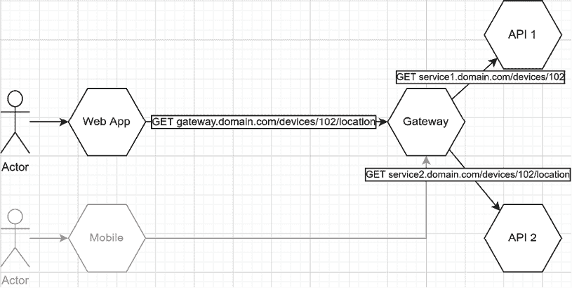

图 19.20：一个网关，它聚合了两个请求的响应，以服务于来自 Web 应用和移动应用的单一请求

在之前的流程中，Web 应用调用网关，网关调用两个 API，然后制作一个结合从 API 获取的两个响应的响应。然后网关将此响应返回给 Web 应用。有了这个，Web 应用与两个 API 松散耦合，而网关充当中间人。仅通过一个 HTTP 请求，Web 应用就拥有了它所需的所有信息，由网关聚合。接下来，让我们探索发生的步骤。以下图表显示 Web 应用发起一个请求（1），而网关发起两个调用（2 和 4）。在图表中，请求是按顺序发送的，但我们也可以并行发送它们以加快速度：

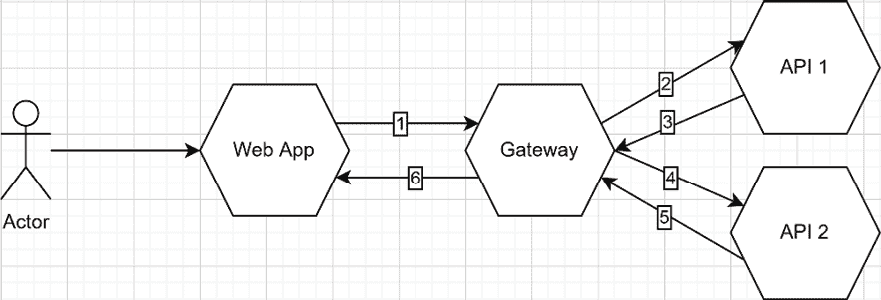

图 19.21：请求发生的顺序

与路由网关一样，聚合网关也可能成为应用程序的瓶颈和单点故障，因此要小心。另一个重要点是网关和内部 API 之间的延迟。如果延迟太高，客户端将等待每个响应。因此，将网关部署在与它交互的微服务附近可能对系统性能至关重要。网关还可以实现缓存以进一步提高性能并使后续请求更快。接下来，我们将探索另一种类型的网关，它创建的是专用网关而不是通用网关。

### 后端前端模式

后端前端（BFF）模式是网关模式的一种另一种变体。在后端前端模式中，我们不是构建一个通用网关，而是为每个用户界面（与系统交互的每个应用程序）构建一个网关，从而降低复杂性。此外，它允许对暴露哪些端点进行精细控制。它消除了当对应用 A 进行更改时应用 B 可能崩溃的机会。许多优化可以由此模式产生，例如，只发送每个调用所需的必要数据，而不是发送只有少数应用程序使用的数据，从而在过程中节省一些带宽。假设我们的 Web 应用需要显示更多关于设备的详细信息。为了实现这一点，我们需要更改端点并将这些额外信息发送到移动应用。然而，移动应用不需要这些信息，因为它没有足够的空间在屏幕上显示它。接下来是一个更新的图表，用两个网关替换了单个网关，每个前端一个：

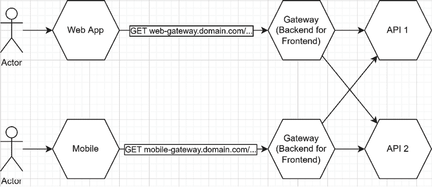

图 19.22：两个后端前端网关；一个用于 Web 应用，一个用于移动应用

通过这样做，我们可以为每个前端开发特定的功能，而不会影响其他部分。现在每个网关都保护其特定的前端不受整个系统和其他前端的影响。这是该模式带来的最重要的好处：客户端独立性。再次强调，前端后端模式是一种网关。与其他网关模式的变体一样，它可能成为其前端和单一故障点。好消息是，一个 BFF 网关的故障只会影响单个前端，保护其他前端免受这种停机时间的影响。

### 混合匹配网关

现在我们已经探讨了网关模式的三个变体，重要的是要注意我们可以混合匹配它们，无论是在代码库级别还是在多个微服务中。例如，可以为单个客户端（前端后端）构建网关，执行简单的路由，并聚合结果。我们也可以将它们混合为不同的应用，例如，通过在更通用的网关前面放置多个前端后端网关来简化这些前端后端网关的开发和维护。请注意，每个跳转都有成本。你在客户端和微服务之间添加的组件越多，这些客户端接收响应所需的时间就越长（延迟）。当然，你可以实施机制来降低这种开销，例如缓存或非 HTTP 协议如 gRPC，但你仍然必须考虑这一点。这适用于所有事情，而不仅仅是网关。以下是一个说明这一点的例子：

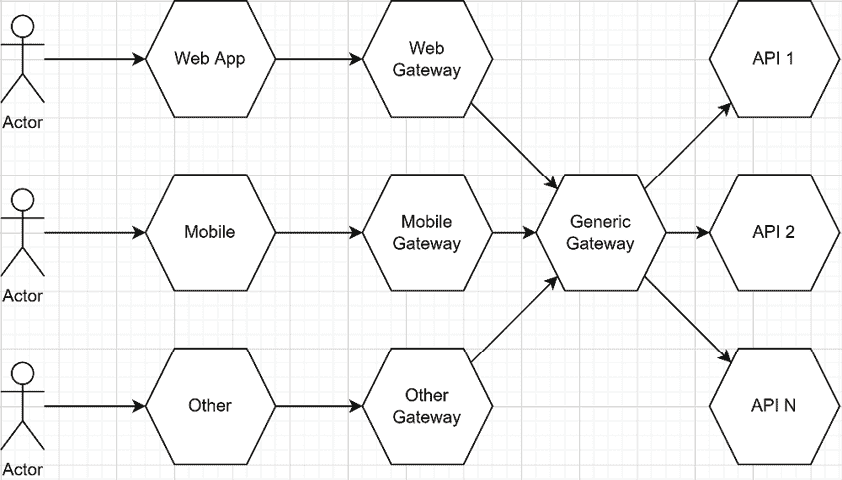

图 19.23：网关模式的混合

如你所可能猜到的，通用网关是所有应用的单一故障点，同时，每个前端后端网关也是其特定客户端的故障点。

> **服务网格**是帮助微服务相互通信的替代方案。它是一个位于应用程序之外的一层，代理服务之间的通信。这些代理被注入到每个服务之上，被称为**边车**。服务网格还可以帮助进行分布式跟踪、仪表化和系统弹性。如果你的系统需要服务间通信，服务网格将是一个绝佳的解决方案。

### 结论

网关是一种门面，用于保护或简化对一个或多个其他服务的访问。在本节中，我们探讨了以下内容：

+   **路由**：这是将请求从 A 点转发到 B 点（反向代理）。

+   **聚合**：这是将多个子请求的结果合并为一个单一响应。

+   **前端后端**：这是与前端一对一关系使用。

我们可以使用任何微服务模式，包括网关，就像任何其他模式一样，我们可以混合搭配它们。只需考虑它们带来的优势，但也考虑它们的缺点。如果你能接受它们，你就找到了你的解决方案。网关往往成为系统的单点故障，所以这是一个需要考虑的点。另一方面，网关可以在负载均衡器后面同时运行多个实例。此外，我们还必须考虑调用调用另一个服务的服务时增加的延迟，因为这会减慢响应时间。总的来说，网关是一个简化消费微服务的优秀工具。它们还允许在它们后面隐藏微服务拓扑，甚至可能是在私有网络中隔离。它们还可以处理跨领域关注点，如安全性。

> 强烈建议使用网关作为请求的透传，并避免将业务逻辑编码到网关中；网关只是反向代理。想想单一责任原则：网关是你微服务集群前面的门面。当然，你可以将特定的任务卸载到网关中，比如授权、弹性（例如重试策略）和类似的跨领域关注点，但业务逻辑必须保留在后端的微服务中。
> 
> > BFF（最佳朋友功能）的作用是简化用户界面，因此鼓励将逻辑从 UI 移动到 BFF。

在大多数情况下，我建议不要使用您亲手打造的网关，而是建议利用现有的产品。有许多开源和云网关可供您在应用程序中使用。使用现有组件可以让您有更多时间来实现解决您程序试图解决的问题的业务规则。当然，也存在基于云的产品，例如 Azure 应用程序网关和 Amazon API 网关。两者都可以通过云产品（如负载均衡器和**Web 应用程序防火墙**（WAF））进行扩展。例如，Azure 应用程序网关还支持自动扩展、区域冗余，并可以作为**Azure Kubernetes 服务**（AKS）网关控制器使用（简单来说，它控制着流量到您的微服务集群）。如果您希望对网关有更多控制权或与您的应用程序一起部署，您可以使用一个现有选项，如 Ocelot、YARP 或 Envoy。Ocelot 是一个用.NET 编写的开源生产就绪 API 网关。Ocelot 支持路由、请求聚合、负载均衡、身份验证、授权、速率限制等。它还与 Identity Server 很好地集成。在我看来，Ocelot 最大的优势是您可以自己创建.NET 项目，安装 NuGet 包，配置您的网关，然后像其他 ASP.NET Core 应用程序一样部署它。由于 Ocelot 是用.NET 编写的，如果需要，扩展它或为其项目或其生态系统做出贡献更容易。引用他们的 GitHub `README.md`文件：“*YARP 是一个用于在.NET 中使用 ASP.NET 和.NET 基础设施构建快速代理服务器的反向代理工具包。YARP 的关键区别在于它被设计成易于定制和调整，以匹配每个部署场景的具体需求。”Envoy 是一个“*开源边缘和服务代理，专为云原生应用程序设计*”，正如他们的网站所述。Envoy 是一个由 Lyft 最初创建的**云原生计算基金会**（CNCF）毕业项目。Envoy 被设计为作为与您的应用程序分离的独立进程运行，使其能够与任何编程语言一起工作。Envoy 可以作为网关使用，并通过 TCP/UDP 和 HTTP 过滤器具有可扩展的设计，支持 HTTP/2 和 HTTP/3、gRPC 等。选择哪个产品？如果您正在寻找一个完全托管的服务，请查看您选择的云提供商的产品。如果您正在寻找一个可配置的反向代理或网关，它支持本章中涵盖的模式，请考虑 YARP 或 Ocelot。如果您有 Ocelot 不支持复杂用例，您可以查看 Envoy，这是一个具有许多高级功能的经过验证的产品。请记住，这些只是可以在微服务架构系统中扮演网关角色的几种可能性，并不旨在成为完整列表。现在，让我们看看网关如何帮助我们以云规模遵循**SOLID**原则：

+   **S**：网关可以处理路由、聚合和其他类似逻辑，否则这些逻辑将实现在不同的组件或应用程序中。

+   **O**：我看到了很多处理这个问题的方法，但这里提供两种看法：

1.  在外部，网关可以在其消费者不知道的情况下将其子请求重定向到新的 URI，只要其合同不改变。

1.  在内部，网关可以从配置中加载其规则，允许它在不更新其代码的情况下进行更改。

+   **L**：N/A

+   **I**：由于前端网关为单个前端系统服务，每个前端系统一个合同（接口）会导致多个较小的接口而不是一个大的通用网关。

+   **D**：我们可以将网关视为一个抽象，隐藏实际的微服务（实现）并反转依赖流。

接下来，我们从第十八章开始构建一个 bff 并演进电子商务应用。

## 项目 – REPR.BFF

此项目利用后端为前端（BFF）设计模式来降低使用我们在第十八章中创建的*REPR 项目*的底层 API 的复杂性。bff 端点充当我们探索的几种类型的网关。这种设计使得 API 有两层，所以让我们从这里开始。

### 层次化 API

从高级架构的角度来看，我们可以利用多个 API 层来分组不同级别的操作粒度。例如，在这个案例中，我们有两层：

+   提供原子基础操作的底层 API。

+   提供特定领域功能的顶层 API。

这里有一个表示这个概念的图（在这种情况下，顶层 API 是 bff，但设计可能有所细微差别）：

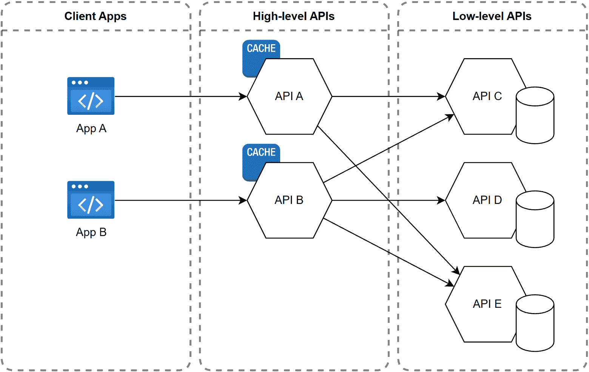

图 19.24：展示两层架构的示意图。

低层展示原子基础操作，如向购物车添加项目或从购物车中删除项目。这些操作很简单，因此使用起来更复杂。例如，加载用户购物车中的产品需要多个 API 调用，一个用于获取项目和数量，每个项目一个用于获取产品详情，如名称和价格。高层提供特定领域的功能，使用起来更简单，但可能变得更复杂。例如，单个端点可以处理向购物车添加、更新和删除项目，使其对消费者的使用变得简单，但其逻辑实现更复杂。此外，产品团队可能更喜欢购物车而不是购物篮，因此端点的 URL 可以反映这一点。让我们看看优势和劣势。

#### 两层设计的优势

+   **关注点分离**：此架构将通用功能与特定领域功能分开，促进更干净的代码和模块化。

+   **可扩展性**：每一层可以根据需求独立扩展。

+   **灵活性和可重用性：** 低级 API 可以在多个高级功能或应用程序之间重用，从而促进代码的可重用性。

+   **优化数据获取：** BFF 可以调用多个低级 API，聚合响应，并将必要的数据发送到前端，从而减少有效载荷大小，使前端开发更加简单。

+   **易于维护：** 我们可以在不触及低级通用 API 的情况下解决特定领域的问题。另一方面，我们可以在较低级别的 API 中修复问题，这将传播到所有领域。

+   **定制用户体验：** 高级 API 可以专门为特定客户端类型（网页、移动等）定制，确保最佳用户体验。

+   **安全性：** 针对特定领域的功能可以实现与其上下文相关的额外安全措施，而不会给低级 API 带来不必要的复杂性。

#### 双层设计的缺点

+   **增加复杂性：** 维护两层引入了额外的部署、监控和管理复杂性。

+   **潜在的性能开销：** 添加额外的层会引入延迟，尤其是在没有适当优化的情况下。

+   **代码重复：** 当类似的逻辑在多个高级功能中实现时，可能会出现代码重复。

+   **紧密耦合关注点：** 低级 API 的更改可能会影响多个特定领域的功能。糟糕的设计可能导致紧密耦合的分布式系统。

+   **需要协调：** 随着系统的演变，确保低级 API 满足所有高级功能的需求需要在开发团队之间进行更多协调。

+   **开发中的开销：** 开发者需要考虑两层，这可能会减慢开发过程，尤其是在需要修改两层以实现特定功能或修复问题时。

+   **潜在的数据过时：** 如果高级功能从低级 API 缓存数据，可能会向用户提供服务过时的数据。

+   **增加失败风险：** 引入额外的 API 增加了其中之一出现问题或中断的概率。

虽然双层设计可以提供灵活性和优化，但它也引入了额外的复杂性。是否使用这种架构的决定应基于项目的具体需求、预期的规模以及开发和运营团队的能力。我们接下来将查看启动这些 API。

### 运行微服务

让我们先从探索部署拓扑开始。首先，我们将第十八章 REPR 项目拆分为两个服务：*购物车*和*产品*。然后，我们添加一个*bff* API 作为两个服务的代理，以简化系统的使用。我们本身没有用户界面，但每个项目都有一个`http`文件来模拟 HTTP 请求。以下是一个表示不同服务之间关系的图：

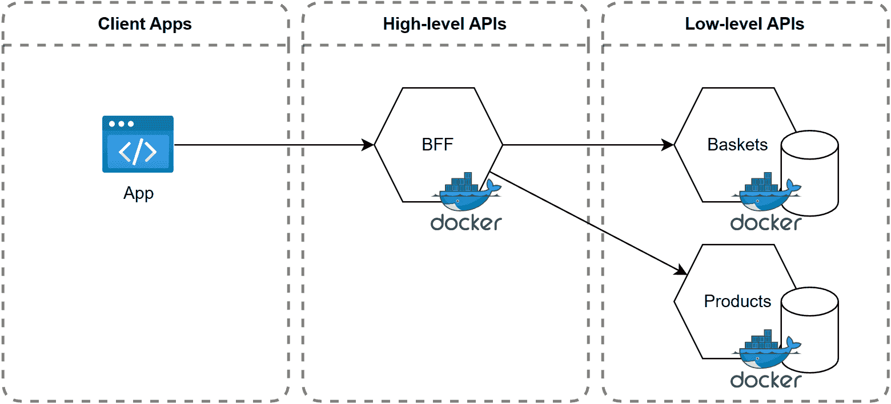

图 19.25：表示不同服务部署拓扑和关系的图

开始项目最简单且最可扩展的方式是使用 Docker，但这不是必须的；我们也可以手动启动三个项目。使用 Docker 打开了许多可能性，比如使用真实的 SQL Server 在运行之间持久化数据，并添加更多拼图碎片，例如 Redis 缓存或事件代理，仅举几例。让我们先手动启动应用程序。

#### 手动启动项目

我们有三个项目，需要三个终端来启动它们。从章节目录中，您可以执行以下命令，每个终端窗口一组命令，所有项目都应该启动：# 在一个终端

```cs
cd REPR.Baskets
dotnet run
# In a second terminal
cd REPR.Products
dotnet run
# In a third terminal
cd REPR.BFF
dotnet run
```

执行此操作应该可以工作。您可以使用 `PROJECT_NAME.http` 文件来测试 API。接下来，让我们探索使用 Docker 的第二个选项。

#### 使用 Docker Compose 运行项目

在解决方案文件同一级别，`docker-compose.yml`、`docker-compose.override.yml` 和各种 `Dockerfile` 文件预先配置，以便项目按正确顺序启动。

> 这里有一个链接，可以帮助您开始使用 Docker：[`adpg.link/1zfM`](https://adpg.link/1zfM)

由于 ASP.NET Core 默认使用 HTTPS，我们必须在容器中注册一个开发证书，所以让我们从这里开始。

##### 配置 HTTPS

本节简要探讨了在 Windows 上使用 PowerShell 设置 HTTPS 的方法。如果您使用的是不同的操作系统或说明不起作用，请参阅官方文档：[`adpg.link/o1tu`](https://adpg.link/o1tu)首先，我们必须生成一个开发证书。在 PowerShell 终端中，运行以下命令：

```cs
dotnet dev-certs https -ep "$env:APPDATA\ASP.NET\Https\adpg-net8-chapter-19.pfx" -p devpassword
dotnet dev-certs https --trust
```

之前的命令创建了一个带有密码 `devpassword` 的 `pfx` 文件（您必须提供密码，否则它将无法工作），然后告诉 .NET 信任开发证书。从那里，`ASPNETCORE_Kestrel__Certificates__Default__Path` 和 `ASPNETCORE_Kestrel__Certificates__Default__Password` 环境变量在 `docker-compose.override.yml` 文件中配置，应予以考虑。

> 如果您更改证书位置或密码，必须更新 `docker-compose.override.yml` 文件。

##### 组合应用程序

现在我们设置了 HTTPS，我们可以使用以下命令构建容器：

```cs
docker compose build
```

我们可以执行以下命令来启动容器：

```cs
docker compose up
```

这应该会启动容器，并为您提供带有每个服务颜色的聚合日志。日志的开头应该看起来像这样：

```cs
[+] Running 3/0
 ✔ Container c19-repr.products-1  Created    0.0s
 ✔ Container c19-repr.baskets-1   Created    0.0s
 ✔ Container c19-repr.bff-1       Created    0.0s
Attaching to c19-repr.baskets-1, c19-repr.bff-1, c19-repr.products-1
c19-repr.baskets-1   | info: Microsoft.Hosting.Lifetime[14]
c19-repr.baskets-1   |       Now listening on: http://[::]:80
c19-repr.baskets-1   | info: Microsoft.Hosting.Lifetime[14]
c19-repr.baskets-1   |       Now listening on: https://[::]:443
...
```

要停止服务，请按 `Ctrl+C`。当您想要销毁正在运行的应用程序时，请输入以下命令：

```cs
docker compose down
```

现在，使用 `docker compose up`，我们的服务应该正在运行。为了确保这一点，让我们试一试。

#### 简单测试服务

项目包含以下服务，每个服务都包含一个你可以利用的`http`文件，用于使用 Visual Studio 或通过 VS Code 扩展查询服务：

| 服务 | HTTP 文件 | 主机 |
| --- | --- | --- |
| `REPR.Baskets` | `REPR.Baskets.http` | [`localhost:60280`](https://localhost:60280) |
| `REPR.BFF` | `REPR.BFF.http` | [`localhost:7254`](https://localhost:7254) |
| `REPR.Products` | `REPR.Products.http` | [`localhost:57362`](https://localhost:57362) |

表 19.3：每个服务、HTTP 文件、HTTPS 主机名和端口。

我们可以利用每个目录的 HTTP 请求来测试 API。我建议先尝试低级 API，然后是 BFF，这样你可以直接知道它们是否有问题，而不是猜测 BFF（它调用低级 API）出了什么问题。

> 我使用 VS Code 中的*REST 客户端*扩展（[`adpg.link/UCGv`](https://adpg.link/UCGv)）和 Visual Studio 2022 版本 17.6 或更高版本的内置支持。

这是`REPR.Baskets.http`文件的一部分：

```cs
@Web_HostAddress = https://localhost:60280
@ProductId = 3
@CustomerId = 1
GET {{Web_HostAddress}}/baskets/{{CustomerId}}
###
POST {{Web_HostAddress}}/baskets
Content-Type: application/json
{
    "customerId": {{CustomerId}}, 
    "productId": {{ProductId}}, 
    "quantity": 10
}
...
```

突出的行是请求重复使用的变量。`###`字符在请求之间充当分隔符。在 VS 或 VS Code 中，你应该在每个请求的顶部看到一个`发送请求`按钮。执行`POST`请求后，然后执行`GET`应该输出以下内容：

```cs
HTTP/1.1 200 OK
Content-Type: application/json; charset=utf-8
[
  {
    "productId": 3,
    "quantity": 10
  }
]
```

如果你能够访问一个端点，这意味着服务正在运行。尽管如此，请随意玩转请求，修改它们，并添加更多。

> 我没有将测试从*第十八章*迁移过来。自动化我们部署的验证可能是一个很好的练习，让你测试你的测试技能。

在验证了三个服务都在运行之后，我们可以继续并查看 BFF 如何与 Baskets 和 Products 服务进行通信。

### 使用 Refit 创建类型化 HTTP 客户端

BFF 服务必须与 Baskets 和 Products 服务通信。这些服务是 REST API，因此我们必须利用 HTTP。我们可以利用现成的 ASP.NET Core `HttpClient`类和`IHttpClientFactory`接口，然后向下游 API 发送原始 HTTP 请求。另一方面，我们也可以创建一个类型化的客户端，将 HTTP 调用转换为具有启发性的简单方法调用。我们正在探索第二种选择，将 HTTP 调用封装在类型化的客户端中。这个概念很简单：我们为每个服务创建一个接口，并将其操作转换为方法。每个接口都围绕一个服务展开。可选地，我们可以将服务聚合到一个主接口下，注入聚合服务并访问所有子服务。此外，这个中心访问点允许我们将注入的服务数量减少到只有一个，并通过 IntelliSense 提高可发现性。以下是一个表示这个概念的图：

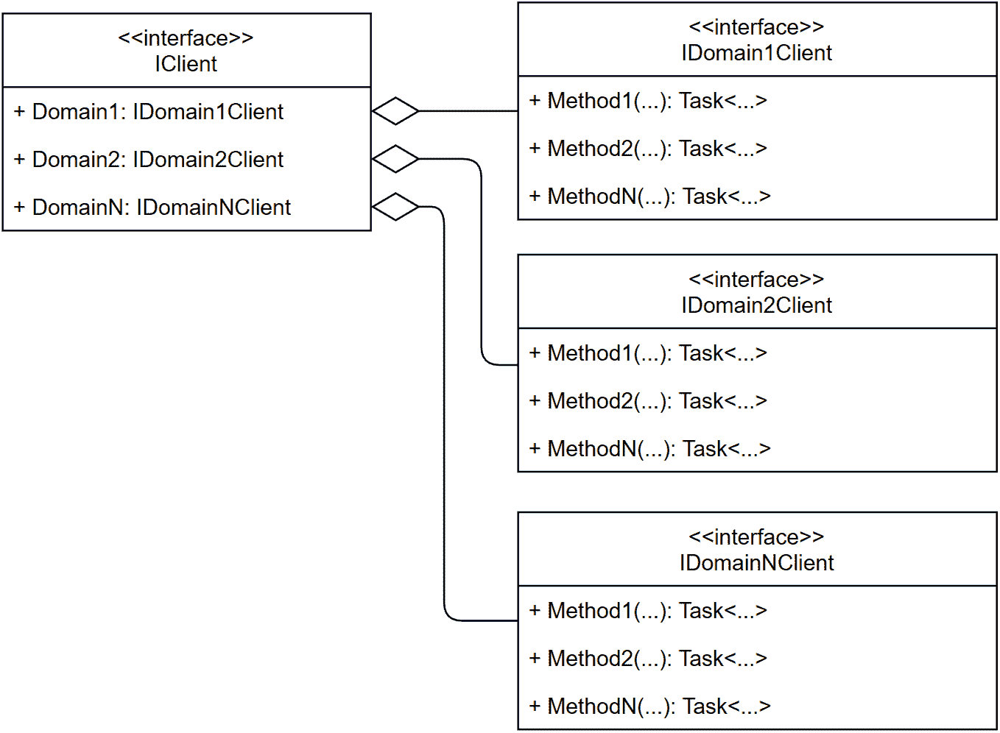

图 19.25：表示通用类型化客户端类层次的 UML 类图。

在前面的图中，`IClient` 接口由组合而成，并公开了其他类型化的客户端，每个客户端都查询特定的下游 API。在我们的案例中，我们有两个下游服务，所以我们的接口层次结构看起来如下：

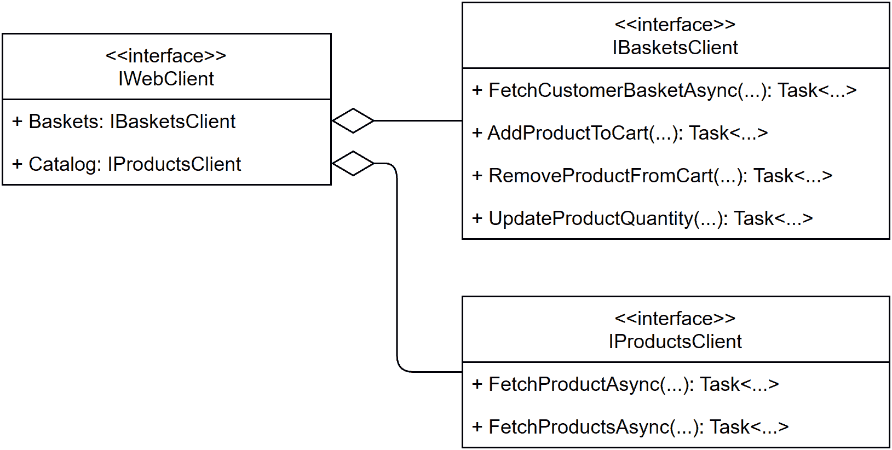

图 19.26：表示 BFF 下游类型化客户端类层次的 UML 类图。

实现之后，我们可以在代码中查询下游 API，而无需担心它们的数据合约，因为我们的客户端是强类型的。我们利用开源库 *Refit* 自动实现接口。

> 我们可以使用任何其他库或裸骨 ASP.NET Core `HttpClient`；这并不重要。我选择 *Refit* 是为了利用其代码生成器，省去编写样板代码的麻烦，并节省你阅读此类代码的时间。Refit 在 GitHub 上的链接：[`adpg.link/hneJ`](https://adpg.link/hneJ)。
> 
> > 我过去使用过 `IHttpClientFactory` 的内置功能，所以如果你想在项目中减少依赖项的数量，你也可以使用它。以下是一个帮助你开始的链接：[`adpg.link/HCj7`](https://adpg.link/HCj7)。

Refit 类似于 Mapperly，根据属性生成代码，所以我们只需要定义我们的方法，Refit 就会编写代码。

> *BFF* 项目引用了 *Products* 和 *Baskets* 项目以重用它们的 DTO。我可以用很多不同的方式来设计这个架构，包括在一个自己的库中托管类型化客户端，这样我们就可以在多个项目中共享它。我们还可以将 DTO 从 Web 应用程序提取到一个或多个共享项目中，这样我们就不会依赖于 Web 应用程序本身。对于这个演示，没有必要过度设计解决方案。

让我们看看类型化的客户端接口，从 `IBasketsClient` 接口开始：

```cs
using Refit;
using Web.Features;
namespace REPR.BFF;
public interface IBasketsClient
{
    [Get("/baskets/{query.CustomerId}")]
    Task<IEnumerable<Baskets.FetchItems.Item>> FetchCustomerBasketAsync(
        Baskets.FetchItems.Query query,
        CancellationToken cancellationToken);
    [Post("/baskets")]
    Task<Baskets.AddItem.Response> AddProductToCart(
        Baskets.AddItem.Command command,
        CancellationToken cancellationToken);
    [Delete("/baskets/{command.CustomerId}/{command.ProductId}")]
    Task<Baskets.RemoveItem.Response> RemoveProductFromCart(
        Baskets.RemoveItem.Command command,
        CancellationToken cancellationToken);
    [Put("/baskets")]
    Task<Baskets.UpdateQuantity.Response> UpdateProductQuantity(
        Baskets.UpdateQuantity.Command command,
        CancellationToken cancellationToken);
}
```

前面的接口利用 Refit 的属性（突出显示）来向其代码生成器说明要编写的内容。操作本身是自解释的，并且通过 HTTP 传输功能的数据传输对象（DTO）。接下来，我们看看 `IProductsClient` 接口：

```cs
using Refit;
using Web.Features;
namespace REPR.BFF;
public interface IProductsClient
{
    [Get("/products/{query.ProductId}")]
    Task<Products.FetchOne.Response> FetchProductAsync(
        Products.FetchOne.Query query,
        CancellationToken cancellationToken);
    [Get("/products")]
    Task<Products.FetchAll.Response> FetchProductsAsync(
        CancellationToken cancellationToken);
}
```

前面的接口类似于 `IBasketsClient`，但在 `Products` API 上创建了一个类型化的桥梁。

> 生成的代码包含很多无意义的代码，清理起来非常困难，以至于很难使其与学习相关，所以让我们假设这些接口有可工作的实现。

接下来，让我们看看我们的聚合：

```cs
public interface IWebClient
{
    IBasketsClient Baskets { get; }
    IProductsClient Catalog { get; }
}
```

前面的接口展示了我们让 Refit 为我们生成的两个客户端。其实现方式相当直接：

```cs
public class DefaultWebClient : IWebClient
{
    public DefaultWebClient(IBasketsClient baskets, IProductsClient catalog)
    {
        Baskets = baskets ?? throw new ArgumentNullException(nameof(baskets));
        Catalog = catalog ?? throw new ArgumentNullException(nameof(catalog));
    }
    public IBasketsClient Baskets { get; }
    public IProductsClient Catalog { get; }
}
```

前面的默认实现通过构造函数注入自己组合，暴露了两个类型化的客户端。当然，依赖注入意味着我们必须将服务注册到容器中。让我们从一些配置开始。为了使设置代码可参数化并允许 Docker 容器覆盖这些值，我们将服务的基本地址提取到设置文件中，如下所示（`appsettings.Development.json`）：

```cs
{
  "Downstream": {
    "Baskets": {
      "BaseAddress": "https://localhost:60280"
    },
    "Products": {
      "BaseAddress": "https://localhost:57362"
    }
  }
}
```

前面的代码定义了两个密钥，每个服务一个，然后我们在`Program.cs`文件中单独加载它们，如下所示：

```cs
using Refit;
using REPR.BFF;
using System.Collections.Concurrent;
using System.Net;
var builder = WebApplication.CreateBuilder(args);
var basketsBaseAddress = builder.Configuration
    .GetValue<string>("Downstream:Baskets:BaseAddress") ?? throw new NotSupportedException("Cannot start the program without a Baskets base address.");
var productsBaseAddress = builder.Configuration
    .GetValue<string>("Downstream:Products:BaseAddress") ?? throw new NotSupportedException("Cannot start the program without a Products base address.");
```

前面的代码将两个配置加载到变量中。

> 我们可以利用我们在*第九章*，“选项、设置和配置”中学到的所有技术，来创建一个更复杂的系统。

接下来，我们这样注册我们的 Refit 客户端：

```cs
builder.Services
    .AddRefitClient<IBasketsClient>()
    .ConfigureHttpClient(c => c.BaseAddress = new Uri(basketsBaseAddress))
;
builder.Services
    .AddRefitClient<IProductsClient>()
    .ConfigureHttpClient(c => c.BaseAddress = new Uri(productsBaseAddress))
;
```

在前面的代码中，调用`AddRefitClient`方法替换了.NET 的`AddHttpClient`方法，并将我们自动生成的客户端注册到容器中。因为 Refit 注册返回一个`IHttpClientBuilder`接口，我们可以使用`ConfigureHttpClient`方法来配置`HttpClient`，就像配置任何其他类型化的 HTTP 客户端一样。在这种情况下，我们将`BaseAddress`属性设置为之前加载的设置的值。接下来，我们还必须注册我们的聚合：

```cs
builder.Services.AddTransient<IWebClient, DefaultWebClient>();
```

我选择了一个瞬态状态，因为该服务仅作为其他服务的代理，所以它将根据注册情况提供服务，而不管每次是否是相同的实例。此外，它需要一个瞬态或作用域生命周期，因为 bff 必须管理当前客户是谁，而不是客户端。允许用户为每个请求决定他们想要模仿谁将是一个很大的安全漏洞。

> 该项目不进行用户身份验证，但我们接下来要探索的服务旨在使这一过程演变，抽象并管理这一责任，这样我们就可以在不影响我们正在编写的代码的情况下添加身份验证。

让我们探索如何管理当前用户。

### 创建一个为当前客户服务的服务

为了使项目简单，我们目前没有使用任何身份验证或授权中间件，但我们希望 bff 是现实的，并处理谁在查询下游 API。为了实现这一点，让我们创建一个`ICurrentCustomerService`接口，它将这个功能从消费代码中抽象出来：

```cs
public interface ICurrentCustomerService
{
    int Id { get; }
} 
```

该接口所做的唯一事情是提供代表当前客户的标识符。由于我们在项目中没有身份验证，让我们实现一个开发版本，它总是返回相同的值：

```cs
public class FakeCurrentCustomerService : ICurrentCustomerService
{
    public int Id => 1;
}
```

最后，我们必须在`Program.cs`类中这样注册它：

```cs
builder.Services.AddScoped<ICurrentCustomerService, FakeCurrentCustomerService>();
```

在这个最后部分，我们已经准备好在我们的 bff 服务中编写一些功能。

> 在使用身份验证的项目中，您可以将`IHttpContextAccessor`接口注入到类中，以访问包含`User`属性的当前`HttpContext`对象，该属性允许访问当前用户的`ClaimsPrincipal`对象，其中应包括当前用户的`CustomerId`。当然，您必须确保身份验证服务器返回此类声明。在使用之前，您必须使用以下方法注册访问器：`builder.Services.AddHttpContextAccessor()`。

### 功能

BFF 服务提供了一个不存在的用户界面，但我们可以想象它需要做什么；它必须：

+   为客户提供产品目录，以便他们可以浏览商店。

+   为渲染产品详情页面提供特定产品。

+   为用户提供其购物车中的商品列表。

+   允许用户通过添加、更新和删除商品来管理他们的购物车。

当然，功能列表可以继续，比如允许用户购买商品，这是电子商务网站最终目标。然而，我们不会走那么远。让我们从目录开始。

#### 获取目录

目录充当路由网关，并将请求转发到`Products`下游服务。第一个端点通过我们的类型客户端（突出显示）提供整个目录：

```cs
app.MapGet(
    "api/catalog",
    (IWebClient client, CancellationToken cancellationToken)
        => client.Catalog.FetchProductsAsync(cancellationToken)
);
```

发送以下请求应击中端点：

```cs
GET https://localhost:7254/api/catalog
```

端点应响应如下：

```cs
HTTP/1.1 200 OK
Content-Type: application/json; charset=utf-8
{
  "products": [
    {
      "id": 2,
      "name": "Apple",
      "unitPrice": 0.79
    },
    {
      "id": 1,
      "name": "Banana",
      "unitPrice": 0.30
    },
    {
      "id": 3,
      "name": "Habanero Pepper",
      "unitPrice": 0.99
    }
  ]
}
```

这里是发生情况的视觉表示：

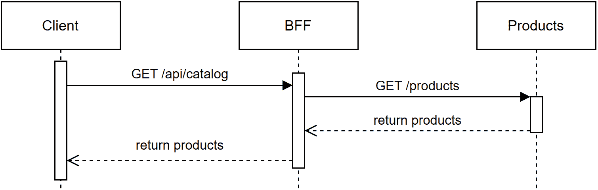

图 19.27：表示 BFF 将请求路由到产品服务的序列图

另一个目录端点非常相似，并且也简单地路由请求到正确的下游服务：

```cs
app.MapGet(
    "api/catalog/{productId}",
    (int productId, IWebClient client, CancellationToken cancellationToken)
        => client.Catalog.FetchProductAsync(new(productId), cancellationToken)
);
```

发送 HTTP 调用将产生与直接调用相同的结果，因为 BFF 仅作为路由器。我们将在下一部分探索更多令人兴奋的功能。

#### 获取购物车

*购物车*服务仅存储`customerId`、`productId`和`quantity`属性。然而，购物车页面显示产品名称和价格，但*产品*服务管理这两个属性。为了克服这个问题，端点充当聚合网关。它在查询购物车之前从*产品*服务加载所有产品，然后返回聚合结果，从而减轻客户端/UI 管理这种复杂性的负担。以下是主要功能代码：

```cs
app.MapGet(
    "api/cart",
    async (IWebClient client, ICurrentCustomerService currentCustomer, CancellationToken cancellationToken) =>
    {
        var basket = await client.Baskets.FetchCustomerBasketAsync(
            new(currentCustomer.Id),
            cancellationToken
        );
        var result = new ConcurrentBag<BasketProduct>();
        await Parallel.ForEachAsync(basket, cancellationToken, async (item, cancellationToken) =>
        {
            var product = await client.Catalog.FetchProductAsync(
                new(item.ProductId),
                cancellationToken
            );
            result.Add(new BasketProduct(
                product.Id,
                product.Name,
                product.UnitPrice,
                item.Quantity
            ));
        });
        return result;
    }
);
```

上述代码首先从 Baskets 服务获取项目，然后使用 `Parallel.ForEachAsync` 方法加载产品，最后返回聚合结果。`Parallel` 类允许我们并行执行多个操作，在这种情况下，多个 HTTP 调用。使用 .NET 实现类似结果的方法有很多，这是其中之一。当 HTTP 调用成功时，它将 `BasketProduct` 项目添加到 `result` 集合中。一旦所有操作完成，端点返回 `BasketProduct` 对象的集合，其中包含用户界面显示购物车所需的所有组合信息。以下是 `BasketProduct` 类：

```cs
public record class BasketProduct(int Id, string Name, decimal UnitPrice, int Quantity)
{
    public decimal TotalPrice => UnitPrice * Quantity;
}
```

此端点的顺序如下（`loop` 代表 `Parallel.ForEachAsync` 方法）：

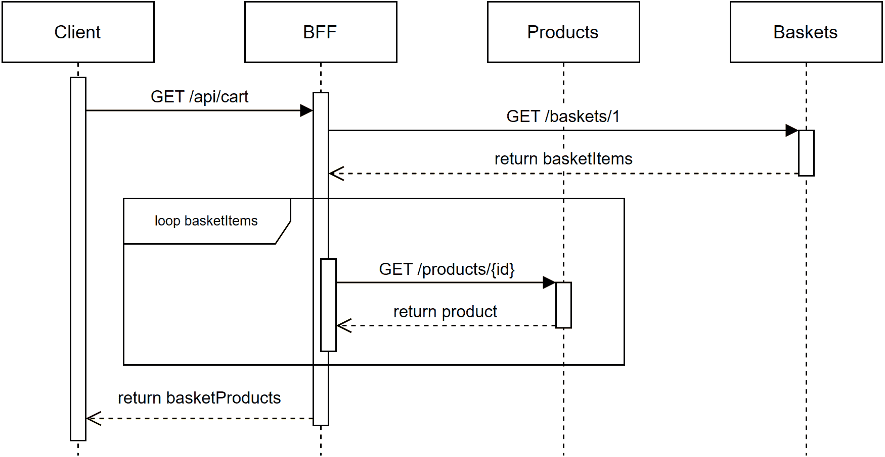

图 19.28：表示购物车端点与下游服务 Products 和 Baskets 交互的序列图。

由于对 *Products* 服务的请求是并行发送的，我们无法预测它们完成的顺序。以下是应用程序日志的摘录，描述了可能发生的情况（我在书中省略了日志代码，但它在 GitHub 上可用）：

```cs
trce: GetCart[0]
      Fetching product '3'.
trce: GetCart[0]
      Fetching product '2'.
trce: GetCart[0]
      Found product '2'(Apple).
trce: GetCart[0]
      Found product '3'(Habanero Pepper).
```

前面的跟踪显示，我们请求了产品 `3` 和 `2`，但收到了倒置的响应（`2` 和 `3`）。在并行运行代码时，这种情况是可能的。当我们向 BFF 发送以下请求时：

```cs
GET https://localhost:7254/api/cart
```

BFF 返回的响应类似于以下内容：

```cs
HTTP/1.1 200 OK
Content-Type: application/json; charset=utf-8
[
  {
    "id": 3,
    "name": "Habanero Pepper",
    "unitPrice": 0.99,
    "quantity": 10,
    "totalPrice": 9.90
  },
  {
    "id": 2,
    "name": "Apple",
    "unitPrice": 0.79,
    "quantity": 5,
    "totalPrice": 3.95
  }
]
```

上述示例展示了聚合结果，简化了客户端（UI）必须实现以显示购物车的逻辑。

> 由于我们没有对结果进行排序，项目不一定会按相同的顺序出现。作为一个练习，你可以使用现有的某个属性对结果进行排序，或者添加一个属性，当客户将商品添加到购物车时保存该属性，并使用这个新属性对项目进行排序；首先添加的项目将首先显示，依此类推。

让我们转到最后一个端点，并探讨 BFF 如何管理购物车项目。

#### 管理购物车

我们 BFF 的一个主要目标是减少前端复杂性。在检查 *Baskets* 服务时，我们意识到如果我们只提供原始操作，将会增加一些不必要的复杂性，因此我们决定将所有购物车逻辑封装在一个单独的端点之后。当客户端向 `api/cart` 端点 POST 时，它：

+   添加一个不存在的商品。

+   更新现有商品的数量。

+   删除数量等于 0 或更少的商品。

使用此端点，客户端无需担心添加或更新。以下是一个简化的序列图，表示此逻辑：

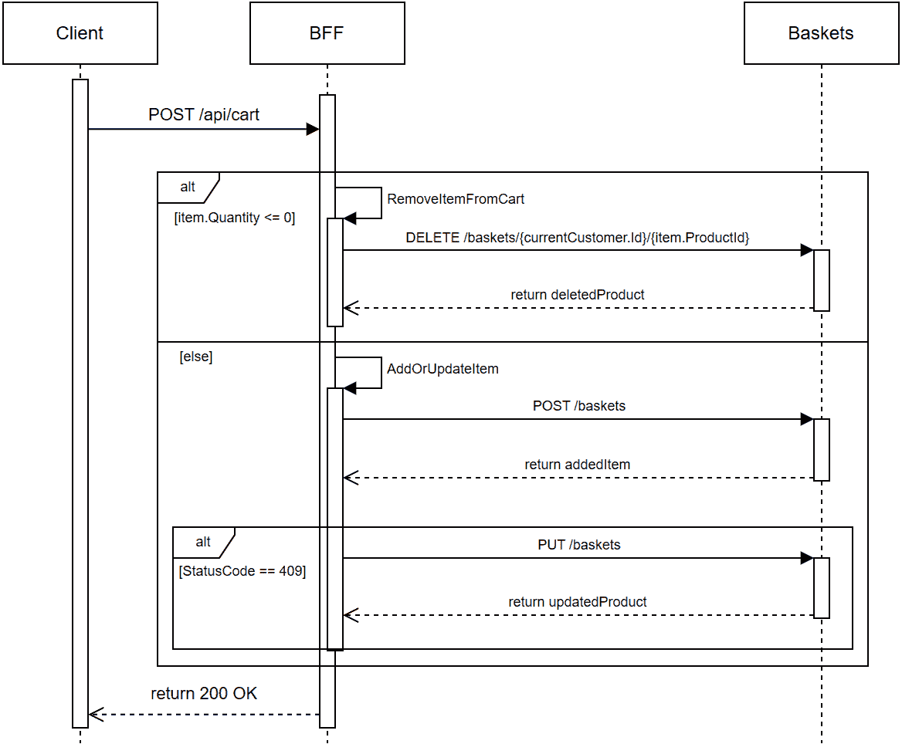

图 19.29：一个序列图，显示了购物车端点的高级算法。

如图中所示，如果数量低于或等于零，我们调用移除端点。否则，我们尝试将项目添加到篮子中。如果端点返回`409 冲突`，我们尝试更新数量。以下是代码：

```cs
app.MapPost(
    "api/cart",
    async (UpdateCartItem item, IWebClient client, ICurrentCustomerService currentCustomer, CancellationToken cancellationToken) =>
    {
        if (item.Quantity <= 0)
        {
            await RemoveItemFromCart(
                item,
                client,
                currentCustomer,
                cancellationToken
            );
        }
        else
        {
            await AddOrUpdateItem(
                item,
                client,
                currentCustomer,
                cancellationToken
            );
        }
        return Results.Ok();
    }
);
```

之前的代码遵循相同的模式，但包含之前解释的逻辑。我们接下来探索两个突出显示的方法，首先是`RemoveItemFromCart`方法：

```cs
static async Task RemoveItemFromCart(UpdateCartItem item, IWebClient client, ICurrentCustomerService currentCustomer, CancellationToken cancellationToken)
{
    try
    {
        var result = await client.Baskets.RemoveProductFromCart(
            new Web.Features.Baskets.RemoveItem.Command(
                currentCustomer.Id,
                item.ProductId
            ),
            cancellationToken
        );
    }
    catch (ValidationApiException ex)
    {
        if (ex.StatusCode != HttpStatusCode.NotFound)
        {
            throw;
        }
    }
}
```

上一段代码中突出显示的代码利用了强类型 HTTP 客户端，并发送了一个移除项目命令到*篮子*服务。如果项目不在购物车中，代码忽略错误并继续。为什么？因为它不影响业务逻辑或最终用户体验。也许顾客点击了移除或更新按钮两次。然而，代码将任何其他错误传播到客户端。让我们探索`AddOrUpdateItem`方法的代码：

```cs
static async Task AddOrUpdateItem(UpdateCartItem item, IWebClient client, ICurrentCustomerService currentCustomer, CancellationToken cancellationToken)
{
    try
    {
        // Add the product to the cart
        var result = await client.Baskets.AddProductToCart(
            new Web.Features.Baskets.AddItem.Command(
                currentCustomer.Id,
                item.ProductId,
                item.Quantity
            ),
            cancellationToken
        );
    }
    catch (ValidationApiException ex)
    {
        if (ex.StatusCode != HttpStatusCode.Conflict)
        {
            throw;
        }
        // Update the cart
        var result = await client.Baskets.UpdateProductQuantity(
            new Web.Features.Baskets.UpdateQuantity.Command(
                currentCustomer.Id,
                item.ProductId,
                item.Quantity
            ),
            cancellationToken
        );
    }
}
```

之前的逻辑与其他方法非常相似。它首先将项目添加到购物车中。如果收到`409 冲突`，它会尝试更新数量。否则，它让异常向上冒泡到堆栈，以便稍后由异常中间件捕获以统一错误消息。有了这段代码，我们可以向`api/cart`端点发送`POST`请求以添加、更新和从购物车中删除项目。这三个操作返回一个空的`200 OK`响应。假设我们的购物车为空，以下请求将*10* *哈瓦那辣椒*（`id=3`）添加到购物车中：

```cs
POST https://localhost:7254/api/cart
Content-Type: application/json
{
    "productId": 3, 
    "quantity": 10
}
```

以下请求将*5 个苹果*（`id=2`）添加到购物车中：

```cs
POST https://localhost:7254/api/cart
Content-Type: application/json
{
    "productId": 2, 
    "quantity": 5
}
```

以下请求将数量更新为*20* *哈瓦那辣椒*（`id=3`）：

```cs
POST https://localhost:7254/api/cart
Content-Type: application/json
{
    "productId": 3, 
    "quantity": 20
}
```

以下请求从购物车中移除了*苹果*（`id=2`）：

```cs
POST https://localhost:7254/api/cart
Content-Type: application/json
{
    "productId": 2, 
    "quantity": 0
}
```

留下我们在购物车中的*20* *哈瓦那辣椒*（`GET https://localhost:7254/api/cart`）：

```cs
[
  {
    "id": 3,
    "name": "Habanero Pepper",
    "unitPrice": 0.99,
    "quantity": 20,
    "totalPrice": 19.80
  }
]
```

之前序列中的请求都采用相同的格式，到达相同的端点但执行不同的操作，这使得前端客户端管理起来非常容易。

> 如果你希望 UI 单独管理操作或想实现批量更新功能，你可以这样做；这只是一个示例，说明你可以利用 BFF 做什么。

我们现在完成了 BFF 服务。

### 结论

在本节中，我们学习了如何使用后端为前端（BFF）设计模式来面向微电子商务 Web 应用。我们讨论了分层 API 和双层设计的优缺点。我们使用 Refit 自动生成了强类型 HTTP 客户端，管理了购物车，并从 BFF 获取了目录。我们学习了如何通过实现多个网关模式将领域逻辑从前端移动到后端来使用 BFF 减少复杂性。以下是我们在探索中发现的几个好处：

+   bff 模式可以显著简化前端和后端系统之间的交互。它提供了一个抽象层，可以减少使用低级原子 API 的复杂性。它将通用功能和领域特定功能分离，并促进更干净、更模块化的代码。

+   一个 bff 可以作为网关，将特定请求路由到相关服务，从而减少前端需要执行的工作。它还可以作为聚合网关，将来自各种服务的数据进行汇总，形成统一的响应。这个过程可以通过减少前端的复杂性和前端必须进行的单独调用数量来简化前端开发。它还可以减少前端和后端之间传输的有效负载大小。

+   每个 bff 都是针对特定客户端定制的，优化前端交互。

+   一个 bff 可以在不影响低级 API 或其他应用程序的情况下处理一个域的问题，从而提供更简单的维护。

+   一个 bff 可以实现安全逻辑，例如特定领域导向的认证和授权规则。

尽管有这些好处，使用 bff 也可能增加复杂性并引入潜在的性能开销。使用 bff 与其他模式没有区别，必须权衡并适应项目的具体需求。接下来，我们再次在分布式规模上重新审视 CQRS。

## 重新审视 CQRS 模式

**命令查询责任分离**（**CQRS**）应用了**命令查询分离**（**CQS**）原则。与我们在*第十四章*，*中介者和 CQRS 设计模式*中看到的内容相比，我们可以通过使用微服务或无服务器计算来进一步推进 CQRS。我们不仅可以在命令和查询之间创建清晰的分离，还可以通过多个微服务和数据源将它们进一步细分。**CQS**是一个原则，表示一个方法应该要么返回数据，要么修改数据，但不能两者兼有。另一方面，**CQRS**建议使用一个模型来读取数据，另一个模型来修改数据。**无服务器计算**是一种云执行模型，其中云提供商管理服务器，并根据使用情况和配置按需分配资源。无服务器资源属于平台即服务（PaaS）提供的产品。让我们再次回到我们的物联网示例。在先前的示例中，我们查询了设备的最后已知位置，但设备更新位置怎么办？这可能意味着每分钟推送许多更新。为了解决这个问题，我们将使用 CQRS 并专注于两个操作：

+   更新设备位置。

+   读取设备的最后已知位置。

简而言之，我们有一个`Read Location`微服务，一个`Write Location`微服务，以及两个数据库。请记住，每个微服务应该拥有自己的数据。这样，用户可以通过读取微服务（查询模型）访问最后已知的设备位置，而设备可以准时将其当前位置发送到写入微服务（命令模型）。通过这种方式，我们将读取和写入数据的负载分开，因为这两种操作发生的频率不同：


图 19.30：应用 CQRS 来分割设备位置读取和写入的微服务

在之前说明概念的方案中，读取是查询，写入是命令。一旦在写入数据库中添加了新值，如何更新 Read DB 取决于所使用的技术。在这种类型的架构中，一个基本的事情是，根据 CQRS 模式，命令不应该返回值，从而实现“发射并忘记”场景。有了这个规则，消费者不必等待命令完成就可以做其他事情。

> “发射并忘记”并不适用于每个场景；有时，我们需要同步。实现 Saga 模式是解决协调问题的一种方法。

从概念上讲，我们可以通过利用无服务器云基础设施，如 Azure Functions，来实现这个示例。让我们使用一个高级概念性的无服务器设计重新审视这个示例：

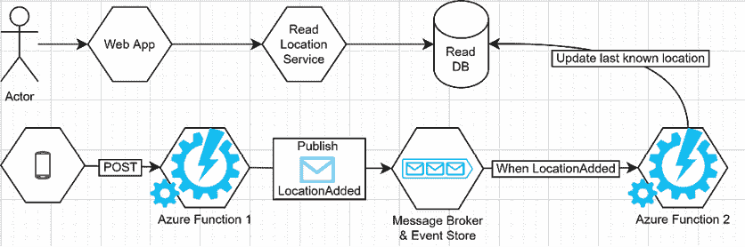

图 19.31：使用 Azure 服务管理 CQRS 实现

之前的图示说明了以下内容：

1.  设备通过将其发布到*Azure Function 1*来定期发送其位置。

1.  *Azure Function 1* 然后将`LocationAdded`事件发布到事件代理，该代理也是一个事件存储（写入数据库）。

1.  现在，所有订阅`LocationAdded`事件的订阅者都可以适当地处理该事件，在这种情况下，*Azure Function 2*。

1.  *Azure Function 2* 在*Read DB*中更新设备的最后已知位置。

1.  任何后续的查询都应该导致读取新的位置。

消息代理也是前面图中的事件存储，但我们可以在其他地方存储事件，例如在 Azure 存储表中、在时间序列数据库中或在 Apache Kafka 集群中。在 Azure 方面，数据存储也可以是 CosmosDB。此外，我出于多个原因抽象了这个组件，包括在 Azure 中发布事件有多种“作为服务”的提供方式，以及使用第三方组件（开源和专有）的多种方式。此外，该示例很好地展示了**最终一致性**。在步骤 1 和步骤 4 之间，所有最后已知的读取位置都获取了旧值，而系统正在处理新的位置更新（命令）。如果由于某种原因命令处理速度减慢，下一次读取数据库更新之前可能会出现更长的延迟。命令也可以批量处理，导致另一种类型的延迟。无论命令处理发生什么情况，读取数据库始终可用，无论它是否提供最新数据，以及写入系统是否过载。这是此类设计的美丽之处，但实现和维护起来更为复杂。

> **时间序列数据库**针对时间查询和存储数据进行了优化，在这种数据库中，你总是追加新的记录而不更新旧的记录。这种 NoSQL 数据库对于需要大量时间处理的用途，如指标，可能很有用。

再次使用发布-订阅模式来启动另一个场景。假设事件永久保存，前面的示例也可以支持事件溯源。此外，新服务可以订阅`LocationAdded`事件，而不会影响已部署的代码。例如，我们可以创建一个 SignalR 微服务，将其更新推送到其客户端。这与 CQRS 无关，但它与迄今为止我们所探索的一切都很好地融合在一起，所以这里有一个更新的概念图：

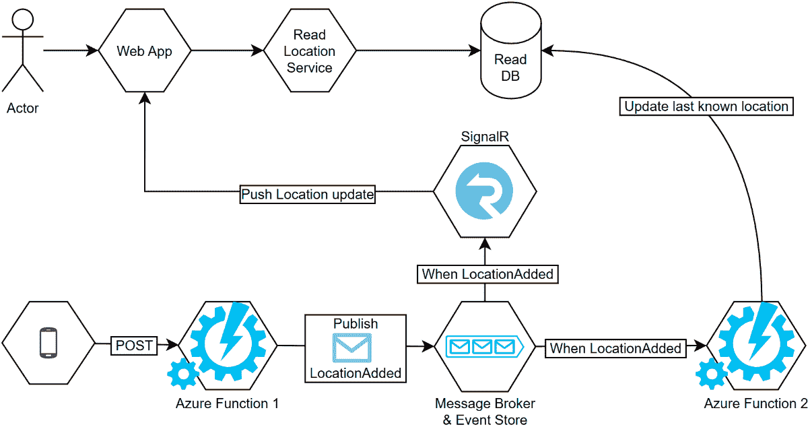

图 19.32：在不影响系统其他部分的情况下添加 SignalR 服务作为新的订阅者

SignalR 微服务可以是自定义代码或 Azure SignalR 服务（由另一个 Azure Function 支持）；这无关紧要。在这种设计下，Web 应用可以在读取数据库更新之前知道已发生更改。

> 使用这种设计，我想说明在采用发布-订阅模型时，将新服务添加到系统中比使用点对点通信更容易。

正如你所见，微服务系统添加了越来越多的组件，这些组件通过一个或多个消息代理间接相互连接。与单个应用程序相比，维护、诊断和调试此类系统更困难；这就是我们之前讨论的**操作复杂性**。然而，容器可以帮助部署和维护此类系统。从 ASP.NET Core 3.0 开始，ASP.NET Core 团队投入了大量精力进行**分布式跟踪**。分布式跟踪对于查找从程序到程序（如微服务）流动的事件相关的故障和瓶颈是必要的。如果出现问题，追踪用户的行为以隔离错误、重现它并修复它非常重要。独立组件越多，使这种跟踪变得越困难。这超出了本书的范围，但如果你计划利用微服务，这是一个需要考虑的问题。

### 优势和潜在风险

本节探讨了使用 CQRS 模式分离数据存储的读和写操作的一些优势和风险。

#### CQRS 模式的好处

+   **可伸缩性：** 由于读和写工作负载可以独立扩展，CQRS 可以导致基于分布式云或微服务的应用程序具有更高的可伸缩性。

+   **简化和优化模型：** 它将读模型（查询责任）和写模型（命令责任）分开，这简化了应用程序开发并可以优化性能。

+   **灵活性：** 不同的模型增加了可以选择的数量，增加了灵活性。

+   **增强性能：** CQRS 可以防止不必要的数据库访问，并允许为每个任务选择优化的数据库，从而提高读和写操作的性能。

+   **提高效率：** 它允许在复杂应用程序上进行并行开发，因为团队可以在应用程序的独立读和写两侧独立工作。

#### 使用 CQRS 模式的潜在风险

+   **复杂性：** CQRS 增加了系统的复杂性。它可能不是简单的 CRUD 应用程序所必需的，并且可能会不必要地使应用程序过于复杂。因此，建议仅在复杂系统中使用 CQRS，并且当优势超过劣势时才使用。

+   **数据一致性：** 由于读模型的更新是异步的，这可能会引入读和写之间的最终一致性问题和业务需求不匹配。

+   **增加的开发工作量：** CQRS 可能意味着由于处理两个独立的模型和更多组件，开发、测试和维护工作量的增加。

+   **学习曲线：** 该模式有其自己的学习曲线。对 CQRS 模式不熟悉的团队成员需要培训并获得一些经验。

+   **同步挑战：** 在高数据量情况下，保持读模型和写模型之间的同步可能具有挑战性。

### 结论

CQRS 有助于划分查询和命令，并有助于封装和独立隔离每一块逻辑。将这个概念与无服务器计算或微服务架构相结合，使我们能够独立扩展读取和写入。我们还可以使用不同的数据库，赋予我们所需的工具，以满足该系统各部分所需的传输速率（例如，频繁的写入和偶尔的读取或反之亦然）。像 Azure 和 AWS 这样的主要云提供商提供无服务器服务来支持此类场景。每个云提供商的文档都应该能帮助你入门。同时，对于 Azure，我们有 Azure Functions、Event Grid、Event Hubs、Service Bus、Cosmos DB 等。Azure 还提供了不同服务之间的绑定，这些服务由事件触发或响应，为你移除了一部分复杂性，但同时也将你锁定在该供应商上。现在，让我们看看 CQRS 如何帮助我们遵循**SOLID**原则在云规模上：

+   **S**: 将应用程序划分为更小的读取和写入应用程序（或函数）倾向于将单一责任封装到不同的程序中。

+   **O**: 将 CQRS 与无服务器计算或微服务相结合，可以帮助我们扩展软件，而无需通过添加、删除或替换应用程序来修改现有代码。

+   **L**: 无需操作

+   **I**: CQRS 使我们能够创建多个小型接口（或程序），其中命令和查询之间有明确的区分。

+   **D**: 无需操作

## 探索微服务适配器模式

微服务适配器模式允许添加缺失的功能，将一个系统适配到另一个系统，或将现有应用程序迁移到事件驱动架构模型，仅举几个可能性。微服务适配器模式类似于我们在第九章“结构型模式”中介绍的适配器模式，但应用于使用事件驱动架构的微服务系统，而不是创建一个类来适配一个对象到另一个签名。在本节中我们讨论的场景中，以下图中表示的微服务系统也可以被一个独立的应用程序所替代；这个模式适用于各种程序，而不仅仅是微服务，这就是为什么我抽象掉了细节：

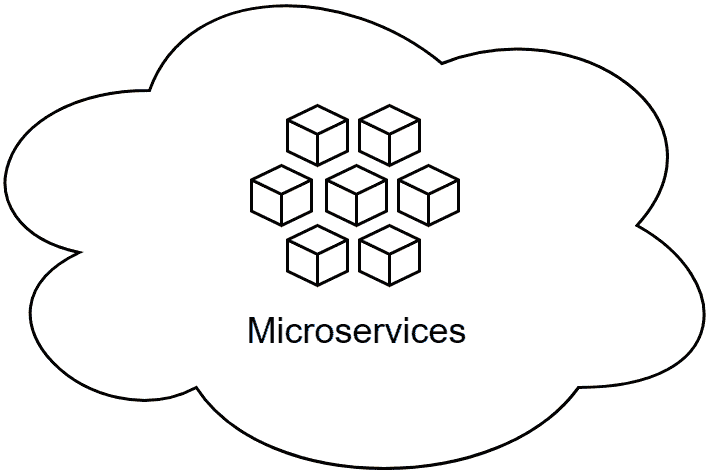

图 19.33：后续示例中使用的微服务系统表示

下面是我们接下来要讨论的示例和此模式可能的用法：

+   将现有系统适配到另一个系统。

+   停用遗留应用程序。

+   将事件代理适配到另一个系统。

让我们先从一个独立系统连接到一个事件驱动系统开始。

### 将现有系统适配到另一个系统

在这种情况下，我们有一个现有系统，我们无法控制其源代码或者不想对其进行更改，并且我们有一个围绕事件驱动架构模型构建的微服务系统。只要我们能访问事件代理，我们也不必控制微服务系统的源代码。以下是一个表示此场景的图示：

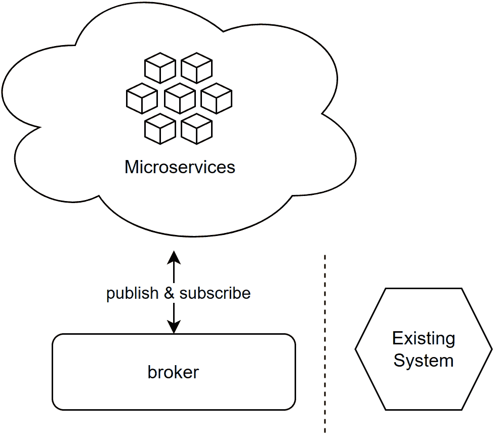

图 19.34：一个与事件代理和未连接到微服务的现有系统交互的微服务系统

如前图所示，现有系统与微服务和代理断开连接。为了使现有系统适应微服务系统，我们必须订阅或发布某些事件。让我们看看如何从微服务（订阅代理）读取数据，然后将该数据更新到现有系统中。当我们控制现有系统的代码时，我们可以打开源代码，订阅一个或多个主题，并从那里更改行为。在我们的情况下，我们不想这样做或者不能这样做，因此我们无法直接订阅主题，如下面的图示所示：

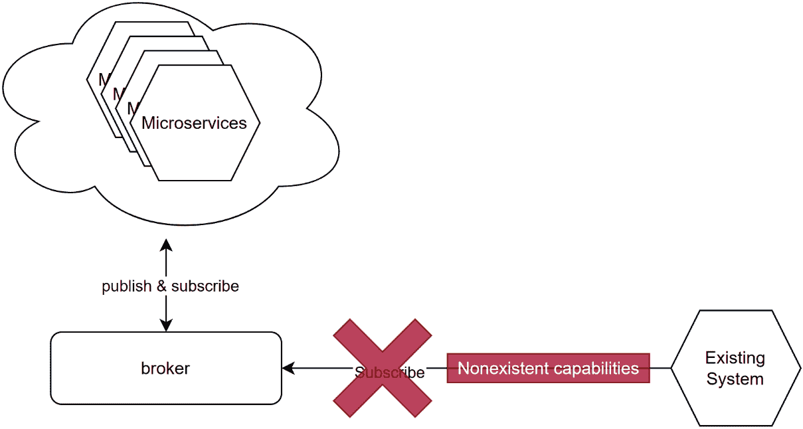

图 19.35：连接现有系统到事件驱动型系统的缺失功能

这就是微服务适配器发挥作用并允许我们填补现有系统能力差距的地方。为了添加缺失的环节，我们创建了一个订阅适当事件的微服务，然后在此处应用对现有系统的更改，如下所示：

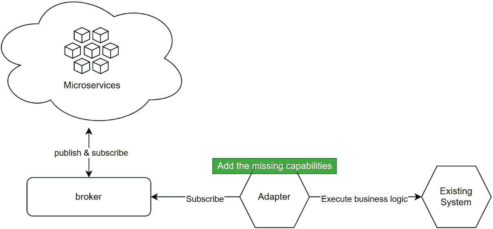

图 19.36：一个适配器微服务向现有系统添加缺失的功能

如前图所示，`适配器`微服务获取事件（订阅一个或多个主题），然后使用来自微服务系统的数据在现有系统上执行一些业务逻辑。在这个设计中，新的`适配器`微服务使我们能够向一个我们无法控制的系统中添加缺失的功能，同时对用户日常活动的影响很小或没有。示例假设现有系统具有某种形式的可扩展机制，如 API。如果系统没有，我们就需要更具创造性来与之接口。例如，微服务系统可能是一个电子商务网站，而现有系统可能是一个遗留的库存管理系统。适配器可以更新遗留系统中的新订单数据。现有系统也可能是你希望当微服务应用程序的用户执行某些操作时（如更改电话号码或地址）进行更新的旧**客户关系管理**（**CRM**）系统。可能性几乎是无限的；你创建一个事件驱动系统和你不控制或不想改变的现实系统之间的链接。在这种情况下，微服务适配器使我们能够通过扩展系统而不改变现有部分来遵循**开闭原则**。主要的缺点是我们正在部署另一个与现有系统直接耦合的微服务，这可能最适合临时解决方案。沿着这个思路，接下来，我们用一个新的应用程序替换遗留应用程序，尽量减少停机时间。

### 退役遗留应用程序

在这种情况下，我们有一个要退役的遗留应用程序和一个我们想要连接一些现有功能的微服务系统。为了实现这一点，我们可以创建一个或多个适配器，将所有功能和依赖项迁移到新的模型。以下是我们的系统当前状态的表示：


图 19.37：原始遗留应用程序及其依赖项

前面的图显示了两个不同的系统，包括我们想要退役的遗留应用程序。另外两个应用程序，依赖项 A 和 B，直接依赖于遗留应用程序。确切的迁移流程强烈依赖于你的用例。如果你想保留依赖项，我们希望首先迁移它们。为此，我们可以创建一个事件驱动的`适配器`微服务，像这样打破依赖项和遗留应用程序之间的紧密耦合：

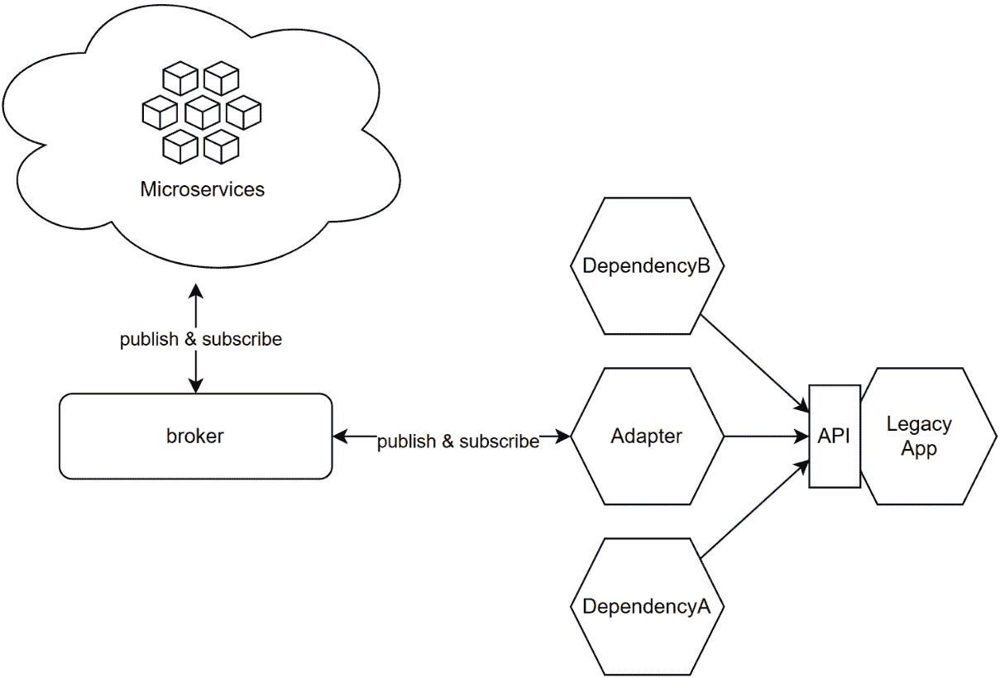

图 19.38：添加一个实现事件驱动流程的微服务适配器，以打破依赖项和遗留应用程序之间的紧密耦合

上一张图表显示了使用事件代理进行通信的`Adapter`微服务和微服务系统中的其余部分。正如我们在上一个示例中所探讨的，适配器被放置在那里以连接遗留应用和微服务。我们的场景专注于移除遗留应用并迁移其两个依赖项。在这里，我们使用适配器划出了所需的能力，使我们能够将依赖项迁移到事件驱动模型，并打破与遗留应用的紧密耦合。这种迁移可以分多步进行，逐个迁移每个依赖项，我们甚至可以为每个依赖项创建一个适配器。为了简化，我选择只画一个适配器。如果你的依赖项很大或很复杂，你可能需要重新考虑这个选择。一旦我们完成了依赖项的迁移，我们的系统看起来如下：


图 19.39：依赖项现在正在使用事件驱动架构，适配器微服务正在弥合事件和遗留系统之间的差距

在上一张图表中，适配器微服务执行了两个依赖项之前对遗留应用 API 的操作。现在，依赖项正在发布事件而不是使用 API。例如，当`DependencyB`中发生操作时，它会向代理发布一个事件。适配器微服务接收到该事件，并针对 API 执行原始操作。这样做增加了复杂性，是一种临时状态。有了这种新的架构，我们可以开始将现有功能从遗留应用迁移到新应用，而不会影响依赖项；我们打破了紧密耦合。

> 从现在开始，我们正在应用**Strangler Fig**模式，逐步将遗留系统迁移到我们的新架构中。为了简化，你可以将 Strangler Fig 模式视为逐个迁移功能从一个应用到另一个应用。在这种情况下，我们用一个应用替换了另一个应用，但我们也可以使用相同的模式将一个应用拆分成多个更小的应用（如微服务）。
> 
> > 我在“进一步阅读”部分留下了一些链接，以防迁移遗留系统是你正在做的事情，或者只是想了解更多关于该模式的信息。

下面的图表是一个视觉表示，它将我们正在构建的、用于替换遗留应用的现代应用添加进去。那个新的现代应用也可能是一个你正在部署的购买产品；我们正在探讨的概念适用于这两种用例，但具体的步骤与所涉及的技术直接相关。

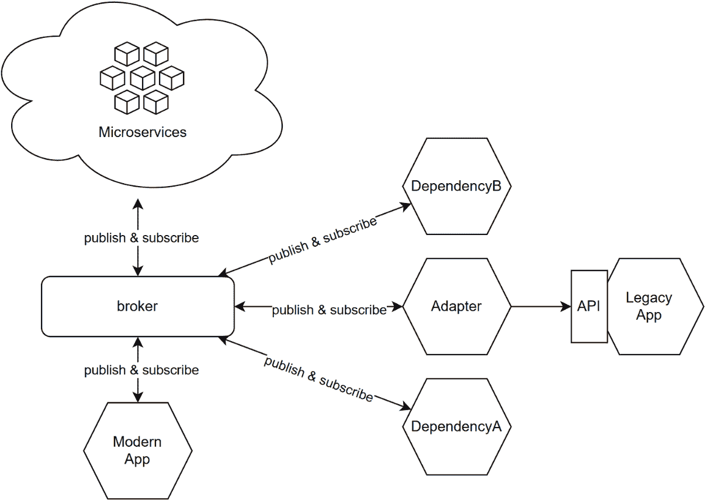

图 19.40：通过将功能迁移到那个新应用，用于替换旧应用的现代应用开始显现

在前面的图中，我们看到新的现代应用已经出现。每次我们将新功能部署到新应用中，我们都可以将其从适配器中移除，从而在两种模型之间实现优雅的过渡。同时，我们保留旧应用以继续提供尚未迁移的功能。一旦我们想要保留的所有功能都已迁移，我们就可以移除适配器并淘汰旧应用，从而得到以下系统：

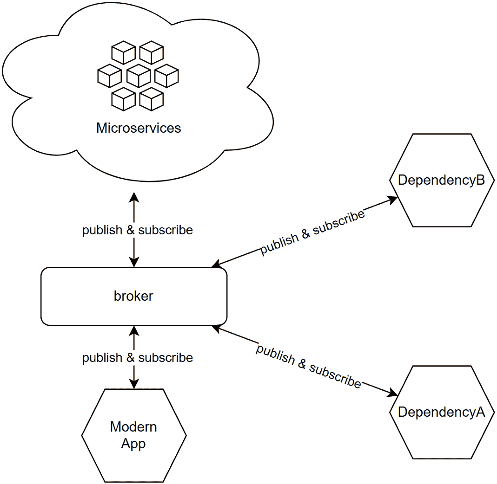

图 19.41：在淘汰了旧应用后，新的系统拓扑结构，展示了新的现代应用及其两个松散耦合的依赖项

前面的图示显示了新的系统拓扑，包括一个新现代应用和现在通过事件驱动架构松散耦合的两个原始依赖项。当然，迁移规模越大，就越复杂，耗时也越长，但适配器微服务模式是帮助从一个系统部分或完全迁移到另一个系统的一种方式。就像前面的例子一样，主要优势是添加或删除功能而不会影响其他系统，这使我们能够迁移并打破不同依赖项之间的紧密耦合。缺点是这种临时解决方案增加了复杂性。此外，在迁移步骤中，你很可能会需要按正确顺序部署现代应用和适配器，以确保两个系统不会处理相同的事件两次，从而导致重复更改。例如，将电话号码更新为相同的值两次应该是可以的，因为它会导致相同的最终数据集。然而，创建两个记录而不是一个可能更重要，因为这可能导致数据集中的完整性错误。例如，创建一个在线订单两次而不是一次可能会引起客户不满或内部问题。就这样，我们使用微服务适配器模式淘汰了一个系统，而没有破坏其依赖项。接下来，我们看看一个**物联网**（**IoT**）的例子。

### 将事件代理适配到另一个

在这个场景中，我们正在将一个事件代理适配到另一个。在下面的图中，我们查看两个用例：一个将事件从代理 B 翻译到代理 A（左侧）和另一个将事件从代理 A 翻译到代理 B（右侧）。之后，我们探索一个更具体的例子：

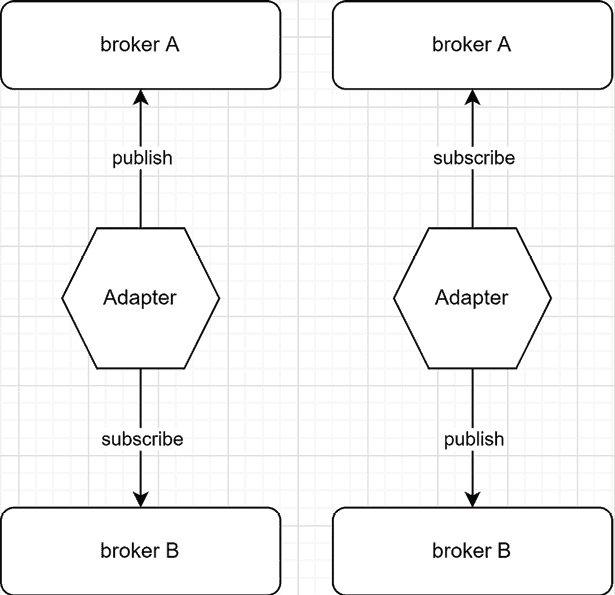

图 19.42：一个适配器微服务，将事件从代理 B 转换为代理 A（左侧）以及从代理 A 转换为代理 B（右侧）

我们可以在前面的图中看到两种可能的流程。左侧的第一种流程允许适配器从代理 B 读取事件并将其发布到代理 A。右侧的第二种流程使适配器能够从代理 A 读取事件并将其发布到代理 B。这些流程使我们能够通过利用微服务适配器模式将事件从一种代理转换到另一种代理。

> 在*图 16.35*中，每个流程都有一个适配器。我这样做是为了使两个流程尽可能独立，但适配器可以是单个微服务。

这种模式对于物联网系统非常有用，其中您的微服务在内部使用 Apache Kafka 的完整功能的事件流能力，但使用 MQTT 与连接到系统的低功耗物联网设备进行通信。适配器可以通过将消息从一种协议转换为另一种协议来解决此问题。以下是一个表示完整流程的图，包括设备和微服务：

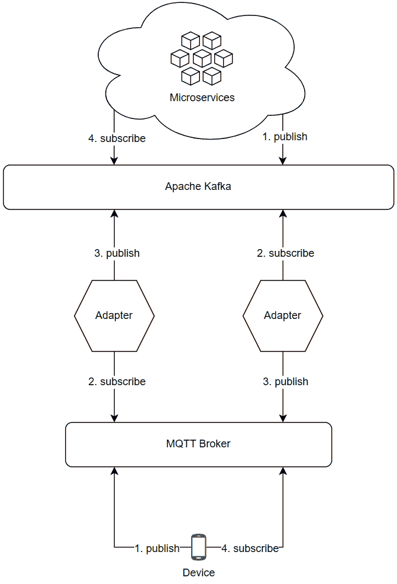

图 19.43：完整的协议适配器流程，包括设备和微服务

在我们探索事件可能是什么之前，让我们逐步探索这两个流程。左侧的流程允许通过以下顺序从设备获取系统内部的事件：

1.  一个设备向 MQTT 代理发布事件。

1.  适配器读取该事件。

1.  适配器向 Kafka 代理发布类似或不同的事件。

1.  零个或多个订阅了事件的微服务对其执行操作。

另一方面，右侧流程允许通过以下顺序将事件从系统中输出到设备：

1.  一个微服务向 Kafka 代理发布事件。

1.  适配器读取该事件。

1.  适配器向 MQTT 代理发布类似或不同的事件。

1.  零个或多个订阅了事件的设备对其执行操作。

你不必实现两种流程；适配器可以是双向的（支持两种流程），我们可以有两个单向适配器，支持其中一种流程，或者我们可以允许通信单向流动（仅入或出，但不双向）。选择与你的具体使用案例相关。从设备向微服务发送消息的具体例子（左侧流程）可能是发送其 GPS 位置、状态更新（灯现在亮了）或指示传感器故障的消息。向设备发送消息的具体例子（右侧流程）可能是远程控制扬声器的音量、打开灯或发送确认消息已被接收。在这种情况下，适配器不是一个临时解决方案，而是一个永久性功能。我们可以利用这样的适配器以最小的系统影响创建额外的功能。主要的缺点是部署一个或多个其他微服务，但你的系统和流程可能足够强大，足以在利用这些功能时处理这种额外的复杂性。这种利用微服务适配器的第三种场景是我们的最后一个场景。希望这足以激发你的想象力，利用这个简单而强大的设计模式。

### 结论

我们探讨了微服务适配器模式，该模式允许我们通过适配一个元素以适应另一个元素来连接系统的两个元素。我们探讨了如何将信息从事件代理推送到不支持此类功能现有系统。我们还探讨了如何利用适配器来打破紧密耦合，将功能迁移到较新的系统，以及无缝退役遗留应用程序。最后，我们通过适配器微服务连接了两个事件代理，允许低功耗的物联网设备在不耗尽电池和避免使用更复杂通信协议带来的复杂性情况下与微服务系统通信。这种模式非常强大，可以以多种方式实现，但一切都取决于具体的使用案例。你可以使用无服务器产品如 Azure 函数、无代码/低代码产品如 Power Automate 或 C#来编写适配器。当然，这些只是几个例子。设计正确系统的关键是明确问题陈述，因为一旦你知道你试图解决的问题，解决方案就会变得清晰。现在，让我们看看微服务适配器模式如何帮助我们以云规模遵循**SOLID**原则：

+   **S**：微服务适配器有助于管理长期或短期责任。例如，添加一个在两种协议之间进行转换的适配器或创建一个临时适配器来退役遗留系统。

+   **O**：你可以利用微服务适配器动态添加或删除功能，而不会对系统造成影响或造成有限的影响。例如，在物联网场景中，我们可以添加对 AMQP 等新协议的支持，而无需更改系统的其余部分。

+   **L**：N/A

+   **我**：添加较小的适配器可以使更改更容易且风险更低，比更新大型遗留应用程序更佳。正如我们在遗留系统退役场景中所见，我们还可以利用临时适配器将大型应用程序拆分成更小的部分。

+   **D**：微服务适配器反转了被适配系统之间的依赖关系流。例如，在遗留系统退役场景中，适配器通过利用事件代理，将两个依赖项到遗留系统的流向反转。

## 摘要

微服务架构与本书中我们所涵盖的以及我们构建单体应用的方式都不同。我们不是将一个大型应用作为一个整体，而是将其拆分为多个更小的应用，这些应用被称为微服务。微服务必须相互独立；否则，我们将面临与紧密耦合的类相关联的相同问题，但这些问题是在云规模上出现的。我们可以利用发布-订阅设计模式来松散耦合微服务，同时通过事件将它们连接起来。消息代理是负责派发这些消息的程序。我们可以使用事件溯源在任意时间点重新创建应用程序的状态，包括在启动新容器时。我们可以使用应用程序网关来保护客户端免受微服务集群复杂性的影响，并公开仅暴露服务的一部分。我们还探讨了如何基于 CQRS 设计模式来解耦相同实体的读写操作，从而允许我们独立扩展查询和命令。我们还探讨了使用无服务器资源来创建这种类型的系统。最后，我们探讨了微服务适配器模式，该模式允许我们适应两个系统，退役一个遗留应用程序，并连接两个事件代理。这种模式简单但强大，能够在松散耦合的方式下反转两个依赖项之间的依赖关系流。该模式的使用可以是临时的，就像我们在遗留应用程序退役场景中看到的那样，也可以是永久的，就像我们在物联网场景中看到的那样。另一方面，微服务是有代价的，并不打算取代所有现有的东西。对于许多项目来说，从单体开始并随着扩展将其迁移到微服务仍然是一个好主意。从单体开始，并在扩展时迁移到微服务，这也是另一种解决方案。这使我们能够更快地开发应用程序（单体）。与向微服务应用程序添加新功能相比，向单体添加新功能更容易。大多数情况下，错误在单体中比在微服务应用程序中成本更低。您还可以规划您未来的微服务迁移，这将带来两全其美的结果，同时保持操作复杂性较低。例如，我们可以在单体中利用发布-订阅模式通过 MediatR 通知，并在迁移系统到微服务架构时（如果需要的话）将事件派发责任迁移到消息代理。我们在探索如何组织我们的单体在*第二十章*，*模块化单体*。我不想你放弃微服务架构，但我想确保你在盲目跳入之前权衡这种系统的利弊。您的团队的技术水平和学习新技术的能力也可能影响跳入微服务之船的成本。**DevOps**（开发[Dev]和 IT 运营[Ops]）或**DevSecOps**（在 DevOps 中添加安全[Sec]），我们在书中没有涉及，但在构建微服务时是必不可少的。它带来了部署自动化、自动质量检查、自动组合等。没有这些，您的微服务集群将很难部署和维护。当您需要扩展、想要无服务器或在不同团队之间划分责任时，微服务很棒，但请记住运营成本。在下一章中，我们将结合微服务和单体世界。

## 问题

让我们看看几个练习题：

1.  **消息队列**和**发布-订阅**模型之间最显著的区别是什么？

1.  什么是 **事件溯源**？

1.  **应用程序网关**可以既是**路由网关**又是**聚合网关**吗？

1.  真实的 CQRS 是否需要无服务器云基础设施？

1.  使用 BFF 设计模式有什么显著优势？

## 进一步阅读

这里有一些链接，可以帮助你构建本章所学的内容：

+   马丁·福勒的 Event Sourcing 模式：[`adpg.link/oY5H`](https://adpg.link/oY5H)

+   微软提供的事件溯源模式：[`adpg.link/ofG2`](https://adpg.link/ofG2)

+   微软提供的发布-订阅模式：[`adpg.link/amcZ`](https://adpg.link/amcZ)

+   微软提供的事件驱动架构：[`adpg.link/rnck`](https://adpg.link/rnck)

+   microservices.io 上的微服务架构和模式：[`adpg.link/41vP`](https://adpg.link/41vP)

+   马丁·福勒提供的微服务架构和模式：[`adpg.link/Mw97`](https://adpg.link/Mw97)

+   微服务架构和模式，由微软提供：[`adpg.link/s2Uq`](https://adpg.link/s2Uq)

+   RFC 6902（JSON Patch）：[`adpg.link/bGGn`](https://adpg.link/bGGn)

+   ASP.NET Core web API 中的 JSON Patch：[`adpg.link/u6dw`](https://adpg.link/u6dw)

Strangler Fig 应用程序模式：

+   马丁·福勒：[`adpg.link/Zi9G`](https://adpg.link/Zi9G)

+   微软：[`adpg.link/erg2`](https://adpg.link/erg2)

## 答案

1.  消息队列接收到消息并有一个唯一的订阅者将其出队。如果没有东西出队，消息将无限期地留在队列中（FIFO 模式）。发布-订阅模型接收到消息并将其发送到零个或多个订阅者。

1.  事件溯源是将系统发生的事件按时间顺序积累的过程，而不是在实体的当前状态中持久化。它允许你通过重放这些事件来重新创建实体的状态。

1.  是的，你可以混合使用网关模式（或子模式）。

1.  不，如果你想的话，可以在本地部署微应用程序（微服务）。

1.  它将通用功能与应用特定功能分离，促进代码的整洁和模块化。它也有助于简化前端。
