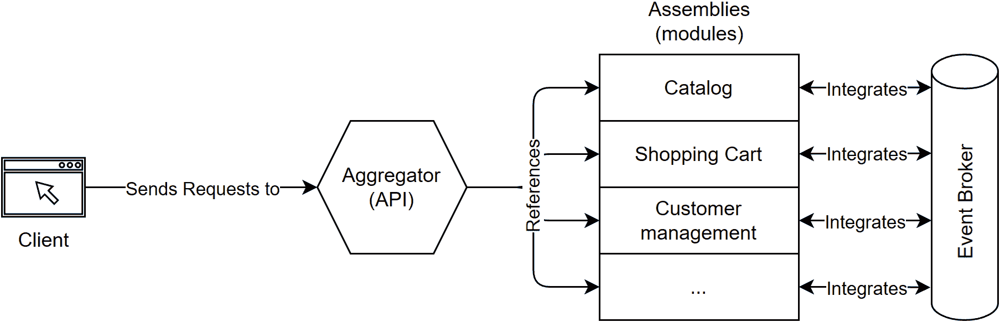
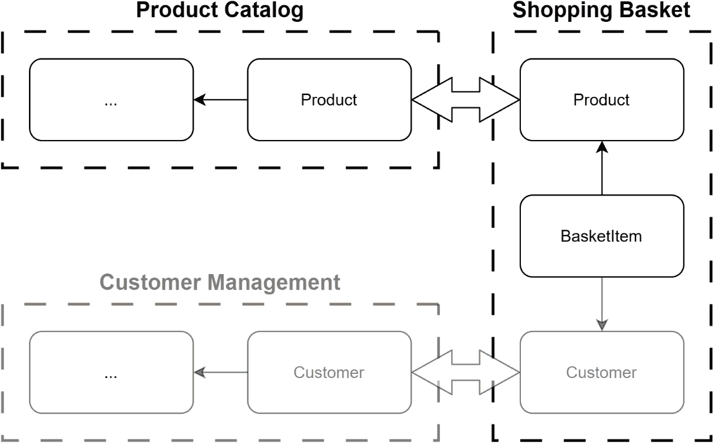
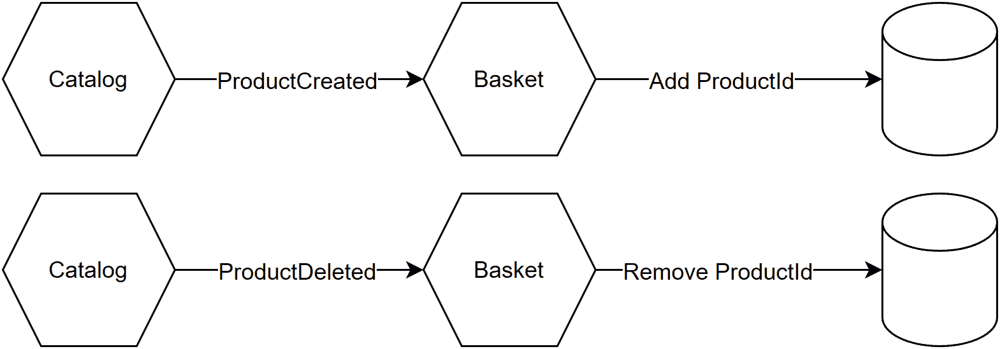
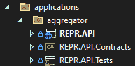
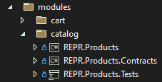
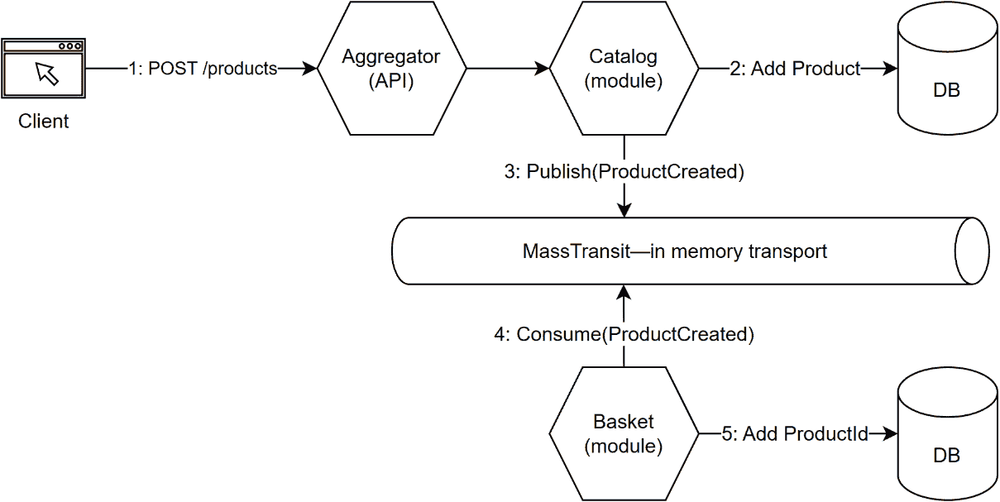

# 第二十章：20 模块化单体

## 在您开始之前：加入我们的 Discord 书友社区

直接向作者本人提供反馈，并在我们的 Discord 服务器上与其他早期读者聊天（在“architecting-aspnet-core-apps-3e”频道下找到“EARLY ACCESS SUBSCRIPTION”）。

[`packt.link/EarlyAccess`](https://packt.link/EarlyAccess)


在不断演变的软件开发领域中，选择正确的架构就像为建筑奠定基础。架构决定了软件的结构，影响着其可扩展性、可维护性和整体成功。传统的单体架构和微服务长期以来一直是主导范式，各有其优势和挑战。然而，一种新的架构风格正在获得关注——模块化单体。这种方法旨在通过结合单体和微服务的简单性与灵活性，提供两者的最佳结合。它作为一个中间地带，解决了与微服务相关的一些复杂性，使其特别适合小型到中型项目或从传统单体架构过渡的团队。

> 我在 2017 年写了一篇关于这个主题的文章，标题为《微服务聚合》。我最近看到了“模块化单体”这个名字，觉得它更好。这种架构风格正在获得关注，但它并不完全新颖。模块化单体风格是一种模块化和组织应用程序的方法，降低了我们创建一团糟的可能性。

本章旨在全面了解模块化单体。我们深入探讨其核心原则、优势以及关键组件，并探讨何时以及如何实施这种架构。我们基于我们的纳米电子商务应用，以获得模块化单体在实际应用中的实践经验。此外，我们讨论了它们与其他架构风格的比较，以帮助您为您的下一个项目做出明智的决定。在本章结束时，您应该对模块化单体有一个牢固的理解，了解为什么它们可能是您项目的正确选择，以及如何实施它们。在本章中，我们将涵盖以下主题：

+   什么是模块化单体？

+   模块化单体的优势

+   模块化单体的关键组件

+   实施模块化单体

+   项目—模块化单体

+   向微服务过渡

+   挑战与陷阱

让我们从探讨什么是模块化单体开始。

## 什么是模块化单体？

模块化单体是一种旨在结合传统单体架构和微服务的最佳特性的架构风格。它将软件应用程序组织成定义良好、松散耦合的模块。每个模块负责特定的业务能力。然而，与微服务不同，所有这些模块都作为一个单一单元部署，就像单体一样。模块化单体的核心原则是：

+   将每个模块视为一个微服务。

+   将应用程序作为单一单元部署。

下面是成功微服务的基本原则，这些原则在*第十九章*，*微服务架构简介*中进行了研究：

+   每个微服务应该是一个业务上的统一单元。

+   每个微服务应该拥有自己的数据。

+   每个微服务应该独立于其他微服务。

简而言之，我们得到了两者的最佳结合。然而，了解模块化单体与其他架构风格相比如何，对于做出明智的决定至关重要。

### 传统单体是什么？

在传统的单体架构中，我们将应用程序构建为一个单一、不可分割的单元。这导致功能紧密耦合在一起，使得更改或扩展特定功能变得困难。这种方法使得创建一个大泥球更容易，尤其是在团队在开发和开发前后的领域建模和分析投入很少努力的情况下。此外，尽管这种方法简单直接，但它缺乏更现代架构的灵活性和可扩展性。

> 一个单体不一定是不可分割的，然而大多数最终都变成了这样，因为在一个单一应用程序中创建紧密耦合很容易。

让我们接下来看看微服务。

### 微服务是什么？

相反，微服务架构将模块化推向了极致。每个服务都是一个完全独立的单元，在自己的环境中运行。微服务架构允许高度的可扩展性和灵活性，但代价是增加了操作复杂性。

> *第十九章*，*微服务架构简介*更深入地探讨了这一主题。

以下章节更深入地探讨了这种新兴的架构风格，从其优势开始。

## 模块化单体的优势

模块化单体最优秀的一点是它们易于管理。你不必担心像微服务那样有许多移动部件。所有东西都在一个地方，但仍然被分割成模块。这使得我们更容易跟踪事物并与它们一起工作。在模块化单体中，每个模块就像是一个独立的小项目。我们可以测试、修复或改进一个模块，而不会影响其他模块。这很好，因为它让我们一次专注于一件事情，这通过降低工作在该功能上所需的认知负荷来提高生产力。当是时候发布软件时，我们只有一个应用程序需要部署。尽管它有许多模块，但我们把它们当作一个可部署的单元来处理。这使得管理部署变得更加直接，因为我们不需要像处理微服务那样处理多个服务。模块化单体可以为我们节省金钱，因为我们不需要像部署单个单体那样多的资源。正因为如此，我们不需要一个团队来管理和运行复杂的基础设施。我们不必担心服务之间的分布式跟踪，这减少了前期监控成本。这种部署方式在用小型团队开始项目或团队不熟悉微服务架构时非常有用。

> 即使你是大型团队或大型组织的一部分，或者有微服务架构的经验，模块化单体仍然很有价值。这并不是一种或另一种场景。

正如我们刚才探讨的，模块化单体带来了许多优势：

+   减少了操作复杂性，使得将复杂应用程序作为一个单一单元部署比微服务更容易。

+   它们通过其简单性改善了我们的开发和测试体验，提高了我们的效率。

+   它们比大多数传统的单体应用更容易管理，因为模块被很好地隔离了。

+   它们比微服务更经济高效。

以下部分将探讨构成模块化单体的是什么。

## 模块化单体的关键组件

关于模块化单体，首先要知道的是，它们由称为**模块**的不同部分组成。每个模块就像一个迷你应用程序，执行特定的任务。这项任务与特定的业务能力相关。业务能力来自业务领域，旨在针对一组连贯的场景。这样的组在领域驱动设计中被称为边界上下文。将每个模块视为一个微服务或定义良好的领域块。这种分离意味着完成特定任务所需的一切都在一个模块中，这使得我们更容易理解和处理软件，因为我们不需要从一个地方跳到另一个地方来完成事情。因此，如果一个模块需要更新或出现问题，我们可以修复它而不会影响到其他模块。这种隔离对于测试也非常完美，因为我们可以在隔离的情况下测试每个模块，以确保其正常工作。例如，一个模块可能处理购物车，而另一个模块则负责处理运输，但我们将这些模块拼接到一个最终聚合的应用程序中。

> 我们可以将模块化单体作为一个单一的项目来创建。然而，在.NET 特定的环境中，当每个模块包含一个或多个程序集时，创建模块之间的不必要耦合会更加困难。我们将在即将构建的项目中探讨这一点。

**模块聚合器**——单体——负责加载和提供模块，就像它们只是一个应用程序一样。尽管每个模块都是独立的，但它们有时仍然需要相互通信。例如，产品目录模块可能需要通知购物车模块，员工已将新产品添加到目录中。有许多方法可以实现这种通信。保持模块之间低耦合水平的一种最佳方法是通过利用事件驱动架构。在松散耦合的基础上，这还打开了诸如通过将一个或多个模块迁移到微服务架构来扩展模块化单体的大门；关于这一点，稍后还会详细介绍。以下是一个表示这些关系的图：



图 20.1：表示模块聚合器、模块和事件代理之间关系的图

既然我们已经探讨了模块化单体的关键组件，下一节将讨论其规划和实现。

## 实现模块化单体

在构建模块化单体之前进行规划至关重要。我们必须考虑每个模块的功能以及模块如何协同工作。一个好的计划有助于我们避免以后出现问题。选择合适的工具来创建精简的堆栈也是至关重要的。好消息是，我们不需要定义一个大的共享堆栈，因为每个模块都是独立的。就像垂直切片架构中的一个切片一样，每个模块可以确定其模式和数据源。然而，我们必须定义一些共同元素，以成功组装模块化单体。以下是一些考虑事项，以提高模块化单体成功的可能性：

+   模块共享一个 URL 空间。

+   模块共享配置基础设施。

+   模块共享单个依赖注入对象图（一个容器）。

+   模块共享模块间通信的基础设施（事件代理）。

我们可以使用模块名称作为区分符来减轻前两个元素。例如，使用 `/{"模块名称"}/{模块空间}` URI 空间会产生以下结果（`products`、`baskets` 和 `customers` 是模块）：

+   `/products`

+   `/products/123`

+   `/baskets`

+   `/customers`

使用模块名称作为配置的最高级键也使得避免冲突变得容易，如 `{模块名称}:{键}`，或者如下面的 JSON（例如来自 `appsettings.json` 文件）：

```cs
"{module name}": {
    "{key}": "Module configs"
}
```

我们可以通过以某种方式管理共享代码来减轻最后两个元素。例如，限制共享代码的数量可以减少模块之间冲突的机会。然而，多个模块全局配置 ASP.NET Core 或第三方库可能会导致冲突；将这些配置集中到聚合器中，并将它们视为约定，将有助于减轻大多数问题。跨切面关注点，如异常处理、JSON 序列化、日志记录和安全，是这种方法的理想候选者。最后，共享模块间通信的单一种方式并在聚合器中配置它将有助于减轻通信问题。让我们开始规划项目。

### 规划项目

规划是任何软件的关键部分。没有计划，你增加构建错误东西的机会。计划并不能保证成功，但它提高了你的机会。过度规划是另一面。它可能导致**分析瘫痪**，这意味着你可能永远无法交付你的项目，或者它将花费你如此长的时间来交付，以至于它将是一个错误的产品，因为需求在途中发生了变化，而你没有适应。以下是一个规划模块化单体的高级方法。你不必按顺序执行所有步骤。你可以迭代地执行许多步骤，或者多个人或团队甚至可以并行工作：

1.  分析和建模领域。

1.  识别并设计模块。

1.  识别模块之间的交互并设计覆盖这些交互的集成事件。

一旦我们完成规划，我们就可以开发和操作应用程序。以下是一些高级步骤：

1.  在隔离状态下构建和测试模块。

1.  构建和测试集成一个或多个模块的模块聚合器应用程序。

1.  部署、操作和监控单体。

实施模块化单体，就像任何程序一样，是一个逐步的过程。我们规划、构建、测试，然后部署它。每个部分本身都足够简单，当我们把它们拼在一起时，我们得到一个易于维护的系统。即使持续改进应用程序、细化分析和模型随着时间的推移会产生最佳结果，但在开始之前对高级领域——模块——有一个好的理解，以及至少对它们之间交互的模糊看法，将有助于避免错误，并可能避免进一步的重大重构。以下是此过程的通用表示：

∞

图 20.2：模块化单体阶段的敏捷和 DevOps 部分视图

接下来，我们规划我们的纳米电子商务应用程序。

#### 分析领域

在我们继续迭代我们在第十八章和第十九章中构建的纳米电子商务应用程序时，领域分析将会非常简短。此外，我们不会将应用程序扩展到产品和服务车之外，因为应用程序已经太大，无法放入单个章节。当然，这次，我们将其构建为模块化单体。以下是高级实体及其关系：


图 20.3：我们的纳米电子商务应用程序的高级实体及其关系

如图表所示，我们有一个`Product`实体，它可以从更多细节中受益，如类别，因此有`...`框。我们还有一个`BasketItem`实体，我们用它来将人们的购物车保存到数据库中。最后，一个`Customer`实体代表拥有购物车的人。

> 尽管我们没有实现`Customer`类，但客户概念上通过`CustomerId`属性存在。

接下来，我们将这个领域子集拆分为模块。

#### 识别模块

现在我们已经确定了实体，是时候将它们映射到模块中。让我们从以下图表开始：



图 20.4：模块（边界上下文）分离和实体关系。

如预期的那样，我们有一个产品目录、购物车和客户管理模块。这里的新颖之处在于实体之间的关系。目录主要管理 `Product` 实体，但购物车需要了解它才能操作。同样的逻辑也适用于 `Customer` 实体。在这种情况下，购物车只需要知道每个实体的唯一标识符，但另一个模块可能需要更多信息。基于这个高级视图，我们需要创建三个模块。在我们的案例中，我们继续使用两个模块。在实际应用中，我们会拥有超过三个模块，因为我们还需要管理购买、运输、库存等。让我们看看模块之间的交互。

#### 识别模块之间的交互

根据我们的分析和限于我们正在构建的两个模块，购物车模块需要了解产品。以下是我们的 `BasketItem` 类：

```cs
public record class BasketItem(int CustomerId, int ProductId, int Quantity);
```

前面的类显示我们只需要了解独特的商品标识符。因此，以事件驱动的思维方式，购物车模块希望在以下情况下得到通知：

+   创建一个产品。

+   一个产品被删除。

通过这两个事件，购物车模块可以管理其产品缓存，并只允许客户将现有商品添加到他们的购物车中。当商品不可用时，它还可以从客户的购物车中移除商品。以下是一个表示这些流程的图表：



图 20.5：目录模块和购物车模块之间的集成事件流。

现在我们已经分析了领域和模块，在构建任何东西之前，让我们定义我们的技术栈。

### 定义我们的技术栈

我们知道我们正在使用 ASP.NET Core 和 C#。我们继续利用最小化 API，但 MVC 也能实现同样的效果。我们还继续利用 *EF Core*、*ExceptionMapper*、*FluentValidation* 和 *Mapperly*。但模块和其他项目的共享方面怎么办？让我们看看。

#### 模块结构

我们使用的是灵活且直接的模块结构。你可以以任何你喜欢的方式组织你的项目；这不是一种规定的方法。例如，你可以从其他架构风格中汲取灵感，如 Clean Architecture，或者根据自己的经验、背景和工作环境发明自己的架构。在我们的案例中，我选择了以下目录结构：

+   `applications` 目录包含可部署的应用程序，如聚合器。我们可以在该目录中添加用户界面或其他可部署的应用程序，如第十九章中构建的 BFF。每个应用程序都包含在其自己的子目录中。

+   `modules` 目录包含模块，每个模块都在自己的子目录中。

+   `shared` 目录包含共享项目。

> 在现实世界的软件中，我们可以扩展这个设置，并添加`infrastructure`、`docs`和`pipelines`目录来存储我们的基础设施即代码（IaC）、文档和 CI/CD 流水线，这些都与我们的代码相邻。

我喜欢这种由单一代码库启发的结构，因为每个模块和应用程序都是自包含的。例如，聚合器的 API、合约和测试都紧挨在一起：



图 20.6：聚合器的目录和项目层次结构。

模块的组织方式类似：



图 20.7：模块的子目录和目录的项目层次结构。

我保留了 REPR 前缀，因为它基于第十八章的代码，但我稍微改变了代码结构。在这个版本中，我废除了嵌套类，并为每个文件创建了一个类。这遵循了更经典的.NET 约定，并允许我们将 API 合约提取到另一个程序集。如果你记得，在第十九章中，bff 项目引用了两个 API 以重用它们的`Query`、`Command`和`Response`合约。我们通过这个解决方案中的`Contracts`类库项目解决这个问题。

> 为什么这是个问题？bff 依赖于所有微服务，包括它们的逻辑和依赖。这是一个引入不必要耦合的配方。此外，由于它继承所有依赖项，它增加了其部署大小和脆弱性表面；更多的依赖和代码意味着恶意行为者找到可利用漏洞的可能性更大。

在 API 合约之上，`Contracts`项目还包含了集成事件。如果应用程序更大，我们可以将 API 合约和集成事件分开；在这种情况下，我们只有两个集成事件。设计选择必须根据当前项目和上下文来考虑。接下来，让我们探索 URI 空间。

#### URI 空间

这个应用程序的模块遵循之前讨论的 URI 空间：`/{module name}/{module space}`。每个模块在其根目录都有一个`Constants`文件，看起来像这样：

```cs
namespace REPR.Baskets;
public sealed class Constants
{
    public const string ModuleName = nameof(Baskets);
}
```

我们在`{module name}ModuleExtensions`文件中使用`ModuleName`常量来设置 URI 前缀，并像这样标记端点：

```cs
namespace REPR.Baskets;
public static class BasketModuleExtensions
{
    public static IEndpointRouteBuilder MapBasketModule(this IEndpointRouteBuilder endpoints)
    {
        _ = endpoints
            .MapGroup(Constants.ModuleName.ToLower())
            .WithTags(Constants.ModuleName)
            .AddFluentValidationFilter()
            // Map endpoints
            .MapFetchItems()
            .MapAddItem()
            .MapUpdateQuantity()
            .MapRemoveItem()
        ;
        return endpoints;
    }
}
```

在此基础上，这两个模块都会在正确的 URI 空间中自我注册。

> 我们可以用许多不同的方式应用这些类型的约定。在这种情况下，我们选择了简单性，这是最容易出现错误的，将责任留给了每个模块。如果我们有更面向框架的思维模式，我们可以创建一个强类型模块合约，它会被自动加载，就像一个`IModule`接口。聚合器也可以创建根组并强制执行 URI 空间。

接下来，我们探索数据空间。

#### 数据空间

由于我们遵循微服务架构原则，并且每个模块应该拥有自己的数据，我们必须找到一种确保我们的数据上下文不会冲突的方法。项目使用 EF Core 内存提供程序进行本地开发。对于生产环境，我们计划使用 SQL Server。确保我们的 `DbContext` 类之间不冲突的一个很好的方法是为每个上下文创建一个数据库架构。每个模块有一个上下文，所以每个模块一个架构。我们不必过度思考；我们可以重用与 URI 相同的想法，并利用模块名称。因此，每个模块将把其表分组在 `{模块名称}` 架构下，而不是 `dbo`（SQL Server 的默认架构）。

> 我们可以在 SQL Server 中为每个架构应用不同的安全规则和权限，因此我们可以通过扩展这个方法来构建一个非常安全的数据库模型。例如，我们可以使用具有最小权限的多个用户，在模块中使用不同的连接字符串等。

在代码中，这样做是通过在每个 `DbContext` 的 `OnModelCreating` 方法中设置默认架构名称来体现的。以下是一个 `ProductContext` 类的例子：

```cs
namespace REPR.Products.Data;
public class ProductContext : DbContext
{
    public ProductContext(DbContextOptions<ProductContext> options)
        : base(options) { }
    protected override void OnModelCreating(ModelBuilder modelBuilder)
    {
        base.OnModelCreating(modelBuilder);
        modelBuilder.HasDefaultSchema(Constants.ModuleName.ToLower());
    }
    public DbSet<Product> Products => Set<Product>();
}
```

上述代码使所有 `ProductContext` 的表都成为 `products` 架构的一部分。然后我们为购物车模块做同样的处理：

```cs
namespace REPR.Baskets.Data;
public class BasketContext : DbContext
{
    public BasketContext(DbContextOptions<BasketContext> options)
        : base(options) { }
    public DbSet<BasketItem> Items => Set<BasketItem>();
    public DbSet<Product> Products => Set<Product>();
    protected override void OnModelCreating(ModelBuilder modelBuilder)
    {
        base.OnModelCreating(modelBuilder);
        modelBuilder.HasDefaultSchema(Constants.ModuleName.ToLower());
        modelBuilder
            .Entity<BasketItem>()
            .HasKey(x => new { x.CustomerId, x.ProductId })
        ;
    }
}
```

上述代码使所有 `BasketContext` 的表都成为 `baskets` 架构的一部分。由于架构的存在，这两个上下文都不会相互阻碍。但是等等！这两个上下文都有一个 `Products` 表；那么会发生什么呢？目录模块使用 `products.products` 表，而购物车模块使用 `baskets.products` 表。不同的架构，不同的表，问题解决！

> 我们可以将这些概念应用到不仅仅是模块化单体架构上，因为它是一般性的 SQL Server 和 EF Core 知识。

如果你使用的是不提供架构或 NoSQL 数据库的其他关系型数据库引擎，你也必须考虑这一点。每个 NoSQL 数据库都有不同的数据思考方式，在这里不可能全部涵盖。重要的是要找到一个区分器，将模块的数据分开。在最极端的情况下，甚至可以每个模块一个不同的数据库；然而，这会增加应用程序的操作复杂性。接下来，我们探讨消息代理。

#### 消息代理

为了处理目录模块和购物车模块之间的集成事件，我决定选择 MassTransit。引用他们的 GitHub 项目：

> *MassTransit 是一个免费的、开源的分布式应用程序框架，适用于 .NET。MassTransit 使得创建利用基于消息的、松散耦合的异步通信的应用程序和服务变得容易，从而提高了可用性、可靠性和可伸缩性。*

我选择 MassTransit，因为它是一个拥有 5,800 GitHub 星标的流行项目，截至 2023 年支持许多提供者，包括内存中的。此外，它提供了许多超出我们需求的功能。再一次，我们可以使用任何东西。例如，MediatR 也可以完成这项工作。《REPR.API》项目—聚合器—以及模块依赖于以下 NuGet 包来使用 MassTransit：

```cs
<PackageReference Include="MassTransit" Version="8.1.0" />
```

我们的用法非常简单；聚合器像这样注册和配置 MassTransit：

```cs
builder.Services.AddMassTransit(x =>
{
    x.SetKebabCaseEndpointNameFormatter();
    x.UsingInMemory((context, cfg) =>
    {
        cfg.ConfigureEndpoints(context);
    });
    x.AddBasketModuleConsumers();
});
```

突出的行将事件消费者的注册委托给了购物篮模块。`AddBasketModuleConsumers`方法是`BasketModuleExtensions`类的一部分，并包含以下代码：

```cs
public static void AddBasketModuleConsumers(this IRegistrationConfigurator configurator)
{
    configurator.AddConsumers(typeof(ProductEventsConsumers));
}
```

`ProductEventsConsumers`类管理两个事件。`AddConsumers`方法是 MassTransit 的一部分。我们在项目部分探讨了`ProductEventsConsumers`类。

> 如果我们有更多模块，我们会在这里注册其他模块的事件消费者。然而，将注册委托给每个模块使其模块化。

接下来，我们编写一些 C#代码，将我们的微服务应用程序转换为模块化单体。

## 项目—模块化单体

此项目与*第十八章*和*第十九章*具有相同的构建块，但我们使用了模块化单体方法。在之前的版本之上，我们利用事件来允许购物篮在允许客户将其添加到购物篮之前验证产品的存在。

> 完整的源代码可在 GitHub 上找到：[`adpg.link/gyds`](https://adpg.link/gyds)
> 
> > 解决方案中的测试项目是空的。它们仅存在于解决方案的组织方面。作为一个练习，你可以将*第十八章*中的测试迁移过来，并适应这种新的架构风格。

让我们从通信部分开始。

### 从目录模块发送事件

为了让目录模块能够传达购物篮模块需要的事件，它必须定义以下新操作：

+   创建产品

+   删除产品

在`REPR.Products.Contracts`项目中，我们必须创建以下 API 契约来支持这两个操作：

```cs
namespace REPR.Products.Contracts;
public record class CreateProductCommand(string Name, decimal UnitPrice);
public record class CreateProductResponse(int Id, string Name, decimal UnitPrice);
public record class DeleteProductCommand(int ProductId);
public record class DeleteProductResponse(int Id, string Name, decimal UnitPrice);
```

到现在为止，API 契约应该已经很熟悉了，并且与之前章节中的契约相似。然后我们需要以下两个事件契约：

```cs
namespace REPR.Products.Contracts;
public record class ProductCreated(int Id, string Name, decimal UnitPrice);
public record class ProductDeleted(int Id);
```

这两个事件类也非常简单，但它们的名称是过去时，因为过去发生了一个事件。所以，模块创建了产品，然后通知其订阅者一个产品已经被创建（过去）。这与我们在*第十九章*中学习的*微服务架构简介*完全一样。此外，事件是简单的数据容器，就像 API 契约——一个 DTO 一样。我们如何发送这些事件？让我们看看`CreateProductHandler`类：

```cs
namespace REPR.Products.Features;
public class CreateProductHandler
{
    private readonly ProductContext _db;
    private readonly CreateProductMapper _mapper;
    private readonly IBus _bus;
    public CreateProductHandler(ProductContext db, CreateProductMapper mapper, IBus bus)
    {
        _db = db ?? throw new ArgumentNullException(nameof(db));
        _mapper = mapper ?? throw new ArgumentNullException(nameof(mapper));
        _bus = bus ?? throw new ArgumentNullException(nameof(bus));
    }
    public async Task<CreateProductResponse> HandleAsync(CreateProductCommand command, CancellationToken cancellationToken)
    {
        var product = _mapper.Map(command);
        var entry = _db.Products.Add(product);
        await _db.SaveChangesAsync(cancellationToken);
        var productCreated = _mapper.MapToIntegrationEvent(entry.Entity);
        await _bus.Publish(productCreated, CancellationToken.None);
        var response = _mapper.MapToResponse(entry.Entity);
        return response;
    }
}
```

在前面的代码中，我们在`CreateProductHandler`类中注入了 MassTransit 的`IBus`接口，我们还注入了一个对象映射器和 EF Core 的`ProductContext`。`HandleAsync`方法执行以下操作：

1.  创建产品并将其保存到数据库中。

1.  发布一个 `ProductCreated` 事件（高亮代码）。

1.  根据新产品返回一个 `CreateProductResponse` 实例。

`Publish` 方法将事件发送到配置的管道，在我们的案例中是在内存中。这里代码传递了一个 `CancellationToken.None` 参数，因为我们不希望任何外部力量取消此操作，因为更改已经保存在数据库中。由于映射代码，发布代码在书中可能难以理解。`MapToIntegrationEvent` 方法将 `Product` 对象转换为 `ProductCreated` 实例，因此 `productCreated` 变量的类型为 `ProductCreated`。以下是具有突出显示该方法的 *Mapperly* 映射类：

```cs
namespace REPR.Products.Features;
[Mapper]
public partial class CreateProductMapper
{
    public partial Product Map(CreateProductCommand product);
    public partial ProductCreated MapToIntegrationEvent(Product product);
    public partial CreateProductResponse MapToResponse(Product product);
}
```

`DeleteProductHandler` 类遵循类似的模式，但发布的是 `ProductDeleted` 事件。现在，让我们探索篮子模块如何消费这些事件。

### 从篮子模块消费事件

篮子模块想要缓存现有产品。我们可以用不同的方式实现这一点。在这种情况下，我们创建以下 `Product` 类并将其持久化到数据库中：

```cs
namespace REPR.Baskets.Data;
public record class Product(int Id);
```

为了使用它，我们必须从 `BasketContext` 类中公开以下属性：

```cs
public DbSet<Product> Products => Set<Product>();
```

然后，我们可以开始利用这个缓存。首先，我们必须在目录模块创建产品时填充它，在删除产品时移除该产品。`ProductEventsConsumers` 类处理这两个事件。以下是这个类的框架：

```cs
using REPR.Products.Contracts;
namespace REPR.Baskets.Features;
public class ProductEventsConsumers : IConsumer<ProductCreated>, IConsumer<ProductDeleted>
{
    private readonly BasketContext _db;
    private readonly ILogger _logger;
    public ProductEventsConsumers(BasketContext db, ILogger<ProductEventsConsumers> logger)
    {
        _db = db ?? throw new ArgumentNullException(nameof(db));
        _logger = logger ?? throw new ArgumentNullException(nameof(logger));
    }
    public async Task Consume(ConsumeContext<ProductCreated> context) 
    {...}
    public async Task Consume(ConsumeContext<ProductDeleted> context) 
    {...}
}
```

高亮代码表示两个事件处理器。`IConsumer<TMessage>` 接口包含 `Consume` 方法。通过使用不同的 `TMessage` 泛型参数实现接口两次，规定在 `ProductEventsConsumers` 类中实现两个 `Consume` 方法。每个方法处理其自己的事件。当产品模块中创建产品时，篮子模块将执行以下方法（为了简洁，我移除了日志代码）：

```cs
public async Task Consume(ConsumeContext<ProductCreated> context)
{
    var product = await _db.Products.FirstOrDefaultAsync(
        x => x.Id == context.Message.Id,
        cancellationToken: context.CancellationToken
    );
    if (product is not null)
    {
        return;
    }
    _db.Products.Add(new(context.Message.Id));
    await _db.SaveChangesAsync();
}
```

上述代码在产品不存在时将其添加到数据库中。如果它已经存在，则不执行任何操作。

> 我们可以在此处添加遥测来记录和标记冲突，并探索如何解决它。如果产品已经存在，事件被接收了两次，这可能表明我们的系统存在问题。

这里是当员工创建一个新产品时发生流程的概述：



图 20.8：展示有人向系统中添加产品时操作序列的图表。

让我们回顾一下操作：

1.  客户端向 API（聚合应用程序）发送 POST 请求。目录模块接收请求。

1.  目录创建产品并将其添加到数据库中。

1.  目录随后使用 MassTransit 发布 `ProductCreated` 事件。

1.  在篮子模块中，`ProductEventsConsumers` 类的 `Consume` 方法在 MassTransit 对 `ProductCreated` 事件的反应中被调用。

1.  购物车模块将产品的标识符添加到数据库的物化视图中。

现在我们已经了解了`ProductEventsConsumers`类如何处理`ProductCreated`事件，让我们探索`ProductDeleted`事件（为了简洁，省略了日志代码）：

```cs
public async Task Consume(ConsumeContext<ProductDeleted> context)
{
    var item = await _db.Products.FirstOrDefaultAsync(
        x => x.Id == context.Message.Id,
        cancellationToken: context.CancellationToken
    );
    if (item is null)
    {
        return;
    }
    // Remove the products from existing baskets
    var existingItemInCarts = _db.Items
        .Where(x => x.ProductId == context.Message.Id);
    var count = existingItemInCarts.Count();
    _db.Items.RemoveRange(existingItemInCarts);
    // Remove the product from the internal cache
    _db.Products.Remove(item);
    // Save the changes
    await _db.SaveChangesAsync();
}
```

上述`Consume`方法从人们的购物车和物化视图中删除产品。如果产品不存在，则该方法不执行任何操作，因为没有要处理的内容。当员工从目录中删除产品并发布`ProductDeleted`事件时，也会发生类似的流程。购物车模块随后对事件做出反应并更新其缓存（物化视图）。现在我们已经探索了这个项目的这个令人兴奋的部分，让我们来看看聚合器。

### 在聚合器内部

聚合应用程序就像一个空壳，它加载其他组件并配置跨切面关注点。它引用模块，然后组装并启动应用程序。以下是`Program.cs`文件的第一部分：

```cs
using FluentValidation;
using FluentValidation.AspNetCore;
using MassTransit;
using REPR.API.HttpClient;
using REPR.Baskets;
using REPR.Products;
using System.Reflection;
var builder = WebApplication.CreateBuilder(args);
// Register fluent validation
builder.AddFluentValidationEndpointFilter();
builder.Services
    .AddFluentValidationAutoValidation()
    .AddValidatorsFromAssemblies(new[] {
        Assembly.GetExecutingAssembly(),
        Assembly.GetAssembly(typeof(BasketModuleExtensions)),
        Assembly.GetAssembly(typeof(ProductsModuleExtensions)),
    })
;
builder.AddApiHttpClient();
builder.AddExceptionMapper();
builder
    .AddBasketModule()
    .AddProductsModule()
;
builder.Services.AddMassTransit(x =>
{
    x.SetKebabCaseEndpointNameFormatter();
    x.UsingInMemory((context, cfg) =>
    {
        cfg.ConfigureEndpoints(context);
    });
    x.AddBasketModuleConsumers();
});
```

上述代码注册了以下内容：

+   *FluentValidation*；它还会扫描组件以查找验证器。

+   我们用来初始化数据库的`IWebClient`接口（即`AddApiHttpClient`方法）。

+   *异常映射器*。

+   模块的依赖关系（高亮显示）

+   *MassTransit*；它还注册了来自购物车模块的消费者（高亮显示）。

我们将这些依赖项注册到的容器也用于模块，因为聚合器是宿主。这些依赖项在模块之间共享。`Program.cs`文件的第二部分如下：

```cs
var app = builder.Build();
app.UseExceptionMapper();
app
    .MapBasketModule()
    .MapProductsModule()
;
// Convenience endpoint, seeding the catalog
app.MapGet("/", async (IWebClient client, CancellationToken cancellationToken) =>
{
    await client.Catalog.CreateProductAsync(new("Banana", 0.30m), cancellationToken);
    await client.Catalog.CreateProductAsync(new("Apple", 0.79m), cancellationToken);
    await client.Catalog.CreateProductAsync(new("Habanero Pepper", 0.99m), cancellationToken);
    return new
    {
        Message = "Application started and catalog seeded. Do not refresh this page, or it will reseed the catalog."
    };
});
app.Run();
```

上述代码注册了`ExceptionMapper`中间件，然后是模块。它还添加了一个初始化端点（高亮显示）。如果你记得，我们之前使用`DbContext`来初始化数据库。然而，由于购物车模块需要从目录接收事件以构建物化视图，因此通过目录模块初始化数据库更为方便。在这个版本中，程序在客户端访问`/`端点时初始化数据库。默认情况下，当启动应用程序时，Visual Studio 应该在 URL 中打开浏览器，这将初始化数据库。

> 通过向`/`端点发送 GET 请求来初始化数据库在学术场景中使用内存数据库时非常方便。然而，在生产环境中这可能会造成灾难，因为每次有人访问该端点时都会重新初始化数据库。

让我们接下来探索`IWebClient`。

### 探索 REST API HttpClient

在`shared`目录中，`REPR.API.HttpClient`项目包含 REST API 客户端代码。代码与上一个项目非常相似，但现在的`IProductsClient`现在公开了创建和删除方法（高亮显示）：

```cs
using Refit;
using REPR.Products.Contracts;
namespace REPR.API.HttpClient;
public interface IProductsClient
{
    [Get("/products/{query.ProductId}")]
    Task<FetchOneProductResponse> FetchProductAsync(
        FetchOneProductQuery query,
        CancellationToken cancellationToken);
    [Get("/products")]
    Task<FetchAllProductsResponse> FetchProductsAsync(
        CancellationToken cancellationToken);
    [Post("/products")]
    Task<CreateProductResponse> CreateProductAsync(
        CreateProductCommand command,
        CancellationToken cancellationToken);
    [Delete("/products/{command.ProductId}")]
    Task<DeleteProductResponse> DeleteProductAsync(
        DeleteProductCommand command,
        CancellationToken cancellationToken);
}
```

在此之上，项目仅引用`Contracts`项目，限制其依赖性仅限于它需要的类。它不再引用完整的模块。这使得该项目易于重用。例如，我们可以构建另一个项目，如用户界面（UI），然后引用并使用此类型客户端从.NET UI 查询 API（模块化单体）。由于我们为微服务应用程序创建了此客户端，我们有两个基础下游服务 URL——一个用于产品微服务，一个用于购物车微服务。这种细微差别非常适合我们，因为我们可能希望在以后将单体迁移到微服务。与此同时，我们只需将两个键设置为同一主机即可，如下所示`appsettings.json`文件来自聚合器：

```cs
{
  "Downstream": {
    "Baskets": {
      "BaseAddress": "https://localhost:7164/"
    },
    "Products": {
      "BaseAddress": "https://localhost:7164/"
    }
  }
}
```

使用这些配置，`AddApiHttpClient`方法配置了两个具有相同`BaseAddress`值的`HttpClient`，如下所示：

```cs
using Microsoft.AspNetCore.Builder;
using Microsoft.Extensions.Configuration;
using Microsoft.Extensions.DependencyInjection;
using Refit;
namespace REPR.API.HttpClient;
public static class ApiHttpClientExtensions
{
    public static WebApplicationBuilder AddApiHttpClient(this WebApplicationBuilder builder)
    {
        const string basketsBaseAddressKey = "Downstream:Baskets:BaseAddress";
        const string productsBaseAddressKey = "Downstream:Products:BaseAddress";
        var basketsBaseAddress = builder.Configuration
            .GetValue<string>(basketsBaseAddressKey) ?? throw new BaseAddressNotFoundException(basketsBaseAddressKey);
        var productsBaseAddress = builder.Configuration
            .GetValue<string>(productsBaseAddressKey) ?? throw new BaseAddressNotFoundException(productsBaseAddressKey);
        builder.Services
            .AddRefitClient<IBasketsClient>()
            .ConfigureHttpClient(c => c.BaseAddress = new Uri(basketsBaseAddress))
        ;
        builder.Services
            .AddRefitClient<IProductsClient>()
            .ConfigureHttpClient(c => c.BaseAddress = new Uri(productsBaseAddress))
        ;
        builder.Services.AddTransient<IWebClient, DefaultWebClient>();
        return builder;
    }
}
```

哇，我们有一个可重用的功能化客户端和一个工作模块化单体。让我们接下来测试一下。

### 向 API 发送 HTTP 请求

现在我们有一个工作模块化单体，我们可以重用与之前版本相似的 HTTP 请求。在 REPR.API 项目的根目录中，我们可以使用以下内容：

+   `API-Products.http`文件包含对产品模块的请求。

+   `API-Baskets.http`文件包含对购物车模块的请求。

与之前版本相比，这个 API 的新功能是当我们尝试将不在目录中的产品添加到购物车时，如下所示请求：

```cs
POST https://localhost:7164/baskets
Content-Type: application/json
{
    "customerId": 1, 
    "productId": 5, 
    "quantity": 99
}
```

由于产品`5`不存在，API 返回以下内容：

```cs
HTTP/1.1 400 Bad Request
Content-Type: application/problem+json
{
  "type": "https://tools.ietf.org/html/rfc9110#section-15.5.1",
  "title": "One or more validation errors occurred.",
  "status": 400,
  "errors": {
    "productId": [
      "The Product does not exist."
    ]
  }
}
```

该错误确认验证按预期工作。但我们是如何验证这个的呢？

### 验证产品的存在性

在*添加项目*功能中，`AddItemValidator`类在验证`AddItemCommand`对象的同时确保产品存在。为了实现这一点，我们利用 FluentValidation 的`MustAsync`和`WithMessage`方法。以下是代码：

```cs
namespace REPR.Baskets.Features;
public class AddItemValidator : AbstractValidator<AddItemCommand>
{
    private readonly BasketContext _db;
    public AddItemValidator(BasketContext db)
    {
        _db = db ?? throw new ArgumentNullException(nameof(db));
        RuleFor(x => x.CustomerId).GreaterThan(0);
        RuleFor(x => x.ProductId)
            .GreaterThan(0)
            .MustAsync(ProductExistsAsync)
            .WithMessage("The Product does not exist.")
        ;
        RuleFor(x => x.Quantity).GreaterThan(0);
    }
    private async Task<bool> ProductExistsAsync(int productId, CancellationToken cancellationToken)
    {
        var product = await _db.Products
            .FirstOrDefaultAsync(x => x.Id == productId, cancellationToken);
        return product is not null;
    }
}
```

上述代码实现了与之前版本相同的规则，但还调用了从缓存中检索请求产品的`ProductExistsAsync`方法。如果结果是`false`，验证失败，消息为“*该产品不存在*”。以下是此更改的结果流程：

1.  客户端调用 API。

1.  验证中间件调用验证器。

1.  验证器从数据库中检索记录并验证其存在性。

1.  如果产品不存在，请求在这里被短路并返回给客户端。否则，它继续到`AddItemHandler`类。

使用这些配置，我们覆盖了该项目中所有新的场景。我们还探讨了聚合器如何将模块连接在一起，以及保持我们的模块独立有多容易。接下来，我们将 bff（最佳朋友）带回项目中，并探讨如何将我们的模块化单体过渡到微服务架构。

## 向微服务过渡

您不必将单体应用转换为微服务；如果单体应用符合您的需求，部署单体应用是可以的。然而，如果您需要的话，您可以使用网关或反向代理来保护聚合器，这样您就可以将模块提取到它们自己的微服务中，并重新路由请求，而不会影响客户端。这也会让您能够逐步将流量转移到新服务，同时保持单体应用在意外故障发生时保持完整。在模块化单体中，聚合器注册了大多数依赖项，因此在迁移时，您还必须迁移这个共享设置。避免代码重复的一种方法就是创建并引用一个包含这些注册的共享程序集。这使得管理依赖项和共享配置变得更容易，但这也使得微服务和聚合器之间产生了耦合。当微服务是同一单体仓库的一部分时，利用这个共享程序集的代码甚至更容易；您可以直接引用项目，而无需管理 NuGet 包。然而，当您更新库时，它会更新所有微服务以及单体应用，从而消除了每个应用的部署独立性。再次强调，考虑保持单体应用完整与部署微服务带来的运营复杂性之间的权衡。在解决方案中，`REPR.BFF`项目是对第十九章代码的迁移。代码和逻辑几乎相同。它利用了`REPR.API.HttpClient`项目，并在其`appsettings.Development.json`文件中配置了下游的基本地址。项目根目录下的`REPR.BFF.http`文件包含了一些用于测试应用的请求。

> 代码可在 GitHub 上找到：[`adpg.link/bn1F`](https://adpg.link/bn1F)。我建议您尝试使用实时应用程序，这会比再次复制书中的代码得到更好的结果。在 Visual Studio 中，项目之间的关系比在书中写出来更为明显。请随意重构项目、添加测试或添加功能。最好的学习方法是实践！

接下来，让我们看看挑战和陷阱。

## 挑战和陷阱

认为单体应用仅适用于小型项目或小型团队是一种误解。一个构建良好的单体应用可以走得很远，这正是模块化结构和良好分析带来的结果。模块化单体可以非常强大，并且适用于不同规模的项目。在选择项目的应用程序模式时，考虑每种方法的优缺点是至关重要的。也许云原生、无服务器、微服务应用正是您下一个项目需要的，但也许一个精心设计的模块化单体可以在成本极低的情况下实现相同的表现。为了帮助您做出这些决定，以下是一些潜在的挑战以及如何避免或减轻它们：

+   **模块内部过于复杂**：一个风险是使模块过于复杂。就像任何代码片段一样，如果模块做得太多，管理模块就会变得困难。此外，软件块越大，最初闪亮的设计开始变得混乱的可能性就越大。我们可以通过保持每个模块专注于领域特定的一部分，并应用 SRP（单一职责原则）来避免这种情况。

+   **模块边界定义不明确**：如果模块之间的边界不明确，可能会引起问题。例如，如果两个模块做类似的事情，可能会让开发者困惑，导致系统的一部分依赖于错误的模块。另一个例子是当两个本应属于同一边界上下文的模块被分开时。在这种情况下，两个模块之间可能会大量交互，产生冗余，并显著增加它们之间的耦合度。我们可以通过良好的规划、领域分析和确保每个模块有一个特定的任务（SRP）来避免这种情况。

+   **扩展性**：尽管模块化单体更容易管理，但当它们需要扩展时，它们仍然携带单体的问题。我们必须部署整个应用程序，因此不能独立扩展模块。此外，即使模块拥有自己的数据，它们可能共享一个数据库，这个数据库也必须作为一个整体进行扩展。如果整个系统的扩展是不可能的，我们可以将特定模块迁移到微服务。我们还可以将内存中的服务提取为分布式服务，例如使用分布式缓存而不是内存缓存，利用基于云的事件代理而不是内存代理，或者让计算密集型或数据密集型模块开始使用它们自己的数据库，这样它们就可以部分独立扩展。然而，这些解决方案使得部署和基础设施变得更加复杂，逐渐向复杂的基础设施转变，这抵消了单体的一些好处。

+   **最终一致性**：在模块间保持数据同步可能具有挑战性。我们可以通过使用事件驱动架构来处理这个问题。使用内存中的消息代理具有低延迟和高保真度（不涉及网络），这是学习处理最终一致性和将单体拆分为微服务（如果需要过渡）的良好第一步。然而，对于生产环境，建议使用更健壮的传输方式，以便系统能够抵抗故障，增加同步延迟。如果你更喜欢去除这种复杂性，则不需要使用事件；一个设计良好的关系型数据库也能做到这一点。

+   **过渡到微服务**：在事后将应用程序迁移到微服务架构可能是一项重大任务。然而，从事件驱动的模块化单体开始应该会使这个过程不那么痛苦。

虽然模块化单体提供了许多好处，但它们也可能带来挑战。关键是做好规划，保持简单，并随时准备随着程序的发展而适应。

## 结论

在本章中，我们学习了模块化单体架构风格，它将单体架构的简单性与微服务的灵活性相结合。这种架构风格将软件应用程序组织成独立的、松散耦合的模块，每个模块负责特定的业务能力。与微服务不同，我们将这些模块作为一个单一单元部署，就像单体一样。我们讨论了模块化单体的好处，包括更易于整体管理、良好的开发和测试体验、成本效益以及简化的部署模型。我们了解到，模块化单体由模块、模块聚合器和模块间通信基础设施组成——在这种情况下是事件驱动的。我们学习了在开始开发之前分析领域、设计模块和识别模块间交互可以提高产品的成功机会。我们简要提到了从模块化单体过渡到微服务架构，这涉及到将模块提取为单独的微服务并重新路由请求。我们还强调了了解潜在挑战和陷阱的重要性。这些包括模块复杂性、模块边界定义不明确、扩展限制以及由异步通信模型引起的最终一致性。 

## 问题

让我们看看几个练习题：

1.  模块化单体的核心原则是什么？

1.  模块化单体有哪些优势？

1.  传统单体是什么？

1.  模块边界定义不明确真的对模块化单体有益吗？

1.  将应用程序过渡到微服务架构是否真的是一项重大任务？

## 进一步阅读

这里有一个链接，可以基于本章所学的内容进行扩展：

+   微服务聚合（模块化单体）：[`adpg.link/zznM`](https://adpg.link/zznM)

+   当（模块化）单体是构建软件的更好方式时：[`adpg.link/KBGB`](https://adpg.link/KBGB)

+   源代码：[`adpg.link/gyds`](https://adpg.link/gyds)

## 结束只是新的开始

这可能是这本书的结束，但也是你进入软件架构和设计旅程的延续。希望你觉得这是一个对设计模式和如何设计 SOLID 应用程序的新鲜视角。根据你的目标和当前情况，你可能想要更深入地探索一个或多个应用规模的设计模式，开始你的下一个个人项目，开始一项业务，申请一份新工作，或者所有这些。无论你的目标是什么，请记住，设计软件既是技术也是艺术。实现一个功能很少只有一种方式，而是有多种可接受的方式。每个决策都有权衡，经验是你的最佳朋友，所以继续编程，从你的错误中学习，变得更好，并继续前进。精通之路是一个永无止境的持续学习循环。记住，我们都是一无所知地出生的，所以不知道某件事是预期的；我们需要学习。请提问，阅读，实验，学习，并将你的知识与他人分享。向某人解释一个概念是非常有回报的，并加强你自己的学习和知识。现在这本书已经完成，你可能会在我的博客上找到有趣的文章（[`adpg.link/blog`](https://adpg.link/blog)）。在 Discord、Twitter `@CarlHugoM` ([`adpg.link/twit`](https://adpg.link/twit))或 LinkedIn ([`adpg.link/edin`](https://adpg.link/edin))上随意联系我。我希望你觉得这本书既教育性强又易于接近，并且学到了很多东西。祝你事业成功。

## 答案

1.  我们必须将每个模块视为一个微服务，并将应用程序作为一个单一单元——一个单体。

1.  几个运动部件使得应用程序更加简单。每个模块都是独立的，使得模块之间松散耦合。其简单的部署模型导致成本效益高且易于部署。

1.  传统的单体架构将应用程序构建为一个单一、不可分割的单元，通常会导致功能紧密耦合。

1.  错误。定义不明确的模块边界会阻碍应用程序的健康。

1.  正确。即使一个精心设计的模块化单体可以帮助，过渡也将是一个旅程。
