# 三、设置您的环境

的主要好处之一.NET Core 是跨平台的，这意味着它运行在各种各样的操作系统上。您不再需要依赖 Windows 操作系统来托管甚至开发您的.NET 应用。虽然这在技术上以前是可能的，但现在比以往任何时候都更容易，并且得到了微软的积极鼓励。他们甚至在 Azure 上提供 Linux 服务器和预制的 Docker 映像，您可以在其上构建和托管代码。

在本章中，我们将向您展示如何在您选择的操作系统上开始使用最新的工具。我们将介绍在 Windows、macOS(以前的 OS X)和 Linux 上设置开发环境的过程。每个系统都有一个首选的解决方案，但是有跨平台的工具可以用在任何一个系统上。

我们还将讨论使用容器开发和部署应用的现代 DevOps 方式。特别是，我们将介绍如何使用 Docker。容器是打包应用及其依赖项的一种很好的方式，这样您就可以更一致地部署，并且减少令人不快的意外。通过将您的应用作为标准单元发货，您可以更少地担心配置实时生产服务器或设置新的开发人员工作站。

为了帮助您入门，我们将在本章中介绍以下主题:

*   Windows 操作系统
*   苹果
*   Linux 操作系统
*   Visual Studio 2017
*   用于 Mac 的 Visual Studio
*   Visual Studio 代码
*   。网络核心软件开发工具包
*   命令行工具
*   集装箱化
*   码头工人

请随意跳到与您相关的分步指南。或者，如果你对另一面的样子感兴趣，就把它们都读一遍。虽然我们不会涉及与每个操作系统相关的 Visual Studio 代码、命令行和 Docker，但它们适用于所有平台。如果我们看完这本书里所有可能的排列，我们会失去焦点，这将是一个很长的重复阅读。查看我在 https://unop.uk/的博客，了解更多不同的教程。由于 Linux 缺乏官方.NET IDE 和这些命令行工具更适合 Unix 理念(许多简单的工具可以很好地完成一件事)，我们将在 Linux 部分主要介绍它们。

We won't be covering JetBrains Rider here, but if you're familiar with their other products (such as ReSharper, or Android Studio, which is based on the same IntelliJ platform), then you may want to give it a try. The main application is written in Java, and as such, it runs on most popular operating systems.

设置有两个主要步骤。首先，安装一些工具来帮助您更容易地处理代码。您可以使用简单的文本编辑器，但这不是一个很好的体验。其次，安装.NET Core **软件开发工具包** ( **SDK** )现在包含 ASP.NET Core。这将连接到工具中以提供模板，并且也可以从命令行使用。稍后，我们将使用它来构建和运行我们的应用。我们开始吧！

# Windows 操作系统

Windows 传统上是开发和托管的主要平台.NET 应用，但这种情况正在改变。但是，它仍然是功能最丰富的开发环境，因为完整版的 Visual Studio **集成开发环境** ( **IDE** )有很多功能。

# Visual Studio 2017

Visual Studio 2017 是撰写本文时 VS 的最新版本。它取代了 VS 2015，不幸的是，它放弃了对某些版本 Windows 的支持。例如，它仍然支持 Windows 7，但安装程序将拒绝在 Windows 8 上运行。这是因为 8.1 被认为是 8 的服务包，微软强烈建议您升级到 8.1。然而，微软会更强烈地鼓励你升级到 Windows 10，有人会说太强烈了:

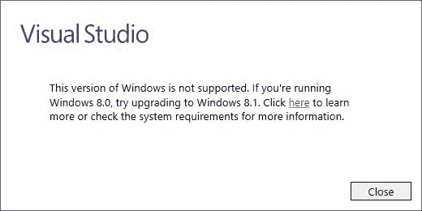

Windows 10 的**长期服务分部** ( **LTSB** )同样被列为不支持 Visual Studio。然而，安装程序实际上不会拒绝运行，一切都将正常工作。

Windows 10 LTSB is an Enterprise version of Windows 10 that doesn't include many of the annoyances of the regular version (such as forced upgrades, Cortana, and live tiles). You miss out on the Edge browser, but you can, of course, just install Firefox and Chrome, like you would anyway.

在 VS 2017 的较新版本中.NET Framework 可以单独发布到 IDE 中，您可以安装附加的(例如.NET Core 2.0)，以便在集成开发环境中使用它们。VS 2017 还支持在容器中调试，这样您就可以在 Linux 虚拟机中运行您的代码，同时仍然可以从窗口单步执行它。

# 安装 VS

VS 2017 附带了一个新的安装程序，允许您管理并排安装的多个版本的 VS 实例。它负责安装和更新 IDE 实例。按照以下步骤开始:

1.  打开你选择的公正的第三方浏览器，进入[https://www.microsoft.com/net/core](https://www.microsoft.com/net/core)。您也可以使用[https://dot.net/](https://dot.net/)的简短网址，并按照链接操作:

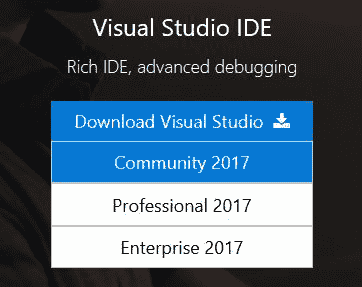

2.  除非您拥有专业版或企业版的许可证，否则请下载 VS 2017 社区版。运行下载的文件以启动安装程序；它可能需要自我更新:

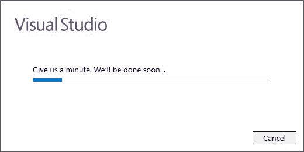

3.  然后，您可以选择想要使用的工作负载。选择一切可能很有诱惑力，但请留意右下角的安装尺寸。选择越多，需要的磁盘空间越多，安装时间越长:

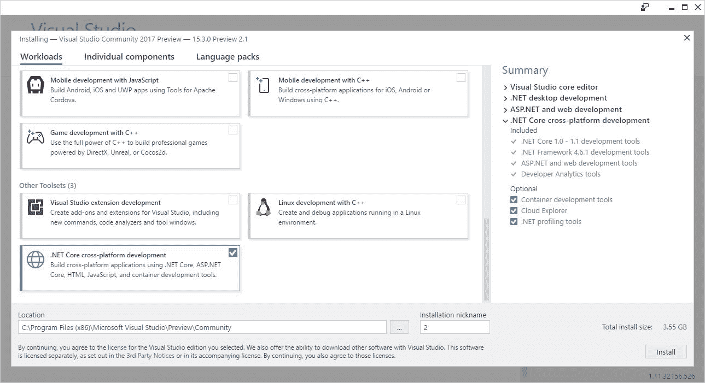

4.  选择.NET Core、ASP.NET 和.NET 框架，然后安装。下载和安装这些工作负载时，您可以执行其他操作:

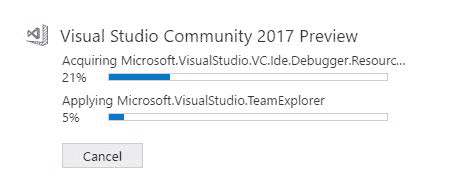

5.  完成后，系统会要求您选择开发设置并选择颜色主题:

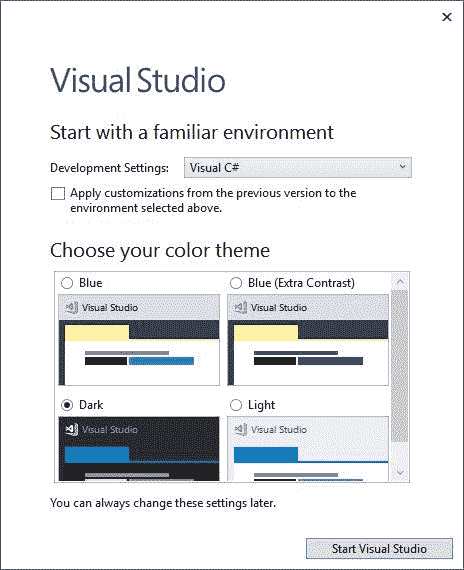

# 正在安装.NET Core 2

如果 VS 安装程序不包括的版本.NET Core，然后可以单独安装。从核心网站下载安装程序并执行。SDK 与主 VS 安装解耦的原因是为了能够以更快的方式迭代它。您将获得 VS 附带的稳定版本，但它可能有点过时:

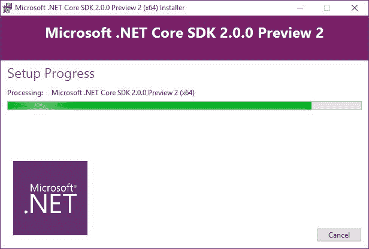

The .NET Core command-line tools include telemetry turned on by default. This means they report analytics information back to Microsoft, but you can disable this by setting an environment variable. Visual Studio and VS Code also send telemetry by default, but this can be disabled via the UI (or editing the JSON configuration in VS Code).

# 创建您的第一个应用

创建一个新项目，并选择 ASP.NET Core 网络应用模板。你可以运行这个.NET Core 或 on.NET 框架(但它不会在其他平台上运行)。如果您希望为分布式版本控制创建一个新的 Git 存储库，请选中添加到源代码管理框:

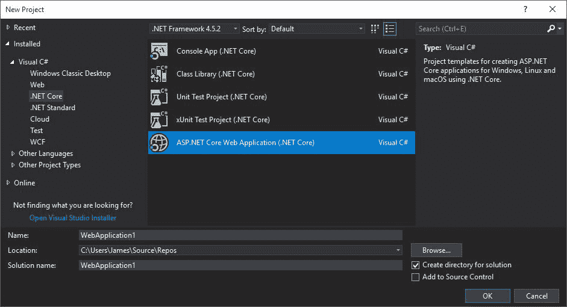

在下一个屏幕上，您可以选择一个网络应用模板。这包括用于 Angular 和 React 的网络应用、应用接口和 SPA 服务。这些模板与命令行工具使用的模板相同，您可以使用任何一个接口来创建它们。在本章的后面，我们将看到如何使用命令行，因为它在每个平台上几乎都是相同的。

选择标准的网络应用模板:

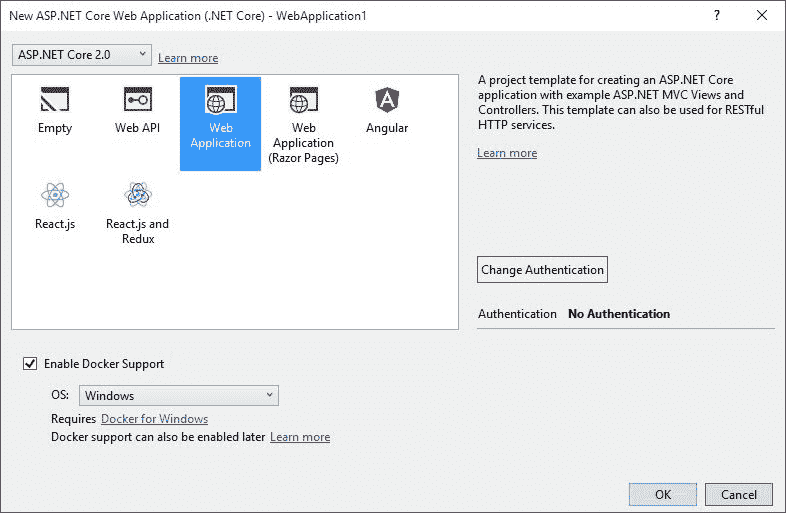

单击“更改身份验证”按钮以更改用户登录您的站点的方式。选择个人用户帐户，但将数据保存在本地。或者，您可以连接到云服务，如下图所示，但我们在此不做介绍:

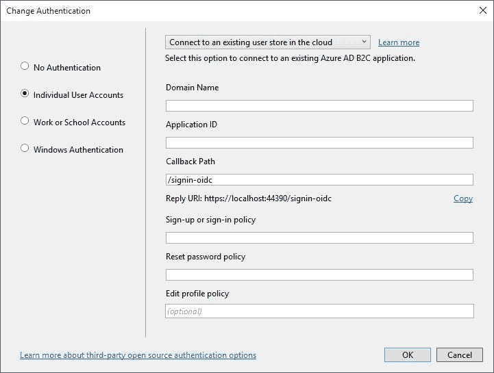

一旦您创建了应用，VS 将在后台恢复 NuGet 包。完成后，按 *F5* 在调试器中构建并运行您的应用。您的默认浏览器应该打开，其中包含 ASP.NET Core 模板站点，VS 将显示性能跟踪图:

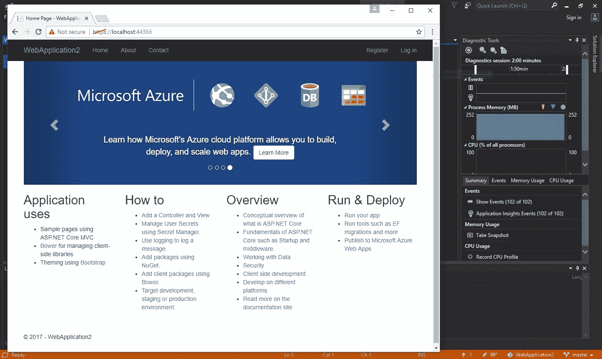

恭喜你！您刚刚创建了一个 ASP.NET Core 2 网络应用。

# 苹果个人计算机

苹果电脑一直都很受欢迎，并且有与之相匹配的价格标签。它们特别受开发者和网络开发者的欢迎。也许这是因为它们是唯一可以运行您可能想要测试的所有东西的机器。你可以在一个虚拟机上运行 Windows 和 Linux，但是苹果的 macOS(以前叫做 OS X，发音为 OS ten)不会在任何非苹果的硬件上运行(没有一些说服力)。

这也可能是由于 iPhone 和 iPad 的迅速崛起，以及随之而来的生态系统。如果你想为 iOS 和安卓开发应用，那么唯一合理的选择是使用苹果电脑——尽管进步网络应用正在侵占传统上由本地应用占据的大部分领土。

# 用于 Mac 的 Visual Studio

VS Mac 是 Xamarin Studio 的重新命名，但它也进行了扩展，并从常规 VS 中获取了很多功能和代码，它仍然最适合制作 Xamarin 跨平台移动和桌面应用，但它也支持。网络核心和 ASP.NET 网络应用。

首先，下载你需要的文件。这包括构建应用的软件，如苹果 VS 或 VS 代码。VS Mac 是一个包含安装程序的 DMG 磁盘映像，而 VS Code 是一个 ZIP 文件，您只需解压并运行即可。您还需要.NET Core SDK，它作为需要安装的 PKG 文件出现。您可能还想要一本方便的指南:


# 安装 VS Mac

最新版本的 macOS (High Sierra)支持 VS for Mac，但它也适用于旧版本，例如 OS X El Capitan (10.11)和 macOS Sierra (10.12)。

按照以下步骤为苹果电脑安装 Visual Studio:

1.  打开您下载的 DMG 映像，它将作为驱动器挂载:

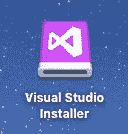

2.  在 Finder 中打开该卷，双击它运行安装程序:

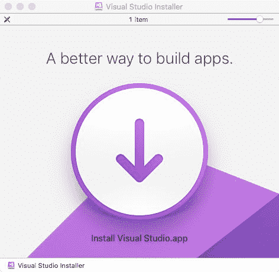

3.  在安装程序下载并安装您需要的所有内容时，您可以一步一步地完成安装程序并做些其他事情:

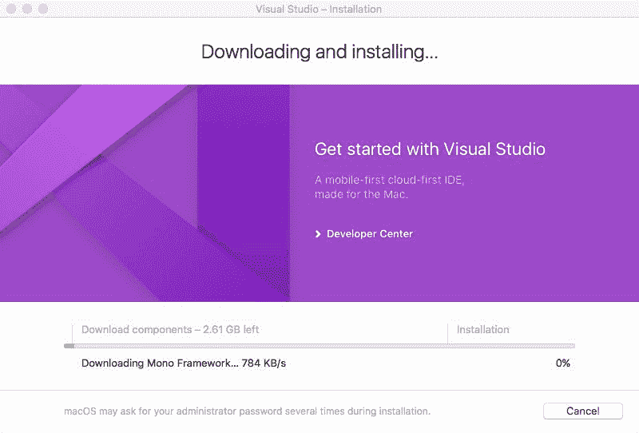

在此过程结束时，您将安装 Visual Studio for Mac。在此过程中，您有足够的时间下载和解压缩 Visual Studio 代码。您可能希望将 VS 代码移动到您的`Applications`文件夹，而不是从`Downloads`运行它。然后，两个 VS 版本可以坐在一起做朋友:

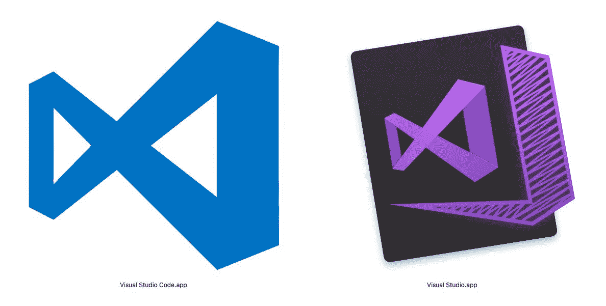

# 正在安装.NET Core 2

运行.NET Core SDK 包启动安装程序，然后按照向导操作:

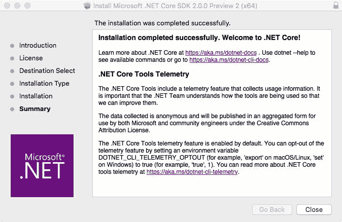

您现在应该能够打开一个终端并键入`dotnet`来使用命令行工具。例如，键入`dotnet --version`查看哪个版本的。你正在使用的。

You can use the default shell that comes with the macOS Terminal, or you can use an alternative, such as the Zsh shell. You can manage this with the Oh My Zsh project, which also supports Linux.

# 创建您的第一个应用

以下步骤将向您展示如何使用 VS 为 Mac 创建 ASP.NET Core 2 网络应用:

1.  在您的苹果电脑上打开 Visual Studio 应用，创建一个新的解决方案，并在下面选择 ASP.NET Core 网络应用模板.NET Core 类别:

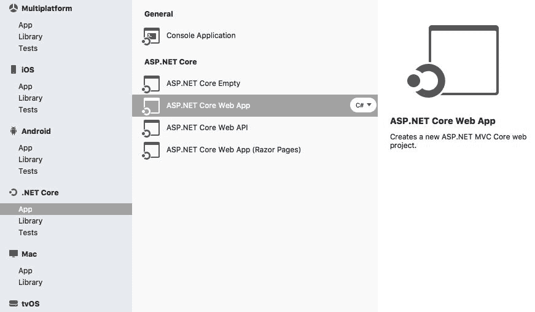

2.  在下一个屏幕上，选择.NET Core 2.0 作为目标框架:

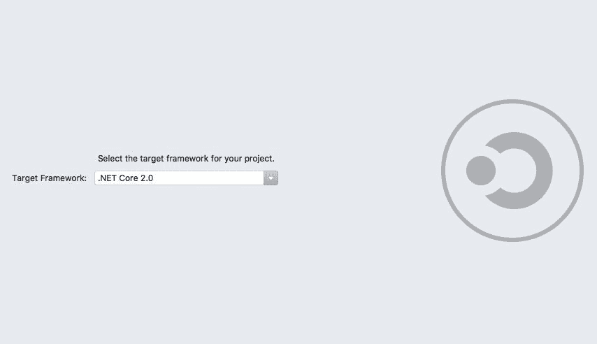

3.  最后，添加项目名称并完成向导:

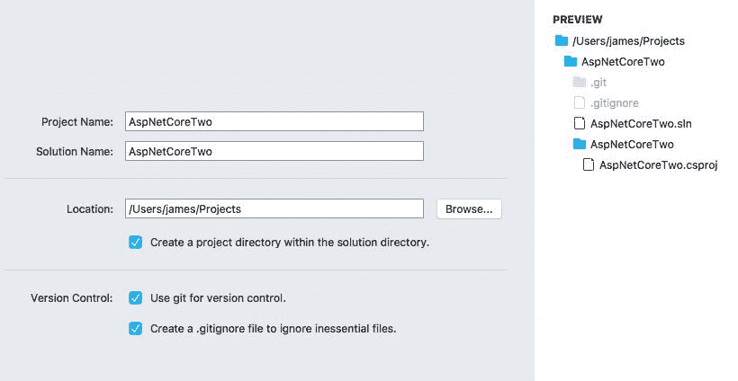

你现在有了一个全新的 ASP.NET Core 2 网络应用。您可以单击“播放”按钮来构建和运行它:

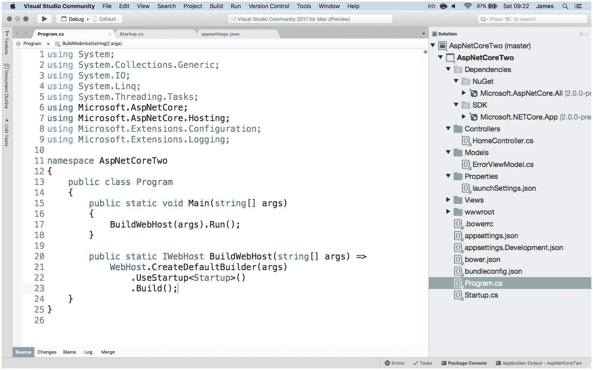

您也可以通过打开包含此解决方案的文件夹，在 Visual Studio 代码中处理它:

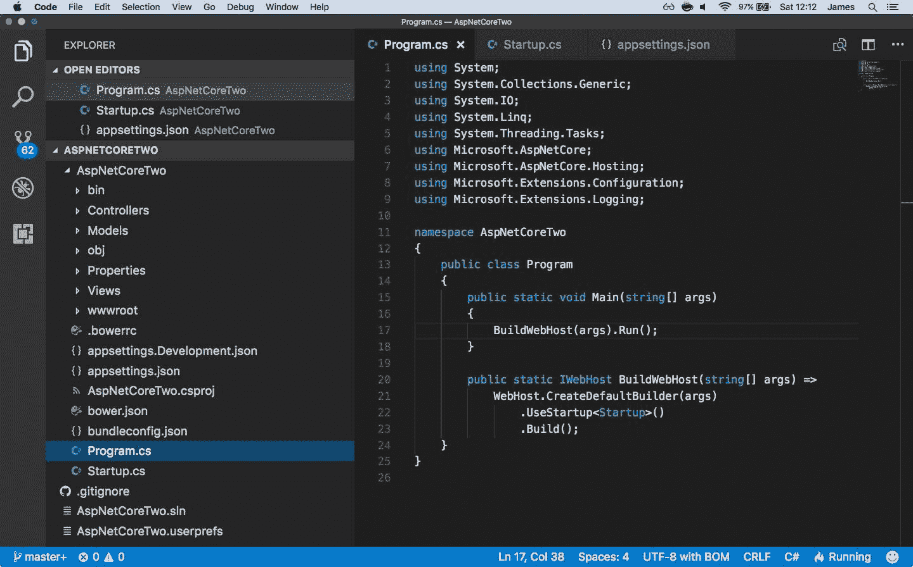

# Visual Studio 代码

Visual Studio 代码在 Windows、Mac 和 Linux 上运行。VS Code 更像是一个文本编辑器，而不是一个 IDE，但它是一个非常有能力的编辑器，它模糊了编辑器和完整 IDE 之间的界限。它支持智能感知代码完成、构建代码和调试应用。

它是使用网络技术(特别是 TypeScript)构建的，运行在独立的基于网络浏览器的应用托管环境中。然而，它比类似的电子桌面应用，如 Atom 或 Slack 要快得多。在 Azure 网络界面中使用相同的引擎来编辑代码。

要处理庞大的数据文件，最好坚持使用原生文本编辑器，例如 Notepad++(在 Windows 上)或 Sublime Text。

# Linux 操作系统

Linux 是桌面市场之外非常受欢迎的操作系统。安卓(谷歌收购的移动操作系统)就是基于此，在全球大部分智能手机上运行。有时它是主要的桌面选项，如果使用具有专门硬件的计算机，如树莓皮。Linux 在嵌入式设备上非常受欢迎，部分原因是它重量轻，对资源的要求通常比典型的 Windows 或 macOS 安装低得多。

Linux 也是 web 服务器最流行的操作系统，这也是我们这里最感兴趣的。可以说，Linux 是这个星球上最受欢迎的操作系统，尽管许多用户不会直接与之交互。

Strictly speaking, Linux only refers to the kernel of the OS. The equivalent part of Windows would be the NT kernel. Many different distributions are built using the Linux kernel at their core, and they bundle it up with many other (often GNU) applications. You can even roll your own stripped-down version, perhaps using something like Buildroot.

流行发行版的一些例子是 Ubuntu 和 CentOS(社区企业操作系统，红帽企业 Linux 的免费版本)。Linux 发行版可以根据它们使用的包管理类型进行广泛分类。这在试图找到要安装的软件的正确版本时非常有用，尽管您通常可以通过发行版的包管理器直接获得流行的应用。

If you've not used a package manager before, then you will be amazed at how much easier it is than manually installing software (or even using an App Store) as you'd normally do on Windows or Mac.

许多发行版都是基于 Debian 的，包括 Mint、Ubuntu 和 Raspbian(覆盆子 Pi 的官方操作系统)。这些使用基于 Debian 的包格式和 APT 包管理器。最新版本的 Debian 叫做**拉伸**和.NET Core 支持它。它也用于官方.NET Docker 图像。

Debian versions are named after Toy Story characters; the previous version was called Jessie.

其他发行版使用**红帽企业 Linux** ( **RHEL** ) RPM 包系统和百胜包管理器。其中包括 CentOS 和 YellowDog，仅举几个例子。还有 **SUSE Linux 企业服务器** ( **SLES** )，这是另一个不同的发行版，但是.NET Core 也支持它。

还有很多其他的发行版，这里就不多提了。Linux 不像 Windows 或 Mac 那样是一个操作系统。我们甚至还没有涉及到使用不同内核的基于 BSD 的系统。其中包括 FreeBSD、OpenBSD 和 NetBSD。即使是苹果操作系统也是建立在 BSD 之上的，有其 NeXTSTEP 传统(运行欧洲核子研究中心第一个网络服务器的操作系统)。

这里的大部分说明也将在 Windows 和 Mac 的命令行上工作。工装是一样的；甚至 VS 中的图形工具也使用与命令行`dotnet`实用程序相同的模板。

# 开始。基于 Linux 的. NET 内核

我们将把这些东西稍微混合一下，展示一下它的多功能性和多平台性.NET Core 是。在下一节中，我们将演示如何在运行在 Azure 上的 Ubuntu Server 虚拟机上开发. NET Core 应用，只使用命令行，不使用窗口管理器。

这将非常类似于你如何在任何基于 Debian 的发行版上设置东西，包括 Ubuntu、Mint 和 Raspbian(针对树莓 Pi)。树莓 Pi 使用定制 ARM 处理器而不是传统的英特尔 x86 CPU 这一事实并不重要。当 Mono 最初移植到 Pi 时，专业的基于硬件的浮点实现存在问题，但这不再是一个问题.NET Core。

我们将使用命令行文本编辑器，在这里进入 Emacs 和 vi 的争论是愚蠢的，所以使用你喜欢的任何东西。如果您使用平板电脑(如带有蓝牙键盘的 iPad)通过 SSH 或 Mosh 连接到云服务器，这种设置可能会成为一个很好的工作流程。但是，如果您在本地工作，并且希望在您选择的 X11/Wayland 桌面环境中有一个图形编辑器，那么您可以运行 VS Code 或 JetBrains Rider。毫无疑问，你也会经常使用终端窗口。

# 正在安装.NET Core 2

在本指南中，我们使用的是 Ubuntu 服务器 16.04 LTS，但是这些说明也适用于其他版本。使用**高级打包工具** ( **APT** ，我们可以安装.NET Core 非常容易，但首先我们需要添加一个自定义提要.NET Core 不在默认存储库中。

首先我们需要添加.NET Core 包源到 APT 使用的列表。包源在 Azure 上，所以我们把这个 URL(加上一些其他信息)写到`apt-get`使用的源文件夹中的一个文件中。为此，我们使用以下命令将`echo`的标准输出重定向到它:

```cs
sudo sh -c 'echo "deb [arch=amd64] https://apt-mo.trafficmanager.net/repos/dotnet-release/ xenial main" > /etc/apt/sources.list.d/dotnetdev.list' 

```

所有包都用公钥加密技术签名，以验证它们的完整性(阅读后面的章节了解更多信息)。我们为导入公钥。使用`apt-key`命令从 Ubuntu 密钥服务器下载. NET Core 包:

```cs
sudo apt-key adv --keyserver hkp://keyserver.ubuntu.com:80 --recv-keys 417A0893

```

我们需要更新我们的源代码，以便使用这个简单的命令获取最新的更改:

```cs
sudo apt-get update

```

The `update` command is different to the `upgrade` command, but they are often used together. While `update` simply refreshes the information that APT holds about packages, `upgrade` allows you to very easily update all of the software on the machine (that hasn't been manually installed) to the latest versions. This can be quite a time-saver.

现在我们可以安装了.NET Core，使用以下命令:

```cs
sudo apt-get install dotnet-sdk-2.0.0

```

如果 SDK 包有一天成为默认的源代码列表，那么这就是你需要做的。

If you are trying out a preview, then the package will have the preview tag suffixed (for example, `-preview2-006497` ).

在一墙的文本卷轴之后，假设你没有得到任何错误，并且你看到了遥测通知，你准备好了。键入`dotnet`查看使用信息，`dotnet --version`查看您正在运行的当前版本。

# 创建您的第一个应用

运行以下命令从模板创建新的控制台应用:

```cs
dotnet new console -o DotNetCoreTwoHelloWorld

```

然后切换到刚刚创建的目录，并使用以下两个命令运行它:

```cs
cd DotNetCoreTwoHelloWorld 

dotnet run

```

您的控制台应该类似于下面的截图(如果您在 Windows 上使用 PuTTY):

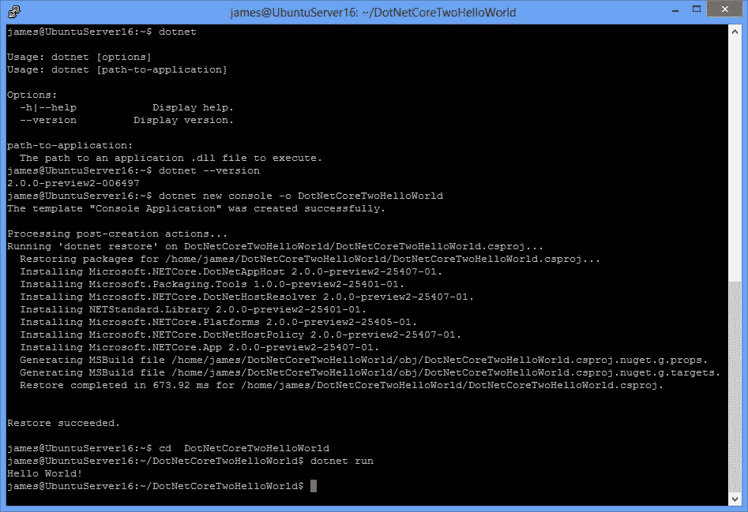

With .NET Core 1.0, you needed to call `dotnet restore` before building or running your application with the `dotnet` command. In .NET Core 2.0, this is called on your behalf for `dotnet` commands that require it, and you no longer need to restore NuGet packages manually this way.

假设基本控制台应用工作正常，让我们创建一个 web 应用。运行以下命令向上移动一个级别到父文件夹并列出模板:

```cs
cd .. 

dotnet new

```

如果没有任何附加参数，`dotnet new`命令将列出所有可用的模板。这些显示在下面的截图中:

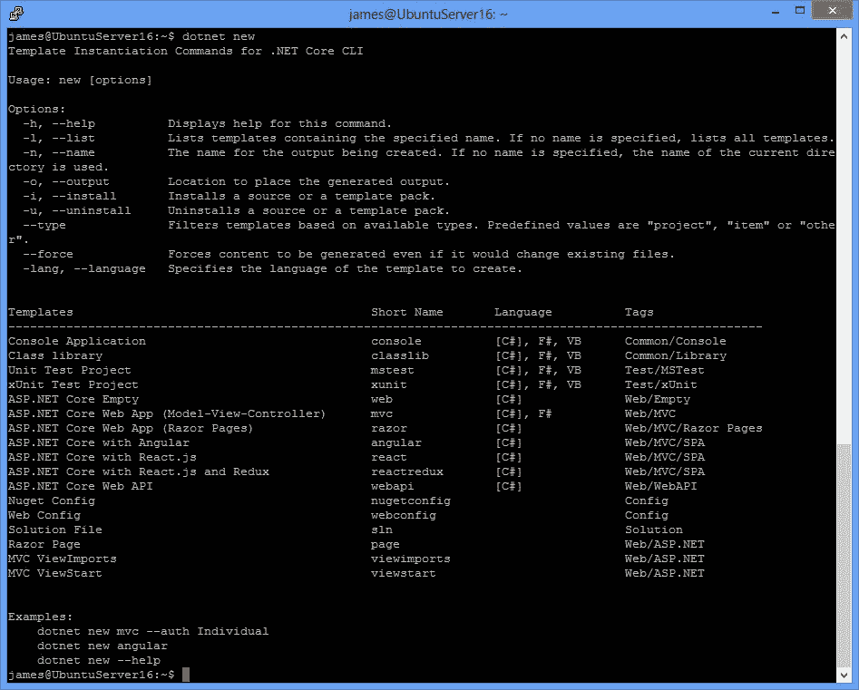

让我们制作一个标准的 MVC 网络应用，就像我们在前面的例子中所做的那样。接下来的三个命令将根据模板创建一个新的 web 应用，切换到创建的文件夹，并运行该应用:

```cs
dotnet new mvc -o AspNetCoreTwoMvc 

cd AspNetCoreTwoMvc 

dotnet run &

```

我们在后台执行应用(用`&`)，这样我们就可以在终端还在运行的时候使用它。您可以使用本地计算机上的浏览器连接到您的服务器，但这需要将 web 服务器绑定到外部 IP 地址，并打开服务器和云防火墙上的端口。

让我们通过使用以下命令下载主页来简单地测试我们的 web 服务器是否正常工作。如果您没有安装`wget`，那么您可以使用`curl`来代替:

```cs
wget localhost:5000 

```

这个过程显示在下面的截图中:


我们可以使用命令行文本编辑器查看主页的来源，如下所示:

```cs
nano index.html

```

现在，您将看到默认主页的 HTML 源，如下所示:

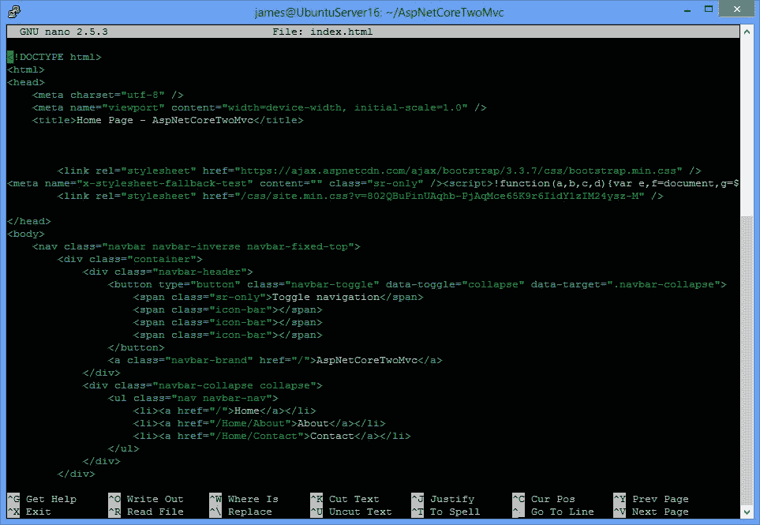

要整理，就要结束还在运行的`dotnet`流程。您可以使用`kill`命令以启动时显示的标识结束该过程。如果找不到 ID，那么可以使用`ps x`列出正在运行的进程。

# 码头工人集装箱化

Docker 是容器技术的实现，它是虚拟机的轻量级版本。它最初是建立在 **Linux 容器** ( **LXC** )上的，但是现在它支持很多其他技术，包括 Windows。对于同一台服务器，您可以运行比传统虚拟机更多的容器，因为它们并不总是在每个映像中都包含完整的操作系统，而且它们共享许多资源。例如，如果您总是使用官方的微软图像，那么 Docker 将在您的.NET Core 应用，同时仍然保持它们的隔离和沙盒。

Containers can significantly reduce costs, both in hosting hardware and time saved not configuring and manually security patching the OS yourself. The .NET team saved about $100,000 a year in hosting costs by moving to Docker, although they probably don't pay the market rate on Azure.

集装箱的好处类似于现实世界中海运集装箱的好处。通过标准化运输单位，不用担心内容，成本可以大大降低。当您将如何移动容器的问题与容器内部的问题分开时，您就可以共享一个公共的基础架构，并且可以更容易地向外扩展。它还允许更大范围的自动化。

使用 Docker，您可以在容器中构建应用并部署它。容器负责运行应用，并携带其全部配置。您部署到的服务器不需要了解您的应用的任何信息；它只需要知道如何运行容器。这大大减少了与运行应用相关的配置问题。所有主要的云托管提供商都为以这种方式打包的托管应用提供容器服务。

One of the best reasons for using containers is that they allow you to develop as life like an environment as possible. This means that there should be fewer surprises and difficulties when the time comes to deploy your code to the production infrastructure.

我们都努力让代码库在新的实时服务器或新的开发人员工作站上正常工作。这些琐事会成为过去。另一个好处是，您可以确信所有的环境都将具有一致的配置，这将有助于解决与将环境链上的版本提升到生产相关的难题。

Docker 运营着一个 Docker Hub，它托管着随时可以使用的映像。微软保留了.NET 图像发布在那里，他们用补丁使它们保持最新。

根据您的互联网连接速度，您可以将这些图片拉下来，以便非常轻松快速地开始。有。适用于 Linux 和 Windows 纳米服务器的 NET Core 和 ASP.NET Core 映像。Linux 映像基于流行的 Debian 发行版。甚至还有.NET Framework 3.5 和 ASP.NET 4 映像，所以它不仅仅局限于最新的跨平台核心产品。

如果您有支持 Hyper-V 的 Windows 版本(例如，Windows 10 Pro、企业版或教育版)，Docker 可以在 Hyper-V 上运行。它需要 64 位版本，内部版本号为 10，586 或更高，不幸的是，这排除了 LTSB 版本。要为 Mac 安装 Docker，您将需要一台 2010 年或更高版本制造的机器，运行 El Capitan 10.11 或更高版本。

然而，有一个旧版本的 Docker，叫做 Docker 工具箱，它运行在 VirtualBox(一个跨平台的 VM 主机)上。许多操作系统都支持这一点，包括稍微成熟和稳定的操作系统。

You can start a container from VS when using Visual Studio Tools for Docker, but Docker also allows you to try out .NET without installing anything. If you already have Docker installed, then simply download and run one of the .NET images.

作为.NET Core 是跨平台的，使用 Docker 最简单的方法是在 Linux 虚拟机中。它可以托管在您的苹果电脑或视窗系统上，或者像我们这里的例子一样，托管在云中。

让我们使用命令行从 Docker 网站安装 Docker 社区版，并尝试一下。首先，我们需要向 APT 添加 Docker GPG 密钥。在安装任何东西之前，手动验证这个的指纹是个好主意。

这个过程与我们安装的方式非常相似.NET，但是顺序和语法略有不同。首先，我们需要添加 Docker GPG 公钥，方法是使用`curl`下载它，并将其传送到`apt-key`，使用以下命令:

```cs
curl -fsSL https://download.docker.com/linux/ubuntu/gpg | sudo apt-key add - 

```

然后，我们显示用以下命令添加的密钥的指纹。您应该检查这是否与 Docker 网站上的匹配:

```cs
sudo apt-key fingerprint 0EBFCD88

```

接下来，我们将包源添加到本地列表中。此命令被拆分为多行，以便于阅读:

```cs
sudo add-apt-repository \

 "deb [arch=amd64] https://download.docker.com/linux/ubuntu \

 $(lsb_release -cs) \

 stable"

```

然后，我们用以下命令更新我们的新源:

```cs
sudo apt-get update

```

现在我们可以用这个简单的命令安装 Docker:

```cs
sudo apt-get install docker-ce

```

假设这里没有错误，下一步是测试 Docker 是否正在使用以下冒烟测试容器:

```cs
sudo docker run hello-world

```

您应该得到如下输出:

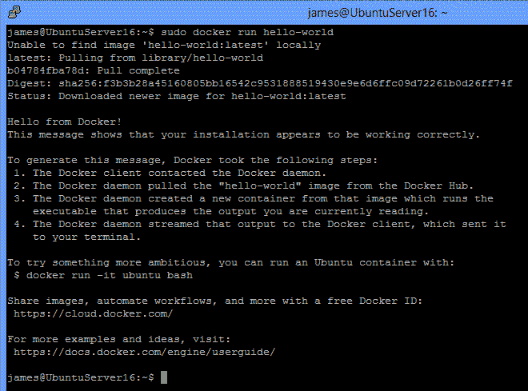

让我们测试一下。Docker 中的. NET Core，使用以下命令:

```cs
sudo docker run microsoft/dotnet-samples

```

你应该看看。网络机器人作为 ASCII 艺术:

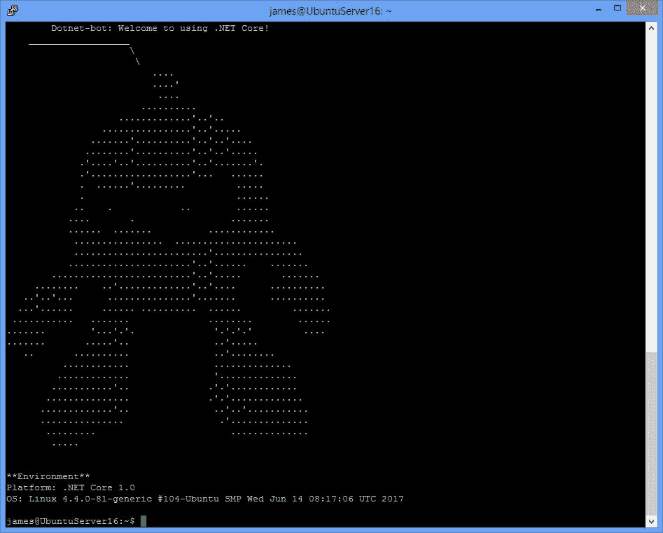

接下来，让我们升级到的最新版本.NET Core 并尝试一个网络应用。

# 与 Docker 一起使用 ASP.NET Core 2

现在我们已经检查了 Docker 正在工作并且可以运行.NET Core，是时候做一些更复杂的事情了。我们将以交互方式登录一个容器，并在其中创建一个 ASP.NET Core 2 应用。

运行以下命令:

```cs
sudo docker run -it --rm microsoft/aspnetcore-build:2

```

下载映像后，您应该会得到一个稍微不同的命令提示符。让我们更加雄心勃勃，使用 React 和 Redux JavaScript 库创建一个单页应用:

```cs
dotnet new reactredux -o AspNetCoreTwoDocker

```

接下来我们需要从`npm`恢复 JS 包。注意我们没有安装`npm`(或者.NET Core)；它包含在容器图像中:

```cs
cd AspNetCoreTwoDocker 

npm install

```

让我们再次在后台运行该应用，并下载主页。请注意，红隼网络服务器现在运行在`80`的默认 HTTP 端口上，因此我们不需要指定替代的非标准端口号:

```cs
dotnet run & 

wget localhost

```

这显示在下面的截图中:

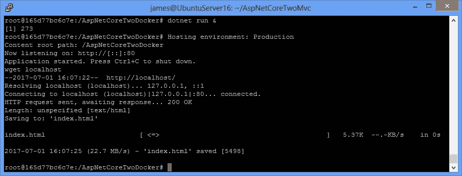

Docker 图像不包含文本编辑器，但是我们仍然可以使用`cat`命令查看文件的内容。我们不会得到任何语法高亮显示，但我们可以清楚地看到这是一个 React 应用，因为我们的服务器将初始状态渲染到页面中(作为`div`与`react-app`的`id`):

```cs
cat index.html

```

使用`cat`在终端显示的 React app HTML 页面来源如下截图所示:

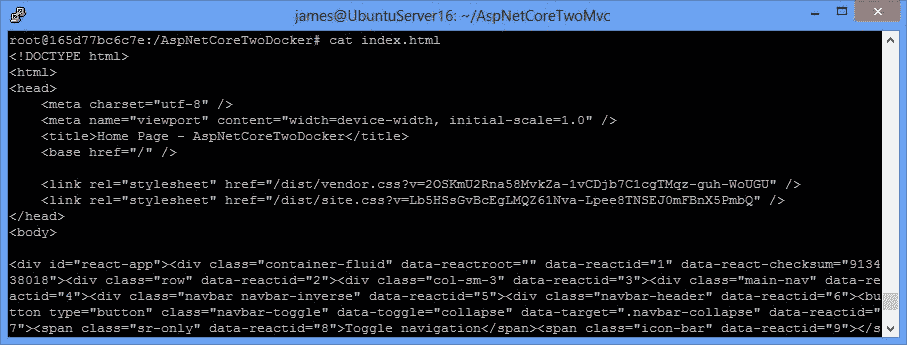

您可以使用`kill`再次整理`dotnet`流程，并使用`exit`命令离开 Docker 容器返回到您的主机虚拟机。

# 摘要

在本章中，您看到了如何开始使用三种最流行的操作系统.NET Core 2 支持。您了解了每个平台上可用工具的选择以及使用 ASP.NET Core 2 的不同方式。

您还发现了容器的好处，并意识到如何使用它们。我们鼓励您从本章中选取示例，将它们混合起来，并将其扩展到您需要的环境中。如今，平台和工具之间有很多交叉，所以这些经验教训中有很多是可以转移的。

我们希望你会受到启发，尝试一些新的东西，看看有什么替代方案。只需启动一个新的虚拟机(可能在云中)并摆脱黑客攻击！

在下一章，我们将进入这本书的主要焦点:性能。我们将在您刚刚学习的工具的基础上，向您展示如何测量您的软件，看看它是否慢。您将看到如何识别代码中哪些部分需要改进，如果它确实表现不佳的话。