# 六、解决网络性能问题

本章基于前一章中讨论过的问题的子集，但更详细。它处理延迟或滞后，这源于用户和应用之间的网络级别。这主要适用于用户通过网络浏览器与应用交互的网络应用。您将学习如何优化您的应用，以满足未知且不受您控制的带宽和延迟。你将把你的有效载荷压缩到尽可能小，然后你将尽快把它们传递给用户。您将了解可用于实现快速响应应用的工具和技术。您还将看到所涉及的权衡，并能够计算这些方法是否应该应用于您的软件。

我们将在本章中讨论的主题包括:

*   传输控制协议
*   HTTP 和 HTTP/2
*   HTTPS (TLS/SSL)
*   网络套接字和推送通知
*   压缩
*   捆绑和缩小
*   缓存和 cdn

本章讨论如何加快应用用户的体验。本章中的技巧适用于静态网站或客户端 web 应用，也适用于动态 web 应用。

这些主题适用于任何 web 应用框架。然而，我们将重点关注如何与 ASP.NET，特别是 ASP.NET Core 实施这些措施。我们还将看到 Core 在某些方面与完整版的 ASP.NET 有何不同。

# 互联网协议

了解您的 HTML 和其他资产是如何从网络服务器传递到用户浏览器的非常重要。其中大部分是抽象出来的，对 web 开发来说是透明的，但是为了获得高性能，至少有一个基本的理解是一个好主意。

# 传输控制协议

**传输控制协议/互联网协议** ( **TCP** / **IP** )是支撑互联网的一对通信协议的名称。 **IP** 是两者的低级协议，处理将*数据包*路由到正确的目的地。IP 可以运行在许多不同的低级协议(如以太网)之上，这也是 IP 地址的来源。

TCP 是 IP 之上的一层，它关注的是数据包的可靠传递和*流量控制*。TCP 是端口的来源，例如 HTTP 的端口 80 和 HTTPS 的端口 443。还有**用户数据报协议** ( **UDP** )，可以代替 TCP 使用，但是提供的功能比较少。

HTTP 运行在 TCP 之上，这通常是您在 web 应用中要处理的。您可能偶尔需要直接使用**简单邮件传输协议** ( **SMTP** )发送电子邮件，**域名系统** ( **DNS** )将主机名解析为 IP 地址，或**文件传输协议** ( **FTP** )上传和下载文件。

这些协议的基本未加密版本直接在 TCP 上运行，但安全加密版本(HTTPS、SMTPS 和 FTPS)之间有一层。这一层叫做**传输层安全** ( **TLS** )，这是**安全套接字层** ( **SSL** )的现代继承者。SSL 不安全，不推荐使用，不应该再使用。然而，SSL 这个术语仍然是描述顶级域名系统的常用术语，令人困惑。所有浏览器都要求使用 TLS 加密来支持 HTTP/2。

在构建 web 应用时，您可能不会经常考虑较低级别的协议。事实上，你可能甚至不需要考虑 HTTP/HTTPS 那么多。但是，应用下面的协议栈可能会对性能产生重大影响。

下图显示了协议通常是如何堆叠的:

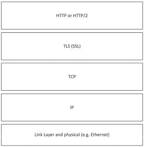

# 慢启动

为了拥塞控制，TCP 实现了一种称为*慢启动*的算法。这意味着从浏览器到 web 服务器的连接最初很慢，随着时间的推移会逐渐增加，以发现可用的带宽。您可以更改此设置，以便加速更积极，连接更快。如果您增加初始*拥塞窗口*，那么性能可以提高，尤其是在带宽好但延迟高的连接上，例如移动 **4G** 或其他大陆的服务器。

像往常一样，您应该使用 Wireshark 测试您的用例，正如之前在[第 4 章](04.html)、*测量性能瓶颈*中所描述的。改变这个窗口有不利的一面，应该慎重考虑。虽然这可能会加快网站的速度，但它会导致网络设备中的缓冲区被填满，如果没有端到端使用**服务质量** ( **服务质量**)，这可能会给网络电话应用和游戏带来延迟问题。

您可以使用修补程序(KB2472264)或更高版本在 Windows Server 2008 R2 上更改此值。您也可以在 Linux 上轻松调整这一点，当然，ASP.NET Core 使您能够运行。除了 Windows 之外，还可以在 Linux(和苹果操作系统/ OS X)上使用。

我们不会在这里提供详细的说明，因为这应该是一个谨慎考虑的决定，你不应该盲目地应用建议。您可以很容易地在网上找到您在网络服务器上使用的操作系统的说明。

TCP 慢启动只是一个例子，说明为什么你不能忽视互联网技术的较低水平，网络应用站在互联网技术的肩膀上。让我们将堆栈向上移动一点到应用层。

# 超文本传送协议

作为一个想要提供高性能的网络应用开发者，理解**超文本传输协议** ( **HTTP** )是很重要的。你应该知道你使用的是什么版本的 HTTP，它是如何工作的，以及这如何影响事情，比如**请求流水线**和加密。

HTTP/1.1 可能是您今天最熟悉的版本，因为它已经使用了一段时间。HTTP/2 变得越来越流行，它改变了做很多事情的最佳方式。

# 头球

HTTP 使用头来提供关于请求的元数据以及消息正文中的主要有效载荷，就像电子邮件一样。当您查看源代码时，您不会看到这些标题，但是您可以使用浏览器开发工具来观察它们。您可以将头用于许多事情，例如缓存控制和身份验证。Cookies 也作为标头发送和接收。

浏览器一次只能打开有限数量的到单个主机的 HTTP/1.1 连接。如果您需要大量请求来检索一个页面的所有资产，那么它们将被排队，这增加了完全加载它所花费的总时间。当与前面提到的 TCP 慢启动相结合时，这种影响会被放大，从而降低性能。这不是 HTTP/2 的问题，我们将很快讨论这个问题。您可以通过允许浏览器重用连接来减少此问题的影响。您可以通过确保您的网络服务器不发送带有 HTTP 响应的`Connection: close`头来做到这一点。

# HTTP 方法

HTTP 使用多种方法(或动词)。最常见的是`GET`和`POST`，但还有很多。通常，我们使用`GET`请求从服务器检索数据，我们使用`POST`提交数据并进行更改。`GET`不应该用来改变数据。

其他有用的动词有`HEAD`和`OPTIONS`。`HEAD`可以检查`GET`请求的报头，而无需下载主体的开销。这对于检查缓存头以查看资源是否已更改非常有用。`OPTIONS`通常用于**跨来源资源共享** ( **CORS** )执行预检以验证域。

其他常用的动词有`PUT`、`DELETE`和`PATCH`。我们主要将这些用于**表示状态转移**(**REST**)API，因为它们可以模拟对资源或文件的操作。然而，并不是所有的软件(比如一些代理服务器)都理解它们，所以有时候，我们使用`POST`来模拟它们。你甚至可能会遇到`OPTIONS`被代理和网络服务器封锁的问题。

# 状态代码

HTTP 使用数字响应代码来指示状态。你可能对`200 (OK)`和`404 (Not Found)`很熟悉，但是还有很多。例如，451 表示内容已被政府强制的审查过滤器阻止。

The 451 status code is in reference to the book *Fahrenheit 451* (whose title is the purported temperature at which paper burns). You can read the official document (RFC 7725) at [http://tools.ietf.org/html/rfc7725](http://tools.ietf.org/html/rfc7725) . If this code is not used, then it can be tricky to discover if and why a site is unavailable. For example, you can find out whether the UK government is blocking your site at [https://www.blocked.org.uk/](https://www.blocked.org.uk/) , but this is just a volunteer effort run by the Open Rights Group, the British version of the **Electronic Frontier Foundation** (**EFF** ).

我们通常使用 3xx 代码进行重定向(也许是到 HTTPS)。有各种形式的重定向，具有不同的性能特征(和其他效果)。您可以使用 302 来临时重定向页面，但是浏览器必须每次都请求原始页面，以查看重定向是否已经结束。这对**搜索引擎优化** ( **SEO** )也有不好的影响，这里就不讨论这些了。

更好的方法是使用 301 来指示永久重定向。但是，您需要小心，因为这是无法撤销的，并且客户端不会再次查看原始网址。如果使用重定向将用户从 HTTP 升级到 HTTPS，那么还应该考虑使用 **HTTP 严格传输安全** ( **HSTS** )头。还是那句话，小心行事。

# 加密

HTTP 加密非常重要。它不仅保护传输中的数据以防止窃听，而且还提供身份验证。这确保了用户实际连接到他们认为自己正在连接的站点，并且页面没有被篡改。否则，肆无忌惮的互联网连接提供商可以在你的网站上注入或替换广告，或者他们可以阻止互联网访问，直到你选择退出家长过滤器。或者还有更糟糕的事情，比如窃取你用户的数据，这些通常是法律要求你保护的。

今天真的没有充分的理由不在任何地方使用加密。开销很小，尽管我们仍然会考虑它们，并向您展示如何避免潜在的问题。反对使用 HTTPS 的理由通常是很久以前计算昂贵时的宿醉。

现代计算硬件非常强大，通常对常见的加密任务有特殊的加速。有许多研究表明，加密的处理开销可以忽略不计。但是，首次建立安全连接时可能会有一点延迟。为了理解这一点，举例说明 TLS 如何工作的简单模型是有用的。

安全通信有两个部分:初始密钥交换和正在进行的通道加密。会话密码，例如**高级加密标准** ( **AES** )，可以非常快速，并且可以接近线速运行。然而，这些密码是*对称的*，双方都需要知道密钥。这个密钥需要安全地分发，以便只有通信双方拥有它。这叫做*密钥交换*，它使用非对称加密。这通常也需要第三方为服务器担保，所以我们有一个证书系统。这个初始设置是缓慢的部分，尽管我们稍后会向您展示缺乏 AES 加速的设备的替代方案。

# 密钥交换

如前所述，密钥交换是在双方之间安全共享加密密钥而不被截获的过程。有各种各样的方法可以做到这一点，这些方法大多依赖于非对称加密。与对称加密(我们用这个密钥交换)不同，这只能用一个密钥在一个方向上执行。换句话说，用于加密的密钥不能用于解密，需要不同的密钥。一旦我们共享了一个密钥，大多数数据就不是这样了。我们这样做的原因是对称加密比非对称加密更快。因此，非对称加密并不用于所有情况，只需要加密另一个密钥。

除了交换密钥之外，浏览器(或其他 HTTPS 客户端)应该检查证书，以确保服务器属于它声称的域。默认情况下，一些编程客户端无法做到这一点，因此这值得一试。也可以实现证书钉住(即使在带有 **HTTP 公钥钉住**的浏览器中)来提高安全性，但这已经超出了本书的范围。

我们将举例说明密钥交换的两种变体(以简化形式类推)，向您展示该过程是如何工作的。如果你愿意，你可以查阅技术细节。

传统上，RSA 是用于顶级域名系统的最常见的密钥交换机制。直到最近，我们还在大多数 HTTPS 连接上使用它。

**RSA** 以其创造者的名字代表 **Rivest-Shamir-Adleman** ，它可能是最受欢迎的公钥密码形式。英国探听机构**政府通信总部** ( **GCHQ** )大概在同一时间构思了公钥密码系统，但由于它在 1997 年才公开，因此不可能证明这一点。这项发明归功于惠特菲尔德·迪菲和马丁·赫尔曼，他们最近因此获得了图灵奖。我们将很快进一步讨论他们的工作。

The Turing Award is the Nobel Prize of computing. It's named after Alan Turing, the legendary computing pioneer who helped the allies win WWII while working for the nascent GCHQ, but who was later betrayed by the British government.

RSA 使用大素数来生成公钥和私钥对。公钥可用于加密只能用私钥解密的信息。除此之外，私钥还可以用来签署信息(通常是它的一个**散列**，可以用公钥来验证。即使使用另一种算法作为密钥交换机制(这是在初始 TLS 握手期间协商的)，RSA 也经常用于签署 TLS 证书。

This hashing and signing of certificates is where you may have heard of **SHA-1** certificates being deprecated by browsers. SHA-1 is no longer considered secure for hashing and, like **MD5** before it, should not be used. Certificate chains must now use at least an **SHA-2** hashing algorithm (such as **SHA-256** ) to sign.

帮助解释 RSA 如何工作的一个类比是，考虑发送锁而不是发送密钥。你可以给某人挂一把开着的挂锁，保留钥匙。然后，他们可以用你的锁把装有密码的盒子锁在公文包里，并把它送回给你。现在，只有你能打开盒子得到代码。即使是给你发代码的人，一旦他们锁定了盒子，也不能打开它。一旦你们都知道了代码，那么就可以很容易地用这个案例交换文档了。

实际上，这更复杂。你不能确定有人没有拦截你的锁，然后用自己的锁拿到钥匙，复制后再发给你。通常，我们用**公钥基础设施** ( **PKI** )来解决这个问题。受信任的第三方将签署您的证书，并验证它确实是您的公钥，并且您拥有锁。如果**证书颁发机构** ( **CA** )没有以这种方式副署证书，浏览器通常会显示警告。

**Diffie-Hellman**(**D-H**)密钥交换是获得共享密钥的另一种方法。在 RSA 发明之前不久，它只是最近才在网络上流行起来。这部分是由于**椭圆曲线**变型的计算成本降低。然而，另一个原因是短命版本提供了一种被称为**完美前向保密** ( **PFS** )的品质。与 RSA 不同，对称加密的会话密钥从不需要传输。双方都可以计算共享密钥，而不需要通过网络发送(甚至在加密状态下)或永久存储。这意味着，如果密钥被恢复，被窃听的加密交换将来无法解密。使用 RSA 密钥交换，如果您以后获得私钥，您可以以纯文本形式恢复记录的通信。PFS 是对抗大规模监控的一种有用的对策，在大规模监控中，所有的通信都被捕获在一个拉网式网络中并永久存储。

D-H 更适合用混色类比来解释，颜料代表数字。双方选择共享的颜色，每一方选择自己的秘密颜色。两者都将共享颜色与它们的秘密颜色混合，并将结果发送给另一个。然后，每一方将他们收到的颜色与他们的秘密颜色再次混合。双方现在都有相同的颜色，而不必将这种颜色发送到任何可以观察到的地方。

因为这不是一本关于安全性的书，所以我们不会再详细讨论加密算法。如果你感兴趣，这里有大量我们无法涵盖的信息。加密是一个很大的主题，但安全性是一个更广泛的问题。

简要说明 TLS 密钥交换如何为各种方法工作的要点是为了表明它是复杂的。许多消息需要来回发送才能建立安全连接，无论连接有多快，延迟都会减慢每条消息的速度。所有这些都发生在 TLS 握手过程中，在握手过程中，客户端(通常是网络浏览器)和服务器协商共同的功能，并就应该使用什么密码达成一致。还有**服务器名称指示** ( **SNI** )要考虑，类似于 HTTP 主机头，允许多个站点使用同一个 IP 地址。一些年长的客户不支持 SNI。

我们可以使用 Wireshark 观察 TLS 握手。我们不会详细讨论，但是您可以看到客户端和服务器之间至少交换了四条消息。分别是*客户端您好*、*服务器您好*(包括证书和服务器密钥交换)*客户端密钥交换*、*密码协议*。如果我们不进行优化配置，浏览器可能会发送更多消息，例如请求中间证书。它(即浏览器)还可以检查吊销列表，以查看证书是否被吊销。

下面的截图显示了使用 Wireshark 捕获的 TLS 握手:


所有这些网络操作都发生得很快。然而，如果连接具有高延迟，那么这些额外的消息会对性能产生放大的影响。计算延迟通常比网络延迟小得多，因此我们可以忽略这些延迟，除非您使用非常旧的硬件。幸运的是，您可以做一些简单的事情来帮助加快速度，让您在享受高性能的同时保持安全。

# 延迟诊断

TLS 内置了各种机制，您可以使用它们来加快速度。然而，如果你做得不对，也有一些事情会减慢它的速度。一些评估您的顶级域名系统配置的免费在线工具可以从 https://www.ssllabs.com/的 Qualys SSL 实验室获得。[https://www.ssllabs.com/ssltest/](https://www.ssllabs.com/ssltest/)的服务器测试非常有用。你输入一个网址，他们会给你一个分数以及许多其他信息。

举个例子，如果我们分析一下[https://www.packtpub.com/](https://www.packtpub.com/)站点，我们可以看到在考试当天它获得了 B 级。这是因为它支持弱的迪菲-赫尔曼参数和过时且不安全的 **RC4** 密码。然而，这并不总是像删除旧密码那么简单。您可以有一个非常安全的站点，但是您可能会排除一些客户，他们使用不支持最新标准的旧客户端。当然，这将根据您的客户群的性质而有所不同，您应该衡量您的流量并仔细考虑您的选择。

以下截图显示了 SSL 实验室为[https://www.packtpub.com/](https://www.packtpub.com/)提供的部分报告。

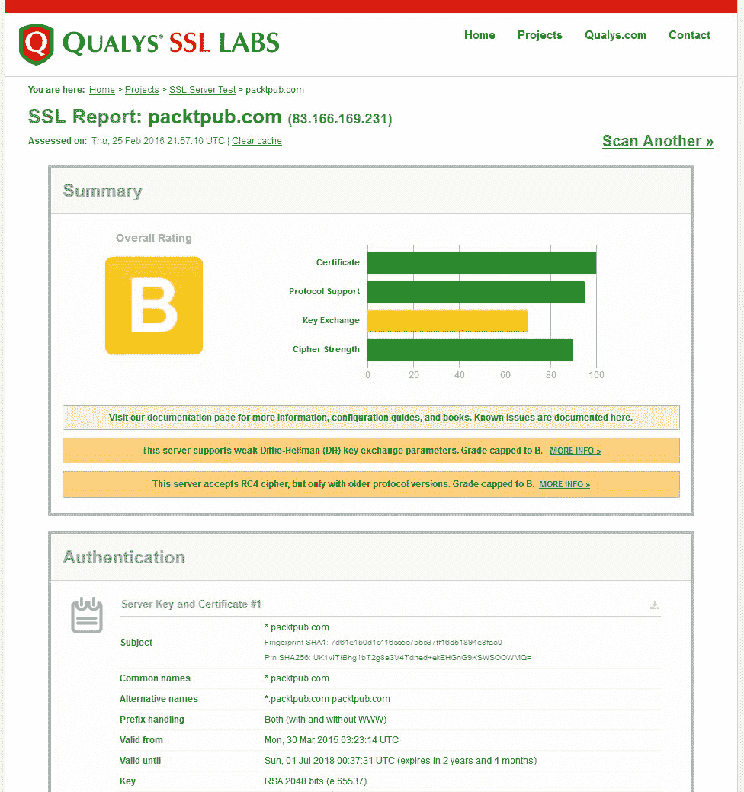

如果我们看一下配置比较好的站点([https://emoncms.org/](https://emoncms.org/))，可以看到它获得了 A 级。你可以用 HSTS 头球得分。此外，这些头避免了重定向的开销。如果您将域名提交给供应商，您还可以将您的网站嵌入浏览器附带的预加载列表中。

以下截图显示了 SSL 实验室为[https://emoncms.org/](https://emoncms.org/)提供的部分报告:

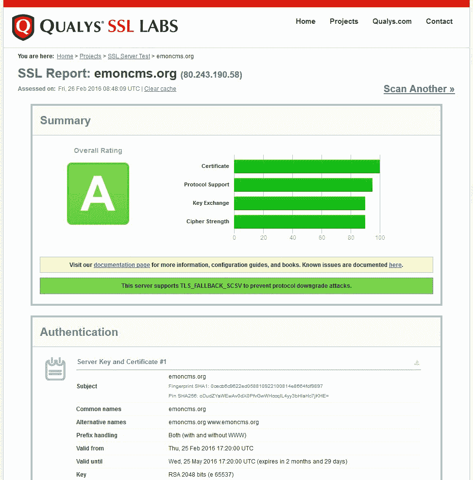

现代浏览器选择的选项通常是带有 RSA SHA-256 签名和 AES 会话密码的**椭圆曲线 Diffie-Hellman 临时密钥交换** ( **ECDHE** )。临时密钥提供 PFS，因为它们只保存在会话的内存中。通过查看浏览器，您可以看到协商了什么连接。

在 Firefox 中，您可以通过单击网址栏中的锁定图标，然后单击“更多信息”按钮来实现这一点，如下图所示:

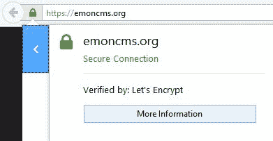

在“技术细节”部分，您将看到所使用的密码套件。Firefox 中的下图显示了 ECDHE 密钥交换和 RSA 证书签名:


您也可以通过单击查看证书按钮来查看证书详细信息。该域名通常作为主题字段中的**通用名称** ( **CN** )包含在内。替代域也可以包含在证书主题替代名称扩展中:

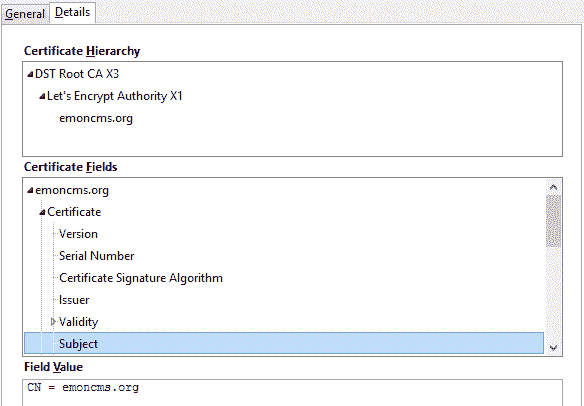

在 Chrome 中，您可以在开发人员工具的“安全性”选项卡中查看 TLS 连接信息。例如，下面的截图显示了[https://huxley.unop.uk/](https://huxley.unop.uk/)的安全细节:

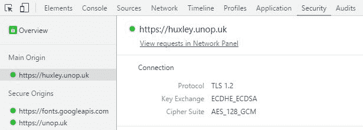

以下截图显示了[https://emoncms.org/](https://emoncms.org/)的相同窗口:

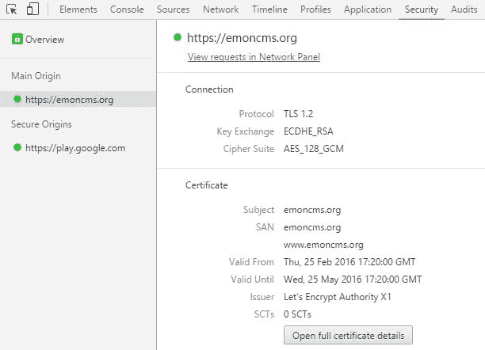

You may need to refresh the page to see TLS information if the site was already loaded when you opened the developer tools. You can access the same tab by clicking on the padlock in the Chrome URL bar and then clicking on the Details link.

您可以通过单击打开完整证书详细信息按钮来查看证书(在本机操作系统证书存储中)。安卓 Chrome 的等效屏幕上有一个相同功能的链接，虽然减少了证书信息。

# 性能调整

我们已经讨论了顶级域名系统最重要的性能调整，因为它与顶级域名系统无关。您应该确保您的 HTTP 连接是可重用的，因为如果不是这样，那么您将招致额外的 TLS 协商损失以及 TCP 开销。缓存也非常重要，我们稍后会详细讨论这一点。

TLS and HTTP both support compression, but these have security implications. Therefore, consider them carefully. They can leak information, and a determined adversary can use an analysis of them to recover encrypted data. TLS compression is deprecated, and it will be removed in TLS 1.3\. Therefore, do not use it. We will discuss HTTP compression later on in this chapter.

关于 TLS 的具体建议，您可以做一些事情来提高性能。主要技术是保证你使用**会话恢复**。这不同于重用 HTTP 连接，这意味着客户端可以重用现有的 TLS 连接，而不必经历整个密钥交换。

You can implement sessions with IDs on the server or with encrypted tickets (in a similar manner to ASP.NET cookies that are encrypted with the machine key). There was a bug in the Microsoft client implementation around ticket encryption key rotation, but the **KB3109853** patch fixed it. Make sure that you install this update, especially if you see exceptions thrown when connecting to secure endpoints from your .NET code.

重要的是不要过度使用东西，越大并不总是越好，尤其是在关键尺寸方面。这是性能和安全性之间的权衡，这将取决于您的具体情况。一般来说，当使用 128 位密钥时，最好不要使用 256 位 AES 密钥。

一个 2048 位的 RSA 密钥足够大；低的不安全，大的太慢。可以使用**椭圆曲线数字签名算法** ( **ECDSA** )代替 RSA 进行签名，因为这样会快很多。但是，支持有限，因此您需要并行部署 RSA。

如果您使用 ECDSA，那么 256 位密钥就足够了。对于 ECDHE，256 位也可以，对于没有椭圆曲线的较慢版本(DHE)，2048 位就足够了。如果您使用 ECDSA，那么您将看到这个列表，而不是连接详细信息中的 RSA 签名。比如在访问[https://huxley.unop.uk/](https://huxley.unop.uk/)时，下面截图中的细节在 Firefox 中显示。这种差异也显示在之前的 Chrome 截图中:


此外，在您的证书中包含完整的证书链也很重要。如果您未能包含所有中间证书，那么浏览器将需要下载它们，直到在其受信任的根存储中找到一个。你也可以使用一种叫做**在线证书状态协议** ( **OCSP** )装订的技术，通过嵌入撤销数据，所以浏览器不需要检查证书撤销列表。

这两种证书技术都可能增加有效载荷的大小，如果带宽是一个问题，这可能是一个问题。但是，它们将减少消息数量，如果延迟是主要问题，这将提高性能，这通常是这种情况。保持密钥大小小也有助于增加带宽。很难推荐一种通用的方法。因此，一如既往，测试你的独特情况。

还有一种可选的流密码叫做 **ChaCha/Poly** ，对于移动设备特别有用。这使用了 **ChaCha20** 流密码和 **Poly1305 消息认证码** ( **MAC** )算法来创建 RC4 的安全替代方案。AES 是一种分组密码，在硬件支持下速度很快，但是许多移动设备和一些旧计算机没有这种加速。ChaCha/Poly 仅使用软件时速度更快。因此，这对电池寿命更好。这在 Chrome 中得到支持，包括安卓的 Chrome 和火狐。你可以在[https://caniuse.com/#feat=chacha20-poly1305](https://caniuse.com/#feat=chacha20-poly1305)看到最新的浏览器支持。

As all algorithms are different, you can't directly compare key sizes as a measure of how secure they are. For example, a 256-bit ECDHE key is equivalent to a 3072-bit RSA key. AES is very secure with relatively small keys, but you cannot use it for key exchange. ChaCha/Poly is more comparable to the security of AES 256 than AES 128.

在下面安卓上 Chrome 的截图中，可以看到连接到[https://huxley.unop.uk/](https://huxley.unop.uk/)时，Chrome 使用 CHACHA20_POLY1305 作为流密码，ECDHE 作为密钥交换，ECDSA 作为签名:

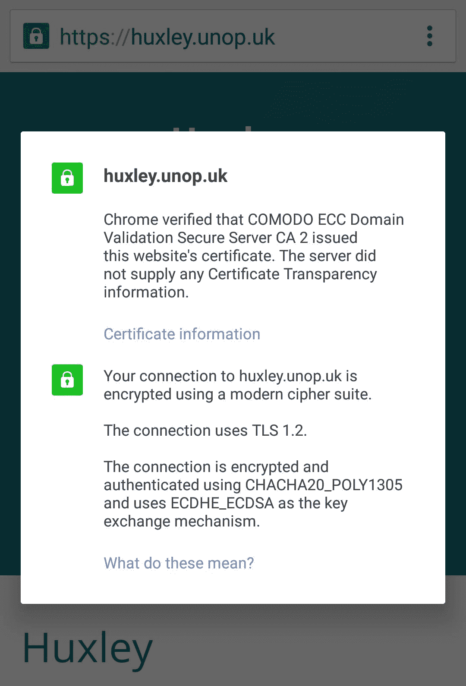

The new version of TLS (1.3) is currently a draft, but it is still supported in many places. It will only allow **Authenticated Encryption with Additional Data** (**AEAD** ) ciphers. AES-GCM and ChaCha/Poly are the only two ciphers that currently meet these criteria. It will also remove some other obsolete features, such as TLS compression. The good news is that TLS 1.3 not only improves security but also delivers higher performance. It is already supported by the stable versions of Firefox and Chrome. You can check support at [https://caniuse.com/#feat=tls1-3](https://caniuse.com/#feat=tls1-3) .

有时听起来使用 TLS 并不总是值得的，但是在你的整个网站上使用 HTTPS 是一个很好的主意，包括你加载的任何第三方资源。通过这样做，您将能够利用 HTTP/2 的性能增强特性，其中包括的技术意味着为来自多个域的资源(如 JavaScript 库)提供服务不再至关重要。您可以自己安全地托管所有内容，并避免额外请求的 DNS、TCP 和 TLS 开销。

所有这些都是免费的，因为*让我们加密*和 *Cloudflare* 以零成本提供证书。 *Cloudflare* 也有 TLS 1.3 测试版，但使用时可能会有安全隐患。*让我们加密*允许您生成证书以在自己的服务器上使用，从 2018 年开始，它也将提供通配符证书。现在让我们详细看看 HTTP/2。

# HTTP/2

顾名思义，HTTP/2 是 HTTP 的新版本。它包含了现代网络的一些显著的性能改进。它的前身是 **SPDY** ，此后被弃用，取而代之的是 HTTP/2。

如前所述，使用 HTTP/2 的第一步是在整个网站上使用 HTTPS。虽然技术上没有要求，但大多数客户端(所有主要浏览器)都要求使用顶级域名来启用 HTTP/2。这主要得益于 TLS 提供的**应用层协议协商** ( **ALPN** )，可以轻松支持 HTTP/2。它还能防止代理服务器弄乱数据，许多互联网服务提供商用这些数据来降低成本，记录客户的在线行为。

HTTP/2 在许多方面提高了性能。它使用压缩，甚至是头和多路复用，允许多个请求共享同一个连接。它还允许服务器在客户端意识到它需要资源之前推送它知道客户端将需要的资源。但是，这需要一些配置来设置正确的头，如果过度使用，可能会浪费带宽。

多路复用对捆绑和图像拼接(**精灵**)有影响，我们将在本章后面的*压缩*部分讨论。这也意味着你不需要在多个域上分割资产(**碎片**)，额外的开销甚至会减慢速度。但是，您可能仍然希望使用一个没有 cookie 的子域来服务没有 cookie 的静态资产，即使新的头压缩意味着带宽节省会更少。如果你使用一个裸域(没有`www`)，那么你可能需要一个新的域名用于无 cookie 使用。

您可以使用浏览器开发工具来确定使用什么版本的 HTTP 来交付您的资产。在 Firefox 中，您可以在“网络”选项卡的详细信息面板上看到这一点。当使用旧协议时，您会看到版本被列为 HTTP/1.1。

下图截图显示[https://www.packtpub.com/](https://www.packtpub.com/)使用 HTTP/1.1:

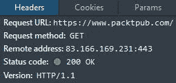

In Chrome, you can right-click on the column headers in the network inspector and add a Protocol column. You can also see more detailed network information by entering `chrome://net-internals` into the address bar. This displays things, such as sessions for HTTP/2 and **Quick UDP Internet Connections** (**QUIC** ), an experimental multiplexed stream transport.

下图截图显示[https://emoncms.org/](https://emoncms.org/)也使用 HTTP/1.1，虽然 TLS 配置不同。加密传输层对 HTTP 是透明的:

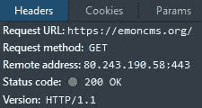

当使用 HTTP/2 时，您会看到版本被列为 HTTP/2.0。下面的截图显示了[https://huxley.unop.uk/](https://huxley.unop.uk/)的情况，还显示了 CORS、缓存和内容压缩头:

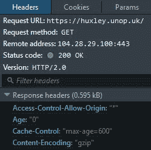

# 求转发到

网络套接字协议(也通俗地称为网络套接字)是一种不同于 HTTP 的协议。然而，HTTP 启动它，它使用相同的端口，所以我们将在这里简要讨论它。此 HTML5 功能对于**推送通知**和**实时通信** ( **RTC** )应用非常有用。网络套接字使用`ws://`和`wss://`协议前缀，而不是`http://`和`https://`。一旦由现有的 HTTP 连接建立，该协议是全双工和二进制的，与 HTTP/1 相反。

在 WebSockets 之前，如果您的 web 服务器想要通知客户端一个变化，那么您将不得不使用一种技术，比如长轮询。

这是一个 web 请求被服务器打开的地方，以防它想要发送什么。当请求得到响应或超时时，它会重新建立。不用说，投票从来都不是很有效率。

从用户的角度来看，推送通知可以提高性能，因为它们一出现就收到更新。用户不需要刷新任何东西或继续检查。当一个长时间运行的进程启动时，您可以立即响应用户，异步运行它，并在完成后立即通知他们。

**插座。IO** 是 Node.js 的一个流行的 WebSocket 库，要看到它的实际应用，可以在使用它的网站上查看浏览器开发工具。例如，如果您打开开发工具并转到[https://www.opentraintimes.com/maps/signalling/staines](https://www.opentraintimes.com/maps/signalling/staines)，您将看到连接从 HTTPS 升级到 WSS(或者如果您使用不安全的版本，则从 HTTP 升级到 WS)。

WebSockets 早于 HTTP/2，但是尽管有了新的服务器推送技术，它们仍然是相关的。这两个特性看起来相似，但它们的用途不同。网络套接字用于实时和双向数据传输，服务器推送目前只是为了预加载。

In addition to HTTP/2 server push preloading, there is a new browser feature that is currently supported in Android, Chrome, and Opera, which allows you to declare resource preloading in markup by using `rel="preload"` on a `link` tag. You can read the spec at [https://w3c.github.io/preload/](https://w3c.github.io/preload/) and check the current state of browser support at [http://caniuse.com/#feat=link-rel-preload](http://caniuse.com/#feat=link-rel-preload) .

在 Chrome 中，协议开关看起来像下面的截图。您看不到网络套接字连接的内容，因此您将无法从开发工具中查看正在传输的数据:

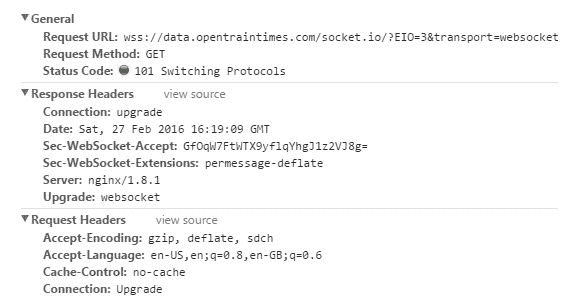

ASP.NET 有一个微软图书馆，叫做信号员。该库允许您使用网络套接字执行推送通知。如果客户端或服务器不支持长轮询，它也会退回到长轮询。要使用网络套接字，您需要一个相当新的版本的 Windows Server (2012 或更高版本)和 IIS (8.0 及更高版本)。

遗憾的是，最新的稳定版本(SignalR 2)并没有正式支持.NET Core 2.0。新版本正在编写中，将在 ASP.NET Core 2.0 之后发布。

You may also wish to look at `StackExchange.NetGain` as a WebSocket server.

# 压缩

数据压缩是一个宽泛的话题，我们不能指望覆盖所有内容。在这里，我们将学习无损压缩以及如何在 HTTP 中使用它。我们还将在本章后面介绍图片的有损图像压缩。压缩很重要，因为如果我们能使文件变小，我们就能缩短通过网络传输文件的时间。

# 无损压缩算法

您可能已经注意到之前一些截图中的 HTTP 头与编码有关。HTTP 最常见的压缩算法是 GZIP 和 **DEFLATE** ，非常相似。这些都与 ZIP 文件中使用的算法有关。如果您还没有使用 HTTP 压缩，那么这是一个快速的胜利，如果您启用它，它将提高您的网站的性能。

还有很多其他更高级的压缩算法，比如 **xz** ，类似于 **7-Zip** ( **7z** )格式，使用**莱姆佩尔-齐夫-马氏链算法****(LZMA**/**lzma 2**)。然而，目前只有两种额外的算法在主要浏览器中被普遍使用。分别是 **Brotli** 、**HTTP 共享字典压缩** ( **SDCH** )。两者都来自谷歌，但只有 Chrome 支持 SDCH，而且需要大字典。

Brotli 更有趣，因为现在大多数现代浏览器都支持它。许多浏览器需要使用 HTTPS 来支持 Brotli(使用 TLS 的另一个很好的理由)，并且在标题中使用的编码标记是`br`。Brotli 有显著的性能提升，尤其是对于慢速连接的移动设备。你可以在[https://caniuse.com/#search=brotli](https://caniuse.com/#search=brotli)看到最新的支持数据。

如果您通过 HTTP 访问网站，您将在 Chrome dev tools 网络检查器中的请求详细信息中看到以下请求标题:

```cs
Accept-Encoding: gzip, deflate
```

但是，如果您使用 HTTPS，您将会看到:

```cs
Accept-Encoding: gzip, deflate, br

```

然后，服务器可以使用这个响应头用 Brotli 编码的内容进行响应:

```cs
Content-Encoding: br 
```

例如，如果您在受支持的浏览器中访问[https://www.bayden.com/test/brotliimg.aspx](https://www.bayden.com/test/brotliimg.aspx)，那么 Brotli 将传送内容(明星的图像)。这里是 Chrome 请求头的一个子集(为了简洁明了):

```cs
GET /test/brotliimg.aspx HTTP/1.1 
Host: www.bayden.com 
Connection: keep-alive 
Accept-Encoding: gzip, deflate, sdch, br 
```

这是相应响应头的子集:

```cs
HTTP/1.1 200 OK 
Content-Type: img/png 
Content-Encoding: br 
Server: Microsoft-IIS/7.5 
X-AspNet-Version: 4.0.30319 
YourAcceptEncoding: gzip, deflate, sdch, br 
```

Fiddler(我们之前提到的 Eric Lawrence 的令人敬畏的 HTTP 调试代理)也通过一个简单的插件支持 Brotli(将[https://bayden.com/dl/Brotli.exe](https://bayden.com/dl/Brotli.exe)放到`fiddler2\tools`中并重启)。您可以使用它来轻松测试对您的站点的影响，而无需向您的 web 服务器部署任何东西。

You can try out Brotli compression in .NET with the `System.IO.Compression.Brotli` package. You could use this in combination with the ASP.NET Core response compression middleware ([https://docs.microsoft.com/en-us/aspnet/core/performance/response-compression?tabs=aspnetcore2x](https://docs.microsoft.com/en-us/aspnet/core/performance/response-compression?tabs=aspnetcore2x) ). Hopefully Brotli will be included in future versions of the core .NET Framework and then the response compression middleware can support it by default.

# 捆绑和缩小

当开发一个 web 应用时，您通常会得到许多需要交付给浏览器的静态文件。这些文件包括样式表、脚本和图像。处理许多小文件比处理一个大文件更容易(尤其是作为团队的一部分时)，但这并不总是提高性能的最佳方法。

捆绑和缩小是加速这些静态资产交付的两种技术。它们通常用于文本文件，如 JavaScript 和 CSS 内容。但是，您也可以缩小图像，我们稍后会介绍这一点。

# 集束

捆绑是将多个文件组合或连接在一起的技术，这样它们就可以作为一个文件交付。当使用 HTTP/1.1 时，这是一个好主意，因为并发连接数是有限的。但是，捆绑对于 HTTP/2 来说就没那么必要了，事实上，它会降低性能。HTTP/2 中的新多路复用意味着，当您请求多个文件而不是一个包含所有相同内容的文件时，不会再有很大的损失。您可以利用这一点，只交付页面所需的内容，而不是每个页面的整个客户端代码库。即使你有选择地捆绑每页，这也可能是低效的。

例如，您可以包含一个用于表单的验证库。但是，因为这是捆绑的，它将被发送到所有页面，包括那些没有要验证的表单的页面。如果您有一个单独的已验证页面捆绑包，那么公共核心代码中可能会有重复，这些代码也会被发送。通过将事物分开，客户端可以单独缓存它们并重用组件。这也意味着，如果你改变了什么，你只需要使这一部分的缓存无效。客户端可以继续使用其他未修改的部分，而不必再次下载它们。

像往常一样，您应该为您的特定用例进行度量。您可能会发现捆绑仍然会减小总文件大小。HTTP/2 的开销要低得多，但仍然不是零，压缩可以更好地处理更大的文件。但是，请记住缓存和可重用性的含义。

# 缩小

缩小是减少文本静态资产的文件大小的过程。我们通过各种方法做到这一点，包括去掉注释、删除空白和缩短变量名。对*代码进行模糊处理也是有用的，这样更难进行逆向工程。*

当您使用 HTTP/2 时，缩小仍然很有用，但是在应用无损压缩后，当测试比较缩小前和缩小后的文件大小时，您应该小心。

如前所述，您应该使用 HTTP 内容压缩，至少使用 GZIP 或 DEFLATE 算法，最好使用 Brotli。这些算法在缩小文件方面非常有效。您可能会发现，当压缩时，您的缩小文件并不比压缩的原始源文件小多少。

# ASP.NET Core 的变化

完整的.NET Framework 和以前版本的 MVC，平台内置了一个集成的捆绑和缩小系统，可以在运行时动态工作。对于 ASP.NET Core 来说，这种情况发生了变化，现在有了新的工具来执行这项工作。

现在的默认选项是`BuildBundlerMinifier` NuGet 包。但是，如果您愿意，您可以使用其他工具，包括任务管理器、大口和咕噜。还有包管理器，如 **Bower** 和 **npm** ，它们类似于 NuGet，但用于前端库。例如，NuGet 不再提供 jQuery 和 Twitter Bootstrap，默认情况下，它们使用 Bower。

这些工具大部分是用 JavaScript 编写的，运行在 Node.js 上，Node.js 的包管理器是 npm。这些工具在其他开源 web 框架中很受欢迎，并且已经很成熟。他们对这个场景并不陌生，只是对. NET 不熟悉

静态资产的缩小现在是在构建时完成的，而不是像以前那样在请求时完成。它更像是一个静态网站生成器，而不是一个动态 web 应用。项目根目录中的配置文件(`bundleconfig.json`)定义了 JSON 的绑定和缩小行为。

新工具不仅仅限于 ASP.NET Core，您还可以在 Visual Studio 中将这些功能用于传统的 ASP.NET 应用。这是一个很好的例子，说明了新框架可以为现有框架提供的交叉授粉和好处。

# 图像优化

数字媒体压缩比我们之前谈到的无损文件压缩复杂得多，即使我们只关注图像。上一章我们简单提到了什么时候用 PNG，什么时候用 JPEG。在这里，我们将深入探讨更多细节，并探索一些其他奇特的选择。

我们介绍了经验法则，即 PNG 是图标的最佳图像格式，JPEG 更适合照片。这两种格式分别是无损和有损图像压缩中最常见的。

我们将在后面更多地讨论其他图像格式，但是您通常会受到浏览器支持的流行格式的限制。那么，如何从常见的选择中获得更多呢？

# 巴布亚新几内亚

**便携式网络图形** ( **PNG** )是一种无损图像压缩格式，内部工作方式类似于 ZIP 文件(使用 DEFLATE 算法)。对于包含纯色块的图像来说，这是一个很好的选择，并且它比旧的**图形交换格式** ( **GIF** )具有更高的图像质量(具有更多的颜色)。

PNG 支持所有现代浏览器中的透明度，因此您应该使用它来代替静态图像的 GIF。这不是问题，除非你需要支持 Internet Explorer 6，在这种情况下，这可能是你最少的麻烦。PNG 也支持带有**动画便携式网络图形** ( **APNG** )文件的动画。这些就像动画 gif，但质量要高得多。遗憾的是，只有火狐和 Safari 支持 APNGs。

A great site to look up the browsers that support a particular feature is [http://caniuse.com/](http://caniuse.com/) . You can search for feature support and then check this against the user agent analytics of your site. For example, you could search for PNG-alpha, Brotli, or APNG.

一些 ZIP 算法实现比其他算法更好，它们产生的文件更小，仍然可以被每个人解码。例如，7-ZIP 比 Windows 上大多数其他 Zip 压缩软件要高效得多，即使使用 Zip 格式，而不是其原生的`7z`格式。同样，您可以更紧凑地压缩一个 PNG，而不会丢失任何数据，并且仍然可以在所有浏览器中工作。这通常会带来较高的前期计算成本。然而，如果你压缩静态资产，这很少改变，那么这是非常值得的。

您可能已经使用 PNGOUT 工具无损地缩小了 PNG 图像的大小。如果你不是，那你也许应该。你可以在[http://advsys.net/ken/utils.htm](http://advsys.net/ken/utils.htm)了解更多，下载。

然而，有一种新的算法叫做 Zopfli，它提供了更好的压缩，但是压缩速度非常慢。解压缩同样快速，因此对于预编译资源来说，这只是一个单一的优化成本。Zopfli 是 Brotli 的前身，但它与 DEFLATE 和 GZIP 兼容，因为它不是新格式。

您可以从[https://github.com/google/zopfli](https://github.com/google/zopfli)获得 Zopfli，但是您应该始终用您的图像进行测试，并验证文件大小确实有所减少。您可能会发现，这些工具可以帮助您更快地交付资产并实现更高的性能。

您也可以使用将许多精灵组合成一个图像的做法。与捆绑一样，当使用 HTTP/2 时，这是不太必要的。然而，同样的警告也适用于压缩，您应该始终测试您的图像集。

# 联合图像专家组

JPEG 是一种有损图像压缩格式，这意味着它通常会丢弃图片中的数据以使其变小。它最适合自然渐变和连续色调，例如照片中的色调。JPEG 不像 PNG 那样支持透明度，所以如果你想在不同的背景上使用，那么你需要预先渲染它们。

It's a good space-saving idea to remove the **Exchangeable image file format** (**Exif** ) metadata from your JPEG files for the web. This contains information about the camera used and geographic data of where the photo was taken.

JPEG 有一个质量设置，它会影响图像文件的大小和细节级别。质量越低，文件越小，但看起来越差。您可以对图像进行测试，看看哪些设置提供了可接受的折衷。至关重要的是，此质量设置的最佳值会因图像而异，具体取决于内容。有一些工具可以让你自动检测最佳质量水平，比如谷歌的 butteraugli。

火狐浏览器的制造者 Mozilla 有一个有趣的项目，叫做 **mozjpeg** 。这旨在更好地压缩 JPEG 图像，类似于 PNGOUT 和 Zopfli 对 PNG 图像所做的。您可以使用 mozjpeg 将您的 jpeg 图像压缩到比正常情况下更小的大小，而不会影响解压缩或质量。它可以在[https://github.com/mozilla/mozjpeg](https://github.com/mozilla/mozjpeg)找到，但是你需要自己编译。和往常一样，结果可能会有所不同，所以在你的网站上测试一下照片。

**JPEG Archive**([https://github.com/danielgtaylor/jpeg-archive](https://github.com/danielgtaylor/jpeg-archive))是一款便捷的工具，使用各种比较指标，使用 mozjpeg 压缩 JPEG 图像。另一个类似的工具是**imgmin**([http://github.com/rflynn/imgmin](http://github.com/rflynn/imgmin))，稍老一些。

# 其他图像格式

许多其他的图像格式都是可用的，但是你在网络上通常会受到浏览器支持的限制。

如前一章所述，您不应该在浏览器中缩放图像，否则您将获得较差的性能。这通常意味着必须保存较小图像的多个单独副本，例如，在显示缩略图时。显然，这会导致重复，这是低效的。这些新的图像格式中有一些为响应性和可伸缩性图像问题提供了巧妙的解决方案。

BPG 是天才法布里斯·贝拉的一个图像格式，你可以在[http://bellard.org/bpg](http://bellard.org/bpg)阅读更多关于它的内容。它有一个支持浏览器的 JavaScript polyfill，在任何浏览器中添加本机支持之前。

WebP 是一种来自谷歌的图像格式，只有 Chrome、Android 和 Opera 支持。与 JPEG 相比，它节省了大量空间，如果它得到更广泛的支持，这将是一个不错的选择，所以查看 http://caniuse.com/的最新采用统计数据。

JPEG 2000 是 JPEG 的改进版本，尽管它可能受到软件专利的阻碍，因此它在医学成像之外还没有被广泛采用。只有 Safari 支持 JPEG 2000，还有 JPEG XR，只有 IE 才支持。

JPEG 使用的是**离散余弦变换** ( **离散余弦变换**，而 JPEG 2000 是基于小波变换的。它提供的属性之一是*渐进式*下载。这意味着图像的存储方式是，如果您从文件的开头下载一小部分，则完整图像的版本会更小，质量也会更低。这在响应性和可伸缩性图像方面有明显的应用。浏览器只需要下载足够的图像来填充它要渲染到的区域，并且文件只需要存储一次。缩略图不需要调整大小和复制。该技术也用于**自由无损图像格式** ( **FLIF** )。

FLIF 是一个更令人兴奋的即将到来的图像格式，因为它是进步和响应，但免费的，没有专利。FLIF 还在开发中，但是如果浏览器支持它，它将非常有用。你可以在[http://flif.info/](http://flif.info/)了解更多。

JPEG and PNG can support progressive download, but this isn't normally useful for responsive images. Progressive JPEG subjectively loads more gracefully and can even make files smaller, but interlaced PNG usually makes files bigger.

问题是，这些渐进式图像格式中的大多数还没有为主流做好准备，因为所有主要的浏览器都不支持它们。关注未来是一个好主意，但目前，我们需要调整图像大小以获得高性能。

# 调整图像大小

在新的图像格式得到广泛采用之前，仍然需要调整大小，并且您可能需要针对不同的设备动态调整大小。也许，您也有用户提交的图像内容，尽管从安全角度来看，您需要非常小心。有些图像库不安全，特制的图像可能会利用您的系统。事实上，许多图像处理库在 web 环境中使用时都存在问题。

如果你不是非常勤奋和小心，那么你很容易以内存泄漏而告终，这可能会关闭你的网络服务器。将处理大型媒体文件的进程分开并用沙箱保护总是一个好主意。

从. NET 的角度来看，使用 WinForms `System.Drawing`或其 WPF 继任者(`System.Windows.Media`)可能很有诱惑力。但是，这些是为桌面软件设计的，微软强烈建议不要在服务或网络应用中使用它们。微软推荐**视窗映像组件** ( **WIC** )，但这是一个**组件对象模型** ( **COM** )应用编程接口，用于 C 或 C++应用。除此之外，这些成像库都不是跨平台的，因此不适合在中使用.NET Core。

如果你用的是 Windows，那么你可以试试 Imazen([http://www.imazen.io/](http://www.imazen.io/))从[http://imageresizing.net/](http://imageresizing.net/)用 ImageResizer。虽然它仍然使用 **GDI+** `System.Drawing`，但它相当久经沙场，所以大部分 bug 应该都已经解决了。还有**dynamic mage**，它包装了较新的 WPF 图像函数并使用了着色器。可以在[http://dynamicimage.apphb.com/](http://dynamicimage.apphb.com/)了解更多，虽然有一段时间没有更新，不支持.NET Core。

开源圈子里比较流行的一个选项是我们之前提到过的 ImageMagick，还有一个叫做 **GraphicsMagick** 的分叉，号称效率更高。另一个流行的图像库是 **LibGD** ，它适合服务器使用。你可以在[http://libgd.github.io/](http://libgd.github.io/)阅读更多。虽然是用 C 写的，但是也有其他编程语言的包装器，比如 **DotnetGD** targeting.NET Core。

其中一个特点是.NET Core 缺少的是还没有一个令人信服的图像处理选项。完成后，ImageResizer 5 和 Imageflow([https://www.imageflow.io/](https://www.imageflow.io/))可能会对此有所帮助。开源的 **ImageProcessor** 库([http://imageprocessor.org/](http://imageprocessor.org/))还有一个新的跨平台版本，叫做 ImageSharp([http://imagesharp.net/](http://imagesharp.net/)，不过这还是一个正在进行的工作。如果您想尝试一下，那么您可以从 MyGet 获得预发布包，或者从源代码构建它。

Platform support and compatibility changes rapidly, so check [https://github.com/jpsingleton/ANCLAFS](https://github.com/jpsingleton/ANCLAFS) for the latest information. Feel free to contribute to this list or to the projects.

就目前而言，安装一个开源服务可能更容易，比如 Thumbor，或者使用一个基于云的成像服务，比如我们已经提到的 ImageEngine([http://wurfl.io/](http://wurfl.io/))或者 Cloudinary。图像处理是一项常见的任务，也是一个有效解决的问题。最好使用现有的解决方案，而不是重新发明轮子，除非它是你核心业务的一部分，或者你有非常不寻常的需求。

Once you have your resized images, you can load them responsively with the `picture` and `source` tags using the `srcset` and `sizes` attributes. You can also use this technique to provide newer image formats (such as WebP), with a fallback for browsers that don't yet support them. Or you can use **Client Hints** (refer to [http://httpwg.org/http-extensions/client-hints.html](http://httpwg.org/http-extensions/client-hints.html) and [http://caniuse.com/#feat=client-hints-dpr-width-viewport](http://caniuse.com/#feat=client-hints-dpr-width-viewport) ).

# 贮藏

人们常说(最初是菲尔·卡尔顿说的)，缓存是计算机科学中最难的问题之一，命名也是如此。这可能有点夸张，但是缓存确实很难。如果你的方法不系统和不精确，调试也会非常令人沮丧。

使用多种不同的技术，缓存可以应用于从浏览器到服务器的不同级别。即使您没有意识到，也很少使用单个缓存。多个缓存并不总是能很好地协同工作，如果你不能清除一个，那就很麻烦了。

我们在前一章中简单地讨论了缓存，我们将在[第 9 章](09.html)、*学习缓存和消息队列*中更详细地讨论。然而，由于缓存对网络性能有影响，我们也将在这里讨论它。

# 浏览器

很多缓存都发生在 web 浏览器中，这很不方便，因为你无法直接控制它(除非是你的浏览器)。要求用户清除缓存对许多人来说是不令人满意和困惑的。然而，通过仔细控制您设置的 HTTP 头和您使用的 URL，您可以对浏览器缓存资源的方式施加影响。

如果你不能声明哪些资源是可缓存的，以及可以缓存多长时间，那么很多浏览器只会猜测这一点。这方面的启发在不同的实现之间可能有很大的不同。因此，这将导致次优性能。您应该是显式的，并且总是通过将资产标记为不可缓存来声明缓存信息，即使是(尤其是)不应该缓存的资产。

You need to be vigilant with what you advertise as cacheable because if you are careless, then you can get yourself into a situation where you're unable to update a resource. You should have a cache-busting strategy in place, and tested, before using caching.

浏览器中有各种各样的缓存技术。可以设置很多不同的 HTTP 头，比如`Age`、`Cache-Control`、`ETag`(实体标签)、`Expires`、`Last-Modified`。这些来自几个不同的标准，交互可能很复杂，或者在不同的浏览器之间有所不同。我们将在[第 9 章](09.html)、*学习缓存和消息队列*中更详细地解释这些。

另一种技术是为内容使用唯一的网址。如果一个网址改变了，那么浏览器会把它当作一个不同的资源，但是如果它是相同的，那么它可能会从它的本地缓存加载它。一些框架计算文件内容的散列，然后将其用作查询字符串参数。这样，当文件内容改变时，网址也随之改变。

还有其他更现代的功能可以用来缓存，比如 **HTML5 应用缓存**(或者 **AppCache** )。这是为离线 web 应用设计的，不是很灵活。委婉地说，破坏缓存很复杂。AppCache 已经被弃用，您应该使用**服务人员**来代替。这些提供了更多的灵活性，尽管支持是最近才出现的。

有许多改进即将到来，在最新的浏览器中，给你更多的控制，我们也将在[第 9 章](09.html)、*学习缓存和消息队列*中向你展示如何使用它们。

# 计算机网络服务器

网络服务器是缓存的好地方，因为它通常在你的完全控制之下。然而，除了生成正确的报头之外，它实际上不是网络性能的一部分。就提高生成页面的速度而言，服务器端缓存还可以带来其他巨大的性能优势，但我们将在后面的章节中介绍这些优势。

如果你用传统的.NET 框架在微软的**互联网信息服务** ( **IIS** )网络服务器上，那么你可以在你的应用中使用**输出缓存**。这将负责设置正确的标题并向浏览器请求发送`304 (Not Modified)`响应。它还会将服务器上的输出缓存在内存、磁盘或使用 Memcached/Redis。您可以向控制器操作方法添加属性来控制缓存选项，但是也可以使用其他方法，例如在配置文件中。

输出缓存现在在 ASP.NET Core 中可用，因此如果您愿意，您可以在基础架构中存储输出的副本。由于本节是关于网络的，我们在这里只讨论`ResponseCache`属性，它是输出缓存的一个子集。访问作者在[https://unop.uk/](https://unop.uk/)的网站，了解更多关于其他主题的信息。

如果要禁用 ASP.NET Core 页面上的缓存，请将此注释添加到您的控制器操作中:

```cs
[ResponseCache(NoStore = true, Duration = 0)] 
```

这将在 HTTP 响应上设置以下标头，并确保不缓存该标头:

```cs
Cache-Control: no-store 
```

要缓存一个小时的页面，请添加以下内容，`Duration`以秒为单位:

```cs
[ResponseCache(Duration = 3600, VaryByHeader = "Accept")] 
```

缓存控制头将如下所示:

```cs
Cache-Control: public,max-age=3600 
```

关于其他缓存配置选项和配置文件，还有很多要说的。因此，如果你感兴趣，那就阅读后面的章节。这是一个复杂的话题，我们这里只触及了表面。

You can read the documentation about response caching in ASP.NET Core at [https://docs.microsoft.com/en-gb/aspnet/core/performance/caching/response](https://docs.microsoft.com/en-gb/aspnet/core/performance/caching/response) .

这些缓存指令不仅指示浏览器，还指示途中的任何代理。如果您有缓存代理，其中一些可能在您的基础架构中，例如 Squid、Varnish 或 HAProxy。或者，您可能有一个终止于 TLS 的负载平衡器(如 **Azure 应用网关**)来减少您的网络服务器上的负载，该服务器也缓存。您可以强制刷新您控制的服务器的缓存，但是在您和您的用户之间可能还有其他缓存，您不能这样做。

# 您和您的用户之间的代理服务器

您和您的用户之间可能有许多您无法直接控制的代理服务器。他们可能会忽略您的缓存请求，阻止您网站的部分内容，甚至修改您的内容。解决这些问题的方法是使用 TLS，我们已经讨论过了。TLS 创建了一个安全的隧道，这样您的基础设施和浏览器之间的连接就不会被轻易篡改。

企业代理，通常是“中间人” ( **【米特姆】**)，攻击您与用户的连接，以便他们可以监视员工在网上做什么。这包括在用户的工作站上安装一个自定义的受信任根证书，以便可以伪造您的证书。不幸的是，除了教育用户，你对此无能为力。**证书锁定**在原生应用中很有效，但在网络应用中就没那么有用了。 **HTTP 公钥锁定** ( **HPKP** )是可用的，但是由于这是一种**首次使用信任** ( **豆腐**)技术，初始连接可能会被拦截。客户端证书是另一种选择，但是它们很难分发，并且不常用。

如果你使用 HSTS 并在浏览器中预装了你的域名，那么这有助于避免拦截，但是你的网站可能会被屏蔽。例如，火狐自带证书存储，不像 Chrome 那样使用操作系统提供的证书存储。您不能为启用了 HSTS 的站点添加安全例外，火狐在连接之前知道这一点，对于包含在浏览器安装中的 HSTS 站点也是如此。

如果您信任第三方并保持控制，MitM 可能会很有用。一些**内容交付网络**(**cdn**)使用这个来加速你的站点。但是，您需要仔细评估这种情况的风险影响。阅读上一章提到的 Cloudbleed 事件，这是一个尖锐的例子。

# cdn

cdn 可以通过将内容的副本存储在离用户更近的位置来提高网站的性能。诸如 Cloudflare 提供的服务，在您的连接上执行 MitM，并在世界各地的数据中心保存副本。与未经授权的代理的区别在于，您可以控制配置，并且可以随时清除缓存。

您应该小心，因为如果您不使用缓存功能，那么由于涉及额外的跳转，这可能会降低您的站点的响应能力。确保您监控有无 CDN 的响应时间，并且您需要一个后备计划以防响应时间减少。

cdn 的另一个常见用例是分发流行的库，例如 jQuery JavaScript 库。有来自 jQuery (MaxCDN)、谷歌、微软和 CDNjs (Cloudflare)的免费 cdn 可以做到这一点。假设用户缓存中可能已经有这些库中的一个库。但是，您应该非常小心地信任提供者和连接。当您将第三方脚本加载到您的站点中时，您实际上是在让他们完全控制它，或者至少依赖他们始终可用。

如果您选择使用 CDN，那么请确保它使用 HTTPS 来避免篡改脚本。你应该在你的安全页面上使用明确的`https://`网址，或者至少是协议不可知的网址(`//`)，永远不要使用`http://`。否则，您将收到混合内容警告，有些浏览器显示为完全未加密，甚至被阻止。

SRI 可以帮助避免脚本在某些浏览器中被篡改。不要担心散列脚本的任何潜在性能开销。使用的 SHA-2 算法非常快，这就是为什么它们不应该用于散列密码或密钥扩展。有关此脚本完整性检查功能的更多信息，请参见上一章。

无论如何，您都需要在自己的服务器上托管一个后备，以防 CDN 关闭。如果您使用 HTTP/2，那么您可能会发现使用 CDN 没有任何优势。显然，永远要根据你的情况进行测试。

ASP.NET Core 视图中有一些有用的功能，可以轻松地为 CDN 资源启用本地回退。我们将在后面的章节中向您展示如何使用它们。

# 摘要

在本章中，您学习了如何提高基础架构边缘和用户之间的网络性能。您现在更了解您的应用下的互联网协议，以及如何优化它们的使用以获得最佳效果。

我们在较高的层次上覆盖了网络堆栈的许多层，从 IP 和 TCP 到 HTTP 和 HTTP/2。我们还展示了如何使用 TLS 来保护通信，以及密钥交换是如何工作的。我们强调了可以使用的不同密码算法，并涉及到替代协议，如网络套接字。

您学习了如何利用压缩来缩小文本和图像文件。这将减少带宽并加快资产交付。我们还强调了缓存，现在您应该知道它有多重要了。我们将在[第 9 章](09.html)、*学习缓存和消息队列*中详细介绍缓存。

在下一章中，您将学习如何优化基础架构内部的性能。您将看到如何处理输入/输出延迟，以及如何编写高性能的 SQL。