# 七、优化输入/输出性能

本章讨论了当您将经过功能测试的应用拆分成几部分进行部署时经常出现的问题。您的网络服务器托管前端代码，您的数据库在数据中心的其他地方，您可能有一个用于集中文件的**存储区域网络** ( **存储区域网络**)，一个用于应用接口的应用服务器，并且虚拟磁盘也在不同的机器上。

这些变化给许多常见操作增加了显著的延迟，您的应用现在变得超级慢，可能是因为它在网络上太健谈了。在本章中，您将学习如何通过将查询批处理在一起并在最适合该作业的服务器上执行工作来解决这些问题。即使一切都在一台机器上运行，您将在这里学习的技能也将有助于通过提高效率来提高性能。

本章涵盖的主题包括以下内容:

*   输入/输出
*   网络诊断
*   批处理应用编程接口请求
*   高效的数据库操作
*   模拟和测试

您将了解不应该同步使用的各种操作，以及如何以有效的方式从数据库中只返回您需要的数据。您还将看到如何驯服您的 O/RM，并学习使用 **Dapper** 编写高性能 SQL。

我们在[第 5 章](05.html)、*修复常见性能问题*中简要介绍了其中一些主题，但在这里我们将深入探讨更多细节。本章的前半部分将着重于背景知识和诊断工具的使用，而后半部分将向您展示您可能遇到的问题的解决方案。您还将了解一些更不寻常的问题，以及如何修复或缓解它们。

我们将首先关注于理解问题，因为如果你不理解问题的根本原因，那么它可能很难修复。你不应该盲目地应用你读到的建议，并期望它成功地发挥作用。诊断一个问题通常是困难的部分，一旦做到这一点，通常很容易解决它。

# 输入/输出

I/O 是代码与外部世界交互的任何操作的总称。有很多东西可以算作输入/输出，并且在您的软件内部可以有大量的输入/输出，尤其是如果您的应用具有分布式体系结构。

科技公司越来越多地使用`.io` **【顶级域名】**(**【TLD】**)例如 [http://github.io](http://github.io) ，可以部分归因于它代表 I/O，但这不是它的真正含义。和其他顶级域名一样，它实际上是一个国家代码。其他例子包括利比亚的`.ly`和图瓦卢的`.tv`(像邻国基里巴斯一样，由于气候变化，可能很快会被淹没在太平洋下面)。TLD `.io`是为英属印度洋领地 ( **BIOT** )设计的，这是一系列有着可耻历史的微小但具有战略意义的岛屿。因此，尽管 BIOT 只不过是美国的一个军事基地，但 TLD 的 T4 却由一个总部设在英国的注册处控制。

在这一章中，我们将着重于提高输入/输出的速度，而不是避免它。因此，我们在这里不讨论缓存。输入/输出优化和缓存本身都是强大的技术，当它们结合在一起时，您可以获得令人印象深刻的性能。有关缓存的更多信息，请参见[第 9 章](09.html)、*学习缓存和消息队列*。

# 输入输出的类别

第一个挑战是识别触发输入/输出的操作.NET 是这样的，如果一个方法有一个异步 API ( `MethodAsync()`变体)，那么它就是在声明它可能很慢，并且可能在做 I/O 工作。让我们仔细看看不同类型的输入/输出

# 磁盘

我们将讨论的第一种类型的输入/输出是从持久存储读取和向持久存储写入。这通常是某种磁盘驱动器，例如旋转盘片**硬盘驱动器** ( **硬盘驱动器**)，或者，正如现在更常见的，基于闪存的**固态驱动器** ( **固态硬盘**)。

硬盘在随机读写方面比固态硬盘慢，但在大数据块传输方面具有竞争力。其原因是，硬盘驱动器上的臂必须将磁头物理移动到磁盘上的正确位置，然后才能开始读或写操作。如果磁盘断电，则可能需要更长时间，因为盘片必须从静止位置旋转到正确的每分钟**转数** ( **rpm** )。

You may have heard the term *spin up* in reference to provisioning a generic resource. This historically comes from the time taken to spin the platters on a rotating disk up to the operational speed. The term is still commonly used, even though these days there may not be any mechanical components present. Terminology like this often has a historical explanation. As another example, a floppy disk icon is normally used to represent the save function. Yet floppy disks are no longer in use, and many younger users may never have encountered one.

了解代码运行在什么类型的驱动器上很重要。如果进行大量的小型读写，硬盘的性能会很差。他们更喜欢批量操作，所以写一个大文件比写很多小文件要好。

磁盘的性能类似于网络的性能，因为它既有延迟又有吞吐量，用网络术语来说，通常称为带宽。硬盘的延迟很高，因为启动需要相对较长的时间，但一旦启动，吞吐量可能相当可观。如果数据都在磁盘上的一个位置，您可以快速读取数据，但是如果数据分散在所有位置，即使数据总量较少，读取速度也会较慢。例如，将单个大文件从磁盘复制到磁盘很快，但尝试同时启动多个程序很慢。

固态硬盘遇到的这些问题较少，因为它们的延迟更低，但将随机写入保持在最低水平仍然是有益的。固态硬盘基于**闪存**(类似于手机和相机存储卡中使用的芯片)，只能写入固定次数。固态硬盘上的控制器可以为您管理这些，但固态硬盘的性能会随着时间的推移而下降。激进的写作会加速这种退化。

可以组合多个磁盘来提高它们的性能和可靠性。这通常使用一种称为**独立磁盘冗余阵列** ( **RAID** )的技术来实现。数据被分割到多个磁盘上，以便更快地访问数据，并且更能容忍硬件故障。RAID 在服务器硬件中很常见，但会增加启动时间，因为加速旋转有时会错开，以减少峰值功耗。

硬盘的容量比固态硬盘大得多，因此是存储不常用文件的好选择。您可以获得混合驱动器，将硬盘和固态硬盘结合在一起。

这些产品号称两全其美，而且比同等尺寸的固态硬盘便宜。然而，如果你能负担得起，如果你能在固态硬盘上存储所有数据，那么你应该使用一个。您还可以降低电力和冷却需求，并且可以随时添加额外的硬盘用于大容量存储或备份。

# 虚拟文件系统

如前所述，由于存储数据的磁盘的物理特性，即使在最好的情况下，文件访问也会很慢。在云托管基础架构等虚拟化环境中，这个问题会变得更加复杂。存储磁盘通常与虚拟机不在同一个主机服务器上，并且通常作为网络共享来实现，即使它们看起来是本地装载的。无论如何，总会有一个额外的问题，无论磁盘是在虚拟机主机上还是在网络上的其他位置，这就是争用。

在虚拟化基础架构上，例如 AWS 和 Azure 提供的基础架构，您可以与其他用户共享硬件，但是物理磁盘一次只能服务一个请求。如果多个租户想同时访问同一个磁盘，那么他们的操作需要排队和分时进行。不幸的是，这种抽象对性能的不利影响与读取大量随机文件一样。用户可能会将其数据存储在与其他客户不同的磁盘位置。这将导致驱动器上的 arm 频繁地移动到不同的扇区，从而降低系统上每个人的吞吐量并增加延迟。

所有这些都意味着，在共享虚拟主机上，使用固态硬盘会比正常情况下产生更大的积极性能影响。更好的是有一个本地固态硬盘，它直接连接到虚拟机主机，而不是网络上的另一台机器。如果磁盘必须联网，则存储机器应尽可能靠近使用它的虚拟机。

如果您是唯一的租户，您可以为专用虚拟机主机额外付费。但是，您也可以在裸机上运行，并获得降低成本和提高性能的好处。如果您不需要轻松配置和维护虚拟机，那么裸机专用服务器可能是一个不错的选择。

许多云托管提供商现在提供固态硬盘，但大多数只提供短暂的本地磁盘。这意味着本地磁盘只在虚拟机运行时存在，而在关闭时消失，如果您想让虚拟机恢复到相同的状态，则不适合存储操作系统。

您必须以不同的方式编写应用，以利用短暂的本地驱动器，因为它随时可能消失，因此只能用于临时工作存储。这被称为**不可变服务器**，这意味着它不会改变，并且是一次性的。当操作系统是 Linux 时，这通常会更好地工作，因为在运行 Windows 时引导新实例可能会很棘手。

# 数据库

数据库可能很慢，因为它们依赖磁盘来存储数据，但也有其他开销。然而，与磁盘上的平面文件相比，数据库通常是存储重要数据的更好方式。如果对任意数据进行索引，则可以快速检索这些数据，这比强力扫描文件要快得多。

关系数据库是一项成熟且令人印象深刻的技术。然而，它们只有在正确使用时才会发光，并且如何查询它们对性能有很大影响。数据库是如此方便，以至于它们经常被过度使用，并且通常是 web 应用的瓶颈。

一个不幸的常见的*反模式*是需要一个数据库调用来渲染一个网站的主页。一个例子是当你试图访问电视直播中提到的一个网站时，却发现它已经因 MySQL 数据库过载而崩溃。这种网站最好设计成静态网站，客户端代码访问缓存和排队的 web APIs。

慢速数据库的病态情况是，网络服务器位于一个数据中心，数据库服务器位于另一个数据中心，数据库的磁盘位于第三个数据中心。此外，所有服务器都可以与其他用户共享。显然，最好不要在这种情况下结束，并以明智的方式构建您的基础架构，但您总是会有一些延迟。

有一些应用编程技术可以让您将网络和数据库的振动降到最低。这些有助于提高软件的性能和响应能力，尤其是在高延迟虚拟化环境中。我们将在本章后面演示其中的一些技巧。

# 蜜蜂

现代 web 应用编程通常涉及使用第三方服务及其相关的 API。了解这些 API 的位置和延迟是有益的。他们是在同一个数据中心，还是在地球的另一端？除非你发现了一些令人兴奋的新物理，否则光只会传播得这么快。

Today, almost all intercontinental data travels by fiber optic cables. Satellites are rarely used anymore, as the latency is high, especially for geostationary orbits. Many of these cables are under the oceans, and are hard to fix. If you rely on an API on a different continent, not only can it slow you down, but it also exposes you to additional risk. You probably shouldn't build an important workflow that can be disrupted by a fisherman trawling in the wrong place. You also need to further secure your data, as some countries (such as the UK) are known to tap cables and store the communications, if they cross their borders.

API 的问题之一是延迟会加剧。您可能需要调用许多应用编程接口，或者一个应用编程接口在内部调用另一个应用编程接口。这些情况通常不是以这种方式设计的，但是随着新特性的添加，它们会有机地增长，尤其是如果没有定期执行重构来清理任何混乱的话。

延迟的一种常见形式是启动时间。如果不使用网站，尤其是使用默认的**互联网信息服务** ( **IIS** )设置，网站可以进入睡眠状态。如果一个网站需要花费不可忽略的时间来唤醒，并且所有需要的 API 也需要唤醒，那么对于第一个请求来说，延迟会很快增加到一个显著的延迟。它甚至可能超时。

这个初始滞后问题有几种解决方案。如果使用 IIS，则可以将应用池配置为不进入睡眠状态。IIS 中的默认设置是为共享托管而优化的，因此需要对专用服务器进行调整。第二种选择是通过运行状况检查或正常运行时间监控工具定期轮询来保持站点的活动状态。无论如何，您应该这样做，以便知道您的站点何时关闭，但是您也应该确保您正在使用所有必需的依赖项(例如 API 和 DBs)。如果您只是简单地检索一个静态页面或者只是检查一个 200 状态代码，那么服务可能会在您没有意识到的情况下停止。

同样，缩放也会有滞后。如果你需要扩大规模，那么你应该预热你的负载平衡器和网络服务器。如果使用 AWS **弹性负载平衡** ( **ELB** )，这一点尤其重要。如果你正在期待一个大的流量高峰，那么你可以要求自动气象站让你的 ELBs 预热。另一种方法是使用 **Azure 负载平衡器**、 **Azure 应用网关**，或者自己运行 HAProxy，这样你就有更多的控制权。您还应该运行负载测试，我们将在[第 11 章](11.html)、*监控性能回归*中介绍。

# 网络诊断工具

正如我们之前发现的，虚拟化或云托管基础架构中的几乎所有 I/O 操作现在都是网络操作。磁盘和数据库很少是本地的，因为这将阻止横向扩展。有各种命令行工具可以帮助您发现应用编程接口、数据库或您正在使用的任何其他服务器的位置，以及连接上存在多少延迟。

虽然所有这些命令都可以从您的工作站运行，但是当通过**安全外壳** ( **SSH** )或**远程桌面协议** ( **RDP** )连接从服务器运行时，它们是最有用的。这样，您可以检查数据库、应用编程接口和存储服务器相对于 web 服务器的位置。不幸的是，主机提供商通常会将您的服务器在地理上分开，并将它们放在不同的数据中心。

例如，如果使用 AWS，那么您可能希望将您的服务器配置为至少位于相同的区域，并且最好位于相同的**可用性区域** ( **AZ** )，这通常意味着相同的数据中心。您可以跨 AZs(甚至跨区域)复制(集群化)您的数据库或文件服务器，以便您的 web 服务器始终与其本地网络上的服务器进行通信。这也增加了冗余，因此除了提高性能之外，它还将使您的应用对硬件故障或电源故障更具弹性。

# 砰

Ping 是一个简单的网络诊断工具，几乎适用于所有操作系统。它在 IP 级别运行，并向指定的主机发送**互联网控制消息协议** ( **ICMP** )回应消息。

不是所有的机器都会响应 pings，或者请求可能会被防火墙阻止。然而，允许服务器出于调试目的做出响应是一种很好的网络礼仪，大多数服务器都会遵守。例如，打开命令提示符或终端，并键入以下内容:

```cs
 ping ec2.eu-central-1.amazonaws.com 

```

这将平安**亚马逊网络服务** ( **AWS** )在德国的数据中心。在响应中，您将看到以毫秒为单位的时间。从英国来说，这个**往返时间** ( **RTT** )可能有点像`33ms`，但你们的结果会有所不同。

On Windows, by default, ping performs four attempts, then exits. On a Unix-like OS (such as macOS, BSD, or Linux), by default it continues indefinitely. Press *Ctrl* + *C* to stop and quit.

接下来尝试以下命令，除了澳大利亚的一个 AWS 数据中心之外，它将执行相同的操作:

```cs
 ping ec2.ap-southeast-2.amazonaws.com 

```

从英国开始，延迟现在几乎增加了一个数量级，达到大约 300 毫秒。要 ping 通英国托管提供商，请输入以下内容:

```cs
    ping bytemark.co.uk

```

延迟现在降低到平均水平`23ms`，因为我们的连接(可能)没有离开这个国家。显然，你的结果会因你所在的位置而异。接下来，我们将了解如何发现我们的数据所走的路线，因为重要的不总是距离。跳跃的次数同样可以很大。

下面的截图显示了我们刚刚对德国、澳大利亚和英国执行的三个`ping`操作的输出。注意计时的不同；然而，你的结果会有所不同，所以你自己试试吧。

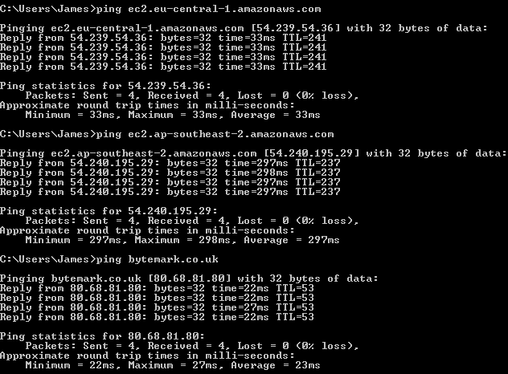

IPv4 addresses starting with 54 (the ones in the form `54.x.x.x` ) are a clue that the server may be running on an AWS **Elastic Compute Cloud** (**EC2** ) virtual server. Perform a reverse DNS lookup with `nslookup` or `ping` (covered later in this chapter) to confirm if this is the case. AWS provides IP address ranges at the following link:

[http://docs.aws.amazon.com/general/latest/gr/aws-ip-ranges.html](http://docs.aws.amazon.com/general/latest/gr/aws-ip-ranges.html)

# Tracert

Tracert(或类似 Unix 的操作系统上的 traceroute)是一种工具，顾名思义，它跟踪到目的主机的路由。输入以下命令:

```cs
    tracert www.google.com

```

你应该可以看到连接离开你的**互联网服务提供商** ( **ISP** )的网络，进入域`1e100.net`，这是谷歌的域。 *1.0 x 10 <sup>100</sup>* 是一个 **googol** ，和他们同名。下面的屏幕截图显示了您可能看到的该跟踪的输出:

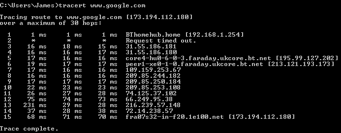

接下来，让我们通过运行下面的命令来跟踪到澳大利亚的路由，该命令与前面的示例具有相同的 AWS 主机名，如下所示:

```cs
    tracert ec2.ap-southeast-2.amazonaws.com

```

这可能需要一些时间来运行，特别是如果一些主机没有响应 pings，traceroute 必须超时。如果您看到星号(`* * *`)，那么这可能表示存在防火墙。

您的结果可能如下图所示:

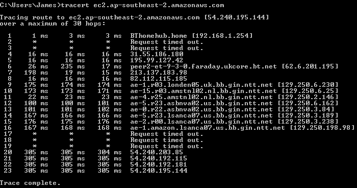

在上例中，我们可以看到连接离开**英国电信** ( **BT** )网络，进入**日本电报局和电信** ( **NTT** )全球 IP 网络。我们甚至可以看到从伦敦到悉尼，途经阿姆斯特丹、阿什伯恩(美国东部，弗吉尼亚州)和洛杉矶的路线。这些主机名表明，连接已经通过伦敦圣保罗大教堂附近的法拉第电话交换大楼(以电气先驱迈克尔·法拉第的名字命名)，并进入了亚马逊在洛杉矶的网络。

This isn't the whole story as it only shows the IP level. At the physical level, the fiber likely comes back to the UK from the Netherlands (possibly via Porthcurno, Goonhilly Satellite Earth Station, or more likely Bude, where GCHQ conveniently has a base). Between LA and Australia, there will also probably be a stopover in Hawaii (where the NSA base that Edward Snowden worked at is located). There are maps of the connections available at [http://submarinecablemap.com/](http://submarinecablemap.com/) and [http://www.us.ntt.net/about/network-map.cfm](http://www.us.ntt.net/about/network-map.cfm) . It's good idea to have at least a basic understanding of how the internet is physically structured, in order to achieve high performance.

如果我们现在追踪到韩国和日本的 AWS 数据中心的路线，我们可以看到，最初，它们都采用相同的路线。他们从伦敦到纽约，然后到西雅图，最后到达日本大阪。韩国的追踪接着又进行了 11 次跳跃，但是日本的追踪是在 6 次跳跃中完成的，这是合乎逻辑的。

下面的截图显示了首先追踪到韩国，然后追踪到日本的典型结果:

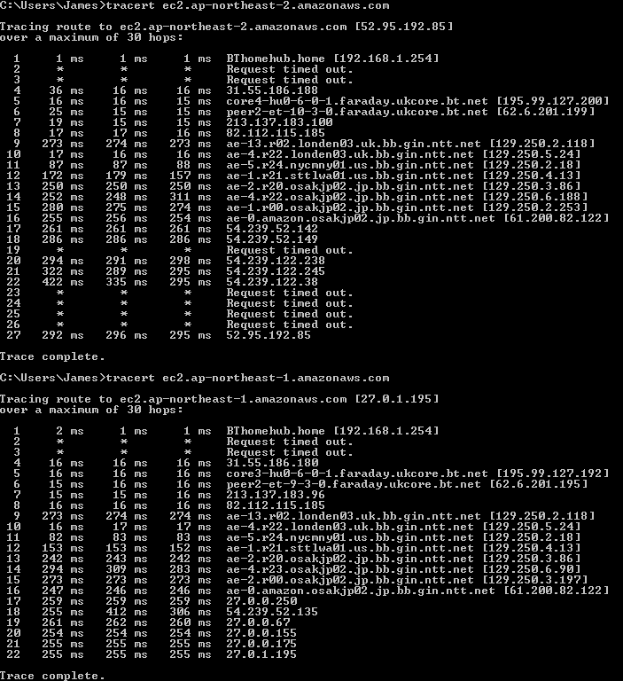

您可以利用跳跃之间的时间差来计算出大致的地理距离。但是，如果某些系统比其他系统响应更快，偶尔会出现异常。

If you're on a flight with free Wi-Fi, then a traceroute is an interesting exercise to perform. The internet connection is likely going via satellite, and you'll be able to tell the orbit altitude from the latency. For example, a geostationary orbit will have a large latency of around 1,000 ms, but a **Low Earth Orbit** (**LEO** ) will be much smaller. You should also be able to work out where the ground station is located.

# 网络管理命令行工具

**Nslookup** 是一个直接查询 DNS 服务器的工具。**挖**是另一个类似的工具，这里就不赘述了。`ping`和 traceroute 都执行了 DNS 查找，但是你可以直接用`nslookup`来做，这可能会非常有用。可以用命令行参数调用`nslookup`，但也可以交互使用。为此，只需在控制台或命令提示符下键入工具的名称，如下所示:

```cs
    nslookup

```

现在，您将从程序中获得略有不同的命令提示符。默认情况下，使用您所在计算机的域名服务器，这将绕过本地*主机文件*中的任何条目。

A hosts file can be very useful for testing changes prior to adding them to DNS. It can also be used as a crude blocker for adverts and trackers by setting their addresses to `0.0.0.0` . There are local DNS servers you can run to do this for your whole network. One such project is [http://pi-hole.net/](http://pi-hole.net/) , which is based on **dnsmasq** simplifies setting it up and updating the hosts on a **Raspberry Pi** .

输入服务器的主机名以解析其 IP 地址；例如，键入以下内容:

```cs
    polling.bbc.co.uk

```

结果显示，该主机名是`polling.bbc.co.uk.edgekey.net`的 CNAME(真实规范名的别名)，解析为`e3891.g.akamaiedge.net`，目前该主机名的 IP 地址为`23.67.87.132`。我们可以通过输入以下内容对该 IP 地址执行反向 DNS 查找:

```cs
    23.67.87.132

```

然后我们得到那台机器的主机名，方便地包含 IP 地址，也就是`a23-67-87-132.deploy.static.akamaitechnologies.com`。该域名归 Akamai 所有，Akamai 是一个用来分发负载的**内容分发网络** ( **CDN** )。

如果您在本地网络上使用 DNS 服务器，可能路由器运行的是 dnsmasq，那么它可能会缓存结果，并给你陈旧的数据。通过将服务器更改为更快传播更改的核心服务器，您可以看到更多最新信息。例如，要使用谷歌的公共域名系统服务器之一，请输入以下内容(但请注意，如果您正常使用，谷歌将记录您访问的所有互联网网站):

```cs
    server 8.8.8.8

```

然后再次运行相同的查询。请注意主机名现在如何解析为不同的 IP 地址。这是 cdn 的常见行为，记录会随着时间的推移而改变，即使在同一个 DNs 服务器上也是如此。它经常被用作一种平衡网络负载的技术。改变域名系统服务器有时也可以用来绕过幼稚的内容过滤器或位置限制。

要退出`nslookup`交互模式，输入`exit`并按*返回*。下面的屏幕截图显示了前面命令的输出:

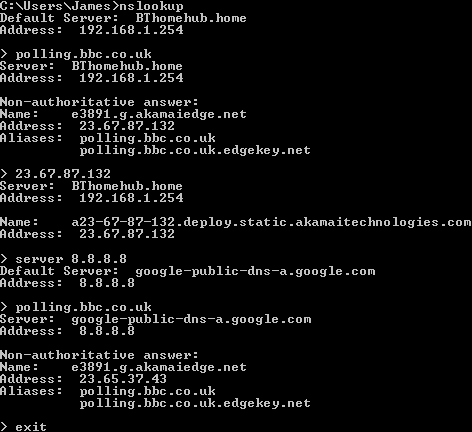

IPv4 is the version of IP that you will probably be most familiar with. It uses 32-bit addresses that are usually represented as four dotted decimal octets, such as `192.168.0.1` . However, we have run out of IPv4 addresses, and the world is (slowly) moving to the new version of IP, called **IPv6** . The address length has increased fourfold, to 128-bit, and is usually represented in hexadecimal such as `2001:0db8:0000:0000:0000:ee00:0032:154d` . Leading zeros can be omitted, such as `2001:db8::ee00:32:154d` , to make them easier to write. Localhost loopback (`127.0.0.1` ) is now simply `::1` in IPv6.

在 Windows 上，可以使用`ping -a x.x.x.x`进行反向 DNS 查找，将 IP 地址解析为主机名。在 Linux(以及其他类似 Unix 的系统，如 OS X)上，该功能不可用，并且`-a`标志有不同的用途。您必须在这些操作系统上使用`nslookup`或`dig`进行反向域名系统。

# 打造自己的

您可以使用 C#构建自己的工具(例如控制台应用)，并且您需要的功能由. NET 提供。底层实现是特定于平台的，但是框架将负责在您使用的操作系统上调用本机代码。

您通常不需要以编程方式解析主机名，因为大多数网络命令都会自动解析。但是，它偶尔会很有用，尤其是当您想要执行反向 DNS 查找并找到 IP 地址的主机名时。

The .NET `Dns` class differs from `nslookup` , as it includes entries from the local hosts file rather than just querying a DNS server. It is, therefore, more representative of the IP addresses that other processes are resolving.

要以编程方式执行 DNS 查找，请执行以下步骤:

1.  添加`System.Net`命名空间。

```cs
        using System.Net; 
```

2.  要将主机名解析为 IP 地址，请使用以下静态方法。这将返回一组 IP 地址，尽管通常只有一个。

```cs
        var results = await Dns.GetHostAddressesAsync(host);
```

3.  要将 IP 地址解析为主机名，请改用以下方法:

```cs
        var revDns = await Dns.GetHostEntryAsync(result); 
```

4.  如果成功，则主机名将作为`revDns.HostName`可用。

要以编程方式 ping 主机，请执行以下步骤:

1.  添加`System.Net.NetworkInformation`命名空间。

```cs
        using System.Net.NetworkInformation; 
```

2.  然后，您可以实例化一个新的`Ping`对象。

```cs
        var ping = new Ping(); 
```

3.  使用此对象，您现在可以使用以下方法 ping 一个 IP 地址或主机名(将在内部执行 DNS 查找):

```cs
        var result = await ping.SendPingAsync(host); 
```

4.  您可以通过`result.Status`获得 ping 的状态，如果成功，则可以通过`result.RoundtripTime`获得毫秒级的 RTT。

The source code for our console application, illustrating how to use the .NET Core `Dns` and `Ping` classes, is available for download along with this book.

反向域名系统查找通常可以揭示网站使用的托管公司。通常，每个主机名只有一个 IP 地址，如下图所示.NET Core 控制台应用输出:

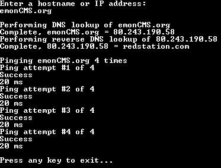

在前面的截图中，我们可以看到[https://emoncms.org/](https://emoncms.org/)正在使用[http://redstation.com/](http://redstation.com/)作为主机。低延迟表明服务器与我们的计算机位于同一个国家。

DNS 通常用于负载平衡。在这种情况下，您将看到为单个域名返回了许多 IP 地址，如下图所示:

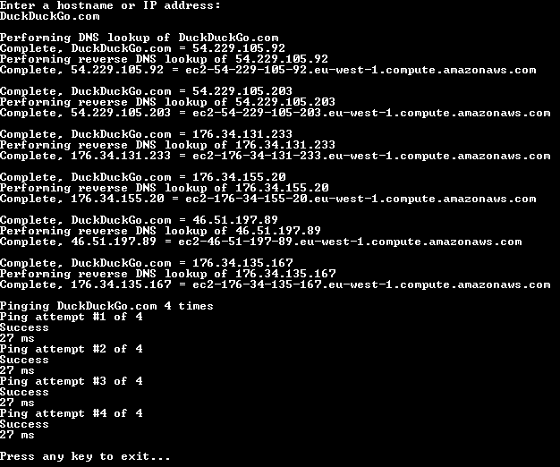

我们可以在前面的截图中看到，专注于隐私的搜索引擎**duckgo**(它不像谷歌那样跟踪用户)正在使用 AWS。DNS 被用来平衡各种实例的负载；在这种情况下，它们都在都柏林数据中心，因为那是最近的一个。请注意，在前面的示例中，ping 时间现在比英国主机略高。

很可能他们使用的是 AWS DNS 服务**路由 53** (之所以这样命名是因为 DNS 使用端口 53)。这可以平衡跨区域的负载，而 DuckDuckGo 似乎没有使用)只能在一个区域内平衡(但是在 AZs 内部和跨 AZs)。Azure 为 DNS 负载平衡提供了一个类似的服务，叫做**流量管理器**。

# 解决方法

现在，您对基于延迟的问题的原因以及如何分析它们有了更多的了解，我们可以演示一些潜在的解决方案。您使用前面说明的工具进行的测量将帮助您量化问题的规模，并选择要应用的适当修复。

# 批处理应用编程接口请求

呈现一个典型的网页可能需要调用许多不同的应用编程接口(或数据库表)来收集所需的数据。由于 C#(以及许多其他语言)鼓励的面向对象编程风格，这些 API 调用通常是串行执行的。然而，如果一个调用的结果不影响另一个，那么这是次优的，调用可以并行执行。我们将在本章后面介绍数据库表，因为有更好的方法。

如果您实现了一个**微服务**架构(与传统的整体或大球泥相反)，并且有许多不同的分布式端点，那么并发调用可能会更有针对性。在许多情况下，消息队列有时是比 HTTP APIs 更好的选择，也许使用发布和订阅模式。然而，也许你不负责 API，而是与第三方集成。事实上，如果应用编程接口是你的，那么无论如何你都可以修改它来提供你需要的所有数据。

考虑调用两个彼此没有依赖关系的独立 API 的例子。这方面的序列图可能如下所示:

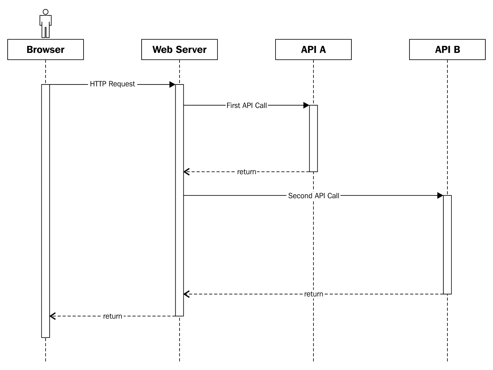

调用 **A** ，然后在完成 **A** 时调用 **B** 的这个线性过程很简单，因为它不需要复杂的编排来争论 API 调用的结果，但是它比必要的要慢。通过同步和顺序调用两个 API，我们浪费时间等待它们返回。如果我们不要求第一个应用编程接口向第二个应用编程接口请求结果，那么更好的方法可能是异步调用它们。

这个新流程的序列图可能如下所示:

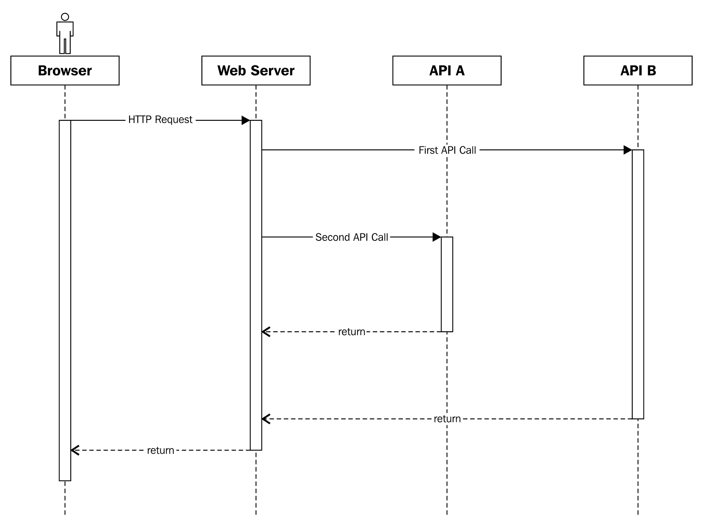

这个新序列有两个变化，一个明显，另一个微妙。我们异步和并行调用两个 API，以便它们同时运行。第一个变化将产生最大的影响，但还有一个更小的调整也有帮助，那就是首先调用最慢的应用编程接口。

在原序列图中，我们先调用 **API** **A** ，再调用 **API** **B** ，但是 **B** 比较慢。同时调用 **A** 和 **B** 影响会比较大，但是调用 **B** 然后 **A** 稍微好一点。 **B** 主宰着时间线，我们会消磨掉(相对)大量的时间等待它。

我们可以利用这段停机时间来调用 **A** ，因为任何 API 方法调用都会有一些小的固定开销。这两个变化加在一起，意味着我们现在只等 **B** ，从时间上来说，实际上是免费接到了 **A** 的电话。

我们可以用一个简单的控制台应用来说明这个原理。模拟 API 的方法有两种，两种都很相似。 **API A** 有以下代码:

```cs
private static async Task CallApiA() 
{ 
    Thread.Sleep(10); 
    await Task.Delay(100); 
} 
```

`Thread.Sleep`模拟固定开销，`Task.Delay`模拟等待 API 调用返回。 **API B** 的返回时间是 **API A** 的两倍，但是固定开销是一样的，它有以下代码:

```cs
private static async Task CallApiB() 
{ 
    Thread.Sleep(10); 
    await Task.Delay(200); 
} 
```

现在，如果我们按顺序同步调用这些方法，我们会发现所有的延迟都像预期的那样增加了。

```cs
CallApiA().Wait(); 
CallApiB().Wait(); 
```

这些操作平均总共花费大约`332 ms`，因为在方法调用中有大约 10 ms 的额外固有开销。如果我们同时调用这两种方法，时间会大大减少。

```cs
Task.WaitAll(CallApiA(), CallApiB()); 
```

现在手术平均总共需要`233 ms`。这很好，但是如果我们交换方法的顺序，我们可以做得更好。

```cs
Task.WaitAll(CallApiB(), CallApiA()); 
```

这现在平均总共需要`218 ms`，因为我们已经把 **API A** 的固定开销吞进了我们等待 **API B** 的时间里。

The full console application that benchmarks these three variants is available for download with this book. It uses the `Stopwatch` class to time the operations, and averages the results over many runs.

这三种不同方法的结果如下图所示:


一如既往，衡量你的结果，以确保确实有所改善。您可能会发现，如果您对一个应用编程接口进行多次调用，或者重用同一个应用编程接口客户端，那么无论如何，您的请求都会按顺序处理。

任务的并行化不仅适用于输入/输出，还可以用于计算，我们将在下一章中发现这一点。现在，我们将继续深入研究数据库查询优化。

# 高效的数据库操作

虽然这不是一本针对**数据库管理员** ( **数据库管理员**)的书，但欣赏你正在使用的底层技术对你是有利的。与网络一样，如果您了解优势和劣势，那么您就可以更轻松地实现高性能。

这也与开发人员在专业领域之外做更多工作的趋势有关，尤其是在小型组织或初创公司。你可能听过相关的流行语**全栈**开发者或者 **DevOps** 。这些类似的概念指的是模糊传统技术界限的角色，并将开发(前端和后端)、质量保证、网络、基础设施、运营和数据库管理合并为一项工作。如今，成为一名开发人员不再仅仅是编程或发布代码。了解其他领域也有帮助。

之前在[第 5 章](05.html)*修复常见性能问题*中，我们讲述了使用微 O/RM Dapper，以及如何修复*选择 N+1* 的问题。现在，我们将在这些知识的基础上，重点介绍您可以整合查询和提高数据库操作性能的其他几种方法。

如[第 4 章](04.html)、*测量性能瓶颈*所述，第一步是分析您的应用并发现问题所在。只有到那时，您才应该继续将解决方案应用到问题区域。

# 数据库优化

我们将更多地关注于改进性能不佳的查询，因此我们不会过多地讨论数据库调优。这是一个复杂的话题，关于索引和数据的存储方式，你可以学到很多东西。

但是，如果您还没有运行**数据库引擎优化顾问** ( **DETA** )，那么如果您有任何缺失的索引，这是一个很容易识别的步骤。然而，当应用推荐的更改时，您应该小心，因为总有不利的方面和权衡要考虑。例如，索引使检索数据更快，但也使添加和更新记录更慢。它们还会占用额外的空间，所以最好不要过度。您是希望在前期进行优化，还是在后期进行检索，将取决于您特定的业务用例。

第一步是使用 SQL Server Profiler 捕获跟踪并保存结果文件。如何做到这一点，请参见[第 4 章](04.html)、*测量性能瓶颈*。调优配置文件是捕获跟踪的好选择，为了获得好的结果，您应该确保您捕获的是真实数据库使用的代表。您可以从与 SSMS 的 SQL Server Profiler 相同的菜单中启动 DETA，如下图所示:

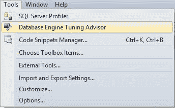

然后，您可以将跟踪作为工作负载加载，在处理之后，它会给您一些建议。出于篇幅的原因，我们在这里不涉及如何做到这一点的细节，它是非常不言自明的。如果需要，网上有很多好的指南。如果在 SSMS 运行查询时启用实际的查询计划，还可以看到建议的缺失索引。

# 报告

一个常见的用例是报告，它经常会使数据库崩溃。报告通常运行在大量数据上，如果写得不好，可能会花费相当长的时间。

如果您已经有了一种从数据库中检索单个项目的方法，那么为了报告的目的和计算应用中的度量，很容易重复使用这个方法。但是，最好避免这种情况，报告通常应该有自己的专用查询。

更好的方法是使用另一个数据库，专门用于报告，该数据库由主数据库或备份填充。这样，密集的报告不会以不包括实时数据为代价影响主应用的性能。这有时被称为**数据仓库**或**数据集市**，出于简单性或性能原因，数据偶尔会被反规格化。填充另一个数据库也是测试备份的一种方便方法，因为应该始终测试数据库备份，以确保它们可以正确恢复，并且包含所有必需的数据。

In the ensuing examples, we will focus on **Microsoft SQL Server** (**MS SQL** ) and the **Transact-SQL** (**T-SQL** ) dialect of SQL. Other databases, such as PostgreSQL, are available as well. PostgreSQL has its own dialect called **Procedural Language / PostgreSQL** (**PL/pgSQL** ), which is similar to **Oracle PL/SQL** . These dialects all support basic SQL commands, but use different syntax for some operations, and contain different or additional features. The latest version of MS SQL Server, SQL Server 2017, supports running on Linux and in Docker containers, in addition to running on Windows.

# 总计

聚合函数是关系数据库管理系统的一个非常有用的特性。您可以计算汇总数据库中许多记录的值，并且只返回结果，将源数据行保留在数据库中。

如果不是以前的话，你会熟悉本书前面的`COUNT`聚合函数。这给出了查询返回的记录总数，但没有返回它们。您可能已经读到过`COUNT(1)`的性能比`COUNT(*)`更好，但现在已经不是这样了，因为 SQL Server 现在对后者进行了优化，使其性能与前者相同。

By default, SQL Server will return a message detailing the count of the records returned, along with the result of every query. You can turn this off by prefixing your query with the `SET NOCOUNT ON` command, which will save a few bytes in the **Tabular Data Stream** (**TDS** ) connection, and increase performance slightly. This is significant only if a **cursor** is being used, which is bad practice anyway for locking reasons. It's good practice to re-enable row count after the query, even though it will be reset outside the local scope anyway.

在[第 5 章](05.html)、*修复常见性能问题*中，我们通过连接数据库中的表并使用`COUNT`而不是在应用代码中执行这些计算来解决我们的*选择 N+1* 问题。还有许多其他可用的聚合函数可用于提高性能，尤其是用于报告目的。

回到我们前面的例子，假设我们现在想要找出博客文章的总数。我们还希望找到评论总数、平均评论数、单个帖子的最低评论数和单个帖子的最高评论数。

第一部分很容易，只需将`COUNT`应用于帖子而不是评论，但第二部分更难。由于我们已经有了每个帖子都有评论数的帖子列表，所以重用它并简单地用 C#代码解决所有问题可能很有诱惑力。

这将是一个坏主意，而且查询的性能会很差，尤其是在帖子数量很多的情况下。更好的解决方案是使用如下查询:

```cs
;WITH PostCommentCount AS( 
SELECT  
    bp.BlogPostId, 
    COUNT(bpc.BlogPostCommentId) 'CommentCount' 
FROM BlogPost bp 
LEFT JOIN BlogPostComment bpc 
    ON bpc.BlogPostId = bp.BlogPostId 
GROUP BY bp.BlogPostId 
) SELECT  
    COUNT(BlogPostId) 'TotalPosts', 
    SUM(CommentCount) 'TotalComments', 
    AVG(CommentCount) 'AverageComments', 
    MIN(CommentCount) 'MinimumComments', 
    MAX(CommentCount) 'MaximumComments' 
FROM PostCommentCount 
```

该查询使用一个**通用表表达式** ( **CTE** )，但是您也可以使用一个嵌套的`SELECT`将第一个查询嵌入到第二个查询的`FROM`子句中。它说明了可用的聚合函数的选择，并且之前测试数据库的结果如下所示:


The semicolon at the start is simply a good practice to avoid errors and remove ambiguity. It ensures that any previous command has been terminated, as `WITH` can be used in other contexts. It isn't required for the preceding example, but might be if it were part of a larger query. CTEs can be very useful tools, especially if you require recursion. However, they are evaluated every time, so you may find that temporary tables perform much better for you, especially if querying one repeatedly in a nested `SELECT` .

现在假设我们希望执行相同的查询，但是只包括至少有一个注释的帖子。在这种情况下，我们可以使用如下查询:

```cs
;WITH PostCommentCount AS( 
SELECT  
    bp.BlogPostId, 
    COUNT(bpc.BlogPostCommentId) 'CommentCount' 
FROM BlogPost bp 
LEFT JOIN BlogPostComment bpc 
    ON bpc.BlogPostId = bp.BlogPostId 
GROUP BY bp.BlogPostId 
HAVING COUNT(bpc.BlogPostCommentId) > 0 
) SELECT  
    COUNT(BlogPostId) 'TotalPosts', 
    SUM(CommentCount) 'TotalComments', 
    AVG(CommentCount) 'AverageComments', 
    MIN(CommentCount) 'MinimumComments', 
    MAX(CommentCount) 'MaximumComments' 
FROM PostCommentCount 
```

我们增加了`HAVING`条款，确保我们只统计评论超过零的帖子。这类似于`WHERE`子句，但与`GROUP BY`一起使用。查询结果现在看起来如下所示:


# 抽样

有时，您不需要使用所有的数据，并且可以对其进行采样。这种技术特别适用于您可能希望绘制的任何时间序列信息。在 SQL Server 中，执行随机采样的传统方法是使用`NEWID()`方法，但这可能会很慢。例如，考虑以下查询:

```cs
SELECT TOP 1 PERCENT * 
FROM [dbo].[TrainStatus] 
ORDER BY NEWID() 
```

该查询返回 1%的随机分布的行。当对包含 1，205，855 个条目的表运行时，它在大约 4 秒钟内返回 12，059 个结果，这很慢。更好的方法可能是使用`TABLESAMPLE`，它可以在任何合理的最新版本的 SQL Server (2005 年以后)中使用，如下所示:

```cs
SELECT * 
FROM [dbo].[TrainStatus] 
TABLESAMPLE (1 PERCENT) 
```

前面的这个查询要快得多，当对与前面示例相同的数据运行时，它几乎立即完成。缺点是它比早期的方法更粗糙，它不会返回 1%的结果。它将返回大约 1%，但每次运行时该值都会改变。例如，对同一个测试数据库运行时，当连续三次执行查询时，它返回了 11，504、13，441 和 11，427 行。

# 插入数据

查询数据库可能是最常见的用例，但是您通常需要首先将一些数据放入其中。将记录插入关系数据库时最常用的功能之一是标识列。这是一个由数据库生成的自动递增的标识，在添加数据时不需要提供。

例如，在我们之前的`BlogPost`表中，`BlogPostId`列被创建为`INTIDENTITY(1,1)`。这意味着它是一个整数值，从 1 开始，每增加一行就增加 1。你`INSERT`进入这个表格，没有指定`BlogPostId`，就这样:

```cs
INSERT INTO BlogPost (Title, Content) 
VALUES ('My Awesome Post', 'Write something witty here...') 
```

身份可能非常有用，但是您通常想要知道新创建的记录的 ID。通常希望存储一行，然后立即检索它，以便该 ID 可以用于未来的编辑操作。你可以像这样用`OUTPUT`子句一次性完成；

```cs
INSERT INTO BlogPost (Title, Content) 
OUTPUT INSERTED.BlogPostId 
VALUES ('My Awesome Post', 'Write something witty here...') 
```

除了插入行，还将返回标识。

You may see `SCOPE_IDENTITY()` (or even `@@IDENTITY` ) advocated as a way of retrieving the identity, but these are outdated. The recommended way of doing this, on modern versions of SQL Server, is to use `OUTPUT` .

`OUTPUT`工作在`INSERT`、`UPDATE`、`DELETE,`和`MERGE`命令上。它甚至可以在一次操作多行时工作，就像在这个大容量插入两个博客文章的例子中一样:

```cs
INSERT INTO BlogPost (Title, Content) 
OUTPUT INSERTED.BlogPostId 
VALUES ('My Awesome Post', 'Write something witty here...'), 
       ('My Second Awesome Post', 'Try harder this time...') 
```

前面的查询将返回两个身份的结果集，例如 3003 和 3004。为了使用 Dapper 执行这些插入，可以对单个记录使用以下方法。首先，让我们创建一个博客文章对象，我们将在这里硬编码，但通常来自用户输入:

```cs
var post = new BlogPost 
{ 
    Title = "My Awesome Post", 
    Content = "Write something witty here..." 
}; 
```

要插入这篇文章，并设置 ID，您可以使用以下代码。这将执行`INSERT`语句，并返回一个整数值。

```cs
post.BlogPostId = await connection.ExecuteScalarAsync<int>(@" 
    INSERT INTO BlogPost (Title, Content) 
    OUTPUT INSERTED.BlogPostId 
    VALUES (@Title, @Content)", 
    post); 
```

然后，您可以将返回的标识分配给帖子，并将该对象返回给用户进行编辑。假设插入成功并且没有抛出异常，则不需要再次选择记录。

通过使用 execute 方法，可以用同一个 SQL 一次插入多条记录。但是，该 SQL 将被执行多次，这可能会导致效率低下，并且您只能获得插入的行数，而不是它们的标识。下面的代码为上一个示例中使用的同一 SQL 提供了一个帖子数组:

```cs
var numberOfRows = await connection.ExecuteAsync(@" 
    INSERT INTO BlogPost (Title, Content) 
    OUTPUT INSERTED.BlogPostId 
    VALUES (@Title, @Content)", 
    new[] { post, post, post }); 
```

如果您想要返回多个标识，那么您将需要使用查询方法来返回一组值，就像我们之前所做的那样。但是，如果不动态构建 SQL，很难使这种方法适用于可变数量的记录。下面的代码执行大容量插入，对查询使用多个单独的参数:

```cs
var ids = await connection.QueryAsync<int>(@" 
    INSERT INTO BlogPost (Title, Content) 
    OUTPUT INSERTED.BlogPostId 
    VALUES (@Title1, @Content1), 
           (@Title2, @Content2)", new 
    { 
        Title1 = post.Title, 
        Content1 = post.Content, 
        Title2 = post.Title, 
        Content2 = post.Content 
    }); 
```

这将在一个命令中执行所有工作，并返回标识的可枚举集合。但是，这段代码的可伸缩性不是很好(甚至不够优雅)，您最多只能以这种方式插入 1，000 条记录。

There are many helper methods in the `Dapper.Contrib` package that can assist you with inserting records and other operations. However, they suffer from the same limitations as the examples here, and you can only return a single identity or the number of rows inserted.

# 向导

整数标识在内部对数据库很有用，但是也许您不应该在外部使用标识密钥，尤其是当您有多个 web 服务器或者向用户公开标识时。另一种方法是使用**全球唯一标识符** ( **GUID** ，在 SQL Server 中称为`UNIQUEIDENTIFIER`。我们已经谈到了这些，因为它们是由次优采样示例中使用的`NEWID()`函数生成的。

GUIDs 被广泛使用，长度为 16 字节，是整数的四倍。GUID 的大小意味着在向已经填充的表中插入随机 GUID 时，不太可能得到**唯一约束**冲突。

People sometimes worry about GUID collisions, but the numbers involved are so staggeringly huge that collisions are incredibly unlikely. The GUIDs generated by .NET (using a `COM` function on Windows) are, specifically, **Universally Unique Identifiers** (**UUIDs** ) version 4\. These have 122 bits of randomness, so you would need to generate nearly three quintillion GUIDs before having even half a chance of a collision. At one new record per second, that would take over 90 billion years. Even at two million GUIDs per second (what an average computer today could produce), it would still take over 45 thousand years (more time than human civilization has been around). If you think that this will be an issue for your software, then you should probably be future-proofing it by using five-digit years, such as 02017, to avoid the *Y10K* (or *YAK* in hexadecimal) problem.

这个唯一性属性允许您在应用代码中生成一个 GUID，并将其存储在分布式数据库中，而无需担心以后合并数据。它还允许您向用户公开标识，而不用担心有人会枚举它们或试图猜测一个值。整数标识通常公开一个表中有多少条记录，根据您的用例，这些记录可能是敏感信息。

随机 GUIDs 需要注意的一点是将它们用作密钥，而不是 id。这两个术语之间的区别是微妙的，它们经常是同一个。关键字(**主**或**聚集**)是数据库用来寻址记录的，而标识是用来检索记录的。这些可以是相同的值，但不一定是。使用随机 GUID 作为密钥可能会导致索引性能问题。随机性可能会导致碎片，这将降低查询速度。

你可以使用连续的 guid，例如`NEWSEQUENTIALID()`可以是一列的`DEFAULT`值，但是这样你就失去了 guid 的大部分好处，这些好处主要来自于随机性。你现在实际上只有一个很大的整数，如果你只关心一个表中的最大行数，并且需要超过 20 亿，那么一个`big int`(两次一个`int,`但是半个 GUID)就足够了。

一个很好的折衷方案是将`int`标识作为主键，但使用 GUID 作为 ID(并通过对列的唯一约束来实现这一点)。最好使用`Guid.NewGuid()`在应用代码中生成 GUID，因为使用数据库中的默认列值意味着您必须在插入后检索标识，如前所示。

使用这种策略的表格可能部分类似于下面的截图。这是来自**成员预引导**用户管理和身份验证库的部分表格的屏幕截图:

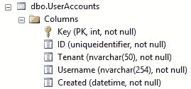

# 高级数据库主题

我们可以在这里介绍许多其他数据库性能增强技术，但是没有空间。我们将简要提及一些额外的主题，以防您想进一步了解它们。访问作者在[https://unop.uk/](https://unop.uk/)的网站，了解更多关于其他主题的信息。

保存数据时的一个常见要求是，如果记录尚不存在，则插入该记录，或者如果已经有一行包含该标识，则更新现有记录。这有时被称为**追加**，这是一个结合了更新和插入的复合词。

您可以使用`MERGE`命令在一次操作中完成此操作，而不必担心在`UPDATE`或`INSERT`之间进行选择(包装在**存储过程**内的事务中)。但是`MERGE`的表现不如 `UPDATE` 或者`INSERT`，所以一定要针对你的用例测试效果，谨慎使用。

存储过程、事务和**锁定**本身都是大主题。理解它们很重要，不仅仅是从性能的角度。

我们不能把所有这些都放在这里，但是我们将在本书的后面讨论维护存储过程。

您可以研究的其他一些技术是**跨数据库连接**，它可以让您避免查询多个数据库。还有**反规格化**数据的做法，这涉及提前展平关系记录以提供单个行，而不是为了一个查询需要连接多个表。我们在前面的数据仓库中简要提到了这一点。

You can find lots of useful SQL documentation and information on MSDN ([http://msdn.microsoft.com/](http://msdn.microsoft.com/) ) and TechNet ([http://technet.microsoft.com/](http://technet.microsoft.com/) ). Additionally, there are many good books on advanced SQL techniques.

最后，关于家政的一个注意事项。有一个管理数据库大小的计划很重要。不能简单地一直往表中插入数据，希望它永远继续表现良好。在某个时候，它会变得如此之大，以至于即使从其中删除记录也会导致您的数据库崩溃(即使您使用`TRUNCATE`，这比简单的`DELETE`性能更好)。您应该提前知道如何删除或归档行，最好定期小批量地这样做。

# 模拟和测试

为了总结这一章，让我们重申能够在现实的基础设施上测试您的应用的重要性。您的测试环境应该尽可能像真实的一样。如果您没有在同等的数据库和网络上进行测试，那么您可能会在部署时得到一个令人讨厌的惊喜。

当使用云托管提供商时(如果你自动化你的服务器构建)，那么这很容易。您可以简单地启动一个与生产相匹配的分段系统。只要所有部件都在同一位置，就不必将它设置为完全相同的规模。为了进一步降低成本，您只需要在测试期间保持它。

或者，您可以创建一个新的实时环境，部署并测试它，然后切换，并销毁或重用旧的实时环境。这种交换技术被称为**蓝绿色部署**。另一个选择是在**功能开关**后面部署新代码，这允许您在运行时切换该功能，并且仅适用于某些用户。这不仅允许您在功能上与测试用户一起验证特性，您还可以逐步推出新特性，并在这样做时监控性能影响。我们在[第 11 章](11.html)、*监控性能回归*中介绍了这两种技术。

# 摘要

这一章我们已经讲了很多，希望大家清楚，成为一名高性能开发人员需要的不仅仅是一名有能力的程序员。在你的代码中有许多外部因素需要考虑。

现在，您已经了解了输入/输出的基础知识，以及存在的内在限制的物理原因。您可以分析和诊断网络在逻辑上是如何结合在一起的。我们已经介绍了如何更好地利用网络来降低总体延迟，这一点很重要，因为现在网络上发生了更多的输入/输出操作。您还看到了如何更好地利用数据库，以及如何用更少的操作做更多的事情。

在下一章中，我们将详细挖掘代码执行，并向您展示如何加快您的 C#速度。我们拭目以待.NET Core 和 ASP.NET Core 的性能比以前的版本好得多，以及如何利用这些改进。