# 六、探索 Blazor Web 框架

在上一章中，我们了解了 Blazor 的全部内容，也了解了该框架提供的不同托管模型。我们开始使用 ASP.NET Core web API、EF Core 和 Signal 构建后端应用。在本章中，我们将构建其余部分以完成我们的目标。

以下是本章将涉及的主要主题列表：

*   学习服务器端和客户端 Blazor
*   学习如何创建 Razor 组件
*   学习路由、状态管理和数据绑定的基础知识
*   学习如何与后端应用交互以使用和传递数据
*   使用两个 Blazor 托管模型构建旅游景点应用

在本章结束时，您将学习如何构建一个旅游景点应用，借助实践示例结合各种技术学习 Blazor。

技术要求

本章是上一章的后续内容，因此在深入本章之前，请确保您已经阅读了[*第 5 章*](05.html#_idTextAnchor118)、*Blazor 入门*，并了解构建示例应用的目标。还建议查看[*第 4 章*](04.html#_idTextAnchor089)*Razor 视图引擎*，因为 Blazor 使用相同的标记引擎生成页面。虽然不是强制性的，但 HTML 和 CSS 的基本知识将有助于帮助您轻松理解页面的构造方式。

您可以在[查看本章的源代码 https://github.com/PacktPublishing/ASP.NET-Core-5-for-Beginners/tree/master/Chapter%2005%20and%2006/Chapter_05_and_06_Blazor_Examples/TouristSpot](https://github.com/PacktPublishing/ASP.NET-Core-5-for-Beginners/tree/master/Chapter%2005%20and%2006/Chapter_05_and_06_Blazor_Examples/TouristSpot) 。

请访问以下链接查看 CiA 视频：[http://bit.ly/3qDiqYY](http://bit.ly/3qDiqYY)

# 创建 Blazor 服务器项目

在本项目中，我们将构建前端 web 应用，用于显示来自 web API 的数据。

让我们继续并在现有项目解决方案中添加一个新的**Blazor 服务器**项目。在 Visual Studio 菜单中，选择**文件****新建****项目**。或者，也可以右键单击解决方案以添加新项目。在**新建项目**对话框字段中，选择**Blazor App**，如下图所示：

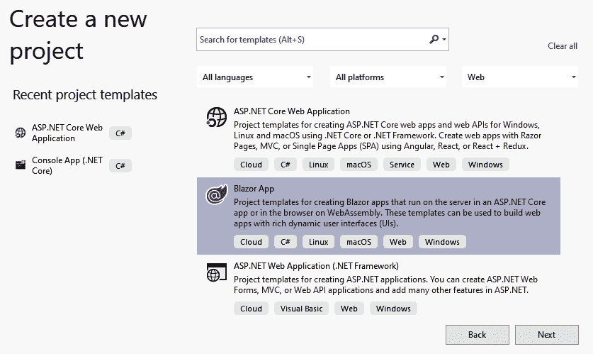

图 6.1–创建新 Blazor 应用项目

点击**下一步**。在下一个屏幕中，您可以配置项目的名称和位置路径。在本例中，我们仅将项目命名为`BlazorServer.Web`。点击**创建**按钮，您将出现以下对话框：

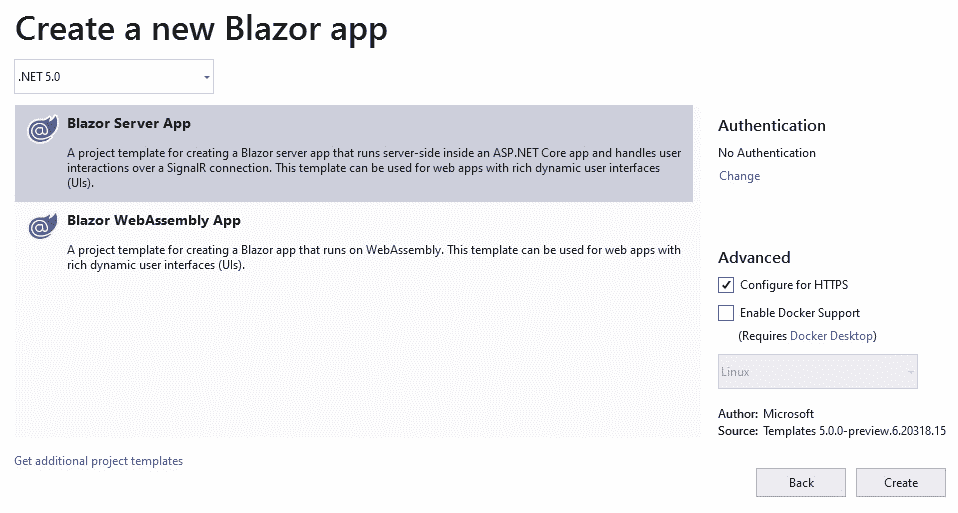

图 6.2–创建新 Blazor 服务器应用项目

选择**Blazor 服务器 App**模板，保留默认配置不变，然后点击**创建**。Visual Studio 应构建构建 Blazor 服务器应用所需的必要文件，如以下屏幕截图所示：

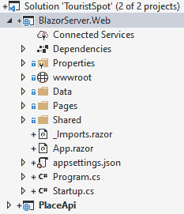

图 6.3–Blazor 服务器应用默认项目结构

如果您阅读过[*第 4 章*](04.html#_idTextAnchor089)*Razor 视图引擎*，您会注意到 Blazor 服务器项目的结构与 Razor 页面非常相似，除了以下几点：

*   它使用`.razor`文件扩展名而不是`.cshtml`，原因是 Blazor 应用主要基于组件。`.razor`文件是**Razor 组件**，通过可以使用 HTML 和 C#构建 UI。这与在`.cshtml`文件中构建 UI 基本相同。在 Blazor 中，组件本身就是页面，也可以是包含子组件的页面。Razor 组件也可以在 MVC 或 Razor 页面中使用，因为它们都使用相同的标记语言，称为**Razor 视图引擎**。
*   Blazor 应用包含一个`App.razor`组件。与任何其他 SPA web 框架一样，Blazor 使用一个主组件来加载应用 UI。`App.razor`组件作为应用的主组件，使您能够为组件配置路由。以下是`App.razor`文件的默认实现：

```cs
<Router AppAssembly=”@typeof(Program).Assembly”>
    <Found Context=”routeData”>
        <RouteView RouteData=”@routeData” DefaultLayout=”@typeof(MainLayout)” />
    </Found>
    <NotFound>
        <LayoutView Layout=”@typeof(MainLayout)”>
            <p>Sorry, there’s nothing at this address.</p>
        </LayoutView>
    </NotFound>
</Router>
```

前面的代码定义了`Router`组件，并配置了应用启动时在浏览器中呈现的默认布局。在这种情况下，默认布局将呈现`MainLayout.razor`组件。有关**Blazor 路由**的更多信息，请参考以下链接：[https://docs.microsoft.com/en-us/aspnet/core/blazor/fundamentals/routing](https://docs.microsoft.com/en-us/aspnet/core/blazor/fundamentals/routing) 。

Blazor 服务器项目还包含一个`Host.cshtml`文件，作为应用的主要入口点。在一个典型的基于客户端的 SPA 框架中，`_Host.cshtml`文件表示`Index.html`文件，其中主要的`App`组件正在被引用和引导。在这个文件中，您可以看到正在 HTML 文档的`<body>`部分中调用`App.razor`组件，如下代码块所示：

```cs
<body>
    <app>
        <component type=”typeof(App)”             render-mode=”ServerPrerendered” />
    </app>
    @*Removed other code for brevity*@
</body>
```

前面的代码以`ServerPrerendered`作为默认呈现模式呈现`App.razor`组件。此模式告诉框架首先以静态 HTML 呈现组件，然后在浏览器启动时引导应用。

## 创建模型

在这个项目中，我们要做的第一件事是创建一个类，该类将包含一些与我们期望的 web API 响应相匹配的属性。让我们继续在`Data`文件夹下创建一个名为`Place.cs`的新类。类定义应如下所示：

```cs
using System;
using System.ComponentModel.DataAnnotations;
namespace BlazorServer.Web.Data
{
    public class Place
    {
        public int Id { get; set; }
        [Required] public string Name { get; set; }
        [Required] public string Location { get; set; }
        [Required] public string About { get; set; }
        public int Reviews { get; set; }
        public string ImageData { get; set; }
        public DateTime LastUpdated { get; set; }
    }
}
```

正如您所观察到的，前面的代码与我们在 web API 项目中创建的`Place`类相同，只是我们使用**数据注释**用`[Required]`属性装饰了一些属性。我们将用 web API 的结果填充这些属性，并在 Blazor 组件中使用它来显示信息。所需属性确保更新表单时这些字段不会为空。我们将在本章后面看到如何做到这一点。

## 实现 web API 通信服务

现在我们已经准备好了`Model`，让我们实现一个服务，用于调用两个 web API 端点来获取和更新数据。首先，安装`Microsoft.AspNetCore.SignalR.Client`NuGet 软件包，以便 us 能够连接到`Hub`并监听事件。

安装 Signal 客户端包后，在`Data`文件夹下创建一个名为`PlaceService.cs`的新类，并复制以下代码：

```cs
public class PlaceService
{
    private readonly HttpClient _httpClient;
    private HubConnection _hubConnection;
    public PlaceService(HttpClient httpClient)
    {
        _httpClient = httpClient;
    }
    public string NewPlaceName { get; set; }
    public int NewPlaceId { get; set; }
    public event Action OnChange;
}
```

前面的代码为`HttpClient`和`HubConnection`定义了两个私有字段。稍后我们将使用这些字段来调用方法。`PlaceService`构造函数将`HttpClient`对象作为类的依赖项，并分配`_httpClient`字段。在运行时，`HttpClient`对象将由 DI 容器解析。

一旦应用从`Hub`接收到新添加的记录，`NewPlaceName`和`NewPlaceId`属性将被填充。`OnChange`事件是 C#中的一种特殊类型的委托，允许您在某个操作引发事件时订阅它。

现在我们来实现订阅`Hub`的`SignalR`配置。继续并在`PlaceService`类中附加以下代码：

```cs
public async Task InitializeSignalR()
{
    _hubConnection = new HubConnectionBuilder()
       .WithUrl($”{_httpClient.BaseAddress.AbsoluteUri}           PlaceApiHub”)
       .Build();
    _hubConnection.On<int, string>(“NotifyNewPlaceAdded”,         (placeId, placeName) =>
    {
        UpdateUIState(placeId, placeName);
    });
    await _hubConnection.StartAsync();
}
public void UpdateUIState(int placeId, string placeName)
{
    NewPlaceId = placeId;
    NewPlaceName = placeName;
    NotifyStateChanged();
}
private void NotifyStateChanged() => OnChange?.Invoke();
```

`InitializeSignalR()`方法负责通过设置`HubConnection.WithUrl()`方法创建与`Hub`的连接。我们使用了`_httpClient.BaseAddress.AbsoluteUri`的值来避免对 web API 端点的基本 URL 进行硬编码。稍后，当我们将`PlaceService`类注册到类型化的`HttpClient`实例时，我们将配置基本 URL。`WithUrl`参数的值实际上相当于`https://localhost:44332/PlaceApiHub`。如果您还记得的话，`/PlaceApiHub`URL 段就是我们在创建 API 项目之前配置的`Hub`路由。在下一行中，我们使用了`HubConnection`的`On`方法来收听`NotifyNewPlaceAdded`事件。当服务器向该事件广播数据时，会调用`UpdateUIState()`，设置`NewPlaceId`和`NewPlaceName`属性，然后最终调用`NotifyStateChanged()`方法触发`OnChange`事件。

接下来，让我们实现连接到 web API 端点的方法。附加以下代码：

```cs
public async Task<IEnumerable<Place>> GetPlacesAsync()
{
    var response = await _httpClient.GetAsync(“/api/places”);
    response.EnsureSuccessStatusCode();
    var json = await response.Content.ReadAsStringAsync();
    var jsonOption = new JsonSerializerOptions
    {
        PropertyNameCaseInsensitive = true
    };
    var data = JsonSerializer.        Deserialize<IEnumerable<Place>>(json, jsonOption);
    return data;
}
public async Task UpdatePlaceAsync(Place place)
{
    var response = await _httpClient.PutAsJsonAsync(        “/api/places”, place);
    response.EnsureSuccessStatusCode();
}
```

`GetPlacesAsync()`方法调用`/api/places`HTTP`GET`端点获取数据。请注意，在将结果反序列化到`Place`模型时，我们正在传递`JsonSerializerOptions`，并将`PropertyNameCaseInsensitive`设置为`true`。这是为了正确映射`Place`模型中的属性，因为来自 API 调用的默认 JSON 响应是驼峰大小写格式。如果不设置此选项，您将无法使用数据填充`Place`模型属性，因为格式为 Pascal 大小写。

`UpdatePlaceAsync()`方法非常简单。它将`Place`模型作为参数，然后调用 API 将更改保存到数据库中。如果 HTTP 响应不成功，`EnsureSuccessStatusCode()`方法调用将引发异常。

接下来，将以下条目添加到`appSettings.json`文件中：

```cs
“PlaceApiBaseUrl”: “https://localhost:44332”
```

在`appSettings.json`中定义公共配置值是一种很好的做法，可以避免在 C#代码中硬编码任何静态值。

注意：ASP.NET Core 项目模板将同时生成`appSettings.json`和`appSettings.Development.json`文件。如果要在不同的环境中部署应用，可以利用配置并针对每个环境创建特定的配置文件。对于本地开发，您可以将所有本地配置值放在`appSettings.Development.json`文件中，将常用配置放在`appSettings.json`文件中。在运行时，根据您的应用正在运行的环境，框架将自动用您在特定于环境的配置文件中配置的值覆盖您在`appSettings.json`文件中配置的任何值。有关更多信息，请参阅本章的*进一步阅读*部分。

这项工作的最后一步是在`IServiceCollection`中注册`PlaceService`。继续并将以下代码添加到`Startup`类的`ConfigureServices()`方法中：

```cs
services.AddHttpClient<PlaceService>(client =>
{
    client.BaseAddress = new Uri(Configuration[“PlaceApiBaseUrl”]);
});
```

前面的代码在 DI 容器中注册了一个类型化的`HttpClientFactory`实例。请注意，`BaseAddress`值是通过`Configuration`对象从`appSettings.json`中提取的。

## 实现应用状态

Blazor 应用由组件组成，为了在依赖组件中发生的更改之间进行有效通信，我们需要实现某种状态容器来跟踪更改。在**数据**文件夹下创建一个名为`AppState.cs`的新类，并复制以下代码：

```cs
public class AppState
{
    public Place Place { get; private set; }
    public event Action OnChange;
    public void SetAppState(Place place)
    {
        Place = place;
        NotifyStateChanged();
    }
    private void NotifyStateChanged() => OnChange?.Invoke();
}
```

前面的代码由属性、事件和方法组成。`Place`属性用于保存已修改的当前`Place`模型。`OnChange`事件用于在应用状态发生变化时触发某些逻辑。`SetAppState()`方法处理组件的当前状态。在这里，我们设置属性来跟踪更改，并调用`NotifyStateChanged()`方法来调用`OnChanged`事件。

下一步是将`AppState`类注册为服务，以便我们可以将其注入任何组件。继续并将以下代码添加到`Startup`类的`ConfigureServices()`方法中：

```cs
public void ConfigureServices(IServiceCollection services)
{
    services.AddScoped<AppState>();
    //removed other services for brevity
}
```

前面的代码将`AppState`类注册为 DI 容器中的作用域服务，因为我们希望为每个 web 请求创建此服务的实例。

现在，我们已经具备了构建 UI 所需的功能：一个用于消费数据的服务和一个用于跟踪组件状态的服务。现在，让我们进入下一步，开始为应用构建 UI。

## 创建 Razor 组件

我们将将页面实现拆分为组件。说到这里，我们现在将创建以下 Razor 组件：

*   `Main.razor`
*   `ViewTouristSpot.razor`
*   `EditTouristSpot.razor`

下图显示了我们将如何布局网页的图形表示：

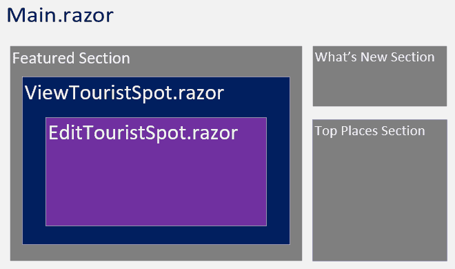

图 6.4–主要布局

`Main.razor`组件将包含三个主要部分，用于显示各种数据表示。这些部分只是组件中的`<div>`元素。在**特色部分**下，我们将把`ViewTouristSpot.razor`组件作为子组件呈现给`Main.razor`组件。`ViewTouristSpot.razor`将包含`EditTouristSpot.razor`作为子组件。

现在您已经了解了页面的外观，让我们开始构建所需的组件。

### 组成 EditTouristSpot 组件

让我们开始创建内部子组件。在**页面**文件夹下创建一个名为**Spots**的新文件夹。右键点击**放置**文件夹，然后选择**添加**|**Razor 组件**。应出现一个窗口对话框，供您命名组件。在本例中，只需将名称设置为`EditTouristSpot.razor`，然后单击**添加**。删除生成的代码，因为我们将用代码实现替换它。

Razor 组件通常分为三个主要部分：

*   第一部分用于声明调用方法和成员所需的类和服务引用。
*   第二部分是通过结合 HTML、CSS 和 C#，使用 Razor 语法构建实际的 UI。
*   第三部分用于处理`@code{}`块中包含的任何用户交互逻辑。

下面是一个典型组件组成的快速总结：

```cs
@*Routing, Namespace, Class and Service references goes here*@
@*HTML generation and UI construction goes here*@
@*UI logic and C# code block goes here*@
```

让我们开始集成第一部分。添加以下代码：

```cs
@using BlazorServer.Web.Data
@inject PlaceService _placeService
@inject AppState _appState
```

前面的代码使用`@using`和`@inject`Razor 指令引用 Blazor 组件中的服务器端类和服务。这使我们能够访问可用的成员和方法。对于这个特定的示例，声明`@using BlazorServer.Web.Data`引用允许我们访问在该名称空间中定义的`Place`类。`@inject`指令也是如此。当注入`AppState`和`PlaceService`服务时，它允许我们访问它们在标记中公开的所有方法。

现在，让我们整合第二部分。附加以下代码：

```cs
@if (IsReadOnlyMode)
{
    <ViewTouristSpot Place=”Place” />
}
else
{
    <EditForm Model=”@Place” OnValidSubmit=”HandleValidSubmit”>
        <div class=”card”>
            <div class=”card-body”>
                <DataAnnotationsValidator />
                <ValidationSummary />
                Name:
                <InputText class=”form-control” 
                           @bind-Value=”Place.Name” />
                Location:
                <InputText class=”form-control” 
                           @bind-Value=”Place.Location” />
                About:
                <InputTextArea class=”form-control” 
                           @bind-Value=”Place.About” />
                <br />
                <button type=”submit” class=”btn btn-outline-                    primary”>Save</button>
                <button type=”button” class=”btn btn-outline-                    primary” @onclick=”UndoChanges”>Cancel                 </button>
            </div>
        </div>
    </EditForm>
}
```

前面的代码称为**剃刀代码块**。Razor 代码块通常以`@`符号开头，并用大括号`{}`括起来。`if-else`语句根据`@code`部分中定义的`IsReadOnlyMode`布尔属性确定要在浏览器中呈现的 HTML 块。默认情况下，它被设置为`false`，因此`else`部分中的 HTML 块将被计算并显示编辑表单。否则，它将呈现`ViewTouristSpot.razor`组件，使显示器返回只读状态。

在只读状态下，我们将`Place`对象作为参数传递给`ViewTouristSpot`组件，这样它就可以在不重新调用 API 的情况下显示数据。请记住，`ViewTouristSpot`组件还不存在，我们将在下一节中创建它。在编辑状态下，我们使用了`EditForm`组件来利用的内置特性和表单验证。`EditForm`组件采用待验证的模型。在本例中，我们将`Place`对象作为模型传递，并将`HandleValidSubmit()`方法连接到`OnValidSubmit`事件处理程序。我们还使用了各种内置组件，如`DataAnnotationsValidator`、`ValidationSummary`、`InputText`和`InputTextArea`来处理输入验证和模型属性绑定。在本例中，我们使用*双向数据绑定*将`Place`属性绑定到使用`@bind-Value`属性的输入元素。当点击`type=”submit”`的 HTML`<input>`时，`EditForm`组件将在浏览器中呈现为 HTML`<form>`元素，并提交所有表单值。当点击`Save`按钮时，触发`DataAnnotationsValidator`组件并检查所有验证是否通过。如果您还记得，在本章的*创建模型*部分，我们只验证了需要的`Name`、`Location`和`About`属性，如果这些属性中的任何一个为空，则不会触发`HandleValidSubmit()`方法。

表单使用 Boostrap 4 CSS 类来定义组件的外观。**引导**是创建任何 ASP.NET Core web 框架时默认模板的部分，您可以看到 CSS 文件位于`wwwroot/css/bootstrap`文件夹下。

现在，让我们集成这个组件的最后一部分。附加以下代码：

```cs
@code {
    [Parameter] public Place Place { get; set; }
    private Place PlaceCopy { get; set; }
    bool IsReadOnlyMode { get; set; } = false;
}
```

前面的代码称为**C#代码块**。`@code`指令是`.razor`文件所独有的，允许您向组件添加 C#方法、属性和字段。您可以将代码块视为 Razor Pages 中的代码隐藏文件（`cshtml.cs`）或 MVC 中的`Controller`类，您可以在其中基于 UI 交互实现 C#代码逻辑。

`Place`属性由`[Parameter]`属性修饰，该属性带有`public`访问修饰符，以允许父组件为此属性设置值。`PlaceCopy`属性是一个 holder 属性，包含从父组件传递的原始值。在这种情况下，父组件为`ViewTouristSpot.razor`。`IsReadOnlyMode`属性是一个布尔标志，用于确定要呈现的 HTML 块。

让我们继续实现该组件所需的方法。在`@code{}`块中追加以下代码：

```cs
protected override void OnInitialized()
{
    PlaceCopy = new Place
    {
        Id = Place.Id,
        Name = Place.Name,
        Location = Place.Location,
        About = Place.About,
        Reviews = Place.Reviews,
        ImageData = Place.ImageData,
        LastUpdated = Place.LastUpdated
    };
}
```

`OnInitialized()`方法是 Blazor 框架的一部分，它允许我们重写它来执行某些操作。此方法在组件初始化期间触发，是配置对象初始化和分配的理想场所。您会注意到，这是我们将原始`Place`模型中的属性值分配给名为`PlaceCopy`的新`Place`对象的地方。我们保持`Place`对象的原始状态的主要原因是我们想在取消编辑时将数据重置为其默认状态。我们可以将取消操作的`IsReadOnlyMode`标志设置为`true`。但是，在切换回只读状态时，仅此操作不会将值重置为原始状态。原因是我们在`Place`模型中使用了双向数据绑定，对表单所做的任何属性更改都将保留。

双向数据绑定的过程如下所示：

*   当`Place`模型中的属性从服务器更新时，UI 中的输入元素会自动反映更改。
*   当 UI 元素更新时，更改也会传播回`Place`模型。

如果您不想保持`Place`模型的原始状态，可以注入`NavigationManager`类，然后使用以下代码简单地重定向到`Main.razor`组件：

```cs
NavigationManager.NavigateTo(“/main”, true);
```

前面的代码是切换到只读状态的最快、最简单的方法。但是，这样做会导致页面重新加载并再次调用 API 以获取数据，这可能会很昂贵。

让我们继续并在`@code{}`块中附加以下代码：

```cs
private void NotifyStateChange(Place place)
{
    _appState.SetAppState(place);
}
```

`NotifyStateChange()`方法将`Place`模型作为参数。这就是我们调用`AppState`的`SetAppState()`方法来通知变更的主要组件的地方。这样，当我们修改表单或执行更新时，主组件可以执行某些操作来对其进行操作；例如，刷新数据或更新主组件中的某些 UI。

接下来，在`@code{}`块中追加以下代码：

```cs
protected async Task HandleValidSubmit()
{
    await _placeService.UpdatePlaceAsync(Place);
    IsReadOnlyMode = true;
    NotifyStateChange(Place);
}
```

点击`Save`按钮，在没有发生模型验证错误时，会触发前面代码中的`HandleValidSubmit()`方法。此方法调用`PlaceService`的`UpdatePlaceAsync()`方法，并调用 API 更新`Place`记录。

最后，在`@code{}`块中追加以下代码：

```cs
private void UndoChanges()
{
    IsReadOnlyMode = true;
    if (Place.Name.Trim() != PlaceCopy.Name.Trim() ||
    Place.Location.Trim() != PlaceCopy.Location.Trim() ||
    Place.About.Trim() != PlaceCopy.About.Trim())
    {
        Place = PlaceCopy;
        NotifyStateChange(PlaceCopy);
    }
}
```

点击`Cancel`按钮会触发前面代码中的`UndoChanges()`方法。这就是我们在修改任何`Place`属性后返回`PlaceCopy`对象的值的地方。

让我们转到下一步，创建用于显示数据只读状态的`ViewTouristSpot`组件。

### 组成 ViewTouristSpot 组件

继续并在`Spots`文件夹中创建一个新的 Razor 组件，并将其命名为`ViewTouristSpot.razor`。替换生成的代码，使其如下所示：

```cs
@using BlazorServer.Web.Data
@if (IsEdit)
{
    <EditTouristSpot Place=”Place” />
}
else
{
    <div class=”card”>
        
        <div class=”card-body”>
            <h5 class=”card-title”>@Place.Name</h5>
            <h6 class=”card-subtitle mb-2 text-muted”>
                Location: <b>@Place.Location</b>
                Reviews: @Place.Reviews
                Last Updated: @Place.LastUpdated.                    ToShortDateString()
            </h6>
            <p class=”card-text”>@Place.About</p>
            <button type=”button” class=”btn btn-outline-                primary”
                    @onclick=”(() => IsEdit = true)”>
                Edit
            </button>
        </div>
    </div>
}
@code {
    [Parameter] public Place Place { get; set; }
    bool IsEdit { get; set; } = false;
}
```

前面的代码中确实没有太多内容。因为这个组件是只读的，所以这里没有复杂的逻辑。就像在`EditTouristSpot.razor`文件中一样，我们还实现了一个`if-else`语句来确定要呈现哪个 HTML 块。在`@code`部分，我们只有两个属性；`Place`属性用于将模型传递给`EditTouristSpot`组件。`IsEdit`布尔属性用作呈现 HTML 的标志。我们仅在单击`Edit`按钮时将此属性设置为`true`。

### 构成主要组成部分

现在我们已经熟悉了用于编辑和查看数据的组件，我们需要做的最后一件事是创建主组件，将它们包含在单个页面中。让我们继续在`Pages`文件夹下创建一个新的 Razor 组件，并将其命名为`Main.razor`。现在，将生成的代码替换为以下代码：

```cs
@page “/main”
@using BlazorServer.Web.Data
@using BlazorServer.Web.Pages.Spots
@inject PlaceService _placeService
@inject AppState _appState
@implements IDisposable
```

前面的代码使用`@page`指令定义了一个新路由。在运行时，`/main`路由将添加到路由数据收集中，使您能够导航到此路由并呈现其关联组件。我们使用了`@using`指令从服务器引用类，并使用`@inject`指令引用服务。我们还使用了`@implements`指令来实现一次性组件。稍后我们将了解如何使用此功能。

现在，让我们继续编写`main`组件。附加以下代码：

```cs
@if (Places == null)
{
    <p><em>Loading...</em></p>
}
else
{
    <div class=”container”>
        <div class=”row”>
            <div class=”col-8”>
                <h3>Featured Tourist Spot</h3>
                <ViewTouristSpot Place=”Place” />
            </div>
            <div class=”col-4”>
                <div class=”row”>
                    <h3>What’s New?</h3>
                    <div class=”card” style=”width: 18rem;”>
                        <div class=”card-body”>
                            <h5 class=”card-title”>@_                                placeService.NewPlaceName</h5>
                        </div>
                    </div>
                </div>
                <div class=”row”>
                    <h3>Top Places</h3>
                    <div class=”card” style=”width: 18rem;”>
                        <div class=”card-body”>
                            <ul>
                                @foreach (var place in Places)
                                {
                                    <li>
                                        <a href=”                                            javascript:void(0)”
                                           @onclick=”(() =>                                                ViewDetails(                                               place.Id))”>
                                           @place.Name
                                        </a>
                                    </li>
                                }
                            </ul>
                        </div>
                    </div>
                </div>
            </div>
        </div>
    </div>
} 
```

前面的代码负责呈现 HTML。我们再次使用**引导**CSS 来设置布局。布局基本上由两列的`<div>`元素组成。在第一列中，我们呈现`ViewTouristSpot`组件，并将`Place`模型作为参数传递给该组件。我们将在下一节中看到该模型是如何填充的。第二列呈现两行。第一行显示来自`PlaceService`的`NewPlaceName`属性，第二列显示使用`<ul>`HTML 元素显示的位置列表。在`<ul>`标记中，我们已经使用`@`符号开始处理 C#代码中的数据。`foreach`关键字是 C#保留关键字之一，用于迭代集合中的数据。在`foreach`块中，我们构建了要在`<li>`标签中显示的项目。在本例中，`Place`模型的`Name`属性使用隐式表达式呈现。

为了完成`Main.razor`组件，让我们实现服务器端逻辑来处理用户交互和应用状态。继续并附加以下代码：

```cs
@code {
    private IEnumerable<Place> Places;
    public Place Place { get; set; }
}
```

前面的代码定义了两个属性，用于存储要查看的位置列表和当前位置。

接下来，在`@code{}`块中追加以下代码：

```cs
protected override async Task OnInitializedAsync()
{
    await _placeService.InitializeSignalR();
    Places = await _placeService.GetPlacesAsync();
    Place = Places.FirstOrDefault();
    _placeService.NewPlaceName = Place.Name;
    _placeService.NewPlaceId = Place.Id;
    _placeService.OnChange += HandleNewPlaceAdded;
    _appState.OnChange += HandleStateChange;
}
```

在`OnInitializedAsync()`方法中，我们调用了`PlaceService`的`InitializeSignalR()`方法来配置**信号机**和`Hub`连接。我们还填充了组件中的每个属性。`Places`属性包含来自`GetPlacesAsync()`方法调用的数据。在后台，此方法调用 API 调用以获取数据。`Places`属性用于显示*顶部位置*部分中的位置列表。另一方面，`Place`属性包含来自`Places`集合的第一个结果，用于显示`ViewTouristSpot`组件中的数据。我们还设置了`PlaceService`的`NewPlaceName`和`NewPlaceId`属性，以便*新增内容*部分有一个默认显示。我们还将`PlaceService`和`AppState`服务中的`OnChange`事件连接到每个相应的方法。

接下来，在`@code{}`块中追加以下代码：

```cs
private async void HandleNewPlaceAdded()
{
    Places = await _placeService.GetPlacesAsync();
    StateHasChanged();
}
```

当服务器向`Hub`发送事件时，将调用`HandleNewPlaceAdded()`方法。此过程在通过 API`POST`请求添加新记录时完成。此方法负责更新组件中的数据，以实时反映新记录。

接下来，在`@code{}`块中追加以下代码：

```cs
private async void HandleStateChange()
{
    Places = await _placeService.GetPlacesAsync();
    Place = _appState.Place;
    if (_placeService.NewPlaceId == _appState.Place.Id)
    {
        _placeService.NewPlaceName = _appState.Place.Name;
    }
    StateHasChanged();
}
```

前面代码中的`HandleStateChange()`方法负责使`Models`状态保持最新。您可以在这个方法中看到，当状态发生更改时，我们正在重新填充`Places`、`Place`和`NewPlaceName`属性。请注意，只有当`NewPlaceId`与正在修改的`Place`记录匹配时，我们才更新`NewPlaceName`值。这是因为我们不想在编辑非新记录时更改此值。`StateHasChanged()`调用负责使用新状态重新呈现组件。

接下来，在`@code{}`块中追加以下代码：

```cs
private void ViewDetails(int id)
{
    Place = Places.FirstOrDefault(o => o.Id.Equals(id));
}
```

前面代码中的`ViewDetails()`方法采用整数作为参数。此方法负责基于`Id`更新当前`Place`模型。

最后，在`@code{}`块中追加以下代码：

```cs
public void Dispose()
{
    _appState.OnChange -= StateHasChanged;
    _placeService.OnChange -= StateHasChanged;
}
```

在前面的代码中，我们将在调用`Dispose()`方法时取消订阅`OnChange`事件。当组件从 UI 中移除时，会自动调用`Dispose()`方法。务必将组件的`StateHasChanged`方法与`OnChange`事件解除挂钩，以避免潜在的内存泄漏，这一点非常重要。

### 更新导航菜单组件

现在，让我们将`/main`路线添加到现有的导航组件中。继续并打开文件，该文件位于`Shared`文件夹下。在`<ul>`元素中追加以下代码：

```cs
<li class=”nav-item px-3”>
    <NavLink class=”nav-link” href=”main”>
        <span class=”oi oi-list-rich” aria-hidden=”true”>        </span> Tourist Spots
    </NavLink>
</li>
```

前面的代码从现有菜单中添加了一个**旅游景点**链接。这使我们能够轻松地导航到主组件页面，而无需在浏览器中手动键入路线。

## 运行应用

VisualStudio 内置的许多强大功能之一是，它为我们提供了在本地机器上同时运行多个项目的能力。如果没有此功能，我们将不得不在 web 服务器中部署所有应用，其中每个应用都可以相互通信。否则，我们的 Blazor web 应用将无法连接到 web API。

要在 Visual Studio 中同时运行多个项目，请执行以下步骤：

1.  右键点击**解决方案**项目，选择**设置启动项目**。
2.  Select the **Multiple startup projects** radio button, as shown in the following screenshot:

    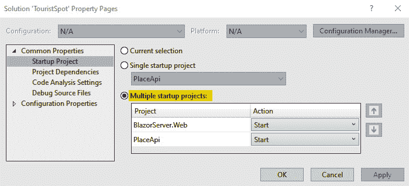

    图 6.5–设置多个启动项目

3.  选择**开始**作为两个项目的操作。
4.  点击**应用**，然后点击**确定**。

现在，使用*Ctrl+F5*构建并运行应用。在导航侧栏菜单中，点击**旅游景点**链接，`Main`组件页面应显示如下截图所示：

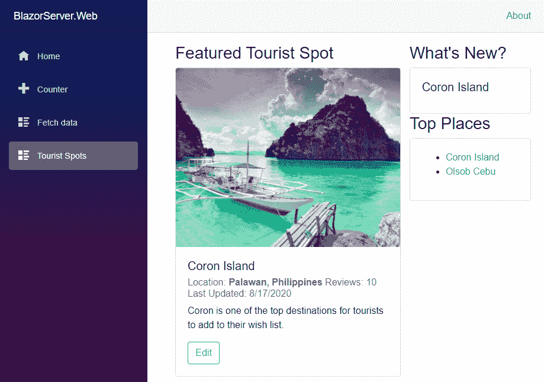

图 6.6–主页面

点击**编辑**按钮将显示`EditTouristSpot`组件，如下图所示：

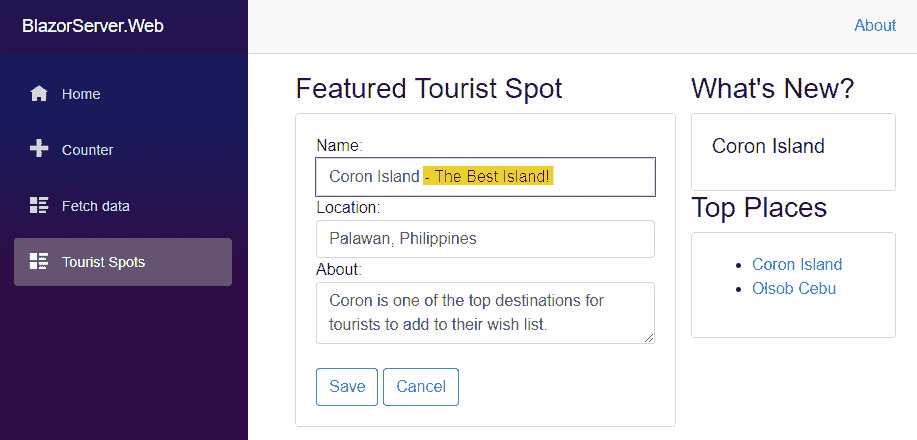

图 6.7–显示编辑模式的主页面

在前面的屏幕截图中，**名称**属性被修改。单击**取消**按钮将放弃更改并返回默认视图。点击**保存**将更新我们内存数据库中的记录，更新状态，并反映对**主**组件的更改，如下图所示：

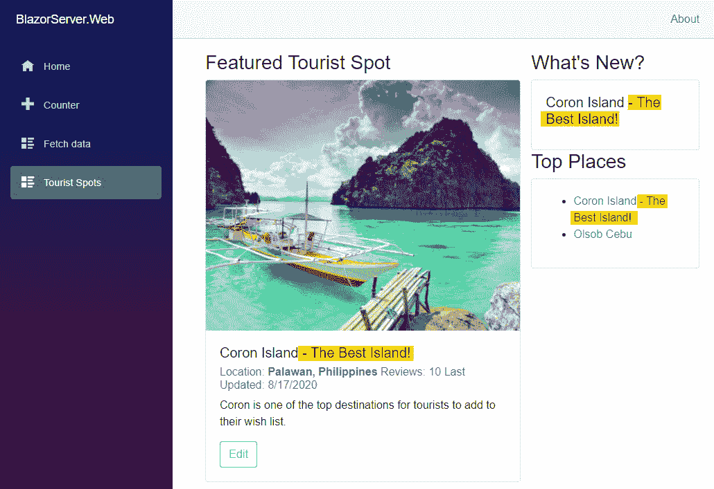

图 6.8–显示只读模式的主页面

您还可以从**顶部位置**部分选择任何项目，这将在页面上显示相应的详细信息。例如，点击**奥斯陆宿务**项目将更新页面，如下所示：

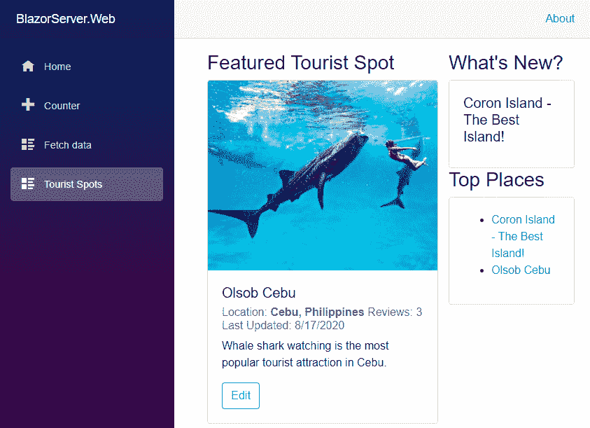

图 6.9–显示只读模式的主页面

请注意，除了**新增内容外，所有详细信息都已更新？**节。这是有意的，因为我们只想在数据库中发布新记录时更新它。我们将在下一节中看到本节将如何更新。

如果你成功了，恭喜你！您刚刚让您的第一个 Blazor web 应用与连接到 API 的实时数据一起运行！现在，让我们继续玩下去，创建一个 Blazor WebAssembly WASM（应用），我们可以在其中提交新的旅游景点记录，并实时反映 Blazor 服务器应用中的变化。

# 创建 Blazor Web 组装项目

在上一个项目中，我们学习了如何创建具有基本功能的 web 应用，例如通过 web API 调用获取和更新记录。在本项目中，我们将构建前端**渐进式 Web 应用**（**PWA**，创造新记录。此过程通过调用 API 端点发布数据来执行，并向`Hub`发送事件，以便在提交新记录时实时自动更新 Blazor 服务器 UI。

下面是一个演示该过程如何工作的尝试：

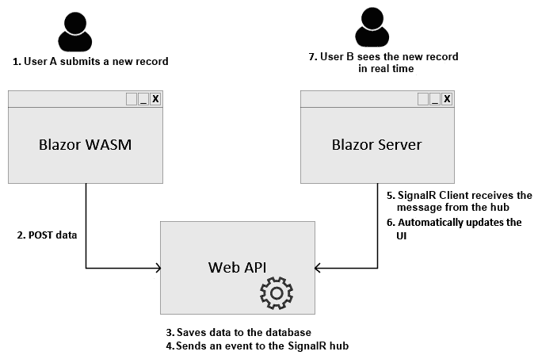

图 6.10–实时数据更新流程

上图显示了实时功能如何工作的高级过程。这些步骤几乎是不言自明的，它应该让您更好地理解每个应用如何相互连接。不用再多说了，让我们开始构建最后一个项目来完成整个应用。

继续，在现有项目解决方案中添加一个新的 Blazor WebAssembly 项目。要做到这一点，只需右键点击**解决方案**，然后选择**添加****新项目**。在窗口对话框中，选择**Blazor App**，然后点击**下一步**。将项目名称设置为`BlazorWasm.PWA`，然后点击**创建**。

在下一个对话框中，选择**Blazor WebAssembly App**，然后选中**Progressive Web Application**复选框，如下图所示：

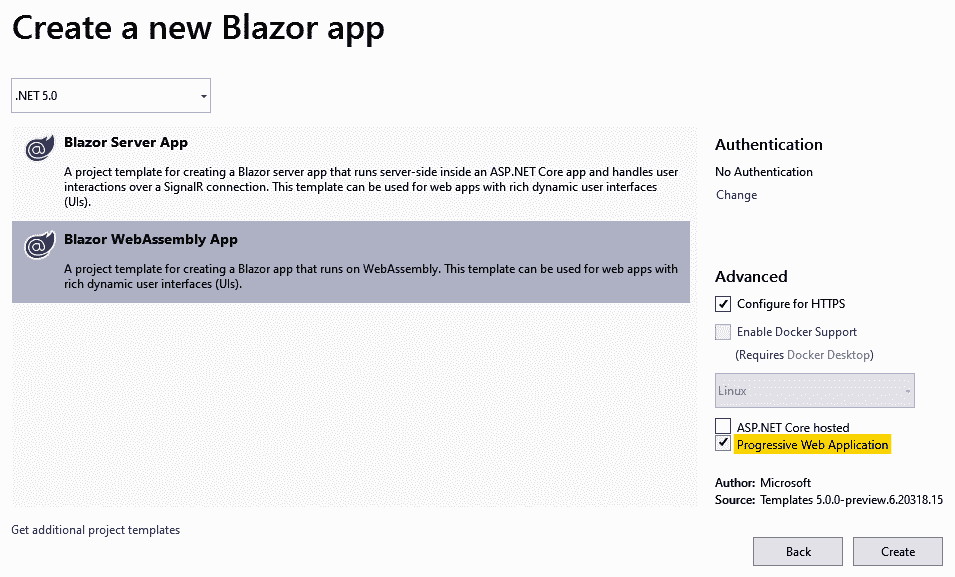

图 6.11–创建新的 Blazor WASM 项目

单击**创建**让 Visual Studio 生成默认模板。

Blazor WebAssembly 项目的项目结构与 Blazor Server 有点类似，除了以下几点：

*   它没有`Startup.cs`文件。这是因为 Blazor WASM 项目的配置不同，并且使用自己的主机运行应用。
*   `Progam.cs`文件现在包含以下代码：

```cs
public static async Task Main(string[] args)
{
    var builder = WebAssemblyHostBuilder.CreateDefault(args);
    builder.RootComponents.Add<App>(“app”);
    builder.Services.AddTransient(sp => new HttpClient { BaseAddress = new Uri(builder.HostEnvironment.BaseAddress) });
    await builder.Build().RunAsync();
}
```

在前面的代码中，我们可以看到它使用`WebAssemblyHostBuilder`而不是使用典型的 ASP.NET Core`IHostBuilder`来配置 web`Host`。它还将`HttpClient`配置为`BaseAddress`设置为`HostEnvironment.BaseAddress`，这是应用本身正在运行的主机地址，例如`localhost:<port>`。

*   在**页面**文件夹中没有`_Host.chtml`文件。如果您还记得，在 Blazor 服务器项目中，`_Host.chtml`文件是应用的主要入口点，它在其中引导`App.razor`组件。在 Blazor WASM 中，`App.razor`被添加到应用启动中，正如您在`Program.cs`文件中看到的那样。
*   它没有为默认的`Weatherforecast`服务配置样本数据的**数据**文件夹。样本数据现在移动到**wwwroot/sample data**文件夹下的`weather.json`文件中。
*   **wwwroot**中还添加了其他一些新文件，如`index.html`、`manifest.json`和`service-worker.js`。`index.html`实际上取代了`_Host.chtml`文件，该文件包含应用的主 HTML 文档。您可以看到该文件包含`<head>`和`<body>`标记，以及呈现`<app>`组件、CSS 和 JavaScript 框架。`manifest.json`和`service-worker.js`文件使 Blazor WASM 应用能够变成 PWA。

我非常确定 Blazor 服务器和 WebAssembly 之间还有很多其他的区别，但是列表中突出显示的项目是关键的区别。

## 创建模型

现在，让我们开始添加此项目所需的功能。在项目根目录中创建一个名为**Dto**的新文件夹。在**Dto**文件夹中，添加一个名为`CreatePlaceRequest.cs`的新类，并复制以下代码：

```cs
using System.ComponentModel.DataAnnotations;
namespace BlazorWasm.PWA.Dto
{
    public class CreatePlaceRequest
    {
        [Required]
        public string Name { get; set; }
        [Required]
        public string Location { get; set; }
        [Required]
        public string About { get; set; }
        [Required]
        public int Reviews { get; set; }
        public string ImageData { get; set; }
    }
}
```

前面的代码定义了一个包含一些属性的类。请注意，该类类似于 web API 中的`Place`类，除了之外，我们使用了**数据****注释**，通过使用`[Required]`属性装饰一些属性。此属性确保如果属性为空，则不会将其发布到数据库。

让我们继续下一步，创建用于向数据库添加新记录的组件。

## 构成索引组件

现在，导航到`Index.razor`组件。删除其中的现有代码并添加以下代码：

```cs
@page “/”
@using Dto
@inject HttpClient client
```

前面的代码使用`@page`指令设置到根目录的路由。下一行使用`@using`指令声明对 C#命名空间的引用。我们将使用`Dto`名称空间访问一个类，并使用该类中属性的值填充该组件。最后一行注入了一个`HttpClient`对象，以便我们与 web API 进行通信。

接下来，附加以下代码块：

```cs
<h1>Submit a new Tourist Destination Spot</h1>
<EditForm Model=”@NewPlace” OnValidSubmit=”HandleValidSubmit”>
    <div class=”card” style=”width: 30rem;”>
        <div class=”card-body”>
            <DataAnnotationsValidator />
            <ValidationSummary />
            Browse Image:
            <InputFile OnChange=”HandleSelection” />
            <p class=”alert-danger”>@errorMessage</p>
            <p>@status</p>
            <p>
                
            </p>
            Name:
            <InputText class=”form-control” id=”name” @bind-                Value=”NewPlace.Name” />
            Location:
            <InputText class=”form-control” id=”location” @                bind-Value=”NewPlace.Location” />
            About:
            <InputTextArea class=”form-control” id=”about” @                bind-Value=”NewPlace.About” />
            Review:
            <InputNumber class=”form-control” id=”review” @                bind-Value=”NewPlace.Reviews” />
            <br/>
            <button type=”submit” class=”btn btn-outline-                primary oi-align-right”>Post</button> 
        </div>
    </div>
</EditForm>
```

前面的代码是 HTML 代码，它使用输入元素和上载图像的按钮呈现表单。它还使用一个`EditForm`组件来处理表单提交和模型验证。我们不打算详细说明代码是如何工作的，因为在为 Blazor 服务器项目构建组件时，我们已经在上一节中介绍了这一点。

在本例中，我们使用`InputFile`Blazor 组件上传图像并配置连接到`HandleSelection`方法的`OnChange`事件。默认情况下，`InputFile`组件只允许选择单个文件。要支持多文件选择和上传，请设置`multiple`属性，如下代码段所示：

```cs
<InputFile OnChange=”HandleSelection” multiple />
```

有关`InputFile`组件的更多信息，请参阅本章*进一步阅读*部分。

让我们继续实现服务器端代码逻辑。附加以下代码：

```cs
@code {
    string status;
    string imageData;
    string errorMessage;
}
```

前面的代码定义了组件 UI 中需要的几个私有字段。`status`字段是存储上传状态文本的变量。`imageData`用于存储`encodedimage`数据，`errorMessage`用于存储错误文本。

接下来，在`@code{}`块中追加以下代码：

```cs
async Task HandleSelection(InputFileChangeEventArgs e)
{
    errorMessage = string.Empty;
    int maxFileSize = 2 * 1024 * 1024;
    var acceptedFileTypes = new List<string>() { “img/png”,        “img/jpeg”, “img/gif” };
    var file = e.File;
    if (file != null)
    {
        if (!acceptedFileTypes.Contains(file.ContentType))
        {
            errorMessage = “File is invalid.”;
            return;
        }
        if (file.Size > maxFileSize)
        {
            errorMessage = “File size exceeds 2MB”;
            return;
        }
        var buffer = new byte[file.Size];
        await file.OpenReadStream().ReadAsync(buffer);
        status = $”Finished loading {file.Size} bytes from             {file.Name}”;
        imageData = $”data:{file.ContentType};base64,{Convert.            ToBase64String(buffer)}”;
    }
}
```

前面代码中的`HandleSelection()`方法以`InputFileChangeEventArgs`为参数。在这种方法中，通过读取`e.File`属性，我们只允许上传一个文件，而不允许上传多个文件。如果您接受多个文件，则使用`e.GetMultipleFiles()`方法。我们还为最大文件大小和文件类型定义了两个预验证值。在本例中，我们只允许最大文件大小为 2MB，并且只接受上传的.PNG、.JPEG 和.GIF 文件类型。然后，我们执行一些验证检查，如果不满足任何条件，则显示错误。如果所有条件都满足，我们将上传的文件复制到一个流中，并将结果字节转换为`Base64String`，这样我们就可以将图像数据设置为``HTML 元素。

现在，在`@code{}`块中追加以下代码：

```cs
private CreatePlaceRequest NewPlace = new CreatePlaceRequest();
async Task HandleValidSubmit()
{
    NewPlace.ImageData = imageData;
    var result = await client.PostAsJsonAsync(        “https://localhost:44332/api/places”, NewPlace);
}
```

点击`Post`按钮时，如果没有发生模型验证错误，则会调用前面代码中的`HandleValidSubmit()`方法。此方法获取`NewPlace`对象并将 API 调用传递给它以执行`HTTP POST`。

就这样！现在，让我们试着运行应用。

## 运行应用

现在，将 Blazor WASM 项目作为启动项目，然后单击*Ctrl+F5*运行应用。您应该看到运行每个应用的三个浏览器选项卡。您可以最小化运行 web API 的选项卡，因为我们不需要对它做任何事情。现在，寻找 Blazor WASM 标签。

要将 Blazor WebAssembly 页面变成 PWA，只需单击浏览器导航栏中的**+**标志，如下图所示：


图 6.12–Blazor WASM

单击**+**标志将提示一个对话框，询问您是否要在桌面或移动设备上安装 Blazor 作为独立应用，如以下屏幕截图所示：

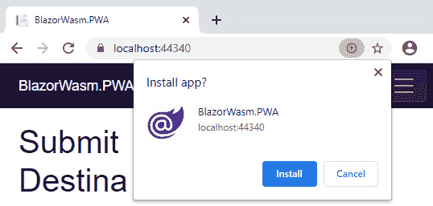

图 6.13–将 Blazor WASM 安装为 PWA

点击**安装**将在您的桌面或移动设备上创建一个图标，就好像它是一个已安装的常规本机应用，并将网页变成一个没有 URL 栏的窗口，如下所示：

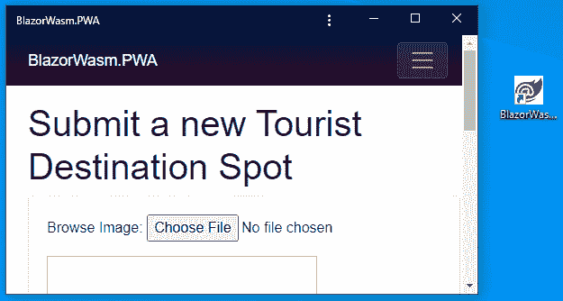

图 6.14–Blazor WASM 作为 PWA

很酷！

现在，并排打开 Blazor 服务器应用和 Blazor PWA 应用，让您了解实时更新的工作原理：

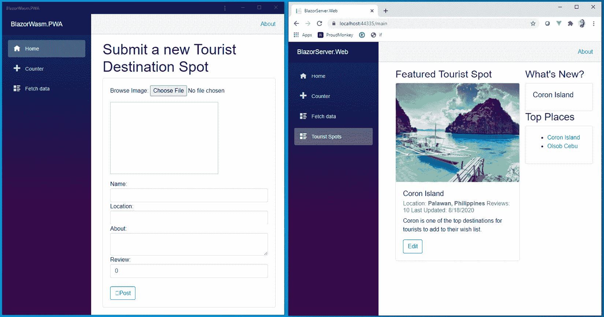

图 6.15–Blazor 服务器和 PWA 并排

现在，浏览图像并输入所需字段以提交新的`Place`记录。当您点击**提交**时，您会注意到 Blazor 服务器应用（前面屏幕截图中的右侧窗口）中的**有什么新功能？**和**顶部位置**部分自动更新为新添加的`Place`名称，无需刷新页面。下面是它的一个示例：

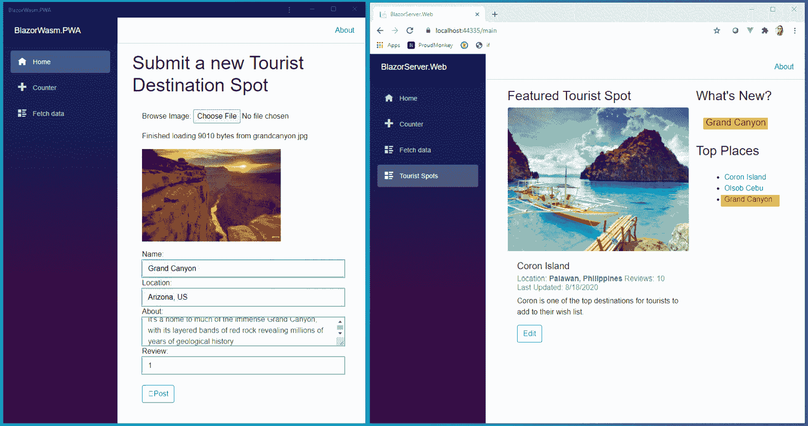

图 6.16–Blazor 服务器和 PWA 实时通信

在前面的截图中，点击**Post**按钮后，**大峡谷**名称会实时自动出现在 Blazor 服务器的 web UI 中。您可以在此处实时查看：

[https://github.com/PacktPublishing/ASP.NET-Core-5-for-Beginners/blob/master/Chapter%2005%20and%2006/Chapter_05_and_06_Blazor_Examples/TouristSpot/AwesomeBlazor.gif](https://github.com/PacktPublishing/ASP.NET-Core-5-for-Beginners/blob/master/Chapter%2005%20and%2006/Chapter_05_and_06_Blazor_Examples/TouristSpot/AwesomeBlazor.gif)

## 卸载 PWA 应用

要从本地计算机或设备上完全卸载 PWA 应用，请确保退出 IIS Express 中运行的所有应用。您可以访问 Windows 计算机任务栏右下角的 IIS Express 管理器，如下所示：

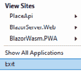

图 6.17–IIS Express manager

退出所有应用后，您可以卸载 PWA 应用，就像您通常卸载机器上的应用一样。

# 总结

在本章中，我们通过进行一些实际编码，了解了 BlazorWeb 框架的不同风格。我们学习了如何在 Blazor 中轻松构建一个强大的 web 应用，只需应用我们的 C#技能，而无需编写 JavaScript，就可以与其他 ASP.NET Core 技术堆栈协同工作。我们看到了如何轻松地集成.NET 中已有的特性和功能，例如实时功能。我们还学习了如何执行基本表单数据绑定、状态管理、路由，以及如何与后端 REST API 交互以使用和传递数据。在构建实际应用时，必须学习这些基本概念和基础知识是至关重要的。

在下一章中，您将深入探讨使用真实数据库的 web API 和数据访问。

# 进一步阅读

*   ASP.NET Core Blazor 简介：[https://docs.microsoft.com/en-us/aspnet/core/blazor](https://docs.microsoft.com/en-us/aspnet/core/blazor)
*   ASP.NET Core Blazor 托管模型配置：[https://docs.microsoft.com/en-us/aspnet/core/blazor/fundamentals/additional-scenarios](https://docs.microsoft.com/en-us/aspnet/core/blazor/fundamentals/additional-scenarios)
*   在 ASP.NET Core 中使用多种环境：[https://docs.microsoft.com/en-us/aspnet/core/fundamentals/environments](https://docs.microsoft.com/en-us/aspnet/core/fundamentals/environments)
*   可枚举类：[https://docs.microsoft.com/en-us/dotnet/api/system.linq.enumerable](https://docs.microsoft.com/en-us/dotnet/api/system.linq.enumerable)
*   Razor 组件：[https://docs.microsoft.com/en-us/aspnet/core/blazor/components](https://docs.microsoft.com/en-us/aspnet/core/blazor/components)
*   Blazor 级联值和参数：[https://docs.microsoft.com/en-us/aspnet/core/blazor/components/cascading-values-and-parameters](https://docs.microsoft.com/en-us/aspnet/core/blazor/components/cascading-values-and-parameters)
*   Blazor 生命周期：[https://docs.microsoft.com/en-us/aspnet/core/blazor/components/lifecycle](https://docs.microsoft.com/en-us/aspnet/core/blazor/components/lifecycle)
*   Blazor 路由：[https://docs.microsoft.com/en-us/aspnet/core/blazor/fundamentals/routing](https://docs.microsoft.com/en-us/aspnet/core/blazor/fundamentals/routing)
*   Blazor 调试：[https://docs.microsoft.com/en-us/aspnet/core/blazor/debug](https://docs.microsoft.com/en-us/aspnet/core/blazor/debug)
*   WebAssembly:[https://webassembly.org/](https://webassembly.org/)
*   理解`InputFile`组件：[https://docs.microsoft.com/en-us/aspnet/core/blazor/file-uploads](https://docs.microsoft.com/en-us/aspnet/core/blazor/file-uploads)