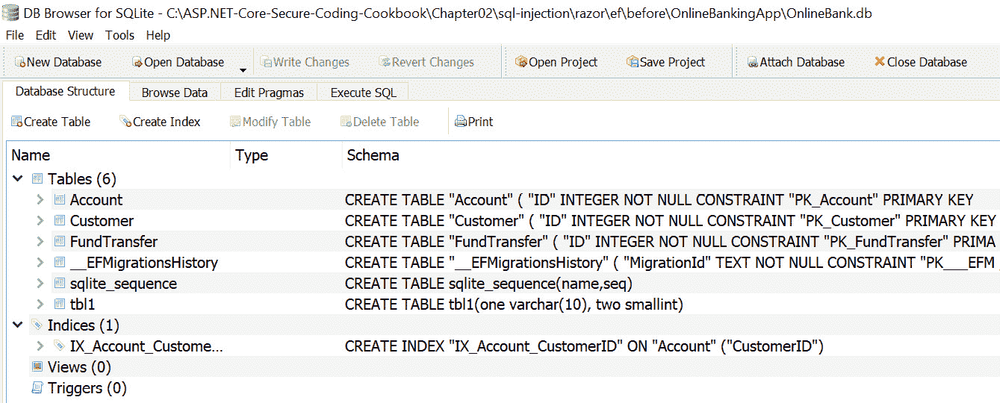
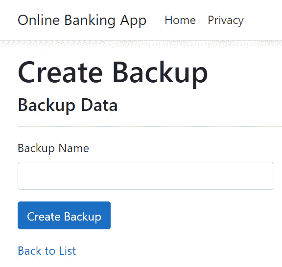
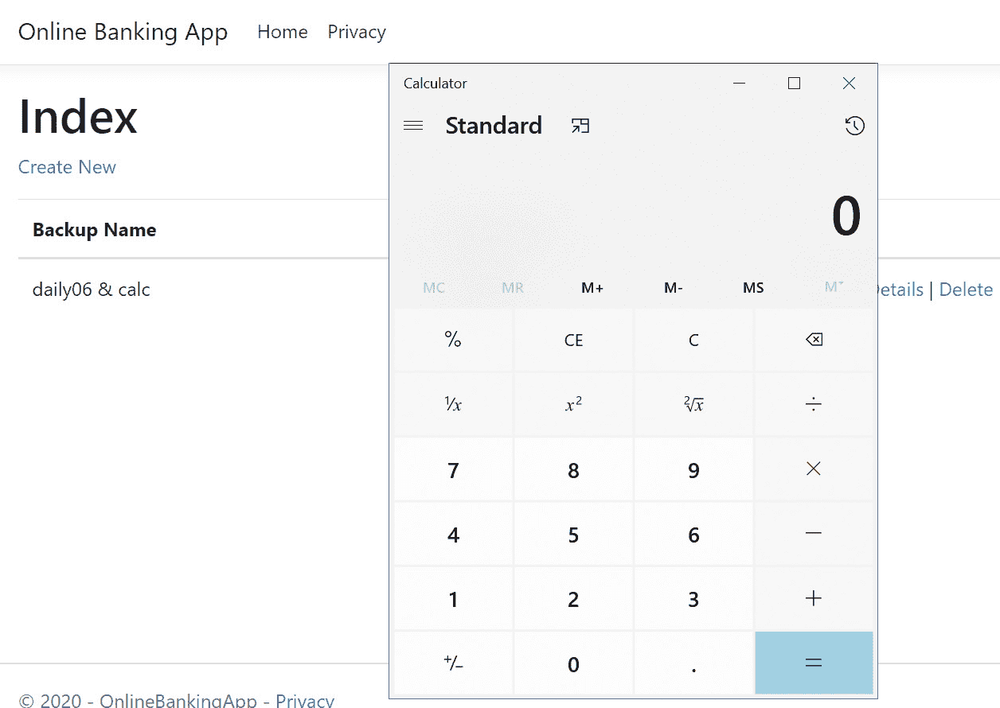
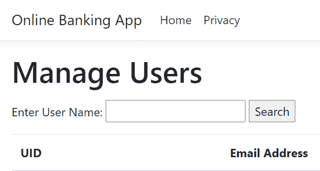
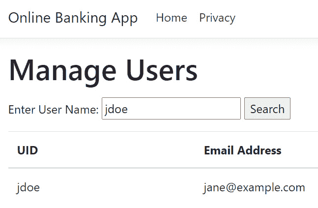

# 二、注入缺陷

代码中的注入缺陷可能对 ASP.NET Core web 应用产生最严重的影响。由于缺乏对不受信任输入的验证和清理，因此可以利用此漏洞，导致执行任意操作系统命令、绕过身份验证、意外的数据操作和内容。更糟糕的是，它可能会泄露敏感信息，最终导致数据泄露。

本章向您介绍各种注入缺陷，并解释如何在代码中修复此安全缺陷。

在本章中，我们将介绍以下配方：

*   用实体框架修复 SQL 注入
*   修复 ADO.NET 中的 SQL 注入
*   固定 NoSQL 注入液
*   固定命令注入
*   修复 LDAP 注入
*   修复 XPath 注入

在本章结束时，您将学习如何正确编写安全代码并删除可防止注入攻击的安全漏洞。

# 技术要求

本书是为配合 Visual Studio 代码、Git 和.NET 5.0 而编写和设计的。ASP.NET Core Razor 页面中提供了配方中的代码示例。这些代码练习已经在 Windows 环境中进行了测试，但应该可以在基于 Linux 的操作系统中运行，但有一些细微的差异。示例解决方案还使用 SQLite 作为数据库引擎，以简化设置。MongoDB 需要能够测试 NoSQL 注入剂的配方。还需要一个可以打开和浏览 SQLite 数据库的工具，如 SQLite 的 DB Browser。您可以在[找到本章的代码 https://github.com/PacktPublishing/ASP.NET-Core-Secure-Coding-Cookbook/tree/main/Chapter02](https://github.com/PacktPublishing/ASP.NET-Core-Secure-Coding-Cookbook/tree/main/Chapter02) 。

# 什么是 SQL 注入？

ASP.NET Core web 应用与数据库交互以存储数据和记录。我们使用**标准查询语言**与**数据库管理系统**（**DBMS**）进行通信访问和管理数据。这些查询是使用编程语言、平台或所选库组成的，但是生成这些查询的代码可能编写得不安全。

开发人员可以编写生成动态 SQL 的代码，方法是将字符串与不受信任的用户输入连接起来。如果没有适当的对策，恶意参与者可以将可疑命令注入输入字符串，从而改变查询的意图，或者执行任意 SQL。这种代码中的漏洞被识别为**SQL 注入**，至今仍在 web 应用中普遍存在。

# 用实体框架修复 SQL 注入

**实体框架核心（EF Core）**是 ASP.NET Core 开发人员首选的**对象关系映射（ORM）**框架。此框架是跨平台的，其易用性允许开发人员将数据即时建模和查询到对象中。然而，像 EF Core 这样的 ORM 框架仍然可能被误用。

在此配方中，我们将执行一个简单的 SQL 注入，以利用该漏洞，定位安全漏洞，并通过重写更安全的代码版本来修复风险。

## 准备好了吗

使用 Visual Studio 代码，打开位于`\Chapter02\sql-injection\razor\ef\before\OnlineBankingApp\`的示例网上银行应用文件夹。

### 测试 SQL 注入

以下为步骤：

1.  导航到菜单中的**终端****新终端**或在 Visual Studio 代码中按*Ctrl*+*Shift*+*即可。*
**   在终端中键入以下命令以构建并运行示例应用：

    ```cs
    dotnet run
    ```

    *   打开浏览器并转到`http://localhost:5000/FundTransfers`。*   The browser will display the web page for searching fund transfers using keywords in the **Filter By Notes** field, as shown in the following screenshot:

    系统。

    

    图 2.1–资金转账页面

    *   在**按注释过滤**文本框中，键入`C`，然后点击**搜索**按钮。*   The web page will now return one entry finding one match for the **Contingency Fund** note:

    

    图 2.2–资金转账搜索结果

    *   现在尝试输入 SQL 注入负载：`%';create table tbl1(one varchar(10), two smallint);Select * from Customers where id like '1`。*   Notice that no error was thrown on the web page:

    

    图 2.3–成功的 SQL 注入

    *   要确认 SQL 注入有效负载已成功执行，请使用 SQLite 工具的**DB Browser 打开`\Chapter02\sql-injection\razor\ef\before\OnlineBankingApp\OnlineBank.db`SQLite 数据库：***

 *

图 2.4–SQLite 数据库浏览器中的 OnlineBank.db

注意新创建的**tbl1**SQLite 表

现在，让我们看看如何识别使用 EF 的代码中的 SQL 注入漏洞，并通过修复此安全漏洞和应用对策来缓解上述问题。

## 怎么做…

让我们来看看这个食谱的步骤：

1.  启动 Visual Studio 代码并通过键入以下命令打开启动练习文件夹：

    ```cs
    code .
    ```

2.  导航到菜单中的**终端****新终端**或在 Visual Studio 代码中按*Ctrl*+*Shift*+*即可。*
**   在终端中键入以下命令来构建示例应用，以确认没有编译错误：

    ```cs
    dotnet build
    ```

    *   打开`Pages/FundTransfers/Index.cshtml.cs`文件，定位`OnGetAsync`方法的易受攻击部分，其中包含一个动态查询：

    ```cs
    public async Task OnGetAsync()
    {
        var fundtransfer = from f in _context.FundTransfer
            select f;
        if (!string.IsNullOrEmpty(SearchString))
        {
            fundtransfer = _context.FundTransfer.            FromSqlRaw("Select * from FundTransfer                 Where Note Like'%" + SearchString +                    "%'");
        }
        FundTransfer = await fundtransfer.ToListAsync();
    }
    ```

    *   为了修复 SQL 注入漏洞，让我们从开始，添加对`System`的引用。*   接下来，使用`FromSqlInterpolated`方法将前面突出显示的代码更改为以下代码：

    ```cs
    fundtransfer = _context.FundTransfer.FromSqlInterpolated($"Select * from FundTransfer Where Note Like {"%" + SearchString + "%"}");
    ```

    *   `FromSqlInterpolated`方法将根据提供的*插值字符串*创建 LINQ 查询。*

 *插入的参数`SearchString`随后将转换为`DbParameter`对象，使代码不受 SQL 注入的影响。

## 它是如何工作的…

**实体框架**允许您使用`FromSQLRaw`方法执行原始 SQL 查询。但是，此方法是危险的，因为您可以使用用户输入`SearchString`提供带有串联字符串的参数：

```cs
_context.FundTransfer.FromSqlRaw("Select * from FundTransfer Where Note Like'%" + SearchString + "%'");
```

使用 SQL 注入测试中使用的有效负载，想象一下用恶意字符串`%';create table tbl1(one varchar(10), two smallint);Select * from Customers where id like '1`替换`SearchString`值。

通过`FromSqlRaw`盲目连接注入的输入，SQL 语句现在的内容如下：

```cs
Select * from FundTransfer Where Note Like'%%';create table tbl1(one varchar(10), two smallint);Select * from Customers where id like '1 %'
```

这是一个非常有效的系列 SQL 语句，除了有一个危险的命令，该命令会创建一个新表，或者在其他情况下，或者在 DBMS 中，可能通过生成一个 shell 而变成远程代码执行。

这种形成 SQL 语句的方法被认为是糟糕的编码实践。为了编写更好、更安全的代码，可以使用`FromSqlInterpolated`等方法帮助编写带有参数化值的无害 SQL 语句。

## 还有更多…

参数化是一种经过验证的安全编码实践，可以防止 SQL 注入。重写此配方中代码的另一种方法是使用`DbParameter`类。

在代码中引入`SqLiteParameter`（源于`DbParameter`的实例）如下：

```cs
var searchParameter =     new SqliteParameter("searchString", SearchString);
fundtransfer = _context.FundTransfer     .FromSqlRaw("Select * from FundTransfer         Where Note Like'%@searchString%'",searchParameter);
```

白名单也是一种非常有用的技术，可以过滤用户输入。您已经在[*第 1 章*](01.html#_idTextAnchor015)、*安全编码基础*中详细讨论了这种方法。白名单将导致 ASP.NET Core web 应用仅处理预期格式的数据，但这种技术不如使用准备好的语句或参数化查询有效。

# 修复 ADO.NET 中的 SQL 注入

**ADO.NET**是一个数据提供程序平台，是.NET 框架的一部分。自.NET Framework 问世以来，ADO.NET 一直是用于查询和操作数据库中数据的组件。ADO.NET 可用于开发数据驱动的 ASP.NET Core web 应用，但与任何数据提供程序类似，开发人员在使用任何`System.Data.*`或`Microsoft.Data.*`类时可能会编写不安全的代码。

在此配方中，我们将在使用 ADO.NET 时识别代码中的 SQL 注入漏洞，并通过修复此安全漏洞和应用对策来缓解此问题。

## 准备好了吗

使用 Visual Studio 代码，打开位于`\Chapter02\sql-injection\razor\ado.net\before\OnlineBankingApp\`的示例网上银行应用文件夹。

## 怎么做…

让我们来看看这个食谱的步骤：

1.  启动 Visual Studio 代码并通过键入以下命令打开启动练习文件夹：

    ```cs
    code .
    ```

2.  导航到菜单中的**终端****新终端**或在 Visual Studio 代码中按*Ctrl*+*Shift*+*即可。*
**   在终端中键入以下命令来构建示例应用，以确认没有编译错误：

    ```cs
    dotnet build
    ```

    *   打开`Data/FundTransferDAL.cs`文件，该类表示示例应用的数据访问层，并找到`GetFundTransfers`方法的易受攻击部分，其中用户控制的输入被传递到搜索参数：

    ```cs
    public IEnumerable<FundTransfer> GetFundTransfers(string   search)
    {
        List<FundTransfer> fundTransfers =         new List<FundTransfer>();

        using (SqliteConnection con =         new SqliteConnection(connectionString))  
        {
            SqliteCommand cmd =             new SqliteCommand("Select *                 fromFundTransfer where Note like '%"                     + search + "%'", con);
            cmd.CommandType = CommandType.Text;

            con.Open();  
            SqliteDataReader rdr = cmd.ExecuteReader(); 
    ```

    *   前面突出显示的代码是组成查询的地方，搜索连接起来形成 SQL 查询。*   要修复 SQL 注入漏洞，请更改前面突出显示的代码：

    ```cs
    public IEnumerable<FundTransfer> GetFundTransfers(string   search)
    {
        List<FundTransfer> fundTransfers =         new List<FundTransfer>();

        using (SqliteConnection con =         new SqliteConnection(connectionString))
        {
            SqliteCommand cmd =             new SqliteCommand("Select * from                 FundTransfer where Note like '%" +                     @search + "%'", con);
            cmd.CommandType = CommandType.Text;
    cmd.Parameters.AddWithValue("@search",search);
            con.Open();
            SqliteDataReader rdr = cmd.ExecuteReader();
    ```* 

 *使用参数化方法，我们将搜索字符串转换为 SQL 参数，并将值传递到`SqlLiteParameterCollection`。

## 它是如何工作的…

`SqlLiteCommand`实例被盲目地传递一个原始的 SQL 连接用户输入。此提供的字符串是 SQL 注入的源。输入字符串搜索未经验证和未初始化，允许对手插入任意 SQL 命令或修改查询意图：

```cs
SqliteCommand cmd = new SqliteCommand("Select * from FundTransfer where Note like '%" + search + "%'", con);  
```

您可以重写易受攻击的 ADO.NET 代码，并通过使用查询参数使其安全。`SQliteCommand`对象`SqliteParametersCollection`中的`AddWithValue`方法允许您添加查询参数并安全地将值传递到查询中：

```cs
cmd.Parameters.AddWithValue("@search", search);  
```

将搜索字符串更改为占位符将使查询参数化：

```cs
SqliteCommand cmd = new SqliteCommand("Select * from FundTransfer where Note like '%" + @search + "%'", con);  
```

当 ASP.NET Core web 应用执行前面几行代码时，查询现在被参数化，安全地传递搜索值，并防止恶意参与者更改 SQL。

## 还有更多…

此配方使用**SQLite**作为样本解决方案的 DBMS，但如果要使用**Microsoft SQL Server**，另一个选项是将查询转换为存储过程并与 DB 参数一起使用。然后，您必须使用`SQLCommand`对象并将`CommandType`属性设置为`System.Data.CommandType.StoredProcedure`，从而允许从代码执行参数化存储过程。这些类在`System.Data.SqlClient`名称空间和新的`Microsoft.Data.SqlClient`包中提供。

下面是一个示例代码片段：

```cs
SqlCommand cmd = new     SqlCommand("sp_SearchFundTransfer",con);  
cmd.CommandType = CommandType.StoredProcedure;  
cmd.Parameters.AddWithValue("@search", search);  
```

要编写更好、更安全的代码，请使用内置的对数据库功能的支持，例如由其数据提供程序框架提供的准备语句或参数化查询。

# 固定 NoSQL 注入液

**NoSQL**数据库是一种不同类型的数据库，其中存储非关系和半结构化数据。NoSQL 数据库有很多种，比如 Cassandra、Redis、DynamoDB 和 MongoDB，每种数据库都有自己的查询语言。尽管这些查询彼此不同，但它们也容易受到注入攻击。

在本配方中，我们将识别使用 MongoDB 作为后端的代码中的**NoSQL 注入**漏洞，并通过应用多种对策来修复该问题。

## 准备好了吗

使用 Visual Studio 代码，打开位于`Chapter02\nosql-injection\before\OnlineBankingApp`的示例网上银行应用文件夹。

## 怎么做…

让我们来看看这个食谱的步骤：

1.  启动 Visual Studio 代码并通过键入以下命令打开启动练习文件夹：

    ```cs
    code .
    ```

2.  导航到菜单中的**终端****新终端**或在 Visual Studio 代码中按*Ctrl*+*Shift*+*即可。*
**   在终端中键入以下命令来构建示例应用，以确认没有编译错误：

    ```cs
    dotnet build
    ```

    *   打开`Services/PayeeService.cs`文件，在`Get(string name)`方法

    ```cs
    public List<Payee> Get(string name) {
        var filter = "{$where: \"function()         {return this.Name == '" + name + "'}\"}";
        return payees.Find(filter).ToList();
    }
    ```

    中定位代码的易受攻击部分*   要修复 NoSQL 注入漏洞，请更改前面突出显示的代码：

    ```cs
    public List<Payee> Get(string name) {
        return payees.Find(payee => payee.Name ==         name).ToList();
    }  
    ```* 

 *传递到`Find`方法中的过滤器现在被**Lambda**表达式替换，这是一种更安全的按姓名搜索收款人的方法。

## 它是如何工作的…

`Get`方法有一个字符串参数，可以为该参数提供非净化或验证值。这个值可以改变由它组成的**MongoDB**过滤器，使 NoSQL 数据库执行意外行为。

`name`参数可以附加一个表达式，该表达式将把查询计算为与查询预期执行的结果不同的逻辑结果。JavaScript 子句也可以插入到查询中，该查询可以终止语句并添加新的任意代码块。

通过一些一般建议，避免使用`$where`操作符。只需将一个 C#Lambda 表达式作为过滤器应用，以防止任何可注入的 JSON 或 JavaScript 表达式。

## 还有更多…

假设前面的选项不可能，并且必须使用`$where`子句，那么必须使用 JavaScript 对输入进行编码。使用`System.Text.Encodings.Web`命名空间中的`JavaScriptEncoder`类来*编码*传递到参数中的值：

1.  首先，修改`PayeeService.cs`文件，添加对`Encoder`名称空间的引用：

    ```cs
    using System.Text.Encodings.Web;
    ```

2.  接下来，为`JavaScriptEncoder`

    ```cs
    private readonly JavaScriptEncoder _jsEncoder;
    ```

    定义一个属性
3.  更改`PayeeService`构造函数，添加新参数注入`JavaScriptEncoder`：

    ```cs
    public PayeeService(IOnlineBankDatabaseSettings settings,JavaScriptEncoder jsEncoder)
    ```

4.  最后，使用`JavaScriptEncoder`

    ```cs
    var filter = "{$where: \"function() {return this.Name == '" + _jsEncoder.Encode(name) + "'}\"}";
    ```

    的`Encode`功能对`name`参数进行编码

如果恶意输入被传递到`name`参数，并通过`Encode`方法转义，如果转义值无法解释为有效的 JavaScript 表达式，C#MongoDB 驱动程序将抛出异常。

为了防止**NoSQL 注入**，开发人员必须*避免使用字符串连接*构建动态查询。NoSQL 数据库提供了查询和处理数据的方法，但您必须了解一项功能可能会给 ASP.NET Core web 应用带来的潜在安全隐患。

# 固定命令注入

Web 应用如使用 ASP.NET Core 开发的应用，有大量的组件和库，使它们能够在主机上执行 OS 命令。如果编写得不安全，编写和运行这些命令的代码可能会使 ASP.NET Core web 应用遭受命令注入攻击。如果不防止代码中的此安全缺陷，则可能意外执行 Shell 命令。

在此配方中，我们将识别代码中的**命令注入**漏洞，并修复安全漏洞。

## 准备好了吗

使用 Visual Studio 代码，打开位于`Chapter02\command-injection\before\OnlineBankingApp`的示例网上银行应用文件夹。

### 测试命令注入

以下为步骤：

1.  导航到菜单中的**终端****新终端**或在 Visual Studio 代码中按*Ctrl*+*Shift*+*即可。*
**   在终端中键入以下命令以构建并运行示例应用：

    ```cs
    dotnet run
    ```

    *   打开浏览器并转到`http://localhost:5000/Backups/Create`。*   The browser will display the web page for initiating database backup, as shown in the following screenshot:

    

    图 2.5–备份页面

    *   在**备份名称**字段中输入此命令注入有效负载`backup & calc`，并点击**创建**按钮。*   请注意，页面已重定向到备份页面列表，备份已创建。但是，计算器应用出现了：*

 *

图 2.6–成功的命令注入

如果不处理此安全漏洞，此问题还可能使底层主机暴露于**远程代码执行**（**RCE**。

## 怎么做…

让我们来看看这个配方的步骤：

1.  启动 Visual Studio 代码并通过键入以下命令打开启动练习文件夹：

    ```cs
    code .
    ```

2.  导航到菜单中的**终端****新终端**或在 Visual Studio 代码中按*Ctrl*+*Shift*+*即可。*
**   在终端中键入以下命令来构建示例应用，以确认没有编译错误：

    ```cs
    dotnet build
    ```

    *   打开`Services/BackupService.cs`文件，在`BackupDB(string backupname)`方法

    ```cs
    public async Task BackupDB(string backupname)
    {
        using (Process p = new Process())
        {
            string source =             Environment.CurrentDirectory +                 "\\OnlineBank.db";
            string destination =            Environment.CurrentDirectory +                "\\backups\\" + backupname;
            p.StartInfo.Arguments =             " /c copy " + source + " " + destination;
            p.StartInfo.FileName = "cmd";
            p.StartInfo.CreateNoWindow = true;
    ...code removed for brevity
    ```

    中定位代码的易受攻击部分*   要修复命令注入漏洞，请添加一个利用内置文件复制功能的新方法：

    ```cs
    public async Task FileCopyAsync(string sourceFileName,    string destinationFileName,     int bufferSize = 0x1000,     CancellationToken cancellationToken =         default(CancellationToken))
    {
        using (var sourceFile =         File.OpenRead(sourceFileName))
        {
            using (var destinationFile =            File.OpenWrite(destinationFileName))
            {
                await             sourceFile.CopyToAsync(destinationFile,                bufferSize, cancellationToken);
            }
        }
    }      
    ```

    *   重写`BackupDB`方法的整体，使用新创建的方法：

    ```cs
    public async Task BackupDB(string backupname)
    {
        string source =         Environment.CurrentDirectory +             "\\OnlineBank.db";
        string destination =         Environment.CurrentDirectory + "\\backups\\"             + backupname;
        await FileCopyAsync(source, destination);
    }
    ```* 

 *我们重构了`BackUpDB`方法，使用`FileCopyAsync`方法将代码限制为仅执行文件复制任务，从而防止执行不需要的 shell 命令。

## 它是如何工作的…

在我们的示例解决方案中，允许管理员提供一个名称来创建数据库备份。`BackUpDB`方法接受`string`类型的用户控制输入参数。输入字符串用于形成一个命令，该命令将启动一个命令 shell，将文件从源复制到目标。

添加的输入字符串应具有目标文件名，但可以对其进行操作，以包含不仅仅是参数值的命令。如果没有验证或清理，这可能会导致应用在 web 应用的标识和授权下执行不需要的 shell 命令。

## 还有更多…

停止 OS 命令注入的一个选项是通过*白名单技术*实现适当的验证。这项技术可以通过使用*正则表达式*来实现（参见[*第一章*](01.html#_idTextAnchor015)、*安全编码基础*中的*输入验证*配方）：

1.  添加对`System.Text.RegularExpressions`命名空间的引用：

    ```cs
    using System.Text.RegularExpressions;
    ```

2.  然后，使用`RegEx`类及其`IsMatch`方法根据模式验证输入，只接受有效字符：

    ```cs
    public async Task BackupDB(string backupname)
    {
        var regex = new Regex(@"^[a-zA-Z0-9]+$");
        if (!regex.IsMatch(backupname)) return;
        using (Process p = new Process())
        {
            string source =             Environment.CurrentDirectory +                "\\OnlineBank.db";
            string destination =             Environment.CurrentDirectory +                "\\backups\\" + backupname;
            p.StartInfo.Arguments = " /c copy " + source +             " " + destination;
            p.StartInfo.FileName = "cmd";
            p.StartInfo.CreateNoWindow = true;
    // code removed for brevity
    ```

我们现在使用`IsMatch`方法添加了白名单验证。`IsMatch`方法防止在后续代码行中处理非字母数字字符和输入，降低了命令注入的风险。

# 固定注入

**轻型目录访问协议（LDAP）**是一种标准协议，用于访问目录服务，如 Microsoft 的 Active Directory 和 Apache Directory。Web 应用使用 LDAP 搜索目录服务器以获取用户和组信息，这也是身份验证的一种手段。由于 LDAP 查询语言及其过滤器，可以将数据从 web 应用检索到 LDAP 目录服务器。开发人员编写代码来组合这些查询。与任何其他动态查询构造一样，当连接的用户控制输入未经验证或消毒时，此方法可以打开代码进行注入，特别是**LDAP 注入**。

在此配方中，我们将识别代码中的**LDAP 注入**漏洞，并修复安全漏洞。

## 准备好了吗

使用 Visual Studio 代码，打开位于`\Chapter02\ldap-injection\before\OnlineBankingApp\`的示例网上银行应用文件夹。

## 怎么做…

让我们来看一下这个食谱的步骤：

1.  启动 Visual Studio 代码并通过键入以下命令打开启动练习文件夹：

    ```cs
    code .
    ```

2.  导航到菜单中的**终端****新终端**或在 Visual Studio 代码中按*Ctrl*+*Shift*+*即可。*
**   在终端中键入以下命令来构建示例应用，以确认没有编译错误：

    ```cs
    dotnet build
    ```

    *   打开`Services/LdapDirectoryService.cs`文件，在`Search(string userName)`方法

    ```cs
    public User Search(string userName)
    {
        using (DirectoryEntry entry =         new DirectoryEntry(config.Path))
        {
            entry.AuthenticationType =            AuthenticationTypes.Anonymous;
            using (DirectorySearcher searcher =             new DirectorySearcher(entry))
            {
                searcher.Filter = "(&(" +                UserNameAttribute + "="                     + userName + "))";
                searcher.PropertiesToLoad.Add                 (EmailAttribute);
                searcher.PropertiesToLoad.Add                 (UserNameAttribute);
                var result = searcher.FindOne();
    // code removed for brevity
    ```

    中定位代码的易受攻击部分*   要修复 LDAP 注入漏洞，请重构代码以包含`userName`参数

    ```cs
    public User Search(string userName)
    {
        if (Regex.IsMatch(userName, "^[a-zA-Z][a-zA-Z0-        9]*$")){
            using (DirectoryEntry entry =             new DirectoryEntry(config.Path))
            {
                entry.AuthenticationType =                AuthenticationTypes.Anonymous;
                using (DirectorySearcher searcher =                 new DirectorySearcher(entry))
                {
                    searcher.Filter = "(&(" +                     UserNameAttribute + "=" + userName                         + "))";
                    searcher.PropertiesToLoad.Add                     (EmailAttribute);
                    searcher.PropertiesToLoad.Add                     (UserNameAttribute);
                    var result = searcher.FindOne();
    // code removed for brevity
    ```

    的*白名单验证**

 *通过使用正则表达式重用白名单技术，我们再次使用`IsMatch`方法来确定模式是否与输入匹配。如果输入与正则表达式不匹配，则拒绝输入。

## 它是如何工作的…

在我们的示例解决方案中，我们有一个网页，允许管理员用户使用搜索栏搜索特定的用户帐户：



图 2.7–管理用户页面

输入用户 ID 并点击**搜索**按钮将向 LDAP 目录服务发送 LDAP 查询，以搜索具有确切用户 ID 的用户：



图 2.8–搜索用户结果

笔记

本书中没有提供设置 LDAP 目录服务的步骤。假设您希望在本地计算机上运行的工作目录服务器与示例解决方案一起工作。在这种情况下，我建议您安装**ApacheDS**并按照官方 Crafter CMS 文档[中**设置 LDAP 服务器以使用 Apache Directory Studio**页面进行开发/测试的步骤进行操作 https://docs.craftercms.org/en/3.1/developers/cook-books/how-tos/setting-up-an-ldap-server-for-dev.html](https://docs.craftercms.org/en/3.1/developers/cook-books/how-tos/setting-up-an-ldap-server-for-dev.html) 。

必要时更改`appsettings.json`中的`Ldap`条目：

`"Ldap": {`

`"Path": "LDAP://localhost:10389/DC=example,DC=com",`

`"UserDomainName": "example"`

`},`

在调用`Search`方法时，动态组合 LDAP 查询，并将过滤器与搜索文本框中输入的值连接起来：

```cs
searcher.Filter = "(&(" + UserNameAttribute + "=" + userName + "))";
```

`userName`参数未经过清理或验证，不良行为人可以通过注入可疑过滤器来利用此漏洞，该过滤器可以从 LDAP 目录服务器检索敏感信息。

为了降低这种风险，我们使用 Regex 的`IsMatch`方法添加了白名单验证方法。只有当`userName`中的任何字符为字母数字时，条件表达式才会等价于 true：

```cs
public User Search(string userName)
{
    if (Regex.IsMatch(userName, "^[a-zA-Z][a-zA-Z0-9]*$")){
        using (DirectoryEntry entry = new             DirectoryEntry(config.Path))
        {
// code removed for brevity
```

作为整体安全编码策略的一部分，实施白名单输入验证以检查用户控制的输入，从而保护 ASP.NET Core web 应用免受 LDAP 注入攻击。

# 固定注入

数据驱动的 ASP.NET Core web 应用可以使用 XML 数据库作为存储信息和记录的手段。这些数据类型是 XML 格式的，通过 XML 的节点导航的一种方式是通过**XPath**。

开发人员可能会错误地使用不受信任的数据动态构造 XPath 查询。这种忽略可能导致执行任意查询或从 XML 数据库检索敏感数据。

在此配方中，我们将修复代码中的**XPath 注入**漏洞。

## 准备好了吗

使用 Visual Studio 代码，打开位于`\Chapter02\xpath-injection\before\OnlineBankingApp\`的示例网上银行应用文件夹。

本例使用以下 XML 数据：

```cs
<?xml version="1.0" encoding="utf-8"?>
<knowledgebase>
    <knowledge>
        <topic lang="en">Types of Transfers</topic>
        <description lang="en">
            Make transfers from checking and savings to:
            Checking and savings
            Make transfers from line of credit to:
            Checking and savings
        </description>
        <tags>transfers, transferring funds</tags>
        <sensitivity>Public</sensitivity>
    </knowledge>
    <knowledge>
        <topic lang="en">Expedited Withdrawals</topic>
        <description lang="en">
        Expedited withdrawals are available to our         executive account holders.
        You may reach out to Stanley Jobson at         stanley.jobson@bank.com
        </description>
      <tags>withdrawals, expedited withdrawals</tags>
      <sensitivity>Confidential</sensitivity>
    </knowledge>
</knowledgebase>
```

## 怎么做…

让我们来看看这个食谱的步骤：

1.  启动 Visual Studio 代码并通过键入以下命令打开启动练习文件夹：

    ```cs
    code .
    ```

2.  导航到菜单中的**终端****新终端**或在 Visual Studio 代码中按*Ctrl*+*Shift*+*即可。*
**   在终端中键入以下命令来构建示例应用，以确认没有编译错误：

    ```cs
    dotnet build
    ```

    *   Open the `Services/KnowledgebaseService.cs` file and locate the vulnerable part of the code in the `Search` method:

    ```cs
    public List<Knowledge> Search(string input)
    {
        List<Knowledge> searchResult = new         List<Knowledge>(); 
        var webRoot = _env.WebRootPath;
        var file = System.IO.Path.Combine(webRoot,        "Knowledgebase.xml");

        XmlDocument XmlDoc = new XmlDocument();
        XmlDoc.Load(file);

        XPathNavigator nav = XmlDoc.CreateNavigator();
        XPathExpression expr =        nav.Compile(@"//knowledge[tags[contains(text()            ,'" + input + "')] and sensitivity/text()                ='Public']");
        var matchedNodes = nav.Select(expr);
    // code removed for brevity
    ```

    XPath 表达式是通过连接用户控制的输入动态创建的。在没有对`input`参数进行任何验证或清理的情况下，恶意参与者可以通过注入恶意字符串来操纵 XPath 查询，从而改变整个表达式的意图。

    *   为了修复这个安全缺陷，让我们重构代码并基于白名单技术实现输入净化。首先，添加对`System`和`System.Linq`名称空间的引用：

    ```cs
    using System;
    using System.Linq;
    ```

    *   在`KnowledgebaseService`类中添加一个新方法，并将其命名为`Sanitize`：

    ```cs
    private string Sanitize(string input)
    {
        if (string.IsNullOrEmpty(input)) {
            throw new ArgumentNullException("input",             "input cannot be null");
        }
        HashSet<char> whitelist = new HashSet<char>        (@"1234567890ABCDEFGHIJKLMNOPQRSTUVWXYZ             abcdefghijklmnopqrstuvwxyz ");
        return string.Concat(input.Where(i =>        whitelist.Contains(i))); ;
    }
    ```

    *   调用新的`Sanitize`方法，将`input`参数作为参数传递给它。将结果分配给`sanitizedInput`变量：

    ```cs
    public List<Knowledge> Search(string input)
    {
        string sanitizedInput = Sanitize(input);
        List<Knowledge> searchResult = new         List<Knowledge>(); 
        var webRoot = _env.WebRootPath;
        var file = System.IO.Path.Combine(webRoot,        "Knowledgebase.xml");

        XmlDocument XmlDoc = new XmlDocument();
        XmlDoc.Load(file);

        XPathNavigator nav = XmlDoc.CreateNavigator();
        XPathExpression expr =         nav.Compile(@"//knowledge[tags[contains(text()            ,'" + sanitizedInput + "')] and                 sensitivity/text()='Public']");
    // code removed for brevity
    ```* 

 *自定义`Sanitize`方法现在将删除输入字符串中不必要且可能危险的字符。现在，输出被传递到一个`sanitizedInput`变量中，使得 XPath 表达式不受攻击。

## 它是如何工作的…

正如我们在[*第 1 章*](01.html#_idTextAnchor015)*安全编码基础*中所了解到的，在*输入净化*部分中，输入净化是一种防御技术，可用于移除用户提供输入中的可疑字符。这种方法将防止应用处理注入查询的不需要的**XPath**。

我们创造了新的`Sanitize`方法，作为我们的消毒剂。此方法中包含一个已定义字符的白名单，并调用 Lambda 来删除`userName`中被拒绝的字符：

```cs
HashSet<char> whitelist = new HashSet<char>(@"1234567890ABCDEFGHI JKLMNOPQRSTUVWXYZabcdefghijklmnopqrstuvwxyz ");
return string.Concat(input.Where(i =>    whitelist.Contains(i))); ;
```

搜索带有不可接受字符的帮助文章不会引发异常，我们的示例网上银行 web 应用也不会处理该字符串：


图 2.9–搜索知识库

## 还有更多…

另一种修复方法是*参数化 XPath 查询*。我们将定义一个变量，作为参数的占位符。此技术允许将数据与代码分离：

```cs
XmlDocument XmlDoc = new XmlDocument();
XmlDoc.Load(file);
XPathNavigator nav = XmlDoc.CreateNavigator();
XPathExpression expr =    nav.Compile(@"//knowledge[tags[contains(text(),$input)]        and sensitivity/text()='Public']");
XsltArgumentList varList = new XsltArgumentList();
varList.AddParam("input", string.Empty, input);
CustomContext context = new CustomContext(new NameTable(),    varList);
expr.SetContext(context);
var matchedNodes = nav.Select(expr);
foreach (XPathNavigator node in matchedNodes)
{ 
    searchResult.Add(new Knowledge() {Topic =      node.SelectSingleNode(nav.Compile("topic"))        .Value,Description = node.SelectSingleNode           (nav.Compile("description")).Value}); 
}
```

在前面的代码中，XPath 表达式被修改，`$input`变量现在是先前连接的`input`值的占位符。我们还使用了`XsltArgumentList`对象创建了一个参数列表，以在传递到`XpathExpression`表达式的自定义上下文之前包含输入。通过这种方式，XPath 查询被参数化，并在执行时防止恶意注入。

笔记

此缓解措施需要创建一个从`XsltContext`派生的用户定义的自定义上下文类。要使 XPath 参数化成为可能，还需要其他类。示例解决方案中包括类文件，即：；`Services\XPathExtensionFunctions.cs`、`Services\XPathExtensionVariable.cs`和`Services\CustomContext.cs`。这些课程的完整指南和来源也可在线访问.NET 官方文档：[https://docs.microsoft.com/en-us/dotnet/standard/data/xml/user-defined-functions-and-variables](https://docs.microsoft.com/en-us/dotnet/standard/data/xml/user-defined-functions-and-variables) 。********