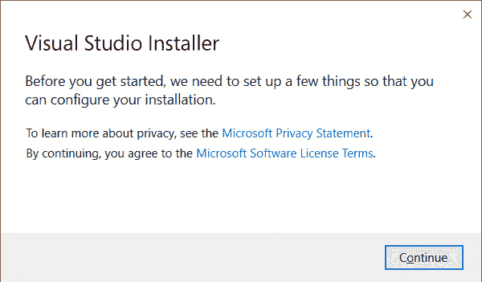
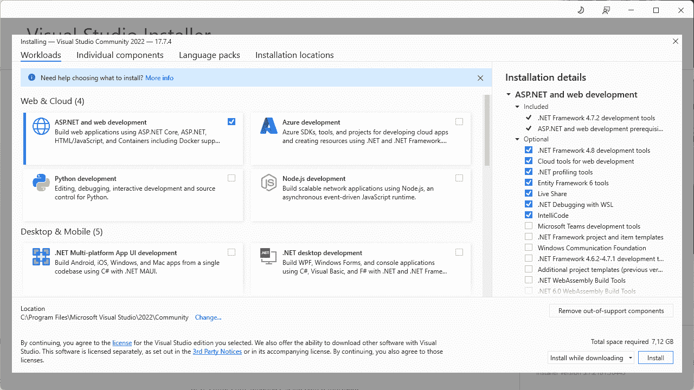
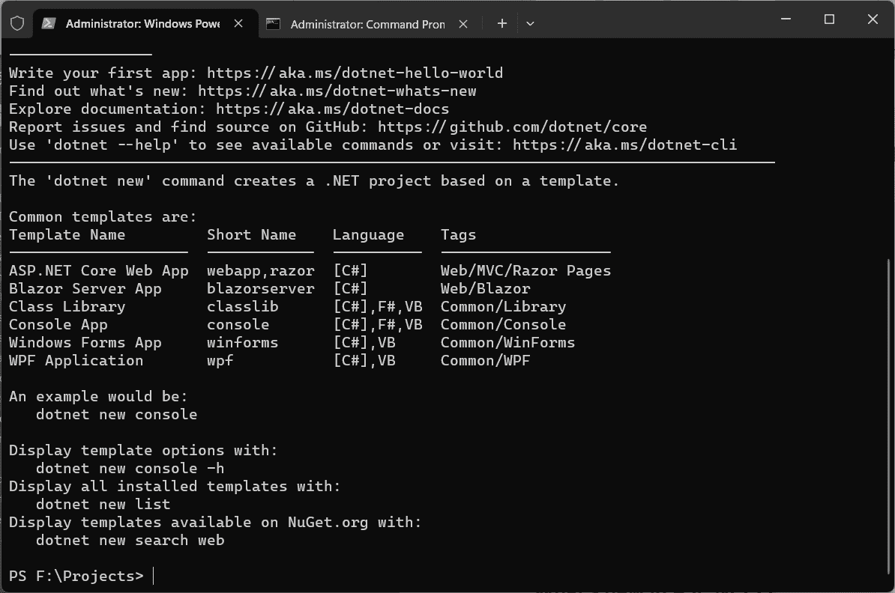
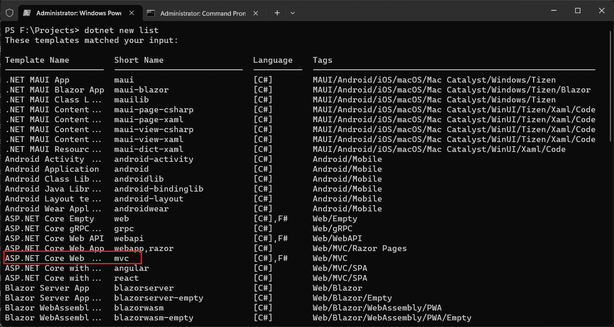
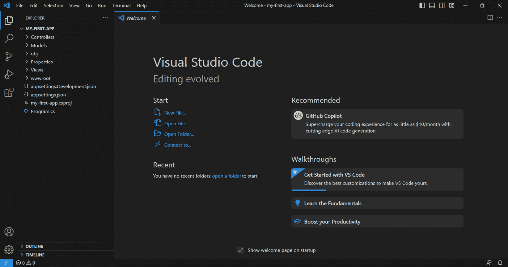
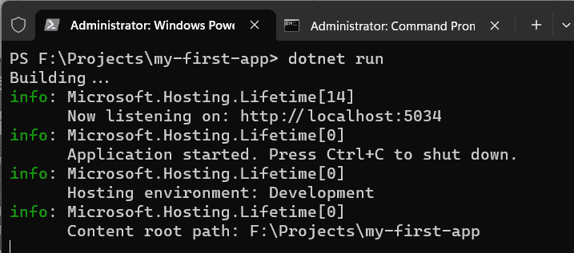
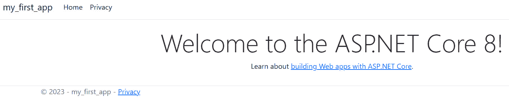

# 第一章：介绍 ASP.NET Core 9 概念

在开始使用 ASP.NET Core 9 平台开发解决方案之前，我们必须学习基础知识以及如何准备环境，还要熟悉开发过程中将使用的主要概念。

在本章中，我们将学习如何准备我们的开发环境，了解 .NET 和 .NET Framework 之间的差异，并查看 ASP.NET Core 9 中的新特性。

本章我们将涵盖以下主题：

+   为什么选择 ASP.NET Core 9？

+   比较 .NET 和 .NET Framework

+   准备我们的开发环境

+   ASP.NET Core 9 中的新特性

我的目的是向您介绍 ASP.NET Core 9 的主要概念以及如何使用这个强大的平台来交付基于 Web 的应用程序。我将解释平台的基础知识，为您提供有关 .NET 和 .NET Framework 之间的差异以及如何准备自己的 Windows、Mac 或 Linux 环境的背景信息，您将在本书的结尾之前一直使用这个环境。此外，我们将学习这个平台上最重要的改进，这些改进在几年中增加了新功能。让我们开始学习 ASP.NET Core 9 的基础知识。

# 技术要求

为了充分利用本书中将要分享的所有知识，重要的是您能够访问一台具有管理员权限的计算机，以及互联网访问权限。

其他必要的软件将在本章及本书的其余部分中根据需要分享。

您可以在以下存储库中找到本书中使用的所有代码示例和其他材料：[`github.com/PacktPublishing/ASP.NET-Core-9.0-Essentials`](https://github.com/PacktPublishing/ASP.NET-Core-9.0-Essentials)。

# 为什么选择 ASP.NET Core 9？

ASP.NET core 是一个自 2016 年以来就存在的平台，它一直在不断改进，允许开发高性能、现代和云就绪的解决方案。

几年前，仅能在 Windows 操作系统上使用 .NET 平台开发解决方案。然而，随着巨大的市场需求和技术快速演进，微软开始了一项单向的重构和平台重新设计过程，采用开源模式，这为开发者社区提供了采用稳健的开发模型的机会，该模型独立于操作系统。

最后一个仅能在 Windows 操作系统上运行的 ASP.NET 的重要版本是 4.x，经过重新设计后，该平台被更名为 *ASP.NET Core*，目前处于 9 STS（标准长期支持）版本。

最近，ASP.NET Core 9 已经成为一个极其丰富的平台，能够提供针对不同类型目的的解决方案，更重要的是，它得到了开源社区的全面支持和关注。

使用 ASP.NET Core 9 为我们提供了一套丰富的工具，具有以下优势：

+   开发 Web UI 解决方案的能力

+   开发 Web API 的能力

+   操作系统的互操作性

+   云就绪性

+   高性能

+   与现代客户端框架的集成

+   使用最佳实践和设计标准

它是一个完整的平台，统一了使用最佳实践、技术和其他方面开发丰富解决方案所需的一切，这些内容你将在本书的章节中了解到。

性能改进

ASP.NET Core 9 相比 ASP.NET Core 7 有几个重要的性能改进，使其成为迄今为止性能最好的版本。以下是一些重要的改进点：

**- 更快的执行和启动**：ASP.NET Core 9 比之前的版本更快。每个版本都收到了来自技术社区的许多贡献。负责应用程序执行的运行时有一些改进，例如循环优化、许多其他代码生成和垃圾回收器的改进。

**- 最小 API 性能**：根据基准测试，新版本的最小 API 比上一个版本快 15%，内存消耗减少了 93%。

**- 本地 AOT (提前编译)**: ASP.NET Core 9 对本地 AOT 的支持得到了扩展，允许应用程序编译成本地代码，从而减少磁盘占用，提高启动时间，并降低内存消耗，这对于云原生环境来说是非常理想的。

**- ML.NET**：ML.NET 4.0 版本的重要改进使得与机器学习模型的集成成为可能，增加了对现代 IA 模型必要的分词器支持。

**- .NET Aspire**：.Net Aspire 在上一个版本 .Net 9 中引入，为在 ASP.NET Core 9 中构建可观察的、生产就绪的、分布式应用程序提供了一个改进的云就绪堆栈。在开发阶段与云原生方法相关的许多问题都通过 .NET Aspire 被抽象化，结合了几个 Nuget 包和项目模板。

**- .NET MAUI**：.Net MAUI（多平台应用程序 UI）提供了一种统一的方式来开发针对 Web 和移动平台（包括 iOS 和 Android）的应用程序。.NET MAUI 有质量改进，如测试覆盖率、端到端场景测试和错误修复。现在，作为 ASP.NET Core 9 的项目模板的一部分，有一个混合项目，其中包括与 Blazor 集成的 MAUI。通过这个项目，软件工程师能够交付不仅适用于 Web，也适用于移动和 Windows 的应用程序。

**- Entity Framework Core**：Entity Framework Core 是 .Net 中最强大的功能之一，提供了一种使用 ORM（对象关系模型）的方法来抽象应用程序和数据库之间的通信。在新版本中，添加了一些更多功能和改进，如 Azure Cosmos DB NoSQL 提供程序和 AOT（提前编译）工作能力。

**- ASP.NET Core**：整个 ASP.NET Core 平台在 Blazor、SignalR、最小 API、身份验证和授权以及更好的 OpenAPI 支持方面有许多改进。

**- Swagger:** 生成 API 文档最著名的库之一，Swagger，来自**Nuget**包**Swashbuckle.AspNetCore**的 Swagger 将不再成为 ASP.NET Core 9 的默认 API 模板的一部分。这是由于在.NET 项目中减少对这个库的依赖，并提高对 Open API 的支持，Open API 是一种与语言无关且平台中立的基于 Web 的 API。

更多详情，请查看以下链接：[`devblogs.microsoft.com/dotnet/performance-improvements-in-net-9/`](https://devblogs.microsoft.com/dotnet/performance-improvements-in-net-9/)。

然而，在开始准备我们的环境并使用 ASP.NET Core 9 之前，在下一节中，让我们通过比较.NET 平台和.NET Framework，来了解平台是如何在微软和开源社区的合作下不断演进的。

# 比较.NET 和.NET Framework

.NET 和.NET Framework（通常称为**完整框架**）有相似之处——那就是它们是允许我们提供优秀解决方案的平台。

通常，平台是一个框架，它包含一系列功能，使我们能够开发不同类型的应用程序。2002 年 2 月，.NET Framework 引入了一种新的开发模型，使用集中式平台，允许我们通过 Windows Forms、ASP.NET Web Forms、ASP.NET MVC 等技术来开发 Windows 和 Web 应用程序，以及其他一些扩展。

从最初版本开始，就已经可以在不同的语言中开发应用程序，例如 C#、Visual Basic，以及任何实现了.NET Framework 规范的其它语言。然而，它依赖于 Windows 操作系统及其系统 API。

.NET Core 平台的演变和重新设计为微软生态系统带来了许多好处，同时保持了作为一个统一平台开发强大解决方案的主要思想。可以使用 C#、F#，甚至 Visual Basic 等语言进行开发。

结构化和重新设计意味着.NET 核心平台，现在称为.NET，是以模块化方式开发的，并且独立于操作系统，得到了开源社区的支持。

现在，整个.NET 平台生态系统由.NET 基金会（[`dotnetfoundation.org/`](https://dotnetfoundation.org/)）维护，这是一个非营利性、独立组织，它支持整个开源平台生态系统。因此，为.NET 社区创造了新的可能性，包括减少框架新版本交付的领先时间，这些新版本包含新功能和错误修复。

.NET 平台的新版本每年发布一次，每年 11 月，以 STS（**标准长期支持**）版本发布，在偶数年发布并支持 18 个月，或者 LTS（**长期支持**），在奇数年发布并支持三年。还有每月的补丁更新，这些更新可以加快问题的敏捷修正和漏洞的修复，保持每个补丁之间的兼容性，并消除更新带来的更大风险。

了解平台更新过程可以为开发时间带来巨大好处，因为更新可能会引起应用程序的非一致性，从而产生几个问题。

微软提供了一个完整的路线图，其中包括添加到平台中的功能，以及改进的实施，最重要的是，修复了错误和漏洞。请将路线图链接保存为浏览器中的收藏夹：[`github.com/MoienTajik/AspNetCore-Developer-Roadmap`](https://github.com/MoienTajik/AspNetCore-Developer-Roadmap) 。

现在我们已经了解了一些平台的基本知识，让我们在不同的操作系统上准备我们的开发环境。

# 准备我们的开发环境

.NET 平台提供了一套工具，无论使用哪种操作系统，都可以为开发者提供最佳体验。

ASP.NET Core 9 应用程序可以在 Windows、Linux 和 macOS 操作系统上开发和运行。

本书将展示代码片段，以通过实际示例演示 ASP.NET Core 9 的概念。所有支持材料都可以在 GitHub 仓库中找到，该链接可在 *技术要求* 部分找到：[`github.com/MoienTajik/AspNetCore-Developer-Roadmap`](https://github.com/MoienTajik/AspNetCore-Developer-Roadmap) 。

在本节中，我们将配置三个操作系统上的环境，并创建我们的第一个 ASP.NET Core 9 项目，但首先，让我们看看我们需要准备哪些东西才能开始。

## 开发工具

我们可以使用任何文本编辑器开发 ASP.NET Core 9 应用程序，然后使用 SDK（**软件开发工具包**）编译开发代码，这将在下一节中讨论。

微软提供了两个代码编辑工具，Visual Studio 和 Visual Studio Code。

Visual Studio Code 是一个丰富、可扩展且轻量级的代码编辑器，使得开发任何类型的应用程序成为可能。这是一个免费工具，有多个扩展，被社区广泛使用，并且可以在任何操作系统上运行。

相反，Visual Studio 是 IDE 的更强大版本，除了支持开发的一些视觉功能外，还包含应用程序分析等工具，以及丰富的调试工具。Visual Studio 仅在 Windows 操作系统上运行，并且必须购买许可证。然而，Microsoft 提供了一种名为 Visual Studio Community 的免费版本，尽管有一些限制，但提供了出色的开发体验。在本书的剩余部分，我们将使用 Visual Studio Code 作为主要的代码编辑器，因为它可扩展，最重要的是，它是免费的。

Visual Studio for Mac

Microsoft 将不会继续开发 Visual Studio for Mac，其支持将于 2024 年 8 月 31 日结束。

## SDK 和运行时

在您的机器上安装.NET 平台时，可能会出现有关 SDK 和运行时的一些问题。

SDK 使我们能够开发和运行 ASP.NET Core 9 应用程序，而运行时仅包含运行应用程序所需的依赖项。

通常，我们总是选择在开发机器上使用 SDK；然而，在托管环境中，只需要运行时。我们将在*第十章*中更详细地讨论托管应用程序。

## CLI（命令行界面）

除了.NET 和/或 Visual Studio Code 之外，还会安装一个广泛使用的**CLI**，本书中将大量使用。

CLI（命令行界面）不过是通过命令行执行的软件，允许您执行不同目的的任务，例如以下命令：

```cs
dotnet new webapp --name hello-world
```

此处的 CLI 命令称为**dotnet**。此命令有一些参数，用于确定将要执行的任务类型。

简而言之，之前的命令创建了一个名为（**new**）**webapp**的新项目，名称为（**--** **name**）**hello-world**。

CLI 工具提供了极大的灵活性，避免了 UI 依赖，可扩展，并允许我们通过脚本使用自动化策略。

在本书中，我们将使用一些 CLI 命令来支持解决方案开发和学习。

在接下来的几节中，我们将探讨在所有三种操作系统上安装 ASP.NET Core 9 SDKs。

## Windows 安装

Windows 为安装.NET 平台 SDK 提供了以下选项：

+   与 Visual Studio 一起安装。

+   使用 Windows 包管理器**Winget**。可以通过运行以下命令安装 SDK：

    ```cs
    winget install -e --id Microsoft.DotNet.SDK.9
    ```

+   通过 PowerShell。

然而，我们将通过 Visual Studio 进行安装，但如果您希望使用其他安装选项，请查看此链接：[`learn.microsoft.com/en-us/dotnet/core/install/windows`](https://learn.microsoft.com/en-us/dotnet/core/install/windows)。

通过 Visual Studio 的安装非常简单，只需几个步骤：

1.  前往[`visualstudio.microsoft.com/`](https://visualstudio.microsoft.com/)。

1.  下载 Windows 版本的 Visual Studio 并保存。下载后，运行以下文件：**VisualStudioSetup.exe**。

1.  安装后，找到 **VisualStudioSetup.exe** 文件，运行它，然后点击 **继续**。



图 1.1 – Visual Studio 安装程序消息

1.  在 **工作负载** 选项卡上，选择 **ASP.NET 和 Web 开发** 选项：



图 1.2 – Visual Studio 安装选项

1.  然后，点击安装按钮并继续安装。

## macOS 安装

macOS 提供了一个可执行文件，允许您遵循简单的安装过程：

1.  从 [`dotnet.microsoft.com/download/dotnet`](https://dotnet.microsoft.com/download/dotnet) 下载 .NET 平台。

1.  选择最适合您处理器的版本（ARM64 或 x64）

1.  下载后，运行安装程序并完成步骤以完成安装。

支持的版本

微软不支持 6 版本之前的 .NET。从版本 6（LTS）开始，支持当前苹果处理器。

关于在 macOS 上安装的更多详细信息，请参阅此链接：https://learn.microsoft.com/en-us/dotnet/core/install/macos。

## Linux 安装

.NET 支持多个 Linux 版本。对于下一步，我们将关注 Ubuntu 22.04 版本，并将根据微软提供的脚本运行此过程：

1.  访问命令行终端，并在您的家目录中创建一个名为 **dotnet-install** 的文件夹。

1.  使用以下命令下载微软提供的 **sh** 脚本：

    ```cs
    wget https://dot.net/v1/dotnet-install.sh -O dotnet-install.sh
    ```

1.  在运行脚本之前，您需要使用以下命令添加权限：

    ```cs
    chmod +x ./dotnet-install.sh
    ```

1.  现在，运行安装命令：

    ```cs
    ./dotnet-install.sh --version latest
    ```

1.  此命令将安装最新的 SDK 版本。

依赖项

.NET 平台依赖于一些特定于每个 Linux 版本的库。有关更多详细信息，请参阅以下链接：https://learn.microsoft.com/en-us/dotnet/core/install/linux-ubuntu#dependencies。

接下来，让我们安装 Visual Studio Code。

## Visual Studio Code

Visual Studio Code 是一个优秀的编辑器，其安装非常简单。

只需访问 [`code.visualstudio.com/download`](https://code.visualstudio.com/download) ，下载适用于您操作系统的版本，运行安装程序，并完成步骤。

### 代码命令

安装完成后，Visual Studio Code 也会安装其 CLI。在 Windows 和 Linux 系统上，CLI 通常会自动添加到系统 *PATH 环境变量* 中。在 macOS 上，需要额外的配置。为此，请按照以下步骤操作：

1.  按下 *CMD* + *Shift* + *P* 键。

1.  输入以下命令：

    ```cs
      Install 'code' command in PATH
    ```

1.  按 *Enter* 键，CLI 将被添加到 *Path* 环境变量中。

现在是验证环境功能的时候了，为此，我们将创建我们的第一个项目。

## 测试开发环境

在安装了编辑器、代码和 SDK 之后，是时候创建我们的第一个应用程序并确保环境在整本书中都能正常工作了。

在此步骤中，我们将使用终端或 Bash、dotnet CLI 以及 Visual Studio Code 作为 IDE。我们将使用命令行创建一个简单的 Web 应用程序。

要这样做，打开命令终端或 bash 并遵循以下说明：

1.  在您喜欢的目录下，创建一个名为 **Projects** 的文件夹：

    ```cs
    mkdir Projects
    ```

1.  使用以下命令访问创建的文件夹：

    ```cs
    cd projects
    ```

1.  现在，运行以下命令：

    ```cs
    dotnet new
    ```

    **dotnet new** 命令需要一些指令，以便我们继续创建项目。运行它时，会显示以下指令：



图 1.3 – 执行 dotnet new 命令

1.  与 Visual Studio 类似，.NET CLI 在创建项目时有一些模板。您可以通过输入高亮显示的命令来查看已安装在您机器上的模板：



图 1.4 – 可用的 dotnet 模板

1.  我们将继续在 MVC 模板中创建一个 Web 应用程序。为此，请运行以下命令：

    ```cs
    dotnet new mvc --name my-first-app
    ```

    之前的命令基本上是创建项目类型的模板。在这种情况下，我们将使用 MVC 模型，这是一个使用 **模型-视图-控制器** ( **MVC** ) 架构模式的程序。在此阶段，不必担心这些细节。我们将在整本书中学习更多关于 .NET CLI 工具、项目模型和 MVC 模型的知识。

1.  现在，使用以下命令访问创建的应用程序的目录：

    ```cs
    cd my-first-app
    ```

1.  接下来，让我们使用以下命令打开 Visual Studio Code，对应用程序的源代码进行一些修改：

    ```cs
    code .
    ```

1.  之前的命令将在之前创建的应用程序目录中打开一个新的 Visual Studio Code 实例。



图 1.5 – 在 Visual Studio Code 中打开的第一个应用程序

1.  在 Visual Studio Code 中，定位到 **Views** | **Home** 文件夹中的 **index.cshtml** 文件。

1.  将 **index.cshtml** 文件的第 6 行替换为以下代码，然后选择 **文件** | **保存**，或者直接按 *Ctrl* + *S*：

    ```cs
    <h1 class="display-4">
      Welcome to the ASP.NET Core 9!
    </h1>
    ```

1.  返回终端或 bash 并运行以下命令：

    ```cs
    dotnet run
    ```



图 1.6 – 运行 dotnet run 命令

如果您看到如图 1.6 所示的消息，则表示您的环境配置正确。

1.  现在，访问浏览器并输入显示的地址，例如 **http://localhost:5034**。

    注意您的终端地址，因为应用程序执行端口可能不同。



图 1.7 – 应用程序正在运行

如果所有之前的步骤都执行成功，这意味着您的代码编辑器配置正确，同样 .NET SDK 也配置正确。

如果有任何问题，请根据您的操作系统回顾安装步骤。

在我们的环境配置完成后，我们准备继续学习该平台并实现书中提出的示例。

# ASP.NET Core 9 中有哪些新特性？

由于它是开源的，并且不依赖于任何操作系统，因此 .NET 平台在近年来收到了几项改进，进一步提升了开发者的体验，并不断带来社区不断请求的几个新特性，此外，还有性能提升和错误修复。

一些改进如下：

+   **原生 AOT**：此选项是在框架的 7.0 版本中引入的，用于创建一个自包含的应用程序，在一个文件中，增加了对 macOS 的 x64 处理器和 ARM64 架构的支持，并在 Linux 环境中大大减少了文件大小，达到高达 50% 的减少。

+   **序列化库的改进**：应用程序不断与 JSON 数据交互，并且 .NET 本身的 **System.Text.Json** API 一直在不断修订和改进，避免了依赖第三方库，并显著提高了其性能和支持。

+   **性能**：性能提升了大约 15%。您可以点击此链接查看更多性能改进详情：[`learn.microsoft.com/en-us/aspnet/core/release-notes/aspnetcore-8.0?view=aspnetcore-8.0`](https://learn.microsoft.com/en-us/aspnet/core/release-notes/aspnetcore-8.0?view=aspnetcore-8.0)。

这些以及其他许多特性可以直接从以下链接的平台路线图中进行咨询：[`github.com/dotnet/aspnetcore/issues/44984`](https://github.com/dotnet/aspnetcore/issues/44984)。

.NET 路线图由社区、微软和 .NET 基金会维护和更新得非常好。正是这种来自社区的巨大支持，以及其他参与的公司和组织，使得 .NET 成为了不同目的的强大开发平台。通过满足市场的其他需求，它显著提高了基于 Web 的解决方案的开发选项，使用不同的方法来满足不同的需求。

# 摘要

在本章中，我们学习了 .NET 平台和 ASP.NET Core 9，它们可在主要操作系统上使用。我们学习了 .NET 和 .NET Framework 之间的区别，以及学习框架版本更新过程和 STS 与 LTS 版本之间的区别。我们还配置了不同操作系统上的开发环境，并开发了一个 ASP.NET MVC 应用程序，验证了整个工作环境。

在*第二章*中，我们将使用已经配置好的环境来学习在 ASP.NET Core 9 中开发 UI 的不同方法和选项。
