# 第六章：提高安全和质量

在快速发展的数字世界中，新的网络威胁以惊人的频率出现，基于 Web 的应用程序安全不仅仅是特性，而是基本需求。因此，为了使应用程序能够应对各种现有漏洞，软件工程师必须将安全性视为基于 Web 解决方案整个开发流程的一部分，以便他们可以保护数据，保证完整性和可用性，并最小化可能损害组织的威胁。

在本章中，我们将了解每个 Web 开发者都应该掌握的基本安全原则，特别是关于 ASP.NET Core 9 作为一个强大的平台，如何帮助我们创建安全、高级的应用程序。

首先，我们将探讨网络安全的基本原则，理解在开发 Web 解决方案的所有阶段都必须考虑安全性。

接下来，我们将讨论身份验证和授权的概念，这两个概念在用户和应用程序、以及应用程序和外部应用程序相互交互时都常用。一旦我们更好地理解了授权和身份验证流程，我们将使用 ASP.NET Core Identity 框架为 API 项目添加安全性，并了解 ASP.NET Core 9 中一些重要的方法，这些方法允许我们加强应用程序中的安全机制。

在本章中，我们将涵盖以下主题：

+   理解基于 Web 应用程序的安全原则

+   比较授权和身份验证

+   使用 ASP.NET Core Identity 框架

+   加强应用程序安全

为了在本章中获得良好的学习体验，我们必须准备一些工具，这些工具对我们充分利用将要介绍的概念至关重要。

# 技术要求

为了完成本章，以下工具必须存在于您的开发环境中：

+   **Docker**：必须在您的操作系统上安装 Docker Engine，并运行一个 SQL Server 容器。您可以在*第四章*中找到有关 Docker 和 SQL Server 的更多详细信息。

+   **Postman**：我们将使用此工具执行发送到开发应用程序 API 的请求。

+   **Azure Data Studio**：我们将使用此工具连接到 SQL Server 数据库，以便我们可以执行 SQL 脚本。

本章的代码示例可以在本书的 GitHub 存储库中找到：[`github.com/PacktPublishing/ASP.NET-Core-9.0-Essentials/tree/main/Chapter06`](https://github.com/PacktPublishing/ASP.NET-Core-9.0-Essentials/tree/main/Chapter06)。

# 理解基于 Web 应用程序的安全原则

每年，针对最多样化的环境和设备，都会出现新的解决方案开发方法。随之而来的是各种挑战。以前专注于 HTML、CSS、JavaScript 和所选编程语言的 Web 应用开发已不再是现实。

软件工程师开始服务于编程 IDE 环境之外的其它上下文，通常与 iInfrastructure 合作，增加了与 DevOps 文化方法一同出现的众多框架和工具，以及持续的价值交付。

DevOps 文化带来了一种新的工作模式，团队避免了孤岛效应，在交流知识的同时共同工作，因此，一个越来越出现在解决方案开发者生活中的主题是**安全**。安全这个术语早已不再是一个仅针对网络安全团队的孤立主题。它现在在设计的第一阶段就至关重要，必须考虑在解决方案的所有方面。

关注应用和数据的威胁以及控制和管理工作已成为至关重要的因素，甚至对公司和使用应用的用户来说是一个战略性的因素。从数据处理的角度来看，有许多安全标准和政策，例如欧洲的**通用数据保护条例**（**GDPR**）。

安全性非常重要，ASP.NET Core 9 提供了多种机制，我们可以利用这些机制来应对通过避免威胁和保持应用的安全和可靠性所提出的挑战。

然而，我们必须了解安全方面是如何应用于 Web 应用以及常见漏洞的，以及 ASP.NET Core 9 是如何防止应用中出现威胁的。

## Web 应用中的安全主题

如我们在前面的章节中已经学到的，一般来说，一个 Web 应用有两个主要组件：前端，负责与用户交互，以及后端，负责处理应用的业务规则，提供控制和与数据层交互。

大多数 Web 应用，无论是客户端/服务器应用还是**单页应用**（**SPAs**），都以某种方式使用上述方法。如图*图 6.1*所示，几个组件是前端和后端交互的一部分，例如通信协议、请求、响应、HTTP 头、浏览器、应用服务器、数据库、TCP 协议、凭证、cookies 和本地存储（浏览器）等：

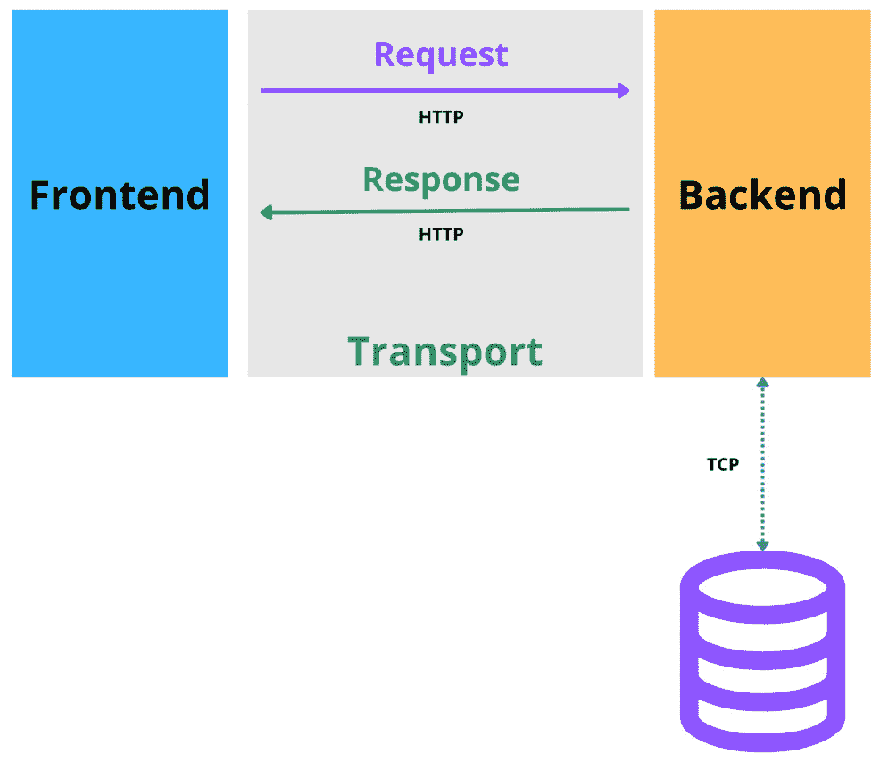

图 6.1 – 单页应用（SPA）的组件

正如我们所看到的，几个组件相互通信。同样，几个漏洞可能会损害你应用的安全性。在某些情况下，信息泄露可能对组织产生严重后果。

作为前提，软件工程师必须从最初的设计阶段就设定一个安全方面，这通常不仅与通信协议和系统之间的交互有关，还与代码开发有关。

假设，在开发过程中，一位软件工程师做出了一项非常重要的更改，旨在修复应用程序中的一个关键问题。为了快速执行更正，软件工程师使用 SQL 命令和字符串连接创建了与数据库的通信。在完成测试后，工程师将代码提交到 Git 仓库，以便更新系统。没有进行代码审查，几分钟内，修复就进入了生产环境。

那么，这个场景中有什么问题呢？最初，软件工程师在快速响应应用程序中发现的问题并进行了更正时表现正确，一切恢复正常。然而，他们与数据库通信的方法中存在一个漏洞，恶意用户可以通过所谓的**SQL** **注入攻击**来利用这个漏洞。

让我们看看一些容易受到 SQL 注入攻击的代码示例：

```cs
using System;
using System.Data.SqlClient;
public class VulnerableDataAccess
{
  private string connectionString = "TheConnectionString";
  public void GetUserData(string username)
  {
    string query = "SELECT * FROM Users WHERE
      Username = '" + username + "'";
    using (SqlConnection connection = new
      SqlConnection(connectionString))
    {
      SqlCommand command = new SqlCommand(query,
        connection);
      try
      {
        connection.Open();
        SqlDataReader reader = command.ExecuteReader();
        while (reader.Read())
        {
          Console.WriteLine(String.Format("{0}, {1}",
            reader["Username"], reader["Email"]));
        }
        reader.Close();
      }
      catch (Exception ex)
      {
        Console.WriteLine(ex.Message);
      }
    }
  }
}
```

在前面的代码中，SQL 查询是通过直接将用户的输入（用户名）连接到 SQL 字符串中构建的。这是一种危险的做法，因为它允许攻击者通过向**username**变量注入 SQL 代码来更改预期的 SQL 查询。例如，如果用户输入类似**'; DROP TABLE users; --**的内容，生成的 SQL 查询将如下所示：

```cs
SELECT * FROM Users WHERE Username = ''; DROP TABLE Users; --'
```

这将执行**DROP TABLE**语句，可能会破坏数据。

因此，即使有很好的意图，这样的简单更改也可能产生重大影响。同样，通过实施代码审查，简单的流程可以避免这种情况。代码审查是一种实践，其中工程团队成员分析应纳入主代码的代码，以寻找任何缺陷，评估代码模式和复杂性等。只有当代码满足质量和安全标准时，才能将其纳入主代码。

此外，在将新代码集成到主代码中时，可以执行自动化流程，其中可以添加**静态代码分析**机制。如果有任何无效的安全和质量标准，应用程序就不能交付到生产环境。我们将在*第十章*中了解更多关于自动化流程的内容。

静态代码分析

静态代码分析在安全检查、编码标准和循环复杂度分析等方面发挥作用，为与自动化技术相关的应用程序开发流程增加价值，这些自动化技术包括**持续集成**（**CI**）和**持续交付**（**CD**）。市场上有多款静态代码分析工具，其中最著名的是**SonarQube**（[`hub.docker.com/_/sonarqube`](https://hub.docker.com/_/sonarqube)）。它有一个社区版本，可以托管在任何环境中。然而，它在分析代码行数方面确实有一些限制。作为替代方案，还有一个作为**软件即服务**（**SaaS**）提供的版本，称为**Sonar Cloud**（[`www.sonarsource.com/products/sonarcloud/`](https://www.sonarsource.com/products/sonarcloud/)）。

将静态分析添加到开发流程中是一种非常好的做法。

在本章中，我们将探讨其他方法来使我们的应用程序更加安全，并讨论各种漏洞。但首先，让我们了解大多数应用程序都使用的一个常见安全模型，该模型基于两个基本过程：认证和授权。

# 授权与认证的比较

正如我们所学的，安全方面在应用程序开发流程中非常重要。尽管我们有着良好的意图，但我们可能会在我们的代码中包含漏洞，这些漏洞会直接影响我们的用户、应用程序和公司。

然而，除了代码之外，一些功能还需要安全流程。例如，某些服务平台（如电子邮件管理器）的情况就是这样，用户一旦通过登录获得访问权限，就可以私密地访问他们的消息。

登录功能非常重要，尽管它看起来是一个简单的流程，但它需要大量的关注。否则，根据应用程序的不同，可能会有后果。

如果在线银行平台登录时出现漏洞，会发生什么？这可能会给该银行的用户（以及银行本身）带来大问题。

现代系统在处理不同方面时与身份管理协同工作。正如前几章所讨论的，Web 应用程序可以向不同的 API 发起请求。API 允许公司以服务的形式提供业务，这促进了不同应用程序之间的多样化集成。因此，可以拥有具有不同类型功能的应用程序，这些功能可以为用户提供价值，例如地图 API、支付网关，甚至提供 AI 功能的服务 API。

为了使应用程序和 API 能够安全通信，需要一个基于身份的安全机制。有了这个机制，我们可以找出谁在请求某种类型的信息以及为什么。

这种安全机制分为两个概念：**认证**和**授权**。

通常，我们知道这种方法涉及登录流程。然而，理解认证和授权之间的区别是至关重要的。

## 认证

认证旨在回答问题，“你是谁？”：

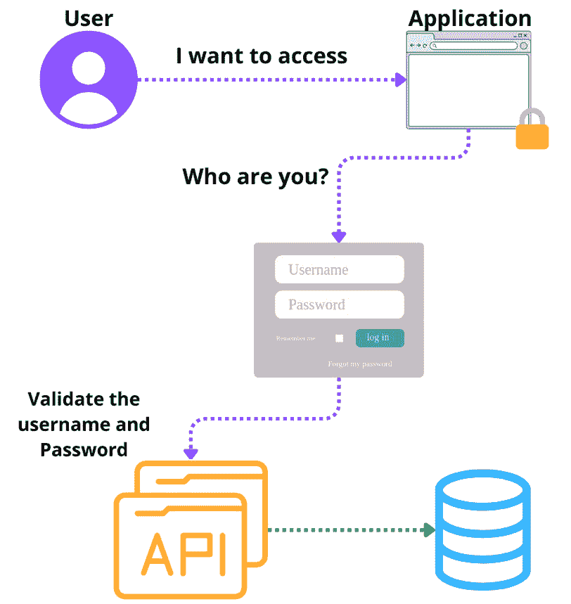

图 6.2 – 认证流程

*图 6* *.2* 展示了一个认证流程，其中通过登录表单提供了用户的凭证，例如他们的电子邮件和密码。

通过点击**登录**按钮将此信息发布到服务器，应用程序开始使用提供的凭证识别此用户。

如果根据这些凭证找到用户，那么应用程序就知道了谁想要访问系统。

然而，这只是过程的一部分。现在应用程序已经识别了用户，了解这个用户能做什么就很重要了。这是在授权过程中完成的。

## 授权

授权旨在回答问题，“这个用户能做什么？”：


图 6.3 – 使用授权流程检查权限

在识别用户后，应用程序开始识别用户的权限，如图 *图 6* *.3* 所示。

授权定义了用户可以行动的范围，无论是管理某些信息还是访问某种类型的数据，以及其他方面。授权流程通常通过角色识别用户，在应用程序的作用域内可以分组访问级别。

使用角色非常常见，因为可以将用户在应用程序中可能拥有的不同权限分组。

通常，认证和授权过程很简单。然而，为了能够安全地实现它们，我们必须了解一些标准：**OAuth 2.0** 和 **Open ID Connect**（**OIDC**）协议。

## 理解 OAuth 2.0 和 OIDC

想象一个高度安全的建筑。在这里，授权可以被认为是获得进入的许可，而认证则是验证你的身份。

OAuth 2.0 专注于授权，允许用户在平台之间（如社交媒体账户）授予对他们的数据的访问权限，而无需他们共享实际的密码。换句话说，我们允许其他应用程序访问我们信息的一定范围，而无需我们提供某些凭证，例如当我们使用微软、谷歌、Facebook 等平台的凭证登录某些平台时发生的情况。

基本的 OAuth 2.0 流程可以定义为以下：

1.  用户使用他们的社交媒体账户登录到一个新的应用程序。

1.  应用程序将用户重定向到社交媒体平台（授权服务器）。

1.  在登录社交媒体账户后，用户授权应用程序使用他们的数据（例如他们的姓名、电子邮件、个人资料照片等）。

1.  授权服务器为应用程序生成特殊的令牌。令牌用于获取用户数据（访问令牌）。在某些情况下，使用刷新令牌来提供访问新令牌。

1.  应用程序使用访问令牌从社交媒体平台安全地检索您的数据。

此过程涉及协商两个共享用户信息的应用程序，无需为每个新应用程序输入凭证，从而提高安全性和便利性。

另一方面，OIDC 建立在 OAuth 2.0 之上，增加了一个认证层。它利用 OAuth 授权框架通过像 Google 或 Facebook 这样的受信任提供者验证用户的身份。

让我们看看 OIDC 如何补充 OAuth 2.0：

1.  一些应用程序提供了使用其他社交媒体平台登录的能力。在这种情况下，在 OAuth 2.0 流程中，你不会登录到新的应用程序，而是被重定向到你的社交媒体登录页面（即 OpenID 提供者）。

1.  用户使用他们的社交媒体凭证进行身份验证，向 OpenID 提供者证明他们的身份。

1.  在用户同意的情况下，OpenID 提供者通过 ID 令牌将用户的基本个人资料信息（如姓名和电子邮件）与新的应用程序共享。

OIDC 启用诸如**单点登录**（**SSO**）等功能，允许您使用相同的登录凭证访问多个应用程序（例如，使用您的 Google 账户登录多个网站）。

尽管 OAuth 2.0 和 OIDC 流程相似且相互关联，但它们服务于不同的目的：

+   **重点**：OAuth 2.0 作用于授权（授予数据访问权限），而 OIDC 作用于认证层（验证用户身份）。

+   **信息共享**：OAuth 2.0 主要处理访问令牌，而 OIDC 引入了包含用户个人信息的 ID 令牌。

我们可以将 OAuth 2.0 视为一把打开房屋大门的钥匙，而 OIDC 则提供身份验证，以便这把钥匙可以被接收。

这种流程在我们使用的许多应用程序中都很常见，如图 *图 6.4* 所示：

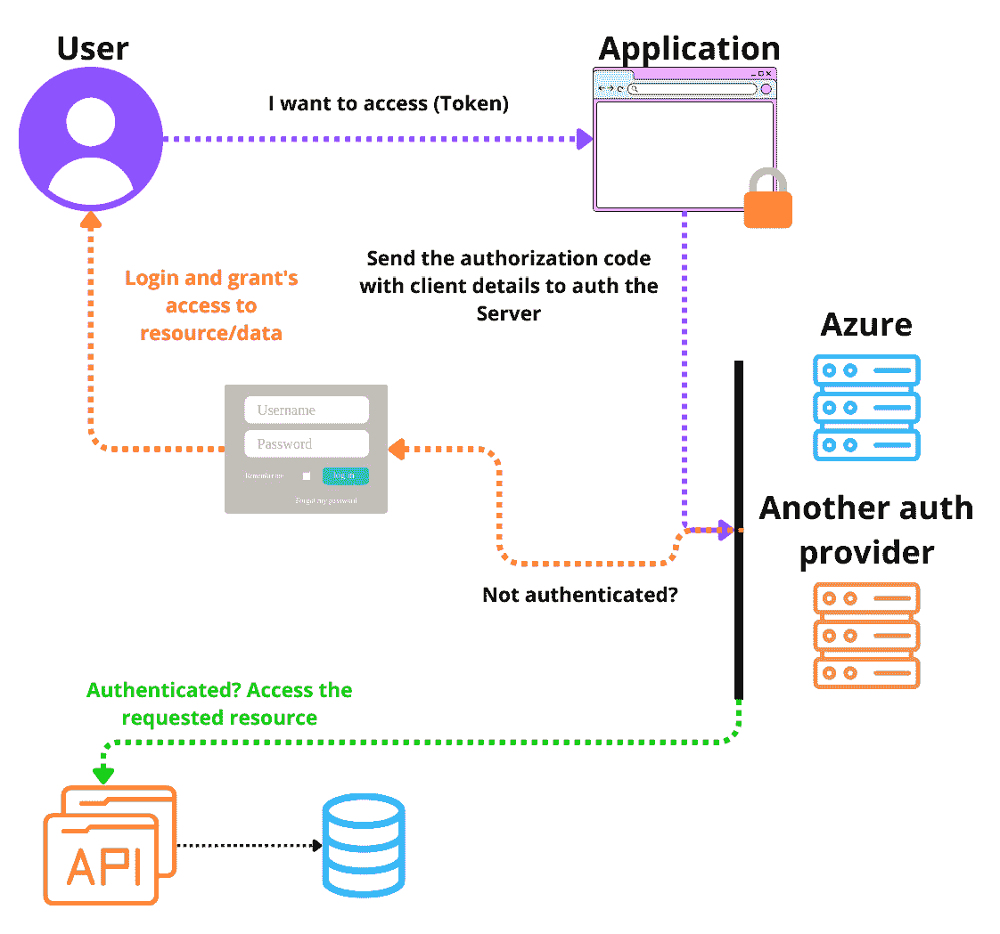

图 6.4 – 基本的 OAuth 2.0 流程

授权和认证流程被应用程序不断使用，允许两者识别用户身份并定义这些用户可以在 Web 系统或 API 中执行的类型权限。

尽管对 OAuth 2.0 和 OIDC 协议以及授权和认证的概念有直接的解释，但实施这种方法并不简单，并且依赖于一些重要的机制来确保这些功能正常运行。

因此，ASP.NET Core 9 提供了支持遵循之前概述的标准开发身份管理的抽象。实现这些资源的抽象称为 ASP.NET Core Identity。它随着框架的每个新版本而不断发展，允许团队在授权和认证流程中使用安全最佳实践，同时允许对其他身份提供者进行集成，并允许进行自定义。我们将在下一节中了解更多关于这种方法的信息。

# 使用 ASP.NET Core Identity 框架

现代应用程序与不同类型的技术、协议和标准进行交互。正如我们一直在学习的，在任何解决方案实现流程的任何级别，安全性都极为重要。关于授权和认证的主题，一本书很容易被专门讨论。

然而，ASP.NET Core 9 平台每年都在不断发展，因此，身份管理模型已经经历了多次改进，同时消除了某些依赖项。

为了能够在我们的应用程序中实现授权和认证，我们拥有 ASP.NET Core Identity。它是一个会员系统，为在 ASP.NET Core 9 中开发的基于 Web 的应用程序添加功能，并在认证和授权流程中运行。

ASP.NET Core Identity 可用的功能包括 API、UI、用户身份管理和凭证之间的数据库，以及授予和撤销权限的能力。这还包括与外部登录集成、**双因素认证**（**2FA**）、密码管理、能够阻止和激活账户以及在应用程序中提供认证等功能。

在我们学习如何将应用程序与 ASP.NET Core 身份集成之前，让我们更多地了解其结构。

## 理解 ASP.NET Core Identity 架构

ASP.NET Core Identity 的架构结构分为以下几层：

+   **身份管理器**：这些是负责实现涉及身份的业务逻辑的服务类。我们可以找到用于用户管理的 **UserManager** 类和用于角色管理的 **RoleManager** 类。

+   **身份存储**：身份存储是表示数据库中每条数据的领域实体。我们可以将身份存储视为数据库中的一个表，该表映射到诸如 **UserStore** 或 **RoleStore** 等类。

+   **数据访问层**：这些是具有与数据库交互所需逻辑的类，以便它们可以持久化和检索与身份相关的信息。

+   **数据源**：数据源是用于持久化的数据机制。默认情况下，ASP.NET Core Identity 使用 **SQL Server**。然而，还有其他数据库可供选择，并且可以自定义其他数据源。

这四层具有明确的职责，并且完全可扩展，为开发带来了灵活性，并允许根据组织所需的上下文定制身份机制。

ASP.NET Core Identity 管理身份验证和授权，并与以下类型的数据一起工作：

+   **用户**：这些代表应用程序中的用户。这个实体实现了一些基本属性，但它们可以很容易地进行扩展。

+   **用户声明**：这是一组关于用户的声明（声明）。声明向用户的身份添加信息。

+   **用户登录**：这些提供了有关与外部提供者（如 Facebook、Google、Microsoft 等）进行身份验证的信息，如果你的应用程序与这些提供者有任何集成。

+   **角色**：这些是授权组。

基于由 ASP.NET Core Identity 平台管理的信息，我们拥有了在应用程序中实现授权和身份验证流程所需的一切。然而，这是一个强大且高度可定制的框架，允许在身份类型上实施各种自定义。

自定义 Identity

如果你想要自定义 Identity，请查阅官方文档：[`learn.microsoft.com/en-us/aspnet/core/security/authentication/customize-identity-model?view=aspnetcore-9.0`](https://learn.microsoft.com/en-us/aspnet/core/security/authentication/customize-identity-model?view=aspnetcore-9.0)。

既然我们已经了解了 ASP.NET Core Identity 的架构结构，是时候将其添加到应用程序中了。

## 开始集成 ASP.NET Core Identity

现在我们对应用程序上下文中的一些安全视角有了更深入的了解，是时候使用 ASP.NET Core Identity 来添加授权和身份验证流程了。

作为基础，我们将使用本书 GitHub 仓库中提供的源代码，如 *技术要求* 部分所述，在那里你可以下载完整的解决方案。我们将使用的是我们在 *第五章* 中创建的 API 项目的版本，因为所有与数据库配置相关的假设都已创建。因此，我们将利用之前创建的 API 结构和数据库结构。目标是实现身份验证。

数据库设置

在启动一个新项目时，你需要配置 **EntityFrameworkCore** 并将应用程序连接到数据库，正如我们在 *第五章* 中所学的那样。这样，你就能轻松地跟随并配置 ASP.NET Core Identity。

对于这个应用程序，它是一个连接到 SQL Server 数据库的 Web API，我们将使用我们在*第五章*中学到的相同模型，并使用**EntityFrameworkCore**。为此，我们需要添加一个额外的库：**Microsoft.AspNetCore.Identity.EntityFrameworkCore**。这个库允许 Identity 与 Entity Framework Core 一起工作。

通过打开**WorkingWithIdentity.csproj**文件或在应用程序目录的终端中运行以下命令来确保此库已添加到您的项目中，以安装它：

```cs
dotnet add package Microsoft.AspNetCore.Identity.EntityFrameworkCore -v 8.0.2
```

创建 WorkingWithIdentity.csproj 项目

**WorkingWithIdentity.csproj**项目是一个受 ASP.NET Core Identity 保护的 Web API，它包含在本章的 GitHub 存储库中，如*技术要求*部分所述。但是，如果您想为自己创建项目，请按照以下步骤操作：

1. 打开您的操作系统终端，访问应创建项目的文件夹。

2. 运行以下命令以创建项目：

**dotnet new webapi -n WorkingWithIdentity**

3. 访问新项目文件夹：

**cd WorkingWithIdentity**

4. 添加以下 NuGet 包，所有这些包都是使用 SQL Server 数据库所必需的：

**dotnet add package Microsoft.EntityFrameworkCore**

**dotnet add package Microsoft.EntityFrameworkCore.SqlServer**

**dotnet add package Microsoft.EntityFrameworkCore.Design**

5. 确保您已安装**dotnet-ef**工具。要这样做，请运行以下命令：

**dotnet tool install --global dotnet-ef**

默认情况下，项目已经包含了**Microsoft.AspNetCore.Identity**库，因为我们创建项目时已经添加了它。然而，我们仍然需要遵循几个额外的步骤来配置项目。让我们首先配置数据库上下文，以便存储和 Identity 模型可以通过**EntityFramework**进行映射。

## 配置数据库上下文

为了让 ASP.NET Core Identity 能够管理**用户**、**角色**、**声明**和**令牌**，我们必须通过将此功能添加到**DbContext**类（负责与 SQL Server 数据库交互的类）来配置应用程序。

要做到这一点，我们必须更改位于本章存储库中参考项目**Context**目录下的**BankingDbContext**类。

第一步是将继承类更改为**IdentityDbContext<IdentityUser>**，它位于**Microsoft.AspNetCore.Identity.EntityFrameworkCore**命名空间中。一旦我们完成这个操作，我们将得到以下更新的类：

```cs
namespace WorkingWithIdentity.Context;
using Microsoft.AspNetCore.Identity;
using Microsoft.AspNetCore.Identity.EntityFrameworkCore;
using Microsoft.EntityFrameworkCore;
using WorkingWithIdentity.Model;
public class BankingDbContext : IdentityDbContext<IdentityUser>
{
    public BankingDbContext(DbContextOptions
      <BankingDbContext> options) : base(options)
    {
    }
     public DbSet<Account> Accounts { get; set; }
     public DbSet<Customer> Customers { get; set; }
     public DbSet<Movement> Movements { get; set; }
}
```

正如我们在*第五章*中学到的，**DbContext**类是**Entity Framework Core**的一个抽象，它允许应用程序与数据库交互，其中数据库中的每个实体都由**DbSet**类型的属性表示。这允许类映射到实体，反之亦然。

通过将 **BankingDbContext** 类的继承改为 **IdentityDb** **Context<IdentityUser>**，我们正在重用 ASP.NET Identity Core 的默认 **DbContext** 实现。这包含用于映射将成为数据库一部分的 Identity 表的 **DbSet** 类型。

为了确保所有数据库设置在应用程序中可用，打开 **Program.cs** 文件，并确保文件中存在以下代码行：

```cs
builder.Services.AddDbContext<BankingDbContext>(
  options =>   options.UseSqlServer(builder
  .Configuration.GetConnectionString("BankingDbContext")));
```

在 ASP.NET Core 依赖注入容器中配置 **DbContext** 类非常重要。在这种情况下，我们将 **BankingDbContext** 类添加到依赖注入上下文，同时配置了使用 SQL Server，其连接将基于 **ConnectionString** 值，该值作为参数传递给 **UseSqlServer** 方法。这个 **ConnectionString** 通过应用程序设置获得，在这种情况下，可以在 **appsettings.json** 文件中找到。

到目前为止，我们已经有了所有必要的配置，以便在数据层中配置 ASP.NET Core Identity。在下一节中，我们将更新数据库，以便我们可以添加用于身份管理的必要表。

## 更新数据库

在 *第五章* 中，我们创建了一个模拟数字银行操作的 API，并使用 Entity Framework Core 连接到数据库。对于这个例子，我们将使用相同的数据库——即 **dbBanking**。目前，它具有以下数据结构：


图 6.5 – dbBanking 数据库的结构

**dbBanking** 数据库由四个表组成，其中三个是应用程序上下文的一部分——即 **dbo.Accounts**、**dbo.Customers** 和 **dbo.Movements**。第四个表，**dbo.EFMigrationsHistory**，负责管理使用迁移对数据库所做的更改的状态。

数据库迁移

在 *第五章* 中，我们探讨了迁移的工作原理、它们在应用程序开发中的重要性以及可以动态对数据库进行的更改。如果您想了解更多关于 ASP.NET Core 9 迁移的信息，请参阅 [`learn.microsoft.com/en-us/ef/core/managing-schemas/migrations/?tabs=dotnet-core-cli`](https://learn.microsoft.com/en-us/ef/core/managing-schemas/migrations/?tabs=dotnet-core-cli)。

**dbo.EFMigrationsHistory** 表包含为银行 API 创建的第一个实体的历史记录。您可以通过应用程序目录结构中的代码生成的历史记录进行检查，如图 *图 6* *.6* 所示：


图 6.6 – API 的迁移类

这些类是由 Entity Framework Core 命令行工具自动生成的，不应手动更改。

在修改了 **DbContext** 类并添加了 ASP.NET Core Identity 模型之后，我们必须更改数据库。为此，我们将创建一个新的迁移。

要执行此操作，请打开您选择的终端，访问 **WorkingWithIdentity** 应用程序的根目录，并执行以下命令：

```cs
dotnet ef migrations add IdentityModels
```

上述命令使用了 Entity Framework Core 的 **ef** 工具，并添加了一个名为 **IdentityModels** 的迁移。

再次，当打开项目的 **Migrations** 文件夹时，我们可以分析创建了哪些新类，如图 *图 6* *.7* 所示：


图 6.7 – Identity 模型的迁移类

现在我们有了数据库的迁移结构，我们必须更新 **dbBanking** 以包括 Identity 表。为此，在您的首选终端中，在项目目录中运行以下命令：

```cs
dotnet ef database update
```

上述命令读取项目中的迁移，分析数据库中 **dbo.EFMigrationsHistory** 表中的迁移历史，并应用更新，在这种情况下涉及创建 ASP.NET Core Identity 正确工作所需的表。我们将看到创建的新表：

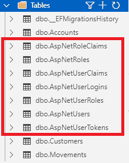

图 6.8 – 数据库现在包含 ASP.NET Core Identity 表

通过这样，所有与数据模型相关的 ASP.NET Core Identity 基本设置都已成功添加。然而，我们还需要向项目中添加一些其他配置，以便应用程序能够处理授权和身份验证。因此，在下一节中，我们将向应用程序的依赖注入上下文中添加 ASP.NET Core Identity 服务。

## 添加 ASP.NET Core Identity 服务和路由

Asp.Net Core Identity 包含处理授权和身份验证机制所需的抽象，这些抽象使用依赖注入容器中可用的服务，以及用于身份验证和令牌生成的工具。

然而，有必要显式激活这些抽象。为此，我们必须向应用程序中添加几行代码。打开 **Program.cs** 文件以便我们可以编辑它们。在此阶段，我们必须遵循以下步骤：

1.  添加所需的 Identity 命名空间 – 即，**using Microsoft.AspNetCore.identity;**。

1.  将负责确定用户身份的认证服务以及认证方法添加到依赖注入容器中。在这种情况下，我们将使用一个 bearer 令牌：**builder.Services.AddAuthentication().AddBearerToken();**。

1.  通过运行 **builder.Services.AddAuthorization();** 向依赖注入容器添加授权服务。

1.  通过运行 **builder.Services.AddIdentityApiEndpoints<IdentityUser>().AddEntityFrameworkStores<BankingDbContext>();** 来添加 Identity API 并通过 Entity Framework Core 配置数据访问。

1.  使用 **app.MapIdentityApi<IdentityUser>();** 映射 Identity 端点。

1.  将每个请求身份验证中间件添加到应用程序的请求处理管道中，使用由 **AddAuthentication()** 定义的设置来验证和定义用户的身份：**app.UseAuthentication();** 。

1.  添加中间件以检查授权策略与已认证用户的身份，以确定用户是否被允许继续当前请求：**app.UseAuthorization();** 。

    通过这些更改，我们将在 **Program.cs** 文件中获得以下完整代码：

    ```cs
    using Dapper;
    using Microsoft.AspNetCore.Identity;
    using Microsoft.Data.SqlClient;
    using Microsoft.EntityFrameworkCore;
    using Microsoft.EntityFrameworkCore.SqlServer;
    using WorkingWithIdentity.Context;
    using WorkingWithIdentity.Model;
    using WorkingWithIdentity.RouteHandler;
    var builder = WebApplication.CreateBuilder(args);
    builder.Services.AddAuthentication().AddBearerToken();
    // Adding the Authorization Services from the Asp.Net Core Identity
    builder.Services.AddAuthorization();
    // Configure the Database access for the Asp.Net Core Identity
    builder.Services.AddIdentityApiEndpoints
      <IdentityUser>()
        .AddEntityFrameworkStores<BankingDbContext>();
    builder.Services.AddEndpointsApiExplorer();
    builder.Services.AddSwaggerGen();
    builder.Services.AddDbContext<BankingDbContext>
      (options => options.UseSqlServer(builder
        .Configuration.GetConnectionString(
          "BankingDbContext")));
    builder.Services.AddScoped(_ => new SqlConnection
      (builder.Configuration.GetConnectionString(
        "BankingDbContext")));
    var app = builder.Build();
    // Configure the HTTP request pipeline adding the ASP.NET Core Identity routes
    app.MapIdentityApi<IdentityUser>();
    // Configure the HTTP request pipeline.
    if (app.Environment.IsDevelopment())
    {
        app.UseSwagger();
        app.UseSwaggerUI();
    }
    app.UseHttpsRedirection();
    app.RegisterAccountRoutes();
    app.RegisterCustomerRoutes();
    app.MapGet("GetAllCustomersUsingDapper", async(SqlConnection connection) =>
    {
      var customers = await connection
        .QueryAsync<Customer>("SELECT Id,
        Name FROM Customers ORDER BY Name");
        return Results.Ok(customers);
    });
    app.MapGet("GetCustomerByIdUsingDapper",
      async(int id, SqlConnection connection) =>
    {
        var customer = await connection
          .QueryFirstOrDefaultAsync<Customer>(
          "SELECT Id, Name FROM Customers WHERE
          Id = @id", new { id });
        if (customer is null) return Results.NotFound();
        return Results.Ok(customer);
    });
    app.UseAuthentication();
    app.UseAuthorization();
    app.Run();
    ```

注册账户和客户路由

负责处理 Account 和 Customers API 请求的路由是通过 **app.RegisterAccountRoutes** 和 **app.RegisterCustomerRoutes** 扩展方法注册的，如前述代码中突出显示的那样。

这是一种良好的实践，可以正确地分离职责，同时提高 **Program.cs** 文件代码的可维护性。

为了创建这些扩展方法，创建了两个类，如下所示：

**public static** **class AccountRoutes**

**{**

**public static** **void RegisterAccountRoutes(this**

**IEndpointRouteBuilder routes)**

**{**

**var group =** **routes.MapGroup("/accounts");**

**//** **GET: /accounts**

**group.MapGet("/", async (BankingDbContext** **dbContext) =>**

**{**

**return await** **dbContext.Accounts.Include(a =>**

**a.Customer)**

**.Include(a =>** **a.Movements)**

**.** **ToListAsync();**

**});**

**//** **其他方法**

**}**

**}**

**public static** **class CustomerRoutes**

**{**

**public static** **void RegisterCustomerRoutes(this**

**IEndpointRouteBuilder routes)**

**{**

**var group =** **routes.MapGroup("/customers");**

**//** **GET: /customers**

**group.MapGet("/", async (BankingDbContext** **dbContext) =>**

**{**

**return** **await dbContext.Customers.ToListAsync();**

**});**

**//** **其他方法**

**}**

**}**

在这里创建的扩展类具有一个静态方法，负责注册相应实体的路由。这是一种使代码更加组织化、易于阅读和维护的实践。要了解更多关于创建扩展方法的信息，请访问 [`learn.microsoft.com/en-us/dotnet/csharp/programming-guide/classes-and-structs/how-to-implement-and-call-a-custom-extension-method`](https://learn.microsoft.com/en-us/dotnet/csharp/programming-guide/classes-and-structs/how-to-implement-and-call-a-custom-extension-method) 。 

在分析前述代码时，考虑突出显示的代码行顺序非常重要；否则，对象和路由映射将无法正确工作。

到目前为止，解决方案代码展示了一个配置模型，它已经允许我们利用 ASP.NET Core Identity 的授权和身份验证功能。然而，在某些情况下，需要根据用户角色自定义访问类型。幸运的是，ASP.NET Core 9 提供了一个强大的功能，允许我们将对应用程序资源的访问类型进行隔离，正如我们将在下一节中看到的。

### 基于角色的授权

为了更好地控制应用程序中的用户授权流程，我们可以实现**基于角色的授权**。这种基于角色的控制允许您根据分配给用户的角色隔离对应用程序部分类型的访问。想象一个场景，有两个角色：**管理员**和**读者**。通过使用基于角色的授权方法，您可以确保只有有权访问应用程序特定区域的用户才能访问特定资源或执行应用程序中的特定操作。

在 ASP.NET Core 9 中，可以通过定义策略来实现基于角色的授权方法，这些策略通过更复杂的逻辑扩展了基于角色的授权，提供了对用户权限的精细控制。

一旦定义了策略，它就可以应用于控制器、操作，甚至 Razor 页面，以强制执行所需的授权行为。策略使您的授权逻辑更加模块化和可重用。这在大型应用程序中特别有用，因为访问控制可能会变得复杂。

例如，考虑一个场景，您想创建一个策略，只允许具有**管理员**角色的用户访问某些管理资源。此外，您可能还想创建另一个策略，只允许具有**经理**角色的用户工作超过 1 年，以便他们可以访问特定的报告。这些策略可以在**Program.cs**文件中定义，然后使用**[** **Authorize]**属性应用于控制器或操作。

让我们看看一个可以添加到**Program.cs**文件的策略的简单示例：

```cs
builder.Services.AddAuthorization(options =>
{    options.AddPolicy("AdminOnly",
     policy => policy.RequireRole("Admin"));
});
var app = builder.Build();
app.UseAuthorization();
 app.MapGet("/admin", [Authorize(Policy = "AdminOnly")]
  () => {
    return Results.Ok("Welcome, Admin!");
});
app.Run();
```

在前面的代码中，我们配置了一个名为**AdminOnly**的策略，该策略设置了一个规则，即用户具有**管理员**角色。然后，将**[Authorize]**属性应用于端点，并使用我们之前创建的策略，限制了符合策略标准的用户访问。

现在，让我们看看一个更复杂的例子。在这里，已经定义了一个自定义策略，该策略检查用户的角色，并提供一个需要用户工作期限为 1 年的额外声明：

```cs
builder.Services.AddAuthorization(options =>
{
    options.AddPolicy("EmployeeWithExperience",
    policy =>
    {
        policy.RequireRole("Manager");
        policy.RequireClaim("EmploymentDuration", "1Year");
    });
});
var app = builder.Build();
app.UseAuthorization();
app.MapGet("/reports",
  [Authorize(Policy = " EmployeeWithExperience ")]
  () => {    return Results.Ok("Access granted to experienced managers.");
});
app.Run();
```

在这个例子中，**EmployeeWithExperience**策略要求用户具有**经理**角色，并拥有一个名为**EmploymentDuration**的声明，其值为**1Year**。此策略应用于**/reports**端点，仅允许经理访问。

基于角色的授权和策略为您提供了一种强大的方式来管理对应用程序资源的访问，允许您构建超出简单角色检查的复杂授权逻辑，并根据需要包含额外的条件和声明。

现在我们对 ASP.NET Core Identity 有了更多的了解，已经将其集成到我们的应用程序中，并且知道如何通过实现授权策略来隔离对应用程序资源的访问，现在是时候向应用程序的路由添加限制。

## 使用 ASP.NET Core Identity 保护 API

到目前为止，应用程序已经完全集成了 ASP.NET Core Identity。现在，我们将运行它，以便我们可以分析结果。打开您选择的终端并访问应用程序目录。然后，运行以下命令：

```cs
dotnet run
```

将提供一个**http://localhost:<端口号>**格式的地址。端口号可能与示例中显示的不同，但执行结果将相同。访问**http://localhost:<端口号>/swagger/index.html**地址；您应该看到以下输出：

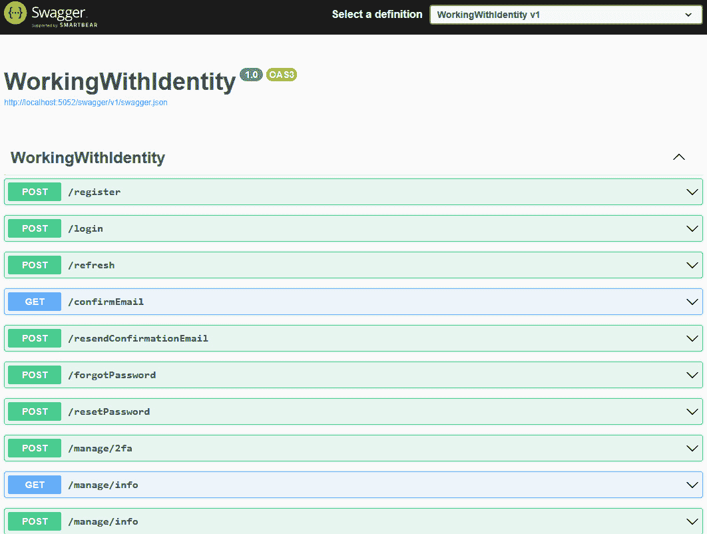

图 6.9 – 集成 ASP.NET Core Identity 的银行 API

如我们所见，API 中添加了新的路由。这些路由是由 ASP.NET Core Identity 提供的 API。每个 API 都允许我们管理应用程序的用户并添加不同的功能，例如密码恢复、用户创建或密码重置。

然而，在尝试执行端点时，例如对**/accounts** API 执行**GET**请求，我们意识到我们能够获得有效的响应。要进行测试，只需打开**/accounts** API 的**GET**方法，点击**Try Out**按钮，然后点击**Execute**按钮。我们应该得到以下响应：

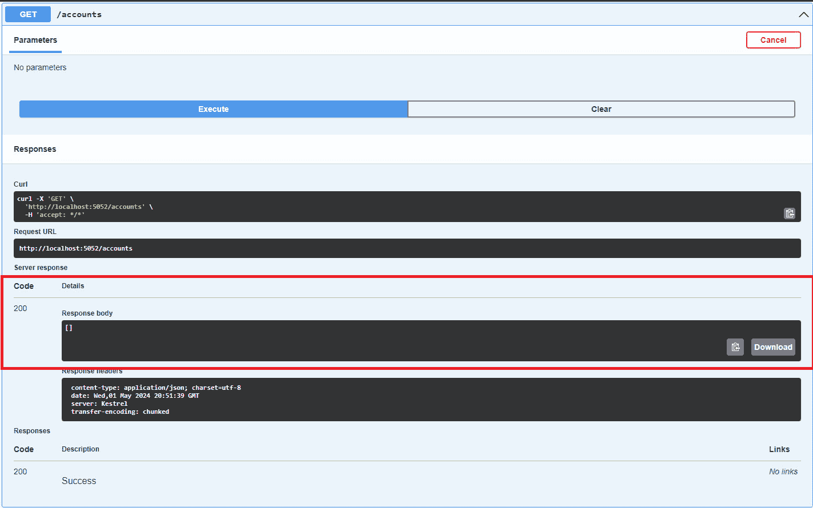

图 6.10 – 未经认证和授权请求 API

如我们所见，我们有一个 HTTP 状态码为**200**，这意味着请求是成功的，即使结果没有返回数据库中的任何现有账户记录。如果您在本地的数据库表中注册了任何记录，结果将是一个以 JSON 格式序列化的账户对象数组。

然而，我们希望在应用程序的 API 中添加认证和授权过程。为此，我们必须对源代码进行一些修改。

如我们所知，每个 API 都在**Program.cs**文件中注册了其路由。这些路由作为请求的入口点。由于我们希望保护每个路由，以确保只有已知和授权的用户才能使用 API，我们必须向路由添加配置，以便当有人尝试未经认证请求 API 时，请求必须返回 HTTP **401**状态码，通知 API 消费者需要进行认证。

在下一节中，我们将学习如何保护路由并防止未经授权的请求。

## 保护应用程序路由

即使应用程序中所有认证和授权设置都已存在，也必须确定应该保护什么以及不应该保护什么。

我们可以确保给定的 API 方法通过认证和授权中间件受保护的一种方法是在路由中添加显式配置。

在我们正在开发的应用程序中，API 路由作为**扩展方法**在单独的文件中实现，这是一种良好的实践。因此，让我们在应用程序的**RouteHandler**目录中的**AccountHandler.cs**文件中做出必要的更改。

要做到这一点，我们将配置**/accounts**路由，使其只接受已认证用户的请求。让我们看看修改后的代码：

```cs
app.MapGet("/accounts", async (BankingDbContext
  dbContext) => {
    var accounts = await dbContext.Accounts.ToListAsync();
    return Results.Ok(accounts);
}).RequireAuthorization();
```

在这里，我们添加了**RequireAuthorization()**方法调用。我们已经了解到，授权是一个验证用户权限的过程，而认证涉及识别用户。在这种情况下，如果用户未认证，则无法授权。

再次，在您选择的终端中，在应用程序目录内，执行以下命令：

```cs
dotnet run
```

接下来，我们将请求**/accounts**路由。然而，让我们首先执行**Postman**应用程序。按照以下步骤操作：

1.  前往**文件** | **新建** | **HTTP** 。

1.  将打开一个新标签页，您可以在其中发起请求。

1.  添加运行应用程序的 URL – 即**http://localhost:<端口>/accounts** – 并检查是否选择了**GET**方法。

1.  然后，点击**发送**按钮。我们将得到以下输出：

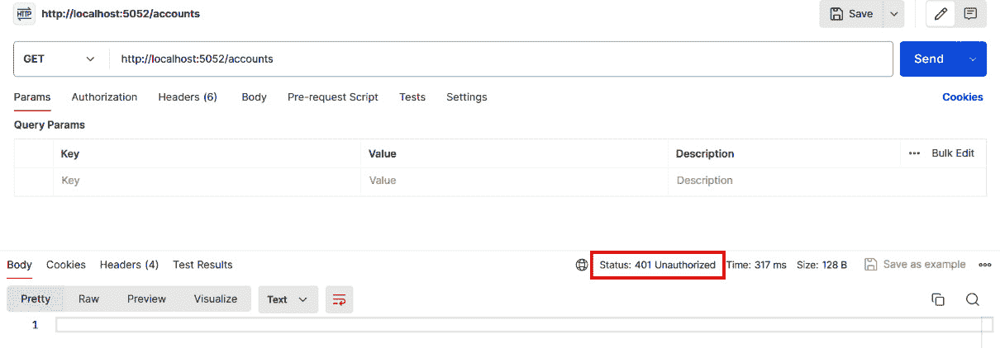

图 6.11 – 请求受保护的路由

*图 6.11*突出了带有 HTTP 状态码 401 的请求返回，这意味着请求未被授权。

为了使对这条路由的成功请求能够发起，我们必须登录并使用认证用户的详细信息配置请求。

在登录之前，我们必须在应用程序中创建一个用户。为此，请执行以下步骤：

1.  在 Postman 中创建一个新的 HTTP 请求。

1.  将请求类型设置为**POST**。

1.  将**http://localhost:<端口>/register**作为路由添加。这是将添加到应用程序中的 ASP.NET Core Identity 用户的默认路由。

1.  在这一点上，我们需要定义请求的正文。为此，请点击**正文**选项卡，选择**raw**选项，并添加*图 6.12*中显示的 JSON：

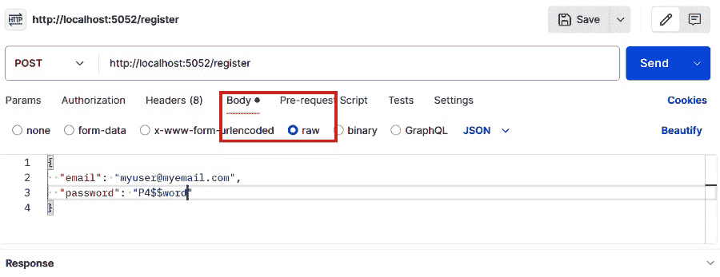

图 6.12 – 配置注册用户请求的正文

1.  您可以根据需要更改 JSON 对象的属性。

1.  最后，点击**发送**按钮来发起请求。

执行后，我们应该得到类似于*图 6.13*所示的响应：

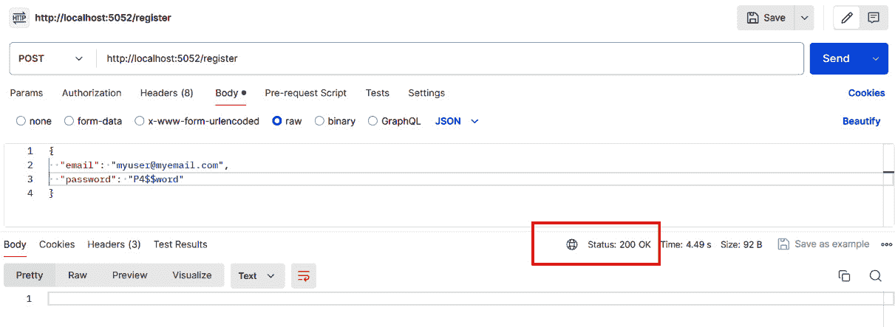

图 6.13：使用 ASP.NET Core Identity 注册新用户

*图 6.13* 显示了一个 HTTP 状态码 200，告知我们请求成功，并且一个新的用户已经在数据库中注册。

在这一点上，我们必须登录。我们将使用 Postman 来完成此操作。创建一个新的 HTTP 请求并执行以下步骤以配置请求：

1.  将请求类型设置为**POST**。

1.  将 URL 设置为**http://localhost:<port>/login**。

1.  选择**Body**选项卡，然后选择**raw**选项，并添加以下 JSON：

    ```cs
    {
      "email": "myuser@myemail.com",
      "password": "P4$$word"
    }
    ```

1.  点击**发送**按钮。

1.  确保您已根据在您的环境中创建的用户数据添加了 JSON 参数。

1.  执行请求后，您应该看到以下响应：

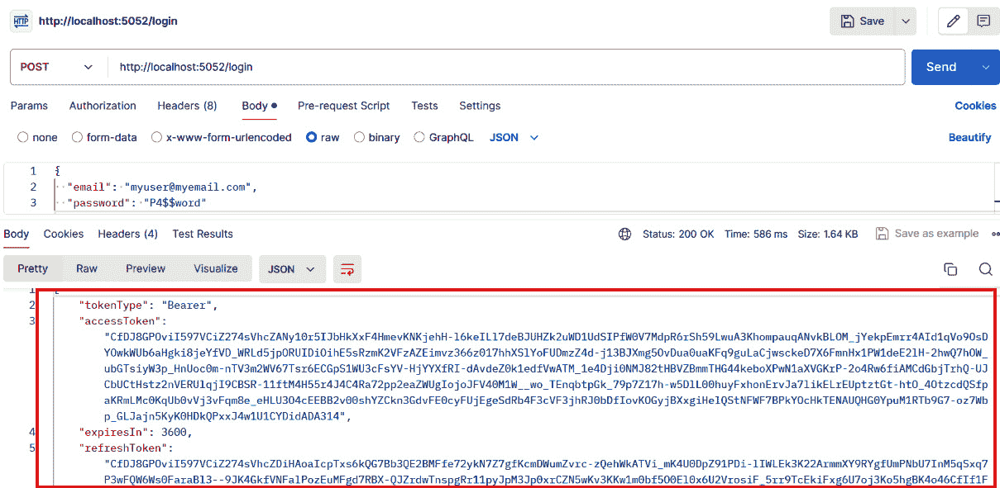

图 6.14 – 获取登录响应

对于登录请求的响应，我们可以看到返回了一个包含一些重要属性的 JSON 对象：

+   **tokenType**：此值始终为**Bearer**，这表示此响应提供了一种**Bearer**令牌，形式为不透明的**accessToken**，正如我们在**Program.cs**文件中配置的那样。

+   **accessToken**：这是为认证用户生成的令牌。它必须作为授权请求头的一部分发送。

+   **expiresIn**：表示**accessToken**过期时间的秒数。

+   **refreshToken**：如果设置，我们可以在过期后通过使用刷新端点来获取新的**access_token**值，而无需重新输入用户凭据。

在*图 6.14*中显示的值对于每个请求都是不同的，并不代表**JWT**。**accessToken**在本版本 ASP.NET Core Identity 中以专有方式生成和加密，不遵循已知约定。然而，如果您愿意，可以将其更改为**JWT**，以及令牌生成过程的其它配置参数。

ASP.NET Core Identity 配置

ASP.NET Core Identity 提供了不同的身份验证选项，包括 JWT ([`jwt.io/introduction`](https://jwt.io/introduction) )、cookies 以及其他设置。要了解更多关于不同配置选项的信息，请访问[`learn.microsoft.com/en-us/dotnet/api/microsoft.aspnetcore.identity.identityoptions?view=aspnetcore-9.0`](https://learn.microsoft.com/en-us/dotnet/api/microsoft.aspnetcore.identity.identityoptions?view=aspnetcore-9.0)。

然而，我们使用的基于令牌的方法，即使它不涉及 JWT，也使用与使用认证用户凭据发出的请求相同的配置过程。在下一节中，我们将使用**access token**值对**/accounts**路由进行请求，并获取有效的响应。

## 使用访问令牌请求 API

访问令牌包含以加密形式存储的认证用户信息。

为了在**/accounts**路由上发出有效的请求，我们需要在请求头中传递令牌。因此，复制访问令牌值，在 Postman 中打开包含请求的标签页，如*图 6.11*所示，为**/accounts**路由。然后执行以下步骤：

1.  在**/accounts**路由的**GET**请求标签页中，点击**授权**标签。

1.  对于**类型**，选择**Bearer** **令牌**选项。

1.  在**令牌**字段中，粘贴通过登录请求获得的访问令牌的值。

1.  点击**发送**按钮。

如*图 6.15*所示，由于数据库中没有注册任何账户，因此返回了一个空数组。请注意，HTTP 状态码是**200**，这意味着这是一个成功的请求：

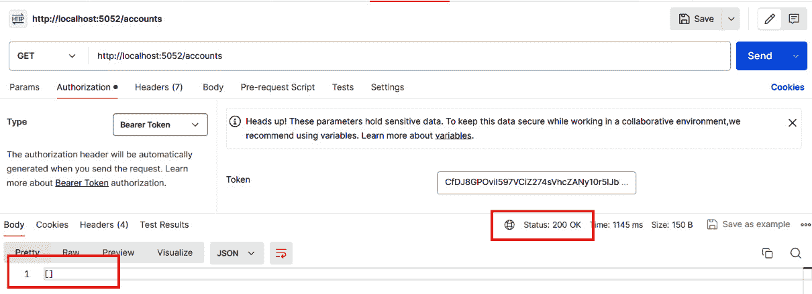

图 6.15 – 成功的账户请求

到目前为止，应用程序按预期工作。然而，了解这个授权过程是如何工作的是非常重要的。

当再次请求账户路由时，我们提供之前配置的访问令牌。尽管 Postman 有一个用户友好的界面，但在选择认证类型并输入访问令牌时，Postman 会自动添加一个 HTTP 头。HTTP 头是请求和响应的一部分，由键/值对组成。

对于这个请求，使用授权键和访问令牌值创建了头。您可以通过点击**头部**标签并查看隐藏的头来检查此头，如*图 6.16*所示：


图 6.16 – 授权 HTTP 头

在发起请求时，认证和授权**中间件**开始工作。认证中间件读取授权头中告知的令牌，并在**HttpContext.User**对象中填充请求的用户凭据，该对象是请求的一部分。此对象允许我们访问诸如**声明**等信息，这些声明包含诸如用户姓名和电子邮件等数据，以及**角色**，这些角色允许我们确定用户的访问类型，例如管理员、成员等。

ASP.NET Core 9 的 HttpContext 对象

在 ASP.NET Core 中，**HttpContext.User**是一个核心属性，它表示与 HTTP 请求关联的用户安全上下文。该属性是**ClaimsPrincipal**的一个实例，这是一个.NET 类，它以声明的形式包含用户的身份。**HttpContext.User**是处理 ASP.NET Core 应用程序中用户认证和授权的关键元素。

在认证过程中，当请求到达应用程序时，认证中间件读取附加到请求的认证令牌或 cookies，验证它们，并构建一个**ClaimsPrincipal**对象。**ClaimsPrincipal**对象可以包含一个或多个**ClaimsIdentity**实例。

每个**ClaimsIdentity**实例可以包含多个声明。声明是由发行者做出的关于主体的陈述，可以代表用户的身份属性，如姓名、角色、电子邮件等。

此过程允许在应用程序范围内的授权检查中使用**HttpContext.User**，以确定当前用户是否有权限执行某些操作，以确保只有经过适当认证和授权的用户才能访问某些资源或执行特定操作。

以下代码展示了在执行操作时使用**HttpContext.User**的方式。此对象由执行管道通过中间件自动填充：

**public** **IActionResult ExampleAction(){**

**var user =** **HttpContext.User;**

**if (user.Identity.IsAuthenticated)     {**

**// 为** **认证用户执行某些操作**

**var userName =** **user.Identity.Name;**

**// 获取** **用户名**

**return** **Content($"欢迎，{userName}");**

**}**

**else**

**{**

**// 处理** **未认证用户**

**return Unauthorized("您必须登录才能** **访问此页面。");**

**}**

**}**

您可以在[`learn.microsoft.com/en-us/aspnet/core/fundamentals/http-context?view=aspnetcore-8.0#httpcontext-user`](https://learn.microsoft.com/en-us/aspnet/core/fundamentals/http-context?view=aspnetcore-8.0#httpcontext-user)了解更多关于**HttpContext**的信息。

授权中间件分析请求的路线是否需要授权。如果是，它将解密令牌，分析它是否是有效的令牌，并允许在路线上的请求正确执行。

中间件是什么？

在 ASP.NET Core 9 中，请求的执行流程中会执行多种类型的操作，例如确定要执行的路线以及其他功能。这个流程被称为管道。在某些情况下，需要向执行管道中添加功能。这是通过中间件实现的，我们通过在**Program.cs**文件中添加**app.UseAuthentication()**和**app.UseAuthorization()**方法调用来实现，这允许我们在认证和授权需求之前预处理请求。通过中间件，可以添加到请求和响应的功能。

我们将在*第八章*中了解更多关于中间件的内容。

在每次 API 请求中，都会发送令牌，以便在请求执行流程中加载用户信息和相应的访问权限。这是云原生应用程序的一个特性。无状态方法允许应用程序可扩展和弹性，并确保服务器在请求之间不保留任何关于客户端状态的任何信息，消除了管理会话状态的需求。这导致更容易进行扩展和负载均衡，当需要处理高用户需求时，更容易扩展服务器，并允许每个服务器实例能够处理任何请求，而无需了解先前请求的上下文。

通过不依赖服务器端状态，开发者可以避免与会话管理相关的问题，例如会话持久性、分布式系统间的同步以及资源锁定。

现代应用程序必须在设计上以安全为前提，并且认证和授权的实现应用程序上下文中有几个优点。然而，与安全相关的其他方面不仅与用户可用的功能相关，还与应用程序的源代码相关。在下一节中，我们将学习如何加强应用程序的安全性。

# 加强应用程序安全性

为了能够创建安全的基于 Web 的应用程序，我们必须超越仅基于身份验证和授权的安全层实现，这是我们使用 ASP.NET Core Identity 时所实现的。

ASP.NET Core 9 允许我们在开发应用程序时将安全作为前提，提供工具和机制，以促进实现最小化可能漏洞的功能，这可以防止恶意用户发起攻击。

让我们了解一些应该成为每位软件工程师工具箱一部分的良好安全实践。我们将从了解如何改进我们在开发环境中管理敏感配置的过程开始。

## 正确管理机密信息

每个应用程序都有配置，其中一些可能是敏感的，例如数据库连接、加密密钥，甚至是访问外部资源的密钥。

到目前为止，我们已经了解到将此类设置与 C# 源代码分开是一种良好的实践，我们可以通过诸如 **appsettings.json** 和甚至环境变量等文件来管理设置。ASP.NET Core 9 允许我们处理外部配置管理。

将设置硬编码是一种不良实践，因为要更改任何硬编码参数，我们必须重新编译应用程序。此外，如果恶意用户可以访问二进制文件，他们可能会反编译应用程序，然后获取敏感数据。

加密器

代码混淆是指将应用程序源代码转换为人类难以理解但计算机仍能执行的形式的过程。这种技术主要用于通过使攻击者或未经授权的用户难以逆向工程代码和理解其逻辑来保护知识产权。

加密过程涉及多种技术，例如将变量和方法重命名为无意义的符号，删除元数据，加密字符串，以及改变控制流以使代码更复杂。有关更多信息，请访问[`learn.microsoft.com/en-us/visualstudio/ide/dotfuscator/?view=vs-2022`](https://learn.microsoft.com/en-us/visualstudio/ide/dotfuscator/?view=vs-2022)。

想象一下这种情况：我们的应用程序使用 API 密钥连接到支付网关，以处理来自在线商店的交易，或者甚至是数据库连接字符串。如果这个密钥被泄露，恶意用户可能能够操纵交易数据，访问敏感信息，甚至删除您的数据库。

您可能认为，由于您的代码在私有存储库中，并且所有设置都保存在**appsettings.json**文件中，这个问题已经解决了。

当然，由于这是一个私有存储库，攻击者获取数据的可能性并不高。然而，请考虑您的公司可能与员工和第三方公司合作，这些公司可以访问您的存储库中的数据。

虽然在**appsettings.json**文件中管理设置是一种良好的实践，但这并不是处理敏感信息的良好方法。因此，我们避免了将应用程序的源代码与应用程序外部存储库同步，这些存储库包含不应共享的信息。

幸运的是，ASP.NET Core 9 实现了最佳开发实践，并在您的本地环境中提供了秘密管理。适当的秘密管理确保敏感数据，如 API 密钥，不会硬编码到应用程序的源代码中，而是安全地存储和访问，从而保护您的基础设施和数据完整性。

秘密管理器工具包含在.NET Core SDK 中，因此如果您已经有了 SDK，通常不需要安装其他任何东西。

要开始使用秘密管理器，您需要为您的项目初始化它。在命令提示符或终端中导航到包含您的**.csproj**文件的项目**WorkingWithIdentity**目录，这是我们之前工作过的目录。然后，运行以下命令以初始化秘密存储：

```cs
dotnet user-secrets init
```

上述命令在**.csproj**（项目文件）中的**PropertyGroup**值内添加了一个**UserSecretsId**元素。此 ID 唯一标识您项目的秘密。

您可以通过在代码编辑器中打开**.csproj**文件来验证**UserSecretsId**元素的添加，如图*图 6* *.17* 所示：


图 6.17 – 在.csproj 文件中配置的 UserSecretsId 元素

接下来，我们将使用 SQL Server 数据库配置连接字符串。为此，我们必须通过执行以下命令添加一些新代码：

```cs
dotnet user-secrets set "ConnectionStrings:BankingDbContext" "YOUR DATABASE CONNECTION STRING"
```

秘密命名约定

这种表示法通常使用冒号（**:**）来分隔秘密键名中的不同层级。这种结构不仅有助于逻辑上组织键，而且与 ASP.NET Core 9 配置系统从各种配置源检索值的方式相一致，例如**appsettings.json**、环境变量和 Secret Manager。

在**WorkingWithIdentity**应用程序中，我们在**appsettings.json**文件中有以下配置：

**"** **ConnectionStrings" {**

**"** **BankingDbContext**: "..."**

**}**

前面的 JSON 表示一个名为**ConnectionStrings**的对象类型的属性，它有一个名为**BankingDbContext**的字符串属性。

基于此，秘密被命名为**ConnectionStrings:BankingDbContext**。在这里，**ConnectionStrings**是顶级类别，而**BankingDbContext**是包含相应秘密的实际键——在这种情况下，是 SQL Server 数据库连接字符串。这种表示法有助于逻辑上分组相关设置。

由于这是 ASP.NET Core 9 使用的约定，因此无需更改应用程序的源代码即可获取数据库连接字符串。

当使用环境变量（在某些操作系统中不允许变量名中包含冒号）时，冒号分隔符通常被替换为双下划线（**__**）。所以，如果你在生产环境中通过环境变量定义这些秘密，你会这样定义它们：

**ConnectionStrings__BankingDbContext**

这种命名约定确保当 ASP.NET Core 配置系统读取环境变量时，它可以重建层次结构并将它们视为与在**appsettings.json**或 Secret Manager 中定义的秘密等效。

由于这是 ASP.NET Core 9 的功能，并且如果你想要使用环境变量，它将以相同的方式工作，因此无需更改应用程序代码来获取秘密。

创建的秘密被保存在操作系统中；其位置可能因环境而异。然而，你可以使用**user-secrets**工具来管理秘密。例如，你可以用它来列出你本地机器上存在的秘密：

```cs
dotnet user-secrets list
```

你可以使用以下命令来删除特定的秘密：

```cs
dotnet user-secrets remove "ConnectionStrings:BankingDbContext"
```

你甚至可以清除所有秘密：

```cs
dotnet user-secrets clear
```

所有秘密信息都保存在你的操作系统中。当将源代码与远程代码库集成时，秘密不会被共享。

请记住，Secret Manager 工具仅适用于开发目的。对于生产环境，您应使用安全的保险库，例如 **Azure Key Vault**、**AWS Secrets Manager** 或其他安全方式来管理敏感配置数据。我们将在 *第九章* 中了解更多关于配置管理的内容。

现在我们已经了解了如何更好地管理应用程序的秘密，让我们学习其他良好的安全实践，包括使用 **超文本传输协议安全** ( **HTTPS** ) 和 **跨源资源共享** ( **CORS** )。

## 强制执行 HTTPS 和处理 CORS

HTTPS 强制执行对于确保客户端和服务器之间通过加密网络传输的数据安全通信非常重要。正如我们之前所学的，ASP.NET Core 9 为我们提供了内置的中间件来强制执行 HTTPS，这可以被配置为将所有 HTTP 请求重定向到 HTTPS。

要在 ASP.NET Core 9 应用程序中强制执行 HTTPS，只需将以下代码行添加到 **Program.cs** 文件中，以向应用程序的执行管道添加中间件：

```cs
// Enforce HTTPS
app.UseHttpsRedirection();
```

重要的是要知道，添加强制使用 HTTPS 的中间件是应用程序的配置步骤。同样，您还必须配置您的 Web 服务器（例如，IIS、NGINX、Azure App Services 等）以强制执行 HTTPS 并从受信任的证书颁发机构获取有效的 SSL/TLS 证书。

除了强制执行 HTTPS，您还可以配置 **CORS**，这是一种由浏览器实现的功能，用于限制在一个源上运行的 Web 应用程序在没有明确权限的情况下访问不同源上的资源。在像 **Angular**、**React** 或纯 **JavaScript** 这样的 SPA 应用程序中，更常见这种行为。当通过 JavaScript 发送 HTTP 请求时，它将在浏览器中执行，通过安全机制，不允许一个源服务器上的请求发送到资源所在的服务器。幸运的是，ASP.NET Core 9 提供了中间件来配置和管理 CORS 策略，允许您指定哪些源、头和方法是允许的。这个特性很有趣，因为我们只能根据特定的源响应某些请求。

要在 ASP.NET Core 9 应用程序中启用和配置 CORS，您可以将以下代码添加到 **Program.cs** 文件中：

```cs
var builder = WebApplication.CreateBuilder(args);
// Add services to the container.
builder.Services.AddRazorPages();
// Configure CORS policy
builder.Services.AddCors(options =>
{
    options.AddPolicy("AllowSpecificOrigin",
        builder =>
        {
            builder.WithOrigins("https://myapp.com")
                   .AllowAnyHeader()
                   .AllowAnyMethod();
        });
});
var app = builder.Build();
// Enforce HTTPS
app.UseHttpsRedirection();
// Use CORS policy
app.UseCors("AllowSpecificOrigin");
app.UseStaticFiles();
app.UseRouting();
app.UseAuthorization();
app.MapRazorPages();
app.Run();
```

让我们理解前面的代码：

+   **builder.Services.AddCors(options => { ... })**：这一行代码将 CORS 服务添加到应用程序的依赖注入容器中。**options** 参数，其类型为 **Action<CorsOptions>**，允许您配置 CORS 策略。

+   **options.AddPolicy**：在这一行中，我们添加了一个名为 **AllowSpecificOrigin** 的新策略。Lambda 表达式中的 **builder** 参数是 **CorsPolicyBuilder** 类的实例，它提供了配置策略的方法。

+   **builder.WithOrigins("https://myapp.com")**：**WithOrigins** 方法定义了允许访问应用程序资源的来源。在这种情况下，来自 **https://myapp.com** 的任何请求都将被此 CORS 策略允许。

+   **AllowAnyHeader()**：**AllowAnyHeader** 方法允许请求中的任何 HTTP 头部，允许指定的来源包含任何头部而不会被 CORS 策略阻止。

+   **AllowAnyMethod()**：此方法定义了任何 HTTP 方法（**GET**、**POST**、**PUT**、**DELETE** 以及其他）都可以在请求中使用。

+   **app.UseCors("AllowSpecificOrigin")**：这将在请求管道中触发 CORS 中间件，全局引用先前创建的策略以应用于应用程序的所有 HTTP 请求。

了解更多关于 CORS 的信息

如前所述，CORS 是一种基于 HTTP 头部的机制，允许您告诉浏览器哪些来源可以加载资源。ASP.NET Core 9 为在应用程序中实现 CORS 提供了一个优秀的框架。要了解更多信息，请访问 [`learn.microsoft.com/en-us/aspnet/core/security/cors?view=aspnetcore-9.0`](https://learn.microsoft.com/en-us/aspnet/core/security/cors?view=aspnetcore-9.0)。

上述示例说明了在 ASP.NET Core 9 应用程序中使用 CORS。然而，除了来源之外，它对 HTTP 头部或方法的使用没有限制。在某些情况下，将有必要明确定义来源可以访问的 HTTP 头部和方法。

然而，ASP.NET Core 9 中可用的功能为我们提供了在定义不同来源的不同策略方面的巨大灵活性，为 CORS 创建了更受限制和更具体的规则。这是一个重要的机制，因为浏览器使用它来允许 SPAs 或在客户端运行的其他应用程序能够适当地消耗外部资源。

CORS 不是一个安全机制，但建议使用。在下一节中，我们将讨论我们可以用来防止应用程序中漏洞的一些安全机制。

## 防止常见漏洞

当我们谈论应用程序中的漏洞时，可以考虑几个主题，例如源代码、服务器、凭证管理、使用的协议和加密等。

一些常见的漏洞已经众所周知，但如果它们在应用程序中没有得到解决，它们可能会给组织带来一些问题。ASP.NET Core 9 提供了处理 Web 应用程序中几个常见威胁的机制：

+   SQL 注入

+   **跨站** **脚本**（**XSS**）

+   **跨站请求** **伪造**（**CSRF**）

让我们学习如何防止这些漏洞中的每一个。

### SQL 注入

SQL 注入是一种常见的攻击，攻击者将恶意 SQL 代码插入到 SQL 查询中。

为了防止 SQL 注入，始终使用参数化查询或 ORM 框架，如 Entity Framework，这些框架可以安全地处理查询参数并帮助我们避免字符串连接。我们已经在 *Web 应用程序安全主题* 部分学习了这一点。

### XSS

当攻击者将恶意脚本注入到网页中时，就会发生 XSS 攻击。为了防止 XSS，在将用户输入渲染到浏览器之前，始终对其进行编码或转义。这样，如果输入中存在任何代码注入，例如，它将被特殊字符编码。ASP.NET Core 9 提供了内置的辅助函数来清理输出，如下面的示例所示：

```cs
@{
var inputSimulator = "<script>
  alert('Injected Code');</script>";
}
<p>@inputSimulator</p>
// output: &lt;script&gt;alert('Injected Code');&lt;/script&gt;
```

在前面的例子中，JavaScript 代码被编码，防止注入的代码被发送和执行，因为编码后它只是一个字符串。要了解更多关于与 XSS 相关的漏洞信息，请访问 [`learn.microsoft.com/en-us/aspnet/core/security/cross-site-scripting?view=aspnetcore-9.0`](https://learn.microsoft.com/en-us/aspnet/core/security/cross-site-scripting?view=aspnetcore-9.0)。

### CSRF

CSRF 是一种安全攻击类型，恶意网站欺骗用户的浏览器在用户不知情的情况下，在用户已认证的另一个网站上执行操作。这可能导致未经授权的操作，例如更改设置、转账或购物。ASP.NET Core 提供了内置的防伪造令牌来防止 CSRF 攻击。这些令牌会自动包含在表单中并在服务器上进行验证。

要在 Razor Pages 或 MVC 中以简化的方式使用防伪造令牌，请将以下代码添加到您的表单中：

```cs
<form method="post">
@Html.AntiForgeryToken()
<!-- Form fields -->
<input type="submit" value="Submit" />
</form>
```

在这一点上，我们必须将 **ValidateAntiForgeryToken** 属性添加到将处理表单请求的动作中，如下所示：

```cs
[ValidateAntiForgeryToken]
public IActionResult SubmitForm()
{
  // Process the form submission
  return View();
}
```

ASP.NET Core 9 还提供了其他机制来处理这种漏洞。您可以在 [`learn.microsoft.com/en-us/aspnet/core/security/anti-request-forgery?view=aspnetcore-9.0`](https://learn.microsoft.com/en-us/aspnet/core/security/anti-request-forgery?view=aspnetcore-9.0) 上了解更多信息。

正如我们所学的，应用程序可能包含多个漏洞，这些漏洞不仅与源代码相关，还与托管服务器、通信协议以及许多其他方面相关。

在任何情况下，ASP.NET Core 9 平台提供了多种机制和最佳实践，结合应用的需求，使我们能够最小化风险，并保持我们的解决方案在遵循现代应用程序最佳实践的同时，保持稳健、安全和可靠。随着我们继续阅读本书，我们将了解更多可以用来创建越来越稳健应用程序的机制和方法。

# 摘要

在本章中，我们学习了网络应用程序安全性的原则以及它们如何影响开发模型和与用户及其他应用程序的交互。此外，我们还学习了授权和认证过程，比较了这些过程的流程，并了解了 OAuth 2.0 和 OIDC 等标准。为了加强我们对认证和授权的知识，我们使用了 ASP.NET Core Identity，它提供了支持应用程序中用户认证和授权的所有机制，并与数据库集成以安全地管理身份。为此，我们通过提供 ASP.NET Core Identity 提供的令牌来安全地消费信息。最后，我们讨论了如何增强应用程序的安全性，理解了密钥管理，并学习了使用 CORS 等技术来防止网络应用程序中的常见漏洞。

在下一章中，我们将学习如何为应用程序添加更多功能，了解如何实施最佳实践，以及如何使用缓存和监控。

# 第三部分：应用最佳实践

在本节中，我们假设您对 ASP.NET Core 9 平台更加熟悉，并且熟悉该技术中大多数强大的功能。随着我们对平台知识的深入和开发越来越丰富解决方案的需求，我们必须坚持最佳实践。因此，我们将涵盖与添加与应用程序交互的功能相关的主题，包括挑战策略、弹性和最佳实践。我们还将学习如何实现监控（日志记录和跟踪），使软件工程师能够处理错误修复、优化和主动行动。我们还将探索使用中间件来自定义应用程序中的交互流程。

本部分包含以下章节：

+   *第七章* ，*为应用程序添加功能*

+   *第八章* ，*在 ASP.NET Core 9 中使用中间件增强应用程序*

+   *第九章* ，*管理应用程序设置*
