# 三、ASP.NET MVC 4 简介

ASP.NET MVC 4 是微软网络模型-视图-控制器(MVC)框架的最新版本。MVC 模式并不特定于这个框架。它最早是在 20 世纪 70 年代作为 Smalltalk 语言的一个特性引入的，并在客户端/服务器、桌面、移动和网络开发中取得了巨大成功。这是一种软件设计模式，有助于在数据和与数据的交互之间实现关注点的分离。

在本章中，我们将研究 MVC 模式，以及它是如何在 ASP.NET MVC 框架中实现的。然后，我们将从将这些知识应用到酿酒应用开始。在本章的最后，我们的应用将向任何提出请求的用户返回示例食谱。

# 模型-视图-控制器模式

MVC 模式的每个组件都有一个非常具体的用途，将应用中的数据与用户与数据的交互分离开来。下面是对 MVC 设计模式组件的非常简单的介绍。

## 控制器

在 MVC 模式中，控制器充当委托者。它代表一些外部交互(通常是用户)向模型提交修改，并通过用户交互作为通知或直接请求的结果检索视图的数据。

## 视图

视图处理将数据呈现给某个外部实体。如果一个视图包含逻辑，那么该逻辑仅限于作为与模型交互的结果从控制器接收的数据的表示。

## 模型

模型是特定于应用的数据的封装，以及存储、检索和维护该数据完整性的方法。该模型可能模仿也可能不模仿存储或呈现实际数据的结构。

# MVC 格局和 ASP.NET MVC 4

ASP.NET MVC 4 中的 MVC 模式的实现很大程度上遵循了一个**约定胜于配置的**范例。简而言之，如果你把某样东西放在正确的地方和/或用正确的方式命名它，它就简单有效。这并不是说我们不能配置框架来忽略或改变这些约定。正是 ASP.NET MVC 4 的灵活性和适应性，以及它对 web 标准的坚持，推动了它的快速采用。

### 注

如果你没有接触过 ASP.NET 或 ASP.NET 的 MVC，请注意，MVC 模式的每个组成部分，因为它们与 ASP.NET MVC 4 相关，经常在单独的一章中出现。

以下是 ASP.NET MVC 4 中 MVC 模式的一个非常浓缩的高级概述。

## ASP.NET MVC 中的控制器

在 ASP.NET MVC 4 中，控制器响应 HTTP 请求，并根据传入请求的内容确定要采取的操作。

ASP.NET MVC 4 中的控制器位于一个名为`Controllers`的项目文件夹中。我们为酿酒厂选择的互联网应用项目在`Controllers`文件夹中包含两个控制器:`AccountController`和`HomeController`。

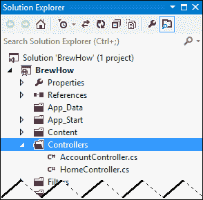

如果您检查`HomeController.cs`文件中的代码，您会注意到`HomeController`类扩展了`Controller`类。

```cs
public class HomeController : Controller
{
    /* Class methods... */
}
```

### 类型

**下载示例代码**

您可以从您在[http://www.packtpub.com](http://www.packtpub.com)的账户中下载您购买的所有 Packt 书籍的示例代码文件。如果您在其他地方购买了这本书，您可以访问[http://www.packtpub.com/support](http://www.packtpub.com/support)并注册，以便将文件直接通过电子邮件发送给您。

`Controller`类和`ControllerBase`类包含用于处理和响应 HTTP 请求的方法和属性，其中`Controller`类是从这两个类派生的。从请求中检索数据或响应请求返回数据时发生的几乎所有交互都将通过`Controller`继承链公开的方法和属性进行。

如果您之前没有使用 ASP.NET MVC 的经验，您可以假设项目中的控制器是通过放置在`Controllers`文件夹中或者通过扩展`Controller`类来识别的。实际上，运行时使用类名来标识默认 MVC 框架配置中的控制器；控制器必须有一个`Controller`后缀。例如，食谱可能有一个控制器，代表这个控制器的类将被命名为`RecipeController`。

### 注

正如我们简要讨论的，ASP.NET MVC 框架的每个部分都是可扩展和可配置的。您可以自由地向框架提供一些其他约定，框架可以使用这些约定来标识控制器。

### 创建配方控制器

让我们创建一个新控制器，将食谱返回给我们的用户。在**解决方案浏览器**中，右键单击酿酒项目中的**控制器**文件夹，选择**添加**，然后选择**控制器**菜单项。也可以按 *Ctrl* + *M* ， *Ctrl* + *C* 。


在**添加控制器**对话框中，命名控制器`RecipeController`，从**模板**下拉菜单中选择**空 MVC 控制器**模板，然后点击**添加**按钮。

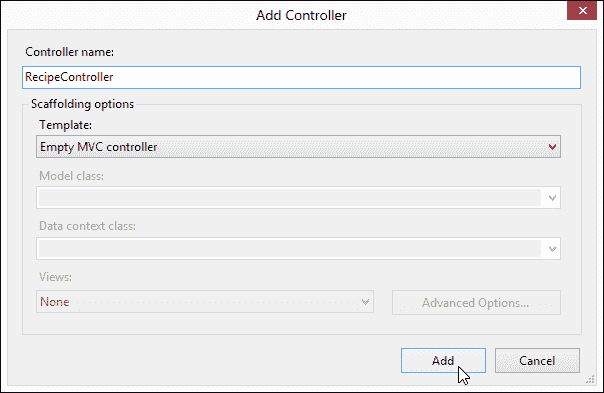

恭喜你！您已经在酿酒应用中创建了第一个控制器。代码应该如下所示:

```cs
public class RecipeController : Controller
{
    public ActionResult Index()
    {
        return View();
    }
}
```

请注意，该代码与`HomeController`中的代码非常相似。`RecipeController`继承了`Controller`类，并且像`HomeController`一样，包含一个返回`ActionResult`的`Index`方法。该类也用`Controller`后缀正确命名，因此运行时将能够将其识别为控制器。

我相信您已经准备好检查这个控制器的输出，但是在我们这样做之前，我们需要先了解一下控制器是如何被调用的。

### 路由介绍

在应用启动时，一系列格式化的字符串(类似于您将在`String.Format)`中使用的格式化字符串)以及名称、默认值、约束和/或类型被注册到运行时。名称、格式化字符串、值、约束和类型的这种组合称为**路由**。运行时使用路由来确定应该调用哪个控制器和操作来处理请求。在我们的酿酒项目中，路由是在`App_Start`文件夹的`RouteConfig.cs`文件中定义并注册的。

我们的应用的默认路由在运行时注册，如下所示。

```cs
routes.MapRoute(
 name: "Default",
    url: "{controller}/{action}/{id}",
    defaults: new 
    { 
        controller = "Home", 
        action = "Index", 
        id = UrlParameter.Optional 
    });
```

我们默认路由的格式化字符串看起来非常类似于您可能在浏览器中键入的网址。唯一值得注意的区别是，网址的每一段——斜线(`/`)之间的网址部分——都用大括号(`{}`)括起来。

我们的默认路由包含用于标识控制器、操作(方法)和可选标识的段。

当我们的应用收到请求时，运行时会查看请求的网址，并尝试将其映射到通过`MapRoute`方法注册的任何格式化字符串。如果传入的 URL 包含可以映射到格式化字符串 URL 的段的段，则运行时确定找到了匹配项。

两个段`controller`和`action`有特殊的含义，决定了要实例化的控制器和要在控制器上调用的方法(动作)。其他段可以映射到方法本身的参数。所有段都放在路由字典中，使用花括号内的段名作为关键字，URL 的映射部分作为值。

通过一个例子来帮助澄清这一点，假设向我们的应用请求网址`/do/something`。运行时会查询路由表，它是应用注册的所有路由的集合，并在我们的`Default`路由上找到匹配的。然后，它将开始将 URL 请求的段映射到格式化的字符串 URL。值`do`将放在路由字典中的`controller`键下，值`something`将放在`action`键下。然后，运行时将尝试调用`DoController`的`Something`方法，将`Controller`后缀附加到控制器名称上。

如果您进一步检查我们的`Default`路由，您会看到花括号内的单词对应于通过`MapRoute`的`defaults`参数传递的值的名称。事实上，这就是默认路由的原因。如果没有控制器被路由识别，那么运行时将使用`HomeController`。如果找不到任何动作，将使用已识别控制器上的`Index`方法。我们在[第 2 章](02.html "Chapter 2. Homebrew and You")、*酿酒和你*中看到的欢迎页面被调用，是因为所请求的/(斜杠)的网址映射到了我们的`Default`路由，因此调用了`HomeController`的`Index`方法。

### 注

路由是一个非常复杂的话题。传入路由可以忽略，可能包含特定的值或约束作为其映射的一部分，并且可能包含可选参数。别忘了，路由注册的顺序很重要，非常重要。路由是如此复杂，以至于整个工具都是围绕调试路由问题而构建的。本介绍仅涵盖理解本书内容所需的信息，直到我们到达[第 7 章](07.html "Chapter 7. Separating Functionality Using Routes and Areas")、*使用路由和区域分离功能*。

### 动作方法

一个动作方法(简称动作)是一个 ASP.NET MVC 控制器中的一个特殊方法，用来做举重。动作方法中的代码根据传递给它的数据处理业务决策，代表请求与模型交互，并告诉运行时在对客户端的响应中应该处理哪个视图。

在对我们的应用的初始请求中，当我们检查路由如何工作时，我们识别出`HomeController`类被调用并被指示执行`Index`动作。

对于我们的配方控制器，这个方法非常简单。

```cs
public ActionResult Index()
{
    return View();
}
```

在我们的行动方法中没有模型交互，也没有业务决策要做。动作所做的只是使用基本`Controller`类的`View`方法返回默认视图。`View`方法是基础`Controller`类中返回`ActionResult`的几种方法之一。

### 动作结果

一`ActionResult` 是动作方法使用的特殊回位类型。`ActionResult`允许您将视图呈现给响应，将请求者重定向到另一个资源(控制器、视图、图像和其他资源)，将数据翻译成 JSON 用于 AJAX 方法调用，以及几乎任何您可以想象的东西。

基础`Controller`类提供了返回大部分您需要的`ActionResult`派生类的方法，所以您应该很少需要实例化一个从`ActionResult`派生的类。下表说明了基本`Controller`类中返回`ActionResult`的辅助方法:

<colgroup><col style="text-align: left"> <col style="text-align: left"> <col style="text-align: left"></colgroup> 
| 

控制器操作结果帮助器

 | 

返回

 | 

使用

 |
| --- | --- | --- |
| `Content` | `ContentResult` | 响应控制器上的请求返回内容 |
| `File` | `FileContentResult``FileStreamResult``FilePathResult` | 响应控制器上的请求返回文件的内容 |
| `JavaScript` | `JavaScriptResult` | 响应控制器上的请求返回 JavaScript |
| `Json` | `JsonResult` | 响应控制器上的请求，返回对象的 JSON 表示，通常是模型或视图模型 |
| `PartialView` | `PartialViewResult` | 响应控制器上的请求，返回呈现的部分视图结果 |
| `Redirect` | `RedirectResponse` | 指示请求者从另一个位置检索请求的资源 |
| `RedirectPermanent` | `RedirectResponse` | 指示请求者从另一个位置检索所请求的资源，并且该资源已被永久移动 |
| `RedirectToAction` | `RedirectToRouteResult` | 行为与重定向响应相同，但使用路由表来创建返回给请求者的重定向位置 |
| `RedirectToActionPermanent` | `RedirectToRouteResult` | 这与 RedirectToAction 相同，但通知请求者资源已被永久移动 |
| `RedirectToRoute` | `RedirectToRouteResult` | 获取路由参数，即映射到路由表中 URL 段的值，以构造一个返回给请求者的重定向 URL |
| `RedirectToRoutePermanent` | `RedirectToRouteResult` | 行为与 RedirectToRoute 相同，但通知请求者资源已被永久移动 |
| `View` | `ViewResult` | 响应控制器上的请求，返回呈现的视图结果 |

### 调用配方控制器

应用我们所了解的路由，访问`/Recipe`应该使用`Default`路由调用我们新的`RecipeController`的`Index`动作方法。在浏览器中启动应用，将`/Recipe`附加到网址上，然后按*进入*。

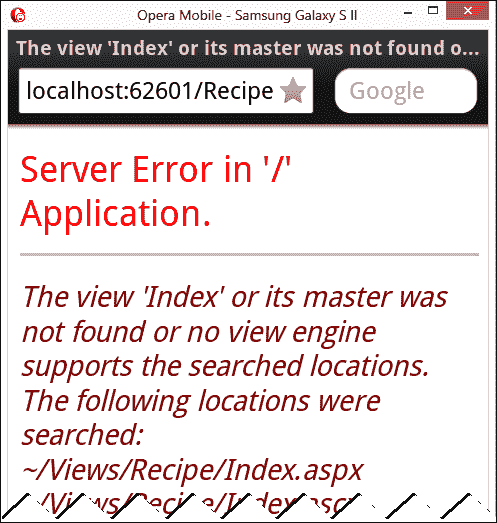

这可能不是你所期望的结果。该错误的存在是因为没有可用于`RecipeController`的`Index`动作的视图。

## ASP.NET MVC 中的视图

在 ASP.NET MVC 和通用的 MVC 模式中，视图处理作为发送给控制器的请求的结果的数据表示。默认情况下，视图存储在`Views`文件夹中。

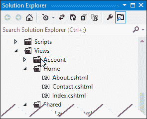

在项目的`Views`文件夹中，有对应于每个控制器的文件夹。注意在`Home`文件夹中有对应于`HomeController`类中每个动作方法的视图。这是设计上的，也是 ASP.NET MVC 的另一个超越配置的特性。

每当运行时寻找与动作相关联的视图时，它将首先寻找名称与被调用的动作相匹配的视图。它将尝试在一个文件夹中找到该视图，该文件夹的名称与被调用的控制器相匹配。对于我们最初的`/Home/Index`请求，运行时会寻找视图`Views/Home/Index.cshtml`。

### 注

运行时通过相当大的搜索顺序来确定默认视图。如果您在尝试调用`RecipeController`时检查出现的错误屏幕，而没有首先为操作创建视图，您可以看到该搜索顺序。

### 剃刀

Razor 是默认的**视图引擎**，在 ASP.NET MVC 4 中，它是运行时的一部分，用于解析、处理和执行视图中的任何代码。Razor 视图引擎有一个非常简洁的语法，旨在限制击键并增加视图的可读性。

注意，我说的是语法而不是语言。Razor 旨在轻松融入您现有的技能组合，让您专注于当前的任务。要成功使用 Razor，您真正需要知道的是`@`字符在键盘上的位置。

### 注

`.cshtml`是一个扩展，它将视图标识为用 C#编写的 Razor View Engine 视图。如果编写视图的语言是 Visual Basic，扩展将是`.vbhtml`。如果您选择使用网络表单视图引擎，您的视图将有一个与之关联的`.aspx`扩展，但是您将无法跟随本书中的示例。BrewHow 应用使用的所有视图都由 Razor View 引擎解析和处理。

#### 字符@字符

`@`字符是理解 Razor 语法的关键。它是用于表示代码块、注释、表达式和内联代码的符号。更准确地说，`@`字符指示视图引擎开始将视图的内容视为必须解析、处理和执行的代码。

##### 代码块

如果您想要在 Razor 视图中放置一个代码块，只需使用`@`为该代码块添加前缀。

```cs
@{
    string foo = "bar";
}
```

代码块是大括号({})之间的代码部分。

##### 表情

表达式是代码的一部分，其计算结果是返回值。表达式可以是方法调用。

```cs
@foo.Bar() 
```

它们也可以用来检索属性值。

```cs
@user.FirstName.
```

表达式可以直接嵌入到输出的 HTML 中。

```cs
<h1>Hello, @user.FirstName</h1>
```

默认情况下，任何 Razor 表达式求值的结果都是 HTML 编码的。这意味着任何对客户端有意义的特殊字符都会作为输出处理的一部分被转义。该功能还充当安全机制，防止可执行代码的意外(或恶意)添加被发送给请求者。

如果需要公开属性或方法的原始值，可以使用`Raw` HTML 帮助器扩展方法。

```cs
@Html.Raw(beVeryCarefulDoingThis)
```

### 注

HTML 编码通过指示浏览器将输出呈现为数据来帮助防止跨站点脚本(XSS)攻击。对返回给客户端的所有数据进行编码是至关重要的。网站上还有其他几种可能的攻击，远远超出了本书的范围，我敦促您开发防御性编码实践，并了解您的应用可能面临的潜在威胁。

##### 内嵌代码

正如前面提到的，Razor View 引擎足够智能，可以推断出一段可操作的代码何时已经终止，处理应该停止。在视图中放置内联代码时，这非常方便。

```cs
@if (userIsAuthenticated) {
    <span>Hello, @username</span>
} else {
    <a href='#'>Please login</a>
}
```

如果您想要在内嵌代码中向用户显示的内容没有包装标签，如`span`或`div`，您可以将内容包装在`<text>`标签中。

```cs
@if (jobIsDone) {
    <text>profit!</text>
}
```

请注意，仅仅提及代码在视图中的位置可能会导致类似于关于左花括号位置的讨论。如果你是内联代码教会的实践成员，最好遵循“不问不说”的政策。

##### 评论

如果你是明智的，并评论你的代码，Razor 支持它。

```cs
@* Your comment goes here. *@
```

评论和其他东西一样，需要维护。如果您修改代码，请修改您的注释。

Razor 还可以做其他一些事情，比如创建委托，但是我们将在应用中遇到委托时解决它们。

### 共享视图

当我们检查`HomeController`的视图时，我们了解到一个控制器的视图被放置在一个同名的文件夹中。视图只对拥有该文件夹的控制器可用。如果我们想让一个视图容易被多个控制器访问，我们需要将该视图标记为共享，方法是将该视图放在`Views`文件夹下的`Shared`文件夹中。

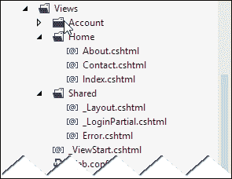

如果运行时在执行控制器的视图文件夹中找不到合适的视图，那么下一个位置将是`Shared`文件夹。我们当前的应用在`Shared`文件夹中有三个视图。

`_LoginPartial.cshtml` 是包含我们登录控件的局部视图。该控件嵌入在我们的几个视图中，并为未经身份验证的用户显示登录表单。几个视图对它的使用使它在`Shared`文件夹中占有一席之地。

视图`Error.cshtml`是全局错误页面。当不可预见的事情发生时，它通过行动方法返回。由于任何操作都可以返回该视图，因此它被放置在`Shared`文件夹中。

第三个视图`_Layout.cshtml`是一种特殊类型的共享视图，称为布局。

### 布局

布局是视图内容的模板。布局通常包含脚本、导航、页眉、页脚或您认为在网站的多个页面上需要的其他元素。如果你过去与 ASP.NET 合作过，你很可能熟悉母版页。布局是 ASP.NET MVC 世界的母版页。

您可以使用视图的`Layout`属性指定页面布局。

```cs
@{
    Layout = "~/Views/Shared/_Layout.cshtml"
}
```

当一个视图被加载时，布局被执行，视图的内容被放置在调用`@RenderBody()`的地方。

### 视图开始文件

如果您有几个视图使用相同的布局，在每个视图中指定布局可能会有点重复。为了保持干燥(不要重复自己)，您可以在`_ViewStart.cshtml`中指定网站所有视图的默认布局。

`_ViewStart.cshtml`位于`Views`文件夹的根目录。它用于存储应用中所有视图通用的代码，而不仅仅是指定布局。加载每个视图时，会调用`_ViewStart.cshtml`。它就像视图的基类，其中的任何代码都成为站点中每个视图的构造函数的一部分。

### 注

您会注意到`_LoginPartial.cshtml`和`_Layout.cshtml`都以下划线开头。下划线是另一种约定，表示不直接请求视图。

### 局部视图

部分视图允许您将视图的部分设计为可重用组件。这些与 ASP.NET 网页表单开发中的控件非常相似。

部分视图可以使用`PartialView`方法直接从控制器返回，或者直接返回`PartialReviewResult`返回类型。它们也可以使用`RenderPartial`、`Partial`、`RenderAction`或`Action` HTML 助手方法直接嵌入到视图中。

### HTML 助手

您将在我们的视图中看到的许多代码都有以`Html`为前缀的方法。这些方法是`HtmlHelper`扩展方法(简称 HTML 助手)，旨在为您提供一种快速的方法来执行一些操作或将一些信息嵌入到视图的输出中。通常，这些方法的返回类型为`string`。HTML 助手帮助标准化视图(如表单或链接)中呈现的内容的呈现。

#### Html。RenderPartial 和 Html。部分的

`RenderPartial` HTML 助手处理部分视图，并将结果直接写入响应流。结果就好像部分视图的代码被直接放入了调用视图。

```cs
@Html.RenderPartial("_MyPartialView", someData)
```

`Partial` HTML 帮助器对视图的处理与`RenderPartial`帮助器相同，但处理的输出以字符串形式返回。我们项目中的`_LoginPartial.cshtml`是使用`Partial` HTML 帮助器在`_Layout.cshtml`布局中渲染的。

```cs
@Html.Partial("_LoginPartial")
```

如果在局部视图中返回大量数据，`RenderPartial`会比`Partial`稍微高效一些，因为它与响应流直接交互。

#### Html。RenderAction 和 Html。行动

`RenderAction` HTML 帮助器与`RenderPartial`的不同之处在于，它实际上调用了一个控制器的动作方法，并将该内容嵌入到视图中。这一功能非常有用，因为它提供了一种方式来执行控制器中特定于视图的业务逻辑或其他代码，该控制器负责将视图返回给请求者。

假设我们决定在我们的啤酒之路网站的每个页面上展示一个最受欢迎的啤酒风格的标签云。

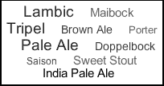

您有两个选项:您可以让站点的每个操作从数据库中检索或缓存当前值以显示在标签中，或者您可以让一个控制器操作单独负责检索标签云的值，并使用`RenderAction`或`Action`方法在每个视图中调用该操作。

`RenderAction``Action`的区别与`RenderPartial`和`Partial`的区别相同。`RenderAction`将处理的输出直接写入响应流。`Action`将处理的输出作为`string`返回。

### 显示模板

显示模板是类型特定的局部视图。它们存在于一个名为`DisplayTemplates`的文件夹中。如果显示模板特定于控制器，则该文件夹可能存在于控制器的`View`文件夹中，或者如果要由整个应用使用，则该文件夹可能存在于`Shared`文件夹下。

每个显示模板都必须根据其类型进行命名。应用中任何地方都可以使用的`Beer`类的显示模板将被命名为`Beer.cshtml`并放置在`~/Shared/Views/DisplayTemplates`中。

我们还可以为字符串或整数等基本类型创建显示模板。

可以使用`Display`、`DisplayFor`或`DisplayForModel` HTML 帮助器方法将显示模板添加到视图中。

#### Html。显示

`Display` HTML 帮助器 接受单个字符串参数。该字符串表示当前模型的属性名或`ViewData`字典中要渲染的值。

假设传递给我们的模型定义如下:

```cs
public class Recipe
{
    public string RecipeName { get; set; }
    /* Other properties here… */
}
```

如果我们想要调用`RecipeName`属性的显示模板，我们将以下代码放入视图中:

```cs
@Html.Display("RecipeName")
```

运行时将尝试找到字符串类型的显示模板，并使用任何已识别的模板来呈现`RecipeName`属性。

#### Html。DisplayFor

`DisplayFor`是的基于表达式的版本`Display`。它将视图的当前模型作为参数，并处理模型上指定属性的显示模板。

```cs
@Html.DisplayFor(model => model.RecipeName)
```

我们将在本章后面填充视图时研究视图如何知道模型类型。

#### html . display formdel

如果我们希望为整个模型调用显示模板链，我们只需使用 `DisplayForModel`辅助方法。

```cs
@Html.DisplayForModel()
```

### 编辑器模板

编辑器模板是显示模板的读/写版本。它们的实现和用法与显示模板相同。

编辑器模板存储在名为`EditorTemplates`的文件夹中。该文件夹可能与`DisplayTemplates`文件夹位于同一位置。

编辑器模板和显示模板一样，使用三种 HTML 帮助器方法之一来调用:`Editor`、`EditorFor`或`EditorForModel`。

我们将利用显示和编辑器模板来改进我们的酿酒应用。

### 创建我们的配方视图

走了这么远的路，我们可以回到手头的任务上了。我们现在知道，如果我们想要`/Recipe`网址成功，我们需要在`~/Views/Recipe`文件夹中创建一个名为`Index.cshtml`的视图。我们可以在解决方案中手动创建文件夹结构(当前不存在`Recipe`文件夹)，然后创建一个新的局部视图，但是为什么不允许 Visual Studio 为我们做这项繁重的工作。

在**解决方案资源管理器**中打开`RecipeController.cs`文件，在`Index`动作方法中的任意位置单击鼠标右键。您将看到一个标签为**添加视图…** 的菜单项。


点击**添加视图…** 或按 *Ctrl* + *M* 、 *Ctrl* + *V* 将显示**添加视图**对话框。只需点击**添加**按钮，接受默认值。

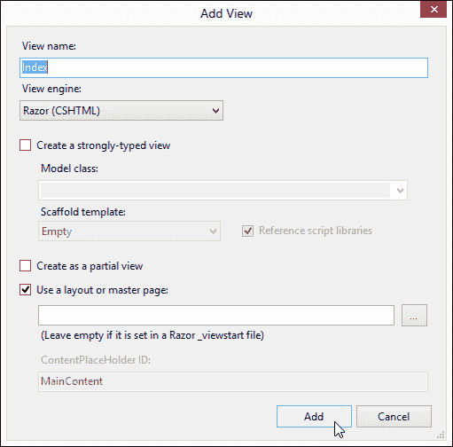

如果您返回到**解决方案资源管理器**，您将看到视图目录结构和`RecipeController`的`Index.cshtml`视图。

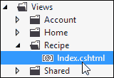

像以前一样，通过按下 *Ctrl* + *F5* 和将`/Recipe`追加到浏览器地址栏中的网址来启动应用。现在，您应该会看到一个与以下截图非常相似的页面:

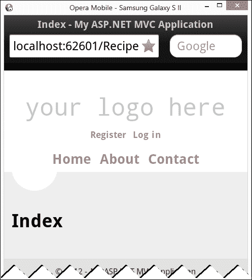

#### 使配方默认

我们应该将`/Recipe`控制器的`Index`动作设置为应用的默认动作，因为我们的应用都是关于分享食谱的。

打开`App_Start`文件夹中的`RouteConfig.cs`文件，将`defaults`参数的值修改为默认的`RecipeController`。请记住，在寻找处理请求的类时，运行库会将`Controller`追加到控制器名称中。

```cs
routes.MapRoute(
    name: "Default",
    url: "{controller}/{action}/{id}",
 defaults: new 
 { 
 controller = "Recipe", 
 action = "Index", 
 id = UrlParameter.Optional 
 });

```

按 *Ctrl* + *F5* 构建并启动应用。

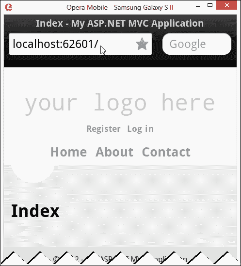

我们的`RecipeController`的`Index`动作和视图现在处理向用户呈现默认登陆页面。剩下的唯一事情就是修改我们的布局，这样当用户点击主页导航链接或徽标文本本身时，他们会被重定向到`/Recipe/Index`而不是`/Home/Index`。

```cs
<p class="site-title">
    @Html.ActionLink("your logo here", 
        "Index", 
 "Recipe")
</p>
<!-- Other stuff happens -->
<li>
    @Html.ActionLink("Home", 
        "Index", 
 "Recipe")
</li>
```

## 将模型返回视图

我们已经成功处理了视图并将其返回给客户。现在我们需要从`RecipeController`的`Index`动作中返回一些数据。这些数据代表了 MVC 模式的模型部分，ASP.NET MVC 支持几种方法来返回控制器收集的任何数据。

### 使用视图数据

`ControllerBase`类的`ViewData`属性(T2】类的父类)是一种“神奇的字符串”机制，用于将数据从控制器传递到视图。它或多或少是一本字典。几乎所有与它的交互都是通过其`IDictionary<string,object>`接口实现提供的键/值语法进行的。

```cs
ViewData["MyMagicProperty"] = "Magic String Win!"
```

使用`WebViewPage`基类的`ViewData`属性，可以在视图中检索任何放入`ViewData`字典的值。

```cs
@ViewData["MyMagicProperty"]
```

从`Controller`和`ControllerBase`类中向视图发送模型的所有其他方法都是`ViewData`字典的包装和抽象。

虽然您可能(也可能不)将魔法字符串视为数据交换的适当机制，但所有其他将数据返回视图的方法都在内部利用`ViewData`。

### 使用视图包

`ViewBag`是`ViewData`字典的包装器，支持`ViewData`字典上的动态属性和类型。

如果我们检查类的`Index`动作，我们会看到它正在使用`ViewBag`属性向视图发送消息。

```cs
public ActionResult Index()
{
 ViewBag.Message = "Modify this template to jump-start your ASP.NET MVC application.";

    return View();
}
```

`Message`不是`ViewBag`属性的声明成员。`ViewBag`属性支持动态类型化，也称为鸭式类型化，允许为未在对象上声明的属性赋值。仅仅是给这些属性赋值的行为就可以将它们添加到对象中。

可以使用`WebViewPage`基类的`ViewBag`属性从视图中访问`ViewBag`数据。`HomeController`的`Index`视图有以下代码:

```cs
<hgroup class="title">
    <h1> @ViewBag.Title. </h1>
    <h2> @ViewBag.Message </h2>
</hgroup>
```

这将作为页面内容的一部分显示给用户。

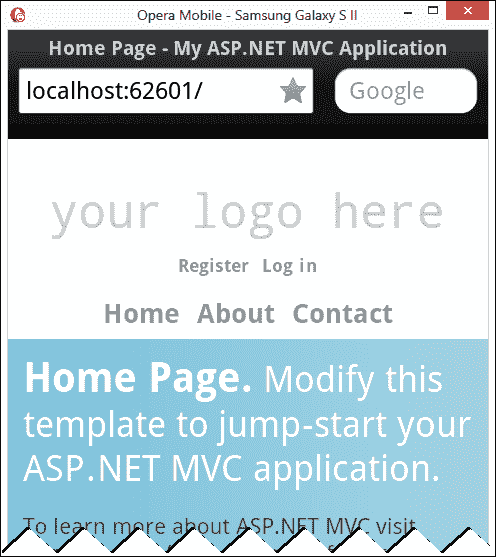

`ViewBag`的任何使用都应记录在案。由于它们的动态特性，编译器无法验证对动态类型的引用。试图访问不存在的属性或方法，或者使用不同类型或参数定义的属性或方法，将不会在编译时被捕获。相反，这些错误将在运行时被捕获，并将导致您的应用崩溃。

### 使用温度数据

如果您需要在重定向或顺序请求之间保存视图数据，那么您可能需要考虑使用`TempData`。`TempData` 是`ViewData`词典的另一个包装，但是`TempData`中放置的数据是故意短命的；存储在`TempData`中的任何内容都将只保留两个请求:同一用户的当前请求和下一个后续请求。

将数据放入`TempData`字典应该谨慎进行，因为实现可能会导致意外行为。

假设我们应用的一个用户打开了两个标签来比较两种食谱。请求来自其中一个标签，将数据插入`TempData`进行消费。然后从另一个打开的选项卡触发对应用的第二个请求。第二个请求将强制由第一个请求放入`TempData`的值过期，无论预期的接收者是否已经检索并操作了这些值。

可通过`ControllerBase`和`WebViewPage`的`TempData`属性访问`TempData`字典。

```cs
TempData["UserNotification"] = "Hope you get this message."

@TempData["UserNotification"]
```

到目前为止介绍的三种方法提供了从控制器向视图提交松散耦合的数据的方法。虽然您当然可以通过这些机制向视图发送完整的模型，但是框架提供了一种强类型的方法来在控制器和视图之间移动数据。

### 强类型模型

如果您想要将强类型模型从控制器传递到视图，您可以通过两种方式之一来实现。您可以通过在`ViewData`字典上设置`Model`属性的值来直接实现这一点(好的，所以它不仅仅是一个字典)，或者您可以通过`Controller`类上的一个`ActionResult`方法将模型传递给视图。

直接设置属性可以如下进行:

```cs
ViewData.Model = myModel;
```

您可能不会经常直接设置该值，而是会使用`ActionResult`方法之一。

```cs
return View(myModel);
```

这要简洁得多，如果您检查`Controller`类中的代码，您会看到它实际上是代表您设置`ViewData.Model`。

```cs
protected internal virtual ViewResult View
    (string viewName, string masterName, object model)         
{             
    if (model != null)             
    {                 
        ViewData.Model = model;             
    }              
    /* Other code removed */
} 
```

### 类型

**主动出击**

上面的代码直接取自 ASP.NET MVC 4 的 RTM 版本。微软的整个网络堆栈可以在`aspnetwebstack.microsoft.com`获得开源许可。我们敦促您花时间研究代码，了解框架实际上在做什么。

对于视图来说，要以强类型的方式操作这个模型，它必须被告知预期的模型类型。在 Razor 视图中，这是通过`@model`关键字完成的。

```cs
@model BrewHow.Web.Model.MyModel
```

### 返回配方列表

让我们把所学的一切付诸实践。当我们应用的用户登陆食谱页面时，我们会向他们展示一份食谱列表。

#### 创建模型

我们需要定义一个模型来表示我们应用中的一个食谱。目前，该模型将包含四个属性:名称、样式、原始重力和最终重力。

### 注

液体的重力是相对于水的密度的量度，水的重力为 1.0。测量啤酒的重力是为了确定糖在液体中所占的百分比。酿造啤酒时要进行两次测量。在添加酵母之前，原始重力用于测量麦芽汁中的糖含量。最终重力用于测量发酵结束时液体的重力。这两个测量值之间的差异可以用来确定未发酵麦芽汁中有多少糖在发酵过程中转化为酒精。确定酒精体积含量的公式为 132.715*(原始重力-最终重力)。

在**解决方案浏览器**中，右键点击**车型**文件夹，选择**添加**，然后点击**类……**。

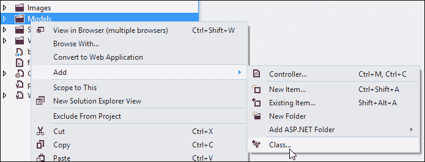

在**添加新项目**对话框中选择**类**作为要添加的项目类型(如果尚未选择)。命名类`Recipe`，点击**添加**创建类。

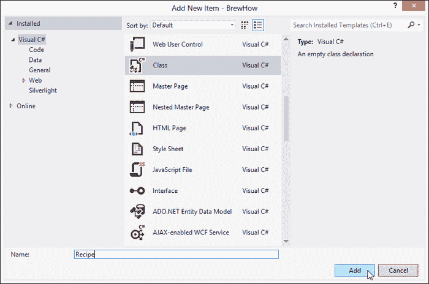

打开新的`Recipe.cs`文件，用以下内容替换`Recipe`类定义:

```cs
public class Recipe
{
    public string Name { get; set; }
    public string Style { get; set; }
    public float OriginalGravity { get; set; }
    public float FinalGravity { get; set; }
}
```

保存并关闭文件。

#### 返回模型

打开的`RecipeController`类，用以下代码替换`Index`动作:

```cs
public ActionResult Index()
{
    var recipeListModel = new List<Recipe>
    {
        new Recipe { Name = "Sweaty Brown Ale", Style = "Brown Ale", OriginalGravity = 1.05f, FinalGravity = 1.01f },
        new Recipe { Name = "Festive Milk Stout", Style="Sweet/Milk Stout", OriginalGravity = 1.058f, FinalGravity = 1.015f },
        new Recipe { Name = "Andy's Heffy", Style = "Heffeweisen", OriginalGravity = 1.045f, FinalGravity = 1.012f }
    }
    return View(recipeListModel);
}
```

新的`Index`动作相当简单。新代码创建一个填充列表，并将其分配给`recipeListModel`变量。填充的列表通过`View`方法作为强类型模型发送到`Index`视图(请记住，除非另有说明，否则该视图与动作同名)。

```cs
return View(recipeListModel);
```

对于要编译的代码，您需要在文件顶部添加一条`using`语句，以引用在`BrewHow.Models`中定义的新`Recipe`模型。

```cs
using BrewHow.Models;
```

#### 显示模型

最后一步是告知视图即将到来的模型，并为视图提供显示模型的手段。

在`~/Views/Recipe`文件夹中打开`Index.cshtml`视图，并在视图顶部添加以下行。

```cs
@model IEnumerable<BrewHow.Models.Recipe>
```

这表明我们传递给视图的模型是一个食谱的枚举。它现在是强类型的。

将光标放在`Index.cshtml`视图的底部，粘贴以下代码。即使表格被恰当地用来显示表格数据，你也不会因为害怕使用表格而被评判。我们只是想让模型立即显示出来。

```cs
<table>
    <tr >
        <th>
            @Html.DisplayNameFor(model => model.Name)
        </th>
        <th>
            @Html.DisplayNameFor(model => model.Style)
        </th>
        <th>
            @Html.DisplayNameFor(model => model.OriginalGravity)
        </th>
        <th>
            @Html.DisplayNameFor(model => model.FinalGravity)
        </th>
    </tr >

@foreach (var item in Model) {
    <tr >
        <td>
           @Html.DisplayFor(modelItem => item.Name)
        </td>
        <td>
            @Html.DisplayFor(modelItem => item.Style)
        </td>
        <td>
            @Html.DisplayFor(modelItem => item.OriginalGravity)
        </td>
        <td>
            @Html.DisplayFor(modelItem => item.FinalGravity)
        </td>
    </tr >
}

</table>
```

粘贴到视图中的标记会布局一个表，列出传递到视图的模型集合中的每个条目。一定要注意 Razor 语法对视图标记的干扰有多小。

表格的第一行包含配方列表的标题。在`foreach`循环中处理视图的过程中，视图引擎迭代传递给它的集合中的每个项目，并使用该类型的显示模板为表输出一行。由于我们没有定义显示模板，属性的值将简单地作为字符串输出。

您已经成功地创建了模型，在控制器中填充了模型，将填充的模型从控制器传递到视图，并向用户显示填充的模型。按下键盘上的 *Ctrl* + *F5* 即可启动 app，欣赏你的作品。

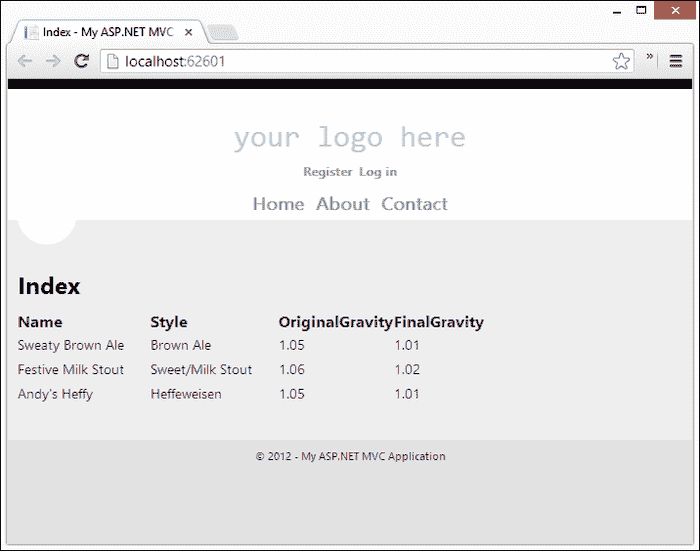

# 总结

恭喜你！这一章是信息的旋风，但是我们现在已经对 MVC 模式有了基本的了解，以及它与 ASP.NET MVC 4 的关系。我们学习了控制器和动作方法以及如何创建它们。我们创建了一个模型，将模型从控制器传递给视图，并编写了显示该模型的代码。了解了基本知识，我们就该看看更大更好的东西了。

在下一章中，我们将利用实体框架 5.0 的功能为我们的应用创建一个持久层，并返回存储在数据库中的信息。这个持久层将作为我们模型前进的基础。