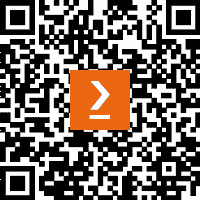

# 前言

欢迎阅读 *ASP.NET 8 最佳实践*！

*ASP.NET 8 最佳实践*包含了超过 100 条在 ASP.NET 社区中使用的最佳实践，涵盖了如何从你的 ASP.NET Web 应用程序中获得最佳性能、可用的 Entity Framework 模式、如何设计最小化的 Web API，以及如何根据项目类型来结构化 Visual Studio 项目等主题。

本书涵盖的标准包括版本控制、创建软件管道、创建结构化中间件、安全实践、Entity Framework Core 模式和技巧，以及自动化耗时客户端任务。

我们还将探讨在测试代码时、何时以及如何应用异常处理、如何设计最佳 API 以供 Web 应用程序使用、如何优化 Web 应用程序以提升性能，以及最后，在构建 ASP.NET Web 应用程序时，回顾常见的术语和指南。

尽管最佳实践被认为是编写专业代码的建议，但总会有例外。正如开发者所知，有无数种编写代码以实现相同结果的方法。有些方法比其他方法更好。我认为这些“更好的方法”就是最佳实践。

在我们介绍每个主题时，我们将提供尽可能多的细节和参考资料来解释为什么这些技术和模式确实是编写专业代码的更好方式。然而，这并不意味着它们是固定不变的。如前所述，总会有例外。

对于新进入 ASP.NET 生态系统的开发者来说，构建一个新的 ASP.NET 网站并看到与之相关的所有内容可能会感到不知所措。本书旨在通过理解与 ASP.NET 网站“中心”相连的每个技术“辐条”来减轻这种感觉。它探讨了创建“简单”网站所涉及的所有内容。

对于已经使用 ASP.NET 的资深开发者，可以将本书作为参考，了解我在 20 年职业生涯中收集的建议和观察。甚至包括我与过去和现在的同事们的经验也包含在本书中。

# 这本书适合谁

这本书是为那些对 ASP.NET 有实际了解的开发者而写的，他们希望通过学习开发者社区或企业环境中的最佳实践来追求自己的职业发展。虽然可能会有一些对你来说是新主题，但本书可以作为参考，在任何时候帮助你更清晰地理解 ASP.NET 的相关主题。完成本书后，无论你是独立开发者还是在 500 强公司团队中工作，你都将对整个行业中的常用实践有更深入的理解。

# 这本书涵盖了什么内容

*第一章*，*使用源代码控制来掌握控制权*，讨论了源代码控制的重要性，识别和选择分支工作流程，为什么标签很重要，以及正确的提交礼仪。

*第二章*, *CI/CD – 自动构建高质量软件*，定义了什么是 CI/CD，理解并准备代码以供管道使用，以及当出现错误时识别两种“失败”的方法，如何部署数据库，以及各种 CI/CD 提供商，如 Azure、AWS 和 Google Cloud Platform。

*第三章*, *中间件的最佳实践*，解释了什么是中间件以及如何使用请求委托和扩展方法优化中间件管道，以及构建一个示例中间件组件。

*第四章*, *从一开始就应用安全性*，涵盖了为什么在编写代码之前、期间和之后，安全性都应该是一个首要关注的问题，以及常见的安全实践。章节最后讨论了互联网上最严重的三个安全威胁。

*第五章*, *使用 Entity Framework Core 优化数据访问*，探讨了 Entity Framework 的不同实现类型以及每种类型的使用方法，为什么日志记录和 async/await 很重要，如何使用资源处理大量种子数据，以及为什么有时绕过 LINQ 并使用存储过程会更好。

*第六章*, *Web 用户界面的最佳实践*，检查了任务运行器是什么，为什么它们很重要，以及如何使用一个创建工作流程，以及审查 UI 标准，如集中化站点 URL，为什么控制器/页面应该小，为什么`ViewComponent`s 是有益的，以及如何创建 SEO 友好的 URL。

*第七章*, *测试您的代码*，解释了在 ASP.NET 应用程序中使用的各种测试概念，为什么编写单元测试很重要，为什么“100%测试覆盖率”不是必要的，如何使用三 A 方法（AAA）正确地构建单元测试，何时避免编写额外的单元测试辅助工具，以及如何使用测试作为文档。

*第八章*, *使用异常处理捕获异常*，回顾了不同类型的异常处理，何时以及如何使用异常处理，以及使用全局异常处理。它还涵盖了日志记录，单元测试和异常处理之间的相似之处，为什么空的 try..catch 块是浪费的，如何使用异常过滤和模式匹配，以及何时使用 finally 块。

*第九章*, *创建更好的 Web API*，展示了各种实用的 API 技术，例如快速设计、创建和测试 API，以及将正确的 HTTP 动词和状态代码应用于 API，如何实现分页结构，版本控制和将 DTOs 集成到 API 中，以及为什么应该避免创建新的`HttpClient`。

*第十章*，*通过性能提升你的应用程序*，将我们在各章节中学到的所有内容应用于性能视角。我们将涵盖为什么性能如此重要以及它为什么重要，如何建立客户端、C#代码和数据库基线，以及图像优化、最小化请求、使用 CDN、实现 async/await、如何自动优化 HTML、Entity Framework Core 优化和缓存策略。

*第十一章*，*附录*，将回顾整个行业中使用的根本术语，如 DRY、YAGNI、KISS 原则，以及关注点的分离、如何重构代码、理解 SOLID 原则，以及如何在 Visual Studio 中结构化各种项目类型。

# 为了充分利用这本书

*您将需要本书中展示的代码的 Visual Studio 版本。您应该了解如何使用 Visual Studio，并理解如何打开解决方案和调试应用程序。*

| **本书涵盖的软件/硬件** | **操作系统要求** |
| --- | --- |
| Visual Studio 2022（任何版本）或支持.NET 8 的 favorite IDE | Windows、macOS 或 Linux |
| Git（可选） | Windows、macOS 或 Linux |
| SQL Server Management Studio（版本 16 或更高） | Windows |

**如果您使用的是本书的数字版，我们建议您自己输入代码或从书的 GitHub 仓库（下一节中有一个链接）获取代码。这样做将帮助您避免与代码复制和粘贴相关的任何潜在错误。**

书的理想开发者设置是已安装 Visual Studio 2022 Enterprise、Git 和 SQL Server Management Studio。

# 下载示例代码文件

您可以从 GitHub（[`github.com/PacktPublishing/ASP.NET-8-Best-Practices`](https://github.com/PacktPublishing/ASP.NET-8-Best-Practices)）下载本书的示例代码文件。如果代码有更新，它将在 GitHub 仓库中更新。

我们还有来自我们丰富的书籍和视频目录中的其他代码包，可在[`github.com/PacktPublishing/`](https://github.com/PacktPublishing/)找到。查看它们吧！

# 使用的约定

本书使用了多种文本约定。

`文本中的代码`：表示文本中的代码词汇、数据库表名、文件夹名、文件名、文件扩展名、路径名、虚拟 URL、用户输入和 Twitter 昵称。以下是一个示例：“一个更好的方法是将最新的`TryParse`与`var`一起使用，如下所示。”

代码块设置如下：

```cs
var number = "2";
if (!int.TryParse(number, out var result))
{
    result = 0;
}
// use result
```

**粗体**：表示新术语、重要词汇或屏幕上看到的词汇。例如，菜单或对话框中的单词以**粗体**显示。以下是一个示例：“取消选择**使用控制器**选项以使用最小 API。”

小贴士或重要提示

看起来像这样。

# 联系我们

欢迎读者反馈。

**一般反馈**: 如果你对本书的任何方面有疑问，请通过客户关怀@packtpub.com 给我们发邮件，并在邮件主题中提及书名。

**勘误**: 尽管我们已经尽一切努力确保内容的准确性，但错误仍然可能发生。如果你在这本书中发现了错误，我们将不胜感激，如果你能向我们报告这一点。请访问[www.packtpub.com/support/errata](http://www.packtpub.com/support/errata)并填写表格。

**盗版**: 如果你在互联网上以任何形式遇到我们作品的非法副本，如果你能提供位置地址或网站名称，我们将不胜感激。请通过版权@packtpub.com 与我们联系，并提供材料的链接。

**如果你有兴趣成为作者**: 如果你有一个你擅长的主题，并且你感兴趣的是撰写或为书籍做出贡献，请访问[authors.packtpub.com](http://authors.packtpub.com)。

# 分享你的想法

一旦你阅读了《ASP.NET 8 最佳实践》，我们很乐意听到你的想法！请[点击此处直接转到该书的亚马逊评论页面](https://packt.link/r/1-837-63480-7)并分享你的反馈。

你的评论对我们和科技社区都很重要，并将帮助我们确保我们提供高质量的内容。

# 下载本书的免费 PDF 副本

感谢您购买本书！

你喜欢随时随地阅读，但无法携带你的印刷书籍吗？你的电子书购买是否与你的选择设备不兼容？

别担心，现在每购买一本 Packt 书籍，你都可以免费获得该书的 DRM 免费 PDF 版本。

在任何地方、任何设备上阅读。直接从你最喜欢的技术书籍中搜索、复制和粘贴代码到你的应用程序中。

优惠不仅限于此，你还可以获得独家折扣、时事通讯和每日免费内容的每日邮箱访问权限。

按照以下简单步骤获取福利：

1.  扫描下方二维码或访问以下链接



[`packt.link/free-ebook/978-1-83763-212-1`](https://packt.link/free-ebook/978-1-83763-212-1)

1.  提交你的购买证明

1.  就这些！我们将直接将你的免费 PDF 和其他福利发送到你的邮箱。
