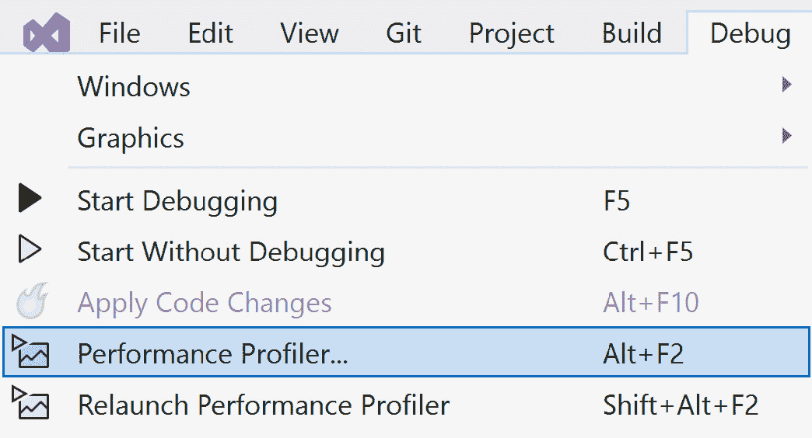
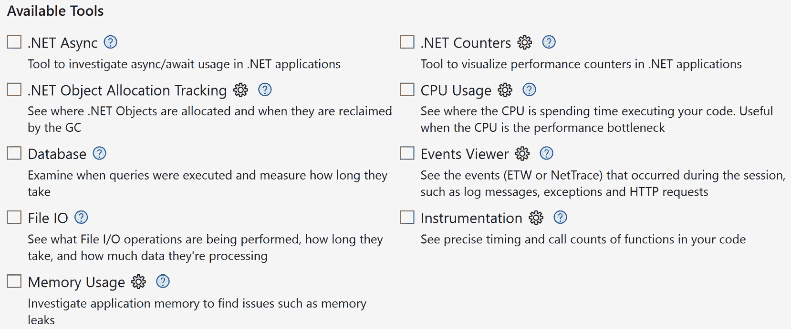
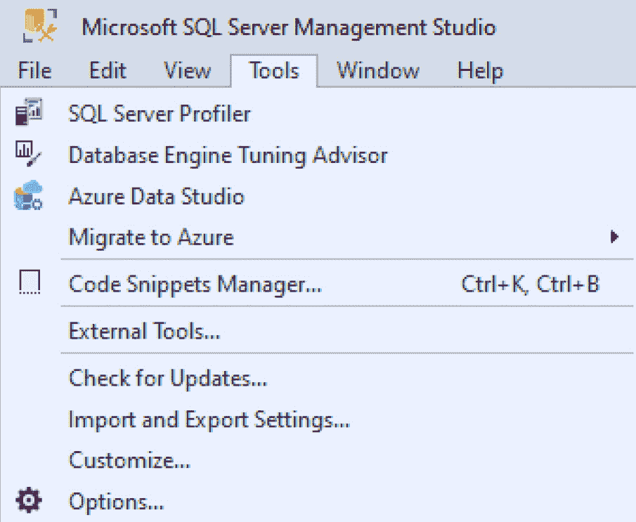
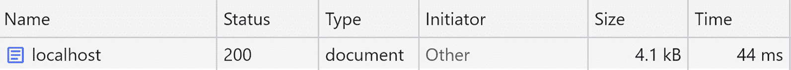
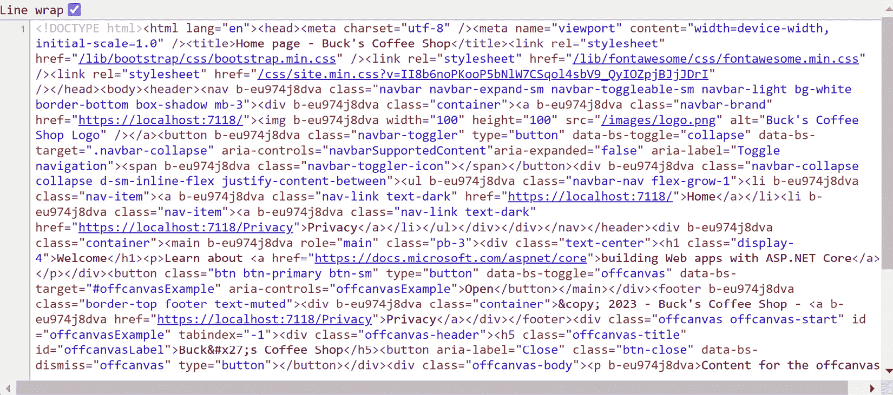
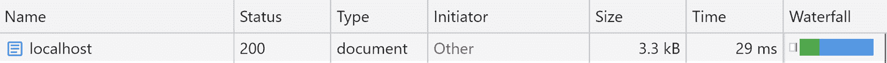

# 第十章：用性能推动你的应用程序

随着每个新版本的**ASP.NET**发布，ASP.NET 团队继续将性能作为优先事项。当 ASP.NET Core 引入了一种使用流线化增强（包括**中间件**和**Razor Pages**）构建 Web 应用程序的新方法时，重点始终是改进 C#语言。正是这些技术赋予了 ASP.NET 其火花和速度。

ASP.NET 是跨平台的，内置了对依赖注入的支持，是开源的，并且在行业中是性能最快的框架之一。

虽然这是一本关于性能的 ASP.NET 书籍，但其中还将包含同样重要的 Web 开发的其他方面。我们将尽可能专注于 ASP.NET 和 C#的性能。

在本章中，我们将涵盖以下主要主题：

+   性能为何重要

+   建立基线

+   应用性能最佳实践

到本章结束时，你将了解性能在你应用程序中的重要性，如何建立客户端和服务器端基线和优化客户端资源以提高交付速度的技术，以及最后如何通过优化 HTML、实施各种缓存技术以及识别慢查询等服务器端性能技术来更快地交付内容。

# 技术要求

在创建基线和测试 Web 应用程序的性能时，你需要一个你感到舒适的 IDE 或编辑器来编写代码。我们建议使用你最喜欢的编辑器来查看 GitHub 仓库。我们的建议包括以下内容：

+   **Visual Studio**（最好是最新版本）

+   **Visual** **Studio Code**

+   **JetBrains Rider**

本章的代码位于 Packt Publishing 的 GitHub 仓库中，网址为[`github.com/PacktPublishing/ASP.NET-Core-8-Best-Practices`](https://github.com/PacktPublishing/ASP.NET-Core-8-Best-Practices)。

# 性能为何重要

在 Web 开发中，性能有多种形态和形式，因为有许多移动部件使网站始终准备好并可供我们的用户使用。作为一名开发者，如果有人请求关于网站速度慢的帮助，你会推荐什么建议？在没有检查网站的情况下，这是一个难以用言语回答的问题。对于网站来说，可能有时性能不仅仅是一种技术；问题可能不止一个瓶颈。

例如，当在浏览器中加载网页时，你是否看到内容出现，但图片加载很慢，并且逐行渲染？关于访问数据库呢？你是否遇到服务器需要一分钟才能检索记录的慢查询？Web API 的每个请求是否超过两秒？

如你所见，性能是对整个网站的分析，包括浏览器、服务器、C#、API 和数据库。

亚马逊发布了一项研究，计算如果他们的网站页面加载速度慢了 1 秒钟，可能会给他们造成 16 亿美元的销售额损失。

一秒钟可能让亚马逊损失 16 亿美元销售额

这项研究由 Fast Company 报道，可在 [`fastcompany.com/1825005/how-one-second-could-cost-amazon-16-billion-sales`](https://fastcompany.com/1825005/how-one-second-could-cost-amazon-16-billion-sales) 找到。

虽然这很引人注目，但最近还有一篇关于 Netflix 如何用纯 JavaScript（通常称为 Vanilla JavaScript）取代 React 的文章。这带来了巨大的性能提升。在案例研究中，它报告了一个页面有 300 KB 的 JavaScript，这相当多。然而，与其他网站如 [CNN.com](http://CNN.com)（4.4 MB 的 JavaScript）和 [USAToday.com](http://USAToday.com)（1.5 MB 的 JavaScript）相比，300 KB 的 JavaScript 被认为是微不足道的。

Netflix 网络性能案例研究

Google Chrome 工程主管 *Addy Osmani* 写了一篇关于 Netflix 通过优化获得性能提升的文章。案例研究可在 [`medium.com/dev-channel/a-netflix-web-performance-case-study-c0bcde26a9d9`](https://medium.com/dev-channel/a-netflix-web-performance-case-study-c0bcde26a9d9) 找到。

通过这些特定的场景和案例研究，许多公司开始关注性能。甚至微软也通过向 TechEmpower 的行业框架基准结果提交其结果，将精力集中在性能上。由于持续的改进，ASP.NET 现在被评为最快的网络平台之一。

TechEmpower 框架基准结果

每年，TechEmpower 都会更新其结果，这些结果可以在 [`techempower.com/benchmarks/`](https://techempower.com/benchmarks/) 的图表中找到。截至 2022 年 7 月 19 日，ASP.NET 在性能排名中位列第 9。

最后，作为搜索引擎行业中最具主导地位的玩家，谷歌将页面加载速度与你的 **搜索引擎结果页面**（**SERPs**）联系起来。也就是说，你网站的加载速度是影响你在搜索结果中排名高低的重要因素（我们将在下一节中讨论）。

谷歌在网页搜索排名中使用网站速度

在谷歌的博客上，他们提到，在排名你的网站时，页面速度是考虑的另一个因素。该帖子可在 [`developers.google.com/search/blog/2010/04/using-site-speed-in-web-search-ranking`](https://developers.google.com/search/blog/2010/04/using-site-speed-in-web-search-ranking) 找到。

性能是我最喜欢的主题之一。通过进行小的改动来获得大的性能提升的想法无疑是令人兴奋的。它也可以直观地显现出来。本章旨在帮助使用技术和工具来识别任何网站上的性能问题。

好消息是，在过去的章节中，我们已经提到了一些提高性能的具体方法，当相关时我们将回顾这些方法。正如我在*第四章*中说的，性能在构建 ASP.NET Web 应用程序时应该是首要任务，其次是安全性。

性能始终是艺术和科学的结合，正如你将在本章的一些部分中看到的那样。有**感知**性能，然后有**实际**性能。

实际性能是一个测量活动或任务立即响应并通知用户已完成的活动。立即响应是一个目标。感知性能是一个主观的测量，用户将活动或任务体验为快速，即使它并不真正如此。感知性能的一个例子是当用户请求一个网页，浏览器立即渲染页面。内容在后台继续加载，同时通过允许用户滚动页面等待额外内容来保持用户的注意力。因此，用户认为网站“快速”，因为它立即响应。旋转器和进度条是其他在处理过程中实现感知性能的方法。

虽然感知性能是在等待过程完成时分散用户注意力的方式，但本章将更多地关注实际性能。

在下一节中，我们将学习如何使用公共 Web 工具和特定的服务器工具，如**Visual Studio 性能分析器**、**Benchmark.net**和**Application Insights**，来创建客户端和服务器端代码的基线。

# 建立基线

那么，你如何知道你在网站上遇到了速度减慢的问题？是因为最近发布了软件产品，还是安装了新的 NuGet 包导致速度减慢？

在识别问题时，你可能自己在问，“发生了什么变化？”但每个人都**应该**问的问题是“你如何衡量性能？”为了衡量它，需要有一个关于性能预期的基线。

应用程序的每个部分都应该包含性能测试。无论是前端、C#子系统、Web API 还是数据库，都应建立适当的系统来通知团队当系统未按预期表现时。

## 使用客户端工具

客户端的问题大多是由于加载时间、未找到的资源（如 HTML 页面、图像、CSS 和 JavaScript）的交付，或者一般的 JavaScript 错误。然而，这并不意味着整个问题都在客户端。

在开发过程中，应该通过像**Cypress**或**Selenium**这样的测试工具为客户端代码创建基线，并记录测试的持续时间。将最新的场景与之前的测试结果进行比较，以查看时间差异在哪里。

确定基线的另一种方法是使用网络上的各种工具，例如本节中列出的工具。将这些工具想象成像把您的车送到机械师那里进行维护一样。这些工具扫描您的公共网站，分析网站的所有方面，并提供一份关于如何修复每个发现的问题的报告。

一些可以为您提供网站性能洞察的工具包括以下内容：

+   **Google PageSpeed Insights** ([`pagespeed.web.dev`](https://pagespeed.web.dev)): Google 使用其搜索引擎对您的网站进行排名，并提供一个出色的工具来帮助解决网站问题。

+   **Lighthouse** ([`developer.chrome.com/docs/lighthouse/`](https://developer.chrome.com/docs/lighthouse/)): 如果您的网站无法公开访问以供这些工具分析，您可以使用 Lighthouse 扩展在内部运行网站测试。Lighthouse 会生成一份全面的报告，推荐如何使您的网站表现更好。

+   **GTMetrix** ([`gtmetrix.com`](https://gtmetrix.com)): 多年来我一直使用 GTMetrix，并且它每年都在给人留下深刻印象并不断改进。它提供性能摘要、速度可视化和推荐。

+   **Google Search Console** ([`search.google.com/search-console`](https://search.google.com/search-console)): Google 为网站管理员创建了这个工具，用于识别性能问题以及其他一般维护工具，例如人们输入 Google 搜索以找到您的网站的内容。

+   **DevTools**: DevTools 是位于 Google Chrome、Mozilla Firefox、Apple Safari 和 Microsoft Edge 内的网页开发者工具面板，用于帮助开发者分析网页，并且它正成为互联网的 IDE。在浏览器中按 F12 键将打开此面板。

这些工具非常适合评估您的网站在互联网上的表现以及基于最新修订的表现如何。如果您的上一个版本加载需要 0.5 秒，而最新版本现在需要三秒，那么是时候检查一下发生了什么变化。有什么比在部署网站之前通过报告性能问题来自动化这个过程（参考 *第二章*）更好的方法吗？

## 使用服务器端工具

使用 ASP.NET，创建代码基线与您可用的各种工具一样简单。

在本节中，我们将回顾一些可用于创建代码基线的工具，例如 Visual Studio、Benchmark.net、Application Insights 以及其他工具，如 NDepend。

### Visual Studio 性能工具

由于 Visual Studio 在业界是一个稳固的 IDE，因此评估 C# 性能的能力变得越来越普遍，因为如果代码运行缓慢，开发者希望有一种方法来定位瓶颈。



图 10.1 – Visual Studio 2022 中的性能分析器

当启动 **性能分析器** 时，您将看到一个选项列表：



图 10.2 – 运行性能分析器之前可用的选项列表

如您所见，有大量选项跨越多个接触点。例如，有一个**数据库**选项来查看您的查询在应用程序中的性能。

数据库的度量与解释查询执行持续时间的 Entity Framework 细节相似。另一个选项是确定异步/等待问题可能发生的地方，以及内存使用和对象分配。

### Benchmark.net

如果需要较小的、自包含的方法进行测试，Benchmark.net 是进行微基准测试的最佳工具之一（[`benchmarkdotnet.org/`](https://benchmarkdotnet.org/))。

Benchmark.net 对特定方法进行测试，并使用不同的场景进行测试。需要注意的是，Benchmark 项目*必须*是一个控制台应用程序。

例如，如果我们想测试一个古老的争论，即字符串连接和`StringBuilder`类哪个更快，我们会编写两个基准测试来确定哪个更快，如下所示：

```cs
public class Benchmarks
{
    [Benchmark(Baseline = true)]
    public void StringConcatenationScenario()
    {
        var input = string.Empty;
        for (int i = 0; i < 10000; i++)
        {
            input += «a»;
        }
    }
    [Benchmark]
    public void StringBuilderScenario()
    {
        var input = new StringBuilder();
        for (int i = 0; i < 10000; i++)
        {
            input.Append(«a»);
        }
    }
}
```

在前面的代码中，我们在一个场景中创建了一个字符串，在另一个场景中创建了一个`StringBuilder()`类的实例。为了达到相同的目标，我们添加了 10,000 个‘a’并开始基准测试。

根据图 10.3 中的结果，显然的选择是使用`StringBuilder()`进行大型字符串连接：


图 10.3 – 比较字符串连接与`StringBuilder()`类的性能

关于创建基线，我们在第一个场景中为我们的`[Benchmark]`属性添加了一个额外的参数，称为`Baseline`，并将其设置为`true`。这告诉 Benchmark.net 在测量其他方法的性能时使用这个作为我们的基线。你可以有任意数量的方法来实现相同的结果，但所有内容都将与`Benchmark`属性中`Baseline=true`的方法进行比较。

对于小型、紧凑的方法，Benchmark.net 无疑是提供关于如何使用微优化创建更快代码洞察的绝佳工具。

### 应用洞察

微软的应用洞察（Application Insights）旨在成为一个通用的分析工具，用于收集关于应用程序所做一切活动的遥测数据。一旦设置好，应用洞察可以收集以下数据：

+   请求 – 网页和 API 调用

+   依赖项 – 应用程序在幕后加载了什么？

+   异常 – 应用程序抛出的每个异常

+   性能计数器 – 自动识别减速

+   心跳 – 应用程序是否仍在运行？

+   日志记录 – 收集应用程序所有类型日志的集中位置

当添加 Application Insights 时，Application Insights *确实*需要一个 Azure 订阅。

Application Insights 补充材料

设置 Application Insights 有多种方式，本章中涵盖的太多，无法一一介绍。有关 Application Insights 的更多信息以及如何为你的应用程序设置它，请访问 [`learn.microsoft.com/en-us/azure/azure-monitor/app/asp-net-core`](https://learn.microsoft.com/en-us/azure/azure-monitor/app/asp-net-core)。

创建基线和识别瓶颈的一些其他建议包括以下内容：

+   **JetBrains dotTrace/dotMemory** – dotTrace 是一个性能分析工具，dotMemory 是一个内存分析工具。这两个工具都非常出色，能够深入了解你的应用程序性能。dotTrace 和 dotMemory 允许你比较一组结果与另一组结果的基础（“比较快照”）。

+   **RedGate ANTS 性能分析器/内存分析器** – ANTS 性能和内存分析器具有分析 .NET 代码和内存分配的能力，在运行代码时进行深度分析，展示了类似性能和内存分析的方法。

+   `if..else`或开关（switches）。这些也可以由用户自定义，以满足你的代码质量要求，使用**LINQ 代码查询**（**CQLinq**）。NDepend 还具有集成到你的 CI/CD 管道中来自动化此过程的能力。

+   **自定义指标** – 在 *第七章* 中，我们解释了如何“识别慢速集成测试”。使用单元、集成和 API 上的诊断计时器，你可以在发布之前执行和报告这些指标。

当这些工具检查你的应用程序时，它们会通过寻找热点来分析如何优化你的代码。如果热点被调用足够多次，你的应用程序的性能将受到影响。到达这个热点的路径被称为**热路径**。

## 数据库

虽然你可以使用数据库创建基线，但大多数优化都是在数据库级别通过分析存储过程、索引管理和模式定义来完成的。每种数据库类型都有自己的性能工具来查找瓶颈。现在，我们将专注于 **SQL** **Server** 工具。

### SQL Server Management Studio (SSMS) Profiler

使用 **SSMS** 的分析器界面，开发者能够识别特定的即席查询、存储过程或表是否未按预期执行。

SQL Server Profiler 位于 **工具** 选项下的第一个菜单项，如图 *图 10.4* 所示：



图 10.4 – SSMS 中的 SQL Server Profiler

在运行 SQL Server 分析器时，发送到数据库的每个请求都会被记录，包括它花费了多长时间，需要多少读取和写入，以及返回的结果。

### 查询存储

SQL Server 2016 的最新功能之一是**Query Store**。Query Store 为您提供了关于如何提高 SQL Server 性能的见解。

一旦启用（右键单击数据库 | **属性** | **Query Store** | **操作模式：开启**），它将在积极使用时开始分析您的 SQL Server 工作负载，并提出改进性能的建议。

数据收集完成后，可以通过存储过程使用指标来识别性能较慢的查询。

Query Store 附加材料

关于 Microsoft 的 Query Store 的附加材料，请访问[`learn.microsoft.com/en-us/sql/relational-databases/performance/manage-the-query-store`](https://learn.microsoft.com/en-us/sql/relational-databases/performance/manage-the-query-store)。有关使用 Query Store 进行性能调整的信息，请访问[`learn.microsoft.com/en-us/sql/relational-databases/performance/tune-performance-with-the-query-store`](https://learn.microsoft.com/en-us/sql/relational-databases/performance/tune-performance-with-the-query-store)。

在本节中，我们讨论了为什么建立基线很重要，并列出了各种客户端工具，如 Google Page Speed Insights、Lighthouse、GTMetrix、Google Search Console 和 Chrome DevTools，用于衡量性能。我们还探讨了服务器端工具，如 Visual Studio 性能分析器、Benchmark.net、Application Insights、JetBrains dotMemory 和 dotTrace、RedGate ANTS 性能分析器/内存分析器和 NDepend，用于识别代码库中的问题。对于数据库，我们提到了两个用于识别性能瓶颈的工具：SQL Server Management Studio Profiler 和 Query Store。我们还提到了热点，或热点路径，频繁调用的未优化代码可能导致您的应用程序出现性能问题。

下一节将涵盖一些客户端和服务器端技术的最佳实践，但主要将侧重于使用 C#进行服务器端优化。

# 应用性能最佳实践

如本章开头所述，本章内容适用于客户端和服务器技术，以充分利用您的 ASP.NET 网站。

在本节中，我们首先将重点放在通过应用图像优化、最小化请求、使用 CDN 和其他提示来优化客户端性能。然后我们将关注服务器端技术，例如优化您的 HTML、缓存以及**Entity Framework Core**性能技术，以及识别慢查询。

## 优化客户端性能

在本节中，我们将学习关于图像优化、识别 Google 的**核心 Web Vitals**指标、在适用时使用 CDN、如何最小化请求以及在哪里放置脚本和样式。

### 修复图像优化

根据《网络年鉴》（[`almanac.httparchive.org/en/2022/media#bytesizes`](https://almanac.httparchive.org/en/2022/media#bytesizes)），图像优化是网络上的一个严重问题。需要支持的设备数量并没有使这个问题变得更容易。让我们看看我们如何可以优化这个体验。

下面是 `` 标签的基本用法：

```cs
` 标签有一个 `srcset` 属性：

```cs

```

上述代码识别视口大小（网页）并加载适当的图像。`max-width` 媒体条件表示，如果视口为 640px，则使用 400px 图像。如果最大宽度超过 640px 且小于 800px，则使用 800px 图像。

这允许您支持多种不同的响应式布局。一旦您为您的网站定义了布局，图像也应与布局大小相匹配。这意味着什么？对于每张图像，您应该为每个响应式布局创建一个图像。例如，前面的默认图像标志应该有三个图像：`logo-400.jpg`、`logo-800.jpg` 和 `logo-1024.jpg`。

此外，`loading="lazy"` 指示浏览器在确定视口大小以显示正确图像之前延迟加载图像。

最后，图像可以变得非常大，并且可能包含编码数据，如 GPS 数据，当拍照时。压缩图像是移除额外数据的过程，使图像变小并加快在浏览器中的加载速度。这是一个服务器端任务，可以将其作为客户端任务运行器中的任务（之前在 *第六章* 中讨论过）。

图像优化的最小步骤应如下所示：

1.  **确定网站的响应式布局** – 确定您需要的图像大小（400px、800px 等）

1.  **根据布局创建图像** – 应该为每个布局大小提供一个调整大小的图像。

1.  **优化图像** – 对于您网站上每张图像，通过移除附加到每张图像的额外数据来压缩图像，使它们更小并加载更快。使用图像服务，如 Optimazilla ([`imagecompressor.com/`](https://imagecompressor.com/)) 或 TinyPNG ([`tinypng.com/`](https://tinypng.com/))。

1.  使用 `srcset` 和 `sizes` 属性，以便浏览器可以根据视口大小确定要显示的最佳图像。

图像优化是一个太大的主题，不适合小章节，但这个快速概述应该足以为网站用户提供更好的体验。

### 最小化请求

大多数上述客户端工具都可以用来识别资源请求的多个位置。平均而言，网站有 58 次对 JavaScript 和 CSS 的请求（这还不包括图像）。每次请求都会造成延迟，并且根据资源的不同，加载时间可能会超过用户愿意等待的时间。

我们已经在*第六章*中学习了如何使用更好的方法来结构化 JavaScript 和 CSS，从而减少了 JavaScript 和 CSS 文件的大量请求。

最后，如果有大量大小一致的图像，并且你分别调用每个图像，那么一个更好的方法是将所有图像创建为一个大型图像（精灵图），并使用 CSS 来显示它们。而不是让浏览器请求 15 个社交网络标志，你可以调用一个图像，并使用 CSS 将它们分割出来，如图*图 10.5*所示：


图 10.5 – 32x32 社交网络图标精灵图

要使用这个精灵图，CSS 将看起来如下：

```cs
.bg-YouTube_32 {
    width: 32px; height: 32px;
    background: url('css_sprites.png') -1px -1px;
}
.bg-facebook_32x32 {
    width: 32px; height: 32px;
    background: url('css_sprites.png') -35px -1px;
}
.bg-github_32x32 {
    width: 32px; height: 32px;
    background: url('css_sprites.png') -1px -35px;
}
.bg-Instagram_32 {
    width: 32px; height: 32px;
    background: url('css_sprites.png') -35px -35px;
}
.bg-LinkedIn_32 {
    width: 32px; height: 32px;
    background: url('css_sprites.png') -69px -1px;
}
.bg-quora_32x32 {
    width: 32px; height: 32px;
    background: url('css_sprites.png') -69px -35px;
}
.bg-RSS_32x32 {
    width: 32px; height: 32px;
    background: url('css_sprites.png') -1px -69px;
}
.bg-Twitter_32 {
    width: 32px; height: 32px;
    background: url('css_sprites.png') -35px -69px;
}
```

背景通过使用偏移的顶部和左侧位置来标识要使用的图像作为背景。要在 HTML 中显示 RSS 图标，它将呈现如下：

```cs
<div class="bg-RSS_32x32"></div>
```

创建精灵图的服务包括 CodeShack 的图像到精灵图生成器([`codeshack.io/images-sprite-sheet-generator/`](https://codeshack.io/images-sprite-sheet-generator/))和 Toptal 的 CSS 精灵生成器([`www.toptal.com/developers/css/sprite-generator`](https://www.toptal.com/developers/css/sprite-generator))。

### 使用 CDN

如果一个网站使用大量的静态文件，使用**内容分发网络**（**CDN**）提供了基于位置提供内容所需的服务。这些基于地理位置的服务器缓存文件，以便根据用户的位置更快地提供。

例如，如果加利福尼亚的人请求内华达州的文件，比从英国请求文件要快。内容越接近，用户接收的速度就越快。

### 关于客户端性能的最终想法

尽管我们可以覆盖大量的客户端技巧，但让我们以一些关于使客户端更快的最终想法来结束这一节：

+   **脚本在底部，样式在顶部** – 避免在页眉中放置脚本，但绝对将样式放在页眉中。将脚本放在底部可以确认**文档对象模型**（**DOM**）已完全加载，如果立即执行，JavaScript 能够找到 DOM 元素，因为它们已经被渲染。

+   **将 Google 的核心 Web Vitals 应用于您的网站** – 如果你使用 Lighthouse 或 Google 的 Page Speed Insights，你会注意到以下缩写用于识别您网站的性能：FCP（首次内容填充），LCP（最大内容填充），CLS（累积布局偏移），和 FID（首次输入延迟）。在[`web.dev/vitals`](https://web.dev/vitals)上查看这些术语，以提供更好的用户体验。

+   `<details>`/`<summary>` HTML 标签可能就足够了。此外，浏览器正变得越来越现代化和进化，出现了如 `<dialog>` 标签等新标签，其中不需要 JavaScript。有关浏览器支持情况，请参考 [`caniuse.com/`](https://caniuse.com/)。

在本节中，您学习了如何通过优化图像来优化客户端，以及如何通过 CDN 提高您的静态内容加载速度，以及如何最小化您的请求以降低延迟问题。在我们的最后笔记中，我们检查了一些提示，例如将脚本放在底部，将样式放在顶部，将 Google 的 Core Web Vitals 应用到网站上，提供无论设备如何都响应式的网站，以及在合理的地方使用 HTML 而不是 JavaScript。

在下一节中，我们将从客户端转向服务器端，并查看在优化 C# 和 Entity Framework Core 时的一些常见实践。

## 常见的服务器端实践

由于 C# 是一种如此健壮的语言，因此有如此多的方式来创建网络应用程序。正如您在 *第五章* 中使用 Entity Framework Core 所见，每种设计模式都满足特定的需求，但无论模式如何，它们都工作得一样好。这些性能技术的好消息是，它们适用于业界已经使用的网络标准和设计模式。一个这样的例子是 ETags。在某个时刻，它们被认为是一个独立的网络概念，需要特定的代码。现在，当使用静态文件时，这些 ETags 无需任何额外编码就集成到网站中。它们被视为浏览器中的网络标准。

在本节中，我们将讨论如何通过将以下网络标准和设计模式添加到我们自己的网络应用程序中，以提升性能。

在本节中，我们将了解如何使用 C# 对您的代码应用各种性能提升，包括您可以立即应用到您自己的网站上的快速性能提升，我们将学习如何添加中间件组件以优化您的 HTML，仅用四个字母就能提高 Entity Framework Core 的性能，并识别缓慢的 Entity Framework Core 查询。

### 应用快速性能提升

虽然其中一些快速技巧是众所周知的（并且一些已经在之前的章节中介绍过），但回顾它们以从您的网站中获得最佳性能并不会造成伤害：

+   **关闭调试模式** – 当您以调试模式运行应用程序时，为调试目的，将编译额外的信息到每个程序集。当切换到发布模式时，您将获得用于部署的优化版本程序集。

+   **使用 async/await** – 如前几章所述，使用 async/await 提供性能优势，并且应该用于涉及文件 I/O、数据库和 API 调用的任务。

+   **使用数据库** – 当使用 Entity Framework Core 时，尝试评估目标并评估最佳方法：是使用 Entity Framework Core 简单数据访问方法，还是存储过程能提供更快的性能。

+   使用`.AsNoTracking()`来减少更新实体时的 Entity Framework 开销的`ChangeState`管理。

虽然这些是一些给 Web 应用快速提升性能的技巧，但我们现在准备深入到更复杂的基于代码的技术。

### 优化 HTML

由于我们已经学习了优化图像（在上一个章节中）和优化 JavaScript 和 CSS（在第*6 章*中），我们现在需要关注*其他*客户端资源：HTML。

当你在浏览器中“查看源代码”时，你希望看到这个格式美观、人人都能理解的文档。但当一个浏览器接收到这个文档时，它并不关心它有多大，甚至不关心它有多“漂亮”。浏览器只是简单地解析和渲染传入的 HTML。

你有没有注意到为了格式化，在这个文档中浪费了多少空间？例如，让我们加载“Buck’s Coffee Shop”网页。

在 Chrome DevTools 的**网络**标签页中，我们看到它是 4.1 KB：



图 10.6 – Buck’s Coffee Shop 带有空格的大致大小（4.1 KB）

由于浏览器并不关心，如果我们能减小 HTML 的大小，岂不是更好？

中间件可以协助完成这项工作。如果我们使用第*2 章*中的标准中间件模板，我们可以创建一个`HtmlShrink`组件：

```cs
public class HtmlShrinkMiddleware
{
    private readonly RequestDelegate _next;
    public HtmlShrinkMiddleware(RequestDelegate next) => _next = next;
    public async Task InvokeAsync(HttpContext context)
    {
        using var buffer = new MemoryStream();
        // Replace the context response with our buffer
        var stream = context.Response.Body;
        context.Response.Body = buffer;
        // Invoke the rest of the pipeline
        // if there are any other middleware components
        await _next(context);
        // Reset and read out the contents
        buffer.Seek(0, SeekOrigin.Begin);
        // Adjust the response stream to remove whitespace.
        var compressedHtmlStream = new HtmlShrinkStream(stream);
        // Reset the stream again
        buffer.Seek(0, SeekOrigin.Begin);
        // Copy our content to the original stream and put it back
        await buffer.CopyToAsync(compressedHtmlStream);
        context.Response.Body = compressedHtmlStream;
    }
}
public static class HtmlShrinkMiddlewareExtensions
{
    public static IApplicationBuilder UseHtmlShrink(
        this IApplicationBuilder builder)
    {
        return builder.UseMiddleware<HtmlShrinkMiddleware>();
    }
}
```

上述代码包含我们熟悉的中间件脚手架。我们的`HtmlShrinkMiddleware`组件现在实例化一个`HtmlShrinkStream`类来执行我们的压缩，移除 HTML 中的任何空白。同时，我们在代码底部创建了标准的扩展。

以下是我们`HtmlShrinkStream`类的示例：

```cs
public class HtmlShrinkStream: Stream
{
    private readonly Stream _responseStream;
    public HtmlShrinkStream(Stream responseStream)
    {
        ArgumentNullException.ThrowIfNull(responseStream);
        _responseStream = responseStream;
    }
    public override bool CanRead => _responseStream.CanRead;
    public override bool CanSeek => _responseStream.CanSeek;
    public override bool CanWrite => _responseStream.CanWrite;
    public override long Length => _responseStream.Length;
    public override long Position
    {
        get => _responseStream.Position;
        set => _responseStream.Position = value;
    }
    public override void Flush() => _responseStream.Flush();
    public override int Read(byte[] buffer, int offset, int count) =>
        _responseStream.Read(buffer, offset, count);
    public override long Seek(long offset, SeekOrigin origin) =>
        _responseStream.Seek(offset, origin);
    public override void SetLength(long value) =>
        _responseStream.SetLength(value);
    public override void Write(byte[] buffer, int offset, int count)
    {
        var html = Encoding.UTF8.GetString(buffer, offset, count);
         var removeSpaces = new Regex(@"(?<=\s)\s+(?![^<>]*</pre>)", RegexOptions.Multiline);
        html = removeSpaces.Replace(html, string.Empty);
var removeCrLf = new Regex(@"(\r\n|\r|\n)", RegexOptions.Multiline);
html = removeCrLf.Replace(html, string.Empty);
        buffer = Encoding.UTF8.GetBytes(html);
        _responseStream.WriteAsync(buffer, 0, buffer.Length);
    }
}
```

在我们的`HtmlShrinkStream`类中，我们的努力集中在`Write()`方法上。我们查看接收到的缓冲区，将其转换为 HTML 字符串，使用正则表达式替换所有空白，最后将`buffer`写入`responseStream`。

我们现在可以通过在`Program.cs`文件中添加以下行来将我们的`HtmlShrink`中间件扩展添加到我们的管道中：

```cs
app.UseHtmlShrink();
```

一旦添加，浏览器接收到的任何 HTML 都将去除任何空白。如果我们查看 Buck’s Coffee Shop 的主页，我们可以看到一切正常，但如果我们查看源代码，我们可以看到一切变得更加紧凑：



图 10.7 – 查看 Buck’s Coffee Shop 主页的源代码

它可能看起来不太美观，但如果我们查看 Chrome DevTools 中的**网络**标签页，我们可以看到发送到浏览器的内容之间的差异：



图 10.8 – 没有空格的 Buck 咖啡店主页大小（3.3 KB）

这几乎比原始大小小了 20%。

### 启用 DbContext 池

连接池是能够为多个用户重用连接的能力。默认情况下，数据库连接已经通过`SqlConnection`使用连接池。这个概念被应用到 Entity Framework Core 的`DbContext`中。

如果一个 Web 应用程序大量使用 Entity Framework Core，你希望获得最佳性能。只需更新你的中间件`DbContext`连接即可。

例如，我可能在中间件中有以下一行：

```cs
services.AddDbContext<MyDbContext>(options =>
    options.UseSqlServer(connectionString));
```

我们可以通过在这行添加四个字母立即提高我们的性能：

```cs
services.AddDbContextPool<MyDbContext>(options =>
    options.UseSqlServer(connectionString));
```

使用`AddDbContextPool<>()`方法包含相同的语法，但`DbContext`完成后，它将重置其状态并将其存储起来，以便在需要新的`DbContext`实例时使用。我们正在回收我们的`DbContext`！

根据你的`DbContext`大小，每次创建新实例时，创建 DbContext 都会花费时间。使用`.AddDbContextPool<>()`方法为我们提供了所需的性能提升。

Entity Framework Core DbContext 池基准测试

微软对有和无 DbContext 池的进行了基准测试。在实现 DbContext 池后，性能提高了超过 50%。微软甚至包括了基准代码的源代码。结果可以在[`learn.microsoft.com/en-us/ef/core/performance/advanced-performance-topics#benchmarks`](https://learn.microsoft.com/en-us/ef/core/performance/advanced-performance-topics#benchmarks)找到。

### 识别慢查询

由于我们在 Visual Studio 中，发送查询到数据库时可能看不到幕后发生的事情，因此识别慢查询有时可能很困难。那么，我们如何在 Web 应用程序中找到这些慢查询呢？

在 DbContext 的`OnConfiguring()`方法中，向你的`DbContextOptionsBuilder`添加`.LogTo()`方法，你将看到每个数据库调用及其执行时间：

```cs
protected override void OnConfiguring(DbContextOptionsBuilder optionsBuilder)
{
    if (!optionsBuilder.IsConfigured)
    {
        var connString = _configuration.GetConnectionString(«DefaultConnection»);
        if (!string.IsNullOrEmpty(connString))
        {
            optionsBuilder.UseSqlServer(connString)
                .LogTo(Console.WriteLine, LogLevel.Information);
        }
    }
}
```

`.LogTo()`方法将生成以下日志条目：

```cs
Microsoft.EntityFrameworkCore.Database.Command: Information: Executed DbCommand (46ms) [Parameters=[], CommandType='Text', CommandTimeout='30']
SELECT [a].[ID], [a].[LocationID], [a].[Name], [l].[ID], [l].[Name]
FROM [Attractions] AS [a]
INNER JOIN [Locations] AS [l] ON [a].[LocationID] = [l].[ID]
```

对于这个特定的查询，执行耗时为*46ms*。`.LogTo()`方法提供了一个简单的方法来识别查询是否正在最佳性能下运行，或者是否可能是优化的候选。

在本节中，我们学习了一些小型的优化，以及一个新的中间件来缩小 HTML，如何使用 DbContext 池加快 Entity Framework Core 的速度，以及如何在应用程序中定位慢查询。

在下一节中，我们将关注各种缓存类型以及每种类型如何不同，并且如何协同工作以改善应用程序的整体性能。

## 理解缓存

由于缓存对 Web 应用程序至关重要，因此它自然应该有一个单独的部分来涵盖所有可能的缓存类型。在业界，有一句俗语：“最好的数据库调用就是根本不调用。”他们可能是在指缓存。

在本节中，我们将学习包括响应和输出缓存、数据缓存以及缓存静态文件在内的不同类型的缓存。

### 使用响应缓存和输出缓存

不论是调用网页还是 API，缓存数据的能力都极其重要。实施简单的缓存策略以立即返回数据是高效的。

`ResponseCaching` 是一个中间件扩展，非常适合来自客户端的 GET 或 HEAD API 请求。当使用响应缓存时，.NET 使用标准的 HTTP 缓存语义。

RFC 9111：HTTP 缓存

更多关于 HTTP 缓存的资料，请访问 [`www.rfc-editor.org/rfc/rfc9111`](https://www.rfc-editor.org/rfc/rfc9111)。

要添加响应缓存，构建器必须将其添加到服务和应用程序（app）中，如下所示：

```cs
Var builder = WebApplication.CreateBuilder(args);
builder.Services.AddResponseCaching();
var app = builder.Build();
app.UseHttpsRedirection();
// If using Cors, UseCors must be placed before the UseResponseCaching
// app.UseCors();
app.UseResponseCaching();
```

一旦实施，任何 API 调用都会默认通过浏览器提供缓存的数据。

ResponseCaching 中间件

更多关于 `ResponseCaching` 的详细信息，请访问 [`learn.microsoft.com/en-us/aspnet/core/performance/caching/middleware`](https://learn.microsoft.com/en-us/aspnet/core/performance/caching/middleware)。

然而，对于大多数 Web UI，如 Razor Pages，`OutputCaching` 是更好的选择，因为浏览器会设置请求头以防止缓存。`OutputCaching` 的配置与 `ResponseCaching` 类似，如下所示：

```cs
var builder = WebApplication.CreateBuilder(args);
builder.Services.AddOutputCache();
// Add services to the container.
builder.Services.AddRazorPages();
var app = builder.Build();
// Configure the HTTP request pipeline.
If (!app.Environment.IsDevelopment())
{
    app.UseExceptionHandler("/Error");
    // The default HSTS value is 30 days. You may want to change this for production scenarios, see https://aka.ms/aspnetcore-hsts.
    App.UseHsts();
}
app.UseHttpsRedirection();
app.UseStaticFiles();
app.UseRouting();
// if using Cors, UseOutputCache must be placed AFTER useCors().
//app.UseCors();
app.UseOutputCache();
```

在中间件配置中，我们在服务集合中添加 `AddOutputCache()` 方法，并在 `UseRouting()` 方法之后（如果使用了，则在 `UseCors()` 方法之后）放置 `UseOutputCache()` 方法。

当 `OutputCache` 被添加到中间件时，这并不意味着我们自动缓存了我们的 UI 页面。我们还需要通过在 Razor 页面类中添加 `[OutputCache]` 属性来标识哪些页面被缓存：

```cs
[OutputCache]
public class IndexModel : PageModel
{
    private readonly ILogger<IndexModel> _logger;
    public IndexModel(ILogger<IndexModel> logger)
    {
        _logger = logger;
    }
    public void OnGet() { }
}
```

如果在属性中未定义任何参数，缓存页面的默认策略如下：

+   HTTP 200 状态码被缓存

+   HTTP GET 或 HEAD 请求被缓存

+   设置了 cookie 的响应不会被缓存

+   对认证请求的响应不会被缓存

响应缓存旨在客户端或通过浏览器进行缓存，而输出缓存则是在服务器上进行缓存。如果两个用户从两个不同的浏览器访问同一页面，响应缓存将不起作用，因为每个浏览器都会在每个浏览器中缓存页面。然而，如果实现了输出缓存，这将会在服务器上缓存页面，并快速将页面提供给两个用户。

缓存页面与数据缓存结合使用时，可以为用户提供更好的体验，我们将在下一节讨论。

### 实现数据缓存

当用户访问一个网站时，他们会根据他们的身份看到一定量的数据。例如，当第一个用户访问一个博客时，他们可能会看到下一个访问该网站的访客相同的数据。如果数据不经常改变，就没有必要回到数据库去检索相同的数据。数据缓存帮助我们解决这个问题。数据缓存是将常用数据存储一段时间。

让我们通过一个示例来展示这种方法。由于我们使用的是 Entity Framework Core，我们将有一个现有的服务 (`CoffeeService`)，其中包含一个简单的 `.GetAll()` 方法，返回所有的咖啡。我们可以在服务周围包装一个新的缓存类，称为 `CacheCoffeeService`，如下所示：

```cs
public class CacheCoffeeService : CoffeeService, ICachedCoffeeService
{
    private const string keyCoffeeList = «EntireCoffeeList»;
    private readonly IMemoryCache _cache;
    public CacheCoffeeService(IBucksDbContext dbContext,
        IMemoryCache cache)
        : base(dbContext)
    {
        _cache = cache;
    }
    public List<Coffee> GetAll(bool reload = false)
    {
        // If we can't find it in the cache or want to reload...
        if (!_cache.TryGetValue(keyCoffeeList, out List<Coffee>         coffees) || reload)
        {
            coffees = base.GetAll();
            _cache.Set(keyCoffeeList, coffees,
                new MemoryCacheEntryOptions()
                    .SetSlidingExpiration(TimeSpan.FromSeconds(60))                     // 1min
                    .SetAbsoluteExpiration(TimeSpan.FromSeconds(3600))                     // 6min
                    .SetPriority(CacheItemPriority.Normal)
            );
        }
        return coffees;
    }
}
public interface ICachedCoffeeService
{
    List<Coffee> GetAll(bool reload = false);
}
```

`CacheCoffeeService` 继承自 `CoffeeService` 并使用 `ICachedCoffeeService` 接口。`ICachedCoffeeService` 接口应该与 `CoffeeService` 完全相同，除了一个小的细节：每个调用都添加了一个默认为 `false` 的重新加载参数。

如果我们在缓存中找不到完整的咖啡列表，或者我们决定要重新加载整个咖啡列表，我们将调用基类 (`CoffeeService.GetAll()`)，将新列表保存到缓存中，并返回整个列表。

默认情况下，当你不带参数调用 `CachedCoffeeService.GetAll()` 时，你会得到列表的缓存版本。传递一个 `true` 给 `.GetAll()`，你将刷新你的缓存并接收最新的咖啡列表。

这种方法提供了将缓存层与标准数据访问相结合的好处，让我们两全其美。在创建这些数据缓存时，好处立即显而易见：通过使用内存作为数据库来提高性能，这是线程安全的。然而，要注意你在缓存中存储了多少表或多少数据。

虽然使用内存作为数据库可能看起来是一种权衡，但另一种缓存选项是使用分布式缓存。分布式缓存是在多个应用服务器之间共享的缓存，并提供了以下好处：

+   它对服务器间的请求是一致的/有意识的

+   如果服务器断电，缓存的数据会持久化

+   如前所述，分布式缓存不使用本地内存

数据缓存的最佳候选者是一些小的查找表（< 100 条记录）和很少访问的表数据。

### 缓存静态文件

由于所有这些静态文件（如图像、CSS 和 JavaScript）都可用于我们的 Web 应用程序，你可能会认为有方法可以缓存这些文件。

在 `.UseStaticFiles()` 方法中，存在一个包含 `HttpContext` 的上下文参数，因此我们可以使用响应对象来更改静态文件的缓存控制头：

```cs
app.UseStaticFiles(new StaticFileOptions
{
    OnPrepareResponse = ctx =>
    {
        // Cached for 24 hours.
        var response = ctx.Context.Response;
        var duration = 60 * 60 * 24; // 24h duration.
        response.Headers[HeaderNames.CacheControl] =
        "public,max-age="+duration;
    }
});
```

之前的代码将我们的静态文件中间件组件与一个 `StaticFileOptions` 实例相结合，该实例还提供了一个可供我们使用的 `OnPrepareResponse` 事件。对于我们的缓存持续时间，我们将每个静态文件头部的缓存持续时间设置为 24 小时。

如果我们想要禁用缓存，我们会修改响应以更改以下头信息：

```cs
app.UseStaticFiles(new StaticFileOptions
{
    OnPrepareResponse = ctx =>
    {
        var response = ctx.Context.Response;
        // disable all caching
        response.Headers[HeaderNames.CacheControl] = "no-cache,             no-store";
        response.Headers[HeaderNames.Pragma] = "no-cache";
        response.Headers[HeaderNames.Expires] = "-1";
    }
});
```

之前的代码示例禁用了每个静态文件的缓存。

再次强调，尽管这些文件在服务器本地内存中缓存，但请注意，当电源关闭时，缓存也会消失。

如果你想要缓存某个文件夹或文件类型，`ctx` 参数不仅包含 `HttpContext` 类型的 `Context` 属性，还包含一个包含 `IFileInfo` 类型的 `File` 属性，该属性包含 `FileInfo` 数据。

# 摘要

尽管我们在本章中涵盖了大量内容，但还有其他方法可以通过更高级的技术在 Web 应用程序中实现性能。本章中介绍的方法是实现 ASP.NET Web 应用程序性能的最佳方法。现在，性能被认为是 Web 应用程序中更重要的特性之一，因为它通常与公司的财务状况紧密相关。

在本章中，我们首先通过展示慢速网站的影响，说明微小的调整可以产生巨大的回报，以及搜索引擎如何奖励性能改进的网站，来了解性能的重要性。

我们学习了如何使用性能工具分析客户端和服务器端代码来创建基线以识别可能的瓶颈。

然后，我们学习了客户端优化图像的技术，使用 CDN 来提高静态内容的加载，以及如何最小化请求以降低延迟问题。我们还考察了一些快速提示，例如将脚本放在底部，将样式放在顶部，回顾 Google 的 Core Web Vitals 以了解它们如何衡量网站性能，以及在相关的地方使用 HTML 而不是 JavaScript。

最后，我们通过回顾一些小的、立即的优化以及通过在发送回客户端之前优化 HTML 来提高性能，专注于服务器端。从那里，我们学习了如何通过添加 DbContext 池和识别慢查询来加快 Entity Framework Core 的速度。我们性能章节的最后一部分是实现缓存，这包括学习响应缓存、输出缓存、数据缓存以及如何缓存静态文件。

在附录中，我们将检查一些编程指南，以及现在的 ASP.NET 8 项目看起来是什么样子。
