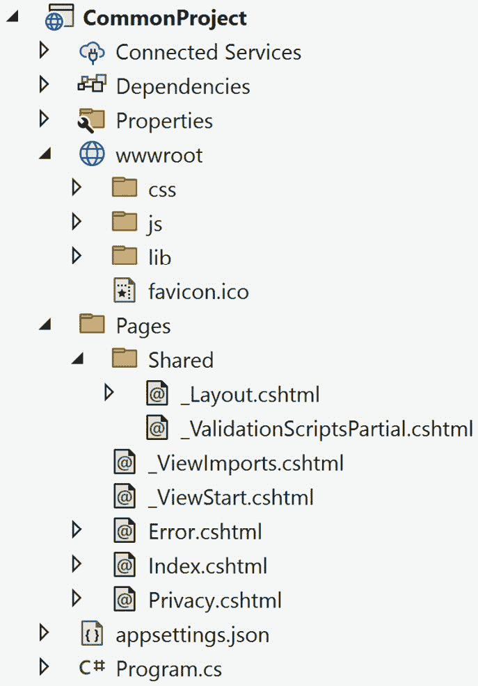
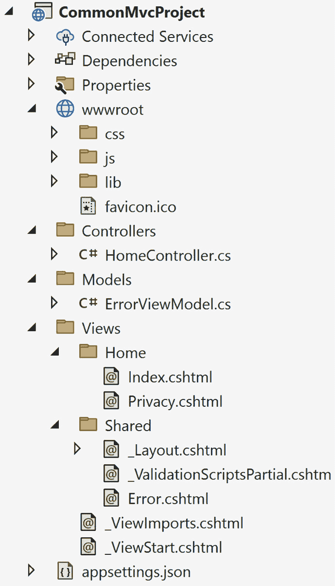
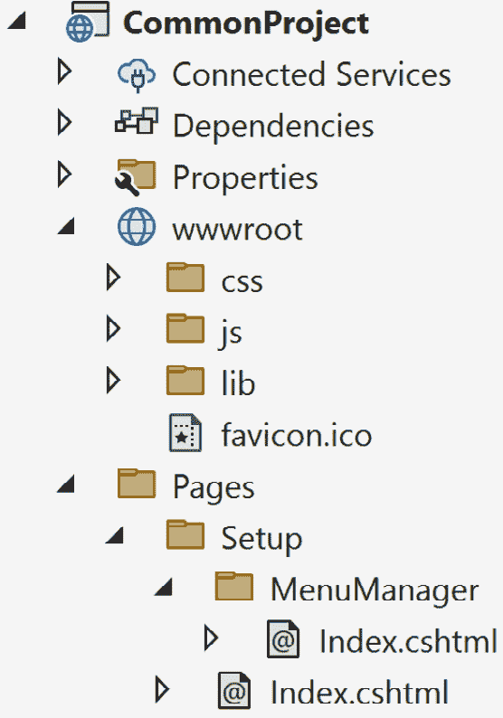
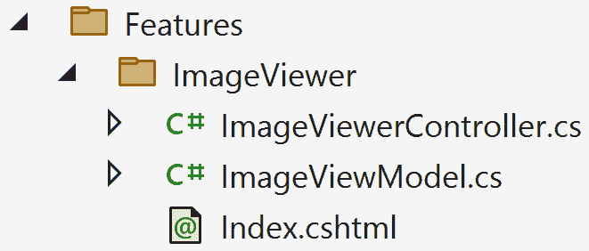

# 附录

在编写代码时，每种语言都有其细微差别和标准。.NET 在一般指南方面也不例外。一个例子是在方法签名末尾放置括号比将括号放在下一行或立即在 `if` 语句的同一行放置返回语句要好。这更多的是一种个人偏好。编程指南为开发者提供了一种在编写代码时保持平衡的方法。这些编程指南在整个行业中作为标准实践被使用。

在附录中，我们将涵盖以下主要主题：

+   编程指南

+   项目结构

以下各节中讨论的指南在行业中普遍使用。它们为开发者提供了方向，并提供了如何构建和编写代码的指导，不仅是为了自己，也是为了未来的开发者和其他同行（包括我们未来的自己）。

在第一部分，我们将回顾一些编程指南，如 DRY、YAGNI 和 KISS 原则，以及关注点分离、SOLID 概念，以及重构是一个过程而不是一次性快速修复。我们将通过查看推荐的.NET 项目和文件夹结构的组织方式来结束附录，并基于其功能确定代码的位置。

# 技术要求

附录的唯一技术要求是访问您的编辑器，因为我们将会涵盖一般编程指南。虽然我们会在过程中提供代码片段，但它们并不需要自己的代码仓库。它们只是为了巩固对概念的理解。

# 编程指南

在整本书中，我推荐了与特定主题或技术相关的各种中级和高级编写代码的技术。虽然这些技术旨在在需求和技术的平衡之间为开发者提供帮助，但也需要提供常见的编程指南，以遵循某些模式，使同事和同行更容易理解代码库。成功的开发者会在编写和维护代码时考虑这些指南。

在本节中，我们将回顾 DRY、YAGNI、KISS 和 SOLID 原则，以及理解关注点分离，以及重构是一个过程。

## DRY

我们将要回顾的第一个缩写可能是最简单的遵循指南之一。**DRY**原则代表**不要重复自己**。

如果你的应用程序的不同位置有多个执行相同任务的方法，那么可能需要重构和合并代码。

## YAGNI

我们接下来要讨论的常见缩写是**YAGNI**（发音为 yag-nee），代表**你不会需要它**。

也被称为“建造通向无人的桥”，这个缩写背后的概念是让开发者知道他们只有在有需求时才应该编写代码。他们不应该添加可能不会实现的未来增强功能的代码。

## KISS

由于这个缩写词有如此多的含义，我们将尽量保持简单（因此得名）。**KISS** 代表 **keep it** **simple, stupid**。

```cs
Albert Einstein mentioned "Make everything as simple as possible, but not simpler," and Steve Jobs of Apple always said, "Simplify."
```

保持你的代码单元足够简单，以便理解。这可以包括以下内容：

+   **更小的方法** – 方法越小，就越容易阅读和理解

+   **语言增强** – 基于多年来 .NET 的 C# 语言改进，可能存在更好的（更简短）的编写代码的方式

+   **简化复杂性** – 当简化复杂性时，系统变得更加可测试，并且可能成为自动化测试的候选者。

目标是通过为同行和同事创建更好的代码库来创造更多价值。

## 关注点的分离

当你开始编写自己的应用程序，运行它并看到它在屏幕上第一次执行时，这是一项巨大的成就。

随着时间的推移，应用程序需要数据库。然后需要电子邮件功能。然后是日志记录。然后是身份验证。需求不断增长，如此等等。

关注点的分离概念涉及你如何逻辑地将应用程序划分为不同的层。例如，如果一个应用程序需要电子邮件模块，它将是解决方案中名为 `MyApplication.EmailModule` 的独立项目。这个电子邮件模块将为应用程序提供以下好处：

+   如果需要，`EmailModule` 可以在另一个应用程序中重用。

+   `EmailModule` 不需要任何外部依赖；它是自包含的。

+   `EmailModule`，单元测试（以及可能的集成测试）变得更容易。

+   `EmailModule` 相比整个应用程序。当专注于特定部分时，不需要了解整个应用程序。只需要了解项目知识即可。

行业内听到的其中一个概念是“大泥球”。这个概念涉及一个项目中包含的所有应用程序代码，这是一个难以维护的代码库。这与“单体”类似，由于规模庞大，应用程序难以维护。因此，应用程序中的概念没有被分解成模块化的工作单元。如果应用程序中的所有内容都耦合在一起……到处都是，系统就会变得脆弱。如果一个开发者修改了某个位置的代码，它可能会修复当前的问题，但会在其他位置引入错误，在整个代码库中产生连锁反应。

关注点的分离是经验丰富的开发者应该通过代码审查与同行分享的，以在更大范围内改进软件并提供关于该主题的健康讨论。

## 重构作为一个过程

虽然重构是开发者的基本概念，但在重构代码库时涉及各种努力水平。

一个简单的例子可能是方法的重命名。一旦开发者重命名了一个方法，开发者就必须更改代码库中对该方法的全部引用。一个更高级的例子是将业务规则引擎重构以增加灵活性。虽然两者都是重构，但一个比另一个更容易。

重构应该是一个过程。多年来我使用的一个过程如下：

+   **编写功能性代码** – 编写能够工作的功能性代码

+   **确保代码通过测试** – 创建测试以确认代码按预期行为

+   **重构并优化代码** – 重构和优化代码

你编写的代码应该（通常）有测试（参见*第七章*中的“100%测试覆盖率”神话）。

话虽如此，如果你要重构代码，*拥有测试将非常有用*，以确认你的重构努力没有白费。一旦有了测试，你就可以自由地重构和修改所需的代码，以达到你的目标。

在我的职业生涯中，业务规则引擎是一个例子，代码是功能性的，并且有大量的测试（约 700 个通过）。然而，团队遇到了一个问题，代码需要更灵活的方法，因此必须进行重构。两位团队成员花了三天时间重构代码。一旦完成重构，他们运行了最终的单元测试，发现只有两个失败的单元测试。这两个失败的单元测试是因为他们没有正确地重命名方法名称。想象一下没有测试的重构。

重构可以像代码库允许的那样复杂或简单。始终记住，重构是一个多步骤的过程，需要测试来确认重构后的代码按预期工作。

书籍推荐

我强烈推荐的一本书是 *《使用 C#重构》，作者：Matt Eland，Packt Publishing*，可在[`www.packtpub.com/`](https://www.packtpub.com/)找到。

## SOLID 原则

**SOLID**原则为编写代码提供了更深入的指导。SOLID 是一个缩写，由 Robert C. Martin 在 2000 年创建。

几年来，SOLID 原则已成为编写高质量软件的标准，并为开发者提供了一种根据代码是否符合每个原则的标准来评估代码的方法。开发者可能对构成 SOLID 代码的内容有不同的看法，但再次强调，这些讨论应该与同行或团队会议中进行。

### 单一职责原则

**单一职责原则**（SRP）规定，一个类应该只有一个且仅有一个改变的理由。

以下代码违反了单一职责原则（SRP）：

```cs
public class User
{
    public string Name { get; set; }
    public string Email { get; set; }
    public bool IsValid()
    {
        // Validate the user data here
        if (string.IsNullOrEmpty(Name) || string.IsNullOrEmpty(Email))
        {
            return false;
        }
        return true;
    }
    public void Save()
    {
        // Save user data to database here
    }
}
```

`User`类有两个属性：`Name`和`Email`。然而，我们有一些执行其他职责的额外方法：一个`IsValid()`方法和一个`Save()`方法。我们的`User`类做得比它应该做的更多。我们应该创建两个新的类：一个叫做`UserValidation`用于验证，另一个叫做`UserService`或`UserRepository`用于数据库操作。

我们创建了两个额外的类，但提供了更好的软件组合。如果我们向`User`类添加一个新属性，并且它需要验证，开发者只需要在一个地方进行更改：`UserValidation`类。

### 开闭

**开闭原则**描述了软件组件应该如何对扩展开放但对修改封闭。

大多数违反开闭原则的情况通常由长分支语句（如长的`if..then`或`switch`语句）指示。

以下代码提供了一个示例：

```cs
public class ComicBook
{
    public string Title { get; set; } = string.Empty;
    public string Issue { get; set; } = string.Empty;
    public decimal Grading { get; set; }
    public string GetGradeName() =>
        Grading switch
        {
            10.0m => "Gem Mint", 
            9.9m => "Mint", 
            9.8m => "NM/M", 
            >= 9.6m => "NM+", 
            >= 9.4m => "NM", 
            >= 9.2m => "NM-", 
            >= 9.0m => "VF/NM", 
            >= 8.5m => "VF+", 
            >= 8.0m => "VF", 
            >= 7.5m => "VF-", 
            >= 7.0m => "FN/VF", 
            >= 6.5m => "FN+", 
            >= 6.0m => "FN", 
            >= 5.5m => "FN-", 
            >= 5.0m => "VG/FN", 
            >= 4.5m => "VG+", 
            >= 4.0m => "VG", 
            >= 3.5m => "VG-", 
            >= 3.0m => "G/VG", 
            >= 2.0m => "G", 
            >= 1.8m => "G-", 
            >= 1.5m => "Fa/G", 
            >= 1.0m => "Fa", 
            _ => "Poor"
        };
}
```

在这个`ComicBook`类中，我们有三个属性，称为`Title`、`Issue`和`Grading`。我们类的一个要求是根据`Grading`属性返回评分名称。这违反了开闭原则。

为什么呢？尽管我们已经有完整的成绩列表，但`GetGradeName()`方法和添加新的成绩和名称。

支持开闭原则的更好实现如下所示：

```cs
public class Grade
{
    public decimal Value { get; }
    public string Name { get; }
    private Grade(decimal value, string name)
    {
        Value = value;
        Name = name;
    }
    public static Grade FromDecimal(decimal value) =>
        value switch
        {
            10.0m => new Grade(value, "Gem Mint"),
            9.9m => new Grade(value, "Mint"),
            9.8m => new Grade(value, "NM/M"),
            >= 9.6m => new Grade(value, "NM+"),
            >= 9.4m => new Grade(value, "NM"),
            >= 9.2m => new Grade(value, "NM-"),
            >= 9.0m => new Grade(value, "VF/NM"),
            >= 8.5m => new Grade(value, "VF+"),
            >= 8.0m => new Grade(value, "VF"),
            >= 7.5m => new Grade(value, "VF-"),
            >= 7.0m => new Grade(value, "FN/VF"),
            >= 6.5m => new Grade(value, "FN+"),
            >= 6.0m => new Grade(value, "FN"),
            >= 5.5m => new Grade(value, "FN-"),
            >= 5.0m => new Grade(value, "VG/FN"),
            >= 4.5m => new Grade(value, "VG+"),
            >= 4.0m => new Grade(value, "VG"),
            >= 3.5m => new Grade(value, "VG-"),
            >= 3.0m => new Grade(value, "G/VG"),
            >= 2.0m => new Grade(value, "G"),
            >= 1.8m => new Grade(value, "G-"),
            >= 1.5m => new Grade(value, "Fa/G"),
            >= 1.0m => new Grade(value, "Fa"),
            _ => new Grade(value, "Poor")
        };
}
public class ComicBook
{
    public string Title { get; set; } = string.Empty;
    public string Issue { get; set; } = string.Empty;
    public Grade Grading { get; set; }
}
```

虽然看起来我们只是移动了`switch`语句，但我们做了其他事情。我们创建了一个`Grade`类。

创建了一个`Grade`类后，我们可以将任何类型的成绩分配给`ComicBook`类。如果创建了新的成绩类型，我们可以轻松地将其添加到我们的列表中，而无需修改`ComicBook`类。我们还在代码中实现了工厂模式。

以前，我们是根据十进制值比较字符串。现在，如果需要额外的属性来评分，我们可以扩展我们的`Grade`类以包含更多信息。

对扩展开放，对修改封闭。

### Liskov 替换

**Liskov 替换原则**解释了任何派生类型都可以被其基类型替换。Liskov 替换背后的概念基于继承的类型和/或接口。

继续我们的漫画书示例，以下代码显示了一个简单的`BasePublisher`类：

```cs
public class MyNewPublisher : BasePublisher
{
    public MyNewPublisher(): base(nameof(MyNewPublisher)) { }
}
public class BasePublisher
{
    public string Name { get; set; }
    protected BasePublisher(string name)
    {
        Name = name;
    }
    public Address GetAddress()
    {
        return Address.Empty;
    }
}
public class Address
{
    public static Address Empty => new();
    public string Address1 { get; set; } = string.Empty;
    public string Address2 { get; set; } = string.Empty;
    public string City { get; set; } = string.Empty;
    public string State { get; set; } = string.Empty;
    public string ZipCode { get; set; } = string.Empty;
}
```

`BasePublisher`类包含出版者的名称和地址。当我们创建一个新的出版者（如前面的`MyNewPublisher`类）时，我们将能够访问基类中所有可用的内容。

用`MyNewPublisher`类替换`BasePublisher`类的功能将是 Liskov 替换原则的一个例子。

### 接口分离

**接口分离原则**解释了客户端不应该被迫实现他们不会使用的非必要方法。

在应用程序中创建的每个接口中，定义的每个方法和属性都应该在具体类中实现。定义的接口不应在实现中浪费。

例如，假设我们为`ComicBook`类有一个接口。接口和实现代码如下所示：

```cs
public interface IComicBook
{
    string Title { get; set; }
    string Issue { get; set; }
    string Publisher { get; set; }
    void SaveToDatabase();
}
public class ComicBook : IComicBook
{
    public string Title { get; set; }
    public string Issue { get; set; }
    public string Publisher { get; set; }
    public void SaveToDatabase()
    {
        throw new NotImplementedException();
    }
}
```

我们`ComicBook`类中的每一件事都有合理的解释，除了`SaveToDatabase()`方法。创建一个新的`ComicBook`实例暗示我们将每次都使用数据库。这违反了接口分离原则。

更好的实现是将数据库访问拆分到一个具有`SaveToDatabase()`方法的`IComicBookWriter`中，如下面的代码所示：

```cs
public interface IComicBook
{
    string Title { get; set; }
    string Issue { get; set; }
    string Publisher { get; set; }
}
public interface IComicBookWriter
{
    void SaveToDatabase();
}
public class ComicBook : IComicBook, IComicBookWriter
{
    public string Title { get; set; }
    public string Issue { get; set; }
    public string Publisher { get; set; }
    public void SaveToDatabase()
    {
        // Implementation
    }
}
```

示例代码展示了如何通过继承自`IComicBookWriter`为`ComicBook`类提供持久化数据的方式。

接口分离原则的目标是避免在接口中包含你不会使用的方法。

这个例子也违反了单一职责原则，因为这个类也在访问数据库。

### 依赖倒置

**依赖倒置原则**解释了我们应该依赖于抽象而不是具体实现。在.NET 中，依赖注入是默认可用的。有了自动可用的依赖注入，这满足了依赖倒置原则的一半。

虽然我们可以将具体类注入到构造函数中，但更好的实现是创建一个具体实现的接口。使用接口鼓励我们在整个代码库中实现松散耦合。

例如，回到*第五章*中，使用 Entity Framework，我们为了这个原因创建了一个简单的接口来支持我们的`DbContext`。我们不是注册一个`DbContext`的具体实现，而是使用其接口。

我们注册了我们的抽象（接口）以支持我们的依赖倒置原则。

在本节中，我们讨论了 DRY、YAGNI 和 KISS 等术语，以及关注点分离的含义以及重构是一个过程而不是单一任务。我们通过学习每个 SOLID 实践结束本节，即单一职责、开闭、里氏替换、接口分离和依赖倒置原则。

在下一节中，我们将学习基于项目类型的文件夹组织。

# 项目结构

如*第七章*中所述，在测试方面，文件夹结构可以揭示应用程序的意图并提供文档。

在本节中，我们将学习 ASP.NET Web 应用程序的文件夹结构。我们还将学习根据意图放置代码的位置，例如放置 API 代码或 Entity Framework 代码的位置。

## 理解项目景观

每个项目都有其基于类型的结构。例如，**Razor Page**项目的布局与**模型-视图-控制器**（**MVC**）项目或 API 项目不同。

让我们检查这些常见项目中包含哪些文件夹。

首先，以下是一个 ASP.NET Razor Page 项目的示例：



图 11.1 – Razor 页面项目的常见文件夹结构

接下来是一个 ASP.NET MVC 项目的示例：



图 11.2 - MVC 项目的常见文件夹结构

随着我们逐个项目进行，我们将解释每个文件夹的功能以及在应用程序中的目的。

### wwwroot 文件夹

在上述任何项目类型中，`wwwroot` 文件夹包含网站上使用的所有静态内容。添加到该目录的任何文件夹都是静态内容，并且对浏览器可见。

一个例子是图像文件夹。如果我们向 `wwwroot` 文件夹添加一个图像文件夹，该图像文件夹的 URL 将如下所示：

```cs
https://localhost:xxx/images/funnyimage.jpg
```

对于 JavaScript 框架（如 Angular、React 等），应在 `wwwroot` 文件夹下创建一个名为 `source` 或 `src` 的文件夹来存放客户端源代码。JavaScript 框架应转换到您选择的另一个文件夹，例如 `js` 或 `app` 文件夹，以便公开供浏览器使用。我们曾在*第六章*中提到这些文件夹，当时我们使用任务运行器构建客户端任务。

### 页面文件夹

在 Razor Page 项目中，`Pages` 文件夹是服务器端页面所在的位置。创建的每个文件夹都是一个页面的路径。

例如，如果我们创建了一个 `Setup` 文件夹并添加了一个 `Index.cshtml` 文件，执行和查看该页面的 URL 将如下所示：

```cs
https://localhost:xxx/setup/
```

其他在 `Pages` 目录下创建的文件夹将遵循相同的路径，如图 *图 11**.3* 所示：



图 11.3 – MenuManager 页面的文件夹结构

根据图 *图 11**.3* 中的目录结构，**MenuManager** 的 URL 将如下所示：

```cs
https://localhost:xxx/setup/menumanager/
```

文件夹结构越简单，定位页面和识别页面功能就越容易。

### 共享文件夹

`Shared` 文件夹用于布局页面、`ViewComponents`、部分、`EditorTemplates` 和 `DisplayTemplates` 等公共组件。这些共享组件可以通过 `Pages` 文件夹中的网页（如果是一个 Razor Pages 项目）或 `Views` 文件夹（如果是一个 MVC 项目）访问。

### 控制器文件夹

MVC 项目总是包含一个 `Controllers` 文件夹，并且是网络应用程序的交通警察。

MVC 网络模型使用“约定优于配置”的概念，其中控制器的名称是路径，控制器类内部的方法是页面名称。

例如，在上面的 `Controllers` 文件夹中，我们有一个名为 `HomeController` 的类。如果我们查看 `HomeController`，我们会看到一个名为 `Index()` 的方法：

```cs
public class HomeController : Controller
{
    public IActionResult Index()
    {
        return View();
    }
}
```

存在 `HomeController` 类告诉我们三件事：

+   我们将有一个带有 `Index()` 方法的 `/Home` URL 作为默认页面

+   `Home` 文件夹位于 `/``Views` 文件夹下

+   由于 `HomeController` 中有一个 `Index()` 方法，因此 `/``Views/Home` 目录中应该有一个 `Index.cshtml` 文件

`Index()` 方法告诉我们当调用 `https://localhost:xxx/Home` URL 时。它将自动调用这个 `Index()` 方法，并且默认情况下，会在 `/``Views/Home` 目录中查找 Index 视图。

### 功能文件夹

MVC 应用程序的一个秘密是能够将控制器移动到应用程序内部的任何文件夹中。在初始启动时，ASP.NET 框架定位应用程序中所有可用的控制器，并为传入的 Web 请求创建一个路由表。基于这种方法，社区中的开发者创建了**功能文件夹**。

功能文件夹通常包含在根目录下的`/Features`文件夹中，下面有文件夹来标识实现的功能。虽然`/Features`文件夹是最常见的，但开发者有权将文件夹命名为他们想要的任何名称。他们还可以将控制器放在项目中的任何文件夹下。ASP.NET 在启动时可以定位所有控制器。

这些文件夹通常包含至少一个控制器、一个 ViewModel 和一个 View。它们还可以包含与功能相关的支持类。文件夹的命名基于要实现的功能。

例如，如果你的 MVC 应用程序中有一个图像查看功能，它看起来会像**图 11.4**.4：



图 11.4 – ImageViewer 功能文件夹示例

这种文件夹结构提供了以下好处：

+   **重点** – 每个功能都是隔离的，这样团队成员可以在不引起合并问题的前提下构建功能

+   **整合** – 而不是在整个项目中的文件夹之间移动，功能被限制在一个文件夹中，这使得编码过程更加高效

+   `Features/AccountsReceiveable`文件夹

在 MVC 中，视图路径可以修改以适应你的需求。在这种情况下，定义一个自定义路径到你的视图提供了更多灵活的配置选项。

`Features`文件夹技术通过提供垂直切片，正成为创建可扩展、基于功能的 Web 应用程序的更可行选项。垂直切片是在所有层（表示层、领域和数据访问）上为整个功能编写代码的过程。功能文件夹简化了这一过程，并在应用程序中传达了隔离的功能。

### 模型文件夹

`Models`文件夹包含用于你的视图的所有模型。这与 ViewModel 不同。模型和 ViewModel 之间的区别在于 ViewModel 被传递到视图中，并且可以包含支持 ViewModel 的模型。

以下代码片段展示了 ViewModel 的一个示例：

```cs
public class HomeController : Controller
{
    public IActionResult Index()
    {
        return View(new IndexViewModel
        {
            Title = "Home Page",
            Product = new ProductDto
            {
                Name = "Sunglasses",
                Price = 9.99m
            }
        });
    }
}
public class IndexViewModel
{
    public string Title { get; set; }
    public ProductDto Product { get; set; }
}
public class ProductDto
{
    public string Name { get; set; }
    public decimal Price { get; set; }
}
```

ViewModel 被发送到视图（`IndexViewModel`），其中可以包含支持 ViewModel 的数据模型（`ProductDto`）。

两种常见的做法包括在`Models`文件夹下创建一个`ViewModels`目录，或者在项目根目录下创建一个`ViewModels`目录。

### 视图文件夹

在 MVC 项目中，`Views`文件夹相当于 Razor Pages 项目中的`Pages`文件夹。它包含与 Razor Pages 项目相同的文件夹结构。

## 创建项目层

当创建一个新的 Web 应用程序时，默认的 Web 项目包含在浏览器中运行所需的最基本内容。但你是如何将应用程序分割成多个部分，以避免出现一大堆难以管理的代码呢？

层或层是应用程序的一部分，被分割成模块或项目，旨在以某种方式执行。表示层包含用户界面，用户如何与网站交互，而数据访问层则检索应用程序的数据。

识别项目层可能是一项有些令人畏惧的任务，但最好的方法是根据其功能创建应用程序层。每个项目都将根据其功能采用一致的命名约定。

虽然以下推荐了项目层和名称，但架构师和团队的建议可能会覆盖这些选择：

+   `<ProjectName>.Domain` 或 `<ProjectName>.Core`.

+   `<ProjectName>.Web` 或 `<ProjectName>.UI`.

+   `<ProjectName>.Data` 或 `<ProjectName>.Infrastructure`.

+   `/api`) 或包含在名为 `<ProjectName>.Api` 的单独项目中。

+   `基础设施` 项目，基础设施项目中的代码量可能会变得难以管理。一个服务项目可以提供对 `基础设施` 项目的替代方案。服务可能包括 `MailService` 或 `<Entity>Service`。这些项目通常命名为 `<ProjectName>.Services`.

这些代码层在组织项目时提供了最佳的布局。每个项目名称都描述了意图，并为开发者提供了一个对整个解决方案的清晰表示。

# 摘要

在本附录中，我们学习了 DRY、YAGNI 和 KISS 原则，以及关注点的分离、SOLID 概念，以及重构是一个过程而不是一次性的快速修复。

我们继续探讨两个常见的 ASP.NET Web 应用程序的结构以及每个文件夹代表的内容。一旦我们理解了一个项目的文件夹结构，我们就根据代码的意图来检查代码将驻留的位置，例如 Entity Framework 或服务类。

## 感谢！

最佳实践被认为是正确的、常见的，并且被该领域的其他人所接受的。本书中包含的最佳实践是多年观察、经验和来自同行、导师以及开发社区反馈的结合。

我希望这些最佳实践能成为您 ASP.NET 开发生涯的参考，并且您能像我体验新的编程技术或技术时一样，达到同样的兴奋程度。

感谢您的阅读！

开发者们，继续编码吧...
