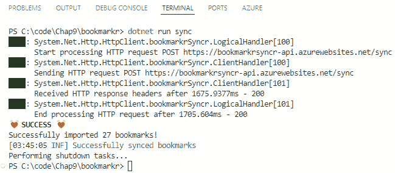
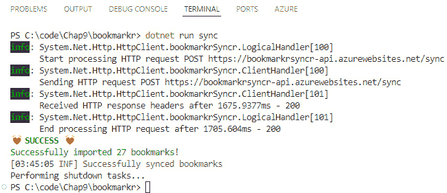

# 第九章：与外部 API 和服务一起工作

尽管一个自主的应用程序可以为用户提供很大的价值，但通过将应用程序的功能与其他应用程序集成，消费外部 API 和服务可以使它为这些用户提供更大的价值！

然而，消费外部 API 和服务为您的应用程序创建了新的依赖。虽然这听起来可能非常合理，但您必须知道如何与这些依赖项交互以及如何将它们集成到您的应用程序中，这样您就不会使应用程序过于紧密地耦合到外部依赖，并避免每次依赖项更改时都需要更改应用程序的代码。

更具体地说，在本章中，我们将讨论以下内容：

+   消费外部 API 的好处

+   通过消费外部 API 扩展 **Bookmarkr** 的功能

+   在 .NET 中正确消费外部 API 的方法

+   如何避免应用程序的命令与外部 API 之间的紧密耦合

# 技术要求

本章的代码可以在本书配套的 GitHub 仓库中找到，[`github.com/PacktPublishing/Building-CLI-Applications-with-C-Sharp-and-.NET/tree/main/Chapter09`](https://github.com/PacktPublishing/Building-CLI-Applications-with-C-Sharp-and-.NET/tree/main/Chapter09)

# 为什么要消费外部 API？

在构建您的应用程序时，您必须考虑多个因素，有时还需要实现超出您专业领域的多个功能。

这是否意味着如果您不掌握每个功能就不应该构建应用程序？不！许多应用程序依赖于由其他人在非常具体的领域内更熟练和更有经验的人开发的代码。这些代码片段被打包成 API 和服务，这样我们就可以使用（即消费）它们，而无需理解它们包含的每一行代码。

当我们在 Bookmarkr 中添加日志记录时，我们已经遇到了这种情况。我们没有自己开发日志记录引擎。相反，我们依赖于一个由知道如何做（并且做得很好！）的组织提供的服务。通过依赖该服务，我们的应用程序能够从日志记录功能中受益，而无需成为日志记录业务领域的专家。

现在，我可以听到你的想法（是的，我可以——这是我的第六感 😊）。你认为开发自己的日志记录引擎似乎并不复杂，你可能是对的。这是一个商业决策：如果它是您核心业务的一部分，那么是的，投入时间、资源和金钱来开发、测试和维护自己的日志记录引擎是有意义的。但记住，虽然开发它可能很酷，但您将不得不维护它，这正是许多组织长期受苦的原因！你知道他们说什么……你建了它，你就得运行它！ 😉

还要注意，构建自己的“依赖项”（即，不属于你核心业务的服务）并不总是容易。一个例子就是支付网关。在构建和提供此类服务时涉及大量的法规。如果你的核心业务不是（换句话说，如果你不是 Stripe 或此类公司），不要这样做！使用现有的服务。

通过消费外部 API 和服务，我们就可以专注于我们最擅长的事情，在我们的案例中，那就是管理书签！这就是消费外部 API 和服务的关键：拥有专注于我们核心业务的能力，并将其他关注点委托给那些关注点是他们的核心业务的人。

# 如何消费外部 API

.NET 提供了一种通过抽象构建我们自己的 HTTP 请求、处理底层网络细节、发送请求、接收响应（同时执行序列化和反序列化以及处理通信问题）的需求来与外部 API 和服务交互的方法。

因此，为了与这些外部 API 和服务交互，.NET 为我们提供了`HttpClient`类。然而，处理这个类的正确方式是通过`IHttpClientFactory`接口。这允许我们创建和管理`HttpClient`实例，以实现最佳性能和资源管理。

## 使用 IHttpClientFactory 的优点

使用 `IHttpClientFactory` 提供了几个优点：

+   `HttpMessageHandler`实例，有助于防止诸如套接字耗尽等问题

+   **连接重用**: 它重用底层的 HTTP 连接，提高性能

+   **弹性**: 它增加了对瞬时错误的弹性

+   `HttpClient`实例

# Bookmarkr: 你的书签，无处不在！

到目前为止，Bookmarkr 一直在本地管理我们的书签。这意味着我们被绑定到我们计算机的物理边界。

但如果我们想从另一台计算机访问这些书签怎么办？

要实现这一点，我们需要扩展 Bookmarkr 的功能，使其超越本地计算机。为此，我们将使 Bookmarkr 调用一个外部 API，该 API 将负责存储和检索我们的书签。

关于这一点，我们将添加一个名为`sync`的新命令，该命令将负责同步本地书签与外部服务存储的书签。

关于外部服务

当你消费外部服务时，你不需要了解其内部（即，其架构、技术堆栈、应用程序代码和依赖项）。这符合面向对象编程的封装原则。

你需要知道的就是如何向它发送请求以及如何解释它返回的响应。

然而，既然我知道你很想知道更多关于它的细节，我已经在 GitHub 仓库的`appendixA-bookmarkr-syncr`分支中提供了其架构和应用程序及基础设施代码的详细信息。

让我们从添加新命令开始！

# 同步命令

按照我们在上一章中设计的项目结构，让我们在 `Commands` 文件夹下添加一个名为 `Sync` 的新文件夹，并在该文件夹内添加一个名为 `SyncCommand.cs` 的新代码文件。

此命令的启动代码如下：

```cs
public class SyncCommand : Command
{
    #region Properties
    private readonly IBookmarkService _service;
    #endregion
    #region Constructor
    public SyncCommand(IBookmarkService service, string name, string? 
    description = null)
        : base(name, description)
    {
        _service = service;
        this.SetHandler(OnSyncCommand);
    }
    #endregion
    #region Options
    #endregion
    #region Handler method
    private async Task OnSyncCommand()
    {
    }
    #endregion
}
```

这段代码相当直接，无需解释。

同步过程包括以下步骤：

1.  本地书签通过 Bookmarkr 的 `sync` 命令发送到外部服务（称为 BookmarkrSyncr）。

1.  BookmarkrSyncr 将执行从 Bookmarkr 收到的本地书签与其数据存储中的书签之间的同步。

1.  BookmarkrSyncr 将同步后的书签发送回 Bookmarkr `sync` 命令的处理方法。

1.  `sync` 命令的处理方法将接收到的书签存储在本地数据存储中。请注意，如果应用程序正在处理大型数据集或速率限制 API，则需要批处理和重试技术。

因此，`sync` 命令需要引用 `IHttpClientFactory`。让我们添加这个：

```cs
#region Properties
    private readonly IBookmarkService _service;
    private readonly IHttpClientFactory _clientFactory;
#endregion
#region Constructor
    public SyncCommand(IHttpClientFactory clientFactory, 
    IBookmarkService service, string name, string? description = null)
        : base(name, description)
    {
        _service = service;
        _clientFactory = clientFactory;
        this.SetHandler(OnSyncCommand);
    }
#endregion
```

在这段代码中，我们添加了一个类型为 `IHttpClientFactory` 的 `private` 属性，并通过构造函数进行注入。

然后，我们在命令的方法处理程序中使用它：

```cs
#region Handler method
    private async Task OnSyncCommand()
    {
        var retrievedBookmarks = _service.GetAll();
        var serializedRetrievedBookmarks = JsonSerializer.
        Serialize(retrievedBookmarks);
        var content = new StringContent(serializedRetrievedBookmarks, 
        Encoding.UTF8, "application/json");
        var client = _clientFactory.CreateClient("bookmarkrSyncr");
        var response = await client.PostAsync(«sync», content);
        if (response.IsSuccessStatusCode)
        {
            var options = new JsonSerializerOptions
            {
                PropertyNameCaseInsensitive = true
            };
            var mergedBookmarks = await JsonSerializer.
            DeserializeAsync<List<Bookmark>>(
                await response.Content.ReadAsStreamAsync(),
                options
            );
            _service.ClearAll();
            _service.Import(mergedBookmarks!);
            Log.Information("Successfully synced bookmarks");
        }
        else
        {
            switch(response.StatusCode)
            {
                case HttpStatusCode.NotFound:
                    Log.Error("Resource not found"); break;
                case HttpStatusCode.Unauthorized:
                    Log.Error("Unauthorized access"); break;
                default:
                    var error = await response.Content.
                    ReadAsStringAsync();
                    Log.Error($"Failed to sync bookmarks | {error}");
                    break;
            }
        }
    }
#endregion
```

这段代码很容易理解，并符合我们之前描述的同步过程。

然而，代码中有一个部分需要解释：

+   我们通过依赖命名客户端方法从 `IHttpClientFactory` 实例创建一个 HTTP 客户端。正如你所见，我们向 `CreateClient` 方法提供了客户端配置的名称（在这里，`bookmarkrSyncr`）。我们稍后会回到这个配置。

+   接下来，我们向远程 Web 服务的 `sync` 端点发出一个 `POST` 请求，传递之前使用 `StringContent` 类实例序列化为本地的书签列表：

    +   如果请求成功，我们将反序列化返回的书签列表（表示同步的本地和远程书签列表），并用这个新列表替换本地书签列表

    +   如果请求不成功，我们将显示一个与返回的 HTTP 状态码相对应的错误消息

为了导入 `IHttpClientFactory` 接口，我们需要引用 `Microsoft.Extensions.Http` NuGet 包。正如我们之前所知道的，我们可以通过输入以下命令来完成：

```cs
dotnet add package Microsoft.Extensions.Http
```

在我们可以使用我们的新命令之前，让我们在 `Program` 类中注册它！

# 注册同步命令

让我们在 `Program` 类中注册 `sync` 命令。这只需要一行代码：

```cs
rootCommand.AddCommand(new SyncCommand(_clientFactory, _service, "sync", "sync local and remote bookmark stores"));
```

但是等等！`_clientFactory` 变量是从哪里来的？！

很好！你发现了！😊

如你所猜，这是对需要配置以实现魔法的 `HttpClient` 的引用。这就是我们将讨论之前提到的命名客户端方法的地方。

`_clientFactory` 变量是 `IHttpClientFactory` 类型。因此，我们首先需要在 `Program` 类的 `Main` 方法中声明它：

```cs
IHttpClientFactory _clientFactory;
```

这将允许我们稍后检索其引用，并在注册期间将其传递给 `SyncCommand` 的构造函数（正如我们之前看到的）。我们可以这样检索那个引用：

```cs
_clientFactory = host.Services.GetRequiredService<IHttpClientFactory>();
```

最后，让我们为 BookmarkrSyncr 服务注册 HTTP 客户端。我们是在 `ConfigureServices` 块中这样做的：

```cs
services.AddHttpClient("bookmarkrSyncr", client =>
{
    client.BaseAddress = new Uri("https://bookmarkrsyncr-api.
    azurewebsites.net");
    client.DefaultRequestHeaders.Add("Accept", "application/json");
    client.DefaultRequestHeaders.Add("User-Agent", "Bookmarkr");
});
```

让我们解释一下这段代码的作用：

+   为注册的 HTTP 客户端提供了一个名称（`bookmarkrSyncr`）。这就是我们为什么称这种方法为“`named clients`”。请注意，这与我们在前面看到的 `SyncCommand` 类中传递给 `CreateClient` 方法的名称相同。这就是如何选择适当的 HTTP 客户端的方式。

+   我们指定了服务的基准地址和一些请求头。请注意，基准地址没有指定 `sync` 端点。它在执行请求时指定。这允许一个网络服务有不同的端点，并且可以在需要时调用这些端点，而无需反复指定基准地址。

关于基本地址

你可能已经注意到基本地址指向一个外部 URL。我在 Azure 的 App Service 上部署了 BookmarkrSyncr 服务的代码。

我会尽可能地保持这个服务运行，但请记住，如果你需要重新部署它，你可以在 `appendixA-bookmarkr-syncr` 分支中访问其基础设施和应用代码。

现在一切都已经设置好了。我们可以运行程序并看看会发生什么。

# 运行程序

要运行程序，我们只需执行这个命令：

```cs
dotnet run sync
```

结果将如下：



图 9.1 – 同步命令在行动

太棒了，不是吗？

如果我们列出所有可用的本地书签，我们会注意到它们确实已经与远程书签列表同步了。

关于安全性？

你当然可能已经注意到，可以不进行任何身份验证就使用该网络服务。换句话说，允许匿名请求，这可能会引起安全问题。

你完全正确，目前这是故意的，因为安全性将在*第十三章*中解决，我们将看到如何使用称为“个人访问令牌”的技术来验证用户，这类似于使用 API 密钥。

代码运行得很好，但实际上有一个缺点。

# 减少我们的应用程序与外部依赖项之间的耦合

在前面的章节中，尽管我们应用了消费外部 API 的最佳实践，但我们还是在我们的应用程序和那个依赖项之间创建了一种耦合…

注意，我们的应用程序实际上知道 API 返回的数据类型和结构。这意味着每当这个 API 发生变化时，我们都需要相应地更新我们的代码。

这也意味着我们的应用程序负责处理 API 可能返回的不同 HTTP 状态码。我们能否将这种复杂性抽象到某个地方，以便最终更改仅限于我们代码的一小部分？

当然我们可以！而且有一个模式，这被称为 **服务代理**。

## 关于服务代理模式

服务代理模式将 HTTP 通信的细节抽象到一个专门的服务中，允许其他服务（或在我们的情况下，命令）与外部系统交互，而无需直接处理 HTTP 请求和响应。

服务代理模式有许多好处，其中以下是一些：

+   **抽象**：它抽象了 HTTP 通信的复杂性，包括构建 HTTP 请求、处理响应和管理错误

+   **封装**：它封装了与特定外部服务或 API 通信相关的所有逻辑

+   **可重用性**：服务代理可以在应用程序的多个组件或服务中被重用

+   （`sync` 命令）从通信逻辑（在服务代理中）

+   **可维护性**：对外部 API 或通信协议的更改只需要在服务代理的一个地方进行

我认为现在对你来说已经很清楚，我们的 CLI 应用程序可以从利用服务代理模式中受益良多。现在让我们看看我们如何实现它！

## 实现服务代理模式

这个模式通常使用 `IHttpClientFactory` 和命名或类型化的 `HttpClient` 实例来实现。

我们已经在使用这些工具，因此对于我们来说，将 HTTP 细节从 `sync` 命令抽象出来，并放入一个专门的服务代理类中将会非常直接。

我们将要执行的第一步是为服务代理创建一个文件夹结构。遵循我们在上一章中概述的项目结构，让我们创建一个名为 `ServiceAgents` 的文件夹和一个名为 `BookmarkrSyncrServiceAgent` 的子文件夹。

在这个子文件夹中，让我们创建两个代码工具：一个名为 `IBookmarkrSyncrServiceAgent.cs` 的接口文件和一个名为 `BookmarkrSyncrServiceAgent.cs` 的类文件。

下面是 `IBookmarkrSyncrServiceAgent` 接口的代码：

```cs
namespace bookmarkr.ServiceAgents;
public interface IBookmarkrSyncrServiceAgent
{
    Task<List<Bookmark>> SyncBookmarks(List<Bookmark> localBookmarks);
}
```

此接口仅公开一个操作，`SyncBookmarks`，它接受本地书签列表（由 Bookmarkr CLI 应用程序持有）并返回同步后的书签列表，包括来自远程 Web 服务 BookmarkrSyncr 的书签。

现在让我们实现这个接口：

```cs
namespace bookmarkr.ServiceAgents;
public class BookmarkrSyncrServiceAgent : IBookmarkrSyncrServiceAgent
{
    private readonly IHttpClientFactory _clientFactory;
    public BookmarkrSyncrServiceAgent(IHttpClientFactory 
    clientFactory)
    {
        _clientFactory = clientFactory;
    }
    public async Task<List<Bookmark>> Sync(List<Bookmark> localBookmarks)
    {
        var serializedRetrievedBookmarks = JsonSerializer.
        Serialize(localBookmarks);
        var content = new StringContent(serializedRetrievedBookmarks, 
        Encoding.UTF8, "application/json");
        var client = _clientFactory.CreateClient("bookmarkrSyncr");
        var response = await client.PostAsync(«sync», content);
        if (response.IsSuccessStatusCode)
        {
            var options = new JsonSerializerOptions
            {
                PropertyNameCaseInsensitive = true
            };
            var mergedBookmarks = await JsonSerializer.
            DeserializeAsync<List<Bookmark>>(
                await response.Content.ReadAsStreamAsync(),
                options
            );
            return mergedBookmarks!;
        }
        else
        {
            switch(response.StatusCode)
            {
                case HttpStatusCode.NotFound:
                    throw new HttpRequestException($"Resource not 
                    found: {response.StatusCode}");
                case HttpStatusCode.Unauthorized:
                    throw new HttpRequestException($"Unauthorized 
                    access: {response.StatusCode}");
                default:
                    var error = await response.Content.
                    ReadAsStringAsync();
                    throw new HttpRequestException($"Failed to sync 
                    bookmarks: {response.StatusCode} | {error}");
            }
        }
    }
}
```

正如你可能已经注意到的，这个实现正在重用位于 `Sync` 命令处理方法主体中的代码，因此将其从该方法中抽象出来，并将其封装到服务代理类中。

因此，这个类的代码不需要太多的解释。然而，值得一提的是，在请求失败的情况下，我们返回一个包含问题详细信息的 `HttpRequestException` 实例。

接下来，我们需要更新`SyncCommand`类的代码，以抽象化`IHttpClientFactory`的使用，并使用我们新的服务代理。更新的代码如下：

```cs
public class SyncCommand : Command
{
    #region Properties
    private readonly IBookmarkService _service;
    private readonly IBookmarkrSyncrServiceAgent _serviceAgent;
    #endregion
    #region Constructor
    public SyncCommand(IBookmarkrSyncrServiceAgent serviceAgent, 
    IBookmarkService service, string name, string? description = null)
        : base(name, description)
    {
        _service = service;
        _serviceAgent = serviceAgent;
        this.SetHandler(OnSyncCommand);
    }
    #endregion
    #region Options
    #endregion
    #region Handler method
    private async Task OnSyncCommand()
    {
        var retrievedBookmarks = _service.GetAll();
        try
        {
            var mergedBookmarks = await _serviceAgent.
            Sync(retrievedBookmarks);
            _service.ClearAll();
            _service.Import(mergedBookmarks!);
            Log.Information("Successfully synced bookmarks");
        }
        catch(HttpRequestException ex)
        {
            Log.Error(ex.Message);
        }
    }
    #endregion
}
```

这段代码相当简单且易于阅读。我们基本上是用`IBookmarkrSyncrServiceAgent`的使用替换了`IHttpClientFactory`的使用，并通过调用服务代理的`Sync`方法，移除了`OnSyncCommand`方法中处理 HTTP 通信的所有代码（我们将其抽象到服务代理类中）。因此，`OnSyncCommand`方法也更加精简，从 41 行代码缩减到 16 行。

注意

为了您的参考，我们提供了一个在引入使用服务代理类之前的`SyncCommand`类的副本。通过这样做，您可以轻松地比较两种实现之间的差异。在`Commands/Sync`文件夹中查找名为`SyncCommand_NoServiceAgent.txt`的文件。

最后一步是将服务代理注册到`Program`类中的`ConfigureServices`部分的服务列表中。

正如我们之前看到的，这可以通过添加以下代码行轻松完成：

```cs
services.AddScoped<IBookmarkrSyncrServiceAgent, BookmarkrSyncrServiceAgent>();
```

我们需要记住声明一个服务代理的变量：

```cs
IBookmarkrSyncrServiceAgent _serviceAgent;
```

接下来，我们需要检索该服务代理的实例：

```cs
_serviceAgent = host.Services.GetRequiredService<IBookmarkrSyncrServiceAgent>();
```

我们将其传递给`SyncCommand`类的构造函数：

```cs
rootCommand.AddCommand(new SyncCommand(_serviceAgent, _service, "sync", "sync local and remote bookmark stores"));
```

一切现在都已就绪。让我们确保应用程序仍然按预期工作。

## 重新运行程序

我们可以像之前一样运行程序，通过输入以下命令：

```cs
dotnet run sync
```

我们将得到完全相同的结果，证明应用程序仍然按预期工作：



图 9.2 – 使用服务代理执行同步命令

太棒了！通过利用服务代理模式，我们已经能够提供业务逻辑和 HTTP 通信细节之间的清晰分离。因此，我们可以在任何其他命令（使用`BookmarkrSyncrServiceAgent`类）中消费`BookmarkrSyncr`网络服务，而无需这个命令处理 HTTP 通信细节。

# 摘要

在本章中，我们学习了如何通过消费外部 API 和服务来扩展 Bookmarkr 的功能。

我们探讨了与外部依赖项通信的最佳实践，处理响应数据、代码和错误，以及以不创建外部依赖项和我们的应用程序之间紧密耦合的方式设计该集成，这样如果证明这是必要的，就可以轻松替换该依赖项。

在下一章中，我们将介绍构建应用程序的关键方面之一，即测试这些应用程序。

# 轮到你了！

跟随提供的代码是一种很好的通过实践学习的方法。

一个更好的方法是挑战自己完成任务。因此，我挑战你通过添加以下功能来改进 Bookmarkr 应用程序。

## 任务 #1 – 添加 SQLite 作为数据存储

谁说 API 是应用程序可以依赖的唯一外部依赖项？当然不是我了！😊

到目前为止，我们的应用程序已经将书签存储在内存中。你一定会同意我的观点，这不是一个理想的解决方案，因为一旦应用程序终止或重启，书签就会丢失。

你被要求向 Bookmarkr 应用程序添加一个新的依赖项——一个**SQLite**数据库！这将允许 Bookmarkr 以更持久的方式存储书签，使其对我们的用户更有用 😉。

为什么选择 SQLite？你可能想知道...

SQLite 是一个多才多艺且轻量级的数据库解决方案，旨在简单易用，同时需要最少的设置和管理。它最显著的优势之一是其可移植性：整个数据库存储在一个单独的文件中，这使得移动、备份和分发变得容易。其自包含的特性还意味着 SQLite 不需要单独的服务器进程或系统配置，简化了其部署。这就是为什么它非常适合 CLI 应用程序！

现在，你还需要修改`BookmarkService`的代码，以便从 SQLite 数据库中检索书签并将其存储在 SQLite 数据库中。

考虑使用.NET 的`Microsoft.Data.Sqlite`库，因为它是一个可靠且轻量级的库。考虑添加迁移并确保 SQLite 在并发 CLI 场景中的线程安全访问。

## 任务#2 – 根据 URL 检索网页名称

到目前为止，在添加新的书签时，我们必须传递网页名称和 URL。

既然我们已经知道如何处理外部依赖项，那么让我们调整`link add`命令，使其通过提供的 URL 发送 HTTP 请求以检索要书签的网页名称。如果无法检索名称，我们可以使用作为命令选项传递的名称。

如果找不到网页，书签的名称应该是`未命名书签`。如果请求超过 30 秒，则终止请求并将名称设置为`未命名书签`。

# 第四部分：测试和部署

在本部分中，你将探索测试、打包和部署 CLI 应用程序的关键方面。你将学习各种测试 CLI 工具的策略，包括对单个组件进行单元测试。接下来，你将深入了解如何打包你的 CLI 应用程序以进行分发，使用最常用的机制，如 Docker、.NET Tool 和 Winget。你将了解如何指定入口点、定义依赖项以及为最佳打包结构化你的项目。最后，你将探索部署方法，学习如何通过包管理器分发你的 CLI 工具并确保它在不同的环境中保持一致性。

本部分包含以下章节：

+   *第十章**，测试 CLI 应用程序*

+   *第十一章**，打包和部署*
