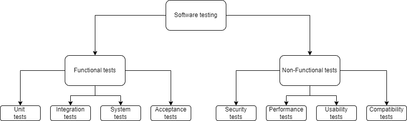
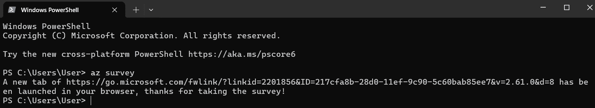
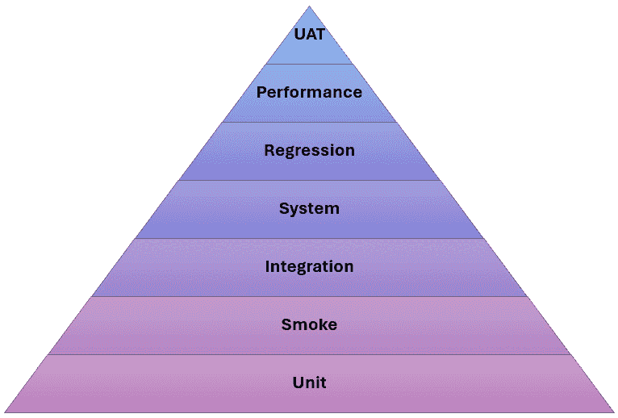
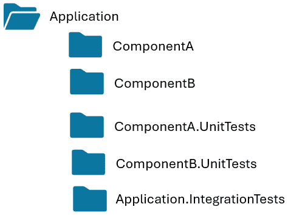
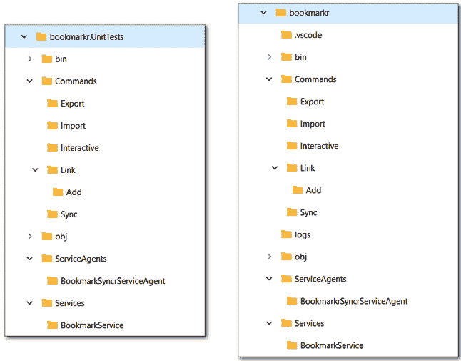
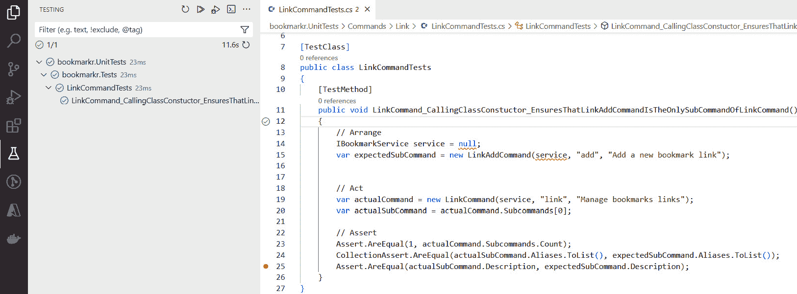

# 第十章：测试命令行应用程序

测试是任何软件开发项目的重要阶段。测试的目的是确保我们交付给用户的应用程序按预期运行，不会对用户造成任何伤害（通过泄露个人信息或允许恶意行为者利用安全漏洞来伤害用户）。

在本章中，我们将讨论为什么测试如此重要，并探讨不同的测试技术和工具，这些技术和工具将帮助我们实现这一目标。具体来说，我们将讨论以下内容：

+   为什么测试很重要

+   不同的测试类型

+   要测试什么，如何进行测试，以及何时运行这些测试

+   在编写单元测试时如何模拟外部依赖

# 技术要求

本章的代码可以在本书配套的 GitHub 仓库中找到，[`github.com/PacktPublishing/Building-CLI-Applications-with-C-Sharp-and-.NET/tree/main/Chapter10`](https://github.com/PacktPublishing/Building-CLI-Applications-with-C-Sharp-and-.NET/tree/main/Chapter10)。

# 为什么测试如此重要？

经过多年的实践，测试在为用户提供优秀的软件和数字体验方面已被证明非常有价值。任何认真对待软件开发项目、真正关心用户及其使用应用程序体验的开发者、团队或组织都将投资于软件测试。

测试使我们能够确保我们交付给用户的应用程序具有高质量、可靠性、性能和安全性。

在测试您的应用程序时，您可以期待以下关键好处：

+   **确保您的应用程序质量、可用性和可靠性**：测试确保应用程序按预期运行，满足利益相关者的需求，遵守业务需求和技术规范，并为用户提供价值。这有助于提高用户（和客户）的满意度，并防止设计或开发不良的应用程序对组织的声誉产生负面影响。例如，这可以通过验证 API 响应和验证 CLI 应用程序的输出格式来实现。

+   **确保您的应用程序安全性和合规性**：测试在验证应用程序安全性方面发挥着至关重要的作用。它有助于识别可能被恶意行为者利用的潜在漏洞和弱点。它还确保应用程序符合行业标准、法规以及其他组织（或行业）可能面临的关键要求。

+   **作为您应用程序的文档**：如果您曾经参与过 IT 项目，您就知道维护准确和最新的文档是多么困难。软件测试的一个副产品是它也充当了您应用程序的实时文档：您可以在任何时间运行它来了解应用程序的行为。

+   **简化应用程序的演变**：如果你曾经参与过 IT 项目，你就知道当你不得不修改一个运行良好的应用程序的代码时是多么可怕。我们甚至为此有一个说法：“如果它没有坏，就不要修它！”然而，通过拥有一个高效的测试套件，修改代码就不再那么可怕了，因为我们知道我们可以依赖这个测试套件来确保我们没有在现有代码和功能中引入任何错误（我们称之为*回归*）。

+   **实现成本节约和效率**：众所周知，在生产环境中找到并修复一个错误可能比在开发或测试阶段找到并修复它要贵 100 倍。这种成本还包括效率损失的成本，因为团队必须停止开发新功能，集中精力修复那个错误。

这不是一本关于测试的书！

在我的职业生涯中，我为我所工作的组织和我们的客户提供了开发和测试方面的指导和培训，以及提高对测试重要性的认识。这就是为什么我不能不涵盖这个主题就写一本关于开发的书籍。

然而，尽管我们将在这一章中提供非常有价值的信息和指导，但请记住，这不是一本关于软件测试的书。因此，测试驱动开发、行为驱动开发和代码覆盖率等概念将不会涉及。

话虽如此，如果你想要深入了解这个迷人的主题，我在*第十四章*中提供了许多参考资料。

正如你所见，有各种类型的测试。让我们突出它们！

# 测试类型

测试类型多种多样。它们可以分为两大类：

+   **功能测试**：这类测试验证应用程序是否按照其规格执行其预期功能。换句话说，它确保应用程序做它应该做的事情（它被设计来做什么）。

+   **非功能测试**：这类测试验证应用程序是否以符合用户期望和质量标准的方式执行其预期功能。

每个类别都由各种类型的测试组成。这个图展示了这种关系：



图 10.1 – 软件测试的类别和类型

让我们简要描述一下这些测试类型：

+   **单元测试**：在这里，我们专注于单独测试方法（即，不依赖于它们的依赖项，如数据库或外部服务。为了实现这一点，我们使用*模拟*技术（更多内容将在后面介绍）来避免依赖这些依赖项。这些测试通常很快，并提供即时反馈。因此，它们有助于确保代码的特定部分（方法）确实按预期执行。如果在测试中发现了错误，此类测试非常有用，因为它将问题缩小到导致错误的代码行！然而，重要的是不要过度使用模拟，因为这可能导致不反映现实的测试，使它们变得毫无价值。

+   **集成测试**：此类测试验证应用程序不同组件之间的交互，确保集成部分按预期协同工作。它还帮助确保这些组件之间的数据流和通信是正确的，并且可以暴露集成问题，通常是由于接口缺陷引起的。

+   **系统测试**：此类测试验证完整的应用程序是否符合指定的要求。这包括端到端的功能和行为，并依赖于外部依赖。这些测试在类似于生产环境的环境中执行（通常是预生产环境或测试环境）。

+   **验收测试**：此类测试验证应用程序是否符合用户需求和业务要求。主要区别在于，验收测试通常由用户或利益相关者执行，并在投入生产前作为最终批准。

我们刚刚描述了功能测试的类型。现在让我们描述非功能测试的类型：

+   **安全测试**：此类测试旨在揭示应用程序中的漏洞和安全漏洞，旨在保护用户免受数据泄露、未经授权的访问和一般网络攻击。

+   **性能测试**：此类测试旨在通过测量响应时间和资源使用情况，以及在各种工作负载下识别可扩展性或容量限制来识别性能问题和瓶颈。这为需要特别关注的应用程序部分提供了宝贵的见解，例如重新设计或重构，以满足性能要求和用户期望。

+   **可用性测试**：此类测试侧重于评估应用程序的用户友好性和易用性。这包括让真实用户通过完成任务来测试应用程序，在过程中收集反馈和指标（例如，用户体验总体情况、导航应用程序的难易程度、完成任务所需的时间以及用户的总体评价）。

+   `交互式`命令，这意味着它运行的终端符合要求。然后我们应该确保当这些要求得到满足时，它按预期工作，并在它们不满足时优雅地降级（例如，转换为基于文本的输出）。

## 关于可用性测试

如你所猜，可用性测试旨在手动执行。虽然不一定总是能够聚集真实用户来执行这些测试，但在 CLI 应用程序的上下文中实现一个命令，允许用户提供反馈，是一种实现这一目标的方法。

这里是一个例子，说明 Azure CLI 团队是如何做的：他们提供了一个`survey`命令，将用户引导到一个在线表单，他们可以在那里提供反馈。



图 10.2 – 允许用户提供反馈

## 测试（软件）金字塔

许多人对功能测试和非功能测试的概念可能不太熟悉，但你们可能对测试金字塔很熟悉。值得一提的是，这个金字塔包括了我们在讨论中提到的许多功能测试和非功能测试类型。

作为提醒，测试金字塔看起来是这样的：



图 10.3 – 测试（软件）金字塔

将其呈现为金字塔的原因是为了说明每个步骤预期的测试数量。步骤越大，预期的测试就越多。例如，一个项目可能比系统测试有更多的单元测试，比 UAT 测试有更多的系统测试。这是由于创建和维护此类测试的成本。

需要记住的是，区分这些不同类型测试的是它们的范围和意图，而不是实现它们的框架或库。

还有一点很重要，那就是要记住，如果你需要的话，你可以创建自己的测试类型。让我给你举几个例子。

关于自定义测试类型

在我的职业生涯中，我与那些拥有适合其需求和政策的自定义测试类型的组织合作过。

例如，一些组织可能有*架构测试*，这些测试是为了确保应用程序（及其组件）按照其架构标准开发，例如哪些组件可以引用哪些组件，确保每个服务类都公开了一个接口，等等。

我还见过另一种类型的测试，可以称为*命名约定测试*。这些测试的目的是确保每个组件（如类、服务或库）都按照组织的命名约定和标准命名。

这两种类型的测试旨在简化代码审查过程，可以作为验证拉取请求的一部分进行自动化。

我们现在对各种测试类型有了更好的理解。下一个合乎逻辑的问题（每次我与客户讨论软件测试时都会遇到的问题）是：“我们应该测试什么？”让我们现在讨论这个问题。

# 我们应该测试什么？

这是一个很好的问题！

很容易说你应该测试应用程序中每个可能的场景。然而，我们需要考虑以下因素：

+   你如何定义“每个场景”？

+   你真的能测试“每个场景”吗？这意味着需要多少个测试？

简而言之，您的测试套件应该涵盖以下两个方面：

+   **愉快的路径**：这意味着测试在应用程序所需输入提供且格式正确的情况下的情况

+   **不愉快的路径**：在这里，我们测试应用程序在意外情况下的行为，例如输入格式错误、用户错误、网络问题（当依赖外部依赖项时）、用户取消任务等

再次强调，这不是一本关于软件测试的书，但我愿意给你一些在不同情况下应该测试什么的指导：

| **输入参数** | 测试有效和无效的值。例如，如果一个方法只接受一个整数参数，有效值的范围在 1 到 100 之间，我们也应该使用这个范围之外的值进行测试，例如`-1`、`0`和`2000`（我们通常称之为`"bonjour"`或`1.23`。 |
| --- | --- |
| **列表** | 在处理列表时，我们应该确保列表只包含预期的元素，不多也不少。仅检查列表中的元素数量是不够的，因为如果代码中的错误导致元素插入多次或插入不适当的元素，计数可能达到预期值，但列表可能不包含适当的元素。 |
| **异常** | 如果应用程序抛出异常，这也应该被测试以确保抛出了正确的异常类型，并且具有预期的详细信息。 |
| **方法/服务** **返回值** | 验证数值或字符串值与预期值匹配很容易，但如果返回值是一个对象（或对象列表），我们应该验证所有有意义的属性值与预期值匹配。 |

| **方法/服务** **行为** | 虽然大多数开发者在实现测试时验证方法或服务的返回值，但他们未能验证这些方法或服务是否按预期行为。验证方法或服务的行为意味着我们需要确保：

+   正确的后续方法以预期的参数被调用。这些可能是日志记录或缓存方法，或者是对数据库或外部 API 等外部依赖项的调用。

+   对象、类或服务内部的状态变化是准确且预期的。

+   诸如数据库更新或文件更改之类的副作用是准确且预期的。

+   当适当的时候会发生幂等性，这意味着如果同一个方法被多次调用，它将保持系统的连贯性。想象一下一个执行对支付网关或预订系统的调用的方法。我们当然不希望顾客为同一笔购买支付两次费用，也不希望为同一预约做出多次预订。

|

图 10.4 – 需要测试的内容

了解需要测试的内容和了解不需要测试的内容同样重要。

## 不需要测试的内容

你不应该测试外部框架和库，因为这属于它们的创建者和维护者的责任。很可能在你有机会使用它们之前，它们已经被测试过了。所以，请不要这样做！

其他不需要测试的代码组件是模型类和**数据传输对象**（**DTOs**），因为它们只应包含属性，而不是方法，因为它们不执行任何类型的处理，只是移动数据。

此外，你可能听说过不建议测试私有方法。关于我们是否应该测试私有方法，存在激烈的争论。我个人的观点是，你不应该测试，主要有两个原因：

+   **私有方法是为了至少被一个公共方法调用**：因此，当测试那个公共方法时，你也在测试私有方法。

+   `Object`来传递参数给它。因此，在运行时很容易破坏这些测试（尽管它们可以编译），因为方法的名字通常作为字符串传递，并且由于每个数据类型都继承自`Object`类，如果我们更改给定参数的数据类型或结构，它仍然会继承那个相同的基类，即使私有方法不再期望它了。

## 测试是一个安全网

正如我告诉我的客户和学生一样，测试套件就像一个安全网：

+   你覆盖的测试用例越多，安全网就越宽。如果你从 30 英尺的高度落下，而你的安全网只有 2 英寸乘 2 英寸，那么它可能不会有所帮助。

+   另一方面，如果你有一个 50 英尺乘 50 英尺的安全网，但它的网眼是 3 英尺乘 3 英尺大的，那么它也不会有所帮助。我的意思是，如果你在测试套件的数量上非常广泛，但这些测试没有覆盖有意义的场景，那么你的测试套件就没有任何用处。

因此，我们现在已经了解了不同类型的测试，也知道应该测试什么。但是，我们应该在什么时候运行这些测试呢？让我们来讨论这个问题。

# 我们应该在什么时候运行测试？

我们讨论的各种类型的测试旨在在开发生命周期的不同阶段运行。

一个组织（甚至是一个开发者或一个团队）可能有政策和偏好，但总的来说，以下建议被行业所采纳：

+   **单元测试**：这些测试旨在在开发期间运行。换句话说，开发者在编写代码时应运行它们。一些 IDE（如 Visual Studio Enterprise）甚至允许你配置单元测试在编写代码时在后台运行！这必须谨慎配置和使用，因为它可能会很快变得繁琐。然而，你必须在提交更改之前、在创建或更新拉取请求之前运行它们。单元测试通常也是 CI/CD 管道的一部分。因此，单元测试应该始终自动化，实际上自动化起来非常容易。

+   **集成测试**：这些测试应在单元测试通过（即成功运行）后运行。

+   **冒烟测试**：这些测试应在新构建部署后、QA 测试人员开始更广泛的测试之前运行。因此，这些测试通常由 CI/CD 管道在部署操作完成后立即触发。

+   **系统测试**：这些测试在发布应用程序到生产环境之前，在预发布或预生产环境中运行。这些测试应在集成测试通过后触发。

+   **回归测试**：这些测试至少应在提交更改之前运行。它们也应作为 CI/CD 管道的一部分。

+   **性能测试**：当添加新功能（尤其是处理外部依赖项的功能）或进行任何重大代码更改时，应该运行这些测试。

+   **用户验收测试（UAT）**：这些特殊测试由用户（或其代表，如利益相关者）执行，目的是在将应用程序发布到生产之前获得最终批准。因此，这些测试通常是手动的。

如您可能已经注意到的，我们并没有涵盖所有可能的测试类型。我们只关注了软件测试金字塔中的那些测试。

好的。现在我们了解了软件测试的重要性，也知道要测试什么，让我们将测试实现到我们的 CLI 应用程序中。

# 将测试项目添加到 Bookmarkr

为了为我们的 CLI 应用程序添加测试项目，我需要对项目结构进行一些微调，即从项目目录中提取解决方案文件（`.sln`），并编辑它以更新 `.csproj` 文件的路径。这允许我们创建测试项目并将其添加到解决方案中。

接下来，让我们输入以下命令来创建测试项目：

```cs
dotnet new mstest -n bookmarkr.UnitTests
```

这将创建一个新的目录，命名为 `bookmarkr.UnitTests`，其中将存放测试项目的所有内容。

目前，这个目录只包含两个文件：

+   `Bookmarkr.UnitTests.csproj`，它描述了项目、其配置及其依赖项

+   `UnitTest1.cs`，它作为一个示例测试类

值得注意的是，`.csproj` 文件已经引用了一些测试库和框架，特别是 **MS Test** 测试框架，这是我们将在本章中使用的框架。

关于测试框架

虽然有许多测试框架，其中最常见的是**NUnit**、**xUnit**和**MS Test**，但我们决定使用后者，原因有很多：

- MS Test 是微软的测试框架，广为人知且广泛使用

- MS Test 在多年中不断发展，具有丰富的功能集，例如内置对并行代码测试、数据驱动测试和测试分组功能的支持

话虽如此，无论你喜欢的测试框架是什么，概念都是相似的，本章中涵盖的内容也适用。主要区别将在于每个测试框架提供的关键字。

同样有趣的是，测试项目被定义为*不可打包的*。这意味着该项目不会作为应用程序的一部分进行打包和分发，这在逻辑上是完全合理的。

但在我们继续之前，让我们使用以下命令将测试项目添加到解决方案中（该命令必须在`.sln`文件相同的目录下运行）：

```cs
dotnet sln add bookmarkr.UnitTests/bookmarkr.UnitTests.csproj
```

现在，如果我们打开 Visual Studio 中的解决方案，它将包含代码和测试项目。

下一步是让我们的测试项目引用实际项目。这是必要的，这样我们才能测试实际代码。所以，让我们导航到测试项目的目录并输入以下命令：

```cs
dotnet add reference ../bookmarkr/bookmarkr.csproj
```

在我们开始实现单元测试之前，我们还需要采取最后一步，即定义我们的测试项目结构。

## 测试项目的结构

每个开发者、团队或组织在结构化他们的测试项目时都会有自己的偏好。在本节中，我将向你介绍我在职业生涯中实施并认为有价值的测试项目结构化方法。

首先，如果你的应用程序由多个组件组成，并且每个组件都有自己的 Visual Studio 项目，你将希望为每个组件创建一个单独的单元测试项目，同时保留一个单独的集成测试项目。这种结构可能类似于以下内容：



图 10.5 – 测试项目的结构

在本章中，我们将仅关注单元测试，但同样的原则也适用于集成测试。这就是为什么我们只有一个`bookmarkr.UnitTests`项目的原因。

然而，如果你在解决方案中创建了多个测试项目，请记住始终在所有项目中使用相同的测试框架版本，以防止由于兼容性问题而产生的副作用。

现在，让我们来构建我们的单元测试项目。在这里，同样，根据个人选择和团队/组织的政策，有无限的可能性。我的方法是为每个代码类创建一个测试类。测试类的名称将与代码类相同，并在后面加上`Tests`后缀。我还喜欢在测试项目中复制与代码项目相同的文件夹结构，因为我发现由于两个项目之间的结构对等性，这使得在测试项目中导航更容易。

应用这些原则后，我们的测试项目结构如下：



图 10.6 – 测试项目的结构

现在我们已经设置了测试项目的结构，我们可以开始实现我们的单元测试。但是等等！是否有不应该被测试的代码工件？是的，确实有！

## 不应该被测试的代码工件

以下这些工件不需要进行测试，因为它们不执行任何处理：

+   `Bookmark.cs`和`BookmarkConflictModel.cs`，因为它们只是模型类，因此只用于在数据之间移动。

+   `Program.cs`：这个类的作用是配置 CLI 应用程序，配置日志，识别哪个命令是根命令，并构建命令层次结构。

+   `Helper.cs`：这个辅助类的方 法用于使用不同的颜色和格式来格式化文本输出。因此，这个类更适合 UI 测试而不是单元测试。因此，它被排除在单元测试之外。然而，它可以作为手动测试或端到端测试的一部分进行测试。

请记住，尽管我们出于有效的原因决定不测试这些代码工件，但 MS Test 会在测试结果中告诉我们这些工件没有被测试。

我们可以使用`[ExcludeFromCodeCoverage]`属性通知 MS Test 我们不打算测试这些工件。这个属性非常灵活：它可以应用于属性、方法、类，甚至程序集级别。此属性还允许我们传递一个字符串来解释我们的决定。

例如，我们将如何将其应用于`Program`类：

```cs
using System.Diagnostics.CodeAnalysis;
//…
[ExcludeFromCodeCoverage(Justification="CLI application configuration. No processing is performed in this class.")]
class Program
{
    // …
}
```

我们终于准备好开始实现一些测试了。让我们深入进去！

# 编写有效的测试

我们将通过为`link`和`import`命令编写测试来学习如何实现测试。

我们需要做的第一件事是为每个命令添加一个测试类。我们已经有了文件夹结构，所以让我们添加测试类。正如我之前提到的，我发现将测试类命名为实际类名后加上后缀`Tests`很有用。因此，我们的测试类将被命名为`LinkCommandTests`和`ImportCommandTests`。

现在，让我向您介绍结构化测试类及其测试方法的最佳实践（是的，我们还将再次讨论结构！😊）：

+   使用 MS Test，一个测试类会被`[TestClass]`属性装饰。如果您不提供此属性，则该类将不会被考虑为测试类，它包含的测试方法也不会被执行。

+   测试类通常由多个测试方法组成。测试方法的名字应该传达其意图。这很重要，因为测试报告只会展示方法的名称以及一个图标来指示这个测试方法的测试结果（通过、失败、跳过等）。通常的做法是，测试方法的名称由其名称、输入参数的值和预期结果组成。这样的名称示例有`GetEmployeeById_ValidId_ReturnsTheExpectedEmployeeObject`和`GetEmployeeById_InvalidId_ThrowsEmployeeNotFoundException`。

+   使用 MS Test，测试方法用`[TestMethod]`属性装饰。如果你不提供这个属性，类将不会被考虑为测试方法，并且不会被运行。

+   测试方法应该只测试一个结果（无论是结果还是行为）。这很重要，因为我们需要能够知道，如果测试方法失败，那是因为它没有达到预期的结果（结果或行为）。然而，为了达到这个目的，一个测试方法可能包含多个断言，只要这些多个断言服务于验证一个结果的目的。

+   为了最大化清晰度和可读性，建议将测试方法的主体分成三个部分（也称为 3A）：

    +   **准备**：创建并初始化执行测试所需的所有对象。

    +   **执行**：调用要测试的代码工件并收集结果。

    +   **断言**：将获得的结果（通常称为“实际”结果）与预期结果进行比较。如果两者匹配，则测试被认为是成功的。然而，如果两者不匹配，则测试被认为是失败的。

拥有这些新知识，我们拥有了编写第一个测试所需的一切。让我们从编写`link`命令的测试开始。

查看`LinkCommand`类的代码，我们发现它没有任何方法。然而，我们看到它的构造函数调用了`AddCommand`方法来设置`LinkAddCommand`作为`Linkcommand`的子命令（这就是为什么`add`作为`link`命令的子命令出现）。

在这个情况下，我们的测试方法将不会验证结果，而是验证行为。在这种情况下，我们想要验证`LinkAddCommand`确实是`LinkCommand`的一个子命令。

下面是这个测试方法的代码：

```cs
[TestMethod]
public void LinkCommand_CallingClassConstuctor_EnsuresThatLinkAddCommandIsTheOnlySubCommandOfLinkCommand()
{
    // Arrange
   IBookmarkService service = null;
   var expectedSubCommand = new LinkAddCommand(service, "add", "Add a 
   new bookmark link");
    // Act
    var actualCommand = new LinkCommand(service, "link", "Manage 
    bookmarks links");
    var actualSubCommand = actualCommand.Subcommands[0];
    // Assert
   Assert.AreEqual(1, actualCommand.Subcommands.Count);
   CollectionAssert.AreEqual(actualSubCommand.Aliases.ToList(), 
   expectedSubCommand.Aliases.ToList());
   Assert.AreEqual(actualSubCommand.Description, expectedSubCommand.
   Description);
}
```

虽然这段代码是自我解释的，并且容易理解，但我想要指出几个关键点：

+   注意应用到测试方法名称上的命名约定。它清楚地表明了其意图：我们正在测试`LinkCommand`类，并且我们的测试包括调用类构造函数并确保`LinkAddCommand`是其唯一的子命令。

+   注意，我们应用了 3A 原则来构建测试方法的主体。

+   注意，我们执行了三个断言来验证预期的行为。此外，请注意`CollectionAssert`的使用，它有助于断言集合及其项。当处理列表和元素集合时，它比使用`Assert`方便得多。这是我为你保留的小秘密，因为许多开发者可能不知道它或者不自然地倾向于使用它 😉。

我们现在准备好运行我们的测试了。让我们看看我们如何做到这一点。

# 运行我们的测试

.NET CLI 为此提供了一个命令：

```cs
dotnet test
```

此命令将编译代码和测试项目，发现测试类和测试方法，执行测试，并返回结果。

Visual Studio Code 还提供了一个用于列出和执行测试的**图形用户界面（GUI**）。可以通过点击相应的图标来显示此面板，如下面的图所示：



图 10.7 – 运行测试

此 GUI 还提供了对测试方法状态的视觉识别。在前面的屏幕截图中，我们可以看到我们的测试方法已经成功完成。

从这个图形用户界面（GUI）中，我们也可以调试测试！这是一个非常棒的功能，它通过策略性地应用断点并在调试模式下重新执行，帮助我们理解为什么测试失败。

太棒了！我们可以实现更多的测试。

但等等！

你有没有注意到我们传递了一个`null`实例的`BookmarkrService`作为参数？这没关系，因为我们正在进行的测试不依赖于该参数。但如果我们确实（就像我们在测试`import`命令时那样）需要它，我们希望为它提供一个实例。

我们显然不想使用该服务的实际实例，因为它是该命令的依赖项，它也可能依赖于外部依赖项，例如存储书签的数据库。

然后，我们需要提供它的一个假表示。这就是**模拟（mocks）**发挥作用的地方！

# 模拟外部依赖项

模拟（Mocking）在模拟依赖项的行为而不实际依赖它们时非常有用。这很强大，因为它允许我们在隔离其环境的情况下测试我们的应用程序。我们想要这样做的原因是，要确保应用程序的代码在依赖项的状态无关的情况下也能正确工作。

## 模拟的作用

让我通过一个例子来澄清这一点。假设你有一个将书签存储到数据库中的方法。你编写了一个测试方法来验证这一点，但它失败了。你再次运行它，它通过了。你能否在不调查的情况下判断这是由于瞬时的数据库连接问题还是由于代码中的错误？你不能！但如果从等式中移除依赖项（即数据库）并且出现了相同的行为，你就可以（有很高的信心）判断这是由于代码中的错误。

值得注意的是，我们通常编写将外部依赖排除在外的测试（即单元测试）和考虑这些外部依赖的测试（如集成或系统测试）。因此，当我们面临此类问题时，我们可以查看单元和集成或系统测试，以确定问题是由依赖（如通信问题）还是由代码本身引起的。

## 如何模拟外部依赖

如前所述，我们可以编写自己的模拟实现来模拟真实依赖的行为，但这种方法的主要缺点是，如果真实依赖的行为发生变化，我们必须维护（并可能重写）这些实现。

依靠一个会为我们执行此任务的模拟框架更明智。我们需要做的是提供一个接口给那个依赖，模拟框架将在运行时创建其假表示。我们还可以向模拟框架传递指令，以根据我们需要执行的测试以某种方式配置假依赖的行为。例如，我们可以指示模拟框架在调用具有某些参数值的依赖时模拟特定的错误或异常，以验证在这些情况下应用程序的行为。

关于模拟框架

正如有许多测试框架一样，也有许多模拟框架供您选择。其中最常用的一种，也是我个人最喜欢的，是 **NSubstitute**。我喜欢它是因为它既强大又易于学习和使用。

您可以通过访问其网站了解更多关于 NSubstitute 的信息：[`nsubstitute.github.io/help/getting-started/`](https://nsubstitute.github.io/help/getting-started/)。

让我们使用 NSubstitute 模拟 `BookmarkService` 服务。

## 模拟 `BookmarkService` 服务

我们需要做的第一件事是将 NSubstitute 添加到测试项目中。我们可以通过导航到测试项目的目录并输入以下命令来实现这一点：

```cs
dotnet add package NSubstitute
```

现在，让我们通过模拟 `BookmarkService` 服务来更新 `LinkCommandTests` 测试类。更新的代码如下：

```cs
using NSubstitute;
…
namespace bookmarkr.Tests;
[TestClass]
public class LinkCommandTests
{
    [TestMethod]
    public void LinkCommand_CallingClassConstuctor_
    EnsuresThatLinkAddCommandIsTheOnlySubCommandOfLinkCommand()
    {
        // Arrange
        IBookmarkService service = Substitute.For<IBookmarkService>();
        …
    }
}
```

正如你所见，我们在这里并没有做太多。我们只是添加了一个 `using` 语句用于 `NSubstitute`，并且我们没有将服务初始化为 `null` 值，而是要求 `NSubstitute` 根据其接口（被称为 *mock*）提供对其的模拟。结果是基于 `IBookmarkService` 接口结构构建的临时内存对象，我们可以根据所进行的测试配置其行为。

如果我们现在再次执行测试，它仍然通过。由于我们在测试期间没有调用服务，我们不需要配置其行为。但我们将需要为即将实施的测试方法做这件事。

## 使用 `BookmarkService` 服务的模拟版本

让我们先创建一个用于 `import` 命令的测试类。我们首先在 `Commands\Import` 目录中创建 `ImportCommandTests.cs` 文件。此文件将包含所有与 `import` 命令相关的测试方法。

接下来，我们概述测试类的基结构，如下所示：

```cs
using bookmarkr.Commands;
using bookmarkr.Services;
using NSubstitute;
namespace bookmarkr.Tests;
[TestClass]
public class ImportCommandTests
{
}
```

此命令没有子命令，因此我们不需要测试这一点，或者我们可以编写一个测试来验证这一事实。如果你想这样做，你可以遵循 `LinkCommandTests` 类中的相同程序。

在我们开始实现测试之前，我们需要确定我们想要执行的测试用例。在此期间，请反思这一点，但以下是一个非详尽的测试用例列表：

+   `OnImportCommand` 处理方法将调用 `BookmarkService` 的 `Import` 方法。

+   **测试用例 #2**：如果文件名无效，应返回一个错误消息（例如，指示文件名中存在非法字符）。

+   **测试用例 #3**：如果文件未找到，应返回一个错误消息，指示文件不存在。

+   **测试用例 #4**：在导入书签时，如果没有检测到冲突，导入的书签应出现在本地书签集合中。

+   也会调用 `Log` 方法。

对于本章的目的，我们只实现测试用例 1 和 5。其余的测试用例留给你作为挑战。

然而，在我们能够实现这些测试用例之前，需要对应用程序的代码进行一些修改。

## 必须对代码进行修改！

这里是思路：有时，你需要对代码进行修改，以便代码可以被测试。这是可以接受的，因为 .NET 框架中的一些类天生不可测试。

在我们的情况下，这是 `FileInfo` 类的情况，它是一个密封类，不公开任何接口，因此不能被重写或模拟。

幸运的是，有一个库允许我们绕过这个限制。然后我们需要将以下 NuGet 包添加到应用程序和测试项目中：

```cs
dotnet add package System.IO.Abstractions
```

对于测试项目，我们还需要添加这个 NuGet 包，这将有助于测试：

```cs
dotnet add package System.IO.Abstractions.TestingHelpers
```

我们还需要对 `ImportCommand` 类进行以下修改：

1.  我们将添加一个类型为 `IFileSystem` 的私有属性。

1.  我们将在默认构造函数中将此属性初始化为 `FileSystem` 类的实例。

1.  我们将添加一个第二个构造函数，它将仅用于测试。此构造函数将接受一个额外的参数，类型为 `IFileSystem`。

1.  最后，我们将添加一个 `OnImportCommand` 处理方法的重载版本，它接受一个 `IFileInfo` 参数，其唯一目的是调用原始版本的 `OnImportCommand` 方法，并传递基于它接收到的 `IFileInfo` 对象的 `FileInfo` 实例。

再次调用 `import` 命令，我们发现它仍然按预期工作。

我们现在可以实施这些测试用例。

## 回到实现测试用例

让我们从测试用例 1 开始。以下是相关的测试方法：

```cs
[TestMethod]
public void OnImportCommand_PassingAValidAndExistingFile_CallsImportMethodOnBookmarkService()
{
    // Arrange
    var mockBookmarkService = Substitute.For<IBookmarkService>();
    string bookmarksAsJson = @"[
        {
            ""Name"": ""Packt Publishing"",
            ""Url"": ""https://packtpub.com/"",
            ""Category"": ""Tech Books""
        },
        {
            ""Name"": ""Audi cars"",
            ""Url"": ""https://audi.ca"",
            ""Category"": ""See later""
        },
        {
            ""Name"": ""LinkedIn"",
            ""Url"": ""https://www.linkedin.com/"",
            ""Category"": ""Social Media""
        }
    ]";
    var mockFileSystem = new MockFileSystem(new Dictionary<string, 
    MockFileData>
    {
        {@"bookmarks.json", new MockFileData(bookmarksAsJson)}
        });
    var command = new ImportCommand(mockBookmarkService, 
    mockFileSystem, "import", "Imports all bookmarks from a file");
    // Act
    command.OnImportCommand(mockFileSystem.FileInfo.New("bookmarks.
    json"));
    // Assert
    mockBookmarkService.Received(3).Import(Arg.Any<Bookmark>());
    mockBookmarkService.Received(1).Import(Arg.Is<Bookmark>(b => 
    b.Name == "Packt Publishing" && b.Url == "https://packtpub.com/" 
    && b.Category == "Tech Books"));
    mockBookmarkService.Received(1).Import(Arg.Is<Bookmark>(b => 
    b.Name 
    == "Audi cars" && b.Url == "https://audi.ca" && b.Category == "See 
    later"));
    mockBookmarkService.Received(1).Import(Arg.Is<Bookmark>(b => 
    b.Name == "LinkedIn" && b.Url == "https://www.linkedin.com/" && 
    b.Category == "Social Media"));
}
```

这段代码值得解释，所以下面我们就来解释一下：

1.  我们首先创建了一个`BookmarkService`的模拟，就像之前的例子一样。

1.  然后，我们为测试所需的三本书签创建 JSON 内容的字符串表示。

1.  接下来，这也是我们为什么要对代码进行我们之前描述的更改的原因，我们创建了一个文件系统的模拟，并模拟了一个名为`bookmarks.json`的文件的存在，该文件包含我们在上一步创建的 JSON 表示。

1.  之后，我们使用我们添加的新构造函数创建`ImportCommand`类的一个实例，这个构造函数允许我们传递模拟文件系统作为参数。

1.  我们现在准备通过依赖模拟文件系统并传递我们之前模拟的`bookmarks.json`文件名来调用`OnImportCommand`。这里需要注意的是，如果我们传递一个不在模拟中的文件名，测试将失败。

1.  我们现在准备验证我们的断言是否正确。请仔细注意我们是如何做到的：我们首先确保调用`OnImportCommand`方法触发了对`BookmarkService`的`Import`方法的三个调用（在这里，这些调用实际上是针对服务的模拟版本进行的，因为我们不希望激活服务，而只是想验证它是否按预期被调用）。然而，这还不足以验证测试是否成功，因为这些三个调用可能包括意外的调用。为了确保这些调用是合法的，我们逐一验证它们，确保它们的有意义属性与预期相符。

测试用例#1 就到这里。现在让我们继续到测试用例#5。

下面是这个测试用例的代码：

```cs
[TestMethod]
public void ImportCommand_Conflict_TheNameOfTheConflictingBookmarkIsUpdated()
{
    // Arrange
    var bookmarkService = new BookmarkService();
    bookmarkService.ClearAll();
    bookmarkService.AddLink("Audi Canada", "https://audi.ca", "See 
    later");
    string bookmarksAsJson = @"[
        {
            ""Name"": ""Packt Publishing"",
            ""Url"": ""https://packtpub.com/"",
            ""Category"": ""Tech Books""
        },
        {
            ""Name"": ""Audi cars"",
            ""Url"": ""https://audi.ca"",
            ""Category"": ""See later""
        },
        {
            ""Name"": ""LinkedIn"",
            ""Url"": ""https://www.linkedin.com/"",
            ""Category"": ""Social Media""
        }
    ]";
    var mockFileSystem = new MockFileSystem(new Dictionary<string,
    MockFileData>
    {
        {@"bookmarks.json", new MockFileData(bookmarksAsJson)}
    });
    var command = new ImportCommand(bookmarkService, mockFileSystem, 
    "import", "Imports all bookmarks from a file");
    // Act
    command.OnImportCommand(mockFileSystem.FileInfo.New("bookmarks.
    json"));
    var currentBookmarks = bookmarkService.GetAll();
    // Assert
    Assert.AreEqual(3, currentBookmarks.Count);
    Assert.IsTrue(currentBookmarks.Exists(b => b.Name == "Packt 
    Publishing" && b.Url == "https://packtpub.com/" && b.Category == 
    "Tech Books"));
    Assert.IsTrue(currentBookmarks.Exists(b => b.Name == "Audi cars" 
    && b.Url == "https://audi.ca" && b.Category == "See later"));
    Assert.IsTrue(currentBookmarks.Exists(b => b.Name == "LinkedIn" 
    && b.Url == "https://www.linkedin.com/" && b.Category == "Social 
    Media"));
    Assert.IsFalse(currentBookmarks.Exists(b => b.Name == "Audi 
    Canada" && b.Url == "https://audi.ca" && b.Category == "See 
    later"));
}
```

这个测试用例的代码与测试用例#1 的代码非常相似，有两个明显的不同点：

+   我们正在调用`BookmarkService`的真实实现，而不是模拟。原因是我们要确保书签已经被正确导入，并且冲突的书签已经被相应地重命名。如果该服务依赖于数据库，我们可以模拟那个数据库。

+   最后一个断言，虽然不是必需的，但确保原始的冲突书签不再存在，因为它已经被更新了。

现在，如果你一直和我一起编码，你肯定已经注意到这段代码不起作用。事实上，它甚至无法编译！别担心，这是故意的 😊。目的是教你如何控制测试实体的可见性。

## 内部可见性

在 `ImportCommand` 类中，我们添加了一个第二个构造函数（它接受一个类型为 `IFileSystem` 的参数）以及 `OnImportCommand` 处理方法的重载。这两个方法都被标记为 `internal`，这仅仅意味着它们在当前项目的所有代码部分都是可见的，除非我们另外指定，否则它们在该项目之外是不可见的。

当你添加专门用于测试目的的工件时，这是推荐的方法。

`internal` 访问器非常有趣。它允许我们控制其可见性。在这种情况下，我们只想让测试项目看到这些内部代码工件。

为了做到这一点，我们需要更新 `bookmarkr.csproj` 文件（这些标记为 `internal` 的代码工件所在的文件）以指示我们只想让测试项目能够访问它们。我们可以通过添加以下条目来实现这一点：

```cs
<ItemGroup>
    <InternalsVisibleTo Include="bookmarkr.UnitTests" />
</ItemGroup>
```

这意味着标记为 `internal` 的 `bookmarkr` 项目中的代码工件只能被 `bookmarkr.UniTests` 项目“看到”。

现在，你会注意到代码按照预期编译并执行。

回顾 `ImportCommandTests` 类的测试方法，你肯定已经注意到，在这两个测试方法中，我们都以相同的方式实例化和初始化了 `MockFileSystem` 以及书签 JSON 结构的字符串表示。因此，这段代码是冗余的，如果它随时间变化，我们需要在这两个地方更新这段代码。随着测试方法数量的增加，这会变得更糟。

幸运的是，MS Test 提供了一种集中初始化的方法。让我们看看它是如何工作的。

## 集中化测试初始化

MS Test 提供了一个 `[TestInitialize]` 属性，可以用来装饰一个方法，其中任何常见的实例化、初始化或配置都可以集中化。

此方法随后由 MS Test 框架在调用每个测试方法之前自动调用。这还有一个好处：每个测试方法都会获得初始化方法中实例化的对象的全新实例，从而防止一个测试方法的执行对下一个测试方法的执行产生影响和影响。

测试初始化方法的代码如下所示：

```cs
public required IBookmarkService _bookmarkService;
public required MockFileSystem _mockFileSystem;
[TestInitialize]
public void TestInitialize()
{
    string bookmarksAsJson = @"[
       {
           ""Name"": ""Packt Publishing"",
           ""Url"": ""https://packtpub.com/"",
           ""Category"": ""Tech Books""
        },
        {
            ""Name"": ""Audi cars"",
            ""Url"": ""https://audi.ca"",
            ""Category"": ""See later""
        },
        {
            ""Name"": ""LinkedIn"",
            ""Url"": ""https://www.linkedin.com/"",
            ""Category"": ""Social Media""
        }
    ]";
    _mockFileSystem = new MockFileSystem(new Dictionary<string, 
    MockFileData>
    {
        {@"bookmarks.json", new MockFileData(bookmarksAsJson)}
    });
}
```

太棒了！现在我们知道了实现我们 CLI 应用程序有意义的和高效的测试所需的一切。

但在结束这一章之前，还有最后一件事我想和你讨论。我想告诉你如何使用你正在实施的这些测试来识别和消除错误。

# 如何追踪错误

测试在追踪错误和确保它不会再次出现中扮演着关键角色。为了做到这一点，你应该遵循一个流程。

无论何时发现（由你或你的团队）或报告（由用户）错误，你应该编写重现它的测试。这些测试可以是不同类型的。这是为了确保错误不会再次出现。

现在，运行你的测试，你应该会注意到测试失败了。覆盖范围更广的测试（例如系统或集成测试）会告诉你错误发生在应用程序的哪个组件中。然后，更细粒度的测试（例如单元测试）会告诉你错误隐藏在哪个类中，最终在哪个方法中。

通过使用范围广泛和细粒度测试的智能组合，你将能够追踪到错误。记住，断点将是你的强大盟友。

就这样！我们现在拥有了利用软件测试提高应用程序质量所需的一切。

# 摘要

在本章中，我们学习了为什么测试是开发任何应用程序（包括 CLI 应用程序）过程中的重要步骤。我喜欢称测试为你的安全网：它们不仅确保你的新功能按预期工作，而且确保你不会意外地在现有功能中引入错误（我们称之为**回归**）。我强烈建议你编写有效的测试并经常运行它们。

我们还探讨了测试的分类和角色，并学习了测试应用程序的技术，并将它们应用于我们的 CLI 应用程序 **Bookmarkr**。

我们的应用程序现在具备了所需的功能，并且通过测试确保了这些功能按预期工作。现在是时候将应用程序交付给用户了！

正因如此，在下一章中，我们将探讨不同的技术，这些技术将使我们能够打包、分发和部署我们的应用程序。

# 轮到你了！

跟随提供的代码进行实践是学习的好方法。

一个更好的方法是挑战自己完成任务。因此，我挑战你通过添加以下功能来改进 Bookmarkr 应用程序。

## 任务 #1 – 为剩余的功能编写所需的单元测试

在本章中，我们只为 `link` 和 `import` 命令编写了测试。因此，你被挑战为其他命令编写测试。你必须弄清楚要考虑哪些测试用例，并实现它们。

## 任务 #2 – 为同步命令编写集成测试

`sync` 命令处理数据库。为了单元测试的目的，你可以使用 NSubstitute 模拟数据库。然而，在实现集成测试时，你需要一个真实的数据库。你将面临编写 `sync` 命令的集成测试的挑战。你必须提供一个测试数据库，并使用适当的连接字符串，这取决于应用程序是在生产模式还是测试模式下运行。
