# 第十一章：打包和部署

现在我们已经完成了应用程序的开发和测试，是时候将其发布到世界上了！我们需要打包和部署它，以便将其分发到（数百万）全球用户。

每个平台（如 Windows、macOS 和 Linux）都有自己的应用程序分发方法。由于 .NET 8 是跨平台的，我们可以将 Bookmarkr 分发给更多用户，无论他们使用什么平台。

然而，在我们打包和分发应用程序之前，确保我们在每个目标平台上对其进行测试是很重要的。

在本章中，我们将探讨不同的打包和部署技术，这些技术将帮助我们实现这一目标。具体来说，我们将做以下几件事：

+   探索打包和分发 CLI 应用程序的不同选项

+   学习如何打包和分发跨平台 CLI 应用程序

+   学习如何将 CLI 应用程序部署到多个平台

+   学习如何管理分布式应用程序的版本

# 技术要求

本章的代码可以在本书配套的 GitHub 仓库中找到，[`github.com/PacktPublishing/Building-CLI-Applications-with-C-Sharp-and-.NET/tree/main/Chapter11`](https://github.com/PacktPublishing/Building-CLI-Applications-with-C-Sharp-and-.NET/tree/main/Chapter11)。

# 一些术语

在本章中，您将遇到“打包”、“分发”和“部署”这些术语。对于那些不熟悉这些术语的人来说，以下是每个术语的简要定义：

+   **打包**：打包是指为发布准备应用程序的过程。这包括将所有必要的文件、库和资源捆绑成一个单元，以便我们的用户可以轻松安装或执行。有效的打包确保应用程序与各种环境兼容，并简化了安装过程。这通常涉及创建安装程序或存档，以简化应用程序的部署。

+   (`apt-get` 仓库）。分发的目标是使应用程序对其目标受众可访问，同时确保以安全高效的方式到达他们。

+   **部署**：部署是通过在用户的计算机上安装和使分布式应用程序运行的操作机制。这可能涉及配置设置、与现有系统集成以及确保所有组件适当工作。部署可以是手动进行的，也可以通过各种工具和脚本自动化。目标是使用户能够有效地访问和使用应用程序。

如您所想，使应用程序（包括 CLI 应用程序）可供用户使用是一个三步过程，可以用以下图表来概括：

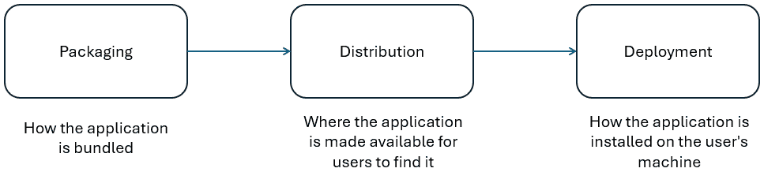

图 11.1 – 使应用程序可供用户使用的流程

现在我们已经了解了术语，让我们首先探讨在打包、分发和部署 CLI 应用程序时可供选择的各种选项。

# CLI 应用程序的打包和分发选项

当涉及到打包 CLI 应用程序时，存在几种方法，选择最合适的方法取决于我们打算如何分发它。

最常见的选项如下：

+   **MSI 安装程序**：此选项允许您获得更传统的安装体验，可以使用 WiX 或 Visual Studio 安装程序项目等工具实现。请注意，此选项仅适用于 Windows。因此，如果我们打算将我们的 CLI 应用程序分发到多个平台，此选项可能不是最佳选择。

+   `dotnet tool install` 命令。由于我们的 CLI 应用程序是使用跨平台版本的 .NET 构建的，我们可以将其作为 .NET 工具分发到各种平台。这种方法的缺点在于安装机制：它需要 .NET CLI。如果我们的受众是开发人员或 IT 专业人员，这很好，但如果不合适，则不太适用。我们只有在 CLI 应用程序是开发人员或 IT 管理员工具的情况下才应考虑这种方法，而我们的书签管理应用程序并非如此。

+   **Docker 容器**：这也是多平台分发的绝佳选择。Docker 容器的一个明显优势是它在本地机器上的占用空间更小，因为不需要进行本地安装，并且对系统的访问有限。Docker 容器是一个自包含的文件。然而，与 .NET 工具选项一样，此选项主要针对开发人员或 IT 管理员，因为用户需要了解如何使用 Docker 才能部署我们的应用程序。

+   `apt-get` 软件包管理器，macOS 提供了 Homebrew，Windows 提供了 WinGet。这些选项很棒，因为每个平台的用户都熟悉它们，无论他们的技术知识如何。这意味着这些分发机制不仅针对开发人员和 IT 管理员，而且针对所有人！再次强调，由于我们的 CLI 应用程序是用跨平台技术 (.NET) 构建的，我们可以使用相同的代码并将它打包以在每个这些平台上分发。

如您所见，我们提供了多种打包和分发选项，您可以使用最适合您情况的选项。在本章中，我们将探讨最后三个打包和分发选项：.NET 工具、Docker 容器和 WinGet（作为特定平台的打包选项）。

让我们开始吧！

# 打包和分发 CLI 应用程序

在本节中，我们将探讨使用三种不同的选项打包和分发我们的应用程序，Bookmarkr 的细微差别。我们将借此机会解释每种方法何时最合适。

## 选项 #1 – 作为 .NET 工具

通过将我们的应用程序作为 .NET 工具打包和分发，我们的用户将能够使用 .NET CLI 安装它。然而，重要的是用户要确保他们已安装适当的 .NET 版本，以避免版本不匹配，这可能导致应用程序中出现意外的行为。

### 第 1 步 – 打包

第一步是修改 `.csproj` 文件，添加表示它应被打包为工具的属性。这些属性应添加到 `<PropertyGroup>` 部分：

```cs
<PackageId>bookmarkr</PackageId>
<Version>1.0.0</Version>
<Authors>Tidjani Belmansour</Authors>
<Description>Bookmarkr is a bookmarks manager provided as a CLI application.</Description>
<PackAsTool>true</PackAsTool>
<ToolCommandName>bookmarkr</ToolCommandName>
<PackageOutputPath>./nupkg</PackageOutputPath>
<PackageLicenseExpression>MIT</PackageLicenseExpression>
<PackageReadmeFile>README.md</PackageReadmeFile>
<Copyright>Tidjani Belmansour. All rights reserved.</Copyright>
<PackageProjectUrl>https://github.com/PacktPublishing/Building-CLI-Applications-with-C#-and-.NET</PackageProjectUrl>
<RepositoryUrl>https://github.com/PacktPublishing/Building-CLI-Applications-with-C#-and-.NET</RepositoryUrl>
<PackageTags>.net cli;bookmark manager;.net 8</PackageTags>
```

让我们解释我们刚刚添加的内容：

+   `PackageId`: 这代表我们包的唯一标识符。

+   `Version`: 这表示我们包的版本。当我们需要打包新版本时，我们需要更改此值。

+   `Authors`: 这代表包的作者（或作者列表）。

+   `Description`: 这提供了应用程序的简要描述。

+   `PackAsTool`: 设置为 `true`，表示应用程序应被打包为 .NET 工具。

+   `ToolCommandName`: 这是用户将在他们的终端中输入以执行我们的应用程序的命令名称。

+   `PackageOutputPath`: 由于 .NET 工具被打包为 NuGet 包，因此将生成一个 `.nupkg` 文件。此属性表示此文件将在何处生成。

+   `PackageLicenseExpression`: 我选择提供 MIT 许可的代码，因为它是一种允许在任何项目中重用代码的许可，只要在所有副本或软件的实质性部分中包含原始版权声明和许可即可。

+   `PackageReadmeFile`: 这指向一个 Markdown 文件，其中我们解释了应用程序的目的、如何开始使用它以及指向其文档的链接等。此 Markdown 文件的内容将在 NuGet 网站上的包页面上显示供用户阅读。您将在代码存储库中找到该文件。

+   `Copyright`: 这展示了应用程序的版权详情。

+   `PackageProjectUrl`: 这指向项目网站的首页。

+   `RepositoryUrl`: 这指向应用程序代码所在的存储库。

+   `PackageTags`: 这展示了一个分号分隔的关键词列表，可以在搜索包时使用。

为了指定 `README.md` 文件的位置和如何处理它，我们需要将以下 XML 代码添加到 `.csproj` 文件中：

```cs
<ItemGroup>
    <None Include="README.md" Pack="true" PackagePath="\"/>
</ItemGroup>
```

第二步是打包应用程序。这是通过运行以下命令来实现的：

```cs
dotnet pack --configuration Release
```

请记住，它将在 `PackageOutputPath` 属性的值所指示的位置生成。

我们的包现在已准备好分发。

### 第 2 步 – 分发

分发 .NET 工具最常见的方式是通过位于 [`www.nuget.org`](https://www.nuget.org) 的 NuGet 网站。

因此，让我们前往 NuGet 网站，并点击页面右上角的 **Sign in** 链接：


图 11.2 – 登录到 NuGet 网站

我将使用我的个人账户登录并授予 NuGet 网站所需的权限，如下所示：

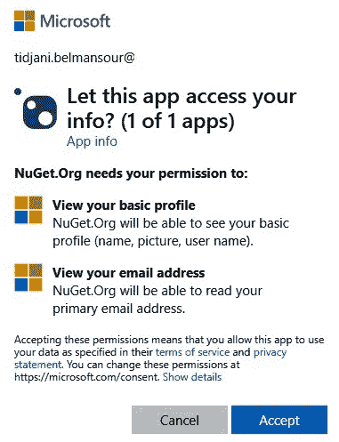

图 11.3 – 授予 NuGet 网站所需的权限

由于这是我第一次使用此账户登录，NuGet 网站要求我提供一个用户名：

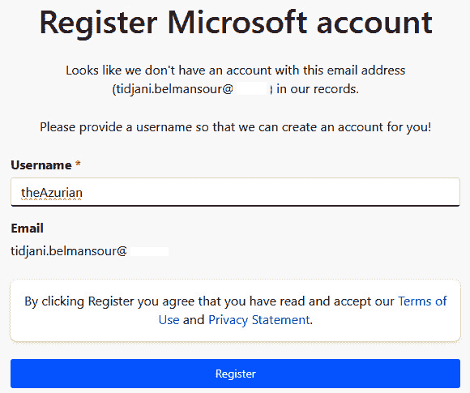

图 11.4 – 为 NuGet 网站选择用户名

就这样！作为 NuGet 包的发布者，我现在已经设置完毕，可以开始上传我的包：

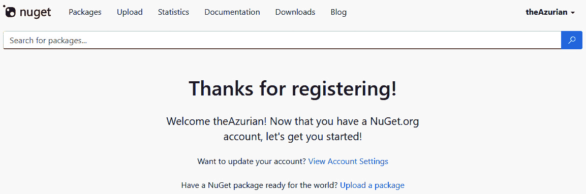

图 11.5 – 作为 NuGet 包发布者已设置完毕

现在我们来上传我们的包！

我们需要做的只是点击我们之前生成的 `.nupkg` 文件。然后包将被分析，并显示验证结果：

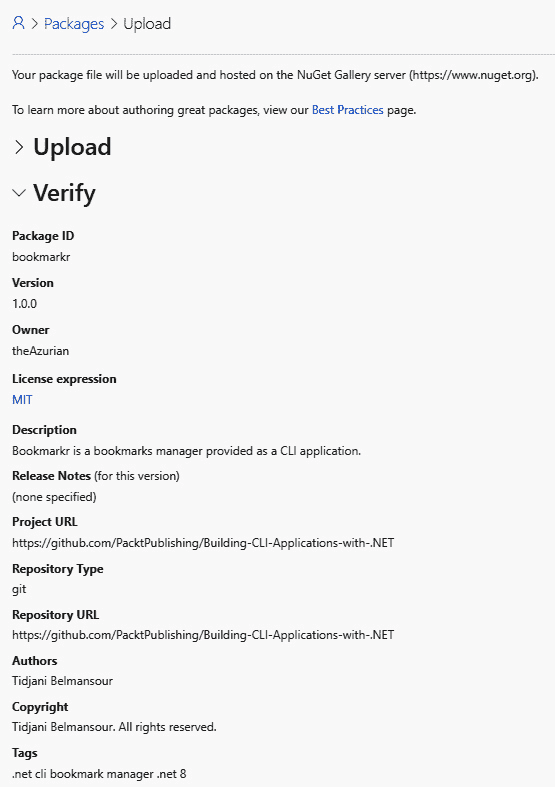

图 11.6 – 上传包到 NuGet 网站

由于我们的包是有效的，我们可以通过点击页面底部的 **提交** 按钮来提交它。

上传后，通常需要大约 15 分钟（但有时可能需要长达一小时）的时间来验证和索引包，然后它才会出现在搜索结果中：

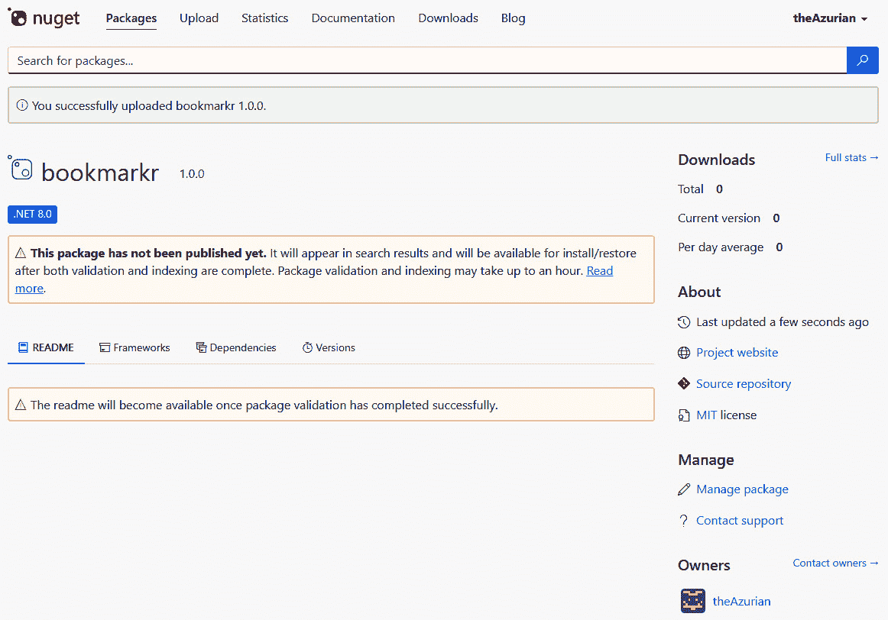

图 11.7 – 等待验证和索引的包

一旦包验证和索引完成，它将像任何其他 NuGet 包一样出现在 NuGet 网站上：

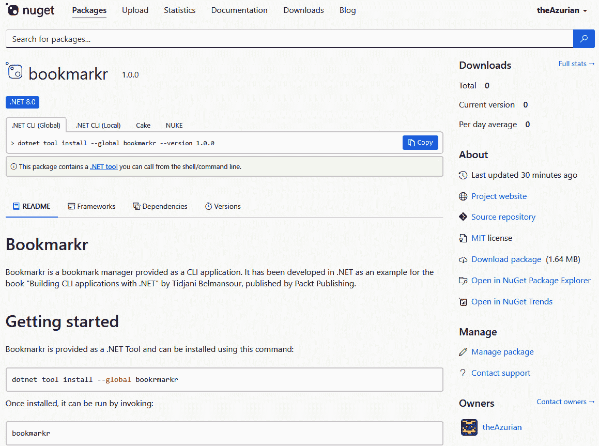

图 11.8 – Bookmarkr 可在 NuGet 网站上找到！

现在，我们的应用程序可以被用户找到，让我们看看它是如何被部署的。

### 第 3 步 – 部署

用户可以通过输入以下命令非常容易地在他们的机器上部署（即安装）我们的应用程序：

```cs
dotnet tool install --global bookrmarkr
```

安装完成后，用户可以通过输入以下命令来执行我们的应用程序：

```cs
bookrmarkr
```

就这样！我们已经打包、分发和部署了 Bookmarkr 作为 .NET 工具。

现在我们来看看如何将 Bookmarkr 作为 Docker 容器交付给我们的用户。

## 选项 #2 – 作为 Docker 容器

将我们的应用程序打包并作为 Docker 容器分发，允许用户通过减少应用程序在他们的环境（即操作系统和数据）中的占用，来安装和使用我们的应用程序。

### 第 1 步 – 打包

如果你熟悉容器，你可能已经知道，为了创建容器镜像，需要一个 Dockerfile。

Dockerfile 是一个没有扩展名的文件，应该位于项目目录的根目录。对于我们的应用程序，其内容如下：

```cs
FROM mcr.microsoft.com/dotnet/sdk:8.0 AS build
WORKDIR /app
COPY *.csproj ./
RUN dotnet restore
COPY . ./
RUN dotnet publish -c Release -o out
FROM mcr.microsoft.com/dotnet/runtime:8.0
WORKDIR /app
COPY --from=build /app/out .
ENTRYPOINT [«dotnet», «bookmarkr.dll»]
```

从本质上讲，此文件指示 Docker 构建并发布应用程序（其前六行），然后从发布的应用程序构建容器镜像（剩余的五行）。

在我们运行实际构建镜像的命令之前，我们需要确保 Docker Desktop 和**Windows 子系统（WSL**）都已安装并正在运行。请注意，Docker Desktop 需要在本地机器上具有管理员权限。

可以使用以下命令安装 Docker Desktop：

```cs
winget install Docker.DockerDesktop
```

可以使用以下命令安装 WSL（安装 WSL 后，Windows 需要重启）：

```cs
wsl --install
```

构建 Docker 镜像的命令如下：

```cs
docker build -t bookmarkr .
```

`-t bookmarkr`参数用于标记要生成的 Docker 镜像，并带有名称和可选版本号（稍后会有更多介绍）。

最后一个点字符既不是打字错误也不是可选的。它指的是我们所说的**构建上下文**。更具体地说，它指示 Docker 在哪里查找 Dockerfile，在这种情况下，是当前目录。

这个操作大约需要五分钟，一旦完成，Docker 镜像将被创建，可以通过输入以下内容来检索：

```cs
docker images
```

注意，容器镜像已经在我们的本地机器上生成。然而，我们应该通过一个每个人都可以轻松找到的位置来分发它。

### 第 2 步 – 分发

分发 Docker 镜像最常见的方式是通过 Docker Hub。

为了做到这一点，我们需要前往位于[`hub.docker.com`](https://hub.docker.com)的 Docker Hub 门户。如果您还没有 Docker Hub 账户，您可以从那里创建一个。我已经有一个这样的账户，我的用户名是`theAzurian`。

因此，让我们按照步骤将我们的本地 Docker 镜像推送到 Docker Hub。

首先，让我们使用以下命令登录到我们的 Docker Hub 账户：

```cs
docker login -u theazurian -p ****
```

我正在传递我的`-p`参数。这个 PAT 是通过 Docker Hub 门户创建的。

接下来，我们需要标记镜像以包含其作者的 Docker Hub 用户名、应用程序的名称及其版本，例如以下内容：

```cs
docker tag bookmarkr theazurian/bookmarkr:1.0.0
```

最后，我们需要使用以下命令将标记的镜像推送到 Docker Hub：

```cs
docker push theazurian/bookmarkr:1.0.0
```

我们可以通过前往门户并在我们的 Docker Hub 个人资料中查找它来确保镜像已成功推送到 Docker Hub：

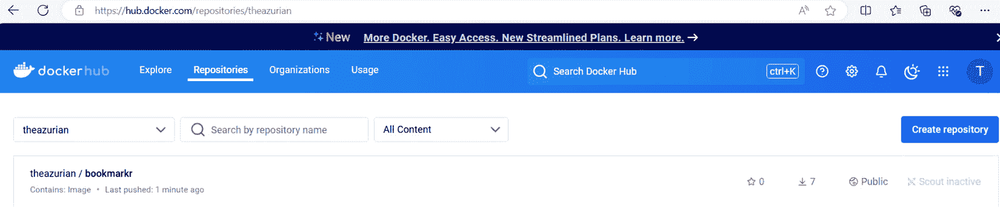

图 11.9 – Bookmarkr 可在 Docker Hub 门户中找到！

我们也可以在 Docker Hub 门户中搜索它：

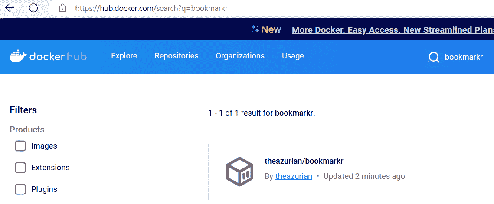

图 11.10 – 在 Docker Hub 门户中搜索 Bookmarkr

我们的应用程序现在可以被我们的用户找到。让我们看看它是如何部署的。

### 第 3 步 – 部署

为了让用户在 Windows 机器上运行 Docker，他们还需要安装 Docker Desktop 和 WSL。

可以使用以下命令安装 Docker Desktop：

```cs
winget install Docker.DockerDesktop
```

可以使用以下命令安装 WSL（安装 WSL 后，Windows 需要重启）：

```cs
wsl --install
```

现在，我们的用户可以通过输入以下命令从 Docker Hub 获取应用程序：

```cs
docker pull theazurian/bookmarkr:1.0.0
```

他们可以通过输入以下命令来执行它：

```cs
docker run theazurian/bookmarkr:1.0.0
```

Bookmarkr 可以作为 Docker 容器在用户的计算机上运行：


图 11.11 – Bookmarkr 作为 Docker 容器运行

就这样！我们已经将 Bookmarkr 打包、分发和部署为 Docker 容器。

现在我们来看看如何将 Bookmarkr 作为 WinGet 包提供给我们的用户。

## 选项 #3 – 作为 WinGet 包

通过将我们的应用程序打包和分发为 WinGet 包，我们允许我们的用户像使用 WinGet 安装的任何其他应用程序一样安装它，Microsoft 的包管理器。

### 打包

要将 .NET CLI 应用程序打包以通过 WinGet（官方 Windows 包管理器）分发，我们首先需要创建一个清单文件。

虽然可以在 GitHub 的 WinGet 包存储库（[`github.com/microsoft/winget-pkgs`](https://github.com/microsoft/winget-pkgs)）上手动创建和提交清单，但最简单的方法是使用 `WingetCreate` CLI。

让我们先使用这个命令来安装它：

```cs
winget install wingetcreate
```

在我们创建新的清单之前，我们首先需要使用此命令将我们的 CLI 应用程序构建为一个自包含的 .NET 应用程序：

```cs
dotnet publish -c Release -r win-x64 -p:selfcontained=true -p:IncludeNativeLibrariesForSelfExtract=true -p:PublishSingleFile=true
```

让我们更仔细地看看这个命令：

+   `-c Release`: 由于这是一个生产就绪版本的应用程序，我们希望使用 Release 配置来发布它，以确保其性能优化。

+   `-r win-x64`: 由于 WinGet 是 Windows（仅限 Windows）的包管理器，我们指定目标运行时为 Windows 的 64 位版本。

+   `-p:selfcontained=true`: 一个自包含的应用程序已经包含了 .NET 运行时，因此用户的机器不需要安装它。应用程序将携带运行所需的所有内容，包括运行时、库和依赖项。

+   `-p:IncludeNativeLibrariesForSelfExtract=true`: 这确保了平台特定的库，以及非托管的本机库，都包含在发布的应用程序中。如果我们使用一些特定的 Serilog 沉淀物或 SQLite 库，这很有用。

+   `-p:PublishSingleFile=true`: 这指示 .NET 将所有内容（包括应用程序代码、.NET 运行时和依赖项）打包成一个单独的可执行文件。虽然这使得分发更加方便（因为我们只分发一个文件），但生成的文件大小比框架依赖的发布文件要大。

应用程序将在 `bin\Release\net8.0\win-x64\publish` 目录中生成。

接下来，我们将将其上传到一个 WinGet 工具可以访问的位置。通常会选择一个远程的、公开可访问的、只读位置。我决定使用 Azure 存储账户。因此，可执行文件的位置将是 [`bookmarkr.blob.core.windows.net/releases/1.0.0/`](https://bookmarkr.blob.core.windows.net/releases/1.0.0/)。

关于 GitHub 发布

如果您的应用程序是在 GitHub 上作为开源项目构建的，您可能会将可执行版本作为发布版提供。然而，GitHub 上的发布遵循某些指南，这些指南远远超出了本书的范围。如果您对此主题感兴趣，我建议您通过访问[`github.com/github/docs/blob/main/content/repositories/releasing-projects-on-github/about-releases.md`](https://github.com/github/docs/blob/main/content/repositories/releasing-projects-on-github/about-releases.md)来探索这些指南。

让我们现在创建我们的清单文件！我们可以使用以下命令来完成：

```cs
wingetcreate new https://bookmarkr.blob.core.windows.net/releases/1.0.0/bookmarkr.exe
```

工具将询问生成清单文件所需的一系列问题。以下是一个示例：

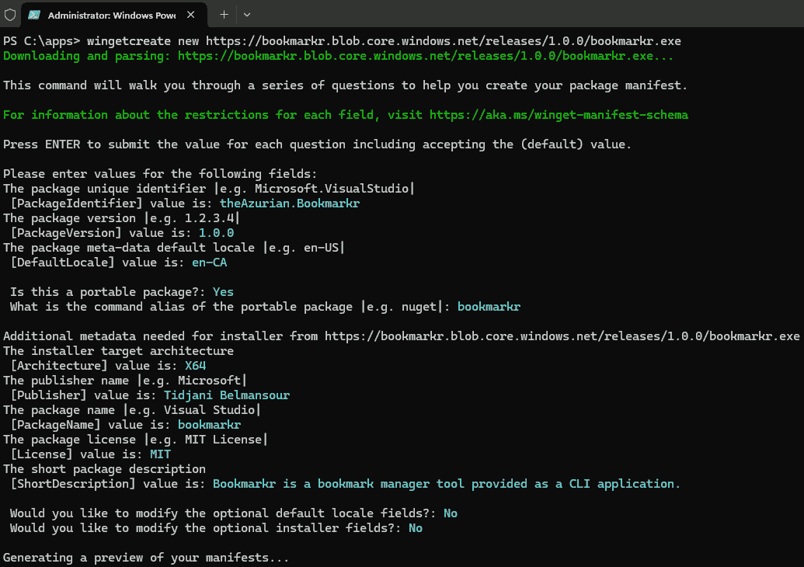

图 11.12 – 生成 WinGet 清单文件

将生成三个文件：

+   **版本清单（theAzurian.bookmarkr.yaml）**：包含有关正在打包的应用程序特定版本的元数据。

+   **安装程序清单（theAzurian.bookmarkr.installer.yaml）**：详细说明应用程序的安装细节。

+   **默认区域设置清单（theAzurian.bookmarkr.locale.en-CA.yaml）**：定义应用程序的区域设置。它确保用户接收到的应用程序版本是适当本地化的，通过以他们首选的语言呈现信息来增强用户体验。

我个人喜欢将这些文件保存在我的 Visual Studio 项目中，在项目根目录下创建的以下文件夹结构中：

```cs
/manifests/ApplicationName/Version
```

因此，在我们的情况下，这个文件夹结构将看起来像这样：

```cs
/manifests/Bookmarkr/1.0.0
```

在我们将清单提交给 WinGet 团队之前，建议我们在本地进行测试以确保其按预期工作。这很重要，因为如果清单中存在问题，提交我们的包可能会导致 WinGet 审批过程中的延迟。

要做到这一点，我们首先需要激活从本地清单安装应用程序的能力。这可以通过在以管理员身份运行的终端中执行以下命令来完成：

```cs
winget settings --enable LocalManifestFiles
```

接下来，我们运行以下命令，提供`manifests.json`文件的路径：

```cs
winget install --manifest "C:\code\Chap11\bookmarkr\manifests\Bookmarkr\1.0.0\"
```

如我们所见，应用程序已安装并按预期运行：

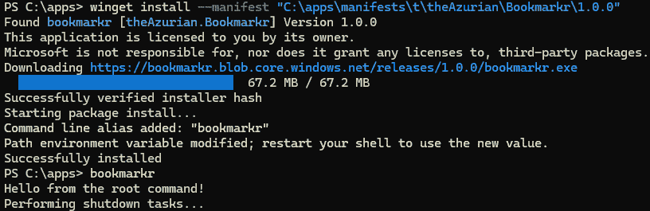

图 11.13 – 在提交前在本地测试 WinGet 包

我们现在已准备好将我们的清单提交给 WinGet 团队！

将我们的清单提交到 WinGet 包存储库需要我们为我们的 GitHub 账户生成一个 PAT。我们可以使用`wingetcreate token`命令来完成此操作，或者我们可以跳过此步骤，当提交清单时，`wingetcreate`将提示我们验证我们的 GitHub 账户。让我们这样操作吧！

让我们运行以下命令：

```cs
wingetcreate submit "C:\code\Chap11\bookmarkr\manifests\Bookmarkr\1.0.0\"
```

这将打开浏览器并带我们到 GitHub 登录页面。我们将需要登录到我们的账户。一旦完成，我们需要提供所需的授权：

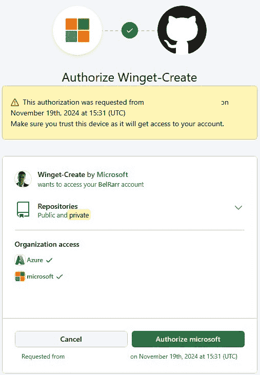

图 11.14 – 授权 WingetCreate 对我们的 GitHub 账户

然后，它将带我们到拉取请求页面，我们可以跟踪其进度。大约 30 分钟后，拉取请求完成，该软件包可供我们的用户安装。

用户可以通过输入以下命令使用 WinGet 安装 Bookmarkr：

```cs
winget install --id theAzurian.Bookmarkr
```

哇！我们已经将 Bookmarkr 打包、分发和部署为一个 WinGet 软件包。

因此，我们已经看到了三种不同的打包、分发和部署我们应用程序的方法。但我们是怎样管理该应用程序的多个版本的呢？这就是我们将在下一节中要探讨的内容。

# 管理应用程序的版本

我们之前提出的所有选项都提供了版本管理机制。版本管理与我们选择的打包和分发机制一样重要。

随着我们的应用程序发展和新功能的添加、修改或删除，我们希望为用户提供一种方便地消费这些更新的方式。这就是版本控制发挥作用的地方。

目前，我们只分发我们应用程序的一个版本。因此，我们可以通过省略其版本号或明确指出它来安装它。

但如果我们更新了应用程序呢？我们如何分发新版本？而且如果新版本引入了错误，我们需要回滚到先前的版本怎么办？

让我们探索我们如何实现我们之前涵盖的每种分发方法。

## 语义版本控制入门

在我们深入探讨管理应用程序的不同版本之前，让我们首先介绍**语义版本控制**。

如果你熟悉这种应用程序版本控制方法，你知道这可能是行业中最常见和最广泛采用的方法。如果你之前没有听说过它，让我给你做一个简要的介绍。如果你想更深入地探索语义版本控制，我建议你访问其官方网站[`semver.org`](https://semver.org)。

从本质上讲，语义版本控制使用以下格式来表示版本号：

```cs
Major.Minor.Patch
```

这里，我们有以下内容：

+   **主要**：表示此版本的应用程序包含与之前主要版本不兼容的破坏性更改。

+   **次要**：表示此版本的应用程序仅添加与之前相同主版本的先前版本向后兼容的新功能。

+   **补丁**：表示此版本的应用程序包含与之前相同主版本的先前版本向后兼容的错误修复。

每个部分都表示为一个数字，每次新版本发布时都会递增。

现在我们已经理解了语义版本控制，让我们用它来管理我们应用程序的不同版本。

## 管理一个.NET 工具的版本

如果你运行了我们提供的作为 .NET 工具的 Bookmarkr 版本，你肯定会注意到它返回以下错误信息：

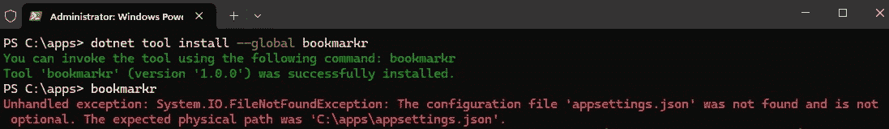

图 11.15 – 将 Bookmarkr 作为 .NET 工具执行失败

然后让我们修复问题并分发新版本。

错误来自 `appsettings.json` 文件在执行 `dotnet pack` 命令时没有被包含在包中。

幸运的是，修复这个问题很简单。在 `.csproj` 文件中找到以下条目：

```cs
<None Update="appsettings.json">
```

用以下内容替换它：

```cs
<None Update="appsettings.json" Pack="true" PackagePath="\">
```

现在，由于我们即将打包和分发的这个新版本只提供错误修复，我们将增加补丁号，因此版本号看起来如下：

```cs
<Version>1.0.3</Version>
```

我们现在可以通过遵循我们之前描述的相同步骤来打包和分发新版本。

然而，在分发之前，建议使用以下命令在本地进行测试：

```cs
dotnet tool install --global bookmarkr --version 1.0.3 --add-source "C:\code\Chap11\bookmarkr\nupkg"
```

`--add-source` 参数允许我们指定一个位置，从该位置部署包。在这里，我指定了在本地机器上生成的 NuGet 包的路径。

在确保这个新版本在本地机器上成功运行后，我们可以继续将其推送到 NuGet 网站。

用户可以通过提供版本号作为参数来获取工具的特定版本。在这种情况下，可以通过输入此命令来实现：

```cs
dotnet tool install --global bookmarkr --version 1.0.3
```

或者，他们可以简单地输入以下命令以获取最新版本：

```cs
dotnet tool install --global bookmarkr
```

一旦执行此命令，工具的旧版本将被新版本替换。

通过运行应用程序的新版本，我们现在可以看到错误已被解决：

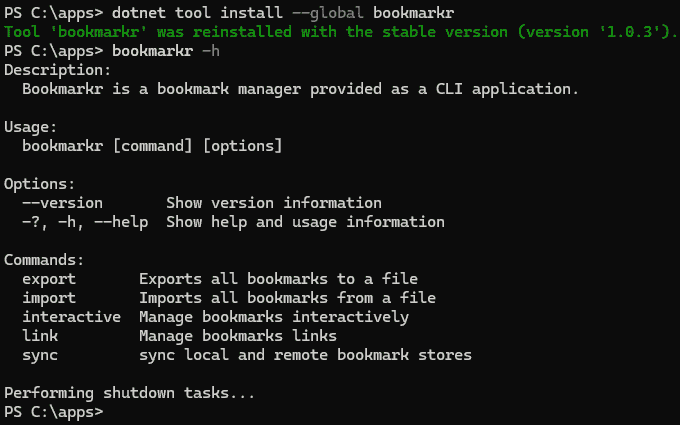

图 11.16 – 将 Bookmarkr 作为 .NET 工具成功运行

就这样！我们现在知道如何管理 .NET 工具的版本。

让我们看看我们是如何管理 Docker 容器的版本的。

## 管理 Docker 容器的版本

如您所注意到的，当我们把 Docker 镜像推送到 Docker Hub 时，我们用版本号进行了标记。因此，如果我们想分发新版本，我们可以用不同的版本号标记新镜像。

然而，如果你熟悉 Docker，你可能知道可以在不提供版本号或使用 `latest` 标签的情况下与容器一起工作。

当分发多个容器版本时，通过使用 `latest` 标签标记该版本，指明这些版本中的哪一个是最新的，这是很重要的。

因此，让我们假设我们正在分发 Bookmarkr 的新版本，并且我们想要表明这个新版本是最新版本。我们可以这样做：

```cs
docker build -t theazurian/bookmarkr:2.0.0 .
docker tag theazurian/bookmarkr:2.0.0 theazurian/bookmarkr:latest
docker push theazurian/bookmarkr:2.0.0
docker push theazurian/bookmarkr:latest
```

让我们解释这些命令：

+   第一个创建了一个带有版本 2.0.0 标签的新 Docker 镜像

+   第二个将版本 2.0.0 标记为最新版本

+   第三个命令将带有版本 2.0.0 标签的镜像推送到 Docker Hub

+   第四步将标记为最新版本的镜像推送到 Docker Hub

我们使用两个不同的标签推送相同的镜像的事实允许我们的用户（使用`docker pull`命令）指定或不指定其版本号来获取它。因此，随着我们不断更新应用程序并推送新的 Docker 镜像，我们将使用`latest`标签标记最新版本。如果该版本包含错误，我们可以通过使用`latest`标签将用户引导到之前的版本。

如果我们访问 Docker Hub 门户，我们将看到新版本已成功推送。注意，有同一镜像的两个版本：一个以版本号 2.0.0 作为标签，另一个以`latest`标签。

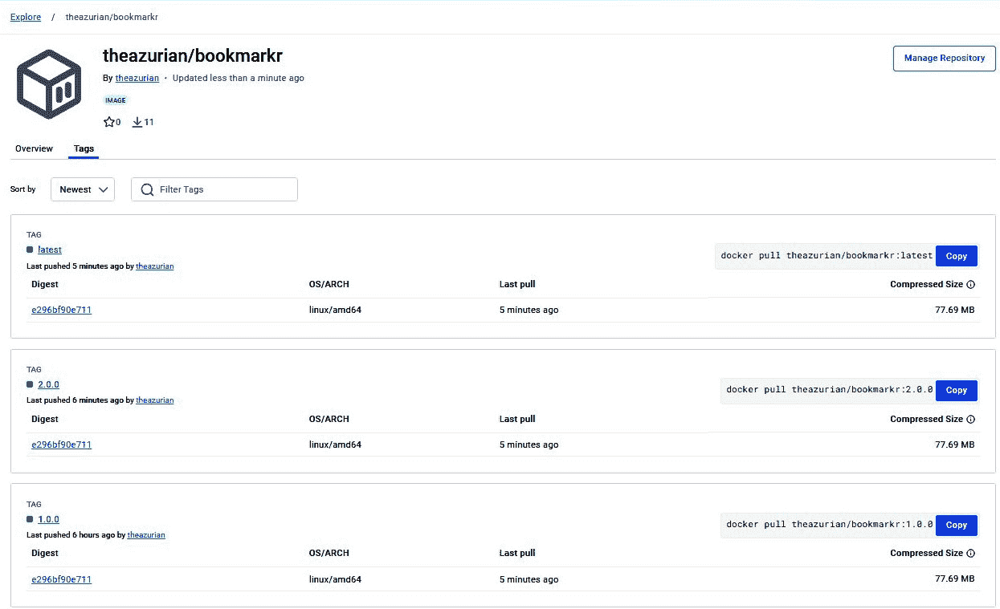

图 11.17 – 推送到 Docker Hub 的 Docker 镜像的新版本

在用户端，他们可以通过明确提及其标签来获取特定版本，如下所示：

```cs
docker pull theazurian/bookmarkr:2.0.0
```

或者，他们可以通过省略标签来获取最新版本（即标记为`latest`的版本），如下所示：

```cs
docker pull theazurian/bookmarkr
```

用户将看到以下内容：

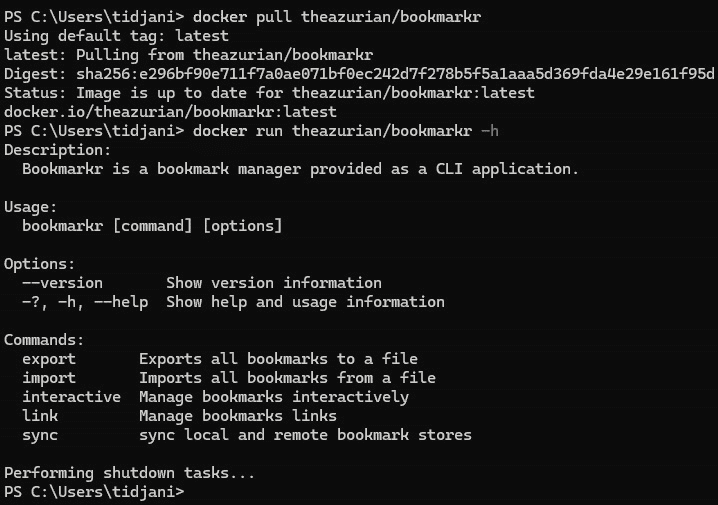

图 11.18 – 运行 Docker 容器的最新版本

就这样！我们现在知道如何管理 Docker 镜像的版本。

让我们看看我们是如何管理 WinGet 包的版本的。

## 管理 WinGet 包的版本

为了提交应用程序的新版本，在更新应用程序的代码或功能之后，我们首先需要更新`.csproj`文件中的版本号（`<Version>`元素）。

接下来，我们需要使用之前看到的相同命令再次发布应用程序：

```cs
dotnet publish -c Release -r win-x64 -p:selfcontained=true -p:IncludeNativeLibrariesForSelfExtract=true -p:PublishSingleFile=true
```

然后，我们需要将生成的二进制文件上传到我们的分发位置，即我们的 Azure 存储账户，同时要注意我们应该为新版本创建一个新的目录。对于版本 1.0.3，路径将如下所示：

```cs
https://bookmarkr.blob.core.windows.net/releases/1.0.3/bookmarkr.exe
```

下一步是使用此命令更新清单：

```cs
wingetcreate update theAzurian.Bookmarkr --version 1.0.3 https://bookmarkr.blob.core.windows.net/releases/1.0.3/bookmarkr.exe
```

新的清单已生成并准备好提交。

然而，正如我们之前学到的，在提交之前在本地测试新版本始终是一个好习惯。为此，我们将执行之前相同的命令：

```cs
winget install --manifest "C:\code\Chap11\bookmarkr\manifests\Bookmarkr\1.0.3\"
```

一旦测试成功，我们使用以下命令提交新版本：

```cs
wingetcreate submit "C:\code\Chap11\bookmarkr\manifests\Bookmarkr\1.0.3\"
```

剩余步骤与我们提交应用程序初始版本时遵循的步骤类似。

一旦新版本被批准并添加到 WinGet 包仓库中，用户就可以找到它并安装它。他们可以使用以下命令安装最新版本：

```cs
winget install --id theAzurian.Bookmarkr
```

或者，他们可以通过将期望的版本号作为参数传递给命令来安装特定版本，如下所示：

```cs
winget install --id theAzurian.Bookmarkr --version 1.0.3
```

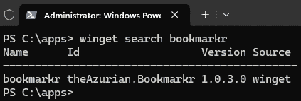

图 11.19 – Bookmarkr 的更新版本在 WinGet 中可用

就这样！这就是我们管理 WinGet 包多个版本的方法。

# 摘要

在本章中，我们学习了如何打包和部署 Bookmarkr 到不同的平台，以便向全球各地的用户分发，无论他们选择哪个平台，无论是 Windows、Linux 还是 macOS。

这是我们取得的一个相当大的里程碑，从我们的 CLI 应用程序想法的诞生，到将其推广到全球数百万用户手中。让我们花点时间庆祝这个成就，为自己感到自豪。恭喜！🎉

然而，一些用户告诉我们，应用程序有时运行缓慢。我们并没有经历过这些性能问题，因为我们运行在快速且强大的计算机上，但并非所有用户都是如此。尽管我们可以简单地指定运行 Bookmarkr 的最低要求，但我们不想限制能够从中受益和使用它的用户数量。因此，我们决定看看我们是否可以做一些事情。

在下一章中，我们将探讨不同的技术，这些技术将使我们能够优化应用程序的性能。

# 轮到你了！

跟随提供的代码进行实践是学习的好方法。

更好的方法是通过挑战自己完成任务。因此，我挑战你通过添加以下功能来改进 Bookmarkr 应用程序。

## 任务 #1 – 允许 Linux 用户使用 apt-get 安装 Bookmarkr

目前，Bookmarkr 可以使用 WinGet 在 Windows 上部署。然而，这在 Linux 上不起作用，Linux 用户通常使用 `apt-get` 部署应用程序。因此，你被挑战将 Bookmarkr 作为 `apt-get` 软件包进行分发，以便 Linux 用户也能享受使用它。

## 任务 #2 – 允许 macOS 用户使用 Homebrew 安装 Bookmarkr

对于 macOS 用户来说，情况也是如此：他们通常使用 `brew` 命令安装应用程序。因此，你被挑战将 Bookmarkr 作为 Homebrew 公式进行分发。

# 第五部分：高级技术和最佳实践

在本部分，你将探索 CLI 应用程序开发的关键方面，这些方面可以增强性能、安全性和功能性。你将深入了解性能优化和调整技术，学习如何分析你的 CLI 应用程序，识别瓶颈，并实现高效的算法和数据结构。这包括缓存、负载均衡和代码重构等策略，以提高执行速度和资源利用率。接下来，你将专注于 CLI 应用程序特有的安全考虑，涵盖最佳实践和防范常见漏洞。你将学习如何实现强大的身份验证机制，为敏感数据使用加密，并在你的 CLI 工具中遵循最小权限原则。最后，你将探索额外的资源和库，这将使你能够深入了解本书中提出的各种概念和技术。

本部分包含以下章节：

+   *第十二章**，性能优化和调整*

+   *第十三章**，CLI 应用程序的安全考虑*

+   *第十四章**，附加资源和库*
