# 第二章：实现微服务

在上一章中，我们讨论了分层单体架构的问题。在本章中，我们将讨论如何从现有系统中重构它们，并为产品和订单构建独立的微服务。在本章中，我们将涵盖以下主题：

+   C# 7.0、Entity Framework Core、Visual Studio 2017 和 Microsoft SQLServer 简介

+   微服务的大小

+   什么使一个好的服务？

+   领域驱动设计（DDD）及其对微服务的重要性

+   Seam 的概念

+   微服务之间的通信

+   重温 Flix One 案例研究

# 简介

在我们继续讨论实现微服务概念之前，值得提及的是我们用来实现这些微服务的核心概念、语言和工具。在本章中，我们将对这些主题进行概述。

# C# 7.0

C# 是微软开发的一种编程语言。本书撰写时的当前版本是 C# 7.0。该语言于 2002 年出现。这是一种面向对象和面向组件的语言。当前版本具有各种新功能，如 ValueTuple、析构函数、模式匹配、switch 语句局部函数等。

我们不会深入探讨这些功能，因为它们超出了本书的范围。更多详细信息，请参考：[`docs.microsoft.com/en-us/dotnet/csharp/whats-new/`](https://docs.microsoft.com/en-us/dotnet/csharp/whats-new/)。

# Entity Framework Core

**Entity Framework Core**（**EF Core**）是微软 Entity Framework 的跨平台版本，它是最受欢迎的 **对象关系映射器**（**ORM**）之一。

ORM 是一种帮助您根据所需业务输出查询和操作数据的技术。有关更多详细信息，请参阅[`stackoverflow.com/questions/1279613/what-is-an-orm-and-where-can-i-learn-more-about-it`](https://stackoverflow.com/questions/1279613/what-is-an-orm-and-where-can-i-learn-more-about-it)。

EF Core 支持多种数据库。数据库的完整列表可在以下链接找到：[`docs.microsoft.com/en-us/ef/core/providers/index`](https://docs.microsoft.com/en-us/ef/core/providers/index)。当前 EF Core 的版本是 2.0。为了熟悉 EF Core，我建议您详细阅读以下内容：[`docs.microsoft.com/en-us/ef/core/get-started/index`](https://docs.microsoft.com/en-us/ef/core/get-started/index)。

# Visual Studio 2017

Visual Studio 是微软创建的最好的 **集成开发环境**（**IDE**）之一。它使开发者能够使用著名的语言（例如，C#、VB.NET、F# 等）以各种方式工作。Visual Studio 2017 的当前发布版本是更新 3（VS15.3）。

集成开发环境（IDE）是一种软件应用程序，它为程序员提供了一个使用编程语言编写程序的平台。更多信息，请访问：[`en.wikipedia.org/wiki/Integrated_development_environment`](https://en.wikipedia.org/wiki/Integrated_development_environment)。

微软还发布了适用于 macOS 的 Visual Studio，Visual Studio 的新版本拥有许多惊人的功能。更多信息请参阅[`www.visualstudio.com/vs/whatsnew/`](https://www.visualstudio.com/vs/whatsnew/)。本书中的所有示例都是使用 Visual Studio 2017 更新 3 编写的。您还可以下载免费的社区版：[`www.visualstudio.com/`](https://www.visualstudio.com/)。

# Microsoft SQLServer

**Microsoft SQLServer**（**MSSQL**）是一个关系型数据库管理系统软件应用。它主要用于作为数据库软件来存储和检索数据。这是建立在 SQL 之上的，即结构化查询语言：[`searchsqlserver.techtarget.com/definition/SQL`](http://searchsqlserver.techtarget.com/definition/SQL)。

当前版本，即 SQL Server 2017，更加健壮，可以在 Windows 和 Linux 上使用。您可以从这里获取 SQL Server 2017：[`www.microsoft.com/en-IN/sql-server/sql-server-2017`](https://www.microsoft.com/en-IN/sql-server/sql-server-2017)。请注意，本书中将使用 SQL Server 2008 R2 或更高版本。

# 微服务的大小

在我们开始构建微服务之前，我们应该清楚它们的一些基本方面，例如在确定微服务大小时要考虑哪些因素，以及如何确保它们与系统其他部分的隔离。

如其名所示，微服务应该是微型的。一个问题随之而来：什么是微型？微服务全部关乎大小和粒度。为了更好地理解这一点，让我们考虑在第一章中讨论的应用，*微服务简介*。

我们希望参与此项目的团队始终保持其代码的一致性。在发布完整项目时，保持一致性尤为重要。我们需要首先将我们的应用/特定部分分解成更小的功能/主服务段的片段。让我们讨论需要考虑的因素，以确保微服务的高级隔离：

+   由于需求变更而产生的风险：一个微服务的需求变更应独立于其他微服务。在这种情况下，我们将我们的软件隔离/分割成更小的服务，以便如果某个服务有任何需求变更，它们将独立于另一个微服务。

+   功能性变更：我们将隔离那些很少变更的功能性，以及那些可能频繁修改的依赖功能性。例如，在我们的应用中，客户模块通知功能很少变更。但与其相关的模块，如`订单`，在其生命周期中更有可能频繁发生业务变更。

+   团队变更：我们还应考虑以这种方式隔离模块，使得一个团队能够独立于所有其他团队工作。如果使新开发者能够高效完成这些模块中的任务的过程不依赖于团队外的人，这意味着我们处于有利的位置。

+   技术变更：技术使用需要在每个模块内垂直隔离。一个模块不应依赖于来自另一个模块的技术或组件。我们应该严格隔离使用不同技术或堆栈开发的模块，或者将它们迁移到公共平台作为最后的手段。

我们的主要目标不应该是使服务尽可能小；相反，我们的目标应该是隔离已识别的边界上下文并保持其小。

# 什么使良好的服务变得出色？

在微服务概念化之前，每当考虑到企业应用集成时，中间件看起来是最可行的选项。软件供应商提供了**企业服务总线**（**ESB**），它是中间件的最佳选项之一。

除了考虑这些解决方案外，我们的主要优先级应倾向于架构特性。当微服务出现时，中间件不再是考虑的重点。相反，焦点转向了对业务问题的思考以及如何借助架构来解决这些问题。

为了使服务能够被开发者和用户轻松使用和维护，该服务必须具备以下特性（我们也可以将这些视为良好服务的特征）：

+   标准数据格式：良好的服务在与其他组件交换服务或系统时应遵循标准数据格式。在.NET 堆栈中最常用的数据格式是 XML 和 JSON。

+   标准通信协议：良好的服务应遵守标准通信格式，如 SOAP 和 REST。

+   松散耦合：良好服务的一个重要特征是它遵循松散耦合。当服务松散耦合时，我们不必担心变化。一个服务的变更不会影响其他服务。

# DDD 及其对微服务的重要性

**领域驱动设计**（**DDD**）是一种设计和复杂系统的方法论和过程。在这些部分中，我们将简要讨论 DDD 及其在微服务环境中的重要性。

# 领域模型设计

领域设计的首要目标是理解确切的领域问题，然后制定一个可以用任何语言或技术集编写的模型。例如，在我们的 Flix One 书店应用程序中，我们需要理解*订单管理*和*库存管理*。

这里是领域驱动模型的一些特征：

+   领域模型应专注于特定的商业模式，而不是多个商业模式

+   它应该是可重用的

+   它应该设计成可以以松散耦合的方式调用，而不同于系统的其余部分

+   它应该独立于持久化实现进行设计

+   它应该从一个项目被拉取到另一个位置，因此它不应该基于任何基础设施框架

# 微服务的重要性

DDD 是蓝图，可以通过微服务实现。换句话说，一旦完成 DDD，我们就可以使用微服务来实现它。这就像在我们的应用程序中，我们可以轻松实现 *订单服务*、*库存服务*、*跟踪服务* 等等。

一旦你对过渡过程感到满意，应该进行一个简单的练习。这将帮助你验证微服务的大小是否足够小。每个系统都是独特的，并且具有自己的复杂度级别。考虑到你领域的这些级别，你需要有一个基准，以确定可以相互通信的最大域对象数量。如果任何服务未能通过这个评估标准，那么你可能有一个候选者来再次评估你的过渡。然而，不要带着一个特定的数字来进行这个练习；你总是可以轻松一些。只要正确遵循所有步骤，系统对你来说应该就没有问题。

如果你觉得这个基准过程对你来说很难实现，你可以选择另一条路。遍历每个微服务中的所有接口和类。考虑到我们遵循的所有步骤和行业标准编码指南，任何新加入系统的人都应该能够理解其目的。

你还可以进行另一个简单的测试，以检查是否实现了服务的正确垂直隔离。你可以部署每一个，并让它们与仍然不可用的其他服务一起运行。如果你的服务上线并继续监听传入的请求，你可以给自己鼓掌。

你可以从隔离部署能力中获得许多好处。仅仅独立部署它们的能力，就允许它们中的主机进入自己的独立进程。它允许你利用云和其他混合托管模型的力量，这些模型是你能想到的。你也可以自由地为每一个选择不同的技术。

# 接缝的概念

微服务的核心能力在于能够在与其他系统隔离的情况下处理特定的功能。这转化为之前讨论的所有优势，例如减少模块依赖、代码重用性、更容易的代码维护和更好的部署。

在我看来，在实施微服务的过程中获得相同的属性应该在实施过程中保持。为什么将单体迁移到微服务的过程会痛苦，而不是像使用微服务本身那样有回报？只需记住，过渡不可能一蹴而就，需要细致的计划。许多有能力的解决方案架构师在展示他们高度有能力的团队时，他们的方法各不相同。答案不仅在于已经提到的点，还在于对业务本身的潜在风险。

这是非常容易实现的。然而，我们必须正确地识别我们的方法才能实现它。否则，整个将单体应用过渡到微服务的过程可能会变得非常糟糕。

# 模块间依赖

当尝试将单体应用过渡到微服务风格的架构时，这始终应该是起点。识别并挑选出那些对其他模块依赖最少且依赖程度最低的应用部分。

理解这一点非常重要，通过识别应用中的这些部分，你并不是仅仅试图挑选出最不具挑战性的部分来处理。然而，与此同时，你已经识别出了缝隙，这些是最容易看到的。这些是应用中我们将首先进行必要更改的部分。这使我们能够完全将这部分代码与系统其他部分隔离。它应该准备好成为微服务的一部分或在这次练习的最后阶段部署。

尽管已经识别出这些缝隙，但实现微服务风格开发的能力仍然还有一段距离。这是一个好的开始。

# 技术

这里需要采取双管齐下的方法。首先，你必须确定应用基础框架中正在利用的不同功能。这种区分可以基于对某些数据结构的重依赖、执行进程间通信或报告生成活动。这是比较容易的部分。

然而，作为第二步，我建议你变得更加自信，并挑选出使用与当前使用的技术类型不同的部分。例如，可能有一段代码依赖于简单的数据结构或基于 XML 的持久化。识别系统中的这种负担并将其标记为过渡。在这种双管齐下的方法中需要非常谨慎。选择过于雄心勃勃可能会让你走上我们试图完全避免的道路。

其中一些部分可能看起来并不是最终微服务风格架构应用的很有希望的候选者。但它们现在仍然需要处理。最终，它们将使你能够轻松地进行过渡。

# 团队结构

随着这个识别过程的每一次迭代执行，这个因素变得越来越重要。可能会有基于各种理由区分的团队，例如他们的技术技能集、地理位置或安全要求（员工与外包）。

如果功能的一部分需要特定的技能集，那么你可能正在寻找另一个可能的 Seam 候选。团队可以由不同程度的不同化因素组成。作为向微服务过渡的一部分，能够使他们独立工作的清晰区分可以进一步优化他们的生产力。

这也可以提供一种形式的利益，即保护公司的知识产权——将应用程序的特定部分外包给顾问并不少见。允许顾问或合作伙伴仅在一个特定模块上帮助你的能力使得这个过程更加简单和安全。

# 数据库

任何企业系统的核心和灵魂是其数据库。它是系统在任何给定日期的最大资产。它也是在这种练习中最脆弱的部分。难怪数据库架构师在你要求他们进行哪怕是最小的更改时，听起来会显得有些刻薄和侵扰。他们的领域由数据库表和存储过程定义。

他们领域的健康状况是通过参照完整性和执行各种事务所需的时间来评判的。我不再认为他们过度行事是有罪的。他们有理由这样做——他们的过去经验。是时候改变了。让我告诉你，这不会容易，因为一旦我们踏上这条路，我们就必须利用一种完全不同的方法来处理数据完整性。

你可能会认为最简单的方法是一次性将整个数据库分割开来，但这并非如此。这可能会让我们陷入我们一直试图避免的情况。让我们看看如何以更有效的方式来进行这项工作。

随着你继续前进，在模块依赖分析之后收集碎片，确定正在用于与数据库交互的数据库结构。在这里你需要执行两个步骤。首先，检查你是否可以将代码中的数据库结构隔离出来进行分解，并将其与新定义的垂直边界对齐。其次，确定分解底层数据库结构需要什么。

如果分解底层数据结构看起来很困难，请不要担心。如果它似乎涉及到你尚未开始迁移到微服务的其他模块，这是一个好兆头。不要让数据库更改定义你将选择并迁移到微服务架构的模块。相反，保持另一种方式。这确保了当数据库更改被采纳时，依赖于该更改的代码已经准备好吸收这些更改。

这确保了你在忙于修改依赖于这部分数据库的代码时，不会陷入数据完整性的战斗。尽管如此，这种数据库结构应该引起你的注意，以便于选择依赖于它们的模块。这将允许你一次性轻松完成所有相关模块的微服务迁移。参考以下图表：

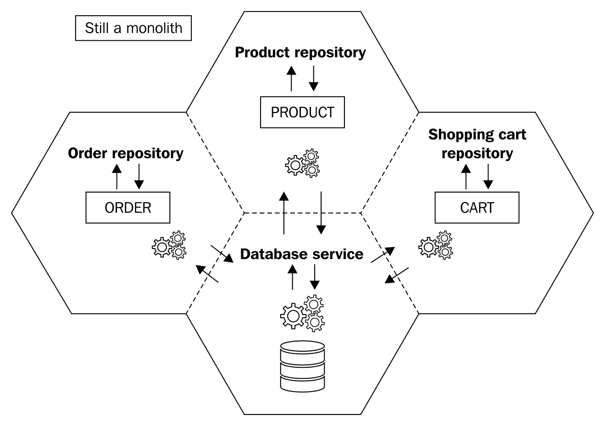

在这里，我们还没有破坏数据库。相反，我们只是将数据库访问部分在第一步中分离成层。

我们所做的是简单地将代码数据结构映射到数据库中，它们不再相互依赖。让我们看看当我们移除外键关系时这一步会如何运作。

如果我们能够将用于访问数据库的代码结构和数据库结构一起过渡，我们将节省时间。这种方法可能因系统而异，并可能受到我们个人偏见的影响。如果你的数据库结构变化似乎影响了尚未标记为过渡的模块，那么现在可以继续前进。

在这里需要理解的一个重要点是，当你分解这个数据库表或将其与另一个部分结构合并时，哪些变化是可以接受的？最重要的是不要回避打破那些外键关系。这听起来可能与我们传统维护数据完整性的方法有很大的不同。然而，移除外键关系是在将数据库重构以适应微服务架构时最根本的挑战。记住，微服务应该是独立于其他服务的。如果有与其他系统部分的外键关系，它会使它依赖于拥有该数据库部分的服务。参考以下图表：

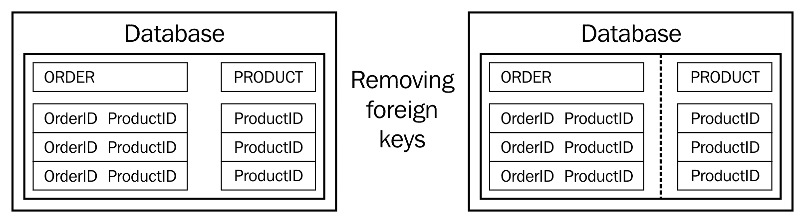

作为第二步的一部分，我们在数据库表中保留了外键字段，但移除了外键约束。因此，**ORDER** 表仍然持有关于 **ProductID** 的信息，但现在外键关系已经断裂。参考以下图表：


这就是我们最终会看到的微服务风格架构。中央数据库将被移除，以支持每个服务拥有自己的数据库。因此，分离代码中的数据结构和移除外键关系是我们最终做出改变的准备。前一个图表中微服务之间的连接边界表示了服务间的通信。

执行这两个步骤后，你的代码现在可以准备好将 **ORDER** 和 **PRODUCT** 分割成独立的服务，每个服务都有自己的数据库。

如果这里的所有讨论都让你对至今为止安全执行的所有那些事务感到困惑，那么你并不孤单。这个关于事务的挑战的结果绝不是小事，值得集中关注。我们稍后会详细讨论这个问题。在此之前，还有一个部分在数据库中变成了无人之地。它就是主数据或静态数据，就像有些人可能会称呼它那样。

# 主数据

处理主数据更多的是关于你的个人选择和系统特定的需求。如果你发现主数据在很长时间内都不会改变，并且只占据很少量的记录，那么使用配置文件甚至代码枚举会更合适。

这需要有人在变化发生时偶尔推出配置文件。然而，这仍然为未来留下了缺口。由于系统的其他部分将依赖于这个模块，它将负责这些更新。如果这个模块表现不正确，那么依赖于它的系统其他部分也可能受到负面影响。

另一个选择可能是将主数据完全封装在一个独立的服务中。通过服务提供主数据将提供服务的优势，即服务能够立即了解变化并理解其消费能力。

请求这个服务的过程可能和读取配置文件的过程没有太大区别。它可能更慢，但只需要在必要时执行这么多次。

此外，你还可以支持不同的主数据集。维护每年都不同的产品集相对容易。采用微服务架构风格，始终独立于任何未来的外部依赖是一个好主意。

# 事务

随着我们的外键消失，数据库被分割成更小的部分，我们需要制定自己的机制来处理数据完整性。在这里，我们需要考虑并非所有服务都能在其各自的数据存储范围内成功完成事务的可能性。

一个好的例子是用户订购特定产品。在订单被接受的时候，有足够的库存可供订购。然而，当订单被记录下来时，由于某种原因，产品服务无法记录订单。我们还不知道这是否是由于库存不足或其他系统内的通信故障。这里有两种可能的选择。让我们逐一讨论。

第一个选项是再次尝试，并在稍后时间执行事务的剩余部分。这要求我们以跟踪跨服务单个事务的方式编排整个事务。因此，任何导致对多个服务执行事务的事务都必须被跟踪。如果其中之一没有成功，它值得重试。这可能适用于长期操作。

然而，对于其他操作，这可能会造成真正的问题。如果操作不是长期存在的，你仍然决定重试，结果将导致锁定其他事务或使事务等待——这意味着无法完成它。

我们在这里可以考虑的另一个选项是取消跨越各种服务的整个事务集。这意味着整个事务集中的任何阶段的单个故障都会导致所有先前事务的回滚。

这是一需要最大谨慎的领域，这将是一个明智的投资。只有在任何微服务风格的架构应用中妥善规划事务时，才能保证稳定的输出。

# 微服务之间的通信

在前面的章节中，我们将我们的**Order 模块**分离成**Order 服务**，并讨论了如何分解**ORDER**和**PRODUCT**表之间的外键关系。

在单体应用中，我们有一个单一的仓库，它查询数据库以从**ORDER**和**PRODUCT**表中获取记录。然而，在我们的即将推出的微服务应用中，我们将**Order 服务**和**Product 服务**之间的仓库进行分离。每个服务都有自己的数据库，每个服务只会访问自己的数据库。**Order 服务**只能访问订单**数据库**，而**Product 服务**只能访问产品**数据库**。**Order 服务**不应被允许访问产品**数据库**，反之亦然。

我们将在第三章“集成技术和微服务”中详细讨论微服务之间的通信。

请参考以下图表：

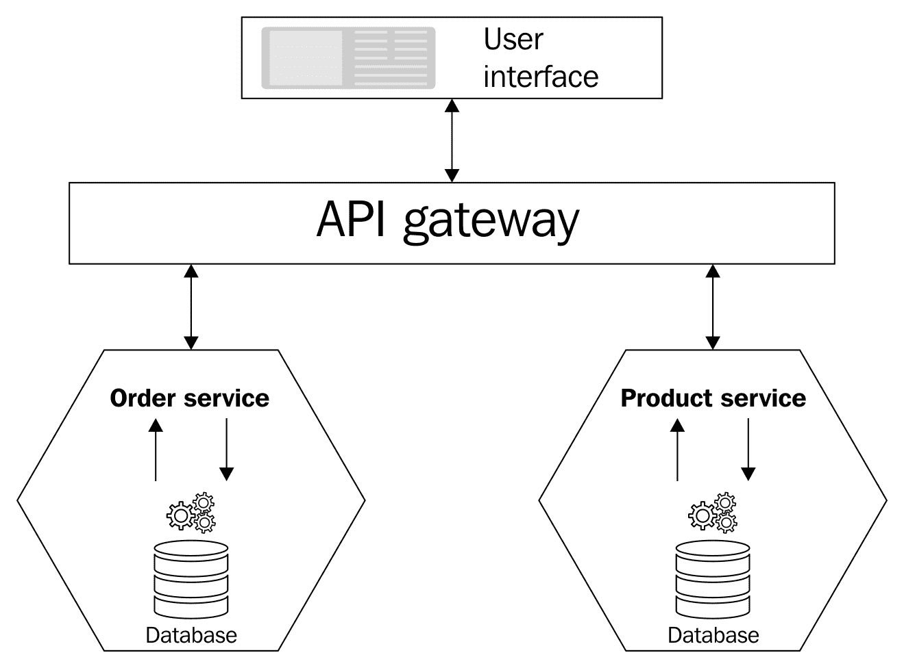

在前面的图表中，我们可以看到我们的 UI 通过**API 网关**与**Order 服务**和**Product 服务**进行交互。这两个服务在物理上是分离的，并且这些服务之间没有直接交互。以这种方式进行的通信也被称为基于**API 网关模式**的通信。

API 网关实际上是一个中间层，通过它 UI 可以与微服务进行交互。它还提供了一个更简单的接口，简化了消费这些服务的流程。它根据需要为不同的客户端提供不同级别的粒度（浏览器和桌面）。

我们可以说，它为移动客户端提供粗粒度 API，为桌面客户端提供细粒度 API，并且它可以在其内部使用高性能网络来提供一些严重的吞吐量。

维基百科对粒度的定义如下([`en.wikipedia.org/wiki/Granularity`](https://en.wikipedia.org/wiki/Granularity))：

“**粒度**是指系统分解成小部分的程度，无论是系统本身、其描述还是观察。它是更大实体细分到何种程度。例如，将码分成英寸的粒度比将码分成英尺的粒度更细。”

粗粒度系统由比细粒度系统更少、更大的组件组成；一个系统的粗粒度描述关注大子组件，而细粒度描述关注由较大组件组成的较小组件。

# API 网关对微服务的益处

毫无疑问，API 网关对微服务是有益的。使用它，你可以做以下事情：

+   通过 API 网关调用服务

+   减少客户端与应用程序之间的往返次数

+   客户端能够在一个地方访问不同的 API，这些 API 由网关进行隔离

它以这种方式为客户端提供灵活性，使他们能够根据需要与不同的服务进行交互。这样，就无需完全或全部公开服务。API 网关是完整 API 管理的一个组件。在我们的解决方案中，我们将使用 Azure API 管理，并在第三章“集成技术和微服务”中进一步解释。

# API 网关与 API 管理的比较

在上一节中，我们讨论了 API 网关如何隐藏实际 API 以防止其客户端直接访问，然后仅将这些客户端的调用重定向到实际 API。API 管理解决方案提供了一个完整的系统来管理其外部消费者的所有 API。所有 API 管理解决方案，例如 Azure API 管理([`docs.microsoft.com/en-us/azure/api-management/`](https://docs.microsoft.com/en-us/azure/api-management/))，都提供了各种功能和能力，例如：

+   设计

+   开发

+   安全性

+   发布

+   可伸缩性

+   监控

+   分析

+   赚钱

# 回顾 Flix One 案例研究

在上一章中，我们查看了一个虚构公司 Flix One Inc.的例子，该公司在电子商务领域运营，并拥有自己的.NET 单体应用：Flix One 书店。我们已经讨论了以下内容：

+   如何隔离代码

+   如何隔离数据库

+   如何对数据库进行反规范化

+   如何开始过渡

+   可用的重构方法

在下一节中，我们将开始编写/过渡.NET 单体应用到一个微服务应用。

# 前提条件

在将我们的单体应用过渡到微服务架构风格时，我们将使用以下工具和技术：

+   Visual Studio 2017 更新 3 或更高版本

+   C# 7.0

+   ASP.NET Core MVC/Web API

+   Entity Framework Core

+   SQL Server 2008R2 或更高版本

# 转向我们的产品服务

我们已经建立了我们的产品模块。我们现在将撤回这个模块，并开始一个新的 ASP.NET Core MVC 项目。为此，请遵循我们在前几节和第一章，*微服务简介*中讨论的所有步骤，让我们来检查我们将使用的技术和数据库：

+   技术栈：我们已经为我们的产品服务选择了这项技术；我们将使用 ASP.NET Core、C#、**Entity framework **(**EF**) 等技术。微服务可以使用不同的技术栈编写，并且可以被由不同技术创建的客户端消费。对于我们的产品服务，我们将选择 ASP.NET Core。

+   数据库：我们在第一章，*微服务简介*中讨论单体应用程序及其数据库隔离时已经讨论过这个问题。在这里，我们将使用 SQL Server，数据库模式将是 `Product` 而不是 `dbo`。

我们的产品数据库是隔离的。我们将在产品服务中使用这个数据库，如下截图所示：

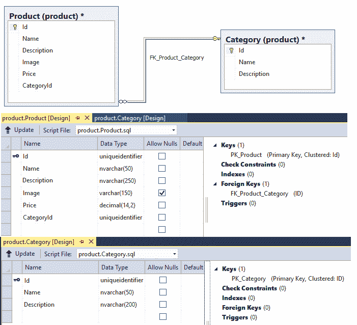

我们为我们的产品服务创建了一个分离的产品数据库。我们没有迁移所有数据。在接下来的章节中，我们将讨论产品数据库迁移。迁移很重要，因为我们有大量的 FlixOne 书店客户现有记录。我们不能忽略这些记录，并且它们需要迁移到我们修改后的结构中。让我们开始吧。

# 迁移

在前一个章节中，我们将产品数据库分离，以确保它只被我们的产品服务使用。我们还选择了我们选择的技术栈来构建我们的微服务（产品服务）。在本节中，我们将讨论如何迁移我们现有的代码和数据库，以确保它们与我们的新架构风格完美匹配。

# 代码迁移

代码迁移不仅仅是将现有单体应用程序中的一层或多层代码提取出来，然后与我们的新创建的 **Product 服务**捆绑在一起。为了实现这一点，你需要实施到目前为止所学的所有内容。在现有的单体应用程序中，我们有一个单一的资源库，它是所有模块共有的，而对于微服务，我们将为每个模块单独创建资源库，并将它们彼此隔离：

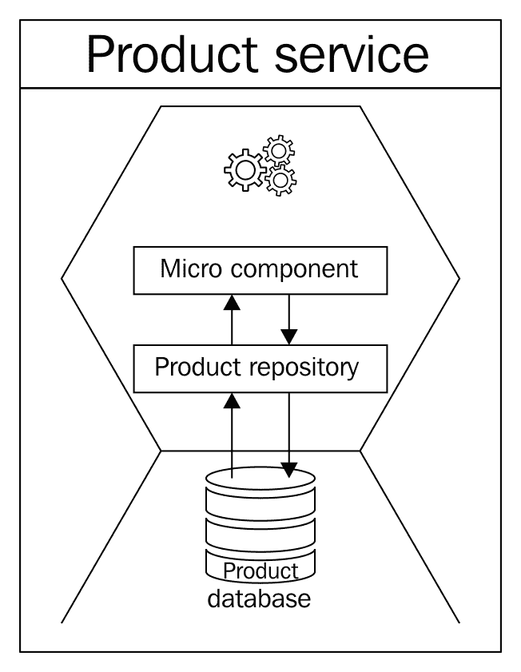

在前面的图像中，**Product service** 有一个 **Product repository**，它进一步与其指定的数据存储（**Product database**）交互。现在我们将更详细地讨论微组件。它们不过是应用程序的独立部分（微服务），即常见的类和业务功能。值得注意的是，**Product repository** 本身就是微服务世界中的一个微组件。

在我们的最终产品服务中，我们将使用 ASP.NET Core 2.0 来完成，我们将使用模型和控制器来创建我们的 REST API。让我们简要地谈谈这两者：

+   模型：这是一个代表产品服务中数据的对象。在我们的案例中，已识别的模型堆叠在产品和类别字段中。在我们的代码中，模型不过是一系列简单的 C# 类。当我们谈论 EF Core 时，它们通常被称为 **Plain Old CLR Objects**（**POCOs**）。POCOs 不过是没有任何数据访问功能的简单实体。

+   控制器：这是一个简单的 C# 类，继承自 `Microsoft.AspNetCore.Mvc` 命名空间中的抽象控制器类。它处理 HTTP 请求，并负责创建要发送回的 HTTP 响应。在我们的 **Product** 服务中，我们有一个处理所有事务的产品控制器。

让我们遵循逐步方法来创建我们的产品服务。

# 创建我们的项目

如前几节已决定，我们将使用 Visual Studio 在 ASP.NET Core 2.0 或 C# 7.0 中创建我们的 `ProductService`。让我们看看完成此操作所需的步骤：

1.  启动 Visual Studio。

1.  通过导航到文件 | 新建 | 项目来创建一个新的项目。

1.  从可用的模板选项中选择 ASP.NET Core Web Application。

1.  将项目名称输入为 `FlixOne.BookStore.ProductService`，然后点击确定。

1.  从模板屏幕，选择 Web Application (Model-View-Controller)，并确保您已从选项中选择 .NET Core 和 ASP.NET Core 2.0，如以下截图所示：

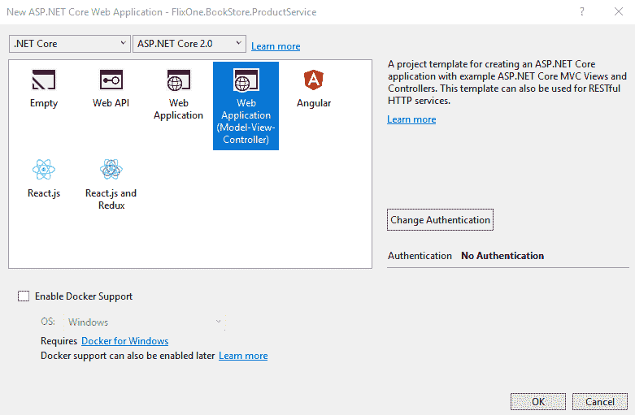

6. 将其余选项保留为默认值并点击确定。

新解决方案应该看起来像以下截图：

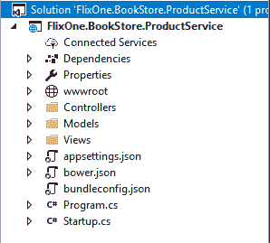

1.  从解决方案资源管理器，右键单击（或按 *Alt* + *Enter*）项目，然后点击属性：

1.  从属性窗口，点击构建并点击高级。语言版本应该是 C#7.0，如以下截图所示：

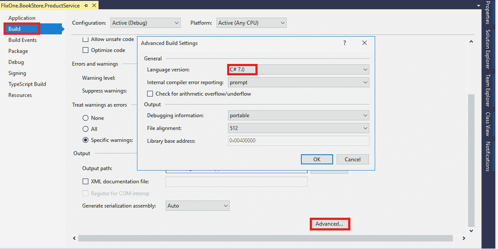

# 添加模型

在我们的单体应用程序中，我们还没有任何模型类。因此，让我们继续添加一个所需的新模型。

要添加新模型，添加一个新文件夹并将其命名为 `Models`。在解决方案资源管理器中，右键单击项目，然后从添加 | 新文件夹中点击选项：

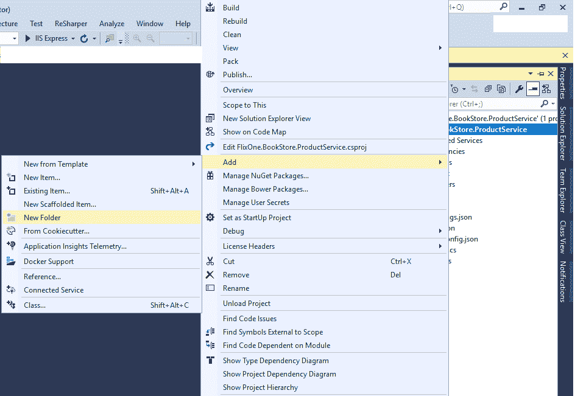

将所有模型类放入名为 `Models` 的文件夹中并没有硬性规定。实际上，我们可以在应用程序项目的任何地方放置我们的模型类。我们遵循这种做法，因为它使得文件夹名称变得自解释。同时，它也容易识别这个文件夹是用于模型类的。

要添加新的产品类别类（这些类将代表我们的 POCOs），请按照以下步骤操作：

1.  右键单击 `Models` 文件夹并选择选项。

1.  添加新项|类。我们将它们命名为 `Product` 和 `Category`。

1.  现在将描述我们产品数据库列名的属性添加到 `Product` 和 `Category` 表中。

关于属性名与表列名匹配没有限制。这只是一种常规做法。

以下代码片段描述了我们的 `Product.cs` 模型类将看起来像什么：

```cs
 namespace FlixOne.BookStore.ProductService.Models
 {
   public class Product
   {
     public Guid Id { get; set; }
     public string Name { get; set; }
     public string Description { get; set; }
     public string Image { get; set; }
     public decimal Price { get; set; }
     public Guid CategoryId { get; set; }
   }
 }
```

以下代码片段显示了我们的 `Category.cs` 模型类将看起来像什么：

```cs
 namespace FlixOne.BookStore.ProductService.Models
 {
   public class Category
   {
     public Category()
     {
       Products = new List<Product>();
     }
     public Guid Id { get; set; }
     public string Name { get; set; }
     public string Description { get; set; }
     public IEnumerable<Product> Products { get; set; }
   }
 }
```

# 添加仓库

在我们的单体应用程序中，整个项目中有一个通用的仓库。在 `ProductService` 中，通过遵循到目前为止学到的所有原则，我们将创建微组件，这意味着包含数据层的独立仓库。

仓库不过是一个简单的 C# 类，它包含从数据库检索数据的逻辑并将其映射到模型。

添加仓库就像遵循以下步骤一样简单：

1.  创建一个新的文件夹并将其命名为 `Persistence`。

1.  添加 `IProductRepository` 接口和一个实现 `IProductRepository` 接口的 `ProductRepository` 类。

1.  再次，我们命名文件夹为 `Persistence`，以遵循易于识别的一般原则。

以下代码片段提供了 `IProductRepository` 接口的一个概述：

```cs
namespace FlixOne.BookStore.ProductService.Persistence
{
  public interface IProductRepository
  {
    void Add(Product product);
    IEnumerable<Product> GetAll();
    Product GetBy(Guid id);
    void Remove(Guid id);
    void Update(Product product);
  }
}
```

以下代码片段提供了 `ProductRepository` 类的一个概述（它还没有任何实现，并且还没有与数据库进行任何交互）：

```cs
 namespace FlixOne.BookStore.ProductService.Persistence
 {
   public class ProductRepository : IProductRepository
   {
     public void Add(Product Product)
     {
       throw new NotImplementedException();
     }
     public IEnumerable<Product> GetAll()
     {
       throw new NotImplementedException();
     }
     public Product GetBy(Guid id)
     {
       throw new NotImplementedException();
     }
     public bool Remove(Guid id)
     {
       throw new NotImplementedException();
     }
     public void Update(Product Product)
     {
       throw new NotImplementedException();
     }
   }
 }
```

# 注册仓库

对于 `ProductService`，我们将使用 ASP.NET Core 内置的依赖注入支持。为此，请按照以下简单步骤操作：

1.  打开 `Startup.cs`。

1.  将仓库添加到 `ConfigureServices` 方法中。它应该看起来像这样：

```cs
public void ConfigureServices(IServiceCollection services)
{
  // Add framework services.
  services.AddMvc();
  services.AddSingleton<IProductRepository, 
  ProductRepository>();
}
```

# 添加产品控制器

最后，我们已经到达了可以继续添加我们的控制器类的阶段。这个控制器实际上将负责对传入的 HTTP 请求做出相应的 HTTP 响应。如果你想知道该怎么做，你可以查看 `HomeController` 类，因为它是由 ASP.NET core 模板提供的默认类。

右键点击 `controllers` 文件夹，选择 Add | New Item 选项，然后选择 Web API Controller Class。将其命名为 `ProductController`。在这里，我们将利用来自单体应用的任何代码/功能。回到旧代码，查看你正在执行的操作；它们可以被借用到我们的 `ProductController` 类中。参考以下截图：

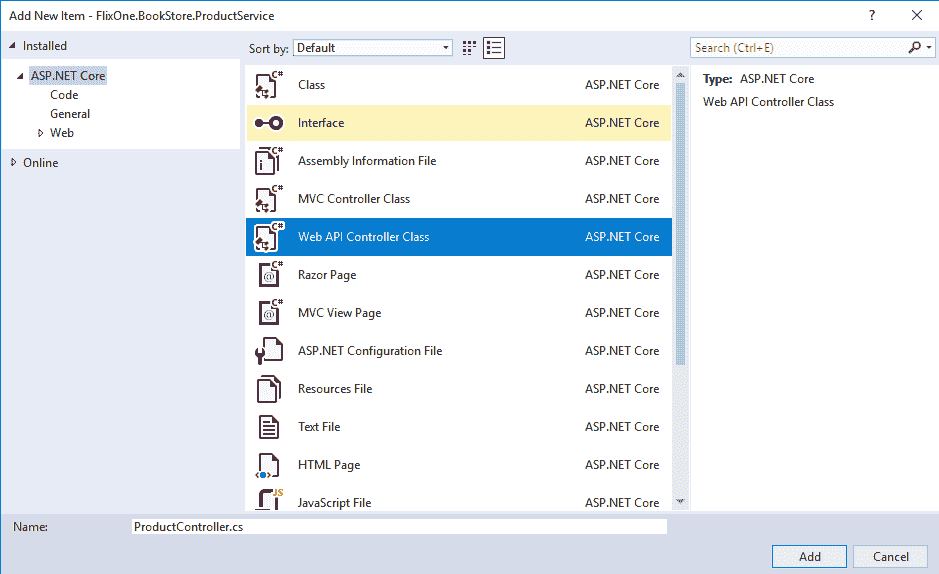

在我们对 `ProductController` 进行了必要的修改后，它应该看起来类似于以下内容：

```cs
 using Microsoft.AspNetCore.Mvc;
 using FlixOne.BookStore.ProductService.Persistence;
 namespace FlixOne.BookStore.ProductService.Controllers
 {
   [Route("api/[controller]")]
   public class ProductController : Controller
   {
     private readonly IProductRepository _ProductRepository;
     public ProductController(IProductRepositoryProductRepository)
     {
       _ProductRepository = ProductRepository;
     }
   }
 }
```

# ProductService API

在我们的单体应用中，对于 `Product` 模块，我们正在执行以下操作：

+   添加一个新的 `Product` 模块

+   更新现有的 `Product` 模块

+   删除现有的 `Product` 模块

+   获取 `Product` 模块

现在我们将创建 `ProductService`；我们需要以下 API：

| **API 资源** | **描述** |
| --- | --- |
| `GET` /`api`/`Product` | 获取产品列表 |
| `GET` /`api`/`Product{id}` | 获取一个产品 |
| `PUT` /`api`/`Product{id}` | 更新现有的产品 |
| `DELETE` /`api`/`Product{id}` | 删除现有的产品 |
| `POST` /`api`/`Product` | 添加一个新的产品 |

# 添加 EF core 支持

在继续之前，我们需要添加 EF 以便我们的服务可以与实际的产品数据库交互。到目前为止，我们没有向我们的存储库添加任何可以与数据库交互的方法。

要添加 EF core 支持，我们需要添加 EF 的核心 `sqlserver` 包（我们添加 `sqlserver` 包是因为我们正在使用 SQL Server 作为我们的数据库服务器）。打开 NuGet 包管理器（工具 | NuGet 包管理器 | 管理 NuGet 包）。

打开 NuGet 包管理器并搜索 `Microsoft.EntityFrameworkCore.SqlServer`：

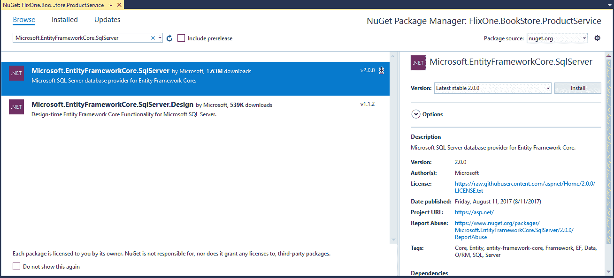

# EF Core DbContext

在前面的部分中，我们为 SQL Server 支持添加了 EF Core 2.0 包；现在我们需要创建一个上下文，以便我们的模型可以与我们的产品数据库交互。我们有产品和分类模型，参考以下列表：

1.  添加一个新的文件夹并将其命名为 `Contexts`—添加新文件夹不是强制性的。

1.  在 `context` 文件夹中，添加一个新的 C# 类并将其命名为 `ProductContext`。我们正在为 `ProductDatabase` 创建 `DbContext`，为了使其在这里相似，我们创建 `ProductContext`。

1.  确保将 `ProductContext` 类继承自 `DbContext` 类。

1.  进行更改，我们的 `ProductContext` 类将看起来像这样：

```cs
 using FlixOne.BookStore.ProductService.Models;
 using Microsoft.EntityFrameworkCore;
 namespace FlixOne.BookStore.ProductService.Contexts
 {
   public class ProductContext : DbContext
   {
     public ProductContext(DbContextOptions<
     ProductContext>options): base(options)
     { }
     public ProductContext()
     { }
     public DbSet<Product> Products { get; set; }
     public DbSet<Category> Categories { get; set; }
   }
 }
```

我们已经创建了上下文，但这个上下文与产品数据库是独立的。我们需要添加一个提供者和连接字符串，以便 `ProductContext` 可以与我们的数据库通信。

1.  再次打开 `Startup.cs` 文件，并在 `ConfigureServices` 方法下添加 `SQL Server db` 提供器以支持我们的 EF Core。一旦添加了提供器的 `ConfigureServices` 方法，我们的 `Startup.cs` 文件将看起来像这样：

```cs
 public void ConfigureServices(IServiceCollection services)
 {
   // Add framework services.
   services.AddMvc();
   services.AddSingleton<IProductRepository, ProductRepository>();
   services.AddDbContext<ProductContext>(o =>o.UseSqlServer
   (Configuration.GetConnectionString("ProductsConnection" )));
 }
```

1.  打开`appsettings.json`文件并添加所需的数据库连接字符串。在我们的提供者中，我们已经将连接密钥设置为`ProductsConnection`。因此，现在添加以下行以使用相同的密钥设置连接字符串（将数据源更改为您的数据源）：

```cs
 {
   "ConnectionStrings": 
   {
     "ProductConnection":
     "Data Source=.SQLEXPRESS;Initial Catalog=ProductsDB;
     IntegratedSecurity=True;MultipleActiveResultSets=True"
   }
 }
```

# EF Core 迁移

尽管我们已经创建了产品数据库，但不应低估 EF Core 迁移的力量。EF Core 迁移将帮助我们执行对数据库的任何未来修改。这种修改可能是简单字段添加或对数据库结构的任何其他更新。我们可以简单地依赖这些 EF Core 迁移命令来为我们进行必要的更改。为了利用这一功能，请按照以下简单步骤操作：

1.  前往工具 | NuGet 包管理器 | 包管理器控制台。

1.  从包管理器控制台运行以下命令：

```cs
Install--Package Microsoft.EntityFrameworkCore.Tools --pre
Install--Package Microsoft.EntityFrameworkCore.Design 
```

1.  要启动迁移，运行以下命令：

```cs
 Add-Migration ProductDB
```

重要的一点是，这应该只在进行一次（当我们还没有通过此命令创建数据库时）。

1.  现在，每当您的模型有任何更改时，只需执行以下命令：

```cs
Update-Database
```

# 数据库迁移

在这个阶段，我们已经完成了`ProductDatabase`的创建。现在，是时候迁移我们现有的数据库了。有许许多多的方法可以做到这一点。我们目前拥有一个庞大的数据库的单体应用程序，其中包含大量的记录。仅使用数据库 SQL 脚本是无法迁移它们的。

我们需要显式地创建一个脚本以迁移包含所有数据的数据库。另一个选择是继续创建所需的 DB 包。根据您数据复杂性和记录的数量，您可能需要创建多个数据包以确保数据正确迁移到我们新创建的数据库`ProductDB`。

# 重新审视仓储和控制器

我们现在准备好通过我们新创建的仓储来促进模型和数据库之间的交互。在适当修改`ProductRepository`后，它将如下所示：

```cs
 using System.Collections.Generic;
 using System.Linq;
 using FlixOne.BookStore.ProductService.Contexts;
 using FlixOne.BookStore.ProductService.Models;
 namespace FlixOne.BookStore.ProductService.Persistence
 {
   public class ProductRepository : IProductRepository
   {
     private readonly ProductContext _context;
     public ProductRepository(ProductContext context)
     {
       _context = context;
     }
     public void Add(Product Product)
     {
       _context.Add(Product);
       _context.SaveChanges();
     }
     public IEnumerable<Product> GetAll() =>
     _context.Products.Include(c => c.Category).ToList();
     //Rest of the code has been deleted
   }
 }
```

# 介绍 ViewModel

在`models`文件夹中添加一个新的类，命名为`ProductViewModel`。我们这样做是因为，在我们的单体应用程序中，每次我们搜索产品时，它应该显示在其产品类别中。为了支持这一点，我们需要将必要的字段纳入我们的视图模型。我们的`ProductViewModel`类将如下所示：

```cs
 using System;
 namespace FlixOne.BookStore.ProductService.Models
 {
   public class ProductViewModel
   {
     public Guid ProductId { get; set; }
     public string ProductName { get; set; }
     public string ProductDescription { get; set; }
     public string ProductImage { get; set; }
     public decimal ProductPrice { get; set; }
     public Guid CategoryId { get; set; }
     public string CategoryName { get; set; }
     public string CategoryDescription { get; set; }
   }
 }
```

# 重新审视产品控制器

最后，我们准备好为`ProductService`创建 REST API。在做出更改后，`ProductController`将如下所示：

```cs
 using System.Linq;
 using FlixOne.BookStore.ProductService.Models;
 using FlixOne.BookStore.ProductService.Persistence;
 using Microsoft.AspNetCore.Mvc;
 namespace FlixOne.BookStore.ProductService.Controllers
 {
   [Route("api/[controller]")]
   public class ProductController : Controller
   {
     private readonly IProductRepository _productRepository;
     public ProductController(IProductRepository 
     productRepository) => _productRepository = productRepository;

    [HttpGet]
    [Route("productlist")]
    public IActionResult GetList() => new
    OkObjectResult(_productRepository.GetAll().
    Select(ToProductvm).ToList());

    [HttpGet]
    [Route("product/{productid}")]
    public IActionResult Get(string productId)
    {
      var productModel = _productRepository.GetBy(new Guid(productId));
      return new OkObjectResult(ToProductvm(productModel));
    }

     //Rest of code has been removed
   }
 }
```

我们已经完成了创建 Web API 所需的所有任务。现在，我们需要调整一些设置，以便客户端可以获取有关我们的 Web API 的信息。因此，在接下来的章节中，我们将向 Web API 文档中添加 Swagger。

# 添加 Swagger 支持

我们在我们的 API 文档中使用 Swagger。在这里，我们不会深入 Swagger 的细节（更多信息，请参阅[`docs.microsoft.com/en-us/aspnet/core/tutorials/web-api-help-pages-using-swagger`](https://docs.microsoft.com/en-us/aspnet/core/tutorials/web-api-help-pages-using-swagger))。

Swagger 是一个开源且著名的库，为 Web API 提供文档。有关更多信息，请参阅官方链接，[`swagger.io/`](https://swagger.io/)。

使用 Swagger 添加文档非常简单。按照以下步骤操作：

1.  打开 NuGet 包管理器。

1.  搜索`Swashbuckle.AspNetCore`包。

1.  选择包然后安装包：

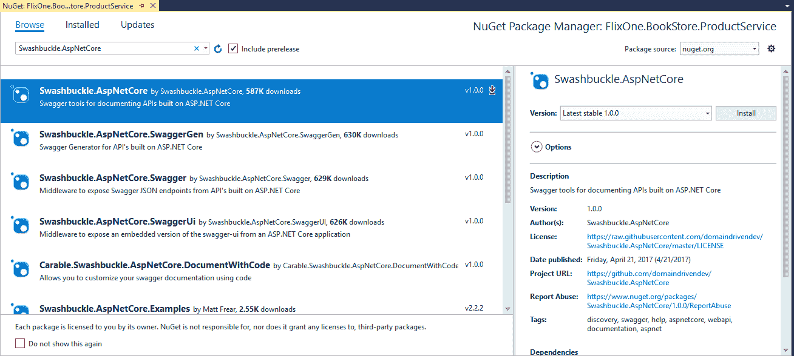

1.  它将安装以下内容：

    +   Swashbuckle.AspNetCore

    +   Swashbuckle.AspNetCore.Swagger

    +   Swashbuckle.AspNetCore.SwaggerGen

    +   Swashbuckle.AspNetCore.SwaggerUI

这在下面的屏幕截图中显示：


1.  打开`Startup.cs`文件，移动到`ConfigureServices`方法，并添加以下行以注册 Swagger 生成器：

```cs
services.AddSwaggerGen(swagger =>
{
  swagger.SwaggerDoc("v1", new Info 
  { Title = "Product APIs", Version = "v1" });
});
```

1.  接下来，在`Configure`方法中添加以下代码：

```cs
app.UseSwagger();
app.UseSwaggerUI(c =>
{
  c.SwaggerEndpoint("/swagger/v1/swagger.json", 
  "My API V1");
});

```

1.  按*F5*运行应用程序；您将获得一个默认页面。

1.  通过在 URL 中添加 swagger 来打开 Swagger 文档。因此，URL 将是`http://localhost:43552/swagger/`：

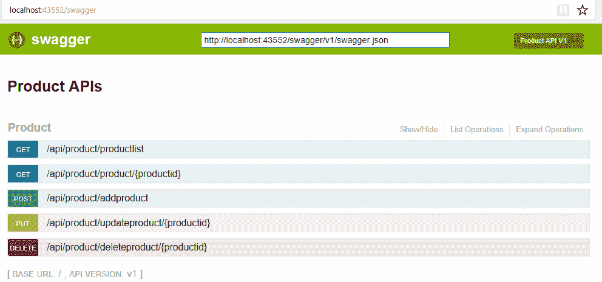

上一张图像显示了产品 API 资源，您可以在 Swagger 文档页面中尝试这些 API。

最后，我们已经完成了我们的单体.NET 应用程序向微服务的过渡，并讨论了`ProductService`的逐步过渡。对于此应用程序还有更多步骤要来：

+   微服务如何通信：这将在*第三章，集成技术和微服务*中讨论。

+   如何测试微服务：这将在**第四章，测试微服务**中讨论。

+   部署微服务：这将在*第五章，部署微服务*中讨论。

+   如何确保我们的微服务安全，以及监控微服务：这将在*第六章，确保微服务安全*和*第七章，监控微服务*中讨论。

+   微服务如何扩展：这将在*第八章，扩展微服务*中讨论。

# 摘要

在本章中，我们讨论了可以用于在高级别识别和隔离微服务的不同因素。我们还讨论了良好服务的各种特征。在谈论领域驱动设计（DDD）时，我们学习了它在微服务环境中的重要性。

此外，我们详细分析了如何通过各种参数正确实现微服务的垂直隔离。我们试图借鉴我们对单体应用带来的挑战及其在微服务中的解决方案的先前理解，并了解到我们可以利用模块间的依赖性、技术利用率和团队结构来识别接口，并有序地将单体架构过渡到微服务架构。

显然，数据库在这个过程中可能构成一个明显的挑战。然而，我们确定了如何使用简单策略和可能的实施方法来执行此过程。然后我们确定，通过减少/移除外键，事务可以以完全不同的方式处理。

从单体过渡到边界上下文，我们进一步将我们的知识应用于将 FlixOne 应用程序过渡到微服务架构。
