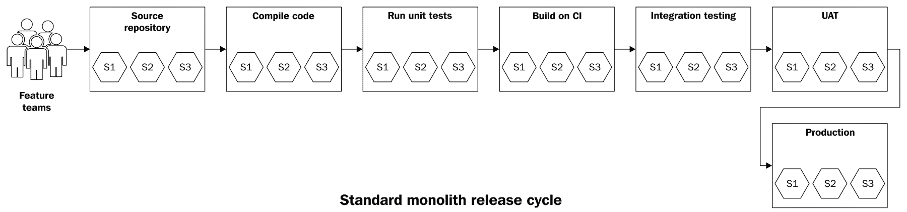
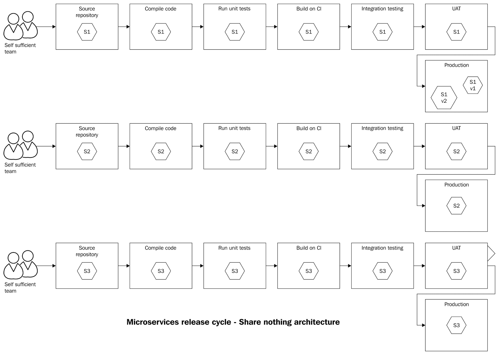
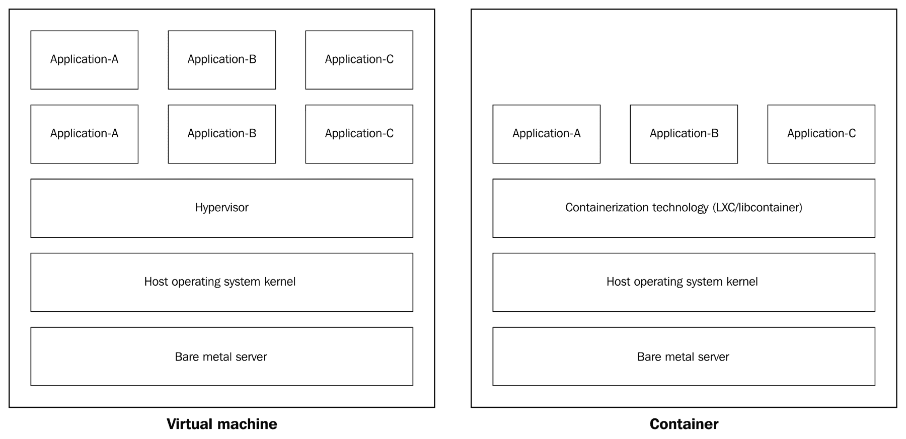
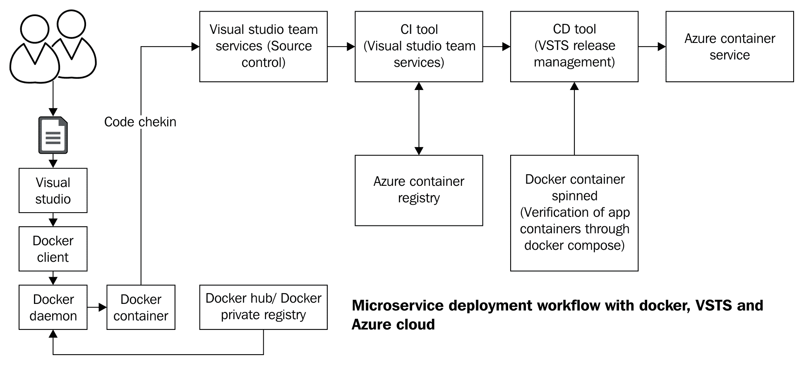
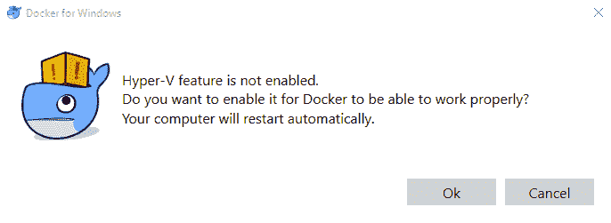
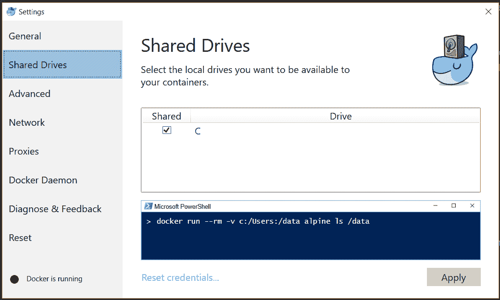
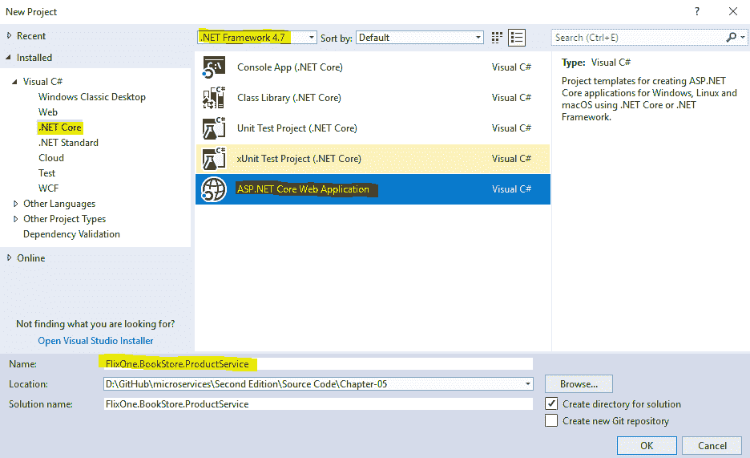
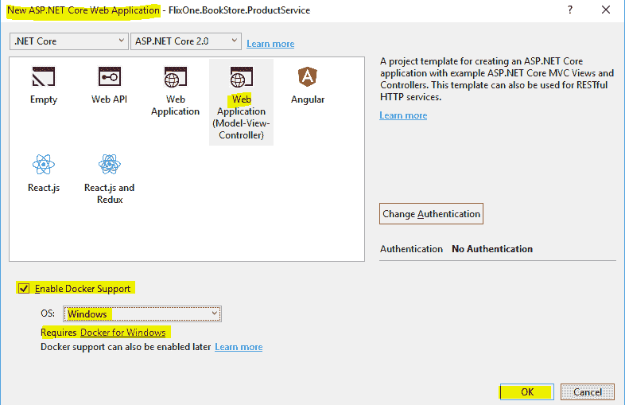
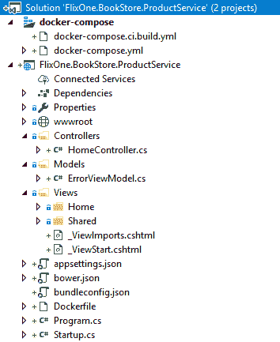
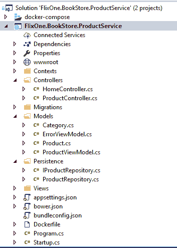

# 第五章：微服务部署

单体和微服务架构风格都伴随着不同的部署挑战。在.NET 单体应用的情况下，部署通常是一种 Xcopy 部署的变体。微服务部署则带来了一组不同的挑战。持续集成和持续部署是交付微服务应用时的关键实践。此外，承诺提供更大隔离边界的容器技术和工具链技术对于微服务部署和扩展至关重要。

在本章中，我们将讨论微服务部署的基本原理以及 CI/CD 工具和容器等新兴实践对微服务部署的影响。我们还将演示如何在 Docker 容器中部署一个简单的.NET Core 服务。

到本章结束时，你将了解以下主题：

+   部署术语

+   成功微服务部署的因素有哪些？

+   什么是持续集成和持续部署？

+   微服务部署的隔离要求

+   容器化技术及其在微服务部署中的需求

+   Docker 快速入门

+   如何使用 Visual Studio 将应用程序打包为 Docker 容器

在进一步讨论之前，我们首先应该了解为什么我们要讨论微服务的部署。部署周期是一个具有特定流程的过程。

# 单体应用部署的挑战

单体应用是所有数据库和业务逻辑都绑定在一起并打包为一个单一系统的应用。由于通常单体应用以单个包的形式部署，因此部署相对简单，但以下原因使得部署变得痛苦：

+   部署和发布作为一个单一概念：部署构建工件和实际上向最终用户提供功能之间没有区别。更常见的是，发布与其环境相关联。这增加了部署新功能的风险。

+   全有或全无部署：全有或全无部署增加了应用停机时间和失败的风险。在回滚的情况下，团队未能交付预期的新的功能或热修复，或者必须发布服务包以提供正确类型的功能。

**热修复**，也称为**快速修复**，是一个单一或累积的包（通常称为**补丁**）。它包含对生产中发现的问题/错误进行的修复，这些错误必须在下一个主要版本发布之前得到解决。

+   中央数据库作为单一故障点：在单体应用中，一个庞大且集中的数据库是单一故障点。这个数据库通常相当大且难以分解。这导致**平均恢复时间**（**MTTR**）和**平均故障间隔时间**（**MTBF**）的增加。

+   部署和发布是重大事件：由于应用程序中的微小变化，整个应用程序可能会被部署。这对开发者和运维团队来说需要巨大的时间和精力投入。不用说，涉及到的各个团队之间的协作是成功发布的关键。当许多分布在全球的团队在进行开发和发布工作时，这变得更加困难。这类部署/发布需要大量的指导和手动步骤。这影响了最终用户，他们必须面对应用程序的停机。如果你熟悉这类部署，那么你也会熟悉所谓的“战室”中的马拉松会议和会议桥上的缺陷分类无休止的会议。

+   市场投放时间：在这种情况下，对系统进行任何更改都变得更加困难。在这种环境中，执行任何业务变更都需要时间。这使得对市场力量的反应变得困难——企业也可能失去其市场份额。使用微服务架构，我们正在解决这些挑战之一。这种架构为服务部署提供了更大的灵活性和隔离性。它已被证明可以提供更快的周转时间和急需的业务敏捷性。

# 理解部署术语

微服务部署术语仅包括从代码更改开始直到发布的步骤。在本节中，我们将按以下方式讨论所有这些部署术语的步骤：

+   **构建**：在构建阶段，服务源代码在没有错误的情况下编译，并且所有相应的单元测试都通过。这一阶段产生构建工件。

+   **持续集成**（**CI**）：每次开发者提交任何更改时，CI 都会强制整个应用程序重新构建——应用程序代码被编译，并对其运行一系列全面的自动化测试。这种做法源于大型团队中频繁集成代码的问题。基本思想是保持软件更改的增量或更改尽可能小。这提供了软件处于可工作状态的信心。即使开发者的提交破坏了系统，也可以通过这种方式轻松修复。

+   **部署**：硬件配置和安装基础操作系统以及正确的.NET 框架版本是部署的先决条件。接下来是将其构建工件在生产环境中通过各个阶段进行推广。这两部分的组合被称为部署阶段。在大多数单体应用程序中，部署阶段和发布阶段之间没有区别。

+   **持续部署**（**CD**）：在持续部署中，每个成功的构建都会被部署到生产环境中。从技术团队的角度来看，CD 更为重要。在持续部署的框架下，还有其他一些实践，例如自动单元测试、标记、构建号的版本控制和变更的可追溯性。通过持续交付，技术团队确保通过各个低级环境推送到生产环境中的变更能够按预期工作。通常，这些变更很小，部署速度很快。

+   **持续交付**：持续交付与 CD 不同。CD 来自技术团队的角度，而持续交付更侧重于尽可能早地将部署的代码提供给客户。为了确保客户获得无缺陷的正确产品，在持续交付中，每个构建都必须通过所有的质量保证检查。一旦产品通过满意的质量验证，何时发布就是业务利益相关者的决定。

+   **构建和部署管道**：构建和部署管道是自动化实现持续交付的一部分。它是一系列步骤的流程，代码通过源代码库提交。在部署管道的另一端，生成发布所需的工件。构建和部署管道可能包含的步骤如下：

    1.  单元测试

    1.  集成测试

    1.  代码覆盖率与静态分析

    1.  回归测试

    1.  部署到预发布环境

    1.  压力/负载测试

    1.  部署到发布仓库

+   **发布**：提供给最终用户的企业功能被称为功能的发布。为了发布功能或服务，应事先部署相关的构建工件。通常，功能开关管理功能的发布。如果功能标志（也称为功能切换）在生产环境中未开启，则称为指定功能的暗色发布。

# 成功部署微服务的先决条件

任何架构风格都伴随着一系列要遵循的关联模式和惯例。微服务架构风格也不例外。采用以下实践，微服务实现成功的可能性更大：

+   自给自足的团队：作为 SOA 和微服务架构的先驱，亚马逊遵循**两披萨团队**模式。这意味着一个微服务团队通常不会超过 7-10 名成员。这些团队成员将拥有所有必要的技能和角色；例如，开发、运维和业务分析师。这样的服务团队负责微服务的开发、运维和管理。

+   持续集成和持续部署：CI 和 CD 是实现微服务的先决条件。能够频繁集成工作的较小、自给自足的团队是微服务成功的前提。这种架构并不像单体架构那样简单。然而，自动化和定期推送代码升级的能力使团队能够处理复杂性。Team Foundation Online Services（**TFS**）、TeamCity 和 Jenkins 等工具在这个领域非常受欢迎。

+   基础设施即代码：将硬件和基础设施组件，如网络，用代码表示的想法是新的。这有助于使部署环境，如集成、测试和生产，看起来完全相同。这意味着开发人员和测试工程师将能够在较低的环境中轻松地重现生产缺陷。使用 CFEngine、Chef、Puppet、Ansible 和 PowerShell DSC 等工具，您可以编写整个基础设施的代码。随着这种范式转变，您还可以将基础设施置于版本控制系统之下，并以部署工件的形式进行分发。

+   云计算的应用：云计算是采用微服务的强大催化剂。尽管如此，它对于微服务部署并不是强制性的。云计算具有近乎无限的规模、弹性和快速供应能力。云是微服务的天然盟友。因此，对 Azure 云的知识和经验将帮助您采用微服务。

# 微服务部署的隔离要求

2012 年，Heroku 平台联合创始人亚当·威金斯提出了 12 项基本原则。这些原则讨论了从想法到部署定义新的现代 Web 应用程序。这套原则现在被称为**12 因子应用**。这些原则为新架构风格铺平了道路，这些风格演变成了微服务架构。12 因子应用的原则之一如下：

“将应用程序作为一个或多个无状态进程执行”

- 亚当·威金斯 ([`12factor.net/`](https://12factor.net/))

因此，服务将基本上是无状态的（除了数据库，它充当状态存储）。*无共享*原则也应用于整个模式和惯例的范围内。这不过是组件隔离以实现规模和敏捷性的手段。

在微服务世界中，这一隔离原则被应用于以下方式：

+   服务团队：将围绕服务建立自给自足的团队。实际上，这些团队将能够做出所有必要的决策，以开发和支持他们负责的微服务。

+   源代码隔离：每个微服务的源代码库将是独立的。它不会共享任何源代码、文件等。在微服务世界中，跨服务复制少量代码是可以接受的。

+   构建阶段隔离：每个微服务的构建和部署管道应该保持隔离。构建和部署管道甚至可以并行运行，独立部署服务。因此，CI-CD 工具应该扩展以支持不同服务和管道，速度要快得多。

+   发布阶段隔离：每个微服务都应该与其他服务隔离发布。也可能存在同一服务不同版本在生产环境中的情况。

+   部署阶段隔离：这是隔离最重要的部分。传统的单体部署使用裸金属服务器。随着虚拟化的进步，虚拟服务器已经取代了裸金属服务器。

通常，单体应用程序的标准发布流程如下：



考虑到这些隔离级别，微服务的构建和部署管道可能看起来是这样的：



# 需要新的部署范式

通过添加新的物理机或裸金属服务器，可以实现应用程序的最高隔离级别，因此有一个拥有自己操作系统的服务器来管理所有系统资源。这在传统应用程序中是常规操作，但对于现代应用程序来说并不实用。现代应用程序是庞大的系统。这些系统的例子包括亚马逊、Netflix 和耐克，甚至是传统的金融机构，如 ING。这些系统托管在成千上万的服务器上。这类现代应用程序需要超强的可扩展性来服务数百万用户。对于微服务架构，仅仅为了在上面运行一个小服务而设置新的服务器是没有意义的。

随着新的 CPU 架构突破，出现的一个选项是虚拟机。虚拟机通过虚拟化技术抽象出操作系统的所有硬件交互。虚拟化技术使我们能够在单个物理机上运行多个机器或服务器。需要注意的是，所有虚拟机都从物理主机资源中获取其独立系统资源的一部分。

这仍然是一个良好的隔离环境来运行应用程序。虚拟化带来了为整个应用程序提升服务器的合理性。在这样做的同时，它保持了组件的相对隔离；这有助于我们利用数据中心中的备用计算机资源。它提高了我们数据中心的效率，同时满足了应用程序的合理隔离需求。

然而，仅仅虚拟化本身并不能满足微服务的一些需求。根据 12 要素原则，亚当也谈到了这一点：

“十二要素应用程序的过程是可丢弃的，这意味着它们可以随时启动或停止。这促进了快速弹性扩展、代码或配置更改的快速部署，以及生产部署的健壮性。”

- 亚当·威金斯 ([`12factor.net/`](https://12factor.net/))

这个原则对于微服务架构风格非常重要。因此，在使用微服务时，我们必须确保服务能够更快地启动。在这种情况下，让我们假设每个虚拟机运行一个服务。如果我们想启动这个服务，首先需要启动虚拟机；然而，虚拟机的启动时间很长。还有一点是，对于这类应用程序，我们谈论的是大量的集群部署。因此，服务肯定会在集群中分布。

这也意味着虚拟机可能需要在集群中的某个节点上启动。这又是虚拟机启动时间的问题。这并没有带来我们期望的微服务效率。

现在，唯一剩下的选择是使用操作系统进程模型，这具有更快的启动时间。进程编程模型早已为人所知，但即使是进程也有成本。它们没有很好地隔离，并且共享系统资源以及操作系统的内核。

对于微服务，我们需要更好的隔离部署模型和新的部署范式。答案是：容器技术的创新。一个值得考虑的因素是，容器技术很好地位于虚拟化和操作系统进程模型之间。

# 容器

容器技术在 Linux 世界中并不新鲜。容器基于 Linux 的 LXC 技术。在本节中，让我们看看容器在微服务场景中的重要性。

# 容器是什么？

容器是一个包含完整文件系统的软件组件。它包含运行代码、运行时、系统工具和系统库所需的一切——任何可以安装在服务器上的东西。这保证了软件将始终以相同的方式运行，无论其环境如何。容器与同一主机上的其他容器共享宿主操作系统和内核。容器周围的技术并不新鲜。它已经很长时间是 Linux 生态系统的一部分。由于最近围绕基于微服务的讨论，容器技术再次受到关注。此外，它是谷歌、亚马逊和 Netflix 运行的技术。

# 容器相对于虚拟机的适用性

让我们了解容器和虚拟机之间的区别——在表面层面上，两者都是实现隔离和虚拟化的工具。

从以下图表中可以清楚地看出虚拟机和容器之间的架构差异：



通过查看虚拟机的内部结构，我们可以看到有一个宿主操作系统以及内核，在其之上是虚拟化层。托管的应用程序必须引入它们自己的操作系统和环境。然而，在容器中，容器化技术层作为一个单独的层，被不同应用程序共享。这消除了对客户操作系统的需求。因此，容器中的应用程序具有更小的占用空间和强大的隔离级别。另一个鼓励你使用容器进行微服务部署的方面是，与在虚拟机上部署相同的应用程序相比，我们可以在同一台物理机器上打包更多的应用程序。这有助于我们实现更大的规模经济优势，并提供了虚拟机优势的比较。

关于容器，还有一点需要注意，那就是它们也可以在虚拟机上运行。因此，拥有一个物理服务器并在其上运行虚拟机是可以的。这个虚拟机作为多个容器的宿主。

# 运营团队思维模式的转变

微软的比尔·贝克提出了宠物和牛的类比，并将其应用于数据中心的服务器。好吧，说实话，我们关心我们的宠物。我们爱它们，对它们表示关爱，我们还给它们起名字。我们考虑它们的卫生；如果它们生病了，我们会带它们去看兽医。我们会这样关心我们的牛吗？当然不会；这是因为我们对牛并不那么关心。

这个类比在服务器和容器方面也是适用的。在 DevOps 之前的日子，服务器管理员关心服务器。他们过去会给那些服务器机器起名字，并且有专门的维护停机时间等等。随着 DevOps 实践，如基础设施即代码和容器化，容器可以被当作牛来对待。作为运维团队，我们不需要关心它们，因为容器意味着短暂的寿命。它们可以在集群中快速启动，也可以快速拆除。当你处理容器时，始终记住这个类比。在日常工作运营中，预期容器的启动和拆除是正常做法。

这个类比改变了我们对微服务部署及其如何支持容器化的看法。

# 容器是新的二进制文件

这是你作为.NET 开发者将面临的新现实：与微服务一起工作。容器是新的二进制文件。使用 Visual Studio，我们编译.NET 程序，编译后，Visual Studio 生成.NET 程序集，即 DLL 或 EXE 文件。我们收集编译器生成的这些相关的 DLL 和 EXE 文件，并将它们部署到服务器上。

"容器是新的部署二进制文件"

- 史蒂夫·拉斯克，微软高级项目经理

简而言之，我们的部署单元以前是以程序集的形式存在的。现在不再是了！好吧，我们仍然有 .NET 程序生成 EXEs 和 DLLs，但在微服务世界中，我们的部署单元已经改变。现在它是一个容器。我们仍然会将程序编译成程序集。这些程序集将被推送到容器中，并准备好进行部署。

当我们在本章下一节查看代码遍历时，你会理解这个观点。作为 .NET 开发者，我们有能力（也许可以说必要性）来部署容器。此外，容器部署的另一个优点是它消除了不同操作系统甚至不同语言和运行时之间的障碍。

# 它在你的机器上工作吗？让我们把你的机器也运走吧！

通常，我们经常从开发者那里听到这样的话：“嗯，在我的机器上它工作得很好！”这通常发生在生产环境中无法复制的缺陷出现时。由于容器是不可变和可组合的，消除开发和生产环境之间的配置阻抗是完全可能的。

# 介绍 Docker

Docker（www.docker.com）是推动应用程序容器化普及的主要力量。Docker 对于容器来说，就像 Google 对于搜索引擎一样。有时，人们甚至将容器和 Docker 视为同义词。微软与 Docker 合作，并积极为 Docker 平台和开源工具做出贡献。这使得 Docker 对于我们这些 .NET 开发者来说非常重要。

Docker 是一个非常重要的主题，对于任何严肃的 .NET 开发者来说都足够重要。然而，由于时间和范围的限制，我们在这里只会对 Docker 生态系统进行简要介绍。我们强烈建议你阅读 Packt 出版公司提供的 Docker 书籍。

如果你想在不需要在机器上安装 Docker 的情况下安全地尝试和学习 Docker，你可以通过 [`KataCoda.com`](https://www.katacoda.com/) 来实现。

现在，让我们关注 Docker 平台的一些术语和工具。这将是我们的下一节所必需的：

+   Docker 镜像：Docker 的 *镜像* 是一个只读模板，包含创建 Docker 容器的指令。Docker 镜像由一个独立的文件系统、相关库等组成。在这里，镜像始终是只读的，并且可以运行完全相同的抽象、底层、主机差异。Docker 镜像可以由一个层叠加在另一个层之上。Docker 镜像的可组合性可以与分层蛋糕的类比相比较。用于不同容器的 Docker 镜像可以被重用。这也帮助减少了使用相同基础镜像的应用程序的部署足迹。

+   Docker 仓库：Docker 仓库是一个镜像库。仓库可以是公开的，也可以是私有的。此外，它可以是与 Docker 守护进程或 Docker 客户端在同一服务器上，或者完全在不同的服务器上。

+   Docker hub：这是一个公共仓库，它存储镜像。它位于 [`hub.docker.com`](http://hub.docker.com/)。

+   Dockerfile：Dockerfile 是一个包含构建 Docker 镜像指令的构建或脚本文件。Dockerfile 中可以记录多个步骤，从获取基础镜像开始。

+   Docker 容器：Docker 容器是 Docker 镜像的可运行实例。

+   Docker compose：Docker compose 允许您在单个文件中定义应用程序的组件——它们的容器、配置、链接和卷。然后，一个命令将设置一切并启动您的应用程序。它是您应用程序的架构/依赖关系图。

+   Docker swarm：Swarm 是 Docker 服务，通过它容器节点协同工作。它运行一个副本任务的定义实例，该任务本身是一个 Docker 镜像。

让我们来看看 Docker 生态系统中的各个组件；让我们尝试理解 Docker 工作流程在软件开发生命周期中合理性的其中一种方式。

# Docker 微服务部署概述

为了支持此工作流程，我们需要一个 CI 工具和一个配置管理工具。为了说明目的，我们选择了 **Visual Studio Team Services** (**VSTS**) 构建服务作为 CI 和 VSTS 发布管理以实现持续交付。对于任何其他工具或部署模式，工作流程都将保持不变。以下是一种 Docker 微服务部署的变体：

1.  代码已提交到 VSTS 仓库。如果这是项目的第一次提交，它将与项目的 Dockerfile 一起完成。

1.  前面的检查触发 VSTS 从源代码构建服务并运行单元/集成测试。

1.  如果测试成功，VSTS 将构建一个 Docker 镜像，并将其推送到 *Docker 仓库*。VSTS 发布服务将镜像部署到 Azure 容器服务。

1.  如果 QA 测试也通过，则使用 VSTS 将容器提升到部署并启动它在生产中。

以下图表详细描述了步骤：



注意，通常的 .NET CI-CD 工具，如 TeamCity 和 Octopus Deploy（功能处于 alpha 阶段），具有生成 Docker 容器作为构建工件并将其部署到生产的特性。

# 使用 Docker 的微服务部署示例

现在我们已经拥有了迈向编码并亲自查看事物如何工作的所有必需品。我们在这里选择了产品目录服务示例，以作为 Docker 容器部署。在运行相关的源代码之后，您应该能够在 Docker 容器中成功运行产品目录服务。

# 在您的机器上设置 Docker

本教程不需要任何现有的 Docker 知识，并且应该花费大约 20 或 30 分钟来完成。

# 前置条件

您需要执行以下操作：

1.  安装 Microsoft Visual Studio 2017 Update 3 ([`www.visualstudio.com/downloads/download-visual-studio-vs`](https://www.visualstudio.com/downloads/download-visual-studio-vs))

1.  安装 .NET Core 2.0 ([`www.microsoft.com/net/download/core`](https://www.microsoft.com/net/download/core)[)](https://go.microsoft.com/fwlink/?LinkID=827546)

1.  安装 Docker For Windows 以在本地运行 Docker 容器 ([`www.docker.com/products/docker#/windows`](https://www.docker.com/products/docker#/windows))

我们使用 Docker Community Edition for Windows 来演示示例。

1.  安装完成后，您的系统需要重启以完成安装。

1.  重启后，如果您的系统尚未启用 Hyper-V 功能，Docker for Windows 将提示您启用该功能。点击“确定”以在您的系统上启用 Hyper-V 功能（需要重启系统）。参考以下截图：



1.  Docker for Windows 安装完成后，在系统托盘中的 Docker 图标上右键单击，然后点击“设置”并选择“共享驱动器”：



# 创建 ASP.NET Core Web 应用程序

以下是开始使用的简单步骤：

1.  通过导航到“文件”|“新建项目”|“.NET Core”|选择 ASP.NET Core Web 应用程序来创建一个新项目，参考以下截图：



1.  在“新建 ASP.NET Core Web 应用程序”窗口中，选择 .NET Core 和 ASP.NET Core 2.0。

1.  从可用的模板中选择 Web 应用程序（模型-视图-控制器）。

1.  检查“启用 Docker 支持”。

1.  由于我们是在 Windows 上进行演示，请选择操作系统为 Windows（如果您没有按照上一节所述安装 Docker，那么您需要安装 Docker for Windows）。

1.  点击“确定”继续，参考以下截图：



上述步骤将创建具有 Docker 支持的 `FlixOne.BookStore.ProductService` 项目。以下是我们项目结构的截图：



以下文件被添加到项目中：

+   `Dockerfile`：ASP.NET Core 应用程序的 Dockerfile 基于 `microsoft/aspnetcore` 镜像 ([`hub.docker.com/r/microsoft/aspnetcore/`](https://hub.docker.com/r/microsoft/aspnetcore/))。此镜像包含预编译的 ASP.NET Core NuGet 包，这提高了启动性能。当构建 ASP.NET Core 应用程序时，Dockerfile 的 FROM 指令（命令）指向 Docker Hub 上的最新 `microsoft/dotnet` 镜像 ([`hub.docker.com/r/microsoft/dotnet/`](https://hub.docker.com/r/microsoft/dotnet/))）。以下是由模板提供的默认代码片段：

```cs
FROM microsoft/aspnetcore:2.0
ARG source
WORKDIR /app
EXPOSE 80
COPY ${source:-obj/Docker/publish} .
ENTRYPOINT ["dotnet", "FlixOne.BookStore.ProductService.dll"]
```

上述代码基本上是一组指令，这些指令如下：

`FROM` 告诉 Docker 从现有镜像中拉取基础镜像，调用 `microsoft/aspnetcore:2.0`。这个镜像已经包含了在 Linux 上运行 ASP.NET Core 所需的所有依赖项，因此我们不需要设置它。

`COPY` 和 `WORKDIR` 将当前目录的内容复制到被调用/app 容器内部的新目录中，并将其设置为后续指令的工作目录。

`EXPOSE` 告诉 Docker 在容器的 80 端口上公开产品目录服务。

`ENTRYPOINT` 指定了容器启动时执行的命令。在这种情况下，是 .NET。

+   `Docker-compose.yml`：这是用于定义要使用 `Docker-compose` build/run 构建和运行的镜像集合的基本 Compose 文件。

+   `Docker-compose.dev.debug.yml`：这是一个额外的 Compose 文件，用于在配置设置为调试时进行迭代更改。Visual Studio 将调用 `-f docker-compose.yml` 和 `-f docker-compose.dev.debug.yml` 来合并它们。此 Compose 文件由 Visual Studio 开发工具使用。

+   `Docker-compose.dev.release.yml`：这是一个额外的 Compose 文件，用于调试您的发布定义。它将在隔离模式下加载调试器，因此不会更改生产镜像的内容。

`docker-compose.yml` 文件包含在项目运行时创建的镜像名称。

我们现在拥有运行/启动 Docker 容器中我们的服务所需的一切。在继续之前，请参阅第二章，*实现微服务*，并添加完整的代码（即控制器、存储库等），以便项目结构看起来像以下截图：



现在你只需按 *F5* 键并在容器中启动你的服务。这是将服务放入容器中最简单、最直接的方法。一旦你的微服务被容器化，你可以使用 Visual Studio 团队服务和 Azure 容器服务将容器部署到 Azure 云中（[`docs.microsoft.com/en-us/azure/container-service/dcos-swarm/container-service-deployment`](https://docs.microsoft.com/en-us/azure/container-service/dcos-swarm/container-service-deployment)）。

# 摘要

微服务部署对我们来说是一次激动人心的旅程。为了成功交付微服务，应遵循部署的最佳实践。在我们讨论使用自动化工具进行部署之前，我们需要关注实现微服务的隔离要求。通过成功的微服务部署实践，我们可以快速交付业务变更。从自给自足的团队到持续交付的不同隔离要求，为微服务提供了基本承诺的规模和敏捷性。容器化到目前为止是我们拥有的最重要的创新技术之一，我们必须利用它来进行微服务部署。将 Azure 云与 Docker 结合使用将帮助我们实现我们期望的微服务的规模和隔离。有了 Docker，我们可以轻松实现更高的应用程序密度，这意味着我们云基础设施成本的降低。我们还看到了如何使用 Visual Studio 和 Windows 的 Docker 工具轻松启动这些部署。

在我们接下来的章节中，我们将探讨微服务安全。我们将讨论用于身份验证的 Azure 活动目录，如何利用 OAuth 2.0，以及如何使用 Azure API 管理来保护 API 网关。
