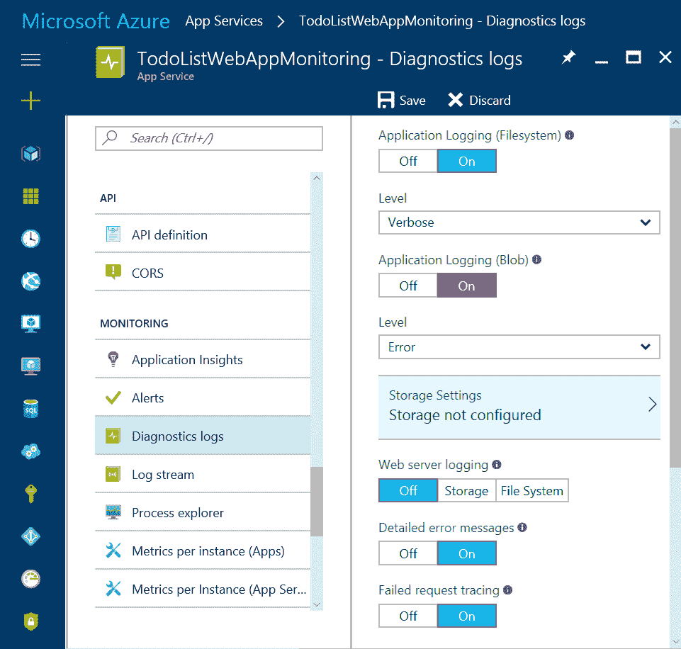

# 第七章：微服务监控

当系统出现问题时，利益相关者将想知道发生了什么，为什么会发生，你可以提供的任何提示或线索来修复它，以及如何防止未来再次发生相同的问题。这是监控的主要用途之一。然而，监控还能做更多。

在.NET 单体应用中，有多个监控解决方案可供选择。监控目标是始终集中的，监控设置和配置当然也很容易。如果出现问题，我们知道该寻找什么以及在哪里寻找，因为只有有限数量的组件参与系统，并且它们有相当长的生命周期。

然而，微服务是分布式系统，并且从本质上讲比单体应用更复杂。因此，在微服务生产环境中，资源利用、健康和性能监控是相当关键的。我们可以使用这些诊断信息来检测和纠正问题，同时也可以发现潜在的问题并防止其发生。监控微服务面临着不同的挑战。在本章中，我们将主要讨论以下主题：

+   监控的需求

+   微服务中的监控和日志记录挑战

+   监控策略

+   .NET 监控空间中可用的工具和策略

+   使用 Azure 诊断和应用程序洞察

+   ELK 堆栈和 Splunk 的简要概述

监控究竟意味着什么？没有正式的监控定义；然而，以下定义是合适的：

“监控提供了关于整个系统或系统不同部分在运行环境中的行为信息。这些信息可用于诊断并深入了解系统的不同特性。”

# 仪表化和遥测

监控解决方案依赖于仪表化和遥测。因此，当我们谈论监控微服务时，自然也会讨论仪表化和遥测数据。日志不过是一种仪表化机制。

# 仪表化

现在让我们看看仪表化的含义。仪表化是你可以添加诊断功能到应用程序的一种方式。它可以正式定义为以下内容：

“大多数应用程序将包括诊断功能，生成定制的监控和调试信息，尤其是在发生错误时。这被称为仪表化，通常通过向应用程序添加事件和错误处理代码来实现。”

-MSDN

在正常条件下，信息事件的数据可能不需要，从而减少了存储成本和收集这些数据所需的交易成本。然而，当应用程序出现问题时，您必须更新应用程序配置，以便诊断和仪器系统可以收集信息事件数据以及错误和警告消息，以帮助隔离和修复故障。如果问题仅间歇性出现，可能需要运行应用程序在这种扩展报告模式下一段时间。

# 遥测

遥测在其最基本的形式中，是收集由仪器和日志系统生成信息的流程。通常，它使用支持大规模扩展和应用程序服务的广泛分布的异步机制来执行。它可以定义为如下：

“收集由仪器收集的远程信息的流程通常被称为遥测。”

-MSDN

在大型且复杂的应用程序中，信息通常被捕获在数据管道中，并以便于在不同粒度级别分析和显示的形式存储。这些信息用于发现趋势，深入了解使用和性能，并检测和隔离故障。

Azure 没有内置的系统直接提供此类遥测和报告系统。然而，所有 Azure 服务公开的功能、Azure 诊断和应用程序洞察的组合允许您创建跨越简单监控机制到综合仪表板的遥测机制。您所需的遥测机制的复杂性通常取决于应用程序的大小。这基于几个因素，例如角色的数量或虚拟机实例的数量，它使用的辅助服务的数量，应用程序在不同数据中心之间的分布以及其他相关因素。

# 监控需求

微服务是复杂的分布式系统。微服务实现是任何现代 IT 企业的支柱。了解服务的内部结构以及它们的交互和行为将帮助您使整体业务更加灵活和敏捷。微服务的性能、可用性、可扩展性和安全性可以直接影响业务及其收入。因此，监控微服务至关重要。它帮助我们观察和管理服务属性的质量。让我们讨论需要它的场景。

# 健康监控

通过健康监控，我们以一定频率（通常是几秒）监控系统的健康状态及其各种组件。这确保了系统和其组件按预期行为。借助详尽的健康监控系统，我们可以监控整体系统健康，包括 CPU、内存利用率等。这可能以 ping 或广泛的健康监控端点形式出现，这些端点在那一刻会发出服务的健康状态以及一些有用的元数据。

对于健康监控，我们可以使用请求失败和成功的比率；我们还可以利用诸如合成用户监控等技术。我们将在本章稍后看到合成用户监控。

健康监控的指标基于成功或失败率的阈值值。如果参数值超出配置的阈值，则会触发警报。很可能由于这种失败而触发了维护系统健康的预防措施。这种措施可能是重启失败状态下的服务，或者分配一些服务器资源。

# 可用性监控

可用性监控与刚刚讨论的健康状态监控相当相似。然而，细微的区别在于，在可用性监控中，重点是系统的可用性，而不是该时间点的健康快照。

系统的可用性取决于各种因素，例如应用程序的整体性质和领域、服务以及服务依赖性，以及基础设施或环境。可用性监控系统捕获与这些因素相关的低级数据点，并将它们表示出来，以便使业务级功能可用。很多时候，可用性监控参数被用来跟踪业务指标和**服务级别协议**（**SLA**）。

# 性能监控

系统的性能通常通过关键性能指标来衡量。任何大型基于 Web 的系统的一些关键性能指标如下：

+   每小时处理的请求数量

+   每小时服务的并发用户数

+   用户执行业务交易（例如，下订单）所需的平均处理时间

此外，性能还通过系统级参数来衡量，例如：

+   CPU 利用率

+   内存利用率

+   I/O 比率

+   队列中的消息数量

如果系统未满足任何这些关键性能指标，则会触发警报。

通常，在分析性能问题时，监控系统捕获的先前基准的历史数据被用来进行故障排除。

# 安全监控

监控系统可以检测异常的数据模式请求、异常的资源消耗模式，并检测对系统的攻击。具体来说，在 DoS 攻击或注入攻击的情况下，可以在事先识别并通知团队。安全监控还记录了已认证用户的审计轨迹，并保存了用户进出系统的历史记录。这对于满足合规要求也很有用。

安全性是分布式系统（包括微服务）的跨切关注点，因此系统中有多种生成这些数据的方式。安全监控可以从系统之外的多种工具中获取数据，这些工具可能是系统所在的基础设施或环境的一部分。不同类型的日志和数据库条目可以作为数据源。然而，这实际上取决于系统的性质。

# SLA 监控

具有 SLA 的系统基本上保证某些特性，如性能和可用性。对于基于云的服务，这是一个相当常见的场景。本质上，SLA 监控就是监控系统保证的 SLA。SLA 监控作为服务提供商和消费者之间的合同义务得到执行。

它通常基于可用性、响应时间和吞吐量来定义。用于 SLA 监控所需的数据点可以来自性能端点监控或日志记录以及监控参数的可用性。对于内部应用，许多组织跟踪因服务器宕机而引发的事件数量。对这些事件的**根本原因分析**（RCA）行动减轻了重复这些问题的风险，并有助于满足 SLA。

对于内部目的，一个组织还可能跟踪导致服务失败的事件的数量和性质。学习如何快速解决这些问题或完全消除这些问题有助于减少停机时间并满足 SLA。

# 审计敏感数据和关键业务交易

对于任何法律义务或合规原因，系统可能需要记录系统内用户活动的审计轨迹，并记录所有数据访问和修改。由于审计信息性质高度敏感，可能仅向系统中的少数特权且值得信赖的个人披露。审计轨迹可以是安全子系统的组成部分或单独记录。您可能需要按照规定或合规规范以特定格式传输和存储审计轨迹。

# 最终用户监控

在终端用户监控中，跟踪和记录系统功能和/或终端用户对整体系统的使用情况。使用情况监控可以使用各种用户跟踪参数来完成，例如使用的功能、完成指定用户关键交易所需的时间，甚至强制配额。强制配额是对终端用户在系统使用方面的约束或限制。通常，各种按使用付费的服务使用强制配额；例如，免费试用，您可以上传的文件大小最多为 25 MB。此类监控的数据源通常以日志和跟踪用户行为的形式收集。

# 故障排除系统故障

系统的终端用户可能会遇到系统故障。这可能表现为系统故障或用户无法执行某些活动的情况。这类问题可以通过系统日志进行监控；如果没有，终端用户将需要提供详细的信息报告。此外，有时服务器崩溃转储或内存转储可以非常有帮助。然而，在分布式系统中，理解故障的确切根本原因将会有点困难。

在许多监控场景中，仅使用一种监控技术是无效的。使用多种监控技术和工具进行诊断会更好。特别是，监控分布式系统相当具有挑战性，需要来自各种来源的数据。除了正确分析情况并决定行动点外，我们还必须考虑监控的整体视角，而不仅仅是关注一种系统视角。

现在我们对一般用途监控需要做什么有了更好的了解，让我们重新审视微服务视角。因此，我们将讨论微服务架构风格所呈现的不同监控挑战。

# 监控挑战

微服务监控面临着不同的挑战。可能会出现一种情况，其中一个服务可能依赖于另一个服务，或者客户端向一个服务发送请求，响应来自另一个服务，这会使操作变得复杂；因此，扩展微服务在这里将是一项具有挑战性的任务。同样，在实施大型企业级微服务应用时，流程实现，比如 DevOps，也会是一项具有挑战性的工作。因此，让我们在本节中讨论这些挑战。

# 规模

一个服务可能依赖于由各种其他微服务提供的功能。这导致了复杂性，这在.NET 单体系统中并不常见。对所有的这些依赖进行监控相当困难。随着规模的增加，另一个问题是变化率。随着持续部署和基于容器的微服务的进步，代码始终处于可部署状态。容器仅存活几分钟，如果不是几秒钟。虚拟机也是如此。虚拟机的生命周期大约是几分钟到几个小时。

在这种情况下，测量每分钟的常规信号，如 CPU 使用率和内存消耗，是没有意义的。有时，容器实例甚至可能在一分钟内就不再存活。在一分钟内，容器实例可能已经被销毁。这是微服务监控的一个挑战。

# DevOps 心态

传统上，服务或系统一旦部署，就由运维团队拥有和照顾。然而，DevOps 打破了开发者和运维团队之间的隔阂。它带来了许多实践，如持续集成、持续交付以及持续监控。随着这些新实践的诞生，也带来了新的工具集。

然而，DevOps 不仅仅是一套实践或工具；更重要的是，它是一种心态。改变人们的心态始终是一个困难和缓慢的过程。微服务监控也需要类似的思维转变。

随着服务自主性的出现，开发团队现在必须拥有服务。这也意味着他们必须解决开发问题，并关注所有服务的运营参数和 SLA。开发团队不会仅仅通过使用最先进的监控工具就一夜之间转型。这对运维团队也是如此。它不会一夜之间成为*核心平台团队*（或你喜欢的任何花哨的名字）。

为了使微服务对组织、开发者和运维团队来说成功且有意义，团队需要互相帮助理解自己的痛点，并朝着相同的方向思考，即他们如何共同为业务创造价值。没有服务的监控，监控是无法进行的，这是开发者团队可以提供帮助的地方。同样，没有运维团队的帮助，警报和操作指标的设置以及运行手册的编写也不会发生。这是提供微服务监控解决方案中的一个挑战。

# 数据流可视化

市场上存在许多用于数据流可视化的工具。其中一些包括 AppDynamics、New Relic 等等。这些工具能够处理多达 100 个甚至更多的微服务的可视化。然而，在拥有数千个微服务的大型环境中，这些工具无法处理可视化。这是微服务监控中的一个挑战。

# 监控工具的测试

我们信任监控工具，因为我们相信它们能够描绘出我们微服务实现的整体真实情况。然而，为了确保它们始终符合这一理解，我们必须测试监控工具。在单体应用实现中，这从来不是个挑战。然而，当涉及到微服务时，为了监控目的，需要可视化微服务。这意味着生成虚假/合成的交易和时间，并利用整个基础设施，而不是服务于客户。因此，监控工具的测试是一项成本高昂的事务，并且在微服务监控中提出了重大挑战。

# 监控策略

在本节中，我们将探讨使微服务可观察的监控策略。通常，为了创建一个定义明确且全面的监控解决方案，会实施以下策略或更多策略。

# 应用程序/系统监控

这种策略也被称为**基于框架的策略**。在这里，应用程序，或者在我们的案例中是微服务，本身在执行上下文中生成监控信息。应用程序可以根据应用程序数据中的阈值或触发点进行动态配置，从而生成跟踪语句。也可以有一个基于探针的框架（如.NET CLR，它提供了获取更多信息钩子的功能）来生成监控数据。因此，有效的仪器点本身可以嵌入到应用程序中，以促进这种类型的监控。此外，微服务托管的基础设施也可以触发关键事件。这些事件可以被同一主机上的监控代理监听和记录。

# 真实用户监控

这种策略基于真实最终用户的系统交易流程。当最终用户实时使用系统时，可以使用它捕获与响应时间和延迟相关的参数，以及用户遇到的错误数量。

这对于特定的故障排除和问题解决非常有用。使用这种策略，可以捕获系统在服务交互中的热点和瓶颈。有可能记录整个端到端用户流程或交易，以便稍后回放。这种记录的好处是，这些记录的播放可以用于问题的故障排除，以及各种测试目的。

# 语义监控和合成交易

语义监控策略侧重于业务交易；然而，它是通过使用合成交易来实现的。在语义监控中，正如其名称所暗示的，我们试图模拟最终用户流程。然而，这是以一种受控的方式，并使用模拟数据来完成的，这样你就可以区分流程输出与实际最终用户流程数据。这种策略通常用于服务依赖性、健康检查和系统发生问题的诊断。要实现合成交易，我们需要在规划流程时小心谨慎；同时，我们也需要足够小心，以免对系统造成压力。以下是一个例子：为假的产品目录创建假订单，并观察整个交易在系统中的传播过程中的响应时间和输出。

# 分析

这种方法特别关注解决系统中的性能瓶颈。这种方法与先前的不同。真实和语义监控关注业务交易或系统的功能方面，并收集相关的数据。相反，分析主要关注系统级或低级信息捕获。其中一些参数包括响应时间、内存或线程。这种方法在应用程序代码或框架中使用探针技术来收集数据。利用分析期间捕获的数据点，相关的 DevOps 团队可以确定性能问题的原因。在生产环境中应避免使用探针进行分析。然而，在生成调用时间等数据时，不会在运行时过载系统，这是完全可行的。一般来说，分析的一个好例子是使用 ASP.NET MiniProfiler 对 ASP.NET MVC 应用程序进行分析，或者甚至使用 Glimpse。

# 端点监控

使用这种方法，我们暴露一个或多个服务的端点，以发出与该服务本身以及基础设施参数相关的诊断信息。通常，不同的端点专注于提供不同的信息。例如，一个端点可以提供服务的健康状态，而另一个可以提供在该服务执行过程中发生的 HTTP 500 错误信息。这对于微服务来说是一个非常有用的技术，因为它本质上将监控从推模型转变为拉模型，并减少了服务监控的开销。我们可以在一定的时间间隔内从这些端点收集数据，构建仪表板并收集操作指标数据。

# 日志记录

日志记录是由系统、其各种组件或基础设施层提供的一种类型的仪器。在本节中，我们将首先探讨日志记录的挑战，然后讨论解决这些挑战的策略。

# 日志记录挑战

我们将首先尝试了解微服务中日志管理的问题：

+   要记录与系统事件、参数以及基础设施状态相关的信息，我们需要持久化日志文件。在传统的.NET 单体中，日志文件保存在应用程序部署的同一台机器上。在微服务的情况下，它们托管在虚拟机或容器上。但虚拟机和容器都是短暂的，这意味着它们不持久化状态。在这种情况下，如果我们使用虚拟机或容器持久化日志文件，我们将丢失它们。这是微服务日志管理中的一个挑战。

+   在微服务架构中，有许多服务构成了一个事务。让我们假设我们有一个订单放置事务，其中服务 A、服务 B 和服务 C 参与该事务。如果，比如说，服务 B 在事务期间失败，我们将如何理解和捕获这个失败在日志中？不仅如此，更重要的是，我们将如何理解特定实例的服务 B 已经失败，并且它参与了所述事务？这种情况为微服务带来了另一个挑战。

# 日志记录策略

到目前为止，在本节中，我们已经讨论了日志、其挑战以及为什么我们应该实施日志记录。同时进行多次调用是可能的，因此当我们实施日志记录时，我们应该以这种方式实施，以便我们知道已记录事务的确切来源。我们将采用关联 ID 进行日志记录。

日志记录与微服务特定无关；它对单体应用也很重要。

要在微服务中实施日志记录，我们可以使用以下章节中讨论的关键日志记录策略。

# 集中式日志

集中式日志和集中式监控之间存在差异。在集中式日志中，我们记录系统中发生的事件的所有详细信息——它们可能是错误或警告，也可能是为了信息目的——而在集中式监控中，我们监控关键参数，即特定信息。

通过日志，我们可以了解系统中或特定事务实际上发生了什么。我们将拥有关于特定事务的所有详细信息，例如为什么它开始，谁触发了它，它记录了哪些数据或资源，等等。在一个复杂的分布式系统，如微服务中，这实际上是解决整个信息流或错误谜团的关键信息。我们还需要将超时、异常和错误视为我们需要记录的事件。

我们记录的特定事件的信息也应结构化，并且这种结构应在我们系统中保持一致。例如，我们的结构化日志条目可能包含基于级别的信息，以说明日志条目是信息、错误，还是调试信息或已记录为日志事件事件的统计数据。结构化日志条目还必须包含日期和时间，以便我们知道事件发生的时间。我们还应在结构化日志中包含主机名，以便我们知道日志条目确实切来自哪里。我们还应包含服务名称和服务实例，以便我们知道确切是哪个微服务创建了日志条目。

最后，我们还应该在结构化日志格式中包含一条消息，这是与事件相关联的关键信息。例如，对于错误，这可能包括调用堆栈或异常的详细信息。关键是要保持我们的结构化日志格式一致。一致的格式将允许我们查询日志信息。然后，我们可以使用我们的集中日志工具基本搜索特定的模式和问题。在微服务架构中，集中日志的另一个关键方面是使分布式事务更具可追踪性。

# 在日志中使用关联 ID

关联 ID 是分配给每个事务的唯一 ID。因此，当事务分布在多个服务之间时，我们可以通过日志信息跟踪该事务在不同服务之间的流动。关联 ID 基本上是在服务之间传递。所有处理该特定事务的服务都会接收到关联 ID 并将其传递给下一个服务，依此类推，这样它们就可以将任何与该事务相关的事件记录到我们的集中日志中。这在我们需要可视化和理解跨不同微服务的事务发生情况时非常有帮助。

# 语义日志

**Windows 事件跟踪**（**ETW**）是一种结构化日志机制，您可以在日志条目中存储结构化有效负载。这些信息由事件监听器生成，可能包括有关事件的类型化元数据。这仅仅是一个语义日志的例子。语义日志在日志条目中传递额外的数据，以便处理系统可以获取围绕事件的上下文结构。因此，语义日志也被称为结构化日志或类型化日志。

更多信息，请参阅[`docs.microsoft.com/en-us/windows-hardware/drivers/devtest/event-tracing-for-windows--etw-`](https://docs.microsoft.com/en-us/windows-hardware/drivers/devtest/event-tracing-for-windows--etw-)

例如，一个表示订单已下的事件可以生成一个包含项目数量作为整数值、总金额作为小数值、客户标识符作为长整数值以及配送城市作为字符串值的日志条目。一个订单监控系统可以读取有效负载并轻松提取个别值。ETW 是 Windows 的标准、内置功能。

在 Azure 云中，您可以从 ETW 获取日志数据源。微软模式与实践团队开发的语义日志记录应用程序块是一个框架示例，它使全面的日志记录更容易。当您将事件写入自定义事件源时，语义日志记录应用程序块会检测到这一点，并允许您将事件写入其他日志目标，例如磁盘文件、数据库、电子邮件消息等。您可以在使用 .NET 编写并运行在 Azure 网站上的 Azure 应用程序中使用语义日志记录应用程序块。

# Azure 云中的监控

在 Azure 或任何云提供商中，都没有针对微服务带来的监控挑战的现成解决方案或产品。有趣的是，可用的开源工具并不多，它们可以与基于 .NET 的微服务一起工作。

我们正在利用微软 Azure 云和云服务来构建我们的微服务，因此查找它所提供的监控能力是有用的。如果您需要管理大约两百个微服务，您可以使用基于微软 Azure 的自定义监控解决方案（主要是 PowerShell 脚本交织而成）。

我们将主要关注以下日志和监控解决方案：

+   微软 Azure 诊断：这有助于通过资源和活动日志收集和分析资源。

+   Application Insights：这有助于收集我们微服务的所有遥测数据并进行分析。这是一种基于框架的监控方法。

+   日志分析：日志分析用于分析和显示数据，并提供了对收集日志的可扩展查询能力。

让我们从不同的角度来审视这些解决方案。这种视角将帮助我们可视化我们的基于 Azure 的微服务监控解决方案。一个微服务由以下部分组成：

+   基础设施层：一个虚拟机或应用程序容器（例如，Docker 容器）

+   应用程序堆栈层：包括操作系统、.NET CLR 和微服务应用程序代码

每个这些层组件都可以按照以下方式进行监控：

+   虚拟机：使用 Azure 诊断日志

+   Docker 容器：使用容器日志和 Application Insights 或第三方容器监控解决方案，例如 cAdvisor、Prometheus 或 Sensu

+   Windows 操作系统：使用 Azure 诊断日志和活动日志

+   微服务应用程序：使用 Application Insights

+   数据可视化和指标监控：使用日志分析或第三方解决方案，例如 Splunk 或 ELK 堆栈

各种 Azure 服务在其日志条目中包含一个活动 ID。这个活动 ID 是为每个请求分配的唯一 GUID，可以在日志分析期间用作关联 ID。

# Microsoft Azure 诊断

Azure 诊断日志使我们能够收集已部署微服务的诊断数据。我们还可以使用诊断扩展从各种来源收集数据。Azure 诊断支持 Web 和 Worker 角色、Azure 虚拟机以及所有 Azure 应用服务。其他 Azure 服务有自己的独立诊断。

启用 Azure 诊断日志并在 Azure 应用服务中探索各种设置非常简单，就像以下截图所示，它是一个切换开关：



Azure 诊断可以从以下来源收集数据：

+   性能计数器

+   应用程序日志

+   Windows 事件日志

+   .NET 事件源

+   IIS 日志

+   基于清单的 ETW

+   崩溃转储

+   自定义错误日志

+   Azure 诊断基础设施日志

# 使用 Azure 存储存储诊断数据

Azure 诊断日志不是永久存储的。它们是滚动日志，即它们会被新的日志覆盖。因此，如果我们想将它们用于任何分析工作，我们必须将它们存储起来。Azure 诊断日志可以存储在文件系统中，或通过 FTP 传输；更好的是，它们可以存储在 Azure 存储容器中。

对于指定的 Azure 资源（在我们的案例中，是托管在 Azure 应用服务上的微服务），指定用于诊断数据的 Azure 存储容器有不同方式。具体如下：

+   CLI 工具

+   PowerShell

+   Azure 资源管理器

+   Visual Studio 2017 与 Azure SDK 2.9 或更高版本

+   Azure 门户

# 使用 Azure 门户

以下截图展示了通过 Azure 门户配置的 Azure 存储容器：


# 指定存储账户

另一种指定用于存储特定应用程序诊断数据的存储账户的方法是在`ServiceConfiguration.cscfg`文件中指定存储账户。这也非常方便，因为在开发期间，您就可以指定存储账户。在开发和生产阶段，也可以指定完全不同的存储账户。在部署过程中，Azure 存储账户也可能被配置为动态环境变量之一。

账户信息定义为配置设置中的连接字符串。以下示例显示了在 Visual Studio 中为新的微服务项目创建的默认连接字符串：

```cs
<ConfigurationSettings>
  <Setting name="Microsoft.WindowsAzure.Plugins.
  Diagnostics.ConnectionString" value="UseDevelopmentStorage=true" />
</span></ConfigurationSettings>
```

您可以将此连接字符串更改为提供 Azure 存储账户的账户信息。

现在，让我们看看 Azure 存储如何存储诊断数据。所有日志条目都存储在 blob 或表存储容器中。在创建和关联 Azure 存储容器时，可以指定存储选择。

# Azure 存储诊断数据模式

存储诊断数据的 Azure 表存储结构如下：

如果存储是以表格的形式，我们将看到以下表结构：

+   WadLogsTable：此表存储在代码执行期间使用跟踪监听器编写的日志语句。

+   WADDiagnosticInfrastructureLogsTable：此表指定了诊断监控器和配置更改。

+   WADDirectoriesTable：此表包括诊断监控器正在监控的目录。这包括 IIS 日志、IIS-failed 请求日志和自定义目录。blob 日志文件的位置在容器字段中指定，blob 的名称在 RelativePath 字段中。AbsolutePath 字段指示文件的位置和名称，就像它在 Azure 虚拟机上存在的那样。

+   WADPerformanceCountersTable：此表包含与配置的性能计数器相关的数据。

+   WADWindowsEventLogsTable：此表包含 Windows 的事件跟踪日志条目。

对于 blob 存储容器，诊断存储模式如下：

+   wad-control-container：这仅适用于 SDK 2.4 及以前版本。它包含控制 Azure 诊断的 XML 配置文件。

+   wad-iis-failedreqlogfiles：这包含来自 IIS-failed 请求日志的信息。

+   wad-iis-logfiles：这包含有关 IIS 日志的信息。

+   custom：这是一个基于由诊断监控器监控的配置目录的定制容器。此 blob 容器的名称将在 WADDirectoriesTable 中指定。

这里有一个值得注意的有趣事实：在这些容器表或 blob 上可以看到的 WAD 后缀，来源于 Microsoft Azure Diagnostics 的先前产品名称，即 Windows Azure Diagnostics。

您可以使用 Visual Studio 中的*Cloud Explorer*来探索存储的 Azure 诊断数据。

# 应用洞察的介绍

Application Insights 是微软提供的一种**应用性能管理**（APM）服务。它是监控基于.NET 的微服务性能的有用服务。它有助于理解单个微服务的内部和操作行为。它不仅关注于检测和诊断问题，还会调整服务性能并了解微服务的性能特征。它是基于框架的监控方法的一个例子。这意味着在微服务的开发过程中，我们将 Application Insights 包添加到我们的微服务的 Visual Studio 解决方案中。这就是 Application Insights 如何为微服务提供遥测数据。这可能并不是每个微服务的理想方法；然而，如果你没有对微服务的监控进行过深思熟虑，它将非常有用。这样，监控将随服务一起提供。

借助 Application Insights，你可以收集和分析以下类型的遥测数据：

+   HTTP 请求率、响应时间和成功率

+   依赖（HTTP 和 SQL）调用率、响应时间和成功率

+   来自服务器和客户端的异常跟踪

+   诊断日志跟踪

+   页面浏览量、用户和会话数、浏览器加载时间和异常

+   AJAX 调用率、响应时间和成功率

+   服务器性能计数器

+   自定义客户端和服务器遥测

+   通过客户端位置、浏览器版本、操作系统版本、服务器实例、自定义维度等进行的分段

+   可用性测试

除了前面提到的类型，还有相关的诊断和分析工具可用于通过各种不同的可自定义指标进行警报和监控。凭借其自己的查询语言和可自定义仪表板，Application Insights 为.NET 微服务提供了一个良好的监控解决方案。

# 其他微服务监控解决方案

现在让我们看看一些流行的监控解决方案，这些解决方案可以用来构建定制的微服务监控解决方案。显然，这些解决方案并非即插即用；然而，它们无疑经过了开源社区的充分验证，并且可以轻松集成到.NET 环境中。

# ELK 堆栈的简要概述

正如我们所见，监控的基本工具之一是日志记录。对于微服务，将产生惊人的日志数量，有时甚至对人类来说都不易理解。ELK 堆栈（也称为弹性堆栈）是最受欢迎的日志管理平台。由于其聚合、分析、可视化和监控的能力，它也是微服务监控的良好候选者。ELK 堆栈是一个包含三个不同工具的工具链，即 Elasticsearch、Logstash 和 Kibana。让我们逐一了解它们在 ELK 堆栈中的作用。

# Elasticsearch

Elasticsearch 是基于 Apache Lucene 库的全文搜索引擎。该项目是开源的，用 Java 开发。Elasticsearch 支持水平扩展、多租户和集群方法。Elasticsearch 的基本元素是其搜索索引。该索引以 JSON 形式内部存储。单个 Elasticsearch 服务器存储多个索引（每个索引代表一个数据库），单个查询可以搜索多个索引中的数据。

Elasticsearch 可以提供近乎实时的搜索，并且可以以非常低的延迟进行扩展。搜索和结果编程模型通过 Elasticsearch API 公开，并通过 HTTP 提供。

# Logstash

Logstash 在 ELK 堆栈中扮演日志聚合器的角色。它是一个日志聚合引擎，它收集、解析、处理并持久化其持久存储中的日志条目。由于基于数据管道的架构模式，Logstash 非常广泛。它作为代理部署，并将输出发送到 Elasticsearch。

# Kibana

Kibana 是一个开源的数据可视化解决方案。它旨在与 Elasticsearch 协同工作。您使用 Kibana 来搜索、查看和交互存储在 Elasticsearch 索引中的数据。

这是一个基于浏览器的网络应用程序，允许您执行高级数据分析，并以各种图表、表格和地图的形式可视化您的数据。此外，它是一个零配置应用程序。因此，安装后既不需要任何编码也不需要额外的基础设施。

# Splunk

Splunk 是最佳的商用日志管理解决方案之一。它可以轻松处理数以 TB 计的日志数据。随着时间的推移，它增加了许多附加功能，现在已成为运营智能的全面领先平台。Splunk 用于监控众多应用程序和环境。

它在实时监控任何基础设施和应用中发挥着至关重要的作用，并且在识别问题、问题和攻击在影响客户、服务和盈利能力之前是必不可少的。Splunk 的监控能力、特定模式、趋势和阈值等可以设置为 Splunk 要关注的事件。这样，特定的个人就不必手动执行这些操作。

Splunk 在其平台中包含警报功能。它可以实时触发警报通知，以便采取适当的行动，避免应用程序或基础设施停机。

根据配置的警报和操作触发器，Splunk 可以：

+   发送电子邮件

+   执行脚本或触发运行手册

+   创建组织支持或操作票据

通常，Splunk 监控标记可能包括以下内容：

+   应用程序日志

+   活动目录更改事件数据

+   Windows 事件日志

+   Windows 性能日志

+   基于 WMI 的数据

+   Windows 注册表信息

+   来自特定文件和目录的数据

+   性能监控数据

+   脚本输入以从 API 和其他远程数据接口以及消息队列获取数据

# 警报

与任何监控解决方案一样，Splunk 也有警报功能。它可以配置为根据任何实时或历史搜索模式设置警报。这些警报查询可以定期和自动运行，并且可以通过这些实时或历史查询的结果触发警报。

您可以将 Splunk 警报基于广泛的阈值和趋势情况，例如条件、关键服务器或应用程序错误，或资源利用率的阈值量。

# 报告

Splunk 可以报告已触发和执行的警报，以及它们是否满足某些条件。Splunk 的警报管理器可以用于根据前面的警报数据创建报告。

# 摘要

微服务的调试和监控并不简单；这是一个具有挑战性的问题。我们特意使用了“具有挑战性”这个词：对此没有一劳永逸的解决方案。没有单一的工具可以安装并像魔法一样工作。然而，使用 Azure 诊断和 Application Insights，或者使用 ELK 堆栈或 Splunk，您可以提出有助于解决微服务监控挑战的解决方案。实施微服务监控策略，如应用程序/系统监控、真实用户监控、合成事务、集中式日志记录、语义日志块以及在事务性 HTTP 请求中实施关联 ID，是监控微服务实现的有用方法。

在下一章中，我们将看到如何扩展微服务，以及扩展微服务解决方案的解决方案和策略。
