# 第二章：构建初始框架 – 为应用程序奠定基础

在上一章中，我们讨论了 REST，它的特性以及如何在 ASP.NET Core 中实现它。我们将在此基础上继续，并在本章中设置环境以开发应用程序。

我们将开始构建应用程序的基本框架。我们将了解每个 HTTP 动词，它们是如何工作的，以及它们在 ASP.NET Core Web API 中的实现范例。在所有这些之前，我们将快速查看 SOAP 以及它与 REST 的不同之处。

当我们遍历动词时，我们将探索一个非常易于使用的工具来分析 HTTP 请求和响应。

我们将涵盖以下主题：

+   关于所有网络服务（REST 和 SOAP）的内容

+   运行开发服务器

+   REST 动词和状态码

+   在 ASP.NET Core Web API 中实现动词

+   使用 Postman 的示例

+   SOAP 与 REST

+   基于 REST API 的单页应用程序模型

+   基于 REST 的面向服务架构 (SOA) 概述

# SOAP

**简单对象访问协议**（**SOAP**）是一种基于 XML 的消息协议，用于在计算机之间交换信息。SOAP 依赖于应用层协议，通常是 **超文本传输协议**（**HTTP**）或 **简单邮件传输协议**（**SMTP**），用于消息协商和传输。由于我们正在讨论 HTTP，它是安装在每台操作系统上并运行的，因此实现 SOAP 的网络服务可以从任何平台使用任何语言调用。

# SOAP 结构

我们已经知道 SOAP 消息是一个 XML 文档，但让我们通过图表更好地了解它：

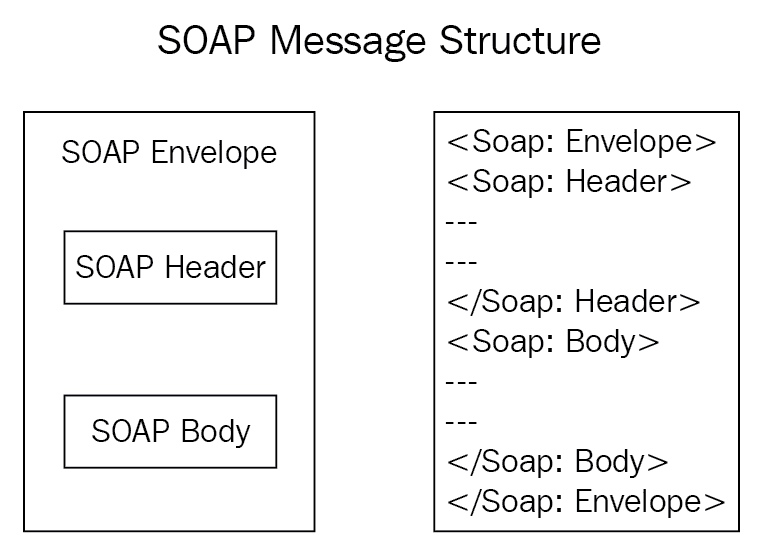

以下是对前面图表中组件的描述：

+   **信封**：SOAP 消息结构的必需元素。定义消息的开始和结束。

+   **头部**：SOAP 消息的可选元素。它包含有关 SOAP 消息的信息，可用于处理数据。

+   **正文**：这是主要内容，它包含实际的 XML 结构中的消息。显然，这是一个必需的元素。

+   **错误**：如果在处理 SOAP 消息时发生任何错误，可以使用可选的 Fault 元素来提供有关这些错误的信息。

您可能想知道是谁确切地告诉我们遵循这种结构。好吧，有一个名为 W3 的组织为特定技术提出标准。他们为 SOAP 结构做了同样的事情。

您可以轻松地在 [`www.w3.org/2001/12/soap-envelope`](http://www.w3.org/2001/12/soap-envelope) 上找到有关 SOAP 封装的详细信息。同样，您可以在 [`www.w3.org/2001/12/soap-encoding`](http://www.w3.org/2001/12/soap-encoding) 上查看有关 SOAP 编码和数据类型的详细信息。

我们关于 SOAP 消息结构的讨论是由 W3 组织定义的。然而，这个组织不断研究优化结构，并时不时地引入更稳健的规范。因此，我们必须根据他们提供的最新规范进行更新并相应地实施。

下面的块描述了 SOAP 消息的一般结构：

```cs
<?xml version = "1.0"?>
<SOAP-ENV:Envelope xmlns:SOAP-ENV = "http://www.w3.org/2001/12/soap-envelope" 
 SOAP-ENV:encodingStyle = "http://www.w3.org/2001/12/soap-encoding">
  <SOAP-ENV:Header>
    ...
    ...
  </SOAP-ENV:Header>
  <SOAP-ENV:Body>
    ...
    ...
    <SOAP-ENV:Fault>
      ...
      ...
    </SOAP-ENV:Fault>
    ...
  </SOAP-ENV:Body>
</SOAP_ENV:Envelope>
```

接收者通过一个封包的指示来通知整个 SOAP 消息。这意味着，如果客户端收到的消息中包含一个封包，那么消息已经完全接收，客户端可以解析并用于进一步处理。因此，SOAP 封包在包装整个消息方面发挥着作用。

# 关于 SOAP 的重要点

以下是一些关于 SOAP 的重要点：

+   每个 SOAP 消息中的 `Envelope` 都具有根位置，这是所有 SOAP 消息的强制性要求。

+   在一个 SOAP 封包内部应该只有一个主体元素。

+   `Header` 元素是一个可选元素。然而，如果存在，那么应该只有一个 `Header` 元素。

+   `Header` 必须作为封包的第一个子元素出现，在主体元素之前。

+   使用 `ENV` 命名空间前缀和 `Envelope` 元素来构建一个 SOAP 封包。（参考以下示例。）

+   `encodingStyle` 属性定义了文档中使用的数据类型。这为消息中出现的所有数据类型提供了一个概括。如果此属性出现在任何 SOAP 元素上，它将应用编码规则到该元素的内容和所有子元素。

以下是一个符合 v1.2 规范的 SOAP 消息的示例：

```cs
<?xml version = "1.0"?>
<SOAP-ENV:Envelope 
 xmlns:SOAP-ENV = "http://www.w3.org/2001/12/soap-envelope" 
 SOAP-ENV:encodingStyle = "http://www.w3.org/2001/12/soap-encoding">
 ...
 SOAP Message information goes here
 ...
</SOAP-ENV:Envelope>
```

# SOAP 通过 HTTP POST

在 HTTP 头部中提到的 `Authors` 实际上是包含一个 `POST` 动作方法的控制器或程序的 URL，所有内容都托管在 [www.packtpub.com](http://www.packtpub.com)。

```cs
POST /Authors HTTP/1.1
Host: www.packtpub.com
Content-Type: application/soap; charset="utf-8"
Content-Length: nnnn

<?xml version = "1.0"?>
<SOAP-ENV:Envelope 
xmlns:SOAP-ENV = "http://www.w3.org/2001/12/soap-envelope" 
SOAP-ENV:encodingStyle = " http://www.w3.org/2001/12/soap-encoding">
  ...
  Message information goes here
  ...
</SOAP-ENV:Envelope>
```

# REST

REST 是一种网络计算机系统之间的架构风格，以便系统可以轻松地相互通信。符合 REST 风格的服务通常被称为 RESTful 服务。

让我们讨论一下当 Web 服务被标记为 RESTful 时的一些重要约束。

# 服务器和客户端是独立的

在 REST 中，服务器和客户端之间没有限制或依赖。两者都可以相互独立。这只是客户端理解服务的 URL。服务器上 Web 服务的代码可以修改，而不必关心与之关联的客户端，反之亦然。

这种分离有助于客户端/服务器架构在没有障碍的情况下自由呼吸。因此，设计应用程序和分离其核心业务逻辑变得容易。我的意思是，可以使用客户端技术来设计应用程序，而 RESTful 网络服务则在需要数据库中的业务相关操作的地方被调用。

然而，保持服务器和客户端模块化和分离取决于一个条件，那就是他们发送和接收的消息格式。他们都应该知道发送和接收的消息格式。

由于用户界面与业务和数据存储相关的操作分离，可以通过简化服务器组件来提高灵活性和可扩展性。此外，这种分离允许每个组件独立发展。

REST 端点通过特定的 URL 暴露。不同的客户端可以使用 URL 进行连接，然后执行预期的操作并获取响应。

在这本书中，我们将构建一个具有最小操作的简单电子商务 Web 服务，用户可以使用购物车并下订单。这些操作将通过端点公开。正如我们讨论的那样，端点可以很容易地从不同类型的客户端中消费，包括移动应用、Web 应用、服务器端代码等。

# 无状态

这个概念非常容易理解。在服务器/客户端架构中，服务器需要知道哪个客户端正在请求它的数据，相应地，它决定发送什么以及不发送什么。

然而，REST 系统是无状态的。这意味着服务器不需要知道任何关于客户端状态的信息，反之亦然。这最终会减少服务器在每次请求到来时识别客户端的开销。

但现在的问题是，客户端和服务器是如何交互的？答案是通过对适当的消息进行交互。假设一个用户想查看一个订单的详细信息。它只需通过发送订单 ID 来向服务器请求，服务器就会以`.json`或`.xml`格式返回订单详情，这些格式可以很容易地被客户端解析。每条消息都有处理该消息所需的所有信息。

这些约束（以及一些其他约束，如*caching*、*layered system*、*uniform interface*和*code on demand*）在 Web 服务上实现时，有助于 RESTful 应用程序实现可靠性、优化性能和可扩展性。原因在于组件可以独立管理、完美更新且无需影响整个系统即可重用。

让我们在下一节中具体看看服务器和客户端之间是如何进行通信的。

# 设置环境

在我们探索通信机制之前，让我们首先设置开发环境。我们将使用 Visual Studio 2017 作为我们的示例。

打开 Visual Studio 并执行我们最喜欢的步骤，文件 | 新建 | 项目，这将打开一个包含可用模板的对话框窗口，如以下截图所示：

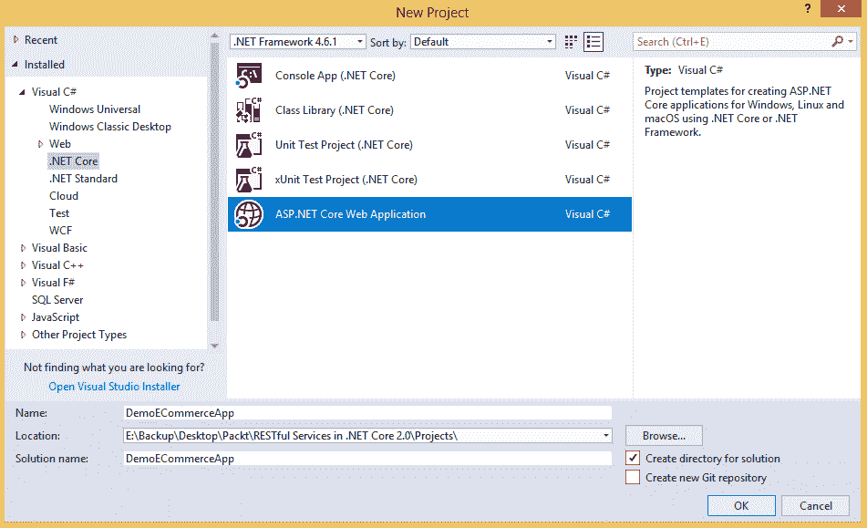

选择如前截图所示的 ASP.NET Core Web 应用程序。别忘了在左侧面板中选择.NET Core。现在一切看起来都很酷。

让我们点击“确定”，然后我们将进入另一个对话框，在那里我们可以选择更多与我们的 Web 应用相关的模板。显然，我们将点击“Web API”，然后点击“确定”。

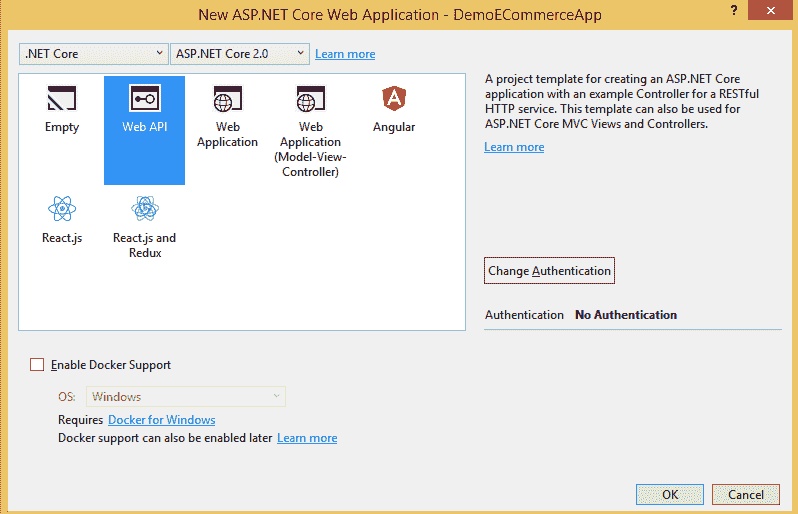

项目已创建。美丽的是，它已经为我们构建了所有必要的组件，并创建了一个名为`ValuesController`的示例控制器，如下面的截图所示：

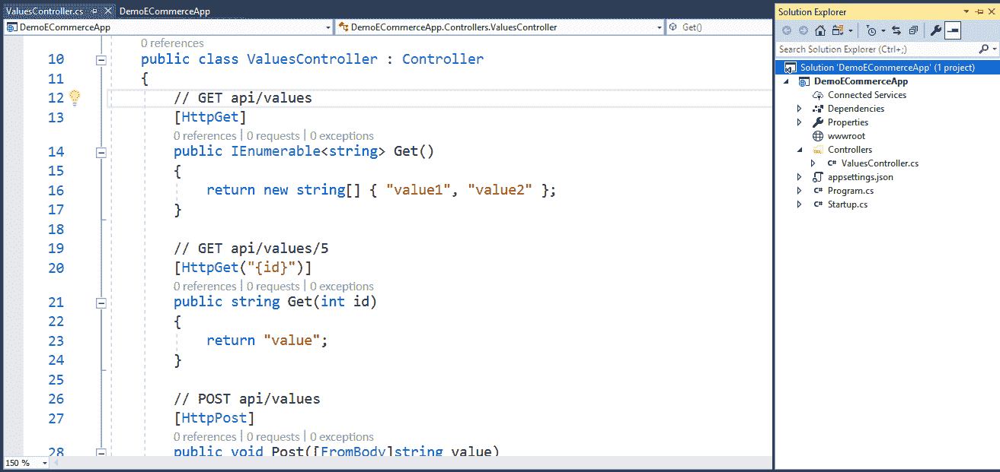

现在，这里有一个有趣的事实。注意，`ValuesController`类继承自`Controller`基类。如果你在 ASP.NET Core 之前熟悉 Web API，你可能会知道基类是`ApiController`。这种变化的原因是为了在 API 和 MVC 结构之间保持一致性。`Controller`是 ASP.NET MVC 中的基类。现在在 ASP.NET Core 中，MVC 和 Web API 模板都继承自相同的基类。在 ASP.NET Core 中，MVC 和 Web API 被合并为一个编程模型。

# 运行应用程序

为了确保一切正常工作，让我们运行应用程序。

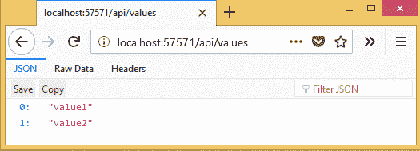

让我们在以下部分讨论刚才发生的事情。

# 这里在做什么？

注意 URL，`localhost:57571/api/values`，它将请求发送到`ValuesController`，因为控制器上定义的路由是`[Route("api/[controller]")]`。按照惯例，控制器名称总是附加文本*Controller*。因此`api/values`命中`ValuesController`。

现在的问题是，它是如何返回`value1`和`value2`的。这是因为我们直接通过浏览器访问了 URL，最终发送了一个`GET`请求到控制器。由于控制器已经有一个`Get`方法，它被执行了。`Get`方法如下：

```cs
// GET api/values
[HttpGet]
public IEnumerable<string> Get()
{
  return new string[] { "value1", "value2" };
}
```

此方法返回一个字符串数组，它在浏览器中打印出来。为了理解，URL 格式已经在方法上方了（`*``api/values`*`*`）。

# 有趣的事实

现在让我们尝试一些事情。你会对幕后发生的事情有一个很好的了解：

1.  在控制器中添加另一个方法，`Get12()`，并移除`[HttpGet]`方法：

```cs
public IEnumerable<string> Get12()
{
  return new string[] { "value1", "value2", "value3" };
}
// GET api/values
//[HttpGet] - Remove this attribute
public IEnumerable<string> Get()
{
  return new string[] { "value1", "value2" };
}
```

你认为输出会是什么？很有趣。以下是输出：

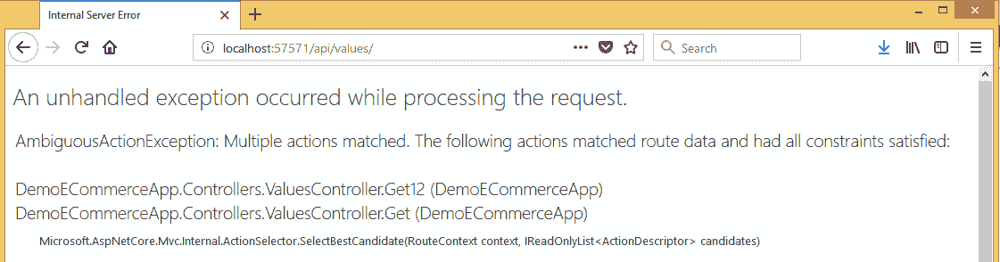

这意味着它找到了两个`GET`方法，并且它无法决定执行哪一个。注意，它们中没有一个被属性装饰，例如`[HttpGet]`。

1.  现在，让我们计划恢复属性并测试会发生什么。然而，我们将装饰新的`Get12`方法，并保持旧的`Get`方法带有注释的属性不变。因此，代码将是：

```cs
[HttpGet]
public IEnumerable<string> Get12()
{
  return new string[] { "value1", "value2", "value3" };
}
// GET api/values
//[HttpGet]
public IEnumerable<string> Get()
{
  return new string[] { "value1", "value2" };
}
```

让我们快速看一下我们对输出做了什么：

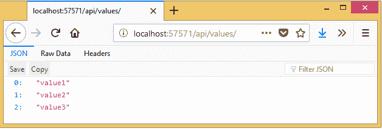

清晰明了！`Get12`方法被执行了，这是因为我们通过`[HttpGet]`属性明确告诉它是`Get`方法。

1.  通过向两个方法中添加一个属性，可以体验到更多的乐趣：

```cs
[HttpGet]
public IEnumerable<string> Get12()
{
  return new string[] { "value1", "value2", "value3" };
}
// GET api/values
[HttpGet]
public IEnumerable<string> Get()
{
  return new string[] { "value1", "value2" };
}
```

你能猜到输出结果吗？是的，它与我们之前看到的情况相同，当时我们有两个不带属性的方法，并且出现了 **AmbiguousActionException** 异常，如下面的截图所示：


1.  最后，让我们再添加一个名为 `HelloWorld()` 的方法，并带有属性以及现有的属性。让我们从其他方法中移除属性：

```cs
[HttpGet]
public string HelloWorld()
{
  return "Hello World";
}
public IEnumerable<string> Get12()
{
  return new string[] { "value1", "value2", "value3" };
}
// GET api/values
public IEnumerable<string> Get()
{
  return new string[] { "value1", "value2" };
}
```

完美！让我们看看输出结果。在浏览器中显示的是：Hello World

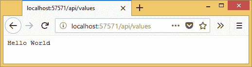

# 结论

从前面的观察中可以得出以下结论。请注意，我们正在讨论 URL 为 `api/values` 的 `GET` 请求，这意味着我们正在讨论控制器中所有非参数化动作方法。在阅读以下要点时，请忽略带有参数或其他属性的方法：

+   当我们不带任何参数访问特定的 Web API 控制器（例如，`api/values`）时，控制器中首先会搜索带有 `[HttpGet]` 属性的动作方法。

+   如果在非参数化方法中没有提到属性，那么当 .NET Core 运行时在选择请求的一个动作方法时会感到困惑。

+   动作方法的命名规范没有限制。只要它是唯一一个没有 `[HttpGet]` 属性的方法，或者唯一一个具有 `[HttpGet]` 属性的方法，当 `GET 请求` 到达 API 时，它就会被完美执行。

# 请求和响应

现在我们已经快速浏览了 `ValuesController` 的演示，让我们确切地看看客户端是如何发送请求以及它是如何接收响应的。

一个 REST 请求通常由以下内容组成：

+   **HTTP 动词:** 这表示请求想要在服务器上执行的操作类型。

+   **Header:** REST 请求的这个元素允许客户端传递更多关于请求的信息。

+   **URL:** REST 请求要操作的资源的实际路径。

+   **Body:** 主体可以包含与资源相关的额外数据，用于标识或更新资源。这是可选的。

# HTTP 动词

以下是在请求 REST 系统进行资源交互时使用的基本 HTTP 动词：

+   **GET:** 用于通过其标识符或资源集合检索特定资源

+   **POST:** 用于创建/插入新资源

+   **PUT:** 用于通过其标识符更新特定资源

+   **DELETE:** 用于通过其标识符删除特定资源

让我们逐一探索 REST 中这些动词的请求/响应机制。我们将尝试设计一个具有基本操作的商业应用程序。在第一阶段，我们将处理产品，这是这些类型应用程序的核心。

# Postman

要测试 API，我们可以使用一个非常易于使用的工具，名为 *Postman*。它可以从：[`www.getpostman.com/`](https://www.getpostman.com/) 下载。请下载并打开它。我们将在下一节中看到如何通过 Postman 发送请求，并分析我们从 Web API 收到的响应。

# GET

我将添加另一个名为 `ProductsController` 的控制器。目前，让我们有一个简单的动作方法 `GET`，它将返回一些产品。目前，这些产品在动作方法中是硬编码的。该方法看起来如下：

```cs
using Microsoft.AspNetCore.Mvc;
using System.Collections.Generic;
namespace DemoECommerceApp.Controllers
{
  [Produces("application/json")]
  [Route("api/[Controller]")]
  public class ProductsController : Controller
  {
    // GET: api/Products
    [HttpGet]
    public IEnumerable<Product> Get()
    {
      return new Product[]
      {
        new Product(1, "Oats", new decimal(3.07)),
        new Product(2, "Toothpaste", new decimal(10.89)),
        new Product(3, "Television", new decimal(500.90))
      };
    }
  }
}
```

`[路由]` 属性提供了一个定义良好的模板 `"api/[控制器]"`。在这里，控制器名称是 `ProductsController`。当我们使用 URL `api/Products` 进行请求时，框架将搜索具有该路由定义的控制器。`[控制器]` 占位符是一个特殊的命名约定，将在运行时替换为文本（控制器名称）`Products`。然而，您可以直接编写带有控制器名称的完全限定模板，例如 `[Route (api/Products)]`。

因此，这个 `GET` 方法将返回三个产品及其详细信息。`Product` 类可以设计如下，具有一个用于构建 *Product* 对象的构造函数：

```cs
public class Product
{
  public Product(int id, string name, decimal price)
  {
    Id = id;
    Name = name;
    Price = price;
  }
  public int Id { get; set; }
  public string Name { get; set; }
  public decimal Price { get; set; }
}
```

我们完成了。让我们通过 *Postman* 进行 `GET 请求` 来分析 REST 中的请求和响应机制。对于 `GET 请求`，很简单。只需打开 Postman。然后按照以下截图中的步骤操作：


在 Postman 中执行 GET 请求

在 **步骤-1** 中，只需粘贴 URL，即我们示例中的 `http://localhost:57571/api/products`。其他所有内容都已为 `GET 请求` 设置好。您可以看到 URL 框左边的请求类型，它是 `GET`。这意味着当前请求将是一个 `GET` 请求。按如下所示的 **步骤-2** 中的发送按钮。

响应是在底部部分显示的产品列表。它以 `.json` 格式呈现。请参考以下截图，它显示了 `GET` 请求的响应：

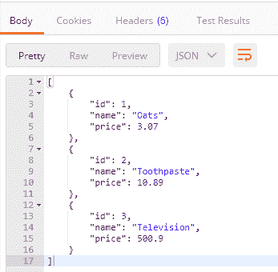

现在您已经愉快地了解了 `GET` 的工作原理，让我们分析幕后发生了什么。客户端（在这里是 *Postman*），发送 HTTP 请求并得到响应。在发送请求时，它还指定了请求头部，而服务器作为回报，发送响应头部。

HTTP 头部允许客户端和服务器分别在与请求和响应交互时发送和接收额外的信息。这决定了 HTTP 事务的确切行为。您可以参考以下资源来了解有关头部的更多信息。我们将在下一节中快速查看头部：

+   [`www.w3.org/Protocols/rfc2616/rfc2616-sec14.html`](https://www.w3.org/Protocols/rfc2616/rfc2616-sec14.html)

+   [`developer.mozilla.org/en-US/docs/Web/HTTP/Headers`](https://developer.mozilla.org/en-US/docs/Web/HTTP/Headers)

在 Postman 中，您可以点击 **代码**，如下面的截图所示：

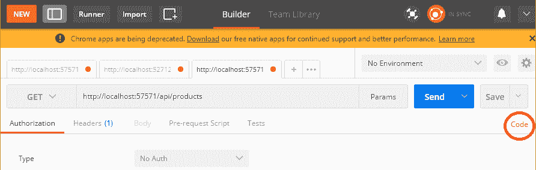

点击此链接将打开一个模态窗口，显示发送到服务器的 HTTP 请求头以处理请求。查看以下模态窗口的截图，其中清楚地说明了请求类型为 `GET`，`Host` 为 API 的 URL，然后是其他头信息，如 `Cache-Control` 和 `Postman-Token`：

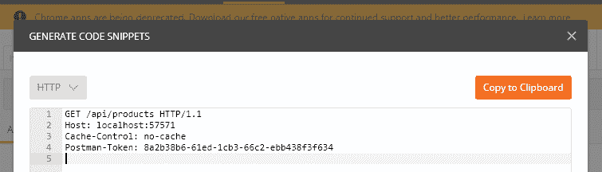

想要知道此 `GET` 调用的 *jQuery* 代码片段是什么样子吗？使用 Postman 非常简单。在主屏幕上点击代码，然后从包含语言的下拉菜单中选择 *jQuery*。（见以下截图。）此外，您还可以通过从下拉列表中选择来获取不同语言的代码。复制愉快！

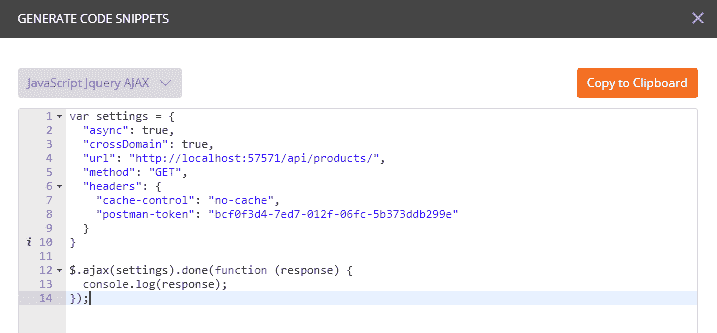

*响应头* 清楚地显示在主页面中，如下截图所示。注意，提到了状态码，在这种情况下是 200 OK。那么，这个代码代表什么意思呢？

我们将在下一节中讨论这个问题。

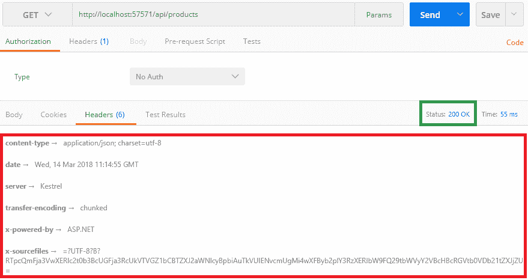

Postman 响应头

# 状态码

当服务器返回响应时，它包括状态码。这些状态码通知客户端请求在服务器上的执行情况。作为开发者，您不需要知道每个状态码（有很多），但您应该了解最常见的状态码及其用法：

| **状态码** | **说明** |
| --- | --- |
| 200 OK | 对成功 HTTP 请求的标准响应。 |
| 201 CREATED | 当成功创建项目时，对 HTTP 请求的标准响应。 |
| 204 NO CONTENT | 如果响应体中没有返回任何内容，对成功 HTTP 请求的标准响应。 |
| 400 BAD REQUEST | 由于请求语法错误、大小过大或其他客户端错误，请求无法处理。 |
| 403 FORBIDDEN | 客户端没有权限访问请求的资源。 |
| 404 NOT FOUND | 资源当前无法找到。它可能已被删除，或者尚不存在。 |
| 500 INTERNAL SERVER ERROR | 当在处理服务器端代码时发生失败或异常时，此响应出现。 |

对于以下 HTTP 动词，服务器默认期望从服务器返回一些状态码：

+   `GET`: 返回 200 OK

+   `POST`: 返回 201 CREATED

+   `PUT`: 返回 200 OK

+   `DELETE`: 如果操作失败，返回 204 NO CONTENT

我们已经看到了 API 如何对 `GET` 请求返回 200 OK。随着我们继续使用其他动词，我们将探索之前提到的代码返回的响应。

# ASP.NET Core HTTP 属性

根据 *互联网工程任务组 (IETF) RFC-7231* 文档 ([`tools.ietf.org/html/rfc7231`](https://tools.ietf.org/html/rfc7231))，ASP.NET Core 实现了八种 HTTP 动词中的七种 HTTP 属性。框架中从动词列表中排除的唯一一个是 HTTP TRACE 动词。

以下是在 ASP.NET Core 中提供的完整 HTTP 动词属性列表：

+   `HttpGetAttribute`

+   `HttpPostAttribute`

+   `HttpPutAttribute`

+   `HttpDeleteAttribute`

+   `HttpHeadAttribute`

+   `HttpPatchAttribute`

+   `HttpOptionsAttribute`

由于动词名称与属性相关联，很明显它们将用于各自的动词。这些属性帮助框架理解哪个动作方法与哪个动词相关联。考虑到这一点，当控制器收到请求时，它可以决定执行哪个方法。

框架还提供了一个对路由也很重要的属性，名为`RouteAttribute`。

动作方法的参数还有一些其他属性，用于帮助识别从请求的不同位置（如 URL、Body 等）传递给 API 动作的参数。以下是一些框架中用于动作参数的属性：

+   `FromServicesAttribute`

+   `FromRouteAttribute`

+   `FromQueryAttribute`

+   `FromBodyAttribute`

+   `FromFormAttribute`

# POST

使用`POST`来创建资源。在我们的例子中，我们将尝试使用 POST 请求向服务器创建产品。在这样做之前，我们将对我们的项目做一些修改。你可以在 GitHub 上找到所有相关代码（[`github.com/PacktPublishing/Building-RESTful-Web-services-with-DOTNET-Core`](https://github.com/PacktPublishing/Building-RESTful-Web-services-with-DOTNET-Core)），所以请放心！

那还等什么？让我们按照以下方式编写 Post 方法：

```cs
 // POST: api/Products
[HttpPost]
public async Task<IActionResult> Post([FromBody]Product product)
  => (await _productService.CreateProductAsync(product))
    ? (IActionResult)Created($"api/products/{product.Id}", product) // HTTP 201
    : StatusCode(500); // HTTP 500
```

动作方法调用相关服务的`CreateProductAsync`方法，并检查操作是否成功。如果成功，则返回`201`，否则返回`500`。请注意，为了返回正确的状态码，我们正在利用`IActionResult`接口。这个接口有一组大量的子类，可以通过`Controller`类访问。由于我们继承了`Controller`基类，我们可以轻松地使用如`StatusCode`等方法，根据我们对资源的操作返回我们期望的状态。

在上一节中，我们提到，在`POST`请求成功时，我们应该收到 201 CREATED 状态码，而在失败时，应该发送一个通用的 500 内部服务器错误响应。这正是代码所做的事情。

另一个有趣的事情是：`Created("api/products/{product.Id}", product)`。这是`Controller`类中的一个方法，它将 URL 分配给位置，并将 201 分配给响应的状态码。你不信吗？好吧，让我立即通过*Postman*来证明这一点。

看看以下是从*Postman*请求屏幕中捕获的截图：

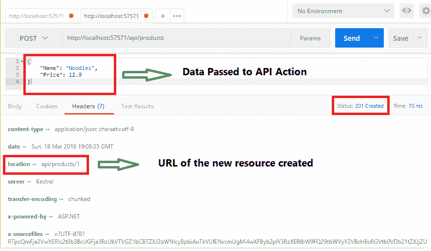

注意，我们以 JSON 格式传递了产品的数据，创建产品后，API 返回了 201 Created 状态码和创建的新产品的 URL，即 api/products/1。这意味着，当你以`GET`请求运行此 URL 时，你会收到新创建的产品详情。简单，不是吗？

如您所见，传递的产品详情的数据类型是 JSON，但问题是，谁告诉服务器它是以那种格式存储的？嗯，那是请求头 `content-type` 设置的值为 `application/json`。您可以在最后一张截图中看到。默认编码为 `charset=utf-8`，由 *Postman* 添加。

然而，有趣的是，*Postman* 如何知道我们想要的数据类型内容是 JSON？它不能自动设置。我告诉它这样做。

在 URL 文本框下方有设置任何类型请求头的选项。参看以下截图，它显示了我已经设置了 `content-type` 头：

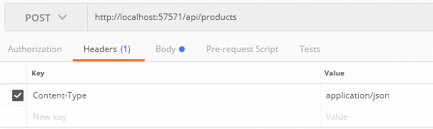

对于之前提到的 `GET` 请求，该请求通过 ID 返回产品详情，我们可以设计如下操作方法：

```cs
// GET: api/Products/1
[HttpGet("{id}")]
public Task<Product> Get(int id)
  => _productService.GetOrderAsync(id);
```

在这里，我们为 `[HttpGet]` 提供了一个模板参数 `"{id}"`。这将确保有一个 HTTP Get 路由，例如 `api/orders/1` 可用——其中 ID 是传递给 `GET` 请求的变量。

我们有一个名为 `ProductService` 的服务，它实现了 `IProductService` 接口，并且通过控制器的构造函数，服务（依赖项）被注入，这被称为 *依赖注入*。在 .NET Core 中，使用内置的 *控制反转容器* 处理依赖项非常容易。如果您不明白我在说什么，那么我强烈建议您阅读我关于这个主题的另一本书，*Dependency Injection in .NET Core* ([`www.packtpub.com/application-development/dependency-injection-net-core-20`](https://www.packtpub.com/application-development/dependency-injection-net-core-20))。

# PUT

HTTP PUT 动词是幂等的。这意味着第一个带有特定有效负载的 HTTP PUT 请求将影响服务器和资源。它将更新由 ID 指定的资源。然而，随后的带有相同有效负载的 HTTP PUT 请求将产生与第一个请求相同的响应。

考虑以下示例，我们将更新一个产品：

```cs
// PUT: api/Products/1
[HttpPut("{id}")]
public async Task<IActionResult> Put(int id, [FromBody]Product product)
  => (await _productService.UpdateProductAsync(id, product))
    ? Ok()
    : StatusCode(500);
```

`[HttpPut]` 属性提供了一个类似于 `[HttpGet]` 中的模板 `{id}`。在 `PUT` 的情况下，它将从 URL 中获取 ID，并从请求体中获取 `Product` 对象，这由 `[FromBody]` 属性指定，正如我们在上一节中 `POST` 的情况所做的那样。

当 ID 和产品对象与参数绑定时，方法体开始执行，这反过来又调用服务方法 `UpdateProductAsync` 并传递相同的参数。该方法将根据更新是否成功返回一个布尔值。如果一切顺利，我们将通过调用 `OK()` 方法返回 200 OK，否则如果发生错误，将给出 500 内部服务器错误。

让我向您展示 Postman 的截图：

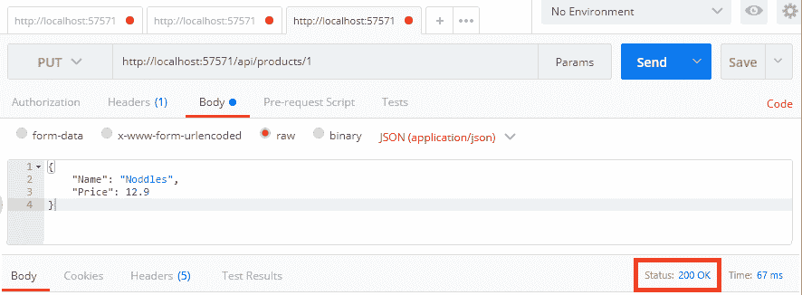

如果 `PUT` 请求附带一个已过期的 ID，可以返回另一个状态码，301 Moved Permanently，这意味着请求体中的产品与 ID 不相关。为了识别这种条件，我们需要相应地添加业务逻辑，并且如果我们能够验证 ID 是否与产品相关，如果不相关，我们可以简单地返回 301 Moved Permanently，并附带产品实际当前存在的新的 URL。

# DELETE

理想情况下，一个 `DELETE` 请求应该删除资源。一旦操作成功，我们可以通过调用 `OK()` 方法发送 200 OK 状态码。

参考以下代码块：

```cs
// DELETE: api/Products/1
[HttpDelete("{id}")]
public async Task<IActionResult> Delete(int id)
  => (await _productService.DeleteOrderAsync(id))
    ? (IActionResult)Ok()
    : NoContent();
```

注意 `DeleteOrderAsync` 方法，它提供了要删除的产品 ID。现在，你可以从该方法返回一个布尔值，这将指示操作是否成功。如果你找不到该 ID 的任何产品，只需返回 `false`。然后，我们将根据情况决定向客户端返回什么。

如果你返回 `false`，可以使用 `NoContent()` 返回状态码 *204*。如果资源已经被删除且客户端请求相同的内容，那么服务器将返回状态码 204 No Content。这意味着服务器无法找到请求的资源，因为它已经不存在了。

看一下 Postman 截图。看到状态码是 *200 OK* 表示删除成功：

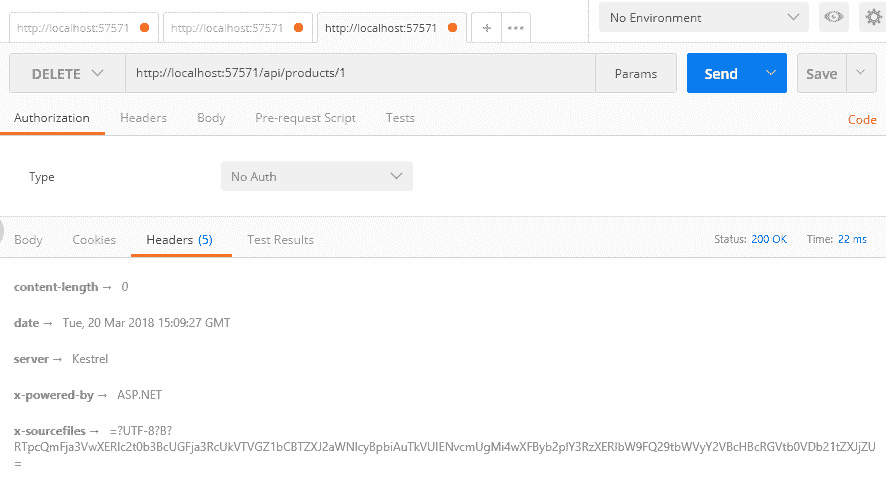

# SOAP 与 REST 对比

以下是 SOAP 和 REST 之间的一些关键区别：

| **SOAP** | **REST** |
| --- | --- |
| 它是一个基于 XML 的消息协议。 | 它是一种架构风格。 |
| WSDL 用于客户端和服务器之间的通信。  | XML 或 JSON 用于客户端和服务器之间发送和接收数据。 |
| 服务通过调用 RPC 方法被调用。 | 服务通过 URL 暴露端点。 |
| 响应易于人类阅读。 | 响应以纯 XML 或 JSON 的形式可读。 |
| 数据传输通过 HTTP 进行。它利用 SMTP、FTP 等协议。 | REST 数据传输仅通过 HTTP 进行。 |
| 从 JavaScript 调用 SOAP 服务比较困难。 | 从 JavaScript 调用 REST 服务非常容易。 |

# 单页应用程序模型

传统上，在 Web 应用程序中，客户端请求服务器提供网页。然后，服务器在必要时验证和认证请求后，向客户端响应请求的 HTML 页面。下一个请求可能发生在用户点击页面上的某个链接、提交表单等情况。服务器再次处理请求，并返回另一个 HTML 页面的响应。

你难道不认为我们不应该获取整个 HTML 页面（这将会与最后加载的页面外观和感觉基本相同），而应该只获取我们所需的数据，并更新当前加载的页面本身，而不需要向服务器发送回帖？是的，现代 Web 开发在这方面就是这样工作的。今天，我们只需要根据需要从服务器获取数据使用 Ajax。在收到数据后，我们只需使用 JavaScript 或客户端框架（如 Angular）更新 UI。

这就是我们所说的**单页面应用**（SPA）。在第一次向服务器请求时，服务器会响应整个应用页面。与传统 Web 应用不同，后续请求不会要求获取 HTML 页面，而是会使用 Ajax 请求获取数据，其中内容类型通常是 JSON。在获取数据后，浏览器只需更新页面中已更改的部分，而不是重新加载整个页面。SPA 通过快速响应用户在相同页面上的操作，无疑提高了用户体验，因为重新加载页面会暂时分散用户的注意力。

然而，实现单页面应用（SPA）并不像我们想象的那么简单，我们必须确保在需要时页面上显示的是最新数据。在这里，当设计 SPA 时，新兴技术，如 ASP.NET Web API，以及 JavaScript 框架，如 AngularJS 和 CSS3，都派上了用场。

您的应用程序可以调用 REST API 的不同端点来完成特定任务，并在收到响应后更新 UI，而无需重新加载页面。

# 面向服务架构

与 SPA 一样，Web API 在面向服务架构（SOA）中扮演着重要的角色。正如其名所示，它是一种从业务导向的角度处理责任分离的架构方法，将其分解为独立的服务。通常，这些独立的服务或组件可以使用 RESTful Web API 进行设计。

考虑一个电子商务应用，它可能包含不同的组件，如订单、账单、支付处理、客户资料管理等。这些组件各自有自己的业务逻辑，并且可以独立实现。

以下图表示了这样一个具有独立组件的应用程序的图示：

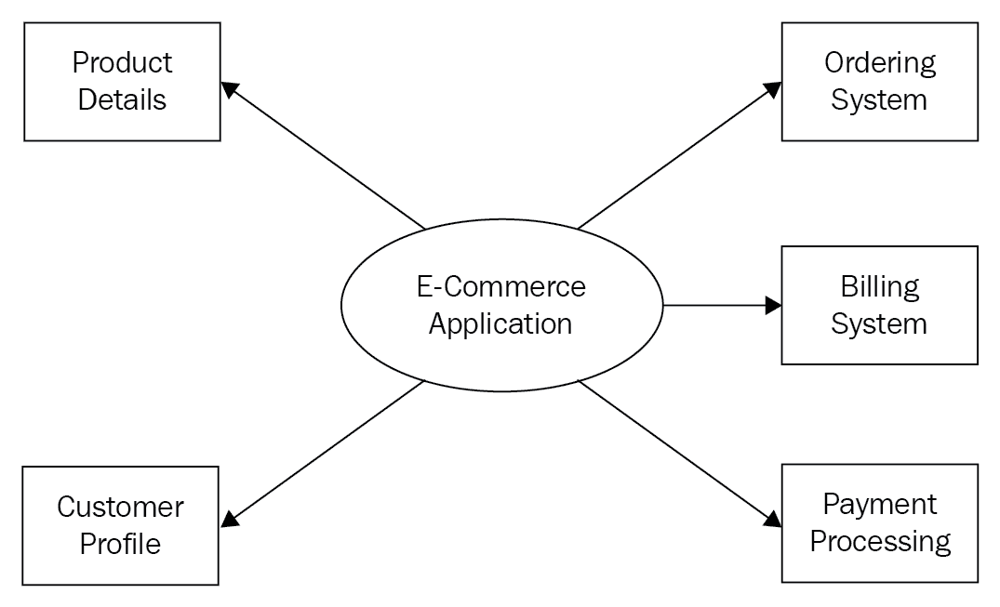

为了使它们独立，可以为这些组件公开 RESTful API，这些 API 可以很容易地被任何客户端/应用程序消费，包括其他组件，只要它们满足认证和授权要求。

以下是一个单体或传统应用架构与面向服务架构（SOA）的图示。它清楚地说明了 SOA 如何为同一业务应用引入可重用组件。此外，通过 Web API 实现它们，可以使其对外暴露，供任何应用程序（包括其他组件）消费，只要它们满足认证和授权要求：

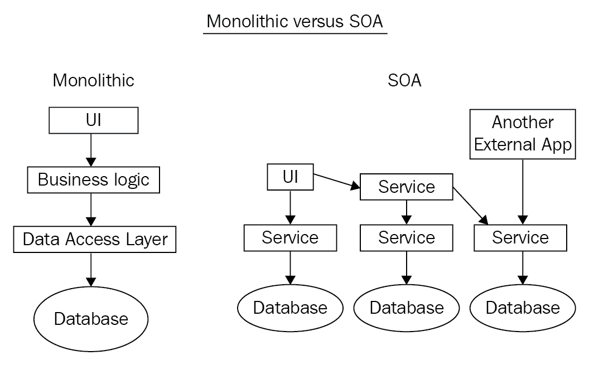

由于本书接下来几章需要探索许多关于 Web API 的内容，因此 SOA 的实现超出了本书的范围。无论我们在本书的应用程序中做什么，都会使用一个 Web API，但你可以将它们分离出来以构建一个更可扩展的架构。

# 摘要

我们从一些基本的 SOAP 知识开始，然后逐渐转向 REST。

本章简要介绍了 REST 的基本构建块及其实际工作原理。我们探讨了广泛使用的 HTTP 动词返回的不同状态码。

为了探索 Web API 的请求和响应周期，你可以使用 Postman，在这里你不仅能够控制发送和接收的内容，还能获取不同语言的代码以便消费 API。

ASP.NET Core 属性可以绑定到控制器操作方法，使它们在路由和参数方面更具表达性和可管理性。

*单页应用程序* 可以通过使用客户端技术并消费 ASP.NET Core Web API 来轻松设计，以便在接收到响应后立即更新页面，从而提供流畅的用户体验。

Web API 可以集成到面向服务的架构中，以实现模块化设计，从而提高可扩展性。通过使用 API 将整个架构的不同关键组件进行分离，我们能够更好地在不同的应用程序中重用这些组件，并将它们暴露给世界，以便任何人都可以消费。

在下一章中，我们将探讨与身份验证相关的 Web API 架构的重要部分。
