# 第三章：用户注册和管理

在上一章中，我们构建了应用程序的基础，同时我们也详细探讨了在 ASP.NET Core Web API 内部创建控制器时使用的 HTTP 动词。

现在，我们正逐渐转向 API 的一个重要方面，称为**身份验证**。由于 API 的易于访问性，身份验证肯定是一个必需的组件。限制请求并对它们进行限制将防止恶意攻击。

您的应用程序的用户，或者在我们的例子中，客户，需要一个注册表单/界面，以便系统可以抓取他们的详细信息。我们将看到如何使用 API 注册用户。

在您注册并拥有客户的所有详细信息，如*电子邮件*和*密码*后，您将很容易识别来自客户端的请求。等等，这很简单，但我们需要遵循一些原则来验证用户以访问我们的资源。这就是*基本身份验证*和*OAuth 身份验证*将出现的地方。

本章我们将涵盖以下主题：

+   为什么需要身份验证和限制请求？

+   使用 EF Core 为我们的 REST API 进行引导

+   向我们的 REST API 添加基本身份验证

+   向我们的服务添加 Oauth 2.0 身份验证

+   定义基于客户端的 API 消费架构

# 为什么需要身份验证和限制请求？

如果我告诉你，有一个来自特定国家政府的 Web API 可以用来获取其公民的所有详细信息，那么你首先会问我是否可以从 API 中提取数据。这正是我们将要讨论的内容。

因此，如果你看之前的例子，从该 API 返回的数据将包含公民的敏感数据，例如*姓名*、*地址*、*电话号码*、*国家*和*社会保障号码*。政府绝不应该允许每个人访问这些数据。通常只允许经过身份验证的来源。这意味着当你调用一个 API 时，你需要发送你的身份并请求它允许你操作数据。如果身份错误或不在允许的来源列表中，它将被 API 拒绝。想象一下恐怖分子试图访问 API，你肯定会通过检测他们的身份来拒绝访问。

现在想象另一个场景，一个大学有一个 API，它会发送特定课程的某个学期的成绩。许多其他网站会通过调用这个大学 API 在其网站上显示成绩。一个黑客进来并使用代码块循环调用 API。如果时间间隔太小，那么如果你收到服务器忙/服务器不可达的消息，请不要感到惊讶。这是因为，在短时间内有大量的请求，服务器会过载并耗尽资源。

这就是为什么在特定时间间隔内对 API 施加限制，不允许来自同一来源的更多请求的情况出现。例如，如果任何消费者访问我们的 API，如果消费者在过去的 10 秒左右已经请求过，我们将不允许该请求。

首先，在我们探索其他概念之前，让我们为我们的应用程序设计数据库。

# 数据库设计

我们肯定会有一个*Customers*表。我们将在这个表中存储客户信息，并使用该表的键作为其他表，如*Orders*和*Cart*的参考。

客户表可以设计如下。您可以在本书中找到名为`FlixOneStore.sql`的数据库脚本：

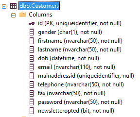

将在这些表上执行 CRUD 操作。让我们先从 API 对这个表进行一些操作。更确切地说，我们正在讨论客户注册和登录过程。

# 用户注册

让我们先获取模型到 API 中，这样我们就可以创建一个对象并在数据库中保存数据。我们将使用**Entity Framework Core**（**EF Core**）版本 2.0.2 来完成这项工作。

# 设置 API 的 EF

要使用 EF Core，需要以下包，可以从工具中的 NuGet 包管理器下载和安装：


此外，我们还需要另一个名为 Microsoft.EntityFrameworkCore.Tools 的包。这将帮助我们根据数据库创建模型类：


现在，我们到达了需要根据数据库表创建模型类的点。以下 powershell 命令可以在包管理器控制台中执行，以创建*Customers*表的模型类：

```cs
Scaffold-DbContext "Server=.;Database=FlixOneStore;Trusted_Connection=True;" Microsoft.EntityFrameworkCore.SqlServer -OutputDir Models -Tables Customers 
```

我们在命令中提供了连接字符串，以便它连接到我们的数据库。

以下是我们刚刚探索的命令的两个重要部分：

+   `-OutputDir Models`：这定义了模型类将被放置的文件夹。

+   `-Tables Customers`：这定义了将被提取为模型类的表。我们现在将处理*Customers*。

执行后，您将在`Models`文件夹中看到两个文件，`Customers.cs`和`FixOneStoreContext.cs`。`Customers.cs`文件可能如下所示：

```cs
using System;
namespace DemoECommerceApp.Models
{
  public partial class Customers
  {
    public Guid Id { get; set; }
    public string Gender { get; set; }
    public string Firstname { get; set; }
    public string Lastname { get; set; }
    public DateTime Dob { get; set; }
    public string Email { get; set; }
    public Guid? Mainaddressid { get; set; }
    public string Telephone { get; set; }
    public string Fax { get; set; }
    public string Password { get; set; }
    public bool Newsletteropted { get; set; }
  }
}
```

# 配置 DbContext

`context`类可以在包含`OnConfiguring`和`OnModelCreating`方法以及一个名为*Customers*的属性的同一文件夹中找到。

以下代码块展示了`FlixOneStoreContext`类：

```cs
using Microsoft.EntityFrameworkCore;
namespace DemoECommerceApp.Models
{
  public partial class FlixOneStoreContext : DbContext
  {
    public virtual DbSet<Customers> Customers { get; set; }
    public FlixOneStoreContext(DbContextOptions<
    FlixOneStoreContext> options)
    : base(options)
    { }
    // Code is commented below, because we are applying
    dependency injection inside startup.
    // protected override void OnConfiguring(
    DbContextOptionsBuilder optionsBuilder)
    // {
    // if (!optionsBuilder.IsConfigured)
    // {
    //#warning To protect potentially sensitive information
    in your connection string, you should move it out of 
    source code. See http://go.microsoft.com/fwlink/?LinkId=723263 
    for guidance on storing connection strings.
    // optionsBuilder.UseSqlServer(@"Server=.;
    Database=FlixOneStore;Trusted_Connection=True;");
    // }
    // }
    protected override void OnModelCreating(ModelBuilder modelBuilder)
    {
      modelBuilder.Entity<Customers>(entity =>
      {
        entity.Property(e => e.Id)
        .HasColumnName("id")
        .ValueGeneratedNever();
        entity.Property(e => e.Dob)
        .HasColumnName("dob")
        .HasColumnType("datetime");
        entity.Property(e => e.Email)
        .IsRequired()
        .HasColumnName("email")
        .HasMaxLength(110);
        entity.Property(e => e.Fax)
        .IsRequired()
        .HasColumnName("fax")
        .HasMaxLength(50);
        entity.Property(e => e.Firstname)
        .IsRequired()
        .HasColumnName("firstname")
        .HasMaxLength(50);
        entity.Property(e => e.Gender)
        .IsRequired()
        .HasColumnName("gender")
        .HasColumnType("char(1)");
        entity.Property(e => e.Lastname)
        .IsRequired()
        .HasColumnName("lastname")
        .HasMaxLength(50);
        entity.Property(e => e.Mainaddressid).HasColumnName
        ("mainaddressid");
        entity.Property(e => e.Newsletteropted).HasColumnName
        ("newsletteropted");
        entity.Property(e => e.Password)
        .IsRequired()
        .HasColumnName("password")
        .HasMaxLength(50);
        entity.Property(e => e.Telephone)
        .IsRequired()
        .HasColumnName("telephone")
        .HasMaxLength(50);
      });
    }
  }
}
```

你注意到我没有注释`OnConfiguring`方法并添加了一个构造函数，以便我们可以从启动程序中注入依赖项以使用连接字符串初始化上下文吗？让我们这样做。

因此，在`ConfigureServices`启动程序中，我们将使用连接字符串将上下文添加到服务集合中：

```cs
public void ConfigureServices(IServiceCollection services)
{
  services.AddSingleton<IProductService, ProductService>();
  services.AddMvc();
  var connection = @"Server=.;Database=FlixOneStore;
  Trusted_Connection=True";
  services.AddDbContext<FlixOneStoreContext>(
  options => options.UseSqlServer(connection));
}
```

# 生成控制器

下一步是添加控制器。为此，请参考以下步骤：

1.  右键点击`Controller`文件夹，然后点击添加，接着点击控制器。您将结束在一个模态窗口中，您将看到创建不同类型控制器选项：


1.  选择使用 Entity Framework 的 API 控制器和操作，然后点击添加按钮。以下截图显示了接下来会发生什么：

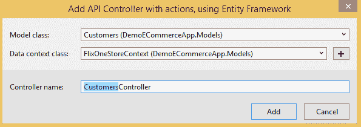

1.  点击添加。*哇!*它完成了所有艰苦的工作，并使用 EF Core 创建了一个完整的控制器，使用了所有主要的 HTTP 动词。以下代码块是控制器中仅包含`GET`方法的小快照。我已经删除了其他方法以节省空间：

```cs
// Removed usings for brevity.
namespace DemoECommerceApp.Controllers
{
  [Produces("application/json")]
  [Route("api/Customers")]
  public class CustomersController : Controller
  {
    private readonly FlixOneStoreContext _context;
    public CustomersController(FlixOneStoreContext context)
    {
      _context = context;
    }
    // GET: api/Customers
    [HttpGet]
    public IEnumerable<Customers> GetCustomers()
    {
      return _context.Customers;
    }
    // GET: api/Customers/5
    [HttpGet("{id}")]
    public async Task<IActionResult> GetCustomers
    ([FromRoute] Guid id)
    {
      if (!ModelState.IsValid)
      {
        return BadRequest(ModelState);
      }
      var customers = await 
      _context.Customers.SingleOrDefaultAsync(m => m.Id == id);
      if (customers == null)
      {
        return NotFound();
      }
      return Ok(customers);
    }

    // You will also find PUT POST, DELETE methods.
    // These action methods are removed to save space.
  }
}
```

这里需要注意以下几点：

+   注意`FlixOneStoreContext`是如何在这里通过将其注入构造函数来初始化的。此外，它将在所有操作中用于数据库相关操作：

```cs
private readonly FlixOneStoreContext _context;
public CustomersController(FlixOneStoreContext context)
{
  _context = context;
}
```

+   接下来要关注的是用于从操作中返回结果的方法。看看`BadRequest()`、`NotFound()`、`Ok()`和`NoContent()`是如何被用来返回易于客户端理解的正确 HTTP 响应代码的。我们将在稍后调用这些操作执行实际任务时看到它们返回什么代码。

# 从页面调用 API 以注册客户

为了简化问题，我设计了一个简单的 HTML 页面，其中包含客户记录的控制按钮，如下所示。我们将输入数据并尝试调用 API 以保存记录：

```cs
<div class="container">
  <h2>Register for FlixOneStore</h2>
  <div class="form-horizontal">
    <div class="form-group">
      <label class="control-label col-sm-2" for=
      "txtFirstName">First Name:</label>
      <div class="col-sm-3">
        <input type="text" class="form-control" id=
        "txtFirstName" placeholder=
        "Enter first name" name="firstname">
      </div>
    </div>
    <div class="form-group">
      <label class="control-label col-sm-2" for=
      "txtLastName">Last Name:</label>
      <div class="col-sm-3">
        <input type="text" class="form-control" id=
        "txtLastName" placeholder=
        "Enter last name" name="lastname">
      </div>
    </div>
    <div class="form-group">
      <label class="control-label col-sm-2" for="txtEmail">
      Email:</label>
      <div class="col-sm-3">
        <input type="email" class="form-control" id=
        "txtEmail" placeholder=
        "Enter email" name="email">
      </div>
    </div>
    <div class="form-group">
      <label class="control-label col-sm-2" for="gender">
      Gender:</label>
      <div class="col-sm-3">
        <label class="radio-inline"><input type="radio" 
        value="M" name="gender">Male</label>
        <lable class="radio-inline"><input type="radio" 
        value="F" name="gender">Female</lable>
      </div>
    </div>
    <div class="form-group">
      <label class="control-label col-sm-2" for="txtDob">
      Date of Birth:</label>
      <div class="col-sm-3">
        <input type="date" class="form-control" id="txtDob" />
      </div>
    </div>
    <div class="form-group">
      <label class="control-label col-sm-2" for="txtMobile">
      Mobile Number:</label>
      <div class="col-sm-3">
        <input type="text" class="form-control" id="txtMobile"
        placeholder=
        "Enter mobile number" />
      </div>
    </div>
    <div class="form-group">
      <label class="control-label col-sm-2" for="txtFax">Fax:</label>
      <div class="col-sm-3">
        <input type="text" class="form-control" id="txtFax"
        placeholder="Enter fax" />
      </div>
    </div>
    <div class="form-group">
      <label class="control-label col-sm-2" for="txtPassword">
      Password:</label>
      <div class="col-sm-3">
        <input type="password" class="form-control" id=
        "txtPassword" placeholder=
        "Enter password" name="pwd">
      </div>
    </div>
    <div class="form-group">
      <label class="control-label col-sm-2" for="txtConfirmPassword">
      Confirm Password:</label>
      <div class="col-sm-3">
        <input type="password" class="form-control"
        id="txtConfirmPassword" placeholder=
        "Enter password again" name="confirmpwd">
      </div>
    </div>
    <div class="form-group">
      <div class="col-sm-offset-2 col-sm-10">
        <button type="button" class="btn btn-success"
        id="btnRegister">Register</button>
      </div>
    </div>
  </div>
</div>
```

我在我的代码中使用了 bootstrap 和*jQuery*。您可以在附带的文件中查看整个代码，或者参考[`github.com/PacktPublishing/Building-RESTful-Web-services-with-DOTNET-Core`](https://github.com/PacktPublishing/Building-RESTful-Web-services-with-DOTNET-Core)。

现在是代码的重要部分，我们将调用 API 来存储客户记录。请参考以下代码块：

```cs
$(document).ready(function () {
  $('#btnRegister').click(function () {
    // Check password and confirm password.
    var password = $('#txtPassword').val(),
    confirmPassword = $('#txtConfirmPassword').val();
    if (password !== confirmPassword) {
      alert("Password and Confirm Password don't match!");
      return;
    }

    // Make a customer object.
    var customer = {
      "gender": $("input[name='gender']:checked").val(),
      "firstname": $('#txtFirstName').val(),
      "lastname": $('#txtLastName').val(),
      "dob": $('#txtDob').val(),
      "email": $('#txtEmail').val(),
      "telephone": $('#txtMobile').val(),
      "fax": $('#txtFax').val(),
      "password": $('#txtPassword').val(),
      "newsletteropted": false
    };

    $.ajax({
      url: 'http://localhost:57571/api/Customers',
      type: "POST",
      contentType: "application/json",
      data: JSON.stringify(customer),
      dataType: "json",
      success: function (result) {
        alert("A customer record created for: "
        + result.firstname + " " + result.lastname);
      },
      error: function (err) {
        alert(err.responseText);
      }
    });
  });
});
```

注意`http://localhost:57571/api/Customers` URL 和`POST` HTTP 方法。这最终会调用名为`PostCustomers`的 API 中的`Post`方法。我们肯定会在表中有一些唯一性，在我们的例子中，我将电子邮件视为每条记录的唯一标识。这就是为什么我需要稍微修改一下`action`方法：

```cs
// POST: api/Customers
[HttpPost]
public async Task<IActionResult> PostCustomers([FromBody] Customers customers)
{
  if (!ModelState.IsValid)
  {
    return BadRequest(ModelState);
  }
  // Unique mail id check.
 if (_context.Customers.Any(x => x.Email == customers.Email))
 {
 ModelState.AddModelError("email", "User with mail id already
    exists!");
 return BadRequest(ModelState);
 }
  _context.Customers.Add(customers);
  try
  {
    await _context.SaveChangesAsync();
  }
  catch (DbUpdateException ex)
  {
    if (CustomersExists(customers.Id))
    {
      return new StatusCodeResult(StatusCodes.Status409Conflict);
    }
    else
    {
      throw;
    }
  }
  return CreatedAtAction("GetCustomers", new { id = customers.Id },
  customers);
}
```

我通过为模型属性电子邮件添加错误消息来返回`BadRequest()`。我们将在稍后看到如何在浏览器上显示这个错误！

以下是从浏览器捕获的图片显示了成功创建*客户*的情况：

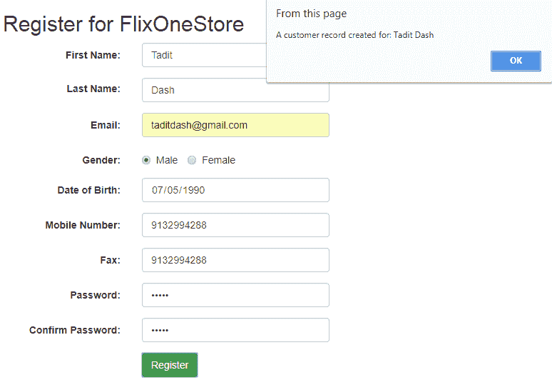

成功注册一个*客户*将类似于前面的图片，它显示了我们在 ajax 调用中的`success`方法内的成功消息。

你可以在`action`方法完成后对从`action`方法接收到的数据进行任何操作，因为它返回整个`customer`对象。如果你不相信我，请参考以下调试工具源窗口的截图：

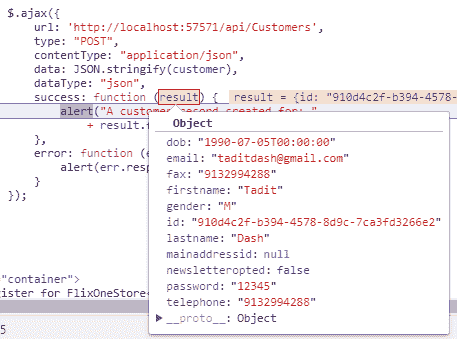

在 jQuery Ajax 成功方法中创建新客户后的 POST 请求的响应

那么，是谁做的这件事？简单，以下这个返回语句，它位于`POST`方法内部，完成了所有的魔法：

```cs
return CreatedAtAction("GetCustomers", new { id = customers.Id }, customers); 
```

这一行做了几件事情：

+   发送状态码：201 已创建，因为`POST`操作成功创建了资源。

+   设置一个带有资源实际 URL 的位置头。如果你记得 RESTful 特性，在`POST`操作之后，服务器应该发送资源的 URL。这正是它所做的事情。

让我通过展示开发者工具的网络标签来证明我的观点。你也可以使用*Postman*并分析它。以下截图显示了响应细节：


接收到的带有状态码和位置头的 POST 成功请求的响应

`Guid`实际上是`Customer ID`，正如我们在数据库中的列类型中定义的那样，我在`Customer`模型类的构造函数中为其赋值。

现在，如果你复制这个 URL 并在浏览器或 Postman 中打开它，你将得到客户的详细信息，如下面的截图所示：

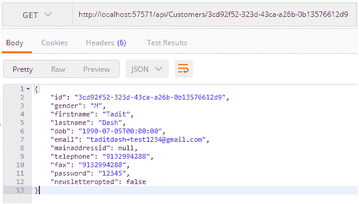

让我们看看一个带有已存在邮件 ID 的`BadRequest()`示例。由于`taditdash@gmail.com`客户已经存在，使用相同的电子邮件 ID 发送另一个请求应该会发送一个错误消息作为响应。让我们看看：

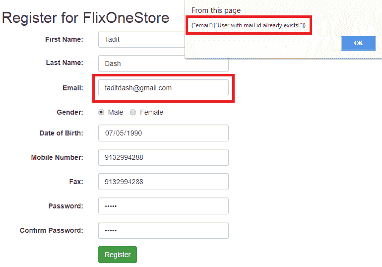

记住，我们添加了一行来检查电子邮件 ID 的存在，并添加了一个`ModelState`错误。现在它正在执行。

为了简化本书中的演示，我只是保存了纯文本密码。你实际上不应该这样做。实现密码的正确加密是必须的。

使用这种方式，我将结束注册过程。然而，在客户端和服务器端实施验证都有空间。你可以在`Model`类的属性中添加属性，使其更加稳固，这样你就不会从客户端收到不良数据。当`ModelState`验证失败时，发送一个`BadRequest()`响应。可以给`Model`类添加必需的电子邮件格式和密码比较属性。

# CORS

如果你调用 API 操作时看到以下错误，那么你需要启用**跨源资源共享**（**CORS**）：

```cs
Failed to load http://localhost:57571/api/Customers: Response to preflight request doesn't pass access control check: No 'Access-Control-Allow-Origin' header is present on the requested resource. Origin 'null' is therefore not allowed access. The response had HTTP status code 404.
```

要为所有来源启用 CORS，请按照以下步骤操作：

1.  安装`Microsoft.AspNetCore.Cors` NuGet 包：


1.  在`Startup ConfigureServices`内部，添加以下代码以实现一个允许所有来源的 CORS 策略：

```cs
services.AddCors(options =>
{
  options.AddPolicy("AllowAll",
    builder =>
    {
      builder
      .AllowAnyOrigin()
      .AllowAnyMethod()
      .AllowAnyHeader();
    });
});
```

1.  在 `Configure` 方法中，在 `app.UseMvc();` 之前添加以下行（这是很重要的）：

```cs
app.UseCors("AllowAll");
```

现在，它应该按预期工作。如果您想了解更多关于 CORS 的信息，请访问 [`docs.microsoft.com/en-us/aspnet/core/security/cors?view=aspnetcore-2.1`](https://docs.microsoft.com/en-us/aspnet/core/security/cors?view=aspnetcore-2.1)。

# 将基本认证添加到我们的 REST API 中

现在我们已经注册了 *客户*，我们可以转向认证过程。认证是为了验证 *客户* 是否是我们站点的有效用户。由于他们使用我们的注册表单进行了注册，我们已经有了他们的凭据。当他们尝试使用这些凭据从我们的网站访问任何资源时，我们将首先进行验证，然后允许访问。

注册将允许所有人进行，且不需要认证。然而，当 *客户* 想要 *读取他们的个人资料详情* 或 *删除他们的账户* 等操作时，我们需要设置认证，以确保数据返回给实际信任的应用程序用户。

对于 *基本认证*：

+   我们将获取 *用户名*，它将是客户端请求资源时的 *电子邮件 ID* 和 *密码*。这将通过 HTTP 头部发送。当设计客户端时，我们将看到它。

+   然后，将从数据库验证这些数据。

+   如果找到，将允许操作，否则将发送一个 `401 未授权` 响应。

# 第 1 步 – 添加 (授权) 属性

让我们限制返回 *客户* 个人资料详情的动作方法，即 `CustomersController` 的 `GET` 方法，命名为 `GetCustomers([FromRoute] Guid id)`。

当 *客户* 尝试访问个人资料时，我们将验证以下两点：

+   请求来自应用程序的信任用户。这意味着请求来自拥有有效 *电子邮件* 和 *密码* 的 *客户*。

+   客户只能访问他们的个人资料。为了检查这一点，我们将验证 *客户* 的凭据（存在于请求中）与 URL 上请求的 *客户* ID。

让我们开始吧。记住，我们的目标是实现以下内容：

```cs
[Authorize(AuthenticationSchemes = "Basic")]
public async Task<IActionResult> GetCustomers([FromRoute] Guid id)
```

现在，我们将专注于这个动作方法来理解这个概念。您可以看到这里定义了 `AuthenticationScheme` 为 `Basic` 的 `Authorize` 属性。这意味着我们必须告诉运行时什么是 *基本认证*，这样它就会在进入动作方法之前先执行。

如果认证成功，动作方法将被执行，否则将向客户端发送一个 401 未授权响应。

# 第 2 步 – 设计 BasicAuthenticationOptions 和 BasicAuthenticationHandler

首先，我们需要一个类，该类将继承 `Microsoft.AspNetCore.Authentication` 中存在的 `AuthenticationSchemeOptions` 类，如下面的代码块所示：

```cs
using Microsoft.AspNetCore.Authentication;
namespace DemoECommerceApp.Security.Authentication
{
  public class BasicAuthenticationOptions : AuthenticationSchemeOptions {}
}
```

为了简单起见，这里留空，但可以加载不同的属性。我们不会深入探讨这一点。

接下来，我们需要一个用于*基本认证*的处理程序，我们将在这里实现实际的逻辑：

```cs
public class BasicAuthenticationHandler : AuthenticationHandler<BasicAuthenticationOptions>
```

我们可以在其构造函数-like 后面添加一个额外的`DbContext`参数，因为我们将从数据库中验证*客户*的详细信息：

```cs
public BasicAuthenticationHandler(IOptionsMonitor<BasicAuthenticationOptions> options, ILoggerFactory logger, UrlEncoder encoder, ISystemClock clock, FlixOneStoreContext context)
: base(options, logger, encoder, clock)
{
  _context = context;
}
```

`AuthenticationHandler<T>`是一个具有与认证特别相关的属性和方法的高级类。目前我们将重写两个方法，`HandleAuthenticateAsync`和`HandleChallengeAsync`。`HandleAuthenticateAsync`将包含验证客户的实际逻辑，而`HandleChallengeAsync`用于处理 401 挑战问题，这意味着每当决定*客户*无效时，可以在该方法中编写代码来处理这种情况。

我们假设我们将通过名为`Authorization`的 HTTP 头接收电子邮件和密码，它们由分隔符冒号（`:`）分隔。以下是从头中提取数据并验证其是否正确的代码：

```cs
protected override Task<AuthenticateResult> HandleAuthenticateAsync()
{
  // 1\. Verify if AuthorizationHeaderName present in the header.
 // AuthorizationHeaderName is a string with value "Authorization".
  if (!Request.Headers.ContainsKey(AuthorizationHeaderName))
  {
    // Authorization header not found.
    return Task.FromResult(AuthenticateResult.NoResult());
  }
  // 2\. Verify if header is valid. 
  if (!AuthenticationHeaderValue.TryParse(Request.Headers
  [AuthorizationHeaderName], out AuthenticationHeaderValue 
  headerValue))
  {
    // Authorization header is not valid.
    return Task.FromResult(AuthenticateResult.NoResult());
  }
  // 3\. Verify is scheme name is Basic. BasicSchemeName is a string
 // with value 'Basic'. 
  if (!BasicSchemeName.Equals(headerValue.Scheme, StringComparison.
  OrdinalIgnoreCase))
  {
    // Authorization header is not Basic.
    return Task.FromResult(AuthenticateResult.NoResult());
  }
  // 4\. Fetch email and password from header.
 // If length is not 2, then authentication fails.
  byte[] headerValueBytes = Convert.FromBase64String(headerValue.
  Parameter);
  string emailPassword = Encoding.UTF8.GetString(headerValueBytes);
  string[] parts = emailPassword.Split(':');
  if (parts.Length != 2)
  {
    return Task.FromResult(AuthenticateResult.Fail("Invalid Basic
    Authentication Header"));
  }
  string email = parts[0];
  string password = parts[1];
  // 5\. Validate if email and password are correct.
  var customer = _context.Customers.SingleOrDefault(x => 
  x.Email == email && x.Password == password);
  if (customer == null)
  {
    return Task.FromResult(AuthenticateResult.Fail("Invalid email 
    and password."));
  }
  // 6\. Create claims with email and id.
  var claims = new[]
  { 
    new Claim(ClaimTypes.Name, email),
    new Claim(ClaimTypes.NameIdentifier, customer.Id.ToString())
  };
  // 7\. ClaimsIdentity creation with claims.
  var identity = new ClaimsIdentity(claims, Scheme.Name);
  var principal = new ClaimsPrincipal(identity);
  var ticket = new AuthenticationTicket(principal, Scheme.Name);
  return Task.FromResult(AuthenticateResult.Success(ticket));
}
```

代码非常容易理解。我在代码块中添加了步骤。基本上，我们正在尝试验证头部，然后处理它以查看它们是否正确。如果正确，则创建`ClaimsIdentity`对象，这可以在应用程序中进一步使用。我们将在下一节中这样做。在每一步中，如果验证失败，我们发送`AuthenticateResult.NoResult()`或`AuthenticateResult.Fail()`。

让我们尝试将这个认证附加到我们的操作方法上，使用以下类似的方法：

```cs
[HttpGet("{id}")]
[Authorize(AuthenticationSchemes = "Basic")]
public async Task<IActionResult> GetCustomers([FromRoute] Guid id)
{
  if (!ModelState.IsValid)
  {
    return BadRequest(ModelState);
  }
  var ident = User.Identity as ClaimsIdentity;
 var currentLoggeedInUserId = ident.Claims.FirstOrDefault
  (c => c.Type == ClaimTypes.NameIdentifier)?.Value;
 if (currentLoggeedInUserId != id.ToString())
 {
 // Not Authorized
 return BadRequest("You are not authorized!");
 }
  var customers = await _context.Customers.SingleOrDefaultAsync
  (m => m.Id == id);
  if (customers == null)
  {
    return NotFound();
  }
  return Ok(customers);
}
```

# 第 3 步 – 在启动时注册基本认证

看起来一切都已经设置好了，然而，我们遗漏了在启动时注册这个基本认证的一个步骤。否则，`BasicAuthenticationHandler`处理程序是如何被调用的呢？看看下面的代码：

```cs
services.AddAuthentication("Basic")
.AddScheme<BasicAuthenticationOptions, BasicAuthenticationHandler>("Basic", null);
services.AddTransient<IAuthenticationHandler, BasicAuthenticationHandler>();
```

要测试 API，你可以设计一个 HTML 页面，通过使用`Id`从 API 获取详细信息来显示用户的个人资料。你可以使用对 API 的*jQuery Ajax*调用并操作接收到的结果：

```cs
$.ajax({
  url: 'http://localhost:57571/api/Customers/
  910D4C2F-B394-4578-8D9C-7CA3FD3266E2',
  type: "GET",
  contentType: "application/json",
  dataType: "json",
  headers: { 'Authorization': 'Basic ' + btoa
  (email + ':' + password)},
  success: function (result) {
    // Work with result. Code removed for brevity.
  },
  error: function (err) 
  {
    if (err.status == 401) 
    {
      alert("Either wrong email and password or you are 
      not authorized to access the data!")
    }
  }
});
```

注意到头部部分，其中提到了带有冒号（`:`）分隔的`Authorization`头，其中包含`email`和`password`，并将其传递给`btoa`方法，该方法负责 Base64 加密。在你得到结果后，你可以做*许多*事情。以下截图显示了使用一些 bootstrap 设计在页面上展示的情况：

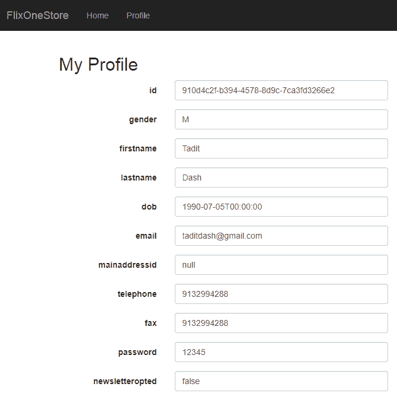

现在，有一个重要的代码块应该与之前的处理程序代码一起包含。那就是另一个需要重写的`HandleChallengeAsync`方法。这个方法的目的是在认证失败时处理情况。

我们将只发送一个带有响应的头部，名为`WWW-Authenticate`，其值可以用`realm`设置。先看看代码，然后我会解释：

```cs
protected override async Task HandleChallengeAsync(AuthenticationProperties properties)
{
  Response.Headers["WWW-Authenticate"] = $"Basic 
  realm=\"http://localhost:57571\", charset=\"UTF-8\"";
  await base.HandleChallengeAsync(properties);
}
```

如果客户端尝试访问受限制的资源或需要认证的资源，那么通知客户端关于认证类型和相关信息的责任在于服务器。`WWW-Authenticate` HTTP 响应头由定义了应使用何种认证方法来获取请求的受限制资源的服务器设置。

因此，很明显，`WWW-Authenticate`头会与 401 未授权响应一起发送。该字符串包含三个东西：*认证类型*、*域*和*字符集*。域是认证有效的域名或区域。

在我们的例子中，方案是`Basic`，域是`http://localhost:57571`，字符集是`UTF-8`。因此，如果客户端提供了基本认证参数作为`用户名`和`密码`，那么这些在`localhost:57571`域中将是有效的。

这就是它的含义。所以，只需移除分配代码的标题或将其注释掉以进行测试。以下是从 Chrome 的开发者工具网络标签页的截图：

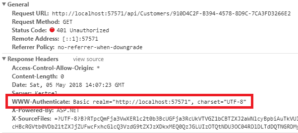

看看以下截图中的警告消息，这是我们在 Ajax 调用的错误方法中包含的。当 API 操作在没有凭证的情况下被调用时，会发生这种情况：  


# 将 OAuth 2.0 认证添加到我们的服务中

OAuth 是一个开放标准，由 API 用于控制客户端（如网站、桌面应用程序甚至其他 API）对资源的访问。然而，实现 OAuth 的 API 可以在不与第三方应用共享密码的情况下提供用户信息。

你可能见过允许使用不同服务（如 Facebook、Twitter 或 Google）登录的网站，比如（对于 Facebook）使用 Facebook 登录。这意味着 Facebook 有一个 OAuth 服务器，它会通过你之前提供给 Facebook 的某个身份验证你的应用程序，并给你一个有效的访问令牌。使用该令牌，你可以读取所需用户的个人资料。

以下是一些基本的 OAuth2.0 术语：

+   **资源：** 我们已经在之前的章节中定义了这一点。资源是我们需要保护的东西。这可能与我们系统相关的任何信息。

+   **资源服务器：** 这是保护资源的服务器，通常是用来访问我们电子商务数据库的 API。

+   **资源所有者：** 将授予我们访问特定资源的人。大多数情况下，用户是所有者，正如你点击使用 Facebook 登录时所见，它会要求你的登录和同意。

+   **客户端：** 希望访问我们资源的应用程序。在我们的例子中，它是当在设计的 HTML 页面上执行*jQuery*代码时尝试访问资源的浏览器。

+   **访问令牌**：这实际上是这个架构的基石。我们将要设计的 OAuth 服务器应该使用用户的凭证来提供令牌，以便后续访问我们的资源，正如我们所知，OAuth 标准告诉我们不要向客户端提供密码。

+   **Bearer 令牌**：这是一种特定的访问令牌，允许任何人轻松地使用该令牌，这意味着，为了使用令牌进行资源访问，客户端不需要加密密钥或其他秘密密钥。由于这比其他类型的令牌安全性较低，Bearer 令牌应仅在 HTTPS 上使用，并且应在短时间内过期。

+   **授权服务器**：这是向客户端提供访问令牌的服务器。

让我们开始将 OAuth 添加到我们的 Web API 中。我们将使用 IdentityServer4，这是一个免费的、开源的 OpenID Connect 和 OAuth 2.0 框架，适用于 ASP.NET Core。项目可以在以下位置找到：[`github.com/IdentityServer`](https://github.com/IdentityServer)。

IdentityServer ([`identityserver.io/`](http://identityserver.io/)) 基于 OWIN/Katana，但据我们所知，它作为分布式软件包以 NuGet 包的形式提供。为了开始使用 IdentityServer，请安装以下两个 NuGet 包：


在生产场景中，理想情况下，授权服务器应与主 Web API 分离。但为了这本书的简单起见，我们将直接将其放入同一个 Web API 项目中。我们不使用默认的 ASP.NET Core Identity。我们将使用我们自己的表格集。例如，我们将使用我们的 *客户* 表的详细信息进行验证。

# 第一步 – 设计 Config 类

`Config` 类包含了授权服务器的重要细节，例如 *资源*、*客户端* 和 *用户*。这些细节在生成令牌时会被使用。让我们来设计它：

```cs
public class Config
{
  public static IEnumerable<ApiResource> GetApiResources()
  {
    return new List<ApiResource>
    {
      new ApiResource
      (
        "FlixOneStore.ReadAccess",
        "FlixOneStore API", 
         new List<string> 
         {
           JwtClaimTypes.Id,
           JwtClaimTypes.Email,
           JwtClaimTypes.Name,
           JwtClaimTypes.GivenName,
           JwtClaimTypes.FamilyName
        }
      ),

      new ApiResource("FlixOneStore.FullAccess", "FlixOneStore API")
    }; 
  }
}
```

`ApiResource` 用于声明 API 的不同作用域和声明。对于简单的情况，一个 API 可能有一个简单的资源结构，它将向所有客户端提供访问权限。然而，在典型场景中，客户端可以限制访问 API 的不同部分。在声明客户端时，我们将使用这些资源来配置它们的作用域和访问权限。`ReadAccess` 和 `FullAccess` 是两种不同的资源类型，可以与客户端一起使用，分别提供读取和完全访问权限。

基本上，我们现在设计的这些方法将在 `Startup` 中被调用。在这里，`GetApiResources` 实际上是在创建两种不同设置的资源。第一种就是我们目前将要处理的。我们将其命名为 `FlixOneStore.ReadAccess`。您可以看到一个包含 `Id`、`Name` 等字符串的列表，这些都是将与令牌一起生成并传递给客户端的客户详细信息。

让我们添加一个客户端的详细信息，我们将从该客户端消费授权服务器：

```cs
public static IEnumerable<Client> GetClients()
{
  return new[]
  {
    new Client
    {
      Enabled = true,
      ClientName = "HTML Page Client",
      ClientId = "htmlClient",
      AllowedGrantTypes = GrantTypes.ResourceOwnerPassword,

      ClientSecrets =
      {
        new Secret("secretpassword".Sha256())
      },

      AllowedScopes = { "FlixOneStore.ReadAccess" }
    }
  };
}
```

您可以根据需要添加多个客户端。您可以在该方法中设置*客户端 ID*、*客户端密钥*和*授权类型*，根据 OAuth 标准。注意，密码设置为`secretpassword`。您可以在这里设置任何字符串；它可以是`Guid`。在这里，`GrantType.ResourceOwnerPassword`定义了我们验证传入请求以生成令牌的方式。

它告诉**授权服务器**，“嘿，在请求体中查找`username`和`password`。”还有其他类型的授权可用。您可以在官方文档链接中了解更多信息。

您现在可能有一个问题！我们将如何处理`username`和`password`？当然，我们将验证它们，但用什么呢？答案是来自`Customers`表的`Email`和`Password`字段。我们还没有做任何与将**授权服务器**与**客户端**表连接相关的事情。这就是我们接下来要做的。但在那之前，让我们在`Startup`中注册这些设置。

只是为了确保我们处于同一页面上，我们已经到达了这样一个点，即我们正在尝试从授权服务器生成令牌以访问我们的 API。

# 第 2 步 – 在启动时注册配置

对于注册，我们必须在`ConfigureServices`方法中做以下事情：

```cs
services.AddIdentityServer()
        .AddInMemoryApiResources(Config.GetApiResources())
        .AddInMemoryClients(Config.GetClients())
        .AddProfileService<ProfileService>()
        .AddDeveloperSigningCredential();
```

我们通过调用我们设计的函数来加载所有这些配置设置，例如**资源**和**客户端**。`AddDeveloperSigningCredential`在启动时添加一个临时密钥，仅在开发环境中使用，因为我们没有证书可以申请授权。您将为实际使用添加适当的证书详细信息。

在这里标记`ProfileService`。这正是我在上一节中提到的事情，它将被用来验证用户凭据与数据库。我们稍后会看看它。首先，让我们测试我们的 API，假设授权服务器已经准备好，并且设置了`ProfileService`。

现在转到 API，我们需要在 API 开始处添加`AuthenticationScheme`来声明我们将使用哪种身份验证。为此，添加以下代码：

```cs
services.AddAuthentication(options =>
{
  options.DefaultAuthenticateScheme = 
  JwtBearerDefaults.AuthenticationScheme;
  options.DefaultChallengeScheme = 
  JwtBearerDefaults.AuthenticationScheme;
})
.AddJwtBearer(o =>
{
  o.Authority = "http://localhost:57571";
  o.Audience = "FlixOneStore.ReadAccess";
  o.RequireHttpsMetadata = false;
});
```

`JwtBearerDefaults.AuthenticationScheme`实际上是一个包含**Bearer**值的字符串常量。**Bearer 身份验证**也称为**令牌身份验证**。这意味着我们的客户端需要发送一个令牌才能访问 API 的资源。而要获取令牌，他们需要调用我们的**授权服务器**，该服务器位于`/connect/token`。

注意我们已将`Audience`设置为`FlixOneStore.ReadAccess`，这是我们已在配置中为客户端指定的。简单来说，我们正在设置 Bearer 类型的身份验证。

# 第 3 步 – 添加[Authorize]属性

接下来，我们需要将`[Authorize]`属性添加到 API 控制器操作中。让我们用`GetCustomers(id)`方法来测试一下：

```cs
// GET: api/Customers/5
[HttpGet("{id}")]
[Authorize]
public async Task<IActionResult> GetCustomers([FromRoute] Guid id)
```

从**邮递员**（Postman）调用它将产生以下输出：

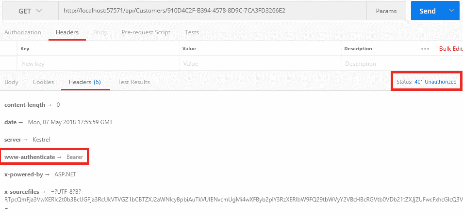

因此，我们的请求不再被授权了。我们得到了一个回复，说我们需要发送一个令牌才能访问资源。那么，让我们获取令牌吧。

# 第 4 步 – 获取令牌

为了获取令牌，我们需要调用位于`/connect/token`的授权服务器。

以下是从*Postman*截取的屏幕截图，其中在`http://localhost:57571/connect/token` URL 上执行了一个`POST`请求，请求体包含所有必要的参数，以验证客户端。这些是我们根据步骤 1 在`GetClients()`方法中注册的详细信息：


哎呀！这是一个错误的请求。这是因为我们传递了错误的客户端密码。如果你记得，我们将其设置为`secretpassword`，但传递的是`secret`。这就是它被拒绝的原因。

这里有一些需要注意的重要事项。为了获取令牌：

+   我们需要向`/connect/token` URL 发送一个`POST`请求。由于我们在同一个应用中实现了服务器，所以这里的域与 API 相同。

+   我们需要设置一个`Content-Type`头，设置为`application/x-www-form-urlencoded`（这在截图上的实际上是不同的标签页）。

+   在请求体中，我们根据标准添加了所有必要的 OAuth 参数，并且它们与我们配置类中拥有的完全匹配。

当我们正确发送所有必需的信息时，我们将收到一个令牌，如下面的屏幕截图所示：

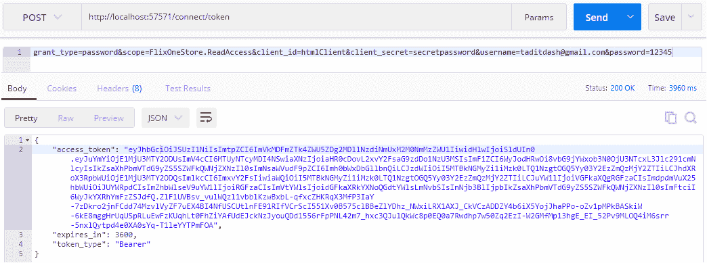

我们根据 OAuth 规范收到了携带令牌的响应。它们是`access_token`、`expires_in`和`token_type`。`expires_in`参数默认设置为 3600 秒，即 1 小时，对于访问令牌来说。1 小时后，这个令牌将不再有效。因此，在令牌过期之前，让我们快速使用它调用我们的 API，看看是否可行。

# 第 5 步 – 使用访问令牌调用 API

看看下面的图片，它展示了使用我们刚刚收到的令牌调用 API 的过程：

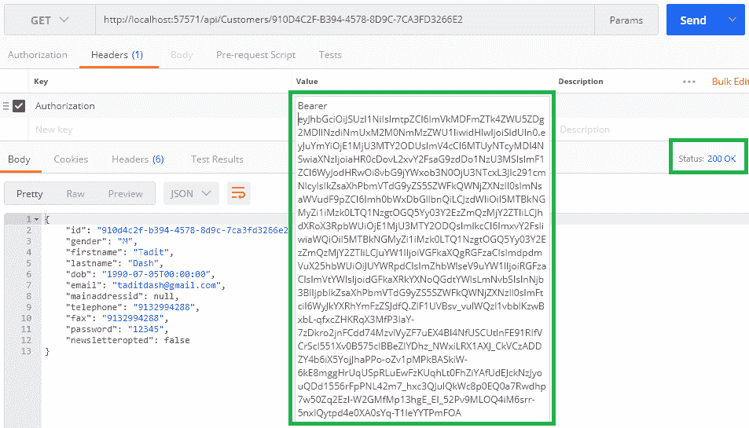

在授权头中使用令牌调用 API 端点

哇！这成功了。我只是复制了我得到的令牌，并以`Bearer [访问令牌]`的格式添加到授权头中，并发送了请求。现在一切完美了。

# 第 6 步 – 添加 ProfileService 类

当我们探索所有这些时，我遗漏了一部分，现在我想解释一下。如果你在我们获取访问令牌时看到请求体，它看起来像这样：

```cs
grant_type=password&scope=FlixOneStore.ReadAccess&client_id=htmlClient&client_secret=secretpassword&username=taditdash@gmail.com&password=12345
```

关注`username`和`password`参数。它们在这里有原因。在生成令牌时，这些参数正在被验证，是的，我们直接与数据库进行验证。让我们看看如何进行。

`IdentityServer4`为此提供了两个接口，分别命名为`IProfileService`和`IResourceOwnerPasswordValidator`。

以下是一个实现接口的 `ResourceOwnerPasswordValidator` 类。记住，我们在配置中为客户端设置了 `AllowedGrantTypes = GrantTypes.ResourceOwnerPassword`。这就是我们为什么要这样做来验证用户的凭据：

```cs
public class ResourceOwnerPasswordValidator : IResourceOwnerPasswordValidator
{
  private readonly FlixOneStoreContext _context;
  public ResourceOwnerPasswordValidator(FlixOneStoreContext context)
  {
    _context = context;
  }
  public async Task ValidateAsync(ResourceOwnerPassword
  ValidationContext context)
  {
    try
    {
      var customer = await _context.Customers.SingleOrDefaultAsync
      (m => m.Email == context.UserName);
      if (customer != null)
      {
        if (customer.Password == context.Password)
        {
          context.Result = new GrantValidationResult(
 subject: customer.Id.ToString(),
 authenticationMethod: "database",
 claims: GetUserClaims(customer));
          return;
        }
        context.Result = new GrantValidationResult
        (TokenRequestErrors.InvalidGrant,
        "Incorrect password");
        return;
      }
      context.Result = new GrantValidationResult
      (TokenRequestErrors.InvalidGrant,
      "User does not exist.");
      return;
    }
    catch (Exception ex)
    {
      context.Result = new GrantValidationResult
      (TokenRequestErrors.InvalidGrant,
      "Invalid username or password");
    }
  }
  public static Claim[] GetUserClaims(Customers customer)
  {
    return new Claim[]
    {
      new Claim(JwtClaimTypes.Id, customer.Id.ToString() ?? ""),
      new Claim(JwtClaimTypes.Name, (
      !string.IsNullOrEmpty(customer.Firstname) &&  
      !string.IsNullOrEmpty(customer.Lastname))
      ? (customer.Firstname + " " + customer.Lastname)
      : String.Empty),
      new Claim(JwtClaimTypes.GivenName, customer.Firstname ?? 
      string.Empty),
      new Claim(JwtClaimTypes.FamilyName, customer.Lastname ??       
      string.Empty),
      new Claim(JwtClaimTypes.Email, customer.Email ?? string.Empty)
    };
  }
}
```

在前面的代码中标记粗体行。`ValidateAsync` 是一个方法，它从请求中获取详细信息，然后与数据库值进行验证。如果匹配，我们创建一个包含 `subject`、`authenticationMethod` 和 `claims` 的 `GrantValidationResult` 对象。

`GetUserClaims` 帮助我们构建所有声明。我们将在稍后看到这些声明的实际用途。

我们在配置中添加了多个声明，包括 `ApiResources` 的列表，例如 `Id`、`Name`、`Email`、`GivenName` 和 `FamilyName`。这意味着服务器可以返回关于 *客户* 的这些详细信息。

让我们跳转到 `ProfileService`：

```cs
public class ProfileService : IProfileService
{
  private readonly FlixOneStoreContext _context;
  public ProfileService(FlixOneStoreContext context)
  {
    _context = context;
  }
  public async Task GetProfileDataAsync(ProfileDataRequestContext 
  profileContext)
  {
    if (!string.IsNullOrEmpty(profileContext.Subject.Identity.Name))
    {
      var customer = await _context.Customers
      .SingleOrDefaultAsync(m => m.Email == 
      profileContext.Subject.Identity.Name);
      if (customer != null)
      {
        var claims = ResourceOwnerPasswordValidator.
        GetUserClaims(customer);
 profileContext.IssuedClaims = claims.Where(x => 
        profileContext.RequestedClaimTypes.Contains(x.Type)).ToList();
      }
    }
    else
    {
      var customerId = profileContext.Subject.Claims.FirstOrDefault
      (x => x.Type == "sub");
      if (!string.IsNullOrEmpty(customerId.Value))
      {
        var customer = await _context.Customers
        .SingleOrDefaultAsync(u => u.Id == 
        Guid.Parse(customerId.Value));
        if (customer != null)
        {
          var claims = 
          ResourceOwnerPasswordValidator.GetUserClaims(customer);
 profileContext.IssuedClaims = claims.Where(x => 
          profileContext.RequestedClaimTypes.Contains(x.Type)).
          ToList();
        }
      }
    } 
  }
}
```

`ProfileDataRequestContext` 对象被填充了我们添加到 `ApiResource` 中的所有声明。请参考以下调试时请求的声明列表截图：


这意味着我们需要从我们所做的 *客户* 记录中填写所有这些详细信息，并将其添加到 `IssuedClaims` 中。

等一下！我们为什么要这样做？因为我们的配置告诉我们需要提供这些信息。但我们是否需要填写所有请求的信息？不。不一定。我们可以发放我们想要的任意多或任意少的声明。

现在的大问题！我们到哪里找到这些信息？我们知道在所有这些授权设置之后，我们得到一个加密的令牌字符串。你猜到了吗？是的，所有这些信息实际上都驻留在令牌本身中。不要相信我，相信以下截图。因为令牌是一个 JWT 令牌，你可以使用 [`jwt.io/`](https://jwt.io/) 来解码它并查看里面有什么：

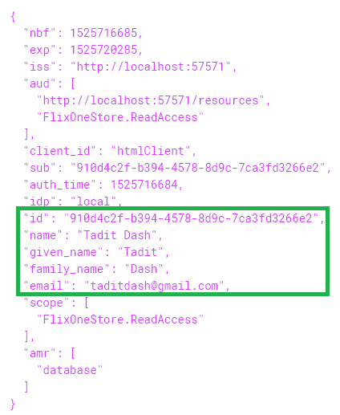

# 基于客户端的 API 消费架构

我们已经讨论了 *RESTful 服务、Web API* 以及如何注册、认证和授权用户。此外，我们还稍微关注了服务的消费方面。服务不仅设计用于在 *Postman* 上进行测试，而且实际上是为了被不同类型的应用程序（桌面、Web、移动、智能手表和物联网应用程序）消费。

当大多数现代应用程序基于 MVC 架构时，在那些应用程序的控制器中消费 Web 服务有一定的需求。基本上，我需要找到一种方法，从我的控制器中调用服务而没有任何麻烦。

为了实现这一点，我不能调用 *Postman* 或任何其他第三方工具。我需要的是一个客户端或组件，它可以与我交互 *RESTful Web API*。我只需要告诉这个客户端我需要通过传递 `id` 或某些标识符来获取 *客户* 的详细信息，其余的由客户端处理，包括调用 API、传递值和获取响应。响应最终返回到控制器，然后我可以对其进行操作。

我们将在第十章 构建 Web 客户端（消费 Web 服务） 中探讨如何通过简单、快捷、简单的步骤构建 REST 客户端。

# 摘要

注册是应用程序中非常常见但非常重要的一个部分。我们通过 API 处理了 *客户* 的注册。在此之前，我们学习了如何使用 EF Core 引导 API 控制器操作和模型类。在我们做所有这些的同时，我们还遇到了 CORS 并学习了如何处理它。

然后，我们逐渐转向认证部分，其中我们详细讨论了 *基本认证*。这是一种通过 *客户*（即我们 API 的用户）的凭证（`用户名` 和 `密码`）来验证客户端的机制，这些凭证随请求一起传递。

*Bearer* 或 *基于令牌* 认证是我们接下来探索的主题，我们使用了 *IdentityServer4* 实现了 OAuth 模式。在这种情况下，客户端不能像基本认证那样直接通过 `用户名` 和 `密码` 访问资源。它首先需要一个令牌，这个令牌是由一个授权服务器在客户端请求时，根据客户端的详细信息（如 *客户端 ID* 和 *客户端密钥*）生成的。然后，这个令牌可以被发送到 API，用于后续请求以访问受限制的资源。

在下一章中，我们将把这些知识应用到构建我们 API 的其他组件中，例如 *购物车*、*运输*、*订单项* 和 *结账*。
