# 第八章：保护 RESTful Web 服务

在 Web 应用程序的世界中，在 HTTP 上存在大量的请求和响应交换，安全是其中一个最重要的横切关注点。任何不安全的服务或 Web 应用程序都可能面临数据篡改问题。

“当数据被未经授权的渠道修改（销毁、篡改或编辑）时，通常被称为数据篡改。”

数据在传输或存储在其他地方时可能会被篡改。数据被篡改可能有几个原因——在行业中，未受保护的数据是最常见的原因。为了防止这些问题，您可以保护您的环境和应用程序系统。通常，防火墙是保护环境（服务器）的最佳方式。您可以通过实施授权机制来保护应用程序。

不幸的是，知名网站的数据泄露事件如今司空见惯。考虑到这一点，信息和应用程序安全对 Web 应用程序变得至关重要。因此，安全的应用程序不应再是事后考虑的事情。在组织中，安全是每个人的责任。

在本章中，我们将主要关注安全和 REST 以及 OWASP 安全标准。到本章结束时，您将了解认证、单点登录（SSO）、基于令牌的认证以及使用代理服务器（如 Azure API Management）进行认证的概念。我们将涵盖以下主题：

+   OWASP 网络安全标准

+   保护 RESTful web 服务

+   认证和授权

+   验证

+   数据加密和存储敏感数据

# OWASP 安全标准

**开放网络应用安全项目**（**OWASP**）是一个在线社区，主要通过创建各种研究和标准来解决 Web 应用程序安全问题。在本章中，我们将遵循 2017 年发布的 OWASP 安全标准（[`www.owasp.org/index.php/Top_10-2017_Top_10`](https://www.owasp.org/index.php/Top_10-2017_Top_10)）：

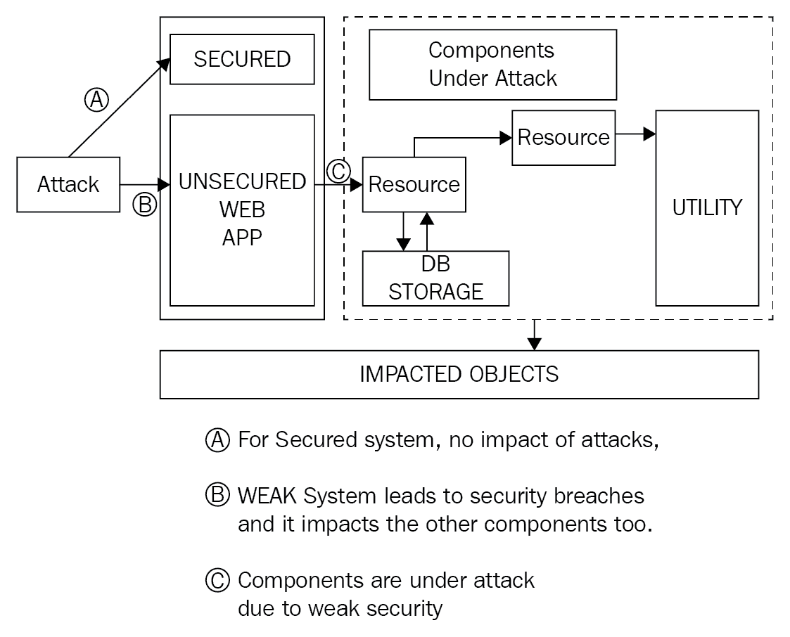

应用安全风险

上述图表是应用程序安全风险的概述图。它描述了攻击者可能如何攻击一个较弱的程序。攻击者通过注入脚本（主要是 JavaScript）并影响系统来攻击应用程序组件。在这张图片中，您会注意到只有未受保护的 Web 应用程序部分受到攻击。一个安全系统即使在遭受攻击后也是安全的。

以下是由 OWASP 定义的应用程序安全风险：

+   注入

+   破坏性认证

+   敏感数据泄露

+   XML 外部实体（XXE）

+   破坏性的访问控制

+   安全配置错误

+   跨站脚本（XSS）

+   不安全的反序列化

这些是高警报的安全风险，应该在每个 Web 应用程序中处理。

# 保护 RESTful web 服务

在你开始学习关于保护 RESTful Web 服务之前，我想告诉你关于 Web 世界中的安全性的情况。一般来说，短语“安全性”描述的是为确保一切安全而采取的措施。但这里的“一切”包括什么？让我们详细说明：安全性是一种阻止未经验证和未经授权访问通过 Web 应用程序机密数据的方式或过程。

机密数据的类型取决于 Web 应用的性质——例如，如果 Web 应用程序是用于医疗和临床服务，则机密信息包括所有与患者测试、医疗历史等相关患者的数据。

创建安全过程的第一个步骤是验证和授权对 Web 应用的访问。如果请求未进行身份验证，则系统不应接受该请求。如果请求已进行身份验证但未授权访问 Web 应用程序的数据，则也不应接受该请求。

以下图表展示了使用 Auth 服务进行身份验证过程的概述：

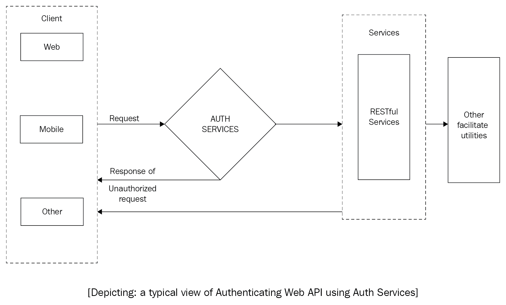

在前面的图表中，你可以考虑一个典型的使用 Auth 服务作为中间件服务器的 ASP.NET Core API 系统。可能有多个客户端或消费者正在使用这些服务并请求访问数据。在这里，Auth 服务在验证来自客户端的传入请求方面发挥着重要作用。如果 Auth 服务识别请求为已验证，则生成一个令牌并将其发送到 API 服务器以进行进一步处理。如果请求未经验证，则 Auth 服务会通知客户端身份验证失败。前面的图像只是一个典型场景的概述。实际场景可能更复杂，可能使用一个或多个中间件后端服务器（典型的 API 管理服务器）。

在以下章节中，你将更好地了解以下两个重要的安全概念：

+   **身份验证**：身份验证不过是一个通过某种凭证（通常是一个用户 ID 和密码）来验证或识别传入请求的过程。如果系统发现提供的凭证错误，则它会通知用户（通常通过 GUI 屏幕上的消息），并终止授权过程。

+   **授权**：授权总是在身份验证之后进行。这是一个允许已验证用户在验证他们有权访问特定资源或数据后访问资源或数据的过程。

从这里，你可以得出结论，RESTful 服务的安全性是应用程序最重要的功能。

你如何在 RESTful Web 服务中维护会话？

RESTful Web 服务使用 HTTP 协议，这是一个无状态协议([`stackoverflow.com/questions/13200152/why-say-that-http-is-a-stateless-protocol`](https://stackoverflow.com/questions/13200152/why-say-that-http-is-a-stateless-protocol))，并将每个请求视为新的请求。HTTP 协议没有提供在 RESTful Web 服务中维护会话的方法。但是，我们可以通过使用认证令牌程序化地实现这一点。这种技术被称为基于令牌的授权（我们将在接下来的章节中详细讨论）。借助这种技术，您可以授权经过认证的用户允许数据或资源在预定义的时间内。

每个通过服务或其他任何方式发送的请求在系统响应用户或发起调用的客户端之前都应进行身份验证和授权。此过程主要包括以下内容：

+   **机密性**：安全系统确保任何敏感数据不会被未经验证和未经授权的访问请求暴露

+   **可用性**：系统的安全措施确保系统对经过系统验证和授权的合法用户可用

+   **完整性**：在安全系统中，数据篡改是不可能的，因此数据是安全的

# 不安全 Web 应用程序的易受攻击区域

在今天的 Web 应用程序中，主要需要保护免受未经授权访问的易受攻击资产是资源和数据。如果一个网站不安全，那么漏洞的可能性就很高。根据官方网站[ https://docs.microsoft.com/en-us/aspnet/core/security/](https://docs.microsoft.com/en-us/aspnet/core/security/)，以下区域是任何不安全 Web 应用程序的主要威胁。

# 跨站脚本攻击

跨站脚本攻击——或称 XSS 攻击——通常是由于不良输入而发生的，攻击者将客户端脚本（通常是 JavaScript）注入到网页中。根据官方网页([`docs.microsoft.com/en-us/aspnet/core/security/cross-site-scripting`](https://docs.microsoft.com/en-us/aspnet/core/security/cross-site-scripting))：

"跨站脚本（XSS）是一种安全漏洞，它允许攻击者将客户端脚本（通常是 JavaScript）放入网页中。"

在这里，我使用了一个消费 Web 服务的 Web 客户端的例子。你将在第十章[9fcac4d2-710a-48a2-98be-ed0034525cee.xhtml]，*构建 Web 客户端（消费 Web 服务）*中了解更多关于 Web 客户端的内容。

以下截图显示了一个攻击中创建屏幕的场景：

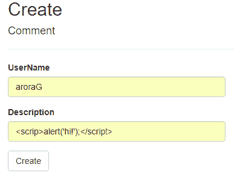

上述截图表示了一个不安全的 Web 应用程序。在这里，用户可以注入脚本标签，当用户点击创建时，它会被发送回服务器。

以下截图显示了代码的调试模式，我们可以看到我们的系统正在接受脚本数据：

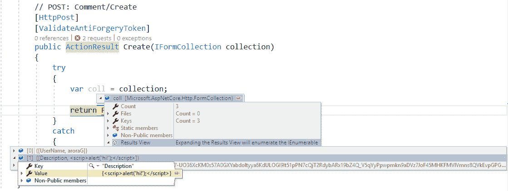

前面的截图显示了它如何被发送到服务器，并最终保存在数据库或任何持久存储库中。

以下截图显示了受影响的页面：

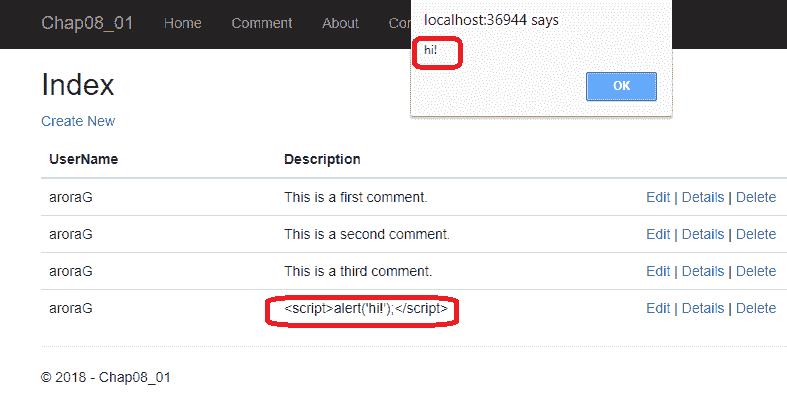

当任何人访问受影响数据的页面时，它将显示一个警告，如前面的截图所示。

你可以通过应用一些代码更改来构建一个阻止此类攻击的系统。我将在*验证*部分中介绍这一点。

# SQL 注入攻击

SQL 注入攻击是直接针对数据库的最严重的攻击之一。这是 OWASP 应用程序安全风险列表中的第一个。攻击者可以利用 SQL 注入窃取系统的受保护数据。

以下图显示了 SQL 注入的过程：

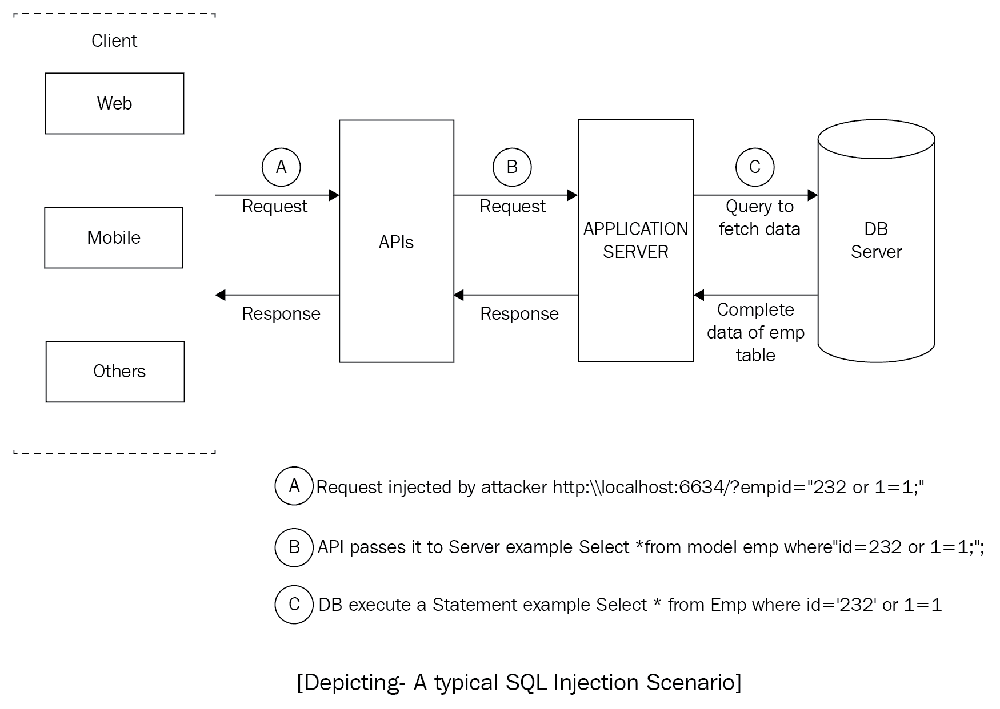

在前面的图中，你可以看到一个典型的 SQL 注入场景，攻击者注入了一个`or`子句来获取特定表的全部数据。实际的代码指令是根据员工表中的`EmpId`返回单个记录。但由于注入了额外的短语，它返回了员工表的完整记录。这是不安全系统最大的问题。在这里，攻击者将一个简单的子句注入到语句中。

# 这里在做什么？

在前面的部分，你看到了一个假设的场景，并进行了 SQL 注入的实际操作。现在，让我们通过创建一个使用 ASP.NET Core 2.0 的 RESTful 产品 API 来查看一个实际示例。在你开始构建这个应用程序之前，请记住以下应用程序的先决条件：

+   Visual Studio 2017 更新 3 或更高版本

+   ASP.NET Core 2.0 或更高版本

+   C#7.0 或更高版本

+   Microsoft Entity Framework Core 2.0.0

按照以下步骤创建我们的应用程序：

1.  打开 Visual Studio。

1.  选择文件 | 新建 | 项目或按*Ctrl* + *Shift* + *F5*。

1.  选择 ASP.NET Core Web 应用程序。

1.  从模板窗口中选择 ASP.NET Core API。确保你选择了.NET Core 2.0。

1.  命名项目，选择解决方案的路径，然后单击确定。

1.  添加`Models`文件夹。在解决方案资源管理器中右键单击，从下拉菜单中选择添加新文件夹，并将其命名为`Models`。

1.  在`Models`文件夹下添加一个新类。在解决方案资源管理器中右键单击`Models`文件夹，从下拉菜单中选择添加新项 | 类，或者使用*Shift* + *Alt* + *C*。

请注意，快捷键会根据你的 Visual Studio 设置而有所不同。

1.  命名为`Product.cs`，并将以下代码添加到这个类中：

```cs
namespace Chap08_02.Models
{
  public class Product
  {
    public Guid Id { get; set; }
    public string Name { get; set; }
    public string Description { get; set; }
    public string Image { get; set; }
    public decimal Price { get; set; }
    public Guid CategoryId { get; set; }
    public virtual Category Category { get; set; }
  }
}
```

1.  重复步骤 7 和 8，添加`Category.cs`和`ProductViewModel.cs`。

1.  重复步骤 6，添加`Contexts`文件夹。

1.  在 `Contexts` 文件夹下添加一个新类。在解决方案资源管理器中右键单击 `Contexts` 文件夹，选择添加新项，在对话框中，选择类，或使用 *Shift* + *Alt* + *C*

1.  将其命名为 `ProductContext.cs`。

1.  现在，打开 `appsettings.json` 文件并添加以下代码：

```cs
"ConnectionStrings": 
{
  "ProductConnection": "Data Source=.;Initial
  Catalog=ProductsDB;Integrated  
  Security=True;MultipleActiveResultSets=True"
}
```

1.  在解决方案资源管理器中右键单击项目并选择管理 NuGet 包。

1.  在 NuGet 包管理器界面下，搜索 `Swashbuckle.ASPNETCore` 并安装它。

1.  添加一个名为 `Persistence` 的新文件夹。

1.  在 `Persistence` 文件夹下添加一个 `IProductRepository` 接口。

1.  将以下代码添加到 `IProductRepository` 接口：

```cs
namespace Chap08_02.Persistence
{
  public interface IProductRepository
  {
    void Add(Product product);
    IEnumerable<Product> GetAll();
    IEnumerable<Product> GetByProduct(string id);
    IEnumerable<Product> GetBy(string productName);
    void Remove(string id);
    void Update(Product product);
  }
}
```

参考 GitHub 仓库链接 [`github.com/PacktPublishing/Building-RESTful-Web-Services-with-DotNET-Core`](https://github.com/PacktPublishing/Building-RESTful-Web-Services-with-DotNET-Core) 以获取完整的源代码。

1.  在 `Persistence` 文件夹下添加 `ProductRepository.cs` 类。

1.  将以下代码添加到 `ProductRepository.cs`：

```cs
public IEnumerable<Product> GetByProduct(string id) => _context.Products.FromSql("SELECT * FROM dbo.Products WHERE id="+ id).Include(p => p.Category)
    .ToList();
```

1.  打开 `Startup.cs` 文件并添加以下代码：

```cs
services.AddScoped<IProductRepository, ProductRepository>();
services.AddDbContext<ProductContext>
(
  o => o.UseSqlServer
  (
    Configuration.GetConnectionString("ProductConnection")
  )
);
services.AddSwaggerGen
(
  swagger =>
  {
    swagger.SwaggerDoc("v1", new Info { Title = "Product APIs",  
    Version = "v1" 
  });
});
```

1.  现在，您已经准备好与该应用程序互动了。从菜单中运行应用程序或按 *F5* 键。在网页浏览器中，将 `/swagger` 后缀添加到地址栏中的 URL，如下面的截图所示：


它将显示 Swagger API 文档，如下面的截图所示：

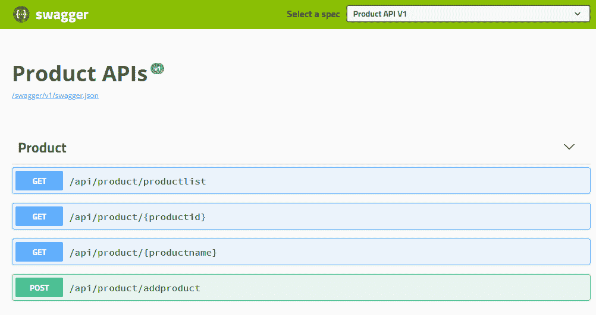

产品 API 的 Swagger 文档

我使用 Swagger 进行文档编写和测试 API 调用。您可以使用其他 API 测试客户端，例如 Advanced Rest Client 和 PostMan。

1.  要测试我们的未加密代码，请点击 `GET` `/api/product/{productid}` 资源，并传递产品 ID，如下面的截图所示：

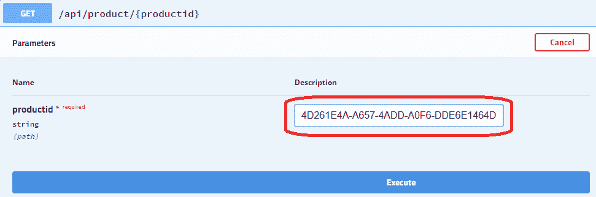

1.  点击执行。您应该看到以下预期输出：

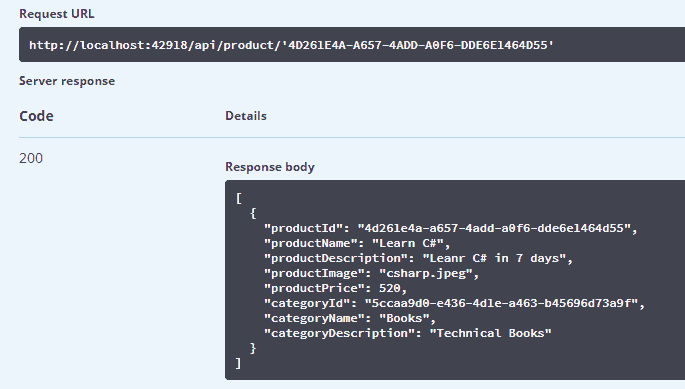

现在，让我们尝试添加 `OR` 子句并看看会发生什么。在这里，我将 `productid` 值输入为 `4D261E4A-A657-4ADD-A0F6-DDE6E1464D55` 或 `1=1`。执行它并查看结果：

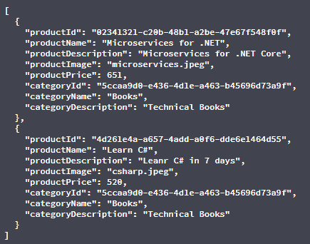

在这里，我们可以看到我们的应用程序受到了 SQL 注入的影响。您看到了表中的所有记录。这是由于我们使用的原始 SQL 查询（有关更多信息，请参阅 [`docs.microsoft.com/en-us/ef/core/querying/raw-sql`](https://docs.microsoft.com/en-us/ef/core/querying/raw-sql)）造成的。您可以在仔细查看代码后找到先前结果的原因。以下截图将提醒您请求 URL 是什么：

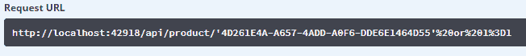

这是注入的 URL。当我们的仓库的 `GetByProduct(string id)` 方法执行时，它创建了以下原始 SQL 查询：

```cs
SELECT [p].[Id], [p].[CategoryId], [p].[Description], [p].[Image], [p].[Name],
 [p].[Price],[p.Category].[Id],[p.Category].[Description], [p.Category].[Name]
FROM (SELECT * FROM dbo.Products WHERE id='4D261E4A-A657-4ADD-A0F6-DDE6E1464D55' or 1=1) AS [p] 
INNER JOIN [Categories] AS [p.Category] ON [p].[CategoryId] = [p.Category].[Id]
```

这表明攻击者非常聪明且悄无声息地完成了工作。我们的不安全代码泄露并返回了目标表的全部数据。我使用了 SQL 分析器([`docs.microsoft.com/en-us/sql/tools/sql-server-profiler/sql-server-profiler`](https://docs.microsoft.com/en-us/sql/tools/sql-server-profiler/sql-server-profiler))来追踪查询。

# 解决 SQL 注入攻击

没有什么比不安全的代码更危险了。使用不安全的代码，应用程序始终处于危险之中。攻击者可以随时窃取数据，通过篡改请求强制性地操纵事物。

Saineshwar Bageri 写了 10 个创建安全 ASP.NET Web 应用程序的技巧。您可以在[`www.codeproject.com/Articles/1116318/Points-to-Secure-Your-ASP-NET-MVC-Applications`](https://www.codeproject.com/Articles/1116318/Points-to-Secure-Your-ASP-NET-MVC-Applications)上阅读它们。

您可以使用以下两种技术停止 SQL 注入攻击：

+   **验证**：我们将在本章后面讨论这些问题。

+   **在原始 SQL 查询中使用参数**：这除了直接通过连接值使用原始 SQL 查询之外。这样，您可以重新编写`GetByProduct(string id)`方法如下：

```cs
public IEnumerable<Product> GetByProduct(string id) => _context.Products 
    .FromSql("SELECT * FROM dbo.Products WHERE id={0}", id)
    .Include(p => p.Category)
    .ToList();
```

上述代码仍然包含原始 SQL 查询，但它足够安全，可以处理任何注入的代码。如果您尝试我们之前使用的相同参数值，则修改后的代码将不接受它。它将抛出异常，如下面的屏幕截图所示：

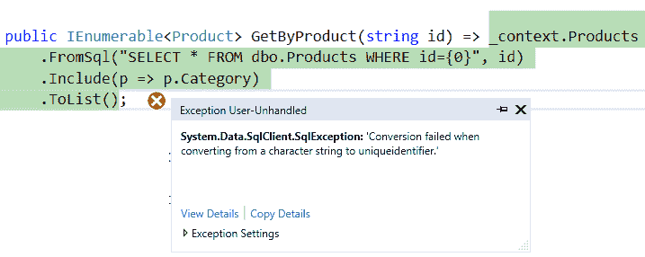

如果您的 EF Core 版本为 2.0.0 或更高版本，您也可以在原始 SQL 查询中使用字符串插值语法。使用字符串插值，代码看起来如下：

`public IEnumerable<Product> GetByProduct(string id) => _context.Products`

`.FromSql($"SELECT * FROM dbo.Products WHERE id={id}")`

`.Include(p => p.Category)`

`.ToList();`

+   **数据加密**：我们将在本章后面讨论这个问题。

# 跨站请求伪造

**跨站请求伪造**（**CRSF**）也可以简称为**XSRF**。这是一种常见的攻击方式，攻击者在客户端与托管应用程序交互（请求/响应）时注入不受欢迎的操作。通常，攻击者使用恶意代码来影响交互。

恶意代码是下载到网页浏览器并执行的脚本代码，即使未经认证用户的知识，也会执行。有关详细信息，请参阅[`www.techopedia.com/definition/4013/malicious-active-content`](https://www.techopedia.com/definition/4013/malicious-active-content)。

攻击者非常聪明，他们使用不同的平台提供虚假链接到恶意代码。这些链接与受攻击的域（网站）非常相似。金融网站是主要的目标。

下图描述了一个 XSRF 攻击：

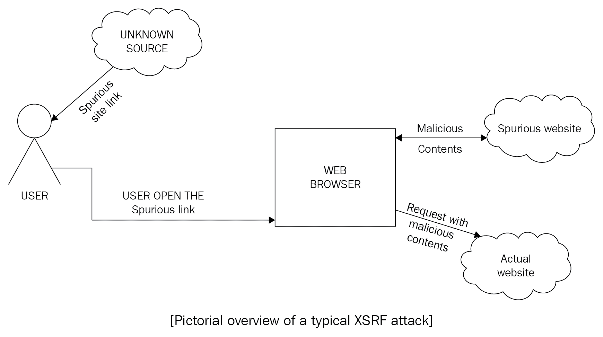

攻击者可以通过电子邮件、社交媒体或其他任何媒介发送链接。当用户点击链接时，他们将会进入攻击者的世界，而不知道这是一个虚假的网站，而不是他们想要访问的网站。

你可以在[`docs.microsoft.com/en-us/aspnet/core/security/anti-request-forgery`](https://docs.microsoft.com/en-us/aspnet/core/security/anti-request-forgery)找到官方网页。

CSRF 漏洞本质上是 Web 应用程序的问题，而不是终端用户的问题。

为了处理这种攻击，你需要构建一个既安全又正确认证的系统。在接下来的章节中，我将详细介绍认证的细节。

# 实际操作中的身份验证和授权

到目前为止，你已经学习了身份验证和授权的基础知识。在本节中，你将看到这两种最重要的保护应用程序的方法在实际中的应用。

# 基本身份验证、基于令牌的授权以及其他授权方式

每当你谈论受保护的 Web 服务/应用程序时，你应该考虑我在前几节中提到的关于身份验证和授权的所有要点。

在本节中，我将讨论实施阶段的身份验证和授权。

# 基本身份验证

如“基本”一词所示，基本身份验证涉及一种机制，其中系统要求用户提供简单的凭证（用户名和密码），通过来自客户端到 Web 或应用程序服务器的请求（在我们的案例中，是 ASP.NET Core Web API）来验证或验证用户。

考虑以下图表，它展示了基本身份验证：

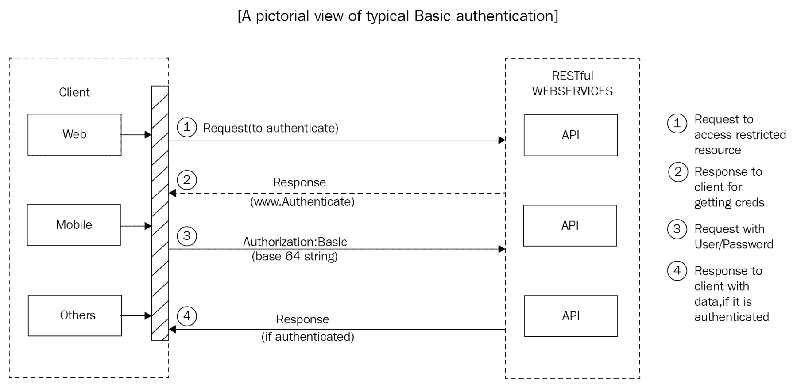

以下图表是我将要在我们的代码中实现的基本 HTTP 身份验证。在这里，请求来自客户端，以访问受保护的资源（从公共访问中保留的资源）。请求在其头部包含用户名和密码，服务通过验证其存储库（通常是数据库存储）中的用户名和密码来检查它是否是一个有效的请求。如果用户被验证，服务将在其响应中返回数据给客户端；否则，它将返回带有 HTTP 状态码 401 的无效凭证。

你可以在[`www.w3.org/Protocols/rfc2616/rfc2616-sec10.html`](https://www.w3.org/Protocols/rfc2616/rfc2616-sec10.html)找到完整的 HTTP 状态码列表及其定义。

# 基本身份验证的安全问题

基本身份验证，正如其名所示，是一种非常基本的身份验证机制，在阻止攻击者方面并不太安全。在这里，我已经记录了以下身份验证过程中的安全漏洞：

+   **凭证**：所需的凭证是可能导致安全漏洞的最重要安全问题，这反过来又可能进一步利用系统薄弱的安全。

+   **请求**：请求可能会被篡改，可能导致重大安全漏洞；使用基本身份验证时，每个请求都携带凭证（用户名和密码），这些凭证可能会被篡改并用于进一步利用系统。

+   **关闭浏览器会话**：这是一个应该优先考虑的问题——使用基本身份验证方法无法从应用程序中注销，除非用户自己关闭浏览器以终止浏览器会话。

您可以查看官方网页[`docs.microsoft.com/en-us/aspnet/web-api/overview/security/basic-authentication`](https://docs.microsoft.com/en-us/aspnet/web-api/overview/security/basic-authentication)以获取更多信息。

“基本身份验证也容易受到 CSRF 攻击。用户输入凭证后，浏览器会自动在会话期间将它们发送到同一域的后续请求中。”

可能还有更多安全问题，使得基本身份验证机制在 Web 应用安全方面变得最弱。

基本身份验证导致各种安全问题。我无意使用基本身份验证的代码示例来展示这些问题，但如果您仍然想测试基本身份验证机制，我建议您从 GitHub 仓库[`github.com/garora/Bazinga.AspNetCore.Authentication.Basic`](https://github.com/garora/Bazinga.AspNetCore.Authentication.Basic)中提取代码。

# 基于令牌的授权

在本章前面的部分，我解释了授权，您可以看到授权是认证之后访问受限资源的下一步。

让我们考虑以下图示，它描述了基于令牌的认证：

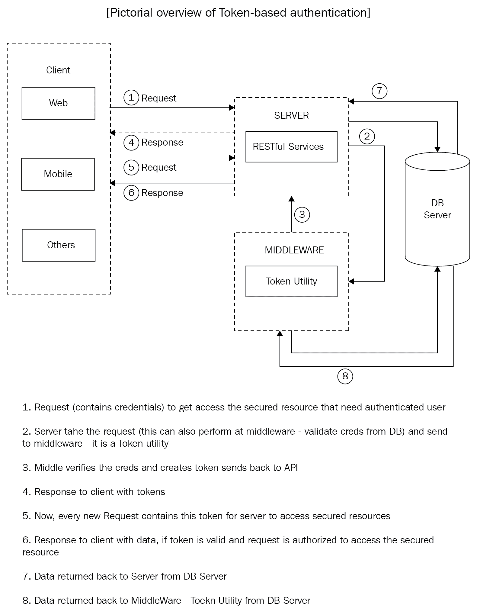

上述图示展示了基于令牌的认证。如果请求被验证（取决于凭证的识别），则客户端发送带有凭证和返回令牌的请求。然后客户端存储此令牌。它随后将这些令牌与每个请求的头部一起发送，直到令牌有效。如果它被授权访问受保护资源，服务器将验证请求检查并返回数据。在某些情况下，客户端可能会请求新的令牌或调用刷新令牌，如果现有令牌过期。

让我们在上一节创建的 API 项目中添加一个`AuthRequet`模型：

```cs
public class AuthRequest
{
  public string UserName { get; set; }
  public string Password { get; set; }
}
```

在`Controller`文件夹中添加一个新的`GenerateTokenController.cs`控制器。以下是我们的`GetToken` POST 资源：

```cs
[AllowAnonymous]
[HttpPost]
public IActionResult RequestToken([FromBody] AuthRequest request)
{
  //Kept it simple for demo purpose
  var user = _loginRepository.GetBy(request.UserName, 
  request.Password);
  if (user == null) return BadRequest("Invalid credentials.");
  var token = new TokenUtility().GenerateToken
  (
    user.UserName, 
    user.Id.ToString());
    return Ok(new
    {
      token = new JwtSecurityTokenHandler().WriteToken(token)
    }
  );
}
```

你注意到前面的代码中的 `[AllowAnonymous]` 属性了吗？你将在后面的章节中看到它。在前面的代码中，我只是验证凭证，如果凭证有效，`TokenUtility` 中间件将生成令牌。

这里是 `TokenUtility` 代码：

```cs
public JwtSecurityToken GenerateToken(string userName, string userId)
{
  var claims = new[]
  {
    new Claim(JwtRegisteredClaimNames.Sub, userName),
    new Claim(JwtRegisteredClaimNames.Jti, userId)
  };
  var key = new SymmetricSecurityKey(Encoding.UTF8.GetBytes(JwtKey));
  var creds = new SigningCredentials(key, 
  SecurityAlgorithms.HmacSha256);
  var token = new JwtSecurityToken(TokenIssuer,
  TokenIssuer,
  claims,
  expires: DateTime.Now.AddMinutes(30),
  signingCredentials: creds);
  return token;
}
```

前面的代码是自解释的：它生成令牌。在这段代码中，我将 `JwtKey` 作为常量（仅用于演示目的）。

在生产环境中，`JwtKey` 应该保存在环境变量中（出于安全原因），并且可以轻松访问，例如，`string jwtKey = Environment.GetEnvironmentVariable("JwtKey");`。

我不会讨论仓库模型和其他类似的方法，因为这些都很直观。您可以从 GitHub 仓库[`github.com/PacktPublishing/Building-RESTful-Web-Services-with-DotNET-Core`](https://github.com/PacktPublishing/Building-RESTful-Web-Services-with-DotNET-Core)中提取整个源代码。

要启用基于令牌的认证，您需要在 `startup.cs` 文件中进行一些更改，在 `Configure` 方法中 `app.UseMvc();` 之前插入 `Add app.UseAuthentication();`。

在 `ConfigureService` 方法中添加以下代码：

```cs
services.AddAuthentication()
.AddJwtBearer(cfg =>
{
  cfg.RequireHttpsMetadata = false;
  cfg.SaveToken = true;
  cfg.TokenValidationParameters = new TokenValidationParameters()
  {
    ValidIssuer = "gaurav-arora.com",
    ValidAudience = "gaurav-arora.com",
    IssuerSigningKey = new 
    SymmetricSecurityKey
    (
      Encoding.UTF8.GetBytes("abcdefghijklmnopqrstuvwxyz")
    )
  };
});
```

构建并运行项目。让我们使用 Swagger 文档进行简单的测试，如下截图所示：

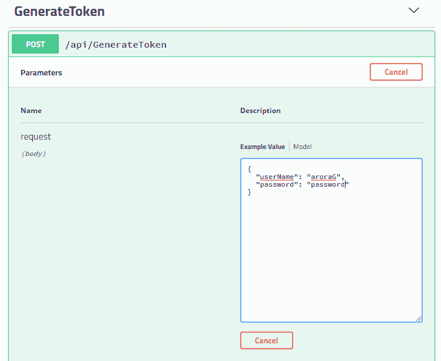

这将在有效请求后提供令牌：

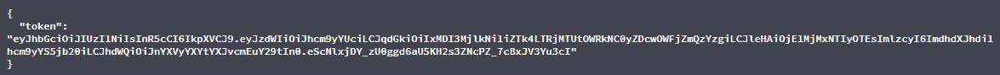

在接下来的章节中，我们将进行复杂的授权过程，根据用户的角色和访问级别来访问资源。

# 其他认证方法

除了基本和基于令牌的认证之外，您还可以选择其他可用的认证机制（我们不会详细讨论这些，因为它们超出了本书的范围）。IdentityServer4 是最著名的认证服务器之一，它使认证成为一种服务，单点登录/注销，以及更多选项（更多信息请参阅[`identityserver4.readthedocs.io/en/release/`](https://identityserver4.readthedocs.io/en/release/)）。

# 使用注解保护服务

ASP.NET Core 提供了多种方式来创建安全的应用程序注解（数据注解）。这是我们为 Web 应用程序安全模型的一种方式。数据注解提供了一种在客户端或服务器端验证输入的方法。

# 验证

从名称 *validations* 可以直观地看出，它们不过是用户/客户端输入的验证器。用户输入可以在客户端或 API 端（服务器端）进行验证。在 RESTful 服务中，您可以使用数据注解来验证输入。

如果模型经过验证，这并不保证随请求而来的数据是安全的。

在本节中，我们将重写上一节代码示例中使用的模型。

这里是修改后的 `ProductViewModel` 代码：

```cs
public class ProductViewModel
{
  public Guid ProductId { get; set; }
  [Required]
  public string ProductName { get; set; }
  [Required]
  public string ProductDescription { get; set; }
  public string ProductImage { get; set; }
  [Required]
  public decimal ProductPrice { get; set; }
  [Required]
  public Guid CategoryId { get; set; }
  public string CategoryName { get; set; }
  public string CategoryDescription { get; set; }
}
```

不要忘记在使用注解时包含`System.ComponentModel.DataAnnotations`命名空间。

在前面的代码中，我使用了一个非常简单的注解，即`required`属性。这确保了我们的模型具有所需的属性。

下面是我们的`Post`资源，用于添加新的产品项：

```cs
[HttpPost]
[Route("addproduct")]
public IActionResult Post([FromBody] ProductViewModel productvm)
{
  if (productvm == null)
  return BadRequest();
  var productModel = ToProductModel(productvm);
  _productRepository.Add(productModel);
  return StatusCode(201, Json(true));
}
```

编译应用程序并运行它以测试数据注解对我们模型的影响。这次，您可以使用 PostMan ([`getpostman.com/`](https://getpostman.com/))来测试 API。

下面的截图显示了`addproduct POST`资源；使用`/api/product/addproduct` API 保存产品：

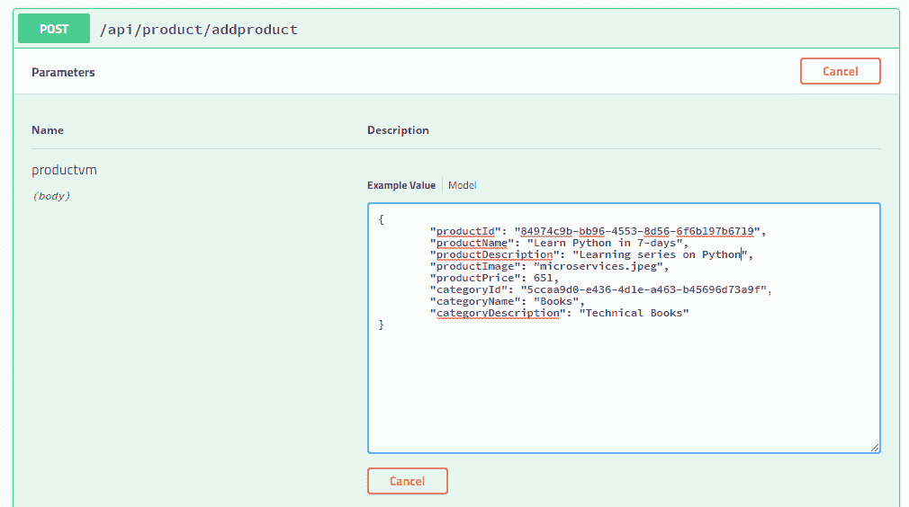

使用 Swagger 进行 POST 请求

前面的输入是有效的；您已提供了所有必填的值。让我们移除`Price`和`ProductName`。您会发现，即使在未提供必填值的情况下执行请求，也不会有任何变化。在这里，验证失败了。这些数据注解没有影响处理过程的原因是您没有指导系统验证输入。要验证输入，您应该明确告诉系统您想要验证的内容，例如模型状态。我们将通过下一节中的过滤器来解决这个问题。

# 保护上下文

通过使用`filter`属性，您可以在上下文级别实现安全性。在本节中，我们将重写我们的模型和 API 资源以实现过滤器/属性。

在上一节中，我们使用了`Required`属性与我们的`Product`模型一起，但这并没有为我们解决问题。在本节中，我们将借助过滤器（有关过滤器的更多信息，请访问[`docs.microsoft.com/en-us/aspnet/core/mvc/controllers/filters`](https://docs.microsoft.com/en-us/aspnet/core/mvc/controllers/filters)）来解决这个问题。

让我们添加一个自定义过滤器来验证输入，检测是否有任何必填字段缺失。如果有，它将直接抛出异常。您需要修改之前的代码，将`Product`模型更改为以下内容：

```cs
[Required(ErrorMessage = "Product Name shoud not be empty.")]
public string ProductName { get; set; }
```

简单地在必填的`ProductName`字段中添加`ErrorMessage`；模型的其余属性保持不变。

现在，在解决方案资源管理器中从项目中添加一个新的`Filters`文件夹。为此，请按照上一节中关于*SQL 注入*的步骤进行操作，并在该文件夹中添加一个名为`ValidateInputAttribute.cs`的新类，使用以下代码：

```cs
namespace Chap08_04.Filters
{
  public class ValidateInputAttribute : ActionFilterAttribute
  {
    public override void OnActionExecuting(ActionExecutingContext 
    context)
    {
      if (!context.ModelState.IsValid)
      context.Result = new BadRequestObjectResult
      (context.ModelState);
    }
  }
}
```

将此过滤器作为属性应用到添加产品的`Post`资源上。我们的代码应如下所示：

```cs
[HttpPost]
[Route("addproduct")]
[ValidateInput]
public IActionResult Post([FromBody] ProductViewModel productvm)
{
  if (productvm == null)
  return BadRequest();
  var productModel = ToProductModel(productvm);
  _productRepository.Add(productModel);
  return StatusCode(201, Json(true));
}
```

运行应用程序并输入新的产品值，但不包括产品名称，如下面的截图所示：

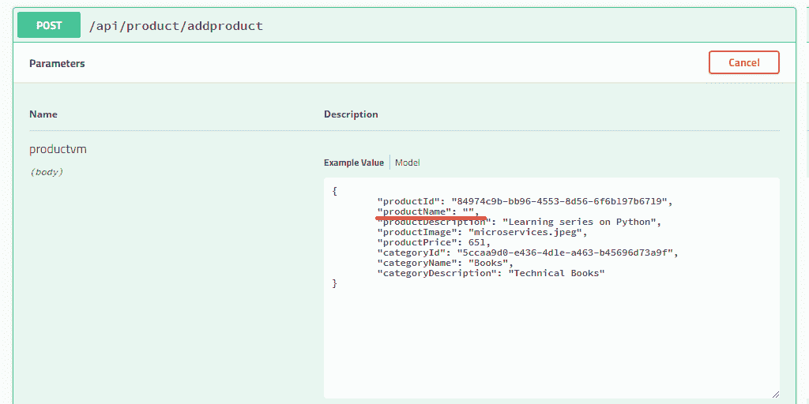

处理请求并查看服务器返回的响应，如前面的截图所示。请求将不会被处理，服务器将返回一个通知您有错误请求的响应，并包含相关错误信息。

以下截图显示了错误的请求响应（HttpStatus Code 400）：

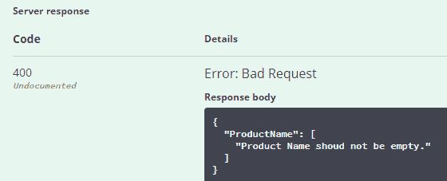

要使任何过滤器在任何地方都可用，您应该在`startup.cs`配置方法中添加以下代码，如下所示：

```cs
services.AddMvc(option =>
{
  option.Filters.Add(typeof(ValidateInputAttribute));
});
```

现在，让我们回到我们的基于令牌的授权方法。在前一个应用程序中，您看到了我们如何构建一个 API 来验证凭证。现在，让我们制定一个策略来限制资源。对这个主题的详细解释超出了本书的范围；我建议您参考[`docs.microsoft.com/en-us/aspnet/core/security/authorization/policies`](https://docs.microsoft.com/en-us/aspnet/core/security/authorization/policies)的官方文档。

# 数据加密和存储敏感数据

数据安全在任何应用程序中都是一个重大关注点，在编写或设计应用程序时，它是一个高优先级。您可以使用任何哈希算法通过加密和解密来保护数据，但这会导致性能下降。ASP.NET Core 提供了一个使用 ASP.NET DataProtection ([`www.nuget.org/packages/Microsoft.AspNetCore.DataProtection.Abstractions/`](https://www.nuget.org/packages/Microsoft.AspNetCore.DataProtection.Abstractions/)) NuGet 包来保护数据的方法。

对这个主题的完整解释超出了本书的范围。您可以参考[`docs.microsoft.com/en-us/aspnet/core/security/data-protection/`](https://docs.microsoft.com/en-us/aspnet/core/security/data-protection/)以获取更多信息。

# 敏感数据

当您与 API 一起工作时，您必须存储敏感数据：API 密钥、秘密密钥、用户名、密码等等。以下是在您在 ASP.NET Core 应用程序中处理这些数据时的一些建议：

+   您应该将配置文件与代码分开。

+   您应该避免将此数据存储在纯文本文件中。

+   您可以在一个单独的类文件中存储这些数据值，以常量的形式。

+   您应该将机密数据存储在环境变量中。更多信息，请参考[`www.dowdandassociates.com/blog/content/howto-set-an-environment-variable-in-windows-command-line-and-registry/`](http://www.dowdandassociates.com/blog/content/howto-set-an-environment-variable-in-windows-command-line-and-registry/)。

+   您还可以使用秘密管理器来存储您的机密数据 ([`docs.microsoft.com/en-us/aspnet/core/security/app-secrets?tabs=visual-studio#secret-manager`](https://docs.microsoft.com/en-us/aspnet/core/security/app-secrets?tabs=visual-studio#secret-manager))。

敏感数据因应用和需求而异。更多详情，您可以参考[`stormpath.com/blog/store-protect-sensitive-data-dotnet-core`](https://stormpath.com/blog/store-protect-sensitive-data-dotnet-core)。

# 摘要

在本章中，我们讨论了数据安全，遵循 OWASP 安全标准，并探讨了 JWT 身份验证。我们还通过代码示例讨论了自定义过滤器和输入验证。数据保护对于任何 Web 应用来说始终是最高优先级。我们讨论了在 ASP.NET Core 应用程序中存储敏感数据时的数据保护方法。

在下一章中，我们将通过观察缩放入和缩放出方法以及一些缓存机制的实现来讨论 Web 服务的性能。
