# 第一章：什么是 RPG？

在我们开始之前，最好简要了解该类型的历史，并了解在设计你的 RPG 时需要考虑的一些关键元素。

下面是本章我们将要介绍的内容概述：

+   该类型的简短历史

+   RPG 的特点

+   故事与背景

+   探索与任务

+   背包系统

+   角色发展

+   经验与等级提升

+   战斗系统

+   用户交互与图形

+   现有或即将推出的 RPGs

+   RPG 中的模式

你可能刚刚开始迄今为止最具挑战性的任务。

# 该类型的简短历史

什么是 RPG？简而言之，它是一种游戏，玩家在虚构的设定中扮演角色，参与者扮演角色并共同创造故事。每个玩家根据他们的角色设定决定他们角色的行为，并根据游戏规则的成功或失败采取行动。

RPG 有三种类型，如下所示：

+   桌面

+   实景表演

+   **计算机 RPG**（**cRPG**）

桌面角色扮演游戏（**桌面与纸笔** RPGs，**PnP**) 通过小规模社交聚会中的讨论进行。通常有一个**游戏主持人**（**GM**）来描述游戏世界及其居民。其他玩家描述他们角色的意图行为，而 GM 描述结果。这是 RPG 最初流行化的格式，即通过**《龙与地下城**》（**D&D**）。

**实景角色扮演**（**LARP**）更像是即兴表演。参与者通过表演他们角色的行为而不是描述它们，并使用真实环境来代表游戏世界的虚构场景。一些 LARP 使用剪刀石头布或属性比较来象征性地解决，而其他 LARP 则使用模拟武器进行物理战斗。一部电影可以被认为是一个简单的 LARP；区别在于，在电影中，所有行为都是剧本化的，玩家没有太多决策要做，而在 LARP 中，角色可以根据他们的决策改变他们行为的结果。

cRPGs 是将桌面 RPG 翻译成电子格式的游戏。早期的 cRPG 影响了所有类型的电子游戏，并跨越了角色扮演视频游戏类型。简而言之，cRPG 是一个玩家在沉浸在一个定义良好的世界中控制主要角色行为的视频游戏类型。

本书将专注于 cRPG 的设计和开发。

**注意**：从现在开始，当我们在书中提到 RPG 时，我们指的是 cRPG。

计算机角色扮演游戏起源于该类别的桌面版本。许多相同的术语、设定和游戏机制都从原始桌面游戏中继承而来。其中一些相似之处包括叙事和叙事元素，在整个故事中，玩家角色将不断发展和提升他们的技能和能力，以满足游戏的目标。

# RPG 的特点

角色扮演游戏通常依赖于高度发展的故事和设定，这些被划分为多个任务或等级。玩家通常通过发布命令来控制一个或多个角色，这些命令随后由玩家角色根据其定义的能力和属性执行。在整个游戏过程中，这些属性会增减，并设定角色的性格。

RPG 通常还拥有一个复杂且动态的交互机制，这个机制在玩家角色和沉浸其中的世界中定义和开发。这包括与世界环境的交互，以及世界内定义的其他非角色玩家。由于这些因素，通常会有更多的时间用于设计和开发处理游戏过程中行为和**人工智能**（**AI**）处理此类事件的代码库。

RPG 的关键元素如下：

+   故事和设定

+   探索和任务

+   物品和库存

+   角色动作和能力

+   经验和等级

+   战斗

+   界面和图形

# 故事和设定

大多数角色扮演游戏的前提是让玩家拯救世界，或者任何受到威胁的社会阶层。随着故事的发展，常常会有意想不到的转折，比如出现疏远的亲戚，或者敌人变成朋友，反之亦然。游戏世界往往设定在历史、幻想或科幻宇宙中，这允许玩家做他们在现实生活中无法做到的事情，并帮助玩家暂时放下对角色快速成长的怀疑。

如前所述，RPG 在叙事方面投入巨大。这是该类型的主要娱乐因素之一。由于这个原因，当你开发你的 RPG 时，你需要密切关注你如何发展你的故事以及你故事中的角色。这反过来又转化为你游戏中的环境和设定，以及游戏中的角色。

传统上，RPG 根据玩家角色在游戏中的决策推进剧情。这给游戏设计师带来了巨大的压力，他们需要能够将游戏中的这些分支与游戏的主线剧情整合起来。这也引发了如何编程游戏以考虑故事中所有不同路径的问题。

为了使游戏更加有趣和吸引人，游戏设计师可以在故事中引入特殊的触发器，使其更加有趣或具有挑战性。这通常是通过在现有级别中引入新的角色和/或新区域来实现的。以下是我们将为我们的 cRPG 构建的故事情节和设置的简化描述。

# cRPG 故事的一瞥

从前，有一个伟大的王国，由伟大的国王扎扎统治。王国的统治者对他的臣民慷慨大方。扎扎统治下的王国和平繁荣；然而，随着时间的推移，内部家族的竞争和斗争在维持王国完整性的强大纽带中造成了裂痕。

由于神秘事件，伟大的国王决定将他的家人从王国中搬走，并信任他信任的一位明智的长者。王国从此不再一样。直到现在！在扩展我们的故事中，在第二版中，我们将实现更多的游戏玩法，以及任务的引入。

# 探索和任务

RPG 背后的整个想法是玩家在沉浸的世界中拥有探索的自由。世界定义得越清晰，玩家探索的兴趣就越大，他们就能在整个游戏过程中保持好奇心和参与度。

这是通过为 RPG 开发的故事叙述实现的。玩家将有机会在世界上四处走动，探索周围环境以实现他们的目标。

在开放世界 RPG 中，玩家在完成由故事情节设定的目标后可以自由地在世界中漫游。在这种情况下，玩家仍然可以探索不再需要继续任务的区域，但他们可以在探索区域的同时花费时间，也许会遇到他们在完成任务时之前未曾遇到的非玩家角色。但一般来说，这不是玩家做的；一旦他们达到目标，他们就渴望继续下一个任务。因此，问题是，游戏设计师和开发者会在主要目标达成后对区域投入多少时间和精力？答案可能不会太多。

历史上，玩家遵循线性序列的任务以实现他们在游戏中的目标和目的。为了使游戏更具吸引力，开发者可以在游戏的主剧情中引入迷你任务，在该特定地点让玩家能够探索并获得更多技能和/或能力。由于这些任务不是主线故事的一部分，它们可以在玩家进入特定区域时随时触发。

例如，假设玩家已经完成了该级别的首要目标，并准备进行下一个目标。现在，想象一下我们创建了一个开放世界环境，用户可以随时重新访问这个世界。如果玩家决定回到他们刚刚完成的世界的一个特定区域进行探索，并且意外触发了启动这个迷你任务的事件，这对玩家来说不是一件令人惊喜的事情吗？请记住，这些迷你任务不应该影响主线故事，但它们可以用来增强玩家的体验。当你在开发游戏时，这类决策非常重要。如果他们选择不接受挑战，你不应该惩罚他们，除非你真的想表现得非常刻薄。

任务可能包括击败一个或多个敌人、营救非玩家角色、物品收集任务或位置谜题，例如神秘上锁的门。

# 探索和任务的一瞥

我们的游戏将总共包含四个任务。每个任务都将有独特的目标，玩家需要完成。随着我们前进，本书将讨论每个任务的设计和开发。

这里是我们将要设计的等级列表：

+   觉醒

+   村庄

+   破碎森林 - 地平线

+   王国

游戏将通过让玩家沉浸在这个环境中开始，我们的英雄将接受完成使命所需的基本训练。

# 库存系统

RPG 的主要功能和特性之一是库存系统。在整个游戏过程中，用户会遇到大量可收集的物品，这些物品可以在游戏的不同用途中使用，以帮助他们完成旅程。因此，RPG 需要提供一种机制来帮助玩家存储、检索和组织与他们的旅程相关的内容。请看以下截图：

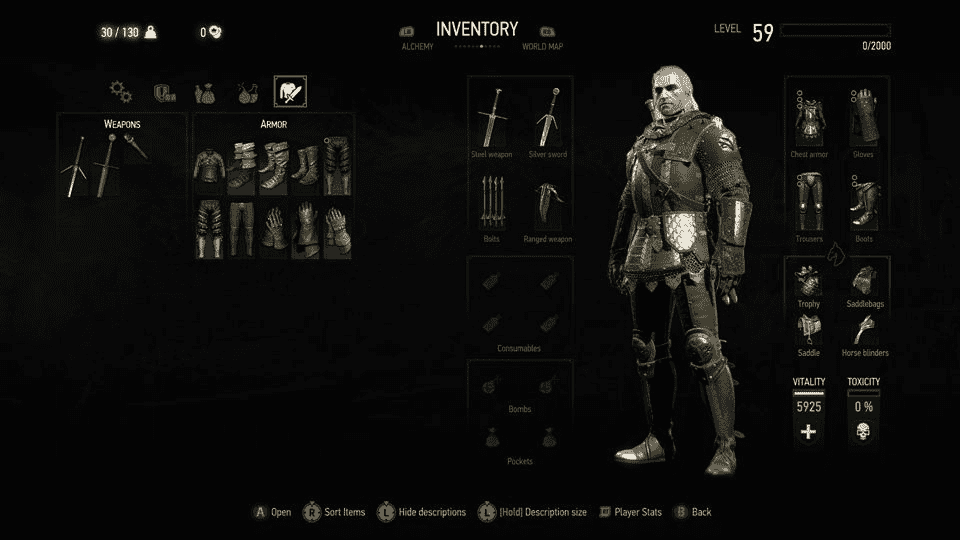

资产清单

当玩家在 RPG 游戏中进行旅程时，他们会与沉浸其中的世界互动。游戏的故事情节通常迫使玩家与周围的世界和其他非玩家角色互动。这些互动通常以某种形式的交换形式出现。这种交换是通过叙述来提供玩家更好的任务感，还是通过真实交换，即物品交换，取决于游戏设计师和开发者。

游戏需要一种方式来跟踪玩家角色与所有其他人和事物之间的所有互动。用于跟踪这些互动的一个系统是库存系统。

在游戏过程中，玩家通常从一个非常简单的角色开始，游戏的一部分是通过探索世界和收集可以帮助他们提高技能和能力的物品来提升他们的角色。

例如，玩家可能开始他们的旅程时穿着非常基本的衣服。在整个任务过程中，他们可能会与一个非角色玩家互动，比如商人，商人会为他们提供一套更好的衣服，以及某种武器以帮助他们开始。这些物品将由库存系统进行存储和管理，以下截图是一个例子：

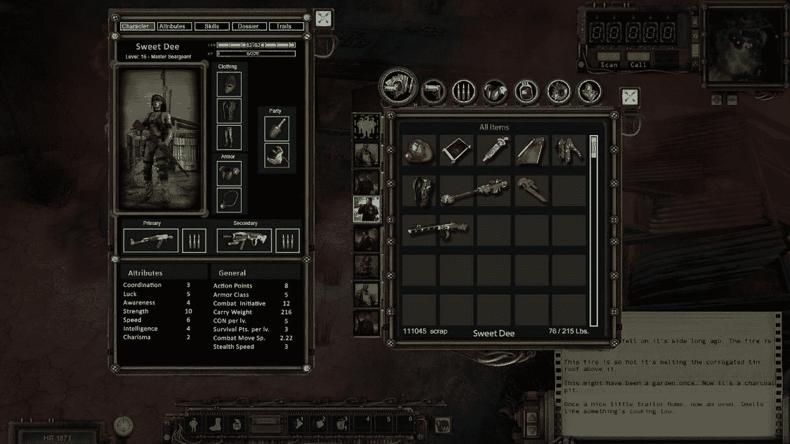

物品将由库存系统进行存储和管理

库存系统的简单性或复杂性将由游戏本身的复杂性和游戏内角色的复杂性来定义。在我们的游戏中，我们将设计和开发一个通用的库存系统，该系统可以应用于许多不同类型的物品。

这里有一些在游戏中通常收集到的物品：

+   武器

+   防具

+   服装

+   特殊物品

一些物品是通过世界探索收集或发现的，而一些物品则是在游戏过程中专门进行交易的。如果你在游戏中设置交易系统，那么你需要提供交易机制。交易通常在与非玩家角色互动时进行，通常是与商人，并使用一个特殊的窗口来启用交易的互动。

通常，任何交易都会有一定的成本。一般来说，玩家在游戏中所做的任何事情都会产生成本，而且这种成本通常会提高或降低玩家角色的能力和/或经验。如果你深入挖掘，这可能会变得相当复杂。

需要牢记的主要观点是，玩家需要收集和/或管理的所有东西都将通过库存系统来完成。因此，这是作为游戏设计师和开发者需要投入大量精力的一项最重要的功能之一。

另一个可以用来增强玩家游戏体验并推动他们战略性地进行任务的因素是限制他们在库存中携带的物品数量。

例如，在现实生活中，战士携带不同类型武器的能力是有限的。让我们假设在现实世界中，战士在任何时候最多只能携带五种不同类型的武器。现在，在游戏世界中，可能会有 20 种不同类型的武器。你是允许玩家在发现它们时携带所有 20 种不同的武器，还是将数量限制为五种？

这些是当计划得当时会使游戏玩法更有趣的小东西。库存系统还有更多内容，我们将在后面的章节中更详细地探讨。

# 角色属性和动作

与任何其他 RPG 开发部分一样，角色属性和动作高度由游戏的故事情节定义。这些动作是在玩家命令角色执行特定任务时在游戏中间接执行的。

例如，在一个特定的 RPG 游戏中，至少会有几个角色类别。以下是一些示例角色类型：

+   野蛮人

+   兽人

+   魔法师 / 巫师

+   丧尸

+   人类

每个角色类别甚至可能有自己的子类别，具有自己独特定义的属性。再次强调，这将与你的 RPG 游戏剧情紧密相关。

例如，我们将有玩家角色，从技术上讲，他是我们故事和游戏中的英雄。英雄通常属于某个角色类别；让我们假设英雄是人类类别的一部分。

因此，人类类别或种族将具有一些特定的特征，这些特征将被玩家角色继承，或者任何其他相同类型或类别的非玩家角色继承。

**注意：** 角色类别和种族通常决定了游戏内角色的能力，进而定义了角色可以执行的动作类型。

游戏中角色的力量由其所属的角色类别和可以执行的动作类型定义。角色的表现由角色类别和种族中定义的属性值决定。

例如，如果我们比较两个不同的角色类别，例如人类和兽人，兽人将拥有远超人类的强大力量和蛮力。然而，人类可能拥有更高的智力和解决问题的能力，如果运用得当，可能会超过兽人的力量。请看以下截图：

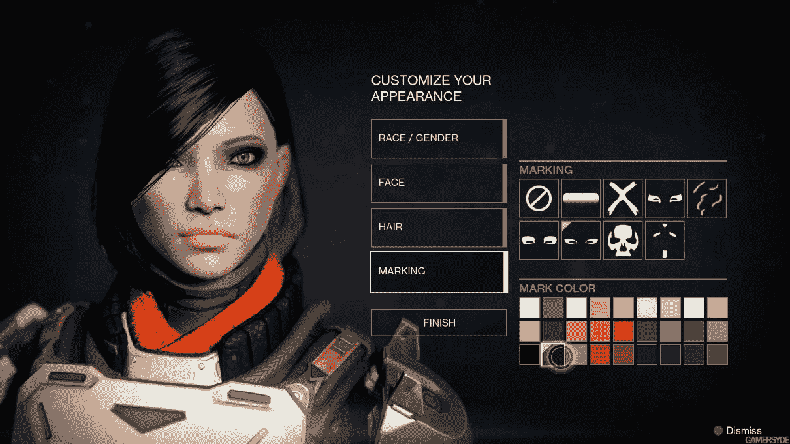

这又是 RPG 设计师必须花费大量时间定义和指定游戏内角色设计和开发规格的关键领域。在设计和发展你的角色时，天空是极限，但你需要考虑一些关键属性，无论对于任何 RPG 都是必要的。

大多数 RPG 游戏允许玩家在游戏开始前或游戏过程中修改他们的角色。默认情况下，每个角色类别都将有一些默认属性，玩家可以根据某些修改器调整这些值。允许修改的基本基本功能包括角色的性别、类别或种族。

所有这些都取决于你在游戏制作过程中可用的预算和资源。在某些游戏中，你还可以将道德属性引入角色的特征中。例如，如果你允许在游戏中杀害或抢劫无辜的旁观者，那么玩家将不会受到友好非玩家角色的喜爱，他们可能不会像完成任务那样友好或有帮助。换句话说，你将根据你的行为承担后果！

作为最后的总结，角色类别定义了你的角色属性，从而决定了角色的优势和劣势。这些物理属性可以简化为以下几种：敏捷和力量，它们决定了角色在战斗中的表现！

# 经验和等级

为了吸引玩家并让他们对游戏产生兴趣，游戏设计师使用机制来增强玩家角色的表现。这种进步被称作等级提升或角色扮演游戏中的经验值。

等级提升和经验是任何角色扮演游戏的关键要素。任何角色扮演游戏都将定义一个良好的等级提升或经验树。这允许玩家通过游戏玩法来发展他们的化身，通过获得更多技能、点数和其他完成任务所需的资源，使他们在功能上变得更加强大。

能够获得新的武器、盔甲、服装以及/或游戏中定义的任何其他游戏物品，玩家需要在游戏中达到一些特定的阈值。这些阈值可以是玩家获得的经验点数、经济收益和/或战斗经验的组合。在设计这些层次结构或系统时，没有对错之分。你需要看到哪一种最适合你的特定需求，以及如何最好地应用它们。请看以下截图：

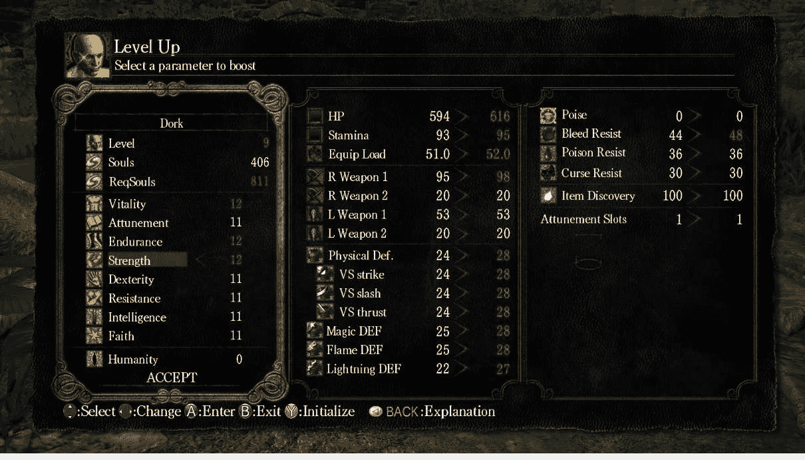

在角色扮演游戏中，玩家角色的进步是通过计算游戏设计师指定的某些定义属性来衡量的。通常，进步是通过玩家完成特定任务以获得经验点数来定义的，随着游戏的进行，任务和点数奖励会逐渐增加。然后，玩家可以使用这些经验点数来增强他们在游戏中的化身。

再次强调，这与故事情节、角色类别和/或玩家选择的种族高度集成。获得点数的一些常见方式是通过击败敌人、与非重要非玩家角色战斗，以及完成游戏中定义的任务。

就像现实生活中一样，你玩得越多，运用你的技能越多，你的经验就越丰富。经验的积累将使你能够获得更好的武器和/或盔甲，以增强你在下一次任务中的攻击或防御能力。有些游戏可能会给玩家 100+点数，并允许玩家将点数分配到他们化身可用的角色属性中。有时，游戏会自动将所有经验应用到特定区域，例如力量。

获得经验还将允许用户解锁更多功能和技能，以便在游戏玩法中获得。这是一种很好的游戏盈利方式。实际上，大多数免费游戏都使用这一原则。他们免费提供世界的基调和角色，并通过所谓的游戏内购买来盈利，以增加资源或角色表现。

这是如何实现的？就像库存系统一样，我们需要一种方法来跟踪玩家技能的进度。这通常是通过技能树来完成的。在树中学习或获得特定技能将解锁更强大的技能，并赋予玩家在游戏中使用这些技能的能力。

# 战斗系统

战斗时刻！这是每个玩家在他们的旅程中期待的时刻，无论是为了杀死 Boss、坏人还是邪恶的战争领主！每个 RPG 都内置了某种战斗或战斗组件，这是玩家能够使用他们所获得的所有技能和经验来摧毁对手或被对手摧毁的时候，这取决于当天的结果。

历史上，RPG 战斗系统主要有三种基本类型。你选择为你的游戏实现哪种战斗系统将对游戏玩法以及游戏的实现产生重大影响。

三种战斗系统如下：

+   传统回合制系统

+   实时战斗

+   带有暂停的实时

历史上，角色扮演游戏通常采用基于回合制的战斗系统。这种战斗系统的特点如下：在给定时间内，只能有一个角色行动。在此期间，所有其他角色都必须保持静止。换句话说，他们不能采取任何行动。这种战斗系统旨在更加重视奖励战略规划。

下一种类型是带有暂停功能的实时战斗系统。这种战斗系统也是严格基于回合制的，但有一个例外。如果玩家等待超过一定时间才移动或下达命令，游戏将自动将命令传递给另一名玩家。这将允许另一名玩家，即敌人，进行回合并攻击玩家。

在这本书中，我们将使用实时战斗系统。实时战斗从动作游戏中引入了功能，创造了一个混合动作 RPG 游戏类型。动作 RPG 战斗系统结合了角色扮演的 RPG 机制与动作游戏的直接、反应导向、街机风格的实时战斗系统，而不是 RPG 中更传统的战斗系统。

世嘉宫本茂最著名的身份是任天堂众多深受喜爱的角色和系列的创造者，包括马里奥、大金刚、《塞尔达传说》等。他也是任天堂触摸！系列游戏机的首席设计师，该系列包括任天堂 DS、Wii 和 3DS。

更多信息，请访问 [`www.giantbomb.com/action-rpg/3015-8592/`](https://www.giantbomb.com/action-rpg/3015-8592/)。

# 用户交互和图形

问题是，我们如何向玩家展示我们的游戏世界？我们将为我们的游戏提供什么样的用户界面？我们将允许玩家以什么样的视角玩游戏？我们将设计一个俯视摄像机视角的世界吗？我们将创建一个等距视图的世界吗？或者我们将创建一个第一人称或第三人称视角的世界？

回答这些问题至关重要，因为当你设计游戏资产时，你需要了解它们在游戏世界中的呈现方式。例如，当设计你的角色和/或游戏中的 3D 模型时，如果你知道你将使用等距视图，那么你的建模方法将与设计用于第一人称或第三人称摄像机的情况不同。

在我们的游戏中，我们将使用第三人称摄像机视角来展示我们的世界。

接下来的问题将是如何以简单且有意义的方式向玩家提供关键信息。角色扮演游戏要求玩家管理大量信息，并经常使用窗口化界面来为玩家安排数据。这通常是通过**抬头显示**（**HUD**）来设计和实现的。请看以下截图：

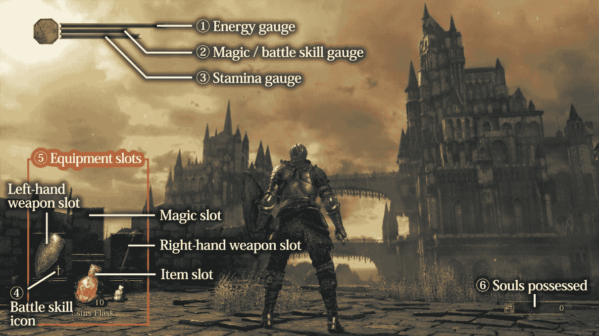

HUD 经常用于同时显示多个信息，包括主要角色的健康、物品和游戏进度指示。你可以把 HUD 看作是用户在游戏过程中需要访问和交互的所有信息的入口点。

HUD 的设计对于角色扮演游戏至关重要。通常，有几个关键数据元素你希望在游戏过程中持续与玩家沟通，如下所示：

+   生命值

+   能量

+   耐力

+   激活武器

+   激活护盾

+   特殊物品

+   生命值数量

+   进入主菜单

+   进入物品栏

+   进入技能菜单

再次强调，你的 HUD 设计取决于你正在设计的游戏类型，以及玩家在游戏过程中需要获取的信息类型。请看以下截图：

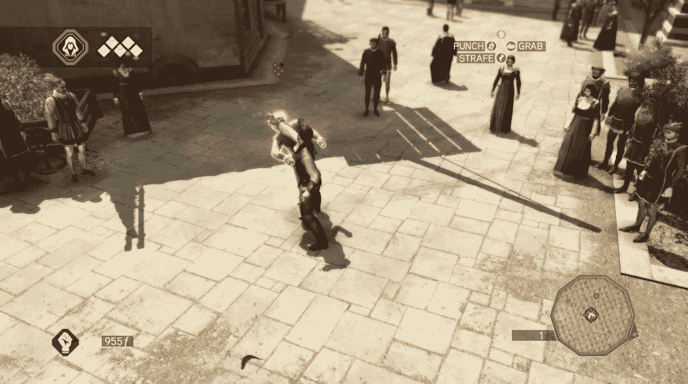

由于大多数角色扮演游戏需要收集和存储大量玩家角色的数据，因此创建一个易于使用且简洁的 HUD（头部显示单元）非常重要。

设计 HUD 时，要记住的一件非常重要的事情是它永远不应该占据屏幕或成为干扰。通常需要多次尝试才能为你的游戏设计出一个出色的 HUD 设计，从最初的美术概念，到实际的实现和测试，以及从玩家那里获得反馈，以便在最终确定设计和内部工作原理之前。

最后，HUD 应该简化玩家的游戏体验，而不是使其更加混乱。如今，许多游戏正在远离传统的 HUD，更多地倾向于在游戏过程中提供电影般的或极其简化的体验。这使得游戏设计师能够将玩家沉浸于世界之中，而不是用持续的、静态的 HUD 来分散他们的注意力。

制作一个适合您游戏玩法和风格的 HUD 是基本的。虽然元素丰富的 HUD 可能对某些游戏来说很出色，但过于简化的 HUD 同样可以成功，甚至更成功。一切取决于您希望提供的玩家体验。因此，当您准备为您的下一款游戏制作抬头显示时，请确保您正在设计 HUD 以提升玩家的参与度，并且永远不要让玩家负担过重。

# 现有或即将推出的 RPG 游戏

这本书的这一部分将探讨市场上一些现有或即将推出的 RPG 游戏。这一部分的主要思想是为您提供多个 RPG 的参考，以及实施的游戏设计。研究现有或即将推出的游戏以获取您自己的灵感也是一个好主意！

# MU 传说

这是一款流行的韩国 MMORPG 游戏的续作。MU2 是由 Webzen Inc. 制作和发行的游戏。游戏设定在神话中的穆大陆，正如詹姆斯·丘奇沃德假说所指出的，那里居住着古老的纳阿卡尔人类文明。

玩家们期待在这个令人惊叹的领域中寻找财富、冒险，以及追逐一些野兽。MU2 的游戏玩法围绕强大的战斗展开，遵循常规的砍杀机制。请看以下截图：

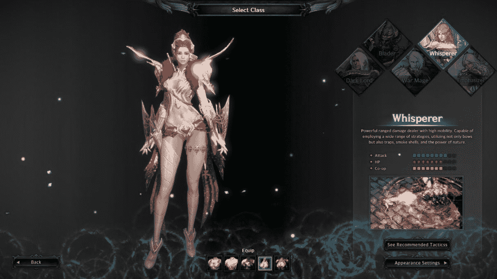

MU 传说

游戏讲述了光明之神鲁加德与被称为塞克纽姆的毁灭之神之间持续多年的战争。这场战争以阿克尼亚，至高创造者的手下的后者被打败而告终，但和平并没有持续太久，塞克纽姆获得了人类身体并回到了凡间。然而，伟大的法师昆顿看穿了堕落之神的花招，将他监禁在自己的身体里。然而，最终，他在塞克纽姆的力量下崩溃，变成了黑暗领主，加速了世界的终结。这就是玩家进入世界的地方，他们作为最后的智者伊卡鲁斯，作为德维阿斯骑士，在最后的努力中拯救穆免于即将到来的毁灭。

您可以在[`mulegend.webzen.com/en`](http://mulegend.webzen.com/en)找到更多信息。

# 泰坦要塞

一款允许进行小规模交易的 MMORPG 梦想游戏。泰坦要塞的奇幻场景融合了北欧、希腊和埃及民间传说的元素。玩家扮演传奇人物，保护人类免受相互武装的泰坦集团侵害。旅程从角色创建开始——玩家可以挑选他的英雄的性别、外观和战斗细节。

游戏玩法扩展了开放世界探索，完成 NPC 分配的任务，与经验丰富的对手战斗，以及按照传统 MMORPG 的方式提升基本英雄技能。在整个游戏过程中，玩家可以获得新物品，如魔法卷轴和防护装备碎片，这些物品在战斗中帮助他们的角色。通过获得坐骑可以加速穿越广阔地区的速度。两个宠物和邀请的玩家可以帮助我们在战斗中。玩家还可以向我们发起决斗——胜利者获得倒下的传奇的装备。请查看以下截图：

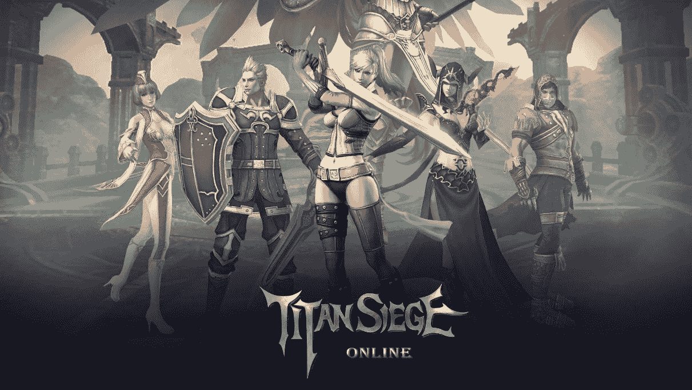

泰坦要塞的故事背景设定在一个奇幻世界，其中北欧、希腊和埃及的传说元素交织在一起，形成了一个独一无二的场景。领域已经变成了战场，两个泰坦集团在这里相互武装。人类选择自己动手，宣布战争，目的是结束泰坦战争造成的混乱。人类武装力量由圣人驱动——这些圣人由玩家控制。

您可以在[`steamcommunity.com/sharedfiles/filedetails/?id=561159376`](https://steamcommunity.com/sharedfiles/filedetails/?id=561159376)找到更多信息。

# 塔城：火炼

由 Blue Isle 开发和发行的多玩家梦幻 RPG。该生成仅针对在线游戏，具有沙盒性质，允许玩家选择自己的职业道路。

玩家扮演魔法大师，利用他们的魔法学习来探索充满威胁和秘密的奇幻领域，旅行、建造堡垒和攻击车辆，以及挑战他人。玩家可以找到自己的家园，这些家园是组织的对应物，并建立自己的规则。然后，我们可以与附近的盟友进行类似团体的战斗，为了影响力、领土和附近的财富。游戏玩法机制由物理引擎控制，因此各种可用的魔法合理地影响地球上的物品。由于可以飞行的可能性，游戏更加有趣。请查看以下截图：

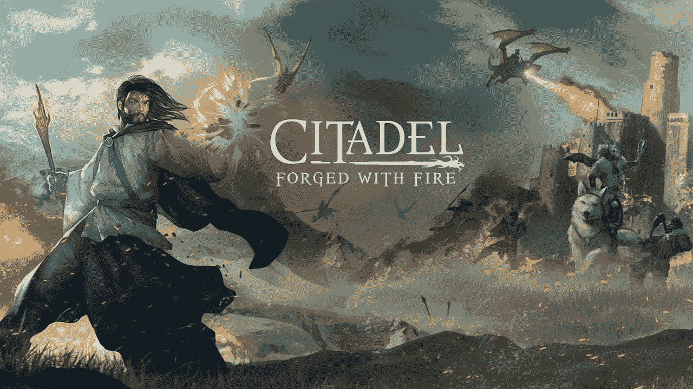

活动设定在一个名为 Ignus 的奇幻领域，给玩家一个机会扮演神秘的术士，他们开始寻找任务和辉煌。游戏发生在面积为 36 平方公里的地图上。它包括田野、茂密的森林、山脉、沼泽、冰冻的苔原和古老的废墟，这些地方隐藏着重要的财富和珍贵的古董。

你可以在[`www.citadelgame.com/`](http://www.citadelgame.com/)找到更多信息。

# 网络朋克 2077

一款桌面网络朋克风格的科幻 RPG 游戏。这款游戏由 CD Projekt RED 工作室制作。故事带你进入 2077 年，包括实际上进步了，但被污染的无限宇宙。游戏设定在夜之城，这是网络朋克宇宙的粉丝所熟知的地方，那里阴暗的兴趣和秘密盛行。

在探索游戏的开放世界时，你将通过各种交流吸收复杂的多线索故事，这些交流通常会迫使你做出艰难的决定。游戏中的职业和角色移动框架、战斗展示以及许多游戏内扩展都受到了最初模拟框架的启发。游戏的视觉方面基于升级版的红色引擎。请看以下截图：

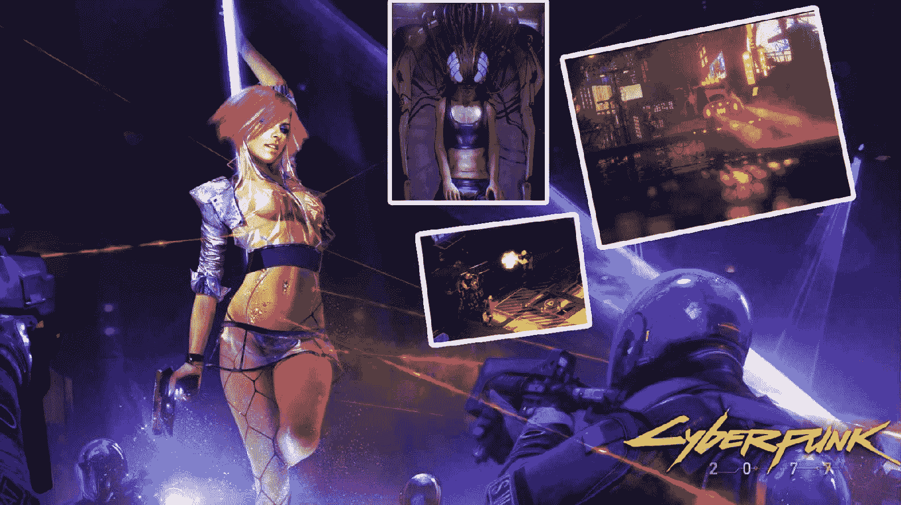

网络朋克 2077 对主题采取了强烈和发展的方法，从《银翼杀手》等作品中汲取灵感。标题本身带我们进入 2077 年，展示了一个无边的梦想世界，既恐怖又充满兴趣；标题的移动让我们置身于著名的夜之城，这是网络朋克体系的粉丝所熟知的。有趣的是，CD Projekt RED 工作室选择围绕开放世界游戏玩法模式来构建游戏，这允许玩家随时自由探索世界并完成支线任务。

你可以在[`www.cyberpunk.net/en`](https://www.cyberpunk.net/en)找到更多信息。

# RPG 中的模式

就像任何可能定义模式的工程项目一样，RPG 也可以利用 Whitson John Kirk III 在其名为《成功角色扮演游戏设计模式》的书中记录的类似模式。

**注意：**Whitson 受到了《设计模式：可重用面向对象软件元素》这本书的启发。他的目标是看看现有的 RPG 中是否存在任何特殊的模式，他通过检查该流派成功游戏中的特定模式来检测和识别它们。

在本节中，我们将探讨一些已经识别出的设计模式，这些模式可以用于你自己的游戏。

无论你开始什么类型的新项目，你都需要有一个清晰的想法，确切地知道你试图完成什么。这尤其适用于设计游戏。由于设计游戏包含许多不同的组成部分，你需要确定你的游戏将围绕什么展开。以下是一些开始思考的问题：

+   你试图实现什么？

+   你想要唤起什么样的情绪？

+   角色们做什么？

+   在多人环境中，玩家或玩家们会做什么？

+   你想奖励什么样的活动，你想提供什么样的奖励？

+   你的游戏针对哪个年龄组？

+   你的游戏会有序列吗？

+   游戏和故事是否会通过补充资产扩展？

这些都是影响你游戏设计的重要问题。当你阅读本章和本书时，请随身携带笔和纸，以便将所有闪现的想法写下来。这样，你可以跟踪所有想法，如果需要进一步扩展，可以在以后的时间进行。

# 术语

每个学科都有自己的术语。以下是在 RPG 游戏中使用的术语列表。花点时间研究它们是个好主意，以扩大你的词汇量或刷新你的记忆：

+   属性**:** 一个常见的特征，一个共性。

+   角色**:** 由玩家扮演的游戏中的人物，可能包括游戏主持人。

+   特征**:** 角色的一个方面。角色的名字、身高、年龄、美丽和力量是一些可能的特征。

+   常见特征**:** 游戏中给定类型所有角色共有的特征。角色的名字、身高、年龄、美丽和力量通常是常见特征。

+   冲突**:** 角色之间、玩家之间和/或游戏力量之间的争执，尤其是塑造游戏情节的争执。这包括两个或更多玩家之间关于应将哪些事实引入游戏世界的对立。

+   竞赛**:** 通过机械手段解决的冲突。

+   派生属性**:** 其值由公式确定的属性。通常，该公式使用其他属性值来生成一个数字。

+   剧情**:** 基于故事考虑的纯粹结果。剧情中的结果完全由对参与者来说最有趣的内容决定。

+   缺陷**:** 一个特定的、不是量度的选择特征。一个角色要么有缺陷，要么没有。缺陷在结构上与天赋非常相似。但是，缺陷通常被认为对角色有害，而不是有益。

+   幸运**:** 至少部分基于随机因素的结果。这可能包括掷骰子、抽牌或某些其他随机值生成器。

+   游戏主持人**:** 传统的游戏中，玩家被分配职责来管理游戏流程。在电脑角色扮演游戏中，游戏主持人（GM）是使一切紧密结合的粘合剂。

+   量表**:** 通常与名称相关联的分级值。常见的分级值是数值。

+   赠品：一个特定的特征，它不是一个量表。一个角色要么有赠品，要么没有。一般来说，赠品被认为对角色的福祉有益。

+   因果：基于非随机值比较的结果。基于因果的竞赛直接比较两个值以确定结果。

+   非玩家角色（NPC）：游戏主持人作为角色扮演的一部分所扮演的任何角色。

+   可选特征**:** 不是给定类型所有角色都共有的特征。

+   玩家：任何参与角色扮演游戏的人。

+   玩家角色（PC）：任何玩家扮演的角色，但不担任游戏主持人角色。

+   主要属性**:** 其值直接由玩家设置，而不是通过其他属性的公式推导出来的属性。通常，主要属性用于公式中，以确定派生属性的价值，但它们自己的值不是由公式确定的。通常，它们是通过随机数生成或通过消耗一些资源来设置的。

+   等级：量表技能、障碍或排名特质的特定值。在描述此类技能和特质时，也用作形容词，代替量表。

+   排名特质：也是一个量表的特质。

+   选择特征**:** 从预定义的选择列表中选取的特征。

+   共享量表：许多角色共享的量表。

+   技能：也是一个量表，并且通常被认为对角色有益的特征。

+   特质：玩家自己创造的特征，而不是从预定义的选择列表中选取。

为了更好地理解属性和特征之间的关系，我们制作了一个视觉辅助工具来解释它：

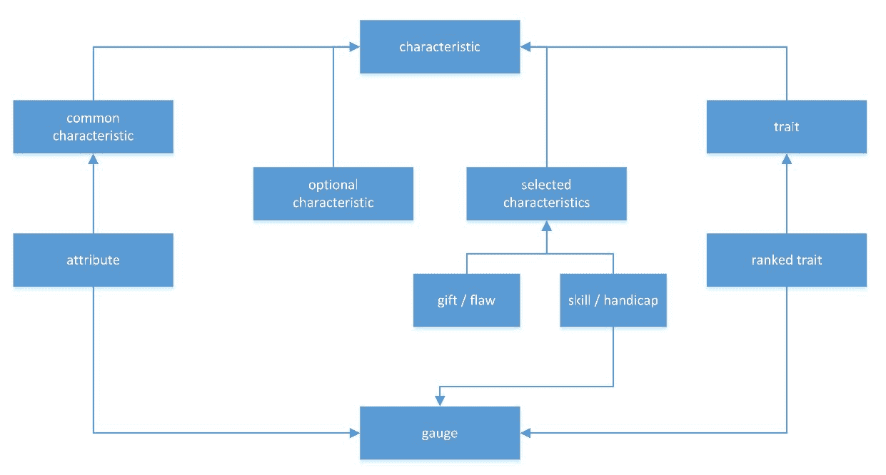

# 竞赛树

竞赛树的目的在于提供一种机械手段，在游戏中创造上升的紧张感。这也被称为升级冲突。

竞赛树是由许多级别竞赛组成的、以分层方式排列的高级冲突解决系统。它们的工作方式是，低级别竞赛为高级别竞赛提供输入，从而影响高级别竞赛的结果。

换句话说，高级别的挑战可能是击败大 Boss，但在你到达大 Boss 之前，可能会有其他小战斗需要完成，而小战斗的结果将决定大战斗的结果。一个简单的例子就是在到达主要 Boss 之前获得的经验点数。

由于高级比赛与低级比赛在某种程度上有关联，玩家确实会关注低级比赛的结果；因此，当低级比赛成功或失败时，关于高级比赛最终成功或失败的压力就会产生。

当你想在游戏中创造上升的紧张感时，最好使用竞赛树。这可以通过在玩家通过不同级别时应用不同的机制来实现。在 cRPG 中创造悬念非常简单，因为你有很多控制级别和游戏玩法设计的方式。由于我们有能力按照自己的喜好创建 3D 世界，因此将悬念融入游戏会很容易。

在你的游戏中创造紧张感的一些关键点如下：

+   英雄和敌人应该实力相当。

+   英雄和敌人应该定期在他们的尝试中失败，前提是他们是有价值的对手。

+   英雄和敌人的成功与失败永远不会如此之大，以至于任何一方都失去了实现高级目标的所有希望。

+   关于竞赛树的一个亮点是，它只能解决涉及系统机械输入的高级冲突。也就是说，如果伤害和剩余生命值是作为冲突解决输入的唯一度量标准，那么机制只能解决涉及伤害和生命值的问题。为了设计一个灵活的竞赛树，你需要考虑输入和输出。

# 最后一人幸存

“最后一人幸存”冲突系统提供了一个通用的竞赛树来解决在战斗中哪一方获得胜利。

“最后一人幸存”也是通用竞赛树的最传统形式之一。该模式背后的基本思想是通过谁成功摧毁对手的事实来识别赢家。做到这一点的人就是赢家。这也是实现竞赛树的最简单方法之一。

当战术战斗被高度重视时，就会使用它。请记住，你不必使用其中任何一种模式。你可以很好地将几种模式结合起来，你应该这样做，以使其更有趣。例如，如果你的游戏非常注重战斗，但你还想将一些谈判引入冲突解决中，你完全可以这样做。再次强调，这完全取决于你和你的游戏设计。

需要记住的是：如果解决高级比赛的唯一方式是通过战斗，那么玩家将集中精力在尽可能赢得战斗。换句话说，如果一个游戏只提供一种解决争端的方法，那么你可以确信玩家将非常熟练和专注于使用该工具。

# 谈判竞赛

谈判竞赛提供了一种机械手段来解决争端，其中玩家和非玩家角色具体协商冲突的输入和可能的结果。

设计和开发协商竞赛机制相当复杂。为了使该模式正常工作，你需要考虑所有协商的输入和输出。开发此类系统的挑战并不仅仅是实际的技术实现，而是基于玩家可用的选择和每个输入的结果，你必须创建并保留的数据库。

机制的实施可以非常简单，仅涉及几个选项和结果，也可以非常复杂，涉及多种选项及其最终结果。重要的是，在冲突引入后、任何行动采取之前，你必须引入一个协商机制！结果显然是基于冲突前的协商，关注的是胜负。

**注意：**协商竞赛模式要求在冲突通过机制解决之前，允许玩家协商成功和失败的效果。

当你的设计目标包括以下一个或多个时，请使用协商竞赛模式：

+   希望明确决定竞赛的结果意味着玩家是否赢得了他声明的目标，而不是他的角色是否成功执行了离散的行动。

+   需要将竞赛的解决尺度扩展到不同于单个行动的粒度级别。

+   愿意允许玩家在描述竞赛结果（无论是好是坏）方面拥有很大的叙事自由。

对于计算机角色扮演游戏，协商竞赛将有一些限制，因为我们无法承担创建一个开放式的 AI 系统的费用。但我们可以设计一种更简单的方法，让玩家在游戏中对协商有一定的控制感。

协商可以是一种很好的交换信息的方式，在角色扮演游戏中与非玩家角色一起使用。协商模式有三个部分，如下所述：

+   **启动：**这是将角色行动引入游戏世界的过程。

+   **执行：**这是确定角色行动成功或失败的过程。

+   **效果：**这是确定角色行动结果的过程。

在设计协商系统时，以下是一些需要考虑的问题：

+   胜利者能得到什么？

+   败者能得到什么？

+   我们如何知道谁是胜者，谁是败者？

+   在解决开始之前，我们需要建立什么，以及如何建立？

# 概述

在本章中，我们详细介绍了角色扮演游戏。我们简要地覆盖了该流派的历史方面，并探讨了不同类型的 RPG。我们讨论了设计角色扮演游戏的关键要素，并提供了一些示例以示说明。

我们探讨了 RPG 的特点，并讨论了如何规划你的游戏，例如故事和背景，游戏内的探索和任务，不同的库存系统，角色发展，用户交互，以及一些战斗系统模式。我们还介绍了一些在 RPG 中使用的术语。

到本章结束时，你应该对需要准备的内容以及制作角色扮演游戏所需付出的努力有一个清晰的认识。

在下一章中，我们将开始规划我们 RPG 的设计和开发。
