# 第七章：用户界面和系统反馈

你是否见过冰山顶部？到目前为止，这就是我们在前六章中所做的一切。在本章中，我们将继续改进我们游戏的用户界面和反馈系统。我们将创建一个负责管理玩家与系统菜单交互以及系统向玩家提供反馈的抬头显示（HUD）。

在本章中，我们将涵盖以下内容：

+   设计抬头显示（HUD）

+   HUD 基础

+   我们的设计

+   HUD 框架

+   完成我们的 HUD 设计

+   角色信息面板

+   活动物品面板

+   特殊物品面板

+   集成代码

+   HUD 中的敌人统计数据

+   NPC 统计数据用户界面

+   创建 NPC 画布

+   NPC 受到攻击

+   优化代码

让我们开始吧！

# 设计抬头显示（HUD）

设计**抬头显示（HUD**）是一个非常具有挑战性的任务。HUD 是玩家与虚拟世界交互并从虚拟世界环境接收反馈的界面。与迄今为止我们设计的所有其他内容一样，HUD 设计也与您试图制作的游戏的类型和需求密切相关。

例如，**实时策略（RTS**）游戏将具有与**第一人称射击（FPS**）或**角色扮演游戏（RPG**）非常不同的 HUD 设计。它们有一些共同点，但它们的设计非常独特，以及一些功能和特性。

我们可以有一整本书专门讲述用户界面设计和开发，以及如何以科学的方式处理它们。但这超出了本书的范围，我们关注的是理论。

# HUD 基础

任何简单的抬头显示至少应有一种显示以下信息的方式：

+   玩家角色的基本信息

+   生命值

+   魔法值

+   力量

+   等级

+   玩家角色当前消耗的库存物品

+   玩家当前使用的武器

+   玩家当前使用的盔甲

+   可用的药水及/或生命值

+   来自游戏环境的反馈

+   与游戏相关的任何有用信息

+   能力提升

+   等级提升

让我们开始设计我们的 HUD。再次强调，我们将从一个简单的框架开始，并在需要时逐步构建。

# 我们的设计

考虑到所有因素，让我们继续设计一个对我们游戏有用的 HUD。同时，我们将保持其简单但实用。我们应该有一个 HUD，它将以不干扰游戏玩法的方式显示基本玩家角色信息，同时向玩家提供有关其角色状态的临界信息。

我们还应该设计一种方式来显示玩家当前激活并准备使用的当前库存物品，例如武器或盔甲。最后，我们还应该有一个简单的方法让玩家在游戏过程中使用他们可能拥有的任何健康包和/或药水。

下图展示了我想我的 HUD 看起来是什么样的快速草图。再次提醒，你可以自由发挥，事实上，我鼓励你提出自己的设计：

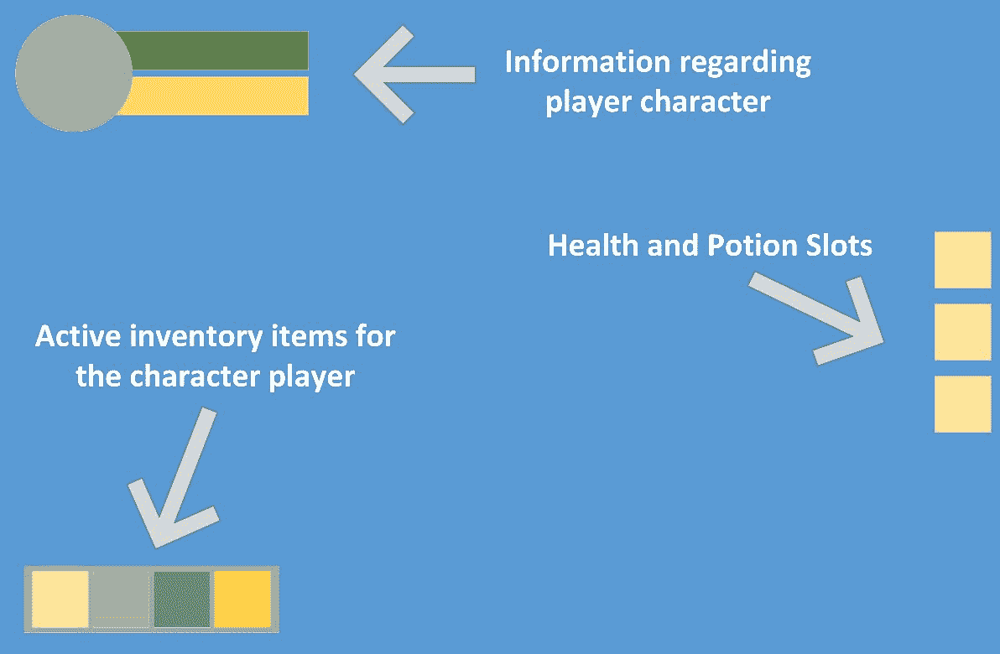

我已经清楚地标出了我希望在游戏过程中我的 HUD（抬头显示）看起来大致如何。

注意，我保持了它的简单性。在左上角，我放置了玩家将需要立即了解的信息，例如他们的健康和可能的力量。

在屏幕左下角，我放置了一个可滚动的面板，将列出玩家可能在其角色上激活的所有活动库存物品，而在屏幕的右侧，我有三个槽位，将用于立即访问玩家在游戏过程中可能需要使用的物品，如健康包和/或药水。

# HUD 框架

既然我们已经了解了我们希望我们的 UI（用户界面）看起来是什么样子，让我们开始在 Unity 中实现它。我们需要创建一个新的画布来容纳我们的 HUD。要创建画布，在层次结构窗口中右键单击，选择 UI | 画布。将新画布 GameObject 重命名为`CanvasHUD`。

让我们继续放置我们 UI 的所有不同部分。每个部分我们需要三个主要面板，如下面的截图所示。

我们需要一个面板来在屏幕左上角存放角色信息。我们还需要一个面板来在屏幕左下角存放活动库存物品，以及另一个面板来在屏幕右侧存放特殊物品。

通过在层次结构窗口中右键单击并选择 UI | 面板来创建每个面板。确保面板是`CanvasHUD`GameObject 的子项。相应地重命名每个面板。我命名为：`PanelCharacterInfo`、`PanelActiveItems`和`PanelSpecialItems`。请看下面的截图：

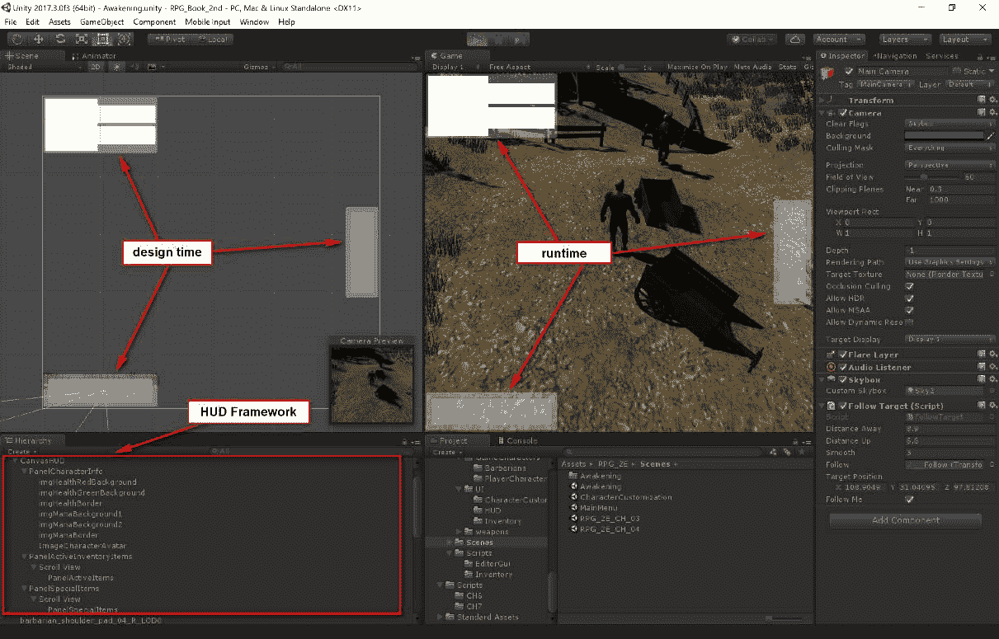

HUD 初始轮廓

上述截图给你一个关于 HUD 框架的感觉。

# 完成我们的 HUD 设计

现在我们已经建立了框架，让我们继续完成每个部分的单独设计。我想从`PanelCharacterInfo`开始。

# 角色信息面板

从设计角度来看，将包含角色视觉组件的面板将非常复杂。面板将由五个图像组成。

主要图像将用于存放角色的头像。其他四个图像将用于显示角色的健康和法力。由于这些值将以条形图格式显示，我们将为每个项目使用两个图像。一个图像将包含边框，另一个将包含实际值的表示。

为了制作图像，我将使用外部工具，如 Photoshop；Microsoft Expression Design 是创建框架等的好工具。请看下面的截图：

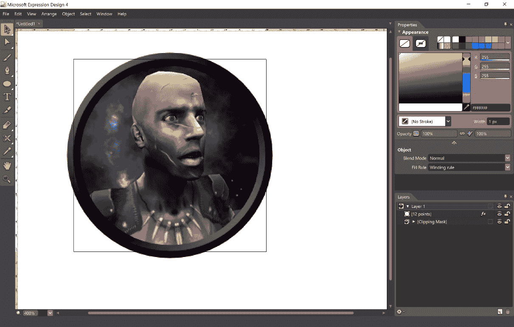

在前面的截图中，我制作了一个很好的图像，描绘了玩家角色的头像。你应该考虑你将放置在`PanelCharacterInfo`面板内的图像的实际大小。我生成的图像大小是 301 × 301 像素。

为了创建代表角色玩家健康和法力的条形图的图形，我们实际上需要三个图像。一个图像代表条的负值，一个图像代表条的正值，第三个将是条的边框图像。它们将叠加在一起，以产生我们图形条的错觉，如下面的截图所示：

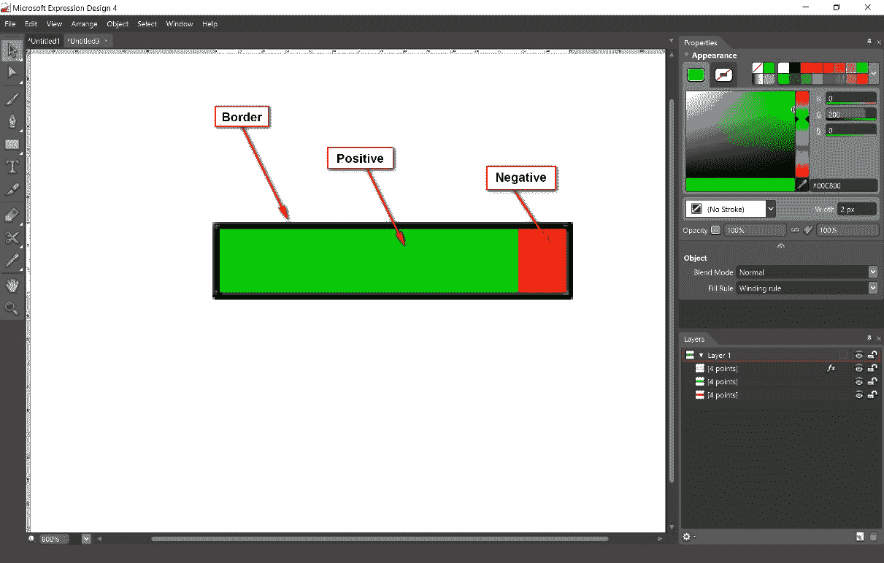

健康条图形

创建三个不同的精灵并将它们叠加，将给你一个很好的错觉，让你找到你想要的效果。

在导出我们的图像后，我们需要将它们导入到 Unity 中。使用你的文件系统将你的图像从原始位置移动到 Unity 项目下的`Assets`文件夹。

我将我的纹理放置在以下目录：Assets | RPG_2E | Textures。

一旦将它们移动到你的 Unity 项目中的期望位置，你将需要将图像转换为精灵。选择所有将被用于 GUI 的图像，并在检查器窗口中，将纹理类型更改为精灵（2D 和 UI）。看看下面的截图：


图像导入属性

是时候将我们的纹理应用到我们在`Canvas`对象下的`PanelCharacterInfo`面板内定义的实际 UI 元素上了。

注意：在我们能够完全将 UI 元素应用到 HUD 之前，需要执行几个步骤。

如果你还没有这样做，你应该首先在`PanelCharacterInfo`面板下创建三个新的 UI 图像元素，通过右键单击面板并选择 UI | 图像。

我将我的三个图像命名为`imgHealthRebBackground`、`imgHealthGreenBackground`和`imgHealthBorder`。图像的顺序很重要。在设计 UI 时你应该注意这一点。一般来说，如果 UI 元素在层次结构中位置较低，它将渲染在其他元素之上。

看看下面的截图：

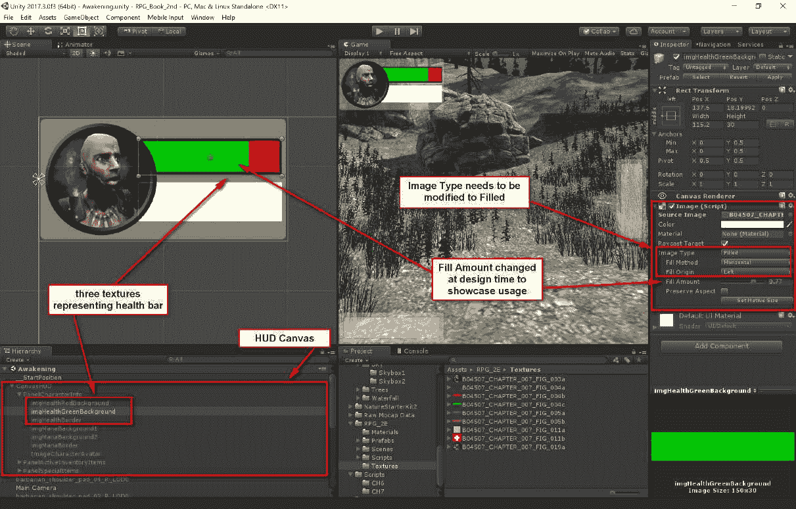

健康条连接

注意健康条表示图像的顺序。代表绿色条的图像需要使用*检查器窗口*进行修改。选择它，将*图像类型*更改为填充，将*填充方法*更改为*水平*，将*填充起点*更改为*左端*。我们将使用*填充量*来控制健康条的视觉部分。请注意，我将其设置为`0.77`以供演示。

默认情况下，当游戏开始时，我们将从`Fill Amount`的`1`开始，这对于玩家角色的健康来说相当于 100%。`0.77`相当于 77%，依此类推。

我们将为法力条应用相同的技巧。继续创建另外两个图像，它们将代表法力条的两个背景。

注意：我们将使用相同的边框图像为两个条。

再次提醒，不要忘记你需要在 Unity 中导入的纹理中进行适当的更改。将它们转换为 Sprite *(2D 和 UI) 纹理类型*。

在面板下创建必要的图像 UI 元素，并将纹理应用到画布中的图像元素上。你应该有如下截图所示的内容：

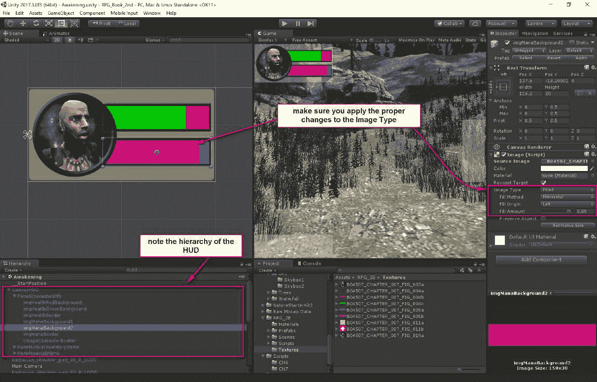

法力条连接

这就是全部内容！对于一个没有艺术背景的人来说，还不错！

# 活动库存项目面板

创建活动库存项目的 UI 与我们在第六章，“库存系统”中所做的是类似的。不同之处在于，我们将只列出玩家使用库存系统消耗的项目。

换句话说，活动库存项目显示是库存中已激活项目的视觉指示。重要的是要记住，我们更感兴趣的是学习概念并将它们应用于一个简单的示例中，你可以在此基础上扩展和改进。

基本的想法是创建一个可滚动的面板，用于添加所需的项目。我们已经看到了如何设置可滚动视图以及如何配置 UI 组件以支持我们试图实现的目标。我不会再次深入细节；如果需要，请参考第六章，“库存系统”中的必要步骤。

在*层次结构*窗口中，右键单击 PanelActiveInventoryItems，然后选择*UI* | *滚动视图*。继续删除由“滚动视图”元素创建的`Viewport`、`Scrollbar Horizontal`和`Scrollbar Vertical`子元素。

你只需确保你应用的布局配置是水平的，而不是垂直的，就像我们在第六章，“库存系统”中所做的那样。请查看以下截图：

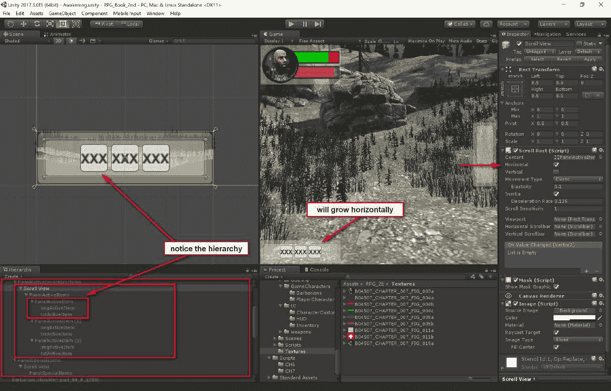

活动库存面板

在 UI 元素中检查你的锚点和对齐方式：

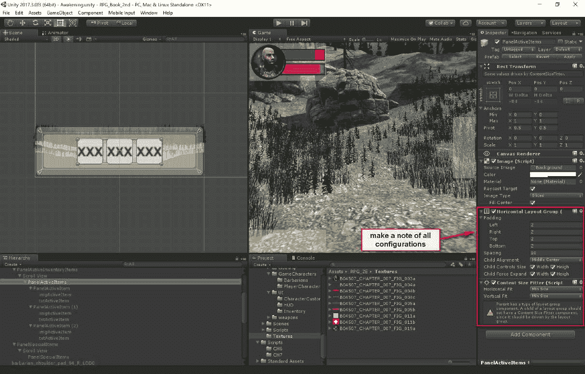

最后，请查看以下截图：

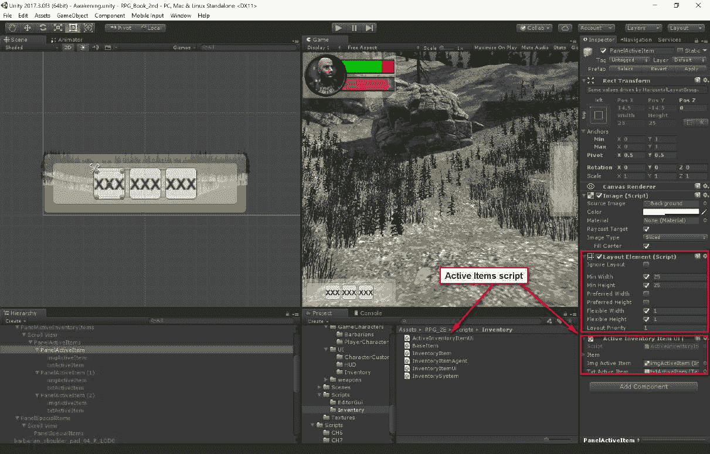

前三个图展示了活动库存项目面板配置的不同部分。如果你不确定如何组合它们，请回到第六章，“库存系统”，并阅读*设计动态物品查看器*部分。

不要忘记制作一个预制体，这个 UI 元素将代表你在面板中的活动库存项目。

你还需要一个脚本来引用为你的物品指定的 UI 元素。我称这个脚本为`ActiveInventoryItemUi.cs`，目前有两个属性；一个是`Image`元素的引用，另一个是`Text`元素的引用。

脚本列表如下：

```cs
using UnityEngine;
using UnityEngine.UI;
namespace com.noorcon.rpg2e
{
public class ActiveInventoryItemUi : MonoBehaviour
{
public InventoryItem item;
public Image imgActiveItem;
public Text txtActiveItem;
}
}
```

我们最终需要将这些脚本整合在一起，以确保一切正常工作。

# 特殊物品面板

现在，我们将看看我们最后设计的面板。这个面板与最后一个我们开发的面板的主要区别是方向。其他所有内容都将完全相同。然而，对于这个面板，我们的方向将是垂直而不是水平。

这里是一张捕捉到一切的截图：

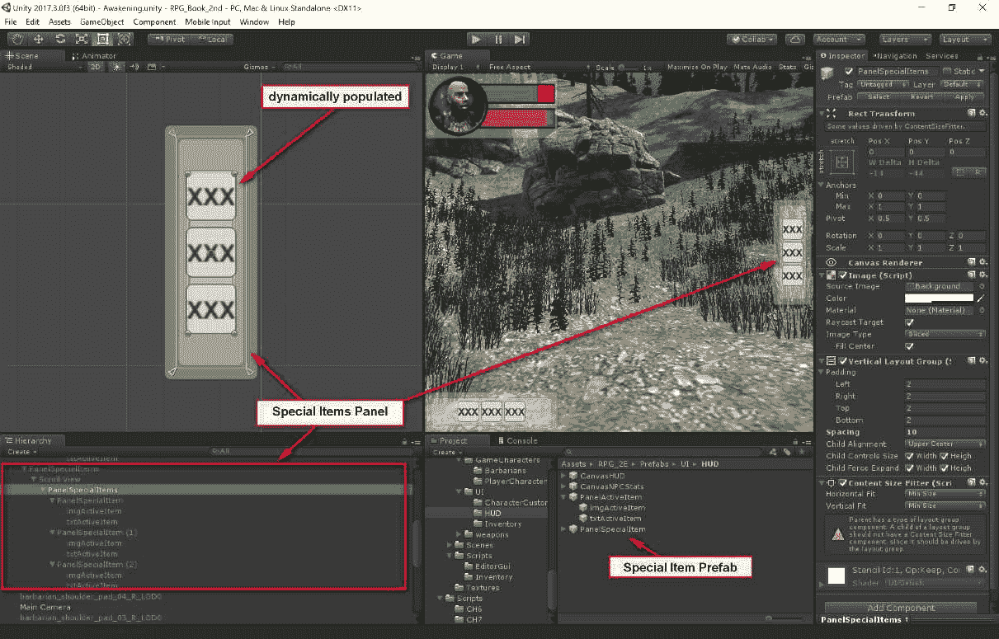

特殊物品面板

创建面板的流程已经被讨论了好几次，你应该不会在创建它时遇到任何麻烦。

我让你自己制作纹理和图像，以应用于 UI 元素。

在设计特殊物品面板时，我想出了一个改进面板 UI 的更好方法。你可能希望有一个静态图标代表每个特殊物品，并且有一个计数器附加到 UI 上，表示你有多少个这样的物品。每次你收集一个，它就会增加，每次你消耗一个，它就会减少。

以下截图显示了根据我们的设计当前 HUD 的外观：

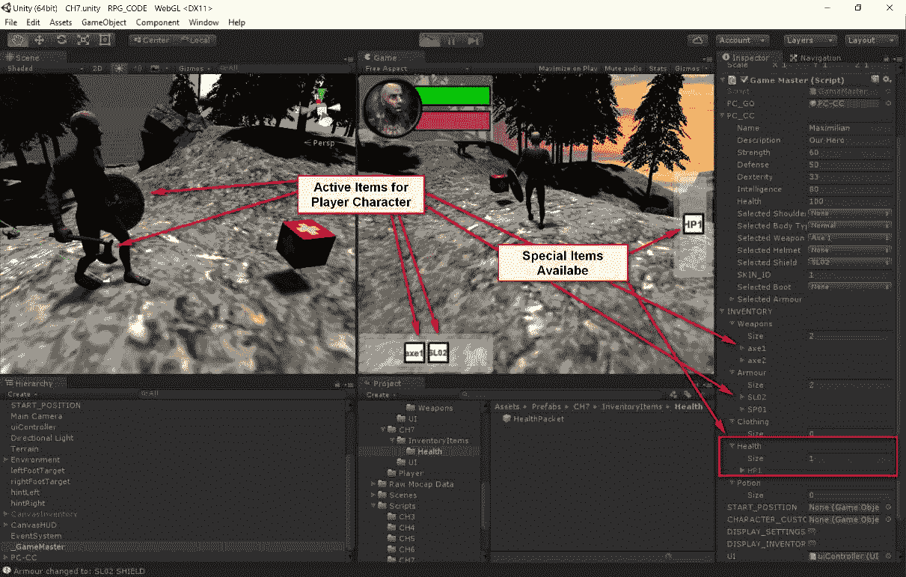

活动库存和特殊库存运行时

我们现在需要开始考虑将 HUD 用户界面与我们迄今为止开发的代码库整合。

# 代码整合

现在我们已经将 HUD 设计搭建并运行起来，我们需要将 UI 元素与实际代码整合，这些代码将生成这些 UI 元素。将创建几个脚本以支持新的 UI 功能，还有几个脚本将更新以将一切粘合在一起。

以下脚本已被创建：`ActiveInventoryItemUi.cs`、`ActiveSpecialItemUi.cs`和`HudElementUi.cs`。

这些脚本的列表如下：

```cs
using UnityEngine.EventSystems;
namespace com.noorcon.rpg2e
{
public class ActiveSpecialItemUi : EventTrigger
{
public override void OnPointerClick(PointerEventData data)
{
InventoryItem iia =
gameObject.GetComponent<ActiveInventoryItemUi>().item;
switch (iia.Category)
{
case BaseItem.ItemCatrgory.Health:
{
// add the item to the special items panel
GameMaster.instance.Ui.ApplySpecialInventoryItem(iia);
Destroy(gameObject);
break;
}
case BaseItem.ItemCatrgory.Potion:
{
break;
}
}
}
}
}
using UnityEngine;
using UnityEngine.UI;
namespace com.noorcon.rpg2e
{
public class HudElementUi : MonoBehaviour
{
public Image imgHealthBar;
public Image imgManaBar;
public GameObject activeInventoryItem;
public GameObject activeSpecialItem;
public Transform panelActiveInventoryItems;
public Transform panelActiveSpecialItems;
}
}
```

这些脚本将在 HUD 用户界面上使用，以给我们访问元素的能力。例如，你需要将`HudElementUi.cs`脚本附加到`CanvasHUD`游戏对象上。请看以下截图：

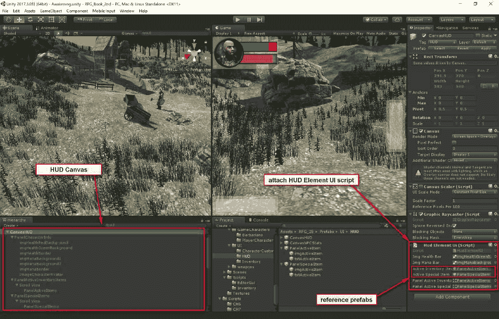

HUD 画布

上述截图说明了如何使用`HUDElementsUI.cs`脚本配置 HUD 画布。

现在让我们看看我们创建的预制件，以表示用于面板的 UI 元素。有两个；我称它们为`PanelActiveItem`和`PanelSpecialItem`。

我将讨论`PanelSpecialItem`，因为它包含`PanelActiveItem`包含的所有内容，以及一个附加的事件处理脚本。请看以下截图：


HUD 事件触发

我们刚刚讨论的是实现用于访问 HUD 画布中适当 UI 元素的脚本的实现。

你会注意到，对于`PanelSpecialItem`预制件，我们为其添加了两个新且非常重要的组件。一个是 Unity 中的**事件触发器**，另一个是`ActiveSpecialItemUi.cs`脚本，该脚本用于处理特殊物品的`PointerClick`事件。

这意味着我们基本上使物品可点击，当玩家点击物品时，会发生某些事情。在这种情况下，它将特殊物品应用于玩家角色。

现在我们已经准备好更新我们已开发的脚本以包含 HUD 功能。需要修改的脚本有`InventorySystem.cs`和`UiController.cs`。

`InventorySystem.cs`的列表如下：

```cs
using System;
using System.Collections.Generic;
using UnityEngine;
namespace com.noorcon.rpg2e
{
[Serializable]
public class InventorySystem
{
[SerializeField]
private List<InventoryItem> weapons
= new List<InventoryItem>();
[SerializeField]
private List<InventoryItem> armour
= new List<InventoryItem>();
[SerializeField]
private List<InventoryItem> clothing
= new List<InventoryItem>();
[SerializeField]
private List<InventoryItem> health
= new List<InventoryItem>();
[SerializeField]
private List<InventoryItem> potion
= new List<InventoryItem>();
public List<InventoryItem> Weapons
{
get { return weapons; }
}
public List<InventoryItem> Armour
{
get { return armour; }
}
public List<InventoryItem> Clothing
{
get { return clothing; }
}
public List<InventoryItem> Health
{
get { return health; }
}
public List<InventoryItem> Potion
{
get { return potion; }
}
private InventoryItem selectedWeapon;
private InventoryItem selectedArmour;
public InventoryItem SelectedWeapon
{
get { return selectedWeapon; }
set { selectedWeapon = value; }
}
public InventoryItem SelectedArmour
{
get { return selectedArmour; }
set { selectedArmour = value; }
}
public InventorySystem()
{
ClearInventory();
}
```

`ClearInventory()`和`AddItem()`的列表如下：

```cs
public void ClearInventory()
{
weapons.Clear();
armour.Clear();
clothing.Clear();
health.Clear();
potion.Clear();
}
// this function will add an inventory item
public void AddItem(InventoryItem item)
{
switch (item.Category)
{
case BaseItem.ItemCatrgory.Armour:
{
armour.Add(item);
break;
}
case BaseItem.ItemCatrgory.Clothing:
{
clothing.Add(item);
break;
}
case BaseItem.ItemCatrgory.Health:
{
health.Add(item);
GameMaster.instance.Ui.AddSpecialInventoryItem(item);
break;
}
case BaseItem.ItemCatrgory.Potion:
{
potion.Add(item);
break;
}
case BaseItem.ItemCatrgory.Weapon:
{
weapons.Add(item);
break;
}
}
}
```

`DeleteItem()`将从列表中删除一个给定的`InventoryItem`。请参阅以下代码：

```cs
// this function will remove an inventory item
public void DeleteItem(InventoryItem item)
{
switch (item.Category)
{
case BaseItem.ItemCatrgory.Armour:
{
armour.Remove(item);
break;
}
case BaseItem.ItemCatrgory.Clothing:
{
clothing.Remove(item);
break;
}
case BaseItem.ItemCatrgory.Health:
{
// let's find the item and mark it for removal
InventoryItem tmp = null;
foreach (InventoryItem i in this.health)
{
if (item.Category.Equals(i.Category)
&& item.Name.Equals(i.Name)
&& item.Strength.Equals(i.Strength))
{
tmp = i;
}
}
health.Remove(tmp);
break;
}
case BaseItem.ItemCatrgory.Potion:
{
// let's find the item and mark it for removal
InventoryItem tmp = null;
foreach (InventoryItem i in this.health)
{
if (item.Category.Equals(i.Category)
&& item.Name.Equals(i.Name)
&& item.Strength.Equals(i.Strength))
{
tmp = i;
}
}
potion.Remove(tmp);
break;
}
case BaseItem.ItemCatrgory.Weapon:
{
weapons.Remove(item);
break;
}
}
}
}
}
```

`UiController.cs`的列表如下：

```cs
using System;
using UnityEngine;
using UnityEngine.UI;
namespace com.noorcon.rpg2e
{
public class UiController : MonoBehaviour
{
[Header("Main Menu Canvas")]
public RectTransform MainMenuCanvas;
[Header("Settings Window")]
public RectTransform OptionsPanel;
public Slider ControlMainVolume;
public Slider ControlFXVolume;
[Header("Inventory Window")]
public RectTransform InventoryCanvas;
[Tooltip("root for inventory items")]
public Transform InventoryPanelItem;
[Tooltip("prefab representing invenotry item UI")]
public GameObject InventoryItemElement;
[Header("HUD Window")]
public RectTransform HudCanvas;
public HudElementUi HudUi;
...

public void DisplaySettings()
{
GameMaster.instance.DisplaySettings = !GameMaster.instance.DisplaySettings;
OptionsPanel.gameObject.SetActive(GameMaster.instance.DisplaySettings);
}
public void MainVolume()
GameMaster.instance.MasterVolume(ControlMainVolume.value);
}
public void FXVolume()
{
GameMaster.instance.SoundFxVolume(ControlFXVolume.value);
}
#region INVENTORY UI FUNCTIONS
public void DisplayInventory()
{
InventoryCanvas.gameObject.SetActive(GameMaster.instance.DisplayInventory);
Debug.Log("Display Inventory Function");
}
public void DisplayWeaponsCategory()
{
if (GameMaster.instance.DisplayInventory)
{
ClearInventoryPanelItems();
foreach (InventoryItem item in GameMaster.instance.Inventory.Weapons)
{
GameObject newItem
= Instantiate(InventoryItemElement) as GameObject;
InventoryItemUi InventoryItemControl
= newItem.GetComponent<InventoryItemUi>();
InventoryItemControl.ItemElementText.text =
string.Format("Name: {0}, Description: {1}, Strength: {2}, Weight:
{3}",
item.Name,
item.Description,
item.Strength,
item.Weight);
InventoryItemControl.Item = item;
// button triggers
InventoryItemControl.AddButton.GetComponent<Button>().onClick.AddListener(() =>
{
Debug.Log(string.Format("ADD button for {0}",
InventoryItemControl.ItemElementText.text));
// apply selected weapon
GameMaster.instance.PlayerCharacterData.SelectedWeapon
= (PlayerCharacter.WeaponType)Enum.Parse(
typeof(PlayerCharacter.WeaponType), InventoryItemControl.Item.Name);
GameMaster.instance.PlayerWeaponChanged();
AddActiveInventoryItem(InventoryItemControl.Item);
});
InventoryItemControl.DeleteButton.GetComponent<Button>().onClick.AddListener(() =>
{
Debug.Log(string.Format("DELETE button for {0}",
InventoryItemControl.ItemElementText.text));
Destroy(newItem);
});
newItem.transform.SetParent(InventoryPanelItem);
}
}
}
```

以下列出了一个脚本的部分内容。请参考下载包中的完整列表：

```cs
public void DisplayArmourCategory()
{
if (GameMaster.instance.DisplayInventory)
{
ClearInventoryPanelItems();
foreach (InventoryItem item in GameMaster.instance.Inventory.Armour)
{
GameObject newItem
= Instantiate(InventoryItemElement) as GameObject;
InventoryItemUi InventoryItemControl
= newItem.GetComponent<InventoryItemUi>();
InventoryItemControl.ItemElementText.text =
string.Format("Name: {0}, Description: {1}, Strength: {2}, Weight:
{3}",
item.Name,
item.Description,
item.Strength,
item.Weight);
InventoryItemControl.Item = item;
// button triggers
InventoryItemControl.AddButton.GetComponent<Button>().onClick.AddListener(() =>
{
Debug.Log(string.Format("ADD button for {0}",
InventoryItemControl.ItemElementText.text));
// apply selected weapon
GameMaster.instance.PlayerCharacterData.SelectedArmour = InventoryItemControl.Item;
GameMaster.instance.PlayerArmourChanged(InventoryItemControl.Item);
AddActiveInventoryItem(InventoryItemControl.Item);
});
InventoryItemControl.DeleteButton.GetComponent<Button>().onClick.AddListener(() =>
{
Debug.Log(string.Format("DELETE button for {0}",
InventoryItemControl.ItemElementText.text));
Destroy(newItem);
});
newItem.transform.SetParent(InventoryPanelItem);
}
}
}
...
```

现在你已经一切就绪，你可以继续测试运行游戏以确保一切按预期工作。这也是一个很好的时间来测试/调试你的代码和项目设置，如果你还没有这样做的话。

我必须再次强调以下观点：目的是掌握概念。我们正在查看实现我们想要达到目标的一种方法；你可能在这个过程中想出更好的方法，或者决定做完全不同的事情。我鼓励这样做！

看看下面的截图：

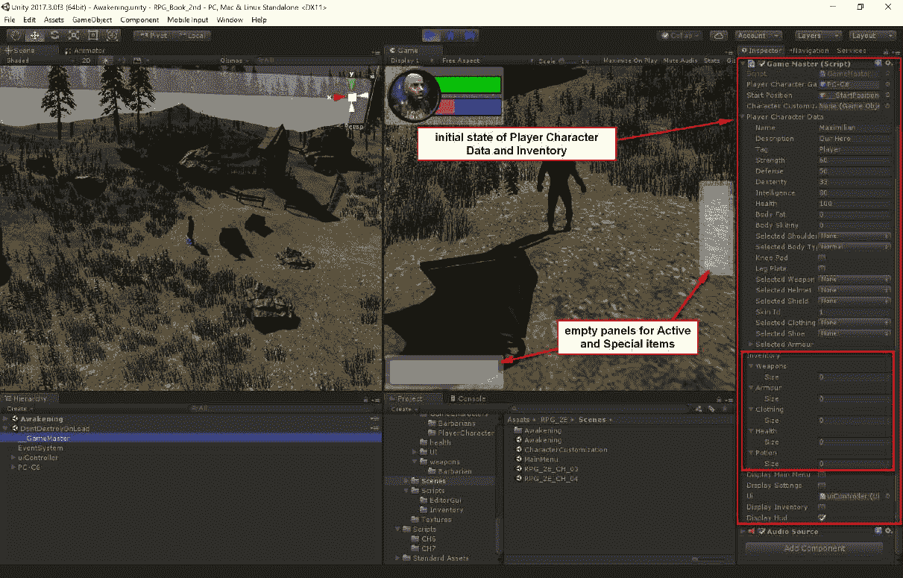

初始状态

上述截图展示了玩家角色和库存在关卡最初加载时的状态。我已经指出了我们正在测试和跟踪的关键部分，以确保我们的代码能够正常工作。

在下一幅图中，玩家角色已经捡起了一些我们在关卡上放置的库存物品。当你打开库存窗口并点击任何定义的分类，例如武器，你将得到我们库存中所有武器的列表，等等。

我们收集了一种武器类型、一个健康包和一些防御物品。请注意，我们的特殊物品面板正在显示一个物品。这是我们捡到的健康包：

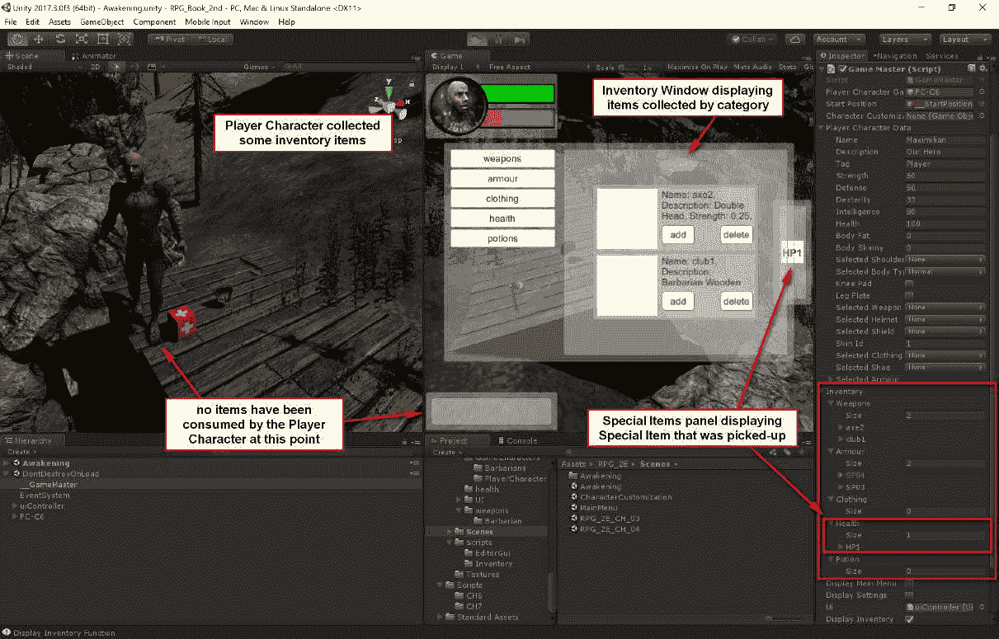

特殊物品交互

下一张截图展示了当玩家在游戏中通过使用库存窗口添加库存物品开始消耗一些库存物品时，HUD 如何更新自己。

注意，我们已经激活了三个库存物品：两把武器，分别命名为 axe2 和 club1，以及两种类型的盔甲 SP04 和 SP03。

你可以在玩家角色以及持有活动库存物品的面板上直观地看到它们。非常酷：

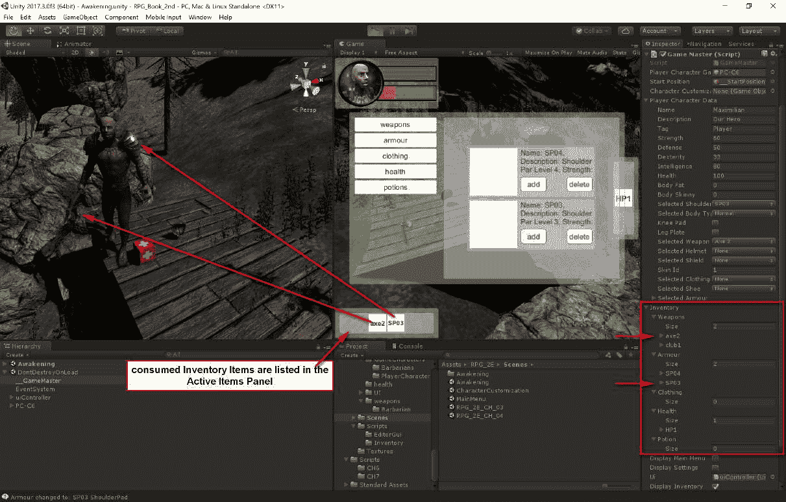

激活面板交互

是时候去见敌人了。我们还没有讨论过玩家角色和非玩家角色（NPC）之间的交互。我们很快就会讨论这个问题。

我们已经将一些库存物品从我们的库存中应用到玩家角色上，现在我们可以实际上去面对敌人了。我们将允许敌人攻击我们，以查看我们的健康如何减少。然后我们将使用特殊物品面板中的健康包再次增加我们的健康。

以下两个截图说明了这个场景：

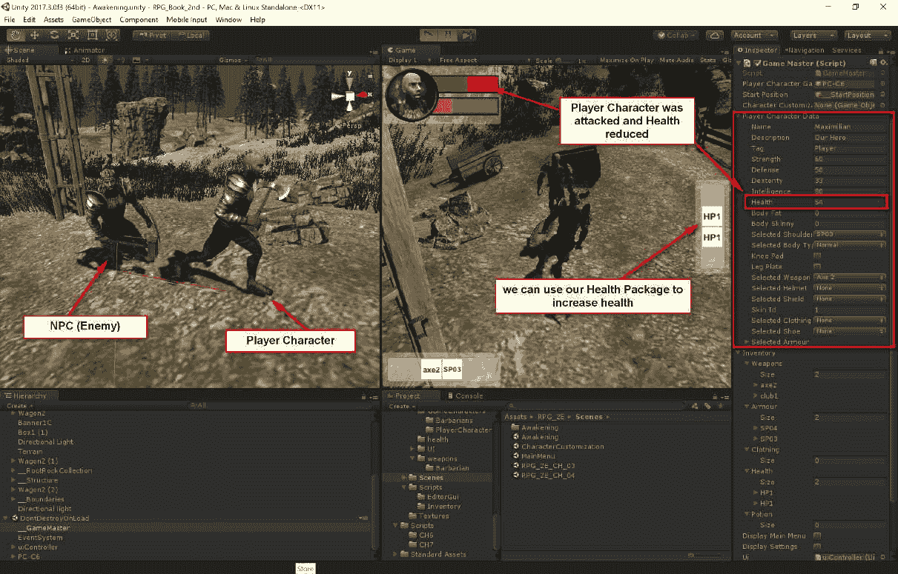

以下截图显示了我们在逃跑并应用我们的健康包：

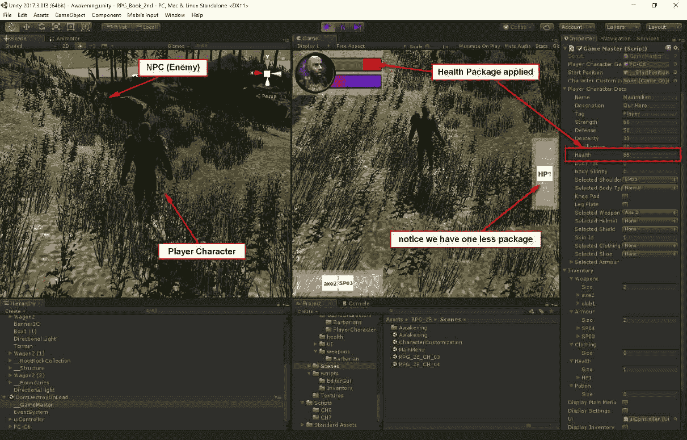

注意，当我们应用健康包时，它会从库存系统和特殊物品面板中移除自己。

# 在 HUD 中显示敌人统计数据

我们还没有真正讨论过如何处理和管理 NPC 的统计数据及其视觉表示。现在是时候做这件事了！我们需要决定我们想要向玩家显示哪些信息。目前，让我们保持简单，只显示敌人的基本健康和力量。

问题是，显示这些信息的最佳方式是什么？我们应该根据玩家角色和 NPC 之间的距离阈值来显示信息，还是我们应该在玩家在游戏过程中某个时间请求时显示它？

让我们先从第一个场景开始。当玩家角色和 NPC 之间有一定距离时，我们将显示 NPC 的信息。我们甚至可以使这个距离与为 NPC 设置的视线距离相同！这是好事，因为，如果他们能看到我们，那么他们离我们就足够近，我们可以看到他们的统计数据！让我们开始工作！

# NPC 统计数据用户界面

我们将使用我们为玩家角色创建的一些现有纹理，例如健康条和力量条的纹理。我们只需要创建一个将在世界空间中并且附加到 NPC 角色上的画布。

# 创建 NPC 画布

我们将为 NPC 创建的画布和我们已经为玩家创建的画布之间的主要区别是一些配置。

主要区别之一将是画布的*渲染模式*。NPC 画布将具有*世界空间渲染模式*。这将允许我们将画布定位为场景中的另一个 GameObject。下一个重要区别将是*矩形变换*属性，更重要的是，*缩放*和*旋转*属性。

看看下面的截图：

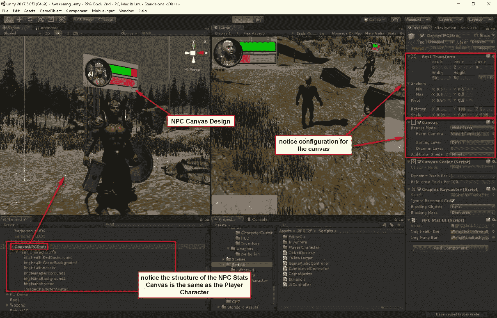

NPC 健康条

为了简化操作，你只需要创建画布并更改画布的属性，如前一张截图所示。对于下一步，你可以复制我们在前几节中开发的整个 `PanelCharacterInfo`，并将其粘贴为新画布的子元素。这样，你就不必逐个重新创建每个 UI 元素，这将节省大量时间。然而，你需要在 `PanelCharacterInfo` 面板——新面板上更改 *Scale* 和 Transform 属性，以便将其排列在 NPC 头部上方渲染！

下一步是我们能够从代码中控制状态条的值。为此，我们将创建一个新的脚本，命名为 `NPCStatUi.cs`，并将其附加到我们刚刚为 NPC 状态创建的画布对象上。

我已将画布重命名为 `CanvasNPCStats`。

脚本的列表如下：

```cs
using UnityEngine;
using UnityEngine.UI;
namespace com.noorcon.rpg2e
{
public class NpcStatusUi : MonoBehaviour
{
public Image imgHealthBar;
public Image imgManaBar;
}
}
```

我们刚刚创建的脚本只会给我们提供图像元素的引用。我们仍然需要有一种方法来更新值。

我们需要找到一种方法来引用特定场景中的所有 NPC 角色。一旦确定，我们就需要设置健康和力量条的初始值。然后，在游戏过程中，我们需要能够根据游戏状态更新每个 NPC 的统计数据。

为了让我们能够识别特定场景中的 NPC，我们将使用每个 GameObject 中定义的 `Tag` 元素。我们需要创建一个新的 `Tag` 元素，命名为 *Enemy*，并且所有敌对类型的 NPC 都需要被标记为敌对。这是一种快速搜索并根据它们的 `Tag` 值获取 GameObject 列表的方法。

你还应该开始考虑如何在运行时动态地将 NPC 状态画布附加到 NPC 上。目前，出于测试目的，我将将其附加到模型上。但问题是，你实际上在哪里附加它？嗯，我们有一个名为 *Follow* 的空 GameObject 附加到我们的模型预制件上。由于这是由我们的玩家角色模型驱动的，我们在游戏过程中将其嵌入 *Follow* 作为主相机的占位符。对于 NPC，我们将使用它将 NPC 画布作为子 GameObject 附加到模型层次结构中的 `Follow` GameObject 上。你可以在前一张截图中看到这些。

我们将使用 `NpcAgent.cs` 脚本来初始化 NPC 状态画布预制件以及 UI 元素的相关值。这是放置初始化的最佳位置，因为它将是一个自包含的单元。该脚本的最新列表如下：

```cs
using UnityEngine;
namespace com.noorcon.rpg2e
{
public class NpcAgent : MonoBehaviour
{
[SerializeField]
public Npc NpcData;
[SerializeField]
public Transform CanvasAttachmentPoint;
[SerializeField]
public Canvas CanvasNpcStats;
[SerializeField]
public GameObject CanvasNpcStatsPrefab;
public void SetHealthValue(float value)
{
CanvasNpcStats.GetComponent<NpcStatusUi>().imgHealthBar.fillAmount =
value;
}
public void SetStrengthValue(float value)
{
CanvasNpcStats.GetComponent<NpcStatusUi>().imgManaBar.fillAmount =
value;
}
//// Use this for initialization
void Start()
{
// let's go ahead and instantiate our stats
GameObject tmpCanvasGO = Instantiate(
CanvasNpcStatsPrefab,
new Vector3(CanvasAttachmentPoint.position.x, 2, 0),
CanvasNpcStatsPrefab.transform.rotation) as GameObject;
tmpCanvasGO.transform.SetParent(CanvasAttachmentPoint, false);
CanvasNpcStats = tmpCanvasGO.GetComponent<Canvas>();
CanvasNpcStats.GetComponent<NpcStatusUi>().imgHealthBar.fillAmount = 1.0f;
CanvasNpcStats.GetComponent<NpcStatusUi>().imgManaBar.fillAmount = 1.0f;
Npc tmp = new Npc();
tmp.Tag = "Enemy";
tmp.CharacterGameObject = transform.gameObject;
tmp.Name = "B1";
tmp.Health = 100.0f;
tmp.Defense= 50.0f;
tmp.Description = "The Beast";
tmp.Dexterity = 33.0f;
tmp.Intelligence = 80.0f;
tmp.Strength = 60.0f;
NpcData = tmp;
}
//// Update is called once per frame
void Update()
{
if (NpcData.Health < 0.0f)
{
NpcData.Health = 0.0f;
transform.GetComponent<NpcBarbarianMovement>().die = true;
}
}
}
}
```

注意，你需要分配 `canvasNPCStatsAttachment`*，*，它将用于存储我们将附加到 NPC 画布上的 GameObject 的引用。`canvasNPCStatsPrefab` 将在设计时用于分配代表 NPC 状态画布的预制件。如果你现在运行游戏，你将有一个预制件被动态实例化并附加到层次结构中的 `Follow` GameObject 上，填充值设置为 `1f`，即 100%。

# NPC 受击

我们需要花点时间回顾一下我们在早期章节中的一些初始脚本和配置，其中我们定义了玩家角色的*动画控制器*和`BarbarianCharacterController.cs`脚本。

注意：请参阅第三章，“RPG 角色设计”，以刷新你对动画控制器和曲线的记忆。

打开我们在第三章“RPG 角色设计”中创建的动画控制器，命名为`BarbarianAnimatorController`。选择*参数*选项卡，创建名为*Attack1, Attack2,*和*Attack3*的新参数，数据类型为`float`。看看下面的截图：

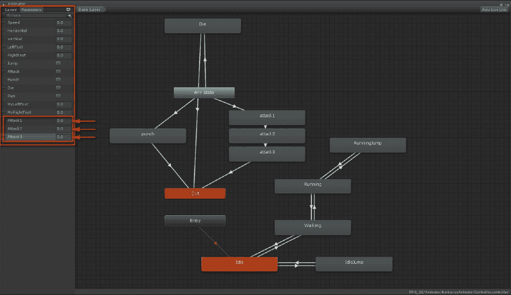

动画状态机

为了复习，请回到第四章，“游戏机制”，部分*PC 和 NPC 交互*，你将回想起我们如何定义和配置曲线，根据动画分配参数。

我们只为其中一个攻击动画定义了曲线。

一旦你为玩家角色配置了*动画控制器*上的参数，那么我们就需要更新`BarbarianCharacterController.cs`脚本，根据参数值触发攻击。

以下列出的是脚本的局部列表，仅显示修改的部分：

```cs
void FixedUpdate()
{
// The Inputs are defined in the Input Manager
// get value for horizontal axis
h = Input.GetAxis("Horizontal");
// get value for vertical axis
v = Input.GetAxis("Vertical");
speed = new Vector2(h, v).sqrMagnitude;
animator.SetFloat("Speed", speed);
animator.SetFloat("Horizontal", h);
animator.SetFloat("Vertical", v);
if (animator.GetFloat("Attack1") == 1.0f)
{
GameMaster.instance.AttackEnemy();
}
}
```

在代码中，我们检查是否有任何攻击模式处于活动状态，如果是的话，我们检查动画时刻曲线参数*Attack1*的值。如果我们处于`1.0f`，那么我们调用`GameMaster`对象来执行剩余的操作。

现在我们需要查看我们在`GameMaster.cs`脚本中定义/修改的几个函数：

```cs
// for each level/scene that has been loaded
// do some of the preparation work
private void OnLevelWasLoaded(int level)
{
instance.LevelController.OnLevelWasLoaded();
// find all NPC GameObjects of Enemy type
if (GameObject.FindGameObjectsWithTag("Enemy").Length > 0)
{
var tmpGONPCEnemy = GameObject.FindGameObjectsWithTag("Enemy");
instance.NpcEnemyListGameObjects.Clear();
foreach (GameObject goTmpNPCEnemy in tmpGONPCEnemy)
{
instance.NpcEnemyListGameObjects.Add(goTmpNPCEnemy);
}
}
}
public void AttackEnemy()
{
Npc npc =
instance.ClosestNpcEnemy.GetComponent<NpcAgent>().NpcData;
npc.Health -= 1;
}
```

这里需要一些解释。所以，每次在运行时加载新场景时，都会调用`OnLevelWasLoaded()`函数。这是查询所有标记为`Enemy`的 GameObject 的地方。然后我们将其内部存储，以供后续处理。

由于测试目的和场景的简单性，测试中只有一个敌人。我还将`closestNPCEnemy`对象设置为最后一个标记为`Enemy`的 GameObject。这个变量随后在`PlayerAttachEnemy()`函数中使用，以设置 NPC 的`Health`属性。

当调用`PlayerAttackEnemy()`函数时，我们获取 NPC 角色的 NPC 组件，并根据攻击减少其健康值。

现在，这也迫使我们更新`BaseCharacter.cs`脚本。以下是修改的列表：

```cs
[SerializeField]
private float health;
public float Health
{
get { return health; }
set
{
health = value;
if (Tag.Equals("Player"))
{
if (GameMaster.instance.Ui.HudUi != null)
{
GameMaster.instance.Ui.HudUi.imgHealthBar.fillAmount
= health / 100.0f;
}
}
else
{
CharacterGameObject.GetComponent<NpcAgent>().SetHealthValue(health / 100.0f);
}
}
}
```

在`Health`属性中，我们检查是否是玩家，或者 NPC。如果是玩家，我们需要使用`GameMaster`来更新我们的`Stats` UI，如果我们要更新自己的 NPC `Stats` UI。

这意味着当你创建你的玩家角色和/或 NPC 时，你需要确保你正确地分配数据元素；请参阅以下代码：

```cs
void Awake()
{
PlayerCharacter tmp = new PlayerCharacter();
tmp.Name = "Maximilian";
tmp.Tag = transform.gameObject.tag;
tmp.CharacterGameObject = transform.gameObject;
tmp.Health = 100.0f;
tmp.Defense = 50.0f;
tmp.Description = "Our Hero";
tmp.Dexterity = 33.0f;
tmp.Intelligence = 80.0f;
tmp.Strength = 60.0f;
playerCharacterData = tmp;
}
Awake() from the PlayerAgent.cs script. You will need to perform the same for the NpcAgent.cs script; see the following code:
```

```cs
void Start()
{
// let's go ahead and instantiate our stats
GameObject tmpCanvasGO = Instantiate(
CanvasNpcStatsPrefab,
new Vector3(CanvasAttachmentPoint.position.x, 2, 0),
CanvasNpcStatsPrefab.transform.rotation) as GameObject;
tmpCanvasGO.transform.SetParent(CanvasAttachmentPoint, false);
CanvasNpcStats = tmpCanvasGO.GetComponent<Canvas>();
CanvasNpcStats.GetComponent<NpcStatusUi>().imgHealthBar.fillAmount = 1.0f;
CanvasNpcStats.GetComponent<NpcStatusUi>().imgManaBar.fillAmount = 1.0f;
Npc tmp = new Npc();
tmp.Tag = "Enemy";
tmp.CharacterGameObject = transform.gameObject;
tmp.Name = "B1";
tmp.Health = 100.0f;
tmp.Defense= 50.0f;
tmp.Description = "The Beast";
tmp.Dexterity = 33.0f;
tmp.Intelligence = 80.0f;
tmp.Strength = 60.0f;
NpcData = tmp;
}
```

我们查看的代码和脚本已被用于测试我们提出的思想。结果是积极的。你可能已经注意到，当玩家角色攻击时，我们没有考虑其相对于敌人的位置。我们还在自动将 `GameMaster` 中最近的 NPC 角色分配为每次加载关卡时查询的最后一个元素。

# 优化代码

在结束本章之前，我想要实现最后一个代码实现，确保在玩家角色处于攻击模式时，生命值会自动影响目标 NPC。换句话说，根据我们对 NPC 的距离和视角角度确定最近的 NPC。

我们已经创建了用于确定 NPC 角色的这些数量的逻辑。现在我们需要为玩家角色实现类似的功能。让我们看看我们需要对 `BarbarianCharacterMovement.cs` 脚本进行的代码更改的部分列表：

```cs
using UnityEngine;
namespace com.noorcon.rpg2e
{
public class BarbarianCharacterController : MonoBehaviour
{
public Animator animator;
public float directionDampTime;
public float speed = 6.0f;
public float h = 0.0f;
public float v = 0.0f;
bool attack = false;
bool punch = false;
bool run = false;
bool jump = false;
[HideInInspector]
public bool die = false;
bool dead = false;
public bool EnemyInSight;
public GameObject EnemyToAttack;
Quaternion StartingAttackAngle = Quaternion.AngleAxis(-25, Vector3.up);
Quaternion StepAttackAngle = Quaternion.AngleAxis(5, Vector3.up);
Vector3 AttackDistance = new Vector3(0, 0, 2);
// Use this for initialization
void Start()
{
animator = GetComponent<Animator>() as Animator;
EnemyInSight = false;
}
...
void FixedUpdate()
{
// The Inputs are defined in the Input Manager
// get value for horizontal axis
h = Input.GetAxis("Horizontal");
// get value for vertical axis
v = Input.GetAxis("Vertical");
speed = new Vector2(h, v).sqrMagnitude;
animator.SetFloat("Speed", speed);
animator.SetFloat("Horizontal", h);
animator.SetFloat("Vertical", v);
#region used for attack range
RaycastHit hitAttack;
var angleAttack = transform.rotation * StartingAttackAngle;
var directionAttack = angleAttack * AttackDistance;
var posAttack = transform.position + Vector3.up;
for (var i = 0; i < 10; i++)
{
Debug.DrawRay(posAttack, directionAttack, Color.yellow);
if (Physics.Raycast(posAttack, directionAttack, out hitAttack, 1.0f))
{
var enemy = hitAttack.collider.GetComponent<NpcAgent>();
if (enemy)
{
//Enemy was seen
EnemyInSight = true;
EnemyToAttack = hitAttack.collider.gameObject;
GameMaster.instance.ClosestNpcEnemy = hitAttack.collider.gameObject;
}
else
{
this.EnemyInSight = false;
}
}
directionAttack = StepAttackAngle * directionAttack;
}
#endregion
if (EnemyInSight)
{
if (animator.GetFloat("Attack1") == 1.0f)
{
PlayerCharacter pc
= gameObject.GetComponent<PlayerAgent>().playerCharacterData;
float impact = (pc.Strength + pc.Health) / 100.0f;
GameMaster.instance.AttackEnemy(impact);
}
}
}
}
}
```

我们计算敌方 NPC 的视野和距离的方式是通过 **Raycasting**。这仅在攻击模式下进行；我们检查 NPC 是否在我们前方，如果是，则在 `GameMaster` 上设置 `ClosestNpcEnemy` 对象，并设置 `enemyInSight` 标志，然后从 NPC 的健康值中进行必要的减法操作。

注意，我还改变了计算击中影响的简单方程的方式，如下所示：

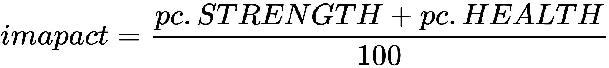

在这里，*pc* 是我们玩家角色的对象引用。NPC 对象也使用相同的方程。这只是一个简单的演示，说明玩家或 NPC 的伤害影响是基于场景中演员的力量和健康值。请查看以下截图：

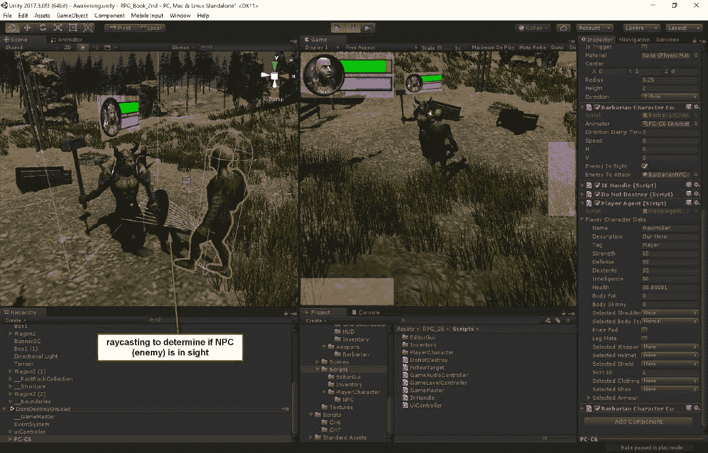

确定 NPC 是否在视野中

上述截图说明了我们如何检测 NPC 是否在攻击范围内。

相应地，你可以从玩家或 NPC 在游戏过程中激活的组件中推导出力量值。

`BaseCharacter.cs` 文件中关于 `HEALTH` 属性的部分列表如下：

```cs
[SerializeField]
private float health;
public float Health
{
get { return health; }
set
{
health = value;
if (Tag.Equals("Player"))
{
if (GameMaster.instance.Ui.HudUi != null)
{
GameMaster.instance.Ui.HudUi.imgHealthBar.fillAmount
= health / 100.0f;
}
}
else
{
CharacterGameObject.GetComponent<NpcAgent>().SetHealthValue(health / 100.0f);
}
}
}
```

有更多的代码更改和更新；请参阅提供的关联文件以获取详细信息。

在实现过程中，我修改了一些其他代码位置，但由于篇幅限制，这些内容未在书中列出。以下是已修改的脚本：`BaseCharacter.cs`、`BarbarianCharacterController.cs`、`GameMaster.cs`、`NpcAgent.cs`、`PlayerAgent.cs` 和 `NpcBarbarianMovement.cs`。请查看以下截图：

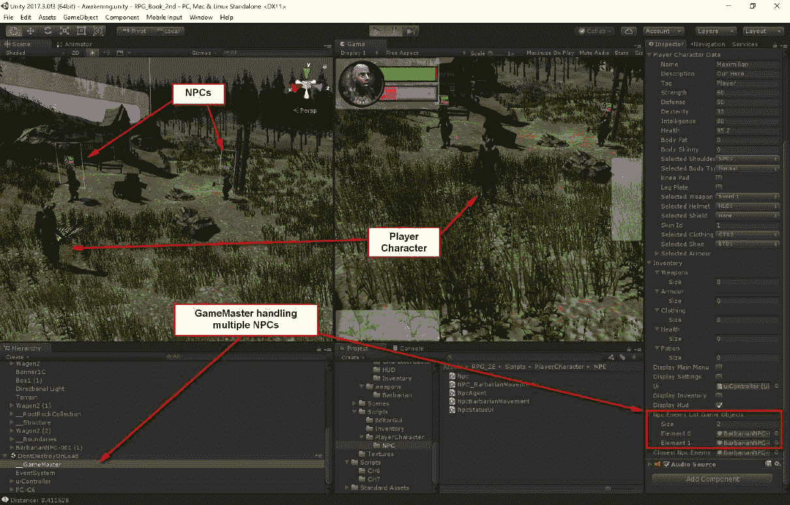

游戏大师处理多个 NPC

鼓励你进行一些研究，尝试不同的机制和实现方式来提高你的技能。

# 摘要

在本章中，我们扩展了我们的想法，并探讨了如何将所有主要部分整合在一起。本章的主要目标是创建我们游戏的一个抬头显示（HUD）。

我们从一个对我们感兴趣的设计概念开始，在实现之前为我们的 HUD 创建了一个布局。一旦我们确定了 HUD 应该是什么样子，我们就开始构建它的框架。我们设计了 HUD 的三个主要部分，并称它们为以下名称：`PanelCharacterInfo`、`PanelActiveItems` 和 `PanelSpecialItems`。

接下来，我们开始构建 UI 元素和使面板与我们的代码一起工作的必要代码。我们从 `PanelCharacterInfo` 开始，它代表我们的角色玩家的统计数据，即对玩家头像的引用、对健康的引用和对角色力量的引用。在这个过程中，我们必须创建或更新几个脚本以与新的 UI 一起工作。

接下来，我们设计和开发了 `PanelActiveItems` 面板。这个特定面板的实现和方法是稍微复杂一些。这个面板的目的是显示玩家当前消耗的所有活动库存物品。由于我们不知道玩家在任何给定时间会消耗多少物品，我们必须使面板可滚动。我们创建了必要的预制件作为库存物品的占位符，以及使它们一起工作的脚本。

`PanelSpecialItems` 的设计非常类似于 `PanelActiveItems`，主要有两个不同点。首先，我们必须确保面板是垂直的而不是水平的，因此我们必须确保应用了正确的配置。其次，这个面板的主要功能与之前不同。显示的物品应该是不可交互的，这意味着我们必须创建自定义事件处理程序，将必要的值应用到玩家角色上，并更新整个游戏状态。

一旦我们对 HUD 的设计感到满意，我们就开始编写必要的脚本来将 UI 元素与 `GameMaster` 和其他脚本集成。这基本上是确保我们的 UI 总是反映我们感兴趣的对象的状态。健康、耐力和库存是我们用来传达概念的主要项目。

在本章的最后部分，我们专注于玩家角色移动的实现和 NPC 的检测，以及如何在玩家角色和 NPC 之间跟踪生命值，这在之前的章节中没有完成。

我们还必须回溯并调整我们为玩家角色定义的动画控制器，为攻击动画值定义基于运动的曲线。

在这个过程中，我们必须解决以下挑战：我们如何知道我们是否已经接近到足够近的距离，可以实际攻击并击中 NPC 角色？我们将如何检测哪个 NPC 离我们更近？更重要的是，数据将如何从攻击动作传递到 NPC 实际被击中的情况？

我们在短时间内做了很多工作，并且内容紧凑。有些功能留给了读者自己解决。例如，我们没有讨论如何删除库存项目等等。我觉得这些内容很 trivial，而且一旦读者看到了更大的范围以及如何将一切连接起来，他们应该会足够舒适地自己实现这些功能。

话虽如此，让我们继续前进到下一章，最后一章，涵盖多人游戏！
