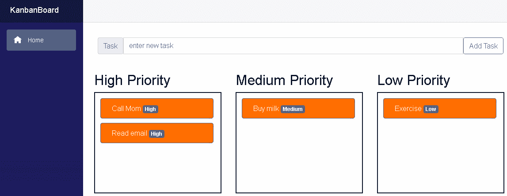
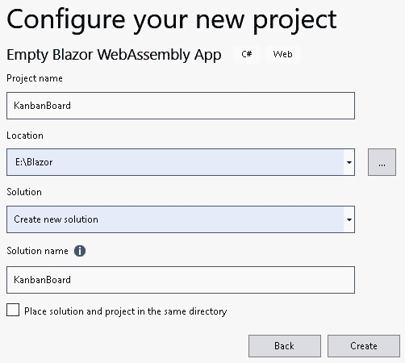

# 七、使用事件构建看板

作为开发人员，我们努力使我们的应用尽可能动态。为此，我们使用**事件**。事件是由对象发送的消息，用于指示某个操作已经发生。Razor 组件可以处理许多不同类型的事件。

在本章中，我们将学习如何在 Blazor WebAssembly 应用中处理不同类型的事件。我们还将学习如何使用**任意参数**和**属性** **分割**来简化我们如何为组件分配属性。

我们在本章中创建的项目将是一个使用拖放事件的看板。看板直观地描绘了流程各个阶段的工作。我们的看板将包括三个拖放区。最后，我们将使用任意参数和属性规划来创建一个对象，以向我们的看板板添加新任务。

在本章中，我们将涵盖以下主题:

*   事件处理
*   任意参数
*   属性拆分
*   创建看板项目

# 技术要求

要完成此项目，您需要在电脑上安装 Visual Studio 2019。关于如何安装 Visual Studio 2019 免费社区版的说明，请参考 [*第 1 章*](01.html#_idTextAnchor018) *、Blazor WebAssembly 简介*。您还需要我们在 [*第 2 章*](02.html#_idTextAnchor045) *中创建的**空 Blazor WebAssembly App** 项目模板，构建您的第一个 Blazor WebAssembly 应用*。

本章的源代码可在以下 GitHub 存储库中获得:[https://GitHub . com/PacktPublishing/Blazor-web assembly by Example/tree/main/chapter 07](https://github.com/PacktPublishing/Blazor-WebAssembly-by-Example/tree/main/Chapter07)。

行动视频中的代码可在此获得:[https://bit.ly/3bHfPHt](https://bit.ly/3bHfPHt)

# 事件处理

Razor 组件通过使用名为`@on{EVENT}`的 HTML 元素属性来处理事件，其中`EVENT`是事件的名称。

下面的代码在点击按钮时调用`OnClickHandler`方法:

```cs
<button class="btn btn-success" @onclick="OnClickHandler">
    Click Me
</button>
@code {
    private void OnClickHandler()
    {
        // ...
    }
}
```

由于事件处理程序会自动触发用户界面渲染，因此我们在处理它们时不需要调用`StateHasChanged`。事件处理程序可用于调用同步和异步方法。此外，它们可以引用与事件相关联的任何参数。

当复选框更改时，以下代码异步调用`OnChangeHandler`方法:

```cs
<input type="checkbox" @onchange="OnChangedHandler" />
@code {
    private async Task OnChangedHandler(ChangeEventArgs e)
    {
        newvalue = e.Value.ToString();
        // await ...
    }
}
```

在前面的代码中，`ChangeEventArgs`类用于提供关于变更事件的信息。事件参数是可选的，只有在方法使用它们的情况下才应该包含它们。

所有由 ASP.NET Core 框架支持的`EventArgs`类都由 BlazorWebAssembly 框架支持。这是支持的`EventArgs`类列表:

*   `ClipboardEventArgs`
*   `DragEventArgs`
*   `ErrorEventArgs`
*   `EventArgs`
*   `FocusEventArgs`
*   `ChangeEventArgs`
*   `KeyboardEventArgs`
*   `MouseEventArgs`
*   `PointerEventArgs`
*   `WheelEventArgs`
*   `ProgressEventArgs`
*   `TouchEventArgs`

## λ表达式

当我们需要用方法包含参数时，我们可以使用**λ表达式**。λ表达式是用来创建匿名函数的。他们使用`=>`运算符将参数从表达式主体中分离出来。

这是一个使用λ表达式的`@onclick`事件的例子:

```cs
<button class="btn btn-info" 
        @onclick="@(e => Console.WriteLine("Blazor
          Rocks!"))">
    Who Rocks?
</button>
```

在前面的代码中，`@onclick`事件为`Console.WriteLine`方法提供了一个字符串。

小费

如果在 lambda 表达式中直接使用循环变量，则所有 lambda 表达式都将使用相同的变量。因此，在 lambda 表达式中使用循环变量之前，应该在局部变量中捕获它的值。

## 防止违约行为

偶尔，我们需要阻止与事件相关的默认动作。我们可以通过使用`@on{EVENT}:preventDefault`指令来做到这一点，其中`EVENT`是事件的名称。

例如，当拖动一个元素时，默认行为是不允许用户将它放到另一个元素中。在看板项目中，我们需要将项目放入不同的拖放区。因此，我们需要防止这种默认行为。

以下代码防止`ondragover`默认行为发生，以便允许我们将元素放入`div`元素:

```cs
<div class="dropzone" 
     dropzone="true" 
     ondragover="event.preventDefault();"
</div>
```

Blazor WebAssembly 框架使我们通过使用`@on{EVENT}`属性来访问事件变得很容易。当使用组件时，我们通常需要提供多个属性。使用属性拆分，我们可以避免在 HTML 标记中直接分配属性。

# 属性拆分

当一个子组件有多个参数时，在 HTML 中分配每个值可能会很繁琐。为了避免这样做，我们可以使用属性拆分。

通过属性拆分，属性被捕获到字典中，然后作为一个单元传递给组件。每个字典条目添加一个属性。字典必须用字符串键实现`IEnumerable<KeyValuePair<string, object>>`或`IReadOnlyDictionary<string, object>`。我们使用`@attributes`指令查阅字典。

这是一个名为`BweButton`的组件的代码，它有很多参数:

剃刀

```cs
<button class="@Class" disabled="@Disabled" title="@Title" @onclick="@ClickEvent">
    @ChildContent
</button>
@code {
    [Parameter] public string Class { get; set; }
    [Parameter] public bool Disabled { get; set; }
    [Parameter] public string Title { get; set; }
    [Parameter]
    public EventCallback ClickEvent { get; set; }
    [Parameter]
    public RenderFragment ChildContent { get; set; }
}
```

这是示例标记，用于在不使用属性拆分的情况下渲染`BweButton`组件:

```cs
<BweButton Class="btn btn-danger" 
           Disabled="false" 
           Title="This is a button"         
           ClickEvent="OnClickHandler">
    Submit
</BweButton>
```

这是由前面的标记呈现的按钮:


图 7.1–渲染的浏览器按钮

小费

有些 HTML 属性，如`disabled`、`translate`，不需要任何值。对于这些类型的属性，如果该值设置为`false`，该属性将不会包含在由 Blazor WebAssembly 框架生成的 HTML 输出中

通过使用属性拆分，我们可以将前面的标记简化为以下内容:

```cs
<BweButton @attributes="InputAttributes" 
           ClickEvent="OnClickHandler">
    Submit
</BweButton >
```

这是前面标记使用的对`InputAttributes`的定义:

```cs
public Dictionary<string, object> InputAttributes { get; set; } 
    = new Dictionary<string, object>()
    {
        { "Class", "btn btn-danger" },
        { "Disabled", false},
        { "Title", "This is a button" }
    };
```

前面的代码定义了传递给`BweButton`的`InputAttributes`。

当与任意参数结合时，实现了属性规划的真正威力。

# 任意参数

在前面的例子中，我们使用了明确定义的参数来分配按钮的属性。为属性赋值的一种更有效的方法是使用任意参数。任意参数是组件没有明确定义的参数。`Parameter`属性有一个`CaptureUnmatchedValues`属性，用于捕获任意参数。

这是`BweButton`的新版本，使用任意参数:

```cs
<button @attributes="InputAttributes" >
    @ChildContent
</button>
@code {
    [Parameter(CaptureUnmatchedValues = true)]
    public Dictionary<string, object> InputAttributes {
      get; set; }
    [Parameter]
    public RenderFragment ChildContent { get; set; }
}
```

前面的代码包括一个名为`InputAttributes`的参数，其`CaptureUnmatchedValues`属性设置为`true`。

小费

一个组件只能有一个参数`CaptureUnmatchedValues`设置为`true`。

这是用于渲染新版本`BweButton`的更新标记:

```cs
<BweButton @attributes="InputAttributes" 
           @onclick="ButtonClicked" 
           class="btn btn-info">
    Submit
</BweButton>
```

这是前面标记使用的`InputAttributes`的定义:

```cs
public Dictionary<string, object> InputAttributes { get; set; } =
    new Dictionary<string, object>()
    {
        { "class", "btn btn-danger" },
        { "title", "This is another button" },
        { "name", "btnSubmit" },
        { "type", "button" },
          { "myAttribute", "123"}
    };
```

虽然在新版本的`BweButton`中没有明确定义字典中的任何属性，但是`BweButton`仍然被渲染。

这是由前面的标记呈现的按钮:


图 7.2–使用任意参数渲染的按钮

按钮现在是青色的原因是由于`@attributes`指令在按钮标记中的位置。当属性被拆分到元素上时，它们是从左到右处理的。因此，如果分配了重复的属性，顺序中后面出现的属性将是使用的属性。

任意参数用于允许组件呈现以前未定义的属性。这对于支持多种定制的组件非常有用，例如包含`input`元素的组件。

现在让我们快速了解一下我们将在本章中构建的项目。

# 项目概述

我们将在本章中构建的 Blazor WebAssembly 应用是看板板。看板将有三个拖放区:**高优先级**、**中优先级**和**低优先级**。我们将能够在拖放区之间拖放任务，并添加其他任务。

这是完整应用的屏幕截图:



图 7.3–看板板应用

这个项目的构建时间大约为 60 分钟。

# 创建看板项目

`KanbanBoard`项目将通过使用**空 Blazor WebAssembly App** 项目模板创建。首先，我们将添加`TaskItem`类。然后，我们将添加一个`Dropzone`组件。我们将在**主页**中添加三个`Dropzone`组件来创建看板。最后，我们将向看板添加添加新任务的能力。

## 开始项目

我们需要创建一个新的 Blazor WebAssembly 应用。我们按如下方式进行:

1.  打开 **Visual Studio 2019** 。
2.  点击**新建项目**按钮。
3.  In the **Search for templates** (*Alt* + *S*) textbox, enter `Blazor` and hit the *Enter* key.

    以下截图显示了我们在 [*第二章*](02.html#_idTextAnchor045) *中创建的**空 Blazor WebAssembly App** 项目模板，构建您的第一个 Blazor WebAssembly 应用*:

    

    图 7.4–空 Blazor WebAssembly 应用项目模板

4.  选择**空 Blazor WebAssembly App** 项目模板，点击**下一步**按钮。
5.  在**项目名称**文本框中输入`KanbanBoard`，然后点击**创建**按钮:



图 7.5–配置新项目对话框

小费

在前面的例子中，我们将`KanbanBoard`项目放入`E:/Blazor`文件夹中。然而，这个项目的位置并不重要。

我们现在已经创建了 Blazor WebAssembly 项目。

## 添加类别

我们需要添加一个`TaskPriority`枚举和一个`TaskItem`类。我们按如下方式进行:

1.  右键单击`KanbanBoard`项目，从菜单中选择**添加，新文件夹**选项。
2.  命名新文件夹`Models`。
3.  右键单击`Models`文件夹，从菜单中选择**添加，类别**选项。
4.  命名新类`TaskPriority`。
5.  点击**添加**按钮。
6.  将类替换为以下枚举:

    ```cs
    public enum TaskPriority
    {
        High,
        Medium,
        Low
    }
    ```

7.  右键单击`Models`文件夹，从菜单中选择**添加，类别**选项。
8.  命名新类`TaskItem`。
9.  点击**添加**按钮。
10.  将以下属性添加到`TaskItem`类中:

    ```cs
    public string TaskName { get; set; }
    public TaskPriority Priority { get; set; }
    ```

我们添加了`TaskPriority`枚举和`TaskItem`类来表示看板板上的任务。接下来，我们需要创建拖放区。

## 创建拖放区组件

我们需要添加一个`Dropzone`组件。我们按照以下步骤进行:

1.  右键单击`Shared`文件夹，从菜单中选择**添加，剃刀组件**选项。
2.  命名新组件`Dropzone`。
3.  点击**添加**按钮。
4.  移除`h3`元素。
5.  增加以下`@using`指令:

    ```cs
    @using KanbanBoard.Models
    ```

6.  Add the following markup:

    ```cs
    <div class="priority">
        <h2>@Priority.ToString() Priority</h2>
        <div class="dropzone"  
             ondragover="event.preventDefault();"
             @ondrop="OnDropHandler">
            @foreach (var item in TaskItems
                .Where(q => q.Priority == Priority))
            {
            }
        </div>
    </div>
    ```

    前面的标记通过优先级来标记`dropzone`，并通过阻止`ondragover`事件的默认值来允许将元素放入元素中。当一个元素被放入`dropzone`时，调用`OnDropHandler`方法。最后，它循环遍历所有指定的`Priority`的`TaskItems`类。

7.  Add the following markup within the `@foreach` loop:

    ```cs
    <div class="draggable" 
         draggable="true"
         @ondragstart="@(() => OnDragStartHandler(item))">
        @item.TaskName
        <span class="badge badge-secondary">
          @item.Priority</span>
    </div>
    ```

    前面的标记通过将`draggable`元素设置为`true`使`div`元素可拖动。拖动元素时调用`OnDragStartHandler`方法。

8.  将以下参数添加到`@code`块:

    ```cs
    [Parameter]
    public List<TaskItem> TaskItems { get; set; }
    [Parameter]
    public TaskPriority Priority { get; set; }
    [Parameter]
    public EventCallback<TaskPriority> OnDrop { get; set; }
    [Parameter]
    public EventCallback<TaskItem> OnStartDrag { get; set; } 
    ```

9.  Add the following `OnDropHandler` method:

    ```cs
    private void OnDropHandler()
    {
        OnDrop.InvokeAsync(Priority);
    }
    ```

    前面的代码调用`OnDrop`方法。

10.  Add the following `OnDragStartHandler` method:

    ```cs
    private void OnDragStartHandler(TaskItem task)
    {
        OnStartDrag.InvokeAsync(task);
    }
    ```

    前面的代码调用了`OnStartDrag`方法。

我们添加了一个`Dropzone`组件。现在我们需要给组件添加一些样式。

## 添加样式表

我们将使用 CSS 隔离向`Dropzone`组件添加一个样式表。我们按如下方式进行:

1.  右键单击`Shared`文件夹，从菜单中选择**添加，新项目**选项。
2.  在**搜索**框中输入`css`。
3.  选择**样式表**。
4.  命名样式表`Dropzone.razor.css`。
5.  点击**添加**按钮。
6.  输入以下样式:

Dropzone.razor.css 文件

```cs
.draggable {
    margin-bottom: 10px;
    padding: 10px 25px;
    border: 1px solid #424d5c;
    cursor: grab;
    background: #ff6a00;
    color: #ffffff;
    border-radius: 5px;
    width: 16rem;
}
    .draggable:active {
        cursor: grabbing;
    }
.dropzone {
    padding: .75rem;
    border: 2px solid black;
    min-height: 20rem;
}
.priority {
    min-width: 20rem;
    padding-right: 2rem;
}
```

我们已经完成了组件的造型。现在我们可以把看板放在一起了。

## 创建看板板

我们需要添加三个拖放区来创建我们的看板板，三种类型的任务各有一个拖放区。我们按如下方式进行:

1.  打开`Pages\Index.razor`页面。
2.  增加以下`@using`指令:

    ```cs
    @using KanbanBoard.Models
    ```

3.  添加以下标记:

    ```cs
    <div class="row p-2">
        <Dropzone Priority="TaskPriority.High" 
                  TaskItems="TaskItems" 
                  OnDrop="OnDrop" 
                  OnStartDrag="OnStartDrag" />
        <Dropzone Priority="TaskPriority.Medium" 
                  TaskItems="TaskItems" 
                  OnDrop="OnDrop" 
                  OnStartDrag="OnStartDrag" />
        <Dropzone Priority="TaskPriority.Low" 
                  TaskItems="TaskItems" 
                  OnDrop="OnDrop" 
                  OnStartDrag="OnStartDrag" />
    </div>
    ```

4.  Add the following `@code` block:

    ```cs
    @code {
        public TaskItem CurrentItem;
        List<TaskItem> TaskItems = new List<TaskItem>();

        protected override void OnInitialized()
        {
            TaskItems.Add(new TaskItem
            {
                TaskName = "Call Mom",
                Priority = TaskPriority.High
            });
           TaskItems.Add(new TaskItem
           {
               TaskName = "Buy milk",
               Priority = TaskPriority.Medium
            });
            TaskItems.Add(new TaskItem
            {
                TaskName = "Exercise",
                Priority = TaskPriority.Low
            });    
        }
    }
    ```

    前面的代码用三个任务初始化了`TaskItems`对象。

5.  Add the `OnStartDrag` method to the `@code` block:

    ```cs
    private void OnStartDrag(TaskItem item)
    {
        CurrentItem = item;
    }
    ```

    前面的代码将`CurrentItem`的值设置为当前正在拖动的项目。当项目被删除时，我们将使用该值。

6.  Add the `OnDrop` method to the `@code` block:

    ```cs
    private void OnDrop(TaskPriority priority)
    {
        CurrentItem.Priority = priority;
    }
    ```

    前面的代码将`CurrentItem`的`Priority`设置为与其所属的拖放区相关联的优先级。

7.  在**调试**菜单中，选择**不调试启动** ( *Ctrl* + *F5* )选项运行项目。
8.  拖放任务以更改其优先级。

我们用三个项目创建了一个非常简单的看板。让我们添加添加更多项目的能力。

## 创建新任务组件

我们需要添加一个`NewTask`组件。我们按如下方式进行:

1.  返回 **Visual Studio** 。
2.  右键单击`Shared`文件夹，从菜单中选择**添加，剃刀组件**选项。
3.  命名新组件`NewTask`。
4.  点击**添加**按钮。
5.  移除`h3`元素。
6.  Add the following markup:

    ```cs
    <div class="row p-3" style="max-width:950px">
        <div class="input-group mb-3">
            <label class="input-group-text"
              for="inputTask">
                Task
            </label>
            <input type="text"
                   id="inputTask"
                   class="form-control"
                   @bind-value="@taskName"
                   @attributes="InputParameters" />
            <button type="button"
                    class="btn btn-outline-secondary"
                    @onclick="OnClickHandler">
                Add Task
            </button>
        </div>
    </div>
    ```

    前面的标记包括一个标签、一个文本框和一个按钮。

    这是`NewTask`组件的截图:

    

    图 7.6–新任务组件

7.  将以下代码添加到`@code`块:

    ```cs
    private string taskName;
    [Parameter]
    public EventCallback<string> OnSubmit { get; set; }
    [Parameter(CaptureUnmatchedValues = true)]
    public Dictionary<string, object>
        InputParameters{ get; set; }
    ```

8.  Add the `OnClickHandler` method to the `@code` block:

    ```cs
    private async Task OnClickHandler()
    {
        if (!string.IsNullOrWhiteSpace(taskName))
        {
            await OnSubmit.InvokeAsync(taskName);
            taskName = null;
        }
    }
    ```

    前面的代码调用`OnSubmit`方法并将`taskName`对象设置为`null`。

我们现在已经创建了`NewTask`组件。接下来，我们需要开始使用它。

## 使用新任务组件

我们需要将组件添加到**主页**页面。我们按如下方式进行:

1.  打开`Pages\Index.razor`页面。
2.  在`@using`指令下添加以下标记:

    ```cs
    <NewTask OnSubmit="AddTask" 
             @attributes="InputAttributes" />
    ```

3.  将以下代码添加到`@code`块:

    ```cs
    public Dictionary<string, object> InputAttributes = new Dictionary<string, object>()
    {
        { "maxlength", "25" },
        { "placeholder", "enter new task" },
        { "title", "This textbox is used to enter your
          tasks." }
    };
    ```

4.  Add the `AddTask` method to the `@code` block:

    ```cs
    private void AddTask(string taskName)
    {
        var taskItem = new TaskItem()
        {
            TaskName = taskName,
            Priority = TaskPriority.High
        };
        TaskItems.Add(taskItem);
    }
    ```

    前面的代码将新项目的优先级设置为`High`，并将其添加到`TaskItems`对象中。

5.  从**构建**菜单中，选择**构建解决方案**选项。
6.  返回浏览器。
7.  使用 *Ctrl* + *R* 刷新浏览器。
8.  添加一些新任务。
9.  拖放任务以更改其优先级。

我们已经增加了在看板板上添加新任务的能力。

# 总结

现在，您应该能够在 Blazor WebAssembly 应用中处理事件了。此外，您应该对使用属性拆分和任意参数感到满意。

在这一章中，我们介绍了事件处理、属性规划和任意参数。之后，我们使用**空 Blazor WebAssembly App** 项目模板创建了一个新项目。我们向应用添加了一个`Dropzone`组件，并使用它来创建看板。最后，我们增加了向看板添加任务的能力，同时演示了属性拆分和任意参数。

现在，您已经知道如何在 Blazor WebAssembly 应用中处理不同类型的事件，您可以创建更具响应性的应用。而且，因为您可以使用字典将显式声明的属性和隐式属性传递给组件，所以您可以更快地创建组件，因为您不需要显式定义每个参数。

在下一章中，我们将使用 SQL Server 构建一个使用 ASP.NET 网络应用编程接口的任务管理器。

# 问题

以下问题供您考虑:

1.  如何更新看板板以允许用户删除任务？
2.  为什么要在字典中包含一个未在组件上显式或隐式定义的属性拆分？
3.  `DragEventArgs`类的基类是什么？

# 进一步阅读

以下资源提供了有关本章所涵盖主题的更多信息:

*   关于 ASP.NET Core Blazor 事件处理的更多信息，请参考[https://docs . Microsoft . com/en-us/aspnet/Core/Blazor/components/事件处理](https://docs.microsoft.com/en-us/aspnet/core/Blazor/components/event-handling)。
*   有关**文档对象模型** ( **DOM** )事件的更多信息，请参考[https://developer.mozilla.org/en-US/docs/Web/Events](https://developer.mozilla.org/en-US/docs/Web/Events)。
*   关于`DragEventArgs`类的更多信息，请参考[https://docs . Microsoft . com/en-us/dotnet/API/Microsoft . aspnetcore . components . web . drageventargs](https://docs.microsoft.com/en-us/dotnet/api/microsoft.aspnetcore.components.web.drageventargs)。