# 第三章：调试和部署 Blazor WebAssembly 应用

调试并不总是愉快的，但它却是软件开发的重要方面。当调试 Blazor WebAssembly 应用时，Microsoft Visual Studio 提供了我们所需的大部分功能。然而，由于使用 Blazor WebAssembly 构建的应用在客户端运行，我们还需要学习如何使用浏览器的 **开发者工具** (**DevTools**) 来调试应用。完成 Blazor WebAssembly 应用的调试后，我们可以使用 Microsoft Visual Studio 来部署它。

在本章中，我们将创建一个简单的游戏，我们将用它来练习调试和部署 Blazor WebAssembly 应用。我们将使用 Visual Studio 和 `DevTools` 来调试应用。我们将学习如何使用 ILogger 接口记录错误，并探讨处理异常的不同方法。完成调试后，我们将在部署到 Microsoft Azure 之前对应用应用 **即时编译** (**AOT**) 技术。

> Shift+Alt+D
> 
> 在浏览器中进行调试。
> 
> 知识就是力量！

在本章中，我们将涵盖以下主题：

+   调试 Blazor WebAssembly 应用

+   理解日志记录

+   处理异常

+   使用 **即时编译** (**AOT**) 技术

+   将 Blazor WebAssembly 应用部署到 Microsoft Azure

+   创建“猜数字”项目

# 技术要求

要完成此项目，您需要在您的电脑上安装 Microsoft Visual Studio 2022。有关如何安装 Microsoft Visual Studio 2022 的免费社区版的说明，请参阅 *第一章*，*Blazor WebAssembly 简介*。由于我们将部署此项目到 Microsoft Azure，您需要在 Microsoft Azure 上有一个账户。如果您没有 Microsoft Azure 账户，请参阅 *第一章*，*Blazor WebAssembly 简介*，以创建一个免费账户。

本章的源代码可在以下 GitHub 仓库中找到：[`github.com/PacktPublishing/Blazor-WebAssembly-by-Example-Second-Edition/tree/main/Chapter03`](https://github.com/PacktPublishing/Blazor-WebAssembly-by-Example-Second-Edition/tree/main/Chapter03)。

代码实战视频在此处可用：[`packt.link/Ch3`](https://packt.link/Ch3)。

# 调试 Blazor WebAssembly.app

调试是一项重要且有用的技能。您可以使用 Visual Studio 内置的调试工具或使用 `DevTools` 来调试 Blazor WebAssembly 应用。要在浏览器上进行调试，您必须使用以下浏览器之一：

+   Microsoft Edge（版本 80 或更高）

+   Google Chrome（版本 70 或更高）

Visual Studio 和 `DevTools` 都支持所有常规的调试场景：

+   设置和移除断点。

+   按 *F10* 以单步执行代码。

+   按 *F11* 以进入下一个函数。

+   在 Visual Studio 中按 *F5* 和在浏览器中按 *F8* 以恢复代码执行。

+   在“局部变量”显示中查看局部变量的值。

+   查看调用栈。

+   设置“监视”值。

以下场景目前不支持。但是，由于微软正在继续对调试过程进行大量改进，它们将在未来得到支持：

+   在未处理的异常上中断。

+   在启动时触达断点。

首先，我们将查看 Visual Studio 中的调试。

# Visual Studio 中的调试

如果你有任何使用 Visual Studio 的经验，你可能已经使用过调试工具。要开始调试，从 Visual Studio 菜单中选择 **调试**，**开始调试**，或按 *F5*。

一旦开始调试，你可以使用上述列出的任何场景来调试代码。例如，要在代码行上设置断点，只需单击该行左侧的空白处。

以下截图显示了在第 36 行设置的断点：

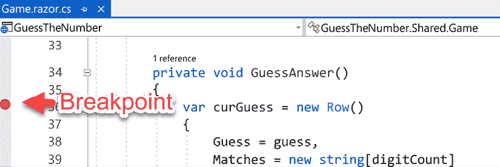

图 3.1：Visual Studio 中的断点

在 Visual Studio 中调试就像按 *F5* 一样简单。在浏览器中调试需要更多努力。

## 浏览器中的调试

在浏览器中调试 Blazor WebAssembly 应用需要几个步骤。以下图像显示了在浏览器中开始调试应用程序所需的步骤：

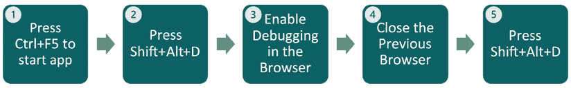

图 3.2：在浏览器中启用调试

这些是启用浏览器调试的步骤：

1.  按 *Ctrl*+*F5* 启动应用程序，无需调试。

1.  按 *Shift*+*Alt*+*D* 开始调试。

    **提示**

    要成功开始调试，确保在按 *Shift*+*Alt*+*D* 之前你的应用程序具有焦点。

    由于你的浏览器尚未启用远程调试运行，在你按 *Shift*+*Alt*+*D* 之后，你会收到以下警告：

    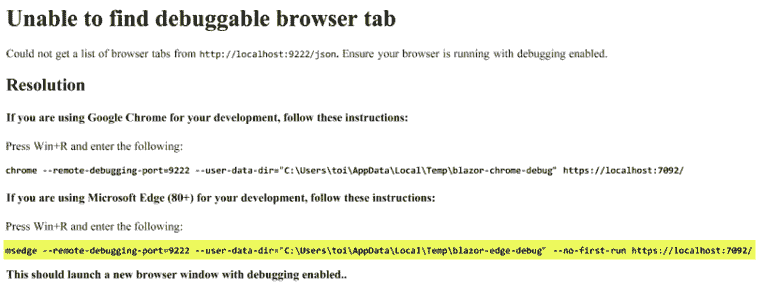

    图 3.3：无法找到可调试浏览器标签警告

    **无法找到可调试浏览器标签** 警告提供了关于如何进行操作的说明，适用于 Google Chrome 和 Microsoft Edge。由于我们使用 Microsoft Edge 进行这些截图，我们在前面的图像中突出显示了 Microsoft Edge 的说明。

1.  要在浏览器中启用调试，我们需要将提供的文本从 **无法找到可调试浏览器标签** 警告复制到 Windows 运行命令对话框中。按 *Win*+*R* 打开运行命令对话框，粘贴文本，然后按 *Enter*。

    此过程将启动另一个具有调试功能的浏览器窗口。如果你被要求同步你的设备，你可以选择 **否**。

1.  关闭之前的浏览器窗口。

    此步骤不是必需的。我们包括它是因为同时打开多个浏览器可能会造成混淆。

1.  按 *Shift*+*Alt*+*D*。

    我们已在浏览器中启用了调试。

    现在浏览器中有两个标签页打开。第一个标签页正在运行应用程序，第二个标签页正在运行 `DevTools`：

    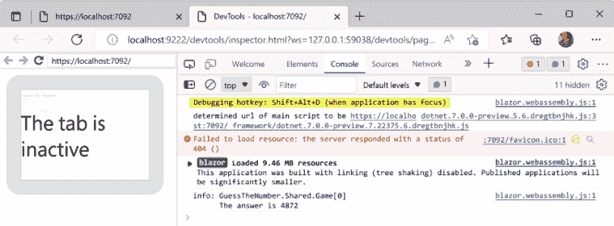

    图 3.4：启用调试的浏览器

    上述图像显示了 `DevTools` 标签。左侧区域是无效的。它用于显示其他标签的屏幕内容。`DevTools` 中的 **控制台** 标签已选中。然而，我们将使用 **源** 标签进行调试。

    一旦开始调试，我们可以使用上述列出的任何场景来调试代码。例如，要在代码行上设置断点，我们只需在代码行左侧的空白处单击。

    以下截图显示了已设置在第 36 行的断点：

    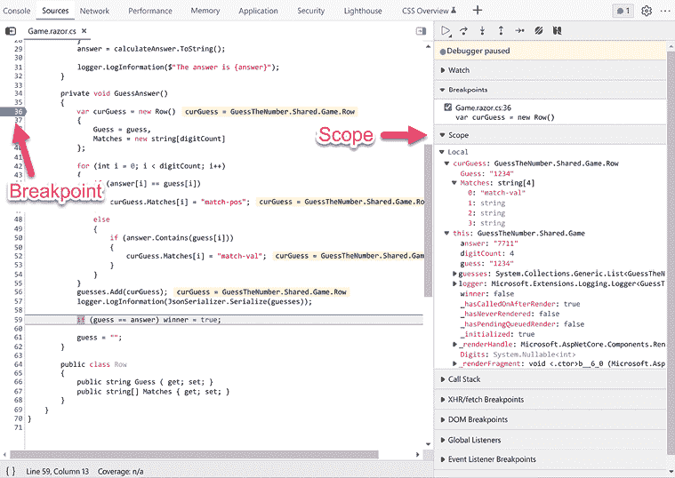

    图 3.5：DevTools 的源标签

使用 Visual Studio 或直接在浏览器中调试 Blazor WebAssembly 应用程序是可能的。在浏览器中启用调试需要更多的努力，但提供了与 Visual Studio 中相同的功能。

通过有效地使用日志，调试可以更加高效。接下来，我们将学习如何在 Blazor WebAssembly 应用程序中使用日志。

# 理解日志记录

记录日志是解决任何应用程序问题的基本工具。它有助于识别和解决问题。在微软提供的 Blazor WebAssembly 项目模板中，日志默认是启用的。然而，启用的唯一日志提供者是**控制台**提供者。

**重要提示**

**控制台** 提供者不存储日志，它只显示它们。如果您需要保留日志，您将需要使用不同的提供者。

以下代码示例执行以下操作：

+   将 `ILogger<Counter>` 对象注入到页面中。它使用类的完全限定名称作为日志类别。该日志类别包含由该 `ILogger` 实例创建的每个日志消息。

+   调用 `LogInformation` 以在 `Information` 日志级别记录指定的字符串。

以下代码在每次点击按钮时都会写入日志：

**Counter.razor**

```cs
@page "/counter"
**@inject ILogger<Counter> logger;**
<PageTitle>Counter</PageTitle>
<h1>Counter</h1>
<p role="status">Current count: @currentCount</p>
<button class="btn btn-primary" @onclick="IncrementCount">
    Click me
</button>
@code {
    private int currentCount = 0;
    private void IncrementCount()
    {
        **logger.LogInformation("Button Clicked!");**
        currentCount++;
    }
} 
```

以下截图显示了 `DevTools` 中的 **控制台** 标签的结果，显示了点击 **点击我** 按钮的结果：

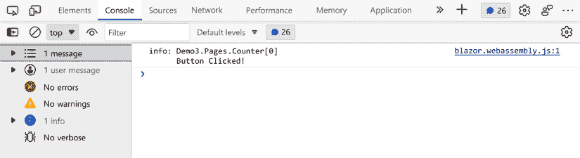

图 3.6：日志示例

## 理解日志级别

每当我们向记录器记录一个项目时，我们必须提供日志级别。日志级别表示消息的严重性。

以下表格列出了从最低到最高严重程度的日志级别值：

| 日志级别 | 方法 | 描述 |
| --- | --- | --- |
| Trace | `LogTrace` | 这些消息非常详细，可能包含敏感数据。它们默认是禁用的，不应在生产环境中启用。 |
| Debug | `LogDebug` | 这些消息仅在调试和开发期间使用。 |
| Information | `LogInformation` | 这些消息跟踪应用程序的一般流程。 |
| Warning | `LogWarning` | 这些消息用于意外或不正常的事件。 |
| 错误 | `LogError` | 这些消息是针对当前操作中的错误，例如保存失败。 |
| 严重 | `LogCritical` | 这些消息是针对导致整个应用程序失败的严重错误。 |

表 3.1：日志级别

**提示**

您应该使用 `ILogger` 而不是 `System.Console.WriteLine` 或 `System.Diagnostics.Debug.WriteLine`，因为那些方法只能让您将文本发送到控制台，并且它们不包括产生消息的类的名称。此外，它们必须在应用程序部署之前被删除或隐藏。

在使用日志记录时，请尝试使用适当的日志级别，并尽量使您的消息尽可能简短，同时不要使其失去意义。使用一致的消息格式，以便它们可以轻松过滤。最后，避免记录冗余或不相关信息，因为日志记录不是免费的；它消耗一些资源。

您可以根据需要调整最小日志级别。

以下 `Logging` 组件演示了如何使用各种不同的日志级别：

**Logging.razor**

```cs
@page "/logging"
@inject ILogger<Logging> logger;
<PageTitle>Logging</PageTitle>
<h1>Logging</h1>
<button class="btn btn-primary" @onclick="DemoLogging">
    Click me
</button>
@code {
    private void DemoLogging()
    {
        logger.LogTrace("Logger: Trace");
        logger.LogDebug("Logger: Debug");
        logger.LogInformation("Logger: Information");
        logger.LogWarning("Logger: Warning");
        logger.LogError("Logger: Error");
        logger.LogCritical("Logger: Critical");
        logger.Log(LogLevel.None, "Logger: None");
    }
} 
```

以下截图显示了在 `DevTools` 中如何渲染不同的日志级别。

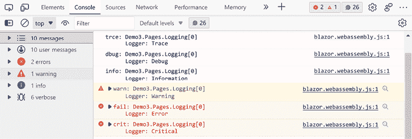

图 3.7：日志级别

## 设置最小日志级别

默认情况下，项目配置为显示所有日志项，其最小日志级别为 `Information`。您可以通过完成以下步骤来调整此设置：

1.  从 **工具** 菜单中选择 **NuGet 包管理器**，**包管理器控制台** 以打开 **包管理器控制台**。

1.  在 **包管理器控制台** 中输入以下文本并按 *Enter* 键：

    ```cs
    Install-Package Microsoft.Extensions.Logging.Configuration 
    ```

    上述代码将向项目中添加 **Microsoft.Extenstions.Logging.Configuration** NuGet 包。

1.  右键单击 `wwwroot` 文件夹，从菜单中选择 **添加**，**新建项** 选项。

1.  按 *Ctrl*+*E* 进入 **搜索** 文本框。

1.  在 **搜索** 文本框中输入 `app settings file`。

1.  在 **名称** 文本框中输入 `appsettings.json` 并单击 **添加** 按钮。

1.  将默认的 JSON 替换为以下 JSON：

    ```cs
    {
      "Logging": {
        "LogLevel": {
          "Default": "Information",
          "Microsoft.AspNetCore": "Debug"
        }
      }
    } 
    ```

1.  将以下行添加到 `Client/Program.cs` 文件的 `Main` 方法中：

    ```cs
    builder.Logging.AddConfiguration(
        builder.Configuration.GetSection("Logging")); 
    ```

以下代码将配置浏览器仅记录日志级别至少为 `Debug` 的项目。

日志记录是理解 Blazor WebAssembly 应用程序流程的必要工具。根据消息类型，有不同的日志级别。最小日志级别可以通过 `appsetting.json` 文件进行调整。

现在让我们看看一些处理异常的不同方法。

# 处理异常

作为模板的一部分，当 Blazor WebAssembly 应用程序中出现未处理的异常时，屏幕底部将显示一个黄色条。

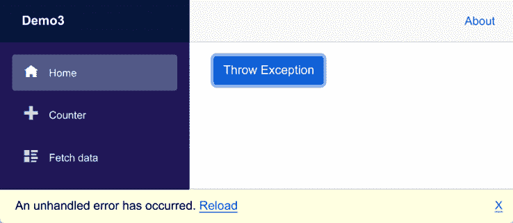

图 3.8：示例未处理的异常

您可以通过修改 `index.html` 文件来修改显示的错误消息的文本和样式。黄色条目的 UI 在 `wwwroot/index.html` 文件中定义：

```cs
<div id="blazor-error-ui">
    An unhandled error has occurred.
    <a href="" class="reload">Reload</a>
    <a class="dismiss">X</a>
</div> 
```

**提示**

您可以修改在 `wwwroot/css/app.css` 文件中显示的错误消息的样式。

在前面的截图中，点击 **抛出异常** 按钮会抛出一个未处理的异常。这是我们在前面的截图中用于创建 **抛出异常** 按钮的 `ThrowException` 组件的代码：

```cs
<button class="btn btn-primary" @onclick="NewException">
    Throw Exception
</button>
@code {
    private void NewException()
    {
        throw new Exception("This is a sample error!");
    }
} 
```

要查看异常，我们需要通过按 *F12* 并选择 **控制台** 标签来打开 `DevTools`。默认情况下，未处理的异常会被记录到 **控制台**。以下截图显示了 **控制台** 标签：

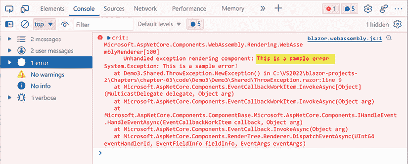

图 3.9：示例关键日志

在一个完美的世界中，没有未处理的异常。在我们的世界中，有错误边界和自定义错误组件。

## 设置错误边界

错误边界可以用来处理异常。`ErrorBoundary` 组件是一个用于在 UI 层面处理未处理错误的内置组件。它包括一个在未发生错误时渲染的 **ChildContent** 属性和一个在发生错误时渲染的 **ErrorContent** 属性。`ErrorBoundary` 组件可以包裹在任意其他组件周围。

以下代码将 `ErrorBoundary` 组件包裹在 `ThrowException` 组件周围：

```cs
<ErrorBoundary>
    <ChildContent>
        <ThrowException />
    </ChildContent>
</ErrorBoundary> 
```

当按下 **抛出异常** 按钮时，将显示以下信息：

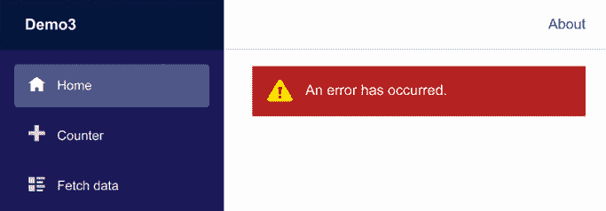

图 3.10：默认 ErrorBoundary UI

`ErrorBoundary` 组件的默认 UI 在 `wwwroot/css/app.css` 文件中定义。默认消息非常通用。我们可以通过使用 `ErrorBoundary` 组件的 `ErrorContent` 属性来添加我们自己的自定义错误消息。这是包含 `ErrorContent` 属性的更新后的 `ErrorBoundary` 组件：

```cs
<ErrorBoundary>
    <ChildContent>
        <ThrowException />
    </ChildContent>
**<****ErrorContent****>**
**<****h3****>****The Throw Exception button caused this error!****<****/****h3****>**
**<****/****ErrorContent****>**
</ErrorBoundary> 
```

以下截图显示了自定义 `ErrorContent` 的结果：

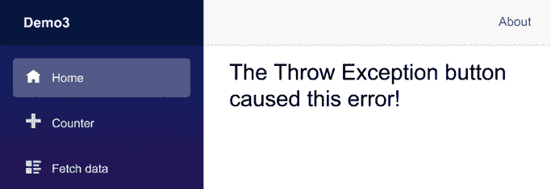

图 3.11：自定义 ErrorContent

`ErrorBoundary` 组件仅处理 UI 层面的错误。它允许开发者在一个 UI 点处捕获错误。要程序化处理错误，我们需要创建一个自定义错误组件。

## 创建自定义错误组件

自定义错误组件可以传递给每个子组件。以下 `ErrorHandler` 组件在遇到错误时将写入日志：

**ErrorHandler.razor**

```cs
@inject ILogger<ErrorHandler> Logger
<CascadingValue Value="this">
    @ChildContent
</CascadingValue>
@code {
    [Parameter]
    public RenderFragment? ChildContent { get; set; }
    public void ProcessError(Exception ex)
    {
        Logger.LogError("Message: {Message}", ex.Message);
    }
} 
```

`ErrorHandler` 需要作为 `CascadingParameter` 添加到将使用它的组件中。这是 `ThrownExceptionHandled` 组件：

**ThrownExceptionHandled.razor**

```cs
<button class="btn btn-primary" @onclick="NewException">
    Throw Exception
</button>
@code {
    [CascadingParameter]
    public ErrorHandler? Error { get; set; }
    private void NewException()
    {
        try
        {
            throw new Exception("This is a sample error!");
        }
        catch (Exception ex)
        {
            Error?.ProcessError(ex);
        }     
    }
} 
```

当 `ThrownExceptionHandled` 组件被 `ErrorHandler` 组件包裹时，所有未处理的错误都会记录到 **控制台**：

```cs
<ErrorHandler>
    <ThrowExceptionHandled />
</ErrorHandler> 
```

以下截图显示了错误是如何渲染到 **控制台** 的：

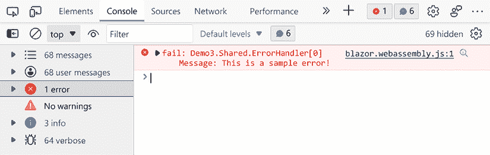

图 3.12：处理错误

当遇到未处理的异常时，微软提供的 Blazor WebAssembly 项目模板在页面底部渲染一个通用的黄色条。我们可以使用 `ErrorBoundary` 组件来自定义 UI。更好的是，我们可以创建一个自定义错误组件，以更好地控制错误处理方式。

现在我们知道了如何处理错误，让我们学习如何为部署准备我们的应用程序。

# 使用即时编译 (AOT) 编译

默认情况下，Blazor WebAssembly 应用程序在浏览器上运行时使用 .NET **中间语言 (IL**) 解释器。**即时编译 (AOT**) 允许您在部署前将 .NET 代码编译成 WebAssembly。由于编译后的代码比解释代码性能更高，因此您的应用程序将运行得更快。使用 AOT 的唯一缺点是应用程序可能更大，因此应用程序启动时加载所需的时间会更长。

启用 AOT 的步骤如下：

1.  在 **解决方案资源管理器** 中右键单击项目，从菜单中选择 **属性**。

1.  在 **搜索属性** 文本框中输入 `AOT`。

1.  选中 **发布时使用即时编译 (AOT**) 复选框。

一旦启用 AOT，每次发布项目时都会进行 AOT 编译。使用 AOT 编译发布应用程序需要更长的时间，但可以使 Blazor WebAssembly 应用程序运行得更快。这对于计算密集型应用程序尤其如此。

**重要提示**

您必须安装 `wasm-tools` 才能使用 AOT。要安装 `wasm-tools`，请运行以下命令并重新启动 Visual Studio：

`dotnet workload install wasm-tools`

现在我们已经准备好部署 Blazor WebAssembly 应用程序了。

# 将 Blazor WebAssembly 应用程序部署到微软 Azure

使用 Visual Studio 部署 Blazor WebAssembly 应用程序相当简单。Visual Studio 中包含了一个易于遵循的向导。以下是使用 Visual Studio 2022 将 Blazor WebAssembly 应用程序部署到微软 Azure 的步骤：

1.  右键单击项目，从菜单中选择 **发布**。

    这是发布向导的第一页：

    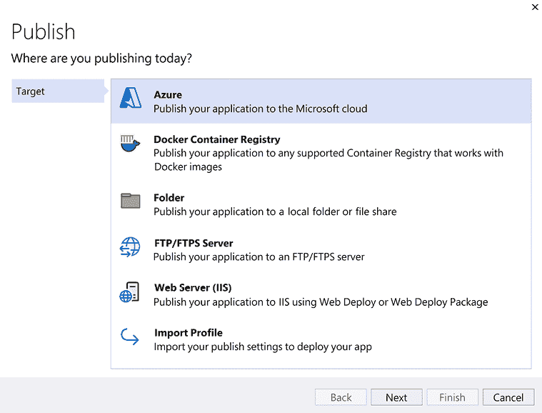

    图 3.13：发布向导的第一页

    如您所见，提供了许多选项。对于这个项目，我们将把应用程序发布到微软云中。

1.  选择 **Azure** 并点击 **下一步** 按钮。

    这是发布向导的第二页：

    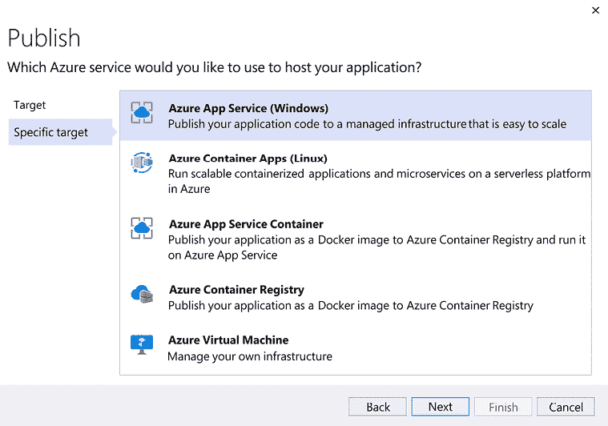

    图 3.14：发布向导的第二页

1.  选择 **Azure App Service (Windows**) 并点击 **下一步** 按钮。

    这是 **发布** 向导的最后一页。此页用于选择用于应用程序的 **Azure 应用服务**。您也可以使用此页创建 **Azure 应用服务**。

    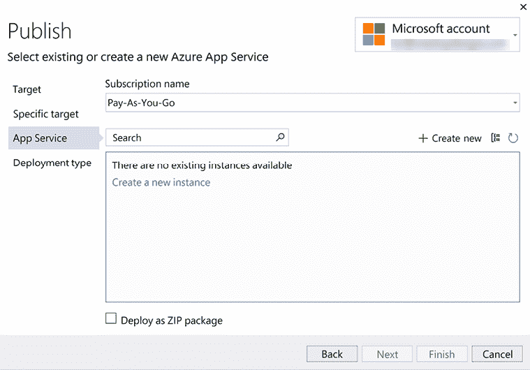

    图 3.15：发布向导的最后页面

1.  如果您还没有，请创建一个 **Azure 应用服务**。

    这是 **创建新应用服务** 对话框的截图：

    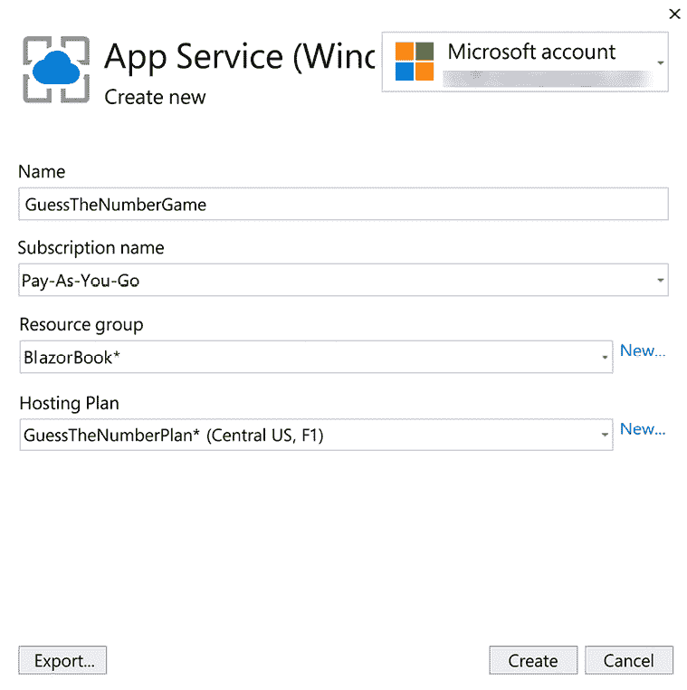

    图 3.16：创建新应用服务对话框

    如果您还没有托管计划，我们建议您为该项目创建一个 **免费** 托管计划。以下截图显示了选择 **免费** 选项的 **创建新托管计划** 对话框：

    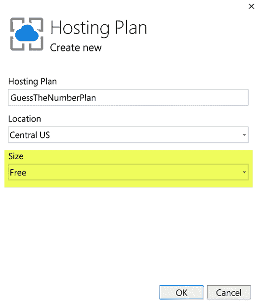

    图 3.17：创建新托管计划对话框

1.  点击 **完成** 按钮。

1.  点击 **关闭** 按钮。

    应用程序现在已准备好发布。

    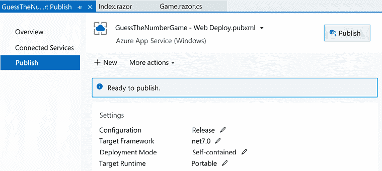

    图 3.18：发布对话框

1.  点击 **发布** 按钮，等待。

应用发布后，浏览器将自动打开。

将 Blazor WebAssembly 应用部署到 Microsoft Azure 与遵循向导中的步骤一样简单。

# 创建“猜数字”项目

在本节中，我们将构建一个简单的数字猜谜游戏。游戏将允许多次猜测，并在我们获胜时提醒我们。

这是完成的应用程序的截图：

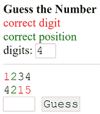

图 3.19：猜数字游戏

此项目的构建时间大约为 60 分钟。

## 项目概述

将使用 Microsoft 的 **Blazor WebAssembly App Empty** 项目模板创建一个空的 Blazor WebAssembly 项目来创建 `GuessTheNumber` 项目。首先，我们将添加项目所需的功能组件。然后，我们将添加日志记录。我们将在 Visual Studio 和浏览器中调试应用程序。我们将添加一个 `ErrorBoundary` 组件。最后，我们将该项目部署到 Microsoft Azure。

## 开始使用项目

我们需要创建一个新的 Blazor WebAssembly 应用。我们这样做如下：

1.  打开 Visual Studio 2022。

1.  点击 **创建新项目** 按钮。

1.  按 *Alt*+*S* 进入 **搜索模板** 文本框。

1.  输入 `Blazor` 并按 *Enter* 键。

    以下截图显示了 **Blazor WebAssembly App Empty** 项目模板。

    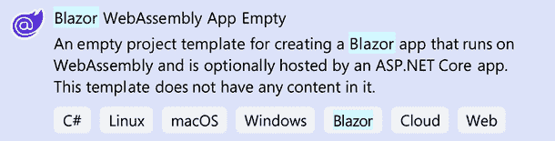

    图 3.20：Blazor WebAssembly App Empty 项目模板

1.  选择 **Blazor WebAssembly App Empty** 项目模板并点击 **下一步** 按钮。

1.  在 **项目名称** 文本框中输入 `GuessTheNumber` 并点击 **下一步** 按钮。

    这是配置我们新项目的对话框截图：

    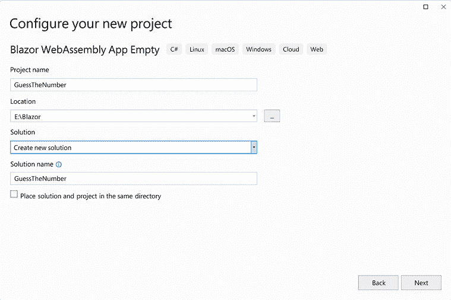

    图 3.21：配置新项目对话框

    **提示**

    在前面的示例中，我们将 `GuessTheNumber` 项目放置在 `E:\Blazor` 文件夹中。然而，此项目的位置并不重要。

1.  选择使用 **.NET 7.0** 作为 **框架** 的版本。

1.  选择 **Configure for HTTPS** 复选框。

1.  取消选择 **ASP.NET Core Hosted** 复选框。

1.  取消选择 **Progressive Web Application** 复选框。

    这是 **附加信息** 对话框的截图：

    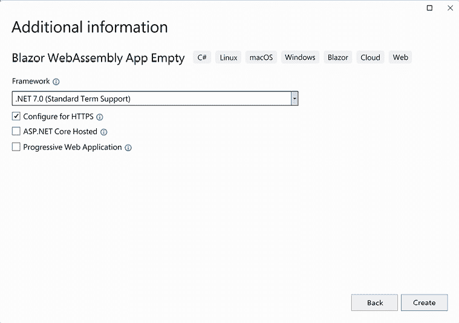

    图 3.22：附加信息对话框

1.  点击 **创建** 按钮。

我们已经创建了 `GuessTheNumber` Blazor WebAssembly 项目。现在我们需要添加一个组件。

## 添加游戏组件

我们需要添加一个包含 Razor 页面、代码隐藏页面和级联样式表的 `Game` 组件。我们这样做如下：

1.  右键单击 `GuessTheNumber` 项目，从菜单中选择 **添加**，**新文件夹** 选项。

1.  将新文件夹命名为 `Shared`。

1.  右键单击 `Shared` 文件夹，从菜单中选择 **添加**，**Razor 组件** 选项。

1.  将新组件命名为 `Game`。

1.  用以下标记替换 `Game` 组件中的默认代码：

    ```cs
    <div class="game">
        <strong>Guess the Number</strong>
        <div class="match-val">correct digit</div>
        <div class="match-pos">correct position</div>
        <div>digits: @digitCount</div>
        <hr />
        @if (guesses == null)
        {
            <h1>Loading...</h1>
        }
        else
        {
            <div class="guesses">
            </div>
        }
    </div> 
    ```

    上述代码为游戏创建了框架。

1.  在 `guesses` div 中输入以下代码：

    ```cs
    @foreach (var row in guesses)
    {
        @for (int i = 0; i < digitCount; i++)
        {
            <span class="@row.Matches[i]">
                @row.Guess[i]
            </span>
        }
        <br />
    } 
    ```

    上述代码遍历每个 `guesses` 并在屏幕上渲染它们。

1.  在 `@foreach` 语句下方输入以下代码：

    ```cs
    @if (winner)
    {
        <span>Winner!</span>
        <div>
            <button @onclick="PlayAgain">Play Again</button>
        </div>
    }
    else
    {
        <input type="text"
            @bind=guess
            class="guess"
            inputmode="numeric"
            size="@digitCount"
            maxlength="@digitCount" />
        <button @onclick="GuessAnswer">Guess</button>
    } 
    ```

上述代码检查玩家是否是赢家。如果是赢家，它将显示 **再次播放** 按钮。如果不是赢家，它将提供一个 `input` 元素，让他们可以输入另一个猜测。

现在我们已经添加了标记，我们需要添加代码。

## 添加代码

我们将在一个单独的文件中添加项目的代码。我们这样做如下：

1.  右键单击 `Shared` 文件夹，从菜单中选择 **添加**，**类** 选项。

1.  输入 `Game.razor.cs` 并点击 **添加** 按钮。

1.  将以下 `using` 语句添加到文件顶部：

    ```cs
    using System.Text; 
    ```

1.  在 `Game` 类中添加 `partial` 关键字：

    ```cs
    public `partial` class Game
    {
    } 
    ```

1.  将以下代码添加到 `Game` 类中：

    ```cs
    [Parameter] public int? Digits { get; set; }
    private int digitCount = 4;
    private string answer = "";
    private string guess = "";
    private List<Row> guesses = new();
    private bool winner = false;
    protected override void OnParametersSet(){ }
    private void CalculateAnswer(){ }
    private void GuessAnswer(){ }
    private void PlayAgain(){ }
    public class Row
    {
        public string Guess { get; set; }
        public string[] Matches { get; set; }
    } 
    ```

    上述代码定义了我们将在 `Game` 组件中使用的属性和方法。它还定义了 `Row` 类。

1.  将以下代码添加到 `OnParametersSet` 方法中：

    ```cs
    if (Digits.HasValue) { digitCount = (int)Digits; };
    CalculateAnswer(); 
    ```

    上述代码设置了 `digitCount` 的值。在确定 `digitCount` 的值之后，它调用 `CalculateAnswer` 方法。

1.  将以下代码添加到 `CalculateAnswer` 方法中：

    ```cs
    StringBuilder calculateAnswer = new StringBuilder();
    for (int i = 0; i < digitCount; i++)
    {
        int nextDigit = new Random().Next(0, 10);
        calculateAnswer.Append(nextDigit);
    }
    answer = calculateAnswer.ToString(); 
    ```

    上述代码根据 `digitCount` 指定的数字位数计算 `answer`。

1.  将以下代码添加到 `GuessAnswer` 方法中：

    ```cs
    var curGuess = new Row()
    {
        Guess = guess,
        Matches = new string[digitCount]
    };
    for (int i = 0; i < digitCount; i++)
    {
        if (answer[i] == guess[i])
        {
            curGuess.Matches[i] = "match-pos";
        }
        else
        {
            if (answer.Contains(guess[i]))
            {
                curGuess.Matches[i] = "match-val";
            }
        }
    }
    guesses.Add(curGuess);
    guess = "";
    if (guess == answer) winner = true; 
    ```

    前面的代码将答案中的每个数字与猜测中的每个数字进行比较。如果猜测等于答案，他们就是赢家。

1.  将以下代码添加到 `PlayAgain` 方法中：

    ```cs
    winner = false;
    guesses = new();
    CalculateAnswer(); 
    ```

    前面的代码重置了游戏。

我们几乎完成了 `Game` 组件的创建。我们只需要添加一些样式。

## 添加样式表

我们将使用 CSS 隔离添加一个样式表。我们这样做如下：

1.  右键单击 `Shared` 文件夹，从菜单中选择 **添加**，**新建项** 选项。

1.  按 *Ctrl*+*E* 进入 **搜索** 文本框。

1.  在 **搜索** 文本框中输入 `css`。

1.  在 **名称** 文本框中输入 `Game.razor.css` 并点击 **添加** 按钮。

1.  输入以下样式：

    ```cs
    .game {
        padding: 15px;
        font-size: 4rem;
    }
    input, button, .guesses {
        font-size: 4rem;
        font-family: Courier New, Courier, monospace
    }
    .match-pos {
        color: green;
    }
    .match-val {
        color: red
    } 
    ```

    样式表将字体设置为等宽字体，用于过去猜测列表和当前猜测。同时，用于指定颜色的类也被定义。

1.  打开 `wwwroot/index.html` 文件。

1.  在 `head` 元素中取消注释对 `GuessTheNumber.styles.css` 样式表的链接：

    ```cs
    <head>
        <meta charset="utf-8" />
        <base href="/" />
        <link href="css/app.css" rel="stylesheet" />
    **<****link****href****=****"GuessTheNumber.styles.css"**
    **rel****=****"stylesheet"** **/****>**
    </head> 
    ```

让我们通过玩游戏来测试应用程序。

## 设置和玩游戏

我们需要将 `Game` 组件添加到 `Index` 组件中以便玩游戏。我们这样做如下：

1.  打开 `_Imports.razor` 文件。

1.  将以下 `using` 语句添加到文件中：

    ```cs
    @using GuessTheNumber.Shared 
    ```

    通过将前面的 `using` 语句添加到 `_Imports.razor` 文件中，它将自动导入同一文件夹及其子文件夹中的其他 `.razor` 文件。

1.  打开 `Pages/Index.razor` 文件。

1.  将以下 `h1` 元素替换为：

    ```cs
    <PageTitle>Guess the Number</PageTitle>
    <Game /> 
    ```

1.  按 *Ctrl*+*F5* 开始应用程序，不进行调试。

1.  输入一个 4 位数字并点击 **猜测** 按钮。

    如果答案中有数字，它将以红色显示。如果数字在答案中，并且它在正确的位置，它将以绿色显示。目标是猜测答案。

1.  输入另一个 4 位数字并点击 **猜测** 按钮。

1.  尝试赢得游戏。

由于我们的代码中存在一个错误，所以不可能赢得游戏。让我们添加一些日志记录来尝试找到问题。

## 添加日志记录

我们将在应用程序中添加日志记录。我们这样做如下：

1.  打开 `Game.razor.cs` 文件。

1.  将以下 `using` 语句添加到文件顶部：

    ```cs
    using System.Text.Json; 
    ```

1.  将以下代码添加到 `Game` 类的顶部：

    ```cs
    [Inject] ILogger<Game>? logger { get; set; } 
    ```

    前面的代码将一个 `ILogger` 对象注入到 `Game` 组件中，以创建一个记录器。

1.  将以下代码添加到 `CalculateAnswer` 方法的末尾：

    ```cs
    logger.LogInformation($"The answer is {answer}"); 
    ```

1.  将以下代码添加到 `GuessAnswer` 方法的末尾：

    ```cs
    logger.LogInformation(JsonSerializer.Serialize(guesses)); 
    ```

1.  按 *Ctrl*+*F5* 开始应用程序，不进行调试。

1.  按 *F12* 打开 `DevTools`。

1.  选择 **控制台** 选项卡。

1.  输入一个 4 位数字并点击 **猜测** 按钮。

1.  输入另一个 4 位数字并点击 **猜测** 按钮。

    以下截图显示了已记录到 **控制台** 选项卡的消息：

    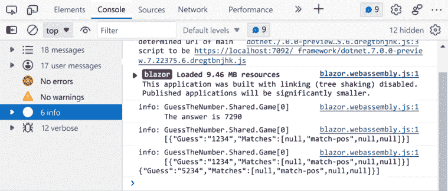

    图 3.23：记录的信息

通过使用日志记录，我们可以确定我们的猜测正在被正确评估。让我们尝试调试我们的代码以找到问题。

## 在 Visual Studio 中进行调试

首先，我们将使用 Visual Studio 调试 Blazor WebAssembly 应用程序。我们这样做如下：

1.  打开 `Game.razor.cs` 文件。

1.  在 `GuessAnswer` 方法的第一行添加一个断点。

1.  按 *F5* 以调试模式运行应用程序。

1.  输入一个四位数并点击 **Guess** 按钮。

1.  将鼠标悬停在 `curGuess` 上以查看其内容。

1.  查看 **Locals** 窗口。

1.  在 `guess` 上设置 **Watch**。

1.  按 *F10* 以单步执行代码。

1.  验证代码是否正确运行。

1.  查看 Visual Studio 中的 **Output** 窗口以帮助理解流程：

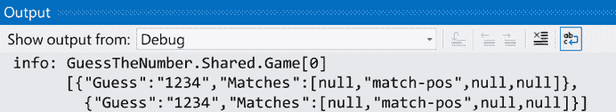

图 3.24：Visual Studio 中的输出窗口

1.  问题在于在将 `guess` 的值与答案比较之前，它被设置为一个空字符串。

1.  将以下代码移动到 `GuessAnswer` 方法的末尾：

    ```cs
    guess = ""; 
    ```

1.  按 *F5* 以非调试模式运行应用程序。

1.  玩游戏直到获胜。

    以下截图显示了一个获胜的游戏：

    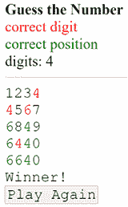

    图 3.25：猜数字 – 获胜者

当您的猜测与答案匹配时，您就赢了游戏。让我们通过改变数字的位数来使游戏更难。

## 更新代码

为了使游戏更难，我们将允许玩家决定他们需要猜测多少位数。我们这样做如下：

1.  返回 Visual Studio 2022。

1.  打开 `Game.razor` 文件。

1.  将 `@digitCount` 替换为以下内容：

    ```cs
    <input type="number" 
        value=@digitCount 
        inputmode="numeric" 
        min="1" max="10" 
        @onchange="RestartGame" /> 
    ```

1.  打开 `Game.razor.cs` 文件。

1.  添加以下 `RestartGame` 方法：

    ```cs
    private void RestartGame(ChangeEventArgs e) {
        digitCount = Convert.ToInt16(e.Value);
        PlayAgain();
    } 
    ```

    上述代码每次更改数字位数时都会重置游戏。

1.  按 *Ctrl*+*F5* 以非调试模式启动应用程序。

1.  播放更新后的游戏。

现在我们将使用浏览器来调试我们的更新。

## 在浏览器中进行调试

我们将在浏览器中调试新代码。我们这样做如下：

1.  按 *Shift*+*Alt*+*D*。

1.  将指示的文本复制到您的剪贴板，该文本与您使用的浏览器相对应。

1.  按 *Win*+*R*，粘贴您复制的文本，然后点击 **OK** 按钮。

1.  按 *Shift*+*Alt*+*D*。

    浏览器中打开第二个选项卡。

1.  点击 **Sources** 选项卡并查看 `file://` 节点中的文件。

1.  打开 `Shared` 文件夹：

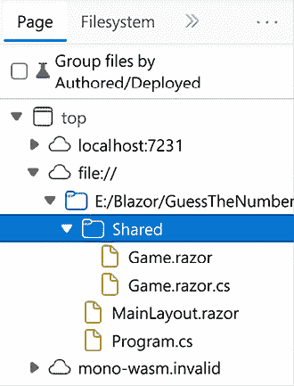

图 3.26：浏览器中的文件夹

1.  在 `GuessAnswer` 方法中添加一个断点。

1.  返回第一个选项卡。

1.  将数字位数更改为 5。

1.  输入一个五位数并点击 **Guess** 按钮。

1.  返回第二个选项卡。

1.  查看 `curGuess` 的 `Scope` 和 `Local` 值。

1.  按多次 *F10* 以单步执行函数调用。

1.  按 *F8* 恢复脚本执行。

1.  返回第一个选项卡。

1.  输入一个三位数并按 **Guess** 按钮。

1.  按 *F8* 恢复脚本执行。

1.  点击页面底部的**重新加载**链接。

当我们输入的猜测数字少于答案时，遇到了一个未处理的错误。让我们通过添加一个`ErrorBoundary`组件来解决这个问题。

## 添加 ErrorBoundary 组件

我们需要将`Game`组件包裹在一个`ErrorBoundary`组件中。我们这样做如下：

1.  返回 Visual Studio。

1.  打开`Index.razor`文件。

1.  将`Game`元素替换为以下内容：

    ```cs
    <ErrorBoundary>
        <ChildContent>
            <Game />
        </ChildContent>
        <ErrorContent>
            <h1>You have entered an invalid guess!</h1>
        </ErrorContent>
    </ErrorBoundary> 
    ```

1.  按*Ctrl*+*F5*启动应用程序，不进行调试。

1.  输入一个三位数并按**猜测**按钮。

1.  验证由`ErrorContent`属性定义的消息是否显示。

我们已添加了一个`ErrorBoundary`组件，当遇到未处理的异常时更新 UI。`ErrorContent`属性用于定义 UI。现在应用程序已经测试完毕，是时候部署它了。

## 将应用程序部署到 Microsoft Azure

我们将启用 AOT 编译并将应用程序部署到 Microsoft Azure。我们这样做如下：

1.  右键单击`GuessTheNumber`项目，从菜单中选择**属性**。

1.  在**搜索属性**文本框中输入`AOT`。

1.  勾选**发布时使用即时编译（AOT）**复选框。

1.  右键单击`GuessTheNumber`项目，从菜单中选择**发布**选项。

1.  选择**Azure**并点击**下一步**按钮。

1.  选择**Azure App Service (Windows**)并点击**下一步**按钮。

1.  选择现有的 Azure App Service 或创建一个新的。

1.  点击**完成**按钮。

    **重要提示**

    请耐心等待，将应用程序部署到 Microsoft Azure 需要一些时间。

1.  玩游戏。

    我们已将`猜数字`Web 应用程序部署到 Microsoft Azure。

    **重要提示**

    在您完成应用程序的测试后，别忘了从您的 Azure 账户中删除您添加的资源。

# 摘要

现在，你应该能够调试和部署一个 Blazor WebAssembly 应用程序。

在本章中，我们学习了在 Visual Studio 和`DevTools`中的调试方法。我们学习了不同的日志级别以及如何写入日志。我们学习了如何处理异常。最后，我们学习了在将 Blazor WebAssembly 应用程序部署到 Microsoft Azure 之前如何使用 AOT 编译。

之后，我们使用 Visual Studio 中的**Blazor WebAssembly App Empty**项目模板创建了一个新项目。我们添加了一个简单的`Game`组件。我们在应用程序中添加了一些日志记录。我们使用 Visual Studio 和`DevTools`都添加了应用程序的断点。我们添加了一个`ErrorBoundary`组件来捕获未处理的错误。最后，我们启用了 AOT 编译并将应用程序部署到 Microsoft Azure。

在下一章中，我们将使用模板组件构建一个模态对话框。

# 问题

以下问题供您参考：

1.  你会如何重写`猜数字`游戏以使用自定义错误组件？

1.  哪些类型的应用程序从 AOT 中受益最大？

1.  不同的日志级别有哪些？何时应该使用每个级别？

1.  你如何在浏览器中调试 Blazor WebAssembly 应用？

1.  你能否免费将 Blazor WebAssembly 应用部署到 Microsoft Azure？

# 进一步阅读

以下资源提供了有关本章主题的更多信息：

+   有关在 Visual Studio 中调试 C# 代码的更多信息，请参阅 [`learn.microsoft.com/en-us/visualstudio/get-started/csharp/tutorial-debugger`](https://learn.microsoft.com/en-us/visualstudio/get-started/csharp/tutorial-debugger)。

+   有关 `DevTools` 的更多信息，请参阅 [`learn.microsoft.com/en-us/microsoft-edge/devtools-guide-chromium/overview`](https://learn.microsoft.com/en-us/microsoft-edge/devtools-guide-chromium/overview)。

+   有关日志记录的更多信息，请参阅 [`learn.microsoft.com/en-us/dotnet/core/extensions/logging`](https://learn.microsoft.com/en-us/dotnet/core/extensions/logging)。

+   有关 Microsoft Azure 的更多信息，请参阅 [`azure.microsoft.com`](https://azure.microsoft.com)。
