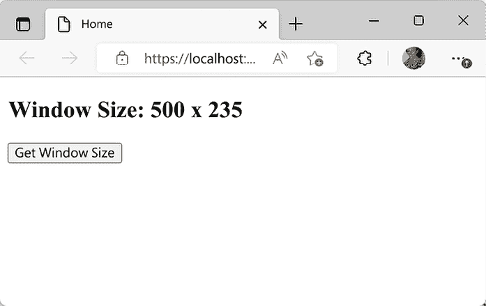
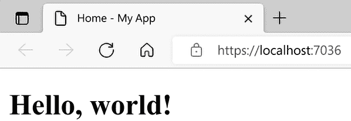
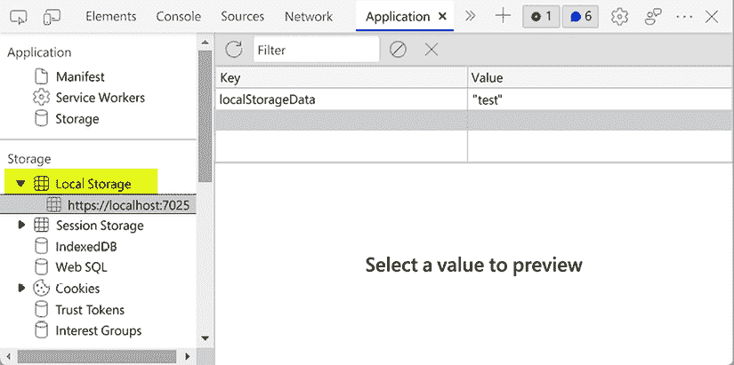
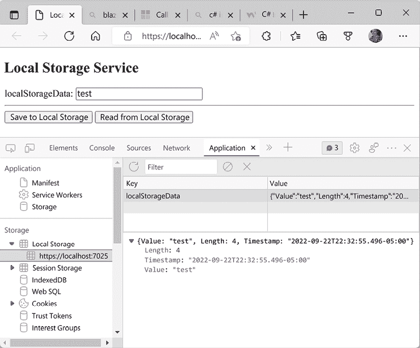
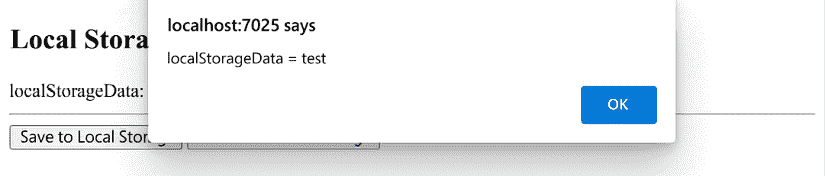
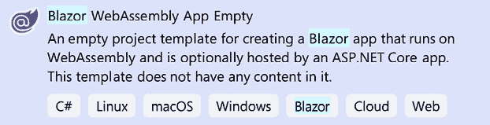
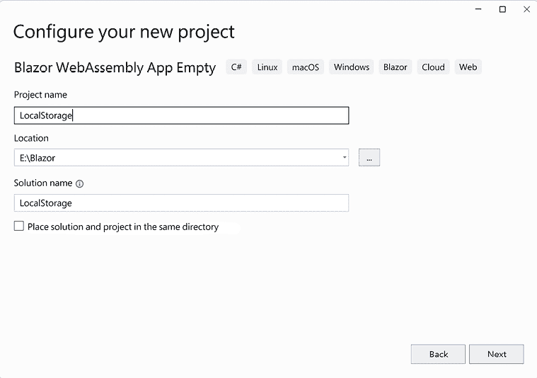
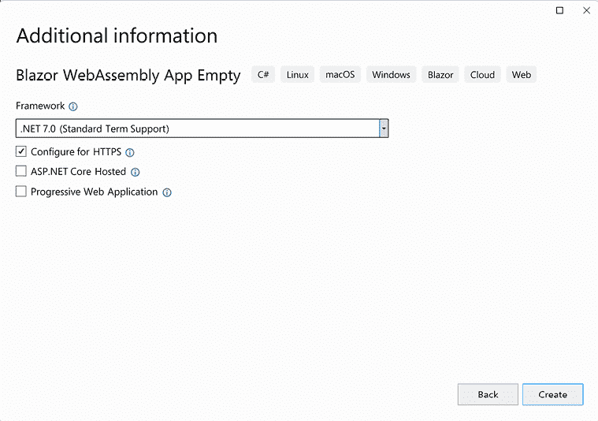
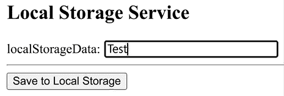

# 第五章：使用 JavaScript 互操作性（JS Interop）构建本地存储服务

Blazor WebAssembly 框架使我们能够在浏览器上运行 C# 代码。然而，有一些场景 C# 简直无法处理，对于这些场景，我们需要使用 JavaScript 函数。

在本章中，我们将学习如何使用 JavaScript 与 Blazor WebAssembly。我们将学习如何从 .NET 方法中调用 JavaScript 函数，无论是否有返回值。相反，我们还将学习如何从 JavaScript 函数中调用 .NET 方法。我们将通过使用 **JavaScript 互操作性**（**JS Interop**）来完成这两种场景。最后，我们将学习如何通过使用 JavaScript 的 Web Storage API 在浏览器上存储数据。

本章我们将创建的项目将是一个本地存储服务，该服务将读取和写入应用程序的本地存储。为了访问应用程序的本地存储，我们将使用 JavaScript。我们还将创建一个测试组件来测试本地存储服务。测试组件将使用 JavaScript 在 JavaScript 警告框中显示文本。

> 很遗憾，但这是真的。
> 
> 我们可能不喜欢 JavaScript，
> 
> 但我们仍然需要它！

在本章中，我们将涵盖以下主题：

+   为什么使用 JavaScript？

+   探索 JS 互操作性

+   使用本地存储

+   创建本地存储服务

# 技术要求

要完成此项目，您需要在您的 PC 上安装 Visual Studio 2022。有关如何安装 Visual Studio 2022 的免费社区版的说明，请参阅 *第一章*，*Blazor WebAssembly 简介*。

本章的源代码可在以下 GitHub 仓库中找到：[`github.com/PacktPublishing/Blazor-WebAssembly-by-Example-Second-Edition/tree/main/Chapter05`](https://github.com/PacktPublishing/Blazor-WebAssembly-by-Example-Second-Edition/tree/main/Chapter05)。

代码在行动视频在此处可用：[`packt.link/Ch5`](https://packt.link/Ch5)。

# 为什么使用 JavaScript？

使用 Blazor WebAssembly，我们可以创建无需编写任何 JavaScript 的健壮应用程序。然而，有一些场景需要使用 JavaScript。例如，我们可能有一个我们想要继续使用的喜欢的 JavaScript 库。此外，没有 JavaScript，我们无法操作 DOM 或调用任何 JavaScript API。

这是我们无法直接从 Blazor WebAssembly 框架访问的部分列表：

+   **DOM 操作**

+   **媒体捕获和流 API**

+   **WebGL API**（网页的 2D 和 3D 图形）

+   **Web Storage API**（`localStorage` 和 `sessionStorage`）

+   **地理位置 API**

+   JavaScript 弹出框（一个警告框、一个确认框和一个提示框）

+   浏览器的在线状态

+   浏览器的历史记录

+   **Chart.js**

+   其他第三方 JavaScript 库

前面的列表并不全面，因为目前有数百个可用的 JavaScript 库。然而，需要记住的关键点是，我们不使用 JavaScript 就不能操作 DOM。因此，我们可能始终需要在我们的 Web 应用程序中使用一些 JavaScript。幸运的是，通过使用 JS interop，这很容易做到。

# 探索 JS interop

要从 .NET 调用 JavaScript 函数，我们使用 `IJSRuntime` 抽象。这个抽象表示框架可以调用的 JavaScript 运行时实例。要使用 `IJSRuntime`，我们必须首先通过依赖注入将其注入到我们的组件中。有关依赖注入的更多信息，请参阅*第七章*，*使用应用程序状态构建购物车*。

`@inject` 指令用于将依赖项注入到组件中。以下代码将 `IJSRuntime` 注入到当前组件中：

```cs
@inject IJSRuntime js 
```

`IJSRuntime` 抽象有两个我们可以用来调用 JavaScript 函数的方法：

+   **InvokeAsync**

+   **InvokeVoidAsync**

这两种方法都是异步的。这两种方法之间的区别在于，其中一种方法返回一个值，而另一种方法不返回。我们可以将 `IJSRuntime` 的实例向下转换为 `IJSInProcessRuntime` 的实例，以同步运行该方法。最后，我们可以通过使用 `JsInvokable` 装饰器从 JavaScript 中调用 .NET 方法。我们将在本章后面查看这些方法的示例。

然而，在我们能够调用 JavaScript 方法之前，我们需要将 JavaScript 加载到我们的应用程序中。

## 加载 JavaScript 代码

将 JavaScript 代码加载到 Blazor WebAssembly 应用程序中有几种方法。一种方法是将 JavaScript 代码直接输入到 `wwwroot/index.html` 文件中的 `body` 元素的 `script` 元素中。然而，我们建议不要直接将 JavaScript 代码输入到 `.html` 文件中，而是使用外部 JavaScript 文件来存放你的 JavaScript 函数。

我们可以通过在 `wwwroot./index.html` 文件中引用它来添加外部文件。以下代码引用了位于 `wwwroot/scripts` 文件夹中的名为 `btwInterop.js` 的文件：

```cs
<script src="img/bweInterop.js"></script> 
```

组织脚本的一个更好的方法是将与特定组件关联的外部 JavaScript 文件放置在一起。要添加与特定组件关联的 JavaScript 文件，请创建一个与组件同名的 JavaScript 文件，但文件扩展名是 JavaScript。例如，定义在 `MyComponent.razor` 文件中的 `MyComponent` 组件将使用 `MyComponent.razor.js` 作为其关联的 JavaScript 文件。

为了使组件能够引用 JavaScript 文件中的代码，必须在组件的 `OnAfterRenderAsync` 方法中导入该文件。以下示例中使用了 `import` 标识符来导入一个 JavaScript 文件：

```cs
protected override async Task OnAfterRenderAsync(bool firstRender)
{
    if (firstRender)
    {
        module = await js.InvokeAsync<IJSObjectReference>
                ("import", "./Pages/MyComponent.razor.js");
    }
} 
```

在前面的代码中，正在导入的 JavaScript 文件位于 `Pages` 文件夹中，文件名为 `MyComponent.razor.js`。

**重要提示**

当应用程序发布时，同站 JavaScript 文件将被自动移动到 `wwwroot` 文件夹。这种方法称为 JavaScript 隔离，它使得下载 JavaScript 文件变得延迟。

前面的代码使用 `IJSRuntime` 的 `InvokeAsync` 方法从 .NET 调用 JavaScript 的 `import` 函数。

## 从 .NET 方法调用 JavaScript 函数

我们可以使用两种不同的 `IJSRutime` 方法从 .NET 异步调用 JavaScript：

+   `InvokeAsync`

+   `InvokeVoidAsync`

要从 .NET 同步调用 JavaScript 函数，`IJSRutime` 必须被转换为 `IJSInProcessRuntime`。

### `InvokeAsync`

`InvokeAsync` 方法是一个异步方法，用于调用返回值的 JavaScript 函数。

这是 `IJSRuntime` 的 `InvokeAsync` 方法：

```cs
ValueTask<TValue> InvokeAsync<TValue>(string identifier,
                                     params object[] args); 
```

在前面的代码中，第一个参数是 JavaScript 函数的标识符，第二个参数是一个 JSON-序列化参数的数组。第二个参数是可选的。`InvokeAsync` 方法返回一个 `ValueTask`，其类型为 `TValue`。`TValue` 是 JavaScript 返回值的 JSON-反序列化实例。

在 JavaScript 中，`Window` 对象代表浏览器的窗口。为了确定当前窗口的宽度和高度，我们使用 `Window` 对象的 `innerWidth` 和 `innerHeight` 属性。

以下 JavaScript 代码包含一个名为 `getWindowSize` 的方法，该方法返回 `Window` 对象的宽度和高度：

**wwwroot/bweInterop.js**

```cs
var bweInterop = {};
bweInterop.getWindowSize = function () {
    var size = {
        width: window.innerWidth,
        height: window.innerHeight
    }
    return size;
} 
```

**重要提示**

在这本书中，我们将使用 `bweInterop` 命名空间来组织我们的 JavaScript 代码，并最小化命名冲突的风险。

这是用于在 .NET 中存储窗口大小的 `WindowSize` 类的定义：

```cs
public class WindowSize
{
    public int? Width { get; set; }
    public int? Height { get; set; }
} 
```

以下 `Index` 组件从 `bweInterop.js` 文件中调用 `GetWindowSize` 方法：

**Pages/Index.razor**

```cs
@page "/"
@inject IJSRuntime js
<PageTitle>Home</PageTitle>
@if (windowSize.Width != null)
{
    <h2>
        Window Size: @windowSize.Width x @windowSize.Height
    </h2>
}
<button @onclick="GetWindowSize">Get Window Size</button>
@code {
    private WindowSize windowSize = new WindowSize();
    private async Task GetWindowSize()
    {
        windowSize = await js.InvokeAsync<WindowSize>(
            "bweInterop.getWindowSize");
    }
} 
```

在前面的代码中，`IJSRuntime` 被注入到组件中。当点击 **获取窗口大小** 按钮时，`GetWindowSize` 方法使用 `IJSRuntime` 的 `InvokeAsync` 方法调用 `getWindowSize` JavaScript 函数。`GetWindowSize` JavaScript 函数将窗口的宽度和高度返回到 `windowSize` 属性。最后，组件重新生成其渲染树并将任何更改应用到浏览器的 DOM 上。

这是点击 **获取窗口大小** 按钮后页面的截图：



图 5.1：窗口大小示例

`IJSRuntime` 的 `InvokeSync` 方法用于调用返回值的 JavaScript 函数。如果我们不需要返回值，可以使用 `InvokeAsync` 方法代替。

### `InvokeVoidAsync`

`InvokeVoidAsync` 方法是一个异步方法，用于调用不返回值的 JavaScript 函数。

这是 `IJSRuntime` 的 `InvokeVoidAsync` 方法：

```cs
InvokeVoidAsync(string identifier, params object[] args); 
```

就像 `InvokeAsync` 方法一样，第一个参数是被调用的 JavaScript 函数的标识符，第二个参数是一个 JSON-serializable 参数数组。第二个参数是可选的。

在 JavaScript 中，`Document` 对象代表 HTML 文档的根节点。`Document` 对象的 `title` 属性用于指定出现在浏览器标题栏中的文本。假设我们想在 Blazor WebAssembly 应用程序中的组件之间导航时更新浏览器的标题。为此，我们需要使用 JavaScript 来更新 `title` 属性。

下面的 JavaScript 代码导出一个名为 `setDocumentTitle` 的函数，该函数将 `Document` 对象的 `title` 属性设置为 `title` 参数提供的值：

**Shared/Document.razor.js**

```cs
export function setDocumentTitle(title) {
    document.title = title;
} 
```

上述代码使用 `export` 语句导出 `setDocumentTitle` 函数。

**重要提示**

JavaScript 中的 `export` 语句用于从 JavaScript 导出函数，以便导入到其他程序中。

下面的 `Document` 组件使用 `setDocumentTitle` JavaScript 函数来更新浏览器的标题栏：

**Shared/Document.razor**

```cs
@inject IJSRuntime js
@code {
    [Parameter] public string Title { get; set; } = "Home";
    protected override async Task OnAfterRenderAsync
        (bool firstRender)
    {
        if (firstRender)
        {
            IJSObjectReference module =
                await js.InvokeAsync<IJSObjectReference>
                    ("import", "./Shared/Document.razor.js");
            await module.InvokeVoidAsync
                ("setDocumentTitle", Title);
        }
    }
} 
```

在上述代码中，`IJSRuntime` 被注入到组件中。然后，`OnAfterRenderAsync` 方法使用 `InvokeAsync` 方法导入 JavaScript 代码，并使用 `InvokeVoidAsync` 方法调用 `setDocumentTitle` JavaScript 函数。

**重要提示**

我们在并置的 JavaScript 代码中未使用 `bweInterop` 命名空间，以强调它只被一个组件引用。

下面的标记使用 `Document` 组件将浏览器的标题栏更新为 `Home – My App`：

```cs
<Document Title="Home - My App" /> 
```

下面的截图显示了生成的文档标题：



图 5.2：更新的文档标题

**提示**

您可以使用内置的 `PageTitle` 组件来设置页面的标题。

默认情况下，JS 互操作调用是异步的。要执行同步 JS 互操作调用，我们需要使用 `IJSInProcessRuntime`。

### IJSInProcessRuntime

到目前为止，在本章中，我们只看了异步调用 JavaScript 函数。但我们也可以同步调用 JavaScript 函数。我们通过将 `IJSRuntime` 降级为 `IJSInProcessRuntime` 来实现这一点。`IJSInProcessRuntime` 允许我们的 .NET 代码同步调用 JS 互操作调用。这可以是有益的，因为这些调用比它们的异步对应物开销更小。

这些是 `IJsInProcessRuntime` 的同步方法：

+   `Invoke`

+   `InvokeVoid`

以下代码使用 `IJSInProcessRuntime` 来同步调用一个 JavaScript 函数：

```cs
@inject IJSRuntime js
@code {
    private string GetGuid()
    {
        string guid = 
            ((IJSInProcessRuntime)js).Invoke<string>("getGuid");
        return guid;
    }
} 
```

在上述代码中，`IJsRuntime` 实例已被降级为 `IJSInProcessRuntime` 实例。`IJSInProcessRuntime` 实例的 `Invoke` 方法用于调用 `getGuid` JavaScript 方法。

`IJSRuntime` 抽象提供了从 .NET 方法直接调用 JavaScript 函数的方法。它们可以是异步调用或同步调用。直接从 JavaScript 函数调用 .NET 方法需要一个特殊的属性。

## 从 JavaScript 函数调用 .NET 方法

我们可以通过使用 `JSInvokable` 属性装饰方法，从 JavaScript 调用公共 .NET 方法。

以下 .NET 方法被 `JSInvokable` 属性装饰，以便可以从 JavaScript 调用：

```cs
private WindowSize windowSize = new WindowSize();
[JSInvokable]
public void GetWindowSize(WindowSize newWindowSize)
{
    windowSize = newWindowSize;
    StateHasChanged();
} 
```

在前面的代码中，每次从 JavaScript 调用 `GetWindowSize` 方法时，都会更新 `windowSize` 属性。在 `windowSize` 属性更新后，组件的 `StateHasChanged` 方法被调用，以通知组件其状态已更改，因此组件应该重新渲染。

**重要提示**

组件的 `StateHasChanged` 方法仅在 `EventCallback` 方法中自动调用。在其他情况下，必须手动调用以通知 UI 它可能需要重新渲染。

要从 JavaScript 调用 .NET 方法，我们必须为 JavaScript 创建一个 `DotNetObjectReference` 类，以便用于定位 .NET 方法。`DotNetObjectReference` 类包装了一个 JS 互操作参数，表示该值不应序列化为 JSON，而应作为引用传递。

**重要提示**

为了避免内存泄漏并允许对创建 `DotNetObjectReference` 类的组件进行垃圾回收，你必须勤奋地销毁每个 `DotNetObjectReference` 实例。

以下代码创建了一个包装 `Resize` 组件的 `DotNetObjectReference` 实例。然后，该引用被传递到 JavaScript 方法中：

```cs
private DotNetObjectReference<Resize> objRef;
protected async override Task OnAfterRenderAsync(bool firstRender)
{
    if (firstRender)
    {
        objRef = DotNetObjectReference.Create(this);
        await js.InvokeVoidAsync(
            "bweInterop.registerResizeHandler",
             objRef);
    }
} 
```

我们可以使用 `DotNetObjectReference` 创建的组件引用从 JavaScript 调用 .NET 组件中的方法。在下面的 JavaScript 中，`registerResizeHandler` 函数创建了一个在初始化时调用，并且每次窗口调整大小时都会被调用的 `resizeHandler` 函数。

**bweInterop.js**

```cs
bweInterop.registerResizeHandler = function (dotNetObjectRef) {
    function resizeHandler() {
        dotNetObjectRef.invokeMethodAsync('GetWindowSize',
            {
                width: window.innerWidth,
                height: window.innerHeight
            });
    };
    resizeHandler();
    window.addEventListener("resize", resizeHandler);
} 
```

在前面的示例中，使用了 `invokeMethodAsync` 函数来调用被 `JSInvokable` 属性装饰的 `GetWindowSize` .NET 方法。

**提示**

你可以使用 `invokeMethod` 函数或 `invokeMethodAsync` 函数从 JavaScript 调用 .NET 实例方法。

这是 `Resize` 组件的完整 .NET 代码：

**Resize.razor**

```cs
@page "/resize"
@inject IJSRuntime js
@implements IDisposable
<PageTitle>Resize</PageTitle>
@if (windowSize.Width != null)
{
        <h2>
            Window Size: @windowSize.Width x @windowSize.Height
        </h2>
}
@code {
    private DotNetObjectReference<Resize> objRef;
    private WindowSize windowSize = new WindowSize();
    protected async override Task OnAfterRenderAsync(
        bool firstRender)
    {
        if (firstRender)
        {
            objRef = DotNetObjectReference.Create(this);
            await js.InvokeVoidAsync(
                "bweInterop.registerResizeHandler",
                    objRef);
        }
    }
    [JSInvokable]
    public void GetWindowSize(WindowSize newWindowSize)
    {
        windowSize = newWindowSize;
        StateHasChanged();
    }
    public void Dispose()
    {
        objRef?.Dispose();
    }
} 
```

`Resize` 组件的前置代码显示了浏览器当前宽度和高度。当你调整浏览器大小时，显示的值会自动更新。此外，当组件被销毁时，`DotNetObjectReference` 对象也会被销毁。要测试 `Resize` 组件，请按 *Ctrl*+*F5* 启动应用程序，不进行调试。应用程序启动后，导航到 `/resize` 页面并调整窗口大小。

`IJSRuntime` 抽象为我们提供了一种从 .NET 调用 JavaScript 函数以及从 JavaScript 调用 .NET 方法的方式。

我们将使用 JavaScript 的 Web Storage API 来完成本章的项目。但在我们能够使用它之前，我们需要了解它是如何工作的。

# 使用本地存储

JavaScript 的 Web Storage API 为浏览器提供了存储键/值对的机制。对于每个网络浏览器，可以在 Web Storage 中存储的数据大小至少为每个来源 5 MB。`localStorage` 机制在 JavaScript 的 Web Storage API 中定义。我们需要使用 JS interop 来访问应用程序的本地存储，因为 Web Storage API 需要使用 JavaScript。

应用程序的本地存储限于特定的 URL。如果用户重新加载页面或关闭并重新打开浏览器，本地存储的内容将保留。如果用户打开多个标签，每个标签共享相同的本地存储。本地存储中的数据在明确清除之前会保留，因为它没有过期日期。

**重要提示**

使用 *InPrivate* 窗口或 *Incognito* 窗口创建的 `localStorage` 对象中的数据，在最后一个标签关闭时会被清除。

这些是 `localStorage` 的方法：

+   **key**：此方法根据其在 `localStorage` 中的位置返回指定键的名称。

+   **getItem**：此方法从 `localStorage` 返回指定键的值。

+   **setItem**：此方法接受一个键和值对，并将它们添加到 `localStorage`。

+   **removeItem**：此方法从 `localStorage` 中删除指定的键。

+   **clear**：此方法清除 `localStorage`。

**重要提示**

`sessionStorage` 也在 Web Storage API 中定义。与在多个浏览器标签间共享其值的 `localStorage` 不同，`sesssionStorage` 仅限于单个浏览器标签。因此，如果用户重新加载页面，数据会持续存在，但如果用户关闭标签（或浏览器），数据将被清除。

要查看应用程序本地存储的内容，请按 *F12* 打开浏览器开发者工具，并选择 **Application** 选项卡。在左侧菜单的 **Storage** 部分选择 **Local Storage**。以下截图显示了 Microsoft Edge 中 **DevTools** 对话框的 **Application** 选项卡：



图 5.3：本地存储

通过使用 Web Storage API，在浏览器中存储数据并检索它非常容易。现在，让我们快速了解一下本章将要构建的项目。

# 创建本地存储服务

在本章中，我们将构建一个本地存储服务。该服务将同时写入和读取应用程序的本地存储。我们将使用 JS 互操作来实现这一点。我们将使用`InvokeVoidAsync`方法写入本地存储，使用`InvokeAsync`方法从本地存储读取。最后，我们将创建一个组件来测试我们的服务。

测试组件将读取和写入本地存储。它将使用 JS 互操作在 JavaScript 警告框中显示本地存储的内容。

以下截图显示了测试组件和应用程序的本地存储。当点击**保存到本地存储**按钮时，**localStorageData**文本框中的值将保存到本地存储。



图 5.4：本地存储服务测试页面

当点击**从本地存储读取**按钮时，**localStorageData**的值将在 JavaScript 警告框中显示。以下截图显示了显示本地存储值的警告示例：



图 5.5：从本地存储读取

此项目的构建时间大约为 60 分钟。

## 项目概述

使用 Microsoft 的**Blazor WebAssembly App Empty**项目模板创建一个空的 Blazor WebAssembly 项目，将创建`LocalStorage`项目。首先，我们将添加一个 JavaScript 文件，其中包含我们的服务将需要使用的 JavaScript 函数来更新应用程序的本地存储。接下来，我们将创建接口和类，其中包含将调用 JavaScript 函数的.NET 方法。最后，我们将通过添加一个本地 JavaScript 文件来测试我们的服务。

## 项目入门

我们需要创建一个新的 Blazor WebAssembly 应用程序。我们这样做如下：

1.  打开 Visual Studio 2022。

1.  点击**创建新项目**按钮。

1.  按*Alt*+*S*进入**搜索模板**文本框。

1.  输入`Blazor`并按*Enter*键。

    以下截图显示了**Blazor WebAssembly App Empty**项目模板：

    

    图 5.6：Blazor WebAssembly App Empty 项目模板

1.  选择**Blazor WebAssembly App Empty**项目模板并点击**下一步**按钮。

1.  在**项目名称**文本框中输入`LocalStorage`并点击**下一步**按钮。

    这是我们配置新项目所使用的对话框的截图：

    

    图 5.7：配置新项目对话框

    **提示**

    在前面的示例中，我们将`LocalStorage`项目放置在`E:/Blazor`文件夹中。然而，此项目的位置并不重要。

1.  选择**.NET 7.0**作为要使用的**框架**版本。

1.  选中**配置为 HTTPS**复选框。

1.  取消选中**ASP.NET Core 托管**复选框。

1.  取消选中**渐进式 Web 应用程序**复选框。

    这是用于收集有关我们新项目额外信息的对话框截图：

    

    图 5.8：附加信息对话框

1.  点击**创建**按钮。

我们已经创建了一个空的`LocalStorage` Blazor WebAssembly 项目。现在，让我们开始添加我们将需要的用于读取和写入本地存储的 JavaScript 函数。

## 编写 JavaScript 以访问本地存储

我们需要编写将读取和写入应用程序本地存储的 JavaScript 函数。我们这样做如下：

1.  右键点击`wwwroot`文件夹，从菜单中选择**添加**，**新建文件夹**选项。

1.  将新文件夹命名为`scripts`。

1.  右键点击`scripts`文件夹，从菜单中选择**添加**，**新建项**选项。

1.  在**搜索**框中输入`javascript`。

1.  选择**JavaScript 文件**。

1.  将 JavaScript 文件命名为`bweInterop.js`。

1.  点击**添加**按钮。

1.  输入以下 JavaScript：

    ```cs
    var bweInterop = {};
    bweInterop.setLocalStorage = function (key, data) {
        localStorage.setItem(key, data);
    }
    bweInterop.getLocalStorage = function (key) {
        return localStorage.getItem(key);
    } 
    ```

    上述 JavaScript 包含一个`setLocalStorage`函数，用于写入本地存储，以及一个`getLocalStorage`函数，用于从本地存储读取。

1.  打开`wwwroot/index.html`文件。

1.  在`body`元素的底部添加以下标记：

    ```cs
    <script src="img/bweInterop.js"></script> 
    ```

**重要提示**

在`wwwroot/index.html`文件中，引用您自定义 JavaScript 的`script`标签应该位于 Blazor 脚本引用之后。

现在我们需要添加将调用这些 JavaScript 函数的.NET 代码。首先，我们将为我们的服务创建接口。

## 添加 ILocalStorageService 接口

我们需要为我们的服务创建一个接口。我们这样做如下：

1.  右键点击`LocalStorage`项目，从菜单中选择**添加**，**新建文件夹**选项。

1.  将新文件夹命名为`Services`。

1.  右键点击**Services**文件夹，然后从菜单中选择**添加**，**新建项**选项。

1.  在**搜索**框中输入`interface`。

1.  选择**接口**。

1.  将文件命名为`ILocalStorageService`。

1.  点击**添加**按钮。

1.  将以下代码添加到`ILocalStorageService`接口中：

    ```cs
    ValueTask SetItemAsync<T>(string key, T item);
    ValueTask<T?> GetItemAsync<T>(string key); 
    ```

    上述方法将用于设置本地存储的值。

1.  打开`Program.cs`文件。

1.  添加以下`using`语句：

    ```cs
    using LocalStorage.Services; 
    ```

1.  在注册`HttpClient`的代码之后添加以下代码：

    ```cs
    builder.Services.AddScoped
        <ILocalStorageService, LocalStorageService>(); 
    ```

上述代码将`LocalStorageService`注册到依赖注入容器中。有关依赖注入的更多信息，请参阅*第七章*，*使用应用程序状态构建购物车*。

我们已经定义了服务的抽象方法并将其注册到应用程序中。现在，是时候创建`LocalStorageService`类了。

## 创建 LocalStorageService 类

我们需要基于我们刚刚创建的接口创建一个新的类。我们这样做如下：

1.  右键单击**Services**文件夹，从菜单中选择**添加**，**类**选项。

1.  将新类命名为`LocalStorageService`。

1.  将`LocalStorageService`类更新为从`ILocalStorageService`继承：

    ```cs
    public class LocalStorageService : ILocalStorageService 
    ```

1.  将以下代码添加到`LocalStorageService`类中：

    ```cs
    private IJSRuntime js;
    public LocalStorageService(IJSRuntime JsRuntime)
    {
        js = JsRuntime;
    } 
    ```

    上述代码定义了`LocalStorageService`类的构造函数。

1.  将`SetItemAsync`方法添加到`LocalStorageService`类中：

    ```cs
    public async ValueTask SetItemAsync<T>(string key, T item)
    {
        await js.InvokeVoidAsync(
            "bweInterop.setLocalStorage",
             key,
             JsonSerializer.Serialize(item));
    } 
    ```

    `SetItemAsync`方法使用键和要存储在`localStorage`中的项的序列化版本调用`bweInterop.setLocalStorage` JavaScript 函数。

1.  将`GetItemAsync`方法更新为以下内容：

    ```cs
    public async ValueTask<T?> GetItemAsync<T>(string key)
    {
        var json = await js.InvokeAsync<string>
            ("bweInterop.getLocalStorage", key);
        return JsonSerializer.Deserialize<T>(json);
    } 
    ```

    `GetItemAsync`方法使用键调用`bweInterop.getLocalStorage` JavaScript 函数。如果`bweInterop.getLocalStorage`返回一个值，则该值将被反序列化并返回。

我们已经完成了我们的服务。现在我们需要对其进行测试。

## 创建`DataInfo`类

`DataInfo`类将用于存储我们从应用程序的本地存储中读取和写入的数据：

1.  右键单击`LocalStorage`项目，从菜单中选择**添加**，**新文件夹**选项。

1.  将新文件夹命名为`Models`。

1.  右键单击**Models**文件夹，从菜单中选择**添加**，**类**选项。

1.  将新类命名为`DataInfo`。

1.  将以下属性添加到`DataInfo`类中：

    ```cs
    public string? Value { get; set; }
    public int Length { get; set; }
    public DateTime Timestamp { get; set; } 
    ```

`DataInfo`类包括数据、关于数据长度的信息，以及数据更新的日期和时间。

现在我们已经定义了一个对象来存储我们的数据，是时候测试将数据写入应用程序的本地存储了。

## 写入本地存储

我们需要使用我们的本地存储服务测试向应用程序的本地存储写入。我们这样做如下：

1.  打开`Pages/Index.razor`文件。

1.  删除`H1`元素。

1.  添加以下指令：

    ```cs
    @using LocalStorage.Services 
    ```

1.  添加以下标记：

    ```cs
    <PageTitle>Local Storage Service</PageTitle>
    <h2>Local Storage Service</h2>
    localStorageData:
    <input type="text" @bind-value="data" size="25" />
    <hr />
    <button @onclick="SaveToLocalStorageAsync">
        Save to Local Storage
    </button> 
    ```

    上述标记添加了一个文本框，用于输入要保存到应用程序本地存储的数据，以及一个按钮来调用`SaveToLocalStorageAsync`方法。

1.  右键单击**Pages**文件夹，从菜单中选择**添加**，**类**选项。

1.  将新类命名为`Index.razor.cs`。

1.  通过添加`partial`关键字将类转换为部分类：

    ```cs
    Public **partial** class Index 
    ```

1.  将以下内容添加到代码中：

    ```cs
    [Inject]
    ILocalStorageService? localStorage { get; set; }
    private string? data;
    async Task SaveToLocalStorageAsync()
    {
        var dataInfo = new DataInfo()
        {
            Value = data,
            Length = data!.Length,
            Timestamp = DateTime.Now
        };
        await localStorage!.SetItemAsync<DataInfo?>(
            "localStorageData",
            dataInfo);
    } 
    ```

    上述代码将`LocalStorageService`注入到组件中，并定义了`SaveToLocalStorageAsync`方法。`SaveToLocalStorageAsync`方法在将数据保存到`localStorage`时使用**localStorageData**作为键。

1.  按*Ctrl*+*F5*以不带调试启动应用程序。



图 5.9：本地存储服务测试页面

1.  在**localStorageData**文本框中输入单词`Test`。

1.  点击**保存到本地存储**按钮。

1.  按*F12*打开浏览器的开发者工具。

1.  选择**应用程序**选项卡。

1.  打开`Local Storage`。

1.  在**localStorageData**文本框中输入不同的单词。

1.  点击**保存到本地存储**按钮。

1.  验证应用程序的本地存储是否已更新。

1.  关闭浏览器。

我们已经使用 Web Storage API 将数据保存到应用程序的本地存储中。接下来，我们需要学习如何从应用程序的本地存储中读取。由于我们将在 JavaScript 弹窗中显示数据，我们需要添加一些 JavaScript 代码来调用弹窗函数。

## 添加一个本地 JavaScript 文件

我们需要添加一个本地 JavaScript 文件来包含将要调用弹窗函数的 JavaScript 代码。我们这样做如下：

1.  返回 Visual Studio。

1.  右键单击 **Pages** 文件夹，从菜单中选择 **添加**，**新建项** 选项。

1.  在 **搜索** 框中输入 `javascript`。

1.  选择 **JavaScript 文件**。

1.  将 JavaScript 文件命名为 `Index.razor.js`。

1.  将以下 JavaScript 添加到 `Index.razor.js` 文件中：

    ```cs
    export function showLocalStorage(data) {
        alert(data);
    } 
    ```

    前面的代码导出了 `showLocalStorage` 函数，该函数打开一个弹窗，包含由 `data` 参数指定的文本。

1.  打开 `Pages/Index.razor.cs` 文件。

1.  通过添加以下代码将 `IJSRuntime` 实例注入到 `Index` 组件中：

    ```cs
    [Inject]
    IJSRuntime js { get; set; } 
    ```

1.  添加以下属性：

    ```cs
    private IJSObjectReference? module; 
    ```

1.  添加 `OnAfterRenderAsync` 方法：

    ```cs
    protected override async Task OnAfterRenderAsync(bool firstRender)
    {
        if (firstRender)
        {
            module = await js.InvokeAsync<IJSObjectReference>
                    ("import", "./Pages/Index.razor.js");
        }
    } 
    ```

位于 `Pages/Index.razor.js` 文件中的 JavaScript 函数现在可以从 `Index` 组件中调用。

## 从本地存储读取

我们需要使用我们的本地存储服务来测试从应用程序的本地存储读取。我们这样做如下：

1.  打开 `Pages/Index.razor` 文件。

1.  在现有按钮下方添加以下按钮：

    ```cs
    <button @onclick="ReadFromLocalStorageAsync">
        Read from Local Storage
    </button> 
    ```

    前面的标记添加了一个调用 `ReadFromLocalStorageAsync` 方法的按钮。

1.  打开 `Pages/Index.razor.cs` 文件。

1.  添加 `ReadFromLocalStorageAsync` 方法：

    ```cs
    async Task ReadFromLocalStorageAsync()
    {
        if (module is not null)
        {
            DataInfo? savedData = 
                await localStorage!.GetItemAsync
                    <DataInfo>("localStorageData");
            string result = 
                $"localStorageData = {savedData!.Value}";
            await module.InvokeVoidAsync
                ("showLocalStorage", result);
        }
    } 
    ```

    `ReadFromLocalStorageAsync` 方法在访问应用程序的本地存储时使用 `localStorageData` 键。

1.  按 *Ctrl*+*F5* 以不带调试启动应用程序。

1.  点击 **从本地存储读取** 按钮。

1.  验证弹窗的内容与应用程序本地存储的内容是否匹配。

`ReadFromLocalStorage` 方法在本地 JavaScript 文件中调用了 `showLocalStorage` 函数。我们现在已经完成了本地存储服务的测试。

# 摘要

你现在应该能够通过使用 JS 互操作来从你的 Blazor WebAssembly 应用程序调用 JavaScript 函数来创建一个本地存储服务。

在本章中，我们解释了为什么你可能仍然需要使用 JavaScript，以及如何使用 `IJSRuntime` 抽象从 .NET 异步和同步地调用 JavaScript 函数。相反，我们解释了如何从 JavaScript 函数调用 .NET 方法。最后，我们解释了如何使用应用程序的本地存储在浏览器中存储数据。

之后，我们使用了`Blazor WebAssembly App Empty`项目模板来创建一个新的项目。我们添加了一些 JavaScript 函数来读取和写入应用程序的本地存储。然后，我们添加了一个类来调用这些 JavaScript 函数。在章节的最后部分，我们通过添加一个打开 JavaScript 警告框的 JavaScript 文件来测试我们的本地存储服务。

使用 Blazor WebAssembly 的最大好处之一是所有代码都在浏览器上运行。这意味着使用 Blazor WebAssembly 构建的 Web 应用可以离线运行。在下一章中，我们将利用这一优势来创建一个渐进式 Web 应用。

# 问题

以下问题供您思考：

1.  `IJSRuntime`能否用来渲染 UI？

1.  你会如何将我们的本地存储服务添加到 Razor 类库中？

1.  使用本地化 JavaScript 文件有哪些好处？

1.  你认为你还会继续使用 JavaScript 吗？如果是的话，你打算用它来做什么？

1.  在什么场景下你需要异步调用 JavaScript 而不是同步调用？

# 进一步阅读

以下资源提供了关于本章涵盖主题的更多信息：

+   想要了解更多关于使用 JavaScript 的信息，请参考[`www.w3schools.com/js`](https://www.w3schools.com/js)。

+   想要了解更多关于 JavaScript 的详细信息，请参考[`developer.mozilla.org/en-US/docs/Web/javascript`](https://developer.mozilla.org/en-US/docs/Web/javascript)。

+   想要查看 JavaScript 的参考信息，请参考[`developer.mozilla.org/en-US/docs/Web/JavaScript/Reference`](https://developer.mozilla.org/en-US/docs/Web/JavaScript/Reference)。

+   想要了解更多关于`localStorage`的信息，请参考[`www.w3.org/TR/webstorage/#the-localstorage-attribute`](https://www.w3.org/TR/webstorage/#the-localstorage-attribute)。

+   想要了解更多关于 Microsoft Edge (Chromium)开发者工具的信息，请参考[`learn.microsoft.com/en-us/microsoft-edge/devtools-guide-chromium`](https://learn.microsoft.com/en-us/microsoft-edge/devtools-guide-chromium)。
