# 第六章：将天气应用构建为渐进式网络应用（PWA）

作为 Web 开发者，我们开发了各种类型的精彩 Web 应用，但直到最近，Web 应用能做什么与原生应用能做什么之间一直存在分歧。一类名为**渐进式网络应用**（**PWAs**）的新应用类别正在帮助我们弥合这一分歧，通过使我们能够向 Web 应用添加类似原生的功能、可靠性和可安装性。PWA 是一种利用原生应用功能的同时保留 Web 应用所有功能的 Web 应用。

在本章中，我们将学习什么定义了 PWA，以及如何通过向现有 Web 应用添加**清单文件**和**服务工作者**来创建 PWA。

本章中创建的项目将是一个本地 5 天天气预报应用，它可以作为原生应用安装在 Windows、macOS、iPhone、Android 手机等设备上，并且可以通过各种应用商店进行分发。我们将使用 JavaScript 的**地理位置 API**来获取设备的地理位置，并使用**OpenWeather One Call API**来获取该位置的天气预报。我们将通过添加清单文件和服务工作者将应用转换为 PWA。服务工作者将使用**CacheStorage API**来缓存信息，以便 PWA 可以在离线状态下工作。

> 原生应用，我是吗？
> 
> Web 应用，我是吗？
> 
> PWA！

在本章中，我们将涵盖以下主题：

+   理解 PWA

+   与清单文件（manifest files）一起工作

+   与服务工作者一起工作

+   使用`CacheStorage` API

+   使用`Geolocation` API

+   使用`OpenWeather One Call` API

+   创建 PWA

# 技术要求

要完成此项目，您需要在您的 PC 上安装 Visual Studio 2022。有关如何安装 Visual Studio 2022 免费社区版的说明，请参阅*第一章*，*Blazor WebAssembly 简介*。

我们将使用一个外部天气 API 来访问我们项目的天气预报数据。我们将使用的 API 是`OpenWeather One Call` API。这是一个由`OpenWeather`提供的免费 API（[`openweathermap.org`](https://openweathermap.org)）。要开始使用此 API，您需要创建一个账户并获取一个 API 密钥。如果您不想创建账户，可以使用我们提供的`weather.json`文件，该文件位于本章 GitHub 仓库中。

本章的源代码可在以下 GitHub 仓库中找到：[`github.com/PacktPublishing/Blazor-WebAssembly-by-Example-Second-Edition/tree/main/Chapter06`](https://github.com/PacktPublishing/Blazor-WebAssembly-by-Example-Second-Edition/tree/main/Chapter06).

代码实战视频在此处可用：[`packt.link/Ch6`](https://packt.link/Ch6).

# 理解 PWA（渐进式网络应用）

PWA 是一种使用现代 Web 功能向用户提供类似原生应用程序体验的 Web 应用。PWA 看起来和感觉就像原生应用程序，因为它们在自己的应用程序窗口中运行，而不是在浏览器的窗口中，并且可以从**开始**菜单或任务栏启动。PWA 提供离线体验，并且由于使用缓存而可以即时加载。它们可以接收推送通知，并在后台自动更新。最后，尽管它们不需要在应用商店中列出以进行分发，但可以通过各种应用商店进行分发。

许多大型公司，如 Pinterest、星巴克、Trivago 和 Twitter，都采用了 PWA。公司被 PWA 吸引，因为它们可以一次开发，然后到处使用。

PWA 的感觉就像是一个原生应用程序，这是由于一系列技术的结合。要将 Web 应用转换为 PWA，它必须使用 HTTPS，并包含清单文件和服务工作者。

## HTTPS

要转换为 PWA，Web 应用必须使用 HTTPS，并且必须在安全网络上提供服务。这不应该成为问题，因为大多数浏览器将不再通过 HTTP 提供服务。因此，即使你并没有计划将 Blazor WebAssembly 应用转换为 PWA，你也应该始终使用 HTTPS。

**提示**

要启用 HTTPS，需要一个**安全套接字层**（**SSL**）证书。免费 SSL 证书的一个很好的来源是**Let’s Encrypt**（[`letsencrypt.org`](https://letsencrypt.org)）。它是一个免费、自动和开放的**证书授权机构**（**CA**）。

## 清单文件

清单文件是一个简单的**JavaScript 对象表示法**（**JSON**）文档，它包含应用程序的名称、默认值和 Web 应用程序启动时的启动参数。它描述了应用程序的外观和感觉。

这是一个简单清单文件的示例：

```cs
{
  "name": "My Sample PWA",
  "display": "standalone",
  "background_color": "#ffffff",
  "theme_color": "#03173d",
  "icons": [
    {
      "src": "icon-512.png",
      "type": "image/png",
      "sizes": "512x512"
    }
  ]
} 
```

清单文件必须包含应用程序的名称和至少一个图标。我们将在下一节更详细地探讨清单文件。

## 服务工作者

服务工作者是一个 JavaScript 文件，它定义了 PWA 的离线体验。它拦截并控制 Web 浏览器如何处理其网络请求和资产缓存。

这是包含在 Microsoft 提供的`Blazor WebAssembly PWA`项目模板中的`service-worker.js`文件的内容：

```cs
self.addEventListener('fetch', () => { }); 
```

这只是一行代码，并且——正如你所看到的——它实际上并没有做什么。然而，它算作一个服务工作者，并且是转换应用程序为 PWA 所需的所有技术需求。我们将在本章后面更详细地探讨更健壮的服务工作者。

PWA 是一种可以像原生应用程序一样安装在设备上的 Web 应用。如果一个 Web 应用使用 HTTPS 并包含清单文件和服务工作者，它可以被转换为 PWA。让我们更详细地看看清单文件。

# 与清单文件一起工作

```cs
manifest.json to the index.html file:
```

```cs
<link href="manifest.json" rel="manifest" /> 
```

这里是一个比上一个示例更健壮的清单文件，它包含比之前示例更多的字段：

**manifest.json**

```cs
{
  "dir": "ltr",
  "lang": "en",
  "name": " 5-Day Weather Forecast",
  "short_name": "Weather",
  "scope": "/",
  "display": "standalone",
  "start_url": "./",
  "background_color": "transparent",
  "theme_color": "transparent",
  "description": "This is a 5-day weather forecast.",
  "orientation": "any",
  "related_applications": [],
  "prefer_related_applications": false,
  "icons": [
    {
      "src": "icon-512.png",
      "type": "image/png",
      "sizes": "512x512"
    }
  ],
  "url": "https://bweweather.azurewebsites.net",
  "screenshots": [],
"categories": ["weather"]
} 
```

如前所述，清单文件必须包含应用程序的名称和至少一个图标。除此之外，其他所有内容都是可选的，尽管我们强烈建议您在清单文件中至少包含`description`、`short_name`和`start_url`。

这些是前面`manifest.json`文件中使用的键：

+   `dir`: `name`、`short_name`和`description`的基本方向。它可以是`ltr`、`rtl`或`auto`。

+   `lang`: `name`、`short_name`和`description`的主要语言。

+   `name`: 应用的名称。最大长度为 45 个字符。

+   `short_name`: 应用的简称。最大长度为 12 个字符。

+   `scope`: 应用的导航范围。

+   `display`: 应用显示的方式。有效的选项有`fullscreen`、`standalone`、`minimal-UI`或`browser`。

+   `start_url`: 应用的**统一资源定位符**（**URL**）。

+   `background_color`: 应用在启动屏幕上安装时使用的背景颜色。

+   `theme_color`: 默认的主题颜色。

+   `description`: 应用的简短描述。

+   `orientation`: 默认屏幕方向。一些选项包括`any`、`natural`、`landscape`和`portrait`。

+   `related_applications`: 开发者希望突出的任何相关应用。这些通常是原生应用。

+   `prefer_related_applications`: 一个值，通知用户代理相关应用比网页应用更受欢迎。

+   `icons`: 应用使用的一个或多个图片。这通常是文件中最大的部分，因为许多设备更喜欢不同尺寸的图片。

+   `url`: 应用的地址。

+   `screenshots`: 应用运行时的一组图片。

+   `categories`: 表示应用所属类别的字符串数组。

上述列表并未包括可以在`manifest.json`文件中包含的所有键。此外，每年仍在添加更多键。

一个清单文件控制了 PWA 在用户面前的显示方式，并且是转换网页应用为 PWA 所必需的。还需要一个服务工作者来将网页应用转换为 PWA。让我们更详细地看看服务工作者。

# 与服务工作者一起工作

服务工作者提供了 PWA 背后的魔法。它们用于缓存、后台同步和推送通知。服务工作者是一个 JavaScript 文件，它拦截并修改导航和资源请求。它使我们能够完全控制哪些资源被缓存以及我们的 PWA 在不同情况下的行为。

服务工作者只是一个在浏览器后台运行的脚本。它与应用分离，没有**文档对象模型**（**DOM**）访问。它运行在与为您的应用提供动力的主 JavaScript 不同的线程上，因此它不会阻塞。它被设计成完全异步的。

## 服务工作者生命周期

在与服务工作者一起工作时，了解它们的生命周期非常重要，因为离线支持可以为网络应用增加大量的复杂性。服务工作者生命周期中有三个步骤——**安装、激活和** **获取**，如下面的图所示：

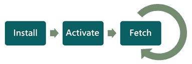

图 6.1：服务工作者生命周期

### 安装

在安装步骤期间，服务工作者通常会缓存网站的一些静态资源，例如一个`您已离线`的启动屏幕。如果文件成功缓存，则服务工作者已安装。然而，如果任何文件下载和缓存失败，则服务工作者未安装，并且不会移动到激活步骤。

如果服务工作者没有成功安装，它将在下次运行网络应用时尝试安装。因此，开发者可以确信，如果服务工作者已经成功安装，缓存将包含所有被指定为缓存的静态资源。在安装步骤成功完成后，将启动激活步骤。

### 激活

在激活步骤期间，服务工作者处理旧缓存的管理工作。由于之前的安装可能已创建缓存，这是应用程序删除缓存的机会。在激活步骤成功完成后，服务工作者准备开始处理获取事件。

### 获取

在获取步骤期间，服务工作者控制其范围内的所有页面。它处理从 PWA 发起的网络请求时发生的所有获取事件。服务工作者将继续获取，直到它被终止。

## 更新服务工作者

为了更新为我们网站运行的服务工作者，我们需要更新服务工作者的 JavaScript 文件。每次用户导航到我们的网站时，浏览器都会下载当前的服务工作者并将其与已安装的服务工作者进行比较。如果它们不同，它将尝试替换旧服务工作者。

然而，这不会立即发生。新服务工作者必须等待旧服务工作者不再控制，然后才能激活。旧服务工作者将保持控制，直到所有打开的页面都关闭。当新服务工作者接管控制时，其激活事件将触发。

缓存管理在激活回调期间处理。我们在激活回调期间管理缓存的原因是，如果我们要在安装步骤中清除任何旧缓存，那么控制所有当前页面的旧服务工作者将突然无法从该缓存中提供文件。

以下截图显示了一个**等待激活**的服务工作者：

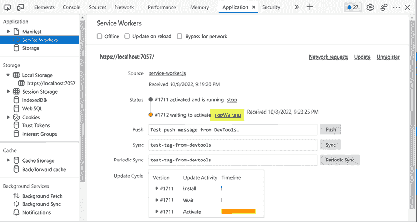

图 6.2：服务工作者等待激活

**提示**

服务工作者将在用户在所有标签页中离开应用后才被激活。即使应用只在该一个标签页中运行，重新加载标签页也不足以激活服务工作者。然而，你可以通过点击**跳过等待**链接来激活一个**等待激活**的服务工作者。**跳过等待**链接在*图 6.2*中被突出显示。

## 服务工作者的类型

服务工作者有许多不同类型，从极其简单到更复杂。以下图表显示了不同类型的服务工作者，按从简单到复杂的顺序排列：


图 6.3：从简单到复杂的服务工作者类型

### 离线页面

这是最简单的一种功能服务工作者创建方式。我们只需要创建一个 HTML 页面来指示应用处于离线状态。每当应用无法连接到网络时，我们只需显示该 HTML 页面。

### 页面离线副本

使用这种类型的服务工作者，我们将每个页面在缓存中的副本存储为我们访客查看它们时的状态。当应用离线时，它从缓存中提供页面。这种方法可能只适用于页面数量有限的应用，因为如果用户想要查看的页面尚未被该用户查看，它将不会在缓存中，应用将失败。

### 离线页面与离线副本

这种类型的服务工作者是页面离线副本服务工作者的改进版本。它结合了前两种服务工作者类型。使用这种类型的服务工作者，我们存储每个页面的缓存副本，当我们的访客查看它们时。当应用离线时，它从缓存中提供页面。如果用户想要查看的页面不在缓存中，我们显示指示应用离线的 HTML 页面。

### 缓存优先网络

这种类型的服务工作者始终首先使用缓存。如果请求的页面在缓存中，它会在从服务器请求页面并更新缓存之前提供该页面。使用这种服务工作者，我们始终在请求页面之前提供缓存中的页面版本，因此无论用户在线还是离线，用户都会收到相同的数据。

**重要提示**

缓存优先的网络服务工作者是微软推荐的服务工作者类型。

### 高级缓存

这种类型的服务工作者是前述每种类型的组合。使用这种类型的服务工作者，我们使用不同的规则指定不同的文件和路由进行缓存。例如，某些数据，如股价，永远不应该被缓存，而其他不经常变化的数据应该被缓存。

### 背景同步

这是最复杂的服务工作者类型。它允许用户在离线时继续使用应用程序添加和编辑数据。然后，当他们重新上线时，应用程序将同步他们的数据与网络。

这不是所有可用服务工作者类型的完整列表。然而，它应该能让你了解服务工作者功能和灵活性的强大，以及缓存的重要性。我们列表中的所有服务工作者都依赖于 `CacheStorage` API 进行缓存。

# 使用 `CacheStorage` API

`CacheStorage` API 用于缓存 `request/response` 对象对，其中 `request` 对象是键，`response` 对象是值。它被设计为供服务工作者使用，以提供离线功能。一个 `caches` 对象是 `CacheStorage` 的实例。它是一个位于 `window` 对象中的全局对象。

我们可以使用以下代码来测试浏览器上是否可用 `CacheStorage`：

```cs
const hasCaches = 'caches' in self; 
```

`caches` 对象用于维护特定 Web 应用程序的缓存列表。缓存不能与其他 Web 应用程序共享，并且它们与浏览器的 HTTP 缓存隔离。它们完全通过我们编写的 JavaScript 进行管理。

这些是 `CacheStorage` 的一些方法：

+   `delete(cacheName)`: 此方法删除指定的缓存并返回 `true`。如果指定的缓存未找到，则返回 `false`。

+   `has(cacheName)`: 如果指定的缓存存在，则此方法返回 `true`，否则返回 `false`。

+   `keys`: 此方法返回一个包含所有缓存名称的字符串数组。

+   `open(cacheName)`: 此方法打开指定的缓存。如果它不存在，则创建并打开。

当我们打开 `CacheStorage` 的一个实例时，会返回一个 `Cache` 对象。以下是 `Cache` 对象的一些方法：

+   `add(request)`: 此方法接受一个请求，并将生成的响应添加到缓存中。

+   `addAll(requests)`: 此方法接受一个请求数组，并将所有生成的响应添加到缓存中。

+   `delete(request)`: 如果它能找到并删除指定的请求，则此方法返回 `true`，否则返回 `false`。

+   `keys()`: 此方法返回一个键数组。

+   `match(request)`: 此方法返回与匹配请求关联的响应。

+   `put(request, response)`: 此方法将 `request` 和 `response` 对添加到缓存中。

**提示**

除非我们明确请求更新，否则 `Cache` 对象不会更新。此外，这些对象也不会过期。我们需要在它们变得过时后删除它们。

服务工作者使用 `CacheStorage` API 允许 PWA 在离线时继续运行。接下来，我们将解释如何使用 **Geolocation API**。

# 使用 Geolocation API

JavaScript 的 `Geolocation` API 提供了一种机制，使我们能够获取用户的地理位置。使用 `Geolocation` API，我们可以获取浏览器正在运行的设备的坐标。

`Geolocation` API 通过 `navigator.geolocation` 对象访问。当我们调用 `navigator.geolocation` 对象时，用户的浏览器会请求用户允许访问其位置。如果他们接受，浏览器将使用设备的定位硬件，例如智能手机上的 **全球定位系统** (**GPS**)，来确定其位置。

在我们尝试使用 `navigator.geolocation` 对象之前，我们应该验证它是否被浏览器支持。以下代码测试浏览器是否支持地理位置：

```cs
if (navigator.geolocation) {
    var position = await getPositionAsync();  
} else {
    throw Error("Geolocation is not supported.");
}; 
```

对于本章的项目，我们将使用 `getCurrentPosition` 方法来检索设备的地理位置。此方法使用两个回调函数。`success` 回调函数返回一个 `GeolocationPosition` 对象，而 `error` 回调函数返回一个 `GeolocationPositionError` 对象。如果用户拒绝我们访问他们的位置，它将在 `GeolocationPositionError` 对象中报告。

这些是 `GeolocationPosition` 对象的属性：

+   `coords.latitude`: 这个属性返回一个表示设备纬度的双精度值。

+   `coords.longitude`: 这个属性返回一个表示设备经度的双精度值。

+   `coords.accuracy`: 这个属性返回一个表示纬度和经度精度的双精度值，以米为单位。

+   `coords.altitude`: 这个属性返回一个表示设备海拔的双精度值。

+   `coords.altitudeAccuracy`: 这个属性返回一个表示海拔精度的双精度值，以米为单位。

+   `coords.heading`: 这个属性返回一个表示设备前进方向的双精度值，以度为单位。如果设备处于静止状态，则该值为 NaN。

+   `coords.speed`: 这个属性返回一个表示设备速度的双精度值，以米/秒为单位。

+   `timestamp`: 这个属性返回响应的日期和时间。

`GeolocationPosition` 对象始终返回 `coords.latitude`、`coords.longitude`、`coords.accuracy` 和 `timestamp` 属性。其他属性仅在它们可用时返回。

通过使用 JavaScript 的 `Geolocation` API，我们可以确定设备的纬度和经度。我们需要这些信息来使用 `OpenWeather` 的 `One` `Call` API 为我们的项目请求本地天气预报。

# 使用 OpenWeather One Call API

本章项目中数据源是一个由 `OpenWeather` 提供的免费 API。它被称为 `OpenWeather One Call` API ([`openweathermap.org/api/one-call-api`](https://openweathermap.org/api/one-call-api))。此 API 可以返回当前、预报和历史天气数据。我们将使用它来获取未来 5 天的本地预报。这是使用 `OpenWeather One Call` API 进行 API 调用的格式：

```cs
https://api.openweathermap.org/data/2.5/onecall?lat={lat}&lon={lon}&appid={API key} 
```

这些是 `OpenWeather One Call` API 的参数：

+   `lat`: 纬度。此参数是必需的。

+   `lon`: 经度。此参数是必需的。

+   `appid`: API 密钥。此参数是必需的。创建账户后，您可以从 `API keys` 选项卡管理您的 API 密钥。

+   `units`: 测量单位。此设置为 `Standard`、`Metric` 或 `Imperial`。

+   `exclude`: 排除数据。此用于简化返回的数据。由于我们只会使用每日预报，我们将排除当前、每分钟和每小时数据以及我们的项目警报。这是一个逗号分隔的列表。

+   `lang`: 输出语言。

这是从 `OpenWeather One Call` API 的响应片段：

**weather.json 片段**

```cs
{
  **"****dt"****:** **1616436000****,**
  "sunrise": 1616416088,
  "sunset": 1616460020,
  "temp": {
    "day": 58.5,
    **"min"****:** **54.75****,**
    **"max"****:** **62.6****,**
    "night": 61.29,
    "eve": 61.25,
    "morn": 54.75
  },
  "feels_like": {
    "day": 49.69,
    "night": 51.91,
    "eve": 50.67,
    "morn": 47.03
  },
  "pressure": 1011,
  "humidity": 85,
  "dew_point": 54.01,
  "wind_speed": 17.83,
  "wind_deg": 168,
  "weather": [
    {
      "id": 502,
      "main": "Rain",
      **"description"****:** **"heavy intensity rain"****,**
      **"icon"****:** **"10d"**
    }
  ],
  "clouds": 98,
  "pop": 1,
  "rain": 27.91,
  "uvi": 2.34
}, 
```

在前面的 JSON 片段中，我们突出显示了本章项目中使用的字段。

**重要提示**

此项目使用 `OpenWeather One Call` API 的 2.5 版本。他们最近发布了 API 的 3.0 版本。如果您一天内调用 API 超过 1,000 次，使用新版本的 API 需要支付少量费用。

`OpenWeather One Call` API 是一个简单的 API，我们将使用它来获取指定位置的每日预报。现在，让我们快速了解一下本章将要构建的项目。

# 创建 PWA

在本章中，我们将构建一个 Blazor WebAssembly 应用程序来显示本地的 5 天天气预报，并将其转换为 PWA。

我们将构建的 Web 应用程序使用 JavaScript 的 `Geolocation` API 确定设备的当前纬度和经度。它使用 `OpenWeather One Call` API 获取本地天气预报，并使用各种 Razor 组件向用户显示天气预报。完成 Web 应用程序后，我们将通过添加标志、清单文件和服务工作者将其转换为 PWA。最后，我们将安装、运行和卸载 PWA。

这是完成的应用程序的截图：

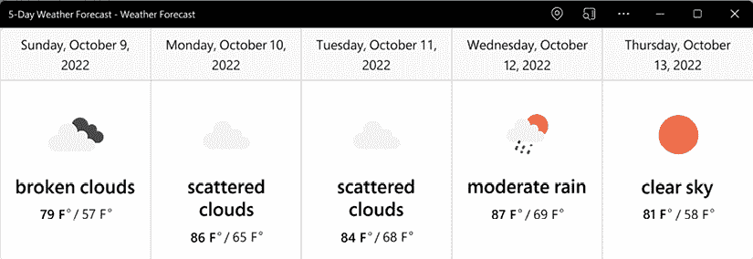

图 6.4：5 天天气预报应用程序

此项目的构建时间大约为 90 分钟。

## 项目概述

将使用 Microsoft 的 **Blazor WebAssembly App Empty** 项目模板创建一个 `WeatherForecast` 项目。首先，我们将使用 JavaScript 互操作性与 `Geolocation` API 获取设备的坐标。然后，我们将使用 `OpenWeather One Call` API 获取这些坐标的天气预报。接下来，我们将创建几个 Razor 组件来显示预报。

要将 Web 应用程序转换为 PWA，我们将添加一个标志、一个清单文件和一个离线页面服务工作者。在测试服务工作者后，我们将安装、运行和卸载 PWA。

## 项目入门

我们需要创建一个新的 Blazor WebAssembly 应用程序。我们这样做如下：

1.  打开 Visual Studio 2022。

1.  点击 **创建新项目** 按钮。

1.  按 *Alt*+*S* 进入 **搜索模板** 文本框。

1.  输入 `Blazor` 并按 *Enter* 键。

    以下截图显示了**Blazor WebAssembly App Empty**项目模板。

    

    图 6.5：Blazor WebAssembly App Empty 项目模板

1.  选择**Blazor WebAssembly App Empty**项目模板并点击**下一步**按钮。

1.  在**项目名称**文本框中输入`WeatherForecast`并点击**下一步**按钮。

    这是用于配置我们新项目的对话框截图：

    

    图 6.6：配置新项目对话框

    **提示**

    在前面的示例中，我们将`WeatherForecast`项目放置在`E:/Blazor`文件夹中。然而，这个项目的位置并不重要。

1.  选择**.NET 7.0**作为要使用的**框架**版本。

1.  勾选**配置为 HTTPS**复选框。

1.  取消勾选**ASP.NET Core 承载**复选框。

1.  取消勾选**渐进式 Web 应用**复选框。

    这是用于收集有关我们新项目额外信息的对话框截图：

    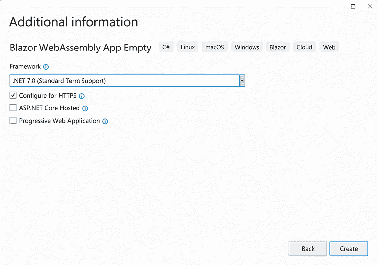

    图 6.7：附加信息对话框

    **重要提示**

    我们没有勾选**渐进式 Web 应用**复选框的原因是，我们将在这个项目中将应用转换为 PWA。

1.  点击**创建**按钮。

我们创建了一个空的`WeatherForecast` Blazor WebAssembly 项目。让我们通过添加用于确定设备位置的 JavaScript 函数来开始吧。

## 添加 JavaScript 以确定我们的位置

我们需要添加一个 JavaScript 函数来确定我们的当前纬度和经度。我们这样做如下：

1.  右键点击`wwwroot`文件夹，从菜单中选择**添加**，**新建文件夹**选项。

1.  将新文件夹命名为`scripts`。

1.  右键点击`scripts`文件夹，从菜单中选择**添加**，**新建项**选项。

1.  在**搜索**框中输入`javascript`。

1.  选择**JavaScript 文件**。

1.  将文件命名为`bweInterop.js`。

    **提示**

    在这本书中，我们将使用`bweInterop`命名空间来为我们的 JavaScript 代码结构化和最小化命名冲突的风险。

1.  点击**添加**按钮。

1.  输入以下 JavaScript：

    ```cs
    var bweInterop = {};
    bweInterop.getPosition = async function () {
        function getPositionAsync() {
            return new Promise((success, error) => {
                navigator.geolocation.getCurrentPosition
                    (success, error);
            });
        }
        if (navigator.geolocation) {
            var position = await getPositionAsync();
            var coords = {
                latitude: position.coords.latitude,
                longitude: position.coords.longitude
            };
            return coords;
        } else {
            throw Error("Geolocation is not supported.");
        };
    } 
    ```

    前面的 JavaScript 代码使用`Geolocation` API 返回设备的纬度和经度。如果未允许或不受支持，则会抛出错误。

1.  打开`wwwroot/index.html`文件。

1.  在`body`元素的底部添加以下标记：

    ```cs
    <script src="img/bweInterop.js"></script> 
    ```

我们创建了一个使用`Geolocation` API 返回我们当前纬度和经度的 JavaScript 函数。接下来，我们需要在我们的 Web 应用中调用它。

## 调用 JavaScript 函数

我们需要添加一个类来存储我们的位置，然后我们可以调用我们的`bweInterop.getPosition`函数。我们这样做如下：

1.  右键单击 `WeatherForecast` 项目，从菜单中选择 **添加**，**新建文件夹** 选项。

1.  将新文件夹命名为 `Models`。

1.  右键单击 `Models` 文件夹，从菜单中选择 **添加**，**类** 选项。

1.  将新类命名为 `Position`。

1.  将以下属性添加到 `Position` 类中：

    ```cs
    public double Latitude { get; set; }
    public double Longitude { get; set; } 
    ```

    这是我们将用来存储我们坐标的类。

1.  打开 `Pages/Index.razor` 文件。

1.  删除 `H1` 元素。

1.  添加以下指令：

    ```cs
    @using WeatherForecast.Models
    @inject IJSRuntime js 
    ```

1.  添加以下标记：

    ```cs
    <PageTitle>Weather Forecast</PageTitle>
    @if (pos == null)
    {
        <p><em>@message</em></p>
    }
    else
    {
        <h2>
            Latitude: @pos.Latitude, 
            Longitude: @pos.Longitude
        </h2>
    }
    @code {
        string message = "Loading...";
        Position? pos;
    } 
    ```

    上述标记显示如果 `pos` 属性为 `null`，则显示 `message` 字段的值。否则，它显示 `pos` 属性中的纬度和经度。

1.  将以下 `OnInitializedAsync` 方法添加到代码块中：

    ```cs
    protected override async Task OnInitializedAsync()
    {
        try
        {
            await GetPositionAsync();
        }
        catch (Exception)
        {
            message = "Geolocation is not supported.";
        };
    } 
    ```

    上述代码尝试在页面初始化时获取我们的坐标。

1.  将以下 `GetPositionAsync` 方法添加到代码块中：

    ```cs
    private async Task GetPositionAsync()
    {
        pos = await js.InvokeAsync<Position>(
            "bweInterop.getPosition");
    } 
    ```

    上述代码使用 JavaScript 互操作来调用我们编写的使用 `Geolocation` API 返回我们坐标的 JavaScript 函数。有关 JavaScript 互操作的更多信息，请参阅 *第五章*，*使用 JavaScript 互操作 (JS Interop) 构建本地存储服务*。

1.  按 *Ctrl*+*F5* 以无调试模式启动应用程序。

    以下截图是请求您允许访问位置的对话框示例：

    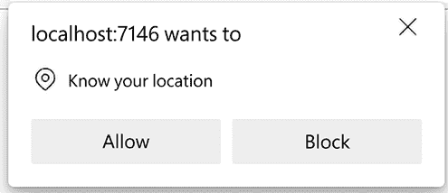

    图 6.8：地理位置权限对话框

1.  点击 **允许** 按钮以允许应用程序访问您的位置。

    以下截图是我们天气预报应用程序的 **主页**：

    

    图 6.9：显示我们坐标的主页

    您可以使用以下截图所示的 **位置访问允许** 对话框禁用应用程序访问您位置的能力：

    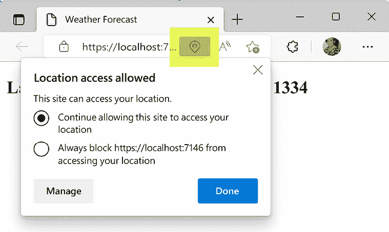

    图 6.10：位置访问允许对话框

    **位置访问允许** 对话框通过浏览器工具栏上的突出显示按钮访问。您可能想切换权限以查看这对应用程序的影响。

1.  关闭浏览器。

我们已经使用 `Geolocation` API 在 **主页** 上显示我们的纬度和经度。接下来，我们需要将这些坐标提供给 `OpenWeather One Call` API。

## 添加一个 OpenWeather 类

我们需要添加一个 `OpenWeather` 类来捕获来自 `OpenWeather One Call` API 的结果。我们这样做如下：

1.  返回 Visual Studio。

1.  右键单击 `Models` 文件夹，从菜单中选择 **添加**，**类** 选项。

1.  将新类命名为 `OpenWeather`。

1.  点击 **添加** 按钮。

1.  添加以下类：

    ```cs
    public class OpenWeather
    {
        public Daily[] Daily { get; set; }
    }
    public class Daily
    {
        public long Dt { get; set; }
        public Temp Temp { get; set; }
        public Weather[] Weather { get; set; }
    }
    public class Temp
    {
        public double Min { get; set; }
        public double Max { get; set; }
    }
    public class Weather
    {
        public string Description { get; set; }
        public string Icon { get; set; }
    } 
    ```

上述类将用于存储来自 `OpenWeather One Call` API 的响应。

现在我们需要添加一个组件来显示响应。我们将使用 `Bootstrap` 来为新组件添加样式。

## 安装 Bootstrap

我们需要在我们的 Web 应用程序中安装 `Bootstrap`。我们这样做如下：

1.  右键点击 `wwwroot/css` 文件夹，从菜单中选择 **添加**，**客户端库** 选项。

1.  在 **库** 搜索文本框中输入 `bootstrap` 并按 **Enter** 键。

1.  选择 **选择特定文件**。

1.  只选择 `css` 文件，如图下截图所示：


图 6.11：添加客户端库对话框

1.  点击 **安装** 按钮。

    **重要提示**

    安装 `Bootstrap` 后，将在 `wwwroot/css` 文件夹中添加一个新文件夹。这个新文件夹包含 `Bootstrap` 所需的所有 CSS 文件。在本项目中，我们只会使用 `bootstrap.min.css` 文件。

    现在 `Bootstrap` 已安装，让我们验证它是否正常工作。

1.  打开 `wwwroot/index.html` 文件。

1.  在 `css/app.css` 样式表链接之前，向 `head` 元素添加以下标记：

    ```cs
    <link href="css/bootstrap/css/bootstrap.min.css" 
            rel="stylesheet" /> 
    ```

1.  打开 `Pages/Index.razor` 页面。

1.  在 `PageTitle` 组件下方添加以下标记：

    ```cs
    <div class="alert alert-info">
        Bootstrap is installed!
    </div> 
    ```

1.  按 *Ctrl*+*F5* 以无调试模式启动应用程序。

1.  验证页面顶部是否现在为蓝色。

1.  关闭浏览器。

现在 `Bootstrap` 已正确安装，我们可以添加新组件。

## 添加 DailyForecast 组件

我们需要新组件来显示每天的预报。我们这样做如下：

1.  右键点击 `WeatherForecast` 项目，从菜单中选择 **添加**，**新建文件夹** 选项。

1.  将新文件夹命名为 `Shared`。

1.  右键点击 `Shared` 文件夹，从菜单中选择 **添加**，**Razor 组件** 选项。

1.  将新组件命名为 `DailyForecast`。

1.  点击 **添加** 按钮。

1.  将现有标记替换为以下标记：

    ```cs
    <div class="card text-center">
        <div class="card-header">
            @Date
        </div>
        <div class="card-body">
            
            <h4 class="card-title">@Description</h4>
            <b>@((int)HighTemp) F&deg;</b> /
            @((int)LowTemp) F&deg;
        </div>
    </div>
    @code {
    } 
    ```

    此组件使用 `Bootstrap` 的 `Card` 组件来显示每日预报。

1.  在代码块中添加以下代码：

    ```cs
    [Parameter] public long Seconds { get; set; }
    [Parameter] public double HighTemp { get; set; }
    [Parameter] public double LowTemp { get; set; }
    [Parameter] public string? Description { get; set; }
    [Parameter] public string? Icon { get; set; }
    private string? Date;
    private string? IconUrl;
    protected override void OnInitialized()
    {
        Date = DateTimeOffset
            .FromUnixTimeSeconds(Seconds)
            .LocalDateTime
            .ToLongDateString();

        IconUrl = String.Format(
            "https://openweathermap.org/img/wn/{0}@2x.png",
            Icon);
    } 
    ```

上述代码定义了用于显示每日天气预报的参数。`OnInitialized` 方法用于格式化 `Date` 和 `IconUrl` 字段。

我们已添加一个 Razor 组件，使用 `Bootstrap` 的 `Card` 组件显示每天的天气预报。

## 获取预报

我们需要获取天气预报。我们可以通过调用 `OpenWeather One Call` API 或使用 GitHub 中的 `weather.json` 文件来获取预报。我们这样做如下：

1.  打开 `Pages/Index.razor` 文件。

1.  添加以下 `using` 语句：

    ```cs
    @using System.Text 
    @using WeatherForecast.Shared 
    ```

1.  添加以下指令：

    ```cs
    @inject HttpClient Http 
    ```

1.  在代码块顶部添加以下字段：

    ```cs
    OpenWeather? forecast; 
    ```

1.  将 `GetForecastAsync` 方法添加到代码块：

    ```cs
    private async Task GetForecastAsync()
    {
    } 
    ```

1.  在 `GetForecastAsync` 方法中添加以下代码：

    ```cs
    if (pos != null)
    {
        string APIKey = "{Your API Key}";
        StringBuilder url = new StringBuilder();
        url.Append("https://api.openweathermap.org");
        url.Append("/data/2.5/onecall?");
        url.Append("lat=");
        url.Append(pos.Latitude);
        url.Append("&lon=");
        url.Append(pos.Longitude);
        url.Append("&exclude=");
        url.Append("current,minutely,hourly,alerts");
        url.Append("&units=imperial");
        url.Append("&appid=");
        url.Append(APIKey);
        forecast = await Http.GetFromJsonAsync<OpenWeather>
            (url.ToString());
    } 
    ```

    **重要提示**

    您需要将 `{Your_API_Key}` 替换为从 `OpenWeather` 获得的 API 密钥。此外，您的 API 密钥可能需要几小时才能激活。

    前述方法使用 `OpenWeather One Call` API，并通过 `GetPositionAsync` 方法获取的坐标来填充 `forecast` 对象。

    如果您不能使用 `OpenWeather One Call` API，请使用以下版本的 `GetForecastAsync` 方法：

    ```cs
    forecast = await Http.GetFromJsonAsync<OpenWeather>
        ("sample-data/weather.json"); 
    ```

    之前版本的 `GetForecastAsync` 方法使用静态文件来填充 `forecast` 对象。它假设 `weather.json` 文件已经从本章的 GitHub 仓库下载，并且已经放置在 `wwwroot/sample-data` 文件夹中。

1.  更新 `OnInitializedAsync` 方法以调用 `GetForecastAsync` 方法并更新错误信息，如下所示：

    ```cs
    try
    {
        await GetPositionAsync();
        await GetForecastAsync();
    }
    catch (Exception)
    {
        message = "Error encountered.";
    }; 
    ```

现在我们已经填充了预报对象，我们可以显示预报。

## 显示预报

我们需要向 **主页** 添加一组每日预报。我们这样做如下：

1.  删除 `div` 元素。

1.  将 `@if` 语句替换为以下标记：

    ```cs
    @if (forecast == null)
    {
        <p><em>@message</em></p>
    }
    else
    {
        <div class="card-group">
            @foreach (var item in forecast.Daily.Take(5))
            {
                <DailyForecast
                   Seconds="@item.Dt"
                   LowTemp="@item.Temp.Min"
                   HighTemp="@item.Temp.Max"
                   Description="@item.Weather[0].Description"
                   Icon="@item.Weather[0].Icon" />
            }
        </div>
    } 
    ```

    之前的标记循环遍历 `forecast` 对象五次。它使用 `DailyForecast` 组件来显示每日预报。

1.  按 *Ctrl*+*F5* 以无调试模式启动应用程序。

1.  关闭浏览器。

我们已经完成了天气预报应用。现在，我们需要将其转换为 PWA。为此，我们需要添加一个标志、一个清单文件和一个服务工作者。

## 添加标志

我们需要添加一个图片作为应用的标志。我们这样做如下：

1.  右键点击 `wwwroot` 文件夹，从菜单中选择 **添加**，**新建文件夹** 选项。

1.  将新文件夹命名为 `images`。

1.  将本章 GitHub 仓库中的 `Sun-512.png` 图片复制到 `images` 文件夹。

清单文件中至少必须包含一个图片才能安装 PWA。现在，我们可以添加一个清单文件。

## 添加一个清单文件

要将 Web 应用转换为 PWA，我们需要添加一个清单文件。我们这样做如下：

1.  右键点击 `wwwroot` 文件夹，从菜单中选择 **添加**，**新建项** 选项。

1.  在 **搜索** 框中输入 `json`。

1.  选择 **JSON 文件**。

1.  将文件命名为 `manifest.json`。

1.  点击 **添加** 按钮。

1.  输入以下 JSON 代码：

    ```cs
    {
      "lang": "en",
      "name": "5-Day Weather Forecast",
      "short_name": "Weather",
      "display": "standalone",
      "start_url": "./",
      "background_color": "#ffa500",
      "theme_color": "transparent",
      "description": "This is a 5-day weather forecast app",
      "orientation": "any",
      "icons": [
        {
          "src": "images/Sun-512.png",
          "type": "image/png",
          "sizes": "512x512"
        }
      ]
    } 
    ```

1.  打开 `wwwroot/index.html` 文件。

1.  将以下标记添加到 `head` 元素的底部：

    ```cs
    <link href="manifest.json" rel="manifest" /> 
    ```

1.  在前面的标记下方添加以下标记：

    ```cs
    <link rel="apple-touch-icon" 
          sizes="512x512" 
          href="images/Sun-512.png" /> 
    ```

    **提示**

    使用 iOS Safari 时，您必须包含前面的链接标签来指示它使用指定的图标，否则它将通过截图页面内容来生成图标。

我们已经向我们的 Web 应用添加了一个清单文件来控制它在安装时的外观和行为。接下来，我们需要添加一个服务工作者。

## 添加一个简单的服务工作者

要完成将 Web 应用转换为 PWA 的过程，我们需要添加一个服务工作者。我们这样做如下：

1.  右键点击 `wwwroot` 文件夹，从菜单中选择 **添加**，**新建项** 选项。

1.  在 **搜索** 框中输入 `html`。

1.  选择 **HTML 页面**。

1.  将文件命名为 `offline.html`。

1.  点击 **添加** 按钮。

1.  将以下标记添加到 `body` 元素中：

    ```cs
    <h1>You are offline.</h1> 
    ```

1.  右键点击 `wwwroot` 文件夹，从菜单中选择 **添加**，**新建项** 选项。

1.  在 **搜索** 框中输入 `javascript`。

1.  选择 `JavaScript 文件`。

1.  将文件命名为 `service-worker.js`。

1.  点击**添加**按钮。

1.  添加以下常量：

    ```cs
    const OFFLINE_VERSION = 1;
    const CACHE_PREFIX = 'offline';
    const CACHE_NAME = '${CACHE_PREFIX}${OFFLINE_VERSION}';
    const OFFLINE_URL = 'offline.html'; 
    ```

    前面的代码设置当前缓存的名称和我们将使用的文件名称以指示我们处于离线状态。

1.  添加以下事件监听器：

    ```cs
    self.addEventListener('install',
        event => event.waitUntil(onInstall(event)));
    self.addEventListener('activate',
        event => event.waitUntil(onActivate(event)));
    self.addEventListener('fetch',
        event => event.respondWith(onFetch(event))); 
    ```

    前面的代码指定了以下步骤中要使用的函数：安装、激活和获取。

1.  添加以下`onInstall`函数：

    ```cs
    async function onInstall(event) {
        console.info('Service worker: Install');
        const cache = await caches.open(CACHE_NAME);
        await cache.add(new Request(OFFLINE_URL));
    } 
    ```

    前面的函数打开指定的缓存。如果缓存尚不存在，它将创建缓存然后打开它。缓存打开后，它将指定的请求/响应对添加到缓存中。

1.  添加以下`onActivate`函数：

    ```cs
    async function onActivate(event) {
        console.info('Service worker: Activate');
        const cacheKeys = await caches.keys();
        await Promise.all(cacheKeys
            .filter(key => key.startsWith(CACHE_PREFIX)
                && key !== CACHE_NAME)
            .map(key => caches.delete(key)));
    } 
    ```

    前面的代码获取所有缓存的名称。所有与指定缓存名称不匹配的缓存都将被删除。

    **提示**

    清除过时缓存是您的责任。每个浏览器都对 Web 应用可以使用的存储量有限制。如果您违反了该限制，浏览器可能会删除您的所有缓存。

1.  添加以下`onFetch`函数：

    ```cs
    async function onFetch(event) {
        if (event.request.method === 'GET') {
            try {
                return await fetch(event.request);
            } catch (error) {
                const cache = await
                   caches.open(CACHE_NAME);
                return await cache.match(OFFLINE_URL);
            };
        };
    } 
    ```

    在前面的代码中，如果获取失败，将打开缓存，并服务之前缓存的离线页面。

1.  打开`wwwroot/index.html`文件。

1.  将以下标记添加到`body`元素的底部：

    ```cs
    <script>
       navigator.serviceWorker.register('service-worker.js');
    </script> 
    ```

    前面的代码注册了服务工作者。

我们已添加一个离线页面服务工作者，当 PWA 离线时将显示`offline.html`页面。

## 测试服务工作者

我们需要测试服务工作者是否允许我们在离线状态下工作。我们这样做如下：

1.  按*Ctrl*+*F5*以无调试模式启动应用程序。

1.  点击*F12*以打开`开发者工具`界面。

1.  选择**应用程序**选项卡。

1.  从左侧菜单中选择**清单**选项以查看**应用清单**详情。

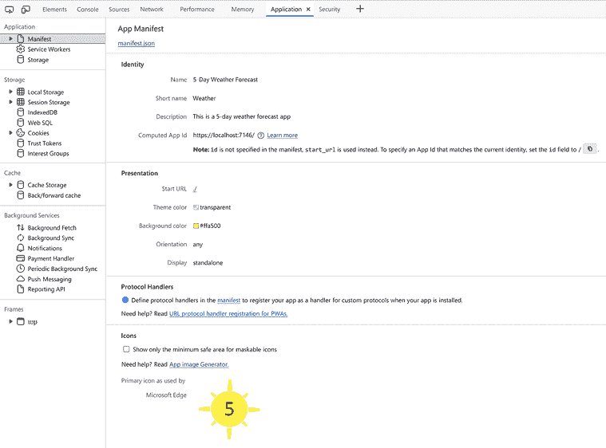

图 6.12：应用清单详情

1.  从左侧菜单中选择**服务工作者**选项以查看当前客户端安装的服务工作者，如图下所示：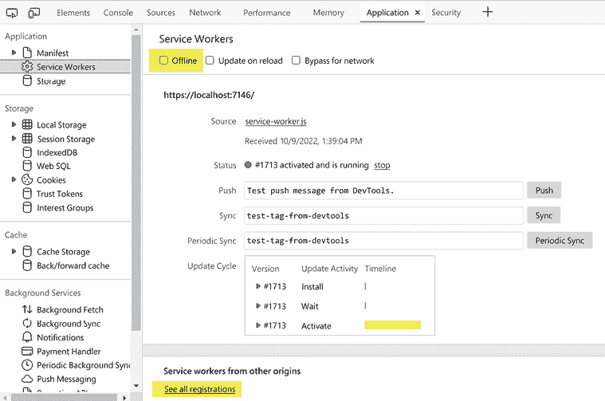

    图 6.13：服务工作者对话框

    在前面的屏幕截图中，我们已突出显示**离线**复选框和**查看所有注册**链接。

    **提示**

    点击**查看所有注册**链接以查看您设备上安装的所有服务工作者。您可能会惊讶地发现您的计算机上安装了多少服务工作者。

1.  从左侧菜单中选择**缓存存储**选项以查看缓存。

1.  点击**offline1**缓存以查看其内容，如图下所示：

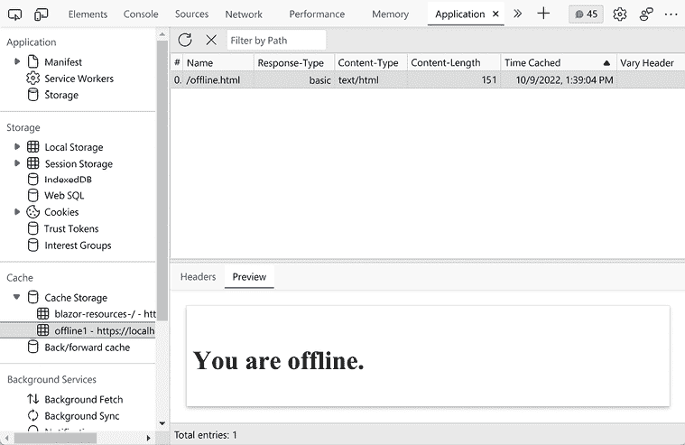

图 6.14：缓存存储

1.  从左侧菜单中选择**服务工作者**选项。

1.  在**服务工作者**对话框中勾选**离线**复选框。

    **提示**

    图 16.13 中的**离线**复选框被突出显示。

1.  刷新浏览器，你应该看到以下屏幕：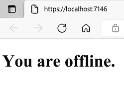

    图 6.15：离线页面

    显示的页面来自浏览器的缓存。

1.  在**服务工作者**对话框中取消选中**离线**复选框。

1.  刷新浏览器。

由于网络应用现在已重新上线，**离线**页面不再显示。

我们已经测试过服务工作者使我们的网络应用能够离线工作。现在，我们可以安装 PWA。

## 安装 PWA

我们需要通过安装来测试 PWA。我们这样做如下：

1.  从浏览器的菜单中选择**应用可用。安装 5 天天气预报**菜单选项：


图 6.16：安装 5 天天气预报选项

**提示**

在基于 Chromium 的浏览器中，**安装**按钮位于 URL 栏。然而，对于其他类型的浏览器，您需要从**菜单**按钮或**分享**按钮安装 PWA。

1.  在**安装 PWA**对话框中点击**安装**按钮：


图 6.17：安装 PWA 对话框

1.  在**应用已安装**对话框中点击**允许**按钮。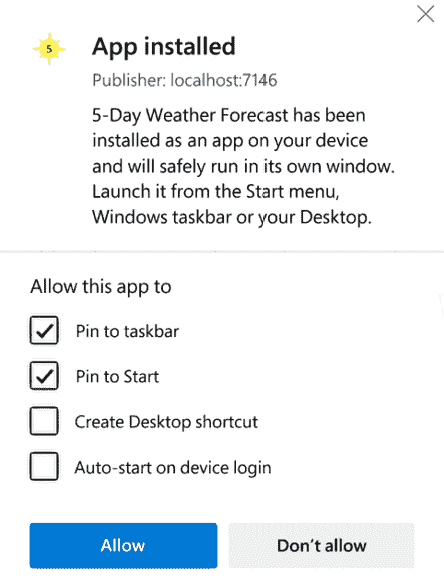

    图 6.18：应用已安装对话框

    安装后，PWA 无地址栏显示。它出现在我们的任务栏上，我们可以从**开始**菜单运行它。以下截图显示了安装后的 PWA：

    

    图 6.19：已安装 PWA

1.  关闭应用。

1.  按下 *Windows* 键并搜索**5 天天气预报**应用。

1.  打开**5 天天气预报**应用。

当应用打开时，其图标会出现在任务栏上。如果我们想的话，可以将其固定到任务栏上。

我们已成功安装并运行了 PWA。卸载 PWA 和安装一样简单。

## 卸载 PWA

我们需要卸载 PWA。我们这样做如下：

1.  关闭**5 天天气预报**应用。

1.  按下 *Windows* 键并搜索**5 天天气预报**应用。

1.  右键点击**5 天天气预报**应用，并从菜单中选择**卸载**选项。


图 6.20：卸载 5 天天气预报应用

1.  点击**卸载**按钮。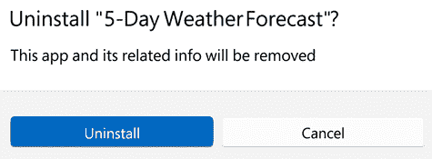

    图 6.21：卸载 5 天天气预报应用

    我们已卸载 PWA。

**重要提示**

应用从任务栏中移除可能需要几秒钟。

# 摘要

你现在应该能够通过添加清单文件和服务工作者将 Blazor WebAssembly 应用程序转换为 PWA。

在本章中，我们介绍了 PWA。我们解释了如何通过添加清单文件和服务工作者将 Web 应用程序转换为 PWA。我们解释了如何处理清单文件和服务工作者。我们详细解释了不同类型的服务工作者，并解释了如何使用 `CacheStorage` API 来缓存请求/响应对。最后，我们演示了如何使用 `Geolocation` API 和 `OpenWeather One Call` API。

之后，我们使用了 `Blazor WebAssembly App Empty` 项目模板来创建一个新的项目。我们添加了一个使用 `Geolocation` API 获取我们坐标的 JavaScript 函数。我们添加了一些模型来捕获坐标，并使用 JavaScript 互操作调用了 JavaScript 函数。我们使用 `OpenWeather One Call API` 获取当地的 5 天天气预报。我们安装了 `Bootstrap` 并创建了一个 Razor 组件来显示每天的预报。

在本章的最后部分，我们通过添加图片、清单文件和离线页面服务工作者将 Blazor WebAssembly 应用程序转换为 PWA。最后，我们安装、运行和卸载了 PWA。我们可以应用我们的新技能将现有的 Web 应用程序转换为结合 Web 应用程序优势和原生应用外观和感觉的 PWA。

在下一章中，我们将使用 **依赖注入**（**DI**）来构建购物车应用程序。

# 问题

以下问题供您思考：

1.  服务工作者是异步的还是同步的？

1.  是否可以在服务工作者内部使用 `localStorage` 进行数据存储？

1.  服务工作者能否操作 DOM？

1.  PWA 是否安全？

1.  PWA 是否具有平台特定性？

1.  PWA 和原生应用之间有什么区别？

# 进一步阅读

以下资源提供了有关本章主题的更多信息：

+   有关 `Geolocation` API 规范的更多信息，请参阅 [`w3c.github.io/geolocation-api`](https://w3c.github.io/geolocation-api)。

+   有关使用 `Geolocation` API 的更多信息，请参阅 [`developer.mozilla.org/en-US/docs/Web/API/Geolocation_API`](https://developer.mozilla.org/en-US/docs/Web/API/Geolocation_API)。

+   有关 `Weather` API 的更多信息，请参阅 [`openweathermap.org/api`](https://openweathermap.org/api)。

+   有关 `Web 应用程序清单` 规范的更多信息，请参阅 [`www.w3.org/TR/appmanifest`](https://www.w3.org/TR/appmanifest)。

+   有关 `Service Worker` 规范的更多信息，请参阅 [`w3c.github.io/ServiceWorker`](https://w3c.github.io/ServiceWorker)。

+   有关使用 `CacheStorage` API 的更多信息，请参阅 [`developer.mozilla.org/en-US/docs/Web/API/CacheStorage`](https://developer.mozilla.org/en-US/docs/Web/API/CacheStorage)。

+   想要了解更多关于服务工作者（service workers）的示例，请参考 Workbox 网站上的[`developers.google.com/web/tools/workbox`](https://developers.google.com/web/tools/workbox)。

+   如需了解有关微软的 `PWABuilder` 的更多信息，请参考[`www.pwabuilder.com`](https://www.pwabuilder.com)。

+   如需 PWA 图片生成器，请参考[`www.pwabuilder.com/imageGenerator`](https://www.pwabuilder.com/imageGenerator)。

+   如需了解有关 `Bootstrap` 的更多信息，请参考[`getbootstrap.com/`](https://getbootstrap.com/)。
