# 第十二章：使用 EditForm 组件构建费用跟踪器

大多数应用程序都需要用户输入一些数据。Blazor WebAssembly 框架包含一个组件，可以轻松创建数据输入表单并验证这些表单上的数据。

在本章中，我们将学习如何使用**EditForm**组件和多种内置输入组件。我们还将学习如何结合**数据注释**使用内置输入验证组件来验证表单上的数据。最后，我们将学习如何使用**NavigationLock**组件来防止用户在未保存更新之前离开表单时丢失他们的编辑。

本章我们将创建的项目将是一个旅行费用跟踪器。我们将使用多项目架构将 Blazor WebAssembly 应用程序与 ASP.NET Web API 端点分离。用于添加和编辑费用的页面将使用`EditForm`组件以及许多内置输入组件。它还将使用内置的验证组件来验证表单上的数据。最后，我们将添加`NavigationLock`组件，以提醒用户在导航到另一个页面之前保存他们的数据。

> 正在编辑数据？
> 
> EditForm 组件
> 
> 让它变得轻而易举！

在本章中，我们将涵盖以下主题：

+   创建数据输入表单

+   使用内置输入组件

+   使用验证组件

+   锁定导航

+   创建费用跟踪器项目

# 技术要求

要完成此项目，您需要在您的 PC 上安装 Visual Studio 2022。有关如何安装 Visual Studio 2022 免费社区版的说明，请参阅*第一章*，*Blazor WebAssembly 简介*。您还需要访问 SQL Server 的一个版本。有关如何安装 SQL Server 2022 免费版的说明，请参阅*第一章*，*Blazor WebAssembly 简介*。

本章的源代码可在以下 GitHub 仓库中找到：[`github.com/PacktPublishing/Blazor-WebAssembly-by-Example-Second-Edition/tree/main/Chapter12`](https://github.com/PacktPublishing/Blazor-WebAssembly-by-Example-Second-Edition/tree/main/Chapter12).

“代码在行动”视频在此处提供：[`packt.link/Ch12`](https://packt.link/Ch12).

# 创建数据输入表单

在本书的前几章中，我们使用了标准的 HTML `form`元素来收集用户输入。然而，Blazor WebAssembly 框架提供了一个增强版的 HTML `form`元素，称为`EditForm`组件。

`EditForm`组件不仅管理表单，还协调验证和提交事件。以下代码展示了简单的`EditForm`元素：

```cs
<EditForm Model="expense" OnValidSubmit="@HandleValidSubmit">
    Vendor <InputText @bind-Value="expense.Vendor"
                      placeholder="Enter Vendor"/>
    <button type="submit">
        Save
    </button>
</EditForm>
@code {
    private Expense expense = new();
} 
```

这是前一个`EditForm`组件渲染的 HTML：

```cs
<form>
    Vendor <input placeholder="Enter Vendor" 
                  class="valid" _bl_2="">
     <button type="submit">
         Save
     </button>
</form> 
```

在前面的 `EditForm` 组件中，`Model` 属性指定了表单的顶级模型对象。`OnValidSubmit` 属性指定了当表单提交且没有验证错误时将被调用的回调函数。

## 绑定表单

`EditForm` 类的 `EditContext` 属性用于跟踪编辑过程中的元数据。元数据包括已修改的字段和当前的验证消息。有两种方式来分配 `EditContext` 属性：

+   分配 `EditForm` 类的 `Model` 属性。如果我们使用 `Model` 属性，编辑上下文将自动使用模型构建。

+   分配 `EditForm` 类的 `EditContext` 属性。

以下代码展示了如何使用 `EditContext` 属性而不是 `Model` 属性来渲染前面的 `EditForm` 组件：

```cs
<EditForm EditContext="editContext" 
          OnValidSubmit="@HandleValidSubmit">
    Vendor <InputText @bind-Value="expense.Vendor" />
    <button type="submit">
        Save
    </button>
</EditForm>
@code {
    private Expense expense = new();
    private EditContext? editContext;

    protected override void OnInitialized()
    {
        editContext = new(expense);
    }
} 
```

**重要提示**

如果我们尝试为 `EditForm` 组件的 `Model` 属性和 `EditContext` 属性赋值，将会生成运行时错误。

## 提交表单

`EditForm` 组件有三个属性与表单提交相关：

+   `OnValidSubmit`：当表单提交且 `EditContext` 属性有效时被调用的回调函数。

+   `OnInvalidSubmit`：当表单提交且 `EditContext` 属性无效时被调用的回调函数。

+   `OnSubmit`：当表单提交时被调用的回调函数。当我们使用此属性时，我们需要手动通过使用 `EditForm` 的 `EditContext` 属性的 Validate 方法来触发验证。

我们可以使用 `OnValidSubmit` 和 `OnInvalidSubmit` 回调一起或单独使用，或者我们可以单独使用 `OnSubmit` 回调。如果我们使用 `OnSubmit` 回调，我们负责执行表单验证。否则，表单验证将由 `EditForm` 组件执行。

**重要提示**

如果我们设置了 `OnSubmit` 回调，使用 `OnValidSubmit` 或 `OnInvalidSubmit` 设置的任何回调都将被忽略。

我们可以使用许多内置的输入组件与 `EditForm` 组件一起使用。

# 使用内置的输入组件

以下表格列出了内置的输入组件及其渲染的 HTML：

| 输入组件 | HTML 渲染 |
| --- | --- |
| `InputCheckbox` | `<input type="checkbox">` |
| `InputDate<TValue>` | `<input type="date">` |
| `InputFile` | `<input type="file">` |
| `InputNumber<TValue>` | `<input type="number">` |
| `InputRadio<TValue>` | `<input type="radio">` |
| `InputRadioGroup<TValue>` | 子 `InputRadio<TValue>` 组 |
| `InputSelect<TValue>` | `<select>` |
| `InputText` | `<input>` |
| `InputTextArea` | `<textarea>` |

表 12.1：内置输入组件

所有内置输入组件都可以在`EditForm`元素内接收和验证用户输入。`EditForm`将其`EditContext`级联到其子元素。此外，所有内置输入组件都支持任意属性。因此，任何不匹配组件参数的属性都将添加到组件渲染的 HTML 元素中。

## InputCheckbox

`InputCheckbox`组件用于编辑布尔值。它不允许绑定到可空属性。

## InputDate

`InputDate`组件用于编辑日期值。支持的日期类型是`DateTime`和`DateTimeOffset`。如果输入了不支持的数据类型，框架将创建一个验证错误。

## InputFile

`InputFile`组件用于上传文件。

**提示**

本章的项目不使用`InputFile`组件。有关使用`InputFile`组件的更多信息，请参阅*第九章*，*上传和读取 Excel 文件*。

## InputNumber

`InputNumber`组件用于编辑数值。支持的数值类型是`Int32`、`Int64`、`Single`、`Double`和`Decimal`。如果输入了不支持的数据类型，框架将创建一个验证错误，除非目标属性是可空的。在这种情况下，无效的输入将被视为`null`，并且输入框中的文本将被清除。

## InputRadio

`InputRadio`组件用于从一组选项中选择一个值。

## InputRadioGroup

`InputRadioGroup`组件用于对`InputRadio`组件进行分组。

## InputSelect

`InputSelect`组件用于渲染下拉选择。`InputSelect`组件包括一个`ChildContent`属性，用于在`select`元素内部渲染内容。

如果您选择的选项没有值属性，因为其值为 null，则文本内容被视为值。这是标准的 HTML。然而，当使用 Blazor 的双向绑定时，您必须提供`string.Empty`作为 null 值的值，以防止文本的值被返回。

## InputText

`InputText`组件用于编辑字符串值。`InputText`组件没有指定类型。这允许您使用 HTML 输入元素的所有可用输入类型，例如`password`、`tel`或`color`。

HTML 输入元素的默认类型是`text`。

## InputTextArea

`InputTextArea`组件用于使用多行输入编辑字符串值。

通过结合使用各种内置输入组件及其父组件`EditForm`，我们可以轻松地将输入表单添加到 Blazor WebAssembly 应用中。

输入数据在表单提交时和数据更改时都会进行验证。为了传达输入表单的验证状态，我们可以使用内置的验证组件。

# 使用验证组件

输入验证是每个应用程序的重要方面，因为它可以防止用户输入无效数据。Blazor WebAssembly 框架使用数据注释进行输入验证。有超过 30 个内置的数据注释属性。以下是本项目将使用到的属性列表：

+   `Required`：此属性指定值是必需的。

+   `Display`：此属性指定错误消息中显示的字符串。

+   `MaxLength`：此属性指定允许的最大字符串长度。

+   `Range`：此属性指定最大和最小值。

以下代码演示了几个数据注释的使用：

```cs
[Required]
public DateTime? Date { get; set; }
[Required]
[Range(0, 500, ErrorMessage = "The Amount must be <= $500")]
public decimal? Amount { get; set; } 
```

在前面的示例中，`日期` 字段和 `金额` 字段都是必需的。此外，`金额` 字段必须是一个介于 0 到 500（含）之间的值，否则将显示指示的错误消息。

有两个内置的验证组件：

+   `ValidationMessage`：此组件在 `EditContext` 中显示指示字段的全部验证消息。

+   `ValidationSummary`：此组件在 `EditContext` 中显示所有字段的全部验证消息。它提供了验证消息的摘要。

验证组件在页面中的位置决定了它将被渲染的位置。在以下示例中，`ValidationMessage` 放置在每个相关输入组件之后，而 `ValidationSummary` 放置在 **保存** 按钮之后。

这是一个示例 `ValidationMessage` 组件：

```cs
<ValidationMessage For="() => expense.Date" /> 
```

这是一个示例 `ValidationSummary` 组件：

```cs
<ValidationSummary /> 
```

`EditForm` 组件可以包含两种类型的验证组件。然而，要使用任何类型的验证组件，我们必须将 `DataAnnotationsValidator` 添加到 `EditForm` 组件中。

以下截图显示了 `ValidationSummary` 组件和单个 `ValidationMesssage` 组件的结果：

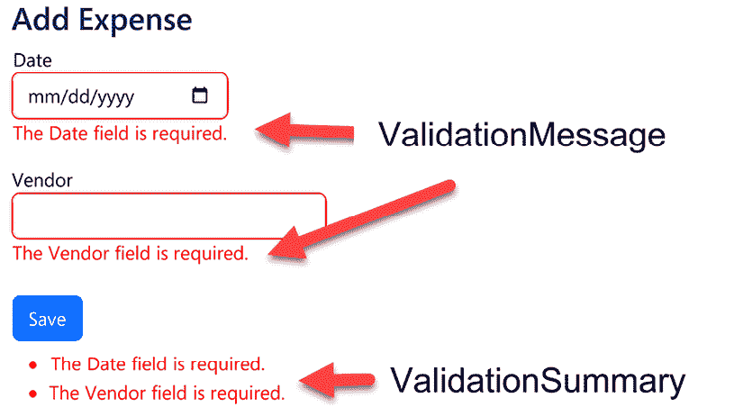

图 12.1：验证组件

验证组件使得向 Blazor WebAssembly 应用程序添加验证变得容易。

# 锁定导航

你完成表单后忘记在导航到另一页之前保存它的次数有多少？这种情况每个人都可能遇到。`NavigationLock` 组件可以用来通知用户他们即将离开当前页面，并允许他们取消该操作。它是通过拦截导航事件来做到这一点的。

这是一个示例 `NavigationLock`：

```cs
<NavigationLock ConfirmExternalNavigation="true"
    OnBeforeInternalNavigation="HandleBeforeInternalNav" /> 
```

`NavigationLock` 类包含两个属性：

+   `ConfirmExternalNavigation` – 获取或设置是否应要求用户确认外部导航。默认值是 `false`。

+   `OnBeforeInternalNavigation` – 获取或设置在发生内部导航事件时调用的回调。

这是一个从 `OnBeforeInternalNavigation` 属性调用的示例方法：

```cs
private async Task HandleBeforeInternalNav
    (LocationChangingContext context)
{
    if (context.IsNavigationIntercepted)
    {
        var confirm = await JS.InvokeAsync<bool>("confirm",
                "Are you sure you are ready to leave?");
        if (!confirm)
        {
            context.PreventNavigation();
        }
    }
} 
```

在前面的代码中，`IsNavigationIntercepted`方法用于确定导航是否被链接拦截。如果是从链接拦截的，则显示一个 JavaScript `confirm` 对话框。如果用户未确认他们想要离开页面，则`PreventNavigation`方法将阻止导航发生。

**提示**

有关从 .NET 方法调用 JavaScript 函数的更多信息，请参阅*第五章*，*使用 JavaScript 互操作性 (JS Interop) 构建本地存储服务*。

现在，让我们快速了解一下本章将要构建的项目。

# 创建支出跟踪项目

在本章中，我们将构建一个用于跟踪旅行支出的项目。我们将能够查看、添加和编辑支出。支出将存储在 Microsoft SQL Server 数据库中。

这是已完成的应用程序的“主页”截图：

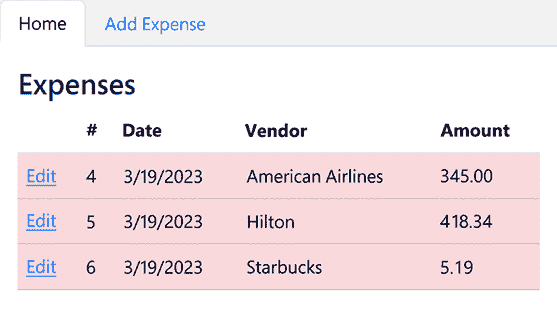

图 12.2：支出跟踪器的主页

这是已完成应用程序的“添加支出”页面截图：

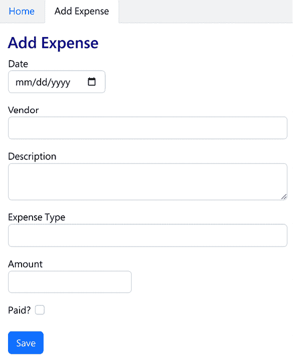

图 12.3：支出跟踪器的添加支出页面

此项目的构建时间大约为 60 分钟。

## 项目概述

将使用 Microsoft 的**Blazor WebAssembly App Empty**项目模板创建`ExpenseTracker`项目，以创建一个托管的 Blazor WebAssembly 项目。首先，我们将添加 Bootstrap 和选项卡菜单。然后，我们将添加项目所需的类和 API 控制器。我们将在“主页”上添加一个表格来显示当前的支出列表。我们将使用`EditForm`组件与许多内置输入组件一起添加和编辑支出。最后，我们将添加一个`NavigationLock`组件以防止用户在导航到另一个页面时丢失他们的编辑。

## 创建支出跟踪项目

我们需要创建一个新的 Blazor WebAssembly 应用程序。我们按照以下步骤进行：

1.  打开 Visual Studio 2022。

1.  点击**创建新项目**按钮。

1.  按*Alt*+*S*键进入搜索模板文本框。

1.  输入`Blazor`并按*Enter*键。

    以下截图显示了**Blazor WebAssembly App Empty**项目模板：

    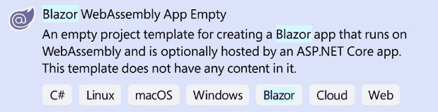

    图 12.4：Blazor WebAssembly App Empty 项目模板

1.  选择**Blazor WebAssembly App Empty**项目模板并点击**下一步**按钮。

1.  在**项目名称**文本框中输入`ExpenseTracker`并点击**下一步**按钮。

    这是配置我们新项目的对话框截图：

    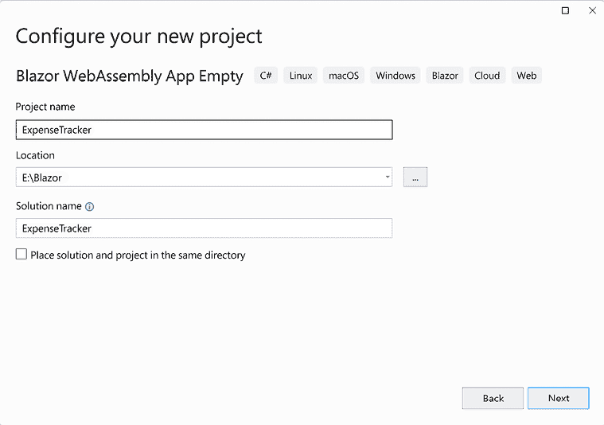

    图 12.5：配置新项目对话框

    **提示**

    在前面的示例中，我们将`ExpenseTracker`项目放置在`E:/Blazor`文件夹中。然而，此项目的位置并不重要。

1.  选择**.NET 7.0**作为要使用的`Framework`版本。

1.  选择**配置为 HTTPS**复选框。

1.  选择**ASP.NET Core Hosted**复选框。

1.  取消选择**渐进式 Web 应用程序**复选框。

    这是用于收集有关我们新项目附加信息的对话框截图：

    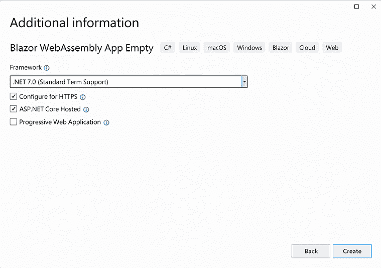

    图 12.6：附加信息对话框

1.  点击**创建**按钮。

    我们现在已创建了一个托管的**ExpenseTracker** Blazor WebAssembly 项目。

    **ExpenseTracker**解决方案包含三个不同的项目。以下 Visual Studio 的**解决方案资源管理器**截图显示了解决方案中的三个项目：

    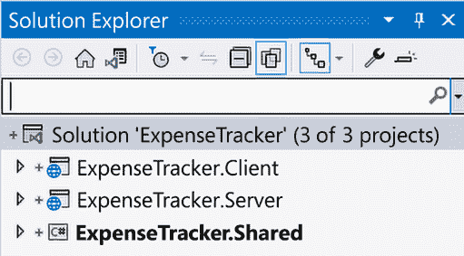

    图 12.7：解决方案资源管理器

1.  右键单击**ExpenseTracker.Server**项目，从菜单中选择**设置为启动项目**选项。

我们已创建**ExpenseTracker**解决方案，并将**ExpenseTracker.Server**项目设置为启动项目。现在我们需要处理我们的 UI。我们将使用`Bootstrap`来设计我们的控件。

## 安装 Bootstrap

我们需要在我们的 Web 应用程序中安装`Bootstrap`。我们这样做如下：

1.  右键单击`ExpenseTracker.Client/wwwroot/css`文件夹，从菜单中选择**添加**，**客户端库**选项。

1.  在**库**搜索文本框中输入`bootstrap`并按*Enter*键。

1.  选择**选择特定文件**。

1.  只选择如图所示的**css**文件：

    图 12.8：添加客户端库对话框

    **提示**

    虽然前面的截图选择了 Bootstrap 的 5.2.3 版本，但您可以使用 Bootstrap 5 的任何版本来完成此项目。

1.  点击**安装**按钮。

    **重要提示**

    安装`Bootstrap`后，将在`wwwroot/css`文件夹中添加一个新文件夹。这个新文件夹包含所有用于`Bootstrap`的 CSS 文件。在本项目中，我们只将使用`bootstrap.min.css`文件。

1.  打开`ExpenseTracker.Client/wwwroot/index.html`文件。

1.  在链接到`css/app.css`样式的`head`元素之前添加以下标记：

    ```cs
    <link href="css/bootstrap/css/bootstrap.min.css" 
          rel="stylesheet" /> 
    ```

我们已安装`Bootstrap`。现在我们将添加类来存储费用信息。

## 添加以下类

我们需要添加一个`ExpenseType`类和一个`Expense`类。我们这样做如下：

1.  右键单击`ExpenseTracker.Shared`文件夹，从菜单中选择**添加**，**类**选项。

1.  将新类命名为`ExpenseType`。

1.  点击**添加**按钮。

1.  通过添加`public`修饰符使类公开：

    ```cs
    **public** class ExpenseType 
    ```

1.  向`ExpenseType`类添加以下属性：

    ```cs
    public int Id { get; set; }
    public string? Type { get; set; } 
    ```

1.  右键单击`ExpenseTracker.Shared`文件夹，从菜单中选择**添加**，**类**选项。

1.  将新类命名为`Expense`。

1.  点击**添加**按钮。

1.  通过添加`public`修饰符使类公开：

    ```cs
    **public** class Expense 
    ```

1.  添加以下`using`语句：

    ```cs
    using System.ComponentModel.DataAnnotations; 
    ```

1.  将以下属性添加到`Expense`类中：

    ```cs
    public int Id { get; set; }
    [Required]
    public DateTime? Date { get; set; }
    [Required]
    [MaxLength(100)]
    public string? Vendor { get; set; }
    public string? Description { get; set; }
    [Required]
    [Display(Name = "Expense Type")]
    public int? ExpenseTypeId { get; set; }
    [Required]
    [Range(0, 
           500, 
           ErrorMessage = "The {0} field must be <= {2}")]
    public decimal? Amount { get; set; }
    public bool Paid { get; set; } 
    ```

    在前面的代码中，我们使用了数据注释来添加一些简单的数据验证。`Date`、`Vendor`、`ExpenseTypeId`和`Amount`都是必需的。`Vendor`的最大长度为 100 个字符。`ExpenseTypeId`的显示名称为`ExpenseType`。费用的`Amount`上限为 500。

1.  从**构建**菜单中选择**构建解决方案**选项。

我们现在已添加了`ExpenseType`类和`Expense`类，并构建了我们的应用程序。现在我们需要配置 ASP.NET Web API 端点。

## 添加 API 控制器

我们需要为每个新类添加一个 API 控制器。我们这样做如下：

1.  右键单击`ExpenseTracker.Server`项目，从菜单中选择**添加**，**新建文件夹**选项。

1.  将新文件夹命名为`Controllers`。

1.  右键单击`ExpenseTracker.Server.Controllers`文件夹，从菜单中选择**添加**，**控制器**选项。

1.  选择**使用 Entity Framework 的 API 控制器和操作**选项。

    以下截图显示了**添加新模板项**对话框，其中**使用 Entity Framework 的 API 控制器和操作**选项被突出显示：

    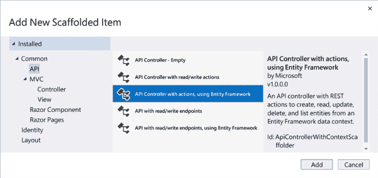

    图 12.9：添加新模板项对话框

1.  点击**添加**按钮。

1.  将**模型类**设置为**ExpenseType (ExpenseTracker.Shared)**。

1.  点击**添加数据上下文**按钮以打开**添加数据上下文**对话框：

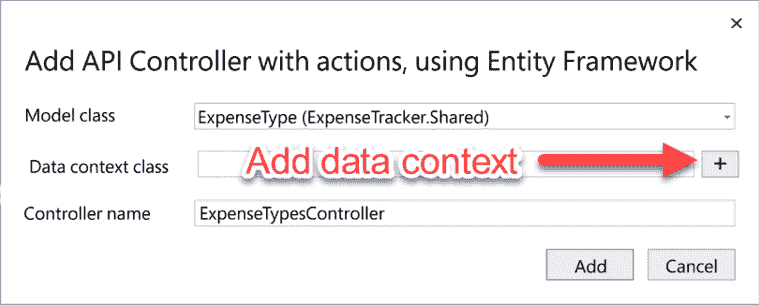

图 12.10：添加 API 控制器和操作，使用 Entity Framework 对话框

1.  点击**添加**按钮以接受默认值。


图 12.11：添加数据上下文对话框

1.  在**添加 API 控制器和操作，使用 Entity Framework**对话框中点击**添加**按钮。

    我们已创建了`ExpenseTypeController`类。现在我们需要重复前面的步骤来创建`ExpenseController`类。

1.  右键单击`ExpenseTracker.Server.Controllers`文件夹，从菜单中选择**添加**，**控制器**选项。

1.  选择**使用 Entity Framework 的 API 控制器和操作**选项。

1.  点击**添加**按钮。

1.  将**模型类**设置为**Expense (ExpenseTracker.Shared)**。

1.  点击**添加**按钮。

我们已添加了两个新的控制器，以提供应用程序将使用的 API 端点。有关使用 ASP.NET Web API 的更多信息，请参阅*第十一章*，*使用 ASP.NET Web API 构建任务管理器*。

接下来，我们需要创建 SQL Server 数据库。

## 创建 SQL Server 数据库

我们需要创建 SQL Server 数据库并为支出和支出类型添加一个表。我们这样做如下：

1.  打开 `ExpenseTracker.Server/appsettings.json` 文件。

1.  更新连接字符串如下：

    ```cs
    "ConnectionStrings": {
      "ExpenseTrackerServerContext": "Server={Server name}; Database=ExpenseTracker; Trusted_Connection=True; Encrypt=False;"
    } 
    ```

1.  将 `{Server name}` 占位符替换为你的 SQL Server 名称。

    **重要提示**

    虽然我们正在使用 SQL Server Express 2022，但对于此项目来说，你使用什么版本的 SQL Server 都无关紧要。

1.  打开 `ExpenseTracker.Server.Data/ExpenseTrackerServerContext.cs` 文件。

1.  添加以下 `OnModelCreating` 方法：

    ```cs
    protected override void OnModelCreating
        (ModelBuilder modelBuilder)
    {
        modelBuilder.Entity<ExpenseType>().HasData(
        new ExpenseType { Type = "Airfare", Id = 1 },
        new ExpenseType { Type = "Lodging", Id = 2 },
        new ExpenseType { Type = "Meal", Id = 3 },
        new ExpenseType { Type = "Other", Id = 4 }
        );
    } 
    ```

    之前的代码将为 `ExpenseType` 表添加种子数据。

1.  从 **工具** 菜单中选择 **NuGet 包管理器**，**包管理控制台** 选项。

1.  在 **包管理控制台** 中，验证 **默认项目** 是否设置为 **ExpenseTracker.Server**。

1.  在 **包管理控制台** 中执行以下命令：

    ```cs
    Add-Migration Init
    Update-Database 
    ```

    之前的命令使用 `Entity Framework` `迁移` 来更新 SQL Server。

1.  按 *Ctrl*+*F5* 组合键以不带调试模式启动应用程序。

1.  在地址栏中添加 `/api/expensetypes` 并按 *Enter* 键。

    以下截图显示了 `ExpenseTypesController` 返回的 JSON：

    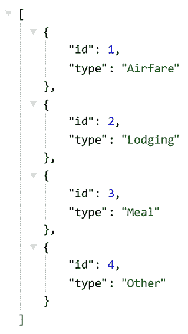

    图 12.12：ExpenseTypes API 控制器返回的 JSON

1.  关闭浏览器。

我们已经在 SQL Server 上创建了一个新数据库，添加了两个表，并使用种子数据填充了一个表。在完成设置 SQL Server 后，我们测试了 `ExpenseTypesController` 是否正常工作。最后，我们准备创建一个组件来显示存储在 SQL Server 中的支出。

## 查看支出

我们需要在 **主页** 中添加一个表格来显示支出列表。我们这样做如下：

1.  返回 Visual Studio。

1.  打开 `ExpenseTracker.Client.Pages/Index.razor` 页面。

1.  删除 `h1` 元素。

1.  添加以下代码：

    ```cs
    @using ExpenseTracker.Shared
    @inject HttpClient Http
    <h2>Expenses</h2>
    @if (expenses == null)
    {
        <p><em>Loading…</em></p>
    }
    else if (expenses.Count == 0)
    {
        <div>None Found</div>
    }
    else
    {
    }
    @code {
        List<Expense>? expenses;
    } 
    ```

    之前的代码将 `expenses` 定义为 `List<Expense>` 并检查它是否为空或为空。如果是空的，它将渲染加载信息；如果是空的，它将渲染 **未找到** 信息。

1.  向代码块中添加以下 `OnInitializedAsync` 方法：

    ```cs
    protected override async Task OnInitializedAsync()
    {
        expenses = await Http.GetFromJsonAsync
            <List<Expense>>("api/expenses");
    } 
    ```

    之前的代码通过使用 `HttpClient` 的 `GetFromJsonAsync` 方法来填充 `expenses` 对象。有关 `HttpClient` 的更多信息，请参阅 *第十一章*，*构建任务管理器用户 ASP.NET Web API*。

1.  在 `else` 语句中添加以下 `table` 元素：

    ```cs
    <table class="table">
    </table> 
    ```

1.  向 `table` 元素中添加以下 `thead` 元素：

    ```cs
    <thead>
        <tr>
            <th></th>
            <th>#</th>
            <th>Date</th>
            <th>Vendor</th>
            <th class="text-right">Amount</th>
        </tr>
    </thead> 
    ```

1.  在 `thead` 元素之后添加以下 `tbody` 元素到 `table` 元素中：

    ```cs
    <tbody>
        @foreach (var item in expenses)
        {
            <tr class="@(item.Paid ? "" : "table-danger")">
                <td>
                    <a href="/expense/@item.Id">Edit</a>
                </td>
                <td>@item.Id</td>
                <td>@item.Date!.Value.ToShortDateString()</td>
                <td>@item.Vendor</td>
                <td class="text-right">@item.Amount</td>
            </tr>
        }
    </tbody> 
    ```

    之前的代码遍历集合中的每个 `Expense` 对象，并将它们作为表格中的行显示。如果支出尚未支付，则该行将使用 `table-danger` 类突出显示为红色。

1.  按 *Ctrl*+*F5* 组合键以不带调试模式启动应用程序。

    这是我们的应用程序的截图：

    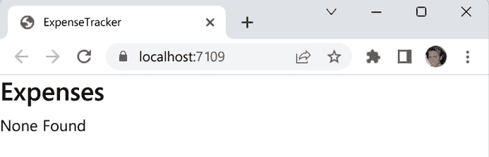

    图 12.13：ExpenseTracker 的主页

1.  关闭浏览器窗口。

我们已经添加了在 `Home` 页面上以表格形式显示费用的功能。接下来，我们需要添加添加费用的功能。

## 添加编辑费用组件

我们需要添加一个组件以使我们能够添加和编辑费用。我们这样做如下：

1.  返回 Visual Studio。

1.  打开 `ExpenseTracker.Client.MainLayout.razor` 页面。

1.  在 `main` 元素之前添加以下标记：

    ```cs
    <ul class="nav nav-tabs bg-secondary bg-opacity-10">
        <li class="nav-item">
            <NavLink class="nav-link"
                     href=""
                     Match="NavLinkMatch.All">
                Home
            </NavLink>
        </li>
        <li class="nav-item">
            <NavLink class="nav-link" href="expense">
                Add Expense
            </NavLink>
        </li>
    </ul> 
    ```

1.  上述标记使用 `Bootstrap` 渲染具有两个选项的选项卡界面：**主页** 和 **添加费用**。

1.  更新主元素如下以添加一些填充到渲染元素：

    ```cs
    <main **class****=****"p-3"**>
        @Body
    </main> 
    ```

1.  右键单击 `ExpenseTracker.Client.Pages` 文件夹，并从菜单中选择 **添加**、**Razor 组件** 选项。

1.  将新组件命名为 `ExpenseEdit`。

1.  点击 **添加** 按钮。

1.  更新标记如下：

    ```cs
    @page "/expense"
    @page "/expense/{id:int}"
    @using ExpenseTracker.Shared
    @using Microsoft.AspNetCore.Components.Forms
    @inject HttpClient Http
    @inject NavigationManager Nav
    @if (id == 0)
    {
        <h2>Add Expense</h2>
    }
    else
    {
        <h2>Edit Expense</h2>
    }
    @if (!ready)
    {
        <p><em>Loading...</em></p>
    }
    else
    {
        <EditForm Model="expense"
              OnValidSubmit="HandleValidSubmit">        
        </EditForm>
        <div>@error</div>
    }
    @code {
    } 
    ```

    上述代码在组件准备就绪时显示 `EditForm`。它使用 `id` 参数的值来确定表单是在执行添加操作还是编辑操作。

1.  将以下代码添加到代码块中：

    ```cs
    [Parameter] public int id { get; set; }
    private bool ready;
    private string? error;
    private Expense? expense = new(); 
    private List<ExpenseType>? types; 
    ```

1.  将以下 `OnInitializedAsync` 方法添加到代码块中：

    ```cs
    protected override async Task OnInitializedAsync()
    {
        types = await Http.GetFromJsonAsync<List<ExpenseType>>
          ("api/ExpenseTypes"); 
        if (id > 0)
        {
            try
            {
            }
            catch (Exception)
            {
                Nav.NavigateTo("/");
            }
        }
        ready = true;
    } 
    ```

    上述代码初始化了 `types` 对象和 `expense` 对象。一旦它们都被初始化，`ready` 的值被设置为 `true`。

1.  将以下代码添加到 `try` 块中：

    ```cs
    var result = await Http.GetFromJsonAsync<Expense>
       ($"api/Expenses/{id}");
    if (result != null)
    {
        expense = result;
    } 
    ```

    上述代码初始化了费用对象。

1.  将以下 `HandleValidSubmit` 方法添加到代码块中：

    ```cs
    private async Task HandleValidSubmit()
    {
        HttpResponseMessage response;
        if (expense!.Id == 0)
        {
            response = await Http.PostAsJsonAsync
              ("api/Expenses", expense);
        }
        else
        {
            string requestUri = $"api/Expenses/{expense.Id}";
            response = await Http.PutAsJsonAsync
                (requestUri, expense);
        };
        if (response.IsSuccessStatusCode)
        {
            Nav.NavigateTo("/");
        }
        else
        {
            error = response.ReasonPhrase;
        };
    } 
    ```

上述代码通过使用 `PostAsJsonAsync` 方法添加新费用，并通过使用 `PutAsJsonAsync` 方法更新现有费用。如果相关方法成功，用户将被返回到 **主页**。否则，将显示错误消息。

我们已经完成了此组件的代码，但 `EditForm` 仍然为空。我们现在需要向 `EditForm` 添加一些标记。

## 添加输入组件

我们需要在 `EditForm` 元素中添加输入组件。我们这样做如下：

1.  将以下标记添加到 `EditForm` 中以输入 `Date` 属性：

    ```cs
    <div class="row mb-3">    
        <label>
            Date
            <InputDate @bind-Value="expense.Date"
                       class="form-control" />
        </label>
    </div> 
    ```

1.  将以下标记添加到 `EditForm` 中以输入 `Vendor` 属性：

    ```cs
    <div class="row mb-3">    
        <label>
            Vendor
            <InputText @bind-Value="expense.Vendor"
                       class="form-control" />
        </label>
    </div> 
    ```

1.  将以下标记添加到 `EditForm` 中以输入 `Description` 属性：

    ```cs
    <div class="row mb-3">    
        <label>
            Description
            <InputTextArea @bind-Value="expense.Description"
                           class="form-control" />    </label>
    </div> 
    ```

1.  将以下标记添加到 `EditForm` 中以输入 `ExpenseTypeId` 属性：

    ```cs
    <div class="row mb-3">    
        <label>
            Expense Type
            <InputSelect @bind-Value="expense.ExpenseTypeId"
                         class="form-control">
                <option value=""></option>
                @foreach (var item in types!)
                {
                    <option value="@item.Id">
                        @item.Type
                    </option>
                }
            </InputSelect>
        </label>
    </div> 
    ```

1.  将以下标记添加到 `EditForm` 中以输入 `Amount` 属性：

    ```cs
    <div class="row mb-3">    
        <label>
            Amount
            <InputNumber @bind-Value="expense.Amount"
                        class="form-control" />
        </label>
    </div> 
    ```

1.  将以下标记添加到 `EditForm` 中以输入 `Paid` 属性：

    ```cs
    <div class="row mb-3">    
        <label>
            Paid?
            <InputCheckbox @bind-Value="expense.Paid"
                           class="form-check-input mx-1" />
        </label>
    </div> 
    ```

1.  将以下标记添加到 `EditForm` 的 `Submit` 按钮中：

    ```cs
    <div class="pt-2 pb-2">    
        <button type="submit"
            class="btn btn-primary mr-auto">
            Save
        </button>
    </div> 
    ```

1.  将以下标记添加到 `EditForm` 中以添加验证摘要：

    ```cs
    <DataAnnotationsValidator />
    <ValidationSummary /> 
    ```

1.  打开 `ExpenseTracker.Client.wwroot/css/app.css` 文件。

1.  添加以下样式：

    ```cs
    .invalid {
        outline: 1px solid red;
    }
    .validation-message {
        color: red;
    }
    h2 {
        color: darkblue;
    } 
    ```

    上述样式为相关元素提供验证样式，并将 `h2` 元素的颜色更改为深蓝色。

1.  按 *Ctrl*+*F5* 以不带调试启动应用程序。

1.  选择 **添加费用** 链接。

1.  点击 **保存** 按钮。

    以下截图显示了验证错误：

    

    图 12.14：ExpenseEdit 组件的数据验证

## 测试编辑支出组件

1.  添加一个有效的支出。

1.  点击**保存**按钮。

    如果支出有效，点击**保存**按钮将支出保存到 SQL Server 数据库，并将用户返回到**主页**。

1.  点击新支出旁边的**编辑**链接。

1.  修改支出。

1.  点击**保存**按钮。

1.  点击**添加支出**链接。

1.  添加另一个有效的支出。

1.  点击**保存**按钮。

1.  点击**添加支出**链接。

1.  添加另一个有效的支出，但不要点击**保存**按钮。

1.  点击**主页**链接。

1.  点击**添加支出**链接。

有效的支出已消失。

如果用户在点击**保存**按钮之前离开页面，他们所有的数据输入都会丢失。为了防止这种情况发生，我们可以通过使用`NavigationLock`组件来锁定他们的导航。

## 锁定导航

我们需要添加一个`NavigationLock`组件。我们这样做如下：

1.  返回 Visual Studio。

1.  打开`ExpenseTracker.Client.Pages/ExpenseEdit.razor`页面。

1.  添加以下`@inject`指令：

    ```cs
    @inject IJSRuntime JS 
    ```

1.  在`@inject`指令下方添加以下`NavigationLock`：

    ```cs
    <NavigationLock ConfirmExternalNavigation="true"
        OnBeforeInternalNavigation="HandleBeforeInternalNav" /> 
    ```

1.  将以下代码添加到代码块中：

    ```cs
    private async Task HandleBeforeInternalNav
        (LocationChangingContext context)
    {
        if (context.IsNavigationIntercepted)
        {
            var confirm = await JS.InvokeAsync<boo>("confirm",
               "Are you sure you are ready to leave?");
            if (!confirm)
            {
                context.PreventNavigation();
            }
        }
    } 
    ```

    上述代码使用 JavaScript 在用户使用链接离开当前页面时显示确认对话框。

1.  按*Ctrl*+*F5*启动应用程序，不进行调试。

1.  选择**添加支出**链接。

1.  添加一个有效的支出。

1.  点击**主页**链接。

    将显示以下`确认`对话框：

    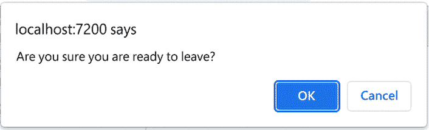

    图 12.15：确认对话框

1.  点击**取消**按钮取消导航。

我们已经完成了支出跟踪项目。

# 摘要

现在，您应该能够使用`EditForm`组件与内置输入组件一起创建输入数据表单。您还应该熟悉内置验证组件。最后，您应该了解如何锁定导航。

在本章中，我们介绍了内置的`EditForm`组件、各种输入组件和验证组件。我们还介绍了一个可以用来锁定用户导航的组件。之后，我们使用**Blazor WebAssembly App**项目模板创建了一个多项目解决方案。我们添加了一些类和一些 API 控制器。接下来，我们通过更新数据库的连接字符串和使用**Entity Framework**迁移来配置 SQL Server。我们更新了`Home`页面以显示支出列表。我们添加了一个包含`EditForm`组件和许多内置输入组件的新页面，用于输入、验证和提交支出。最后，我们添加了一个`NavigationLock`组件。

我们可以将我们的新技能应用到任何 Blazor WebAssembly 应用程序中，以添加数据输入和验证。

下一步是开始构建您自己的 Web 应用程序。为了保持最新状态并了解更多关于 Blazor WebAssembly 的信息，请访问 [`blazor.net`](https://blazor.net)，并阅读 [`devblogs.microsoft.com/dotnet/category/aspnet/`](https://devblogs.microsoft.com/dotnet/category/aspnet/) 上的 *ASP.NET 博客*。

我们希望您喜欢这本书，并祝您一切顺利！

# 问题

以下问题供您考虑：

1.  使用内置输入组件的优点是什么？

1.  你会如何更新 `HandleBeforeInternalNav` 方法，以便只有在存在未保存的更改时才显示确认对话框？

1.  `EditForm` 组件的目的是什么？

# 进一步阅读

以下资源提供了关于本章主题的更多信息：

+   关于 ASP.NET Core 组件表单的更多信息，请参阅[`learn.microsoft.com/en-us/dotnet/api/microsoft.aspnetcore.components.forms`](https://learn.microsoft.com/en-us/dotnet/api/microsoft.aspnetcore.components.forms)。

+   关于数据注释的更多信息，请参阅[`learn.microsoft.com/en-us/dotnet/api/system.componentmodel.dataannotations`](https://learn.microsoft.com/en-us/dotnet/api/system.componentmodel.dataannotations)。

+   关于路由的更多信息，请参阅[`learn.microsoft.com/en-us/dotnet/api/microsoft.aspnetcore.components.routing`](https://learn.microsoft.com/en-us/dotnet/api/microsoft.aspnetcore.components.routing)。

# 加入我们的 Discord 社区

加入我们社区的 Discord 空间，与作者和其他读者进行讨论：

[`packt.link/BlazorWASM2e`](https://packt.link/BlazorWASM2e)


