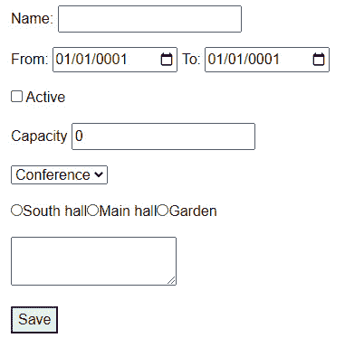
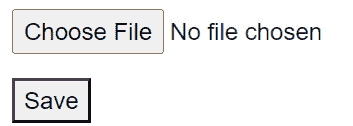
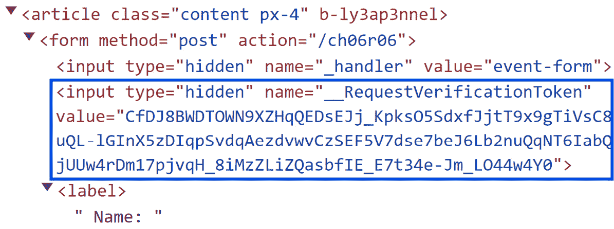

# 第六章：构建交互式表单

在本章中，我们将关注构建 Blazor 中交互式表单所需的基本技能。表单是许多网络应用程序的关键组件，Blazor 提供了简化表单创建和处理的工具。

我们将首先学习如何将简单和嵌套模型绑定到表单以捕获和管理用户输入。接下来，我们将探索 Blazor 提供的内置输入组件。这些组件有助于在不同平台上标准化表单行为，确保一致性并减少所需的自定义代码量。我们还将介绍解释按键和使表单直观的技术。在本章结束时，我们将讨论表单处理的安全性方面以及**反伪造**令牌的作用。实施这些安全措施对于保护你的应用程序免受常见的网络威胁，如**跨站请求伪造**（**CSRF**）攻击至关重要。

到本章结束时，你将具备在 Blazor 应用程序中创建、管理和保护表单的实用知识——这对于开发可靠、交互式和用户友好的网络应用程序至关重要。

这是本章我们将涵盖的菜谱列表：

+   将简单模型绑定到表单

+   提交静态表单而无需完整页面刷新

+   将嵌套模型绑定到表单

+   利用内置输入组件

+   使用表单处理文件上传

# 技术要求

我们将保持示例简单，专注于展示在 Blazor 中设置表单的所有角度。在每个菜谱的开头，你将找到有关查找所需样本和创建哪些目录的说明。也就是说，你需要以下基本工具进行 Blazor 开发：

+   一个支持 Blazor 开发的现代 IDE

+   一个支持 WebAssembly 的现代网络浏览器

+   浏览器 DevTools（可能是现代浏览器的一部分）

+   一个 Blazor 项目（你将在其中编写代码）

在 *使用表单处理文件上传* 菜谱中，我们将使用一个 NuGet 包 – **Microsoft.AspNetCore.Http.Features** – 该包默认未安装，因此你现在可以将其添加到你的项目中。

你可以在 GitHub 上找到所有代码示例：[`github.com/PacktPublishing/Blazor-Web-Development-Cookbook/tree/main/BlazorCookbook.App.Client/Chapters/Chapter06`](https://github.com/PacktPublishing/Blazor-Web-Development-Cookbook/tree/main/BlazorCookbook.App.Client/Chapters/Chapter06)

# 将简单模型绑定到表单

在现代网络应用程序的开发中，表单无处不在且至关重要。无论是注册用户详细信息、收集反馈还是输入信息，表单都是用户输入的主要界面。Blazor 支持传统的 HTML **<form>** 标记，但通过其本地的 **EditForm** 组件提升了用户体验。**EditForm** 与 Blazor 的数据绑定功能无缝集成，并提供了一种简化和高效的表单管理方法。

让我们添加第一个小型表单，该表单绑定到简单的数据模型，并允许用户通过提供其名称来创建新事件。

## 准备工作

在我们开始创建表单并将其绑定到简单模型之前，请执行以下操作：

+   创建一个 **Chapter06** / **Recipe01** 目录 – 这将是你的工作目录

+   从 GitHub 仓库中的 **Chapter06** / **Data** 目录复制 **Models.cs** 文件

## 如何操作…

要实现支持简单数据模型的表单，请按照以下步骤操作：

1.  创建一个可路由的 **EventManager** 组件：

    ```cs
    @page "/ch06r01"
    ```

1.  在 **EventManager** 的 **@code** 块中，声明一个 **Model** 对象，并用 **SupplyParameterFromForm** 属性进行装饰：

    ```cs
    [SupplyParameterFromForm]
    protected Event Model { get; set; }
    ```

1.  仍然在 **@code** 块中，如果未设置，则使用条件初始化重写 **OnInitialized()** 生命周期方法。此外，实现一个 **Save()** 方法作为占位符来模拟保存表单：

    ```cs
    protected override void OnInitialized()
        => Model ??= new();
    private void Save()
        => Console.WriteLine($"Saved {Model.Name}.");
    ```

1.  在 **EventManager** 的标记中嵌入一个 **EditForm** 组件，并将其绑定到 **Model** 参数。包括一个用于输入 **Model.Name** 的输入字段和一个触发 **Save()** 方法的提交按钮：

    ```cs
    <EditForm FormName="event-form"
              Model="@Model"
              OnSubmit="@Save">
        <label>
            Name:
            <InputText @bind-Value="@Model.Name" />
        </label>
        <button type="submit">Save</button>
    </EditForm>
    ```

## 它是如何工作的…

在 *步骤 1* 中，我们创建一个可路由的 **EventManager** 组件，它将作为我们表单的容器。

在 *步骤 2* 中，在 **EventManager** 的 **@code** 块中，我们为我们的表单声明一个 **Model** 参数，并使用一个特定于表单的属性 – **SupplyParameterFromForm** – 使 Blazor 能够自动将关联表单的值填充到 **Model** 对象中。在 *步骤 3* 中，我们最终确定 **EventManager** 的 **@code** 块。我们重写 **OnInitialized()** 生命周期方法，以便无缝地将 **Model** 参数初始化为空对象，除非它已经包含值。此外，我们引入一个 **Save()** 方法，作为占位符来模拟保存对表单所做的更改。

在 *步骤 4* 中，我们处理 **EventManager** 标记的实现，利用 Blazor 内置的 **EditForm** 组件。我们将我们的 **Model** 对象分配给 **EditForm** 组件的 **Model** 参数，并将 **Save()** 方法分配给 **OnSubmit** 回调，以便在表单提交时自动调用 **Save()**。关键的是，我们为 **EditForm** 的 **FormName** 参数设置一个唯一值，允许 Blazor 正确解析表单数据。在表单中，我们包含一个简单的输入框，将其绑定到 **Model.Name** 属性，并包含一个提交按钮以方便表单提交。

我们有意不声明任何渲染模式，导致我们的页面在服务器端进行静态渲染。虽然这种方法确保了快速渲染和服务器上资源利用的最小化，但提交表单需要完整的页面刷新 – 类似于 **MVC** 或 **Razor** **pages** 应用程序。

## 还有更多

**EditForm**组件的每个参数都有一个对应的 Blazor 属性，与标准 HTML 兼容，这意味着您可以在不依赖于**EditForm**组件的情况下广泛自定义表单的行为。您可以保留标准的 HTML **<form>**标记，并根据需要对其进行自定义。

为了给您一个实际示例，以下是您可以使用 HTML **<form>**标记实现我们的表单的方法：

```cs
<form method="post"
      @onsubmit="@Save"
      @formname="event-form">
    <AntiforgeryToken />
    <label>
        Name:
        <InputText @bind-Value="@Model.Name" />
    </label>
    <button type="submit">Save</button>
</form>
```

我们构建了一个简单的表单，利用默认的 HTML **form**元素。我们声明了表单的唯一名称，提交时调用的方法，以及 Blazor 在提交数据时应执行**post**操作。然而，由于我们不再使用**EditForm**组件，Blazor 将强制我们提供防伪造令牌以进行安全原因。为此，我们利用内置的**AntiforgeryToken**组件，但我们将详细探讨该组件，在章节末尾的*使用防伪造令牌保护表单*配方中。

# 无需完整页面刷新提交静态表单

Blazor 利用差异算法（我们在*第三章*中的*挂钩到事件委托*配方中讨论过），提供了一个**增强导航**功能，通过减少不必要的重新渲染，仅更新 UI 中已更改的部分而不是重新加载整个页面来优化用户交互。交互式渲染模式默认启用差异算法，但以**静态服务器端渲染**（**SSR**）模式渲染的表单则不启用。在本配方中，我们将探讨如何使用**Enhance**参数在**EditForm**组件上启用增强导航。

让我们启用**Event**创建表单的增强导航，并在保持其 SSR 模式操作的同时，防止表单在提交时重新加载整个页面。

## 准备工作

在我们探索表单增强之前，请执行以下操作：

+   创建**Chapter06** / **Recipe02**目录——这将成为您的工作目录

+   从*将简单模型绑定到表单*配方或从 GitHub 仓库中的**Chapter06** / **Recipe01**目录复制**EventManager**组件

+   从 GitHub 仓库中的**Chapter06** / **Data**目录复制**Models.cs**文件

## 如何操作…

1.  要在您的表单上启用增强导航，请导航到**EventManager**组件，并设置**EditForm**组件的**Enhance**参数值：

```cs
<EditForm FormName="event-form"
          Model="@Model"
          OnSubmit="@Save"
          Enhance>
    @* form body *@
</EditForm>
```

## 它是如何工作的…

在本配方中，我们导航到**EventManager**组件，并在**EditForm**组件上设置**Enhance**参数的值。由于**Enhance**是**bool**类型，仅声明参数名称就相当于声明**Enhance="true"**。这个简单的调整就足以在您的表单上启用增强导航。如果您一直在开发 MVC 应用程序，您可以在表单未增强时使用**Html.BeginForm**，并在**Enhance**属性就位时使用**Ajax.BeginForm**来概念化增强。

尽管**EventManager**组件在服务器上继续以静态方式渲染，但激活了增强导航后，Blazor 现在更有效地监控 UI 变化。当用户提交表单时不再需要完整页面刷新，这导致用户体验更加流畅和响应，同时仍然利用了 SSR 的好处。

## 还有更多...

与**EditForm**组件的其他参数类似，**Enhance**参数有一个与纯 HTML 表单兼容的等效属性——**data-enhance**。

这就是如何将**data-enhance**附加到你的**<form>**标签上的方法：

```cs
<form method="post"
      @onsubmit="@Save"
      @formname="event-form" 
      data-enhance>
    @* form body *@
</form>
```

我们利用默认的 HTML **form**元素并声明表单的唯一名称、提交时调用的方法以及 Blazor 在提交数据时应执行**post**操作。在那些已经熟悉的属性旁边，我们附加了**data-enhance**属性。属性的顺序不会影响表单的功能。

# 将嵌套模型绑定到表单

在本食谱中，我们将探索 Blazor 中表单内嵌套模型的管理。嵌套模型是包含其他模型作为属性的复杂数据结构。当我们捕获详细或结构化信息时，它们很常见，例如具有多个地址的用户资料或具有多个项目的订单。然而，随着数据结构深度的增加，管理具有复杂和嵌套数据模型的表单可能会变得难以控制。跟踪每个输入字段并确保适当的绑定可能具有挑战性，这使得表单难以维护且更容易出错。**Editor<T>**组件通过封装每个字段与其对应属性的绑定，简化了复杂对象场景的处理，为你提供了一个当前表单上下文的窄化视图。

让我们通过嵌套对象增强我们的活动创建表单，以便我们可以添加有关活动持续时间的详细信息。

## 准备工作

在开始实现嵌套表单之前，请执行以下操作：

+   创建**Chapter06** / **Recipe03**目录——这将是你的工作目录

+   从*Submitting static forms without full page reload*食谱或从 GitHub 仓库的**Chapter06** / **Recipe02**目录复制**EventManager**组件

+   从 GitHub 仓库中的**Chapter06** / **Data**目录复制**Models.cs**文件

## 如何做到这一点...

按照以下步骤实现可维护的嵌套表单：

1.  创建一个继承自**Editor<EventPeriod>**的**EventDurationForm**组件：

    ```cs
    @inherits Editor<EventPeriod>
    ```

1.  在**EventDurationForm**组件的标记中，使用**InputDate**组件并添加两个字段来设置基础**EventPeriod**模型的**Start**和**End**属性：

    ```cs
    <label>
        From: <InputDate @bind-Value="@Value.Start" />
    </label>
    <label>
        To: <InputDate @bind-Value="@Value.End" />
    </label>
    ```

1.  在**EventManager**组件中，导航到**@code**块并扩展**Save()**方法以将**Model.Period**的详细信息记录到控制台：

    ```cs
    private void Save()
    {
        Console.WriteLine($"Saved {Model.Name}.");
        Console.WriteLine(
            $"{Model.Period.Start} - {Model.Period.End}"
        );
    }
    ```

1.  在**EventManager**标记中，将**EventDurationForm**组件的实例集成到**EditForm**中，在现有的标签和**submit**按钮之间，并将其绑定到**Model.Period**嵌套属性：

    ```cs
    <label>
        Name: <InputText @bind-Value="@Model.Name" />
    </label>
    <EventDurationForm @bind-Value="@Model.Period" />
    <button type="submit">Save</button>
    ```

## 它是如何工作的…

在**步骤 1**中，我们创建了**EventDurationForm**组件，专门用于处理事件的期间设置。为了正确引用必要的模型，我们包括一个**@using**指令用于**EventPeriod**模型的程序集，并使用**@inherits**指令从泛型**Editor<T>**组件派生，将**T**设置为我们的**EventPeriod**模型。接下来，在**步骤 2**中，我们添加了**EventDurationForm**组件的标记。由于**Editor<T>**组件实现了**@bind-Value**模式，我们可以通过本地的**Value**属性直接与底层模型交互。我们使用**InputDate**组件嵌入两个日期输入字段，并将它们绑定到**Value.Start**和**Value.End**属性。目前，我们将跳过 Blazor 中的内置表单组件，因为我们将在后续食谱中探索它们。

在**步骤 3**中，我们将注意力转向**EventManager**组件。在**@code**块中，我们扩展了**Save()**占位符方法，将**Model.Period**的详细信息记录到控制台。这将使我们能够验证嵌套模型的绑定。最后，在**步骤 4**中，我们转向**EventManager**组件的标记，并将**EventDurationForm**组件集成到现有的**EditForm**标记中，就在提交按钮之前。通过使用 bind-Value 模式，我们直接将**Model.Period**对象绑定到**EventDurationForm**。

我们有效地封装了管理事件期间的标记和逻辑，而没有使主要的**EditForm**实例复杂化。

## 还有更多…

在探索**EditForm**功能的所有食谱中，我们一直使用静态服务器渲染。这是一个战略选择，允许你突出显示任何潜在边缘情况和 SSR 模式的特殊性，并提供对表单在不同渲染条件下行为的全面理解。

然而，如果你选择使用 Blazor 中可用的任何交互式渲染模式，表单将继续正常工作。通过向你的组件添加**@renderMode**指令，你可以根据应用程序的需求轻松地在渲染模式之间切换。无论你需要服务器端渲染的健壮性和安全性，还是客户端渲染的交互性和速度，**EditForm**都将平稳高效地运行。

# 利用内置输入组件

在本食谱中，我们将探讨如何快速设置简单和复杂表单，使用 Blazor 的本地表单支持和内置输入组件。使用 Blazor 的好处在于它能够处理在表单创建中涉及的大量繁重工作，如数据绑定、事件处理、维护状态或解析用户输入到预期值。然后你可以自由地关注用户界面的其他方面。

让我们通过创建一个全面的表单来展示 Blazor 的内置输入组件，在这个表单中，系统管理员可以详细定义他们计划举办的活动。

## 准备工作

在构建事件创建器之前，执行以下操作：

+   创建一个**Chapter06** / **Recipe04**目录 – 这将是你的工作目录

+   从*绑定嵌套模型到表单*食谱或从 GitHub 仓库的**Chapter06** / **Recipe03**目录复制**EventManager**和**EventDurationForm**组件，或复制它们的实现：

+   从 GitHub 仓库中的**Chapter06** / **Data**目录复制**Models.cs**文件

## 如何操作...

按照以下步骤实现具有内置输入组件的事件创建器：

1.  打开**EventManager**组件，并在**@code**块中更新**Save()**方法：

    ```cs
    private void Save()
        => Console.WriteLine($"Saved: {Model.Json}");
    ```

1.  导航到**EventManager**组件的标记部分，找到**EditForm**标记。所有后续步骤都将在这个表单内进行。

1.  将现有的**InputText**实例、**EventDurationForm**实例和保存按钮分别包裹在单独的段落**<** **p>**标签中：

    ```cs
    <p>
        Name:
        <InputText @bind-Value="@Model.Name" />
    </p>
    <p>
        <EventDurationForm @bind-Value="@Model.Period" />
    </p>
    <p>
        <button type="submit">Save</button>
    </p>
    ```

1.  在一个新的段落中，位于**EventDurationForm**段落下方，添加一个**InputCheckbox**组件并将其绑定到**Model.IsActive**属性：

    ```cs
    <p>
        <InputCheckbox @bind-Value="@Model.IsActive" />
        Active
    </p>
    ```

1.  添加另一个段落 – 这次使用**InputNumber**组件 – 并将其绑定到**Model.Capacity**属性：

    ```cs
    <p>
        Capacity
        <InputNumber @bind-Value="@Model.Capacity" />
    </p>
    ```

1.  创建另一个段落，并在其中嵌入**InputSelect**组件，将其绑定到**Model.Type**属性。使用**EventType**枚举的值来渲染选择选项：

    ```cs
    <p>
        <InputSelect @bind-Value="@Model.Type">
            @foreach (var type in
                Enum.GetValues<EventType>())
            {
                <option value="@type">@type</option>
            }
        </InputSelect>
    </p>
    ```

1.  在另一个段落中，包含一个**InputRadioGroup**组件，并将其绑定到**Model.Location**属性。使用**EventVenues.All**值和一个**InputRadio**组件来渲染每个单选选项：

    ```cs
    <p>
        <InputRadioGroup @bind-Value="@Model.Location">
            @foreach (var venue in EventVenues.All)
            {
                <InputRadio Value="@venue" />@venue
            }
        </InputRadioGroup>
    </p>
    ```

1.  在一个单独的段落中，放置一个**InputTextArea**组件并将其绑定到**Model.Description**属性：

    ```cs
    <p>
        <InputTextArea @bind-Value="@Model.Description" />
    </p>
    ```

## 工作原理...

在本食谱中，我们增强了**EventManager**组件。在*步骤 1*中，我们导航到**@code**块并更新**Save()**方法，在这里，利用**Model.Json**自动属性，我们将整个**Model**对象转换为 JSON，并将其结果写入控制台，以便我们可以查看已保存的**Model**实例的状态。

在**步骤 2**中，我们将注意力转向**EventManager**组件标记中的**EditForm**标记。在**步骤 3**中，我们使用**<p>**标签将现有的字段组织成有结构的段落。我们使用**InputText**组件来渲染一个与**Model.Name**属性绑定的文本输入元素，使用户能够设置事件的名称。接下来，使用**EventDurationForm**组件，我们封装了事件期间的设置，利用**InputDate**组件进行日期输入。**InputDate**支持多种时间格式，并包含一个内置的日历选择器——即插即用。我们通过将提交按钮包裹在另一组**<p>**标签中，完成了表单的结构化。

在**步骤 4**中，我们在新段落中引入了一个**InputCheckbox**组件，并将其绑定到**Model.IsActive**属性。**InputCheckbox**渲染一个复选框输入类型，非常适合处理**bool**属性，因此我们允许用户切换事件的活动状态。

在**步骤 5**中，我们在另一个段落中添加了一个**InputNumber**组件，并将其链接到**Model.Capacity**属性。**InputNumber**接受任何原始数值类型，这使得它非常适合设置事件参与者的最大数量。在**步骤 6**中，我们在另一个段落中嵌入了一个**InputSelect**组件，并将其绑定到**Model.Type**属性，以方便选择事件类型。**InputSelect**是一个泛型组件，因此您可以轻松地覆盖多种对象。然而，请记住，**select**选项的**value**必须是原始类型。在我们的表单中，我们通过遍历样本**Data**目录中的**EventType**枚举来填充下拉菜单。

在**步骤 7**中，我们允许用户选择事件地点。我们渲染了一个**InputRadioGroup**组件，并将其绑定到**Model.Location**属性。我们还渲染了多个**InputRadio**组件，每个组件代表**EventVenues.All**样本集合中的一个地点。Blazor 自动将所有**InputRadio**组件的范围限定在最近的父元素，但将它们包裹在**InputRadioGroup**内可以暴露出复选框组的额外功能，并给我们更多的控制权。

在**步骤 8**中，我们在最后一段中添加了一个**InputTextArea**组件，为**Model.Description**属性提供了一个文本区域。**InputTextArea**生成一个类型为**textarea**的输入——非常适合较长的描述，尽管它不是一个富文本编辑器。

我们刚刚构建的表单看起来很简单，但它通过很少的编码工作就渲染了完全功能、安全和有组织的标记：



图 6.1：仅使用内置输入组件构建的功能性、安全性和结构化表单

# 使用表单处理文件上传

在本食谱中，我们深入探讨在 Blazor 应用程序中管理文件上传。对于任何需要用户上传文档或图像的现代网络应用程序来说，文件上传至关重要。**InputFile** 组件通过其简单但全面的 API 简化了文件上传的集成。此外，通过一些额外的编码，您可以启用文件上传的 **拖放** 行为。

让我们添加一个简单的表单，允许用户上传代表活动封面的文件。

## 准备工作

在我们实现带有文件上传的表单之前，执行以下操作：

+   创建一个 **Chapter06** / **Recipe05** 目录——这将是你的工作目录

+   从 GitHub 仓库中的 **Chapter06** / **Data** 目录复制 **FileStorage** 

## 如何操作…

按照以下步骤在交互式表单中启用文件上传：

1.  打开你的应用程序的 **Program** 文件，并将 **FileStorage** 服务添加到依赖注入容器中：

    ```cs
    builder.Services.AddTransient<FileStorage>();
    ```

1.  创建一个具有单个 **File** 属性的 **EventCover** 类，该属性的类型为 **IBrowserFile** :

    ```cs
    public class EventCover
    {
        public IBrowserFile File { get; set; }
    }
    ```

1.  创建一个新的可路由的 **CoverUploader** 组件，以 **InteractiveWebAssembly** 模式渲染：

    ```cs
    @page "/ch06r05"
    @rendermode InteractiveWebAssembly
    ```

1.  在 **CoverUploader** 的 **@code** 块中，注入 **FileStorage** 服务并初始化一个类型为 **EventCover** 的 **Model** 变量：

    ```cs
    [Inject] private FileStorage Storage { get; init; }
    public EventCover Model = new();
    ```

1.  仍然在 **@code** 块中，实现一个 **FileChanged()** 方法，该方法接受 **InputFileChangeEventArgs** 参数并将文件数据分配给 **Model.File** :

    ```cs
    private void FileChanged(InputFileChangeEventArgs e)
        => Model.File = e.File;
    ```

1.  最后，在 **@code** 块中，实现一个 **SaveAsync()** 方法，该方法从 **Model** 实例初始化文件上传，使用 **FileStorage** 服务：

    ```cs
    private Task SaveAsync()
    {
        using var stream = Model.File.OpenReadStream();
        return Storage.UploadAsync(stream);
    }
    ```

1.  在 **CoverUploader** 标记中，添加一个 **EditForm** 组件，将其绑定到 **Model** 实例，并将 **SaveAsync()** 方法附加到 **OnSubmit** 表单回调中：

    ```cs
    <EditForm FormName="cover-upload"
              Model="@Model"
              OnSubmit="@SaveAsync">
    </EditForm>
    ```

1.  在 **EditForm** 标记内部，添加一个调用 **FileChanged()** 方法的 **InputFile** 组件，该组件使用其 **OnChange** 事件，并添加一个简单的提交按钮。将这两个元素包裹在段落中：

    ```cs
    <p><InputFile OnChange="FileChanged" /></p>
    <p><button type="submit">Save</button></p>
    ```

## 它是如何工作的…

在 *步骤 1* 中，我们导航到应用程序的 **Program** 文件，并将 **FileStorage** 服务注册到依赖注入容器中。**FileStorage** 是一个假服务，它假装将文件上传到您选择的存储。在 *步骤 2* 中，我们创建了一个具有单个 **File** 属性的 **EventCover** 类，该属性的类型为 **IBrowserFile** 。**IBrowserFile** 接口表示从用户接收到的文件，封装了文件名、内容类型、大小等属性以及访问文件内容的各种方法。

在*步骤 3*中，我们创建了一个可路由的**CoverUploader**组件，并将其设置为以**InteractiveWebAssembly**模式渲染，以在我们的表单上启用交互性。在*步骤 4*中，在**CoverUploader**组件的**@code**块内，我们注入了**FileStorage**服务，以利用其 API 来管理传入的文件。然后我们初始化一个类型为**EventCover**的**Model**对象，这构成了我们表单的骨干。在*步骤 5*中，在同一个**@code**块内，我们实现了一个处理**InputFileChangeEventArgs**的**FileChanged()**方法。**InputFileChangeEventArgs**对象包含一个**IBrowserFile**有效负载，我们将其分配给我们的**Model**实例的**File**属性，捕获用户选择的文件。在*步骤 6*中，我们添加了一个**SaveAsync()**方法，其中我们将**File**值读入一个流，并使用**FileStorage.UploadAsync()**方法将文件字节上传到我们选择的存储。我们利用**using**关键字来确保有效的资源管理和没有内存泄漏。在方法内部，**using**关键字与一个**IDisposable**对象一起工作，创建一个临时、可丢弃的作用域，当方法执行完成后自动丢弃所附加的对象。

在*步骤 7*中，我们使用**EditForm**组件设置了**CoverUploader**的标记。我们给表单赋予一个唯一的名称，将其绑定到我们的**Model**实例，并将**SaveAsync()**方法作为提交的回退。最后，在*步骤 8*中，我们构建了**EditForm**组件的主体。我们包含了**InputFile**组件，并将其**OnChange**回调绑定到**FileChanged()**方法。**OnChange**事件与我们的**@code**块中的**FileChanged()**逻辑无缝集成，处理用户发起的文件选择。我们还添加了一个简单的提交按钮，该按钮激活表单的**OnSubmit**回调。

最后，您的表单应该看起来像我的一样：



图 6.2：包含 InputFile 组件和提交按钮的表单

关于拖放功能呢？实际上，**InputFile**组件本身支持拖放功能！尽管它看起来像一个按钮，但**InputFile**渲染了一个已经启用了拖放功能的**input**区域——您不需要添加任何额外的代码或任何额外的属性。您可能想要添加一些额外的样式，使**InputFile**看起来像一个拖放区域，但功能是现成的。

最后，我们没有为上传实现任何文件类型或大小的验证（我们将在*第七章*中探讨验证）。对于企业级应用程序，您必须考虑设置此类边界，以保护您的基础设施以及服务器资源。

## 还有更多...

如果你想支持文件上传并利用最新的 SSR 渲染模式呢？在 SSR 模式下，Blazor 在服务器端预渲染组件，并仅提供静态标记而不具备任何交互性，因此你无法拦截用户尝试上传的文件。然而，如果我们考虑启用增强导航并利用**enctype**属性，即使在 SSR 模式下，上传文件也能正常工作。**enctype**HTML 属性指定浏览器在提交表单到服务器时应如何编码表单数据。

让我们修改现有的交互式表单，使其在 SSR 模式下渲染，同时允许用户上传文件：

1.  通过将**File**属性类型从**IBrowserFile**更改为**IFormFile**来更新**EventCover**类。这是**Microsoft.AspNetCore.Http.Features**包的一部分，因此你可能需要事先将其添加到你的项目中：

    ```cs
    public class EventCover
    {
        public IFormFile File { get; set; }
    }
    ```

1.  接下来，调整**CoverUploader**组件以在 SSR 模式下渲染，通过删除**@** **renderMode**指令。

1.  在**CoverUploader**组件的**@code**块中，将**Model**转换为属性，并用**SupplyParameterFromForm**进行装饰以启用表单数据的自动绑定：

    ```cs
    [SupplyParameterFromForm]
    public EventCover Model { get; set; }
    ```

1.  仍然在**@code**块中，覆盖**OnInitialized()**生命周期方法以遵循 SSR 表单绑定模式，并移除**FileChanged()**方法，因为我们不再需要它了：

    ```cs
    protected override void OnInitialized()
        => Model ??= new();
    ```

1.  在**CoverUploader**标记内，通过添加**Enhance**属性来增强**EditForm**组件，该属性激活了增强导航，并包含具有值**multipart/form-data**的**enctype**属性：

    ```cs
    <EditForm FormName="cover-upload"
              Model="@Model"
              OnSubmit="@SaveAsync"
              Enhance
              enctype="multipart/form-data">
        @* ... *@
    </EditForm>
    ```

1.  最后，将**InputFile**组件上的**OnChange**回调赋值替换为**name**HTML 属性，并将其值设置为与**Model.File**属性匹配，这样 Blazor 就能直接从表单绑定选定的文件：

    ```cs
    <p><InputFile name="Model.File" /></p>
    ```

# 使用反伪造令牌保护表单

在这个菜谱中，我们探讨了 Web 安全的一个基本方面——保护你的应用程序免受 CSRF 攻击。CSRF 攻击利用了我们的应用程序与用户浏览器之间的信任，使得浏览器使用用户的身份执行不希望的操作。**反伪造令牌**，也称为 CSRF 令牌，是一项重要的安全措施，你必须使用它来确保发送到服务器的请求是真实的，并且来自合法用户，而不是攻击者。在表单中嵌入反伪造令牌实际上创建了一个与每个 POST 请求一起发送的唯一密钥。服务器在收到请求时检查此令牌；如果令牌不存在或是不正确的，请求将被拒绝，从而防止未经授权的操作。

让我们使用 Blazor 提供的反伪造令牌实现来保护我们的事件创建表单。

## 准备工作

在我们探索使用反伪造令牌保护表单之前，请执行以下操作：

+   创建一个**Chapter06** / **Recipe06**目录 – 这将是你的工作目录

+   从 GitHub 仓库中的**Chapter06** / **Data**目录复制**Models.cs**文件

## 如何操作…

按照以下说明使用防伪造令牌保护您的表单：

1.  在您解决方案的服务器端，导航到**程序**文件，并在中间件配置区域注册防伪造中间件：

    ```cs
    var app = builder.Build();
    //...
    app.UseStaticFiles();
    app.UseAntiforgery();
    //...
    app.Run();
    ```

1.  创建一个可路由的**EventManager**组件：

    ```cs
    @page "/ch06r06"
    ```

1.  在**EventManager**组件的**@code**块内部，声明一个类型为**Event**的**Model**对象，并用**SupplyParameterFromForm**属性进行装饰：

    ```cs
    [SupplyParameterFromForm]
    protected Event Model { get; set; }
    ```

1.  仍然在**EventManager**的**@code**块中，重写**OnInitialized()**生命周期方法，以有条件地初始化尚未设置的**Model**实例，并实现一个**Save()**方法来模拟保存表单数据的过程：

    ```cs
    protected override void OnInitialized()
        => Model ??= new();
    private void Save()
        => Console.WriteLine($"Saved {Model.Name}.");
    ```

1.  在**EventManager**组件的标记部分，构建一个具有唯一名称的标准 HTML 表单，在提交时触发**Save()**方法：

    ```cs
    <form method="post"
          @onsubmit="@Save"
          @formname="event-form">
    </form>
    ```

1.  在**<form>**区域中，包括一个与**Model.Name**属性链接的文本输入字段和一个提交按钮。最重要的是，在表单中嵌入**AntiforgeryToken**组件：

    ```cs
    <AntiforgeryToken />
    <label>
        Name: <InputText @bind-Value="@Model.Name" />
    </label>
    <button type="submit">Save</button>
    ```

## 它是如何工作的…

在*步骤 1*中，我们导航到服务器端项目的**Program**文件以启用防伪造安全。我们在中间件区域使用**app.UseAntiforgery()**扩展方法。中间件注册的顺序至关重要；您必须根据其他正在使用的中间件深思熟虑地定位防伪造中间件。如果您的应用程序包含身份验证和授权，确保**app.UseAntiforgery()**放置在**app.UseAuthentication()**和**app.UseAuthorization()**之后。如果您已配置路由，则在注册端点中间件之前，将防伪造中间件放置在**app.UseRouting()**之后，但在**app.UseEndpoints()**之前。

在*步骤 2*中，我们创建一个可路由的**EventManager**组件，并使用**@using**指令包含必要的程序集引用以访问**Event**类型。在*步骤 3*中，在**EventManager**组件的**@code**块内部，我们声明一个类型为**Event**的**Model**属性以支持我们的表单。我们利用**SupplyParameterFromForm**属性来启用**Model**和表单字段之间的自动数据绑定。在*步骤 4*中，我们重写**OnInitialized()**方法以有条件地初始化如果它仍然是空的**Model**实例。我们还实现了一个**Save()**方法作为模拟保存表单更改的占位符。在*步骤 5*中，我们转向**EventManager**组件的标记。我们构建一个标准的 HTML 表单，使用**<form>**标签，在提交时触发**Save()**方法。在 Blazor 中，每个表单都必须有一个唯一的名称，因此我们使用**@formname**属性并将我们的表单命名为**event-form**。在*步骤 6*中，我们实现表单主体。首先，我们嵌入**AntiforgeryToken**组件。接下来，我们添加一个文本输入字段供用户输入事件名称，并将其绑定到**Model.Name**属性。最后，我们包括一个**Save**按钮以启用表单提交。

在放置了 **AntiforgeryToken** 组件之后，Blazor 会生成一个包含反伪造令牌的隐藏表单字段。我们已经在表单的顶部嵌入了 **AntiforgeryToken** 实例，但由于它是一个隐藏字段，您可以将其放置在表单的任何位置，只要它仍然是表单的一部分即可。令牌本身是 DOM 的一部分，因此您可以使用浏览器的发展工具检查其值：



图 6.3：检查作为表单标记一部分生成的反伪造令牌

## 还有更多...

由于其原生的 Blazor 集成和广泛的 API，我建议您为所有表单使用 **EditForm** 组件。那么，为什么我们没有涵盖将反伪造令牌添加到 **EditForm** 标记中的内容呢？原因很简单：**EditForm** 内置了反伪造支持。Blazor 会自动保护 **EditForm** 实例，从而让您无需显式处理 CSRF 保护。

此外，我们完全跳过了客户端应用程序反伪造令牌的实现。Blazor WebAssembly 应用完全在浏览器中运行，没有服务器端处理管道，在那里您通常会配置中间件，例如 **app.UseAntiforgery()**。如果您的 Blazor WebAssembly 应用与服务器端 API 交互，您应该在 API 层面上管理反伪造。然而，如果您已经使用 **基于令牌的认证** 来保护通信，反伪造令牌通常是不必要的。基于令牌的认证由于其本质，减轻了与 CSRF 相关的风险，使得额外的反伪造令牌变得多余。我们将在 *第八章* 中进一步探讨身份验证和授权。

## 参见

如果您想了解更多关于基于令牌的身份验证的信息，您可以查看以下资源：

[`learn.microsoft.com/en-us/xandr/digital-platform-api/token-based-api-authentication`](https://learn.microsoft.com/en-us/xandr/digital-platform-api/token-based-api-authentication)
