# 第八章：保持应用程序安全

在本章中，我们重点关注 Blazor 应用程序的基本安全实践，因为保护用户数据和维持信任对于任何商业成功至关重要。

我们将首先搭建身份框架——利用.NET 团队提供的模板设置用户身份验证和管理所需的基础设施。我们将探讨防止未经授权的访问并保护您的组件免受不受欢迎的参与者的影响的策略。此外，我们将介绍一种更细粒度的方法，并保护标记区域以自定义组件行为并确保敏感信息仅对授权用户可访问。我们将探讨如何定义和执行**角色**和**策略**以集中和封装与您的安全要求相一致的操作级别。接下来，我们将学习如何确定用户的**身份验证状态**和他们的当前访问上下文，这将使我们能够保护和增强后端逻辑。我们还将讨论如何安全地更新用户身份。

到本章结束时，您将了解 Blazor 中的各种安全机制，并将掌握最佳安全实践。

下面是我们将要涵盖的食谱列表：

+   搭建身份框架

+   保护页面

+   保护标记区域

+   创建角色

+   修改用户的身份

+   支持角色和政策授权

+   在过程逻辑中解析身份验证状态

# 技术要求

在本章中，食谱相互关联，最终形成了一本指南，介绍了最常需要的身份功能。为了清晰起见，在每个食谱的开头，您将找到如何设置工作目录以及从哪里获取示例对象的说明。此外，本章要求您拥有一个工作**结构化查询语言**（**SQL**）数据库、数据库实例的连接字符串以及一个 SQL IDE，因为您需要运行一些自定义迁移。大多数表都将为您搭建，所以如果您对 SQL 本身没有太多经验，请不要担心。

所有代码示例均可在 GitHub 上找到：[`github.com/PacktPublishing/Blazor-Web-Development-Cookbook/tree/main/Chapter08/BlazorCookbook.Auth`](https://github.com/PacktPublishing/Blazor-Web-Development-Cookbook/tree/main/Chapter08/BlazorCookbook.Auth)

# 搭建身份框架

.NET 团队提供了一个模板，可以快速将身份验证添加到 Blazor 应用程序中。这个模板不仅设置快速，而且高度可定制。您可以简化用户身份验证、注册和配置文件管理的实现，确保您的应用程序从一开始就是安全的。您将获得基本功能，如登录和注销功能、密码恢复和用户数据管理——所有这些都是任何身份验证系统所必需的。

让我们使用启用身份验证的 Blazor 项目模板来生成一个新的 Blazor 项目，并探索它提供的功能。到食谱结束时，你将拥有一个坚实的基础和对身份系统的理解。无论你是构建一个简单的应用程序还是一个复杂的企业解决方案，这种方法都将节省你的时间和精力，同时确保你的应用程序符合现代安全标准。

## 准备工作

我们将展示使用身份初始化项目，利用 Visual Studio 提供的 GUI，因此本食谱的唯一先决条件是启动你的 IDE。让我们开始吧。

如果你在环境中使用.NET CLI，可以参考食谱末尾的*更多内容…*部分，在那里我将提供等效的命令。

## 如何操作…

按照以下步骤构建一个新的具有身份的 Blazor 项目：

1.  从欢迎窗口中选择**创建新项目**：

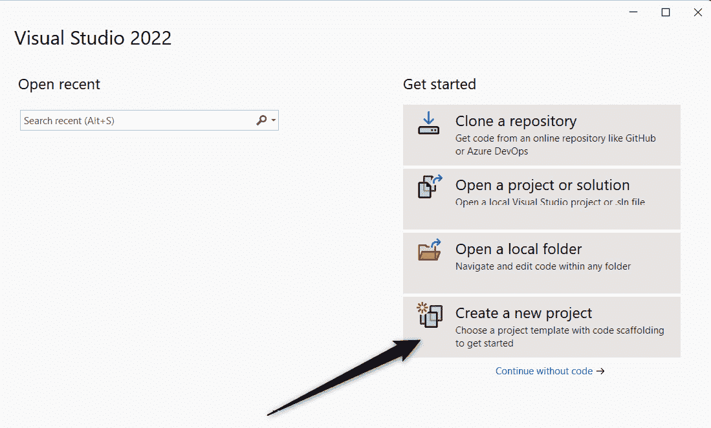

图 8.1：从欢迎窗口开始创建新项目

1.  使用面板顶部的搜索栏找到**Blazor Web App**位置，并通过点击**下一步**按钮进行确认：


图 8.2：从可用的项目模板中选择 Blazor Web App

1.  定义项目位置和名称，并通过点击**下一步**按钮进行确认：

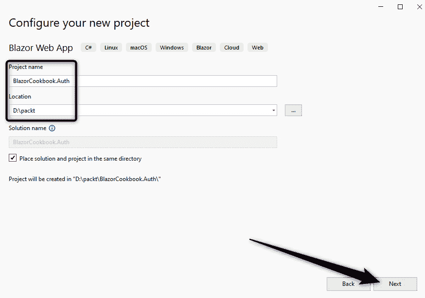

图 8.3：设置项目位置和名称

1.  将目标框架选择为**.NET 9.0（标准条款支持**），在**身份验证类型**部分，选择**个人账户**。确保勾选**配置 HTTPS**和**包含示例页面**复选框，并从交互性配置下拉菜单中选择**自动（服务器和 WebAssembly**）和**按页面/组件**。通过点击**创建**按钮进行确认：

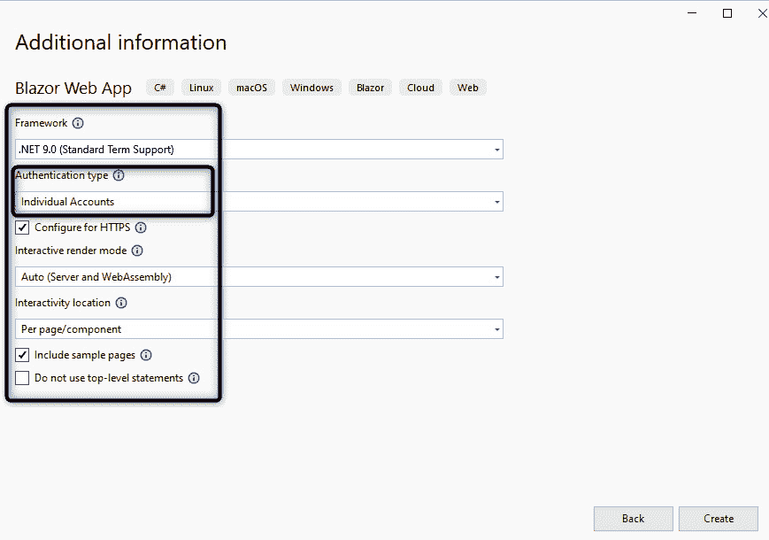

图 8.4：配置项目的框架、交互性和身份验证

你将到达一个类似的项目设置，这可能会根据你的项目名称而有所不同：

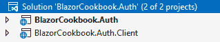

图 8.5：初始解决方案结构

## 它是如何工作的…

整个过程几乎与我们探索的*初始化项目*食谱中的相同*第一章*。前往那里进行前三步。在这里，我们专注于*第 4 步*。

在*步骤 4*中，我们进入项目配置面板。首先，我们将目标框架选为**.NET 9 (标准术语支持)**。然后，我们有一个**身份验证类型**部分。在这里，我们选择**个人账户**选项，指示 Visual Studio 为我们的应用程序生成支持身份的代码。我们还启用 HTTPS 并通过勾选相应的复选框生成示例页面。最后，为了完成配置设置，我们定义了应用程序的交互性——我们将使用每页/组件的交互位置和服务器与 WebAssembly 渲染的混合。接下来，我们看到分层的结果——一个包含两个项目的解决方案，分别用于服务器和客户端。它看起来与标准的 Blazor 模板分层没有太大区别，所以让我们深入了解每个项目，了解它是如何支持身份验证的。

这里是分层项目结构的示例：

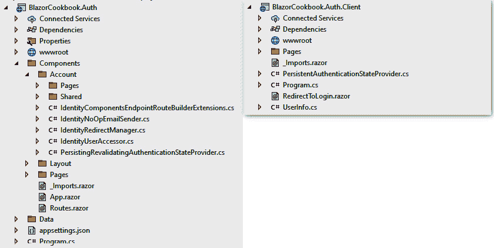

图 8.6：带有启用身份验证的服务器和客户端项目

让我们先解开客户端项目（如图 8.6 右侧所示），因为它显著更小。在组件方面，我们只得到一个与身份管理相关的组件——**RedirectToLogin**。正如其名所示，**RedirectToLogin**安全地将用户重定向到登录页面，并保留初始 URL，以便 Blazor 可以返回那里。我们还得到一个**UserInfo**类——一个包含我们希望在服务器和客户端通信之间共享的用户身份详细信息的模型，并且可以轻松扩展。在渲染模式边界之间共享身份验证状态的骨干是**PersistentAuthenticationStateProvider**服务，我们将在*支持角色和策略授权*配方中对其进行探讨。最后，我们在**Program.cs**文件中得到了一个最小设置。**PersistentAuthenticationStateProvider**服务在**依赖注入容器**（**DI**）中注册为单例，并且通过**AddAuthorizationCore()**扩展方法，所有用于在我们的应用程序中启用授权所需的服务都为我们注册了。我们还得到对**AddCascadingAuthenticationState()**扩展方法的调用，以将身份验证状态作为根级级联值添加，并使其在整个 WebAssembly 应用程序中可拦截。

服务器端项目（在*图 8* *.6* 的左侧）包含**数据**目录，其中有一个**ApplicationDbContext**类，一个**ApplicationUser**类，以及一个**迁移**子目录，这表明服务器端项目负责持久化和管理用户及其身份。这意味着你必须提供一个有效的连接字符串，指向你想要存储身份数据的数据库。你会在**appSettings.json**文件中找到一个生成的占位符**DefaultConnection**节点，你必须将其替换为你的数据库资源的连接详情。在**数据**目录旁边，我们得到了一大块生成的组件，包括一个**账户**区域，包含页面和 UI，处理管理我们应用程序中身份所需的所有操作。这里有用于登录、登出、管理账户甚至启用**双因素认证**（**2FA**）的组件，它们都是 Razor 原生组件。你会注意到，无论在配置时声明了什么交互性，所有身份组件默认都以**服务器端渲染**（**SSR**）模式渲染。由于目前行业标准是服务器端应用程序利用 cookie 进行身份管理，我们还得到了一个自定义的**IdentityRedirectManager**包装器，它利用默认的 Blazor **NavigationManager**类，通过身份状态 cookie 和一些重定向解析器对其进行扩展。**IdentityRedirectManager**类还设计为在静态 SSR 之外使用时抛出**InvalidOperationException**异常。在 SSR 中，与其它渲染模式不同，我们可以访问每个请求的**HttpContext**实例。**IdentityUserAccessor**类是另一个包装类，允许我们从**HttpContext**实例中解析当前用户身份。在**IdentityComponentsEndpointRouteBuilderExtensions**类中，我们得到了三个额外的身份端点的映射，用于使用外部**身份提供者**（**IdP**）登录、下载个人用户数据和登出。这些在默认身份 API 实现中是缺失的，因为它们对于具有 UI 的应用程序来说是本地的。**IdentityNoOpEmailSender**类是一个用于发送与身份相关的电子邮件的占位符服务：确认用户电子邮件或重置密码。在上线之前，你必须实现自己的**IEmailSender**客户端。我们还得到了一个**PersistingRevalidatingAuthenticationStateProvider**类，Blazor 使用它来在服务器和客户端代码之间的渲染边界之间共享身份验证状态——我们也会在*支持角色和策略的授权*配方中探讨这一点。**Program.cs**文件变得更加复杂。在这里，我们会找到交互式服务器和 WebAssembly 组件的默认设置以及默认的中间件管道。然而，在此基础上，我们还在设置服务器端身份功能。我们注册了自定义的身份服务（在本节前面讨论过）并调用**AddCascadingAuthenticationState()**扩展方法来在根级别启用身份验证状态的级联。我们利用**AddAuthentication()**扩展方法配置身份验证。这里也是我们通过**AddIdentityCookies()**扩展方法通知 Blazor 使用 cookie 进行身份持久化的地方。在**Program.cs**中，我们还为我们的**ApplicationDbContext**类配置数据库访问。最后，并且最重要的是，我们利用**AddIdentityCore()**方法和**IdentityBuilder** API 来配置所需的身份服务。

现在你已经了解了每个项目的结构，让我们可视化一下身份验证工作流程是如何工作的：

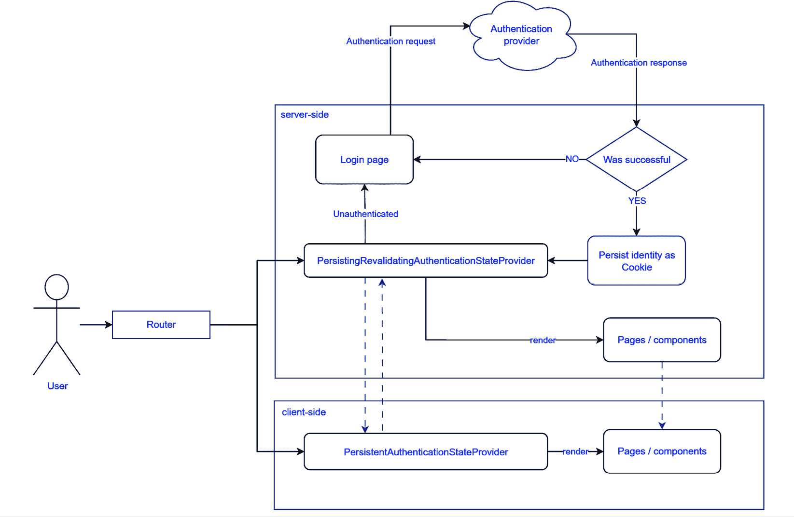

图 8.7：Blazor Web 应用的客户端和服务器端之间的身份验证工作流程

当用户尝试访问应用程序时，他们的身份将被检查。身份验证状态提供者服务验证可用的身份验证 cookie 或其缺失。如果验证成功，用户将被重定向到他们打算访问的页面；否则，用户将落在登录页面上。在提交登录表单并从身份提供者（IdP）收到成功的身份验证响应后，Blazor 将在身份验证 cookie 中持久化用户的身份。这个 cookie 将被附加到服务器和客户端之间的每个请求上，允许**PersistingRevalidatingAuthenticationStateProvider**和**PersistentAuthenticationStateProvider**有效地监控和识别当前用户及其权限。

当你第一次运行应用程序并尝试创建账户时，你的应用程序将失败。但以开发者友好的方式，你会看到一个异常页面，告诉你你还没有运行初始迁移，因此你的后端数据库无法支持身份功能：

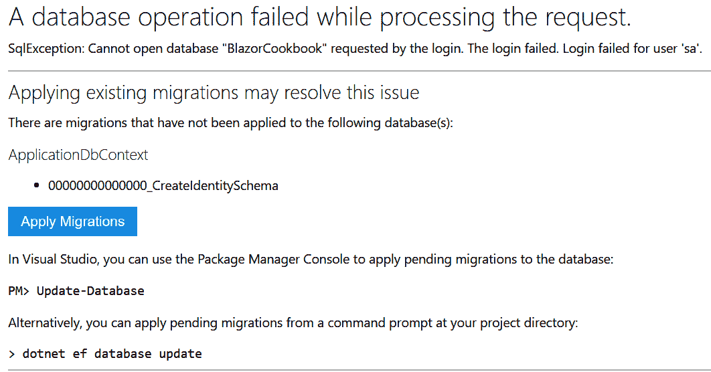

图 8.8：尝试在没有初始迁移的情况下创建账户时的异常页面

你还会得到一个简单的**应用迁移**按钮，允许你立即应用迁移！

所有这些代码和功能都准备好了，而你还没有编写一行自己的代码。利用解决方案模板和脚手架可以加快你应用程序交付的速度。

## 还有更多……

如果你没有使用 GUI 或 Visual Studio，你可以利用跨平台的.NET CLI，通过单条命令行来生成相同的模板。导航到你的工作目录，并运行以下命令：

```cs
dotnet new blazor -o BlazorCookbook.Auth -int Auto --framework net9.0 -au Individual
```

你将得到与我们在 Visual Studio 演练中创建的项目相同的格式，只有一个区别。使用.NET CLI 生成的项目使用 SQLite 数据库而不是 SQL Server。你可以通过导航到服务器端项目的**Program.cs**文件并更新**ApplicationDbContext**注册选项来使用 SQL Server：

```cs
builder.Services.AddDbContext<ApplicationDbContext>(
    options => options.UseSqlServer(connectionString));
```

# 保护页面

保护未经授权的路由至关重要，因为恶意行为者可能会尝试抓取你的应用程序，绕过你的 UI 强制执行的导航路径。确保只有授权用户可以访问特定路由有助于保护敏感数据和功能。Blazor 内置了**Authorize**属性，用于在用户导航到页面时检查访问权限。

让我们添加一个可路由的组件，只有通过在正确位置应用 **Authorize** 属性，认证用户才能导航到它。

## 准备工作

在我们将安全组件添加到服务器端项目之前，创建一个 **Components** / **Recipes** / **Recipe02** 目录——这将是你的工作目录。

## 如何操作...

按照以下说明保护组件：

1.  创建一个具有 **/** **ch08r02** 路径的可路由 **Settings** 组件：

    ```cs
    @page "/ch08r02"
    ```

1.  引用 **Microsoft.AspNetCore.Authorization** 程序集并将 **Authorize** 属性附加到 **Settings** 组件：

    ```cs
    @using Microsoft.AspNetCore.Authorization
    @attribute [Authorize]
    ```

1.  向 **Settings** 组件添加占位符标记，告知用户他们有权查看此内容：

    ```cs
    <h3>Settings</h3>
    <p>You're authorized to see settings.</p>
    ```

## 它是如何工作的...

在 *步骤 1* 中，我们执行一个常规步骤并创建一个新的可路由 **Settings** 组件，利用 **@page**。接下来，在 *步骤 2* 中，我们使用 **@using** 指令在 **@page** 声明下方引用 **Microsoft.AspNetCore.Authorization** 程序集。然后，我们使用 **@attribute** 将 **Authorize** 属性附加到组件上。现在，只有认证用户可以访问 **Settings** 页面。然而，重要的是要注意，Blazor 只在路由过程中验证 **Authorize** 属性，并不将其应用于子组件的渲染流程。最后，在 *步骤 3* 中，我们添加一些占位符内容来告知用户他们有权查看此页面。在 **Settings** 标记中，我们渲染页面标题和 **您有权查看** **设置** 的消息。

## 更多内容...

如果你正在构建无标记的组件或以代码后方式工作，你仍然可以利用 **Authorize** 属性。以下是实现无标记版本的 **Settings** 组件的方法：

```cs
[Route("/ch08r02")]
[Authorize]
public class Settings : ComponentBase
{
    // ...
}
```

由于我们不再处于 Razor 文件中，我们使用 C# 属性的语法。通过用 **[Route]** 属性装饰 **Settings** 类，我们启用对 **/ch08r02** 路径的导航。此外，通过添加 **[Authorize]** 属性，我们确保 Blazor 只允许认证用户导航到该组件。我们有效地实现了与初始实现相同的逻辑行为。作为旁注，当你以 Razor 文件工作的时候，Razor 编译器将所有的专用 **@directive** 声明转换为属性——类似于我们在无标记组件中所做的。

# 保护标记区域

有时，限制对整个页面的访问可能过于限制。您可能希望向所有人公开着陆页，同时微调用户在导航菜单中看到的元素。例如，经过身份验证的用户可能可以访问标准用户看不到的后台办公功能，尽管他们查看的是同一页面。Blazor 支持使用**AuthorizeView**组件保护特定的标记区域。**AuthorizeView**组件允许您根据用户的身份验证状态控制内容的可见性。它支持各种状态，并与**RenderFragment**对象无缝协作，使其非常灵活和多功能。

让我们利用**AuthorizeView**组件并添加一个仅对经过身份验证的用户可见的状态消息。

## 准备工作

在我们向组件添加受保护状态消息之前，请执行以下操作：

+   在服务器端项目中，创建一个**组件**/**配方**/**Recipe03**目录——这将是你的工作目录。

+   从*页面安全*配方或从 GitHub 仓库中的**组件**/**配方**/**Recipe02**目录复制**设置**组件。

## 如何操作...

按照以下步骤在组件中添加受保护的标记区域：

1.  导航到**设置**组件，并移除**授权**属性以及现有的**@using**指令。

1.  在**设置**标记中定位授权状态消息，并用**AuthorizeView**组件标签包裹它：

    ```cs
    <h3>Settings</h3>
    <AuthorizeView>
        <p>You're authorized to see settings.</p>
    </AuthorizeView>
    ```

## 它是如何工作的...

在*步骤 1*中，我们从**设置**组件中移除现有的**授权**属性和引用该属性的**@using**指令，允许所有用户访问页面。

在*步骤 2*中，我们在**设置**标记中定位**您有权查看设置**的授权状态消息。然后我们将此消息包裹在**AuthorizeView**组件标签内。**AuthorizeView**组件根据用户身份验证状态管理内容可见性，并接受**ChildContent**，这意味着 Blazor 只为经过身份验证的用户渲染状态消息。这种方法确保只有具有适当凭证的用户才能看到某些内容，从而增强应用程序的安全性和用户体验。您可以在*第一章*的*创建具有可定制内容的组件*配方中找到有关**ChildContent**模式的更多详细信息。

Blazor 将有效地隐藏**AuthorizeView**组件内部的所有内容，对未经授权的用户不可见。这意味着标记以及任何事件处理程序或方法调用。因此，您可以保护您的 UI 以及整个功能和功能，防止未经授权的用户知道它们的存在。

## 更多内容...

除了 **ChildContent** 外，**AuthorizeView** 支持显式提供 **Authorized**、**Authorizing** 和 **NotAuthorized** 片段。有了这个，你可以在同一组件内为认证用户和非认证用户定义不同的内容。你可以利用 **Authorizing** 片段来显示一个临时消息，表明正在解决用户的身份，因为你可能需要执行一些异步和长时间运行的逻辑。在我们的案例中，我们可以在 **Settings** 组件中采用以下标记：

```cs
<h3>Settings</h3>
<AuthorizeView>
    <Authorized>
        <p>You're authorized to see settings.</p>
    </Authorized>
    <Authorizing>
        <p>Give us a few moments...</p>
    </Authorizing>
    <NotAuthorized>
        <p>You can't be here, sorry.</p>
    </NotAuthorized>
</AuthorizeView>
```

**AuthorizeView** 组件将正常评估用户的认证状态，但这次会给用户一种感受到每个阶段的感觉。在认证用户时，Blazor 将在 **Authorizing** 标签中渲染内容 – 一个 **给我们一点时间…** 消息。认证完成后，对于认证用户，Blazor 将在 **Authorized** 部分渲染标记并显示预期的 **您有权查看设置。** 消息。然而，与 **Authorized** 属性相反，匿名用户也会看到一些内容 – 一个在 **NotAuthorized** 标签内，说 **您不能在这里，抱歉。** ，向未认证用户提供有意义的反馈。

# 创建角色

在网络应用程序中，角色是预定义的类别，分配给用户，以确定他们在应用程序中的访问权限和功能。通过将用户分类到角色中，你可以管理和控制每个用户可以查看和执行的操作，从而增强安全和用户体验。角色提供了一种清晰和结构化的方式来执行访问控制。你不需要为每个用户管理权限，而是可以分配角色并根据这些角色定义访问规则。这种方法简化了用户权限的管理，并确保了应用程序中安全策略的一致性。

让我们添加一个小表单，让认证用户可以在应用程序中创建新的角色。

## 准备工作

在我们实现角色创建表单之前，执行以下操作：

+   在服务器端项目中，创建一个 **Components** / **Recipes** / **Recipe04** 目录 – 这将是你的工作目录

+   从 *Securing markup areas* 菜单或从 GitHub 仓库中的 **Components** / **Recipes** / **Recipe03** 目录复制 **Settings** 组件

+   如果你还没有搭建项目，请将 GitHub 仓库中 **Components** / **Account** / **Shared** 目录下的 **StatusMessage** 组件复制到服务器端项目的相同路径

## 如何操作…

按照以下说明设置角色的支持和管理：

1.  导航到服务器端项目的 **Program.cs** 文件。找到我们注册身份服务部分的区域，从 **AddIdentityCore()** 方法开始。

1.  在**AddIdentityCore()**方法之后，调用**AddRoles()**方法，并利用默认的**IdentityRole**模型声明应用程序的角色模型。在**AddEntityFrameworkStores()**方法下方，使用**AddRoleManager()**构建方法并借助默认的**RoleManager**服务为**IdentityRole**模型注册一个角色管理器：

    ```cs
    builder.Services.AddIdentityCore<ApplicationUser>()
        .AddRoles<IdentityRole>()
        .AddEntityFrameworkStores<ApplicationDbContext>()
        .AddRoleManager<RoleManager<IdentityRole>>()
        .AddSignInManager()
        .AddDefaultTokenProviders();
    ```

1.  打开**设置**组件，在**@page**指令下方，添加一组**@using**指令，引用必要的程序集：

    ```cs
    @using BlazorCookbook.Auth.Components.Account
    @using BlazorCookbook.Auth.Components.Account.Shared
    @using Microsoft.AspNetCore.Identity
    ```

1.  在**@using**部分下方，注入**RoleManager**和**Navigation**服务：

    ```cs
    @inject RoleManager<IdentityRole> RoleManager
    @inject IdentityRedirectManager Navigation
    ```

1.  在**设置**组件中，初始化**@code**块，并构建一个具有单个**RoleName**属性的**InputModel**类：

    ```cs
    @code {
        private sealed class InputModel
        {
            public string RoleName { get; set; }
        }
    }
    ```

1.  在服务注入下方，拦截**HttpContext**的级联值：

    ```cs
    [CascadingParameter]
    private HttpContext HttpContext { get; set; }
    ```

1.  在**HttpContext**下方，声明一个由表单提供的**Input**参数，并覆盖**OnInitialized()**生命周期方法来完成表单初始化模式：

    ```cs
    [SupplyParameterFromForm]
    private InputModel Input { get; set; } = new();
    protected override void OnInitialized()
        => Input ??= new();
    ```

1.  通过实现一个**SaveAsync()**方法来完善**@code**块，在该方法中初始化一个新的**IdentityRole**对象，并利用**RoleManager**服务来保存新的角色。使用**Navigation**服务执行自我重定向并显示操作状态：

    ```cs
    private async Task SaveAsync()
    {
        var role = new IdentityRole(Input.RoleName);
        await RoleManager.CreateAsync(role);
        Navigation.RedirectToCurrentPageWithStatus(
            $"'{role.Name}' role has been created",
            HttpContext);
    }
    ```

1.  在**设置**组件的标记中，找到**AuthorizeView**标签，并为**Context**参数声明一个自定义名称。同时，将身份验证状态消息替换为**StatusMessage**组件：

    ```cs
    <AuthorizeView Context="auth">
        <StatusMessage />
    </AuthorizeView>
    ```

1.  在**StatusMessage**下方，初始化一个**EditForm**组件，将**Input**模型和**SaveAsync()**方法绑定到**Model**和**OnValidSubmit**参数。记住也要声明一个唯一的**EditForm**名称：

    ```cs
    <EditForm FormName="creator"
              OnValidSubmit="@SaveAsync"
              Model="@Input">
    </EditForm>
    ```

1.  在**EditForm**组件内部，添加一个段落，并将可编辑的输入框绑定到**Input.RoleName**属性：

    ```cs
    <p>Role name
      <InputText @bind-Value="@Input.RoleName" />
    </p>
    ```

1.  通过在角色名称输入下方添加一个表单提交按钮来完善**EditForm**组件：

    ```cs
    <p><button type="submit">Save</button></p>
    ```

## 它是如何工作的…

在*步骤 1*中，我们导航到服务器端项目的**Program.cs**文件，并找到注册身份服务的那部分。这是一个以**AddIdentityCore()**方法开始的段落，并生成一个**IdentityBuilder**对象。在*步骤 2*中，我们调用**AddRoles()**方法向身份系统添加角色管理功能。**AddRoles()**方法是一个泛型方法，需要一个身份角色模型类。我们利用随身份包提供的默认**IdentityRole**模型，这个模型足以满足我们的需求。接下来，在**AddEntityFrameworkStores()**方法下方，我们使用**AddRoleManager()**构建方法注册角色管理器，使用默认的**RoleManager**服务为**IdentityRole**模型。我们有效地在应用程序中启用了角色支持和角色管理。

在*步骤 3*中，我们移动到**设置**组件。首先，我们在**@page**下方添加一组**@using**指令来引用必要的程序集，以便访问生成的**Account**区域和内置的身份服务。在*步骤 4*中，我们注入**RoleManager**和**Navigation**服务，分别处理角色管理和导航。在*步骤 5*中，我们在**设置**组件中初始化**@code**块。在**@code**块内部，我们构建了一个具有单个**RoleName**属性的**InputModel**类。当用户填写表单时，**InputModel**类将保存新角色的详细信息。在*步骤 6*中，我们拦截**HttpContext**的级联值以访问当前的 HTTP 上下文——这对于稍后通信角色创建状态是必要的。**HttpContext**对象并非神奇地出现——当 Blazor 以 SSR 模式渲染时，它默认级联暴露**HttpContext**实例。在*步骤 7*中，在**HttpContext**下方，我们声明了一个由表单提供的**Input**参数，并覆盖了**OnInitialized()**生命周期方法以完成表单初始化模式。您可以在*第六章*中了解更多关于构建表单的信息。在*步骤 8*中，我们通过实现**SaveAsync()**方法来完成**@code**块。在**SaveAsync()**中，我们初始化一个新的**IdentityRole**对象，并利用**RoleManager**将新角色保存到数据库。我们使用**Navigation**服务和**HttpContext**执行自我重定向并向用户发送操作状态。

在*步骤 9*中，我们切换到**设置**标记。首先，我们定位到**AuthorizeView**标签。**AuthorizeView**组件是一个通用组件，因此它暴露了一个**Context**属性。同样，我们将用于我们的表单的**EditForm**也是一个具有**Context**属性的通用组件。我们将遇到冲突，并且应用程序将无法编译！为了解决这个问题，我们给**AuthorizeView**的**Context**属性赋予一个自定义名称。我们还用**StatusMessage**组件替换了现有的身份验证状态消息。**StatusMessage**组件拦截**HttpContext**并从指定的 cookie 中解析状态消息。这就是为什么我们需要在**@code**块中包含**HttpContext**的原因——以便正确地附加状态 cookie。在*步骤 10*中，我们在**StatusMessage**下方初始化一个**EditForm**组件，将**Input**模型和**SaveAsync()**方法分别附加到**Model**和**OnValidSubmit**参数上。我们还为**EditForm**声明了一个唯一的**FormName**类。在**EditForm**内部，在*步骤 11*中，我们添加了一个段落，其中包含一个可编辑的输入框绑定到**Input.RoleName**属性，允许用户输入新的角色名称。最后，在*步骤 12*中，我们通过在角色名称输入下方添加一个表单提交按钮来完成**EditForm**组件。

# 修改用户身份

修改用户的身份对于定制应用程序的功能和提升用户体验至关重要。拥有额外的身份属性，你可以启用更多个性化的交互并更好地管理特定于用户的信息。在许多应用程序中，用户名等同于用户的电子邮件，但这不足以显示个性化的问候、发送定制的通知或生成报告。但不用担心。在 Blazor 中，身份非常灵活。

让用户填写他们的名字和姓氏。

## 准备工作

在扩展用户的身份之前，执行以下操作：

+   在服务器端项目中创建一个**Components** / **Recipes** / **Recipe05**目录——这将是你的工作目录

+   从*Creating roles*配方或从 GitHub 仓库中的**Components** / **Recipes** / **Recipe03**目录复制**Settings**组件

+   在 GitHub 仓库中服务器端项目的**Samples**目录中找到**seed-work.sql**脚本并在你的数据库上运行它

+   如果你还没有生成项目，从 GitHub 仓库的**Components** / **Account** / **Shared**目录复制**StatusMessage**组件到服务器端项目的相同路径

## 如何操作…

按照以下步骤扩展默认的用户身份模型：

1.  导航到服务器端项目**Data**目录中的**ApplicationUser**类，并扩展它以包含**FirstName**和**LastName**属性：

    ```cs
    public class ApplicationUser : IdentityUser
    {
        public string FirstName { get; set; }
        public string LastName { get; set; }
    }
    ```

1.  使用**Package Manager Console**，调用 Entity Framework 命令生成新的**AddedUserFullName**数据库迁移：

    ```cs
    add-migration AddedUserFullName
    ```

    或者，如果你使用.NET CLI，使用以下命令生成相同的迁移：

    ```cs
    dotnet ef migrations add AddedUserFullName
    ```

    你将在**Data** / **Migrations**目录中获得一些新的文件：

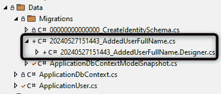

图 8.9：向数据库中的 ApplicationUser 添加 FirstName 和 LastName 属性的迁移文件

1.  通过在**Package Manager Console**中调用另一个命令将**AddedUserFullName**迁移应用到数据库：

    ```cs
    update-database
    ```

    或者，如果你使用.NET CLI，使用以下命令更新数据库：

    ```cs
    dotnet ef database update
    ```

1.  打开**Settings**组件，并在现有指令旁边添加一个额外的**@using**指令：

    ```cs
    @using BlazorCookbook.Auth.Data
    ```

1.  在下面的注入部分，将**RoleManager**服务替换为**IdentityUserAccessor**、**UserManager**和**SignInManager**服务。保留已可用的**Navigation**服务：

    ```cs
    @inject IdentityUserAccessor UserAccessor
    @inject UserManager<ApplicationUser> UserManager
    @inject SignInManager<ApplicationUser> SignInManager
    @inject IdentityRedirectManager Navigation
    ```

1.  在**@code**块中，通过用**FirstName**和**LastName**替换现有属性来更新**InputModel**类：

    ```cs
    private sealed class InputModel
    {
        public string FirstName { get; set; }
        public string LastName { get; set; }
    }
    ```

1.  在现有的**SaveAsync()**方法上方，声明一个私有的**ApplicationUser**字段：

    ```cs
    private ApplicationUser _user;
    ```

1.  在**_user**声明下方，重写**OnInitializedAsync()**生命周期方法。利用**UserAccessor**实例从数据库获取用户详情并填充**Input**模型：

    ```cs
    protected override async Task OnInitializedAsync()
    {
        _user = await UserAccessor
            .GetRequiredUserAsync(HttpContext);
        Input.FirstName ??= _user.FirstName;
        Input.LastName ??= _user.LastName;
    }
    ```

1.  为了完成**@code**块，更新**SaveAsync()**方法，使其从填充的**Input**模型更新**_user**详细信息，借助**UserManager**持久化更改，并使用**SignInManager**刷新用户上下文。最后，更新返回给用户的提示信息：

    ```cs
    private async Task SaveAsync()
    {
        _user.FirstName = Input.FirstName;
        _user.LastName = Input.LastName;
        await UserManager.UpdateAsync(_user);
        await SignInManager.RefreshSignInAsync(_user);
        Navigation.RedirectToCurrentPageWithStatus(
            "Your profile has been updated",
            HttpContext);
    }
    ```

1.  跳转到**设置**标记区域，找到现有**EditForm**组件的内容区域。

1.  更新现有的输入标签为**First Name**，并将绑定修复到**Input.FirstName**属性：

    ```cs
    <p>First Name
      <InputText @bind-Value="@Input.FirstName" />
    </p>
    ```

1.  在姓名下方添加一个段落，显示另一个可编辑的输入绑定到**Input.LastName**属性：

    ```cs
    <p>Last Name
      <InputText @bind-Value="@Input.LastName" />
    </p>
    ```

## 它是如何工作的…

在**步骤 1**中，我们导航到服务器端项目的**Data**目录中的**ApplicationUser**类。**ApplicationUser**类代表我们应用程序的用户，目前从默认的**IdentityUser**类继承以兼容身份架构。现在，我们通过**FirstName**和**LastName**属性扩展我们的用户身份详细信息。在**步骤 2**中，我们使用数据库迁移扩展了身份数据库。数据库迁移是一种管理并随时间应用数据库模式增量更改的方法。它们允许开发者在代码中定义对数据库结构的更改，例如添加或修改表和列，确保数据库与应用程序保持同步。我们打开 Visual Studio 中可用的**包管理器控制台**，并生成一个新的**AddedUserFullName**数据库迁移。Entity Framework 工具将在**Data**/**Migrations**目录中生成两个新的文件。在**步骤 3**中，我们再次使用**包管理器控制台**将**AddedUserFullName**迁移应用到数据库中。我们不会探索生成的迁移或迁移命令，因为它们不在本书的范围内，但你可以在食谱末尾的**参见**部分找到更多资源。

接下来，在*步骤 4*中，我们打开**设置**组件，并将现有的**@using**指令集扩展到对**BlazorCookbook.Auth.Data**程序集的引用，其中包含**ApplicationUser**类。在*步骤 5*中，我们移除了**RoleManager**服务注入，因为我们不会使用角色。相反，我们添加了一些其他的身份服务。我们需要**IdentityUserAccessor**来从应用程序的**HttpContext**实例中解析用户上下文。借助**UserManager**和**SignInManager**，我们可以安全地操作和刷新用户详情。在*步骤 6*中，我们更新**InputModel**类以支持我们的新要求，并用**FirstName**和**LastName**属性替换所有现有属性，以匹配我们希望在新的表单中看到的详细信息。此时，你会看到一些 IDE 错误，因为现有的表单不再与更新的**InputModel**类兼容。我们将很快解决这个问题。在*步骤 7*中，我们声明一个后置字段——一个私有的**ApplicationUser**变量，用于存储表示当前登录用户的数据库对象的引用。我们将使用它来持久化用户提供的第一个和最后一个名字。在*步骤 8*中，我们重写**OnInitializedAsync()**生命周期方法。我们利用注入的**UserAccessor**服务从**HttpContext**解析**ApplicationUser**对象到**_user**实例，并用找到的详细信息填充**Input**模型。这样，我们确保在 UI 渲染之前，表单已经预先填充了当前用户的详细信息。为了完成**@code**块，在*步骤 9*中，我们更新**SaveAsync()**方法，使其支持更新的**Input**模型并保存用户身份详情。我们使用来自表单的数据更新持久化的**_user**对象，并借助**UserManager**将这些更改保存到数据库。更新后，我们使用**SignInManager**刷新用户上下文，并执行自我重定向以在 UI 上显示**您的个人资料已更新**的消息。

接下来，在*步骤 10*中，我们跳转到**设置**标记区域并定位现有的**EditForm**组件。我们将调整表单以支持填写用户的第一个和最后一个名字。在*步骤 11*中，我们通过将其绑定到**Input.FirstName**属性来修复不再兼容的输入框。我们还更新了标签为**First name**，以清楚地表明用户正在更新哪个字段。同样，在*步骤 12*中，我们添加了一个段落，包含另一个可编辑的输入框，带有**Last name**标签并将其绑定到**Input.LastName**属性。

在表单就绪后，你可以运行应用程序并更新你将使用的账户的第一个和最后一个名字。当你填写输入并保存更改时，你会收到一个友好的确认消息：

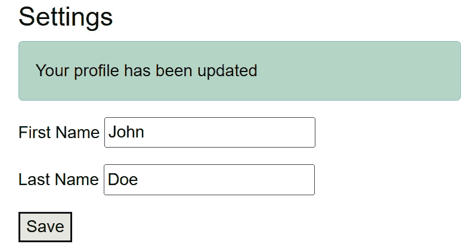

图 8.10：确认更改成功应用的状态消息

你也可以通过显示**AspNetUsers**表中的记录来检查数据库中的更改：

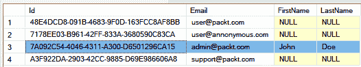

图 8.11：在数据库中查看姓名更新

## 参见

在这个菜谱中，我们提到了数据库迁移的概念。这是一个值得单独成书的话题，但如果你想了解更多，请访问微软团队准备的学习资源：[`learn.microsoft.com/en-us/ef/core/managing-schemas/migrations`](https://learn.microsoft.com/en-us/ef/core/managing-schemas/migrations)。

# 支持角色和策略的授权

保护你的应用程序可能不仅仅是关于拥有一个经过身份验证的用户；它通常需要更细粒度的控制。你可能需要根据用户的角色授予对特定功能或页面的访问权限。Blazor 的本地授权 API – **Authorize**属性和**AuthorizeView**组件 – 支持从 MVC 应用程序或 REST API 中熟悉的角色和策略。

让我们实现角色和策略，微调设置页面以显示管理员和标准用户的不同内容。

## 准备工作

在我们实施策略和角色之前，请执行以下操作：

+   在服务器端项目中，创建**Components** / **Recipes** / **Recipe06**目录 – 这将是你的工作目录。

+   从*修改用户身份*菜谱或从 GitHub 仓库中的**Components** / **Recipes** / **Recipe05**目录复制**Settings**组件。

+   如果你还没有运行迁移，请在服务器端项目的**Samples**目录中找到**seed-work.sql**脚本，并在你的数据库上运行它。

+   如果你没有跟随操作，请确保你的服务器端项目中启用了角色支持；你必须利用我们在*创建* *角色*菜谱中讨论的**AddRoles()**构建器 API 方法。

## 如何操作...

要在服务器和客户端都添加角色和策略支持，请按照以下步骤操作：

1.  导航到**BlazorCookbook.Auth.Client**项目中的**Program.cs**文件 – 客户端应用程序。

1.  在**Program.cs**文件中，找到**AddAuthorizationCore()**方法调用，并使用**options**对其进行重载以配置检查用户电子邮件是否属于**@** **packt.com**域的**InternalEmployee**策略：

    ```cs
    builder.Services.AddAuthorizationCore(options =>
    {
        options.AddPolicy("InternalEmployee", policy =>
            policy.RequireAssertion(context =>
                context.User?.Identity?.Name?
                    .EndsWith("@packt.com") ?? false));
    });
    ```

1.  仍然在客户端，打开**UserInfo**类，并扩展它以包含**Role**属性：

    ```cs
    public class UserInfo
    {
        //... existing properties ...
        public required string Role { get; set; }
    }
    ```

1.  接下来，导航到**PersistentAuthenticationStateProvider**类，并在构造函数中扩展**claims**数组以包括新添加的**Role**值：

    ```cs
    Claim[] claims = [
        // ... existing properties ...
        new Claim(ClaimTypes.Email, userInfo.Email),
        new Claim(ClaimTypes.Role, userInfo.Role),
    ];
    ```

1.  切换到服务器端应用程序，并打开**BlazorCookbook.Auth**项目的**Program.cs**文件。

1.  找到应用程序构建的位置，并在那里之前，使用授权构建器添加与客户端相同的**InternalEmployee**策略：

    ```cs
    builder.Services
        .AddAuthorizationBuilder()
        .AddPolicy("InternalEmployee",
            policy => policy.RequireAssertion(context =>
                context.User?.Identity?.Name?
                    .EndsWith("@packt.com") ?? false));
    var app = builder.Build();
    ```

1.  导航到 **PersistingRevalidatingAuthenticationStateProvider** 类的 **OnPersistingAsync** 方法，并扩展为认证用户执行的逻辑，以便将角色追加到 Blazor 将发送到客户端的 **UserInfo** 类：

    ```cs
    var userId = principal.FindFirst(
        options.ClaimsIdentity.UserIdClaimType)?.Value;
    var email = principal.FindFirst(
        options.ClaimsIdentity.EmailClaimType)?.Value;
    var role = principal.FindFirst(
        options.ClaimsIdentity.RoleClaimType)?.Value;
    state.PersistAsJson(nameof(UserInfo), new UserInfo
    {
        UserId = userId,
        Email = email,
        Role = role
    });
    ```

1.  打开 **Settings** 组件，在 **@page** 指令下方，添加一个使用 **InternalEmployee** 策略的 **Authorize** 属性重载：

    ```cs
    @using Microsoft.AspNetCore.Authorization
    @attribute [Authorize(Policy = "InternalEmployee")]
    ```

1.  在 **Settings** 标记中，找到现有的 **AuthorizeView** 开启标签，并将 **Roles** 参数设置为允许 **Support** 和 **Admin** 角色：

    ```cs
    <AuthorizeView Context="user" Roles="Support,Admin">
        @* here's still the existing EditForm *@
    </AuthorizeView>
    ```

1.  在 **EditForm** 受保护区域下方，构建另一个 **AuthorizeView** 部分，保护一个 **关闭应用程序** 按钮，并且只为 **Admin** 角色的用户渲染内容：

    ```cs
    <AuthorizeView Roles="Admin">
        <p><button>Shut down the app</button></p>
    </AuthorizeView>
    ```

## 它是如何工作的…

我们从客户端应用程序开始，因此在第 *1* 步中，我们导航到 **BlazorCookbook.Auth.Client** 项目的 **Program.cs** 文件。在第 *2* 步中，我们通过找到 **AddAuthorizationCore()** 方法调用并使用配置 **InternalEmployee** 策略的选项来扩展授权注册。我们利用 **AuthorizationPolicyBuilder** 类（我们称之为 **policy**），来检查当前登录用户的电子邮件是否属于 **@packt.com** 域。**AuthorizationPolicyBuilder** 类支持自定义断言（我们使用了）以及检查声明、用户名或 .NET 原生的 **IAuthorizationRequirement** 对象。在第 *3* 步中，我们打开 **UserInfo** 类，并扩展它以包含一个 **Role** 属性。**UserInfo** 类是 Blazor 用于在渲染模式边界之间共享用户身份细节的模型。由于我们需要 WebAssembly 端正确解析用户角色，我们必须明确地将它们传递到那里。在第 *4* 步中，我们通过扩展 **PersistentAuthenticationStateProvider** 类的构造函数来完成客户端配置。Blazor 使用 **PersistentAuthenticationStateProvider** 来确定从服务器端到达的用户认证状态。在构造函数中，我们将状态反序列化为 **UserInfo** 对象，并将 **claims** 数组扩展以包含新添加的 **Role** 属性的值。现在，无论我们的应用程序在浏览器中以本地方式运行，用户的角色都将仍然可用以进行验证。

在*步骤 5*中，我们切换到服务器端应用程序并打开**BlazorCookbook.Auth**项目的**Program.cs**文件。在*步骤 6*中，我们定位到调用**builder.Build()**方法以构建应用程序的位置。在那之前，我们使用授权构建器添加与客户端相同的**InternalEmployee**策略。由于策略断言确实相同，因此配置授权的服务器 API 略有不同。我们调用**AddAuthorizationBuilder()**方法来访问**AuthorizationBuilder**实例，因为它公开了**AddPolicy()**构建方法。在*步骤 7*中，我们通过导航到**PersistingRevalidatingAuthenticationStateProvider**类的**OnPersistingAsync**方法来完成服务器端实现。这是 Blazor 在将用户的身份传递到浏览器时使用的服务。我们定位到认证用户的逻辑。它已经包含了共享用户的 ID 和电子邮件。我们通过从当前的**principal**值中获取**RoleClaimType**的值并将其传递给 Blazor 将作为 JSON 持久化到输出响应中的**UserRole**对象，遵循相同的实现模式。

现在，我们将所有这些授权实现付诸实践。在*步骤 8*中，我们打开**Settings**组件并添加**Authorize**属性。它需要一个对**Microsoft.AspNetCore.Authorization**程序集的引用，所以我们使用**@using**指令授予它。然后，我们利用**Authorize**属性的过载功能。我们可以设置**Policy**属性，以便用户必须满足它才能访问**Settings**页面。这就是我们最终使用**InternalEmployee**策略的地方。在*步骤 9*中，我们继续到**Settings**标记。我们找到现有的**AuthorizeView**打开标签，它包裹着用户可以填写他们的名字和姓氏的表单。我们将**Roles**参数设置为**Support**和**Admin**值，确保只有当前用户处于预期的任何角色时，表单才会渲染。**Roles**参数接受一个**string**对象，因此您可以提供一个或多个以逗号分隔的角色。您也可以在同一个组件中拥有所需数量的受保护标记区域。在*步骤 10*中，我们在已存在的**AuthorizeView**区域下方构建另一个区域。在内部，我们构建一个空闲的**关闭应用程序**按钮，但我们确保它只为**Admin**角色的用户渲染。

我们得到了一个完全功能、安全的视图，它可以动态地调整给任何查看它的人。

*图 8.12*显示了具有**Admin**角色的用户看到的存储设置：

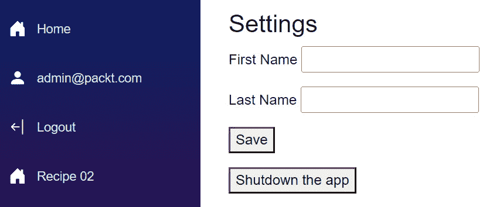

图 8.12：显示给 admin@packt.com 用户的存储设置

*图 8.13*显示了具有**Support**角色的用户看到的存储设置：

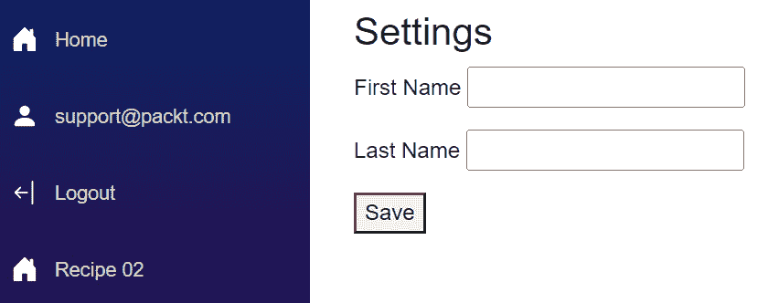

图 8.13：支持@packt.com 用户看到的存储设置

如您所见，当我以**admin@packt.com**登录，该账户具有**管理员**角色，我可以看到编辑表单和最受限的**关闭应用程序**按钮。但当我切换到**support@packt.com**时，**关闭应用程序**按钮消失了！我鼓励您检查以**user@packt.com**登录时 UI 如何变化。

## 还有更多...

**Authorize**属性支持与**AuthorizeView**相同的授权 API。两者都可以使用**Roles**和**Policy**来验证用户的身份是否符合特定标准。您甚至可以同时使用**Roles**和**Policy**！

```cs
@attribute [Authorize(Roles = "User,Support,Admin")]
<h3>Settings</h3>
<AuthorizeView Context="user" Policy="InternalEmployee">
    @* here's still the existing EditForm *@
</AuthorizeView>
<AuthorizeView Policy="InternalEmployee" Roles="Admin">
    <p><button>Shutdown the app</button></p>
</AuthorizeView>
```

使用**Authorize**属性，我们现在验证登录用户是否有以下三个允许的角色之一：**用户**、**支持**或**管理员**。此外，我们还更新了用户详细信息编辑表单的渲染。现在，**AuthorizeView**将表单显示给任何符合**内部员工**策略并且拥有任何可用角色的用户。我们还更新了**关闭应用程序**按钮的限制——用户必须拥有**管理员**角色并且属于**@packt.com**域，这是由**内部员工**策略强制执行的。

**Authorize**和**AuthorizeView**的参数工作方式类似，但应用在不同的级别。问题仍然是何时使用属性，何时使用组件最为合适。当需要保护对给定资源或页面的导航，确保只有授权用户可以访问时，使用**Authorize**。另一方面，当您需要限制对标记中某些区域的访问而不影响整体路由时，使用**AuthorizeView**。这种方法为保护 Blazor 应用程序提供了一种全面的方式，确保只有授权用户可以访问特定的功能和内容。

# 在程序逻辑中解析认证状态

将身份验证和授权集成到应用程序的过程逻辑中通常是必要的。在这些场景中，仅仅操作标记可见性可能不够；您需要在代码中根据当前的认证状态做出明智的决定。这就是级联**AuthenticationState**类的作用所在。**AuthenticationState**类是一个内置的 Blazor 功能，它提供了有关用户认证状态和声明的信息。

让我们添加一个按钮，根据内部员工的角色将他们重定向到票务系统的不同区域。

## 准备工作

在我们利用程序逻辑中的认证状态之前，请执行以下操作：

+   在服务器端项目中，创建一个**Components** / **Recipes** / **Recipe07**目录——这将成为您的工作目录

+   从 GitHub 仓库的**Components** / **Recipes** / **Recipe07**目录复制**FakePages**目录

+   如果您还没有运行迁移，请在服务器端项目的**Samples**目录中找到**seed-work.sql**脚本，并在您的数据库上运行它

+   由于我们需要启用交互性，我们不能再使用任何现有的**设置**组件，因此我们将创建一个全新的组件

如何做到这一点…

按照以下说明在过程逻辑中利用身份验证状态：

1.  创建一个新的具有服务器端交互和注入的**导航**服务的可路由**设置**组件：

    ```cs
    @page "/ch08r07"
    @rendermode InteractiveServer
    @inject NavigationManager Navigation
    ```

1.  添加一个**@code**块来拦截级联身份验证状态：

    ```cs
    @code {
        [CascadingParameter]
        private Task<AuthenticationState> AuthState
        {
            get; set;
        }
    }
    ```

1.  在**AuthState**参数下方，初始化一个**GoToTicketsAsync()**方法并解析**用户**上下文：

    ```cs
    private async Task GoToTicketsAsync()
    {
        var user = (await AuthState).User;
        //we will continue building logic here
    }
    ```

1.  在**用户**上下文下方，检查用户的**身份**属性是否有值，如果缺失则重定向到登录页面：

    ```cs
    if (user.Identity is null)
    {
        Navigation.NavigateTo("/Account/Login");
        return;
    }
    ```

1.  在**身份**验证之后，检查用户是否正确认证，如果没有则重定向到登录页面：

    ```cs
    if (!user.Identity.IsAuthenticated)
    {
        Navigation.NavigateTo("/Account/Login");
        return;
    }
    ```

1.  在身份验证验证之后，检查用户**名称**属性的值是否属于**@packt.com**域名，如果不是，则将他们重定向到票务系统的着陆页：

    ```cs
    if (!user.Identity.Name.EndsWith("@packt.com"))
    {
        Navigation.NavigateTo("/tickets");
        return;
    }
    ```

1.  在用户域检查之后，检查用户是否在**支持**或**管理员**角色中，并将他们重定向到票务系统的管理员面板：

    ```cs
    if (user.IsInRole("Support") ||
        user.IsInRole("Admin"))
    {
        Navigation.NavigateTo("/tickets/admin");
        return;
    }
    ```

1.  最后，如果用户的身份不匹配任何已处理的案例，则将他们重定向到访问拒绝页面：

    ```cs
    Navigation.NavigateTo("/tickets/denied");
    ```

1.  跳转到**设置**组件的标记并添加一个按钮以导航到票务系统：

    ```cs
    <p>
        <button @onclick=@GoToTicketsAsync>
            Support tickets
        </button>
    </p>
    ```

## 它是如何工作的…

在**步骤 1**中，我们创建一个新的可路由**设置**组件，以**交互式服务器**模式渲染，因为我们希望用户通过点击按钮导航到票务系统。

如果你跟完了整个章节或者已经搭建了你的项目，那么你将已经注册了级联身份验证状态。但为了给你一个全面的概述，在服务器端和客户端项目中，在它们的**Program.cs**文件中，你将找到（或者如果缺失则添加）**builder.Services.AddCascadingAuthenticationState()**命令，该命令明确启用了应用程序中的级联身份验证状态。

在*步骤 2*中，我们在**设置**组件中初始化**@code**块。首先，我们拦截身份验证状态。Blazor 将**AuthenticationState**作为一个**Task**参数共享——与现代网络开发一致，所有操作本质上都是异步的，因为**AuthenticationStateProvider**实现可能包含构建身份验证状态的异步逻辑。我们还注入了一个**NavigationManager**服务来帮助我们重定向用户到目标位置。在接下来的几个步骤中，仍然在**@code**块内部，我们实现了一个**GoToTicketsAsync()**方法，根据用户的身份上下文解决重定向目标。在*步骤 3*中，我们通过等待**AuthState**并从结果中获取**User**属性来解析**用户**对象。在*步骤 4*中，我们检查当前用户是否设置了**Identity**值，如果用户尚未登录，该值可以是**null**。如果**Identity**值缺失，我们立即将用户重定向到登录页面。在*步骤 5*中，我们使用**IsAuthenticated**属性对**Identity**值进行额外检查，以验证用户是否已登录并正确认证。如果该检查失败，我们将用户重定向到登录页面以重新验证其身份验证状态。现在我们确信当前用户有一个有效的身份，在*步骤 6*中，我们检查用户是否实际上是内部员工。我们利用**user**对象的**Name**属性，代表用户在应用程序中的登录。由于在我们的案例中，**Name**属性等同于用户的电子邮件，我们验证当前检查的用户账户是否属于**@packt.com**域名。如果该检查失败，我们将用户重定向到**/tickets**页面，在那里他们可以作为标准应用程序用户创建新的支持票证。在*步骤 7*中，知道是内部员工在使用应用程序，我们检查他们是否有**Admin**或**Support**角色。如果有，我们将他们重定向到**/tickets/admin**页面，在那里他们可以访问票务系统的管理面板。在*步骤 8*中，我们关闭**GoToTicketsAsync()**方法的实现。当所有之前的身份验证和授权检查都失败时，我们假设用户的账户不完整，并将他们重定向到**/tickets/denied**页面，表明他们无法访问票务系统。

在*步骤 9*中，我们扩展了**设置**组件的标记。在现有的**h3**标题下方，我们添加了一个具有**按钮**属性的段落，该属性在点击时调用**GoToTicketsAsync()**方法，使用户能够导航到票务系统。有效的重定向取决于我们添加的程序逻辑的结果和用户的身份。
