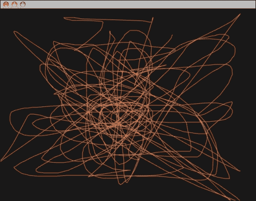
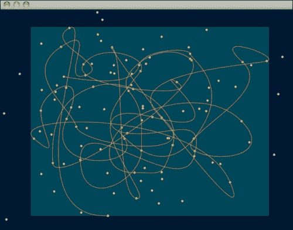
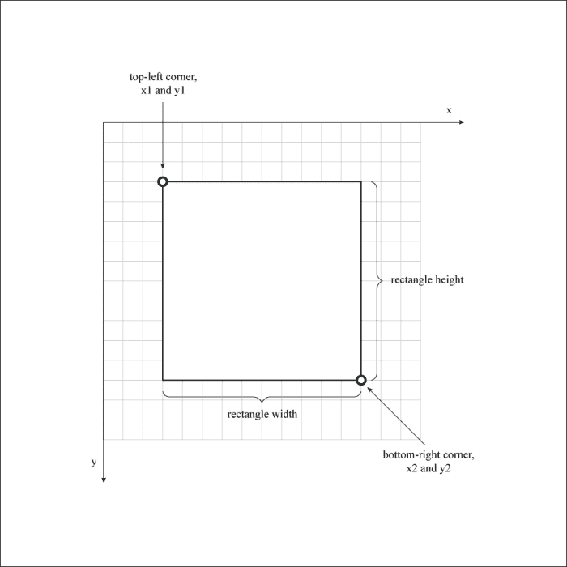
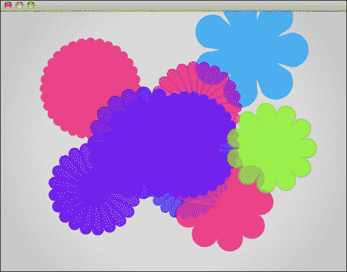
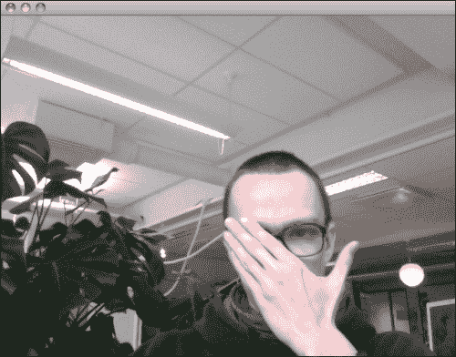
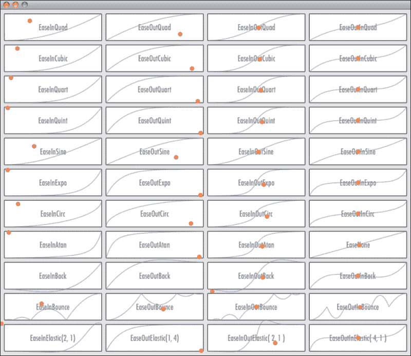
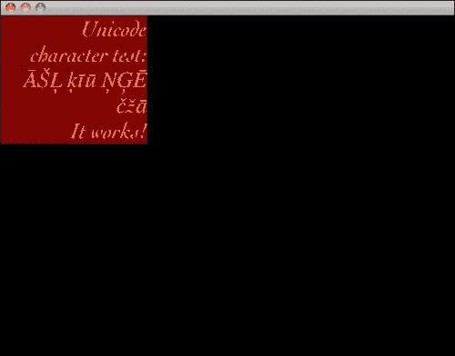
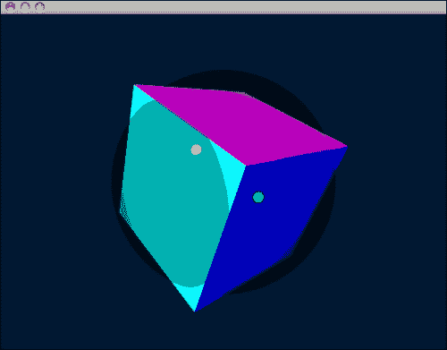
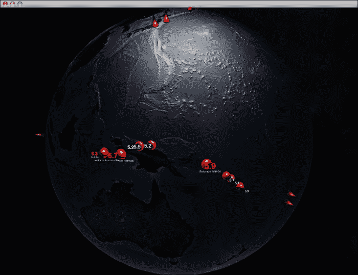
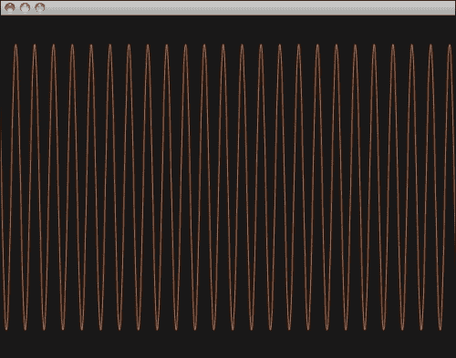

# 第二章：了解可能实现的内容 – Cinder 工具集

本章介绍了可以通过编译、运行、更改和讨论一些示例应用程序来使用 Cinder 完成的各种基本任务。

我们已经通过编译和运行 QuickTime 示例应用程序来测试了我们的设置。现在，我们将通过编译其他示例并讨论它们的特别之处来了解 Cinder 的可能性。

我们将浏览展示本书将讨论的大部分功能的示例。将会有很多部分目前还不清楚且难以解释，但不用担心，我们将在接下来的章节中尝试理解它们。

这里有一些我们将要讨论的示例列表。如果你遵循了上一章中的教程，请前往你的 Cinder 示例文件夹（Mac OS X 上为 `(/Users/You/cinder/samples/)`，Windows 上为 `C:\cinder\samples\`）。

+   BasicApp (`samples/basicApp`)

+   BezierPath (`samples/bezierPath`)

+   CairoBasic (`samples/CairoBasic`)

+   CaptureTest (`samples/captureTest`)

+   EaseGallery (`samples/EaseGallery`)

+   TextBox (`samples/TextBox`)

+   ArcballDemo (`samples/ArcballDemo`)

+   Earthquake (`samples/Earthquake`)

+   AudioGenerative (`samples/AudioGenerative`)

# BasicApp

前往你的 Cinder 示例文件夹（如果遵循了上一章中的教程，MAC 上为 `/Users/You/cinder/samples/`，Windows 上为 `C:\cinder\samples\`）。

将会看到一个名为 `BasicApp` 的文件夹。看看里面有什么。如果你是 Mac OS X 用户，请打开位于 `xcode/basicApp.xcodeproj` 的项目文件。Windows 用户应从 `vc10\basicApp.sln` 打开项目文件。编译并运行项目。



如我们所见，一个黑色背景的窗口出现了。看起来那里除了纯粹的黑色和无限的虚空之外什么都没有。但事实并非如此！拿起你的鼠标，尝试通过在应用程序窗口的黑色表面上指向和点击-拖动来填充这个虚空。出现了一条橙色线条。是的，这是一个非常基础的绘图程序，允许你绘制连续的线条。线条是 Cinder 可以创建的基本 2D 几何形状之一。

让我们尝试改变线条的颜色。关闭窗口，点击位于所选 IDE 的项目导航器或项目文件树浏览器中示例项目源目录下的 `basicApp.cpp` 文件。导航到代码中可以查看以下内容：

```cs
void BasicApp::draw()
{
```

这是在程序中定义实际绘图过程的地点。查看以下代码行：

```cs
// We'll set the color to orange
glColor3f( 1.0f, 0.5f, 0.25f );
```

这是改变线条颜色的地方。这是通过使用名为`glColor3f`的函数来完成的。从函数的名称中可以推断出它使用 OpenGL、改变颜色，并使用三个`float`值来完成。已知 RGB 颜色值由三个分量组成，分别是 R（红色）、G（绿色）和 B（蓝色）。在这个函数中，`0.0`是每个分量的最小可能值，而`1.0`是最大值。

让我们改变线的颜色为红色。我们需要将颜色的红色分量设置为最大（`1.0`）并将所有其他分量设置为最小（`0.0`）。所以它看起来会像以下这样：

```cs
glColor3f( 1.0f, 0.0f, 0.0f );
```

我们使用`*dot-zero-f*`记号的原因是我们想告诉编译器我们正在将浮点常数传递给函数。这里我不会深入探讨这个问题，因为互联网上有大量关于这个问题的在线资源。

现在保存、编译、运行并绘制。做得好！你已经用 Cinder 编写了第一条自定义代码！让我们立即继续另一个例子！

# BezierPath

现在，我们已经准备好了一个稍微复杂一点的例子，这个例子将允许你绘制一条连续的贝塞尔曲线。贝塞尔曲线之所以被称为贝塞尔曲线，是因为一位法国工程师皮埃尔·贝塞尔（Pierre Bézier），他实际上通过在设计中应用它们来申请专利并使它们流行起来。贝塞尔曲线在计算机图形、动画和其他领域得到广泛应用。贝塞尔曲线的概念使我们能够通过使用笛卡尔坐标系和数字来创建参数曲线。

前往你的 Cinder 样本文件夹（在 Mac OS X 上为`/Users/You/cinder/samples/`，如果你使用 Windows 则为`C:\cinder\samples\`）。

前往名为`bezierPath`的文件夹。如果你是 Mac OS X 用户，请打开`xcode/bezierPath.xcodeproj`（如果你使用 Windows，则为`vc10\bezierPath.sln`）。编译并运行项目。



点击并拖动以在窗口表面上放置点。你将在第二次点击后开始看到线条。当你按下鼠标并移动它时，你可以控制正在绘制的线段的曲率。玩一会儿，以更好地理解贝塞尔曲线的工作原理。

为了给这个过程增加一些额外的技术乐趣，让我们改变一下之前例子中做的事情。关闭应用程序窗口，并在编辑器中打开文件`bezierPathApp.cpp`。让我们假设我们不喜欢屏幕上用来表示路径形成点的圆圈——我们想用矩形代替。导航到一个看起来像以下代码片段的代码块：

```cs
// draw the control points
gl::color( Color( 1.0f, 1.0f, 0.0f ) );
for( size_t p = 0; p < mPath.getNumPoints(); ++p )
gl::drawSolidCircle( mPath.getPoint( p ), 2.5f );
```

如前一个代码块中的注释所示，这个代码块负责绘制控制点。它通过以下行设置下一个要绘制的东西（或在这个例子中的圆圈）的颜色：

```cs
gl::color( Color( 1.0f, 1.0f, 0.0f ) );
```

这使用一个`for`循环来遍历`mPath`对象中的所有数据。圆圈是通过以下行绘制的：

```cs
gl::drawSolidCircle( mPath.getPoint( p ), 2.5f );
```

只需通过查看函数名，我们就可以知道它绘制圆形。`gl::`告诉我们这个函数位于 Cinder OpenGL 命名空间中（Cinder 确实使用了大量的命名空间，这使得其代码确实更易于阅读），`draw`告诉我们它绘制了某个东西，`solid`表示这个函数绘制了实心物体，而`circle`通过明确指出使用 OpenGL 将绘制一个实心圆来总结这一点。

函数传递了两个参数。第一个是一个包含 x 和 y 坐标值的点对象，另一个定义了正在绘制的圆的半径（以像素为单位）。

让我们先改变圆的半径。将`2.5f`改为`10.0f`，使其看起来如下：

```cs
gl::drawSolidCircle( mPath.getPoint( p ), 10.0f );
```

构建并运行项目以查看更改！嗯，很有趣！确实如此！但让我们不要过早庆祝，记住，我们想要将圆形改为矩形。我们将使用以下定义的函数：

```cs
gl::drawSolidRect( const Rectf &rect, bool textureRectangle=false );
```

正如函数的名称所告诉我们的，这个函数绘制一个实心矩形。尽管如此，我们仍然需要向函数提供一个参数。只需要一个参数（另一个是可选的，默认设置为`false`），并且该参数必须是`Rectf`类型。一个`Rectf`由四个值组成。前两个值定义矩形的右上角，其他两个定义矩形的右下角位置。在大多数绘图 API 中，这种对象通常是通过传递矩形的左上角的 x 和 y 坐标以及矩形的宽度和高度来定义的。但这次不是这样。因此，我们必须传递类似以下内容的东西：

```cs
Rectf( float x1, float y1, float x2, float y2 )
```

其中`x1`是左上角的 x 坐标，`y1`是左上角的 y 坐标，而`x2`和`y2`定义了屏幕上应该放置右下角的位置。

### 注意

这只是 Cinder 中五个`Rectf`（或`RectT`）构造函数中的一个。如果你想查看其他几个，请查看 Cinder 在线参考[`libcinder.org/docs/v0.8.4/classcinder_1_1_rect_t.html`](http://libcinder.org/docs/v0.8.4/classcinder_1_1_rect_t.html)。

通过分析点绘制函数（`gl::drawSolidCircle( mPath.getPoint( p ), 10.0f );`），我们得到了一个表示当前控件点 x 和 y 坐标的对象的代码片段：

```cs
mPath.getPoint(p)
```

我们可以通过编写以下内容来访问 x 和 y 坐标：

```cs
mPath.getPoint(p).x
```

并且

```cs
mPath.getPoint(p).y
```

让我们构建我们的矩形：

```cs
Rectf( mPath.getPoint(p).x, mPath.getPoint(p).y,
  mPath.getPoint(p).x+10.0f, mPath.getPoint(p).y+10.0f )
```



前一段代码中的数字常量`10.0f`代表矩形的宽度和高度。由于我们希望宽度和高度相等，所以我们在这里使用相同的值。以下是将要使用的最终代码：

```cs
// draw the control points
gl::color( Color( 1.0f, 1.0f, 0.0f ) );
for( size_t p = 0; p < mPath.getNumPoints(); ++p ) {
  gl::drawSolidRect( Rectf( mPath.getPoint(p).x,
  mPath.getPoint(p).y, mPath.getPoint(p).x+10.0f,
  mPath.getPoint(p).y+10.0f ) );
}
```

构建并运行项目。你将看到矩形被绘制在实际的控件点旁边，而不是像应该的那样绘制在它们上面。让我们修复这个问题：

```cs
for( size_t p = 0; p < mPath.getNumPoints(); ++p ) {
  gl::drawSolidRect( Rectf( mPath.getPoint(p).x-5.0f,
  mPath.getPoint(p).y-5.0f, mPath.getPoint(p).x+5.0f,
  mPath.getPoint(p).y+5.0f ) );
}
```

正如你所见，我们将所有的 `10.0f` 值改为 `5.0f`，并从矩形构造函数的前两个参数中减去 `5.0f`。通过这样做，我们将矩形的左上角向左移动了它宽度的一半，向上移动了它高度的一半（5 个像素），同时保持了相同的宽度和高度（10 个像素）。

构建并运行项目，正如你所见，现在矩形已经到了正确的位置。

也许一开始这有点复杂，但随着你做这类调整的次数越多，你学到的也就越多。在本章的剩余部分，我们不会再做任何更改。

# CairoBasic

你曾经梦想过创建可以无失真打印的生成式打印艺术品吗？来认识一下 Cairo。

Cairo 是一个矢量图形软件库，它允许你绘制所有可以在软件中完成的疯狂矢量图形，例如 Illustrator，它还允许我们将它保存为单独的矢量图形文件。如果你想了解更多关于 Cairo 本身的信息，请访问它的网站 ([`cairographics.org/`](http://cairographics.org/))。

让我们试试看！在 `samples` 目录中搜索 `CairoBasic` 文件夹。打开 `xcode/CairoBasic.xcodeproj`（如果你在 Windows 上，则为 `vc10\CairoBasic.sln`）。构建并运行项目。看起来那里没有什么特别之处，除了一个径向渐变背景。但试着点击它！一朵花。再点击一次！随机出现的花朵。试着用它们填满整个屏幕——你能闻到花香吗？



好了，这就足够了。关闭应用程序窗口。那么，刚才发生了什么？为了理解这一点，请在你代码编辑器中打开文件 `CairoBasicApp.cpp`。我现在不会解释它，但你可以看到里面的代码并不多。转到一段看起来像以下的代码块：

```cs
void CairoBasicApp::keyDown( KeyEvent event )
{
```

这是一个主要应用类的方法，当我们在键盘上按下键时，它会执行一些操作。我们可以看到，如果我们按下 *F* 键，就可以使应用程序全屏显示，然后为字母 *S*、*E*、*P* 和 *D* 定义了某些功能——那是什么呢？如果你按下一个这些按钮，你将保存准备好的图像到一个文件中，但这个文件的格式将是一个矢量格式。正如你所见，如果你按 *S*，你会得到一个 SVG 文件，对于 *E* 你会得到一个 EPS 文件，对于 *P* 你会得到一个 PS 或 PostScript 文件，而对于 *D* 你会得到一个 PDF 文件。

试试看！再次构建并运行应用程序，创建你的艺术品，然后依次按下 *S*、*E*、*P* 和 *D*。然后转到你的家目录（MAC 上为 `/Users/You/`，Windows 上为 `C:\Users\You`），你会看到那里有四个新文件：

+   `CairoBasicShot.svg`

+   `CairoBasicShot.eps`

+   `CairoBasicShot.ps`

+   `CairoBasicShot.pdf`

尝试使用你喜欢的矢量图形软件打开这些文件之一。

### 注意

你也可以用你的网络浏览器打开`CairoBasicShot.svg`文件。这意味着如果你想在网络上使用它，你不需要将矢量图形转换为 JPG 或 PNG 等格式——你可以直接使用 SVG 矢量文件格式。

是的，这是真的，你可以无限放大，细节仍然清晰。这就是矢量图形的力量！现在你可以以 300 dpi 的分辨率后处理并打印出 1 米 x 1 米的生成花卉海报，而不会丢失任何细节。酷吧？而且你不仅可以打印你的艺术品——你还可以将其用作激光切割机或 CNC 铣床等物理对象的基础。

# CaptureTest

在第一章中，我们看到了 Cinder 能够加载和播放视频文件。那么，使用实时视频怎么样呢？这个示例应用程序表明，可以从连接到你的计算机的摄像头访问视频。

去搜索`samples`目录中名为`captureTest`（在 Cinder 0.8.5 中为`CaptureBasic`）的文件夹。打开`xcode/captureTest.xcodeproj`（如果你使用 Windows，则为`vc10\captureTest.sln`）。构建并运行项目。稍等片刻，你应该能看到来自你摄像头的移动图像。



关于这个示例没有太多可以说的，它只是捕获并显示摄像头的图像。你可以在以后以许多不同的方式使用这些实时数据。

# EaseGallery

由于我们打算用 Cinder 做一些动画，所以看到 Cinder 为我们提供的动画可能性会很好。继续打开`samples`目录中名为`EaseGallery`的文件夹。打开`xcode/EaseGallery.xcodeproj`（如果你是 Windows 用户，则为`vc10\EaseGallery.sln`）。构建并运行项目。



如果你熟悉某种动画软件或 TweenLite ActionScript 库，你可能记得一个术语叫做*缓动*。这就是 EaseGallery 示例的内容。在这里，你可以看到 Cinder 提供的所有不同的动画缓动算法。我们稍后会深入探讨这一点，但你现在只需要记住有这样的函数，你不需要在互联网的最黑暗角落里搜索它们，也不需要自己实现它们。

# TextBox

Cinder 对文本的支持非常好——即使是那些以非英语字母字符为母语的人。



让我们在`samples`目录中搜索一个名为`TextBox`的文件夹。打开`xcode/TextBox.xcodeproj`（如果你是 Windows 用户，则为`vc10\TextBox.sln`）。构建并运行项目。在窗口中点击任何地方。当你点击并拖动时，文本框的宽度会改变。甚至更棒的是，里面的文本会相应地换行。一个代表文本占据的空间的完整宽度和高度的矩形正在它后面绘制。

让我们关闭窗口，尝试对应用程序进行一些更改（是的，我骗了你们，我们又要进行更改了）。打开`TextBoxApp.cpp`并找到一个看起来像以下内容的代码块：

```cs
void TextBoxApp::render()
{
  string txt = "Here is some text that is larger than can fit 
  naturally inside of 100 pixels.\nAnd here is another line after 
  a hard break.";
```

尝试更改引号内的文本（不要害怕使用 Unicode 字符）：

```cs
string txt = "Hi, that's me, Ratman!\nWhere is Mickey Mouse?";
```

保存文件，然后再次构建并运行项目。如果你使用了 Unicode 字符，你将会非常惊喜——所有的字符都在那里！

# ArcballDemo

这个示例演示了 Cinder 的基本 3D 功能。前往`samples`文件夹中的`ArcballDemo`目录，并打开`xcode/ArcballDemo.xcodeproj`（如果你使用的是 Windows，则为`vc10\ArcBallDemo.sln`）。



应用程序窗口中会出现一个奇怪的图像。不用担心，只需点击并拖动。你会注意到它是一个 3D 立方体。我不会解释这个演示中旨在展示的其他内容，但重要的是要知道，Cinder 中的渲染（默认的 Open GL 渲染模式）是通过使用 Open GL 完成的，这意味着你可以渲染 2D 图像，以及 3D 空间。

# 地震

如果你打开这个示例，你会看到在 Cinder 中使用实时 3D 图形可以获得多少细节。在`samples`文件夹中找到`Earthquake`目录，打开`xcode/Earthquake.xcodeproj`（如果你使用的是 Windows，则为`vc10\Earthquake.sln`）。构建并运行应用程序。



你应该看到的是一个地球的 3D 模型，上面有带数字的红锥体。你可以通过移动鼠标来旋转它，通过使用鼠标滚轮来放大和缩小。

实时交互式 3D 应用程序，这不是很酷吗？

# AudioGenerative

欢迎来到生成音频的世界！这个应用程序示例将向你展示实时音频-视觉世界的可能性。

在 Cinder 的`samples`目录中找到名为`AudioGenerative`的文件夹。打开项目文件`xcode/AudioGenerative.xcodeproj`（如果你使用的是 Windows，则为`vc10\AudioGenerative.sln`）。构建并运行应用程序。调高音量，但不必害怕！它只是一个正弦波。尝试将鼠标在应用程序窗口上方上下移动——这样做会改变声音的频率。



# 摘要

因此，我们只浏览了 Cinder 样本包中包含的一些示例。还有很多，你可以通过浏览所有示例，尝试更改它们的一些部分，并尝试理解它是如何工作的，这是了解 Cinder 的最佳方式之一。

这里关于示例的讨论旨在作为对下一章将要讨论的 Cinder 功能的介绍。我建议尝试编译并运行所有样本，以便尽可能广泛地了解 Cinder 功能。
