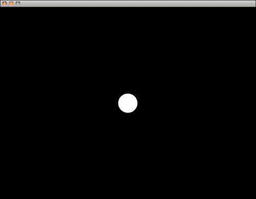
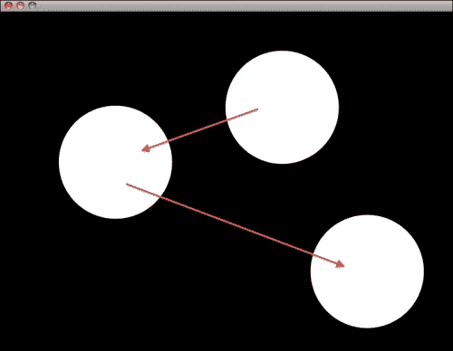
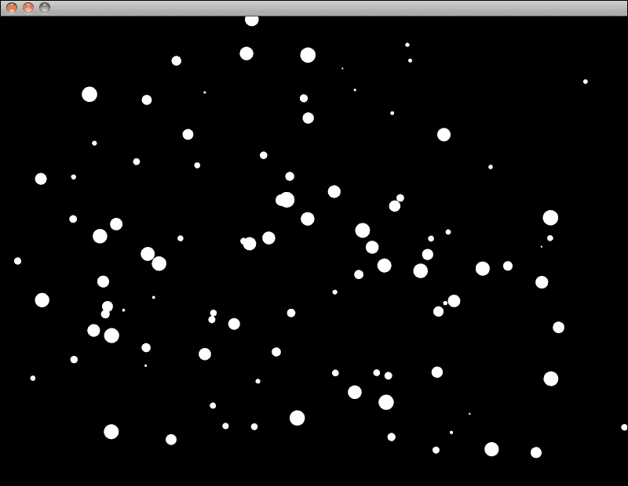
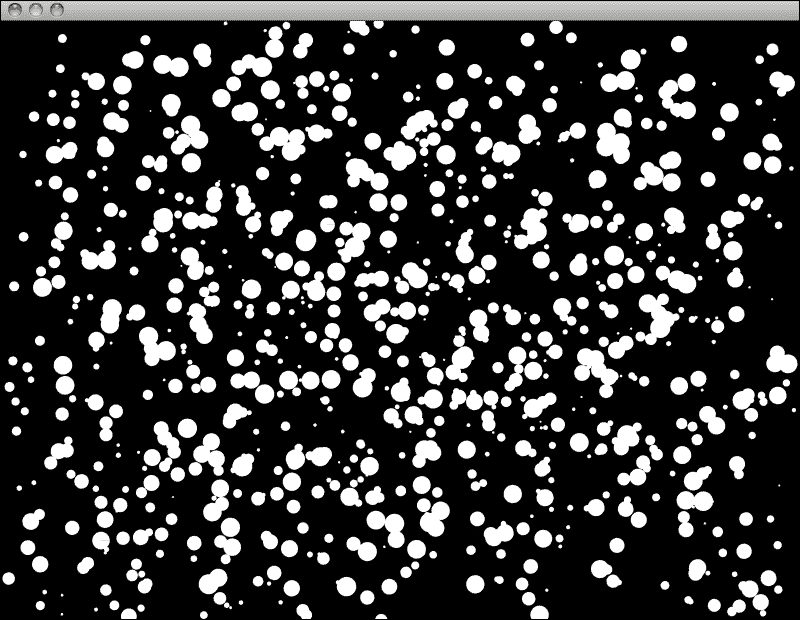

# 第六章. 加速 - 创建生成式动画

在本章中，我们将学习以下内容：

+   程序化动画的基础

+   同时动画多个对象

+   如何利用随机性

+   如何从内置动画缓动函数中受益

我们将通过使用基本形状创建一个相对简单的绘图，然后以参数方式对这些形状进行动画处理。我们还将学习如何利用 Cinder 的内置缓动函数，这可以使我们的动画润色变得更加容易。

# 准备舞台

在我们开始之前，打开 TinderBox 并创建一个名为`BasicAnimation`的新项目。打开`xcode/BasicAnimation.xcodeproj`（在 Windows 上为`vc10\BasicAnimation.sln`）。在编辑器中打开`BasicAnimationApp.cpp`，以便我们可以开始进行更改。

这次我们将更改窗口大小，因为 640 x 480 像素可能对于我们想要创建的大多数构图来说太小了。为了做到这一点，我们需要覆盖另一个 Cinder 的`AppBasic`方法——`prepareSettings()`。在`draw()`方法声明之后添加一个新的声明，如下所示：

```cs
class BasicAnimationApp : public AppBasic {
public:
  void setup();
  void update();
  void draw();
 void prepareSettings( Settings *settings );
};
```

现在在我们刚刚声明的`setup()`方法实现之前添加方法的实现：

```cs
void BasicAnimationApp::prepareSettings( Settings *settings ){}
```

让我们更改窗口大小。为此，在`prepareSettings`方法实现中添加以下代码行：

```cs
settings->setWindowSize( 800, 600 );
```

我们还将更改帧率，以更合适于 Cinder 的值——每秒 60 帧是一个不错的选择：

```cs
settings->setFrameRate( 60 );
```

因此，整体看起来如下所示：

```cs
void BasicAnimationApp::prepareSettings( Settings *settings ){
  settings->setWindowSize( 800, 600 );
  settings->setFrameRate( 60 );
}
```

现在编译并运行你的应用程序以测试它是否工作。

接下来我们将绘制一个实心圆。正如你可能从前面的章节中记得的那样，为了做到这一点，我们必须使用`drawSolidCircle()`函数。

在`BasicAnimationApp.cpp`文件中导航到`draw()`成员函数的实现，并在`gl::clear()`函数调用之后添加以下代码行：

```cs
gl::drawSolidCircle( getWindowCenter(), 30 );
```

这将在窗口中心绘制一个半径为 30 像素的白色圆圈。由于本章是关于动画的，让我们考虑一些移动这个圆圈的方法。



# 添加动画

如我们所知，在每一帧绘制任何东西之前，我们使用黑色清除前帧留下的所有内容。我们使用`gl::clear()`来做到这一点。为了创建移动某物的效果，我们需要在每一帧中改变对象的位置。

为了做到这一点，我们需要将`drawSolidCircle`位置参数的值替换为变量。让我们声明一个新的变量，它将保存圆在屏幕上的位置：

```cs
  void prepareSettings( Settings *settings );
 Vec2f currentPosition;
};
```

这个变量将保存我们在`draw()`方法中绘制的圆的`x`和`y`位置。

现在我们将在`setup()`方法中设置变量的初始值：

```cs
void BasicAnimationApp::setup() {
 currentPosition = getWindowCenter();
}
```

如你所见，前面代码片段的一部分与我们用于`drawSolidCircle()`函数调用的代码相同。我们只是让它变得可变。

最后，我们必须将`drawSolidCircle()`函数中的值替换为新创建的变量：

```cs
void BasicAnimationApp::draw() {
  gl::clear( Color( 0, 0, 0 ) );
  gl::drawSolidCircle( currentPosition, 30 );
}
```

再次编译并运行我们的应用程序。没有什么太大的变化。别担心，在`drawSolidCircle()`函数调用之前添加以下代码行：

```cs
currentPosition.x++;
```

再次编译并运行应用程序，那里就有了一个移动的圆。酷！我们有了第一个动画！现在让我们对圆的半径做些处理。要对其应用动画，我们必须再次声明一个新变量：

```cs
  void prepareSettings( Settings *settings );
  Vec2f currentPosition;
 float circleRadius;
};
```

现在，设置其起始值：

```cs
void BasicAnimationApp::setup() {
  currentPosition = getWindowCenter();
  circleRadius = 100;
}
```

然后在`draw()`方法实现中添加一个动画规则，并替换`drawSolidCircle()`函数调用中圆半径参数的常量值：

```cs
  currentPosition.x++;
  circleRadius--;
  gl::drawSolidCircle( currentPosition, circleRadius );
}
```

编译并运行我们的应用程序。你应该会看到眼前有一个大白色点消失。可能看起来你做错了什么，但别担心，一切正常。诀窍在于我们每帧减少一个像素的圆半径。这是以每秒 60 次的速率发生的，这意味着圆的半径将在大约 1.5 秒内达到`0`。因此，如果半径是`0`，圆就变得不可见，因为没有半径的圆是不存在的。

到目前为止，一切顺利。让我们尝试随着时间的推移将我们的圆移动到某个固定的位置。比如说，我们想从屏幕的左上角移动到底右角。要做到这一点，我们需要将圆的初始位置设置为`0`，并且让我们也将初始`circleRadius`改为更小的值：

```cs
void BasicAnimationApp::setup() {
  currentPosition = Vec2f(0,0);
  circleRadius = 100;
}
```

让我们在类声明中声明另一个`Vec2f`变量，该变量将保存圆的目标位置：

```cs
  Vec2f currentPosition;
 Vec2f targetPosition;
  float circleRadius;
};
```

我们需要将初始目标位置设置在某个地方，所以我们必须在`setup()`方法实现中添加一行新代码：

```cs
void BasicAnimationApp::setup() {
  currentPosition = Vec2f(0,0);
 targetPosition = Vec2f(800,600);
  circleRadius = 100;
}
```

最后，我们需要编写一些代码来在`currentPosition`和`targetPosition`之间创建平滑的过渡。让我们在`update()`方法实现中这样做，因为它适合这类计算。记住，尽量只使用`draw()`方法进行绘图，并将所有计算放在`update()`方法中。对于像这样的小型应用程序来说，这并不重要，但随着你的代码越来越大，如果不符合这个简单规则，应用程序可能表现不佳，甚至可能崩溃。

```cs
void BasicAnimationApp::update() {
  Vec2f difference = targetPosition - currentPosition;
  difference *= 0.95f;
  currentPosition = targetPosition - difference;
}
```

这三行代码计算当前圆位置和目标圆位置之间的差异。然后，我们通过乘以一个小于`0`的浮点数来减小这些位置之间的差异。最后，我们通过从圆的目标位置减去新的差异来计算新的当前位置。

如果我们没有利用 Cinder 的集成矢量代数功能，这将需要更长的代码。由于`Vec2f`对象包含两个值（x 和 y 坐标），当我们用一个单一值乘以它时，`Vec2f`对象内的两个值都会乘以这个值。此外，如果我们用一个`Vec2f`对象乘以另一个`Vec2f`对象，第一个向量的第一个元素与第二个向量的第一个元素相乘，第一个向量的第二个元素与第二个向量的第二个元素相乘，依此类推。

现在编译并运行我们的应用程序。您应该看到一个圆从屏幕的左上角移动到右下角。


# 添加随机性

让我们通过使用强大的随机函数来增加一些不可预测性。要在 Cinder 中使用它们，您必须包含一个包含必要代码的头文件：

```cs
#include "cinder/Rand.h"
```

在`BasicAnimationApp.cpp`文件的开始处添加此代码。接下来，我们需要在`setup()`方法实现中计算随机目标位置：

```cs
void BasicAnimationApp::setup() {
  currentPosition = Vec2f(0,0);
 targetPosition.x = Rand::randFloat(0, getWindowWidth());
 targetPosition.y = Rand::randFloat(0, getWindowHeight());
  circleRadius = 100;
}
```

现在每次运行应用程序时，都会计算一个新的结束位置，圆将飞到屏幕上的不同位置。

让我们将圆的当前位置也改为随机值：

```cs
void BasicAnimationApp::setup() {
 currentPosition.x = Rand::randFloat(0, getWindowWidth());
 currentPosition.y = Rand::randFloat(0, getWindowHeight());
  targetPosition.x = Rand::randFloat(0, getWindowWidth());
  targetPosition.y = Rand::randFloat(0, getWindowHeight());
  circleRadius = 100;
}
```

编译并运行应用程序以查看更改。

在打开应用程序后只看到一次随机动画可能有点无聊。人们通常期望更多。那么，当圆达到当前结束位置时，我们是否可以计算一个新的随机结束位置？好的，让我们这么做！在`update()`方法实现中，在`currentPosition = targetPosition - difference;`之后添加以下代码片段：

```cs
if ( currentPosition.distance(targetPosition) < 1.0f ) {
  targetPosition.x = Rand::randFloat(0, getWindowWidth());
  targetPosition.y = Rand::randFloat(0, getWindowHeight());
}
```

从`draw()`方法中注释掉或删除以下突出显示的行：

```cs
gl::clear( Color( 0, 0, 0 ) );
//currentPosition.x++;
//circleRadius--;
gl::drawSolidCircle( currentPosition, circleRadius );
```

编译并运行我们的应用程序。这有点更有趣，但仍然需要更多才能完整。



我们是否可以尝试在屏幕上处理多个圆？解释如何创建一个作为单独类的粒子系统是值得的，但这超出了本书的范围，所以我们将在同一文件中继续进行一些更改。

# 更多圆圈

让我们定义应用程序要处理的圆圈数量。在`#include`语句之后添加以下代码行：

```cs
#define CIRCLE_COUNT 100
```

现在，让我们转到类声明部分，并将我们变量的声明更改为数组：

```cs
Vec2f currentPosition[CIRCLE_COUNT];
Vec2f targetPosition[CIRCLE_COUNT];
float circleRadius[CIRCLE_COUNT];
```

如您所见，我们使用了之前定义的常量作为我们数组的大小。通过这样做，我们可以轻松地稍后更改圆的数量。

接下来，我们不得不在`setup()`方法实现中更改一些代码：

```cs
void BasicAnimationApp::setup() {
  for(int i=0; i<CIRCLE_COUNT; i++) {
    currentPosition[i].x=Rand::randFloat(0,getWindowWidth());
    currentPosition[i].y=Rand::randFloat(0,getWindowHeight());
    targetPosition[i].x=Rand::randFloat(0,getWindowWidth());
    targetPosition[i].y=Rand::randFloat(0,getWindowHeight());
    circleRadius[i] = Rand::randFloat(1, 10);
  }
}
```

基本上，我们将之前拥有的相同代码封装在一个`for`循环中，该循环遍历所有参数数组并为它们中的每一个设置初始值。

还不要编译，因为我们仍然需要以类似的方式更改`update()`和`draw()`方法。按照以下方式更改我们的`update()`方法：

```cs
void BasicAnimationApp::update() {
  Vec2f difference;
  for (int i=0; i<CIRCLE_COUNT; i++) {
    difference = targetPosition[i] - currentPosition[i];
    difference *= 0.95f;
    currentPosition[i] = targetPosition[i] - difference;

    if (currentPosition[i].distance(targetPosition[i]) < 1.0f) {
      targetPosition[i].x =
      Rand::randFloat(0,getWindowWidth());
      targetPosition[i].y =
      Rand::randFloat(0,getWindowHeight());
    }
  }
}
```

最后，按照以下方式更改我们的`draw()`方法实现：

```cs
void BasicAnimationApp::draw() {
  gl::clear( Color( 0, 0, 0 ) );
  for (int i=0; i<CIRCLE_COUNT; i++) {
    gl::drawSolidCircle( currentPosition[i], circleRadius[i] );
  }
}
```

现在编译并运行我们的应用程序。这看起来更有趣了！



似乎 100 个圆圈还不够，那么我们是否可以将`CIRCLE_COUNT`常量设置为`1000`？

```cs
#define CIRCLE_COUNT 1000
```

没问题！

但如果我们不想关注数量，而是关注运动的质量呢？这就是动画缓动加入游戏的地方。

# 使用内置缓动

现在，假设我们想利用我们在`EaseGallery`示例中看到的缓动算法。为此，我们必须按照某些步骤更改代码。

要使用缓动函数，我们必须包含`Easing.h`头文件：

```cs
#include "cinder/Easing.h"
```

首先，我们将添加两个额外的变量，`startPostition`和`circleTimeBase`：

```cs
Vec2f startPosition[CIRCLE_COUNT];
Vec2f currentPosition[CIRCLE_COUNT];
Vec2f targetPosition[CIRCLE_COUNT];
float circleRadius[CIRCLE_COUNT];
float circleTimeBase[CIRCLE_COUNT];

```

然后，在`setup()`方法实现中，我们必须将`currentPosition`部分更改为`startPosition`，并给`circleTimeBase`数组成员添加一个初始值：

```cs
startPosition[i].x = Rand::randFloat(0, getWindowWidth());
startPosition[i].y = Rand::randFloat(0, getWindowHeight());
circleTimeBase[i] = 0;
```

接下来，我们必须更改`update()`方法，使其可以与缓动函数一起使用。它们基于时间，并返回一个介于`0`和`1`之间的浮点值，该值定义了抽象的`0`到`1`时间轴上的`playhead`位置：

```cs
void BasicAnimationApp::update() {
  Vec2f difference;
  for (int i=0; i<CIRCLE_COUNT; i++) {
 difference = targetPosition[i] - startPosition[i];
 currentPosition[i] = easeOutExpo(
 getElapsedSeconds()-circleTimeBase[i]) *
 difference + startPosition[i];

    if ( currentPosition[i].distance(targetPosition[i])
    < 1.0f )
    {
      targetPosition[i].x =
      Rand::randFloat(0, getWindowWidth());
      targetPosition[i].y =
      Rand::randFloat(0, getWindowHeight());
 startPosition[i] = currentPosition[i];
 circleTimeBase[i] = getElapsedSeconds();
    }
  }
}
```

上一段代码中突出显示的部分是已经更改的部分。其中最重要的部分是`currentPosition[i]`计算部分。我们取时间轴起点和终点之间的距离，并将其与我们的缓动函数返回的位置浮点数相乘，在这个例子中是`easeOutExpo()`。再次，它返回一个介于`0`和`1`之间的浮点变量，表示在抽象的`0`到`1`时间轴上的位置。如果我们用任何数字乘以，比如说`0.33f`，我们得到该数字的三分之一，`0.5f`，我们得到该数字的一半，以此类推。因此，我们将这个距离加到圆的起始位置，我们就得到了它的当前位置！

现在编译并运行我们的应用程序。你应该看到以下内容：



几乎就像暴风雪一样！不过，我们将在代码中添加一个小修改。我将在代码顶部添加一个`TWEEN_SPEED`定义，并将传递给缓动函数的`time`参数与之相乘，这样我们就可以控制圆的速度：

```cs
#define TWEEN_SPEED 0.2
```

在`update()`方法实现中更改以下行：

```cs
currentPosition[i] = easeOutExpo(
 (getElapsedSeconds()-circleTimeBase[i])*TWEEN_SPEED) *
  difference + startPosition[i];
```

我这样做是因为每个缓动的默认时间基是 1 秒。这意味着每个过渡正好持续 1 秒，这对于我们当前的情况来说有点快。我们希望它更慢，所以我们将传递给缓动函数的时间与一个小于`1.0f`且大于`0.0f`的浮点数相乘。通过这样做，我们确保时间被缩放，而不是 1 秒，我们的过渡时间变成了 5 秒。

因此，尝试编译并运行它，看看结果如何！以下是我们的圆创建源代码的完整代码：

```cs
#include "cinder/app/AppBasic.h"
#include "cinder/gl/gl.h"
#include "cinder/Rand.h"
#include "cinder/Easing.h"

#define CIRCLE_COUNT 100
#define TWEEN_SPEED 0.2

using namespace ci;
using namespace ci::app;
using namespace std;

class BasicAnimationApp : public AppBasic {
  public:
  void setup();
  void update();
  void draw();

  void prepareSettings( Settings *settings );
  Vec2f startPosition[CIRCLE_COUNT];
  Vec2f currentPosition[CIRCLE_COUNT];
  Vec2f targetPosition[CIRCLE_COUNT];
  float circleRadius[CIRCLE_COUNT];
  float circleTimeBase[CIRCLE_COUNT];
};

void BasicAnimationApp::prepareSettings( Settings *settings ) {
  settings->setWindowSize(800,600);
  settings->setFrameRate(60);
}

void BasicAnimationApp::setup() {
  for(int i=0; i<CIRCLE_COUNT; i++) {
    currentPosition[i].x=Rand::randFloat(0, getWindowWidth());
    currentPosition[i].y=Rand::randFloat(0, getWindowHeight());
    targetPosition[i].x=Rand::randFloat(0, getWindowWidth());
    targetPosition[i].y=Rand::randFloat(0, getWindowHeight());
    circleRadius[i] = Rand::randFloat(1, 10);
    startPosition[i].x = Rand::randFloat(0, getWindowWidth());
    startPosition[i].y = Rand::randFloat(0, getWindowHeight());
    circleTimeBase[i] = 0;
  }
}

void BasicAnimationApp::update() {
  Vec2f difference;
  for (int i=0; i<CIRCLE_COUNT; i++) {
    difference = targetPosition[i] - startPosition[i];
    currentPosition[i] = easeOutExpo(
      (getElapsedSeconds()-circleTimeBase[i]) *
      TWEEN_SPEED) *
      difference + startPosition[i];

      if ( currentPosition[i].distance(
      targetPosition[i]) < 1.0f )
    {
      targetPosition[i].x =
      Rand::randFloat(0, getWindowWidth());
      targetPosition[i].y =
      Rand::randFloat(0, getWindowHeight());
      startPosition[i] = currentPosition[i];
      circleTimeBase[i] = getElapsedSeconds();
    }
  }
}

void BasicAnimationApp::draw() {
  gl::clear( Color( 0, 0, 0 ) );
  for (int i=0; i<CIRCLE_COUNT; i++) {
    gl::drawSolidCircle( currentPosition[i], circleRadius[i] );
  }
}

CINDER_APP_BASIC( BasicAnimationApp, RendererGl )
```

尝试调整属性并尝试更改缓动效果。并非所有这些效果都适用于此示例，但至少你会了解如何使用 Cinder 创建平滑的动画。

# 摘要

在本章中，我们创建了我们的第一个生成动画应用程序。我们学习了如何使用实例变量来创建平滑的运动，以及使用随机函数在可预测的范围内生成不可预测的结果。我们还使用了静态数组来改变模拟中圆的数量，并利用了 Cinder 缓动函数，这些函数在创建类似 Flash 的应用程序时非常有用（如果你有一些 Flash 编码背景，你可能知道 TweenLite 缓动库）。

最后，我们使用相对大量的对象测试了应用程序。这部分应该向你证明 Cinder 的真正实力，因为你可能知道，使用基于非 C++ 平台的框架创建类似的应用程序并不像这个一样流畅。

在下一章中，我们将讨论使用 Cinder 进行实时后处理以及应用图像和视频效果的基本方法。
