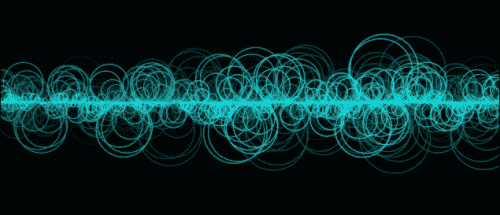

# 第九章。进入声音 - 添加声音和音频

在本章中，我们将简要讨论创意编程中的声音概念。

在本章中，我们将学习以下内容：

+   如何在 Cinder 中加载和播放声音

+   如何实时修改声音

+   如何使用音频数据来绘制和动画

+   如何利用实时声音输入

# 加载和播放声音文件

在创意编程中，使用声音有几种方式。一种方式是使用音频样本，另一种方式是使用实时输入，然后还有从头生成声音的可能性。然而，当你开始组合所有这些方法时，会出现更多可能性。

在本章中，我们将学习如何加载、播放和可视化音频文件以及捕获实时输入。要开始，打开 TinderBox 并创建一个名为`BasicAudio`的新项目。打开编辑器中的`xcode/BasicAudio.xcodeproj`（在 Windows 上是`vc10\BasicAudio.sln`）。在编辑器中打开`BasicAudioApp.cpp`。

为了使用 Cinder 的基本音频功能，我们必须导入适当的库：

```cs
#include "cinder/audio/Output.h"
```

这个特定的例子包含了加载和回放音频文件所需的所有代码。去找你自己的音频文件（`mp3`或`wav`都行），并将其放置在项目的`assets`文件夹中。

我们需要一个`audio::SourceRef`对象来存储我们将要在代码中使用的音频源的引用。将以下行添加到你的类声明中：

```cs
audio::SourceRef src;
```

将以下代码片段添加到`setup()`方法实现中：

```cs
src = audio::load(loadAsset("sample.wav"));
audio::Output::play(src);
```

这将把音频文件加载到计算机内存中作为`audio::Source`对象，并将引用保存在`src`变量中。然后，我们可以通过使用`audio::Output::play()`类方法来播放声音。

编译并运行我们的应用程序。你应该能听到声音。以这种方式回放声音有一些限制。无法以任何其他方式（除了设置和获取音量）应用循环控制。

# 使用轨道

Cinder 的`Track`类提供了对声音文件更多的控制。让我们回顾一下`Track`类的一些我们可能最常使用的功能。

要循环播放加载的音频文件，我们需要向`Output`对象添加一个`Track`对象，并保存返回的轨道引用，以便我们可以用它来控制声音。在类声明中添加一个用于存储轨道引用的变量：

```cs
audio::TrackRef trackRef;
```

将`setup()`方法实现中的代码替换为以下内容：

```cs
src = audio::load(loadAsset("sample.wav"));
trackRef = audio::Output::addTrack(src);
```

目前，这基本上与之前相同，只是它将`audio::Source`指针作为单独的轨道存储在`audio::Output`对象中。`addTrack()`函数还有一个参数，`autoplay`，如果我们不提供其他值，它将自动设置为`true`。让我们尝试将其设置为`false`：

```cs
trackRef = audio::Output::addTrack(src, false);
```

由于我们将`autoplay`参数设置为`false`，音频文件在加载后不会播放。如果我们想在应用程序流程的某个其他点播放音频文件，可以使用以下代码：

```cs
trackRef->play();
```

我们在这里使用箭头语法，因为音轨引用只是指向实际`Track`对象的 C++指针。所有其他音轨属性都以相同的方式访问。

我们可以通过创建一个新的音频源对象并将其添加到`audio::Output`指针中，向`Output`对象添加多个音轨。我们现在不会这样做，但请记住，如果我们想创建某种多层级音频应用程序，这是可能的。

# 更改音轨参数

接下来我们想要做的是在音频文件播放完毕后再次播放。这可以通过将音轨的循环设置为`true`来实现：

```cs
trackRef->setLooping(true);
```

这将使音轨循环无限。

我们可能还想做的一件事是更改跟踪音量。你可以把`Output`音量看作是主音量，而`Track`音量则看作是混音器中各个音轨的独立音量。

要更改音量，请使用以下代码：

```cs
trackRef->setVolume(0.5f); // set track volume
audio::Output::setVolume(0.5f); // set master volume
```

我们可以使用变量动态地更改声音的音量。让我们为主音量和音轨音量都这样做。

将以下行添加到应用程序的类声明中：

```cs
float masterVol, trackVol;
void mouseMove(MouseEvent event);
```

使用这些代码行，我们声明了两个浮点数，用于存储主音量和跟踪音量，以及`AppBasic`类的`mouseMove`方法重写，这将使我们能够响应鼠标移动。

让我们转到`setup()`方法实现，初始化`masterVol`和`trackVol`变量，此外更改`trackRef->setVolume()`和`audio::Output::setVolume()`的原始值：

```cs
void BasicAudioApp::setup() {
 masterVol = trackVol = 0.5f;
  src = audio::load(loadAsset("sample.wav"));
  trackRef = audio::Output::addTrack(src, false);
  trackRef->setLooping(true);
  trackRef->setVolume(trackVol); // set track volume
  audio::Output::setVolume(masterVol); // set master volume
  trackRef->play();
}
```

在文件末尾，在`CINDER_APP_BASIC()`调用之前添加`mouseMove`方法的实现：

```cs
void BasicAudioApp::mouseMove(MouseEvent event) {
    masterVol = (float)event.getX()/getWindowWidth();
    trackVol = (float)event.getY()/getWindowHeight();
    audio::Output::setVolume(masterVol);
    trackRef->setVolume(trackVol);
}
```

一个类型为`MouseEvent`的事件对象传递给此方法。我们可以获取事件发生时鼠标光标的当前位置以及事件对象持有的许多其他参数。我们现在将坚持使用鼠标`x`和`y`坐标，并使用它们来更改音量。

对于更改主音量，我们使用`x`坐标。我们使用`y`坐标来更改音轨音量。

由于 Cinder 中的音量定义在`0.0f`到`1.0f`的范围内，我们需要将鼠标位置转换为这种形式。为此，我们需要将实际鼠标位置除以其最大范围，即窗口的宽度和高度。因此，如果鼠标`x`位置是`0`且窗口宽度是`100`，在将坐标除以窗口宽度（0/100）后，我们得到`0`。如果鼠标`x`位置是`100`，我们得到`1`。另外，如果鼠标`x`位置是`50`，我们得到`0.5`（50/100）。

由于鼠标位置和窗口尺寸以`int`值返回，我们需要将其中一个值转换为`float`以进行成功的浮点数运算。这就是为什么在代码的`event.getX()/getWindowWidth()`和`event.getY()/getWindowHeight()`部分前面有`(float)`，它将`event.getX()`返回的`int`值转换为`float`。最后，我们使用`audio::Output::setVolume(masterVol);`和`trackRef->setVolume(trackVol);`设置主音量和轨道音量。

编译并运行我们的应用程序。移动鼠标，你应该能听到声音的音量是如何变化的。

接下来，我们可能想要学习的一个有用功能是跳转到轨道的某个特定位置。为此，我们将使用`AppBasic`类的`mouseDrag`方法。让我们通过在类声明中添加以下行来声明它的重写：

```cs
void mouseDrag(MouseEvent event);
```

让我们实现它。在文件的末尾，在`CINDER_APP_BASIC()`调用之前添加以下代码：

```cs
void BasicAudioApp::mouseDrag(MouseEvent event) {
    double time =
    (double)event.getX()/getWindowWidth()*src->getDuration();
    trackRef->setTime( time );
}
```

在这个例子中，应用程序窗口的宽度被映射到轨道的持续时间。鼠标的`x`位置被转换成音频轨道中的特定时间。代码中的`trackRef->setTime(time)`部分设置了轨道播放头的位置。

编译并运行我们的应用程序。你现在应该能够进行实时搜索了。点击并拖动来尝试一下。

# 可视化音频

在我们的创意声音应用程序中，缺少一个重要的东西——它的视觉方面。让我们创建一个简单的均衡器。

首先，我们需要启用音频轨道的 PCM 缓冲。

**PCM**代表**脉冲编码调制**，它是一种数字表示采样模拟信号的方法。模拟音频信号是导体内部电压的波动。它的数字表示是样本或字节，通常具有从`-1`到`1`的浮点值。

在音频采样世界中，有一个术语，采样率，它表示每秒被采样的样本或值的数量。音频文件的 PCM 值和采样率决定了其播放速度。

要启用 PCM 缓冲并在应用程序运行时读取 PCM 值，请在`setup()`方法声明中`trackRef->play()`之前添加以下代码：

```cs
trackRef->enablePcmBuffering( true );
```

第二，我们需要一个变量，它将作为轨道 PCM 缓冲区的指针。

PCM 缓冲区是计算机内存中的一个秘密地方，其中存储着从我们的扬声器输出的原始声音波形的值。在任何声音发送到音频输出之前，它被保存在缓冲区中一段时间。当播放声音时，缓冲区被清除并再次用新的音频数据填充。

我们需要访问 PCM 缓冲区以从中读取原始波形值。将以下行添加到类声明中，以添加一个作为其引用的变量：

```cs
audio::PcmBuffer32fRef pcmBuffer;
```

第三，我们需要在每个帧中获取最新缓冲区的副本。将以下代码添加到`update()`方法实现中：

```cs
pcmBuffer = trackRef->getPcmBuffer();
```

最后，将 `draw()` 方法实现修改如下：

```cs
void BasicAudioApp::draw() {
  // clear the screen by drawing
  // a semi-transparent black rectangle all over the screen
  gl::enableAlphaBlending();
  gl::color( 0.f, 0.f, 0.f, 0.1f );
  gl::drawSolidRect(getWindowBounds());

  if( !pcmBuffer ) {
    gl::disableAlphaBlending();
    return; // stop here if the buffer is empty
  }

  // get copy of the left channel data from the pcmBuffer
  audio::Buffer32fRef buffer =
  pcmBuffer->getChannelData( audio::CHANNEL_FRONT_LEFT );

  // get buffer length
  uint32_t bufferLength = pcmBuffer->getSampleCount();

  // calculate scale for mapping the buffer data on the screen
  float scale = getWindowWidth() / (float)bufferLength;
  // set color to cyan
  gl::color( 0.f, 1.f ,1.f ,0.8f );

  // loop through current buffer data
  // in steps of 10 and construct waveform
  for( int i=0; i<bufferLength; i+=10 ) {
    // map current x position of buffer value to window width
    float x = i * scale;

    // buffer data fluctuates from -1 to +1,
    // map it to window height
    float y = ( (buffer->mData[i]+1) * getWindowHeight()/2 );

    // draw a circle
    gl::drawStrokedCircle( Vec2f(x, y),
    ( abs(buffer->mData[i])*getWindowHeight()/2 ) );
  }

  gl::disableAlphaBlending();
}
```

编译并运行我们的应用程序，你应该会看到一个如图所示的图像：



# 使用音频输入

使用麦克风或线路输入作为音频源怎么样？没问题。为了实现这一点，我们需要导入音频 `Input` 库：

```cs
#include "cinder/audio/Input.h"
```

我们将扩展我们的当前应用程序，以便可以在实时输入和加载的文件播放之间切换。为此，我们需要声明两个新变量：

```cs
audio::Input input;
bool useInput;
```

第一个变量代表我们的声音输入，我们将使用第二个作为开关。

接下来，我们必须初始化 `input` 变量，因此前往 `setup()` 方法实现并添加以下行：

```cs
input = audio::Input();
```

这将默认音频输入分配给 `input` 变量。

让我们使用 `mouseDown` 方法重写并填充以下代码：

```cs
useInput = !useInput;

if ( useInput ) {
    input.start();
    trackRef->stop();
} else {
    input.stop();
    trackRef->play();
}
```

这几行代码处理实时和加载输入之间的切换。每次鼠标点击时，`useInput` 变量从 `false` 切换到 `true` 或相反。根据我们得到的值，我们启用实时或加载输入。

最后，将 `update()` 方法实现中的代码替换如下：

```cs
if ( useInput ) pcmBuffer = input.getPcmBuffer();
else pcmBuffer = trackRef->getPcmBuffer();
```

这几行代码获取当前的 PCM 缓冲区。如果 `useInput` 变量设置为 `true`，我们使用实时输入的 PCM 缓冲区，如果不是，我们使用加载轨道的 PCM 缓冲区。

编译并运行应用程序。点击窗口以启用实时输入。再次点击以返回到加载的声音。

# 概述

在本章中，我们学习了 Cinder 中音频的基础知识。我们学习了如何加载和播放音频文件，如何更改其音量，以及如何搜索和可视化 PCM 缓冲区。我们还学习了如何使用实时输入音频数据。

基于这些知识，现在我们能够创建音频反应式应用程序，能够实时分析几乎任何类型的音频并提供高性能的视觉反馈。音频分析是一个广泛的话题，你可能想进一步研究。例如，尝试搜索“FFT”、“分频分析”或“节拍跟踪”。如果你对 Cinder 提供的音频处理功能不满意，也可以使用某种第三方音频处理库。
