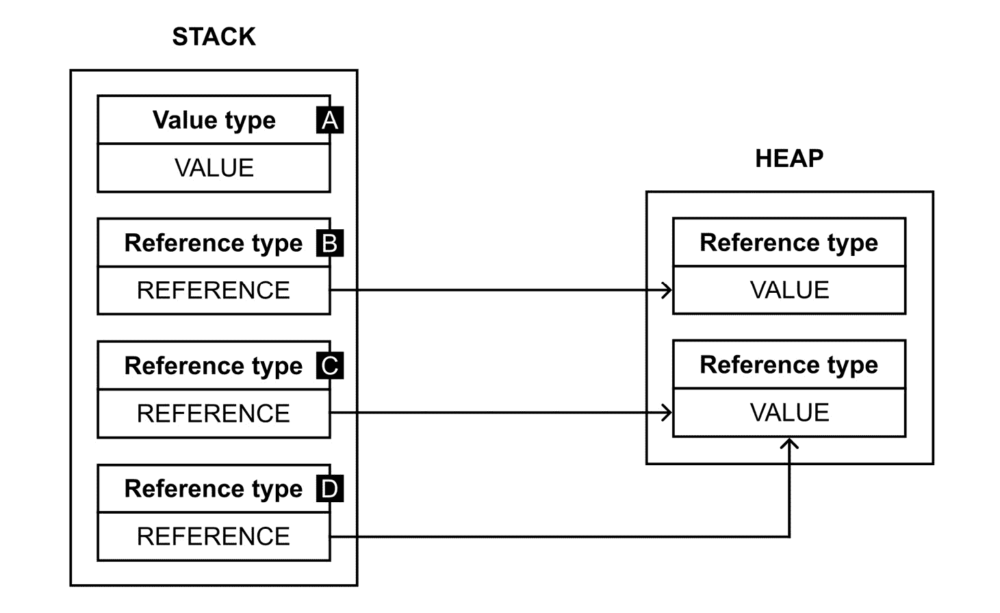

# 第一章：数据类型

欢迎来到第一章，在这里你将开始一段令人惊叹的旅程，学习在**C#编程语言**背景下数据结构和算法。首先，我们将对这个语言进行简要介绍。你将了解到它的可能性有多么广泛，你可以在多少场景下应用这种语言，以及你可以使用的一些基本构造。这不是一个 C#课程，因此我们不会逐一介绍其各种特性，而只会提供简要的描述。

本章的剩余部分将致力于**数据类型**，包括内置和用户定义的数据类型，你可以在你的应用程序中使用。首先，你将了解值类型和引用类型之间的区别。然后，你将了解各种可用的数据类型，从值类型开始。在这里，我们将涵盖整数数值类型、浮点数值类型、布尔类型、Unicode 字符、常量、枚举、值元组、结构类型和可空值类型。最后，我们将涵盖引用类型，包括对象和字符串类型，以及类、记录、接口和委托，以及动态和可空引用类型。

如你所见，你面前还有很长的路要走。然而，如果你能很好地掌握基础知识，那么你将更容易从本书剩余部分的内容中获得最大收益。作为作者，我在为你祈祷——祝你好运！

在本章中，我们将涵盖以下主题：

+   作为一种编程语言，C#

+   基于.NET 的控制台应用程序

+   值类型和引用类型之间的数据类型划分

+   值类型

+   引用类型

# 作为一种编程语言，C#

作为一名开发者，你可能已经听说过许多编程语言，包括**C#**、**Java**、**C++**、**C**、**PHP**和**Ruby**。在所有这些语言中，你都可以使用各种数据结构，并实现算法来解决基本和复杂的问题。然而，每种语言在实现数据结构和相应的算法时都有其独特性。如前所述，这本书只关注 C#编程语言。这也是本节的主要内容。

C#语言，发音为*C sharp*，是一种**现代、通用、强类型和面向对象的编程语言，可用于开发各种应用程序**，例如 Web、移动、桌面、分布式和嵌入式解决方案，甚至游戏！它与各种附加技术和平台协同工作，包括**ASP.NET Core**、**XAML**和**Unity**。因此，当你学习 C#语言，并在此编程语言的背景下了解更多关于数据结构和算法的知识时，你可以使用这些技能来创建多种类型的软件。更重要的是，即使你决定将你的主要编程语言更改为另一种，你对数据结构和算法的知识仍然有用。你可能想知道，*这是如何可能的？* 答案出乎意料地简单——你将理解各种数据结构是如何工作的，如何实现它们，以及如何将它们应用于使用专用算法解决各种问题。但让我们回到 C#语言。

当前语言的版本是**C# 12**。值得提及的是，它在各种语言版本（包括 2.0、3.0、5.0 和 8.0）中的有趣历史，在这些版本中，新功能被添加以增加语言的可能性。当你查看特定版本的发布说明时，你会看到语言是如何随着时间的推移而不断改进和扩展，成为一个强大且方便的解决方案，供开发者使用。新功能非常出色，可以显著简化你的工作，并允许你重构代码，使其更短，同时更容易理解和维护。这是 C#开发团队所做的一项出色工作，你现在可以在编写代码时从中受益。

C#编程语言的语法与其他语言类似，例如 Java 或 C++。因此，如果你了解这些语言，你应该能够轻松理解用 C#编写的代码。例如，与之前提到的语言类似，代码由以分号（`;`）结尾的语句组成。花括号，即`{`和`}`，用于分组语句。

有几种语句类别，包括以下内容：

+   `if`和`switch`。`if`语句允许你根据提供的条件有条件地执行代码。`switch`语句使得使用**模式匹配**选择要执行的语句列表成为可能。

+   `do-while`、`while`、`for`和`foreach`。它们与**循环**相关，用于在满足条件时多次执行代码的一部分。

+   `break`、`continue`和`goto`。它们用于控制循环的执行，例如用于中断循环或移动到下一个迭代。

+   `throw`、`try-catch`、`try-finally`和`try-catch-finally`。它们与处理代码中可能抛出的异常有关。

还存在其他语句，例如`lock`、`yield`、`checked`、`unchecked`和`fixed`。你将在本书后续章节中展示的代码片段中看到前述列表中的某些语句，以及相应的解释。

C#语言的许多附加优秀功能也简化了各种应用程序的开发，例如**语言集成查询**（**LINQ**），它允许开发者从各种来源获取数据，包括 SQL 数据库和 XML 文档，并且可以一致地操作。还有一些方法可以缩短所需的代码，例如使用 Lambda 表达式、模式匹配、属性、表达式成员体、记录和字符串插值。自动**垃圾回收**也值得提及，它极大地简化了释放内存的任务。

哪里可以找到更多信息？

你可以在[`learn.microsoft.com/en-us/dotnet/csharp/whats-new/csharp-12`](https://learn.microsoft.com/en-us/dotnet/csharp/whats-new/csharp-12)上了解更多关于 C#语言最新版本的信息。语言的历史可以在[`learn.microsoft.com/en-us/dotnet/csharp/whats-new/csharp-version-history`](https://learn.microsoft.com/en-us/dotnet/csharp/whats-new/csharp-version-history)中查看。一套关于语言参考（包括值类型和引用类型）的详细信息可以在[`learn.microsoft.com/en-us/dotnet/csharp/language-reference`](https://learn.microsoft.com/en-us/dotnet/csharp/language-reference)中找到。你可以在那里找到有关可用数据类型的信息，包括支持的值范围和精度，这些信息将在本章后面部分展示。

当然，之前提到的解决方案只是 C#开发中可用功能的一个非常有限的子集。你将在本书的后续部分看到一些其他功能，包括示例和详细描述。

# 基于.NET 的控制台应用程序

为了保持简单，在阅读这本书的过程中，你将创建许多基于控制台的应用程序，但数据结构和算法也可以用于其他类型的解决方案。基于控制台的应用程序将在**Microsoft Visual Studio 2022 Community**中创建。这个**集成开发环境**（**IDE**）是开发各种项目的综合解决方案，并配备了简化应用程序开发和测试的许多优秀功能。

在启动 IDE 之后，我们可以通过创建一个新的项目来继续操作。要创建一个项目，请按照以下步骤进行：

1.  在主菜单中点击**文件** | **新建** | **项目**。

1.  在**创建新项目**窗口的右侧选择**控制台应用程序**。

1.  输入项目的名称（**项目名称**），选择文件的位置（**位置**），并输入解决方案的名称（**解决方案名称**）。然后，按**下一步**。

1.  在**附加信息**窗口中，将框架版本设置为**.NET 8.0（长期支持**）并确保**不使用顶层语句**选项未被勾选。如果你准备好了，点击**创建**按钮来自动创建项目和生成必要的文件。

恭喜！你刚刚创建了第一个项目。但里面有什么？

让我们来看看**解决方案资源管理器**窗口，它展示了项目的结构。值得一提的是，项目以相同的名称包含在解决方案中。当然，一个解决方案可以包含多个项目，这在开发更复杂的应用程序时是一个常见的场景。如果你浏览这本书的 GitHub 仓库，你可以看到它包含一个包含 40 多个项目的解决方案。

没有解决方案资源管理器？

如果你找不到**解决方案资源管理器**窗口，你可以通过从主菜单中选择**视图** | **解决方案资源管理器**选项来打开它。同样，你也可以打开其他窗口，例如**输出**或**类视图**。如果你在**视图**选项中找不到合适的窗口（例如，**C#交互式窗口**），你可以在**视图** | **其他** **窗口**节点中找到它。

自动生成的项目包含**依赖项**元素，它展示了项目使用的额外依赖项。值得注意的是，你可以通过从**依赖项**元素的上下文菜单中选择**添加项目引用**、**添加共享项目引用**或**添加 COM 引用**选项来轻松添加引用。此外，你可以使用**NuGet 包管理器**安装额外的包，这可以通过从**依赖项**上下文菜单中选择**管理 NuGet 包**来启动。

是从头开始编写还是重用现有包？

在自己编写复杂的模块之前查看已经可用的包是个好主意，因为可能已经有一个合适的包可供开发者使用。在这种情况下，你不仅可以缩短开发时间，还可以减少引入错误的机会。然而，请检查许可证条件并确保外部模块是可靠的。

`Program.cs`文件包含 C#中的主代码。你可以通过更改以下默认实现来调整应用程序的行为：

```cs
// See https://aka.ms/new-console-template
   for more information
Console.WriteLine("Hello, World!");
```

此文件的初始内容只有两行。第一行是注释，而另一行在程序启动时会在控制台写入以下文本：

```cs
Hello, World!
```

它看起来如此简单且易于修改，不是吗？这是真的，并且由于`Program`类及其`Main`静态方法（其中放置了简单程序的逻辑）的功能，这个文件的默认实现在过去几年中已经发生了显著变化。

那么，如果你禁用了顶层语句，默认代码会是什么样子呢？让我们来看看：

```cs
namespace GettingStarted
{
    internal class Program
    {
        static void Main(string[] args)
        {
            Console.WriteLine("Hello, World!");
        }
    }
}
```

上述代码包含`GettingStarted`命名空间内`Program`类的定义。这个类包含一个`Main`静态方法，当应用程序启动时会自动调用。

在继续之前，让我们看看文件资源管理器中项目的结构，而不是在**解决方案资源管理器**窗口中。这些结构是否相同？

如何打开项目目录

你可以通过在**解决方案资源管理器**窗口的项目节点上下文菜单中选择**在文件资源管理器中打开文件夹**选项，在文件资源管理器中打开包含项目的目录。

首先，你可以看到自动生成的`bin`和`obj`目录。这两个目录都包含`Debug`和`Release`目录，其名称与在 IDE 中设置的配置相关。在构建项目后，`bin`目录的子目录（即`Debug`或`Release`）包含带有`.exe`、`.dll`和`.pdb`文件的`net8.0`目录。更重要的是，没有`Dependencies`目录，但有一个`.csproj`文件，其中包含基于 XML 的项目配置。同样，基于解决方案的`.sln`配置文件位于解决方案目录中。

使用 Git 忽略某些文件和目录

如果你正在使用`bin`和`obj`目录，以及`.csproj.user`文件，我强烈建议你为各种项目使用版本控制系统，并频繁地**提交和推送更改**。如果你能的话，你也可以尝试自动化测试和部署的过程，例如通过引入**持续集成**和**持续交付**（**CI/CD**）。引入这样的流程可以对您优秀应用程序的质量和稳定性产生非常积极的影响，无论它们的类型如何。

如你所知，我们将在本书中涵盖的示例创建项目，让我们专注于可用的数据类型及其基本划分，以及编写一些代码！

# 数据类型的划分

在用 C#语言开发应用程序时，你可以使用各种数据类型，这些数据类型分为两大类，即**值类型**和**引用类型**。它们之间的区别相当简单——**值类型的变量直接包含数据，而引用类型的变量仅存储对数据的引用，该数据位于** **其他地方**。

下面是一个示例：



图 1.1 – 值类型和引用类型之间的区别

如你所见，**值类型的变量**（显示为**A**）直接在**栈**内存中存储其**实际值**，而**引用类型的变量**在这里只存储一个**引用**。实际值位于**堆**内存中。因此，可以有两个或更多引用类型的变量引用相同的值，如前图中**C**和**D**框所示。

小心——这是一个简化！

请记住，这仅仅是一种简化，因为值类型并不总是存储在栈上。在某些情况下，它们会被存储在堆上。如果你对这个主题感兴趣，你可以在[`tooslowexception.com/heap-vs-stack-value-type-vs-reference-type/`](https://tooslowexception.com/heap-vs-stack-value-type-vs-reference-type/)上阅读更多关于它的内容。

当然，在编程时区分值类型和引用类型的差异很重要，你应该知道哪些类型属于之前提到的组。否则，你可能会在代码中犯一些相当难以发现的错误。

例如，当你使用 `==` 比较两个对象时应该小心，因为**值类型的两个变量如果数据相等，则它们是相等的，而引用类型的两个变量如果它们引用了** **同一位置**，则它们是相等的**。

你在将引用类型的变量赋值给另一个变量，或者将引用类型的变量作为参数传递给方法并更新其数据时也应该小心。这是因为更改可能会反映在其他引用同一对象的变量中。相比之下，在使用值类型时，变量值在作为参数传递给方法、从方法返回结果或将其赋值给另一个变量时会被复制，所以你只修改一个位置的数据。

值类型和引用类型之间的区别对你来说是否清晰？如果是的话，让我们继续到下一节，在那里将更详细地描述值类型，并提供一些代码片段。

# 值类型

为了让你更好地理解数据类型，让我们首先分析第一组，即**值类型**。它们进一步分为以下类别：

+   **封装数据和功能的结构**，它们分为以下类别：

    +   **内置值类型**，也称为**简单类型**。这些分为：

        +   **整数** **数值类型**

        +   **浮点** **数值类型**

        +   **布尔值**

        +   **Unicode** **UTF-16 字符**

    +   **值元组**

    +   **用户定义** **结构类型**

+   **常量**

+   **枚举**

所有这些组都将在本节中描述，首先是简单类型。

## 整数

内置值类型的第一个组是`System`命名空间。这些类型通过使用的字节数以及它们是否表示有符号或无符号整数值而有所不同。

想象一个整数值

如果你想要更好地可视化一个整数，你可以找到一些周围的例子——这本书的出版年份，你桌子的腿数，以及你键盘上的键数。所有这些都是整数，例如 `2024`，`4`，和 `84`。是的，我为你数了键盘上的键数，特别是为你！

支持的整数数值类型如下：

+   `Byte`（`byte` 关键字），作为 8 位无符号

+   `Sbyte` (`sbyte`），作为 8 位有符号

+   `Int16` (`short`)，作为 16 位有符号

+   `Uint16` (`ushort`)，作为 16 位无符号

+   `Int32` (`int`)，作为 32 位有符号

+   `UInt32` (`uint`)，作为 32 位无符号

+   `Int64` (`long`)，作为 64 位有符号

+   `UInt64` (`ulong`)，作为 64 位无符号

+   `System.IntPtr` (`nint`)，作为 32 位或 64 位（平台相关）有符号

+   `System.UintPtr` (`nuint`)，作为 32 位或 64 位（平台相关）无符号

如你所见，类型的不同在于存储值的字节数，因此也在于可用值的范围。例如，`byte` 数据类型支持从 0 到 255 的值，`sbyte` 从 -128 到 127，`short` 从 -32,768 到 32,767，而 `uint` 从 0 到 4,294,967,295。这是一个很大的数字吗？是的，它很大。然而，让我们看看 `ulong` 的范围，它是从 0 到 18,446,744,073,709,551,615。

你可以在以下模式中指定整数类型的值：

+   `45`。

+   `0x` 或 `0X` 作为前缀——例如，`0xff` 表示 255。

+   `0b` 或 `0B` 作为前缀——例如，`0b1101110` 表示 110。它也可以写成 `0b_0110_1110` 以提高数字的可读性。

这里有一个示例代码片段：

```cs
int a = -20;
byte b = 0x0f;
uint c = 0b01101110;
```

我们要说的最后一件事是关于任何内置整数数值类型的默认值。如果你听到我说它是**零**，你可能不会感到惊讶。

## 浮点数

第二组内置值类型是**浮点数值类型**，允许你存储**浮点值**。

想象一个浮点数

如果你想要更好地想象一个浮点数，你可以测量你当前的体温（摄氏度），获取你的身高（厘米），数一数你钱包里当前的钱，或者看看你电脑处理器的频率（GHz）。所有这些值都是浮点数——例如，`36.6`，`184.8`，`105.34`，和 `1.7`。

你可以使用三种浮点数值类型：

+   使用 32 位——例如，`1.53f`（`f` 或 `F` 后缀）

+   使用 64 位——例如，`1.53`（无后缀或 `d`/`D` 后缀）

+   使用 128 位——例如，`1.53M`（`m` 或 `M` 后缀）

让我们看看以下代码：

```cs
float temperature = 36.6f;
double reading = -4.5178923;
decimal salary = 10000.47M;
```

由于使用的位数从 32 位到 128 位不等，因此值的范围和精度差异很大。只需看看这些数字：

+   `float` 存储介于 ±1.5×10−45 和 ±3.4×1038 之间的数字

+   `double` 存储介于 ±5.0×10−324 和 ±1.7×10308 之间的数字

+   `decimal` 存储介于 ±1.0×10-28 和 ±7.9228×1028 之间的数字

您可能会惊讶，尽管`decimal`值使用的位数是`double`类型的两倍，但其范围却显著更小。然而，`decimal`类型是货币计算的好选择。

最后，请记住，任何浮点数值类型的默认值是**零**。

## 布尔值

关于`Boolean`类型或`bool`关键字。这使得可以存储`true`或`false`。默认值是`false`。

想象一个布尔值

如果您想可视化一个布尔值，请回答以下问题：您目前正在阅读这本书吗？您有至少 5 年的经验吗？您已经完成大学学业了吗？您只能用*是*（`true`）或*否*（`false`）来回答这些问题。不接受其他答案。因此，您可以存储这样的回复作为布尔变量。

让我们看看以下代码：

```cs
bool isTrue = true;
bool first = isTrue || false;  // true
bool second = isTrue && false; // false
bool third = true and false values, but also the null. In such circumstances, you can benefit from the nullable Boolean type (bool?), which also supports three-valued logic. You’ll learn more about nullable value types later.
Unicode characters
The last built-in value type we’ll mention here is the `Char` type or the `char` keyword. It represents a single Unicode character.
Imagine a character
If you want to understand what a Unicode character is, please write your first name on a piece of paper, separating the following letters. Each one is a character – for example, `M`, `a`, `r`, `c`, `i`, and `n`. You can use also a character to indicate the gender of a person – that is, `m` (for male), `f` (for female), and `o` (for other). As we are talking about UTF-16 encoding, a lot more values can be stored using a `char` variable, including symbols such as `©`, `﷼`, or `ϔ`. But that’s not all – you can use also geometric symbols, such as `▶` and `◉`, or even mathematical ones, such as `⅖` or `∑`.
A `char` value can be specified using the following:

*   `'a'` or `'M'`
*   `\u` – for example, `'\u25cf'` for `●`
*   `\x` – for example, `'\x107'` for `ć`

The exemplary code snippet is as follows:

```

char letter = 'M';

char bullet = '\u25cf';

char special = char value is \0 (U+0000).

常量

值得注意的是，您还可以定义**常量值**。**每个常量值都是一个** **不可变值** **，不能更改**。常量值只能从简单类型创建。

想象一个常量

如果您想轻松记住常量值，请考虑一些不可变值，例如一周中的天数（`7`）、厘米中的毫米数（`10`）、传感器可接受的最高温度值（`90`）或算法的最大迭代次数（`5`）。这些值在创建后都不能更改，可以定义为常量。

您可以使用`const`关键字来创建一个常量值，如下所示：

```cs
const int DaysInWeek = 7;
```

另一个有趣的事实是，对于所有操作数都是简单类型常量值的常量表达式，它们在编译时就会被评估。这对您应用程序的性能有积极影响。

枚举

除了已经提到的类型外，值类型还包含**枚举**。**每个枚举都有一个** **命名常量** **集合**，用于指定可用的值集。

想象一个枚举

如果您想更好地可视化一个枚举，在配置汽车时尝试指定可用的颜色（例如，黑色、白色、灰色、红色和黄色），应用程序支持的语言（例如，英语、波兰语和德语），或您接受的货币（例如，PLN、USD 和 EUR）。在这些所有场景中，都有一个精确定义的可选值列表，因此它们是枚举的良好代表。

一个示例定义如下：

```cs
0. This means that the Pln constant is equal to 0, while Eur is equal to 2. What’s more, the default value for the enumeration is 0, which means that it is Pln in this case.
You can use the defined enumeration as a data type, as follows:

```

CurrencyEnum currency = CurrencyEnum.Pln;

switch (currency)

{

case CurrencyEnum.Pln: /* 波兰兹罗提 */ break;

case CurrencyEnum.Usd: /* 美元 */ break;

default: /* 欧元 */ break;

}

```cs

 Please keep in mind that if you place the preceding code in the `Program.cs` file – that is, the line containing the enumeration definition and then a few lines of code with the `switch` statement – you will receive an error stating **Top-level statements must precede namespace and type declarations**. This means that the declaration of the enumeration declaration must be placed at the end of the code, as shown here:

```

CurrencyEnum currency = CurrencyEnum.Pln;

switch (currency)

{

case CurrencyEnum.Pln: /* 波兰兹罗提 */ break;

case CurrencyEnum.Usd: /* 美元 */ break;

default: /* 欧元 */ break;

}

enum CurrencyEnum { Pln, Usd, Eur };

```cs

 This note is not related to enumerations only as you could receive a similar error while using other types, such as records or classes. So, please remember the rule and **place type declaration at the end**, even if they are presented in this book before the remaining code.
Should you add all the code to one file?
In simple exemplary applications, there’s nothing wrong with placing all the code within one file. However, if you are developing something even a bit more complex, I strongly encourage you to divide the whole solution into suitable projects, as well as to **put various type declarations in separate files**. When you need to create types (for example, enumerations, classes, or records) while reading the remaining parts of this book, it is assumed that you add them to new files. Each file should be named the same as the type that is declared within it. From my point of view, writing code has some similarities to creating art, so let’s try to **write beautiful code that is not only correct and tested but also greatly arranged** **and organized**!
You can also benefit from more advanced features of enumerations, such as changing the underlying type or specifying values for particular constants. You can even do more and use the enumeration as a **bit field** – that is, as a set of **flags** – as presented here:

```

[标志]

enum ActionEnum

{

None    = 0b_0000_0000, // 0

List    = 0b_0000_0001, // 1

Details = 0b_0000_0010, // 2

Add     = 0b_0000_0100, // 4

Edit    = 0b_0000_1000, // 8

Delete  = 0b_0001_0000, // 16

Publish = 0b_0010_0000  // 32

}

```cs

 Here, you can see the `ActionEnum` enumeration, which represents various actions that are allowed for users of the blog module, such as listing posts, showing details of a particular post, as well as adding, editing, deleting, and publishing a post. The constants have the following powers of two assigned, starting with `0` (`None`). The values are 20 (`1`), 21 (`2`), 22 (`4`), 23 (`8`), 24 (`16`), and 25 (`32`). These values are provided using the binary literal. Have you noticed that in each binary value, the `1`s are located in different places and everywhere there is only one `1`? Thanks to this, you can freely combine various flags, simply by using the `OR` binary operation, which is indicated by the `|` operator, as shown here:

```

ActionEnum guest = ActionEnum.List;

ActionEnum user = ActionEnum.List | ActionEnum.Details;

ActionEnum editor = ActionEnum.List | ActionEnum.Add

将 List 和 Details 权限赋予用户，组合权限等于 00000011。拥有系统完全访问权限的管理员组合权限等于 00111111。简单且高效，不是吗？

值得注意的是，枚举允许你用一些*魔法字符串*（如`Pln`或`Usd`）替换常量值。这对代码质量有非常积极的影响。更重要的是，它显著简化了重构、维护以及在将来对代码的更改。

值元组

值元组类型由`System.ValueTuple`类型表示，它是一个轻量级的数据结构，允许你将多个特定类型的数据元素组合在一起。它具有非常简单的语法，你只需要指定所有数据成员的类型，并且可选地提供它们的名称。所有元素都是公共字段，因此元组类型是一个**可变的值类型**。更重要的是，它是一个非常以数据为中心的类型，因此你甚至不能在它内部定义方法。

想象一个值元组

如果你想更容易地理解值元组，请暂时停下来思考一下当你需要从由两个或三个值组成的方法返回结果时的编程问题，例如所选货币的价格和从基础货币使用的转换率，或者由最小值、最大值和平均值组成的统计集合。作为解决方案，你可以定义一个专门的类、记录或结构体，并将其用作返回类型。然而，这种数据结构将只使用一次，并且会不必要地使项目复杂化并影响未来的更改。另一个解决方案是使用`out`参数。然而，这种参数不能在所有情况下使用。为了解决这个问题，你可以使用值元组类型，并简单地指定从方法返回的数据成员类型。

尽管值元组类型看起来很简单，但它可以在各种场景中使用。让我们看看以下代码片段，其中我们使用值元组并指定从方法返回的数据成员类型：

```cs
(int, int, double) result = Calculate(4, 8, 13);
Console.WriteLine($"Min = {result.Item1}
    / Max = {Item1, Item2, and Item3 fields. The result is as follows:

```

最小值 = 4 / 最大值 = 13 / 平均值 = 8.33

```cs

 If you don’t want to use `Item1`, `Item2`, and so on, you can change the code to specify the names of variables, as presented here:

```

(int min, int max, double avg) = Calculate(4, 8, 13);

Console.WriteLine($"最小值 = {min} / 最大值 = {max}

/ 平均值 = {avg:F2}");

```cs

 Here, we’ll **deconstruct** a tuple by explicitly declaring the type and name of each field. If you execute the code, the result in the console will be the same as what it was previously. So far, you know how to get a result value that is a value tuple type, but how can you initialize it and return it from the method? Let’s take a look:

```

(int, int, double) Calculate(params int[] numbers)

{

if (numbers.Length == 0) { return (0, 0, 0); }

int min = int.MaxValue;

int max = int.MinValue;

int sum = 0;

foreach (int number in numbers)

{

if (number > max) { max = number; }

if (number < min) { min = number; }

sum += number;

}

return (min, max, (double)sum / numbers.Length);

}

```cs

 You can further simplify the code and make it more readable by specifying an **alias** for this value tuple type. You can do so by using the following line of code:

```

using Statistics = (int Min, int Max, double Avg);

```cs

 Then, it can be used in the remaining part of the code, as follows:

```

Statistics Calculate(params int[] numbers)

{

/* (...) */

return (min, max, (double)sum / numbers.Length);

}

```cs

 You can call the `Calculate` method as follows:

```

Statistics result = Calculate(4, 8, 13);

Console.WriteLine($"Min = {result.Min} / Max = {result.Max}");

/ Avg = {result.Avg:F2}");

```cs

 Now that you understand how value tuples work, let’s move on to the next data type.
User-defined structs
Apart from using the previously mentioned value types, you can create **data-centric struct types** (also named **structure types**) and use them in your applications.
Imagine a struct
If you want to better visualize a data-centric struct type, think about the readings that are obtained from a weather station. A single reading consists of the current values of temperature, pressure, and humidity. You can specify a type for such readings as a user-defined struct type with three immutable data members, namely for temperature, pressure, and humidity. Such values cannot be changed once you’ve received the results from the weather station.
Structs have some of the same capabilities as classes, which we’ll cover later. However, there are some differences – for example, a structure does not support inheritance. Despite the similarities to classes, you should only use structs in scenarios when a type does not provide behavior or provide it in a small amount.
This means that `readonly` modifier for the whole structure and all its data members, as shown here:

```

public readonly struct Price

{

public Price(decimal amount, CurrencyEnum currency)

{

Amount = amount;

Currency = currency;

}

public readonly decimal Amount { get; init; }

public readonly CurrencyEnum Currency { get; init; }

public override string ToString()

=> $"{Amount} {Currency}";

}

```cs

 Here, we define the `Price` immutable struct type, which has two auto-implemented read-only properties, specified using the `init` accessor. This allows us to set a value for such properties during the object’s construction and restrict later modifications. The struct type has also its own implementation of the `ToString` method, formatting the object as the amount and currency, separated by space. There is also a constructor with two parameters that sets the values of both properties.
You can make this code a bit shorter, as follows:

```

public readonly struct Price(

decimal amount, CurrencyEnum currency)

{

public readonly decimal Amount { get; init; } = amount;

public readonly CurrencyEnum Currency { get; init; }

= currency;

public override string ToString()

=> $"{Amount} {Currency}";

}

```cs

 Don’t forget about the declaration of the `CurrencyEnum` enumeration, together with the `public` access modifier, as follows:

```

public enum CurrencyEnum { Pln, Usd, Eur };

```cs

 The usage of the `Price` struct is quite simple:

```

Price priceRegular = new(100, CurrencyEnum.Pln);

Console.WriteLine(priceRegular);

```cs

 The result that’s shown in the console is as follows:

```

100 Pln

```cs

 Since we’re talking about struct types, it is worth noting the `with` **expression****, which allows you to create a copy of a structure type instance, together with changing values of some properties and fields**. You can achieve this using the **object initializer syntax** **while specifying** **which members should be modified and what values should be assigned**. Let’s take a look at the following code:

```

Price priceDiscount = priceRegular priceRegular 实例并将 Amount 属性的值设置为 50。然而，其余属性的值与 priceRegular 实例相同，因此货币设置为 Pln。

要总结用户定义的结构体主题，值得记住的是，每个它们的默认值是通过将所有引用类型字段设置为 `null` 以及所有值类型字段设置为它们的默认值来创建的。

可空值类型

现在我们已经到达了关于值类型的本节结尾，请考虑一个需要存储特定值（例如数值，例如，154）或信息（表示值未提供）的场景。一个可能的解决方案是使用两个变量。第一个指定值是否提供（`bool` 类型），而另一个存储数值（例如，`int` 类型）。然而，是否可能只使用一个变量而不是两个？答案是肯定的！为了实现这一点，您可以使用 `null` 值。

想象一个可空值类型

如果您想更容易地理解可空值类型，请考虑计算您门户用户年龄的场景。如果用户向您提供了他们的出生日期，任务相当简单。然而，如果缺少这样的日期，您无法计算他们的年龄，因此年龄变量可以设置为 `null` 而不是整数值。在这里，您可以使用 `int?` 类型。

关于其实现，您可以在类型名后直接使用 `?` 操作符，或者使用 `System.Nullable<T>` 结构，它们具有相同的效果，如下所示：

```cs
int? age = 34;
float? note = 5.5f;
null, you can compare it with null or use the HasValue property. Then, you can get a value using the Value property, as presented here:

```

if (age != null) { Console.WriteLine(age.Value); }

if (note.??)GetValueOrDefault 方法。以下为两种方法的示例：

```cs
int chosenAge = age ?? 18;
float shownNote = note.age variable is not null, it is assigned to chosenAge. Otherwise, 18 is set. In the second line of code, the note value is assigned to shownNote if it is not null. Otherwise, 5.0f is applied. Seems simple, doesn’t it?
While talking about the null-coalescing operator (`??`), you should also take a look at the `??=`. `??` operator, as presented in the following code:

```

DateTime date = new(1988, 11, 9);

int? age = GetAgeFromBirthDate(date);

age ??= 18; // 与：age = age ?? 18; 相同

int? GetAgeFromBirthDate(DateTime date)

{

double days = (DateTime.Now - date).TotalDays;

return days > 0 ? (int)(days / 365) : null;

}

```cs

 Since we’re presenting various `null`-related operators, let’s introduce the **null conditional operator** as well. **It is represented by the** **?.** **operator and returns** **null** **if the left-hand side operand is** **null****. Otherwise, it is used as a standard dot operator**. An example is as follows:

```

string? GetFormatted(float? number)

=> numberGetFormatted 方法如果提供 null 作为数字参数，则返回 null。否则，它返回使用指定格式格式化的数字。

不要忘记，可空值类型的默认值代表 `null`。这意味着 `HasValue` 属性返回 `false`。

引用类型

第二组主要类型是 `object`、`string`、`delegate` 和 `dynamic`。此外，还可以声明 **类**、**记录** 和 **接口**。**可空引用类型**也存在。本节将描述所有这些类型。让我们开始吧！

对象

`Object` 类（`object` 别名）在 `System` 命名空间中声明，并在使用 C# 开发应用程序时扮演着重要的角色。为什么？因为 `Object` 中的所有其他类型。这意味着内置的值类型、内置的引用类型，以及用户定义的值类型和用户定义的引用类型，都派生自 `Object` 类。

想象一个对象

如果你想更容易地理解对象类型，可以将其视为“*某物*”。因为所有东西都是“*某物*”，所以所有东西都是对象。各种值类型和引用类型的代表都是对象。哦不——对象无处不在！;-)

让我们看看所有对象都可用的一组方法：

+   `ToString` 返回对象的字符串表示形式

+   `GetType` 返回实例的类型

+   `Equals` 检查对象是否等于给定的对象

+   `GetHashCode` 使用哈希函数并返回其结果

由于 `Object` 类型是所有值类型的基实体，这意味着可以将任何值类型的变量（例如，`int` 或 `float`）转换为 `object` 类型，也可以将 `object` 类型的变量转换为特定的值类型。这些操作被称为 **装箱**（前者）和 **拆箱**（后者），如下所示：

```cs
int age = 28;
object ageBoxing = age;
int ageUnboxing = ageBoxing to bool instead of int, the code compiles without any errors. However, it fails at runtime with a System.InvalidCastException error. The additional message informs you that it is impossible to cast an object of the System.Int32 type to the System.Boolean type.
Strings
There is often a necessity to store some text values. You can achieve this using the `String` built-in reference type from the `System` namespace, which is also available using the `string` keyword. The `string` type is `string` variable can be set to `null`.
Imagine a string
If you want to better visualize a string, take a look at this sentence. It is a string! Your first name is a string too. Close this book for a moment and take a look out of your window. The name of your street is a string. That’s not all – even a car number plate is a string. It is one of the most common types that you’ll use frequently while developing applications, so please read this chapter and this book carefully since all the text in this book is a string as well!
You can perform various operations on `string` objects, such as `[]` operator, as shown here:

```

string firstName = "Marcin", lastName = "Jamro";

int year = 1988;

string note = firstName + " " + lastName.ToUpper()

+ " 出生于 " + year;

string initials = firstName[0] + "." + lastName[0] + ".";

```cs

 First, the `firstName` variable is declared, and the `Marcin` value is assigned to it. Similarly, `Jamro` is set as a value of the `lastName` variable. In the third line, we concatenate five elements (using the `+` operator), namely the current value of `firstName`, the space, the current value of `lastName` converted into uppercase (by calling `ToUpper`), the `was born in` string (with additional spaces), and the current value of `year`. In the last line, the first characters of the `firstName` and `lastName` variables are obtained using the `[]` operator, as well as concatenated with two dots to form the initials – that is, `M.J.` – which are stored as a value of the `initials` variable.
The `Format` method can also be used for constructing this string, as shown here:

```

string note = string.Format("{0} {1} 出生于 {2}",

firstName, lastName.ToUpper(), year);

```cs

 In this example, we specify the `firstName` (represented by `{0}`), uppercase `lastName` (`{1}`), and `year` (`{2}`). The objects to format are specified as the following parameters of the method.
It is also worth mentioning the `$` character should be placed before `"`, as shown in the following example:

```

string note = $"{firstName} {lastName.ToUpper()}

出生于 ,10 值用于最小 10 个字符和右对齐，以及负值 `-10` 用于最小 10 个字符和左对齐）或 `:F2` 用于带有逗号后两位小数的浮点数或 `:HH:mm` 用于显示带分钟的小时）。

下面是一些示例代码：

```cs
string[] names = ["Marcin", "Adam", "Martyna"];
DateTime[] dates = [new(1988, 11, 9), new(1995, 4, 25),
    new(2003, 7, 24)];
float[] temperatures = [36.6f, 39.1f, 35.9f];
Console.WriteLine($"{"Name",-8} {"Birth date",10}
    {"Temp. [C]",11} -> Result");
for (int i = 0; i < names.Length; i++)
{
    string line = $"{names[i],-8} {dates[i],10:dd.MM.yyyy}
        {temperatures[i],11:F1} -> {
        temperatures[i] switch
        {
            > 40.0f => "Very high",
> 37.0f => "High",
            > 36.0f => "Normal",
            > 35.0f => "Low",
            _ => "Very low"
        }
    }";
    Console.WriteLine(line);
}
```

本例展示了一个简单的表格，包含三个人的体温，即 `Marcin`、`Adam` 和 `Martyna`，以及他们的出生日期。使用了对齐方式（例如，`-8`）和格式字符串（例如，`dd.MM.yyyy`）。更重要的是，还有 `> 40.0f`（高）、`> 37.0f`（正常）、`> 36.0f`（低）、`> 35.0f`（非常低）。后者是最后一种情况，也称为 `_`，并匹配所有其他值。

当你执行此代码时，你会看到以下结果：

```cs
Name     Birth date   Temp. [C] -> Result
Marcin   09.11.1988        36.6 -> Normal
Adam     05.04.1995        39.1 -> High
Martyna  24.07.2003        35.9 -> Low
```

如你所见，C# 语言配备了各种可能性，甚至与 `string` 类型相关。更重要的是，你可以组合不同的特性，例如，将字符串插值与 `switch` 语句和模式匹配结合起来，以创建易于理解和维护的代码。

然而，你应该记住，`string` 不是一个典型的引用类型，其行为与其他引用类型略有不同。你可以在使用 `==` 操作符比较两个 `string` 变量时看到这种差异。在这里，如果两个 `string` 实例包含相同的字符序列，则它们是相同的，所以这与值类型的行为相似。

类

如前所述，C# 是一种面向对象的语言，支持声明类以及各种成员，包括 `public`、`protected`、`internal`、`private` 和 `file`。这些访问修饰符与类一起提及，但你应该记住，它们也可以用于某些其他类型。

想象一个类

如果你想要可视化一个类，想想一辆车。每辆车都有一些属性，即品牌、型号、颜色、长度、宽度、高度和重量。一辆车可以执行一些动作，例如行驶一定的距离。你还可以定义更具体的车辆变体，例如汽车、飞机和船。每个都有与基本车辆相同的属性，以及一些额外的属性，例如汽车的牌照和燃料类型（例如，汽油、柴油或电动）。它还具有开门的动作。你还可以创建此类类的实例 - 例如，你可以创建三个不同型号和牌照的汽车实例，以及创建一个飞机实例。然后，你可以在这些实例上执行动作。

下面展示了一个示例类：

```cs
public class Person
{
    private string _location = string.Empty;
    public string Name { get; set; }
    public required int Age { get; set; }
    public Person() => Name = "---";
    public Person(string name)
    {
        Name = name;
    }
    public void Relocate(string location)
    {
        if (!string.IsNullOrEmpty(location))
        {
            _location = location;
        }
    }
    public float GetDistance(string location)
        => DistanceHelpers.GetDistance(_location, location);
}
```

`Person` 类包含一个 `_location` 私有字段，默认值设置为空字符串 (`string.Empty`)，以及两个公共的 `Name` 和 `Age`。你将在编写本书中展示的代码示例时经常使用这些属性，所以让我们停下来解释一下。

每个属性都是类的成员，它提供了使用 **访问器** 读写机制：

+   `get` 用于返回属性值

+   `set` 用于为属性分配新值

+   `init` 用于在对象构造期间设置值并防止修改

通过组合这样的访问器，属性可以置于以下实例之一：

+   `get` 访问器和没有 `set` 访问器

+   `set` 访问器而没有 `get` 访问器

+   `get` 和 `set` 访问器

另一个有趣的功能是属性的必需变体，它由紧跟在访问修饰符之后的 `required` 关键字指定，如 `Age` 属性的例子所示。它要求客户端代码初始化属性，如果应该在类实例使用开始时初始化属性，则将属性标记为 `required` 是一个好主意。还值得注意的是，属性具有一个访问级别，它是访问修饰符之一，包括 `public` 和 `private`。

让我们更仔细地看看示例类：

+   它包含一个默认构造函数，使用 **表达式体定义** 将 `Name` 属性的值设置为 `---`。

+   它包含一个接受一个参数的构造函数，并设置 `Name` 属性的值。

+   它包含一个 `Relocate` 方法，该方法更新私有字段的值。

+   它包含一个 `GetDistance` 方法，该方法调用 `DistanceHelpers` 类的 `GetDistance` 静态方法，并返回两个城市之间的距离（以公里为单位）。辅助类的实现没有在前面的代码中展示。请注意，如果你对如何创建计算城市之间距离的机制的实际实现感到好奇，可以查看*第八章*，*探索图论*，其中将提到这种图的用途。

你可以使用 `new` 运算符创建类的实例。然后，你可以对创建的对象执行各种操作，例如调用方法，如下所示：

```cs
Person person = new("Martyna") { Age = 20 };
person.Relocate("Rzeszow");
float distance = person.GetDistance("Warsaw");
```

由于 C# 语言仍在开发和改进中，后续版本中引入了一些新的令人惊叹的功能，这些功能也与类相关。例如，在新版本中，你可以使用一些概念，这些概念可以显著减少代码量。以下代码展示了其中的一些：

```cs
public class Person(string name)
{
    private string _location = string.Empty;
    public string Name { get; set; } = name;
    public required int Age { get; set; }
    public void Relocate(string? location) =>
        _location = location ?? _location;
    public float GetDistance(string location) =>
        DistanceHelpers.GetDistance(_location, location);
}
```

前面的代码几乎与之前的变体执行相同的角色，但它更短。如果你也喜欢这样的改进，请继续阅读——你将在本书剩余的章节中看到 C# 语言的多种可能性。

让我们继续下一节，该节专门介绍记录。

记录

在 C# 语言的最新版本中，又引入了一个伟大的引用类型：`record` 或 `record class` 关键字。

值类型记录也存在

值得注意的是，`record struct` 构造也存在。这种构造表示具有相似功能的值类型。然而，在这本书中，我将只关注引用类型版本。当然，你也可以自己尝试另一种版本。

记录的一个很好的特点是，需要编写的代码量更少，因为编译器会自动生成只读的`init`属性（称为具有一系列`out`参数的`Deconstruct`方法，每个参数代表一个位置参数。**这意味着这种数据类型是数据中心的，并且旨在不可变，提供了一种简短且** **清晰的语法。**

想象一个记录

如果你想可视化一个记录，站起来，在镜子前看看自己，专注于你那漂亮的 T 恤。它有一些属性，例如尺寸（例如，S、M 或 L）、颜色（例如，白色或红色）和品牌。所有这些属性都是不可变的，所以你不能改变它们，就像你不能改变你最喜欢的 T 恤的大小，因为它已经生产出来了。所以，由于你的漂亮的 T 恤以数据为中心且其属性不可变，它是一个很好的记录代表。对着镜子对自己微笑，然后回到这本书的第一章阅读！

让我们看看以下记录声明的示例：

```cs
public record Dog(string Name, string Breed, int Height,
    float Weight, int Age);
```

那就结束了！现在，你有一个包含五个不可变属性（`Name`、`Breed`、`Height`、`Weight`和`Age`）的记录，以及一个与记录声明中的位置参数相关的五个参数的构造函数。你可以用它来创建一个新的实例，如下面的代码行所示：

```cs
Dog rex = ToString method, which is a nice feature while debugging because you can easily see the values of all properties. To see how it works, add the following line of code:

```

Console.WriteLine(rex);

```cs

 The result is as follows:

```

Dog { Name = Rex, Breed = Schnauzer, Height = 40,

Weight = 11, Age = 5 }

```cs

 As you can see, the name of the record is shown, together with the names and values of the following properties. Please keep in mind that properties are defined with `get` and `init` accessors, so their values can be read and cannot be changed after they are initialized. So, the following line will cause a compiler error:

```

rex.Name = "Puppy";

```cs

 If you want to change this behavior, you can do so with a record without positional parameters on the record declaration, but by defining the particular properties using the standard syntax, as shown here:

```

public record Dog

{

public required string Name { get; set; }

public required string Breed { get; set; }

public required int Height { get; set; }

public required float Weight { get; set; }

public required int Age { get; set; }

}

```cs

 Another useful feature is a clear syntax for `with` expression, as shown here:

```

Dog beauty = rex Beauty is created, based on Rex. All of the values of the properties are taken from Rex, apart from Name and Height, as specified after the with keyword. You also need to remember that you can adjust both positional properties and properties created using the standard syntax that have the init or set accessor. In such a case, a shallow copy is created, so for value types, a copy is used, while for reference types, only a reference is copied, so both a source and a target property will reference the same instance of a reference type.

让我们看看以下行：

```cs
Name and Age positional properties, ignoring others using _. As you can see, records are equipped with a lot of useful features, but there are even more of them, such as the support for inheritance.
Interfaces
Previously, we mentioned classes. They can implement one or more **interfaces**. This means that such a class must implement all methods, properties, events, and indexers that are specified in all implemented interfaces.
Imagine an interface
If you want to remember what an interface is, think about various things that you have on yourself, including a shirt, pants, and a watch. As all of these things have different sets of properties, you can create a dedicated class for each of them. However, how can you indicate which things can be worn and which can be washed in a washing machine? You can mark various classes with special indicators, such as “wearable” and “washable.” This is where interfaces come to the rescue! You can create `IWearable` and `IWashable` interfaces. Then, you can implement `IWearable` by `Shirt`, `Pants`, and `Watch`, as well as implement `IWashable` by `Shirt` and `Pants` only. You can also require that everything washable must have a property regarding a maximum temperature for washing in a washing machine. Looks nice, doesn’t it? But that’s not all – you can also create a class regarding a washing machine with the `Wash` method, which takes the `IWashable` parameter, so you can pass `Shirt` or `Pants`. No watches are allowed here! Is this magic?
You can easily define interfaces in the C# language using the `interface` keyword:

```

public interface IDevice

{

string Model { get; set; }

string Number { get; set; }

int Year { get; set; }

void Configure(DeviceConfiguration configuration);

bool Start();

bool Stop();

}

```cs

 The `IDevice` interface contains three properties representing the following:

*   A device model (`Model`)
*   A serial number (`Number`)
*   A production year (`Year`).

What’s more, it contains the signatures of three methods:

*   `Configure` for device setup. Please note that the `DeviceConfiguration` class is missing here, so try to prepare it on your own.
*   `Start` for starting the operation.
*   `Stop` for stopping the operation.

When a class implements the `IDevice` interface, it should contain all of these properties and methods, as presented in the following code snippet:

```

public class Display

: IDevice

{

public string Model { get; set; }

public string Number { get; set; }

public int Year { get; set; }

public int Diagonal { get; set; }

public void Configure(

DeviceConfiguration configuration) { (...) }

public bool Start() { (...) }

public bool Stop() { (...) }

}

```cs

 As you can see, the `Display` class contains all of the properties and methods specified in the interface it implements. However, you can add more elements to the class according to your preferences, such as the `Diagonal` property in this example.
Delegates
The `delegate` reference type **specifies the required signature of** **a method**.
Imagine a delegate
If you want to understand what a delegate type is, think about various ways of calculating the mean of three numbers. You can get it as an arithmetic mean, as a geometric mean, as a harmonic mean, or even as a root mean square or a power mean. However, in all of these cases, you need a function that takes three parameters (for three numbers) and returns a number as the result. In this case, you can understand a delegate as a template for a way of calculating any of the mentioned means. Then, you can prepare an exact implementation of each calculation.
The delegate could then be instantiated, as well as invoked, as shown here:

```

Mean arithmetic = (a, b, c) => (a + b + c) / 3;

Mean geometric = delegate (double a, double b, double c)

{ return Math.Pow(a * b * c, 1 / 3.0); };

Mean harmonic = Harmonic;

double a = arithmetic.Invoke(5, 6.5, 7);

double g = 几何函数.Invoke(5, 6.5, 7);

double h = 调谐函数.Invoke(5, 6.5, 7);

Console.WriteLine($"{a:F2} / {g:F2} / {h:F2}");

double Harmonic(double a, double b, double c) =>

3 / ((1 / a) + (1 / b) + (1 / c));

平均委托指定了计算三个浮点数平均值所需的方法的签名。它使用以下方式实例化：

+   A `算术`)

+   An `几何`)

+   A `调谐`)

每个委托都是通过调用 `Invoke` 方法来调用的。结果将在控制台显示，如下所示：

```cs
6.17 / 6.10 / 6.04
```

在这里，展示了 Lambda 表达式，因此最好告诉你更多关于这种结构的信息。它使用 `=>` 操作符，该操作符将输入参数和 `(a, b, c)` 分隔开来。它们与委托的参数相同。在右侧，是 Lambda 体，它将结果计算为输入值的和除以 3。在用 C# 开发应用程序时，你将经常使用 Lambda 表达式，这是一个可以对你的代码质量产生积极影响的良好特性。

动力学

除了我们已描述的类型之外，`dynamic` 对开发者也是可用的。**它允许你在编译时绕过类型检查，以便在运行时进行。**这种机制在访问某些类型的 **应用程序编程** **接口**（**API**）时可能很有用。

想象一个动态类型

如果你想更好地可视化动态类型，可以让附近的人给你蒙上眼睛，然后给你一套指令，告诉你如何从一个房间移动到另一个房间并坐在椅子上——例如，向前走 5 步，向右转，向前走 10 步，然后坐下。如果指令正确，你将到达另一个房间并舒适地坐在椅子上。然而，如果有什么错误，你不会在开始时通过听所有指令就知道，只有当你撞到墙或坐在地板上而不是椅子上时才会知道。这种情况与使用动态类型有些相似。如果指令正确，应用程序将正常工作，但如果有什么错误，可能会造成伤害。;-)

在阅读这本书时，你不会使用 `dynamic` 类型。然而，为了简要介绍这个特性，请看一下以下代码：

```cs
dynamic posts = await GetPostsAsync();
foreach (dynamic post in posts)
{
    string title = post.title;
    Console.WriteLine($"Title: {title}");
}
Task<GetPostsAsync method. The result is assigned to the posts variable with the dynamic type. Thus, we bypass dynamic type allows you to significantly limit the amount of code, but it should be used with caution.
Strongly typed features are cool!
The strongly typed features of the C# language give you great development support. Both errors and warnings are useful as they help you make your code robust and more reliable. Remember that warnings are not something that should exist in the production version of your application. You should always try to decrease the number of warnings to zero, as well as take into account various hints provided by the IDE.
In the preceding code, the `await` keyword is used. It is related to `async` keyword. The `await` operator is placed in the line where the `GetPostsAsync` method is called. This means that the evaluation of the code is suspended until the asynchronous operation of getting posts from an external API is completed. Then, the `await` operator returns the collection of posts.
Asynchronous programming is cool too!
Asynchronous programming is a very interesting and powerful topic and is crucial for the development of robust and highly efficient applications. This topic also involves the `ConcurrentQueue`, which will be covered in *Chapter 5*, *Stacks and Queues*), as well as some **synchronization primitives**.
Are you ready to proceed to the last type that will be described in this chapter? If so, let’s go!
Nullable reference types
Now that we’ve come to the end of this section regarding reference types, let’s take a look at `System.NullReferenceException` type. It is thrown when you access one of the members of a variable using the dot operator (`.`), when a variable is `null`. When using a new feature, you can explicitly mark a reference type as nullable using the `?` operator, similarly as in the case of nullable value types.
Imagine a nullable reference type
If you want to understand what nullable reference types are, just remind yourself that reference types allow `null` values. So, why am I talking about nullable reference types? They are a special feature that tells you “*Be careful, it could be null!*” Using nullable reference types could sometimes seem to be an unnecessary complication for reference types. However, when using them for a longer period, you will see that they have a positive impact on your code’s quality and allow you to pay more attention to null reference issues and therefore could limit the number of errors while the program is running. I recommend that you familiarize yourself with this feature, even if it can be quite cumbersome at the beginning. I like it! What about you?
This feature is equipped with `null`, so the mechanism emits a warning that can be solved by you. The first solution is to add a conditional statement that checks whether the value is not equal to `null`. Another way is to use the `!`), when you are certain that the variable is not `null` here.
Let’s take a look at an example:

```

Random random = new();

List<Measurement?> measurements = [];

for (int i = 0; i < 100; i++)

{

Measurement? measurement = 随机数.Next(3) != 0

? new(DateTime.Now, 随机数.Next(1000) / 1000.0f)

: null;

measurements.Add(measurement);

Console.WriteLine(IsValid(measurement)

? 测量值!.ToString()

: "-");

await Task.Delay(100);

}

static bool IsValid(Measurement? measurement)

{

return 测量值 != null

&& 测量值.Value >= 0.0f

&& 测量值.Value <= 1.0f;

}

当从某些外部设备未能正确接收到测量值时，使用`public record null`。在 for 循环中，我们通过使用 Random 类来模拟获取测量值。从统计上看，大约 2/3 的总测量值被正确检索（此时创建 Measurement 实例），而剩余的 1/3 总测量值没有被检索（使用 null 代替）。这些值被添加到测量值列表中。然后，我们需要检查获得的读数是否正确——也就是说，除了提供之外，其值还应在<0.0, 1.0>的范围内。我们使用 IsValid 静态方法并传递可空的 Measurement 实例作为参数来执行此检查。

最后，我们只需在控制台显示读数信息。对于正确的读数，我们展示`Measurement`实例的格式化值。否则，我们使用破折号（`-`）。然而，如果我们编写`measurement.ToString()`，我们将收到一条警告信息，指出“*可能为 null 的引用解引用*”，因为编译器不知道我们在`IsValid`方法中检查测量值是否为`null`。我们可以通过在调用`ToString`方法之前，变量名后添加`!`符号来使用 null 忽略运算符来避免此警告。对于包含`Delay`方法调用的行，可能也需要一个小解释。它仅用于模拟从每个 100 毫秒读取一次测量值的设备的真实行为。

如你所见，可空值类型和可空引用类型为你提供了非常相似的语义（例如，`bool?`用于可空值类型和`string?`用于可空引用类型），但它们的实现方式不同。可空值类型在内部使用`System.Nullable<T>`（例如，对于`bool?`是`System.Nullable<System.Boolean>`），而非可空值类型使用另一种类型（对于`bool`是`System.Boolean`）。可空引用类型对可空和非可空变体使用相同的类型。这意味着在两种情况下，`string?`和`string`都是由`System.String`类提供的。

摘要

这只是本书的第一章，但它包含了在阅读剩余章节时将非常有用的信息。首先，简要介绍了**C#编程语言**，重点是展示各种数据类型，包括值类型和引用类型。你学习了它们之间的区别以及为什么在开发应用程序时理解这种区别如此重要。

接下来，你看到了各种**值类型**，包括内置的类型，例如整数数值类型、浮点数值类型、布尔类型和 Unicode 字符。然后，你学习了常量、枚举、值元组、用户定义的结构类型和可空值类型。所有这些类型都配备了详细的描述，以及一些代码示例，以便更容易、更快地理解。

最后，你学习了第二组类型，即**引用类型**。在这里，你看到了对象和字符串类型、类、记录、接口，以及委托和动态类型。然后，你学习了可空引用类型。同样，大量的信息都通过解释和一些代码片段得到了支持。

通过这个介绍，你应该已经准备好进入下一章，学习**算法是什么以及为什么它们如此重要**。让我们开始吧！

```cs

```

```cs

```

```cs

```

```cs

```

```cs

```

```cs

```

```cs

```

```cs

```

```cs

```
