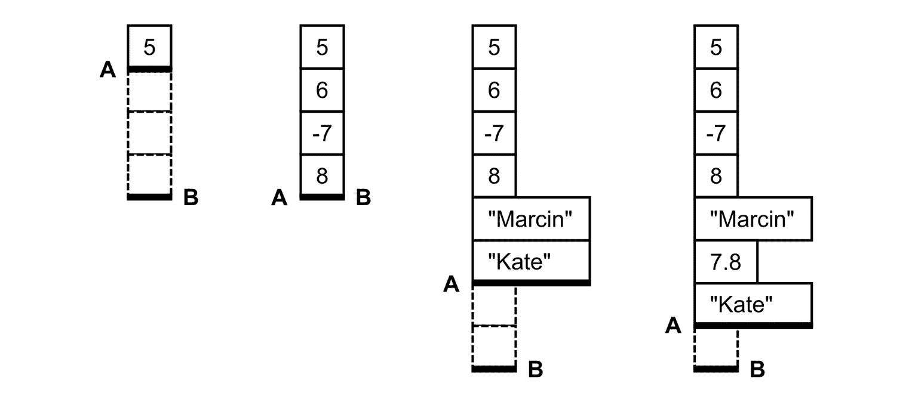
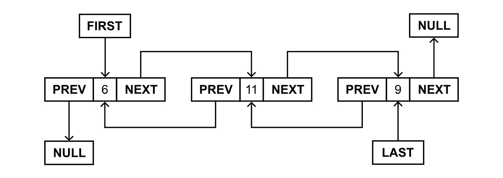
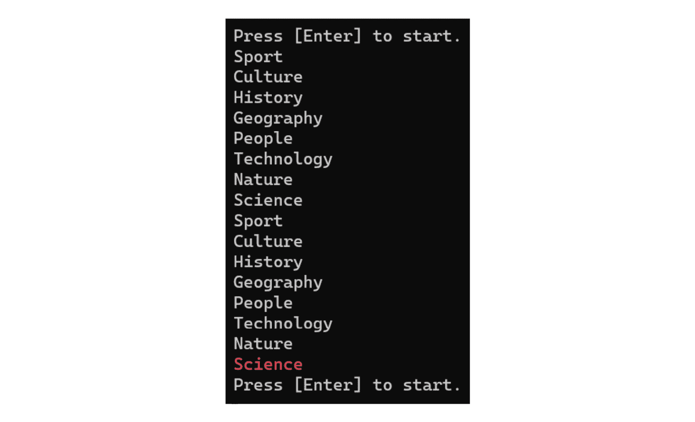
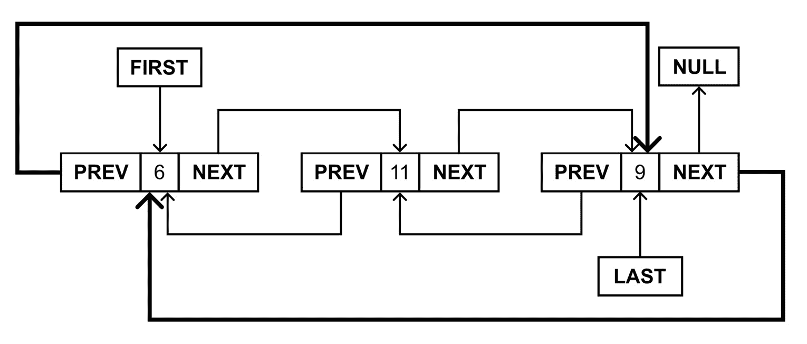
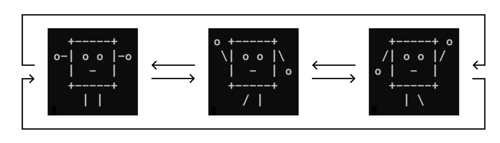

# 第四章：列表的变体

在上一章中，你学习了数组和它们的类型。当然，数组并不是存储数据的唯一方式。另一组更受欢迎且更强大的数据结构包含各种**列表**的变体。在本章中，你将看到这些数据结构在实际中的应用，包括插图、解释和描述。

首先，你将看到一个**简单列表**，它作为一个数组列表和通用列表，你可以根据需要轻松地添加和删除元素。然后，你将了解**排序列表**，它保持元素的顺序。接下来，你将学习关于**链表**的四种变体，即单链表、双链表、循环单链表和循环双链表。最后，你将熟悉在开发应用程序时可以使用的一些与列表相关的接口。这听起来有点复杂吗？如果是这样，请不要担心。你将得到全程指导。

本章我们将涵盖以下主题：

+   简单列表

+   排序列表

+   链表

+   与列表相关的接口

# 简单列表

数组是非常有用的数据结构，它们在许多算法中都有应用。然而，在某些情况下，由于它们的性质，它们的适用可能会变得复杂，因为它们不允许你增加或减少已创建数组的长度。如果你不知道要存储在集合中的元素总数，你应该怎么做？你是否需要创建一个非常大的数组，然后不使用不必要的元素？这样的解决方案听起来并不好，对吧？一个更好的方法是在必要时使用一种数据结构，它可以使集合的大小动态增加或减少。

想象一个简单的列表

如果你想要更好地可视化一个简单列表，并区分它与数组的不同，请闭上眼睛片刻，试图回忆起当你只有几岁的时候，圣诞节即将到来。你和你的家人正在准备挂在圣诞树上的链。你拿了一张另一张纸，穿过链的最后一段，将新的一段链粘合在一起。这样，你的链就通过另一个元素增长，你可以不断地向链中添加更多元素。好吧，也许限制是纸张和胶水的数量，或者你的疲劳。列表的工作方式与此类似，你可以轻松地添加新元素。你也可以像移除链的一段并将其重新粘合在一起一样移除它们，你仍然可以将它挂在你的美丽圣诞树上！

## 数组列表

第一个允许您从 `System.Collections` 命名空间中的 `ArrayList` 类的数据结构。您可以使用此类存储大量数据，并在需要时轻松添加新元素。当然，您也可以删除它们，计算项目数量，并在数组列表中找到特定值的索引。您如何做到这一点？让我们看看以下代码：

```cs
using System.Collections;
ArrayList arrayList = new() { 5 };
arrayList.Add(6);
arrayList.AddRange(new int[] { -7, 8 });
arrayList.AddRange(new object[] { "Marcin", "Kate" });
arrayList.ArrayList class is created and 5 is added as the first element. This can be simplified, as shown here:

```

ArrayList 类的 `Add`, `AddRange`, 和 `Insert` 方法用于向数组列表中添加新元素。它们之间的区别如下：

+   `Add` 在列表末尾添加一个新项目

+   `AddRange` 在数组列表末尾添加一系列元素

+   `Insert` 在集合的指定位置放置一个元素

当执行前面的代码时，数组列表包含以下元素：`5`, `6`, `-7`, `8`, `"Marcin"`，`7.8`，和 `"Kate"`。请记住，数组列表中存储的所有项目都是 `object` 类型。因此，您可以在同一集合中同时放置各种类型的数据。

您需要指定类型吗？

使用 `object` 而不是特定类型并不总是好主意。所以，如果您想指定列表中每个元素的类型，您可以使用通用的 `List` 类，它将在 `ArrayList` 之后描述。我鼓励您在可能的情况下始终使用强类型版本的集合。

值得注意的是，您可以使用索引轻松访问数组列表中的特定元素，如下面的两行代码所示：

```cs
object first = arrayList[0]!;
int third = (int)arrayListint in the second line. Such casting is necessary because the array list stores object values. As in the case of arrays, the zero-based indices are used while accessing particular elements within the collection. When you run the preceding lines of code, first will be equal to 5, while third will be equal to -7.
Of course, you can use a `foreach` loop to iterate through all items, as follows:

```

foreach (object element in arrayList)

{

`Console.WriteLine(element);`

}

```cs

 That’s not all – the `ArrayList` class has a set of properties and methods that you can use while developing applications utilizing the aforementioned data structure. To start with, let’s take a look at the `Count` and `Capacity` properties:

```

int count = arrayList.Count;

int capacity = arrayList.Count) 返回当前存储在数组列表中的元素数量，而另一个属性（容量）表示可以存储在其中的元素数量。如果您在向数组列表添加新元素后检查容量属性的值，您将看到此值会自动增加以为新项目腾出空间。这如图所示，展示了 Count（标记为 A）和 Capacity（B）之间的区别：



图 4.1 – Count 和 Capacity 的区别

下一个常见且重要的任务是检查数组列表是否包含具有特定值的元素。您可以通过调用 `Contains` 方法来执行此操作，如下面的代码行所示：

```cs
bool containsMarcin = arrayList.true is returned. Otherwise, false is returned. But how can you find an index of this element? To do so, you can use the IndexOf or LastIndexOf method, as shown in the following line of code:

```

int minusIndex = arrayList.IndexOf 方法返回数组列表中元素首次出现的索引，而 LastIndexOf 返回最后一次出现的索引。如果没有找到值，方法返回 -1。因此，你可以使用 IndexOf 检查数组列表是否包含指定的元素。如果结果是小于零的，这意味着元素不可用。另一方面，如果结果是大于或等于零的，则表示找到了项目，如下所示：

```cs
bool containsAnn = arrayList.Remove, RemoveAt, RemoveRange, and Clear methods, as shown here:

```

arrayList.Remove(5);

arrayList.RemoveAt(1);

arrayList.RemoveRange(1, 2);

arrayList.Clear();

```cs

 The difference between the mentioned methods is as follows:

*   `Remove` removes the first occurrence of a given value
*   `RemoveAt` removes an item with a provided index
*   `RemoveRange` removes a given number of elements starting from some index
*   `Clear` removes all elements

Among other methods, it is worth mentioning `Reverse`, which reverses the order of the elements within the array list, as well as `ToArray`, which returns an array with all items stored in the `ArrayList` instance.
Where can you find more information?
You can find content regarding an array list at [`learn.microsoft.com/en-us/dotnet/api/system.collections.arraylist`](https://learn.microsoft.com/en-us/dotnet/api/system.collections.arraylist). 
Generic lists
As you can see, the `ArrayList` class contains a broad range of features, but it has a significant drawback – that is, it is not a strongly typed list. If you want to benefit from a strongly typed list, you can use the generic `List` class, which represents the collection whose size can be increased and decreased as necessary. This class is available in the `System.Collections.Generic` namespace.
The generic `List` class contains many properties and methods that are useful while developing applications that store data. Many members are named the same as in the `ArrayList` class. An example is the following two properties:

*   `Count`, which returns the current number of elements in the list
*   `Capacity`, which indicates how many elements can be currently stored in the list

There are also many similar methods, including the following ones:

*   `Add` adds an item at the end of the list
*   `AddRange` adds a collection of elements at the end of the list
*   `Insert` places an element in a specified location within the list
*   `InsertRange` places a collection of items in a specified location in the list
*   `Contains` checks whether the list contains a given element
*   `IndexOf` returns an index of the first occurrence of a given item
*   `LastIndexOf` returns an index of the last occurrence of a given item
*   `Remove` removes the first occurrence of a given value
*   `RemoveAt` removes an item with a provided index
*   `RemoveRange` removes a given number of elements starting from some index
*   `Clear` removes all elements from the list
*   `Reverse` reverses the order of items within the list
*   `ToArray` returns an array with all items stored in the list

You can get a particular element from the list using the `[]` operator with an index.
Apart from the already-described features, you can use a comprehensive set of extension methods from the `System.Linq` namespace. Some of them are as follows:

*   `Min` finds the minimum value in the list
*   `Max` finds the maximum value in the list
*   `Sum` returns a sum of all elements in the list
*   `Average` calculates the average value of elements in the list
*   `All` checks whether all elements in the list satisfy a condition
*   `Any` verifies whether at least one element in the list satisfies a condition
*   `ElementAtOrDefault` returns an element at a given index in the collection or a default value if the index is out of bounds
*   `Distinct` returns a collection with only unique elements, namely without duplicates
*   `OrderBy` and `OrderByDescending` order all elements in the list in ascending or descending order, as well as return the ordered collection
*   `Skip` returns a collection bypassing a given number of elements in the list
*   `Take` returns a given number of elements from the list

After this theoretical introduction, let’s see such methods in action! First, let’s get the minimum, maximum, sum, and average values from the list, as shown here:

```

List<int> list = [6, 90, -20, 0, 4, 1, 8, -20, 41];

int min = list.Min();

int max = list.Max();

int sum = list.Sum();

double avg = list.min 等于 -20，max 等于 90，sum 等于 110，且 avg 接近 12.22。

现在，让我们检查列表元素的一些条件：

```cs
bool allPositive = list.All(x => x > 0);
bool anyZero = list.allPositive is equal to false, while anyZero to true.
The next part of the code is shown in the following block:

```

int existingElement = list.ElementAtOrDefault(5);

int nonExistingElement = list.ElementAtOrDefault 方法用于获取索引等于 5 和 100 的元素的值。在第一种情况下，返回 1 并存储为 existingElement 变量的值。当你尝试获取索引等于 100 的元素时，使用 int 的默认值代替并返回，即 0。

下一个扩展方法是名为 `Distinct` 的方法，可以使用如下方式：

```cs
List<int> unique = list.IEnumerable<int> type, which you can convert into List<int> by calling the ToList extension method. The resulting list contains 6, 90, -20, 0, 4, 1, 8, and 41.
Let’s order the list using the `OrderBy` extension method, as follows:

```

List<int> ordered = list.-20, -20, 0, 1, 4, 6, 8, 41, and 90.

另一个有趣的组方法包括 `Skip` 和 `Take`，如下所示：

```cs
List<int> skipped = list.Skip(4).ToList();
List<int> taken = list.Skip method skips 4 elements and returns the collection with the remaining elements, namely 4, 1, 8, -20, and 41.
The `Take` method simply takes `3` first elements – that is, `6`, `90`, and `-20`.
Do you have any idea how to combine `Skip` with `Take` in some real-world examples? If not, just think about the **pagination** mechanism, which you can find on many websites. It allows you to navigate between pages of data, where each page contains a specified number of elements. How you can get such items for a given page? The answer is as follows:

```

int page = 1;

int size = 10;

List<int> items = list

.Skip((page - 1) * size)

.Take(size)

.ToList();

```cs

 Of course, these are not the only features available for developers while creating applications using generic lists in the C# language. I strongly encourage you to discover more possibilities on your own. Next, we’ll look at two examples that show how to use a generic list in practice.
Where can you find more information?
You can find content regarding a generic list at [`learn.microsoft.com/en-us/dotnet/api/system.collections.generic.list-1`](https://learn.microsoft.com/en-us/dotnet/api/system.collections.generic.list-1).
Example – average value
The first example utilizes the generic `List` class to store floating-point values (of the `double` type) entered by the user. After typing a number, the average value is calculated and presented in the console. The program stops the operation when an incorrect value is entered. The code is as follows:

```

List<double> num = [];

do

{

Console.Write("Enter the number: ");

string numStr = Console.ReadLine() ?? string.Empty;

if (!double.TryParse(numStr, out double n)) { break; }

num.Add(n);

Console.WriteLine($"Average value: {num.Average()}");

}

while (true);

```cs

 First, an instance of the `List` class is created. Then, within the infinite loop (`do-while`), the program waits until the user enters a number. If it is correct, the entered value is added to the list (by calling `Add`), and an average value from elements in the list is calculated (by calling `Average`). The result is shown in the console:

```

输入数字：10.5

平均值：10.5 (...)

输入数字：15.5

平均值：9.375

```cs

 In this section, you saw how to use a list that stores `double` values. However, can it also store instances of user-defined classes or records? Of course! You will see how to achieve this goal in the next example.
Example – list of people
This second example shows you how to use a list to create a very simple database of people. For each, a name, an age, and a country are stored. When the program is launched, some data of people are added to the list. Then, such data is sorted and presented in the console.
Let’s start with the declaration of the `Person` record:

```

public record Name, Age, and Country，它存储国家代码。在代码的主要部分，你创建一个新的 List 类实例，并添加一些具有不同姓名、年龄和国家的数据，如下所示：

```cs
List<Person> people =
[
    new("Marcin", 35, "PL"),
    new("Sabine", 25, "DE"),
    new("Mark", 31, "PL")
];
```

在下一行中，你按人员的姓名按升序排序列表：

```cs
List<Person> r = people.OrderBy(p => p.Name).ToList();
```

这一行可以使用集合表达式简化，如下所示：

```cs
List<Person> r = foreach loop:

```

foreach (Person p in r)

{

string line = $"{p.Name} ({p.Age}) from {p.Country}.";

Console.WriteLine(line);

}

```cs

 After running the program, the following results will be presented:

```

Marcin (35) from PL.

Mark (31) from PL.

Sabine (25) from DE.

```cs

 That’s all! Now, let’s talk a bit more about the LINQ expressions, which can be used not only to order elements but also to filter items based on the provided criteria, and even more.
As an example, let’s take a look at the following query, which is using the **method syntax**:

```

List<string> names = people

.Where(p => p.Age <= 30)

.OrderBy(p => p.Name)

.Select(p => p.Name)

.Select 子句（Where clause）中所有年龄低于或等于 30 岁（OrderBy clause）的人员。查询然后执行，并将结果作为列表返回（ToList）。

同样的任务可以使用 `ToList` 方法完成：

```cs
List<string> names = (from p in people
                      where p.Age <= 30
                      orderby p.Name
                      ArrayList class and the generic List class to store data in collections, the size of which could be dynamically adjusted. However, this is not the end of list-related topics within this chapter. Are you ready to get to know another data structure that maintains the elements in the sorted order? If so, let’s proceed to the next section, which focuses on sorted lists.
Sorted lists
So far, you’ve learned how to store data using simple lists. However, do you know that you can even use a data structure that ensures that the elements are sorted all the time? If not, let’s get to know the `SortedList` generic class (from the `System.Collections.Generic` namespace), `null`.
Imagine a sorted list
If you want to imagine a sorted list, think about a business holder in which you put business cards that you have received from other people. Since you like order and want to always be able to quickly find a business card for a specific person, you make sure that they are all arranged in alphabetical order, by last name. What a terrible waste of time, especially if you have dozens of business cards and suddenly you have to put in a card for Mrs. Ana Ave. Oh, no... almost all the business cards have to be moved. What can help you at this point is a sorted list! On its basis, your magic business card holder works, which automatically inserts a new business card into the appropriate place in the business card holder. Thanks to this, you always have order and you do not have to waste time constantly taking out and inserting business cards. Congratulations!
You can easily add an element to a sorted list using the `Add` method, as well as remove a specified item using the `Remove` method. Among other methods, it is worth noting `ContainsKey` and `ContainsValue` for checking whether the collection contains an item with a given key or value, as well as `IndexOfKey` and `IndexOfValue` for returning an index of an element by its key or value.
As a sorted list stores key-value pairs, you have also access to the `Keys` and `Values` properties. Particular keys and values can be easily obtained using the `[]` operator together with an index. As you can see, this data structure is quite similar to the ones that have already been presented. However, it has some significant differences. So, let’s take a look at an example that will show you how to use this data structure. You will also see differences in code compared with the previously described `List` class.
Where can you find more information?
You can find content regarding a sorted list at [`learn.microsoft.com/en-us/dotnet/api/system.collections.generic.sortedlist-2`](https://learn.microsoft.com/en-us/dotnet/api/system.collections.generic.sortedlist-2).
Example – address book
This example uses the `SortedList` class to create a very simple address book, which is sorted by names of people. For each person, the following data is stored: `Name`, `Street`, `PostalCode`, `City`, and `Country`. The declaration of the `Person` record is shown in the following code:

```

public record Person(

string Name,

string Street,

string PostalCode,

string City,

string Country);

```cs

 In the main part of the code, you create a new instance of `SortedList`. You need to specify types for keys and values, namely `string` and `Person`. Within the following part of the code, you also initialize the sorted list with data for `Marcin` and `Martyna`:

```

SortedList<string, Person> people = new()

{

{ "Marcin Jamro", new("Marcin Jamro",

"Polish Street 1/23", "35-001", "Rzeszow", "PL") },

{ "Martyna Kowalska", new("Martyna Kowalska",

"World Street 5", "00-123", "Warsaw", "PL") }

};

```cs

 Then, you can easily add data to the sorted list by calling the `Add` method, passing two parameters, namely a key (that is, a name), and a value (that is, an instance of the `Person` record), as shown in the following code snippet regarding `Mark`:

```

people.Add("Mark Smith", new("Mark Smith",

"German Street 6", "10000", "Berlin", "DE"));

```cs

 When all the data is stored within the collection, you can easily iterate through its elements (namely through key-value pairs) using a `foreach` loop. It is worth mentioning that a type of the variable that’s used in the loop is `KeyValuePair<string, Person>`. However, you can use a value tuple to get access to a key (`k`) and a value (`p`):

```

foreach ((string k, Person p) in people)

{

Console.WriteLine($"{k}: {p.Street}, {p.PostalCode}

{p.City}, {p.Country}.");

}

```cs

 When the program is launched, you receive the following result in the console:

```

Marcin Jamro: Polish Street 1/23, 35-001 Rzeszow, PL.

Mark Smith: German Street 6, 10000 Berlin, DE.

Martyna Kowalska: World Street 5, 00-123 Warsaw, PL.

```cs

 As you can see, the collection is automatically sorted by names, which are used as keys for the sorted list. However, you need to remember that keys must be unique, so you cannot add more than one person with the same full name in this example.
Linked lists
While using the `List` generic class, you can easily get access to particular elements of the collection using indices. However, when you get a single element, how can you move to the next element of the collection? Is it possible? To do so, you may consider the `IndexOf` method to get an index of the element. Unfortunately, it returns an index of the first occurrence of a given value in the collection, so it will not always work as expected in this scenario. Fortunately, **linked lists** exist and can help you with this problem! In this section, you will learn about a few variants.
Singly linked lists
A **singly linked list** is a data structure in which **each list element contains a** **pointer to the next element**. Thus, you can easily **move from any element to the next one, but you cannot go back**. Of course, the last element in the list has an empty pointer to the next element because there is nothing more located in the list.
Imagine a singly linked list
If you want to better visualize a singly linked list, think about how to represent the phases of human development. Life after birth consists of the neonatal period, infancy, post-infanthood, preschool, school, adolescence, adulthood, and old age. From each phase, you can only go to the next one and you can never go back, even if you try very, very hard. It’s similar to a linked list, where you can easily move from a given item to the next item, but you don’t have any data to return to the item that brought you here. But it would be nice to be able to go back a dozen or so years and repeat some phase of development, right? Unfortunately, there is no “back” button here. :-)
Here’s an example of a singly linked list:


Figure 4.2 – Illustration of a singly linked list
Is it possible to further expand this data structure so that you can both go forward and backward from a given list element? Of course! Let’s take a look.
Doubly linked lists
A **doubly linked list** is another data structure that **allows you to navigate both forward and backward from each list item**. It can be created based on the singly linked list by adding a second pointer, namely to the previous element.
Imagine a doubly linked list
If you want to better imagine a doubly linked list, open a text editor and start describing your day in it. Whenever you make a mistake, you press the “undo” button and you see the earlier version. You can also press “redo” and suddenly, you see what was in the document just before you undone the changes. Of course, you can perform such an operation many times, and the system remembers many previous and next operations. This is how you can think of a doubly linked list. In each element of the list, you can easily go to both the next element (equivalent to a “redo” operation) and the previous element (equivalent to a “back” operation). Just look how easy it is to find applications for various data structures in everyday life!
The following figure illustrates a doubly linked list:


Figure 4.3 – Illustration of a doubly linked list
As you can see, the `FIRST` box indicates the first element in the list. Each item has two properties that point to the previous and next element (`PREV` and `NEXT`, respectively). If there is no previous element, the `PREV` property is equal to `null`. Similarly, when there is no next element, the `NEXT` property is set to `null`. Moreover, the doubly linked list contains the `LAST` box that indicates the last element. 
Do you need to implement such a data structure on your own if you want to use it in your C#-based applications? Fortunately, no! It is already available as the `LinkedList` generic class in the `System.Collections.Generic` namespace. While creating an instance of this class, you need to specify the type parameter that indicates a type of a value stored in each element in the list, such as `int` or `string`.  Each element (also referred to as a *node*) is represented by an instance of the `LinkedListNode` generic class, such as `LinkedListNode<int>` or `LinkedListNode<string>`.
Some additional explanation is necessary for the methods of adding new nodes to the doubly linked list. For this purpose, you can use a set of methods:

*   `AddFirst` adds an element at the beginning of the list
*   `AddLast` adds an element at the end of the list
*   `AddBefore` adds an element before the specified node in the list
*   `AddAfter` adds an element after the specified node in the list

All these methods return an instance of the `LinkedListNode` class. Moreover, there are some other methods:

*   `Contains` checks whether the specified value exists in the list
*   `Remove` removes a node from the list
*   `Clear` removes all elements from the list

After this short introduction, let’s take a look at an example that shows how to apply the doubly linked list, implemented as the `LinkedList` class, in practice.
Where can you find more information?
You can find content regarding a linked list at [`learn.microsoft.com/en-us/dotnet/api/system.collections.generic.linkedlist-1`](https://learn.microsoft.com/en-us/dotnet/api/system.collections.generic.linkedlist-1).
Example – book reader
As an example, you will prepare a simple application that allows a user to read a book by changing pages. The user should be able to move to the next page (if it exists) after pressing the *N* key, and go back to the previous page (if it exists) after pressing the *P* key. The content of the current page, together with the page number, should be shown in the console, as presented in the screenshot:


Figure 4.4 – Screenshot of the book reader example
Let’s start with a declaration of the `Page` record, as shown in the following code:

```

public record Content property. 然后，你创建了几个 Page 类的实例，代表书的六页：

```cs
Page p1 = new("Welcome to (...)");
Page p2 = new("While reading (...)");
Page p3 = new("As a developer (...)");
Page p4 = new("In the previous (...)");
Page p5 = new("So far, you (...)");
Page p6 = new("The current (...)");
```

当实例创建完成后，可以使用一些与添加相关的方法构建双向链表，如下面的代码行所示：

```cs
LinkedList<Page> pages = new();
pages.AddLast(p2);
LinkedListNode<Page> n4 = pages.AddLast(p4);
pages.AddLast(p6);
pages.AddFirst(p1);
pages.AddBefore(n4, p3);
pages.AddAfter(n4, p5);
```

在第一行，创建了一个新的空列表。然后，执行以下给定操作：

1.  在末尾添加第二页（`[2]`）。

1.  在末尾添加第四页（`[2, 4]`）。

1.  在末尾添加第六页（`[2, 4, 6]`）。

1.  在列表开头添加第一页（`[1, 2, 4, 6]`）。

1.  在第四页之前添加第三页（`[1, 2, 3, 4, 6]`）。

1.  在第四页之后添加第五页（`[1, 2, 3, 4, 5, 6]`）。

代码的下一部分负责在控制台显示一页，以及按下适当的键后在页面之间导航。代码如下：

```cs
LinkedListNode<Page> c = pages.First!;
int number = 1;
while (c != null)
{
    Console.Clear();
    string page = $"- {number} -";
    int spaces = (90 - page.Length) / 2;
    Console.WriteLine(page.PadLeft(spaces + page.Length));
    Console.WriteLine();
    string content = c.Value.Content;
    for (int i = 0; i < content.Length; i += 90)
    {
        string line = content[i..];
        line = line.Length > 90 ? line[..90] : line;
        Console.WriteLine(line.Trim());
    }
    Console.WriteLine($"\nQuote from (...)");
    Console.Write(c.Previous != null
        ? "< PREV [P]" : GetSpaces(14));
    Console.Write(c.Next != null
        ? "[N] NEXT >".PadLeft(76) : string.Empty);
    Console.WriteLine();
    ConsoleKey key = Console.ReadKey(true).Key;
    if (key == ConsoleKey.N && c.Next != null)
    {
        c = c.Next;
        number++;
    }
    else if (key == ConsoleKey.P && c.Previous != null)
    {
        c = c.Previous;
        number--;
    }
}
```

在第一行，将`c`变量的值设置为双向链表的第一个节点。一般来说，`c`变量代表当前在控制台显示的页面。然后，将页面编号的初始值设置为`1`（`number`变量）。然而，代码中最有趣和复杂的部分是`while`循环。

在循环中，清除控制台当前内容，并正确格式化用于显示页码的字符串。在其前后添加`-`字符。此外，插入前导空格（使用`PadLeft`方法）以准备水平居中的字符串。

然后，将页面内容分成不超过`90`个字符的行，并在控制台写入。为了分割字符串，使用`Length`属性和`content[i..]`。同样，在控制台显示其他信息。然后，如果存在上一页或下一页，显示`PREV`和`NEXT`标题。

你能改进这个示例吗？

此示例将文本分成几行，而不考虑空格。我鼓励您修改代码，以便它支持更友好的文本换行。祝你好运！

在代码的后续部分，程序会等待用户按下任意键，并且不会在控制台（通过将`true`作为`ReadKey`参数）中显示它。当用户按下*N*键时，使用`Next`属性将`c`变量设置为下一个节点。当然，当下一页不可用时不执行此操作。*P*键的处理方式类似，这会导致用户导航到上一页。值得一提的是，页面编号（`number`变量）在`c`变量值改变的同时也会被修改。

最后，展示辅助方法`GetSpaces`的代码：

```cs
string GetSpaces(int number) => string.Join(
    null, Enumerable.Range(0, number).Select(n => " "));
```

这将准备并返回具有指定空格数的`string`变量。当然，有几种方法可以完成这个任务。然而，在这本书中，我想向你展示各种方法，甚至那些不太典型的方法。目的是向你展示实现目标的各种方式，并尽可能拓宽你的视野。

这样，你应该准备好继续你的列表冒险之旅。在下一节中，你将学习关于循环列表及其两种子类型的内容。

循环单链表

在前两个部分中，你已经学习了链表。你应该记得，在单链表中，你可以使用`Next`属性在节点之间导航。然而，最后一个节点的`Next`属性被设置为`null`。你知道你可以轻松地扩展这种方法来创建一个**循环单链表**，其中**最后一个节点指向第一个元素，创建一个可以无限迭代的列表**吗？

想象一个循环单链表

如果你想更好地想象一个循环单链表，那么请稍作思考，想象一下显示特定文件夹照片的屏保。在一段时间的不活动后，你的屏幕开始依次显示照片。当最后一张照片显示完毕后，目录中的第一张照片会自动显示。当然，你无法自己控制这些照片，因为任何与键盘或鼠标的交互都会关闭屏保。循环单链表的工作原理与此类似。在这里，只保存关于下一个列表元素的详细信息，而没有返回的可能性。列表的最后一个元素将你带到最开始的位置。一旦你能想象出一个现实生活中的案例，那就很容易理解了，对吧？现在，移动你的鼠标使屏保消失，然后继续学习更多关于数据结构和算法的知识！

以下图示展示了循环单链表：


图 4.5 – 循环单链表的示意图

在对循环单链表主题的简要介绍之后，现在是时候看看实现代码了。由于在 C#开发中默认情况下没有这种数据结构，你将学习如何基于链表自己实现它。让我们从以下代码片段开始：

```cs
using System.Collections;
public class CircularLinkedList<T>
    : LinkedList<T>
{
    public new IEnumerator GetEnumerator() =>
        new CircularEnumerator<T>(this);
}
```

实现可以创建为一个泛型类，它扩展了`LinkedList`，如前所述代码所示。值得一提的是`GetEnumerator`方法的实现，它使用了`CircularEnumerator`类。通过创建它，你将能够使用`foreach`循环无限迭代循环链表的所有元素。`CircularEnumerator`的代码如下：

```cs
public class CircularEnumerator<T>(LinkedList<T> list)
    : IEnumerator<T>
{
    private LinkedListNode<T>? _current = null;
    public T Current => _current != null
        ? _current.Value
        : default!;
    object IEnumerator.Current => Current!;
    public bool MoveNext()
    {
        if (_current == null)
        {
            _current = list?.First;
            return _current != null;
        }
        else
        {
            _current = _current.Next
                ?? _current!.List?.First;
            return true;
        }
    }
    public void Reset()
    {
        _current = null;
    }
    public void Dispose() { }
}
```

`CircularEnumerator`类实现了`IEnumerator`接口。这个类声明了一个`private`字段，它代表迭代列表时的当前节点（`_current`）。它还包含两个属性，即`Current`和`IEnumerator.Current`，这是`IEnumerator`接口所要求的。

代码中最重要的部分之一是`MoveNext`方法。它检查当前元素是否等于`null`。如果是，它尝试从列表中获取第一个元素并从它开始迭代。如果不存在，由于列表中没有项目，该方法返回`false`。如果当前元素不等于`null`，它将当前元素更改为下一个元素或列表中的第一个节点，如果下一个节点不可用。在`Reset`方法中，你只需将`_current`字段的值设置为`null`。

最后，你创建了`Next`扩展方法，在尝试从列表的最后一个元素获取下一个元素时导航到第一个元素。为了简化实现，这个功能将作为一个方法而不是`Next`属性提供。代码如下所示：

```cs
public static class CircularLinkedListExtensions
{
    public static LinkedListNode<T>? Next<T>(
        this LinkedListNode<T> n)
    {
        return n != null && n.List != null
            ? n.Next ?? n.List.First
            : null;
    }
}
```

该方法检查节点是否存在以及列表是否可用。在这种情况下，它返回节点的`Next`属性值（如果该值不等于`null`）或使用`First`属性返回列表中的第一个元素的引用。

那就结束了！你已经完成了基于 C#的循环单链表的实现，你可以在各种应用中使用它。但如何使用呢？让我们看看以下示例，它使用了这种数据结构。

示例 – 旋转轮子

这个例子模拟了一个用户以随机速度旋转轮子的游戏。轮子旋转得越来越慢，直到停止。然后，用户可以从之前的停止位置再次旋转，如图所示：


图 4.6 – 旋转轮子示例的说明

让我们继续代码的第一部分：

```cs
CircularLinkedList<string> categories = new();
categories.AddLast("Sport");
categories.AddLast("Culture");
categories.AddLast("History");
categories.AddLast("Geography");
categories.AddLast("People");
categories.AddLast("Technology");
categories.AddLast("Nature");
categories.CircularLinkedList class is created, which represents a circular singly linked list with string elements. Then, eight values are added, namely Sport, Culture, History, Geography, People, Technology, Nature, and Science.
The following part of the code performs the most important operations:

```

bool isStopped = true;

Random random = new();

DateTime targetTime = DateTime.Now;

int ms = 0;

foreach (string category in categories)

{

if (isStopped)

{

Console.WriteLine("按[Enter]键开始。");

ConsoleKey key = Console.ReadKey().Key;

if (key == ConsoleKey.Enter)

{

ms = random.Next(1000, 5000);

targetTime = DateTime.Now.AddMilliseconds(ms);

isStopped = false;

Console.WriteLine(category);

}

else { return; }

}

else

{

int remaining = (int)(targetTime

- DateTime.Now).TotalMilliseconds;

int waiting = Math.Max(100, (ms - remaining) / 5);

await Task.Delay(waiting);

if (DateTime.Now >= targetTime)

{

Console.ForegroundColor = ConsoleColor.Red;

isStopped = true;

}

Console.WriteLine(category);

Console.ResetColor();

}

}

```cs

 First, a few variables are declared:

*   `isStopped`, which indicates whether the wheel is currently stopped
*   `random`, for drawing random values of wheel spin in milliseconds
*   `targetTime`, which is the target time when the wheel should stop
*   `ms`, which is the last drawn number of milliseconds for wheel-spinning

Then, the `foreach` loop is used to iterate through all the elements within a circular singly linked list. If there are no `break` or `return` instructions within such a loop, it will execute indefinitely due to the nature of a circular linked list. If the last item is reached, the first element in the list is taken automatically in the next iteration.
In this loop, you check whether the wheel is currently stopped or has not been started yet. If so, the message is presented to the user and the program waits until the *Enter* key is pressed. In such a situation, the new spinning operation is configured by drawing the total time of spinning, setting the expected stop time, indicating that the wheel is not stopped, as well as writing the current category. When the user presses any other key, the program stops its execution.
If the wheel is currently not stopped, you calculate the remaining number of milliseconds and the waiting time. This formula makes it possible to provide smaller times at the beginning (the wheel spins faster) and bigger times at the end (the wheel spins slower). Then, the program waits for the specified number of milliseconds.
At the end, you check whether the target time is reached. If so, the foreground color is changed to red and you indicate that the wheel is stopped. Then, the currently chosen category on the spinning wheel is presented in the console.
When you run the application, you will get the result similar to the following one:


Figure 4.7 – Screenshot of the spin the wheel example
With that, we’ve looked at an example that uses a circular singly linked list. Are you curious whether you can expand it further to create a circular doubly linked list?
Circular doubly linked lists
The last data structure we’ll cover in this chapter is named the **circular doubly linked list**. It is similar to the circular singly linked list but **allows you not only to iterate indefinitely in the forward direction but also in the backward direction**. You can achieve this by adding pointers to previous elements for each item in the list. Of course, you also need to point to the last element in the list as the previous element of the first one in the list.
Imagine a circular doubly linked list
If you want to better visualize a circular doubly linked list, grab your camera and start browsing the gallery of photos you’ve taken. Here, you can easily go from the first photo to the last one by clicking “back.” You can also go from the last photo to the first one by clicking “next.” Of course, you can also switch between subsequent photos in the photo gallery by clicking “back” and “next.” There is no issue with you taking another photo, at which point it will be added to the collection of photos you’ve already taken. Take a look for yourself! This is how a circular doubly linked list works. Snap, photo taken, and... let’s move on!
A circular doubly linked list is presented in the following diagram:


Figure 4.8 – Illustration of a circular doubly linked list
Here, the `PREV` property of the first node navigates to the last one, while the `NEXT` property of the last node navigates to the first. This data structure can be useful in some specific cases, as you will see while developing a real-world example.
After this short introduction to the topic of circular doubly linked lists, it is time to take a look at the implementation code. If you use the code that’s already been prepared for the circular singly linked list, you only need to add one extension method, as shown here:

```

public static class CircularLinkedListExtensions

{

public static LinkedListNode<T>? Next<T>(

this LinkedListNode<T> n)

{

return n != null && n.List != null

? n.Next ?? n.List.First

: null;

}

public static LinkedListNode<T>? Prev<T>(

this LinkedListNode<T> n)

{

return n != null && n.List != null

? n.Previous ?? n.List.Last

: null;

}

}

```cs

 The `Prev` method checks whether the node exists and whether the list is available. In such a case, it returns a value of the `Previous` property of the node (if such a value is not equal to `null`) or returns a reference to the last element in the list using the `Last` property. That’s all! Let’s take a look at the example.
Example – art gallery
This example is a viewer of drawings presented in the console. Does this sound strange? It could be, but let’s try to create some console-based art!
Real art in the console exists!
The topic of creating console-based graphics is quite popular and some amazing art has already been created by various authors! If you are curious about this topic, just search for *ASCII arts* in your web browser. Will you join this community with your drawings? If so, please share them with me as well!
When a user presses *the right* or *left arrow*, the drawing is changed to the next or the previous one, respectively. As a result, the following art can be viewed in the console:


Figure 4.9 – Screenshots of the art gallery example
The code uses the `CircularLinkedList` class, as shown here:

```

string[][] arts = GetArts();

CircularLinkedList<string[]> images = new();

foreach (string[] art in arts) { images.AddLast(art); }

LinkedListNode<string[]> node = images.First!;

ConsoleKey key = ConsoleKey.Spacebar;

do

{

if (key == ConsoleKey.RightArrow)

{

node = node.Next()!;

}

else if (key == ConsoleKey.LeftArrow)

{

node = node.Prev()!;

}

Console.Clear();

foreach (string line in node.Value)

{

Console.WriteLine(line);

}

}

while ((key = Console.ReadKey().Key) != ConsoleKey.Escape);

```cs

 You create a circular doubly linked list consisting of a few elements. Each stores an array of strings. Such an array represents a particular image, namely the following rows forming the art. When you populate the list with data of all images, you store a reference to the first image as `node`. Then, you use a `do-while` loop that is executed until the *Escape* button is pressed. If the user presses the right arrow, you update the `node` variable using the `Next` method. If the left arrow is pressed, the `Prev` method is used instead. In each iteration, you clear the console and print the art so that you can receive a simple animation of a dancing figure.
If you are curious how such images are defined, take a look at the following code:

```

string[][] GetArts() => [

[

"  +-----+  ",

"o-| o o |-o",

"|  -  |  ",

"  +-----+  ",

"    | |    "

],

[

"o +-----+  ",

" \\| o o |\\ ",

"  |  -  | o",

"  +-----+  ",

"    / |    "

],

[

"+-----+ o",

" /| o o |/ ",

"o |  -  |  ",

"  +-----+  ",

"    | \\    "

]

];

```cs

 With that, you’ve learned how to use a circular doubly linked list. In the final section of this chapter, we’ll learn about three list-related interfaces.
List-related interfaces
While developing applications in C#, you frequently use various collections, including lists. For this reason, it is worth mentioning three common interfaces:

*   `IEnumerable`
*   `ICollection`
*   `IList`

The order of them is important because `IEnumerable` is the base interface for `ICollection` and `IList`, while `ICollection` is the base interface for `IList`. However, what is inside such interfaces? Let’s take a look!
`IEnumerable` only provides you with a `GetEnumerator` method.
The `ICollection` interface adds the following methods for **manipulating** **the collection**:

*   `Add` adds a given item to the collection
*   `Clear` removes all the items from the collection
*   `Contains` checks whether a given item exists in the collection
*   `Remove` removes the first occurrence of a given item from the collection

It also exposes the `Count` and `IsReadOnly` properties, as well as the `CopyTo` method for copying the collection to an array.
The last interface I’ll mention here is `IList`. It allows you to **access items within the collection by an index**. Thus, the interface contains the indexer for getting or setting an item at a specified index in the collection, as well as methods:

*   `IndexOf` returns an index of a given item in the collection
*   `Insert` inserts a given item at a specified index in the collection
*   `RemoveAt` removes an item at a specified index in the collection

As an example, do you know that the `LinkedList` generic class implements both generic and non-generic variants of the `ICollection` and `IE``numerable` interfaces? I strongly encourage you to take a look at other collections to see what interfaces are implemented by them. You can see this by clicking on the collection name in your code (such as `List` or `ArrayList`) and choosing the **Go To Definition** option from the context menu or simply by pressing *F12*.
Where can you find more information?
You can find content regarding the mentioned interfaces at: [`learn.microsoft.com/en-us/dotnet/api/system.collections.ienumerable`](https://learn.microsoft.com/en-us/dotnet/api/system.collections.ienumerable), [`learn.microsoft.com/en-us/dotnet/api/system.collections.icollection`](https://learn.microsoft.com/en-us/dotnet/api/system.collections.icollection), and [`learn.microsoft.com/en-us/dotnet/api/system.collections.ilist`](https://learn.microsoft.com/en-us/dotnet/api/system.collections.ilist).
Next, I’ll summarize this chapter.
Summary
This chapter was dedicated to **lists**, which are among the most common data structures that are used while developing various kinds of applications. However, this topic is not very easy because there are various variants of lists, including simple, sorted, and linked ones. Even this structure can be further divided as you saw while reading this chapter.
First, you learned about **simple lists**, which can be implemented as an **array list** or as a **generic list**. One of the most important differences between them is that the array list is not strongly typed, while the generic list is. You learned about various properties and methods available for these data structures, together with extension methods. Such information was supported by code snippets.
Next, you learned about **sorted lists**, which ensures a proper order of elements available in the collection. It is a bit of a different data structure but can be useful in various development scenarios. You learned how to use it while creating an address book, which is always sorted by names.
Finally, you took a closer look at linked lists, starting with **singly linked lists** and **doubly linked lists**. They allow you to navigate between elements, either in only one direction or in both directions. Such a data structure can be easily extended to a **circular linked list**, either in singly or doubly linked variants. Therefore, you can benefit from the features of suitable structures without the significant development effort.
The available types of data structures can sound quite complicated. However, in this chapter, you saw detailed descriptions of particular data structures, together with illustrations and C#-based implementations. These should have helped simplify things for you and can be used as a basis for your future projects.
Are you ready to learn other data structures? If so, proceed to the next chapter and read about **stacks** and **queues**!

```

```cs

```

```cs

```

```cs

```

```cs

```

```cs

```

```cs

```

```cs

```

```cs

```

```cs

```
