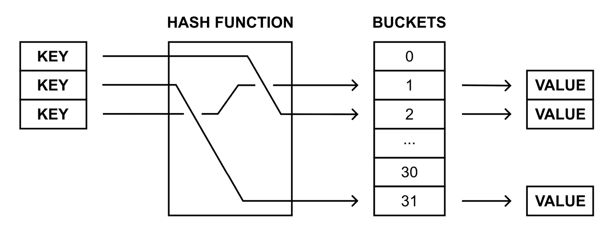
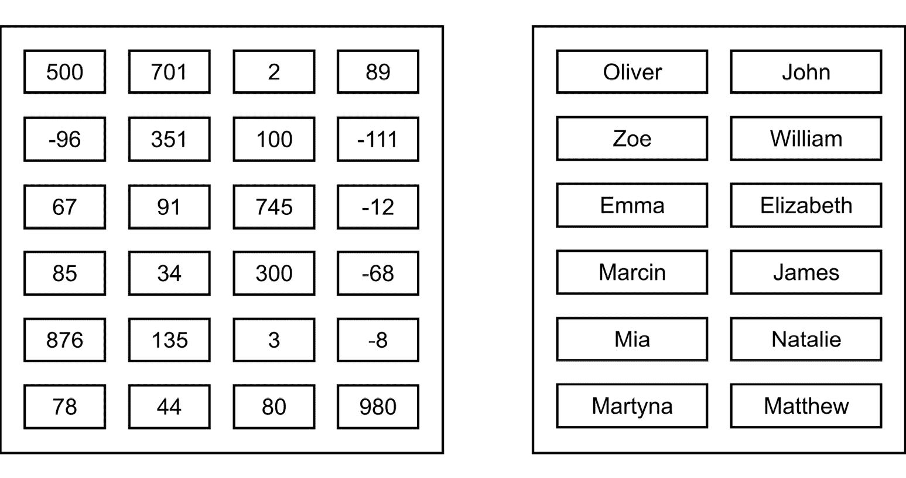
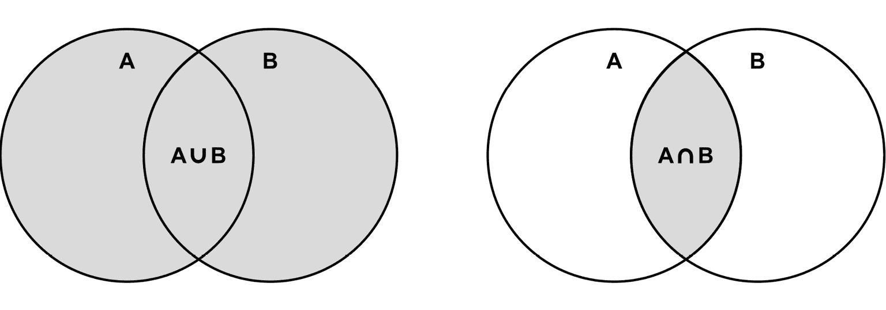
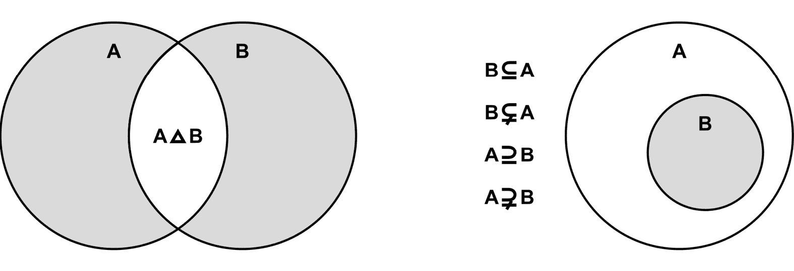

# 第六章：字典和集合

本章重点介绍与字典和集合相关的数据结构。应用这些数据结构使得将键映射到值和快速查找成为可能，以及**在集合上执行各种操作**。为了简化你对字典和集合的理解，本章包含插图、代码片段以及详细的描述。

首先，你将了解**字典**的非泛型和泛型版本，字典是一个由键值对组成的集合。然后，将介绍字典的**排序变体**。本章的其余部分将向你展示如何使用**哈希集合**以及**“排序”集合**变体。是否可以有“排序”集合？你将在本章的后面了解更多。

在本章中，将涵盖以下主题：

+   哈希表

+   字典

+   排序字典

+   哈希集合

+   “排序”集合

# 哈希表

让我们从第一个数据结构开始，即**哈希表**，也称为**哈希映射**。**它允许你**将**键映射到特定的值**。哈希表最重要的假设之一是基于**键**对**值**进行非常快速查找的可能性，这应该是*O(1)*操作。

想象一个哈希表或字典

如果你想要更好地想象哈希表或字典，值得思考一个包含大量数据的集合，其中快速检查字典是否包含特定的键以及快速检索分配给给定键的值至关重要。所以，想象一个系统，它允许你确定一个特定的 IP 地址来自哪个国家。正如你所知，有许多可能的 IP 地址，你的系统必须快速获取信息，以确定用户的请求来自哪个国家，从而选择应用程序的默认语言版本。这就是哈希表和字典的工作方式！你使用 IP 地址作为键（例如，50.50.50.50）和国家代码作为值（例如，PL）。这样，你可以快速找出用户来自哪个国家，而无需手动浏览整个集合。我来自波兰，我诚挚地邀请您来访问！这里有山脉、大海、湖泊和历史悠久的城市。所有这些都在这里等着你！

为了实现非常快速的查找，使用了**哈希函数**。它接受键来生成一个桶的索引，其中可以找到值。因此，如果你需要找到键的值，你不需要遍历集合中的所有项，因为你只需使用哈希函数轻松地定位合适的桶并获取值。正如你所看到的，哈希函数的作用至关重要，理想情况下，它应该为所有键生成一个唯一的结果。然而，不同的键可能会生成相同的结果。这种情况称为**哈希冲突**，应该得到处理。

下图展示了将键映射到特定值的方式：



图 6.1 – 将键映射到特定值的说明

由于哈希表具有出色的性能，它们在许多实际应用中经常被使用，例如用于**关联数组**、**数据库索引**和**缓存系统**。

从头实现哈希表似乎相当困难，尤其是在使用哈希函数、处理哈希冲突以及将特定的键分配给桶时。幸运的是，在用 C#语言开发应用程序时，有一个合适的实现，并且它的使用非常简单。

非泛型和泛型版本

与哈希表相关的类有两种变体，即非泛型（`Hashtable`）和泛型（`Dictionary`）。本节将描述第一种，下一节将描述另一种。如果你可以使用强类型泛型版本，我强烈建议使用它。

让我们来看看`System.Collections`命名空间中的`Hashtable`类。如前所述，它存储了一组键值对，其中每个都包含一个键和一个值。对是由`DictionaryEntry`实例表示的。

下面是一些使用`Hashtable`类的示例代码：

```cs
using System.Collections;
Hashtable hashtable = new()
{
    { "Key #1", "Value #1" },
    { "Key #2", "Value #2" }
};
hashtable.Add("Key #3", "Value #3");
hashtableKey #1 and Key #2), by using the Add method (Key #3) or by using the indexer (Key #4).
When you use the indexer to set a value for an already existing key, the value of this element is updated. A different behavior occurs while using the `Add` method because it throws an exception when an item with the same key already exists in the collection. You can handle this situation by using the `try-catch` statement, but there is a much better approach to check whether such an entry already exists – using the `ContainsKey` method. This will be shown a bit later.
It is worth mentioning that the `null` value is incorrect for the key of an element, but it is acceptable as a value of an element.
You can easily gain access to a particular element using the indexer. As the `Hashtable` class is a non-generic variant of hash table-related classes, you need to cast the returned result to the proper type (for example, `string`), as shown here:

```

string value = foreach 循环遍历存储在集合中的所有键值对，如下所示：

```cs
foreach (DictionaryEntry entry in hashtable)
{
    Console.WriteLine($"{entry.Key}: {entry.Value}");
}
```

在循环中使用的变量是`DictionaryEntry`类型。因此，你可以使用它的`Key`和`Value`属性来分别访问键和值。

`Hashtable`类配备了一些属性，例如获取存储元素的数量（`Count`），以及返回键和值的集合（`Keys`和`Values`）。你可以使用以下方法：

+   `Add`，用于添加新元素

+   `Remove`，用于移除一个元素

+   `Clear`，用于移除所有元素

+   `ContainsKey`，用于检查集合是否包含指定的键

+   `ContainsValue`，用于检查集合是否包含指定的值

性能方面如何？

哈希表是一种高效的数据结构。通过键检索值、检查集合是否包含指定的键以及通过键移除项都是*O(1)*操作。至于添加，如果不需要增加容量，它也是*O(1)*操作。否则，它是*O(n)*操作，其中*n*是项的数量。

在这个简短的介绍之后，让我们来看一个例子。

你在哪里可以找到更多信息？

你可以在[`learn.microsoft.com/en-us/dotnet/api/system.collections.hashtable`](https://learn.microsoft.com/en-us/dotnet/api/system.collections.hashtable)找到有关哈希表的内容。

示例 – 电话簿

例如，假设你创建了一个电话簿应用程序。这里使用`Hashtable`类来存储条目，其中人的姓名是键，电话号码是值，如下所示：

```cs
NAME ---> PHONE
Marcin -> 101-202-303
John ---> 202-303-404
Aline --> 303-404-505
```

该程序演示了如何向集合中添加元素，获取存储项的数量，遍历所有项，检查是否存在具有给定键的元素，以及如何根据键获取值。

首先，让我们创建`Hashtable`类的新实例，并使用一些条目初始化它，如下面的代码所示：

```cs
Hashtable phoneBook = new()
{
    { "Marcin", "101-202-303" },
    { "John", "202-303-404" }
};
phoneBookCount property and comparing its value with 0, as presented here:

```

Console.WriteLine("电话号码：")

if (phoneBook.Count == 0)

{

Console.WriteLine("列表为空。")

}

```cs

 Then, you can iterate through all the pairs:

```

foreach (DictionaryEntry entry in phoneBook)

{

Console.WriteLine($"{entry.Key}: {entry.Value}")

}

```cs

 Finally, let’s see how we can check whether a specific key exists in the collection, as well as how to get its value. The first task can be accomplished just by calling the `ContainsKey` method, which returns a value indicating whether a suitable element exists (`true`) or not (`false`). To get a value, you can use the indexer. Please keep in mind that you must cast the returned value to a suitable type, such as `string` in this example. This requirement is caused by the non-generic version of the hash table-related class. This code is as follows:

```

Console.Write("\n 通过姓名搜索：")

string name = Console.ReadLine() ?? string.Empty;

if (phoneBook.ContainsKey(name))

{

string number = (string)phoneBook[name]!;

Console.WriteLine($"电话号码：{number}")

}

else

{

Console.WriteLine("不存在。")

}

```cs

 Your first program using the hash table is ready! After launching it, you should receive a result similar to the following:

```

电话号码：

Marcin: 101-202-303

Aline: 303-404-505

John: 202-303-404

通过姓名搜索：Aline

电话号码：303-404-505

```cs

 It is worth noting that the order of the pairs stored using the `Hashtable` class is not consistent with the order of their addition or keys. For this reason, if you need to present the sorted results, you need to sort the elements on your own or use another data structure, namely `SortedDictionary`, which is described later in this book.
Now, let’s take a look at one of the most common classes used while developing in C#, namely `Dictionary`, which is a generic version of hash table-related classes.
Dictionaries
In the previous section, you learned about the `Hashtable` class, a non-generic variant of the hash table-related classes. However, it has a significant limitation, because it does not allow you to specify a type of a key and a value. Both the `Key` and `Value` properties of the `DictionaryEntry` class are of the `object` type. Therefore, you need to perform boxing and unboxing operations, even if all the keys and values are of the same type. If you want to benefit from the `Dictionary` generic class, which is the main subject of this section.
First of all, you should specify two types, namely a type of a key and a value, while creating an instance of the `Dictionary` class. Moreover, it is possible to define the initial content of the dictionary using the following code:

```

Dictionary<string, string> dictionary = new()

{

{ "Key #1", "Value #1" },

{ "Key #2", "Value #2" }

};

```cs

 In the preceding code, a new instance of the `Dictionary` class is created. It stores `string`-based keys and values. Here, two entries exist in the dictionary, namely `Key #1` and `Key #2`. Their values are `Value #1` and `Value #2`.
Similar to the `Hashtable` class, you can also use the indexer to get access to a particular element within the collection, as shown in the following line of code:

```

string value = dictionarystring type is unnecessary because Dictionary is the strongly typed version of the hash table-related classes. Therefore, the returned value already has the proper type. If an element with the given key does not exist in the collection, KeyNotFoundException is thrown. To avoid problems, you can either check whether the element exists (by calling ContainsKey) or use the TryGetValue method.

你可以使用索引器添加新元素或更新现有元素的值：

```cs
dictionarykey cannot be equal to null, but value can be if it is allowed by the type of values stored in the collection.
Where can you find more information?
You can find content regarding a dictionary at [`learn.microsoft.com/en-us/dotnet/api/system.collections.generic.dictionary-2`](https://learn.microsoft.com/en-us/dotnet/api/system.collections.generic.dictionary-2).
The `Dictionary` class is equipped with a few properties:

*   `Count`, which gets the number of stored elements
*   `Keys`, which returns the collection of keys
*   `Values`, which returns the collection of values

You can also use some available methods:

*   `Add`, which adds a new element to the dictionary
*   `Remove`, which removes an element from the dictionary
*   `Clear`, which removes all the elements from the dictionary
*   `ContainsKey`, which checks whether the dictionary contains a key
*   `ContainsValue`, which checks whether the dictionary contains a given value
*   `TryGetValue`, which tries to get a value for a given key from the dictionary

As you can see, many properties and methods are almost the same as in the case of the `Hashtable` class. The consistency of naming allows you to easily use various classes without the necessity of learning everything from scratch.
What about performance?
You should remember that the performance of getting a value of an element (using an indexer or `TryGetValue`), updating an existing one (using an indexer), and checking whether the given key exists in the dictionary (`ContainsKey`) approaches the *O(1)* operation. However, the process of checking whether the collection contains a given value (`ContainsValue`) is the *O(n)* operation and requires you to search the entire collection for the particular value.
If you want to iterate through all pairs stored in the collection, you can use a `foreach` loop. However, the variable that’s used in the loop is an instance of the `KeyValuePair` generic class with `Key` and `Value` properties, allowing you to access the key and the value. This `foreach` loop is shown in the following code snippet:

```

foreach (KeyValuePair<string, string> pair in dictionary)

{

Console.WriteLine($"{pair.Key}: {pair.Value}")

}

```cs

 Here, you can also apply what you’ve learned about value tuples and the deconstruct operation. Thus, the preceding `foreach` loop can be simplified, as shown here:

```

foreach ((string k, string v) in dictionary)

{

Console.WriteLine($"{k}: {v}")

}

```cs

 As you can see, the C# language is being equipped with more and more useful features that make your code shorter, simpler, and easier to understand. You should keep an eye on the updates to the language. Good work, C# team – I am looking forward to more!
Thread-safe version
Do you remember a thread-safe queue-related class from the previous chapter? If so, the situation looks quite similar in the case of `Dictionary` because the `ConcurrentDictionary` class (from the `System.Collections.Concurrent` namespace) is available.
With this short introduction, let’s start coding! In the following sections, you will find two real-world examples that use dictionaries for storing data.
Example – product location
The first example we’ll look at is an application that helps employees of a shop to find a product’s location. Let’s imagine that each employee has a phone with your application on it, which is used to scan a barcode of the product, and the application tells them that the product should be located in area `A1` or `C9`. Sounds interesting, doesn’t it?
As the number of products in the shop is often very high, it is necessary to find results very quickly. For this reason, the data of products, together with their locations, is stored in the hash table, using the generic `Dictionary` class. The key is the barcode (`string`), while the value is the area code (also `string`), as shown here:

```

BARCODE -------> AREA

5901020304050 -> A1

5910203040506 -> B5

5920304050607 -> C9

```cs

 First, you create a new collection and add some data:

```

Dictionary<string, string> products = new()

{

{ "5901020304050", "A1" },

{ "5910203040506", "B5" },

{ "5920304050607", "C9" }

};

products["5930405060708"] = "D7";

```cs

 The code shows two ways of adding elements to the collection, namely by passing their data while creating a new instance of the class and by using the indexer. A third solution also exists and uses the `Add` method, as shown in the following part of the code:

```

string key = "5940506070809";

if (!products.ContainsKey(key))

{

products.Add(key, "A3")

}

```cs

 Another solution uses the `TryAdd` method, as presented here:

```

if (!products.TryAdd(key, "B4"))

{

Console.WriteLine("无法添加。")

}

```cs

 In the following part of the code, you present data of all the products that are available in the system. To do so, you use the `foreach` loop. Before that, you check whether there are any elements in the dictionary. If not, the proper message is presented to the user. Otherwise, keys and values from all pairs are presented in the console:

```

Console.WriteLine("所有产品：")

if (products.Count == 0) { Console.WriteLine("为空。") }

foreach ((string k, string v) in products)

{

Console.WriteLine($"{k}: {v}")

}

```cs

 Now, let’s take a look at the part of the code that makes it possible to find the location of the product by its barcode. To do so, you can use `TryGetValue` to check whether the element exists. If so, a message with the target location is presented in the console. Otherwise, other information is shown. The code is presented here:

```

Console.Write("\n 通过条码搜索：")

string barcode = Console.ReadLine() ?? string.Empty;

if (products.TryGetValue(barcode, out string? location))

{

Console.WriteLine($"该产品位于：{location}。")

}

else

{

Console.WriteLine("该产品不存在。")

}

```cs

 When you run the program, you see a list of all the products in the shop and the program asks you to enter the barcode. After typing it, you receive a message containing the area code. The result that’s shown in the console should be similar to the following:

```

Cannot add.

所有产品：

5901020304050: A1

5910203040506: B5

5920304050607: C9

5930405060708: D7

5940506070809: A3

通过条码搜索：5901020304050

该产品位于：A1。

```cs

 You’ve just completed the first example! Let’s proceed to the next one.
Example – user details
This second example shows you how to store more complex data in the dictionary. In this scenario, you’ll create an application that shows details of a user based on their identifier, as shown here:

```

ID   ->  FIRST NAME | LAST NAME | PHONE NUMBER

100  ->  Marcin     | Jamro     | 101-202-303

210  ->  John       | Smith     | 202-303-404

303  ->  Aline      | Weather   | 303-404-505

```cs

 The program starts with the data of three users. You should be able to enter an identifier and see details of the found user. Of course, the situation of the non-existence of a given user should be handled by presenting the proper information in the console.
First, let’s add the `Employee` record, which stores data of an employee, namely first name, last name, and phone number. The code is as follows:

```

public record Employee(string FirstName, string LastName,

string PhoneNumber);

```cs

 Then, create a new instance of the `Dictionary` class and add data to it:

```

Dictionary<int, Employee> employees = new()

{

{ 100, new Employee("Marcin", "Jamro", "101-202-303") },

{ 210, new Employee("John", "Smith", "202-303-404") },

{ 303, new Employee("Aline", "Weather", "303-404-505") }

};

```cs

 The most interesting operations are performed in the following `do-while` loop:

```

do

{

Console.Write("输入标识符： ");

string idString = Console.ReadLine() ?? string.Empty;

if (!int.TryParse(idString, out int id)) { break; }

if (employees.TryGetValue(id, out Employee? Employee))

{

Console.WriteLine(

"Full name: {0} {1}\nPhone number: {2}\n",

employee.FirstName,

employee.LastName,

employee.PhoneNumber);

}

else { Console.WriteLine("不存在。\n"); }

}

while (true);

```cs

 First, the user is asked to enter an identifier of the employee, which is then parsed to the integer value. The loop is stopped when the provided identifier cannot be parsed to the integer value. Otherwise, the `TryGetValue` method is used to try to get details of the user. If the user is found (`TryGetValue` returns `true`), the details are presented in the console. Otherwise, an error message is shown.
When you run the application and enter some data, you will receive the following result:

```

输入标识符：100

全名：Marcin Jamro

电话号码：101-202-303

输入标识符：101

不存在。

```cs

 That’s all! You’ve completed two examples showing how to use dictionaries while developing applications in the C# language. Do you remember that another kind of dictionary was already mentioned, namely a sorted dictionary? Are you interested in finding out what it is and how you can use it in your programs? If so, move on to the next section.
Sorted dictionaries
Both non-generic and generic variants of the hash table-related classes do not keep the order of the elements. For this reason, if you need to present data from the collection sorted by keys, you need to sort them before presenting them. However, you can use another data structure, known as a **sorted dictionary**, to solve this problem and **keep keys sorted all the time**. Therefore, you can easily get the sorted collection if necessary.
Imagine a sorted dictionary
If you want to better imagine a sorted dictionary, remember the times from a dozen or so years ago, when the internet was not as popular and widespread as it is today, and at home there was a book on your shelf that allowed you to learn the meaning of a word in another language. How does it work? Let’s assume that you have a Polish-English dictionary, thanks to which you can find out how to translate a specific word from Polish to English, such as *cześć* to *hello*. You open this book and look for words that start with the letter *c*. Found! Now, you are browsing through words starting with *c* to find the one you are interested in, namely *cześć*. Fortunately, it’s not that complicated because all the words are listed in the dictionary in alphabetical order. And that’s how a sorted dictionary works! You can easily view all the items in the dictionary in alphabetical order. You can also quickly check if the dictionary contains a specific key and what its value is. Today, you just enter a foreign word in a search engine and you instantly know what it means in your language, as well as in probably any other language in the world. You like this kind of technological progress, don’t you?
The sorted dictionary is implemented as the `SortedDictionary` generic class, available in the `System.Collections.Generic` namespace. You can specify types for keys and values while creating a new instance of `SortedDictionary`. An item key cannot be equal to `null`, but its value can be if it is allowed by the type of values stored in the collection. Moreover, the class contains similar properties and methods to `Dictionary`.
Where can you find more information?
You can find content regarding a sorted dictionary at [`learn.microsoft.com/en-us/dotnet/api/system.collections.generic.sorteddictionary-2`](https://learn.microsoft.com/en-us/dotnet/api/system.collections.generic.sorteddictionary-2).
 The exemplary application is as follows:

```

SortedDictionary<string, string> dictionary = new()

{

{ "Key #1", "Value #1" },

{ "Key #2", "Value #2" }

};

dictionary.Add("Key #3", "Value #3");

dictionary["Key #4"] = "Value #4";

string value = dictionary["Key #1"];

`dictionary.Count)`，以及返回键和值的集合（分别称为键和值）。此外，你可以使用可用的方法，包括以下内容：

+   `Add`，用于添加新元素

+   `Remove`，用于删除项

+   `Clear`，用于删除所有元素

+   `ContainsKey`，用于检查集合是否包含特定键

+   `ContainsValue`，用于检查集合是否包含给定值

+   `TryGetValue`，用于尝试获取给定键的值

如果你想要遍历集合中存储的所有键值对，你可以使用`foreach`循环。循环中使用的变量是`KeyValuePair`的一个实例，具有`Key`和`Value`属性，允许你访问键和值。

性能如何？

尽管自动排序具有优势，但与`Dictionary`相比，`SortedDictionary`类在性能方面存在一些缺点，因为检索、插入和删除操作是*O(log n)*，其中*n*是集合中元素的数量，而不是*O(1)*。

此外，`SortedDictionary`与`SortedList`非常相似，如第*第三章*中所述，*数组和排序*。然而，它在内存和性能方面有所不同。这两个类的检索操作都是*O(log n)*，但未排序数据的插入和删除操作对于`SortedDictionary`是*O(log n)*，对于`SortedList`是*O(n)*。当然，`SortedDictionary`比`SortedList`需要更多的内存。正如你所见，选择合适的数据结构并非易事，你应该仔细考虑数据结构使用的场景，并权衡利弊。

通过这个简短的介绍，让我们看看排序字典的实际应用。

示例 – 百科全书

例如，让我们创建一个简单的百科全书，你可以添加条目并显示它们的完整内容。由于百科全书可以包含数百万个条目，因此为用户提供按正确顺序、按键字母顺序浏览条目的可能性，以及快速查找条目的可能性至关重要。因此，排序字典是一个不错的选择。

百科全书的概念在这里展示：

```cs
NAME     -> EXPLANATION
Lancut   -> A city located near Rzeszow, with a castle.
Rzeszow  -> A capital of the Subcarpathian voivodeship.
Warszawa -> A capital city of Poland.
Zakopane -> A city located in Tatra mountains in Poland.
```

当程序启动时，它显示一个简单的菜单，有两个选项，即`[A]dd`和`[L]ist`。按下*A*后，应用程序要求你输入条目的键和解释。如果提供的数据正确，则将新条目添加到百科全书中。如果用户按下*L*，则在控制台中按键排序显示所有条目的数据。当按下任何其他键时，将显示额外的确认，如果确认，则程序退出。

让我们看看代码：

```cs
Console.WriteLine("Welcome to your encyclopedia!\n");
SortedDictionary<string, string> definitions = [];
do
{
    Console.WriteLine("\nChoose option ([A]dd, [L]ist): ");
    ConsoleKeyInfo keyInfo = Console.ReadKey(true);
    if (keyInfo.Key == ConsoleKey.A)
    {
        Console.Write("Enter the key: ");
        string key = Console.ReadLine() ?? string.Empty;
        Console.Write("Enter the explanation: ");
        string explanation = Console.ReadLine()
            ?? string.Empty;
        definitions[key] = explanation;
    }
    else if (keyInfo.Key == ConsoleKey.L)
    {
        foreach ((string k, string e) in definitions)
        {
            Console.WriteLine($"{k}: {e}");
        }
    }
    else
    {
        Console.WriteLine("Do you want to exit? Y or N.");
        if (Console.ReadKey().Key == ConsoleKey.Y)
        {
            break;
        }
    }
}
while (true);
```

首先，创建一个`SortedDictionary`类的新实例，它代表基于`string`键和基于`string`值的对集合。然后，使用无限`do-while`循环。在循环内部，程序等待用户按下任何键。如果是*A*键，则从用户输入的值中获取条目的键和解释。然后，使用索引器向字典中添加一个新的条目。因此，如果具有相同键的条目已经存在，它将被更新。在按下*L*键的情况下，使用`foreach`循环显示所有输入的条目。当按下任何其他键时，向用户提出另一个问题，并且程序等待确认。如果用户按下*Y*，则退出循环。

当你运行程序时，你可以输入一些条目，以及展示它们。控制台的结果可以类似于以下块中所示：

```cs
Welcome to your encyclopedia!
Choose option ([A]dd, [L]ist):
Enter the key: Zakopane
Enter the explanation: A city located in Tatra mountains in Poland.
Choose option ([A]dd, [L]ist):
Enter the key: Rzeszow
Enter the explanation: A capital of the Subcarpathian voivodeship.
Choose option ([A]dd, [L]ist):
Rzeszow: A capital of the Subcarpathian voivodeship.
Zakopane: A city located in Tatra mountains in Poland.
Choose option ([A]dd, [L]ist):
Do you want to exit? Y or N.
```

到目前为止，你已经了解了三个与字典相关的类，即`Hashtable`、`Dictionary`和`SortedDictionary`。为了使理解它们更容易，提供了一些示例，以及详细的解释。

然而，你知道一些其他数据结构只存储键，而不存储值吗？你将在下一节中了解这些。

哈希集

在许多算法中，对各种数据集进行操作是必要的。然而，什么是**集合**？**集合是一组没有重复元素且没有特定顺序的独立对象**。因此，你只能知道给定元素是否在集合中。这些集合与数学模型和操作（如并集、交集、减法和对称差）严格相关。集合可以存储各种数据，例如整数或字符串值。当然，你也可以创建一个包含用户定义类或记录实例的集合，并且可以在任何时候向集合中添加或删除元素。

想象一个哈希集

如果你想更好地可视化哈希集合，不妨想想在许多国家流行的机会游戏，该游戏涉及从许多可用的数字中选择几个数字，然后从这些数字中抽取。根据你从抽取的数字中得到的数量，你将获得奖品。当然，匹配所有抽取数字的机会非常非常小。现在，你可能想知道这些集合在这里。我急于回答这个问题！这里有三个集合，即所有可用数字的集合、随机抽取数字的集合以及你选择的数字的集合。每个集合都不能包含任何重复项。当然，随机抽取数字的集合和你选择的数字的集合都是所有可用数字集合的子集。你如何检查你选择了多少个正确的数字呢？这非常简单！只需对两个集合执行“交集”操作，即随机选择的数字的集合和你选择的数字的集合，以获得结果集。现在，你只需要祈祷这个结果集中的元素数量与抽取数字的集合中的元素数量相匹配。如果那样的话，那么...你可能会变得非常富有，因为你匹配了所有抽取的数字。如果是这样，恭喜你！

下面的图中展示了两个示例集合：



图 6.2 – 整数和字符串值集合的示意图

在看到集合的实际应用之前，提醒您一些可以在两个集合上执行的基本操作是个好主意，这两个集合被命名为**A**和**B**。

**并集**（如下面的图中左侧所示为**A ∪ B**）是**包含属于 A 或 B 的所有元素的集合**。**交集**（如下面的图中右侧所示为**A ∩ B**）**仅包含属于 A 和 B 的元素**：



图 6.3 – 集合并集和交集示意图

另一个常见的操作是**集合减法**。**集合 A \ B 的结果集包含属于 A 但不属于 B 的元素**。在下面的图中，展示了两个示例，即**A \ B**和**B \ A**：


图 6.4 – 集合减法示意图

在对集合执行各种操作时，也值得提一下**对称差集**，如下面的图中所示为**A ∆ B**。最终的集合可以解释为两个集合的并集，即（**A \ B**）和（**B \ A**）。因此，**它包含仅属于一个集合的元素，要么是 A，要么是 B**。属于两个集合的元素被排除在结果之外：



图 6.5 – 集合对称差集和集合之间的关系示意图

另一个重要的话题是集合之间的**关系**。**如果集合 B 的每个元素都属于集合 A，这意味着 B 是 A 的** **子集** **。这在前面的图中右侧所示。同时，**A 是 B 的** **超集** **。此外，**如果 B 是 A 的子集，但 B 不等于 A，那么 B 是 A 的** **真子集** **，而 A 是 B 的** **真超集** **。

在开发 C#语言的各类应用时，你可以从`System.Collections.Generic`命名空间中`HashSet`类提供的高性能操作中受益。该类包含一些属性，包括`Count`，它返回集合中元素的数量。

你在哪里可以找到更多信息？

你可以在[`learn.microsoft.com/en-us/dotnet/api/system.collections.generic.hashset-1`](https://learn.microsoft.com/en-us/dotnet/api/system.collections.generic.hashset-1)找到有关哈希集合的内容。

此外，你可以使用许多方法来执行集合操作。第一组方法使得可以修改当前集合（方法被调用的集合）以创建与作为参数传递的集合的并集（`UnionWith`）、交集（`IntersectWith`）、差集（`ExceptWith`）和对称差集（`SymmetricExceptWith`）。

你还可以检查两个集合之间的关系，例如检查当前集合（方法被调用的集合）是否是作为参数传递的集合的子集（`IsSubsetOf`）、超集（`IsSupersetOf`）、真子集（`IsProperSubsetOf`）或真超集（`IsProperSupersetOf`）。

此外，你可以验证两个集合是否包含相同的元素（`SetEquals`）或者两个集合是否至少有一个共同元素（`Overlaps`）。

除了这些操作之外，你还可以向集合添加新元素（`Add`）、移除特定元素（`Remove`）、移除所有元素（`Clear`）以及检查给定元素是否存在于集合中（`Contains`）。

性能如何？

哈希集合使得对给定项的快速查找成为可能。因此，检查集合是否包含项以及删除项的操作是*O(1)*操作。至于添加，如果不需要增加内部数组，它也是一个*O(1)*操作。如果需要调整大小，它将变成*O(n)*操作，其中*n*是项的数量。

通过这个介绍，尝试将你所学的知识应用到实践中。现在，让我们来看两个示例，展示你如何在应用中应用哈希集合。

示例 – 优惠券

第一个示例表示一个系统，用于检查一次性优惠券是否已被使用。如果是，则向用户显示一条合适的信息。否则，系统通知用户优惠券有效。然后，将其标记为已使用，并且不能再使用。由于优惠券数量众多，需要选择一个允许您快速检查集合中是否存在元素的数结构。因此，选择了哈希集合作为存储已使用优惠券标识符的数据结构。

让我们看看代码：

```cs
HashSet<int> usedCoupons = [];
do
{
    Console.Write("Enter the number: ");
    string number = Console.ReadLine() ?? string.Empty;
    if (!int.TryParse(number, out int coupon)) { break; }
    if (usedCoupons.Contains(coupon))
    {
        Console.WriteLine("Already used.");
    }
    else
    {
        usedCoupons.Add(coupon);
        Console.WriteLine("Thank you!");
    }
}
while (true);
```

首先，创建了一个新的`HashSet`实例，用于存储整数值。然后，大多数操作都在`do-while`循环内执行。在这里，程序会等待用户输入优惠券标识符。如果无法将其解析为整数值，则跳出循环。否则，检查集合中是否已包含该优惠券标识符（使用`Contains`方法）。如果是，则在控制台显示合适的信息。如果不存在，则使用`Add`方法将其添加到已使用优惠券的集合中，并通知用户结果。

当您跳出循环时，只需显示已使用优惠券的完整标识符列表。您可以使用`foreach`循环遍历集合，并在控制台写入其元素，如下面的代码所示：

```cs
Console.WriteLine("\nUsed coupons:");
foreach (int coupon in usedCoupons)
{
    Console.WriteLine(coupon);
}
```

现在，您可以启动应用程序，输入一些数据，看看它是如何工作的：

```cs
Enter the number: 100
Thank you!
Enter the number: 101
Thank you! (...)
Enter the number: 101
Already used.
Enter the number:
Used coupons:
100
101
500
345
```

这是第一个示例的结束。让我们继续下一个示例，您将看到一个更复杂的解决方案，它使用哈希集合。

示例 – 游泳池

此示例展示了拥有四个游泳池的 SPA 中心的系统，分别是休闲、竞技、温泉和儿童游泳池。每位访客都会收到一条特殊的手环，允许他们进入所有游泳池。然而，每次用户进入任何游泳池时都需要扫描手环。您的程序使用这些数据来创建各种统计信息。

为了存储在每个游泳池入口扫描的独特手环编号，选择了哈希集合作为数据结构。每个游泳池使用一个集合。此外，它们被分组在字典中，以简化并缩短代码，同时使未来的修改更加容易。为了简化应用程序的测试，初始数据被随机设置。然后，创建统计信息，即按游泳池类型统计的游客数量、最受欢迎的游泳池、至少访问过一次游泳池的人数，以及访问过所有游泳池的人数。

让我们从`PoolTypeEnum`枚举开始，它表示游泳池的可能类型：

```cs
enum PoolTypeEnum
{
    Recreation,
    Competition,
    Thermal,
    Kids
};
```

然后，打开`Program.cs`文件并添加`random`变量。这将用于用一些随机值填充哈希集合。代码行如下：

```cs
Random random = new();
```

在代码的下一部分，你创建`Dictionary`的新实例。它包含四个条目。每个键是`PoolTypeEnum`类型，每个值是`HashSet<int>`类型——即一个包含整数值的集合。代码如下所示：

```cs
Dictionary<PoolTypeEnum, HashSet<int>> tickets = new()
{
    { PoolTypeEnum.Recreation, new() },
    { PoolTypeEnum.Competition, new() },
    { PoolTypeEnum.Thermal, new() },
    { PoolTypeEnum.Kids, new() }
};
```

之后，你将集合填充随机的值，如下所示：

```cs
for (int i = 1; i < 100; i++)
{
    foreach ((PoolTypeEnum p, HashSet<int> t) in tickets)
    {
        if (random.Next(2) == 1) { t.Add(i); }
    }
}
```

为了做到这一点，你使用两个循环，即`for`和`foreach`。第一个循环`100`次并模拟`100`个手环。在其中，有一个`foreach`循环，它遍历所有可用的游泳池类型。对于每一个，你随机检查访问者是否进入了一个特定的游泳池。如果是，该标识符将被添加到相应的集合中。

剩余的代码与生成各种统计信息相关。首先，让我们展示按游泳池类型划分的访问者数量。这样的任务非常简单，因为你只需要遍历字典，以及写出游泳池类型和集合中的元素数量（使用`Count`属性），如下所示：

```cs
Console.WriteLine("Number of visitors by a pool type:");
foreach ((PoolTypeEnum p, HashSet<int> t) in tickets)
{
    Console.WriteLine($"- {p}: {t.Count}");
}
```

下一个部分是找到访问人数最多的游泳池。这是通过使用几个扩展方法来完成的，即按集合中的元素数量降序排序（`OrderByDescending`），仅选择池类型（`Select`），以及仅取第一个元素（`FirstOrDefault`）。然后，你只需展示结果。完成此操作的代码如下所示：

```cs
PoolTypeEnum maxVisitors = tickets
    .OrderByDescending(t => t.Value.Count)
    .Select(t => t.Key)
    .FirstOrDefault();
Console.WriteLine($"{maxVisitors} - the most popular.");
```

接下来，你想要得到至少访问过至少一个游泳池的人数。你通过创建所有集合的并集并获取最终集合的计数来完成这个任务。首先，你创建一个新的集合，并用关于休闲游泳池的标识符填充它。在下面的代码行中，你调用`UnionWith`方法来创建与以下三个集合的并集：

```cs
HashSet<int> any = new(tickets[PoolTypeEnum.Recreation]);
any.UnionWith(tickets[PoolTypeEnum.Competition]);
any.UnionWith(tickets[PoolTypeEnum.Thermal]);
any.UnionWith(tickets[PoolTypeEnum.Kids]);
Console.WriteLine($"{any.Count} people visited
    at least one pool.");
```

最后一个统计指标是访问 SPA 中心时访问所有游泳池的人数。你只需要创建所有集合的交集并获取最终集合的计数。为此，你创建一个新的集合，并用关于休闲游泳池的标识符填充它。然后，你调用`IntersectWith`方法来创建与以下三个集合的交集。最后，你使用`Count`属性获取集合中的元素数量并展示结果，如下所示：

```cs
HashSet<int> all = new(tickets[PoolTypeEnum.Recreation]);
all.IntersectWith(tickets[PoolTypeEnum.Competition]);
all.IntersectWith(tickets[PoolTypeEnum.Thermal]);
all.IntersectWith(tickets[PoolTypeEnum.Kids]);
Console.WriteLine($"{all.Count} people visited all pools.");
```

那就结束了！当你运行应用程序时，你可能会得到以下结果：

```cs
Number of visitors by a pool type:
- Recreation: 60
- Competition: 40
- Thermal: 47
- Kids: 45
Recreation - the most popular.
91 people visited at least one pool.
10 people visited all pools.
```

你刚刚完成了关于哈希集合的两个示例。尝试修改代码并添加新功能以学习更多关于这种数据结构的知识是个好主意。在下一节中，我们将查看“排序”集合。

“排序”集合

之前描述的`HashSet`类可以理解为只存储键而不存储值的字典。所以，如果存在`SortedDictionary`类，也许也存在`SortedSet`类？是的！然而，集合可以“排序”吗？为什么“排序”用引号括起来？答案非常简单。根据定义，集合存储一组不同的对象，没有重复的元素，也没有特定的顺序。如果集合不支持顺序，那么它如何“排序”？因此，**“排序”集合可以理解为** **HashSet** **和** **SortedList** **的组合**，而不是**集合本身**。

想象一个“排序”集合

如果您想更好地想象“排序”集合，请回忆与机会游戏相关的先前示例。为了便于手动比较结果，随机抽取的数字集合和您选择的数字集合都可以“排序”并按升序显示。这就是“排序”集合派上用场的地方。它非常简单明了，不是吗？

如果您想要使用`SortedSet`并且它在`System.Collections.Generic`命名空间中可用，则可以使用“排序”集合。

您可以在哪里找到更多信息？

您可以在[`learn.microsoft.com/en-us/dotnet/api/system.collections.generic.sortedset-1`](https://learn.microsoft.com/en-us/dotnet/api/system.collections.generic.sortedset-1)找到有关“排序”集合的内容。

它有一组方法，类似于在`HashSet`类的情况下已经描述的方法，包括`UnionWith`、`IntersectWith`、`ExceptWith`、`SymmetricExceptWith`、`Overlaps`、`IsSubsetOf`、`IsSupersetOf`、`IsProperSubsetOf`和`IsProperSupersetOf`。

它包含额外的属性，用于返回最小和最大值（分别为`Min`和`Max`）。还值得一提的是`GetViewBetween`方法，因为它返回一个包含给定范围内值的`SortedSet`实例。

性能如何？

在性能方面，“排序”集合是一个有趣的数据结构。它是在功能性和性能之间的一种权衡。因此，检查集合中是否包含一个项目以及从集合中删除任何项目都是*O(log n)*操作。因此，您应该预期与前面描述的数据结构相比，性能结果会更差。

让我们继续一个简单的例子，看看如何在代码中使用“排序”集合。

示例 - 删除重复项

例如，您将创建一个简单的应用程序，用于从姓名列表中删除重复项。当然，姓名的比较应该是大小写不敏感的，因此不允许在同一个集合中同时有`Marcin`和`marcin`。

要做到这一点，我们可以使用以下代码：

```cs
List<string> names =
[
    "Marcin", "Mary", "James", "Albert", "Lily",
    "Emily", "marcin", "James", "Jane"
];
SortedSet<string> sorted = new(
    names,
    Comparer<string>.Create((a, b) =>
        a.ToLower().CompareTo(b.ToLower())));
foreach (string name in sorted)
{
    Console.WriteLine(name);
}
```

首先，创建并初始化一个包含九个元素的名称列表，包括`Marcin`和`marcin`。然后，创建`SortedSet`类的一个新实例，并将列表和大小写不敏感的比较器作为参数传递给构造函数。最后，遍历集合以便你可以在控制台写入名称。

当你运行应用程序时，你会看到以下结果：

```cs
Albert
Emily
James
Jane
Lily
Marcin
Mary
```

你知道你可以使用`SortedSet`构造函数的另一种变体，并只传递第一个参数，即列表，而不传递比较器吗？在这种情况下，将使用默认的比较器，并且是大小写敏感的。

恭喜你——你刚刚完成了本章最后展示的示例！

概述

本章重点介绍了哈希表、字典和集合。所有这些集合都是有趣的数据结构，可以在开发许多应用程序的各种场景中使用。通过详细描述、性能解释和示例，你看到选择合适的数据结构并非易事，需要分析性能相关的话题。

首先，你学习了如何使用两种**哈希表**的变体，即非泛型和泛型。这些的优点是，基于键的值查找非常快，接近*O(1)*操作。为了实现这个目标，使用了哈希函数。此外，**排序字典**被引入作为一种有趣的解决方案，用于解决集合中未排序项的问题，并始终保持键的排序。

之后，介绍了**集合操作**的高性能解决方案。集合可以理解为没有重复元素且没有特定顺序的独立对象的集合。所展示的类使得可以在集合上执行各种操作，例如并集、交集、减法和对称差集。然后，介绍了**“排序”集合**的概念，即没有重复元素的独立对象的排序集合。

你是否想在用 C#语言开发应用程序的同时，深入探讨数据结构和算法这一主题？如果是的话，请继续阅读下一章，其中将介绍**树**。

```cs

```

```cs

```

```cs

```
