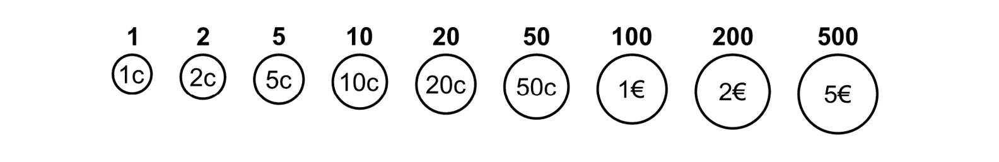
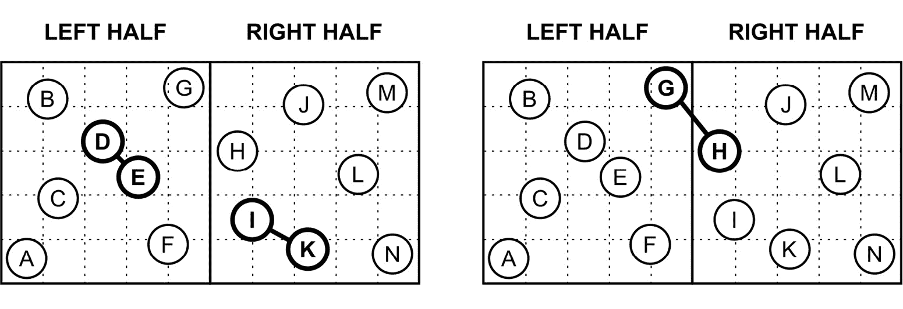
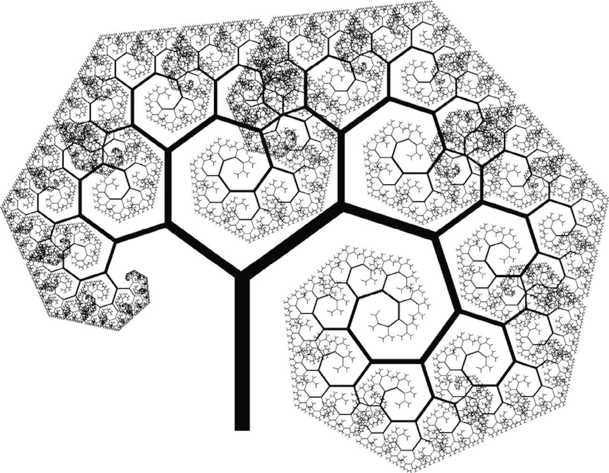
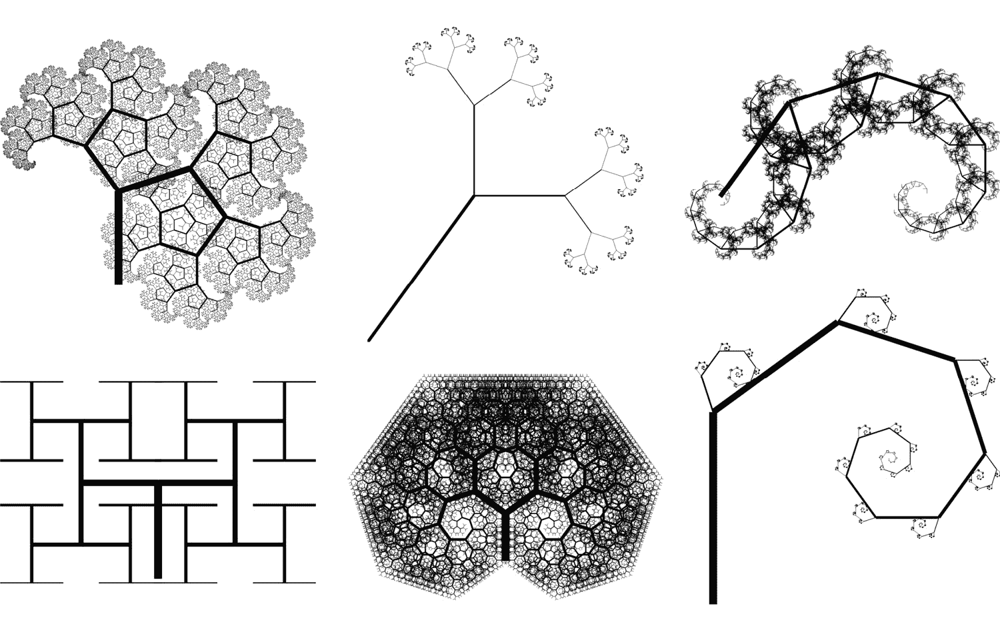
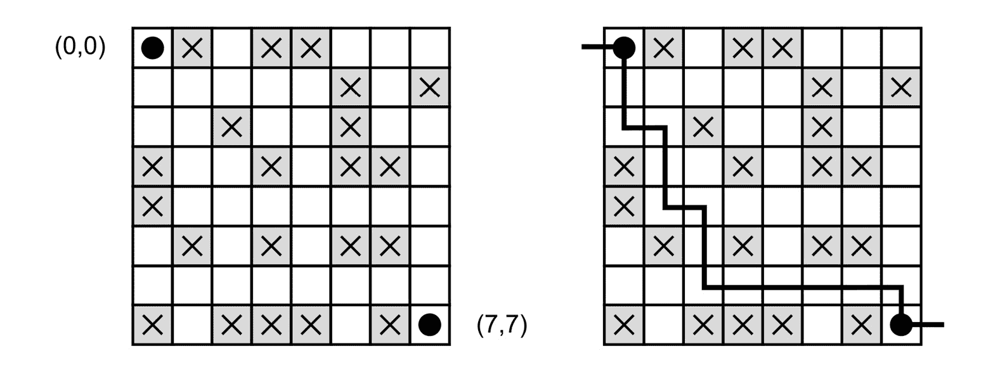
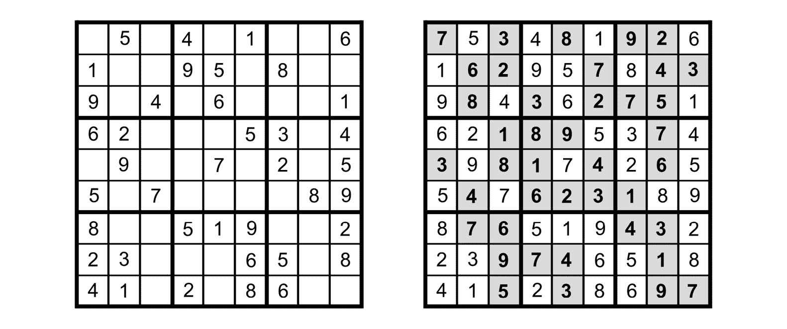

# 第九章：看看实际应用

如你所知，算法几乎无处不在，并且有众多类型和分类。它们由众多数据结构支持，其中一些你在阅读前几章时已经学过。在理论部分之后，现在是时候基于有趣的例子继续实践了。这些例子来自各种类型的算法，总结了你已经了解的许多主题。

首先，你将看到如何通过几种在性能结果上有显著差异的变体来计算斐波那契数列中的给定数，这样你将了解如何优化你的代码。有时，即使是微小的变化也能带来巨大的性能提升。然后，你将学习如何应用贪婪算法来解决**最小硬币找零**问题，以及如何利用分而治之算法来找到位于二维表面上的**最近点对**。你还将看到一个美丽的**分形**以及设计此类图形的代码。以下例子将涉及使用递归回溯法解决谜题的应用，即**迷宫中的老鼠**和**数独**。随着章节接近尾声，你将看到如何根据达尔文的进化论和自然选择规则，应用遗传算法来**猜测这本书的标题**。最后一个例子将是用于**猜测****密码**的暴力算法。

如你所见，前方有许多有趣的例子，所以准备好写很多代码并一起解决这些任务吧！让我们开始！

在本章中，你将涵盖以下主题：

+   斐波那契数列

+   最小硬币找零

+   最近点对

+   分形生成

+   迷宫中的老鼠

+   数独谜题

+   标题猜测

+   密码猜测

# 斐波那契数列

作为第一个例子，让我们看看如何使用以下**递归**函数计算斐波那契数列中的给定数：


图 9.1 – 计算斐波那契数列中一个数的公式

其解释非常简单：

+   *F(0)* 等于 0

+   *F(1)* 等于 1

+   *F(n)* 是 *F(n-1)* 和 *F(n-2)* 的和，这意味着这个数是前两个数的和

例如，*F(2)* 等于 *F(0)* 和 *F(1)* 的和。因此，它等于 1，而 *F(3)* 等于 2。值得注意的是，有两个基本案例，即当 *n* 等于 0 和 1 时。对于这两个，都有一个特定的值定义，即 0 和 1。

C#语言中的**递归**实现如下所示：

```cs
long Fibonacci(int n)
{
    if (n == 0) { return 0; }
    if (n == 1) { return 1; }
    return Fibonacci(n - 1) + Fibonacci(n - 2);
}
```

如你所见，`Fibonacci`方法以不同的参数值调用自身两次，即比传递给方法的`n`参数小 1 和 2。如果你传递`25`给这个方法，你将得到 75025 作为结果，如下所示：

```cs
long result = Fibonacci(25);
```

请记住，所提供的斐波那契函数值的递归版本非常低效，对于较大的输入数字将会非常慢。

您可以使用**动态规划**来显著提高其性能，无论是自顶向下还是自底向上的方法。首先，让我们使用带有**记忆化**的**自顶向下方法**来**缓存子问题的计算结果**：

```cs
Dictionary<int, long> cache = [];
long Fibonacci(int n)
{
    if (n == 0) { return 0; }
    if (n == 1) { return 1; }
    if (cache.ContainsKey(n)) { return cache[n]; }
    long result = Fibonacci(n - 1) + Fibonacci(n - 2);
    cache[n] = result;
    return result;
}
```

您使用`Dictionary`类作为缓存，其中键是传递给`Fibonacci`方法的`n`的值，值是计算结果，即`Fibonacci(n)`。在方法内部，您检查缓存是否包含等于`n`的键。如果是这样，您就不执行进一步的操作，而是简单地从缓存中返回值。如果缓存还没有这样的键，您就使用与递归版本相同的方法，并在返回结果之前将计算结果添加到缓存中。

引入这样的改变值得吗？让我们看看关于斐波那契数列第 50 个数的执行时间的几个数字。在基本的递归版本中，在我的机器上需要超过 88 秒。引入自顶向下方法导致的结果与...不到 1 毫秒的结果相同。这个解决方案几乎快了 100,000 倍！

现在您已经知道动态规划可以带来巨大的差异，让我们看看斐波那契数计算的**自底向上方法**：

```cs
long Fibonacci(int n)
{
    if (n == 0) { return 0; }
    if (n == 1) { return 1; }
    long a = 0;
    long b = 1;
    for (int i = 2; i <= n; i++)
    {
        long result = a + b;
        a = b;
        b = result;
    }
    return b;
}
```

在这里，引入了更大的修改，因为您用迭代代替了递归。然而，代码非常简单，因为它只包含一个从 2 迭代到给定数字的`for`循环，并计算前两个值的和。当然，对于`n`参数的 0 和 1 值，有单独的`if`条件。

那么在这种情况下性能如何？让我们比较使用自顶向下和自底向上方法计算斐波那契数列的第 5,000 个数。自顶向下方法大约需要 2 毫秒，而自底向上在我的笔记本电脑上仍然不到 1 毫秒。记住，我们现在讨论的是斐波那契数列的第 5,000 个数，而之前的测试只是针对第 50 个数。性能提升令人难以置信，不是吗？

结果可能会有所不同

性能结果是在我的电脑上获得的，并且以非常简单的方式计算，甚至不需要重复多次。当然，在其他情况下，例如在使用您的机器时，这些结果可能会有所不同。然而，展示一些趋势，而不是精确的毫秒级结果至关重要。这种性能测试旨在向您展示基本递归版本和任何具有动态规划的优化版本之间的巨大差异。

在第一个例子之后，让我们继续解决最小硬币兑换问题。

# 最小硬币兑换

本章中展示的第二个例子是一个 **贪婪算法**，用于解决 **最小硬币找零** 问题，即找到获取指定输入金额所需的最少硬币数量。



图 9.2 – 欧元货币面额的示意图

例如，对于由 1、2、5、10、20、50、100、200 和 500 面额组成的硬币系统，如果你想获取 158 的金额，你需要选择 5 枚硬币，即 100、50、5、2 和 1。贪婪算法非常简单，因为你只需 **选择不大于剩余金额的最大面额**。你执行此操作，直到剩余金额等于 0。正如你所见，该算法不考虑整体解决方案，而是试图在每一步选择最佳解决方案。

这里展示了基于 C#的实现：

```cs
int[] den = [1, 2, 5, 10, 20, 50, 100, 200, 500];
List<int> coins = GetCoins(158);
coins.ForEach(Console.WriteLine);
List<int> GetCoins(int amount)
{
    List<int> coins = [];
    for (int i = den.Length - 1; i >= 0; i--)
    {
        while (amount >= den[i])
        {
            amount -= den[i];
            coins.Add(den[i]);
        }
    }
    return coins;
}
```

最重要的是 `GetCoins` 方法所扮演的角色，它接受一个输入，即要获取的金额。它返回所选硬币的列表。例如，如果你调用此方法并传入 158，你将在控制台看到 100、50、5、2 和 1。

这只是一个快速示例！现在，让我们继续探讨一些更复杂的内容。

# 最近点对

另一个例子是寻找位于二维表面上的 **最近点对** 的算法。这是一个有趣的算法问题，可以使用 **分而治之** 的范式来解决。

每个点由 *x* 和 *y* 坐标表示，值从表面的左上角（**0**, **0**）开始。为了找到最近的点对，你首先根据 *x* 坐标对所有点进行排序，如下面的图所示，标记为 **A** 到 **N**：



图 9.3 – 寻找最近点对算法的示意图

然后，你将表面分成两半。你可以通过计算点数的一半来实现这一点，在我们的例子中是 7，然后取前 7 个点作为左半部分，接下来的 7 个点作为右半部分。

这是一个关于 **递归** 的任务，所以你递归地找到两半中的最近点，并将数据存储为 *r*l（点 **D** 和 **E**）和 *r*r（点 **I** 和 **K**）。你通过比较这些距离来选择较近的点对，并将结果存储为 *r*，即在我们的例子中是点 **D** 和 **E**。

那不是全部——你还需要检查左半部分和右半部分点之间的距离，如图所示，在右侧。为此，你得到一个包含所有点的数据的数组，这些点相对于中间点（仅就 x 坐标而言）比已找到的点对（**D**和**E**在我们的例子中）的*r*距离更近。然后，你在这个数组中找到最近的点对（例子中的**G**和**H**）。让我们称这个结果为*s*。为了完成任务，选择*r*（**D**和**E**）和*s*（**G**和**H**）中哪个更近。然后，只需返回结果（在我们的情况下是**D**和**E**）。

代码最重要的部分如下所示：

```cs
Result? FindClosestPair(Point[] points)
{
    if (points.Length <= 1) { return null; }
    if (points.Length <= 3) { return Closest(points); }
    int m = points.Length / 2;
    Result r = Closer(
        FindClosestPair(points.Take(m).ToArray())!,
        FindClosestPair(points.Skip(m).ToArray())!);
    Point[] strip = points.Where(p => Math.Abs(p.X
        - points[m].X) < r.Distance).ToArray();
    return Closer(r, Closest(strip));
}
```

首先，有一个基本条件，当点数组为空或只包含一个元素时终止执行。然后，你检查数组中点的数量是否小于或等于 3。如果是这样，你只需通过检查所有可能的变体来选择集合中的最近点对。否则，你选择中间点的索引，并递归地对左右两半部分调用该方法。然后，你从两半部分获取足够接近中间点的点，只考虑*x*坐标。接下来，你计算`strip`数组中所有点之间的距离，以从其中获取最近的点对。最后，你只需返回最近的点对。

如你所见，算法的主要部分实现和理解都非常简单。那么，让我们谈谈其余的部分，从`Point`定义开始：

```cs
public record Point(int X, int Y)
{
    public float GetDistanceTo(Point p) =>
        (float)Math.Sqrt(Math.Pow(X - p.X, 2)
            + Math.Pow(Y - p.Y, 2));
};
```

`Result`记录如下所示：

```cs
public record Closest and Closer. The first one searches for the closest pair of points, and its code is shown here:

```

Result Closest(Point[] points)

{

Result result = new(points[0], points[0], double.MaxValue);

for (int i = 0; i < points.Length; i++)

{

for (int j = i + 1; j < points.Length; j++)

{

double distance = points[i].GetDistanceTo(points[j]);

if (distance < result.Distance)

{

result = new(points[i], points[j], distance);

}

}

}

return result;

}

```cs

 The `Closer` method is presented in the following code snippet:

```

Result Closer(Result r1, Result r2) =>

r1.Distance < r2.Distance ? r1 : r2;

```cs

 Finally, let’s take a look at a way of calling the described method:

```

List<Point> points =

[

new Point(6, 45),   // A

new Point(12, 8),   // B

new Point(14, 31),  // C

new Point(24, 18),  // D

new Point(32, 26),  // E

new Point(40, 41),  // F

new Point(44, 6),   // G

new Point(57, 20),  // H

new Point(60, 35),  // I

new Point(72, 9),   // J

new Point(73, 41),  // K

new Point(85, 25),  // L

new Point(92, 8),   // M

new Point(93, 43)   // N

];

points.Sort((a, b) => a.X.CompareTo(b.X));

Result? closestPair = FindClosestPair(points.ToArray());

if (closestPair != null)

{

Console.WriteLine(

"Closest pair: ({0}, {1}) and ({2}, {3})

with distance: {4:F2}",

closestPair.P1.X,

closestPair.P1.Y,

closestPair.P2.X,

closestPair.P2.Y,

closestPair.Distance);

}

```cs

 You provide the collection of points, sort them by *x* coordinates, and call the `FindClosestPair` method, passing the whole array as a parameter. Finally, you show the following result in the console:

```

Closest pair: (24, 18) and (32, 26) with distance: 11.31

```cs

 So, you get the same result as received when you analyzed the example at the beginning of this section. Good work – congratulations!
Where can you find more information?
The examples shown in this chapter are representatives of various popular algorithmic problems, which you can receive even during interviews while recruiting for a job as a developer. These topics are also popular on the internet. For example, you can find more information about the aforementioned approach to the *closest pair of points* problem and its implementation at [`www.geeksforgeeks.org/closest-pair-of-points-using-divide-and-conquer-algorithm/`](https://www.geeksforgeeks.org/closest-pair-of-points-using-divide-and-conquer-algorithm/). As *GeeksForGeeks* contains a huge number of various articles, you can also find entries there about some other problems mentioned in this chapter, together with some implementations, such as about the rat in a maze problem at [`www.geeksforgeeks.org/rat-in-a-maze/`](https://www.geeksforgeeks.org/rat-in-a-maze/) and about the Sudoku puzzle at [`www.geeksforgeeks.org/sudoku-backtracking-7`](https://www.geeksforgeeks.org/sudoku-backtracking-7)/.
In my opinion, coding can be understood as a kind of art. Similar to painters who paint beautiful paintings, developers can write beautiful code. So, while we are talking about art, let’s write beautiful code that will paint beautiful fractals!
Fractal generation
The **recursion** can be applied to many various algorithms, also related to computer graphics. For this reason, let’s take a look at another example – **fractal generation** creating interesting patterns, such as the following:


Figure 9.4 – An exemplary fractal generated using the recursive function
It’s really beautiful, isn’t it? Can you see some tree patterns in this image? If not, let’s follow the bold line in the middle of the image (the tree *trunk*) and note that it is divided into two lines (*branches*), each rotated by a given degree. Then, follow one of these lines and see that it is divided according to the same rule. This process is applied further and further until the specified number of levels is reached.
The description of this recursive algorithm in the natural language is quite easy, so let’s take a look at code to calculate the coordinates of the start and end points of the following lines that together form the beautiful drawing. The code of the `AddLine` method is shown as follows:

```

void AddLine(int level, float x, float y,

float length, float angle)

{

if (level < 0) { return; }

float endX = x + (float)(length * Math.Cos(angle));

float endY = y + (float)(length * Math.Sin(angle));

lines.Add(new(x, y, endX, endY));

AddLine(level - 1, endX, endY, length * 0.8f,

angle + (float)Math.PI * 0.3f);

AddLine(level - 1, endX, endY, length * 0.6f,

angle + (float)Math.PI * 1.7f);

}

```cs

 The method takes a few parameters, namely the following:

*   A level of pattern, starting with the non-negative number and leading to 0
*   The *x* and *y* coordinates of the start point
*   A length of the line
*   Its angle, provided in radians

Within the method, you check the base condition, namely whether the level is smaller than 0\. If not, you calculate *x* and *y* coordinates of the end point and add the line to the collection of lines (`lines`). At the end, you recursively call the `AddLine` method, passing different parameters. You decrease the level, pass the calculated end point coordinates as coordinates of a start point for the next line, decrease the length by 20% and 40% (depending on the branch), and also modify the angle.
It is worth noting that the preceding code uses the `Line` record, the code for which is as follows:

```

record Line(float X1, float Y1, float X2, float Y2)

{

public float GetLength() =>

(float)Math.Sqrt(Math.Pow(X1 - X2, 2)

+ Math.Pow(Y1 - Y2, 2));

}

```cs

 The next part of the code is presented here:

```

using System.Drawing;

using System.Drawing.Drawing2D;

const int maxSize = 1000;

List<Line> lines = [];

maxSize)。然后，你准备一个空的线条列表。在最后一行，你调用 AddLine 方法。你指定将添加 14 级的图案。

需要的 NuGet 包

由于你使用了 `System.Drawing` 和 `System.Drawing.Drawing2D` 命名空间中的元素，因此需要安装一个额外的 NuGet 包，即 `System.Drawing.Common`。

一旦你有了线条集合，你可以计算最小和最大的 *x* 和 *y* 坐标，以及目标 *宽度* 和 *高度*，如下所示：

```cs
float xMin = lines.Min(l => Math.Min(l.X1, l.X2));
float xMax = lines.Max(l => Math.Max(l.X1, l.X2));
float yMin = lines.Min(l => Math.Min(l.Y1, l.Y2));
float yMax = lines.Max(l => Math.Max(l.Y1, l.Y2));
float size = Math.Max(xMax - xMin, yMax - yMin);
float factor = maxSize / size;
int width = (int)((xMax - xMin) * factor);
int height = (int)((yMax - yMin) * factor);
```

代码的剩余部分与在位图中打印分形有关：

```cs
using Bitmap bitmap = new(width, height);
using Graphics graphics = Graphics.FromImage(bitmap);
graphics.Clear(Color.White);
graphics.SmoothingMode = SmoothingMode.AntiAlias;
using Pen pen = new(Color.Black, 1);
foreach (Line line in lines)
{
    pen.Width = line.GetLength() / 20;
    float sx = (line.X1 - xMin) * factor;
    float sy = (line.Y1 - yMin) * factor;
    float ex = (line.X2 - xMin) * factor;
    float ey = (line.Y2 - yMin) * factor;
    graphics.DrawLine(pen, sx, sy, ex, ey);
}
bitmap.Save($"{DateTime.Now:HH-mm-ss}.png");
```

在展示的代码中，你创建了一个具有指定大小的 `Bitmap` 类的新实例，并准备了 `Graphics` 对象来绘制此位图。然后，你用白色绘制整个位图，设置抗锯齿，并指定黑色笔进行绘制。

前面的代码片段涉及 `foreach` 循环。在循环中，你计算线条宽度以及起始和结束坐标。循环中的最后一行简单地绘制线条。最后，你将准备好的位图保存到工作目录中的文件，其名称基于当前时间创建。

你看到警告了吗？

准备的代码在 IDE 中显示了一些警告。它们仅通知你图形相关功能仅在 Windows 平台上可用。你可以在前面的代码之前添加一行 `#pragma warning disable CA1416` 来隐藏此类警告，以及添加一行 `#pragma warning restore CA1416` 来在代码末尾恢复。此外，如果你想在其他平台上绘制图形，可以使用其他可用的 NuGet 包，例如 `SkiaSharp`。我强烈建议你使用 `SkiaSharp` 创建此示例。

那就结束了！你现在可以调整各种参数来绘制美丽的分形，甚至比前面图中的更好。其他一些结果如下所示：



图 9.5 – 使用递归函数生成的示例分形

你在哪里可以找到更多信息？

你可以在互联网上找到很多关于分形的内容。然而，与这里展示的类似的方法，可以在 [`www.csharphelper.com/howtos/howto_curly_tree.html`](http://www.csharphelper.com/howtos/howto_curly_tree.html) 中找到描述。

一旦你对分形的设计满意，让我们进入下一节，在那里你将解决 *迷宫中的老鼠* 智力题。

迷宫中的老鼠

让我们通过解决**老鼠在迷宫中**的问题，使用**回溯算法**继续我们的冒险。图示如下：



图 9.6 – 老鼠在迷宫示例的示意图

让我们想象老鼠位于板上的左上角字段，在先前的图中标记为**（0，0）**，我们需要找到通往出口的路径，出口位于右下角，标记为**（7，7）**。当然，一些方块是禁用的（以灰色显示），老鼠不能通过它们。为了到达目标，老鼠只能通过可用的方块向上、下、左或右移动。

你可以使用**递归**来检查可能的路径，这些路径将老鼠从入口引导到出口。如果当前计算的路径没有到达出口，你将**回溯**并尝试其他变体。

实现的主要部分是`Go`方法，如下所示：

```cs
bool Go(int row, int col)
{
    if (row == size - 1
        && col == size - 1
        && maze[row, col])
    {
        solution[row, col] = true;
        return true;
    }
    if (row >= 0 && row < size
        && col >= 0 && col < size
        && maze[row, col])
    {
        if (solution[row, col]) { return false; }
        solution[row, col] = true;
        if (Go(row + 1, col)) { return true; }
        if (Go(row, col + 1)) { return true; }
        if (Go(row - 1, col)) { return true; }
        if (Go(row, col - 1)) { return true; }
        solution[row, col] = false;
        return false;
    }
    return false;
}
```

该方法接受两个参数，即`row`和`column`。它还使用三个额外的变量。第一个名为`maze`，它是一个二维数组，表示迷宫，其中包含老鼠可用的（用`true`值填充）和不可用的（用`false`值填充）字段。第二个，即`size`，存储迷宫的大小，即行数，这也等于列数。另一个变量（`solution`）与`maze`类似，但它存储当前检查路径的数据。形成解决方案的字段用`true`值填充，而其他字段用`false`值填充。

在方法开始时，你检查老鼠是否已经到达出口。如果是这样，你将最终字段标记为解决方案的一部分，并返回一个值表示老鼠完成了其任务并走出了迷宫。否则，你检查老鼠是否仍然在迷宫内且不在任何不可用的字段上。如果所有这些条件都满足，你检查该字段是否已经是路径的一部分，如果是，你通知这种解决方案是错误的。

如果老鼠在迷宫内且位于尚未访问的可用的字段上，你将此字段标记为解决方案的一部分，并尝试通过调用递归的`Go`方法向下、右、上和左移动。如果这些移动中的任何一个都没有达到目标（当然，在下一步之后），你将当前字段标记为不是解决方案的一部分，这代表**回溯**。然后，你返回一个值表示目标尚未到达。

接下来，看看调用`Go`方法的第一次代码：

```cs
int size = 8;
bool t = true;
bool f = false;
bool[,] maze =
{
    { t, f, t, f, f, t, t, t },
    { t, t, t, t, t, f, t, f },
    { t, t, f, t, t, f, t, t },
    { f, t, t, f, t, f, f, t },
    { f, t, t, t, t, t, t, t },
    { t, f, t, f, t, f, f, t },
    { t, t, t, t, t, t, t, t },
    { f, t, f, f, f, t, f, t }
};
bool[,] solution = new bool[size, size];
Print method:

```

void Print()

{

for (int row = 0; row < size; row++)

{

for (int col = 0; col < size; col++)

{

Console.Write(solution[row, col] ? "x" : "-");

}

Console.WriteLine();

}

}

```cs

 The result is shown here:

```

x-------

x-------

xx------

-x------

-xx-----

--x-----

--xxxxxx

-------x

```cs

 As we conclude this example, it is worth mentioning how the code is simple and short. Thus, you can define the solution to a problem in a clear way. However, keep in mind that if there is more than one path, an algorithm shows only one.
After helping the rat to find a path in a maze, let’s move on to the next example, where you will learn how to automatically solve a Sudoku puzzle.
A Sudoku puzzle
Have you ever solved **Sudoku**? It is a very popular game that requires you to **fill empty cells of a 9x9 board with numbers from 1 to 9**. However, **each row, each column, and each 3x3 box must contain only unique numbers**. An exemplary starting board and a solved one are shown as follows:


Figure 9.7 – An example of non-solved and solved Sudoku puzzles
Now, you will learn how to solve Sudoku not with the usage of a pencil and a piece of paper but with an algorithm! You can perform this task using the **back-tracking** approach, trying to assign numbers to empty cells if, of course, they meet the conditions regarding unique numbers in each row, column, and box. If an entered number does not result in solving the whole puzzle, you assign another number and perform the check again. Let’s take a look at the most important part of the code:

```

bool Solve()

{

(int row, int col) = GetEmpty();

if (row < 0 && col < 0) { return true; }

for (int i = 1; i <= 9; i++)

{

if (IsCorrect(row, col, i))

{

board[row, col] = i;

if (Solve()) { return true; }

else { board[row, col] = 0; }

}

}

return false;

}

```cs

 At the beginning of the `Solve` method, you get coordinates of the first empty cell. If there are no empty cells, the `GetEmpty` method returns (`true`, indicating that the game is solved.
Otherwise, you iterate through all possible numbers (namely from 1 to 9), using the `for` loop. In each iteration, you check whether the number can be correctly entered in this cell, using the `IsCorrect` method, ensuring that the number is unique in a row, a column, and a box. If so, you enter this number into the cell and `Solve` method. If it returns `false`, indicating that this variant does not work, you backtrack by clearing the value entered in the cell, which means that it is empty and another variant needs to be used. If no variants lead to the solution, you return `false`.
The presented code uses two auxiliary methods, including `GetEmpty`, which searches for the first cell that is not already filled. Its code is as follows:

```

(int, int) GetEmpty()

{

for (int r = 0; r < 9; r++)

{

for (int c = 0; c < 9; c++)

{

if (board[r, c] == 0) { return (r, c); }

}

}

return (-1, -1);

}

```cs

 The second auxiliary method is named `IsCorrect` and ensures that after entering a provided number in a given cell (with a specified row and column), the board still meets the criteria of the Sudoku game. Its code is presented here:

```

bool IsCorrect(int row, int col, int num)

{

for (int i = 0; i < 9; i++)

{

if (board[row, i] == num) { return false; }

if (board[i, col] == num) { return false; }

}

int rs = row - row % 3;

int cs = col - col % 3;

for (int r = rs; r < rs + 3; r++)

{

for (int c = cs; c < cs + 3; c++)

{

if (board[r, c] == num) { return false; }

}

}

return true;

}

```cs

 At the beginning, you check whether values are unique in a given row and column. The remaining part checks whether a particular 3x3 box contains only unique numbers.
The exemplary code for launching the Sudoku solving algorithm is as follows:

```

int[,] board = new int[,]

{

{ 0, 5, 0, 4, 0, 1, 0, 0, 6 },

{ 1, 0, 0, 9, 5, 0, 8, 0, 0 },

{ 9, 0, 4, 0, 6, 0, 0, 0, 1 },

{ 6, 2, 0, 0, 0, 5, 3, 0, 4 },

{ 0, 9, 0, 0, 7, 0, 2, 0, 5 },

{ 5, 0, 7, 0, 0, 0, 0, 8, 9 },

{ 8, 0, 0, 5, 1, 9, 0, 0, 2 },

{ 2, 3, 0, 0, 0, 6, 5, 0, 8 },

{ 4, 1, 0, 2, 0, 8, 6, 0, 0 }

};

打印方法：

```cs
void Print()
{
    for (int r = 0; r < 9; r++)
    {
        for (int c = 0; c < 9; c++)
        {
            Console.Write($"{board[r, c]} ");
        }
        Console.WriteLine();
    }
}
```

结果如下所示：

```cs
7 5 3 4 8 1 9 2 6
1 6 2 9 5 7 8 4 3
9 8 4 3 6 2 7 5 1
6 2 1 8 9 5 3 7 4
3 9 8 1 7 4 2 6 5
5 4 7 6 2 3 1 8 9
8 7 6 5 1 9 4 3 2
2 3 9 7 4 6 5 1 8
4 1 5 2 3 8 6 9 7
```

如您所见，回溯算法可以成功应用于解决迷宫中的老鼠和数独问题。您可以通过简短、清晰且易于理解的代码实现这一目标。因此，在这些示例之后，让我们继续到下一节，在那里您将看到遗传算法的一个有趣应用。

标题猜测

是时候将应用算法的类型从一种**启发式**算法转变为一种，这种算法有众多应用和子类型。在这里，我们只关注**遗传算法**，它们是**自适应启发式搜索算法**。它们与达尔文的进化论和自然选择理论相关。根据这一理论，种群中的个体相互竞争，种群会进化以产生更适合生存的下一代。遗传算法在字符串上操作，这些字符串会进化以接收可能的最大**适应度**值，遵守**生存规则**，并基于**随机数据交换**传递最适应父母的基因。算法在达到合适的适应度值或达到最大代数时结束操作。

你可以在哪里找到更多信息？

您可以在互联网上找到大量关于遗传算法的内容，例如在[`link.springer.com/article/10.1007/s11042-020-10139-6`](https://link.springer.com/article/10.1007/s11042-020-10139-6)上发表的文章。本章中展示的遗传算法的简单方法基于[`www.geeksforgeeks.org/genetic-algorithms/`](https://www.geeksforgeeks.org/genetic-algorithms/)上提出的解决方案。

让我们看看一个遗传算法应用的例子，用于猜测这本书的标题。代码的第一部分如下：

```cs
const string Genes = "abcdefghijklmnopqrstuvwxyz
    #ABCDEFGHIJKLMNOPQRSTUVWXYZ ";
const string Target = "C# Data Structures and Algorithms";
Random random = new();
int generationNo = 0;
List<Individual> population = [];
for (int i = 0; i < 1000; i++)
{
    string chromosome = GetRandomChromosome();
    population.Add(new(chromosome,
        GetFitness(chromosome)));
}
```

首先，你创建一个初始种群，包含 1,000 个个体。每个个体都有一个随机的染色体，表示为一个长度等于目标字符串的随机字符串，即书名。让我们进一步了解：

```cs
List<Individual> generation = [];
while (true)
{
    population.Sort((a, b) =>
        b.Fitness.CompareTo(a.Fitness));
    if (population[0].Fitness == Target.Length)
    {
        Print();
        break;
    }
    generation.Clear();
    for (int i = 0; i < 200; i++)
    {
        generation.Add(population[i]);
    }
    for (int i = 0; i < 800; i++)
    {
        Individual p1 = population[random.Next(400)];
        Individual p2 = population[random.Next(400)];
        Individual offspring = Mate(p1, p2);
        generation.Add(offspring);
    }
    population.Clear();
    population.AddRange(generation);
    Print();
    generationNo++;
}
```

最有趣的部分位于无限`while`循环中。在这里，你按照适应度从高到低的顺序对种群进行排序，即生存能力最强的个体排在前面。为了详细解释，当染色体字符串中没有字符与目标字符串中的字符匹配时，适应度等于 0。反过来，当染色体字符串与目标字符串相等时，适应度等于 33（即书名中字符的数量）。因此，如果种群中的第一个元素（即最适应的个体）的适应度等于目标字符串的长度，这意味着找到了解决方案，所以你只需打印出来并退出循环。

否则，你清除新的一代的数据列表，并添加 200 个适应度最高的个体到其中。这意味着**20%的适应度最高的个体会自动进入下一代**。对于新的一代中剩余的 800 个位置，你执行**交叉**并**随机选择父母**，从 40%的适应度最高的个体中，生成新的个体。然后，你用新的一代替换当前种群，并继续下一轮迭代。

值得注意的是`Individual`记录，其代码如下：

```cs
record Chromosome and Fitness. The first stores the string adjusted in the evolution, while the other is the number indicating how this particular individual is fit to survive. Of course, a higher value is better.
The `Mate` method is used to generate a new individual using two parents:

```

Individual Mate(Individual p1, Individual p2)

{

string child = string.Empty;

for (int i = 0; i < Target.Length; i++)

{

float r = random.Next(101) / 100.0f;

if (r < 0.45f) { child += p1.Chromosome[i]; }

else if (r < 0.9f) { child += p2.Chromosome[i]; }

else { child += GetRandomGene(); }

}

return new Individual(child, GetFitness(child));

}

```cs

 The most interesting part of this method is the `for` loop in which the chromosome of the child is created, according to the following rules:

*   **Approximately 45% of genes are taken from the** **first parent**
*   **Approximately 45% of genes are taken from the** **second parent**
*   **The remaining 10%** **are randomized**

And how can you get a random single gene or generate a random whole chromosome? You just take a look at the code:

```

char GetRandomGene() => Genes[random.Next(Genes.Length)];

string GetRandomChromosome()

{

string chromosome = string.Empty;

for (int i = 0; i < Target.Length; i++)

{

chromosome += GetRandomGene();

}

return chromosome;

}

```cs

 The next necessary method is named `GetFitness`, which simply returns the number of characters that matches the target book title. Its code is as follows:

```

int GetFitness(string chromosome)

{

int fitness = 0;

for (int i = 0; i < Target.Length; i++)

{

if (chromosome[i] == Target[i]) { fitness++; }

}

return fitness;

}

```cs

 Finally, let’s take a look at the `Print` method:

```

void Print() => Console.WriteLine(

$"第{generationNo:D2}代：

{population[0].Chromosome} / {population[0].Fitness}");

```cs

 When you run the code, the best-fitted individual from each generation is presented, as shown in the following output:

```

第 00 代：UvWvvtycVTYAsJYxXZpanLkj#rDrmDIEI / 4

第 01 代：sXDGuQQDPnbjpRvWZs evqRNlg#yiwIPL / 5

第 02 代：j#TvvtmKToXuTjxBegpaCLkmNsornzg R / 7

第 03 代：fZCUBIT QrnuzwuWTskTOf bezodQwhmM / 8

第 04 代：CyDwafZZpinLziuPgs yID AevGrGf bs / 9

第 05 代：C# ZaBawSWwLoturSXOcIq wLeSgQOhme / 12 (...)

第 10 代：Sboats ttrDcterus Mnt jmvGrifhms / 17 (...)

第 15 代：C kData ltrCkteres entbAagorZthmD / 21 (...)

第 20 代：C#VDatahStrdcturessanU Al#orithmd / 26 (...)

第 25 代：CZ Data StrunturOs awd Algorithms / 29 (...)

第 30 代：C# Data Structures Qjd Algorithms / 31 (...)

第 35 代：C# Data Structures and Algorothms / 32 (...)

第 37 代：C# 数据结构和算法 / 33

```cs

 Is this *magic*? No, it’s just the algorithm you wrote that manages the following generations and evolves the individuals, giving you the expected result.
A password guess
As an example of a **brute-force algorithm**, let’s create a program to **generate all possible passwords and trying to guess your secret one**, which consists of small letters and digits only. The program starts with passwords of a length equal to 2 and proceeds until 8.
The first part of the code is presented here:

```

using System.Diagnostics;

使用 System.Text;

const string secretPassword = "csharp";

int charsCount = 0;

char[] chars = new char[36];

for (char c = 'a'; c <= 'z'; c++)

{

chars[charsCount++] = c;

}

for (char c = '0'; c <= '9'; c++)

{

chars[charsCount++] = c;

}

```cs

 First, you specify a secret password, which you will try to guess in the remaining part of the code. Then, you create an array with available characters, namely small letters and digits. At the end of this code snippet, the `charsCount` variable stores the number of available characters.
The most interesting part of the code is the `for` loop, where each iteration represents a particular length of a password, between two and eight chars. The code is presented here:

```

for (int length = 2; length <= 8; length++)

{

Stopwatch sw = Stopwatch.StartNew();

int[] indices = new int[length];

for (int i = 0; i < length; i++) { indices[i] = 0; }

bool isCompleted = false;

StringBuilder builder = new();

long count = 0;

while (!isCompleted)

{

builder.Clear();

for (int i = 0; i < length; i++)

{

builder.Append(chars[indices[i]]);

}

string guess = builder.ToString();

if (guess == secretPassword)

{

Console.WriteLine("找到。");

}

count++;

if (count % 10000000 == 0)

{

Console.WriteLine($" > 已检查: {count}.");

}

indices[length - 1]++;

if (indices[length - 1] >= charsCount)

{

for (int i = length - 1; i >= 0; i--)

{

indices[i] = 0;

indices[i - 1]++;

if (indices[i - 1] < charsCount) { break; }

if (i - 1 == 0 && indices[0] >= charsCount)

{

isCompleted = true;

break;

}

}

}

}

sw.Stop();

int seconds = (int)sw.ElapsedMilliseconds / 1000;

Console.ForegroundColor = ConsoleColor.White;

Console.WriteLine($"{length} 个字符: {seconds}s");

Console.ResetColor();

}

```cs

 The `indices` array has a length equal to the value of the `length` variable. Each item stores a current index from the `chars` array, indicating the char that is currently placed on the *i*-th location in the string. In each iteration of the `while` loop, you change values in the `indices` array until all possible combinations of the indices are used.
Furthermore, you save the guessed password in the `guess` variable, and here, it can be either printed on the console or hashed and compared with the hashed password that you want to guess. As this is only a demonstration of a brute-force algorithm, it does not stop its operation when the password is guessed. Thus, you can get more performance results and observe what impact the password length has on the required time for guessing.
As you can see, the brute-force approach is very simple, but what about performance? In the preceding code, you can see the usage of `Stopwatch`, so you can get some results. Generating all possible variants of a password consisting of two chars takes less than 1 millisecond. For three- and four-char passwords, the time is also very small, much less than 100 milliseconds. For five-char passwords, the time goes up to about two seconds, while generating passwords of a length equal to six chars takes almost a minute. If you add a mechanism to hash a password and compare it with the target hash, also taking into account that passwords can also contain capital letters and many other chars, the brute-force algorithm seems to be simply impractical in the case of longer passwords.
It is worth mentioning that the presented performance results were received on my computer and can be different on other devices. They are shown only to indicate a trend that as a password length increases, the time necessary to guess it is significantly longer with each added character. Thus, it is also a useful tip that you should always use a complicated password that contains small and capital letters, digits, and special characters. Of course, the length of the password is also important.
Summary
You just completed the ninth chapter of this book, which examined data structures and algorithms in the context of the C# language. This time, we focused on practical examples of algorithms, with code snippets, detailed descriptions, and also brief indications of which types of algorithms the aforementioned examples belong to.
First, you learned how to implement a simple algorithm to calculate a given number from the **Fibonacci series** in three variants. You saw a simple recursive approach as well as top-down and bottom-up approaches to dynamic programming.
The next example showed the greedy approach to solve the **minimum coin change** problem. It was followed by the divide-and-conquer algorithm to find the **closest pair of points** located on a two-dimensional surface. The fourth example presented a recursive way of **generating fractals** and drawing them on a bitmap.
The following two examples were related to back-tracking algorithms to solve the **rat in a maze** and the **Sudoku** puzzles. These examples used recursion as well.
Another interesting approach involved a genetic algorithm as a subtype of a heuristic algorithm. It was used to **guess the title of the book**, with the rules of the Darwinian theory of evolution and natural selection.
The last example used a brute-force algorithm to **guess a secret password**, by checking all possible variants of passwords. You saw that with the increasing password length, the time necessary to guess it increased significantly.
Now, it is high time to proceed to the overall summary to take a look at all of the data structures that have been presented in the book so far. Let’s turn the page and proceed to the last chapter!

```

```cs

```

```cs

```
